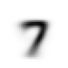
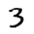
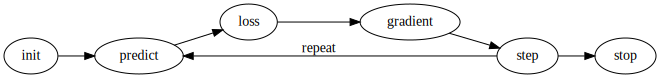
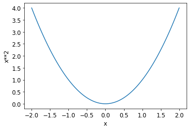
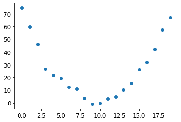
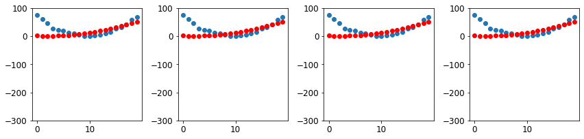
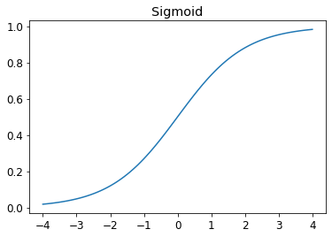
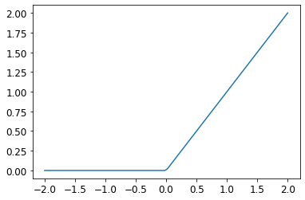

* [Tenacity and Deep Learning](#tenacity-and-deep-learning)
* [The Foundations of Computer Vision](#the-foundations-of-computer-vision)
* [Pixels](#pixels)
* [Pixel Similarity](#pixel-similarity)
* [Computing Metrics Using Broadcasting](#computing-metrics-using-broadcasting)
* [Stochastic Gradient Descent](#stochastic-gradient-descent)
* [The MNIST Loss Function](#the-mnist-loss-function)
* [Putting It All Together](#putting-it-all-together)
* [Adding a Nonlinearity](#adding-a-nonlinearity)
* [References](#references)


## Tenacity and Deep Learning

- Deep learning practitioners need to be tenacious
- Only a handful of researchers kept trying to make neural networks work through the 1990s and 2000s.
    - Yann Lecun, [Yoshua Bengio](https://en.wikipedia.org/wiki/Yoshua_Bengio), and [Geoffrey Hinton](https://en.wikipedia.org/wiki/Geoffrey_Hinton) were not awarded the Turing Award until 2018
- Academic Papers for neural networks were rejected by top journals and conferences, despite showing dramatically better results than anything previously published
- [Jurgen Schmidhuber](https://en.wikipedia.org/wiki/J%C3%BCrgen_Schmidhuber)
    - pioneered many important ideas
    - worked with his student [Sepp Hochreiter](https://en.wikipedia.org/wiki/Sepp_Hochreiter) on the long short-term memory (LSTM) architecture
        - LSTMs are now widely used for speech recognition and other text modelling tasks
- [Paul Werbos](https://en.wikipedia.org/wiki/Paul_Werbos)
    - Invented backpropagation for neural networks in 1974
        - considered the most important foundation of modern AI


## The Foundations of Computer Vision

- [MNIST Database](https://en.wikipedia.org/wiki/MNIST_database)
    - contains images of handwritten digits, collected by the National Institute of Standards and Technology
    - created in 1998
- [LeNet-5](https://en.wikipedia.org/wiki/LeNet)
    - A convolutional neural network structure proposed by [Yann Lecun](https://en.wikipedia.org/wiki/Yann_LeCun) and his colleagues
    - Demonstrated the first practically useful recognition of handwritten digit sequences in 1998
    - One of the most important breakthroughs in the history of AI


## Pixels

### MNIST_SAMPLE

* A sample of the famous [MNIST dataset](http://yann.lecun.com/exdb/mnist/) consisting of handwritten digits.
* contains training data for the digits `3` and `7`
* images are in 1-dimensional grayscale format
* already split into training and validation sets

-----

```python
from fastai.vision.all import *
from fastbook import *

matplotlib.rc('image', cmap='Greys')
```

-----

```python
print(URLs.MNIST_SAMPLE)
path = untar_data(URLs.MNIST_SAMPLE)
print(path)
```

```text
https://s3.amazonaws.com/fast-ai-sample/mnist_sample.tgz
/home/innom-dt/.fastai/data/mnist_sample
```

-----

```python
# Set base path to mnist_sample directory
Path.BASE_PATH = path
```

-----

```python
# A custom fastai method that returns the contents of path as a list
path.ls()
```
```text
(#3) [Path('labels.csv'),Path('train'),Path('valid')]
```


#### fastcore `L` Class

* [https://fastcore.fast.ai/foundation.html#L](https://fastcore.fast.ai/foundation.html#L)
* Behaves like a list of `items` but can also index with list of indices or masks
* Displays the number of items before printing the items


-----

```python
type(path.ls())
```

```text
fastcore.foundation.L
```

-----

```python
(path/'train').ls()
```

```text
(#2) [Path('train/3'),Path('train/7')]
```

-----

```python
threes = (path/'train'/'3').ls().sorted()
sevens = (path/'train'/'7').ls().sorted()
threes
```

```text
(#6131) [Path('train/3/10.png'),Path('train/3/10000.png'),Path('train/3/10011.png'),Path('train/3/10031.png'),Path('train/3/10034.png'),Path('train/3/10042.png'),Path('train/3/10052.png'),Path('train/3/1007.png'),Path('train/3/10074.png'),Path('train/3/10091.png')...]
```

-----

```python
im3_path = threes[1]
print(im3_path)
im3 = Image.open(im3_path)
im3
```
```text
/home/innom-dt/.fastai/data/mnist_sample/train/3/10000.png
```

{fig-align="center"}


### PIL Image Module

* [https://pillow.readthedocs.io/en/stable/reference/Image.html](https://pillow.readthedocs.io/en/stable/reference/Image.html)
* provides a class with the same name which is used to represent a PIL image
* provides a number of factory functions, including functions to load images from files, and to create new images

-----


```python
print(type(im3))
print(im3.size)
```

```text
<class 'PIL.PngImagePlugin.PngImageFile'>
(28, 28)
```

-----

```python
# Slice of the image from index 4 up to, but not including, index 10
array(im3)[4:10,4:10]
```
```text
array([[  0,   0,   0,   0,   0,   0],
       [  0,   0,   0,   0,   0,  29],
       [  0,   0,   0,  48, 166, 224],
       [  0,  93, 244, 249, 253, 187],
       [  0, 107, 253, 253, 230,  48],
       [  0,   3,  20,  20,  15,   0]], dtype=uint8)
```


### NumPy Arrays and PyTorch Tensors

- [NumPy](https://numpy.org/)
    - the most widely used library for scientific and numeric programming in Python
    - does not support using GPUs or calculating gradients
- Python is slow compared to many languages
    - anything fast in Python is likely to be a wrapper for a compiled object written and optimized in another language like [C](https://en.wikipedia.org/wiki/C_(programming_language))
    - NumPy arrays and PyTorch tensors can finish computations many thousands of times than using pure Python
- NumPy array
    - a multidimensional table of data
    - all items are the same type
    - can use any type, including arrays, for the array type
    - simple types are stored as a compact C data structure in memory
- PyTorch tensor
    - nearly identical to NumPy arrays
    - can only use a single basic numeric type for all elements
    - not as flexible as a genuine array of arrays
        - must always be a regularly shaped multi-dimensional rectangular structure
            - cannot be jagged
    - supports using GPUs
    - PyTorch can automatically calculate derivatives of operations performed with tensors
        - impossible to do deep learning without this capability
- perform operations directly on arrays or tensors as much as possible instead of using loops


-----

```python
data = [[1,2,3],[4,5,6]]
arr = array (data)
tns = tensor(data)
```

-----

```python
arr  # numpy
```

```text
array([[1, 2, 3],
       [4, 5, 6]])
```


-----

```python
tns  # pytorch
```

```text
tensor([[1, 2, 3],
        [4, 5, 6]])
```

-----

```python
# select a row
tns[1]
```

```text
tensor([4, 5, 6])
```

-----

```python
# select a column
tns[:,1]
```

```text
tensor([2, 5])
```

-----

```python
# select a slice
tns[1,1:3]
```

```text
tensor([5, 6])
```

-----

```python
# Perform element-wise addition
tns+1
```

```text
tensor([[2, 3, 4],
        [5, 6, 7]])
```


-----

```python
tns.type()
```

```text
'torch.LongTensor'
```

-----

```python
# Perform element-wise multiplication
tns*1.5
```

```text
tensor([[1.5000, 3.0000, 4.5000],
        [6.0000, 7.5000, 9.0000]])
```


### NumPy Array Objects

* [https://numpy.org/doc/stable/reference/arrays.html](https://numpy.org/doc/stable/reference/arrays.html)
* an N-dimensional array type, the ndarray, which describes a collection of “items” of the same type

#### numpy.array function

* [https://numpy.org/doc/stable/reference/generated/numpy.array.html](https://numpy.org/doc/stable/reference/generated/numpy.array.html)
* creates an array

-----

```python
print(type(array(im3)[4:10,4:10]))
array
```

```text
<class 'numpy.ndarray'>
<function numpy.array>
```

-----

```python
print(array(im3)[4:10,4:10][0].data)
print(array(im3)[4:10,4:10][0].dtype)
```

```text
<memory at 0x7f3c13a20dc0>
uint8
```

### PyTorch Tensor

* [https://pytorch.org/docs/stable/tensors.html](https://pytorch.org/docs/stable/tensors.html)
* a multi-dimensional matrix containing elements of a single data type

#### fastai tensor function

* [https://docs.fast.ai/torch_core.html#tensor](https://docs.fast.ai/torch_core.html#tensor)
* Like [torch.as_tensor](https://pytorch.org/docs/stable/generated/torch.as_tensor.html#torch.as_tensor), but handle lists too, and can pass multiple vector elements directly.

-----

```python
print(type(tensor(im3)[4:10,4:10][0]))
tensor
```

```text
<class 'torch.Tensor'>
<function fastai.torch_core.tensor(x, *rest, dtype=None, device=None, requires_grad=False, pin_memory=False)>
```

-----

```python
print(tensor(im3)[4:10,4:10][0].data)
print(tensor(im3)[4:10,4:10][0].dtype)
```

```text
tensor([0, 0, 0, 0, 0, 0], dtype=torch.uint8)
torch.uint8
```

### Pandas DataFrame

* [https://pandas.pydata.org/docs/reference/api/pandas.DataFrame.html](https://pandas.pydata.org/docs/reference/api/pandas.DataFrame.html)
* Two-dimensional, size-mutable, potentially heterogeneous tabular data

-----

```python
# Full Image
pd.DataFrame(tensor(im3))
```
<div style="overflow-x:auto;">
<table style="overflow-x:scroll; width: 600px;" border="1" class="dataframe">
  <thead>
    <tr style="text-align: right;">
      <th></th>
      <th>0</th>
      <th>1</th>
      <th>2</th>
      <th>3</th>
      <th>4</th>
      <th>5</th>
      <th>6</th>
      <th>7</th>
      <th>8</th>
      <th>9</th>
      <th>10</th>
      <th>11</th>
      <th>12</th>
      <th>13</th>
      <th>14</th>
      <th>15</th>
      <th>16</th>
      <th>17</th>
      <th>18</th>
      <th>19</th>
      <th>20</th>
      <th>21</th>
      <th>22</th>
      <th>23</th>
      <th>24</th>
      <th>25</th>
      <th>26</th>
      <th>27</th>
    </tr>
  </thead>
  <tbody>
    <tr>
      <th>0</th>
      <td>0</td>
      <td>0</td>
      <td>0</td>
      <td>0</td>
      <td>0</td>
      <td>0</td>
      <td>0</td>
      <td>0</td>
      <td>0</td>
      <td>0</td>
      <td>0</td>
      <td>0</td>
      <td>0</td>
      <td>0</td>
      <td>0</td>
      <td>0</td>
      <td>0</td>
      <td>0</td>
      <td>0</td>
      <td>0</td>
      <td>0</td>
      <td>0</td>
      <td>0</td>
      <td>0</td>
      <td>0</td>
      <td>0</td>
      <td>0</td>
      <td>0</td>
    </tr>
    <tr>
      <th>1</th>
      <td>0</td>
      <td>0</td>
      <td>0</td>
      <td>0</td>
      <td>0</td>
      <td>0</td>
      <td>0</td>
      <td>0</td>
      <td>0</td>
      <td>0</td>
      <td>0</td>
      <td>0</td>
      <td>0</td>
      <td>0</td>
      <td>0</td>
      <td>0</td>
      <td>0</td>
      <td>0</td>
      <td>0</td>
      <td>0</td>
      <td>0</td>
      <td>0</td>
      <td>0</td>
      <td>0</td>
      <td>0</td>
      <td>0</td>
      <td>0</td>
      <td>0</td>
    </tr>
    <tr>
      <th>2</th>
      <td>0</td>
      <td>0</td>
      <td>0</td>
      <td>0</td>
      <td>0</td>
      <td>0</td>
      <td>0</td>
      <td>0</td>
      <td>0</td>
      <td>0</td>
      <td>0</td>
      <td>0</td>
      <td>0</td>
      <td>0</td>
      <td>0</td>
      <td>0</td>
      <td>0</td>
      <td>0</td>
      <td>0</td>
      <td>0</td>
      <td>0</td>
      <td>0</td>
      <td>0</td>
      <td>0</td>
      <td>0</td>
      <td>0</td>
      <td>0</td>
      <td>0</td>
    </tr>
    <tr>
      <th>3</th>
      <td>0</td>
      <td>0</td>
      <td>0</td>
      <td>0</td>
      <td>0</td>
      <td>0</td>
      <td>0</td>
      <td>0</td>
      <td>0</td>
      <td>0</td>
      <td>0</td>
      <td>0</td>
      <td>0</td>
      <td>0</td>
      <td>0</td>
      <td>0</td>
      <td>0</td>
      <td>0</td>
      <td>0</td>
      <td>0</td>
      <td>0</td>
      <td>0</td>
      <td>0</td>
      <td>0</td>
      <td>0</td>
      <td>0</td>
      <td>0</td>
      <td>0</td>
    </tr>
    <tr>
      <th>4</th>
      <td>0</td>
      <td>0</td>
      <td>0</td>
      <td>0</td>
      <td>0</td>
      <td>0</td>
      <td>0</td>
      <td>0</td>
      <td>0</td>
      <td>0</td>
      <td>0</td>
      <td>0</td>
      <td>0</td>
      <td>0</td>
      <td>0</td>
      <td>0</td>
      <td>0</td>
      <td>0</td>
      <td>0</td>
      <td>0</td>
      <td>0</td>
      <td>0</td>
      <td>0</td>
      <td>0</td>
      <td>0</td>
      <td>0</td>
      <td>0</td>
      <td>0</td>
    </tr>
    <tr>
      <th>5</th>
      <td>0</td>
      <td>0</td>
      <td>0</td>
      <td>0</td>
      <td>0</td>
      <td>0</td>
      <td>0</td>
      <td>0</td>
      <td>0</td>
      <td>29</td>
      <td>150</td>
      <td>195</td>
      <td>254</td>
      <td>255</td>
      <td>254</td>
      <td>176</td>
      <td>193</td>
      <td>150</td>
      <td>96</td>
      <td>0</td>
      <td>0</td>
      <td>0</td>
      <td>0</td>
      <td>0</td>
      <td>0</td>
      <td>0</td>
      <td>0</td>
      <td>0</td>
    </tr>
    <tr>
      <th>6</th>
      <td>0</td>
      <td>0</td>
      <td>0</td>
      <td>0</td>
      <td>0</td>
      <td>0</td>
      <td>0</td>
      <td>48</td>
      <td>166</td>
      <td>224</td>
      <td>253</td>
      <td>253</td>
      <td>234</td>
      <td>196</td>
      <td>253</td>
      <td>253</td>
      <td>253</td>
      <td>253</td>
      <td>233</td>
      <td>0</td>
      <td>0</td>
      <td>0</td>
      <td>0</td>
      <td>0</td>
      <td>0</td>
      <td>0</td>
      <td>0</td>
      <td>0</td>
    </tr>
    <tr>
      <th>7</th>
      <td>0</td>
      <td>0</td>
      <td>0</td>
      <td>0</td>
      <td>0</td>
      <td>93</td>
      <td>244</td>
      <td>249</td>
      <td>253</td>
      <td>187</td>
      <td>46</td>
      <td>10</td>
      <td>8</td>
      <td>4</td>
      <td>10</td>
      <td>194</td>
      <td>253</td>
      <td>253</td>
      <td>233</td>
      <td>0</td>
      <td>0</td>
      <td>0</td>
      <td>0</td>
      <td>0</td>
      <td>0</td>
      <td>0</td>
      <td>0</td>
      <td>0</td>
    </tr>
    <tr>
      <th>8</th>
      <td>0</td>
      <td>0</td>
      <td>0</td>
      <td>0</td>
      <td>0</td>
      <td>107</td>
      <td>253</td>
      <td>253</td>
      <td>230</td>
      <td>48</td>
      <td>0</td>
      <td>0</td>
      <td>0</td>
      <td>0</td>
      <td>0</td>
      <td>192</td>
      <td>253</td>
      <td>253</td>
      <td>156</td>
      <td>0</td>
      <td>0</td>
      <td>0</td>
      <td>0</td>
      <td>0</td>
      <td>0</td>
      <td>0</td>
      <td>0</td>
      <td>0</td>
    </tr>
    <tr>
      <th>9</th>
      <td>0</td>
      <td>0</td>
      <td>0</td>
      <td>0</td>
      <td>0</td>
      <td>3</td>
      <td>20</td>
      <td>20</td>
      <td>15</td>
      <td>0</td>
      <td>0</td>
      <td>0</td>
      <td>0</td>
      <td>0</td>
      <td>43</td>
      <td>224</td>
      <td>253</td>
      <td>245</td>
      <td>74</td>
      <td>0</td>
      <td>0</td>
      <td>0</td>
      <td>0</td>
      <td>0</td>
      <td>0</td>
      <td>0</td>
      <td>0</td>
      <td>0</td>
    </tr>
    <tr>
      <th>10</th>
      <td>0</td>
      <td>0</td>
      <td>0</td>
      <td>0</td>
      <td>0</td>
      <td>0</td>
      <td>0</td>
      <td>0</td>
      <td>0</td>
      <td>0</td>
      <td>0</td>
      <td>0</td>
      <td>0</td>
      <td>0</td>
      <td>249</td>
      <td>253</td>
      <td>245</td>
      <td>126</td>
      <td>0</td>
      <td>0</td>
      <td>0</td>
      <td>0</td>
      <td>0</td>
      <td>0</td>
      <td>0</td>
      <td>0</td>
      <td>0</td>
      <td>0</td>
    </tr>
    <tr>
      <th>11</th>
      <td>0</td>
      <td>0</td>
      <td>0</td>
      <td>0</td>
      <td>0</td>
      <td>0</td>
      <td>0</td>
      <td>0</td>
      <td>0</td>
      <td>0</td>
      <td>0</td>
      <td>14</td>
      <td>101</td>
      <td>223</td>
      <td>253</td>
      <td>248</td>
      <td>124</td>
      <td>0</td>
      <td>0</td>
      <td>0</td>
      <td>0</td>
      <td>0</td>
      <td>0</td>
      <td>0</td>
      <td>0</td>
      <td>0</td>
      <td>0</td>
      <td>0</td>
    </tr>
    <tr>
      <th>12</th>
      <td>0</td>
      <td>0</td>
      <td>0</td>
      <td>0</td>
      <td>0</td>
      <td>0</td>
      <td>0</td>
      <td>0</td>
      <td>0</td>
      <td>11</td>
      <td>166</td>
      <td>239</td>
      <td>253</td>
      <td>253</td>
      <td>253</td>
      <td>187</td>
      <td>30</td>
      <td>0</td>
      <td>0</td>
      <td>0</td>
      <td>0</td>
      <td>0</td>
      <td>0</td>
      <td>0</td>
      <td>0</td>
      <td>0</td>
      <td>0</td>
      <td>0</td>
    </tr>
    <tr>
      <th>13</th>
      <td>0</td>
      <td>0</td>
      <td>0</td>
      <td>0</td>
      <td>0</td>
      <td>0</td>
      <td>0</td>
      <td>0</td>
      <td>0</td>
      <td>16</td>
      <td>248</td>
      <td>250</td>
      <td>253</td>
      <td>253</td>
      <td>253</td>
      <td>253</td>
      <td>232</td>
      <td>213</td>
      <td>111</td>
      <td>2</td>
      <td>0</td>
      <td>0</td>
      <td>0</td>
      <td>0</td>
      <td>0</td>
      <td>0</td>
      <td>0</td>
      <td>0</td>
    </tr>
    <tr>
      <th>14</th>
      <td>0</td>
      <td>0</td>
      <td>0</td>
      <td>0</td>
      <td>0</td>
      <td>0</td>
      <td>0</td>
      <td>0</td>
      <td>0</td>
      <td>0</td>
      <td>0</td>
      <td>43</td>
      <td>98</td>
      <td>98</td>
      <td>208</td>
      <td>253</td>
      <td>253</td>
      <td>253</td>
      <td>253</td>
      <td>187</td>
      <td>22</td>
      <td>0</td>
      <td>0</td>
      <td>0</td>
      <td>0</td>
      <td>0</td>
      <td>0</td>
      <td>0</td>
    </tr>
    <tr>
      <th>15</th>
      <td>0</td>
      <td>0</td>
      <td>0</td>
      <td>0</td>
      <td>0</td>
      <td>0</td>
      <td>0</td>
      <td>0</td>
      <td>0</td>
      <td>0</td>
      <td>0</td>
      <td>0</td>
      <td>0</td>
      <td>0</td>
      <td>9</td>
      <td>51</td>
      <td>119</td>
      <td>253</td>
      <td>253</td>
      <td>253</td>
      <td>76</td>
      <td>0</td>
      <td>0</td>
      <td>0</td>
      <td>0</td>
      <td>0</td>
      <td>0</td>
      <td>0</td>
    </tr>
    <tr>
      <th>16</th>
      <td>0</td>
      <td>0</td>
      <td>0</td>
      <td>0</td>
      <td>0</td>
      <td>0</td>
      <td>0</td>
      <td>0</td>
      <td>0</td>
      <td>0</td>
      <td>0</td>
      <td>0</td>
      <td>0</td>
      <td>0</td>
      <td>0</td>
      <td>0</td>
      <td>1</td>
      <td>183</td>
      <td>253</td>
      <td>253</td>
      <td>139</td>
      <td>0</td>
      <td>0</td>
      <td>0</td>
      <td>0</td>
      <td>0</td>
      <td>0</td>
      <td>0</td>
    </tr>
    <tr>
      <th>17</th>
      <td>0</td>
      <td>0</td>
      <td>0</td>
      <td>0</td>
      <td>0</td>
      <td>0</td>
      <td>0</td>
      <td>0</td>
      <td>0</td>
      <td>0</td>
      <td>0</td>
      <td>0</td>
      <td>0</td>
      <td>0</td>
      <td>0</td>
      <td>0</td>
      <td>0</td>
      <td>182</td>
      <td>253</td>
      <td>253</td>
      <td>104</td>
      <td>0</td>
      <td>0</td>
      <td>0</td>
      <td>0</td>
      <td>0</td>
      <td>0</td>
      <td>0</td>
    </tr>
    <tr>
      <th>18</th>
      <td>0</td>
      <td>0</td>
      <td>0</td>
      <td>0</td>
      <td>0</td>
      <td>0</td>
      <td>0</td>
      <td>0</td>
      <td>0</td>
      <td>0</td>
      <td>0</td>
      <td>0</td>
      <td>0</td>
      <td>0</td>
      <td>0</td>
      <td>0</td>
      <td>85</td>
      <td>249</td>
      <td>253</td>
      <td>253</td>
      <td>36</td>
      <td>0</td>
      <td>0</td>
      <td>0</td>
      <td>0</td>
      <td>0</td>
      <td>0</td>
      <td>0</td>
    </tr>
    <tr>
      <th>19</th>
      <td>0</td>
      <td>0</td>
      <td>0</td>
      <td>0</td>
      <td>0</td>
      <td>0</td>
      <td>0</td>
      <td>0</td>
      <td>0</td>
      <td>0</td>
      <td>0</td>
      <td>0</td>
      <td>0</td>
      <td>0</td>
      <td>0</td>
      <td>60</td>
      <td>214</td>
      <td>253</td>
      <td>253</td>
      <td>173</td>
      <td>11</td>
      <td>0</td>
      <td>0</td>
      <td>0</td>
      <td>0</td>
      <td>0</td>
      <td>0</td>
      <td>0</td>
    </tr>
    <tr>
      <th>20</th>
      <td>0</td>
      <td>0</td>
      <td>0</td>
      <td>0</td>
      <td>0</td>
      <td>0</td>
      <td>0</td>
      <td>0</td>
      <td>0</td>
      <td>0</td>
      <td>0</td>
      <td>0</td>
      <td>0</td>
      <td>0</td>
      <td>98</td>
      <td>247</td>
      <td>253</td>
      <td>253</td>
      <td>226</td>
      <td>9</td>
      <td>0</td>
      <td>0</td>
      <td>0</td>
      <td>0</td>
      <td>0</td>
      <td>0</td>
      <td>0</td>
      <td>0</td>
    </tr>
    <tr>
      <th>21</th>
      <td>0</td>
      <td>0</td>
      <td>0</td>
      <td>0</td>
      <td>0</td>
      <td>0</td>
      <td>0</td>
      <td>0</td>
      <td>0</td>
      <td>0</td>
      <td>0</td>
      <td>0</td>
      <td>42</td>
      <td>150</td>
      <td>252</td>
      <td>253</td>
      <td>253</td>
      <td>233</td>
      <td>53</td>
      <td>0</td>
      <td>0</td>
      <td>0</td>
      <td>0</td>
      <td>0</td>
      <td>0</td>
      <td>0</td>
      <td>0</td>
      <td>0</td>
    </tr>
    <tr>
      <th>22</th>
      <td>0</td>
      <td>0</td>
      <td>0</td>
      <td>0</td>
      <td>0</td>
      <td>0</td>
      <td>42</td>
      <td>115</td>
      <td>42</td>
      <td>60</td>
      <td>115</td>
      <td>159</td>
      <td>240</td>
      <td>253</td>
      <td>253</td>
      <td>250</td>
      <td>175</td>
      <td>25</td>
      <td>0</td>
      <td>0</td>
      <td>0</td>
      <td>0</td>
      <td>0</td>
      <td>0</td>
      <td>0</td>
      <td>0</td>
      <td>0</td>
      <td>0</td>
    </tr>
    <tr>
      <th>23</th>
      <td>0</td>
      <td>0</td>
      <td>0</td>
      <td>0</td>
      <td>0</td>
      <td>0</td>
      <td>187</td>
      <td>253</td>
      <td>253</td>
      <td>253</td>
      <td>253</td>
      <td>253</td>
      <td>253</td>
      <td>253</td>
      <td>197</td>
      <td>86</td>
      <td>0</td>
      <td>0</td>
      <td>0</td>
      <td>0</td>
      <td>0</td>
      <td>0</td>
      <td>0</td>
      <td>0</td>
      <td>0</td>
      <td>0</td>
      <td>0</td>
      <td>0</td>
    </tr>
    <tr>
      <th>24</th>
      <td>0</td>
      <td>0</td>
      <td>0</td>
      <td>0</td>
      <td>0</td>
      <td>0</td>
      <td>103</td>
      <td>253</td>
      <td>253</td>
      <td>253</td>
      <td>253</td>
      <td>253</td>
      <td>232</td>
      <td>67</td>
      <td>1</td>
      <td>0</td>
      <td>0</td>
      <td>0</td>
      <td>0</td>
      <td>0</td>
      <td>0</td>
      <td>0</td>
      <td>0</td>
      <td>0</td>
      <td>0</td>
      <td>0</td>
      <td>0</td>
      <td>0</td>
    </tr>
    <tr>
      <th>25</th>
      <td>0</td>
      <td>0</td>
      <td>0</td>
      <td>0</td>
      <td>0</td>
      <td>0</td>
      <td>0</td>
      <td>0</td>
      <td>0</td>
      <td>0</td>
      <td>0</td>
      <td>0</td>
      <td>0</td>
      <td>0</td>
      <td>0</td>
      <td>0</td>
      <td>0</td>
      <td>0</td>
      <td>0</td>
      <td>0</td>
      <td>0</td>
      <td>0</td>
      <td>0</td>
      <td>0</td>
      <td>0</td>
      <td>0</td>
      <td>0</td>
      <td>0</td>
    </tr>
    <tr>
      <th>26</th>
      <td>0</td>
      <td>0</td>
      <td>0</td>
      <td>0</td>
      <td>0</td>
      <td>0</td>
      <td>0</td>
      <td>0</td>
      <td>0</td>
      <td>0</td>
      <td>0</td>
      <td>0</td>
      <td>0</td>
      <td>0</td>
      <td>0</td>
      <td>0</td>
      <td>0</td>
      <td>0</td>
      <td>0</td>
      <td>0</td>
      <td>0</td>
      <td>0</td>
      <td>0</td>
      <td>0</td>
      <td>0</td>
      <td>0</td>
      <td>0</td>
      <td>0</td>
    </tr>
    <tr>
      <th>27</th>
      <td>0</td>
      <td>0</td>
      <td>0</td>
      <td>0</td>
      <td>0</td>
      <td>0</td>
      <td>0</td>
      <td>0</td>
      <td>0</td>
      <td>0</td>
      <td>0</td>
      <td>0</td>
      <td>0</td>
      <td>0</td>
      <td>0</td>
      <td>0</td>
      <td>0</td>
      <td>0</td>
      <td>0</td>
      <td>0</td>
      <td>0</td>
      <td>0</td>
      <td>0</td>
      <td>0</td>
      <td>0</td>
      <td>0</td>
      <td>0</td>
      <td>0</td>
    </tr>
  </tbody>
</table>
</div>

-----

```python
tensor(im3).shape
```

```text
torch.Size([28, 28])
```

-----

```python
im3_t = tensor(im3)
# Create a pandas DataFrame from image slice
df = pd.DataFrame(im3_t[4:15,4:22])
# Set defined CSS-properties to each ``<td>`` HTML element within the given subset.
# Color-code the values using a gradient
df.style.set_properties(**{'font-size':'6pt'}).background_gradient('Greys')
```
<div style="overflow-x:auto;">
<table id="T_75288">
  <thead>
    <tr>
      <th class="blank level0" >&nbsp;</th>
      <th id="T_75288_level0_col0" class="col_heading level0 col0" >0</th>
      <th id="T_75288_level0_col1" class="col_heading level0 col1" >1</th>
      <th id="T_75288_level0_col2" class="col_heading level0 col2" >2</th>
      <th id="T_75288_level0_col3" class="col_heading level0 col3" >3</th>
      <th id="T_75288_level0_col4" class="col_heading level0 col4" >4</th>
      <th id="T_75288_level0_col5" class="col_heading level0 col5" >5</th>
      <th id="T_75288_level0_col6" class="col_heading level0 col6" >6</th>
      <th id="T_75288_level0_col7" class="col_heading level0 col7" >7</th>
      <th id="T_75288_level0_col8" class="col_heading level0 col8" >8</th>
      <th id="T_75288_level0_col9" class="col_heading level0 col9" >9</th>
      <th id="T_75288_level0_col10" class="col_heading level0 col10" >10</th>
      <th id="T_75288_level0_col11" class="col_heading level0 col11" >11</th>
      <th id="T_75288_level0_col12" class="col_heading level0 col12" >12</th>
      <th id="T_75288_level0_col13" class="col_heading level0 col13" >13</th>
      <th id="T_75288_level0_col14" class="col_heading level0 col14" >14</th>
      <th id="T_75288_level0_col15" class="col_heading level0 col15" >15</th>
      <th id="T_75288_level0_col16" class="col_heading level0 col16" >16</th>
      <th id="T_75288_level0_col17" class="col_heading level0 col17" >17</th>
    </tr>
  </thead>
  <tbody>
    <tr>
      <th id="T_75288_level0_row0" class="row_heading level0 row0" >0</th>
      <td id="T_75288_row0_col0" class="data row0 col0" >0</td>
      <td id="T_75288_row0_col1" class="data row0 col1" >0</td>
      <td id="T_75288_row0_col2" class="data row0 col2" >0</td>
      <td id="T_75288_row0_col3" class="data row0 col3" >0</td>
      <td id="T_75288_row0_col4" class="data row0 col4" >0</td>
      <td id="T_75288_row0_col5" class="data row0 col5" >0</td>
      <td id="T_75288_row0_col6" class="data row0 col6" >0</td>
      <td id="T_75288_row0_col7" class="data row0 col7" >0</td>
      <td id="T_75288_row0_col8" class="data row0 col8" >0</td>
      <td id="T_75288_row0_col9" class="data row0 col9" >0</td>
      <td id="T_75288_row0_col10" class="data row0 col10" >0</td>
      <td id="T_75288_row0_col11" class="data row0 col11" >0</td>
      <td id="T_75288_row0_col12" class="data row0 col12" >0</td>
      <td id="T_75288_row0_col13" class="data row0 col13" >0</td>
      <td id="T_75288_row0_col14" class="data row0 col14" >0</td>
      <td id="T_75288_row0_col15" class="data row0 col15" >0</td>
      <td id="T_75288_row0_col16" class="data row0 col16" >0</td>
      <td id="T_75288_row0_col17" class="data row0 col17" >0</td>
    </tr>
    <tr>
      <th id="T_75288_level0_row1" class="row_heading level0 row1" >1</th>
      <td id="T_75288_row1_col0" class="data row1 col0" >0</td>
      <td id="T_75288_row1_col1" class="data row1 col1" >0</td>
      <td id="T_75288_row1_col2" class="data row1 col2" >0</td>
      <td id="T_75288_row1_col3" class="data row1 col3" >0</td>
      <td id="T_75288_row1_col4" class="data row1 col4" >0</td>
      <td id="T_75288_row1_col5" class="data row1 col5" >29</td>
      <td id="T_75288_row1_col6" class="data row1 col6" >150</td>
      <td id="T_75288_row1_col7" class="data row1 col7" >195</td>
      <td id="T_75288_row1_col8" class="data row1 col8" >254</td>
      <td id="T_75288_row1_col9" class="data row1 col9" >255</td>
      <td id="T_75288_row1_col10" class="data row1 col10" >254</td>
      <td id="T_75288_row1_col11" class="data row1 col11" >176</td>
      <td id="T_75288_row1_col12" class="data row1 col12" >193</td>
      <td id="T_75288_row1_col13" class="data row1 col13" >150</td>
      <td id="T_75288_row1_col14" class="data row1 col14" >96</td>
      <td id="T_75288_row1_col15" class="data row1 col15" >0</td>
      <td id="T_75288_row1_col16" class="data row1 col16" >0</td>
      <td id="T_75288_row1_col17" class="data row1 col17" >0</td>
    </tr>
    <tr>
      <th id="T_75288_level0_row2" class="row_heading level0 row2" >2</th>
      <td id="T_75288_row2_col0" class="data row2 col0" >0</td>
      <td id="T_75288_row2_col1" class="data row2 col1" >0</td>
      <td id="T_75288_row2_col2" class="data row2 col2" >0</td>
      <td id="T_75288_row2_col3" class="data row2 col3" >48</td>
      <td id="T_75288_row2_col4" class="data row2 col4" >166</td>
      <td id="T_75288_row2_col5" class="data row2 col5" >224</td>
      <td id="T_75288_row2_col6" class="data row2 col6" >253</td>
      <td id="T_75288_row2_col7" class="data row2 col7" >253</td>
      <td id="T_75288_row2_col8" class="data row2 col8" >234</td>
      <td id="T_75288_row2_col9" class="data row2 col9" >196</td>
      <td id="T_75288_row2_col10" class="data row2 col10" >253</td>
      <td id="T_75288_row2_col11" class="data row2 col11" >253</td>
      <td id="T_75288_row2_col12" class="data row2 col12" >253</td>
      <td id="T_75288_row2_col13" class="data row2 col13" >253</td>
      <td id="T_75288_row2_col14" class="data row2 col14" >233</td>
      <td id="T_75288_row2_col15" class="data row2 col15" >0</td>
      <td id="T_75288_row2_col16" class="data row2 col16" >0</td>
      <td id="T_75288_row2_col17" class="data row2 col17" >0</td>
    </tr>
    <tr>
      <th id="T_75288_level0_row3" class="row_heading level0 row3" >3</th>
      <td id="T_75288_row3_col0" class="data row3 col0" >0</td>
      <td id="T_75288_row3_col1" class="data row3 col1" >93</td>
      <td id="T_75288_row3_col2" class="data row3 col2" >244</td>
      <td id="T_75288_row3_col3" class="data row3 col3" >249</td>
      <td id="T_75288_row3_col4" class="data row3 col4" >253</td>
      <td id="T_75288_row3_col5" class="data row3 col5" >187</td>
      <td id="T_75288_row3_col6" class="data row3 col6" >46</td>
      <td id="T_75288_row3_col7" class="data row3 col7" >10</td>
      <td id="T_75288_row3_col8" class="data row3 col8" >8</td>
      <td id="T_75288_row3_col9" class="data row3 col9" >4</td>
      <td id="T_75288_row3_col10" class="data row3 col10" >10</td>
      <td id="T_75288_row3_col11" class="data row3 col11" >194</td>
      <td id="T_75288_row3_col12" class="data row3 col12" >253</td>
      <td id="T_75288_row3_col13" class="data row3 col13" >253</td>
      <td id="T_75288_row3_col14" class="data row3 col14" >233</td>
      <td id="T_75288_row3_col15" class="data row3 col15" >0</td>
      <td id="T_75288_row3_col16" class="data row3 col16" >0</td>
      <td id="T_75288_row3_col17" class="data row3 col17" >0</td>
    </tr>
    <tr>
      <th id="T_75288_level0_row4" class="row_heading level0 row4" >4</th>
      <td id="T_75288_row4_col0" class="data row4 col0" >0</td>
      <td id="T_75288_row4_col1" class="data row4 col1" >107</td>
      <td id="T_75288_row4_col2" class="data row4 col2" >253</td>
      <td id="T_75288_row4_col3" class="data row4 col3" >253</td>
      <td id="T_75288_row4_col4" class="data row4 col4" >230</td>
      <td id="T_75288_row4_col5" class="data row4 col5" >48</td>
      <td id="T_75288_row4_col6" class="data row4 col6" >0</td>
      <td id="T_75288_row4_col7" class="data row4 col7" >0</td>
      <td id="T_75288_row4_col8" class="data row4 col8" >0</td>
      <td id="T_75288_row4_col9" class="data row4 col9" >0</td>
      <td id="T_75288_row4_col10" class="data row4 col10" >0</td>
      <td id="T_75288_row4_col11" class="data row4 col11" >192</td>
      <td id="T_75288_row4_col12" class="data row4 col12" >253</td>
      <td id="T_75288_row4_col13" class="data row4 col13" >253</td>
      <td id="T_75288_row4_col14" class="data row4 col14" >156</td>
      <td id="T_75288_row4_col15" class="data row4 col15" >0</td>
      <td id="T_75288_row4_col16" class="data row4 col16" >0</td>
      <td id="T_75288_row4_col17" class="data row4 col17" >0</td>
    </tr>
    <tr>
      <th id="T_75288_level0_row5" class="row_heading level0 row5" >5</th>
      <td id="T_75288_row5_col0" class="data row5 col0" >0</td>
      <td id="T_75288_row5_col1" class="data row5 col1" >3</td>
      <td id="T_75288_row5_col2" class="data row5 col2" >20</td>
      <td id="T_75288_row5_col3" class="data row5 col3" >20</td>
      <td id="T_75288_row5_col4" class="data row5 col4" >15</td>
      <td id="T_75288_row5_col5" class="data row5 col5" >0</td>
      <td id="T_75288_row5_col6" class="data row5 col6" >0</td>
      <td id="T_75288_row5_col7" class="data row5 col7" >0</td>
      <td id="T_75288_row5_col8" class="data row5 col8" >0</td>
      <td id="T_75288_row5_col9" class="data row5 col9" >0</td>
      <td id="T_75288_row5_col10" class="data row5 col10" >43</td>
      <td id="T_75288_row5_col11" class="data row5 col11" >224</td>
      <td id="T_75288_row5_col12" class="data row5 col12" >253</td>
      <td id="T_75288_row5_col13" class="data row5 col13" >245</td>
      <td id="T_75288_row5_col14" class="data row5 col14" >74</td>
      <td id="T_75288_row5_col15" class="data row5 col15" >0</td>
      <td id="T_75288_row5_col16" class="data row5 col16" >0</td>
      <td id="T_75288_row5_col17" class="data row5 col17" >0</td>
    </tr>
    <tr>
      <th id="T_75288_level0_row6" class="row_heading level0 row6" >6</th>
      <td id="T_75288_row6_col0" class="data row6 col0" >0</td>
      <td id="T_75288_row6_col1" class="data row6 col1" >0</td>
      <td id="T_75288_row6_col2" class="data row6 col2" >0</td>
      <td id="T_75288_row6_col3" class="data row6 col3" >0</td>
      <td id="T_75288_row6_col4" class="data row6 col4" >0</td>
      <td id="T_75288_row6_col5" class="data row6 col5" >0</td>
      <td id="T_75288_row6_col6" class="data row6 col6" >0</td>
      <td id="T_75288_row6_col7" class="data row6 col7" >0</td>
      <td id="T_75288_row6_col8" class="data row6 col8" >0</td>
      <td id="T_75288_row6_col9" class="data row6 col9" >0</td>
      <td id="T_75288_row6_col10" class="data row6 col10" >249</td>
      <td id="T_75288_row6_col11" class="data row6 col11" >253</td>
      <td id="T_75288_row6_col12" class="data row6 col12" >245</td>
      <td id="T_75288_row6_col13" class="data row6 col13" >126</td>
      <td id="T_75288_row6_col14" class="data row6 col14" >0</td>
      <td id="T_75288_row6_col15" class="data row6 col15" >0</td>
      <td id="T_75288_row6_col16" class="data row6 col16" >0</td>
      <td id="T_75288_row6_col17" class="data row6 col17" >0</td>
    </tr>
    <tr>
      <th id="T_75288_level0_row7" class="row_heading level0 row7" >7</th>
      <td id="T_75288_row7_col0" class="data row7 col0" >0</td>
      <td id="T_75288_row7_col1" class="data row7 col1" >0</td>
      <td id="T_75288_row7_col2" class="data row7 col2" >0</td>
      <td id="T_75288_row7_col3" class="data row7 col3" >0</td>
      <td id="T_75288_row7_col4" class="data row7 col4" >0</td>
      <td id="T_75288_row7_col5" class="data row7 col5" >0</td>
      <td id="T_75288_row7_col6" class="data row7 col6" >0</td>
      <td id="T_75288_row7_col7" class="data row7 col7" >14</td>
      <td id="T_75288_row7_col8" class="data row7 col8" >101</td>
      <td id="T_75288_row7_col9" class="data row7 col9" >223</td>
      <td id="T_75288_row7_col10" class="data row7 col10" >253</td>
      <td id="T_75288_row7_col11" class="data row7 col11" >248</td>
      <td id="T_75288_row7_col12" class="data row7 col12" >124</td>
      <td id="T_75288_row7_col13" class="data row7 col13" >0</td>
      <td id="T_75288_row7_col14" class="data row7 col14" >0</td>
      <td id="T_75288_row7_col15" class="data row7 col15" >0</td>
      <td id="T_75288_row7_col16" class="data row7 col16" >0</td>
      <td id="T_75288_row7_col17" class="data row7 col17" >0</td>
    </tr>
    <tr>
      <th id="T_75288_level0_row8" class="row_heading level0 row8" >8</th>
      <td id="T_75288_row8_col0" class="data row8 col0" >0</td>
      <td id="T_75288_row8_col1" class="data row8 col1" >0</td>
      <td id="T_75288_row8_col2" class="data row8 col2" >0</td>
      <td id="T_75288_row8_col3" class="data row8 col3" >0</td>
      <td id="T_75288_row8_col4" class="data row8 col4" >0</td>
      <td id="T_75288_row8_col5" class="data row8 col5" >11</td>
      <td id="T_75288_row8_col6" class="data row8 col6" >166</td>
      <td id="T_75288_row8_col7" class="data row8 col7" >239</td>
      <td id="T_75288_row8_col8" class="data row8 col8" >253</td>
      <td id="T_75288_row8_col9" class="data row8 col9" >253</td>
      <td id="T_75288_row8_col10" class="data row8 col10" >253</td>
      <td id="T_75288_row8_col11" class="data row8 col11" >187</td>
      <td id="T_75288_row8_col12" class="data row8 col12" >30</td>
      <td id="T_75288_row8_col13" class="data row8 col13" >0</td>
      <td id="T_75288_row8_col14" class="data row8 col14" >0</td>
      <td id="T_75288_row8_col15" class="data row8 col15" >0</td>
      <td id="T_75288_row8_col16" class="data row8 col16" >0</td>
      <td id="T_75288_row8_col17" class="data row8 col17" >0</td>
    </tr>
    <tr>
      <th id="T_75288_level0_row9" class="row_heading level0 row9" >9</th>
      <td id="T_75288_row9_col0" class="data row9 col0" >0</td>
      <td id="T_75288_row9_col1" class="data row9 col1" >0</td>
      <td id="T_75288_row9_col2" class="data row9 col2" >0</td>
      <td id="T_75288_row9_col3" class="data row9 col3" >0</td>
      <td id="T_75288_row9_col4" class="data row9 col4" >0</td>
      <td id="T_75288_row9_col5" class="data row9 col5" >16</td>
      <td id="T_75288_row9_col6" class="data row9 col6" >248</td>
      <td id="T_75288_row9_col7" class="data row9 col7" >250</td>
      <td id="T_75288_row9_col8" class="data row9 col8" >253</td>
      <td id="T_75288_row9_col9" class="data row9 col9" >253</td>
      <td id="T_75288_row9_col10" class="data row9 col10" >253</td>
      <td id="T_75288_row9_col11" class="data row9 col11" >253</td>
      <td id="T_75288_row9_col12" class="data row9 col12" >232</td>
      <td id="T_75288_row9_col13" class="data row9 col13" >213</td>
      <td id="T_75288_row9_col14" class="data row9 col14" >111</td>
      <td id="T_75288_row9_col15" class="data row9 col15" >2</td>
      <td id="T_75288_row9_col16" class="data row9 col16" >0</td>
      <td id="T_75288_row9_col17" class="data row9 col17" >0</td>
    </tr>
    <tr>
      <th id="T_75288_level0_row10" class="row_heading level0 row10" >10</th>
      <td id="T_75288_row10_col0" class="data row10 col0" >0</td>
      <td id="T_75288_row10_col1" class="data row10 col1" >0</td>
      <td id="T_75288_row10_col2" class="data row10 col2" >0</td>
      <td id="T_75288_row10_col3" class="data row10 col3" >0</td>
      <td id="T_75288_row10_col4" class="data row10 col4" >0</td>
      <td id="T_75288_row10_col5" class="data row10 col5" >0</td>
      <td id="T_75288_row10_col6" class="data row10 col6" >0</td>
      <td id="T_75288_row10_col7" class="data row10 col7" >43</td>
      <td id="T_75288_row10_col8" class="data row10 col8" >98</td>
      <td id="T_75288_row10_col9" class="data row10 col9" >98</td>
      <td id="T_75288_row10_col10" class="data row10 col10" >208</td>
      <td id="T_75288_row10_col11" class="data row10 col11" >253</td>
      <td id="T_75288_row10_col12" class="data row10 col12" >253</td>
      <td id="T_75288_row10_col13" class="data row10 col13" >253</td>
      <td id="T_75288_row10_col14" class="data row10 col14" >253</td>
      <td id="T_75288_row10_col15" class="data row10 col15" >187</td>
      <td id="T_75288_row10_col16" class="data row10 col16" >22</td>
      <td id="T_75288_row10_col17" class="data row10 col17" >0</td>
    </tr>
  </tbody>
</table>
</div>


## Pixel Similarity

- Establish a baseline to compare against your model
    - a simple model that you are confident should perform reasonably well
    - should be simple to implement and easy to test
    - helps indicate whether your super-fancy models are any good

### Method

* Calculate the average values for each pixel location across all images for each digit
    * This will generate a blurry image of the target digit
* Compare the values for each pixel location in a new image to the average

-----

```python
# Store all images of the digit 7 in a list of tensors
seven_tensors = [tensor(Image.open(o)) for o in sevens]
# Store all iamges of the digit 3 in a list of tensors
three_tensors = [tensor(Image.open(o)) for o in threes]
len(three_tensors),len(seven_tensors)
```

```text
(6131, 6265)
```


#### fastai show_image function
* [https://docs.fast.ai/torch_core.html#show_image](https://docs.fast.ai/torch_core.html#show_image)
* Display tensor as an image

-----

```python
show_image(three_tensors[1]);
```

{fig-align="center"}


#### PyTorch Stack Function
* [https://pytorch.org/docs/stable/generated/torch.stack.html](https://pytorch.org/docs/stable/generated/torch.stack.html)
* Concatenates a sequence of tensors along a new dimension

-----

```python
# Stack all images for each digit into a single tensor
# and scale pixel values from the range [0,255] to [0,1]
stacked_sevens = torch.stack(seven_tensors).float()/255
stacked_threes = torch.stack(three_tensors).float()/255
stacked_threes.shape
```

```text
torch.Size([6131, 28, 28])
```

-----
```python
len(stacked_threes.shape)
```
```text
3
```


-----

```python
stacked_threes.ndim
```

```text
3
```

-----

```python
# Calculate the mean values for each pixel location across all images of the digit 3
mean3 = stacked_threes.mean(0)
show_image(mean3);
```

{fig-align="center"}


-----

```python
# Calculate the mean values for each pixel location across all images of the digit 7
mean7 = stacked_sevens.mean(0)
show_image(mean7);
```

{fig-align="center"}


-----

```python
# Pick a single image to compare to the average
a_3 = stacked_threes[1]
show_image(a_3);
```

{fig-align="center"}

-----

```python
# Calculate the Mean Absolute Error between the single image and the mean pixel values
dist_3_abs = (a_3 - mean3).abs().mean()
# Calculate the Root Mean Squared Error between the single image and the mean pixel values
dist_3_sqr = ((a_3 - mean3)**2).mean().sqrt()
print(f"MAE: {dist_3_abs}")
print(f"RMSE: {dist_3_sqr}")
```

```text
MAE: 0.11143654584884644
RMSE: 0.20208320021629333
```


Khan Academy: [Understanding Square Roots](https://www.khanacademy.org/math/algebra/x2f8bb11595b61c86:rational-exponents-radicals/x2f8bb11595b61c86:radicals/v/understanding-square-roots)

-----

```python
dist_7_abs = (a_3 - mean7).abs().mean()
dist_7_sqr = ((a_3 - mean7)**2).mean().sqrt()
print(f"MAE: {dist_7_abs}")
print(f"RMSE: {dist_7_sqr}")
```

```text
MAE: 0.15861910581588745
RMSE: 0.30210891366004944
```


> **Note:** The error is larger when comparing the image of a `3` to the average pixel values for the digit `7`

#### `torch.nn.functional`
* [https://pytorch.org/docs/stable/nn.functional.html](https://pytorch.org/docs/stable/nn.functional.html)
* Provides access to a variety of functions in PyTorch

-----

```python
F
```

```text
<module 'torch.nn.functional' from '/home/innom-dt/miniconda3/envs/fastbook/lib/python3.9/site-packages/torch/nn/functional.py'>
```


#### PyTorch l1_loss function
* [https://pytorch.org/docs/stable/generated/torch.nn.functional.l1_loss.html#torch.nn.functional.l1_loss](https://pytorch.org/docs/stable/generated/torch.nn.functional.l1_loss.html#torch.nn.functional.l1_loss)
* takes the mean element-wise absolute value difference

#### PyTorch mse_loss function
* [https://pytorch.org/docs/stable/generated/torch.nn.functional.mse_loss.html#torch.nn.functional.mse_loss](https://pytorch.org/docs/stable/generated/torch.nn.functional.mse_loss.html#torch.nn.functional.mse_loss)
* Measures the element-wise mean squared error
* Penalizes bigger mistakes more heavily

-----

```python
# Calculate the Mean Absolute Error aka L1 norm
print(F.l1_loss(a_3.float(),mean7))
# Calculate the Root Mean Squared Error aka L2 norm
print(F.mse_loss(a_3,mean7).sqrt())
```
```text
tensor(0.1586)
tensor(0.3021)
```


## Computing Metrics Using Broadcasting

- broadcasting
    - automatically expanding a tensor with a smaller rank to have the same size one with a larger rank to perform an operation
    - an important capability that makes tensor code much easier to write
    - PyTorch does not allocate additional memory for broadcasting
        - it does not actually create multiple copies of the smaller tensor
    - PyTorch performs broadcast calculations in [C](https://en.wikipedia.org/wiki/C_(programming_language)) on the CPU and [CUDA](https://en.wikipedia.org/wiki/CUDA) on the GPU
        - tens of thousands of times faster than pure Python
        - up to millions of times faster on GPU

-----

```python
# Create tensors for the validation set for the digit 3
# and stack them into a single tensor
valid_3_tens = torch.stack([tensor(Image.open(o)) 
                            for o in (path/'valid'/'3').ls()])
# Scale pixel values from [0,255] to [0,1]
valid_3_tens = valid_3_tens.float()/255

# Create tensors for the validation set for the digit 7
# and stack them into a single tensor
valid_7_tens = torch.stack([tensor(Image.open(o)) 
                            for o in (path/'valid'/'7').ls()])
# Scale pixel values from [0,255] to [0,1]
valid_7_tens = valid_7_tens.float()/255

valid_3_tens.shape,valid_7_tens.shape
```

```text
(torch.Size([1010, 28, 28]), torch.Size([1028, 28, 28]))
```

-----

```python
# Calculate Mean Absolute Error using broadcasting
# Subtraction operation is performed using broadcasting
# Absolute Value operation is performed elementwise
# Mean operation is performed over the values indexed by the height and width axes
def mnist_distance(a,b): return (a-b).abs().mean((-1,-2))
# Calculate MAE for two single images
mnist_distance(a_3, mean3)
```

```text
tensor(0.1114)
```

-----

```python
# Calculate MAE between a single image and a vector of images
valid_3_dist = mnist_distance(valid_3_tens, mean3)
valid_3_dist, valid_3_dist.shape
```
```text
(tensor([0.1422, 0.1230, 0.1055,  ..., 0.1244, 0.1188, 0.1103]),
 torch.Size([1010]))
```


-----

```python
tensor([1,2,3]) + tensor([1,1,1])
```

```text
tensor([2, 3, 4])
```

-----

```python
(valid_3_tens-mean3).shape
```

```text
torch.Size([1010, 28, 28])
```

-----

```python
# Compare the MAE value between the single and the mean values for the digits 3 and 7
def is_3(x): return mnist_distance(x,mean3) < mnist_distance(x,mean7)
```

-----

```python
is_3(a_3), is_3(a_3).float()
```

```text
(tensor(True), tensor(1.))
```

-----

```python
is_3(valid_3_tens)
```

```text
tensor([ True,  True,  True,  ..., False,  True,  True])
```

-----

```python
accuracy_3s =      is_3(valid_3_tens).float() .mean()
accuracy_7s = (1 - is_3(valid_7_tens).float()).mean()

accuracy_3s,accuracy_7s,(accuracy_3s+accuracy_7s)/2
```

```text
(tensor(0.9168), tensor(0.9854), tensor(0.9511))
```


-----

```python
print(f"Correct 3s: {accuracy_3s * valid_3_tens.shape[0]:.0f}")
print(f"Incorrect 3s: {(1 - accuracy_3s) * valid_3_tens.shape[0]:.0f}")
```

```text
Correct 3s: 926
Incorrect 3s: 84
```

-----

```python
print(f"Correct 7s: {accuracy_7s * valid_7_tens.shape[0]:.0f}")
print(f"Incorrect 7s: {(1 - accuracy_7s) * valid_7_tens.shape[0]:.0f}")
```

```text
Correct 7s: 1013
Incorrect 7s: 15
```


## Stochastic Gradient Descent

- the key to having a model that can improve
- need to represent a task such that their are weight assignments that can be evaluated and updated
- Sample function:
    - assign a weight value to each pixel location
    - `X` is the image represented as a vector
        - all of the rows are stacked up end to end into a single long line
    - `W` contains the weights for each pixel

-----

```python
def pr_eight(x,w) = (x*w).sum()
```

-----



-----

```python
def f(x): return x**2
```

#### plot_function
* [https://github.com/fastai/fastbook/blob/e57e3155824c81a54f915edf9505f64d5ccdad84/utils.py#L70](https://github.com/fastai/fastbook/blob/e57e3155824c81a54f915edf9505f64d5ccdad84/utils.py#L70)

-----

```python
plot_function(f, 'x', 'x**2')
```

{fig-align="center"}

-----

```python
plot_function(f, 'x', 'x**2')
plt.scatter(-1.5, f(-1.5), color='red');
```

{fig-align="center"}


### Calculating Gradients

- the gradients tell us how much we need to change each weight to make our model better
    - $\frac{rise}{run} = \frac{the \ change \ in \ value \ of \ the \ function}{the \ change \ in \ the \ value \ of \ the \ parameter}$
- derivative of a function
    - tells you how much a change in its parameters will change its result
    - [Khan Academy: Basic Derivatives](https://www.khanacademy.org/math/differential-calculus/dc-diff-intro)
- when we know how our function will change, we know how to make it smaller
    - the key to machine learning
- PyTorch is able to automatically compute the derivative of nearly any function
- The gradient only tells us the slope of the function
    - it does not indicate exactly how far to adjust the parameters
    - if the slope is large, more adjustments may be required
    - if the slope is small, we may be close to the optimal value

#### Tensor.requires_grad

* [https://pytorch.org/docs/stable/generated/torch.Tensor.requires_grad.html](https://pytorch.org/docs/stable/generated/torch.Tensor.requires_grad.html)
* is `True` if gradients need to be computed for the Tensor
* here gradient refers to the value of a function's derivative at a particular argument value
* The PyTorch API puts the focus onto the argument, not the function

-----

```python
xt = tensor(3.).requires_grad_()
```

-----

```python
yt = f(xt)
yt
```

```text
tensor(9., grad_fn=<PowBackward0>)
```


#### Tensor.grad_fn

* [https://pytorch.org/tutorials/beginner/former_torchies/autograd_tutorial.html#tensors-that-track-history](https://pytorch.org/tutorials/beginner/former_torchies/autograd_tutorial.html#tensors-that-track-history)
* references a function that has created a function

-----

```python
yt.grad_fn
```

```text
<PowBackward0 at 0x7f91e90a6670>
```


#### Tensor.backward()

* [https://pytorch.org/docs/stable/generated/torch.Tensor.backward.html#torch.Tensor.backward](https://pytorch.org/docs/stable/generated/torch.Tensor.backward.html#torch.Tensor.backward)
* Computes the gradient of current tensor w.r.t. graph leaves.
    * uses the chain rule
* backward refers to backpropagation
    * the process of calculating the derivative for each layer

-----

```python
yt.backward()
```

The derivative of `f(x) = x**2` is `2x`, so the derivative at `x=3` is `6`

```python
xt.grad
```

```text
tensor(6.)
```


Derivatives should be `6`, `8`, `20`

```python
xt = tensor([3.,4.,10.]).requires_grad_()
xt
```

```text
tensor([ 3.,  4., 10.], requires_grad=True)
```

-----

```python
def f(x): return (x**2).sum()

yt = f(xt)
yt
```

```text
tensor(125., grad_fn=<SumBackward0>)
```

-----

```python
yt.backward()
xt.grad
```

```text
tensor([ 6.,  8., 20.])
```


### Stepping with a Learning Rate

- nearly all approaches to updating model parameters start with multiplying the gradient by some small number called the learning rate
- Learning rate is often a number between `0.001` and `0.1`
    - could be value
- stepping: adjusting your model parameters
    - size of step is determined by the learning rate
    - picking a learning rate that is too small means more steps are needed to reach the optimal parameter values
    - picking a learning rate that is too big can result in the loss getting worse or bouncing around the same range of values


### An End-to-End SGD Example
- Steps to turn function into classifier
    1. Initialize the weights
        - initialize parameters to random values
    2. For each image, use these weights to predict whether it appears to be a 3 or a 7.
    3. Based on these predictions, calculate how good the model is (it loss)
        - “testing the effectiveness of any current weight assignment in terms of actual performance”
        - need a function that will return a number that is small when performance is good
        - standard convention is to treat a small loss as good and a large loss as bad
    4. Calculate the gradient, which measures for each weight how changing that weight would change the loss
        - use calculus to determine whether to increase or decrease individual weight values
    5. Step (update) the weights based on that calculation
    6. Go back to step 2 and repeat the process
    7. Iterate until you decide to stop the training process
        - until either the model is good enough, the model accuracy starts to decrease or you don’t want to wait any longer


**Scenario:** build a model of how the speed of a rollercoaster changes over time

#### torch.arange()

* [https://pytorch.org/docs/stable/generated/torch.arange.html?highlight=arange#torch.arange](https://pytorch.org/docs/stable/generated/torch.arange.html?highlight=arange#torch.arange)
* Returns a 1-D tensor of size $\left\lceil \frac{\text{end} - \text{start}}{\text{step}} \right\rceil$ with values from the interval `[start, end)` taken with common difference `step` beginning from `start`.

-----

```python
time = torch.arange(0,20).float();
print(time)
```

```text
tensor([ 0.,  1.,  2.,  3.,  4.,  5.,  6.,  7.,  8.,  9., 10., 11., 12., 13., 14., 15., 16., 17., 18., 19.])
```

#### torch.randn()

* [https://pytorch.org/docs/stable/generated/torch.randn.html?highlight=randn#torch.randn](https://pytorch.org/docs/stable/generated/torch.randn.html?highlight=randn#torch.randn)
* Returns a tensor filled with random numbers from a normal distribution with mean 0 and variance 1 (also called the standard normal distribution)

#### matplotlib.pyplot.scatter()

* [https://matplotlib.org/stable/api/_as_gen/matplotlib.pyplot.scatter.html](https://matplotlib.org/stable/api/_as_gen/matplotlib.pyplot.scatter.html)
* A scatter plot of y vs. x with varying marker size and/or color.

-----

```python
# Add some random noise to mimic manually measuring the speed
speed = torch.randn(20)*3 + 0.75*(time-9.5)**2 + 1
plt.scatter(time,speed);
```

{fig-align="center"}


-----

```python
# A quadratic function with trainable parameters
def f(t, params):
    a,b,c = params
    return a*(t**2) + (b*t) + c
```

-----

```python
def mse(preds, targets): return ((preds-targets)**2).mean().sqrt()
```

#### Step 1: Initialize the parameters
```python
# Initialize trainable parameters with random values
# Let PyTorch know that we want to track the gradients
params = torch.randn(3).requires_grad_()
params
```

```text
tensor([-0.7658, -0.7506,  1.3525], requires_grad=True)
```

-----

```python
#hide
orig_params = params.clone()
```

#### Step 2: Calculate the predictions
```python
preds = f(time, params)
print(preds.shape)
preds
```

```text
torch.Size([20])
tensor([ 1.3525e+00, -1.6391e-01, -3.2121e+00, -7.7919e+00, -1.3903e+01, -2.1547e+01, -3.0721e+01, -4.1428e+01, -5.3666e+01, -6.7436e+01, -8.2738e+01, -9.9571e+01, -1.1794e+02, -1.3783e+02,
        -1.5926e+02, -1.8222e+02, -2.0671e+02, -2.3274e+02, -2.6029e+02, -2.8938e+02], grad_fn=<AddBackward0>)
```


-----

```python
def show_preds(preds, ax=None):
    if ax is None: ax=plt.subplots()[1]
    ax.scatter(time, speed)
    ax.scatter(time, to_np(preds), color='red')
    ax.set_ylim(-300,100)
```

-----

```python
show_preds(preds)
```

{fig-align="center"}


#### Step 3: Calculate the loss
* goal is to minimize this value

-----

```python
loss = mse(preds, speed)
loss
```

```text
tensor(160.6979, grad_fn=<SqrtBackward0>)
```


#### Step 4: Calculate the gradients
```python
loss.backward()
params.grad
```

```text
tensor([-165.5151,  -10.6402,   -0.7900])
```

-----

```python
# Set learning rate to 0.00001
lr = 1e-5
```

-----

```python
# Multiply the graients by the learning rate
params.grad * lr
```

```text
tensor([-1.6552e-03, -1.0640e-04, -7.8996e-06])
```

-----

```python
params
```

```text
tensor([-0.7658, -0.7506,  1.3525], requires_grad=True)
```


#### Step 5: Step the weights. 
```python
# Using a learning rate of 0.0001 for larger steps
lr = 1e-4
# Update the parameter values
params.data -= lr * params.grad.data
# Reset the computed gradients
params.grad = None
```

-----

```python
# Test the updated parameter values
preds = f(time,params)
mse(preds, speed)
```
```text
tensor(157.9476, grad_fn=<SqrtBackward0>)
```

-----

```python
show_preds(preds)
```

{fig-align="center"}

-----

```python
def apply_step(params, prn=True):
    preds = f(time, params)
    loss = mse(preds, speed)
    loss.backward()
    params.data -= lr * params.grad.data
    params.grad = None
    if prn: print(loss.item())
    return preds
```

#### Step 6: Repeat the process 
```python
for i in range(10): apply_step(params)
```

```text
157.9476318359375
155.1999969482422
152.45513916015625
149.71319580078125
146.97434997558594
144.23875427246094
141.50660705566406
138.77809143066406
136.05340576171875
133.33282470703125
```

-----

```python
_,axs = plt.subplots(1,4,figsize=(12,3))
for ax in axs: show_preds(apply_step(params, False), ax)
plt.tight_layout()
```

{fig-align="center"}

Many steps later...

```python
_,axs = plt.subplots(1,4,figsize=(12,3))
for ax in axs: show_preds(apply_step(params, False), ax)
plt.tight_layout()
```

{fig-align="center"}


#### Step 7: Stop
* Watch the training and validation losses and our metrics to decide when to stop


### Summarizing Gradient Descent

- Initial model weights can be randomly initialized or from a pretrained model
- Compare the model output with our labeled training data using a loss function
- The loss function returns a number that we want to minimize by improving the model weights
- We change the weights a little bit to make the model slightly better based on gradients calculated using calculus
    - the magnitude of the gradients indicate how big of a step needs to be taken
- Multiply the gradients by a learning rate to control how big of a change to make for each update
- Iterate


## The MNIST Loss Function

- Khan Academy: [Intro to Matrix Multiplication](https://www.youtube.com/watch?v=kT4Mp9EdVqs)
- Accuracy is not useful as a loss function
    - accuracy only changes when prediction changes from a 3 to a 7 or vice versa
    - its derivative is 0 almost everywhere
- need a loss function that gives a slightly better loss when our weights result in slightly better prediction

#### torch.cat()

* [https://pytorch.org/docs/stable/generated/torch.cat.html](https://pytorch.org/docs/stable/generated/torch.cat.html)
* Concatenates a given sequence of tensors in the specified dimension
* All tensor must have the same shape except in the specified dimension

#### Tensor.view()

* [https://pytorch.org/docs/stable/generated/torch.Tensor.view.html#torch.Tensor.view](https://pytorch.org/docs/stable/generated/torch.Tensor.view.html#torch.Tensor.view)
* Returns a new tensor with the same data as the self tensor but of a different shape.

-----

```python
# 1. Concatenate all independent variables into a single tensor
# 2. Flatten each image matrix into a vector
#    -1: auto adjust axis to maintain fit all the data 
train_x = torch.cat([stacked_threes, stacked_sevens]).view(-1, 28*28)
```

-----

```python
train_x.shape
```
```text
torch.Size([12396, 784])
```

-----

```python
# Label 3s as `1` and label 7s as `0`
train_y = tensor([1]*len(threes) + [0]*len(sevens)).unsqueeze(1)
train_y.shape
```
```text
torch.Size([12396, 1])
```

-----

```python
# Combine independent and dependent variables into a dataset
dset = list(zip(train_x,train_y))
x,y = dset[0]
x.shape,y
```
```text
(torch.Size([784]), tensor([1]))
```

-----

```python
valid_x = torch.cat([valid_3_tens, valid_7_tens]).view(-1, 28*28)
valid_y = tensor([1]*len(valid_3_tens) + [0]*len(valid_7_tens)).unsqueeze(1)
valid_dset = list(zip(valid_x,valid_y))
```

-----

```python
# Randomly initialize parameters
def init_params(size, std=1.0): return (torch.randn(size)*std).requires_grad_()
```

-----

```python
# Initialize weight values
weights = init_params((28*28,1))
```

-----

```python
# Initialize bias values
bias = init_params(1)
```

-----

```python
# Calculate a prediction for a single image
(train_x[0]*weights.T).sum() + bias
```
```text
tensor([-6.2330], grad_fn=<AddBackward0>)
```


### Matrix Multiplication
```python
# Matrix multiplication using loops
def mat_mul(m1, m2):
    result = []
    for m1_r in range(len(m1)):
        for m2_r in range(len(m2[0])):
            sum_val = 0
            for c in range(len(m1[0])):
                sum_val += m1[m1_r][c] * m2[c][m2_r]
            result += [sum_val]
    return result
```

-----

```python
# Create copies of the tensors that don't require gradients
train_x_clone = train_x.clone().detach()
weights_clone = weights.clone().detach()
```

-----

```python
%%time
# Matrix multiplication using @ operator
(train_x_clone@weights_clone)[:5]
```

```text
CPU times: user 2.35 ms, sys: 4.15 ms, total: 6.5 ms
Wall time: 5.29 ms

tensor([[ -6.5802],
        [-10.9860],
        [-21.2337],
        [-18.2173],
        [ -1.7079]], device='cuda:0')
```

-----

```python
%%time
# This is why you should avoid using loops
mat_mul(train_x_clone, weights_clone)[:5]
```

```text
CPU times: user 1min 37s, sys: 28 ms, total: 1min 37s
Wall time: 1min 37s

[tensor(-6.5802, device='cuda:0'),
 tensor(-10.9860, device='cuda:0'),
 tensor(-21.2337, device='cuda:0'),
 tensor(-18.2173, device='cuda:0'),
 tensor(-1.7079, device='cuda:0')]
```


-----

```python
# Move tensor copies to GPU
train_x_clone = train_x_clone.to('cuda');
weights_clone = weights_clone.to('cuda');
```

-----

```python
%%time
(train_x_clone@weights_clone)[:5]
```

```text
CPU times: user 2.19 ms, sys: 131 µs, total: 2.32 ms
Wall time: 7.78 ms

tensor([[ -6.5802],
        [-10.9860],
        [-21.2337],
        [-18.2173],
        [ -1.7079]], device='cuda:0')
```

-----

```python
# Over 86,000 times faster on GPU
print(f"{(44.9 * 1e+6) / 522:,.2f}")
```

```text
86,015.33
```

-----

```python
# Define a linear layer
# Matrix-multiply xb and weights and add the bias
def linear1(xb): return xb@weights + bias
preds = linear1(train_x)
preds
```

```text
tensor([[ -6.2330],
        [-10.6388],
        [-20.8865],
        ...,
        [-15.9176],
        [ -1.6866],
        [-11.3568]], grad_fn=<AddBackward0>)
```

-----

```python
# Determine which predictions were correct
corrects = (preds>0.0).float() == train_y
corrects
```

```text
tensor([[False],
        [False],
        [False],
        ...,
        [ True],
        [ True],
        [ True]])
```

-----

```python
# Calculate the current model accuracy
corrects.float().mean().item()
```

```text
0.5379961133003235
```

-----

```python
# Test a small change in the weights
with torch.no_grad():
    weights[0] *= 1.0001
```

-----

```python
preds = linear1(train_x)
((preds>0.0).float() == train_y).float().mean().item()
```

```text
0.5379961133003235
```

-----

```python
trgts  = tensor([1,0,1])
prds   = tensor([0.9, 0.4, 0.2])
```

#### torch.where(condition, x, y)

* [https://pytorch.org/docs/stable/generated/torch.where.html](https://pytorch.org/docs/stable/generated/torch.where.html)
* Return a tensor of elements selected from either `x` or `y`, depending on `condition`

-----

```python
# Measures how distant each prediction is from 1 if it should be one
# and how distant it is from 0 if it should be 0 and take the mean of those distances
# returns a lower number when predictions are more accurate
# Assumes that all predictions are between 0 and 1
def mnist_loss(predictions, targets):
    # return 
    return torch.where(targets==1, 1-predictions, predictions).mean()
```

-----

```python
torch.where(trgts==1, 1-prds, prds)
```

```text
tensor([0.1000, 0.4000, 0.8000])
```

-----

```python
mnist_loss(prds,trgts)
```

```text
tensor(0.4333)
```

-----

```python
mnist_loss(tensor([0.9, 0.4, 0.8]),trgts)
```

```text
tensor(0.2333)
```


### Sigmoid Function

- always returns a value between 0 and 1
- function is a smooth curve only goes up
    - makes it easier for SGD to find meaningful gradients

#### torch.exp(x)

*[ https://pytorch.org/docs/stable/generated/torch.exp.html]( https://pytorch.org/docs/stable/generated/torch.exp.html)
* returns $e^{x}$ where $e$ is [Euler's number](https://en.wikipedia.org/wiki/E_(mathematical_constant)
* $e \approx 2.7183$

-----

```python
print(torch.exp(tensor(1)))
print(torch.exp(tensor(2)))
```

```text
tensor(2.7183)
tensor(7.3891)
```

-----

```python
# Always returns a number between 0 and 1
def sigmoid(x): return 1/(1+torch.exp(-x))
```

-----

```python
plot_function(torch.sigmoid, title='Sigmoid', min=-4, max=4);
```

{fig-align="center"}

-----

```python
def mnist_loss(predictions, targets):
    predictions = predictions.sigmoid()
    return torch.where(targets==1, 1-predictions, predictions).mean()
```


### SGD and Mini-Batches
- calculating the loss for the entire dataset would take a lot of time
    - the full dataset is also unlikely to fit in memory
- calculating the loss for single data item would result in an imprecise and unstable gradient
- we can compromise by calculating the loss for a few data items at a time
- mini-batch: a subset of data items
- batch size: the number of data items in a mini-batch
    - larger batch-size
        - typically results in a more accurate and stable estimate of your dataset’s gradient from the loss function
        - takes longer per mini-batch
        - fewer mini-batches processed per epoch
    - the batch size is limited by the amount of available memory for the CPU or GPU
    - ideal batch-size is context dependent
- accelerators like GPUs  work best when they have lots of work to do at a time
    - typically want to use the largest batch-size that will fit in GPU memory
- typically want to randomly shuffle the contents of mini-batches for each epoch
- DataLoader
    - handles shuffling and mini-batch collation
    - can take any Python collection and turn it into an iterator over many batches
- PyTorch Dataset: a collection that contains tuples of independent and dependent variables

In-Place Operations:

- methods in PyTorch that end in an underscore modify their objects in place

#### PyTorch DataLoader:

* [https://pytorch.org/docs/stable/data.html#torch.utils.data.DataLoader](https://pytorch.org/docs/stable/data.html#torch.utils.data.DataLoader)
* Combines a dataset and a sampler, and provides an iterable over the given dataset.
* supports both map-style and iterable-style datasets with single- or multi-process loading, customizing loading order and optional automatic batching (collation) and memory pinning

#### PyTorch Dataset:

* [https://pytorch.org/docs/stable/data.html#torch.utils.data.Dataset](https://pytorch.org/docs/stable/data.html#torch.utils.data.Dataset)
* an abstract class representing a dataset

#### Map-style datasets:

* implements the `__getitem__()` and `__len__()` protocols, and represents a map from indices/keys to data samples

#### Iterable-style datasets:

* an instance of a subclass of `IterableDataset` that implements the `__iter__()` protocol, and represents an iterable over data samples
* particularly suitable for cases where random reads are expensive or even improbable, and where the batch size depends on the fetched data

#### fastai DataLoader:

* [https://docs.fast.ai/data.load.html#DataLoader](https://docs.fast.ai/data.load.html#DataLoader)
* API compatible with PyTorch DataLoader, with a lot more callbacks and flexibility

-----


```python
DataLoader
```

```text
fastai.data.load.DataLoader
```

-----

```python
# Sample collection 
coll = range(15)
```

```text
range(0, 15)
```

-----

```python
# Sample collection 
coll = range(15)
dl = DataLoader(coll, batch_size=5, shuffle=True)
list(dl)
```

```text
[tensor([ 0,  7,  4,  5, 11]),
 tensor([ 9,  3,  8, 14,  6]),
 tensor([12,  2,  1, 10, 13])]
```

-----

```python
# Sample dataset of independent and dependent variables
ds = L(enumerate(string.ascii_lowercase))
ds
```

```text
(#26) [(0, 'a'),(1, 'b'),(2, 'c'),(3, 'd'),(4, 'e'),(5, 'f'),(6, 'g'),(7, 'h'),(8, 'i'),(9, 'j')...]
```

-----

```python
dl = DataLoader(ds, batch_size=6, shuffle=True)
list(dl)
```

```text
[(tensor([20, 18, 21,  5,  6,  9]), ('u', 's', 'v', 'f', 'g', 'j')),
 (tensor([13, 19, 12, 16, 25,  3]), ('n', 't', 'm', 'q', 'z', 'd')),
 (tensor([15,  1,  0, 24, 10, 23]), ('p', 'b', 'a', 'y', 'k', 'x')),
 (tensor([11, 22,  2,  4, 14, 17]), ('l', 'w', 'c', 'e', 'o', 'r')),
 (tensor([7, 8]), ('h', 'i'))]
```


## Putting It All Together
```python
# Randomly initialize parameters
weights = init_params((28*28,1))
bias = init_params(1)
```

-----

```python
# Create data loader for training dataset
dl = DataLoader(dset, batch_size=256)
```

#### fastcore first():
* [https://fastcore.fast.ai/basics.html#first](https://fastcore.fast.ai/basics.html#first)
* First element of x, optionally filtered by f, or None if missing

-----

```python
first
```

```text
<function fastcore.basics.first(x, f=None, negate=False, **kwargs)>
```

-----

```python
# Get the first mini-batch from the data loader 
xb,yb = first(dl)
xb.shape,yb.shape
```
```text
(torch.Size([256, 784]), torch.Size([256, 1]))
```

-----

```python
# Create data loader for validation dataset
valid_dl = DataLoader(valid_dset, batch_size=256)
```

-----

```python
# Smaller example mini-batch for testing
batch = train_x[:4]
batch.shape
```

```text
torch.Size([4, 784])
```

-----

```python
# Test model smaller mini-batch
preds = linear1(batch)
preds
```

```text
tensor([[ -9.2139],
        [-20.0299],
        [-16.8065],
        [-14.1171]], grad_fn=<AddBackward0>)
```

-----

```python
# Calculate the loss
loss = mnist_loss(preds, train_y[:4])
loss
```

```text
tensor(1.0000, grad_fn=<MeanBackward0>)
```

-----

```python
# Compute the gradients
loss.backward()
weights.grad.shape,weights.grad.mean(),bias.grad
```

```text
(torch.Size([784, 1]), tensor(-3.5910e-06), tensor([-2.5105e-05]))
```

-----

```python
def calc_grad(xb, yb, model):
    preds = model(xb)
    loss = mnist_loss(preds, yb)
    loss.backward()
```

-----

```python
calc_grad(batch, train_y[:4], linear1)
weights.grad.mean(),bias.grad
```

```text
(tensor(-7.1820e-06), tensor([-5.0209e-05]))
```

> **Note:** loss.backward() adds the gradients of loss to any gradients that are currently stored. This means we need to zero the gradients first

-----

```python
calc_grad(batch, train_y[:4], linear1)
weights.grad.mean(),bias.grad
```

```text
(tensor(-1.0773e-05), tensor([-7.5314e-05]))
```

-----

```python
weights.grad.zero_()
bias.grad.zero_();
```

-----

```python
def train_epoch(model, lr, params):
    for xb,yb in dl:
        calc_grad(xb, yb, model)
        for p in params:
            # Assign directly to the data attribute to prevent 
            # PyTorch from taking the gradient of that step
            p.data -= p.grad*lr
            p.grad.zero_()
```

-----

```python
# Calculate accuracy using broadcasting
(preds>0.0).float() == train_y[:4]
```

```text
tensor([[False],
        [False],
        [False],
        [False]])
```

-----

```python
def batch_accuracy(xb, yb):
    preds = xb.sigmoid()
    correct = (preds>0.5) == yb
    return correct.float().mean()
```

-----

```python
batch_accuracy(linear1(batch), train_y[:4])
```

```text
tensor(0.)
```

-----

```python
def validate_epoch(model):
    accs = [batch_accuracy(model(xb), yb) for xb,yb in valid_dl]
    return round(torch.stack(accs).mean().item(), 4)
```

-----

```python
validate_epoch(linear1)
```

```text
0.3407
```

-----

```python
lr = 1.
params = weights,bias
# Train for one epoch
train_epoch(linear1, lr, params)
validate_epoch(linear1)
```

```text
0.6138
```

-----

```python
# Train for twenty epochs
for i in range(20):
    train_epoch(linear1, lr, params)
    print(validate_epoch(linear1), end=' ')
```

```text
0.7358 0.9052 0.9438 0.9575 0.9638 0.9692 0.9726 0.9741 0.975 0.976 0.9765 0.9765 0.9765 0.9779 0.9784 0.9784 0.9784 0.9784 0.9789 0.9784 
```

**Note:** Accuracy improves from 0.7358 to 0.9784


### Creating an Optimizer

Why we need Non-Linear activation functions

- a series of any number of linear layers in a row can be replaced with a single linear layer with different parameters
- adding a non-linear layer between linear layers helps decouple the linear layers from each other so they can learn separate features

#### torch.nn:

* [https://pytorch.org/docs/stable/nn.html](https://pytorch.org/docs/stable/nn.html)
* provides the basic building blocks for building PyTorch models

#### nn.Linear():

* [https://pytorch.org/docs/stable/generated/torch.nn.Linear.html](https://pytorch.org/docs/stable/generated/torch.nn.Linear.html)
* Applies a linear transformation to the incoming data: $y=xA^{T}+b$
* contains both the weights and biases in a single class
* inherits from [nn.Module()](https://pytorch.org/docs/stable/generated/torch.nn.Module.html#torch.nn.Module)

#### nn.Module():

* [https://pytorch.org/docs/stable/generated/torch.nn.Module.html#torch.nn.Module](https://pytorch.org/docs/stable/generated/torch.nn.Module.html#torch.nn.Module)
* Base class for all neural network modules
* any PyTorch models should subclass this class
* modules can contain other modules
* submodules can be assigned as regular attributes

-----

```python
nn.Linear
```

```text
torch.nn.modules.linear.Linear
```

-----

```python
linear_model = nn.Linear(28*28,1)
linear_model
```

```text
Linear(in_features=784, out_features=1, bias=True)
```

#### nn.Parameter():

* [https://pytorch.org/docs/stable/generated/torch.nn.parameter.Parameter.html#torch.nn.parameter.Parameter](https://pytorch.org/docs/stable/generated/torch.nn.parameter.Parameter.html#torch.nn.parameter.Parameter)
* A Tensor sublcass
* A kind of Tensor that is to be considered a module parameter.

-----

```python
w,b = linear_model.parameters()
w.shape,b.shape
```

```text
(torch.Size([1, 784]), torch.Size([1]))
```

-----

```python
print(type(w))
print(type(b))
```

```text
<class 'torch.nn.parameter.Parameter'>
<class 'torch.nn.parameter.Parameter'>
```

-----

```python
b
```

```text
Parameter containing:
tensor([0.0062], requires_grad=True)
```

-----

```python
# Implements the basic optimization steps used earlier for use with a PyTorch Module
class BasicOptim:
    def __init__(self,params,lr): self.params,self.lr = list(params),lr

    def step(self, *args, **kwargs):
        for p in self.params: p.data -= p.grad.data * self.lr

    def zero_grad(self, *args, **kwargs):
        for p in self.params: p.grad = None
```

-----

```python
# PyTorch optimizers need a reference to the target model parameters
opt = BasicOptim(linear_model.parameters(), lr)
```

-----

```python
def train_epoch(model):
    for xb,yb in dl:
        calc_grad(xb, yb, model)
        opt.step()
        opt.zero_grad()
```

-----

```python
validate_epoch(linear_model)
```

```text
0.4673
```

-----

```python
def train_model(model, epochs):
    for i in range(epochs):
        train_epoch(model)
        print(validate_epoch(model), end=' ')
```

-----

```python
train_model(linear_model, 20)
```

```text
0.4932 0.8193 0.8467 0.9155 0.935 0.9477 0.956 0.9629 0.9653 0.9682 0.9697 0.9731 0.9741 0.9751 0.9761 0.9765 0.9775 0.978 0.9785 0.9785 
```

**Note:** The PyTorch version arrives at almost exactly the same accuracy as the hand-crafted version

#### fastai SGD():

* [https://docs.fast.ai/optimizer.html#SGD](https://docs.fast.ai/optimizer.html#SGD)
* An [Optimizer](https://docs.fast.ai/optimizer.html#Optimizer) for SGD with lr and mom and params
* by default does the same thing as BasicOptim

-----

```python
SGD
```

```text
<function fastai.optimizer.SGD(params, lr, mom=0.0, wd=0.0, decouple_wd=True)>
```

-----

```python
linear_model = nn.Linear(28*28,1)
opt = SGD(linear_model.parameters(), lr)
train_model(linear_model, 20)
```

```text
0.4932 0.8135 0.8481 0.916 0.9341 0.9487 0.956 0.9634 0.9653 0.9673 0.9692 0.9717 0.9746 0.9751 0.9756 0.9765 0.9775 0.9775 0.978 0.978 
```

-----

```python
dls = DataLoaders(dl, valid_dl)
```

#### fastai Learner:

* [https://docs.fast.ai/learner.html#Learner](https://docs.fast.ai/learner.html#Learner)
* Group together a model, some data loaders, an optimizer and a loss function to handle training

-----

```python
Learner
```

```text
fastai.learner.Learner
```

-----

```python
learn = Learner(dls, nn.Linear(28*28,1), opt_func=SGD,
                loss_func=mnist_loss, metrics=batch_accuracy)
```

#### fastai Learner.fit:

* [https://docs.fast.ai/learner.html#Learner.fit](https://docs.fast.ai/learner.html#Learner.fit)
* fit a model for a specifed number of epochs using a specified learning rate

-----

```python
lr
```

```text
1.0
```

-----

```python
learn.fit(10, lr=lr)
```
<div style="overflow-x:auto;">
<table border="1" class="dataframe">
  <thead>
    <tr style="text-align: left;">
      <th>epoch</th>
      <th>train_loss</th>
      <th>valid_loss</th>
      <th>batch_accuracy</th>
      <th>time</th>
    </tr>
  </thead>
  <tbody>
    <tr>
      <td>0</td>
      <td>0.635737</td>
      <td>0.503216</td>
      <td>0.495584</td>
      <td>00:00</td>
    </tr>
    <tr>
      <td>1</td>
      <td>0.443481</td>
      <td>0.246651</td>
      <td>0.777723</td>
      <td>00:00</td>
    </tr>
    <tr>
      <td>2</td>
      <td>0.165904</td>
      <td>0.159723</td>
      <td>0.857704</td>
      <td>00:00</td>
    </tr>
    <tr>
      <td>3</td>
      <td>0.074277</td>
      <td>0.099495</td>
      <td>0.918057</td>
      <td>00:00</td>
    </tr>
    <tr>
      <td>4</td>
      <td>0.040486</td>
      <td>0.074255</td>
      <td>0.934740</td>
      <td>00:00</td>
    </tr>
    <tr>
      <td>5</td>
      <td>0.027243</td>
      <td>0.060227</td>
      <td>0.949951</td>
      <td>00:00</td>
    </tr>
    <tr>
      <td>6</td>
      <td>0.021766</td>
      <td>0.051380</td>
      <td>0.956330</td>
      <td>00:00</td>
    </tr>
    <tr>
      <td>7</td>
      <td>0.019304</td>
      <td>0.045439</td>
      <td>0.962709</td>
      <td>00:00</td>
    </tr>
    <tr>
      <td>8</td>
      <td>0.018036</td>
      <td>0.041227</td>
      <td>0.965653</td>
      <td>00:00</td>
    </tr>
    <tr>
      <td>9</td>
      <td>0.017262</td>
      <td>0.038097</td>
      <td>0.968106</td>
      <td>00:00</td>
    </tr>
  </tbody>
</table>
</div>


## Adding a Nonlinearity
```python
def simple_net(xb): 
    # Linear layer    
    res = xb@w1 + b1
    # ReLU activation layer
    res = res.max(tensor(0.0))
    # Linear layer
    res = res@w2 + b2
    return res
```

-----

```python
w1 = init_params((28*28,30))
b1 = init_params(30)
w2 = init_params((30,1))
b2 = init_params(1)
```

#### PyTorch F.relu:

* [https://pytorch.org/docs/stable/generated/torch.nn.functional.relu.html#torch.nn.functional.relu](https://pytorch.org/docs/stable/generated/torch.nn.functional.relu.html#torch.nn.functional.relu)
* Applies the rectified linear unit function element-wise.
* $\text{ReLU}(x) = (x)^+ = \max(0, x)$

-----

```python
F.relu
```

```text
<function torch.nn.functional.relu(input: torch.Tensor, inplace: bool = False) -> torch.Tensor>
```


-----

```python
plot_function(F.relu)
```

{fig-align="center"}

#### nn.Sequential:

* [https://pytorch.org/docs/stable/generated/torch.nn.Sequential.html#torch.nn.Sequential](https://pytorch.org/docs/stable/generated/torch.nn.Sequential.html#torch.nn.Sequential)
* A sequential container.
* Treats the whole container as a single module
* ouputs from the previous layer are fed as input to the next layer in the list

-----

```python
simple_net = nn.Sequential(
    nn.Linear(28*28,30),
    nn.ReLU(),
    nn.Linear(30,1)
)
simple_net
```

```text
Sequential(
  (0): Linear(in_features=784, out_features=30, bias=True)
  (1): ReLU()
  (2): Linear(in_features=30, out_features=1, bias=True)
)
```

-----

```python
learn = Learner(dls, simple_net, opt_func=SGD,
                loss_func=mnist_loss, metrics=batch_accuracy)
```

-----

```python
learn.fit(40, 0.1)
```
<div style="overflow-x:auto;">
<table border="1" class="dataframe">
  <thead>
    <tr style="text-align: left;">
      <th>epoch</th>
      <th>train_loss</th>
      <th>valid_loss</th>
      <th>batch_accuracy</th>
      <th>time</th>
    </tr>
  </thead>
  <tbody>
    <tr>
      <td>0</td>
      <td>0.259396</td>
      <td>0.417702</td>
      <td>0.504416</td>
      <td>00:00</td>
    </tr>
    <tr>
      <td>1</td>
      <td>0.128176</td>
      <td>0.216283</td>
      <td>0.818449</td>
      <td>00:00</td>
    </tr>
    <tr>
      <td>2</td>
      <td>0.073893</td>
      <td>0.111460</td>
      <td>0.920020</td>
      <td>00:00</td>
    </tr>
    <tr>
      <td>3</td>
      <td>0.050328</td>
      <td>0.076076</td>
      <td>0.941119</td>
      <td>00:00</td>
    </tr>
    <tr>
      <td>4</td>
      <td>0.039086</td>
      <td>0.059598</td>
      <td>0.958292</td>
      <td>00:00</td>
    </tr>
    <tr>
      <td>5</td>
      <td>0.033148</td>
      <td>0.050273</td>
      <td>0.964671</td>
      <td>00:00</td>
    </tr>
    <tr>
      <td>6</td>
      <td>0.029618</td>
      <td>0.044374</td>
      <td>0.966634</td>
      <td>00:00</td>
    </tr>
    <tr>
      <td>7</td>
      <td>0.027258</td>
      <td>0.040340</td>
      <td>0.969087</td>
      <td>00:00</td>
    </tr>
    <tr>
      <td>8</td>
      <td>0.025527</td>
      <td>0.037404</td>
      <td>0.969578</td>
      <td>00:00</td>
    </tr>
    <tr>
      <td>9</td>
      <td>0.024172</td>
      <td>0.035167</td>
      <td>0.971541</td>
      <td>00:00</td>
    </tr>
    <tr>
      <td>10</td>
      <td>0.023068</td>
      <td>0.033394</td>
      <td>0.972522</td>
      <td>00:00</td>
    </tr>
    <tr>
      <td>11</td>
      <td>0.022145</td>
      <td>0.031943</td>
      <td>0.973503</td>
      <td>00:00</td>
    </tr>
    <tr>
      <td>12</td>
      <td>0.021360</td>
      <td>0.030726</td>
      <td>0.975466</td>
      <td>00:00</td>
    </tr>
    <tr>
      <td>13</td>
      <td>0.020682</td>
      <td>0.029685</td>
      <td>0.974975</td>
      <td>00:00</td>
    </tr>
    <tr>
      <td>14</td>
      <td>0.020088</td>
      <td>0.028779</td>
      <td>0.975466</td>
      <td>00:00</td>
    </tr>
    <tr>
      <td>15</td>
      <td>0.019563</td>
      <td>0.027983</td>
      <td>0.975957</td>
      <td>00:00</td>
    </tr>
    <tr>
      <td>16</td>
      <td>0.019093</td>
      <td>0.027274</td>
      <td>0.976448</td>
      <td>00:00</td>
    </tr>
    <tr>
      <td>17</td>
      <td>0.018670</td>
      <td>0.026638</td>
      <td>0.977920</td>
      <td>00:00</td>
    </tr>
    <tr>
      <td>18</td>
      <td>0.018285</td>
      <td>0.026064</td>
      <td>0.977920</td>
      <td>00:00</td>
    </tr>
    <tr>
      <td>19</td>
      <td>0.017933</td>
      <td>0.025544</td>
      <td>0.978901</td>
      <td>00:00</td>
    </tr>
    <tr>
      <td>20</td>
      <td>0.017610</td>
      <td>0.025069</td>
      <td>0.979392</td>
      <td>00:00</td>
    </tr>
    <tr>
      <td>21</td>
      <td>0.017310</td>
      <td>0.024635</td>
      <td>0.979392</td>
      <td>00:00</td>
    </tr>
    <tr>
      <td>22</td>
      <td>0.017032</td>
      <td>0.024236</td>
      <td>0.980373</td>
      <td>00:00</td>
    </tr>
    <tr>
      <td>23</td>
      <td>0.016773</td>
      <td>0.023869</td>
      <td>0.980373</td>
      <td>00:00</td>
    </tr>
    <tr>
      <td>24</td>
      <td>0.016531</td>
      <td>0.023529</td>
      <td>0.980864</td>
      <td>00:00</td>
    </tr>
    <tr>
      <td>25</td>
      <td>0.016303</td>
      <td>0.023215</td>
      <td>0.981354</td>
      <td>00:00</td>
    </tr>
    <tr>
      <td>26</td>
      <td>0.016089</td>
      <td>0.022923</td>
      <td>0.981354</td>
      <td>00:00</td>
    </tr>
    <tr>
      <td>27</td>
      <td>0.015887</td>
      <td>0.022652</td>
      <td>0.981354</td>
      <td>00:00</td>
    </tr>
    <tr>
      <td>28</td>
      <td>0.015695</td>
      <td>0.022399</td>
      <td>0.980864</td>
      <td>00:00</td>
    </tr>
    <tr>
      <td>29</td>
      <td>0.015514</td>
      <td>0.022164</td>
      <td>0.981354</td>
      <td>00:00</td>
    </tr>
    <tr>
      <td>30</td>
      <td>0.015342</td>
      <td>0.021944</td>
      <td>0.981354</td>
      <td>00:00</td>
    </tr>
    <tr>
      <td>31</td>
      <td>0.015178</td>
      <td>0.021738</td>
      <td>0.981354</td>
      <td>00:00</td>
    </tr>
    <tr>
      <td>32</td>
      <td>0.015022</td>
      <td>0.021544</td>
      <td>0.981845</td>
      <td>00:00</td>
    </tr>
    <tr>
      <td>33</td>
      <td>0.014873</td>
      <td>0.021363</td>
      <td>0.981845</td>
      <td>00:00</td>
    </tr>
    <tr>
      <td>34</td>
      <td>0.014731</td>
      <td>0.021192</td>
      <td>0.981845</td>
      <td>00:00</td>
    </tr>
    <tr>
      <td>35</td>
      <td>0.014595</td>
      <td>0.021031</td>
      <td>0.982336</td>
      <td>00:00</td>
    </tr>
    <tr>
      <td>36</td>
      <td>0.014464</td>
      <td>0.020879</td>
      <td>0.982826</td>
      <td>00:00</td>
    </tr>
    <tr>
      <td>37</td>
      <td>0.014338</td>
      <td>0.020735</td>
      <td>0.982826</td>
      <td>00:00</td>
    </tr>
    <tr>
      <td>38</td>
      <td>0.014217</td>
      <td>0.020599</td>
      <td>0.982826</td>
      <td>00:00</td>
    </tr>
    <tr>
      <td>39</td>
      <td>0.014101</td>
      <td>0.020470</td>
      <td>0.982336</td>
      <td>00:00</td>
    </tr>
  </tbody>
</table>
</div>


#### matplotlib.pyplot.plot:

* [https://matplotlib.org/stable/api/_as_gen/matplotlib.pyplot.plot.html](https://matplotlib.org/stable/api/_as_gen/matplotlib.pyplot.plot.html)
* Plot y versus x as lines and/or markers

-----

```python
plt.plot
```

```text
<function matplotlib.pyplot.plot(*args, scalex=True, scaley=True, data=None, **kwargs)>
```


#### fastai learner.Recorder:

* [https://docs.fast.ai/learner.html#Recorder](https://docs.fast.ai/learner.html#Recorder)
* Callback that registers statistics (lr, loss and metrics) during training

-----

```python
learn.recorder
```

```text
Recorder
```

-----

```python
Recorder
```

```text
fastai.learner.Recorder
```

#### fastcore L.itemgot():

* [https://fastcore.fast.ai/foundation.html#L.itemgot](https://fastcore.fast.ai/foundation.html#L.itemgot)
* Create new L with item idx of all items

-----

```python
L.itemgot
```

```text
<function fastcore.foundation.L.itemgot(self, *idxs)>
```

-----

```python
plt.plot(L(learn.recorder.values).itemgot(2));
```

{fig-align="center"}


-----

```python
learn.recorder.values[-1][2]
```

```text
0.98233562707901
```


### Going Deeper
- deeper models: models with more layers
- deeper models are more difficult to optimize the more layers
- deeper models require fewer parameters
- we can use smaller matrices with more layers
- we can train the model more quickly using less memory
- typically perform better

-----

```python
dls = ImageDataLoaders.from_folder(path)
learn = cnn_learner(dls, resnet18, pretrained=False,
                    loss_func=F.cross_entropy, metrics=accuracy)
learn.fit_one_cycle(1, 0.1)
```
<div style="overflow-x:auto;">
<table border="1" class="dataframe">
  <thead>
    <tr style="text-align: left;">
      <th>epoch</th>
      <th>train_loss</th>
      <th>valid_loss</th>
      <th>accuracy</th>
      <th>time</th>
    </tr>
  </thead>
  <tbody>
    <tr>
      <td>0</td>
      <td>0.066122</td>
      <td>0.008277</td>
      <td>0.997547</td>
      <td>00:04</td>
    </tr>
  </tbody>
</table>
</div>


-----

```python
learn.model
```

```text
Sequential(
  (0): Sequential(
    (0): Conv2d(3, 64, kernel_size=(7, 7), stride=(2, 2), padding=(3, 3), bias=False)
    (1): BatchNorm2d(64, eps=1e-05, momentum=0.1, affine=True, track_running_stats=True)
    (2): ReLU(inplace=True)
    (3): MaxPool2d(kernel_size=3, stride=2, padding=1, dilation=1, ceil_mode=False)
    (4): Sequential(
      (0): BasicBlock(
        (conv1): Conv2d(64, 64, kernel_size=(3, 3), stride=(1, 1), padding=(1, 1), bias=False)
        (bn1): BatchNorm2d(64, eps=1e-05, momentum=0.1, affine=True, track_running_stats=True)
        (relu): ReLU(inplace=True)
        (conv2): Conv2d(64, 64, kernel_size=(3, 3), stride=(1, 1), padding=(1, 1), bias=False)
        (bn2): BatchNorm2d(64, eps=1e-05, momentum=0.1, affine=True, track_running_stats=True)
      )
      (1): BasicBlock(
        (conv1): Conv2d(64, 64, kernel_size=(3, 3), stride=(1, 1), padding=(1, 1), bias=False)
        (bn1): BatchNorm2d(64, eps=1e-05, momentum=0.1, affine=True, track_running_stats=True)
        (relu): ReLU(inplace=True)
        (conv2): Conv2d(64, 64, kernel_size=(3, 3), stride=(1, 1), padding=(1, 1), bias=False)
        (bn2): BatchNorm2d(64, eps=1e-05, momentum=0.1, affine=True, track_running_stats=True)
      )
    )
    (5): Sequential(
      (0): BasicBlock(
        (conv1): Conv2d(64, 128, kernel_size=(3, 3), stride=(2, 2), padding=(1, 1), bias=False)
        (bn1): BatchNorm2d(128, eps=1e-05, momentum=0.1, affine=True, track_running_stats=True)
        (relu): ReLU(inplace=True)
        (conv2): Conv2d(128, 128, kernel_size=(3, 3), stride=(1, 1), padding=(1, 1), bias=False)
        (bn2): BatchNorm2d(128, eps=1e-05, momentum=0.1, affine=True, track_running_stats=True)
        (downsample): Sequential(
          (0): Conv2d(64, 128, kernel_size=(1, 1), stride=(2, 2), bias=False)
          (1): BatchNorm2d(128, eps=1e-05, momentum=0.1, affine=True, track_running_stats=True)
        )
      )
      (1): BasicBlock(
        (conv1): Conv2d(128, 128, kernel_size=(3, 3), stride=(1, 1), padding=(1, 1), bias=False)
        (bn1): BatchNorm2d(128, eps=1e-05, momentum=0.1, affine=True, track_running_stats=True)
        (relu): ReLU(inplace=True)
        (conv2): Conv2d(128, 128, kernel_size=(3, 3), stride=(1, 1), padding=(1, 1), bias=False)
        (bn2): BatchNorm2d(128, eps=1e-05, momentum=0.1, affine=True, track_running_stats=True)
      )
    )
    (6): Sequential(
      (0): BasicBlock(
        (conv1): Conv2d(128, 256, kernel_size=(3, 3), stride=(2, 2), padding=(1, 1), bias=False)
        (bn1): BatchNorm2d(256, eps=1e-05, momentum=0.1, affine=True, track_running_stats=True)
        (relu): ReLU(inplace=True)
        (conv2): Conv2d(256, 256, kernel_size=(3, 3), stride=(1, 1), padding=(1, 1), bias=False)
        (bn2): BatchNorm2d(256, eps=1e-05, momentum=0.1, affine=True, track_running_stats=True)
        (downsample): Sequential(
          (0): Conv2d(128, 256, kernel_size=(1, 1), stride=(2, 2), bias=False)
          (1): BatchNorm2d(256, eps=1e-05, momentum=0.1, affine=True, track_running_stats=True)
        )
      )
      (1): BasicBlock(
        (conv1): Conv2d(256, 256, kernel_size=(3, 3), stride=(1, 1), padding=(1, 1), bias=False)
        (bn1): BatchNorm2d(256, eps=1e-05, momentum=0.1, affine=True, track_running_stats=True)
        (relu): ReLU(inplace=True)
        (conv2): Conv2d(256, 256, kernel_size=(3, 3), stride=(1, 1), padding=(1, 1), bias=False)
        (bn2): BatchNorm2d(256, eps=1e-05, momentum=0.1, affine=True, track_running_stats=True)
      )
    )
    (7): Sequential(
      (0): BasicBlock(
        (conv1): Conv2d(256, 512, kernel_size=(3, 3), stride=(2, 2), padding=(1, 1), bias=False)
        (bn1): BatchNorm2d(512, eps=1e-05, momentum=0.1, affine=True, track_running_stats=True)
        (relu): ReLU(inplace=True)
        (conv2): Conv2d(512, 512, kernel_size=(3, 3), stride=(1, 1), padding=(1, 1), bias=False)
        (bn2): BatchNorm2d(512, eps=1e-05, momentum=0.1, affine=True, track_running_stats=True)
        (downsample): Sequential(
          (0): Conv2d(256, 512, kernel_size=(1, 1), stride=(2, 2), bias=False)
          (1): BatchNorm2d(512, eps=1e-05, momentum=0.1, affine=True, track_running_stats=True)
        )
      )
      (1): BasicBlock(
        (conv1): Conv2d(512, 512, kernel_size=(3, 3), stride=(1, 1), padding=(1, 1), bias=False)
        (bn1): BatchNorm2d(512, eps=1e-05, momentum=0.1, affine=True, track_running_stats=True)
        (relu): ReLU(inplace=True)
        (conv2): Conv2d(512, 512, kernel_size=(3, 3), stride=(1, 1), padding=(1, 1), bias=False)
        (bn2): BatchNorm2d(512, eps=1e-05, momentum=0.1, affine=True, track_running_stats=True)
      )
    )
  )
  (1): Sequential(
    (0): AdaptiveConcatPool2d(
      (ap): AdaptiveAvgPool2d(output_size=1)
      (mp): AdaptiveMaxPool2d(output_size=1)
    )
    (1): Flatten(full=False)
    (2): BatchNorm1d(1024, eps=1e-05, momentum=0.1, affine=True, track_running_stats=True)
    (3): Dropout(p=0.25, inplace=False)
    (4): Linear(in_features=1024, out_features=512, bias=False)
    (5): ReLU(inplace=True)
    (6): BatchNorm1d(512, eps=1e-05, momentum=0.1, affine=True, track_running_stats=True)
    (7): Dropout(p=0.5, inplace=False)
    (8): Linear(in_features=512, out_features=2, bias=False)
  )
)
```


## Jargon Recap
- neural networks contain two types of numbers
    1. Parameters: numbers that are randomly initialized and optimized
        - define the model
    2. Activations: numbers that are calculated using the parameter values
- tensors
    - regularly-shaped arrays like a matrix
    - have rows and columns
        - called the axes or dimensions
- rank: the number of dimensions of a tensor
    - Rank-0: scalar
    - Rank-1: vector
    - Rank-2: matrix
- a neural network contains a number of linear and non-linear layers
- non-linear layers are referred to as activation layers
- ReLU: a function that sets any negative values to zero
- Mini-batch: a small group of inputs and labels gathered together in two arrays to perform gradient descent
- Forward pass: Applying the model to some input and computing the predictions
- Loss: A value that represents how the model is doing
- Gradient: The derivative of the loss with respect to all model parameters
- Gradient descent: Taking a step in the direction opposite to the gradients to make the model parameters a little bit better
- Learning rate: The size of the step we take when applying SGD to update the parameters of the model


## References

* [Deep Learning for Coders with fastai & PyTorch](https://www.oreilly.com/library/view/deep-learning-for/9781492045519/)
* [The fastai book GitHub Repository](https://github.com/fastai/fastbook)


**Previous:** [Notes on fastai Book Ch. 3](../chapter-3/)

**Next:** [Notes on fastai Book Ch. 5](../chapter-5/)


<!-- Cloudflare Web Analytics --><script defer src='https://static.cloudflareinsights.com/beacon.min.js' data-cf-beacon='{"token": "56b8d2f624604c4891327b3c0d9f6703"}'></script><!-- End Cloudflare Web Analytics -->