* [Overview](#overview)
* [Open Unity Project](#open-unity-project)
* [Add New Asset Files](#add-new-asset-files)
* [Allow Unsafe Code](#allow-unsafe-code)
* [Modify Compute Shader](#modify-compute-shader)
* [Create `ImageClassifierTorch` Script](#create-imageclassifiertorch-script)
* [Modify GUI](#modify-gui)
* [Add `ImageClassifierTorch` Component](#add-imageclassifiertorch-component)
* [Update On Value Changed Events](#update-on-value-changed-events)
* [Summary](#summary)


## Overview

[Part 2](../part-2/) covered creating a dynamic link library ([DLL](https://docs.microsoft.com/en-us/troubleshoot/windows-client/deployment/dynamic-link-library)) file to perform image classification with TorchScript modules using [LibTorch](https://pytorch.org/cppdocs/installing.html). This post covers the required modifications for the Unity project from the fastai-to-unity tutorial to use this DLL.


## Open Unity Project

Open the [Fastai-Unity-Tutorial](../../fastai-to-unity-tutorial/part-1/) project in the Unity Editor. The project is available in the GitHub repository linked below for anyone who did not follow the previous tutorial series.

* **[fastai-to-unity-tutorial GitHub repository](https://github.com/cj-mills/fastai-to-unity-tutorial)**


## Add New Asset Files

First, we'll create a new folder to store the [DLL files](../part-2/#gather-dependencies) from part 2. Create a new folder called `Plugins`, then create a subfolder named `x86_64`.


Copy all the DLL files into the `Assets/Plugins/x86_64` folder. We then need to close and reopen the project for Unity to load the plugin files.


* [Plugins Folder Google Drive](https://drive.google.com/drive/folders/1eH1JdyFkQQRAK8EA0gsTxXtOylWxZ9Nd?usp=sharing)


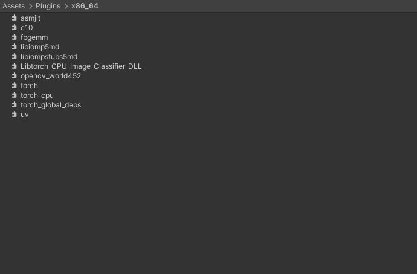


Next, we'll create a folder to store the TorchScript modules. TorchScript modules are not [supported asset types](https://docs.unity3d.com/Manual/AssetTypes.html), so we need to place them in a [StreamingAssets](https://docs.unity3d.com/Manual/StreamingAssets.html) folder. Create a new folder named `StreamingAssets`. We'll put the files in a new subfolder called `TorchScriptModules` to keep things organized.


Add any TorchScript files into the `Assets/StreamingAssets/TorchScriptModules` folder.


* [TorchScriptModules Folder Google Drive](https://drive.google.com/drive/folders/1J6keeA3w22Lk0s-mSHfPcFbSosalCSyL?usp=sharing)


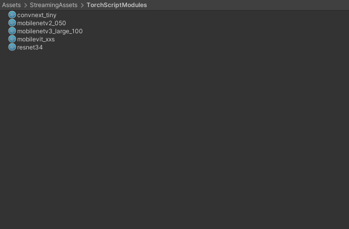


Lastly, we'll store the JSON files with the normalization stats in a new assets folder called `NormalizationStats`.


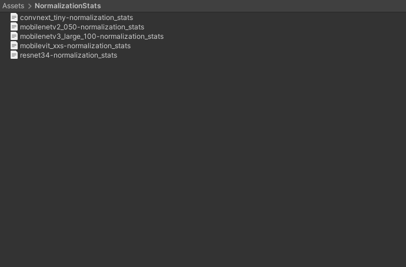


## Allow Unsafe Code

Rather than copying the input image from Unity to the LibTorch plugin, we'll pass a pointer to the pixel data. First, we need to allow unsafe code for the Unity project. Select `Edit → Project Settings...` from the top menu.

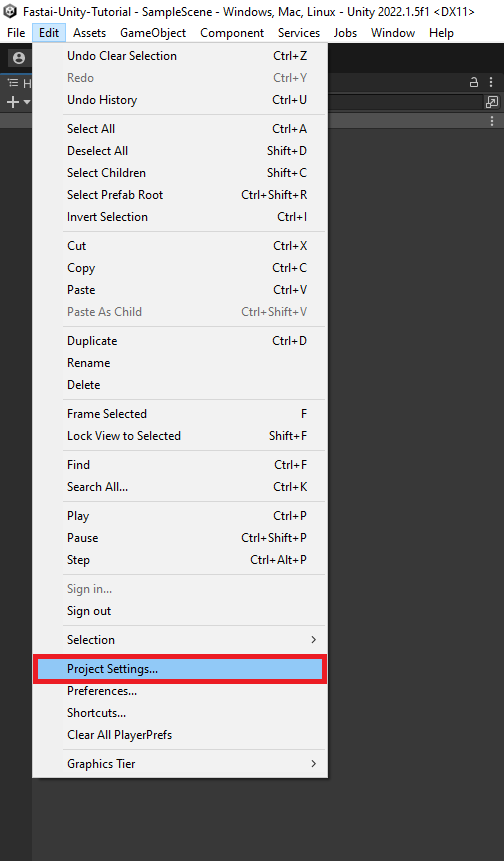


Open the `Player → Other Settings` dropdown and scroll down to the `Allow 'unsafe' Code` checkbox. Enable the setting and close the Project Settings window.


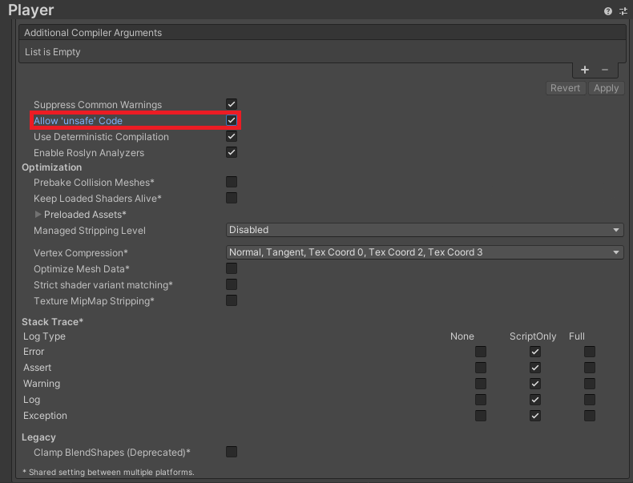


Now we can start modifying the code.


## Modify Compute Shader

The input image gets flipped upside down when we send it to the plugin. We can pre-flip the image in the `ProcessingShader` compute shader before sending it to the plugin. We need to know the height of the input image, which we can access with the [Texture2D::GetDimensions](https://docs.microsoft.com/en-us/windows/win32/direct3dhlsl/sm5-object-texture2d-getdimensions) function.


```c#
// Each #kernel tells which function to compile; you can have many kernels
#pragma kernel NormalizeImageNet
#pragma kernel FlipXAxis

// The pixel data for the input image
Texture2D<float4> InputImage;
// The pixel data for the processed image
RWTexture2D<float4> Result;

// Flip the image around the x-axis
[numthreads(8, 8, 1)]
void FlipXAxis(uint3 id : SV_DispatchThreadID)
{
    // Stores the InputImage width
    uint width;
    // Stores the InputImage height
    uint height;
    // Get the dimensions of the InputImage
    InputImage.GetDimensions(width, height);

    // Update the y value for the pixel coordinates
    int2 coords = int2(id.x, height - id.y);
    Result[id.xy] = float4(InputImage[coords].x, InputImage[coords].y, InputImage[coords].z, 1.0f);
}

// Apply the ImageNet normalization stats from PyTorch to an image
[numthreads(8, 8, 1)]
void NormalizeImageNet(uint3 id : SV_DispatchThreadID)
{
    // Set the pixel color values for the processed image
    Result[id.xy] = float4(
        // Normalize the red color channel values
        (InputImage[id.xy].r - 0.4850f) / 0.2290f,
        // Normalize the green color channel values
        (InputImage[id.xy].g - 0.4560f) / 0.2240f,
        // Normalize the blue color channel values
        (InputImage[id.xy].b - 0.4060f) / 0.2250f,
        // Ignore the alpha/transparency channel
        InputImage[id.xy].a);
}
```


## Create `ImageClassifierTorch` Script

Duplicate the `ImageClassifier` script and name the copy `ImageClassifierTorch`.


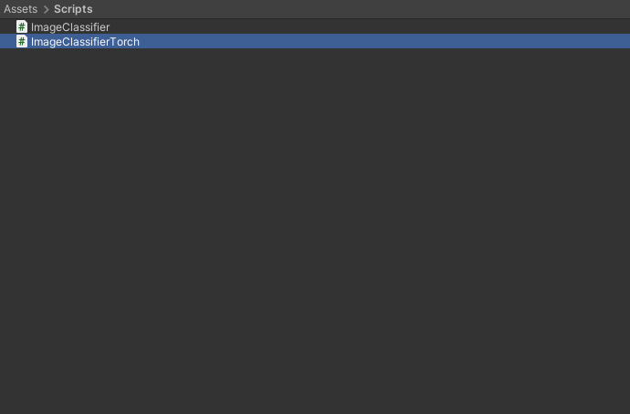


**Update class name**

Open the new script in the code editor and replace the class name with the new file name.

```c#
public class ImageClassifierTorch : MonoBehaviour
```


**Update required namespaces**

We no longer need the Barracuda namespace. Instead, we need the [System.Runtime.InteropServices](https://docs.microsoft.com/en-us/dotnet/api/system.runtime.interopservices?view=net-5.0) namespace to handle interactions with the LibTorch plugin.

```c#
using System.Collections;
using System.Collections.Generic;
using UnityEngine;
using UnityEngine.Rendering;
using System;
using UnityEngine.UI;
using System.Runtime.InteropServices;
```


**Remove Barracuda code**

We need to delete all the public and private Barracuda variables, along with the `InitializeWorker` and `OnDisable` methods.


**Update data processing variables**

We can remove the `processingMaterial` variable from the Data Processing section. We no longer need to download model output from the GPU to the CPU. However, we now need to download the input image to the CPU before sending it to the plugin. We can do this asynchronously to help reduce the GPU-to-CPU performance bottleneck.

```c#
[Header("Data Processing")]
[Tooltip("The target minimum model input dimensions")]
public int targetDim = 216;
[Tooltip("The compute shader for GPU processing")]
public ComputeShader processingShader;
[Tooltip("Asynchronously download input image from the GPU to the CPU.")]
public bool useAsyncGPUReadback = true;
```


**Update variables for user interface**

We'll add a new dropdown so that we can switch between the available TorchScript modules at runtime.

```c#
[Header("GUI")]
[Tooltip("Display predicted class")]
public bool displayPredictedClass = true;
[Tooltip("Display fps")]
public bool displayFPS = true;
[Tooltip("The on-screen text color")]
public Color textColor = Color.red;
[Tooltip("The scale value for the on-screen font size")]
[Range(0, 99)]
public int fontScale = 50;
[Tooltip("The number of seconds to wait between refreshing the fps value")]
[Range(0.01f, 1.0f)]
public float fpsRefreshRate = 0.1f;
[Tooltip("The toggle for using a webcam as the input source")]
public Toggle useWebcamToggle;
[Tooltip("The dropdown menu that lists available webcam devices")]
public Dropdown webcamDropdown;
[Tooltip("The dropdown menu that lists available torchscript models")]
public Dropdown modelDropdown;
```


**Define public variables for the LibTorch plugin**

Next, we'll create variables to indicate the StreamingAssets subfolder for the TorchScript modules and add the JSON files with the normalization stats.

```c#
[Header("Libtorch")]
[Tooltip("The name of the libtorch models folder")]
public string torchscriptModulesDir = "TorchScriptModules";
[Tooltip("A list json files containing the normalization stats for available models")]
public TextAsset[] normalizationStatsList;
```


**Update input variables**

Like in the previous tutorial series, when using asynchronous GPU readback, we need one Texture that stores data on the GPU and one that stores data on the CPU.

```c#
// The test image dimensions
private Vector2Int imageDims;
// The test image texture
private Texture imageTexture;
// The current screen object dimensions
private Vector2Int screenDims;
// The model GPU input texture
private RenderTexture inputTextureGPU;
// The model CPU input texture
private Texture2D inputTextureCPU;
```


**Define private variables for the LibTorch plugin**

We'll store the full paths and names for the Torchscript modules in separate lists. We also need to create another little class that indicates the structure of the JSON content for files with normalization stats.

```c#
// File paths for the available torchscript models
private List<string> modelPaths = new List<string>();
// Names of the available torchscript models
private List<string> modelNames = new List<string>();

// A class for reading in normalization stats from a JSON file
class NormalizationStats { public float[] mean; public float[] std; }
```


**Import functions from the LibTorch plugin**

We pass the pointer to the input pixel data as an [IntPtr](https://docs.microsoft.com/en-us/dotnet/api/system.intptr?view=net-6.0).

```c#
// Name of the DLL file
const string dll = "Libtorch_CPU_Image_Classifier_DLL";

[DllImport(dll)]
private static extern int LoadModel(string model, float[] mean, float[] std);

[DllImport(dll)]
private static extern int PerformInference(IntPtr inputData, int width, int height);
```


**Define method to get the available TorchScript modules**


```c#
/// <summary>
/// Get the file paths for available torchscript models
/// </summary>
private void GetTorchModels()
{
    // Get the paths for the .pt file for each model
    foreach (string file in System.IO.Directory.GetFiles($"{Application.streamingAssetsPath}/{modelsDir}"))
    {
        if (file.EndsWith(".pt"))
        {
            modelPaths.Add(file);
            string modelName = file.Split('\\')[1].Split('.')[0];
            modelNames.Add(modelName.Substring(0, modelName.Length));
        }
    }
}
```


**Update method to initialize GUI dropdown menu options**


```c#
/// <summary>
/// Initialize the GUI dropdown list
/// </summary>
private void InitializeDropdown()
{
    // Create list of webcam device names
    List<string> webcamNames = new List<string>();
    foreach(WebCamDevice device in webcamDevices) webcamNames.Add(device.name);

    // Remove default dropdown options
    webcamDropdown.ClearOptions();
    // Add webcam device names to dropdown menu
    webcamDropdown.AddOptions(webcamNames);
    // Set the value for the dropdown to the current webcam device
    webcamDropdown.SetValueWithoutNotify(webcamNames.IndexOf(currentWebcam));

    // Remove default dropdown options
    modelDropdown.ClearOptions();
    // Add TorchScript model names to menu
    modelDropdown.AddOptions(modelNames);
    // Select the first option in the dropdown
    modelDropdown.SetValueWithoutNotify(0);
}
```


**Update Start method**


```c#
// Start is called before the first frame update
void Start()
{
    // Get the source image texture
    imageTexture = screen.gameObject.GetComponent<MeshRenderer>().material.mainTexture;
    // Get the source image dimensions as a Vector2Int
    imageDims = new Vector2Int(imageTexture.width, imageTexture.height);

    // Initialize list of available webcam devices
    webcamDevices = WebCamTexture.devices;
    foreach (WebCamDevice device in webcamDevices) Debug.Log(device.name);
    currentWebcam = webcamDevices[0].name;
    useWebcam = webcamDevices.Length > 0 ? useWebcam : false;
    // Initialize webcam
    if (useWebcam) InitializeWebcam(currentWebcam);

    // Resize and position the screen object using the source image dimensions
    InitializeScreen();
    // Resize and position the main camera using the source image dimensions
    InitializeCamera(screenDims);

    // Initialize list of class labels from JSON file
    classes = JsonUtility.FromJson<ClassLabels>(classLabels.text).classes;

    // Get the file paths for available torchscript models
    GetTorchModels();

    // Initialize the webcam dropdown list
    InitializeDropdown();

    // Update the selected torchscript model
    UpdateTorchScriptModel();
}
```


**Update method to process images using a compute shader**


```c#
/// <summary>
/// Process the provided image using the specified function on the GPU
/// </summary>
/// <param name="image">The target image RenderTexture</param>
/// <param name="computeShader">The target ComputerShader</param>
/// <param name="functionName">The target ComputeShader function</param>
/// <returns></returns>
private void ProcessImageGPU(RenderTexture image, ComputeShader computeShader, string functionName)
{
    // Specify the number of threads on the GPU
    int numthreads = 8;
    // Get the index for the specified function in the ComputeShader
    int kernelHandle = computeShader.FindKernel(functionName);
    // Define a temporary HDR RenderTexture
    RenderTexture result = new RenderTexture(image.width, image.height, 24, RenderTextureFormat.ARGBHalf);
    // Enable random write access
    result.enableRandomWrite = true;
    // Create the HDR RenderTexture
    result.Create();

    // Set the value for the Result variable in the ComputeShader
    computeShader.SetTexture(kernelHandle, "Result", result);
    // Set the value for the InputImage variable in the ComputeShader
    computeShader.SetTexture(kernelHandle, "InputImage", image);

    // Execute the ComputeShader
    computeShader.Dispatch(kernelHandle, result.width / numthreads, result.height / numthreads, 1);

    // Copy the result into the source RenderTexture
    Graphics.Blit(result, image);

    // Release RenderTexture
    result.Release();
}
```


**Update method to handle asynchronous GPU readback**


```c#
/// <summary>
/// Called once AsyncGPUReadback has been completed
/// </summary>
/// <param name="request"></param>
private void OnCompleteReadback(AsyncGPUReadbackRequest request)
{
    if (request.hasError)
    {
        Debug.Log("GPU readback error detected.");
        return;
    }

    // Make sure the Texture2D is not null
    if (inputTextureCPU)
    {
        // Fill Texture2D with raw data from the AsyncGPUReadbackRequest
        inputTextureCPU.LoadRawTextureData(request.GetData<uint>());
        // Apply changes to Textur2D
        inputTextureCPU.Apply();
    }
}
```


**Define method to send the input texture data to the plugin**


```c#
/// <summary>
/// Pin memory for the input data and pass a reference to the plugin for inference
/// </summary>
/// <param name="texture">The input texture</param>
/// <returns></returns>
public unsafe int UploadTexture(Texture2D texture)
{
    int classIndex = -1;

    //Pin Memory
    fixed (byte* p = texture.GetRawTextureData())
    {
        // Perform inference and get the predicted class index
        classIndex = PerformInference((IntPtr)p, texture.width, texture.height);
    }

    return classIndex;
}
```


**Modify Update method**


```c#
// Update is called once per frame
void Update()
{
    useWebcam = webcamDevices.Length > 0 ? useWebcam : false;
    if (useWebcam)
    {
        // Initialize webcam if it is not already playing
        if (!webcamTexture || !webcamTexture.isPlaying) InitializeWebcam(currentWebcam);

        // Skip the rest of the method if the webcam is not initialized
        if (webcamTexture.width <= 16) return;

        // Make sure screen dimensions match webcam resolution when using webcam
        if (screenDims.x != webcamTexture.width)
        {
            // Resize and position the screen object using the source image dimensions
            InitializeScreen();
            // Resize and position the main camera using the source image dimensions
            InitializeCamera(screenDims);
        }
    }
    else if (webcamTexture && webcamTexture.isPlaying)
    {
        // Stop the current webcam
        webcamTexture.Stop();

        // Resize and position the screen object using the source image dimensions
        InitializeScreen();
        // Resize and position the main camera using the source image dimensions
        InitializeCamera(screenDims);
    }

    // Scale the source image resolution
    Vector2Int inputDims = CalculateInputDims(screenDims, targetDim);
    if (printDebugMessages) Debug.Log($"Input Dims: {inputDims.x} x {inputDims.y}");

    // Initialize the input texture with the calculated input dimensions
    inputTextureGPU = RenderTexture.GetTemporary(inputDims.x, inputDims.y, 24, RenderTextureFormat.ARGBHalf);

    if (!inputTextureCPU || inputTextureCPU.width != inputTextureGPU.width)
    {
        inputTextureCPU = new Texture2D(inputDims.x, inputDims.y, TextureFormat.RGBA32, false);
    }

    if (printDebugMessages) Debug.Log($"Input Dims: {inputTextureGPU.width}x{inputTextureGPU.height}");

    // Copy the source texture into model input texture
    Graphics.Blit((useWebcam ? webcamTexture : imageTexture), inputTextureGPU);

    // Flip image before sending to DLL
    ProcessImageGPU(inputTextureGPU, processingShader, "FlipXAxis");

    // Download pixel data from GPU to CPU
    if (useAsyncGPUReadback)
    {
        AsyncGPUReadback.Request(inputTextureGPU, 0, TextureFormat.RGBA32, OnCompleteReadback);
    }
    else
    {
        RenderTexture.active = inputTextureGPU;
        inputTextureCPU.ReadPixels(new Rect(0, 0, inputTextureGPU.width, inputTextureGPU.height), 0, 0);
        inputTextureCPU.Apply();
    }

    // Send reference to inputData to DLL
    classIndex = UploadTexture(inputTextureCPU);
    if (printDebugMessages) Debug.Log($"Class Index: {classIndex}");

    // Check if index is valid
    bool validIndex = classIndex >= 0 && classIndex < classes.Length;
    if (printDebugMessages) Debug.Log(validIndex ? $"Predicted Class: {classes[classIndex]}" : "Invalid index");

    // Release the input texture
    RenderTexture.ReleaseTemporary(inputTextureGPU);
}
```


**Define a method to update the current TorchScript model**


```c#
/// <summary>
/// Update the selected torchscript model
/// </summary>
public void UpdateTorchScriptModel()
{
    string modelName = modelNames[modelDropdown.value];
    float[] mean = new float[] { };
    float[] std = new float[] { };

    foreach (TextAsset textAsset in normalizationStatsList)
    {
        if (modelName.Contains(textAsset.name.Split("-")[0]))
        {
            // Initialize the normalization stats from JSON file
            mean = JsonUtility.FromJson<NormalizationStats>(textAsset.text).mean;
            std = JsonUtility.FromJson<NormalizationStats>(textAsset.text).std;
        }
    }

    if (mean.Length == 0)
    {
        Debug.Log("Unable to find normalization stats");
        return;
    }
    {
        string mean_str = "";
        foreach (float val in mean) mean_str += $"{val} ";
        Debug.Log($"Mean Stats: {mean_str}");
        string std_str = "";
        foreach (float val in std) std_str += $"{val} ";
        Debug.Log($"Std Stats: {std_str}");
    }

    // Load the specified torchscript model
    int result = LoadModel(modelPaths[modelDropdown.value], mean, std);
    Debug.Log(result == 0 ? "Model loaded successfully" : "error loading the model");
}
```


## Modify GUI

As mentioned earlier, we'll add a new dropdown menu to the GUI so we can switch between available TorchScript modules at runtime. Select the `WebcamDeviceText` and `WebcamDropdown` objects and press Ctrl-d to duplicate them. Rename the duplicates to `TorchScriptModelText` and `TorchScriptModelDropdown` respectively.


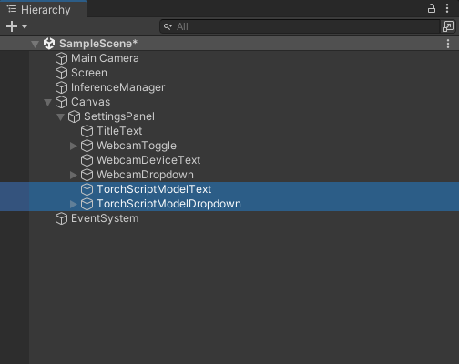


Select the `TorchScriptModelText` object and update the `Pos Y` value to `-145` and the Text value to `TorchScript Model:` in the Inspector tab.


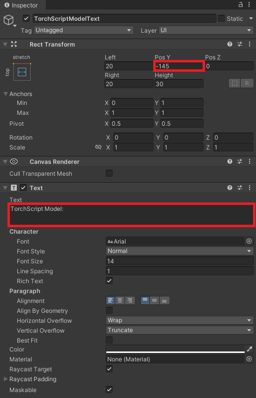


Then, select the `TorchScriptModelDropdown` object and update the `Pos Y` value to `-165` in the Inspector tab.


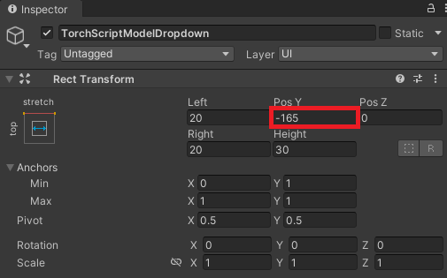


The updated GUI should look like the image below.


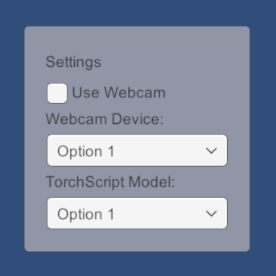


## Add `ImageClassifierTorch` Component

Now we can add the new `ImageClassifierTorch` script to the `InferenceManager` object. Make sure to disable the existing `ImageClassifier` component, as shown below.

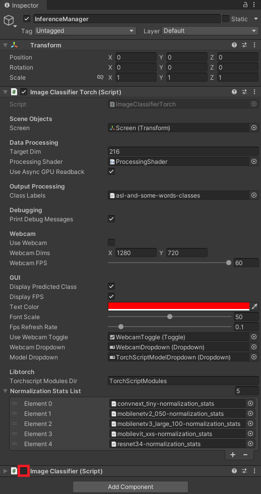


## Update On Value Changed Events

With the `ImageClassifierTorch` component added, we can update the On Value Changed events for the `WebcamToggle`, `WebcamDropdown`, and `TorchScriptModelDropdown` objects.

**Update the `WebcamToggle` On Value Changed Event**

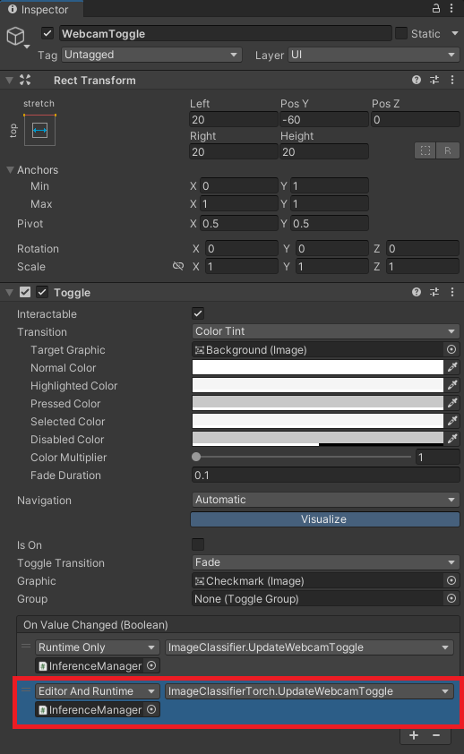


**Update the `WebcamDropdown` On Value Changed Event**


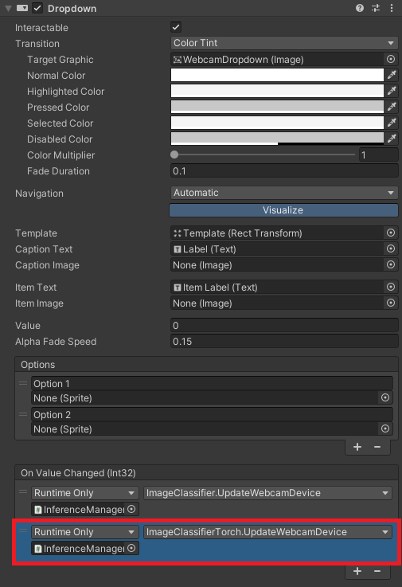


**Update the `TorchScriptModelDropdown` On Value Changed Event**


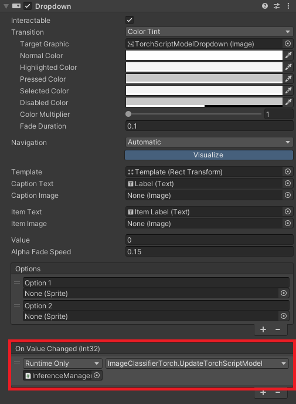


## Summary

This tutorial series covered creating a LibTorch plugin to perform inference with recent model architectures in the Unity game engine. LibTorch also provides the ability to update the model weights within the Unity application, which we might explore in a future tutorial.


**Previous:** [How to Create a LibTorch Plugin for Unity on Windows Pt.2](../part-2/)


**Project Resources:** [GitHub Repository](https://github.com/cj-mills/fastai-to-libtorch-to-unity-tutorial)


