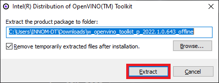
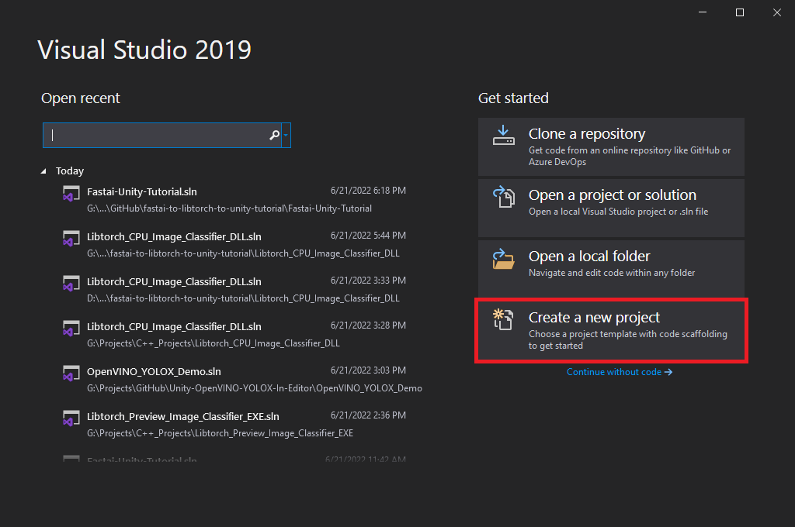
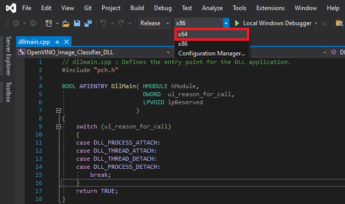
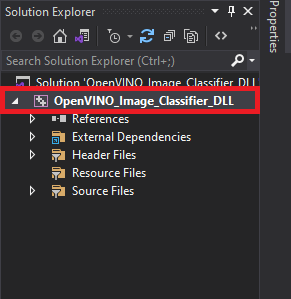
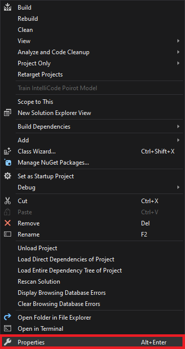
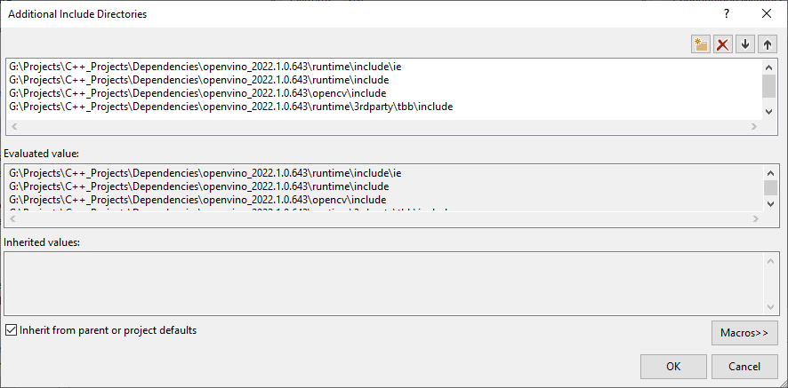
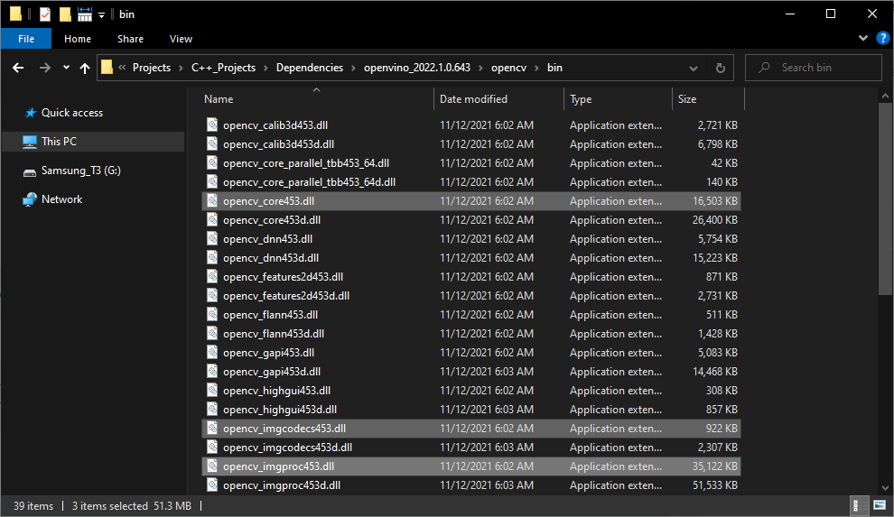
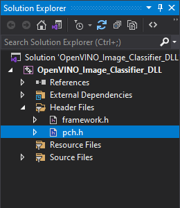
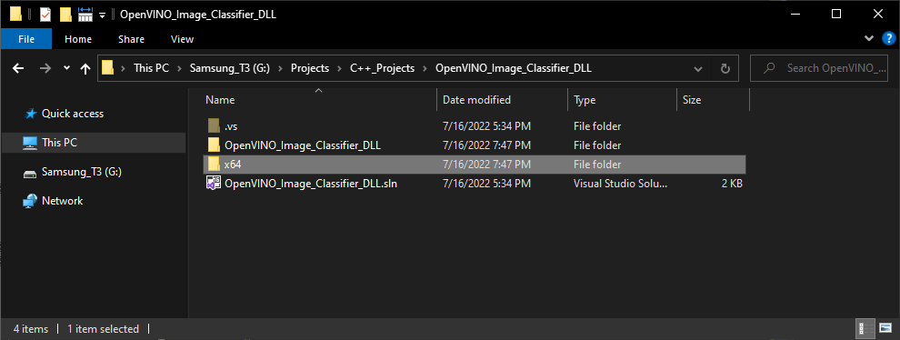

* [Overview](#overview)
* [Install OpenVINO](#install-openvino)
* [Create DLL Project](#create-dll-project)
* [Configure the Project](#configure-the-project)
* [Add Include Directories](#add-include-directories)
* [Link Libraries](#link-libraries)
* [Post Build Events](#post-build-events)
* [Update Precompiled Header File](#update-precompiled-header-file)
* [Update dllmain File](#update-dllmain-file)
* [Build Solution](#build-solution)
* [Gather Dependencies](#gather-dependencies)
* [Summary](#summary)


## Overview

[Part 1](../part-1/) covered modifying the training code from the [fastai-to-unity tutorial](../../fastai-to-unity-tutorial/part-1/) to finetune models from the Timm library and exporting them as OpenVINO IR models. This post covers creating a dynamic link library ([DLL](https://docs.microsoft.com/en-us/troubleshoot/windows-client/deployment/dynamic-link-library)) file in Visual Studio to perform inference with these IR models using [OpenVINO](https://docs.openvino.ai/latest/index.html).


## Install OpenVINO

We need to download the OpenVINO Toolkit before creating our Visual Studio project. Go to the OpenVINO download page linked below. 

* [OpenVINO Download page](https://www.intel.com/content/www/us/en/developer/tools/openvino-toolkit/download.html)


**Download OpenVINO Toolkit**

Select the options outlined in the image below and click the Download button.

{fig-align="center"}


Double-click the file once it finishes downloading and click the Extract button in the popup window.


{fig-align="center"}


The installer will then verify the computer meets the system requirements. The toolkit includes the Python scripts for converting models, which require Python 3.6, 3.7, 3.8, or 3.9 to run. We will only use the files for C++ development in this post.


{fig-align="center"}


We can stick with the default `Recommended Installation` option.


{fig-align="center"}


The installer will then ask whether Intel can collect some information before starting the installation process.


{fig-align="center"}


{fig-align="center"}


Click Finish once the installation process completes.


{fig-align="center"}


**Inspect OpenVINO Folder**

If we look at the installation folder for the toolkit, we can see it also includes a version of OpenCV. We'll use OpenCV to prepare image data from Unity before feeding it to the model.

{fig-align="center"}


I like to copy the OpenVINO folder to a separate directory with other dependencies for my C++ projects.

{fig-align="center"}

Now we can create our Visual Studio DLL project.


## Create DLL Project

Open Visual Studio and select the `Create a new project` option.

{fig-align="center"}


Type `DLL` into the text box and select the `Dynamic-Link Library (DLL)` option. This option automatically configures a few parameters for us compared to starting with a standard console application.


{fig-align="center"}


Choose a name and location for the project and click the `Create` button. By default, the DLL file will use the project name.


{fig-align="center"}


## Configure the Project

At the top of the window, open the Solution Configurations dropdown menu, and select `Release`.


{fig-align="center"}


Then, open the Solution Platform dropdown menu and select `x64`.

{fig-align="center"}


## Add Include Directories

We need to tell Visual Studio where OpenVINO and OpenCV are so we can access their APIs. Right-click the project name in the Solution Explorer panel.

{fig-align="center"}


Select the `Properties` option in the popup menu.

{fig-align="center"}


In the Properties Window, open on the `C/C++` dropdown. Select the `Additional Include Directories` section and click on `<Edit..>` in the dropdown.

{fig-align="center"}


Add the paths for the following folders, replacing `<parent-folder-path>` with the full path to the parent folder for the OpenVINO Toolkit, and click `OK`.

* `<parent-folder-path>\openvino_2022.1.0.643\runtime\include\ie`
* `<parent-folder-path>\openvino_2022.1.0.643\runtime\include`
* `<parent-folder-path>\openvino_2022.1.0.643\opencv\include`
* `<parent-folder-path>\openvino_2022.1.0.643\runtime\3rdparty\tbb\include`


{fig-align="center"}


## Link Libraries

Next, open the `Linker` dropdown in the Properties window and select `Input`. Select `Additional Dependencies` and click `<Edit..>`.


{fig-align="center"}


Add the paths to the following files, replacing `<parent-folder-path>` with the full path to the parent folder for the OpenVINO Toolkit, and click `OK`.

* `<parent-folder-path>\openvino_2022.1.0.643\opencv\lib\*`
* `<parent-folder-path>\openvino_2022.1.0.643\runtime\lib\intel64\Release\*`
* `<parent-folder-path>\openvino_2022.1.0.643\runtime\3rdparty\tbb\lib\*.lib`


{fig-align="center"}


## Post Build Events

Our DLL file will depend on the following DLL files included with the OpenVINO and OpenCV libraries.

**OpenCV DLL files**

{fig-align="center"}


**OpenVINO DLL files**

{fig-align="center"}


{fig-align="center"}


We can add a post-build event in Visual Studio to automatically copy these DLL files to the build folder for the project at compile time. Open the `Build Events` dropdown in the Properties window and select `Post-Build Event`. Select `Command Line` and click `<Edit..>`.


{fig-align="center"}


Add the following commands, replacing `<parent-folder-path>` with the full path to the parent folder for the OpenVINO Toolkit, and click `OK`.

* `xcopy <parent-folder-path>\openvino_2022.1.0.643\opencv\bin\opencv_core453.dll $(SolutionDir)$(Platform)\$(Configuration)\ /c /y`
* `xcopy <parent-folder-path>\openvino_2022.1.0.643\opencv\bin\opencv_imgproc453.dll $(SolutionDir)$(Platform)\$(Configuration)\ /c /y`
* `xcopy <parent-folder-path>\openvino_2022.1.0.643\opencv\bin\opencv_imgcodecs453.dll $(SolutionDir)$(Platform)\$(Configuration)\ /c /y`
* `xcopy <parent-folder-path>\openvino_2022.1.0.643\runtime\bin\intel64\Release\* $(SolutionDir)$(Platform)\$(Configuration)\ /c /y`
* `xcopy <parent-folder-path>\openvino_2022.1.0.643\runtime\3rdparty\tbb\bin\tbb.dll $(SolutionDir)$(Platform)\$(Configuration)\ /c /y`


{fig-align="center"}


Finally, click the `Apply` button and close the Properties window.

{fig-align="center"}


With the dependencies taken care of, we can start modifying the code.


## Update Precompiled Header File

We'll first update the `pch.h` [Precompiled Header file](https://docs.microsoft.com/en-us/cpp/build/creating-precompiled-header-files?view=msvc-160) with the required header files. We can open the `pch.h` file by selecting it in the Solution Explorer window.

{fig-align="center"}


Comment or remove the "#include" line for the `framework.h` header file.

```c++
// pch.h: This is a precompiled header file.
// Files listed below are compiled only once, improving build performance for future builds.
// This also affects IntelliSense performance, including code completion and many code browsing features.
// However, files listed here are ALL re-compiled if any one of them is updated between builds.
// Do not add files here that you will be updating frequently as this negates the performance advantage.

#ifndef PCH_H
#define PCH_H

// add headers that you want to pre-compile here
//#include "framework.h"

#endif //PCH_H

```


**Add required header files**

Next, we'll add the required header files for OpenVINO and OpenCV below `//#include "framework.h"` line.

```c++
// pch.h: This is a precompiled header file.
// Files listed below are compiled only once, improving build performance for future builds.
// This also affects IntelliSense performance, including code completion and many code browsing features.
// However, files listed here are ALL re-compiled if any one of them is updated between builds.
// Do not add files here that you will be updating frequently as this negates the performance advantage.

#ifndef PCH_H
#define PCH_H

// add headers that you want to pre-compile here
//#include "framework.h"

#include "openvino/openvino.hpp"
#include <opencv2/opencv.hpp>

#endif //PCH_H

```


## Update dllmain File

By default, the `dllmain.cpp` file contains the following code. 

```c++
// dllmain.cpp : Defines the entry point for the DLL application.
#include "pch.h"

BOOL APIENTRY DllMain( HMODULE hModule,
                       DWORD  ul_reason_for_call,
                       LPVOID lpReserved
                     )
{
    switch (ul_reason_for_call)
    {
    case DLL_PROCESS_ATTACH:
    case DLL_THREAD_ATTACH:
    case DLL_THREAD_DETACH:
    case DLL_PROCESS_DETACH:
        break;
    }
    return TRUE;
}
```

We can delete everything below the `#include "pch.h"` line.


**Create a macro to mark functions we want to make accessible in Unity**

```c++
// dllmain.cpp : Defines the entry point for the DLL application.
#include "pch.h"


// Create a macro to quickly mark a function for export
#define DLLExport __declspec (dllexport)
```


**Wrap the code in extern "C" to prevent name-mangling issues with the compiler**

The rest of our code will go inside here.

```c++
// Wrap code to prevent name-mangling issues
extern "C" {

}
```


**Define variables**

Inside the wrapper, we will declare the persistent variables needed for the DLL.

* [ov::Core](https://docs.openvino.ai/nightly/classov_1_1Core.html): represents an OpenVINO runtime Core entity
* [ov::Model](https://docs.openvino.ai/latest/classov_1_1Model.html#doxid-classov-1-1-model): A user-defined model
* [ov::CompiledModel](https://docs.openvino.ai/latest/classov_1_1CompiledModel.html): represents a compiled model
* [ov::InferRequest](https://docs.openvino.ai/latest/classov_1_1InferRequest.html#doxid-classov-1-1-infer-request): an infer request that can be run in asynchronous or synchronous manners
* [ov::Tensor](https://docs.openvino.ai/latest/classov_1_1Tensor.html): API holding host memory

----

```c++
// Inference engine instance
ov::Core core;
// The user define model representation
std::shared_ptr<ov::Model> model;
// A device-specific compiled model
ov::CompiledModel compiled_model;

// List of available compute devices
std::vector<std::string> available_devices;
// An inference request for a compiled model
ov::InferRequest infer_request;
// Stores the model input data
ov::Tensor input_tensor;
// A pointer for accessing the input tensor data
float* input_data;

// The number of image classes the current model can detect
int num_classes = 0;
// The current input image width
int input_w;
// The current input image height
int input_h;
// The total number pixels in the input image
int nPixels;
// The number of color channels in the input image
int num_channels = 3;
```


**Define a function to get the number of compute devices**

The first function we'll define will create a list of available device names and return the number of devices accessible by OpenVINO. We'll use this information to select which device to use to perform inference from the Unity application. There might be an option named GNA (Gaussian & Neural Accelerator). GNA is a highly specialized neural coprocessor for tasks like noise cancellation. We'll exclude it from the list of devices presented to the end user.

* [ov::Core::get_available_devices()](https://docs.openvino.ai/nightly/classov_1_1Core.html#doxid-classov-1-1-core-1aabd82bca4826ee53893f7b5fc9bce813): Returns devices available for inference

------


```c++
/// <summary>
/// Get the number of available compute devices
/// </summary>
/// <returns></returns>
DLLExport int GetDeviceCount() {

    // Reset list of available compute devices
    available_devices.clear();

    // Populate list of available compute devices
    for (std::string device : core.get_available_devices()) {
        // Skip GNA device
        if (device.find("GNA") == std::string::npos) {
            available_devices.push_back(device);
        }
    }
    // Return the number of available compute devices
    return available_devices.size();
}
```


**Define a function to get the name of a compute device**

Next, we'll define a function to return the name of a device at a specified index for the list of available devices.

```c++
/// <summary>
/// Get the name of the compute device name at the specified index
/// </summary>
/// <param name="index"></param>
/// <returns></returns>
DLLExport std::string* GetDeviceName(int index) {
    return &available_devices[index];
}
```


**Define a function to load an OpenVINO model**

OpenVINO needs to compile models for the target device. This process can take several seconds when using GPU inference. We can create a cache directory, so we only need to compile models for a specific resolution-device pair once.

We'll place the code for loading an OpenVINO model inside a try-catch block to avoid crashing the application if we pass an incorrect file path.

If the model loads successfully, we'll attempt to reshape the model input to the desired input dimensions. Note that models like MobileViT will need to use the input dimensions from training.

After reshaping the model input, we can compile the model for the target device.

We can get pointers to the model input tensor and create an inference request using the compiled model.

* [ov::Core::set_property()](https://docs.openvino.ai/nightly/classov_1_1Core.html#doxid-classov-1-1-core-1a14cba2136b972ee34478dd11633293a2): Sets properties for a device
* [ov::Core::read_model()](https://docs.openvino.ai/nightly/classov_1_1Core.html#doxid-classov-1-1-core-1ae0576a95f841c3a6f5e46e4802716981): Reads models from IR/ONNX/PDPD formats
* [ov::Model::reshape()](https://docs.openvino.ai/latest/openvino_docs_OV_UG_ShapeInference.html): Updates input shapes and propagates them down to the outputs of the model through all intermediate layers
* [ov::Core::compile_model()](https://docs.openvino.ai/nightly/classov_1_1Core.html#doxid-classov-1-1-core-1a46555f0803e8c29524626be08e7f5c5a): Creates a compiled model from a source model object
* [ov::CompiledModel::create_infer_request()](https://docs.openvino.ai/latest/classov_1_1CompiledModel.html#doxid-classov-1-1-compiled-model-1ae3633c0eb5173ed776446fba32b95953): Creates an inference request object used to infer the compiled model
* [ov::InferRequest::get_input_tensor()](https://docs.openvino.ai/latest/classov_1_1InferRequest.html#doxid-classov-1-1-infer-request-1a5f0bc1ab40de6a7a12136b4a4e6a8b54): Gets an input tensor for inference

------


```c++
/// <summary>
/// Load a model from the specified file path
/// </summary>
/// <param name="modelPath">The path to the OpenVINO IR model file</param>
/// <param name="index">The compute device index</param>
/// <param name="inputDims">The source image resolution</param>
/// <returns></returns>
DLLExport int LoadModel(char* modelPath, int index, int inputDims[2]) {

    // Initialize return value
    int return_val = 0;
    // Specify the cache directory for compiled gpu models
    core.set_property("GPU", ov::cache_dir("cache"));

    // Try loading the specified model
    try { model = core.read_model(modelPath); } 
    // Return 1 if the model fails to load
    catch (...) { return 1; }

    // Try updating the model input dimensions
    try { model->reshape({ 1, 3, inputDims[1], inputDims[0] }); }
    // Return a value of 2 if we can't update the model input dimensions
    catch (...) { return_val = 2; }

    // Compile the loaded model for the target compute device
    auto compiled_model = core.compile_model(model, "MULTI",
         ov::device::priorities(available_devices[index]),
         ov::hint::performance_mode(ov::hint::PerformanceMode::LATENCY),
         ov::hint::inference_precision(ov::element::f32));

    // Get the number of classes the current model can detect
    ov::Output<const ov::Node> output = compiled_model.output();
    num_classes = output.get_shape()[1];
    // Create an inference request to use the compiled model
    infer_request = compiled_model.create_infer_request();

    // Get input tensor by index
    input_tensor = infer_request.get_input_tensor(0);

    // Get model input dimensions
    input_w = input_tensor.get_shape()[3];
    input_h = input_tensor.get_shape()[2];
    nPixels = input_w * input_h;

    // Get a pointer to the input tensor
    input_data = input_tensor.data<float>();

    // Return a value of 0 if the model loads successfully
    return return_val;
}
```


**Define a function to perform inference**

We will access the pixel data for the input image from Unity with a pointer to a [uchar](https://docs.opencv.org/4.5.1/d1/d1b/group__core__hal__interface.html#ga65f85814a8290f9797005d3b28e7e5fc) (unsigned 1-byte integer) array and wrap the data in a [cv::Mat](https://docs.opencv.org/master/d3/d63/classcv_1_1Mat.html) variable for processing. 

We don't need to normalize the input image since the IR model does it internally.

Once again, we'll use a try-catch block to avoid crashing the application if an error occurs during the forward pass. We can use the `std::max_element()` and `std::distance()` functions to find the class index with the highest confidence score.

* [cv::Mat](https://docs.opencv.org/3.4/d3/d63/classcv_1_1Mat.html): n-dimensional dense array class  
* [cv::cvtColor()](https://docs.opencv.org/3.4/d8/d01/group__imgproc__color__conversions.html#ga397ae87e1288a81d2363b61574eb8cab): Converts an image from one color space to another
* [ov::InferRequest::infer()](https://docs.openvino.ai/latest/classov_1_1InferRequest.html#doxid-classov-1-1-infer-request-1abcb7facc9f7c4b9226a1fd343e56958d): Infers specified input in synchronous mode
* [ov::InferRequest::get_output_tensor()](https://docs.openvino.ai/latest/classov_1_1InferRequest.html#doxid-classov-1-1-infer-request-1a9bf7bf67c58858bda86ae01e83cd14c1): Gets an output tensor for inference
* [std::distance()](https://cplusplus.com/reference/iterator/distance/): Calculates the number of elements between first and last
* [std::max_element()](https://cplusplus.com/reference/algorithm/max_element/): Returns an iterator pointing to the element with the largest value in the range `[first,last)`

------


```c++
/// <summary>
/// Perform inference with the provided texture data
/// </summary>
/// <param name="inputData"></param>
/// <returns></returns>
DLLExport int PerformInference(uchar* inputData) {

    // Initialize predicted class index to an invalid value
    int class_idx = -1;

    try {

        // Store the pixel data for the source input image in an OpenCV Mat
        cv::Mat texture = cv::Mat(input_h, input_w, CV_8UC4, inputData);
        // Remove the alpha channel
        cv::cvtColor(texture, texture, cv::COLOR_RGBA2RGB);

        // Iterate over each pixel in image
        for (int p = 0; p < nPixels; p++) {
            // Iterate over each color channel for each pixel in image
            for (int ch = 0; ch < num_channels; ++ch) {
                input_data[ch * nPixels + p] = texture.data[p * num_channels + ch] / 255.0f;
            }
        }

        // Perform inference
        infer_request.infer();

        // model has only one output
        ov::Tensor output_tensor = infer_request.get_output_tensor();
        // IR v10 works with converted precisions (i64 -> i32)
        auto out_data = output_tensor.data<float>();

        // Get the predicted class index with the highest confidence score
        class_idx = std::distance(out_data, std::max_element(out_data, out_data + num_classes));
    }
    catch (...) {
        // Return a value of -2 if an error occurs during the forward pass
        class_idx = -2;
    }

    return class_idx;
}
```

That is all the code needed for the plugin. We can now build the solution to generate the DLL file.


## Build Solution

Open the Build menu at the top of the Visual Studio window and click Build Solution. Visual Studio will generate a new x64 folder in the project directory containing the DLL file and its dependencies.


{fig-align="center"}


## Gather Dependencies

Right-click the project name in the Solution Explorer panel and select `Open Folder in File Explorer` from the popup menu.

{fig-align="center"}


In the new File Explorer window, go to the parent folder.

{fig-align="center"}


Open the `x64 → Release` subfolder.

{fig-align="center"}


We'll need to copy all the DLL files in this folder and the plugins.xml file to the Unity project.

{fig-align="center"}


## Summary

This post covered creating a dynamic link library ([DLL](https://docs.microsoft.com/en-us/troubleshoot/windows-client/deployment/dynamic-link-library)) file to perform inference using [OpenVINO](https://docs.openvino.ai/latest/index.html). Part 3 will cover the required modifications for the original Unity project to use this DLL.


**Previous:** [How to Create an OpenVINO Plugin for Unity on Windows Pt. 1](../../fastai-to-unity-tutorial/part-1/)

**Next:** [How to Create an OpenVINO Plugin for Unity on Windows Pt. 3](../part-3/)


**Project Resources:** [GitHub Repository](https://github.com/cj-mills/fastai-to-openvino-to-unity-tutorial)


