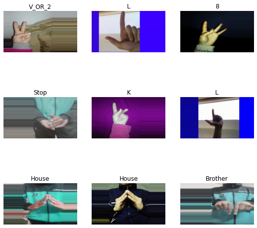
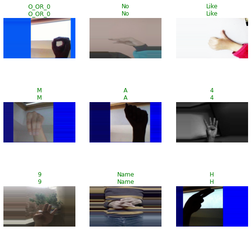
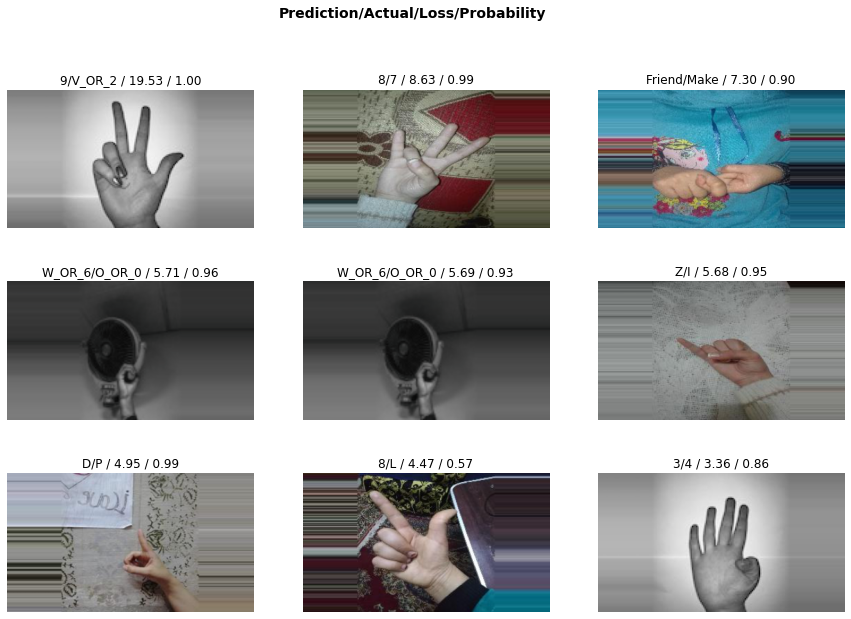

* [Introduction](#introduction)
* [Overview](#overview)
* [Install Dependencies](#install-dependencies)
* [Configure Kaggle API](#configure-kaggle-api)
* [Download Dataset](#download-dataset)
* [Inspect Dataset](#inspect-dataset)
* [Define Dataloaders](#define-dataloaders)
* [Define Learner](#define-learner)
* [Inspect Trained Model](#inspect-trained-model)
* [Implement Processing Steps](#implement-processing-steps)
* [Export the Model](#export-the-model)
* [Summary](#summary)


## Introduction

In this tutorial series, we will walk through training an image classifier using the [fastai library](https://docs.fast.ai/) and implementing it in a [Unity](https://unity.com/) game engine project using the [Barracuda](https://docs.unity3d.com/Packages/com.unity.barracuda@3.0/manual/index.html) inference library. Check out [this post](../../deep-learning-unity-intro/) for more information about Barracuda. We will then build the Unity project to run in a web browser and host it using [GitHub Pages](https://pages.github.com/).

The tutorial uses this [American Sign Language (ASL) dataset](https://www.kaggle.com/datasets/belalelwikel/asl-and-some-words) from Kaggle but feel free to follow along with a different dataset. The dataset contains sample images for digits 1-9, letters A-Z, and some common words. One could use a model trained on this dataset to map hand gestures to user input or make an ASL education game.

**In-Browser Demo:** [ASL Classifier](https://cj-mills.github.io/Fastai-ASL-Classification-WebGL-Demo/)


## Overview

Part 1 covers how to finetune a ResNet model for image classification using the fastai library and export it to ONNX format. The training code is available in the Jupyter notebook linked below, and links for running the notebook on Google Colab and Kaggle are below as well.

| Jupyter Notebook             | Colab                                                        | Kaggle                                                       |
| --------------------------------- | ------------------------------------------------------------ | ------------------------------------------------------------ |
| [GitHub Repository](https://github.com/cj-mills/fastai-to-unity-tutorial/blob/main/notebooks/Fastai-to-Unity-Tutorial.ipynb) | [Open In Colab](https://colab.research.google.com/github/cj-mills/fastai-to-unity-tutorial/blob/main/notebooks/Fastai-to-Unity-Tutorial.ipynb) | [Open in Kaggle](https://kaggle.com/kernels/welcome?src=https://github.com/cj-mills/fastai-to-unity-tutorial/blob/main/notebooks/Fastai-to-Unity-Tutorial.ipynb) |


## Install Dependencies

The training code requires [PyTorch](https://pytorch.org/) for the fastai library, the fastai library itself for training, and the [Kaggle API Python package](https://github.com/Kaggle/kaggle-api) for downloading the dataset.  Google Colab uses an older version of [Pillow](https://pillow.readthedocs.io/en/stable/), so update that package when training there.

**Uncomment the cell below if running on Google Colab or Kaggle**


```python
# %%capture
# !pip3 install -U torch torchvision torchaudio
# !pip3 install -U fastai
# !pip3 install -U kaggle
# !pip3 install -U Pillow
```

**Note for Colab:**  You must restart the runtime in order to use newly installed version of Pillow.


**Import all fastai computer vision functionality**


```python
from fastai.vision.all import *
```


## Configure Kaggle API

The Kaggle API tool requires an API Key for a Kaggle account. Sign in or create a Kaggle account using the link below, then click the Create New API Token button.

* **Kaggle Account Settings:** [https://www.kaggle.com/me/account](https://www.kaggle.com/me/account)

{fig-align="center"}

Kaggle will generate and download a `kaggle.json` file containing your username and new API token. Paste the values for each in the code cell below.

**Enter Kaggle username and API token**


```python
creds = '{"username":"","key":""}'
```

**Save Kaggle credentials if none are present**
* **Source:** [https://github.com/fastai/fastbook/blob/master/09_tabular.ipynb](https://github.com/fastai/fastbook/blob/master/09_tabular.ipynb)

------


```python
cred_path = Path('~/.kaggle/kaggle.json').expanduser()
# Save API key to a json file if it does not already exist
if not cred_path.exists():
    cred_path.parent.mkdir(exist_ok=True)
    cred_path.write_text(creds)
    cred_path.chmod(0o600)
```

**Import Kaggle API**


```python
from kaggle import api
```


**(Optional) Define method to display default function arguments**

The code cell below defines a method to display the default arguments for a specified function. It's not required, but I find it convenient for creating quick references in notebooks.


```python
import inspect
import pandas as pd
pd.set_option('max_colwidth', None)
pd.set_option('display.max_rows', None)
pd.set_option('display.max_columns', None)

def inspect_default_args(target, annotations: bool=False):
    # Get the argument names
    args = inspect.getfullargspec(target).args
    # Get the default values
    defaults = inspect.getfullargspec(target).defaults

    index = ["Default Value"]

    # Pad defaults
    defaults = [None]*(len(args)-len(defaults)) + list(defaults)
    if annotations:
        index.append("Annotation")
        annotations = inspect.getfullargspec(target).annotations.values()
        # Pad annotations
        annotations = [None]*(len(args)-len(annotations)) + list(annotations)
        default_args = {arg:[df, annot] for arg,df,annot in zip(args, defaults, annotations)}
    else:
        default_args = {arg:[default] for arg,default in zip(args, defaults)}
        
    return pd.DataFrame(default_args, index=index).T
```


## Download Dataset

Now that we have our Kaggle credentials set, we need to define the dataset and where to store it. 

**Define path to dataset**

We'll use the default archive and data folders for the fastai library to store the compressed and uncompressed datasets.


```python
kaggle_dataset = 'belalelwikel/asl-and-some-words'
archive_dir = URLs.path()
dataset_dir = archive_dir/'../data'
dataset_name = 'asl-and-some-words'
archive_path = Path(f'{archive_dir}/{dataset_name}.zip')
dataset_path = Path(f'{dataset_dir}/{dataset_name}')
```

**Define method to extract the dataset from an archive file**


```python
def file_extract(fname, dest=None):
    "Extract `fname` to `dest` using `tarfile` or `zipfile`."
    if dest is None: dest = Path(fname).parent
    fname = str(fname)
    if   fname.endswith('gz'):  tarfile.open(fname, 'r:gz').extractall(dest)
    elif fname.endswith('zip'): zipfile.ZipFile(fname     ).extractall(dest)
    else: raise Exception(f'Unrecognized archive: {fname}')
```

**Download the dataset if it is not present**

The archive file is over 2GB, so we don't want to download it more than necessary.


```python
if not archive_path.exists():
    api.dataset_download_cli(kaggle_dataset, path=archive_dir)
    file_extract(fname=archive_path, dest=dataset_path)
```


## Inspect Dataset

We can start inspecting the dataset once it finishes downloading.

**Inspect the dataset path**

The training data is in a subfolder named ASL, and there are over 200,000 samples.


```python
dataset_path.ls()
```
```text
    (#1) [Path('/home/innom-dt/.fastai/archive/../data/asl-and-some-words/ASL')]
```


**Get image file paths**


```python
files = get_image_files(dataset_path/"ASL")
len(files)
```
```text
    203000
```

**Inspect files**

The dataset indicates the object class in both the folder and file names.


```python
files[0], files[-1]
```
```text
    (Path('/home/innom-dt/.fastai/archive/../data/asl-and-some-words/ASL/J/J1491.jpg'),
     Path('/home/innom-dt/.fastai/archive/../data/asl-and-some-words/ASL/E/E1063.jpg'))
```

**Inspect class folder names**

There are 51 class folders, and the dataset does not predefine a training-validation split.


```python
folder_names = [path.name for path in Path(dataset_path/'ASL').ls()]
folder_names.sort()
print(f"Num classes: {len(folder_names)}")
pd.DataFrame(folder_names)
```
```text
    Num classes: 51
```
<div style="overflow-x:auto; overflow-y: auto; max-height:500px">
<table border="1" class="dataframe">
  <thead>
    <tr style="text-align: right;">
      <th></th>
      <th>0</th>
    </tr>
  </thead>
  <tbody>
    <tr>
      <th>0</th>
      <td>1</td>
    </tr>
    <tr>
      <th>1</th>
      <td>3</td>
    </tr>
    <tr>
      <th>2</th>
      <td>4</td>
    </tr>
    <tr>
      <th>3</th>
      <td>5</td>
    </tr>
    <tr>
      <th>4</th>
      <td>7</td>
    </tr>
    <tr>
      <th>5</th>
      <td>8</td>
    </tr>
    <tr>
      <th>6</th>
      <td>9</td>
    </tr>
    <tr>
      <th>7</th>
      <td>A</td>
    </tr>
    <tr>
      <th>8</th>
      <td>B</td>
    </tr>
    <tr>
      <th>9</th>
      <td>Baby</td>
    </tr>
    <tr>
      <th>10</th>
      <td>Brother</td>
    </tr>
    <tr>
      <th>11</th>
      <td>C</td>
    </tr>
    <tr>
      <th>12</th>
      <td>D</td>
    </tr>
    <tr>
      <th>13</th>
      <td>Dont_like</td>
    </tr>
    <tr>
      <th>14</th>
      <td>E</td>
    </tr>
    <tr>
      <th>15</th>
      <td>F</td>
    </tr>
    <tr>
      <th>16</th>
      <td>Friend</td>
    </tr>
    <tr>
      <th>17</th>
      <td>G</td>
    </tr>
    <tr>
      <th>18</th>
      <td>H</td>
    </tr>
    <tr>
      <th>19</th>
      <td>Help</td>
    </tr>
    <tr>
      <th>20</th>
      <td>House</td>
    </tr>
    <tr>
      <th>21</th>
      <td>I</td>
    </tr>
    <tr>
      <th>22</th>
      <td>J</td>
    </tr>
    <tr>
      <th>23</th>
      <td>K</td>
    </tr>
    <tr>
      <th>24</th>
      <td>L</td>
    </tr>
    <tr>
      <th>25</th>
      <td>Like</td>
    </tr>
    <tr>
      <th>26</th>
      <td>Love</td>
    </tr>
    <tr>
      <th>27</th>
      <td>M</td>
    </tr>
    <tr>
      <th>28</th>
      <td>Make</td>
    </tr>
    <tr>
      <th>29</th>
      <td>More</td>
    </tr>
    <tr>
      <th>30</th>
      <td>N</td>
    </tr>
    <tr>
      <th>31</th>
      <td>Name</td>
    </tr>
    <tr>
      <th>32</th>
      <td>No</td>
    </tr>
    <tr>
      <th>33</th>
      <td>O_OR_0</td>
    </tr>
    <tr>
      <th>34</th>
      <td>P</td>
    </tr>
    <tr>
      <th>35</th>
      <td>Pay</td>
    </tr>
    <tr>
      <th>36</th>
      <td>Play</td>
    </tr>
    <tr>
      <th>37</th>
      <td>Q</td>
    </tr>
    <tr>
      <th>38</th>
      <td>R</td>
    </tr>
    <tr>
      <th>39</th>
      <td>S</td>
    </tr>
    <tr>
      <th>40</th>
      <td>Stop</td>
    </tr>
    <tr>
      <th>41</th>
      <td>T</td>
    </tr>
    <tr>
      <th>42</th>
      <td>U</td>
    </tr>
    <tr>
      <th>43</th>
      <td>V_OR_2</td>
    </tr>
    <tr>
      <th>44</th>
      <td>W_OR_6</td>
    </tr>
    <tr>
      <th>45</th>
      <td>With</td>
    </tr>
    <tr>
      <th>46</th>
      <td>X</td>
    </tr>
    <tr>
      <th>47</th>
      <td>Y</td>
    </tr>
    <tr>
      <th>48</th>
      <td>Yes</td>
    </tr>
    <tr>
      <th>49</th>
      <td>Z</td>
    </tr>
    <tr>
      <th>50</th>
      <td>nothing</td>
    </tr>
  </tbody>
</table>
</div>


**Inspect one of the training images**

The sample images all have a resolution of 200x200.


```python
import PIL
img = PIL.Image.open(files[0])
print(f"Image Dims: {img.shape}")
img
```
```text
    Image Dims: (200, 200)
```

{fig-align="center"}


## Define Dataloaders

Next, we need to define the [Transforms](https://docs.fast.ai/vision.augment.html) for the [DataLoaders](https://docs.fast.ai/vision.data.html#ImageDataLoaders) object.

**Define target input dimensions**

The Unity project will take input from a webcam, and most webcams don't have a square aspect ratio like the training samples. We will need to account for this to get more accurate predictions.

We can train with a square aspect ratio and crop the webcam input in Unity, but that might make users feel cramped when using the application.

Alternatively, we can expand the training images to a more typical aspect ratio like 4:3 or 16:9. This approach will allow us to use the entire webcam input, so we'll go with this one.

I have a [separate tutorial](../../crop-images-on-gpu-tutorial/) for cropping images on the GPU in Unity for anyone that wants to try the other approach.

Below are some sample input dimensions in different aspect ratios.


```python
# size_1_1 = (224, 224)
# size_3_2 = (224, 336)
# size_4_3 = (216, 288)
size_16_9 = (216, 384)
# size_16_9_l = (288, 512)
```

**Define Transforms**

Something else to consider is that the webcam input in Unity mirrors the actual image. Mirrored input would likely not be an issue for something like a pet classifier, but hand orientation matters for ASL. We either need to flip the input image each time in Unity, or we can train the model with pre-flipped images. It is easier to mirror the training images, so we'll use the [FlipItem](https://docs.fast.ai/vision.augment.html#FlipItem) transform with a probability of 1.0 to flip every training sample.

I have a [separate tutorial](../../flip-image-compute-shader-tutorial/) covering how to flip images on the GPU in Unity for anyone that wants to try that approach.

Since we are resizing to a different aspect ratio, we need to choose a padding method. The default reflection padding might add more fingers, changing an image's meaning. The zeros padding option might work, but most user backgrounds will not be pure black. Therefore, we'll go with border padding.

We can add some batch transforms like tweaking the contrast, saturation, hue, zoom, brightness, and warping to help crappify the images. However, we need to disable the `do_flip` and `max_rotate` options in `aug_transforms`.


```python
inspect_default_args(aug_transforms)
```
<div style="overflow-x:auto; overflow-y:auto">
<table border="1" class="dataframe">
  <thead>
    <tr style="text-align: right;">
      <th></th>
      <th>Default Value</th>
    </tr>
  </thead>
  <tbody>
    <tr>
      <th>mult</th>
      <td>1.0</td>
    </tr>
    <tr>
      <th>do_flip</th>
      <td>True</td>
    </tr>
    <tr>
      <th>flip_vert</th>
      <td>False</td>
    </tr>
    <tr>
      <th>max_rotate</th>
      <td>10.0</td>
    </tr>
    <tr>
      <th>min_zoom</th>
      <td>1.0</td>
    </tr>
    <tr>
      <th>max_zoom</th>
      <td>1.1</td>
    </tr>
    <tr>
      <th>max_lighting</th>
      <td>0.2</td>
    </tr>
    <tr>
      <th>max_warp</th>
      <td>0.2</td>
    </tr>
    <tr>
      <th>p_affine</th>
      <td>0.75</td>
    </tr>
    <tr>
      <th>p_lighting</th>
      <td>0.75</td>
    </tr>
    <tr>
      <th>xtra_tfms</th>
      <td>None</td>
    </tr>
    <tr>
      <th>size</th>
      <td>None</td>
    </tr>
    <tr>
      <th>mode</th>
      <td>bilinear</td>
    </tr>
    <tr>
      <th>pad_mode</th>
      <td>reflection</td>
    </tr>
    <tr>
      <th>align_corners</th>
      <td>True</td>
    </tr>
    <tr>
      <th>batch</th>
      <td>False</td>
    </tr>
    <tr>
      <th>min_scale</th>
      <td>1.0</td>
    </tr>
  </tbody>
</table>
</div>
------

```python
item_tfms = [FlipItem(p=1.0), Resize(size_16_9, method=ResizeMethod.Pad, pad_mode=PadMode.Border)]

batch_tfms = [
    Contrast(max_lighting=0.25),
    Saturation(max_lighting=0.25),
    Hue(max_hue=0.05),
    *aug_transforms(
        size=size_16_9, 
        mult=1.0,
        do_flip=False,
        flip_vert=False,
        max_rotate=0.0,
        min_zoom=0.5,
        max_zoom=1.5,
        max_lighting=0.5,
        max_warp=0.2, 
        p_affine=0.0,
        pad_mode=PadMode.Border)
]
```


**Define batch size**


```python
bs = 128
```

**Define DataLoaders object**

We can use the [from_folder](https://docs.fast.ai/vision.data.html#ImageDataLoaders.from_folder) method to instantiate the DataLoaders object.


```python
inspect_default_args(ImageDataLoaders.from_folder)
```
<div style="overflow-x:auto; overflow-y:auto">
<table border="1" class="dataframe">
  <thead>
    <tr style="text-align: right;">
      <th></th>
      <th>Default Value</th>
    </tr>
  </thead>
  <tbody>
    <tr>
      <th>cls</th>
      <td>None</td>
    </tr>
    <tr>
      <th>path</th>
      <td>None</td>
    </tr>
    <tr>
      <th>train</th>
      <td>train</td>
    </tr>
    <tr>
      <th>valid</th>
      <td>valid</td>
    </tr>
    <tr>
      <th>valid_pct</th>
      <td>None</td>
    </tr>
    <tr>
      <th>seed</th>
      <td>None</td>
    </tr>
    <tr>
      <th>vocab</th>
      <td>None</td>
    </tr>
    <tr>
      <th>item_tfms</th>
      <td>None</td>
    </tr>
    <tr>
      <th>batch_tfms</th>
      <td>None</td>
    </tr>
    <tr>
      <th>bs</th>
      <td>64</td>
    </tr>
    <tr>
      <th>val_bs</th>
      <td>None</td>
    </tr>
    <tr>
      <th>shuffle</th>
      <td>True</td>
    </tr>
    <tr>
      <th>device</th>
      <td>None</td>
    </tr>
  </tbody>
</table>
</div>
------

```python
dls = ImageDataLoaders.from_folder(
    path=dataset_path/'ASL', 
    valid_pct=0.2, 
    bs=bs, 
    item_tfms=item_tfms, 
    batch_tfms=batch_tfms
)
```


**Verify DataLoaders object**

Let's verify the DataLoaders object works as expected before training a model.


```python
dls.train.show_batch()
```
{fig-align="center"}

We can see that the DataLoaders object applies the transforms to the training split, including mirroring the image. However, it does not appear to mirror images from the validation split.

```python
dls.valid.show_batch()
```
{fig-align="center"}

We can get around this by using a solution provided on the [fastai forums](https://forums.fast.ai/t/how-to-apply-aug-transforms-to-validation-set-while-training/79417/10?u=cjmills) to apply the training split transforms to the validation split. It is not strictly necessary to mirror the validation split, but the accuracy metrics would be confusing during training without it.


**Apply training split transforms to validation split**


```python
with dls.valid.dataset.set_split_idx(0): dls[1].show_batch()
```
{fig-align="center"}


## Define Learner

Now we need to define the Learner object for training the model.

**Inspect Learner parameters**


```python
inspect_default_args(vision_learner)
```
<div style="overflow-x:auto; overflow-y:auto">
<table border="1" class="dataframe">
  <thead>
    <tr style="text-align: right;">
      <th></th>
      <th>Default Value</th>
    </tr>
  </thead>
  <tbody>
    <tr>
      <th>dls</th>
      <td>None</td>
    </tr>
    <tr>
      <th>arch</th>
      <td>None</td>
    </tr>
    <tr>
      <th>normalize</th>
      <td>True</td>
    </tr>
    <tr>
      <th>n_out</th>
      <td>None</td>
    </tr>
    <tr>
      <th>pretrained</th>
      <td>True</td>
    </tr>
    <tr>
      <th>loss_func</th>
      <td>None</td>
    </tr>
    <tr>
      <th>opt_func</th>
      <td>&lt;function Adam at 0x7fa5e274a560&gt;</td>
    </tr>
    <tr>
      <th>lr</th>
      <td>0.001</td>
    </tr>
    <tr>
      <th>splitter</th>
      <td>None</td>
    </tr>
    <tr>
      <th>cbs</th>
      <td>None</td>
    </tr>
    <tr>
      <th>metrics</th>
      <td>None</td>
    </tr>
    <tr>
      <th>path</th>
      <td>None</td>
    </tr>
    <tr>
      <th>model_dir</th>
      <td>models</td>
    </tr>
    <tr>
      <th>wd</th>
      <td>None</td>
    </tr>
    <tr>
      <th>wd_bn_bias</th>
      <td>False</td>
    </tr>
    <tr>
      <th>train_bn</th>
      <td>True</td>
    </tr>
    <tr>
      <th>moms</th>
      <td>(0.95, 0.85, 0.95)</td>
    </tr>
    <tr>
      <th>cut</th>
      <td>None</td>
    </tr>
    <tr>
      <th>n_in</th>
      <td>3</td>
    </tr>
    <tr>
      <th>init</th>
      <td>&lt;function kaiming_normal_ at 0x7fa60b397be0&gt;</td>
    </tr>
    <tr>
      <th>custom_head</th>
      <td>None</td>
    </tr>
    <tr>
      <th>concat_pool</th>
      <td>True</td>
    </tr>
    <tr>
      <th>lin_ftrs</th>
      <td>None</td>
    </tr>
    <tr>
      <th>ps</th>
      <td>0.5</td>
    </tr>
    <tr>
      <th>pool</th>
      <td>True</td>
    </tr>
    <tr>
      <th>first_bn</th>
      <td>True</td>
    </tr>
    <tr>
      <th>bn_final</th>
      <td>False</td>
    </tr>
    <tr>
      <th>lin_first</th>
      <td>False</td>
    </tr>
    <tr>
      <th>y_range</th>
      <td>None</td>
    </tr>
  </tbody>
</table>
</div>


**Define model**

I recommend sticking with a ResNet18 or ResNet34 model, as the larger models can significantly lower frame rates.


```python
model = resnet18
```

**Define [metrics](https://docs.fast.ai/metrics.html)**


```python
metrics = [error_rate, accuracy]
```

**Define Learner object**


```python
learn = vision_learner(dls, model, metrics=metrics).to_fp16()
```

**Find learning rate**


```python
inspect_default_args(learn.lr_find)
```
<div style="overflow-x:auto; overflow-y:auto">
<table border="1" class="dataframe">
  <thead>
    <tr style="text-align: right;">
      <th></th>
      <th>Default Value</th>
    </tr>
  </thead>
  <tbody>
    <tr>
      <th>self</th>
      <td>None</td>
    </tr>
    <tr>
      <th>start_lr</th>
      <td>0.0</td>
    </tr>
    <tr>
      <th>end_lr</th>
      <td>10</td>
    </tr>
    <tr>
      <th>num_it</th>
      <td>100</td>
    </tr>
    <tr>
      <th>stop_div</th>
      <td>True</td>
    </tr>
    <tr>
      <th>show_plot</th>
      <td>True</td>
    </tr>
    <tr>
      <th>suggest_funcs</th>
      <td>&lt;function valley at 0x7fa5e24996c0&gt;</td>
    </tr>
  </tbody>
</table>
</div>


**Define [suggestion methods](https://docs.fast.ai/callback.schedule.html#Suggestion-Methods)**


```python
suggest_funcs = [valley, minimum, steep]
```


```python
with dls.valid.dataset.set_split_idx(0): learn.lr_find(suggest_funcs=suggest_funcs)
```
{fig-align="center"}

**Define learning rate**


```python
lr = 2e-3
lr
```
```text
    0.002
```


**Define number of epochs**


```python
epochs = 3
```

**Fine tune model**

After picking a learning rate, we can train the model for a few epochs. Training can take a while on Google Colab and Kaggle.


```python
inspect_default_args(learn.fine_tune)
```
<div style="overflow-x:auto; overflow-y:auto">
<table border="1" class="dataframe">
  <thead>
    <tr style="text-align: right;">
      <th></th>
      <th>Default Value</th>
    </tr>
  </thead>
  <tbody>
    <tr>
      <th>self</th>
      <td>None</td>
    </tr>
    <tr>
      <th>epochs</th>
      <td>None</td>
    </tr>
    <tr>
      <th>base_lr</th>
      <td>0.002</td>
    </tr>
    <tr>
      <th>freeze_epochs</th>
      <td>1</td>
    </tr>
    <tr>
      <th>lr_mult</th>
      <td>100</td>
    </tr>
    <tr>
      <th>pct_start</th>
      <td>0.3</td>
    </tr>
    <tr>
      <th>div</th>
      <td>5.0</td>
    </tr>
    <tr>
      <th>lr_max</th>
      <td>None</td>
    </tr>
    <tr>
      <th>div_final</th>
      <td>100000.0</td>
    </tr>
    <tr>
      <th>wd</th>
      <td>None</td>
    </tr>
    <tr>
      <th>moms</th>
      <td>None</td>
    </tr>
    <tr>
      <th>cbs</th>
      <td>None</td>
    </tr>
    <tr>
      <th>reset_opt</th>
      <td>False</td>
    </tr>
  </tbody>
</table>
</div>
------

```python
with dls.valid.dataset.set_split_idx(0): learn.fine_tune(epochs, base_lr=lr)
```
<div style="overflow-x:auto; overflow-y:auto">
<table border="1" class="dataframe">
  <thead>
    <tr style="text-align: left;">
      <th>epoch</th>
      <th>train_loss</th>
      <th>valid_loss</th>
      <th>error_rate</th>
      <th>accuracy</th>
      <th>time</th>
    </tr>
  </thead>
  <tbody>
    <tr>
      <td>0</td>
      <td>0.365705</td>
      <td>0.175888</td>
      <td>0.056305</td>
      <td>0.943695</td>
      <td>04:52</td>
    </tr>
  </tbody>
</table>
</div>
<div style="overflow-x:auto; overflow-y:auto">
<table border="1" class="dataframe">
  <thead>
    <tr style="text-align: left;">
      <th>epoch</th>
      <th>train_loss</th>
      <th>valid_loss</th>
      <th>error_rate</th>
      <th>accuracy</th>
      <th>time</th>
    </tr>
  </thead>
  <tbody>
    <tr>
      <td>0</td>
      <td>0.038334</td>
      <td>0.021014</td>
      <td>0.008103</td>
      <td>0.991897</td>
      <td>04:56</td>
    </tr>
    <tr>
      <td>1</td>
      <td>0.012614</td>
      <td>0.011383</td>
      <td>0.004236</td>
      <td>0.995764</td>
      <td>04:59</td>
    </tr>
    <tr>
      <td>2</td>
      <td>0.006508</td>
      <td>0.006591</td>
      <td>0.003325</td>
      <td>0.996675</td>
      <td>04:55</td>
    </tr>
  </tbody>
</table>
</div>


## Inspect Trained Model

Once the model finishes training, we can test it on a sample image and see where it struggles.

**Select a test image**


```python
import PIL
```


```python
test_file = files[0]
test_file.name
```
```text
    'J1491.jpg'
```


```python
test_img = PIL.Image.open(test_file)
test_img
```
{fig-align="center"}


**Make a prediction on a single image using a [fastai.vision.core.PILImage](https://docs.fast.ai/vision.core.html#PILImage)**

Remember that we need to flip the test image before feeding it to the model.


```python
learn.predict(PILImage(test_img.transpose(Image.Transpose.FLIP_LEFT_RIGHT)))
```
```text
    ('J',
     TensorBase(22),
     TensorBase([9.6170e-14, 7.7060e-13, 2.5787e-13, 1.1222e-13, 1.5709e-10, 3.6805e-11,
             1.7642e-11, 2.3571e-13, 3.5861e-15, 9.8273e-13, 4.1524e-14, 1.3218e-12,
             7.3592e-14, 3.8404e-14, 4.9230e-12, 8.4399e-12, 2.0167e-11, 3.2757e-13,
             4.0114e-10, 2.3624e-11, 8.3717e-14, 1.9143e-07, 1.0000e+00, 9.7685e-14,
             9.4480e-15, 3.3952e-15, 9.4246e-12, 2.3079e-12, 1.6612e-15, 6.6745e-14,
             3.9778e-14, 2.2675e-11, 1.7859e-14, 1.7659e-11, 5.1701e-11, 8.4209e-14,
             4.6891e-11, 1.3487e-11, 1.0827e-11, 1.0881e-10, 2.6260e-09, 4.2682e-13,
             3.1842e-13, 7.4326e-13, 4.8983e-13, 2.0801e-13, 9.1052e-14, 1.0467e-08,
             2.3752e-14, 1.0124e-09, 6.7431e-11]))
```


**Make predictions for a group of images**


```python
with dls.valid.dataset.set_split_idx(0): learn.show_results()
```
{fig-align="center"}


**Define an Interpretation object**


```python
with dls.valid.dataset.set_split_idx(0): interp = Interpretation.from_learner(learn)
```


**Plot top losses**


```python
with dls.valid.dataset.set_split_idx(0): interp.plot_top_losses(k=9, figsize=(15,10))
```
{fig-align="center"}


## Implement Processing Steps

When we are satisfied with the model, we can start preparing for implementing it in Unity. We will need to apply the same preprocessing and post-processing in Unity that fastai applies automatically. We will verify we understand the processing steps by implementing them in Python first.

**Inspect the `after_item` pipeline**

We don't need to worry about flipping or padding the image in Unity with the current training approach.


```python
learn.dls.after_item
```
```text
    Pipeline: FlipItem -- {'p': 1.0} -> Resize -- {'size': (384, 216), 'method': 'pad', 'pad_mode': 'border', 'resamples': (<Resampling.BILINEAR: 2>, 0), 'p': 1.0} -> ToTensor
```

**Inspect the `after_batch` pipeline**

The `after_batch` pipeline first scales the image color channel values from $[0,255]$ to $[0,1]$. Unity already uses the range $[0,1]$, so we don't need to implement this step. We also don't need to implement any of the image augmentations. However, we do need to normalize the image using the ImageNet stats.


```python
learn.dls.after_batch
```
```text
    Pipeline: IntToFloatTensor -- {'div': 255.0, 'div_mask': 1} -> Warp -- {'magnitude': 0.2, 'p': 1.0, 'draw_x': None, 'draw_y': None, 'size': (216, 384), 'mode': 'bilinear', 'pad_mode': 'border', 'batch': False, 'align_corners': True, 'mode_mask': 'nearest'} -> Contrast -- {'max_lighting': 0.25, 'p': 1.0, 'draw': None, 'batch': False} -> Saturation -- {'max_lighting': 0.25, 'p': 1.0, 'draw': None, 'batch': False} -> Hue -- {'p': 1.0} -> Brightness -- {'max_lighting': 0.5, 'p': 1.0, 'draw': None, 'batch': False} -> Normalize -- {'mean': tensor([[[[0.4850]],
    
             [[0.4560]],
    
             [[0.4060]]]], device='cuda:0'), 'std': tensor([[[[0.2290]],
    
             [[0.2240]],
    
             [[0.2250]]]], device='cuda:0'), 'axes': (0, 2, 3)}
```


**Reset test image**


```python
test_img = PIL.Image.open(test_file)
test_img
```
{fig-align="center"}


```python
test_img = test_img.transpose(Image.Transpose.FLIP_LEFT_RIGHT)
test_img
```
{fig-align="center"}


```python
test_img.size
```
```text
    (200, 200)
```

------


```python
min(test_img.size)
```
```text
    200
```

------

```python
min_dim = test_img.size.index(min(test_img.size))
max_dim = 1 - min_dim
```


```python
target_dim = 224
```


**Set input dims**


```python
inp_dims = [0,0]
inp_dims[min_dim] = target_dim
inp_dims[max_dim] = int(test_img.size[max_dim] / (test_img.size[min_dim]/target_dim))
inp_dims
```
```text
    [224, 224]
```

------

```python
resized_img = test_img.resize(inp_dims)
resized_img
```
{fig-align="center"}


**Convert image to tensor**


```python
img_tensor = tensor(resized_img).permute(2, 0, 1)
img_tensor.shape, img_tensor
```
```text
    (torch.Size([3, 224, 224]),
     tensor([[[  0,   0,   0,  ...,   1,   0,   0],
              [  0,   4,   2,  ...,   9,   2,   0],
              [  5,  82,  99,  ...,  74,   8,   0],
              ...,
              [  3, 127, 154,  ..., 141,   0,   3],
              [  3, 102, 125,  ..., 120,   0,   0],
              [  0,   0,   4,  ...,   0,   1,   0]],
     
             [[  4,   1,   2,  ...,   0,   2,   5],
              [  2,   1,   0,  ...,   0,   0,   5],
              [  0,  75,  91,  ...,  63,   1,   1],
              ...,
              [  3, 126, 150,  ..., 151,   0,   0],
              [  7, 105, 122,  ..., 127,   1,   0],
              [  8,   5,   3,  ...,   4,   6,   2]],
     
             [[253, 254, 255,  ..., 253, 255, 254],
              [244, 220, 199,  ..., 209, 237, 255],
              [212, 222, 180,  ..., 188, 211, 251],
              ...,
              [196, 225, 171,  ..., 238, 204, 255],
              [207, 247, 222,  ..., 242, 218, 255],
              [223, 203, 193,  ..., 219, 247, 254]]], dtype=torch.uint8))
```


**Scale tensor values**


```python
scaled_tensor = img_tensor.float().div_(255)
```

**Prepare imagenet mean values**


```python
mean_tensor = tensor(imagenet_stats[0]).view(1,1,-1).permute(2, 0, 1)
mean_tensor.shape, mean_tensor
```
```text
    (torch.Size([3, 1, 1]),
     tensor([[[0.4850]],
     
             [[0.4560]],
     
             [[0.4060]]]))
```


**Prepare imagenet std values**


```python
std_tensor = tensor(imagenet_stats[1]).view(1,1,-1).permute(2, 0, 1)
std_tensor.shape, std_tensor
```
```text
    (torch.Size([3, 1, 1]),
     tensor([[[0.2290]],
     
             [[0.2240]],
     
             [[0.2250]]]))
```


**Normalize and batch image tensor**


```python
normalized_tensor = (scaled_tensor - mean_tensor) / std_tensor
batched_tensor = normalized_tensor.unsqueeze(dim=0)
batched_tensor.shape, batched_tensor
```
```text
    (torch.Size([1, 3, 224, 224]),
     tensor([[[[-2.1179, -2.1179, -2.1179,  ..., -2.1008, -2.1179, -2.1179],
               [-2.1179, -2.0494, -2.0837,  ..., -1.9638, -2.0837, -2.1179],
               [-2.0323, -0.7137, -0.4226,  ..., -0.8507, -1.9809, -2.1179],
               ...,
               [-2.0665,  0.0569,  0.5193,  ...,  0.2967, -2.1179, -2.0665],
               [-2.0665, -0.3712,  0.0227,  ..., -0.0629, -2.1179, -2.1179],
               [-2.1179, -2.1179, -2.0494,  ..., -2.1179, -2.1008, -2.1179]],
     
              [[-1.9657, -2.0182, -2.0007,  ..., -2.0357, -2.0007, -1.9482],
               [-2.0007, -2.0182, -2.0357,  ..., -2.0357, -2.0357, -1.9482],
               [-2.0357, -0.7227, -0.4426,  ..., -0.9328, -2.0182, -2.0182],
               ...,
               [-1.9832,  0.1702,  0.5903,  ...,  0.6078, -2.0357, -2.0357],
               [-1.9132, -0.1975,  0.1001,  ...,  0.1877, -2.0182, -2.0357],
               [-1.8957, -1.9482, -1.9832,  ..., -1.9657, -1.9307, -2.0007]],
     
              [[ 2.6051,  2.6226,  2.6400,  ...,  2.6051,  2.6400,  2.6226],
               [ 2.4483,  2.0300,  1.6640,  ...,  1.8383,  2.3263,  2.6400],
               [ 1.8905,  2.0648,  1.3328,  ...,  1.4722,  1.8731,  2.5703],
               ...,
               [ 1.6117,  2.1171,  1.1759,  ...,  2.3437,  1.7511,  2.6400],
               [ 1.8034,  2.5006,  2.0648,  ...,  2.4134,  1.9951,  2.6400],
               [ 2.0823,  1.7337,  1.5594,  ...,  2.0125,  2.5006,  2.6226]]]]))
```


**Pass tensor to model**


```python
with torch.no_grad():
    preds = learn.model(batched_tensor.cuda())
preds
```
```text
    TensorBase([[-4.9931e+00, -1.9711e+00, -3.3677e+00, -3.0452e+00,  3.9567e+00,
              3.9293e+00,  3.1657e+00, -5.3549e+00, -7.9026e+00, -1.5491e+00,
             -2.4086e+00, -2.6251e+00, -4.0321e+00, -7.3666e+00, -1.0557e+00,
             -3.2344e-01,  4.7887e+00, -4.8819e+00,  6.5188e+00,  1.1152e+00,
             -5.9519e-01,  1.1730e+01,  3.0779e+01, -4.4505e+00, -1.0000e+01,
             -9.1124e+00, -3.7176e-01, -4.2437e+00, -8.6924e+00, -1.5119e+00,
             -8.4118e+00,  9.1559e-01, -7.6669e+00,  1.7187e+00,  2.0639e+00,
             -4.0788e+00,  9.0079e+00, -2.8547e-02,  1.1223e+00, -3.2541e-02,
              8.9209e+00, -4.2307e+00, -3.6343e+00, -9.8461e-01, -4.2557e+00,
             -2.2238e+00, -5.9167e+00,  7.0386e+00, -7.7322e+00,  4.3321e+00,
             -3.1247e-01]], device='cuda:0')
```

**Process model output**

```python
torch.nn.functional.softmax(preds, dim=1)
```
```text
    TensorBase([[2.9133e-16, 5.9815e-15, 1.4800e-15, 2.0433e-15, 2.2450e-12, 2.1844e-12,
             1.0179e-12, 2.0287e-16, 1.5878e-17, 9.1219e-15, 3.8617e-15, 3.1101e-15,
             7.6160e-16, 2.7138e-17, 1.4940e-14, 3.1072e-14, 5.1585e-12, 3.2557e-16,
             2.9103e-11, 1.3097e-13, 2.3678e-14, 5.3343e-09, 1.0000e+00, 5.0120e-16,
             1.9486e-18, 4.7354e-18, 2.9607e-14, 6.1632e-16, 7.2077e-18, 9.4674e-15,
             9.5424e-18, 1.0727e-13, 2.0099e-17, 2.3949e-13, 3.3822e-13, 7.2685e-16,
             3.5069e-10, 4.1729e-14, 1.3190e-13, 4.1563e-14, 3.2148e-10, 6.2438e-16,
             1.1337e-15, 1.6041e-14, 6.0902e-16, 4.6457e-15, 1.1568e-16, 4.8942e-11,
             1.8828e-17, 3.2679e-12, 3.1415e-14]], device='cuda:0')
```


```python
preds.argmax()
```
```text
    TensorBase(22, device='cuda:0')
```


```python
torch.nn.functional.softmax(preds, dim=1)[0][preds.argmax()]
```
```text
    TensorBase(1., device='cuda:0')
```


**Get the class labels**


```python
learn.dls.vocab
```
```text
    ['1', '3', '4', '5', '7', '8', '9', 'A', 'B', 'Baby', 'Brother', 'C', 'D', 'Dont_like', 'E', 'F', 'Friend', 'G', 'H', 'Help', 'House', 'I', 'J', 'K', 'L', 'Like', 'Love', 'M', 'Make', 'More', 'N', 'Name', 'No', 'O_OR_0', 'P', 'Pay', 'Play', 'Q', 'R', 'S', 'Stop', 'T', 'U', 'V_OR_2', 'W_OR_6', 'With', 'X', 'Y', 'Yes', 'Z', 'nothing']
```


**Get the predicted class label**

```python
learn.dls.vocab[torch.nn.functional.softmax(preds, dim=1).argmax()]
```
```text
    'J'
```


## Export the Model

The last step is to export the trained model to ONNX format. 

**Define ONNX file name**


```python
onnx_file_name = f"{dataset_path.name}-{learn.arch.__name__}.onnx"
onnx_file_name
```
```text
    'asl-and-some-words-resnet18.onnx'
```

**Export trained model to ONNX**

We'll use an older [opset_version](https://github.com/onnx/onnx/blob/main/docs/Versioning.md#operator-sets) to ensure the model is compatible with the Barracuda library. We will also unlock the input dimensions for the model to give ourselves more flexibility in Unity. Although, we'll want to stick close to the training resolution for the best accuracy.


```python
torch.onnx.export(learn.model.cpu(),
                  batched_tensor,
                  onnx_file_name,
                  export_params=True,
                  opset_version=9,
                  do_constant_folding=True,
                  input_names = ['input'],
                  output_names = ['output'],
                  dynamic_axes={'input': {2 : 'height', 3 : 'width'}}
                 )
```

**Export class labels**

We can export the list of class labels to a JSON file and import it into the Unity project. That way, we don't have to hardcode them, and we can easily swap in models trained on different datasets.


```python
import json

class_labels = {"classes": list(learn.dls.vocab)}
class_labels_file_name = f"{dataset_path.name}-classes.json"

with open(class_labels_file_name, "w") as write_file:
    json.dump(class_labels, write_file)
```


## Summary

In this post, we walked through how to finetune a ResNet model for image classification using the fastai library and export it to ONNX format. Part 2 will cover implementing the trained model in a Unity project using the Barracuda library.


**Previous:** [Getting Started With Deep Learning in Unity](../../deep-learning-unity-intro/)

**Next:** [Fastai to Unity Tutorial Pt. 2](../part-2/)


**Project Resources:** [GitHub Repository](https://github.com/cj-mills/fastai-to-unity-tutorial)


