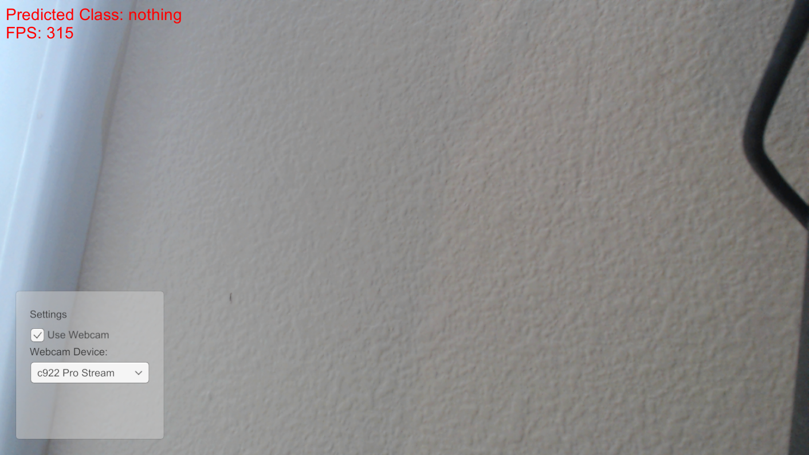
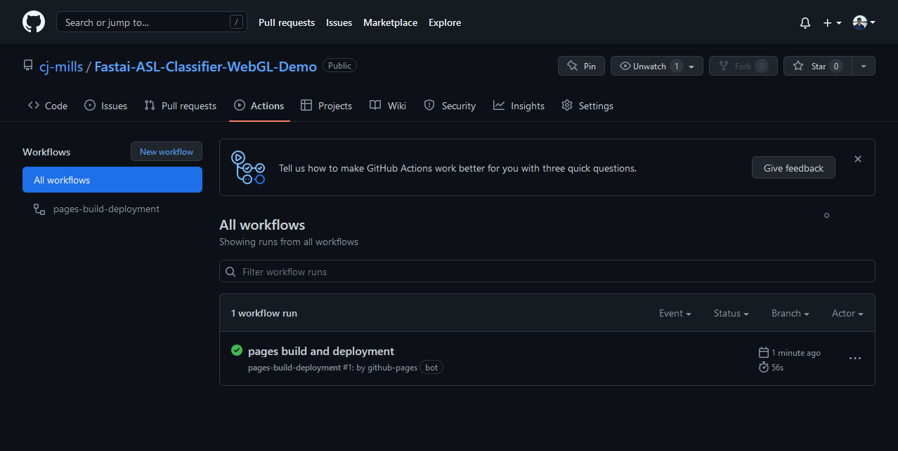
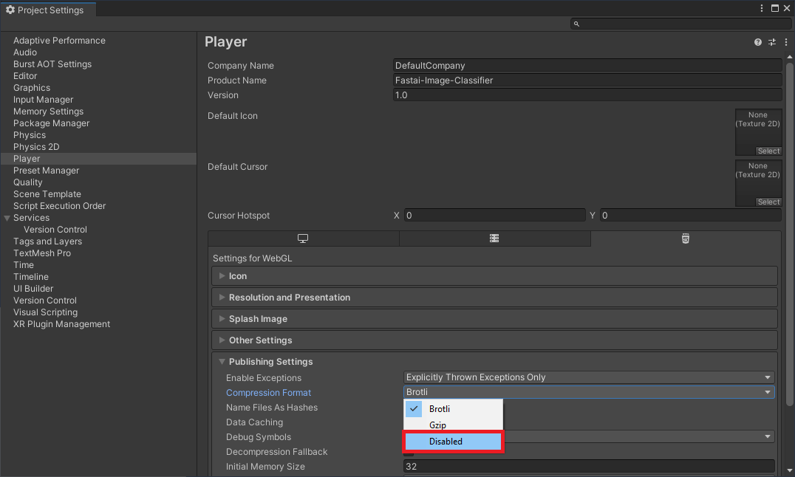
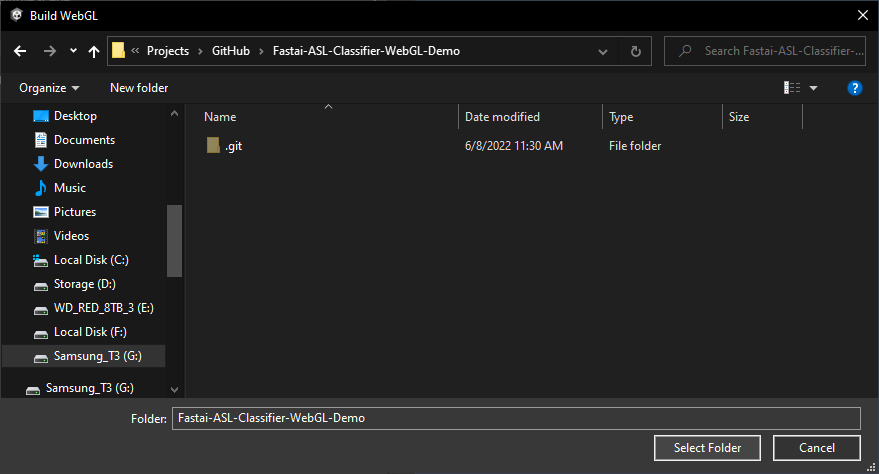
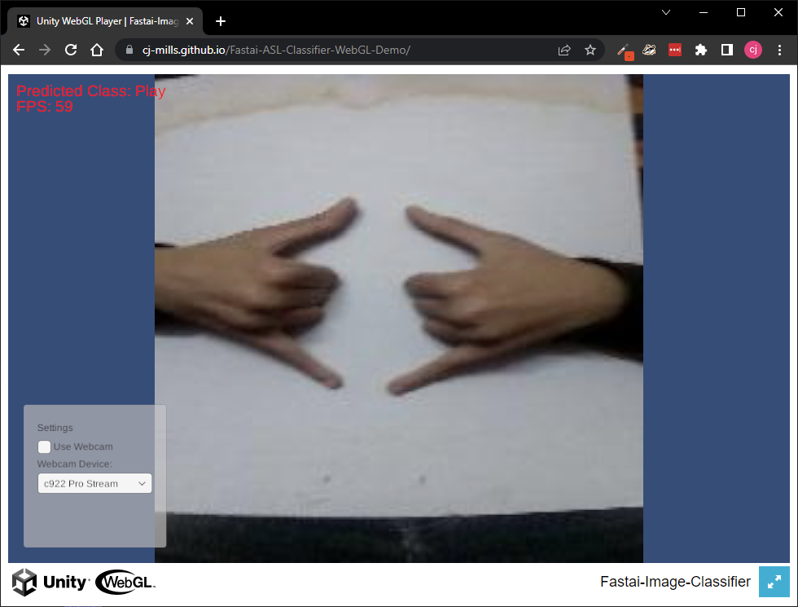

* [Overview](#overview)
* [Create GitHub Pages Repository](#create-github-pages-repository)
* [Build WebGL Application](#build-webgl-application)
* [Test Live Demo](#test-live-demo)
* [Summary](#summary)

## Overview

[Part 1](../part-1) covered training an image classification model using the fastai library and exporting it to ONNX. [Part 2](../part-2/) covered implementing a trained image classification model in a Unity project using the Barracuda library. In this post, we'll build a Unity project as a shareable web demo and host it for free using GitHub Pages. The image classifier will execute locally in the user's web browser. 

WebGL builds use Barracuda's Pixel Shader backend, which is not nearly as performant as the Compute Shader backend. Therefore, I recommend using WebGL for sharing prototypes and target operating systems for final projects.

**Pixel Shader Backend: ResNet18**

{fig-align="center"}

**Pixel Shader Backend: ResNet34**

{fig-align="center"}

**Compute Shader Backend: ResNet18**

{fig-align="center"}

**Compute Shader Backend: ResNet34**

{fig-align="center"}

**Compute Shader Backend with asynchronous GPU readback: ResNet18**

{fig-align="center"}

**Compute Shader Backend with asynchronous GPU readback: ResNet34**

{fig-align="center"}

## Create GitHub Pages Repository

We first need to create a [new GitHub repository](https://github.com/new) to store the WebGL build. We can do this on GitHub or locally using Git, GitHub Desktop, or another tool. 

{fig-align="center"}

Open the Settings tab for the new repository on GitHub.

{fig-align="center"}

Open the Pages section and select the main branch as the source for GitHub Pages.

{fig-align="center"}

Click the Save button to start the automated build process.

{fig-align="center"}

GitHub will provide a URL for accessing the web demo once it finishes building.

{fig-align="center"}

We can check the GitHub Pages build progress under the Actions tab for the repository.

{fig-align="center"}

The web page will be accessible once the "pages build and deployment" workflow completes. Although, we don't have any web pages at the moment.

{fig-align="center"}

## Build WebGL Application

In the Unity project, select `File → Build Settings...` in the top menu bar to open the Build Settings window.

{fig-align="center"}

Select `WebGL` from the list of platforms and click Switch Platform.

{fig-align="center"}

Unity enables compression by default for WebGL builds, which GitHub Pages does not support. We can disable compression in the Player Settings. Click the Player Settings button in the bottom-left corner of the Build Settings window.

{fig-align="center"}

Select `Disabled` from the Compression Format dropdown menu and close the Project Settings window.

{fig-align="center"}

We can test the WebGL build locally by clicking Build and Run in the Build Settings window.

{fig-align="center"}

Unity will prompt us to select a folder to store the build files.

{fig-align="center"}

Navigate to the local folder for the GitHub Pages repository and click Select Folder to start the build process.

{fig-align="center"}

Once the build completes, Unity will launch the demo in the default web browser. Unity caps the framerate to the platform's default [target framerate](https://docs.unity3d.com/ScriptReference/Application-targetFrameRate.html) by default. On my Windows 10 desktop, that is 60fps.

{fig-align="center"}

If we examine the repository folder, we can see a new `Build` folder, a `StreamingAssets` folder, a `TemplateData` folder, and an `index.html` file.

{fig-align="center"}

We can push the local changes to GitHub, which will automatically trigger the "pages build and deployment" workflow.

{fig-align="center"}

## Test Live Demo

We can test the web demo at the URL provided by GitHub once the build workflow completes.

{fig-align="center"}

## Summary

This post covered how to build a Unity project as a shareable web demo and host it using GitHub Pages.

**Previous:** [Fastai to Unity Tutorial Pt. 2](../part-2)

**Follow Up:** [How to Create a LibTorch Plugin for Unity on Windows Pt.1](../../fastai-libtorch-unity-tutorial/part-1)

**Follow Up:** [How to Create an OpenVINO Plugin for Unity on Windows Pt. 1](../../fastai-openvino-unity-tutorial/part-1)

**Intermediate Tutorial:** [End-to-End Object Detection for Unity With IceVision and OpenVINO Pt. 1](../../icevision-openvino-unity-tutorial/part-1)

**Project Resources:** [GitHub Repository](https://github.com/cj-mills/fastai-to-unity-tutorial)

<!-- Cloudflare Web Analytics --><!-- End Cloudflare Web Analytics -->