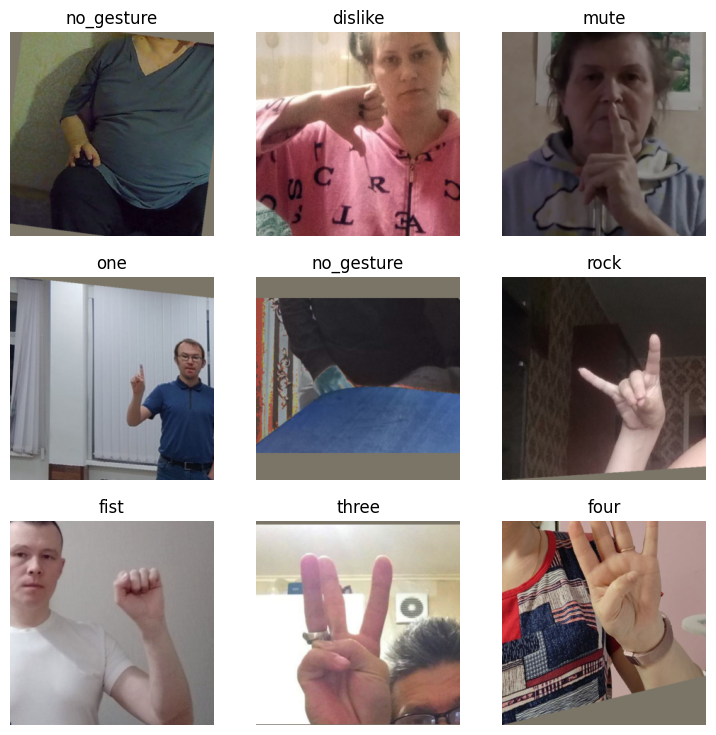
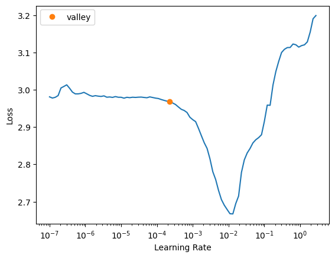

::: {.callout-tip}
## This post is part of the following series:
* [**Fine-Tuning Image Classifiers with Fastai and the timm library for Beginners**](/series/tutorials/fastai-train-image-classifier-series.html)
:::


* [Introduction](#introduction)
* [Getting Started with the Code](#getting-started-with-the-code)
* [Setting Up Your Python Environment](#setting-up-your-python-environment)
* [Importing the Required Dependencies](#importing-the-required-dependencies)
* [Setting Up the Project](#setting-up-the-project)
* [Loading and Exploring the Dataset](#loading-and-exploring-the-dataset)
* [Selecting a Model](#selecting-a-model)
* [Preparing the Data](#preparing-the-data)
* [Fine-tuning the Model](#fine-tuning-the-model)
* [Making Predictions with the Model](#making-predictions-with-the-model)
* [Conclusion](#conclusion)


## Introduction

Welcome to this hands-on guide to fine-tuning image classifiers with [fastai](https://docs.fast.ai/) and the [timm library](https://github.com/huggingface/pytorch-image-models)! Fine-tuning refers to taking a pre-trained model and adjusting its parameters using a new dataset to enhance its performance on a specific task. We can leverage pre-trained models to achieve high performance even when working with limited data and computational resources. The timm library further aids our goal with its wide range of pre-trained models, catering to diverse needs and use cases.

In this tutorial, we develop a hand gesture recognizer. Hand gesture recognition has many real-world applications, ranging from human-computer interaction and sign-language translation to creating immersive gaming experiences. By the end of this tutorial, you will have a practical hand gesture recognizer and a solid foundation to apply to other image classification tasks. 

You can try a live demo that uses a model trained with this tutorial's code and runs locally in your browser at the link below:

- [In-Browser Hand Gesture Recognition Demo](https://cj-mills.github.io/pytorch-timm-gesture-recognition-tutorial-code/)

Check out the following video for a quick preview:

{fig-align="center"}

This guide is structured so that you don't need a deep understanding of deep learning to complete it. If you follow the instructions, you can make it through! Yet, if you are eager to delve deeper into machine learning and deep learning, I recommend fast.ai's [Practical Deep Learning for Coders](https://course.fast.ai/) course. The course employs a hands-on approach that starts you off training models from the get-go and gradually digs deeper into the foundational concepts. 

Let's dive in and start training our hand gesture classifier!


## Getting Started with the Code

The tutorial code is available as a [Jupyter Notebook](https://jupyter.org/), which you can run locally or in a cloud-based environment like [Google Colab](https://colab.research.google.com/). If you're new to these platforms or need some guidance setting up, I've created dedicated tutorials to help you:

::: {.callout-tip title="Setup Guides" collapse="true"}

* [**Getting Started with Google Colab**](https://christianjmills.com/posts/google-colab-getting-started-tutorial/)**:** This tutorial introduces you to Google Colab, a free, cloud-based Jupyter Notebook service. You'll learn to write, run, and share Python code directly in your browser.

* [**Setting Up a Local Python Environment with Mamba for Machine Learning Projects on Windows**](https://christianjmills.com/posts/mamba-getting-started-tutorial-windows/)**:** This tutorial guides you through installing the Mamba package manager on Windows, setting up a local Python environment, and installing PyTorch and Jupyter for machine learning projects.


:::

No matter your choice of environment, you'll be well-prepared to follow along with the rest of this tutorial. You can download the notebook from the tutorial's GitHub repository or open the notebook directly in Google Colab using the links below.

::: {.callout-tip title="Tutorial Code" collapse="false"}

| Platform     | Jupyter Notebook                                             |
| ------------ | ------------------------------------------------------------ |
| Google Colab | [Open In Colab](https://colab.research.google.com/github/cj-mills/fastai-timm-gesture-recognition-tutorial-code/blob/main/notebooks/fastai-timm-image-classifier-training-colab.ipynb) |
| Linux        | [GitHub Repository](https://github.com/cj-mills/fastai-timm-gesture-recognition-tutorial-code/blob/main/notebooks/fastai-timm-image-classifier-training.ipynb) |
| Windows      | [GitHub Repository](https://github.com/cj-mills/fastai-timm-gesture-recognition-tutorial-code/blob/main/notebooks/fastai-timm-image-classifier-training-windows.ipynb) |


:::


## Setting Up Your Python Environment

Before diving into the code, we'll create a Python environment and install the necessary libraries. Creating a dedicated environment will ensure our project has all its dependencies in one place and does not interfere with other Python projects you may have.

Please note that this section is for readers setting up a local Python environment on their machines. If you're following this tutorial on a cloud-based platform like Google Colab, the platform already provides an isolated environment with many Python libraries pre-installed. In that case, you may skip this section and directly proceed to the [code sections](#importing-the-required-dependencies). However, you may still need to install certain libraries specific to this tutorial using similar `pip install` commands within your notebook. The dedicated Colab Notebook contains the instructions for running it in Google Colab.

### Creating a Python Environment

First, we'll create a Python environment using [Conda](https://docs.conda.io/en/latest/). Conda is a package manager that can create isolated Python environments. These environments are like sandboxed spaces where you can install Python libraries without affecting the rest of your system.

To create a new Python environment, open a terminal with Conda/Mamba installed and run the following commands:


::: {.panel-tabset}
## Conda

``` {.bash}
# Create a new Python 3.10 environment
conda create --name fastai-env python=3.10 -y
# Activate the environment
conda activate fastai-env
```

## Mamba

``` {.bash}
# Create a new Python 3.10 environment
mamba create --name fastai-env python=3.10 -y
# Activate the environment
mamba activate fastai-env
```

:::

The first command creates a new Python environment named `fastai-env` using Python 3.10. The `-y` flag confirms that we want to proceed with the installation. After building the environment, the second command activates it, setting it as the active Python environment.


### Installing Fastai

fastai is a deep learning library that helps simplify training neural networks by providing high-level components for standard deep learning tasks. It builds upon [PyTorch](https://pytorch.org/), a popular open-source machine learning framework.

To install the fastai library, we'll use the following command:

```bash
pip install fastai==2.7.13
```


### Installing Additional Libraries

We also need to install some additional libraries for our project. If you're new to Python or haven't used some of these packages before, don't worry.

::: {.callout-note title="Package Descriptions" collapse="true"}

| Package    | Description                                                  |
| ---------- | ------------------------------------------------------------ |
| `jupyter`  | An open-source web application that allows you to create and share documents that contain live code, equations, visualizations, and narrative text. ([link](https://jupyter.org/)) |
| `timm`     | The timm library provides state-of-the-art (SOTA) computer vision models, layers, utilities, optimizers, schedulers, data loaders, augmentations, and training/evaluation scripts. ([link](https://github.com/huggingface/pytorch-image-models)) |
| `torchtnt` | A library for PyTorch training tools and utilities. ([link](https://pytorch.org/tnt/stable/)) |

:::

Run the following commands to install these additional libraries:

```bash
# Install additional dependencies
pip install jupyter timm torchtnt==0.2.0
```


### Installing Utility Packages

We’ll also install some additional packages I made to help us handle images, interact with PyTorch, and work with Pandas DataFrames. These utility packages provide shortcuts for routine tasks and keep our code  clean and readable.

::: {.callout-note title="Package Descriptions" collapse="true"}

| Package                | Description                                                  |
| ---------------------- | ------------------------------------------------------------ |
| `cjm_pandas_utils`     | Some utility functions for working with Pandas. ([link](https://cj-mills.github.io/cjm-pandas-utils/)) |
| `cjm_pil_utils`        | Some PIL utility functions I frequently use. ([link](https://cj-mills.github.io/cjm-pil-utils/)) |
| `cjm_psl_utils`        | Some utility functions using the Python Standard Library. ([link](https://cj-mills.github.io/cjm-psl-utils/)) |
| `cjm_pytorch_utils`    | Some utility functions for working with PyTorch. ([link](https://cj-mills.github.io/cjm-pytorch-utils/)) |
| `cjm_torchvision_tfms` | Some custom Torchvision tranforms. ([link](https://cj-mills.github.io/cjm-torchvision-tfms/)) |


:::

```bash
# Install utility packages
pip install cjm_pandas_utils cjm_pil_utils cjm_pytorch_utils cjm_torchvision_tfms
```

Now, our environment is all set up and ready to go! Remember, these libraries are just tools. If you don't fully understand them yet, don't worry. As we go through the tutorial, we'll learn more about these tools and see them in action.


### Launching Jupyter Notebook

Now that our environment is ready, it's time to launch Jupyter Notebook. Jupyter Notebooks provide an interactive coding environment where we'll work for the rest of this tutorial.
To launch Jupyter Notebook, navigate to the location where you have stored the tutorial notebook (if you downloaded it) from a terminal with the `fastai-env` environment active, and type the following command:

```bash
jupyter notebook
```

This command will open a new tab in your default web browser, showing the Jupyter file browser. From the Jupyter file browser, you can open the tutorial notebook or create a new one to start the next section.
Remember: If you close your terminal, the Jupyter Notebook server will stop. So, keep your terminal running while you're working on the tutorial.


## Importing the Required Dependencies

With our environment set up, it's time to start the coding part of this tutorial. First, we will import the necessary Python packages into our Jupyter Notebook. Here's a brief overview of how we'll use these packages:

::: {.callout-note title="Package Uses" collapse="true"}

- **Python Standard Library dependencies**: These are built-in modules that come with Python. We'll use them for various tasks like handling file paths ([`pathlib.Path`](https://docs.python.org/3/library/pathlib.html#pathlib.Path)), manipulating JSON files ([`json`](https://docs.python.org/3/library/json.html)), random number generation ([`random`](https://docs.python.org/3/library/random.html)), mathematical operations ([`math`](https://docs.python.org/3/library/math.html)), copying Python objects ([`copy`](https://docs.python.org/3/library/copy.html)), and working with dates and times ([`datetime`](https://docs.python.org/3/library/datetime.html)).
- **Utility functions**: These are helper functions from the packages we installed earlier. They provide shortcuts for routine tasks and keep our code clean and readable.
- **matplotlib**: We use the matplotlib package to explore the dataset samples and class distribution.
- **NumPy**: We'll use it to store PIL Images as arrays of pixel values.
- **pandas**: We use Pandas `DataFrame` and `Series` objects to format data as tables.
- **PIL (Pillow)**: We'll use it for opening and working with image files.
- **timm library**: We'll use the timm library to download and prepare a pre-trained model for fine-tuning.


:::


```python
# Import Python Standard Library dependencies
from copy import copy
import datetime
import json
import math
from pathlib import Path
import random

# Import utility functions
from cjm_psl_utils.core import download_file, get_source_code
from cjm_pandas_utils.core import markdown_to_pandas
from cjm_pil_utils.core import resize_img, get_img_files
from cjm_pytorch_utils.core import pil_to_tensor, tensor_to_pil, denorm_img_tensor
from cjm_torchvision_tfms.core import ResizeMax, PadSquare, CustomTrivialAugmentWide

# Import matplotlib for creating plots
import matplotlib.pyplot as plt

# Import numpy 
import numpy as np

# Import pandas module for data manipulation
import pandas as pd

# Set options for Pandas DataFrame display
pd.set_option('max_colwidth', None)  # Do not truncate the contents of cells in the DataFrame
pd.set_option('display.max_rows', None)  # Display all rows in the DataFrame
pd.set_option('display.max_columns', None)  # Display all columns in the DataFrame

# Import PIL for image manipulation
from PIL import Image

# Import timm library
import timm

# Import PyTorch dependencies
import torch
import torchvision
torchvision.disable_beta_transforms_warning()
import torchvision.transforms.v2  as transforms
from torchvision.transforms.v2 import functional as TF
from torchtnt.utils import get_module_summary

# Import fastai computer vision functionality 
from fastai.vision.all import *
```

Having successfully imported the dependencies, we are ready to move to the next step.


## Setting Up the Project

In this section, we set up some basics for our project. First, we set a seed for generating random numbers using the [`set_seed`](https://docs.fast.ai/torch_core.html#set_seed) function included with the fastai library.

### Setting a Random Number Seed

A fixed seed value is helpful when training deep-learning models for reproducibility, debugging, and comparison. 

Having reproducible results allows others to confirm your findings. Using a fixed seed can make it easier to find bugs as it ensures the same inputs produce the same outputs. Likewise, using fixed seed values lets you compare performance between models and training parameters. 

That said, it's often a good idea to test different seed values to see how your model's performance varies between them. Also, don't use a fixed seed value when you deploy the final model.


```python
# Set the seed for generating random numbers in PyTorch, NumPy, and Python's random module.
seed = 1234
set_seed(seed)
```


### Setting the Device and Data Type

Next, we determine the device to run our computations on and the data type of our tensors using fastai's [`default_device`](https://docs.fast.ai/torch_core.html#default_device) function.


```python
device = default_device()
dtype = torch.float32
device, dtype
```


```text
(device(type='cuda', index=0), torch.float32)
```


### Setting the Directory Paths

We then need to set up a directory for our project to store our results and other related files. The following code creates the folder in the current directory (`./`). Update the path if that is not suitable for you.

We also need a place to store our datasets and a location to download the zip file containing the dataset. Readers following the tutorial on their local machine should select locations with read and write access to store archive files and datasets. For a cloud service like Google Colab, you can set it to the current directory.


```python
# The name for the project
project_name = f"fastai-timm-image-classifier"

# The path for the project folder
project_dir = Path(f"./{project_name}/")

# Create the project directory if it does not already exist
project_dir.mkdir(parents=True, exist_ok=True)

# Define path to store datasets
dataset_dir = Path("/mnt/980_1TB_2/Datasets/")
# Create the dataset directory if it does not exist
dataset_dir.mkdir(parents=True, exist_ok=True)

# Define path to store archive files
archive_dir = dataset_dir/'../Archive'
# Create the archive directory if it does not exist
archive_dir.mkdir(parents=True, exist_ok=True)

pd.Series({
    "Project Directory:": project_dir, 
    "Dataset Directory:": dataset_dir, 
    "Archive Directory:": archive_dir
}).to_frame().style.hide(axis='columns')
```

<div style="overflow-x:auto; max-height:500px">
<table id="T_c93ec">
  <thead>
  </thead>
  <tbody>
    <tr>
      <th id="T_c93ec_level0_row0" class="row_heading level0 row0" >Project Directory:</th>
      <td id="T_c93ec_row0_col0" class="data row0 col0" >fastai-timm-image-classifier</td>
    </tr>
    <tr>
      <th id="T_c93ec_level0_row1" class="row_heading level0 row1" >Dataset Directory:</th>
      <td id="T_c93ec_row1_col0" class="data row1 col0" >/mnt/980_1TB_2/Datasets</td>
    </tr>
    <tr>
      <th id="T_c93ec_level0_row2" class="row_heading level0 row2" >Archive Directory:</th>
      <td id="T_c93ec_row2_col0" class="data row2 col0" >/mnt/980_1TB_2/Datasets/../Archive</td>
    </tr>
  </tbody>
</table>
</div>

Double-check the project and dataset directories exist in the specified paths and that you can add files to them before continuing.

At this point, our environment is set up and ready to go. We've set our random seed, determined our computation device, and set up directories for our project and dataset. In the next section, we will download and explore the dataset.


## Loading and Exploring the Dataset

Now that we set up our project, we can start working with our dataset. The dataset we'll use is a downscaled subset of [HaGRID](https://github.com/hukenovs/hagrid) (HAnd Gesture Recognition Image Dataset) that I modified for image classification tasks. The dataset contains images for `18` distinct hand gestures and an additional `no_gesture` class for idle hands. The dataset is approximately `3.8 GB`, but you will need about `7.6 GB` to store the archive file and extracted dataset.

* **HuggingFace Hub Dataset Repository:** [cj-mills/hagrid-classification-512p-no-gesture-150k-zip](https://huggingface.co/datasets/cj-mills/hagrid-classification-512p-no-gesture-150k-zip)

The following steps demonstrate how to download the dataset from the HuggingFace Hub, inspect the dataset, and visualize some sample images.

### Setting the Dataset Path

We first need to construct the name for the chosen Hugging Face Hub dataset and define where to download and extract the dataset.


```python
# Set the name of the dataset
dataset_name = 'hagrid-classification-512p-no-gesture-150k-zip'

zip_file_name = dataset_name[:-4]

# Construct the HuggingFace Hub dataset name by combining the username and dataset name
hf_dataset = f'cj-mills/{dataset_name}'

# Create the path to the zip file that contains the dataset
archive_path = Path(f'{archive_dir}/{dataset_name}.zip')

# Create the path to the directory where the dataset will be extracted
dataset_path = Path(f'{dataset_dir}/{zip_file_name}')

pd.Series({
    "HuggingFace Dataset:": hf_dataset, 
    "Archive Path:": archive_path, 
    "Dataset Path:": dataset_path
}).to_frame().style.hide(axis='columns')
```

<div style="overflow-x:auto; max-height:500px">
<table id="T_2e08f">
  <thead>
  </thead>
  <tbody>
    <tr>
      <th id="T_2e08f_level0_row0" class="row_heading level0 row0" >HuggingFace Dataset:</th>
      <td id="T_2e08f_row0_col0" class="data row0 col0" >cj-mills/hagrid-classification-512p-no-gesture-150k-zip</td>
    </tr>
    <tr>
      <th id="T_2e08f_level0_row1" class="row_heading level0 row1" >Archive Path:</th>
      <td id="T_2e08f_row1_col0" class="data row1 col0" >/mnt/980_1TB_2/Datasets/../Archive/hagrid-classification-512p-no-gesture-150k-zip.zip</td>
    </tr>
    <tr>
      <th id="T_2e08f_level0_row2" class="row_heading level0 row2" >Dataset Path:</th>
      <td id="T_2e08f_row2_col0" class="data row2 col0" >/mnt/980_1TB_2/Datasets/hagrid-classification-512p-no-gesture-150k</td>
    </tr>
  </tbody>
</table>
</div>


### Downloading the Dataset

We can now download the dataset archive file and extract the dataset using the [`untar_data`](https://docs.fast.ai/data.external.html#untar_data) function included with the fastai library. We can delete the archive afterward to save space.


```python
# Construct the HuggingFace Hub dataset URL
dataset_url = f"https://huggingface.co/datasets/{hf_dataset}/resolve/main/{zip_file_name}.zip"

# Set whether to delete the archive file after extracting the dataset
delete_archive = True

# Download the dataset if not present
untar_data(dataset_url, archive=archive_dir.absolute(), data=dataset_dir.absolute())

# Delete the archive if specified
if archive_path.exists() and delete_archive: archive_path.unlink()
```


### Inspecting the Class Distribution

Next, we get the names of all the classes in our dataset and inspect the distribution of images among these classes. A balanced dataset (where each class has approximately the same number of instances) is ideal for training a machine-learning model.

#### Get Dataset Information


```python
# Get the file paths for each image in the dataset
img_paths = get_image_files(dataset_path)

# Get the number of samples for each image class
class_counts = Counter(path.parent.name for path in img_paths)

# Get the class names
class_names = list(class_counts.keys())

# Print the number of samples for each image class
class_counts_df = pd.DataFrame.from_dict(class_counts, orient='index', columns=['Count'])
class_counts_df
```

<div style="overflow-x:auto; max-height:500px">
<table border="1" class="dataframe">
  <thead>
    <tr style="text-align: right;">
      <th></th>
      <th>Count</th>
    </tr>
  </thead>
  <tbody>
    <tr>
      <th>call</th>
      <td>6939</td>
    </tr>
    <tr>
      <th>dislike</th>
      <td>7028</td>
    </tr>
    <tr>
      <th>fist</th>
      <td>6882</td>
    </tr>
    <tr>
      <th>four</th>
      <td>7183</td>
    </tr>
    <tr>
      <th>like</th>
      <td>6823</td>
    </tr>
    <tr>
      <th>mute</th>
      <td>7139</td>
    </tr>
    <tr>
      <th>no_gesture</th>
      <td>27823</td>
    </tr>
    <tr>
      <th>ok</th>
      <td>6924</td>
    </tr>
    <tr>
      <th>one</th>
      <td>7062</td>
    </tr>
    <tr>
      <th>palm</th>
      <td>7050</td>
    </tr>
    <tr>
      <th>peace</th>
      <td>6965</td>
    </tr>
    <tr>
      <th>peace_inverted</th>
      <td>6876</td>
    </tr>
    <tr>
      <th>rock</th>
      <td>6883</td>
    </tr>
    <tr>
      <th>stop</th>
      <td>6893</td>
    </tr>
    <tr>
      <th>stop_inverted</th>
      <td>7142</td>
    </tr>
    <tr>
      <th>three</th>
      <td>6940</td>
    </tr>
    <tr>
      <th>three2</th>
      <td>6870</td>
    </tr>
    <tr>
      <th>two_up</th>
      <td>7346</td>
    </tr>
    <tr>
      <th>two_up_inverted</th>
      <td>6967</td>
    </tr>
  </tbody>
</table>
</div>

---


#### Visualize the class distribution


```python
# Plot the distribution
class_counts_df.plot(kind='bar')
plt.title('Class distribution')
plt.ylabel('Count')
plt.xlabel('Classes')
plt.xticks(range(len(class_counts_df.index)), class_names)  # Set the x-axis tick labels
plt.xticks(rotation=75)  # Rotate x-axis labels
plt.gca().legend().set_visible(False)
plt.show()
```

{fig-align="center"}

Each class, excluding the `no_gesture` class, has roughly the same number of samples. The `no_gesture` folder contains approximately four times as many images because of the immense variety of non-matching hand positions.


### Visualizing Sample Images

Lastly, we will visualize a sample image from each class in our dataset. Visualizing the samples helps us get a feel for the kind of images we're working with and whether they're suitable for the task at hand.


```python
# Get paths for the first sample in the dataset for each class
sample_paths = [next((dataset_path/class_name).iterdir()) for class_name in class_names]
sample_paths.sort()

# Calculate the number of rows and columns
grid_size = math.floor(math.sqrt(len(sample_paths)))
n_rows = grid_size+(1 if grid_size**2 < len(sample_paths) else 0)
n_cols = grid_size

# Create a list to store the first image found for each class
images = [Image.open(path) for path in sample_paths]
labels = [path.parent.name for path in sample_paths]

# Create a figure for the grid
fig, axs = plt.subplots(n_rows, n_cols, figsize=(10,10))

for i, ax in enumerate(axs.flatten()):
    # If we have an image for this subplot
    if i < len(images) and images[i]:
        # Add the image to the subplot
        ax.imshow(np.array(images[i]))
        # Set the title to the corresponding class name
        ax.set_title(labels[i])
        # Remove the axis
        ax.axis('off')
    else:
        # If no image, hide the subplot
        ax.axis('off')

# Display the grid
plt.tight_layout()
plt.show()
```

{fig-align="center"}

We have loaded the dataset, inspected its class distribution, and visualized some sample images. In the next section, we will select and load our model.


## Selecting a Model

Choosing a suitable model for your task is crucial for the success of your machine learning project. The model you select will depend on several factors, including the size and nature of your dataset, the problem you're trying to solve, and the computational resources you have at your disposal.

### Exploring Available Models

You can explore the pretrained models available in the timm library using the `timm.list_models()` method. The library has hundreds of models, so we'll narrow our search to the [ResNet18](https://arxiv.org/abs/1512.03385) family of models. ResNet 18 models are popular for image classification tasks due to their balance of accuracy and speed.


```python
pd.DataFrame(timm.list_models('resnet18*', pretrained=True))
```

<div style="overflow-x:auto; max-height:500px">
<table border="1" class="dataframe">
  <thead>
    <tr style="text-align: right;">
      <th></th>
      <th>0</th>
    </tr>
  </thead>
  <tbody>
    <tr>
      <th>0</th>
      <td>resnet18.a1_in1k</td>
    </tr>
    <tr>
      <th>1</th>
      <td>resnet18.a2_in1k</td>
    </tr>
    <tr>
      <th>2</th>
      <td>resnet18.a3_in1k</td>
    </tr>
    <tr>
      <th>3</th>
      <td>resnet18.fb_ssl_yfcc100m_ft_in1k</td>
    </tr>
    <tr>
      <th>4</th>
      <td>resnet18.fb_swsl_ig1b_ft_in1k</td>
    </tr>
    <tr>
      <th>5</th>
      <td>resnet18.gluon_in1k</td>
    </tr>
    <tr>
      <th>6</th>
      <td>resnet18.tv_in1k</td>
    </tr>
    <tr>
      <th>7</th>
      <td>resnet18d.ra2_in1k</td>
    </tr>
  </tbody>
</table>
</div>


### Choosing the ResNet18-D Model

For this tutorial, I went with the pretrained [ResNet 18-D](https://github.com/huggingface/pytorch-image-models/blob/4b8cfa6c0a355a9b3cb2a77298b240213fb3b921/timm/models/resnet.py#L869) model. This model's balance of accuracy and speed makes it suitable for real-time applications, such as hand gesture recognition. While this model is a good all-rounder, others may work better for specific applications. For example, some models are designed to run on mobile devices and may sacrifice some accuracy for improved performance. Whatever your requirements are, the timm library likely has a suitable model for your needs. Feel free to try different models and see how they compare.


### Inspecting the ResNet18-D Model Configuration

Next, we will inspect the configuration of our chosen model. The model config gives us information about the pretraining process for the model.


```python
# Import the resnet module
from timm.models import resnet

# Define the ResNet model variant to use
resnet_model = 'resnet18d'

# Get the default configuration of the chosen model
model_cfg = resnet.default_cfgs[resnet_model].default.to_dict()

# Show the default configuration values
pd.DataFrame.from_dict(model_cfg, orient='index')
```

<div style="overflow-x:auto; max-height:500px">
<table border="1" class="dataframe">
  <thead>
    <tr style="text-align: right;">
      <th></th>
      <th>0</th>
    </tr>
  </thead>
  <tbody>
    <tr>
      <th>url</th>
      <td>https://github.com/rwightman/pytorch-image-models/releases/download/v0.1-weights/resnet18d_ra2-48a79e06.pth</td>
    </tr>
    <tr>
      <th>hf_hub_id</th>
      <td>timm/</td>
    </tr>
    <tr>
      <th>custom_load</th>
      <td>False</td>
    </tr>
    <tr>
      <th>input_size</th>
      <td>(3, 224, 224)</td>
    </tr>
    <tr>
      <th>test_input_size</th>
      <td>(3, 288, 288)</td>
    </tr>
    <tr>
      <th>fixed_input_size</th>
      <td>False</td>
    </tr>
    <tr>
      <th>interpolation</th>
      <td>bicubic</td>
    </tr>
    <tr>
      <th>crop_pct</th>
      <td>0.875</td>
    </tr>
    <tr>
      <th>test_crop_pct</th>
      <td>0.95</td>
    </tr>
    <tr>
      <th>crop_mode</th>
      <td>center</td>
    </tr>
    <tr>
      <th>mean</th>
      <td>(0.485, 0.456, 0.406)</td>
    </tr>
    <tr>
      <th>std</th>
      <td>(0.229, 0.224, 0.225)</td>
    </tr>
    <tr>
      <th>num_classes</th>
      <td>1000</td>
    </tr>
    <tr>
      <th>pool_size</th>
      <td>(7, 7)</td>
    </tr>
    <tr>
      <th>first_conv</th>
      <td>conv1.0</td>
    </tr>
    <tr>
      <th>classifier</th>
      <td>fc</td>
    </tr>
    <tr>
      <th>origin_url</th>
      <td>https://github.com/huggingface/pytorch-image-models</td>
    </tr>
  </tbody>
</table>
</div>

---


### Retrieving Normalization Statistics

Before we can use the ResNet18-D model, we need to normalize our dataset. Normalization is a process that changes the range of pixel intensity values to make the neural network converge faster during training. It is performed by subtracting the mean from the pixel values and dividing by the standard deviation of the dataset. The mean and standard deviation values specific to the dataset used in the pretraining process of our model are called normalization statistics. To do this, we will retrieve the normalization statistics (mean and std) specific to our pretrained model.


```python
# Retrieve normalization statistics (mean and std) specific to the pretrained model
mean, std = model_cfg['mean'], model_cfg['std']
norm_stats = (mean, std)

# Print the mean and standard deviation
pd.DataFrame(norm_stats)
```

<div style="overflow-x:auto; max-height:500px">
<table border="1" class="dataframe">
  <thead>
    <tr style="text-align: right;">
      <th></th>
      <th>0</th>
      <th>1</th>
      <th>2</th>
    </tr>
  </thead>
  <tbody>
    <tr>
      <th>0</th>
      <td>0.485</td>
      <td>0.456</td>
      <td>0.406</td>
    </tr>
    <tr>
      <th>1</th>
      <td>0.229</td>
      <td>0.224</td>
      <td>0.225</td>
    </tr>
  </tbody>
</table>
</div>


### Loading the ResNet18-D Model

We can now load our model. We'll set the number of output classes equal to the number of image classes in our dataset. We'll also specify the device and data type for the model.


```python
# Create a pretrained ResNet model with the number of output classes equal to the number of class names
# 'timm.create_model' function automatically downloads and initializes the pretrained weights
resnet18 = timm.create_model(resnet_model, pretrained=True, num_classes=len(class_names))

# Set the device and data type for the model
resnet18 = resnet18.to(device=device, dtype=dtype)

# Add attributes to store the device and model name for later reference
resnet18.device = device
resnet18.name = resnet_model
```

### Selecting the Model

With our model loaded, we can now select it for training.


```python
model = resnet18
```

### Summarizing the Model

Finally, let's generate a summary of our model. The summary gives us an overview of its structure and performance characteristics.


```python
# Define the input to the model
test_inp = torch.randn(1, 3, 256, 256).to(device)

# Get a summary of the model as a Pandas DataFrame
summary_df = markdown_to_pandas(f"{get_module_summary(model, [test_inp])}")

# Filter the summary to only contain Conv2d layers and the model
summary_df = summary_df[(summary_df.index == 0) | (summary_df['Type'] == 'Conv2d')]

# Remove the column "Contains Uninitialized Parameters?"
summary_df.drop('Contains Uninitialized Parameters?', axis=1)
```

<div style="overflow-x:auto; max-height:500px">
<table border="1" class="dataframe">
  <thead>
    <tr style="text-align: right;">
      <th></th>
      <th>Type</th>
      <th># Parameters</th>
      <th># Trainable Parameters</th>
      <th>Size (bytes)</th>
      <th>Forward FLOPs</th>
      <th>Backward FLOPs</th>
      <th>In size</th>
      <th>Out size</th>
    </tr>
  </thead>
  <tbody>
    <tr>
      <th>0</th>
      <td>ResNet</td>
      <td>11.2 M</td>
      <td>11.2 M</td>
      <td>44.9 M</td>
      <td>2.7 G</td>
      <td>5.3 G</td>
      <td>[1, 3, 256, 256]</td>
      <td>[1, 19]</td>
    </tr>
    <tr>
      <th>2</th>
      <td>Conv2d</td>
      <td>864</td>
      <td>864</td>
      <td>3.5 K</td>
      <td>14.2 M</td>
      <td>14.2 M</td>
      <td>[1, 3, 256, 256]</td>
      <td>[1, 32, 128, 128]</td>
    </tr>
    <tr>
      <th>5</th>
      <td>Conv2d</td>
      <td>9.2 K</td>
      <td>9.2 K</td>
      <td>36.9 K</td>
      <td>150 M</td>
      <td>301 M</td>
      <td>[1, 32, 128, 128]</td>
      <td>[1, 32, 128, 128]</td>
    </tr>
    <tr>
      <th>8</th>
      <td>Conv2d</td>
      <td>18.4 K</td>
      <td>18.4 K</td>
      <td>73.7 K</td>
      <td>301 M</td>
      <td>603 M</td>
      <td>[1, 32, 128, 128]</td>
      <td>[1, 64, 128, 128]</td>
    </tr>
    <tr>
      <th>14</th>
      <td>Conv2d</td>
      <td>36.9 K</td>
      <td>36.9 K</td>
      <td>147 K</td>
      <td>150 M</td>
      <td>301 M</td>
      <td>[1, 64, 64, 64]</td>
      <td>[1, 64, 64, 64]</td>
    </tr>
    <tr>
      <th>19</th>
      <td>Conv2d</td>
      <td>36.9 K</td>
      <td>36.9 K</td>
      <td>147 K</td>
      <td>150 M</td>
      <td>301 M</td>
      <td>[1, 64, 64, 64]</td>
      <td>[1, 64, 64, 64]</td>
    </tr>
    <tr>
      <th>23</th>
      <td>Conv2d</td>
      <td>36.9 K</td>
      <td>36.9 K</td>
      <td>147 K</td>
      <td>150 M</td>
      <td>301 M</td>
      <td>[1, 64, 64, 64]</td>
      <td>[1, 64, 64, 64]</td>
    </tr>
    <tr>
      <th>28</th>
      <td>Conv2d</td>
      <td>36.9 K</td>
      <td>36.9 K</td>
      <td>147 K</td>
      <td>150 M</td>
      <td>301 M</td>
      <td>[1, 64, 64, 64]</td>
      <td>[1, 64, 64, 64]</td>
    </tr>
    <tr>
      <th>33</th>
      <td>Conv2d</td>
      <td>73.7 K</td>
      <td>73.7 K</td>
      <td>294 K</td>
      <td>75.5 M</td>
      <td>150 M</td>
      <td>[1, 64, 64, 64]</td>
      <td>[1, 128, 32, 32]</td>
    </tr>
    <tr>
      <th>38</th>
      <td>Conv2d</td>
      <td>147 K</td>
      <td>147 K</td>
      <td>589 K</td>
      <td>150 M</td>
      <td>301 M</td>
      <td>[1, 128, 32, 32]</td>
      <td>[1, 128, 32, 32]</td>
    </tr>
    <tr>
      <th>43</th>
      <td>Conv2d</td>
      <td>8.2 K</td>
      <td>8.2 K</td>
      <td>32.8 K</td>
      <td>8.4 M</td>
      <td>16.8 M</td>
      <td>[1, 64, 32, 32]</td>
      <td>[1, 128, 32, 32]</td>
    </tr>
    <tr>
      <th>46</th>
      <td>Conv2d</td>
      <td>147 K</td>
      <td>147 K</td>
      <td>589 K</td>
      <td>150 M</td>
      <td>301 M</td>
      <td>[1, 128, 32, 32]</td>
      <td>[1, 128, 32, 32]</td>
    </tr>
    <tr>
      <th>51</th>
      <td>Conv2d</td>
      <td>147 K</td>
      <td>147 K</td>
      <td>589 K</td>
      <td>150 M</td>
      <td>301 M</td>
      <td>[1, 128, 32, 32]</td>
      <td>[1, 128, 32, 32]</td>
    </tr>
    <tr>
      <th>56</th>
      <td>Conv2d</td>
      <td>294 K</td>
      <td>294 K</td>
      <td>1.2 M</td>
      <td>75.5 M</td>
      <td>150 M</td>
      <td>[1, 128, 32, 32]</td>
      <td>[1, 256, 16, 16]</td>
    </tr>
    <tr>
      <th>61</th>
      <td>Conv2d</td>
      <td>589 K</td>
      <td>589 K</td>
      <td>2.4 M</td>
      <td>150 M</td>
      <td>301 M</td>
      <td>[1, 256, 16, 16]</td>
      <td>[1, 256, 16, 16]</td>
    </tr>
    <tr>
      <th>66</th>
      <td>Conv2d</td>
      <td>32.8 K</td>
      <td>32.8 K</td>
      <td>131 K</td>
      <td>8.4 M</td>
      <td>16.8 M</td>
      <td>[1, 128, 16, 16]</td>
      <td>[1, 256, 16, 16]</td>
    </tr>
    <tr>
      <th>69</th>
      <td>Conv2d</td>
      <td>589 K</td>
      <td>589 K</td>
      <td>2.4 M</td>
      <td>150 M</td>
      <td>301 M</td>
      <td>[1, 256, 16, 16]</td>
      <td>[1, 256, 16, 16]</td>
    </tr>
    <tr>
      <th>74</th>
      <td>Conv2d</td>
      <td>589 K</td>
      <td>589 K</td>
      <td>2.4 M</td>
      <td>150 M</td>
      <td>301 M</td>
      <td>[1, 256, 16, 16]</td>
      <td>[1, 256, 16, 16]</td>
    </tr>
    <tr>
      <th>79</th>
      <td>Conv2d</td>
      <td>1.2 M</td>
      <td>1.2 M</td>
      <td>4.7 M</td>
      <td>75.5 M</td>
      <td>150 M</td>
      <td>[1, 256, 16, 16]</td>
      <td>[1, 512, 8, 8]</td>
    </tr>
    <tr>
      <th>84</th>
      <td>Conv2d</td>
      <td>2.4 M</td>
      <td>2.4 M</td>
      <td>9.4 M</td>
      <td>150 M</td>
      <td>301 M</td>
      <td>[1, 512, 8, 8]</td>
      <td>[1, 512, 8, 8]</td>
    </tr>
    <tr>
      <th>89</th>
      <td>Conv2d</td>
      <td>131 K</td>
      <td>131 K</td>
      <td>524 K</td>
      <td>8.4 M</td>
      <td>16.8 M</td>
      <td>[1, 256, 8, 8]</td>
      <td>[1, 512, 8, 8]</td>
    </tr>
    <tr>
      <th>92</th>
      <td>Conv2d</td>
      <td>2.4 M</td>
      <td>2.4 M</td>
      <td>9.4 M</td>
      <td>150 M</td>
      <td>301 M</td>
      <td>[1, 512, 8, 8]</td>
      <td>[1, 512, 8, 8]</td>
    </tr>
    <tr>
      <th>97</th>
      <td>Conv2d</td>
      <td>2.4 M</td>
      <td>2.4 M</td>
      <td>9.4 M</td>
      <td>150 M</td>
      <td>301 M</td>
      <td>[1, 512, 8, 8]</td>
      <td>[1, 512, 8, 8]</td>
    </tr>
  </tbody>
</table>
</div>

---

We can see from the summary that the ResNet18-D model is about `45 MB` in size and needs to perform about `2.7 billion` floating-point operations to process a single `256x256` input image. For context, the larger mid-size ResNet50-D model is about `95 MB` and performs about `5.7 billion` floating-point ops for the same image. On the other end, the tiniest variant of the mobile-optimized MobileNetV3 model is `2.4 MB` and only takes about `30 million` floating-point operations.

That is valuable information when considering how we will deploy the fine-tuned model. For example, the in-browser demo I mentioned will first download the model to your local machine. The larger the model, the longer it will take for the demo to start. Likewise, the number of floating-point operations will influence what hardware can run the model smoothly. For real-time applications, even milliseconds can matter for inference speed. Inference involves making predictions with a trained model on new, unseen data.

The model architecture also influences inference speed beyond the raw number of floating-point operations. The MobileNetv3 architecture is tuned to mobile phone CPUs, while the ResNet architectures can better leverage larger GPUs.

That completes the model selection and setup. In the next section, we will prepare our dataset for training.


## Preparing the Data

Next, we will prepare our data for the model training process. The data preparation involves several steps, such as applying data augmentation techniques, resizing and padding the images, and initializing DataLoaders to feed data to the model.

### Selecting a Sample Image

Let's begin by selecting a random image from the dataset to visualize the data preparation steps.


```python
# Select a random item from the dataset
item_path = random.choice(img_paths)

label = item_path.parent.name
sample_img = Image.open(item_path)
    
print(f"Image Label: {label}")
    
# Display the image
sample_img
```

```text
Image Label: stop
```

{fig-align="center"}


### Data Augmentation

Now, we define what data augmentations to apply to images during training. Data augmentation is a technique that effectively expands the size and diversity of a dataset by creating variations of existing samples. It helps the model learn general features instead of memorizing specific examples.

We will use [trivial augmentation](https://arxiv.org/abs/2103.10158), which applies a single, random transform to each image. This simple method can be highly effective for data augmentation.

PyTorch provides a ready-made transform that implements this augmentation technique. Some default parameters are slightly extreme for this dataset, so we will tweak them using a customized version of the [`TrivialAugmentWide`](https://pytorch.org/vision/main/generated/torchvision.transforms.TrivialAugmentWide.html) class from the TorchVision transforms module. 

With the modified version, we can pass a dictionary of operations to augment the images, allowing us to customize their parameters.


```python
# Define the number of potential values for each augmentation
num_bins = 31

# Define the types of potential augmentations and their possible values
custom_augmentation_space = {
    # Identity operation doesn't change the image
    "Identity": (torch.tensor(0.0), False),
            
    # Distort the image along the x or y axis, respectively.
    "ShearX": (torch.linspace(0.0, 0.25, num_bins), True),
    "ShearY": (torch.linspace(0.0, 0.25, num_bins), True),

    # Move the image along the x or y axis, respectively.
    "TranslateX": (torch.linspace(0.0, 32.0, num_bins), True),
    "TranslateY": (torch.linspace(0.0, 32.0, num_bins), True),

    # Rotate operation: rotates the image.
    "Rotate": (torch.linspace(0.0, 45.0, num_bins), True),

    # Adjust brightness, color, contrast,and sharpness respectively.
    "Brightness": (torch.linspace(0.0, 0.75, num_bins), True),
    "Color": (torch.linspace(0.0, 0.99, num_bins), True),
    "Contrast": (torch.linspace(0.0, 0.99, num_bins), True),
    "Sharpness": (torch.linspace(0.0, 0.99, num_bins), True),

    # Reduce the number of bits used to express the color in each channel of the image.
    "Posterize": (8 - (torch.arange(num_bins) / ((num_bins - 1) / 6)).round().int(), False),

    # Invert all pixel values above a threshold.
    "Solarize": (torch.linspace(255.0, 0.0, num_bins), False),

    # Maximize the image contrast by setting the darkest color to black and the lightest to white.
    "AutoContrast": (torch.tensor(0.0), False),

    # Equalize the image histogram to improve its contrast.
    "Equalize": (torch.tensor(0.0), False),
}

# Create a CustomTrivialAugmentWide the specified augmentation space
trivial_aug = CustomTrivialAugmentWide(fill=(123, 117, 104), op_meta=custom_augmentation_space)
```

You can test the custom augmentation method by applying it to the sample image and displaying the result. Remember, the augmentation should be different each time we use it.

#### Test the transform


```python
# Apply the TrivialAugmentWide to the tensor
trivial_aug(sample_img)
```

{fig-align="center"}


### Image Resizing and Padding

Next, we will use a couple of image transforms to resize and pad images, making them a uniform size. Making all the input images the same size allows us to feed samples to the model in batches to leverage our GPU more efficiently.

The [first](https://cj-mills.github.io/cjm-torchvision-tfms/core.html#resizemax) resizes images based on their largest dimension rather than their smallest. The [second](https://cj-mills.github.io/cjm-torchvision-tfms/core.html#padsquare) applies square padding and allows the padding to be applied equally on both sides or randomly split between the two sides.

For training, we'll resize and pad the images to `288x288`. That should be large enough for the model to get adequate detail while keeping training time low.

#### Set training image size


```python
train_sz = 288
```

#### Test the transform


```python
# Crop the source image
w, h = sample_img.size
cropped_img = sample_img.crop([0, h//4, w, h-h//4])

# Compose transforms to resize and pad input images
resize_pad = transforms.Compose([
    ResizeMax(max_sz=train_sz),                       # Create a `ResizeMax` object
    PadSquare(shift=True),                            # Create a `PadSquare` object
    transforms.Resize([train_sz] * 2, antialias=True) # Ensure the image is square
])

# Resize and pad the tensor
resized_padded_img = resize_pad(cropped_img)

# Display the updated image
display(resized_padded_img)

pd.Series({
    "Source Image:": sample_img.size,
    "Cropped Image:": cropped_img.size,
    "Resized Padded Image:": resized_padded_img.size,
}).to_frame().style.hide(axis='columns')
```

{fig-align="center"}

<div style="overflow-x:auto; max-height:500px">
<table id="T_90121">
  <thead>
  </thead>
  <tbody>
    <tr>
      <th id="T_90121_level0_row0" class="row_heading level0 row0" >Source Image:</th>
      <td id="T_90121_row0_col0" class="data row0 col0" >(512, 512)</td>
    </tr>
    <tr>
      <th id="T_90121_level0_row1" class="row_heading level0 row1" >Cropped Image:</th>
      <td id="T_90121_row1_col0" class="data row1 col0" >(512, 256)</td>
    </tr>
    <tr>
      <th id="T_90121_level0_row2" class="row_heading level0 row2" >Resized Padded Image:</th>
      <td id="T_90121_row2_col0" class="data row2 col0" >(288, 288)</td>
    </tr>
  </tbody>
</table>
</div>


### Create a Fastai Transform Wrapper

The fastai library uses a custom [`Transform`](https://fastcore.fast.ai/transform.html) class for working with its DataLoaders. We can still use our TorchVision transforms by creating a simple wrapper class.

Later, we will use fastai's [`Learner.export`](https://docs.fast.ai/learner.html#learner.export) method to export our training pipeline to a file. The export method uses Python's [pickle](https://docs.python.org/3/library/pickle.html) object serialization module, so we must save this wrapper class to disk for future use.


```python
%%writefile fastai_transforms.py
import torchvision
torchvision.disable_beta_transforms_warning()
import torchvision.transforms.v2  as transforms
from fastcore.transform import Transform
from fastai.vision.core import PILImage

class TorchvisionComposeWrapper(Transform):
    """
    Wrap Torchvision transforms for use within Fastai's pipeline.

    Args:
    - transforms_list (list): List of Torchvision transforms.
    """
    
    def __init__(self, transforms_list):
        """Initialize with a list of torchvision transforms."""
        self.transforms = transforms.Compose(transforms_list)

    def encodes(self, x: PILImage) -> PILImage:
        """Apply the Torchvision transformations to the PILImage."""
        return PILImage(self.transforms(x))
```

```text
Overwriting fastai_transforms.py
```


### Item and Batch Transforms

Now, we can import our wrapper class and define what transforms to apply to individual images and batches of tensors. 

We will apply the data augmentations, resizing, and padding to individual images and normalize input in batches.


```python
from fastai_transforms import TorchvisionComposeWrapper

# Define the transformations to apply to individual images
img_tfms = [trivial_aug, resize_pad]
item_tfms = [TorchvisionComposeWrapper(img_tfms)]

# Convert normalization stats to tensors
mean_tensor = torch.tensor(norm_stats[0]).view(1, 3, 1, 1).to(device)
std_tensor = torch.tensor(norm_stats[1]).view(1, 3, 1, 1).to(device)

# Define the transforms to apply to batches of tensors
batch_tfms = [Normalize(mean=mean_tensor, std=std_tensor)]
```


### Training Batch Size

Next, we set the batch size for training. This number indicates how many sample images get fed to the model at once. The larger the batch size, the more GPU memory we need. The current batch size should be fine for most modern GPUs. If you still get an out-of-memory error, try lowering the batch size to 8, then restart the Jupyter Notebook.


```python
bs = 32
```


### Initialize DataLoaders

fastai makes it easy to initialize the DataLoaders for an image dataset from a single [function call](https://docs.fast.ai/vision.data.html#imagedataloaders.from_folder).

fastai will automatically split the dataset samples into training and validation sets based on the percentage we specify. The model will use the training set to update its parameters, and we will use the validation set to evaluate model performance on data it has not seen before.

Validation sets are needed when training models because we want to verify the model can generalize well to new data before we deploy it. Since we want to see how the model performs on regular images instead of augmented ones, we will remove the trivial augmentation transform from the validation DataLoader object.


```python
dls = ImageDataLoaders.from_folder(
    path=dataset_path,    # The path to the root folder containing the images.
    valid_pct=0.1,        # The percentage of the images to use for validation
    bs=bs,                # The number of samples to process in a single pass through the model
    item_tfms=item_tfms,  # A list of transformations to apply to each individual image.
    batch_tfms=batch_tfms # A list of transformations to apply to each batch of tensors
)

# Remove the trivial augmentation transform
dls.valid.after_item = Pipeline([TorchvisionComposeWrapper(img_tfms[1:]), ToTensor])

# Print the number of batches in the training and validation DataLoaders
pd.Series({
    'Number of batches in train DataLoader:': len(dls.train),
    'Number of batches in validation DataLoader:': len(dls.valid)}
).to_frame().style.hide(axis='columns')
```

<div style="overflow-x:auto; max-height:500px">
<table id="T_c6731">
  <thead>
  </thead>
  <tbody>
    <tr>
      <th id="T_c6731_level0_row0" class="row_heading level0 row0" >Number of batches in train DataLoader:</th>
      <td id="T_c6731_row0_col0" class="data row0 col0" >4323</td>
    </tr>
    <tr>
      <th id="T_c6731_level0_row1" class="row_heading level0 row1" >Number of batches in validation DataLoader:</th>
      <td id="T_c6731_row1_col0" class="data row1 col0" >481</td>
    </tr>
  </tbody>
</table>
</div>

Before we move on, let's verify the DataLoaders are applying the transforms as intended.

### Inspect Samples


```python
dls.train.show_batch()
```

{fig-align="center"}

```python
dls.valid.show_batch()
```

{fig-align="center"}

From the above samples, we can see the training DataLoader is indeed applying the random augmentations and resizing/padding the images to squares. Meanwhile, the validation DataLoader only resizes and pads the samples.


That completes the data preparation. Now, we can finally train our hand gesture recognizer.


## Fine-tuning the Model

In this section, we will use fastai to fine-tune our model. 

### Set the Model Checkpoint Path

Before we proceed with training, we will generate a timestamp for the training session and create a directory to store a checkpoint for the fine-tuned model. That enables us to load the model later to resume training, export the model to a different format, or perform inference directly.


```python
# Generate timestamp for the training session (Year-Month-Day_Hour_Minute_Second)
timestamp = datetime.now().strftime("%Y-%m-%d_%H-%M-%S")

# Create a directory to store the checkpoints if it does not already exist
checkpoint_dir = Path(project_dir/f"{timestamp}")

# Create the checkpoint directory if it does not already exist
checkpoint_dir.mkdir(parents=True, exist_ok=True)

# The model checkpoint path
checkpoint_path = checkpoint_dir/f"{model.name}.pth"

print(checkpoint_path)
```

```text
fastai-timm-image-classifier/2023-10-06_11-17-36/resnet18d.pth
```

We will also save a copy of the normalization stats and the class labels for the current dataset in the training folder for future use.

### Save the Normalization Stats


```python
# Convert tuples to dictionaries for easier JSON representation
norm_stats_dict = {"mean": norm_stats[0], "std_dev": norm_stats[1]}

# Export to JSON
with open(f"{checkpoint_dir}/norm_stats.json", "w") as f:
    json.dump(norm_stats_dict, f)

# Print the name of the file that the normalization stats were written to
print(f"{checkpoint_dir}/norm_stats.json")
```

```text
fastai-timm-image-classifier/2023-10-06_11-17-36/norm_stats.json
```


### Saving the Class Labels


```python
# Save class labels
class_labels = {"classes": list(dls.vocab)}

# Set file path
class_labels_path = checkpoint_dir/f"{dataset_name}-classes.json"

# Save class labels in JSON format
with open(class_labels_path, "w") as write_file:
    json.dump(class_labels, write_file)
    
print(class_labels_path)
```

```text
fastai-timm-image-classifier/2023-10-06_11-17-36/hagrid-classification-512p-no-gesture-150k-zip-classes.json
```

### Initialize the Fastai Learner

fastai uses a [`Learner`](https://docs.fast.ai/learner.html#learner) object to facilitate the training process. A Learner object groups the model, DataLoaders, and a loss function to handle training. 

Loss refers to a number representing how far model predictions are from the actual values. The loss value influences how the model parameters change to learn the desired task. The goal of training is to minimize this value.

The Learner object also allows us to specify what performance metrics we want to help us gauge model performance during training.


```python
learn = Learner(dls, model, metrics=[error_rate, accuracy], model_dir=checkpoint_dir.absolute())
```

### Find the Learning Rate

We use a learning rate value to limit how much the model parameters change based on the loss value after each batch. Using a learning rate that is either too big or too small will prevent the model from reaching its ideal performance potential. 

Finding a suitable learning rate value can require experimentation based on the model and dataset. Fortunately, fastai provides a method to automate finding a reasonable value. It increases the learning rate in a mock training session and tracks how the different values influence the loss. It then suggests a learning rate based on its findings.


```python
suggested_lrs = learn.lr_find()
lr = suggested_lrs.valley*3
f"Learning Rate: {lr}"
```

```text
'Learning Rate: 0.0006872603116789833'
```

{fig-align="center"}


### Train the Model

The training process revolves around the concept of an epoch. Each epoch represents one complete pass through the entire training and validation sets. A Learner object handles iterating through the training and validation sets and feeding batches to the model.

For each batch of data, it performs a forward pass (calculating the predictions of the model), computes the loss, and then, if in training mode, performs a backward pass to adjust the model parameters.

We also have the option to use mixed precision training. Mixed-precision training involves performing some operations in 16-bit precision to speed up training and reduce memory requirements. Modern GPUs tend to have specialized hardware to accelerate these lower-precision operations, and this feature allows us to utilize that.

Training time will depend on the available hardware. Feel free to take a break if the progress bar indicates it will take a while.

::: {.callout-note}

## Google Colab Users

Training usually takes around 1 hour and 20 minutes on the free GPU tier of Google Colab.
:::


```python
learn.fine_tune(epochs=3, base_lr=lr, cbs=[MixedPrecision()])
```

<div style="overflow-x:auto; max-height:500px">
<table border="1" class="dataframe">
  <thead>
    <tr style="text-align: left;">
      <th>epoch</th>
      <th>train_loss</th>
      <th>valid_loss</th>
      <th>error_rate</th>
      <th>accuracy</th>
      <th>time</th>
    </tr>
  </thead>
  <tbody>
    <tr>
      <td>0</td>
      <td>0.187279</td>
      <td>0.066428</td>
      <td>0.020100</td>
      <td>0.979900</td>
      <td>02:10</td>
    </tr>
  </tbody>
</table>
<table border="1" class="dataframe">
  <thead>
    <tr style="text-align: left;">
      <th>epoch</th>
      <th>train_loss</th>
      <th>valid_loss</th>
      <th>error_rate</th>
      <th>accuracy</th>
      <th>time</th>
    </tr>
  </thead>
  <tbody>
    <tr>
      <td>0</td>
      <td>0.094745</td>
      <td>0.035263</td>
      <td>0.009822</td>
      <td>0.990178</td>
      <td>02:14</td>
    </tr>
    <tr>
      <td>1</td>
      <td>0.023652</td>
      <td>0.020634</td>
      <td>0.006180</td>
      <td>0.993820</td>
      <td>02:13</td>
    </tr>
    <tr>
      <td>2</td>
      <td>0.016321</td>
      <td>0.014328</td>
      <td>0.004488</td>
      <td>0.995512</td>
      <td>02:14</td>
    </tr>
  </tbody>
</table>
</div>

At last, we have our hand gesture recognizer. The readout for the final epoch indicates the model achieved over `99.5%` accuracy, meaning it missed less than `100` of the `15,373` samples in the validation set.

As mentioned above, we can export our Learner object to a file for future use. We can also save the model checkpoint separately if we want to use the model without needing fastai.

### Save the Learner


```python
learn.export(checkpoint_dir.absolute()/f"{model.name}.pkl")
```

### Save the Model Checkpoint


```python
torch.save(learn.model.state_dict(), checkpoint_path)
```


## Making Predictions with the Model

In this final part of the tutorial, you will learn how to make predictions with the fine-tuned model on individual images, allowing us to see the model in action and assess its performance. Understanding how to apply trained models is crucial for implementing them in real-world applications.

We will use the same size as the input images used during training but allow non-square input.

```python
# Set the minimum input dimension for inference 
infer_sz = train_sz
```

Next, we will randomly select an image from the validation set and resize it to the inference size. The [resize_img](https://cj-mills.github.io/cjm-pil-utils/core.html#resize_img) function will scale the image so the smallest dimension is the specified inference size while maintaining the original aspect ratio.

```python
# Choose a random item from the dataset
item_path = random.choice(dls.valid_ds.items)

label = item_path.parent.name

# Open the image and resize it
sample_img = Image.open(item_path)
inp_img = resize_img(sample_img.copy(), infer_sz)
```

We then convert the image to a normalized tensor using the [pil_to_tensor](https://cj-mills.github.io/cjm-pytorch-utils/core.html#pil_to_tensor) function and move it to the device where our model resides (CPU or GPU).

```python
# Convert the image to a normalized tensor and move it to the device
img_tensor = pil_to_tensor(inp_img, *norm_stats).to(device=device)
```

With our image prepared, we can now use our model to make a prediction. The following code block runs our model in a no-gradient context using `torch.no_grad()`. That informs PyTorch that we do not need to keep track of gradients in this operation, saving memory.

```python
# Make a prediction with the model
with torch.no_grad():
    pred = learn.model(img_tensor)
```

After obtaining the raw prediction, we apply the [Softmax](https://pytorch.org/docs/stable/generated/torch.nn.Softmax.html) function to convert these values into probabilities that sum up to 1.

```python
# Scale the model predictions to add up to 1
pred_scores = torch.softmax(pred, dim=1)
```

Then, we retrieve the highest confidence score and its corresponding class index. We retrieve the label mapped to the class index using the `dls.vocab` lookup table.

```python
# Get the highest confidence score
confidence_score = pred_scores.max()

# Get the class index with the highest confidence score and convert it to the class name
pred_class = dls.vocab[torch.argmax(pred_scores)]
```

Finally, we display the sample image for visual verification and print the prediction data, including the target class, the predicted class, and the confidence score of the prediction.


```python
# Display the image
display(sample_img)

# Print the prediction data as a Pandas DataFrame for easy formatting
pd.Series({
    "Target Class:": label,
    "Predicted Class:": pred_class,
    "Confidence Score:": f"{confidence_score*100:.2f}%"
}).to_frame().style.hide(axis='columns')
```

{fig-align="center"}

<div style="overflow-x:auto; max-height:500px">
<table id="T_8448f">
  <thead>
  </thead>
  <tbody>
    <tr>
      <th id="T_8448f_level0_row0" class="row_heading level0 row0" >Target Class:</th>
      <td id="T_8448f_row0_col0" class="data row0 col0" >two_up</td>
    </tr>
    <tr>
      <th id="T_8448f_level0_row1" class="row_heading level0 row1" >Predicted Class:</th>
      <td id="T_8448f_row1_col0" class="data row1 col0" >two_up</td>
    </tr>
    <tr>
      <th id="T_8448f_level0_row2" class="row_heading level0 row2" >Confidence Score:</th>
      <td id="T_8448f_row2_col0" class="data row2 col0" >100.00%</td>
    </tr>
  </tbody>
</table>
</div>


### Testing the Model on New Data

Next, we can try a potentially more challenging image from the free stock photo site [Pexels](https://www.pexels.com/photo/man-doing-rock-and-roll-sign-2769554/).


```python
test_img_name = "pexels-elina-volkova-16191659.jpg"
test_img_url = f"https://huggingface.co/datasets/cj-mills/pexel-hand-gesture-test-images/resolve/main/{test_img_name}"

download_file(test_img_url, './', False)

test_img = Image.open(test_img_name)
test_img
```

{fig-align="center"}

We can see a `mute` hand gesture in the photo. However, the image might be tricky, as multi-colored powder covers the individual.


```python
target_cls = "mute"

# Set the minimum input dimension for inference 
infer_sz = train_sz

inp_img = resize_img(test_img.copy(), infer_sz)

# Convert the image to a normalized tensor and move it to the device
img_tensor = pil_to_tensor(inp_img, *norm_stats).to(device=device)

# Make a prediction with the model
with torch.no_grad():
    pred = learn.model(img_tensor)
        
# Scale the model predictions to add up to 1
pred_scores = torch.softmax(pred, dim=1)

# Get the highest confidence score
confidence_score = pred_scores.max()

# Get the class index with the highest confidence score and convert it to the class name
pred_class = dls.vocab[torch.argmax(pred_scores)]

# Display the image
display(test_img)

# Print the prediction data as a Pandas DataFrame for easy formatting
pd.Series({
    "Input Size:": inp_img.size,
    "Target Class:": target_cls,
    "Predicted Class:": pred_class,
    "Confidence Score:": f"{confidence_score*100:.2f}%"
}).to_frame().style.hide(axis='columns')
```

{fig-align="center"}


<table id="T_510a1">
  <thead>
  </thead>
  <tbody>
    <tr>
      <th id="T_510a1_level0_row0" class="row_heading level0 row0" >Input Size:</th>
      <td id="T_510a1_row0_col0" class="data row0 col0" >(288, 416)</td>
    </tr>
    <tr>
      <th id="T_510a1_level0_row1" class="row_heading level0 row1" >Target Class:</th>
      <td id="T_510a1_row1_col0" class="data row1 col0" >mute</td>
    </tr>
    <tr>
      <th id="T_510a1_level0_row2" class="row_heading level0 row2" >Predicted Class:</th>
      <td id="T_510a1_row2_col0" class="data row2 col0" >mute</td>
    </tr>
    <tr>
      <th id="T_510a1_level0_row3" class="row_heading level0 row3" >Confidence Score:</th>
      <td id="T_510a1_row3_col0" class="data row3 col0" >99.99%</td>
    </tr>
  </tbody>
</table>
It appears the colorful powder was not an issue, as the model confidently predicted `mute` as the most likely gesture.


::: {.callout-caution}
## Google Colab Users
1. Don't forget to download the model checkpoint and class labels from the Colab Environment's file browser. ([tutorial link](https://christianjmills.com/posts/google-colab-getting-started-tutorial/#working-with-data)) 
2. Once you finish training and download the files, turn off hardware acceleration for the Colab Notebook to save GPU time. ([tutorial link](https://christianjmills.com/posts/google-colab-getting-started-tutorial/#using-hardware-acceleration))
:::


## Conclusion

Congratulations on completing this tutorial on fine-tuning image classifiers with fastai and the timm library! You've taken significant strides in your machine learning journey by creating a practical hand gesture recognizer.

Throughout this tutorial, we've covered many topics, including setting up your Python environment, importing necessary dependencies, project initialization, dataset loading and exploration, model selection, data preparation, and model fine-tuning. Finally, we made predictions with our fine-tuned model on individual images.

This hands-on tutorial underscored the practical applications of fine-tuning image classification models, especially when working with limited data and computational resources. The hand gesture recognizer you've built has many real-world applications, and you now have a solid foundation to tackle other image classification tasks.

If you're intrigued by the underlying concepts leveraged in this tutorial and wish to deepen your understanding, I recommend fast.ai's [Practical Deep Learning for Coders](https://course.fast.ai/) course. By the end, you'll thoroughly understand the model and training code and have the know-how to implement them from scratch.

If you found this guide helpful, consider sharing it with others and exploring some of my other tutorials linked below.


## Recommended Tutorials

* [**Exporting timm Image Classifiers from Fastai to ONNX**](./onnx-export/)**:** Learn how to export timm image classification models from fastai to ONNX and perform inference using ONNX Runtime.
* [**Training YOLOX Models for Real-Time Object Detection in Pytorch**](../pytorch-train-object-detector-yolox-tutorial/): Learn how to train YOLOX models for real-time object detection in PyTorch by creating a hand gesture detection model.


