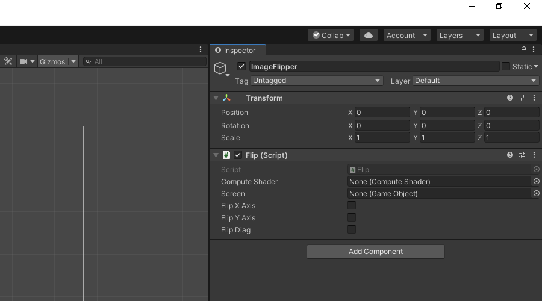
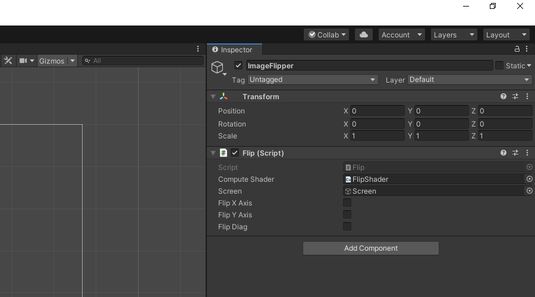
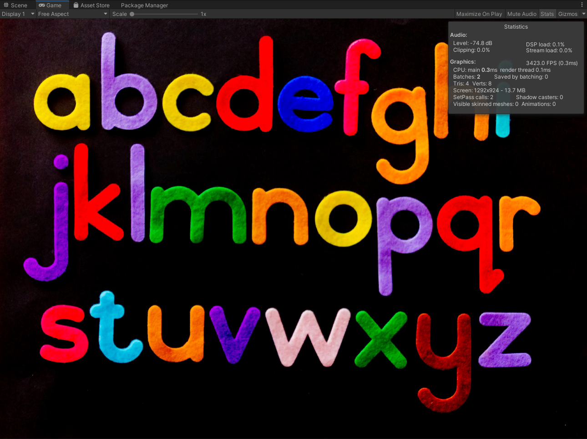
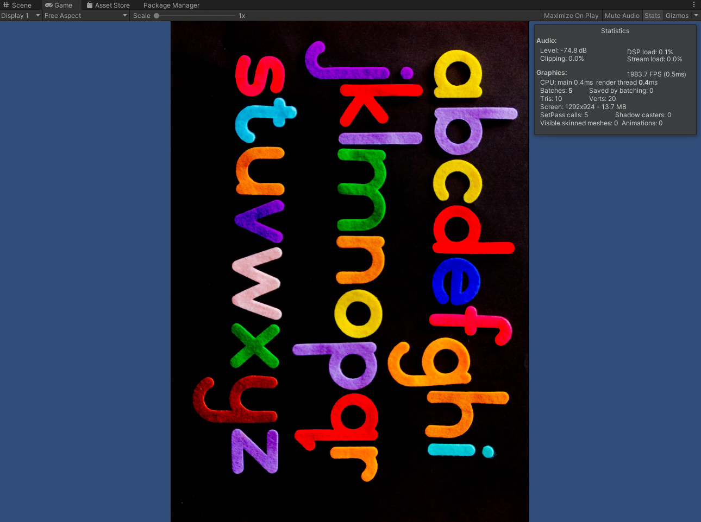
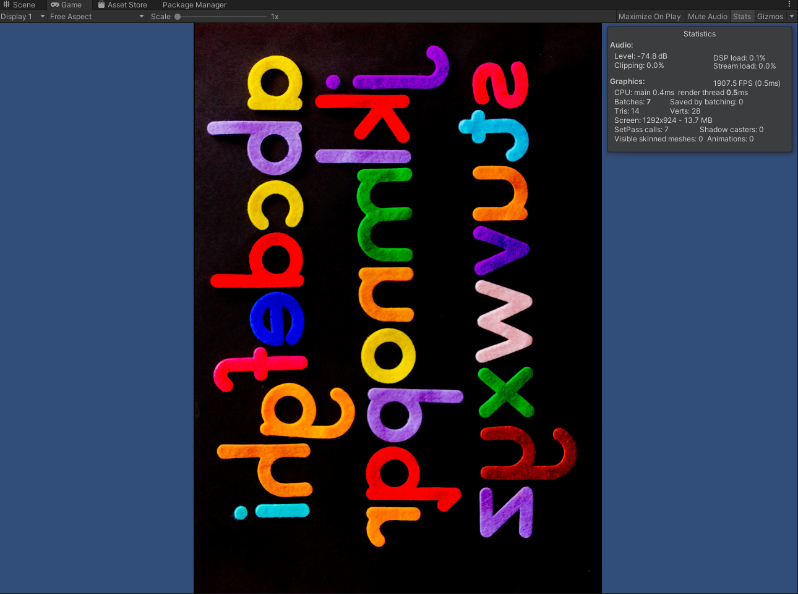

* [Introduction](#introduction)
* [Create a 2D Unity Project](#create-a-2d-unity-project)
* [Create Compute Shader](#create-compute-shader)
* [Create `Flip` Script](#create-flip-script)
* [Create Screen GameObject](#create-screen-gameobject)
* [Create ImageFlipper](#create-imagecropper)
* [Test it Out](#test-it-out)
* [Conclusion](#conclusion)


## Introduction

In this post, we'll cover how to use a [compute shader](https://docs.unity3d.com/Manual/class-ComputeShader.html) to flip an image across the x-axis, y-axis, and diagonal axis. We will also demonstrate how these operations can be combined to rotate an image.


## Create a 2D Unity Project

Open the Unity Hub and create a new 2D project. I'm using `Unity 2019.4.20f1`, but you should be fine using other versions.

{fig-align="center"}


## Create Compute Shader

In Unity, right-click an empty space in the Assets folder and open the `Create` submenu. Select `ComputeShader` from the `Shader` submenu and name it `FlipShader`.

{fig-align="center"}

Open the new compute shader in your code editor. By default, compute shaders contain the following code.

```glsl
// Each #kernel tells which function to compile; you can have many kernels
#pragma kernel CSMain

// Create a RenderTexture with enableRandomWrite flag and set it
// with cs.SetTexture
RWTexture2D<float4> Result;

[numthreads(8,8,1)]
void CSMain (uint3 id : SV_DispatchThreadID)
{
    // TODO: insert actual code here!

    Result[id.xy] = float4(id.x & id.y, (id.x & 15)/15.0, (id.y & 15)/15.0, 0.0);
}
```


We'll delete the `CSMain` function and create a new one for each of our three flip operations. 

### Define Variables

Before we create our functions, we need to define some extra variables.

* `Texture2D<float4> InputImage`: stores the original image
* `int height`: the height of the input image
* `int width`: the width of the input image
* `int2 coords`: stores the new `(x,y)` coordinates for individual pixel values

```glsl
// Create a RenderTexture with enableRandomWrite flag and set it
// with cs.SetTexture
RWTexture2D<float4> Result;

// Stores the original image
Texture2D<float4> InputImage;

// The height of the input image
int height;
// The width of the input image
int width;
// Stores the new location for individual pixel values
int2 coords;
```


### Define Flip Functions

The individual flip operations quite simple. They determine the coordinates of the pixel that will replace the values for a given pixel in the image. The RGB pixel values at the calculated coordinates will be stored at the current coordinates in the `Result` variable.

* `Flip x-axis`: subtract the y value for the current pixel's `(x,y)` coordinates from the height of the image
* `Flip y-axis`: subtract the x value for the current pixel's `(x,y)` coordinates from the width of the image
* `Flip diagonal`: swap the x and y values for the current pixel's `(x,y)` coordinates

These operations are performed on each pixel in parallel on the GPU. We'll use the default `numthreads(8, 8, 1)` for each function.

```glsl
// Each #kernel tells which function to compile; you can have many kernels
#pragma kernel FlipXAxis
#pragma kernel FlipYAxis
#pragma kernel FlipDiag

// Create a RenderTexture with enableRandomWrite flag and set it
// with cs.SetTexture
RWTexture2D<float4> Result;

// Stores the original image
Texture2D<float4> InputImage;

// The height of the input image
int height;
// The width of the input image
int width;
// Stores the new location for individual pixel values
int2 coords;

[numthreads(8, 8, 1)]
void FlipXAxis(uint3 id : SV_DispatchThreadID)
{
    // Update the y value for the pixel coordinates
    coords = int2(id.x, height - id.y);
    Result[id.xy] = float4(InputImage[coords].x, InputImage[coords].y, InputImage[coords].z, 1.0f);
}

[numthreads(8, 8, 1)]
void FlipYAxis(uint3 id : SV_DispatchThreadID)
{
    // Update the x value for the pixel coordinates
    coords = int2(width - id.x, id.y);
    Result[id.xy] = float4(InputImage[coords].x, InputImage[coords].y, InputImage[coords].z, 1.0f);
}

[numthreads(8, 8, 1)]
void FlipDiag(uint3 id : SV_DispatchThreadID)
{
    // Swap the x and y coordinate values
    coords = int2(id.y, id.x);
    Result[id.xy] = float4(InputImage[coords].x, InputImage[coords].y, InputImage[coords].z, 1.0f);
}
```


## Create `Flip` Script

Back in Unity, right-click an empty space in the Assets folder and select `C# Script` in the `Create` submenu. Name the new script, `Flip` and open it in your code editor.

{fig-align="center"}


### Define Variables

We'll define the following variables at the top of the script.

* `public ComputeShader computeShader`: The compute shader that contains the flip operations
* `public GameObject screen`: The screen to which the test image is attached
* `public bool flipXAxis`: Toggle whether to flip the image across the x-axis
* `public bool flipYAxis`: Toggle whether to flip the image across the y-axis
* `public bool flipDiag`: Toggle whether to flip the image across the diagonal axis
* `private GameObject mainCamera`: Stores a reference to the Main Camera object
* `private RenderTexture image`: A copy of the original test image

```c#
public class Flip : MonoBehaviour
{
    [Tooltip("The compute shader that contains the flip operations")]
    public ComputeShader computeShader;

    [Tooltip("The screen to which the test image is attached")]
    public GameObject screen;

    [Tooltip("Toggle whether to flip the image across the x-axis")]
    public bool flipXAxis;

    [Tooltip("Toggle whether to flip the image across the y-axis")]
    public bool flipYAxis;

    [Tooltip("Toggle whether to flip the image across the diagonal axis")]
    public bool flipDiag;

    // Stores a reference to the Main Camera object
    private GameObject mainCamera;
    // A copy of the original test image
    private RenderTexture image;
```


### Define `Start()` Method

In the `Start()` method, we'll store a copy the original test image in the `image` `RenderTexture`. We can do so by getting a reference to the `Texture` attached to the `screen` and using the [`Graphics.Blit()`](https://docs.unity3d.com/ScriptReference/Graphics.Blit.html) method. We'll also get a reference to the camera so that we can adjust the view to fit the current image. 

```c#
// Start is called before the first frame update
void Start()
{
    // Get a reference to the image texture attached to the screen
    Texture screenTexture = screen.GetComponent<MeshRenderer>().material.mainTexture;

    // Create a new RenderTexture with the same dimensions as the test image
    image = new RenderTexture(screenTexture.width, screenTexture.height, 24, RenderTextureFormat.ARGB32);
    // Copy the screenTexture to the image RenderTexture
    Graphics.Blit(screenTexture, image);

    // Get a reference to the Main Camera GameObject
    mainCamera = GameObject.Find("Main Camera");
}
```


### Define `FlipImage()` Method

Next, we'll define a new method called `FlipImage` to handle executing the compute shader. This method will take in the image to be flipped, an empty `RenderTexture` to store the flipped image, and the name of the function to execute on the compute shader.

To execute the compute shader, we need to first get the kernel index for the specified function and initialize the variables we defined in the compute shader. Once we execute the compute shader using the `computeShader.Dispatch()` method, we can copy the result to the empty `RenderTexture` we passed in. We could copy the result directly to the `RenderTexture` containing the original image. However, this would cause an error when flipping non-square images across the diagonal axis. This is because a `RenderTexture` can not dynamically change dimensions.

```c#
/// <summary>
/// Perform a flip operation of the GPU
/// </summary>
/// <param name="image">The image to be flipped</param>
/// <param name="tempTex">Stores the flipped image</param>
/// <param name="functionName">The name of the function to execute in the compute shader</param>
private void FlipImage(RenderTexture image, RenderTexture tempTex, string functionName)
{
    // Specify the number of threads on the GPU
    int numthreads = 8;
    // Get the index for the PreprocessResNet function in the ComputeShader
    int kernelHandle = computeShader.FindKernel(functionName);

    /// Allocate a temporary RenderTexture
    RenderTexture result = RenderTexture.GetTemporary(tempTex.width, tempTex.height, 24, tempTex.format);
    // Enable random write access
    result.enableRandomWrite = true;
    // Create the RenderTexture
    result.Create();

    // Set the value for the Result variable in the ComputeShader
    computeShader.SetTexture(kernelHandle, "Result", result);
    // Set the value for the InputImage variable in the ComputeShader
    computeShader.SetTexture(kernelHandle, "InputImage", image);
    // Set the value for the height variable in the ComputeShader
    computeShader.SetInt("height", image.height);
    // Set the value for the width variable in the ComputeShader
    computeShader.SetInt("width", image.width);

    // Execute the ComputeShader
    computeShader.Dispatch(kernelHandle, tempTex.width / numthreads, tempTex.height / numthreads, 1);

    // Copy the flipped image to tempTex
    Graphics.Blit(result, tempTex);

    // Release the temporary RenderTexture
    RenderTexture.ReleaseTemporary(result);
}
```


### Define `Update()` Method

First, we need to make another copy of the original image so that we can edit it. We'll store this copy in a [temporary](https://docs.unity3d.com/ScriptReference/RenderTexture.GetTemporary.html) `RenderTexture` called `rTex` that will get released at the end of the method.

The steps are basically the same for performing each of the three flip operations. We first allocate a temporary `RenderTexture` called `tempTex` to store the flipped image. We then call the `FlipImage` method with the appropriate function name. Next, we copy the flipped image to `rTex`. Finally, we release the resources allocated for `tempTex`. The steps for flipping the image across the diagonal axis is slightly different as we can't directly copy a flipped image with different dimensions back to `rTex`. Instead, we have to directly assign the currently active `RenderTexture` to `rTex`.

After we copy `tempTex` back to `rTex` we'll update the `Texture` for the `screen` with the flipped image and adjust the shape of the screen to fit the new dimensions.

```c#
// Update is called once per frame
void Update()
{
    // Allocate a temporary RenderTexture with the original image dimensions
    RenderTexture rTex = RenderTexture.GetTemporary(image.width, image.height, 24, image.format);
    // Copy the original image
    Graphics.Blit(image, rTex);

    // Temporarily store the flipped image
    RenderTexture tempTex;

    if (flipXAxis)
    {
        // Allocate a temporary RenderTexture
        tempTex = RenderTexture.GetTemporary(rTex.width, rTex.height, 24, rTex.format);
        // Perform flip operation
        FlipImage(rTex, tempTex, "FlipXAxis");

        // Free the resources allocated for the Tempoarary RenderTexture
        RenderTexture.ReleaseTemporary(rTex);

        // Allocate a temporary RenderTexture
        rTex = RenderTexture.GetTemporary(tempTex.width, tempTex.height, 24, rTex.format);
        // Copy the flipped image
        Graphics.Blit(tempTex, rTex);

        // Free the resources allocated for the Tempoarary RenderTexture
        RenderTexture.ReleaseTemporary(tempTex);
    }

    if (flipYAxis)
    {
        // Allocate a temporary RenderTexture
        tempTex = RenderTexture.GetTemporary(rTex.width, rTex.height, 24, rTex.format);
        // Perform flip operation
        FlipImage(rTex, tempTex, "FlipYAxis");

        // Free the resources allocated for the Tempoarary RenderTexture
        RenderTexture.ReleaseTemporary(rTex);
        // Allocate a temporary RenderTexture
        rTex = RenderTexture.GetTemporary(tempTex.width, tempTex.height, 24, rTex.format);
        // Copy the flipped image
        Graphics.Blit(tempTex, rTex);

        // Free the resources allocated for the Tempoarary RenderTexture
        RenderTexture.ReleaseTemporary(tempTex);
    }

    if (flipDiag)
    {
        // Allocate a temporary RenderTexture
        tempTex = RenderTexture.GetTemporary(rTex.height, rTex.width, 24, rTex.format);
        // Perform flip operation
        FlipImage(rTex, tempTex, "FlipDiag");

        // Free the resources allocated for the Tempoarary RenderTexture
        RenderTexture.ReleaseTemporary(rTex);
        // Assign a reference to the active RenderTexture
        rTex = RenderTexture.active;

        // Free the resources allocated for the Tempoarary RenderTexture
        RenderTexture.ReleaseTemporary(tempTex);
    }

    // Apply the new RenderTexture
    screen.GetComponent<MeshRenderer>().material.SetTexture("_MainTex", rTex);
    // Adjust the scree dimensions to fit the new RenderTexture
    screen.transform.localScale = new Vector3(rTex.width, rTex.height, screen.transform.localScale.z);

    // Adjust the camera size to account for updates to the screen
    mainCamera.GetComponent<Camera>().orthographicSize = rTex.height / 2;

    // Free the resources allocated for the Tempoarary RenderTexture
    RenderTexture.ReleaseTemporary(rTex);
}
```


## Create Screen GameObject

Back in Unity, right-click an empty space in the `Hierarchy` tab and select `Quad` from the `3D Object` submenu. Name the new object `Screen`. The size will be updated automatically by the `Flip.cs` script.

{fig-align="center"}

## Create ImageFlipper

Right-click an empty space in the `Hierarchy` tab and select `Create Empty` from the pop-up menu. Name the empty object `ImageFlipper`

{fig-align="center"}

With the `ImageFlipper` selected, drag and drop the `Flip.cs` script into the `Inspector` tab.

{fig-align="center"}

Drag and drop the `Screen` object from the `Hierarchy` tab as well as the `FlipShader` from the `Assets` folder onto their respective spots in the `Inspector` tab.

{fig-align="center"}


## Test it Out

We'll need a test image to try out the `ImageFlipper`. You can use your own or download the one I used for this tutorial.

* [Test Image](https://drive.google.com/file/d/18_e6CpvsZcGuym66bGXsioAPEB0We8zV/view?usp=sharing)

 Drag and drop the test image into the `Assets` folder. Then drag it onto the `Screen` in the `Scene`. 

{fig-align="center"}


Next, we need to set our Screen to use an `Unlit` shader. Otherwise it will be a bit dim. With the Screen object selected, open the `Shader` drop-down menu in the `Inspector` tab and select `Unlit`. 

{fig-align="center"}


Select `Texture` from the `Unlit` submenu.

{fig-align="center"}


Now we can click the Play button and toggle the different flip checkboxes to confirm our script is working properly. If you check the performance stats, you should see that there is a negligible performance hit from flipping the image even when performing all three operations at once.

### Default Image

{fig-align="center"}

### Flip X-Axis

{fig-align="center"}

### Flip Y-Axis

{fig-align="center"}


### Flip Diagonal Axis

{fig-align="center"}


### Flip X-Axis and Y-Axis

{fig-align="center"}

### Flip X-Axis and Diagonal Axis

{fig-align="center"}

### Flip Y-Axis and Diagonal Axis

{fig-align="center"}

### Flip X-Axis, Y-Axis and Diagonal Axis

{fig-align="center"}


## Conclusion

That is one approach to efficiently flip images on the GPU in Unity. As demonstrated above, the operations can be combined in different ways to rotate the image as well.


**Project Resources:** [GitHub Repository](https://github.com/cj-mills/Flip-Image-Compute-Shader)


