* [Introduction](#introduction)
* [Access Google Colab](#access-google-colab)
* [The Notebook Selection Window](#the-notebook-selection-window)
* [Understanding the Notebook Interface](#understanding-the-notebook-interface)
* [Working with Data](#working-with-data)
* [Using Hardware Acceleration](#using-hardware-acceleration)
* [Create a New Notebook](#create-a-new-notebook)
* [Save Your Notebook](#save-your-notebook)
* [Conclusion](#conclusion)


## Introduction

In this tutorial, I'll introduce you to Google Colab, its features, and how to use it to run your code. Google Colab provides a free, cloud-based Jupyter Notebook environment that allows you to write, run, and share Python code in your browser without any setup or installation. A Jupyter Notebook is an interactive web-based tool for creating and sharing documents that contain live code, visualizations, and narrative text, often used in data analysis, visualization, and education.


## Access Google Colab

To access Google Colab, follow these steps:

1. Go to [colab.research.google.com](https://colab.research.google.com/).
2. Sign in with your Google account. If you don't have a Google account, create one [here](https://accounts.google.com/signup).

{fig-align="center"}


## The Notebook Selection Window

After signing in, the Notebook Selection window will pop up. This window displays a list of your recent notebooks, allowing you to access and open them. If this is your first time using Google Colab, you will only see the "Welcome to Colaboratory" notebook listed. The Notebook Selection window also allows you to import Jupyter Notebooks from Google Drive and GitHub or upload a notebook from your computer.


{fig-align="center"}


The "Welcome to Colaboratory" notebook is already open behind the Notebook Selection window, so we'll work with that one. Click the cancel button in the bottom right corner of the popup window to view the welcome notebook.


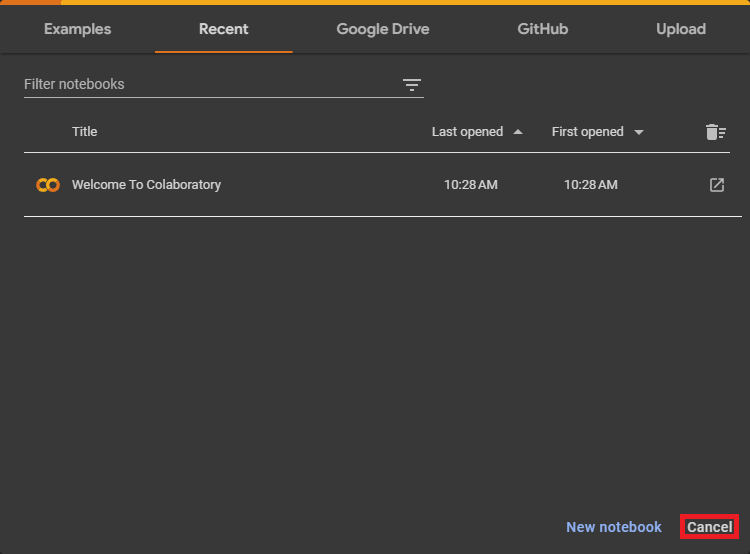{fig-align="center"}


## Understanding the Notebook Interface

A notebook consists of a list of cells. Google Colab notebooks have two main types of cells: code cells and text cells. Code cells allow you to write and run Python code, while text cells let you add formatted text, images, and equations using [Markdown](https://www.markdownguide.org/getting-started/). The first few cells in the welcome notebook are text cells.


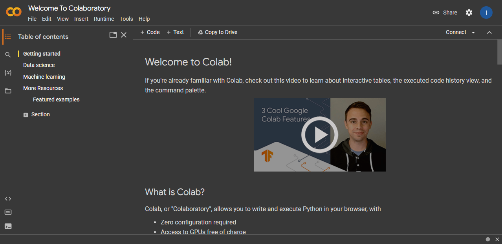{fig-align="center"}


### Text Cells

You can view and edit the Markdown source of a text cell by double-clicking it. In editor mode, Google Colab will show the Markdown source and the rendered version side-by-side.


{fig-align="center"}


We can edit the Markdown source, and the rendered version will update in real time.


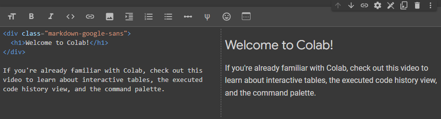{fig-align="center"}


You can exit the editor mode by pressing `Shift+Enter`, clicking the `Close Markdown Editor` icon in the top-right corner of the text cell, or clicking another cell.


{fig-align="center"}


To create a new text cell, click the `+ Text` button in the toolbar. 


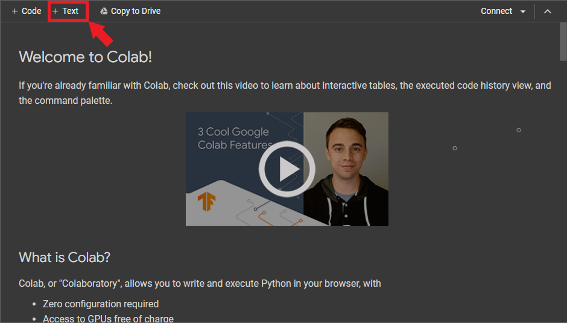{fig-align="center"}


Google Colab will add the new Markdown cell below the currently selected cell.


{fig-align="center"}


### Code Cells
To create a new code cell, click the `+ Code` button in the toolbar at the top of the notebook or press `Ctrl+M B`. 

{fig-align="center"}


Google Colab will add the new code cell below the currently selected cell. 


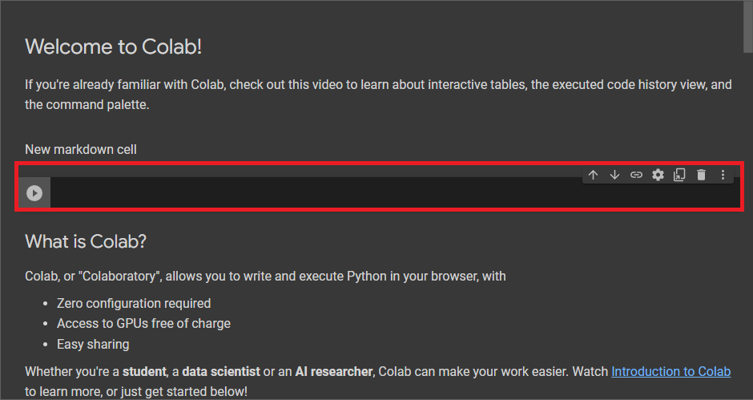{fig-align="center"}


You can write Python code in the code cell and execute it by pressing `Shift + Enter` or clicking the `Play` button on the left side of the cell. Any output from the code will appear directly below the code cell.


{fig-align="center"}


We can also use code cells to access the command line by adding an exclamation point at the start of the cell. We can use this ability to install Python packages via the [pip](https://packaging.python.org/en/latest/key_projects/#pip) package installer.


{fig-align="center"}


## Working with Data

Google Colab allows you to upload and download files to and from your computer and connect notebooks to your Google Drive.


### Uploading Files

You can upload files from your local machine to use in your Google Colab notebook by following these steps:

1. Click the Files icon in the left sidebar to open the file browser.

{fig-align="center"}

2. Click the Upload button.

{fig-align="center"}


3. Go to the file location on your local machine, select it, and click Open to upload it to your Google Colab workspace.

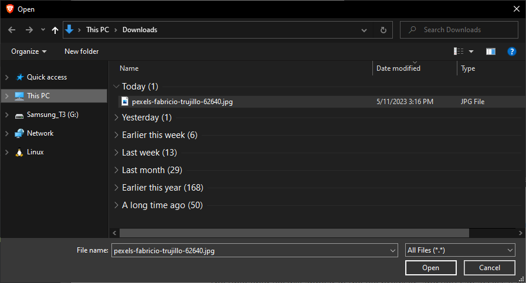{fig-align="center"}

4. Colab will display a warning that the runtime's files get deleted when it terminates. Click OK in the bottom-right corner of the popup window.

{fig-align="center"}

5. The uploaded file will appear in the file browser, and you can access it in your notebook.

{fig-align="center"}

6. We can view the file by double-clicking it in the file browser or loading it in the notebook via Python.

{fig-align="center"}


### Downloading Files

To download a file from your Google Colab workspace to your local machine, follow these steps:

1. Locate the file in the file browser.
2. Right-click the file and select Download.

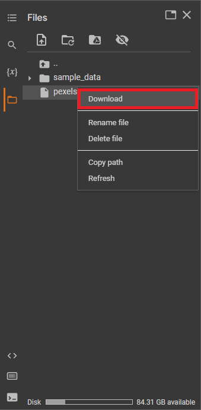{fig-align="center"}

The file will download to your local machine.


### Connecting to Google Drive

Google Colab notebooks can connect to Google Drive to access, store, and manage your files. To do this, follow these steps:

1. Click the Mount Drive button in the file browser.

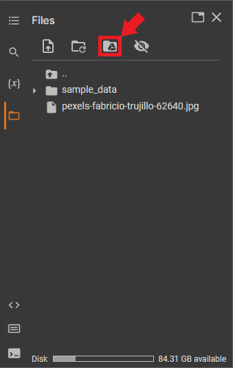{fig-align="center"}

2. Google Colab will create a new code cell containing the following code:

   ```python
   from google.colab import drive
   drive.mount('/content/drive')
   ```

{fig-align="center"}

3. Run the code cell by pressing `Shift + Enter` or clicking the Play button on the left side of the cell. A popup window will appear, prompting you to authorize access to your Google Drive.

{fig-align="center"}

   

4. Click the `Connect to Google Drive` button to open the authorization page.

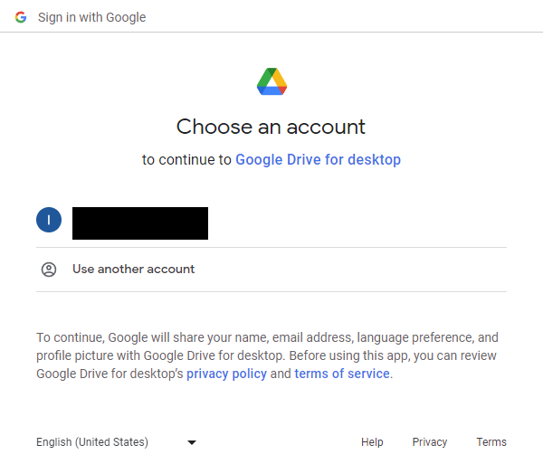{fig-align="center"}

5. Sign in with your Google account, and click Allow to grant access.

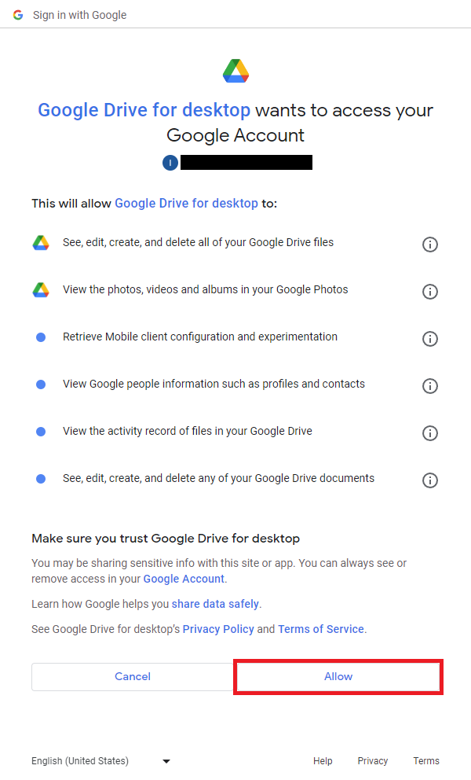{fig-align="center"}

6. Return to your Google Colab notebook. The code cell should have printed a message indicating your Google Drive is now mounted.

{fig-align="center"}

7. Click the Refresh button in the file browser to update the contents.

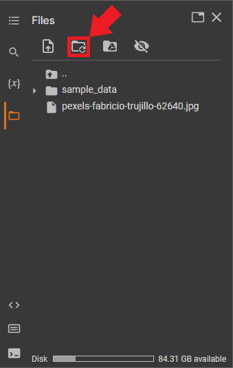{fig-align="center"}

Your Google Drive should now be mounted and accessible from the file browser.

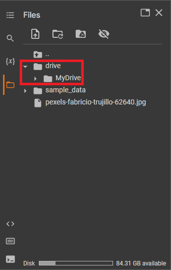{fig-align="center"}

You can read, write, and manage your Google Drive files directly from your Google Colab notebook. To access the files, use the path `/content/drive/MyDrive/` followed by the file or folder name.


## Using Hardware Acceleration

Google Colab offers free access to GPUs and TPUs to accelerate your code. To enable GPU or TPU acceleration:

1. Click the "Runtime" menu at the top of the notebook.

{fig-align="center"}

2. Select "Change runtime type."

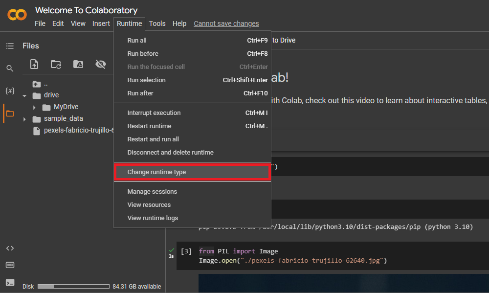{fig-align="center"}

3. Choose "GPU" from the "Hardware accelerator" drop-down menu.

{fig-align="center"}

4. Click "Save."

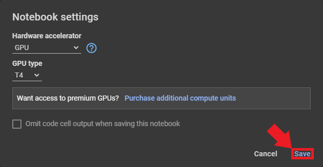{fig-align="center"}

5. Changing the hardware accelerator requires loading a new runtime. Loading a new runtime will delete any files we added and disconnect Google Drive. Google Colab will show a popup window asking you to confirm you want to delete the current runtime. Click "OK" to confirm.

{fig-align="center"}

6. Verify the notebook has GPU access by running the following code in a code cell:

   ```bash
   !nvidia-smi
   ```

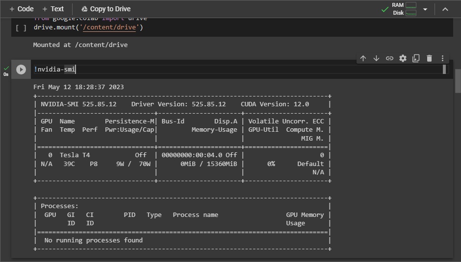{fig-align="center"}


Your notebook will now use the selected hardware accelerator. Note that free GPU and TPU usage is time-limited. You can run notebooks on the free tier for at most 12 hours at a time (usually less). If you exceed the time allotment, you must wait until it resets (typically about 12 hours). Therefore, only enable hardware acceleration when needed and disable it when you don't. To disable hardware acceleration, select None from the Hardware Accelerator drop-down menu.

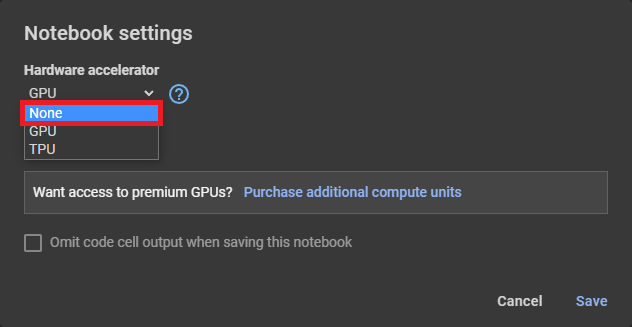{fig-align="center"}


## Create a New Notebook

To create a new notebook:

1. Open the `File` menu in the top-left corner and select `New notebook`.

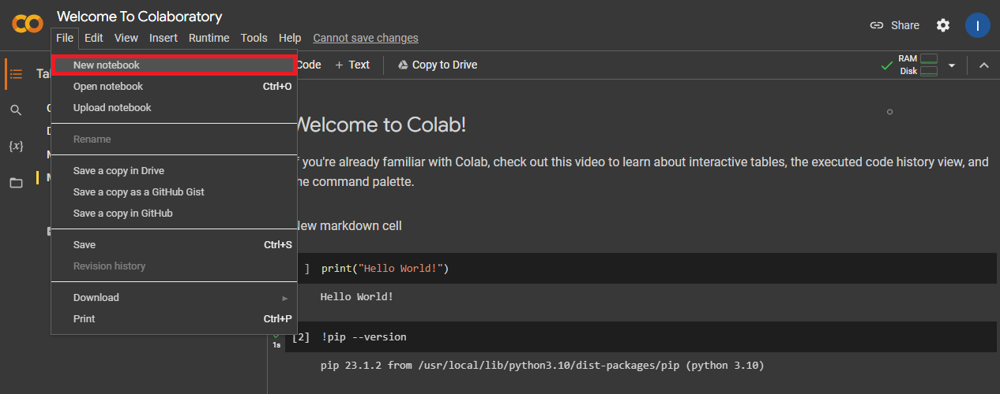{fig-align="center"}


A new notebook will open in a separate tab. The runtime for the previous notebook is still active.

{fig-align="center"}


You can rename the notebook by clicking the notebook name at the top of the page. For now, we can name it "My First Notebook."

{fig-align="center"}


## Save Your Notebook

Google Colab automatically saves your notebooks to a "Colab Notebooks" folder in Google Drive.

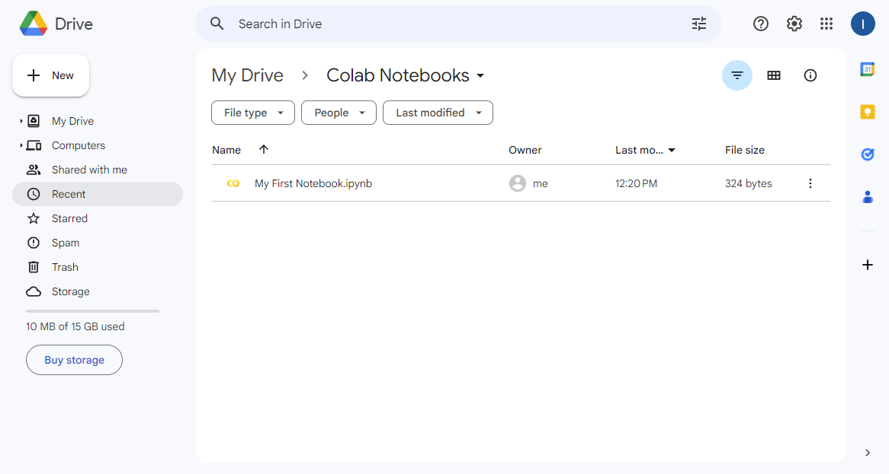{fig-align="center"}


Note the "Welcome to Colaboratory" notebook is not in the folder. Since we did not create that notebook, we must save our copy manually. Switch to that notebook's tab and click the "Copy to Drive" button.

{fig-align="center"}


Google Colab will open our new copy of the notebook in a separate tab.

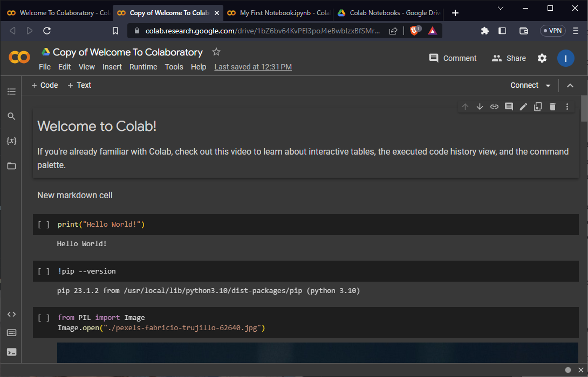{fig-align="center"}


If we check the "Colab Notebooks" folder in Google Drive, we should now see our copy of the welcome notebook.

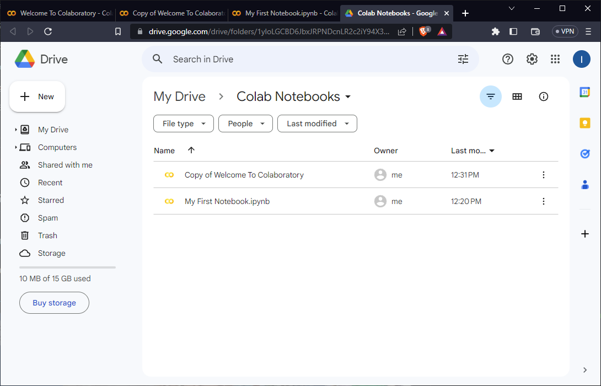{fig-align="center"}


## Sharing Notebooks

You can share your Google Colab notebook with others, similar to other Google Drive documents. To share your notebook:

1. Click the "Share" button in the top-right corner of the notebook.

{fig-align="center"}

2. In the sharing settings dialog box, enter the email address of the person you want to share the notebook with. 

{fig-align="center"}

3. Select their permission level: "Viewer," "Commenter," or "Editor."

{fig-align="center"}

   

   Alternatively, you can create a shareable link with specific access settings (view, comment, or edit). You can share this link with others, and they can access the notebook according to the chosen permission level.

   1. Open the drop-down menu under General Access and select the "Anyone with a link" option.

   {fig-align="center"}

   2. Set the permission level: "Viewer," "Commenter," or "Editor."

   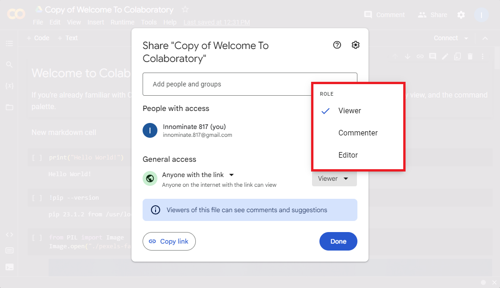{fig-align="center"}

   3. Click "Copy link" to copy the shareable link.

   {fig-align="center"}


## Version Control with GitHub

Google Colab can save and load notebooks from GitHub repositories, enabling seamless collaboration and tracking of changes in your code.


### Saving a notebook to a GitHub repository:

1. Open the File menu in the top-left corner and select Save a copy in GitHub.

{fig-align="center"}

2. If you haven't connected your GitHub account yet, follow the prompts to authorize Google Colab to access your repositories.

{fig-align="center"}

3. Choose a repository, branch, and file path for your notebook. You can also update the commit message.

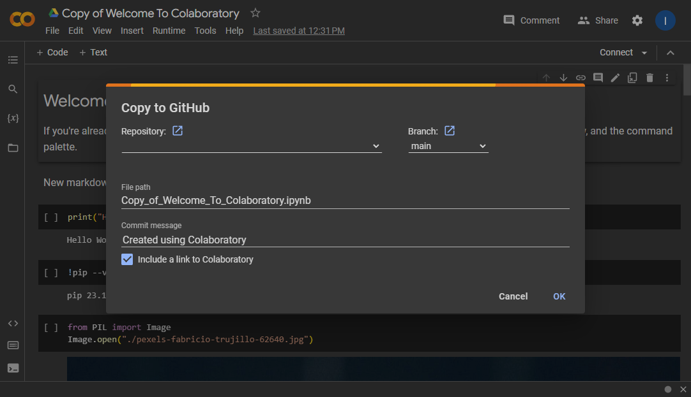{fig-align="center"}

4. Click OK to save the notebook to the specified GitHub repository.

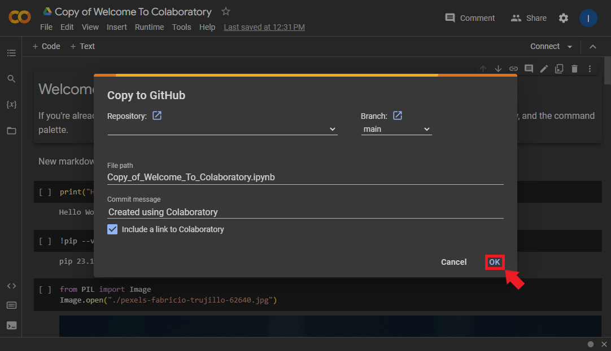{fig-align="center"}


### Loading a notebook from a GitHub repository:

1. Go to the [Google Colab website](https://colab.research.google.com/).

{fig-align="center"}{fig-align="center"}

2. Click the GitHub tab in the Notebook Selection window.

{fig-align="center"}

3. Enter the URL for the GitHub repository containing the notebook you want to open. You can also search for one by entering a username or organization and repository name.

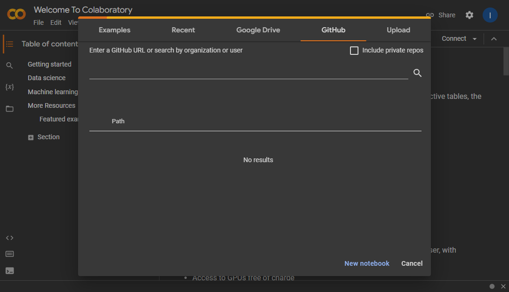{fig-align="center"}

4. Select the notebook you want to open, and it will open in a new tab.

   


## Conclusion

You've now learned the fundamentals of Google Colab. This tutorial covered creating and editing cells, working with data, hardware acceleration, and saving and sharing notebooks via Google Drive and GitHub.
Keep exploring Google Colab to uncover more features that can enhance your projects.


