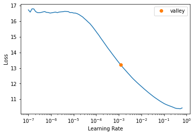

* [Introduction](#introduction)
* [Overview](#overview)
* [Setup Conda Environment](#setup-conda-environment)
* [Import Dependencies](#import-dependencies)
* [Configure Kaggle API](#configure-kaggle-api)
* [Download the Dataset](#download-the-dataset)
* [Inspect the Dataset](#inspect-the-dataset)
* [Create Dataset Parser](#create-dataset-parser)
* [Define DataLoader Objects](#define-dataloader-objects)
* [Finetune the Model](#finetune-the-model)
* [Prepare Model for Export](#prepare-model-for-export)
* [Export the Model](#export-the-model)
* [Verify OpenVINO Inference](#verify-openvino-inference)
* [Define Post-processing Steps](#define-post-processing-steps)
* [Generate Colormap](#generate-colormap)
* [Summary](#summary)


## Introduction

In this tutorial series, we will walk through training an object detector using the [IceVision](https://airctic.com/0.12.0/) library. We will then implement the trained model in a [Unity](https://unity.com/) game engine project using [OpenVINO](https://docs.openvino.ai/latest/index.html), an open-source toolkit for optimizing model inference.

The tutorial uses a downscaled subsample of [HaGRID](https://github.com/hukenovs/hagrid) (HAnd Gesture Recognition Image Dataset). The dataset contains annotated sample images for 18 distinct hand gestures and an additional `no_gesture` class to account for idle hands.


<div>
<details><summary style="font-size: 1.25rem;">Reference Images</summary><br/>
<table>
<thead>
<tr>
<th>Class</th>
<th>Image</th>
</tr>
</thead>
<tbody>
<tr>
<td>call</td>
<td></td>
</tr>
<tr>
<td>dislike</td>
<td></td>
</tr>
<tr>
<td>fist</td>
<td></td>
</tr>
<tr>
<td>four</td>
<td></td>
</tr>
<tr>
<td>like</td>
<td></td>
</tr>
<tr>
<td>mute</td>
<td></td>
</tr>
<tr>
<td>ok</td>
<td></td>
</tr>
<tr>
<td>one</td>
<td></td>
</tr>
<tr>
<td>palm</td>
<td></td>
</tr>
<tr>
<td>peace</td>
<td></td>
</tr>
<tr>
<td>peace_inverted</td>
<td></td>
</tr>
<tr>
<td>rock</td>
<td></td>
</tr>
<tr>
<td>stop</td>
<td></td>
</tr>
<tr>
<td>stop_inverted</td>
<td></td>
</tr>
<tr>
<td>three</td>
<td></td>
</tr>
<tr>
<td>three2</td>
<td></td>
</tr>
<tr>
<td>two_up</td>
<td></td>
</tr>
<tr>
<td>two_up_inverted</td>
<td></td>
</tr>
</tbody>
</table>
</details>
</div>


One could use a model trained on this dataset to map hand gestures and locations to user input in Unity.


#### Unity Demo


## Overview

Part 1 covers finetuning a [YOLOX](https://github.com/Megvii-BaseDetection/YOLOX) Tiny model using the IceVision library and exporting it to OpenVINO's [Intermediate Representation](https://docs.openvino.ai/latest/openvino_docs_MO_DG_IR_and_opsets.html) (IR) format. The training code is available in the Jupyter notebook linked below, and links for training on [Google Colab](https://colab.research.google.com/?utm_source=scs-index) and [Kaggle](https://www.kaggle.com/docs/notebooks) are also available below.

| Jupyter Notebook             | Colab                                                        | Kaggle                                                       |
| --------------------------------- | ------------------------------------------------------------ | ------------------------------------------------------------ |
| [GitHub Repository](https://github.com/cj-mills/icevision-openvino-unity-tutorial/blob/main/notebooks/Icevision-YOLOX-to-OpenVINO-Tutorial-HaGRID.ipynb) | [Open In Colab](https://colab.research.google.com/github/cj-mills/icevision-openvino-unity-tutorial/blob/main/notebooks/Icevision-YOLOX-to-OpenVINO-Tutorial-HaGRID-Colab.ipynb) | [](https://kaggle.com/kernels/welcome?src=https://github.com/cj-mills/icevision-openvino-unity-tutorial/blob/main/notebooks/Icevision-YOLOX-to-OpenVINO-Tutorial-HaGRID-Kaggle.ipynb) |

> **Note:** The free GPU tier for Google Colab takes approximately 11 minutes per epoch, while the free GPU tier for Kaggle Notebooks takes around 15 minutes per epoch.


## Setup Conda Environment

The IceVision library builds upon specific versions of libraries like [fastai](https://docs.fast.ai/) and [mmdetection](https://mmdetection.readthedocs.io/en/latest/), and the cumulative dependency requirements mean it is best to use a dedicated [virtual environment](https://docs.python.org/3/tutorial/venv.html). Below are the steps to create a virtual environment using [Conda](https://docs.conda.io/en/latest/). Be sure to execute each command in the provided order.

> **Important:** IceVision currently only supports Linux/macOS. Try using [WSL](https://docs.microsoft.com/en-us/windows/wsl/install) (Windows Subsystem for Linux) if training locally on Windows.


**Install CUDA Toolkit**

You might need to install the CUDA Toolkit on your system if you plan to run the training code locally. CUDA requires an Nvidia GPU. Version 11.1.0 of the toolkit is available at the link below. Both Google Colab and Kaggle Notebooks already have CUDA installed.

* [CUDA Toolkit 11.1.0](https://developer.nvidia.com/cuda-11.1.0-download-archive)
* [CUDA Toolkit Archive](https://developer.nvidia.com/cuda-toolkit-archive)


**Conda environment setup steps**

```bash
conda create --name icevision python==3.8
conda activate icevision
pip install torch==1.10.0+cu111 torchvision==0.11.1+cu111 -f https://download.pytorch.org/whl/torch_stable.html
pip install mmcv-full==1.3.17 -f https://download.openmmlab.com/mmcv/dist/cu111/torch1.10.0/index.html
pip install mmdet==2.17.0
pip install icevision==0.11.0
pip install icedata==0.5.1
pip install setuptools==59.5.0
pip install openvino-dev
pip install distinctipy
pip install jupyter
pip install onnxruntime
pip install onnx-simplifier
pip install kaggle
```

The [`mmdet`](https://pypi.org/project/mmdet/) package contains the pretrained YOLOX Tiny model we will finetune with IceVision. The package depends on the [`mmcv-full`](https://mmcv.readthedocs.io/en/latest/) library, which is picky about the CUDA version used by [PyTorch](https://pytorch.org/). We need to install the PyTorch version with the exact CUDA version expected by `mmcv-full`.

The [`icevision`](https://pypi.org/project/icevision/) package provides the functionality for data curation, data transforms, and training loops we'll use to train the model. The [`icedata`](https://airctic.github.io/icedata/) package provides the functionality we'll use to create a custom parser to read the dataset.

The [`openvino-dev`](https://pypi.org/project/openvino-dev/) pip package contains the model-conversion script to convert trained models from [ONNX](https://onnx.ai/) to OpenVINO's IR format.

We'll use the [`distinctipy`](https://pypi.org/project/distinctipy/) pip package to generate a visually distinct colormap for drawing bounding boxes on images.

The ONNX models generated by PyTorch are not always the most concise. We can use the [onnx-simplifier](https://pypi.org/project/onnx-simplifier/) package to tidy up the exported model. This step is entirely optional.

**Original ONNX model ([Netron](https://netron.app/))**


**Simplified ONNX model ([Netron](https://netron.app/))**


**Colab and Kaggle Setup Requirements**

When running the training code on Google Colab and Kaggle Notebooks, we need to uninstall several packages before installing IceVision and its dependencies to avoid conflicts. The platform-specific setup steps are at the top of the notebooks linked above.


## Import Dependencies

IceVision will download some additional resources the first time we import the library.

**Import IceVision library**


```python
from icevision.all import *
```

**Import and configure Pandas**

```python
import pandas as pd
pd.set_option('max_colwidth', None)
pd.set_option('display.max_rows', None)
pd.set_option('display.max_columns', None)
```


## Configure Kaggle API

The Kaggle API tool requires an API Key for a Kaggle account. Sign in or create a Kaggle account using the link below, then click the `Create New API Token` button.

* **Kaggle Account Settings:** [https://www.kaggle.com/me/account](https://www.kaggle.com/me/account)


**Enter Kaggle username and API token**


```python
creds = '{"username":"","key":""}'
```

**Save Kaggle credentials if none are present**
* **Source:** [https://github.com/fastai/fastbook/blob/master/09_tabular.ipynb](https://github.com/fastai/fastbook/blob/master/09_tabular.ipynb)

------


```python
cred_path = Path('~/.kaggle/kaggle.json').expanduser()
# Save API key to a json file if it does not already exist
if not cred_path.exists():
    cred_path.parent.mkdir(exist_ok=True)
    cred_path.write_text(creds)
    cred_path.chmod(0o600)
```

**Import Kaggle API**


```python
from kaggle import api
```


## Download the Dataset

Now that we have our Kaggle credentials set, we need to define the dataset and where to store it. I made two versions of the dataset available on Kaggle. One contains approximately thirty thousand training samples, and the other has over one hundred and twenty thousand.

* [HaGRID Sample 30k 384p](https://www.kaggle.com/datasets/innominate817/hagrid-sample-30k-384p)
* [HaGRID Sample 120k 384p](https://www.kaggle.com/datasets/innominate817/hagrid-sample-120k-384p)

**Define path to dataset**

We'll use the default archive and data folders for the fastai library (installed with IceVision) to store the compressed and uncompressed datasets.


```python
from fastai.data.external import URLs
```


```python
dataset_name = 'hagrid-sample-30k-384p'
# dataset_name = 'hagrid-sample-120k-384p'
kaggle_dataset = f'innominate817/{dataset_name}'
archive_dir = URLs.path()
dataset_dir = archive_dir/'../data'
archive_path = Path(f'{archive_dir}/{dataset_name}.zip')
dataset_path = Path(f'{dataset_dir}/{dataset_name}')
```

**Define method to extract the dataset from an archive file**


```python
def file_extract(fname, dest=None):
    "Extract `fname` to `dest` using `tarfile` or `zipfile`."
    if dest is None: dest = Path(fname).parent
    fname = str(fname)
    if   fname.endswith('gz'):  tarfile.open(fname, 'r:gz').extractall(dest)
    elif fname.endswith('zip'): zipfile.ZipFile(fname     ).extractall(dest)
    else: raise Exception(f'Unrecognized archive: {fname}')
```

**Download the dataset if it is not present**

The archive file for the 30K dataset is 4GB, so we don't want to download it more than necessary.


```python
if not archive_path.exists():
    api.dataset_download_cli(kaggle_dataset, path=archive_dir)
    file_extract(fname=archive_path, dest=dataset_dir)
```


## Inspect the Dataset

We can start inspecting the dataset once it finishes downloading.


```python
dir_content = list(dataset_path.ls())
annotation_dir = dataset_path/'ann_train_val'
dir_content.remove(annotation_dir)
img_dir = dir_content[0]
annotation_dir, img_dir
```
```text
(Path('/home/innom-dt/.fastai/archive/../data/hagrid-sample-30k-384p/ann_train_val'),
 Path('/home/innom-dt/.fastai/archive/../data/hagrid-sample-30k-384p/hagrid_30k'))
```


**Inspect the annotation folder**

The bounding box annotations for each image are stored in JSON files organized by object class. The files contain annotations for all 552,992 images from the full HaGRID dataset.


```python
pd.DataFrame([file.name for file in list(annotation_dir.ls())])
```


<div style="overflow-x:auto; max-height:500px">
<table border="1" class="dataframe">
  <thead>
    <tr style="text-align: right;">
      <th></th>
      <th>0</th>
    </tr>
  </thead>
  <tbody>
    <tr>
      <th>0</th>
      <td>call.json</td>
    </tr>
    <tr>
      <th>1</th>
      <td>dislike.json</td>
    </tr>
    <tr>
      <th>2</th>
      <td>fist.json</td>
    </tr>
    <tr>
      <th>3</th>
      <td>four.json</td>
    </tr>
    <tr>
      <th>4</th>
      <td>like.json</td>
    </tr>
    <tr>
      <th>5</th>
      <td>mute.json</td>
    </tr>
    <tr>
      <th>6</th>
      <td>ok.json</td>
    </tr>
    <tr>
      <th>7</th>
      <td>one.json</td>
    </tr>
    <tr>
      <th>8</th>
      <td>palm.json</td>
    </tr>
    <tr>
      <th>9</th>
      <td>peace.json</td>
    </tr>
    <tr>
      <th>10</th>
      <td>peace_inverted.json</td>
    </tr>
    <tr>
      <th>11</th>
      <td>rock.json</td>
    </tr>
    <tr>
      <th>12</th>
      <td>stop.json</td>
    </tr>
    <tr>
      <th>13</th>
      <td>stop_inverted.json</td>
    </tr>
    <tr>
      <th>14</th>
      <td>three.json</td>
    </tr>
    <tr>
      <th>15</th>
      <td>three2.json</td>
    </tr>
    <tr>
      <th>16</th>
      <td>two_up.json</td>
    </tr>
    <tr>
      <th>17</th>
      <td>two_up_inverted.json</td>
    </tr>
  </tbody>
</table>
</div>


**Inspect the image folder**

The sample images are stored in folders separated by object class.


```python
pd.DataFrame([folder.name for folder in list(img_dir.ls())])
```


<div style="overflow-x:auto; max-height:500px">
<table border="1" class="dataframe">
  <thead>
    <tr style="text-align: right;">
      <th></th>
      <th>0</th>
    </tr>
  </thead>
  <tbody>
    <tr>
      <th>0</th>
      <td>train_val_call</td>
    </tr>
    <tr>
      <th>1</th>
      <td>train_val_dislike</td>
    </tr>
    <tr>
      <th>2</th>
      <td>train_val_fist</td>
    </tr>
    <tr>
      <th>3</th>
      <td>train_val_four</td>
    </tr>
    <tr>
      <th>4</th>
      <td>train_val_like</td>
    </tr>
    <tr>
      <th>5</th>
      <td>train_val_mute</td>
    </tr>
    <tr>
      <th>6</th>
      <td>train_val_ok</td>
    </tr>
    <tr>
      <th>7</th>
      <td>train_val_one</td>
    </tr>
    <tr>
      <th>8</th>
      <td>train_val_palm</td>
    </tr>
    <tr>
      <th>9</th>
      <td>train_val_peace</td>
    </tr>
    <tr>
      <th>10</th>
      <td>train_val_peace_inverted</td>
    </tr>
    <tr>
      <th>11</th>
      <td>train_val_rock</td>
    </tr>
    <tr>
      <th>12</th>
      <td>train_val_stop</td>
    </tr>
    <tr>
      <th>13</th>
      <td>train_val_stop_inverted</td>
    </tr>
    <tr>
      <th>14</th>
      <td>train_val_three</td>
    </tr>
    <tr>
      <th>15</th>
      <td>train_val_three2</td>
    </tr>
    <tr>
      <th>16</th>
      <td>train_val_two_up</td>
    </tr>
    <tr>
      <th>17</th>
      <td>train_val_two_up_inverted</td>
    </tr>
  </tbody>
</table>
</div>


**Get image file paths**

We can use the `get_image_file` method to get the full paths for every image file in the image directory.


```python
files = get_image_files(img_dir)
len(files)
```


```text
31833
```


**Inspect files**


```python
pd.DataFrame([files[0], files[-1]])
```

<div style="overflow-x:auto; max-height:500px">
<table border="1" class="dataframe">
  <thead>
    <tr style="text-align: right;">
      <th></th>
      <th>0</th>
    </tr>
  </thead>
  <tbody>
    <tr>
      <th>0</th>
      <td>/home/innom-dt/.fastai/archive/../data/hagrid-sample-30k-384p/hagrid_30k/train_val_call/00005c9c-3548-4a8f-9d0b-2dd4aff37fc9.jpg</td>
    </tr>
    <tr>
      <th>1</th>
      <td>/home/innom-dt/.fastai/archive/../data/hagrid-sample-30k-384p/hagrid_30k/train_val_two_up_inverted/fff4d2f6-9890-4225-8d9c-73a02ba8f9ac.jpg</td>
    </tr>
  </tbody>
</table>
</div>


**Inspect one of the training images**

The sample images are all downscaled to 384p.


```python
import PIL
img = PIL.Image.open(files[0]).convert('RGB')
print(f"Image Dims: {img.shape}")
img
```
```text
Image Dims: (512, 384)
```


**Create a dictionary that maps image names to file paths**

Let's create a dictionary to quickly obtain full image file paths, given a file name. We'll need this later.


```python
img_dict = {file.name.split('.')[0] : file for file in files}
list(img_dict.items())[0]
```


```text
('00005c9c-3548-4a8f-9d0b-2dd4aff37fc9',
 Path('/home/innom-dt/.fastai/archive/../data/hagrid-sample-30k-384p/hagrid_30k/train_val_call/00005c9c-3548-4a8f-9d0b-2dd4aff37fc9.jpg'))
```


**Get list of annotation file paths**


```python
import os
from glob import glob
```


```python
annotation_paths = glob(os.path.join(annotation_dir, "*.json"))
annotation_paths
```


```text
['/home/innom-dt/.fastai/archive/../data/hagrid-sample-30k-384p/ann_train_val/fist.json',
 '/home/innom-dt/.fastai/archive/../data/hagrid-sample-30k-384p/ann_train_val/one.json',
 '/home/innom-dt/.fastai/archive/../data/hagrid-sample-30k-384p/ann_train_val/rock.json',
 '/home/innom-dt/.fastai/archive/../data/hagrid-sample-30k-384p/ann_train_val/stop_inverted.json',
 '/home/innom-dt/.fastai/archive/../data/hagrid-sample-30k-384p/ann_train_val/like.json',
 '/home/innom-dt/.fastai/archive/../data/hagrid-sample-30k-384p/ann_train_val/two_up.json',
 '/home/innom-dt/.fastai/archive/../data/hagrid-sample-30k-384p/ann_train_val/two_up_inverted.json',
 '/home/innom-dt/.fastai/archive/../data/hagrid-sample-30k-384p/ann_train_val/peace.json',
 '/home/innom-dt/.fastai/archive/../data/hagrid-sample-30k-384p/ann_train_val/stop.json',
 '/home/innom-dt/.fastai/archive/../data/hagrid-sample-30k-384p/ann_train_val/four.json',
 '/home/innom-dt/.fastai/archive/../data/hagrid-sample-30k-384p/ann_train_val/dislike.json',
 '/home/innom-dt/.fastai/archive/../data/hagrid-sample-30k-384p/ann_train_val/palm.json',
 '/home/innom-dt/.fastai/archive/../data/hagrid-sample-30k-384p/ann_train_val/call.json',
 '/home/innom-dt/.fastai/archive/../data/hagrid-sample-30k-384p/ann_train_val/three2.json',
 '/home/innom-dt/.fastai/archive/../data/hagrid-sample-30k-384p/ann_train_val/ok.json',
 '/home/innom-dt/.fastai/archive/../data/hagrid-sample-30k-384p/ann_train_val/mute.json',
 '/home/innom-dt/.fastai/archive/../data/hagrid-sample-30k-384p/ann_train_val/three.json',
 '/home/innom-dt/.fastai/archive/../data/hagrid-sample-30k-384p/ann_train_val/peace_inverted.json']
```


**Create annotations dataframe**

Next, we'll read all the image annotations into a single Pandas DataFrame and filter out annotations for images not present in the current subsample.


```python
cls_dataframes = (pd.read_json(f).transpose() for f in annotation_paths)
annotation_df = pd.concat(cls_dataframes, ignore_index=False)
annotation_df = annotation_df.loc[list(img_dict.keys())]
annotation_df.head()
```

<div style="overflow-x:auto; max-height:500px">
<table border="1" class="dataframe">
  <thead>
    <tr style="text-align: right;">
      <th></th>
      <th>bboxes</th>
      <th>labels</th>
      <th>leading_hand</th>
      <th>leading_conf</th>
      <th>user_id</th>
    </tr>
  </thead>
  <tbody>
    <tr>
      <th>00005c9c-3548-4a8f-9d0b-2dd4aff37fc9</th>
      <td>[[0.23925175, 0.28595301, 0.25055143, 0.20777627]]</td>
      <td>[call]</td>
      <td>right</td>
      <td>1</td>
      <td>5a389ffe1bed6660a59f4586c7d8fe2770785e5bf79b09334aa951f6f119c024</td>
    </tr>
    <tr>
      <th>0020a3db-82d8-47aa-8642-2715d4744db5</th>
      <td>[[0.5801012999999999, 0.53265105, 0.14562138, 0.12286348]]</td>
      <td>[call]</td>
      <td>left</td>
      <td>1</td>
      <td>0d6da2c87ef8eabeda2dcfee2dc5b5035e878137a91b149c754a59804f3dce32</td>
    </tr>
    <tr>
      <th>004ac93f-0f7c-49a4-aadc-737e0ad4273c</th>
      <td>[[0.46294793, 0.26419774, 0.13834939000000002, 0.10784189]]</td>
      <td>[call]</td>
      <td>right</td>
      <td>1</td>
      <td>d50f05d9d6ca9771938cec766c3d621ff863612f9665b0e4d991c086ec04acc9</td>
    </tr>
    <tr>
      <th>006cac69-d3f0-47f9-aac9-38702d038ef1</th>
      <td>[[0.38799208, 0.44643898, 0.27068787, 0.18277858]]</td>
      <td>[call]</td>
      <td>right</td>
      <td>1</td>
      <td>998f6ad69140b3a59cb9823ba680cce62bf2ba678058c2fc497dbbb8b22b29fe</td>
    </tr>
    <tr>
      <th>00973fac-440e-4a56-b60c-2a06d5fb155d</th>
      <td>[[0.40980118, 0.38144198, 0.08338464, 0.06229785], [0.6122035100000001, 0.6780825500000001, 0.04700606, 0.07640522]]</td>
      <td>[call, no_gesture]</td>
      <td>right</td>
      <td>1</td>
      <td>4bb3ee1748be58e05bd1193939735e57bb3c0ca59a7ee38901744d6b9e94632e</td>
    </tr>
  </tbody>
</table>
</div>
Notice that one of the samples contains a `no_gesture` label to identify an idle hand in the image.


**Inspect annotation data for sample image**

We can retrieve the annotation data for a specific image file using its name.


```python
file_id = files[0].name.split('.')[0]
file_id
```


```text
'00005c9c-3548-4a8f-9d0b-2dd4aff37fc9'
```

The image file names are the index values for the annotation DataFrame.


```python
annotation_df.loc[file_id].to_frame()
```


<div style="overflow-x:auto; max-height:500px">
<table border="1" class="dataframe">
  <thead>
    <tr style="text-align: right;">
      <th></th>
      <th>00005c9c-3548-4a8f-9d0b-2dd4aff37fc9</th>
    </tr>
  </thead>
  <tbody>
    <tr>
      <th>bboxes</th>
      <td>[[0.23925175, 0.28595301, 0.25055143, 0.20777627]]</td>
    </tr>
    <tr>
      <th>labels</th>
      <td>[call]</td>
    </tr>
    <tr>
      <th>leading_hand</th>
      <td>right</td>
    </tr>
    <tr>
      <th>leading_conf</th>
      <td>1</td>
    </tr>
    <tr>
      <th>user_id</th>
      <td>5a389ffe1bed6660a59f4586c7d8fe2770785e5bf79b09334aa951f6f119c024</td>
    </tr>
  </tbody>
</table>
</div>
The `bboxes` entry contains the  `[top-left-X-position, top-left-Y-position, width, height]` information for any bounding boxes. The values are scaled based on the image dimensions. We multiply `top-left-X-position` and `width` values by the image width and multiply `top-left-Y-position` and `height` values by the image height to obtain the actual values.


**Download font file**

We need a font file to annotate the images with class labels. We can download one from [Google Fonts](https://fonts.google.com/).


```python
font_file = 'KFOlCnqEu92Fr1MmEU9vAw.ttf'
if not os.path.exists(font_file): 
    !wget https://fonts.gstatic.com/s/roboto/v30/$font_file
```


**Annotate sample image**


```python
from PIL import ImageDraw
```


```python
width, height = img.size
annotated_img = img.copy()
draw = ImageDraw.Draw(annotated_img)
fnt_size = 25
annotation = annotation_df.loc[file_id]

for i in range(len(annotation['labels'])):
    x, y, w, h = annotation['bboxes'][i]
    x *= width
    y *= height
    w *= width
    h *= height
    shape = (x, y, x+w, y+h)
    draw.rectangle(shape, outline='red')
    fnt = PIL.ImageFont.truetype(font_file, fnt_size)
    draw.multiline_text((x, y-fnt_size-5), f"{annotation['labels'][i]}", font=fnt, fill='red')
print(annotated_img.size) 
annotated_img
```

```text
(384, 512)
```


**Create a class map**

We need to provide IceVision with a class map that maps index values to unique class names.


```python
labels = annotation_df['labels'].explode().unique().tolist()
labels
```


```text
['call',
 'no_gesture',
 'dislike',
 'fist',
 'four',
 'like',
 'mute',
 'ok',
 'one',
 'palm',
 'peace',
 'peace_inverted',
 'rock',
 'stop',
 'stop_inverted',
 'three',
 'three2',
 'two_up',
 'two_up_inverted']
```


IceVision adds an additional `background` class at index `0`.


```python
class_map = ClassMap(labels)
class_map
```


```text
<ClassMap: {'background': 0, 'call': 1, 'no_gesture': 2, 'dislike': 3, 'fist': 4, 'four': 5, 'like': 6, 'mute': 7, 'ok': 8, 'one': 9, 'palm': 10, 'peace': 11, 'peace_inverted': 12, 'rock': 13, 'stop': 14, 'stop_inverted': 15, 'three': 16, 'three2': 17, 'two_up': 18, 'two_up_inverted': 19}>
```

> **Note:** The `background` class is not included in the final model.


## Create Dataset Parser

Now we can create a custom `Parser` class that tells IceVision how to read the dataset.

**View template for an object detection record**


```python
template_record = ObjectDetectionRecord()
template_record
```


```text
BaseRecord

common: 
	- Image size None
	- Record ID: None
	- Filepath: None
	- Img: None
detection: 
	- Class Map: None
	- Labels: []
	- BBoxes: []
```


**View template for an object detection parser**


```python
Parser.generate_template(template_record)
```

```text
class MyParser(Parser):
    def __init__(self, template_record):
        super().__init__(template_record=template_record)
    def __iter__(self) -> Any:
    def __len__(self) -> int:
    def record_id(self, o: Any) -> Hashable:
    def parse_fields(self, o: Any, record: BaseRecord, is_new: bool):
        record.set_img_size(<ImgSize>)
        record.set_filepath(<Union[str, Path]>)
        record.detection.set_class_map(<ClassMap>)
        record.detection.add_labels(<Sequence[Hashable]>)
        record.detection.add_bboxes(<Sequence[BBox]>)
```


**Define custom parser class**

As mentioned earlier, we need the dimensions for an image to scale the corresponding bounding box information. The dataset contains images with different resolutions, so we need to check for each image.


```python
class HagridParser(Parser):
    def __init__(self, template_record, annotations_df, img_dict, class_map):
        super().__init__(template_record=template_record)
        self.img_dict = img_dict
        self.df = annotations_df
        self.class_map = class_map
    def __iter__(self) -> Any:
        for o in self.df.itertuples(): yield o
    
    def __len__(self) -> int: 
        return len(self.df)
    
    def record_id(self, o: Any) -> Hashable:
        return o.Index
    
    def parse_fields(self, o: Any, record: BaseRecord, is_new: bool):
        
        filepath = self.img_dict[o.Index]
        
        width, height = PIL.Image.open(filepath).convert('RGB').size
        
        record.set_img_size(ImgSize(width=width, height=height))
        record.set_filepath(filepath)
        record.detection.set_class_map(self.class_map)
        
        record.detection.add_labels(o.labels)
        bbox_list = []
        
        for i, label in enumerate(o.labels):
            x = o.bboxes[i][0]*width
            y = o.bboxes[i][1]*height
            w = o.bboxes[i][2]*width
            h = o.bboxes[i][3]*height
            bbox_list.append( BBox.from_xywh(x, y, w, h))
        record.detection.add_bboxes(bbox_list)
            
```


**Create a custom parser object**


```python
parser = HagridParser(template_record, annotation_df, img_dict, class_map)
len(parser)
```


```text
31833
```


**Parse annotations to create records**

We'll randomly split the samples into training and validation sets.


```python
# Randomly split our data into train/valid
data_splitter = RandomSplitter([0.8, 0.2])

train_records, valid_records = parser.parse(data_splitter, cache_filepath=f'{dataset_name}-cache.pkl')
```


**Inspect training records**


```python
train_records[0]
```


```text
BaseRecord

common: 
	- Filepath: /mnt/980SSD_1TB_2/Datasets/hagrid-sample-30k-384p/hagrid_30k/train_val_one/2507aacb-43d2-4114-91f1-008e3c7a181c.jpg
	- Img: None
	- Record ID: 2507aacb-43d2-4114-91f1-008e3c7a181c
	- Image size ImgSize(width=640, height=853)
detection: 
	- BBoxes: [<BBox (xmin:153.0572608, ymin:197.40873228, xmax:213.5684992, ymax:320.45228481000004)>, <BBox (xmin:474.20276479999995, ymin:563.67557885, xmax:520.8937472, ymax:657.61167499)>]
	- Class Map: <ClassMap: {'background': 0, 'call': 1, 'no_gesture': 2, 'dislike': 3, 'fist': 4, 'four': 5, 'like': 6, 'mute': 7, 'ok': 8, 'one': 9, 'palm': 10, 'peace': 11, 'peace_inverted': 12, 'rock': 13, 'stop': 14, 'stop_inverted': 15, 'three': 16, 'three2': 17, 'two_up': 18, 'two_up_inverted': 19}>
	- Labels: [9, 2]
```


```python
show_record(train_records[0], figsize = (10,10), display_label=True )
```


```python
show_records(train_records[1:4], ncols=3,display_label=True)
```


## Define DataLoader Objects

The YOLOX model examines an input image using the stride values `[8, 16, 32]` to detect objects of various sizes.

The max number of detections depends on the input resolution and these stride values. Given a `384x512` image, the model will make `(384/8)*(512/8) + (384/16)*(512/16) + (384/32)*(512/32) = 4032` predictions. Although, many of those predictions get filtered out during post-processing.

Here, we can see the difference in results when using a single stride value in isolation with a YOLOX model trained on the [COCO](https://cocodataset.org/#home) dataset.

**Stride 8**


**Stride 16**


**Stride 32**


**Define stride values**


```python
strides = [8, 16, 32]
max_stride = max(strides)
```

**Select a multiple of the max stride value as the input resolution**

We need to set the input height and width to multiples of the highest stride value (i.e., 32).


```python
[max_stride*i for i in range(7,21)]
```


```text
[224, 256, 288, 320, 352, 384, 416, 448, 480, 512, 544, 576, 608, 640] 
```


**Define input resolution**


```python
image_size = 384
presize = 512
```

> **Note:** You can lower the image_size to reduce training time at the cost of a potential decrease in accuracy.


**Define Transforms**

IceVision provides several default methods for data augmentation to help the model generalize. It automatically updates the bounding box information for an image based on the applied augmentations.


```python
pd.DataFrame(tfms.A.aug_tfms(size=image_size, presize=presize))
```


<div style="overflow-x:auto; max-height:500px">
<table border="1" class="dataframe">
  <thead>
    <tr style="text-align: right;">
      <th></th>
      <th>0</th>
    </tr>
  </thead>
  <tbody>
    <tr>
      <th>0</th>
      <td>SmallestMaxSize(always_apply=False, p=1, max_size=512, interpolation=1)</td>
    </tr>
    <tr>
      <th>1</th>
      <td>HorizontalFlip(always_apply=False, p=0.5)</td>
    </tr>
    <tr>
      <th>2</th>
      <td>ShiftScaleRotate(always_apply=False, p=0.5, shift_limit_x=(-0.0625, 0.0625), shift_limit_y=(-0.0625, 0.0625), scale_limit=(-0.09999999999999998, 0.10000000000000009), rotate_limit=(-15, 15), interpolation=1, border_mode=4, value=None, mask_value=None)</td>
    </tr>
    <tr>
      <th>3</th>
      <td>RGBShift(always_apply=False, p=0.5, r_shift_limit=(-10, 10), g_shift_limit=(-10, 10), b_shift_limit=(-10, 10))</td>
    </tr>
    <tr>
      <th>4</th>
      <td>RandomBrightnessContrast(always_apply=False, p=0.5, brightness_limit=(-0.2, 0.2), contrast_limit=(-0.2, 0.2), brightness_by_max=True)</td>
    </tr>
    <tr>
      <th>5</th>
      <td>Blur(always_apply=False, p=0.5, blur_limit=(1, 3))</td>
    </tr>
    <tr>
      <th>6</th>
      <td>OneOrOther([\n  RandomSizedBBoxSafeCrop(always_apply=False, p=0.5, height=384, width=384, erosion_rate=0.0, interpolation=1),\n  LongestMaxSize(always_apply=False, p=1, max_size=384, interpolation=1),\n], p=0.5)</td>
    </tr>
    <tr>
      <th>7</th>
      <td>PadIfNeeded(always_apply=False, p=1.0, min_height=384, min_width=384, pad_height_divisor=None, pad_width_divisor=None, border_mode=0, value=[124, 116, 104], mask_value=None)</td>
    </tr>
  </tbody>
</table>
</div>


```python
pd.DataFrame(tfms.A.resize_and_pad(size=image_size))
```


<div style="overflow-x:auto; max-height:500px">
<table border="1" class="dataframe">
  <thead>
    <tr style="text-align: right;">
      <th></th>
      <th>0</th>
    </tr>
  </thead>
  <tbody>
    <tr>
      <th>0</th>
      <td>LongestMaxSize(always_apply=False, p=1, max_size=384, interpolation=1)</td>
    </tr>
    <tr>
      <th>1</th>
      <td>PadIfNeeded(always_apply=False, p=1.0, min_height=384, min_width=384, pad_height_divisor=None, pad_width_divisor=None, border_mode=0, value=[124, 116, 104], mask_value=None)</td>
    </tr>
  </tbody>
</table>
</div>


```python
train_tfms = tfms.A.Adapter([*tfms.A.aug_tfms(size=image_size, presize=presize), tfms.A.Normalize()])
valid_tfms = tfms.A.Adapter([*tfms.A.resize_and_pad(image_size), tfms.A.Normalize()])
```


**Get normalization stats**

We can extract the normalization stats from the `tfms.A.Normalize()` method for future use. We'll use these same stats when performing inference with the trained model.


```python
mean = tfms.A.Normalize().mean
std = tfms.A.Normalize().std
mean, std
```


```text
((0.485, 0.456, 0.406), (0.229, 0.224, 0.225))
```


**Define Datasets**


```python
train_ds = Dataset(train_records, train_tfms)
valid_ds = Dataset(valid_records, valid_tfms)
train_ds, valid_ds
```


```text
(<Dataset with 25466 items>, <Dataset with 6367 items>)
```


**Apply augmentations to a training sample**


```python
samples = [train_ds[0] for _ in range(3)]
show_samples(samples, ncols=3)
```


**Define model type**


```python
model_type = models.mmdet.yolox
```


**Define backbone**

We'll use a model pretrained on the COCO dataset rather than train a new model from scratch.


```python
backbone = model_type.backbones.yolox_tiny_8x8(pretrained=True)
pd.DataFrame.from_dict(backbone.__dict__, orient='index')
```


<div style="overflow-x:auto; max-height:500px">
<table border="1" class="dataframe">
  <thead>
    <tr style="text-align: right;">
      <th></th>
      <th>0</th>
    </tr>
  </thead>
  <tbody>
    <tr>
      <th>model_name</th>
      <td>yolox</td>
    </tr>
    <tr>
      <th>config_path</th>
      <td>/home/innom-dt/.icevision/mmdetection_configs/mmdetection_configs-2.16.0/configs/yolox/yolox_tiny_8x8_300e_coco.py</td>
    </tr>
    <tr>
      <th>weights_url</th>
      <td>https://download.openmmlab.com/mmdetection/v2.0/yolox/yolox_tiny_8x8_300e_coco/yolox_tiny_8x8_300e_coco_20210806_234250-4ff3b67e.pth</td>
    </tr>
    <tr>
      <th>pretrained</th>
      <td>True</td>
    </tr>
  </tbody>
</table>
</div>


**Define batch size**


```python
bs = 32
```

> **Note:** Adjust the batch size based on the available GPU memory.


**Define DataLoaders**


```python
train_dl = model_type.train_dl(train_ds, batch_size=bs, num_workers=2, shuffle=True)
valid_dl = model_type.valid_dl(valid_ds, batch_size=bs, num_workers=2, shuffle=False)
```

> **Note:** Be careful when increasing the number of workers. There is a bug that significantly increases system memory usage with more workers.


## Finetune the Model

Now, we can move on to training the model.

**Instantiate the model**


```python
model = model_type.model(backbone=backbone(pretrained=True), num_classes=len(parser.class_map)) 
```

**Define metrics**


```python
metrics = [COCOMetric(metric_type=COCOMetricType.bbox)]
```

**Define Learner object**


```python
learn = model_type.fastai.learner(dls=[train_dl, valid_dl], model=model, metrics=metrics)
```

**Find learning rate**


```python
learn.lr_find()
```


```text
SuggestedLRs(valley=0.0012022644514217973)
```




**Define learning rate**


```python
lr = 1e-3
```

**Define number of epochs**


```python
epochs = 20
```

**Finetune model**


```python
learn.fine_tune(epochs, lr, freeze_epochs=1)
```

<table border="1" class="dataframe">
  <thead>
    <tr style="text-align: left;">
      <th>epoch</th>
      <th>train_loss</th>
      <th>valid_loss</th>
      <th>COCOMetric</th>
      <th>time</th>
    </tr>
  </thead>
  <tbody>
    <tr>
      <td>0</td>
      <td>5.965206</td>
      <td>5.449240</td>
      <td>0.343486</td>
      <td>03:31</td>
    </tr>
  </tbody>
</table>
<div style="overflow-x:auto; max-height:500px">
<table border="1" class="dataframe">
  <thead>
    <tr style="text-align: left;">
      <th>epoch</th>
      <th>train_loss</th>
      <th>valid_loss</th>
      <th>COCOMetric</th>
      <th>time</th>
    </tr>
  </thead>
  <tbody>
    <tr>
      <td>0</td>
      <td>3.767774</td>
      <td>3.712888</td>
      <td>0.572857</td>
      <td>03:53</td>
    </tr>
    <tr>
      <td>1</td>
      <td>3.241024</td>
      <td>3.204471</td>
      <td>0.615708</td>
      <td>03:50</td>
    </tr>
    <tr>
      <td>2</td>
      <td>2.993548</td>
      <td>3.306303</td>
      <td>0.578024</td>
      <td>03:48</td>
    </tr>
    <tr>
      <td>3</td>
      <td>2.837985</td>
      <td>3.157353</td>
      <td>0.607766</td>
      <td>03:51</td>
    </tr>
    <tr>
      <td>4</td>
      <td>2.714989</td>
      <td>2.684248</td>
      <td>0.687850</td>
      <td>03:52</td>
    </tr>
    <tr>
      <td>5</td>
      <td>2.614549</td>
      <td>2.545124</td>
      <td>0.708479</td>
      <td>03:49</td>
    </tr>
    <tr>
      <td>6</td>
      <td>2.466678</td>
      <td>2.597708</td>
      <td>0.677954</td>
      <td>03:54</td>
    </tr>
    <tr>
      <td>7</td>
      <td>2.395620</td>
      <td>2.459959</td>
      <td>0.707709</td>
      <td>03:53</td>
    </tr>
    <tr>
      <td>8</td>
      <td>2.295367</td>
      <td>2.621239</td>
      <td>0.679657</td>
      <td>03:48</td>
    </tr>
    <tr>
      <td>9</td>
      <td>2.201542</td>
      <td>2.636252</td>
      <td>0.681469</td>
      <td>03:47</td>
    </tr>
    <tr>
      <td>10</td>
      <td>2.177531</td>
      <td>2.352600</td>
      <td>0.723354</td>
      <td>03:48</td>
    </tr>
    <tr>
      <td>11</td>
      <td>2.086292</td>
      <td>2.376842</td>
      <td>0.726306</td>
      <td>03:47</td>
    </tr>
    <tr>
      <td>12</td>
      <td>2.009476</td>
      <td>2.424167</td>
      <td>0.712507</td>
      <td>03:46</td>
    </tr>
    <tr>
      <td>13</td>
      <td>1.951761</td>
      <td>2.324901</td>
      <td>0.730893</td>
      <td>03:49</td>
    </tr>
    <tr>
      <td>14</td>
      <td>1.916571</td>
      <td>2.243153</td>
      <td>0.739224</td>
      <td>03:45</td>
    </tr>
    <tr>
      <td>15</td>
      <td>1.834777</td>
      <td>2.208674</td>
      <td>0.747359</td>
      <td>03:52</td>
    </tr>
    <tr>
      <td>16</td>
      <td>1.802138</td>
      <td>2.120061</td>
      <td>0.757734</td>
      <td>04:00</td>
    </tr>
    <tr>
      <td>17</td>
      <td>1.764611</td>
      <td>2.187056</td>
      <td>0.746236</td>
      <td>03:53</td>
    </tr>
    <tr>
      <td>18</td>
      <td>1.753366</td>
      <td>2.143199</td>
      <td>0.754093</td>
      <td>04:03</td>
    </tr>
    <tr>
      <td>19</td>
      <td>1.735740</td>
      <td>2.154315</td>
      <td>0.751422</td>
      <td>03:55</td>
    </tr>
  </tbody>
</table>
</div>


## Prepare Model for Export

Once the model finishes training, we need to modify it before exporting it. First, we'll prepare an input image to feed to the model.

**Define method to convert a PIL Image to a Pytorch Tensor**


```python
def img_to_tensor(img:PIL.Image, mean=[0.485, 0.456, 0.406], std=[0.229, 0.224, 0.225]):
    # Convert image to tensor
    img_tensor = torch.Tensor(np.array(img)).permute(2, 0, 1)
    # Scale pixels values from [0,255] to [0,1]
    scaled_tensor = img_tensor.float().div_(255)
    # Prepare normalization tensors
    mean_tensor = tensor(mean).view(1,1,-1).permute(2, 0, 1)
    std_tensor = tensor(std).view(1,1,-1).permute(2, 0, 1)
    # Normalize tensor    
    normalized_tensor = (scaled_tensor - mean_tensor) / std_tensor
    # Batch tensor
    return normalized_tensor.unsqueeze(dim=0)
```

**Select a test image**


```python
annotation_df.iloc[4].to_frame()
```


<div style="overflow-x:auto; max-height:500px">
<table border="1" class="dataframe">
  <thead>
    <tr style="text-align: right;">
      <th></th>
      <th>00973fac-440e-4a56-b60c-2a06d5fb155d</th>
    </tr>
  </thead>
  <tbody>
    <tr>
      <th>bboxes</th>
      <td>[[0.40980118, 0.38144198, 0.08338464, 0.06229785], [0.6122035100000001, 0.6780825500000001, 0.04700606, 0.07640522]]</td>
    </tr>
    <tr>
      <th>labels</th>
      <td>[call, no_gesture]</td>
    </tr>
    <tr>
      <th>leading_hand</th>
      <td>right</td>
    </tr>
    <tr>
      <th>leading_conf</th>
      <td>1</td>
    </tr>
    <tr>
      <th>user_id</th>
      <td>4bb3ee1748be58e05bd1193939735e57bb3c0ca59a7ee38901744d6b9e94632e</td>
    </tr>
  </tbody>
</table>
</div>
**Get the test image file path**

```python
test_file = img_dict[annotation_df.iloc[4].name]
test_file
```


```text
Path('/home/innom-dt/.fastai/archive/../data/hagrid-sample-30k-384p/hagrid_30k/train_val_call/00973fac-440e-4a56-b60c-2a06d5fb155d.jpg')
```

**Load the test image**


```python
test_img = PIL.Image.open(test_file).convert('RGB')
test_img
```


**Calculate valid input dimensions**


```python
input_h = test_img.height - (test_img.height % max_stride)
input_w = test_img.width - (test_img.width % max_stride)
input_h, input_w
```


```text
(512, 384)
```


**Crop image to supported resolution**


```python
test_img = test_img.crop_pad((input_w, input_h))
test_img
```


**Convert image to a normalized tensor**


```python
test_tensor = img_to_tensor(test_img, mean=mean, std=std)
test_tensor.shape
```


```text
torch.Size([1, 3, 512, 384])
```


**Inspect raw model output**

Before making any changes, let's inspect the current model output.


```python
model_output = model.cpu().forward_dummy(test_tensor.cpu())
```

The model currently organizes the output into three tuples. The first tuple contains three tensors storing the object class predictions using the three stride values. Recall that there are 19 object classes, excluding the background class added by IceVision.

The second tuple contains three tensors with the predicted bounding box coordinates and dimensions using the three stride values. 

The third tuple contains three tensors with the confidence score for whether an object is present in a given section of the input image using the three stride values.


```python
for raw_out in model_output:
    for out in raw_out:
        print(out.shape)
```

```text
torch.Size([1, 19, 64, 48])
torch.Size([1, 19, 32, 24])
torch.Size([1, 19, 16, 12])
torch.Size([1, 4, 64, 48])
torch.Size([1, 4, 32, 24])
torch.Size([1, 4, 16, 12])
torch.Size([1, 1, 64, 48])
torch.Size([1, 1, 32, 24])
torch.Size([1, 1, 16, 12])
```

* `512/8 = 64`, `512/16 = 32`, `512/32 = 16`

* `384/8 = 48`, `384/16 = 24`, `384/32 = 12`


If we examine the end of a model from the official [YOLOX repo](https://github.com/Megvii-BaseDetection/YOLOX/tree/main/demo/ONNXRuntime), we can see the output looks a bit different.


The official model first passes the tensors with the object class and "objectness" scores through sigmoid functions. It then combines the three tensors for each stride value into a single tensor before combining the resulting three tensors into a single flat array.

We can apply these same steps to our model by adding a new forward function using [monkey patching](https://machinelearningmastery.com/monkey-patching-python-code/).

**Define custom forward function for exporting the model**


```python
def forward_export(self, input_tensor):
    # Get raw model output
    model_output = self.forward_dummy(input_tensor.cpu())
    # Extract class scores
    cls_scores = model_output[0]
    # Extract bounding box predictions
    bbox_preds = model_output[1]
    # Extract objectness scores
    objectness = model_output[2]
    
    stride_8_cls = torch.sigmoid(cls_scores[0])
    stride_8_bbox = bbox_preds[0]
    stride_8_objectness = torch.sigmoid(objectness[0])
    stride_8_cat = torch.cat((stride_8_bbox, stride_8_objectness, stride_8_cls), dim=1)
    stride_8_flat = torch.flatten(stride_8_cat, start_dim=2)

    stride_16_cls = torch.sigmoid(cls_scores[1])
    stride_16_bbox = bbox_preds[1]
    stride_16_objectness = torch.sigmoid(objectness[1])
    stride_16_cat = torch.cat((stride_16_bbox, stride_16_objectness, stride_16_cls), dim=1)
    stride_16_flat = torch.flatten(stride_16_cat, start_dim=2)

    stride_32_cls = torch.sigmoid(cls_scores[2])
    stride_32_bbox = bbox_preds[2]
    stride_32_objectness = torch.sigmoid(objectness[2])
    stride_32_cat = torch.cat((stride_32_bbox, stride_32_objectness, stride_32_cls), dim=1)
    stride_32_flat = torch.flatten(stride_32_cat, start_dim=2)

    full_cat = torch.cat((stride_8_flat, stride_16_flat, stride_32_flat), dim=2)

    return full_cat.permute(0, 2, 1)
```


**Add custom forward function to model**


```python
model.forward_export = forward_export.__get__(model)
```


**Verify output shape**

Let's verify the new forward function works as intended. The output should have a batch size of 1 and contain 4032 elements, given the input dimensions (calculated earlier), each with 24 values (19 classes + 1 objectness score + 4 bounding box values).


```python
model.forward_export(test_tensor).shape
```


```text
torch.Size([1, 4032, 24])
```

We need to replace the current forward function before exporting the model.


**Create a backup of the default model forward function**

We can create a backup of the original forward function just in case.


```python
origin_forward = model.forward
```


**Replace model forward function with custom function**


```python
model.forward = model.forward_export
```


**Verify output shape**


```python
model(test_tensor).shape
```


```text
torch.Size([1, 4032, 24])
```


## Export the Model

The OpenVINO model conversion script does not support PyTorch models, so we need to export the trained model to ONNX. We can then convert the ONNX model to OpenVINO's IR format.

**Define ONNX file name**


```python
onnx_file_name = f"{dataset_path.name}-{type(model).__name__}.onnx"
onnx_file_name
```


```text
'hagrid-sample-30k-384p-YOLOX.onnx'
```


**Export trained model to ONNX**


```python
torch.onnx.export(model,
                  test_tensor,
                  onnx_file_name,
                  export_params=True,
                  opset_version=11,
                  do_constant_folding=True,
                  input_names = ['input'],
                  output_names = ['output'],
                  dynamic_axes={'input': {2 : 'height', 3 : 'width'}}
                 )
```


**Simplify ONNX model**

As mentioned earlier, this step is entirely optional.


```python
import onnx
from onnxsim import simplify
```


```python
# load model
onnx_model = onnx.load(onnx_file_name)

# convert model
model_simp, check = simplify(onnx_model)

# save model
onnx.save(model_simp, onnx_file_name)
```


Now we can export the ONNX model to OpenVINO's IR format.


**Import OpenVINO Dependencies**


```python
from openvino.runtime import Core
```


```python
from IPython.display import Markdown, display
```


**Define export directory**


```python
output_dir = Path('./')
output_dir
```


```text
Path('.')
```


**Define path for OpenVINO IR xml model file**

The conversion script generates an XML file containing information about the model architecture and a BIN file that stores the trained weights. We need both files to perform inference. OpenVINO uses the same name for the BIN file as provided for the XML file.


```python
ir_path = Path(f"{onnx_file_name.split('.')[0]}.xml")
ir_path
```


```text
Path('hagrid-sample-30k-384p-YOLOX.xml')
```


**Define arguments for model conversion script**

OpenVINO provides the option to include the normalization stats in the IR model. That way, we don't need to account for different normalization stats when performing inference with multiple models. We can also convert the model to FP16 precision to reduce file size and improve inference speed.


```python
# Construct the command for Model Optimizer
mo_command = f"""mo
                 --input_model "{onnx_file_name}"
                 --input_shape "[1,3, {image_size}, {image_size}]"
                 --mean_values="{mean}"
                 --scale_values="{std}"
                 --data_type FP16
                 --output_dir "{output_dir}"
                 """
mo_command = " ".join(mo_command.split())
print("Model Optimizer command to convert the ONNX model to OpenVINO:")
display(Markdown(f"`{mo_command}`"))
```

```text
Model Optimizer command to convert the ONNX model to OpenVINO:
```

```bash
mo --input_model "hagrid-sample-30k-384p-YOLOX.onnx" --input_shape "[1,3, 384, 384]" --mean_values="(0.485, 0.456, 0.406)" --scale_values="(0.229, 0.224, 0.225)" --data_type FP16 --output_dir "."
```


**Convert ONNX model to OpenVINO IR**


```python
if not ir_path.exists():
    print("Exporting ONNX model to IR... This may take a few minutes.")
    mo_result = %sx $mo_command
    print("\n".join(mo_result))
else:
    print(f"IR model {ir_path} already exists.")
```

```text
Exporting ONNX model to IR... This may take a few minutes.
Model Optimizer arguments:
Common parameters:
	- Path to the Input Model: 	/media/innom-dt/Samsung_T3/Projects/GitHub/icevision-openvino-unity-tutorial/notebooks/hagrid-sample-30k-384p-YOLOX.onnx
	- Path for generated IR: 	/media/innom-dt/Samsung_T3/Projects/GitHub/icevision-openvino-unity-tutorial/notebooks/.
	- IR output name: 	hagrid-sample-30k-384p-YOLOX
	- Log level: 	ERROR
	- Batch: 	Not specified, inherited from the model
	- Input layers: 	Not specified, inherited from the model
	- Output layers: 	Not specified, inherited from the model
	- Input shapes: 	[1,3, 384, 384]
	- Source layout: 	Not specified
	- Target layout: 	Not specified
	- Layout: 	Not specified
	- Mean values: 	(0.485, 0.456, 0.406)
	- Scale values: 	(0.229, 0.224, 0.225)
	- Scale factor: 	Not specified
	- Precision of IR: 	FP16
	- Enable fusing: 	True
	- User transformations: 	Not specified
	- Reverse input channels: 	False
	- Enable IR generation for fixed input shape: 	False
	- Use the transformations config file: 	None
Advanced parameters:
	- Force the usage of legacy Frontend of Model Optimizer for model conversion into IR: 	False
	- Force the usage of new Frontend of Model Optimizer for model conversion into IR: 	False
OpenVINO runtime found in: 	/home/innom-dt/mambaforge/envs/icevision/lib/python3.8/site-packages/openvino
OpenVINO runtime version: 	2022.1.0-7019-cdb9bec7210-releases/2022/1
Model Optimizer version: 	2022.1.0-7019-cdb9bec7210-releases/2022/1
[ WARNING ]  
Detected not satisfied dependencies:
	numpy: installed: 1.23.1, required: < 1.20

Please install required versions of components or run pip installation
pip install openvino-dev
[ SUCCESS ] Generated IR version 11 model.
[ SUCCESS ] XML file: /media/innom-dt/Samsung_T3/Projects/GitHub/icevision-openvino-unity-tutorial/notebooks/hagrid-sample-30k-384p-YOLOX.xml
[ SUCCESS ] BIN file: /media/innom-dt/Samsung_T3/Projects/GitHub/icevision-openvino-unity-tutorial/notebooks/hagrid-sample-30k-384p-YOLOX.bin
[ SUCCESS ] Total execution time: 0.47 seconds. 
[ SUCCESS ] Memory consumed: 115 MB. 
It's been a while, check for a new version of Intel(R) Distribution of OpenVINO(TM) toolkit here https://software.intel.com/content/www/us/en/develop/tools/openvino-toolkit/download.html?cid=other&source=prod&campid=ww_2022_bu_IOTG_OpenVINO-2022-1&content=upg_all&medium=organic or on the GitHub*
[ INFO ] The model was converted to IR v11, the latest model format that corresponds to the source DL framework input/output format. While IR v11 is backwards compatible with OpenVINO Inference Engine API v1.0, please use API v2.0 (as of 2022.1) to take advantage of the latest improvements in IR v11.
Find more information about API v2.0 and IR v11 at https://docs.openvino.ai
```


## Verify OpenVINO Inference

Now, we can verify the OpenVINO model works as desired using the test image.


**Get available OpenVINO compute devices**


```python
ie = Core()
devices = ie.available_devices
for device in devices:
    device_name = ie.get_property(device_name=device, name="FULL_DEVICE_NAME")
    print(f"{device}: {device_name}")
```

```text
CPU: 11th Gen Intel(R) Core(TM) i7-11700K @ 3.60GHz
```


**Prepare input image for OpenVINO IR model**


```python
# Convert image to tensor
img_tensor = torch.Tensor(np.array(test_img)).permute(2, 0, 1)
# Scale pixels values from [0,255] to [0,1]
scaled_tensor = img_tensor.float().div_(255)
```


```python
input_image = scaled_tensor.unsqueeze(dim=0)
input_image.shape
```


```text
torch.Size([1, 3, 512, 384])
```


**Test OpenVINO IR model**


```python
# Load the network in Inference Engine
ie = Core()
model_ir = ie.read_model(model=ir_path)
model_ir.reshape(input_image.shape)
compiled_model_ir = ie.compile_model(model=model_ir, device_name="CPU")

# Get input and output layers
input_layer_ir = next(iter(compiled_model_ir.inputs))
output_layer_ir = next(iter(compiled_model_ir.outputs))

# Run inference on the input image
res_ir = compiled_model_ir([input_image])[output_layer_ir]
```


```python
res_ir.shape
```


```text
(1, 4032, 24)
```

The output shape is correct, meaning we can move on to the post-processing steps.


## Define Post-processing Steps

To process the model output, we need to iterate through each of the 4032 object proposals and save the ones that meet a user-defined confidence threshold (e.g., 50%). We then filter out the redundant proposals (i.e., detecting the same object multiple times) from that subset using [Non-Maximum Suppression (NMS)](https://learnopencv.com/non-maximum-suppression-theory-and-implementation-in-pytorch/).


**Define method to generate offset values to navigate the raw model output**

We'll first define a method that generates offset values based on the input dimensions and stride values, which we can use to traverse the output array.


```python
def generate_grid_strides(height, width, strides=[8, 16, 32]):
    
    grid_strides = []

    # Iterate through each stride value
    for stride in strides:
        # Calculate the grid dimensions
        grid_height = height // stride
        grid_width = width // stride

        # Store each combination of grid coordinates
        for g1 in range(grid_height):
            
            for g0 in range(grid_width):
                grid_strides.append({'grid0':g0, 'grid1':g1, 'stride':stride })
    
    return grid_strides
```

**Generate offset values to navigate model output**


```python
grid_strides = generate_grid_strides(test_img.height, test_img.width, strides)
len(grid_strides)
```


```text
4032
```


```python
pd.DataFrame(grid_strides).head()
```


<div style="overflow-x:auto; max-height:500px">
<table border="1" class="dataframe">
  <thead>
    <tr style="text-align: right;">
      <th></th>
      <th>grid0</th>
      <th>grid1</th>
      <th>stride</th>
    </tr>
  </thead>
  <tbody>
    <tr>
      <th>0</th>
      <td>0</td>
      <td>0</td>
      <td>8</td>
    </tr>
    <tr>
      <th>1</th>
      <td>1</td>
      <td>0</td>
      <td>8</td>
    </tr>
    <tr>
      <th>2</th>
      <td>2</td>
      <td>0</td>
      <td>8</td>
    </tr>
    <tr>
      <th>3</th>
      <td>3</td>
      <td>0</td>
      <td>8</td>
    </tr>
    <tr>
      <th>4</th>
      <td>4</td>
      <td>0</td>
      <td>8</td>
    </tr>
  </tbody>
</table>
</div>


**Define method to generate object detection proposals from the raw model output**

Next, we'll define a method to iterate through the output array and decode the bounding box information for each object proposal. As mentioned earlier, we'll only keep the ones with a high enough confidence score. The model predicts the center coordinates of a bounding box, but we'll store the coordinates for the top-left corner as that is what the `ImageDraw.Draw.rectangle()` method expects as input.


```python
def generate_yolox_proposals(model_output, proposal_length, grid_strides, bbox_conf_thresh=0.3):
    
    proposals = []
    
    # Obtain the number of classes the model was trained to detect
    num_classes = proposal_length - 5

    for anchor_idx in range(len(grid_strides)):
        
        # Get the current grid and stride values
        grid0 = grid_strides[anchor_idx]['grid0']
        grid1 = grid_strides[anchor_idx]['grid1']
        stride = grid_strides[anchor_idx]['stride']

        # Get the starting index for the current proposal
        start_idx = anchor_idx * proposal_length

        # Get the coordinates for the center of the predicted bounding box
        x_center = (model_output[start_idx + 0] + grid0) * stride
        y_center = (model_output[start_idx + 1] + grid1) * stride

        # Get the dimensions for the predicted bounding box
        w = np.exp(model_output[start_idx + 2]) * stride
        h = np.exp(model_output[start_idx + 3]) * stride

        # Calculate the coordinates for the upper left corner of the bounding box
        x0 = x_center - w * 0.5
        y0 = y_center - h * 0.5

        # Get the confidence score that an object is present
        box_objectness = model_output[start_idx + 4]

        # Initialize object struct with bounding box information
        obj = { 'x0':x0, 'y0':y0, 'width':w, 'height':h, 'label':0, 'prob':0 }

        # Find the object class with the highest confidence score
        for class_idx in range(num_classes):
            
            # Get the confidence score for the current object class
            box_cls_score = model_output[start_idx + 5 + class_idx]
            # Calculate the final confidence score for the object proposal
            box_prob = box_objectness * box_cls_score
            
            # Check for the highest confidence score
            if (box_prob > obj['prob']):
                obj['label'] = class_idx
                obj['prob'] = box_prob

        # Only add object proposals with high enough confidence scores
        if obj['prob'] > bbox_conf_thresh: proposals.append(obj)
    
    # Sort the proposals based on the confidence score in descending order
    proposals.sort(key=lambda x:x['prob'], reverse=True)
    return proposals
```

**Define minimum confidence score for keeping bounding box proposals**


```python
bbox_conf_thresh = 0.5
```

**Process raw model output**


```python
proposals = generate_yolox_proposals(res_ir.flatten(), res_ir.shape[2], grid_strides, bbox_conf_thresh)
proposals_df = pd.DataFrame(proposals)
proposals_df['label'] = proposals_df['label'].apply(lambda x: labels[x])
proposals_df
```


<div style="overflow-x:auto; max-height:500px">
<table border="1" class="dataframe">
  <thead>
    <tr style="text-align: right;">
      <th></th>
      <th>x0</th>
      <th>y0</th>
      <th>width</th>
      <th>height</th>
      <th>label</th>
      <th>prob</th>
    </tr>
  </thead>
  <tbody>
    <tr>
      <th>0</th>
      <td>233.453819</td>
      <td>345.319857</td>
      <td>20.237036</td>
      <td>39.237568</td>
      <td>no_gesture</td>
      <td>0.892190</td>
    </tr>
    <tr>
      <th>1</th>
      <td>233.411983</td>
      <td>345.079270</td>
      <td>20.298084</td>
      <td>39.369030</td>
      <td>no_gesture</td>
      <td>0.883036</td>
    </tr>
    <tr>
      <th>2</th>
      <td>233.482836</td>
      <td>345.070212</td>
      <td>20.273870</td>
      <td>39.556046</td>
      <td>no_gesture</td>
      <td>0.881625</td>
    </tr>
    <tr>
      <th>3</th>
      <td>233.226050</td>
      <td>345.559044</td>
      <td>20.653538</td>
      <td>38.985397</td>
      <td>no_gesture</td>
      <td>0.876668</td>
    </tr>
    <tr>
      <th>4</th>
      <td>233.354270</td>
      <td>345.466457</td>
      <td>20.351070</td>
      <td>38.968014</td>
      <td>no_gesture</td>
      <td>0.872296</td>
    </tr>
    <tr>
      <th>5</th>
      <td>153.331284</td>
      <td>193.410838</td>
      <td>38.274513</td>
      <td>35.176327</td>
      <td>call</td>
      <td>0.870502</td>
    </tr>
    <tr>
      <th>6</th>
      <td>233.583658</td>
      <td>345.261926</td>
      <td>20.347435</td>
      <td>39.517403</td>
      <td>no_gesture</td>
      <td>0.868382</td>
    </tr>
    <tr>
      <th>7</th>
      <td>153.666840</td>
      <td>193.238544</td>
      <td>38.145180</td>
      <td>35.976635</td>
      <td>call</td>
      <td>0.866106</td>
    </tr>
    <tr>
      <th>8</th>
      <td>154.866353</td>
      <td>194.021563</td>
      <td>35.857136</td>
      <td>34.749817</td>
      <td>call</td>
      <td>0.862080</td>
    </tr>
    <tr>
      <th>9</th>
      <td>155.096351</td>
      <td>193.696654</td>
      <td>35.662899</td>
      <td>35.185398</td>
      <td>call</td>
      <td>0.861144</td>
    </tr>
    <tr>
      <th>10</th>
      <td>154.931746</td>
      <td>193.533106</td>
      <td>35.849140</td>
      <td>35.373035</td>
      <td>call</td>
      <td>0.859096</td>
    </tr>
    <tr>
      <th>11</th>
      <td>154.988088</td>
      <td>193.921200</td>
      <td>35.850899</td>
      <td>34.878162</td>
      <td>call</td>
      <td>0.856778</td>
    </tr>
    <tr>
      <th>12</th>
      <td>153.371142</td>
      <td>193.670131</td>
      <td>37.459030</td>
      <td>35.085506</td>
      <td>call</td>
      <td>0.832275</td>
    </tr>
    <tr>
      <th>13</th>
      <td>154.885031</td>
      <td>193.393148</td>
      <td>37.161541</td>
      <td>35.756050</td>
      <td>call</td>
      <td>0.814937</td>
    </tr>
    <tr>
      <th>14</th>
      <td>154.807318</td>
      <td>193.586627</td>
      <td>37.247711</td>
      <td>34.852604</td>
      <td>call</td>
      <td>0.803999</td>
    </tr>
    <tr>
      <th>15</th>
      <td>233.458529</td>
      <td>345.055026</td>
      <td>20.226809</td>
      <td>39.549839</td>
      <td>no_gesture</td>
      <td>0.797995</td>
    </tr>
    <tr>
      <th>16</th>
      <td>233.216641</td>
      <td>346.149529</td>
      <td>20.414558</td>
      <td>38.401203</td>
      <td>no_gesture</td>
      <td>0.794114</td>
    </tr>
    <tr>
      <th>17</th>
      <td>233.675367</td>
      <td>345.060542</td>
      <td>20.194427</td>
      <td>39.166901</td>
      <td>no_gesture</td>
      <td>0.612079</td>
    </tr>
  </tbody>
</table>
</div>


We know the test image contains one call gesture and one idle hand. The model seems pretty confident about the locations of those two hands as the bounding box values are nearly identical across the `no_gesture` predictions and among the `call` predictions.

We can filter out the redundant predictions by checking how much the bounding boxes overlap. When two bounding boxes overlap beyond a user-defined threshold, we keep the one with a higher confidence score.


**Define function to calculate the union area of two bounding boxes**


```python
def calc_union_area(a, b):
    x = min(a['x0'], b['x0'])
    y = min(a['y0'], b['y0'])
    w = max(a['x0']+a['width'], b['x0']+b['width']) - x
    h = max(a['y0']+a['height'], b['y0']+b['height']) - y
    return w*h
```

**Define function to calculate the intersection area of two bounding boxes**


```python
def calc_inter_area(a, b):
    x = max(a['x0'], b['x0'])
    y = max(a['y0'], b['y0'])
    w = min(a['x0']+a['width'], b['x0']+b['width']) - x
    h = min(a['y0']+a['height'], b['y0']+b['height']) - y
    return w*h
```

**Define function to sort bounding box proposals using Non-Maximum Suppression**


```python
def nms_sorted_boxes(nms_thresh=0.45):
    
    proposal_indices = []
    
    # Iterate through the object proposals
    for i in range(len(proposals)):
        
        a = proposals[i]
        keep = True

        # Check if the current object proposal overlaps any selected objects too much
        for j in proposal_indices:
            
            b = proposals[j]

            # Calculate the area where the two object bounding boxes overlap
            inter_area = calc_inter_area(a, b)

            # Calculate the union area of both bounding boxes
            union_area = calc_union_area(a, b)
            
            # Ignore object proposals that overlap selected objects too much
            if inter_area / union_area > nms_thresh: keep = False

        # Keep object proposals that do not overlap selected objects too much
        if keep: proposal_indices.append(i)
    
    return proposal_indices
```

**Define threshold for sorting bounding box proposals**


```python
nms_thresh = 0.45
```

**Sort bouning box proposals using NMS**


```python
proposal_indices = nms_sorted_boxes(nms_thresh)
proposal_indices
```


```text
[0, 5]
```


**Filter excluded bounding box proposals**


```python
proposals_df.iloc[proposal_indices]
```


<div style="overflow-x:auto; max-height:500px">
<table border="1" class="dataframe">
  <thead>
    <tr style="text-align: right;">
      <th></th>
      <th>x0</th>
      <th>y0</th>
      <th>width</th>
      <th>height</th>
      <th>label</th>
      <th>prob</th>
    </tr>
  </thead>
  <tbody>
    <tr>
      <th>0</th>
      <td>233.453819</td>
      <td>345.319857</td>
      <td>20.237036</td>
      <td>39.237568</td>
      <td>no_gesture</td>
      <td>0.892190</td>
    </tr>
    <tr>
      <th>5</th>
      <td>153.331284</td>
      <td>193.410838</td>
      <td>38.274513</td>
      <td>35.176327</td>
      <td>call</td>
      <td>0.870502</td>
    </tr>
  </tbody>
</table>
</div>
Now we have a single prediction for an idle hand and a single prediction for a call sign.


## Generate Colormap

Before we annotate the input image with the predicted bounding boxes, let's generate a colormap for the object classes.


**Import library for generating color palette**


```python
from distinctipy import distinctipy
```

**Generate a visually distinct color for each label**


```python
colors = distinctipy.get_colors(len(labels))
```

**Display the generated color palette**


```python
distinctipy.color_swatch(colors)
```


**Set precision for color values**


```python
precision = 5
```

**Round color values to specified precision**


```python
colors = [[np.round(ch, precision) for ch in color] for color in colors]
colors
```


```text
[[0.0, 1.0, 0.0],
 [1.0, 0.0, 1.0],
 [0.0, 0.5, 1.0],
 [1.0, 0.5, 0.0],
 [0.5, 0.75, 0.5],
 [0.30555, 0.01317, 0.67298],
 [0.87746, 0.03327, 0.29524],
 [0.05583, 0.48618, 0.15823],
 [0.95094, 0.48649, 0.83322],
 [0.0884, 0.99616, 0.95391],
 [1.0, 1.0, 0.0],
 [0.52176, 0.27352, 0.0506],
 [0.55398, 0.36059, 0.57915],
 [0.08094, 0.99247, 0.4813],
 [0.49779, 0.8861, 0.03131],
 [0.49106, 0.6118, 0.97323],
 [0.98122, 0.81784, 0.51752],
 [0.02143, 0.61905, 0.59307],
 [0.0, 0.0, 1.0]]
```


**Annotate image using bounding box proposals**


```python
annotated_img = test_img.copy()
draw = ImageDraw.Draw(annotated_img)
fnt_size = 25
for i in proposal_indices:
    x, y, w, h, l, p = proposals[i].values()
    shape = (x, y, x+w, y+h)
    color = tuple([int(ch*255) for ch in colors[proposals[i]['label']]])
    draw.rectangle(shape, outline=color)
    fnt = PIL.ImageFont.truetype("KFOlCnqEu92Fr1MmEU9vAw.ttf", fnt_size)
    draw.multiline_text((x, y-fnt_size*2-5), f"{labels[l]}\n{p*100:.2f}%", font=fnt, fill=color)
print(annotated_img.size) 
annotated_img
```

```text
(384, 512)
```


**Create JSON colormap**

We can export the colormap to a JSON file and import it into the Unity project. That way, we can easily swap colormaps for models trained on different datasets without changing any code.


```python
color_map = {'items': list()}
color_map['items'] = [{'label': label, 'color': color} for label, color in zip(labels, colors)]
color_map
```


```text
{'items': [{'label': 'call', 'color': [0.0, 1.0, 0.0]},
  {'label': 'no_gesture', 'color': [1.0, 0.0, 1.0]},
  {'label': 'dislike', 'color': [0.0, 0.5, 1.0]},
  {'label': 'fist', 'color': [1.0, 0.5, 0.0]},
  {'label': 'four', 'color': [0.5, 0.75, 0.5]},
  {'label': 'like', 'color': [0.30555, 0.01317, 0.67298]},
  {'label': 'mute', 'color': [0.87746, 0.03327, 0.29524]},
  {'label': 'ok', 'color': [0.05583, 0.48618, 0.15823]},
  {'label': 'one', 'color': [0.95094, 0.48649, 0.83322]},
  {'label': 'palm', 'color': [0.0884, 0.99616, 0.95391]},
  {'label': 'peace', 'color': [1.0, 1.0, 0.0]},
  {'label': 'peace_inverted', 'color': [0.52176, 0.27352, 0.0506]},
  {'label': 'rock', 'color': [0.55398, 0.36059, 0.57915]},
  {'label': 'stop', 'color': [0.08094, 0.99247, 0.4813]},
  {'label': 'stop_inverted', 'color': [0.49779, 0.8861, 0.03131]},
  {'label': 'three', 'color': [0.49106, 0.6118, 0.97323]},
  {'label': 'three2', 'color': [0.98122, 0.81784, 0.51752]},
  {'label': 'two_up', 'color': [0.02143, 0.61905, 0.59307]},
  {'label': 'two_up_inverted', 'color': [0.0, 0.0, 1.0]}]}
```


**Export colormap**


```python
import json

color_map_file_name = f"{dataset_path.name}-colormap.json"

with open(color_map_file_name, "w") as write_file:
    json.dump(color_map, write_file)
    
color_map_file_name
```


```text
'hagrid-sample-30k-384p-colormap.json'
```


## Summary

In this post, we finetuned an object detection model using the IceVision library and exported it as an OpenVINO IR model. Part 2 will cover creating a dynamic link library ([DLL](https://docs.microsoft.com/en-us/troubleshoot/windows-client/deployment/dynamic-link-library)) file in Visual Studio to perform inference with this model using OpenVINO.


**Beginner Tutorial:** [Fastai to Unity Beginner Tutorial Pt. 1](../../fastai-to-unity-tutorial/part-1/)

**Next:** [End-to-End Object Detection for Unity With IceVision and OpenVINO Pt. 2](../part-2/)

**Alternative Next:** [Object Detection for Unity With ONNX Runtime and DirectML Pt. 1](../../onnx-directml-unity-tutorial/part-1/)


**Project Resources:** [GitHub Repository](https://github.com/cj-mills/icevision-openvino-unity-tutorial)


<!-- Cloudflare Web Analytics --><script defer src='https://static.cloudflareinsights.com/beacon.min.js' data-cf-beacon='{"token": "56b8d2f624604c4891327b3c0d9f6703"}'></script><!-- End Cloudflare Web Analytics -->

