::: {.callout-important}
## A new version of this tutorial series that uses PyTorch directly instead of IceVision is available at the link below: 

- [Training YOLOX Models for Real-Time Object Detection in Pytorch](/series/tutorials/pytorch-train-object-detector-yolox-series.html)

:::


* [Overview](#overview)
* [Create New Project](#create-new-project)
* [Import Assets](#import-assets)
* [Allow Unsafe Code](#allow-unsafe-code)
* [Create Processing Shader](#create-processing-shader)
* [Create Object Detector Script](#create-object-detector-script)
* [Set up Unity Scene](#set-up-unity-scene)
* [Test in Editor](#test-in-editor)
* [Summary](#summary)


## Tutorial Links

- [Part 1](../part-1/): Train a YOLOX model using IceVision and export it to OpenVINO.
- [Part 2](../part-2/): Create a dynamic link library (DLL) file in Visual Studio to perform object detection with a YOLOX model using OpenVINO.
- [Part 3](../part-3/): Perform object detection in a Unity project with OpenVINO.
- [GitHub Repository](https://github.com/cj-mills/icevision-openvino-unity-tutorial)


## Overview

In part 3 of this tutorial series, we will integrate the trained YOLOX model into a Unity project to perform real-time object detection. We will begin by creating a new Unity project and importing the necessary assets. Then, we will allow unsafe code in our project to share input data with the DLL file. Next, we will create a processing shader and an object detector script to handle object detection in our Unity project. Lastly, we will set up the Unity scene and test our object detection model in the editor. By the end of this post, you will know how to add object detection functionality to a Unity project.


> **Important:** This post assumes you already have [Unity Hub](https://unity3d.com/get-unity/download) on your system. Check out [this section](../../fastai-to-unity-tutorial/part-2/#set-up-unity-hub) from a previous tutorial if this is not the case ([link](../../fastai-to-unity-tutorial/part-2/#set-up-unity-hub)).


## Create New Project

Open the Unity Hub and click New Project.

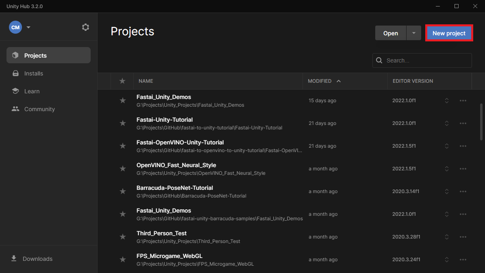{fig-align="center"}


Select the target editor version from the Editor Version dropdown menu. We'll use Unity 2022 for this post, but the current LTS release should also work fine.


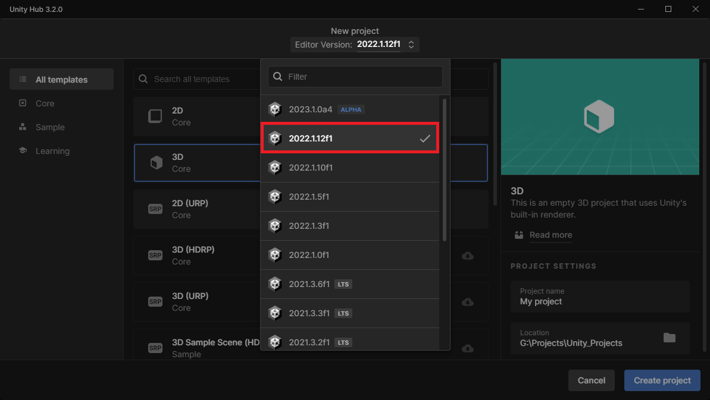{fig-align="center"}


Select the `2D Core` template.


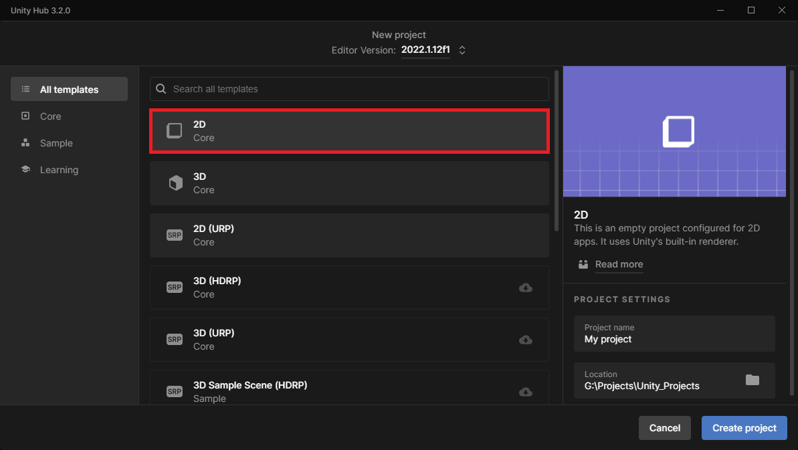{fig-align="center"}


Pick a name for the project and a location for the project folder.


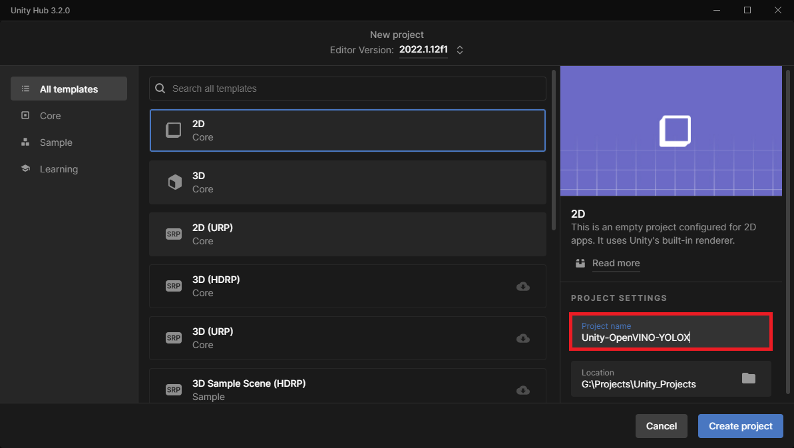{fig-align="center"}


Finally, click `Create Project` in the lower right-hand corner.


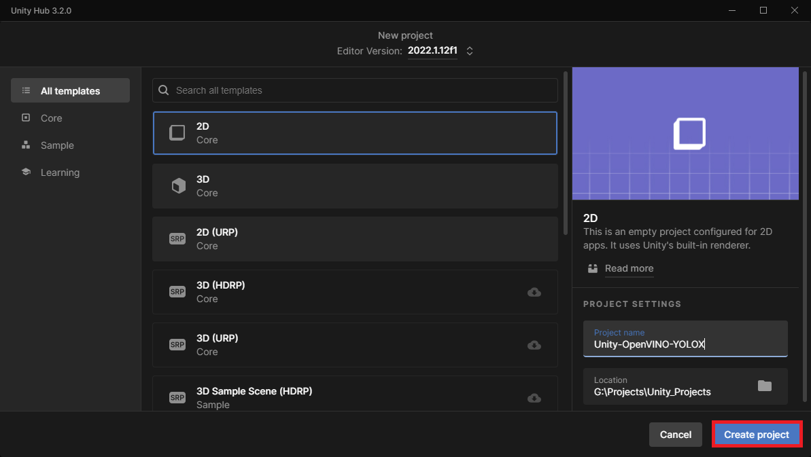{fig-align="center"}


## Import Assets

Once the project loads, we'll store the [DLL files](../part-2/#gather-dependencies) from part 2 in a new folder called `Plugins`. Right-click a space in the Assets section and select `Create → Folder` from the popup menu.

{fig-align="center"}


The DLL targets 64-bit x86 architectures, so we need to place the DLL files in a subfolder named `x86_64`.

* [Plugins Folder Google Drive](https://drive.google.com/drive/folders/1lNsaNuoF2DVcKRN3lpvi716XWfXGWiuN?usp=sharing)

  

{fig-align="center"}


> **Note:** You can place the `Plugins` folder inside another folder if needed.


Copy all the DLL files and the `plugins.xml` file into the `Assets/Plugins/x86_64` folder. We then need to close and reopen the project for Unity to load the plugin files.

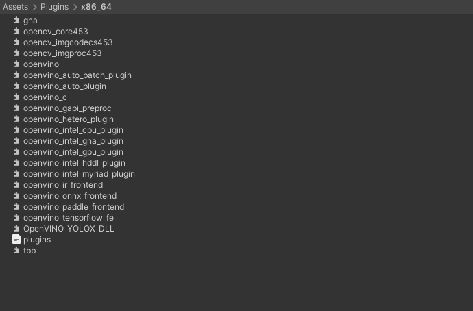{fig-align="center"}


Back in the Unity Editor, create a new folder called `Colormaps` to store the JSON file from [part 1](../part-1/#generate-colormap).

* [Colormaps Folder Google Drive](https://drive.google.com/drive/folders/1rs2eD9_3Tyg4ADLbF6CNqwRdnhpsiHgk?usp=sharing)

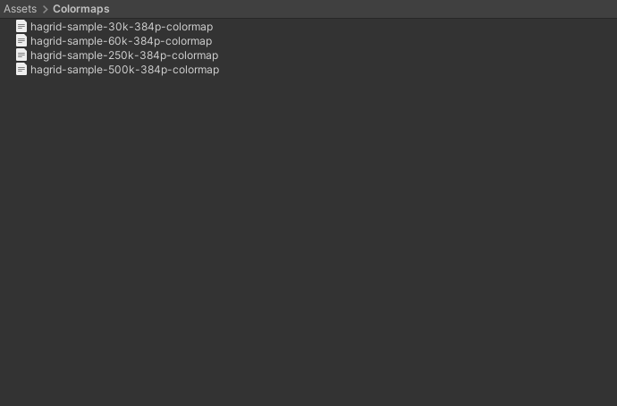{fig-align="center"}


We place any test images into a new folder called `Images`.

* [Images Folder Google Drive](https://drive.google.com/drive/folders/1jHp3nTw8bRhk9es-osSfCx-B9ga4pt1G?usp=sharing)


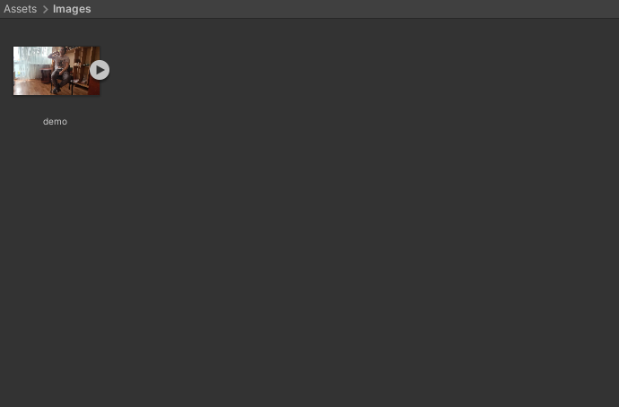{fig-align="center"}


Next, we'll create a folder to store the OpenVINO IR models. We need to place the XML and BIN files for the IR models in a [StreamingAssets](https://docs.unity3d.com/Manual/StreamingAssets.html) folder to include them in project builds. Create a new folder named `StreamingAssets`. We'll place files for each model in a separate folder and put those in a new subfolder called `OpenVINOModels` to keep things organized.

* [OpenVINOModels Folder Google Drive](https://drive.google.com/drive/folders/1cgcrHTdwrUhqsmYThaaB9zoO-6hBp-xM?usp=sharing)

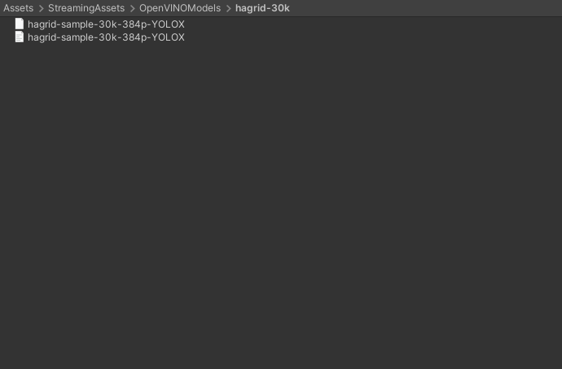{fig-align="center"}


The plugins.xml file included with the DLL files contains locations for the DLL files needed for using different types of devices.

**`plugins.xml` content:**

```xml
<ie>
    <plugins>
        <plugin name="AUTO" location="openvino_auto_plugin.dll">
            <properties>
                <property key="MULTI_WORK_MODE_AS_AUTO" value="YES"/>
            </properties>
        </plugin>
        <plugin name="BATCH" location="openvino_auto_batch_plugin.dll">
        </plugin>
        <plugin name="CPU" location="openvino_intel_cpu_plugin.dll">
        </plugin>
        <plugin name="GNA" location="openvino_intel_gna_plugin.dll">
        </plugin>
        <plugin name="GPU" location="openvino_intel_gpu_plugin.dll">
        </plugin>
        <plugin name="HETERO" location="openvino_hetero_plugin.dll">
        </plugin>
        <plugin name="MULTI" location="openvino_auto_plugin.dll">
        </plugin>
        <plugin name="MYRIAD" location="openvino_intel_myriad_plugin.dll">
        </plugin>
        <plugin name="HDDL" location="openvino_intel_hddl_plugin.dll">
        </plugin>
        <plugin name="VPUX" location="openvino_intel_vpux_plugin.dll">
        </plugin>
    </plugins>
</ie>
```


It needs to be in the same folder as the DLL files for the plugin to work. However, Unity does not include XML files in the Plugins folder when building the project. We need to store a copy of the plugins.xml file in the `StreamingAssets` folder and then copy it back to the `Plugins/x86_64` folder when first running the built project. We can handle both steps automatically in code.


## Allow Unsafe Code

Rather than copying the input image from Unity to the OpenVINO plugin, we'll pass a pointer to the pixel data. First, we need to allow unsafe code for the Unity project. Select `Edit → Project Settings...` from the top menu.

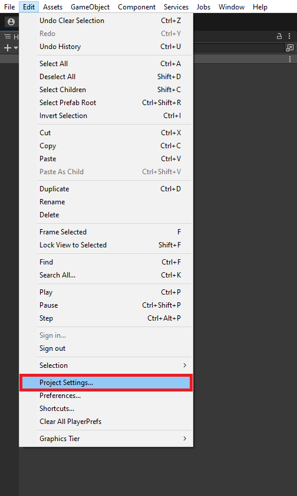{fig-align="center"}


Open the `Player → Other Settings` dropdown and scroll down to the `Allow 'unsafe' Code` checkbox. Enable the setting and close the Project Settings window.


{fig-align="center"}


Now we can start coding.


## Create Processing Shader

The input image gets flipped upside down when we send it to the plugin. We can pre-flip the image in a [Compute Shader](https://docs.unity3d.com/Manual/class-ComputeShader.html). We'll add the Compute Shader in a new folder called `Shaders`. Right-click a space in the `Shaders` folder and select `Create → Shader → Compute Shader`.

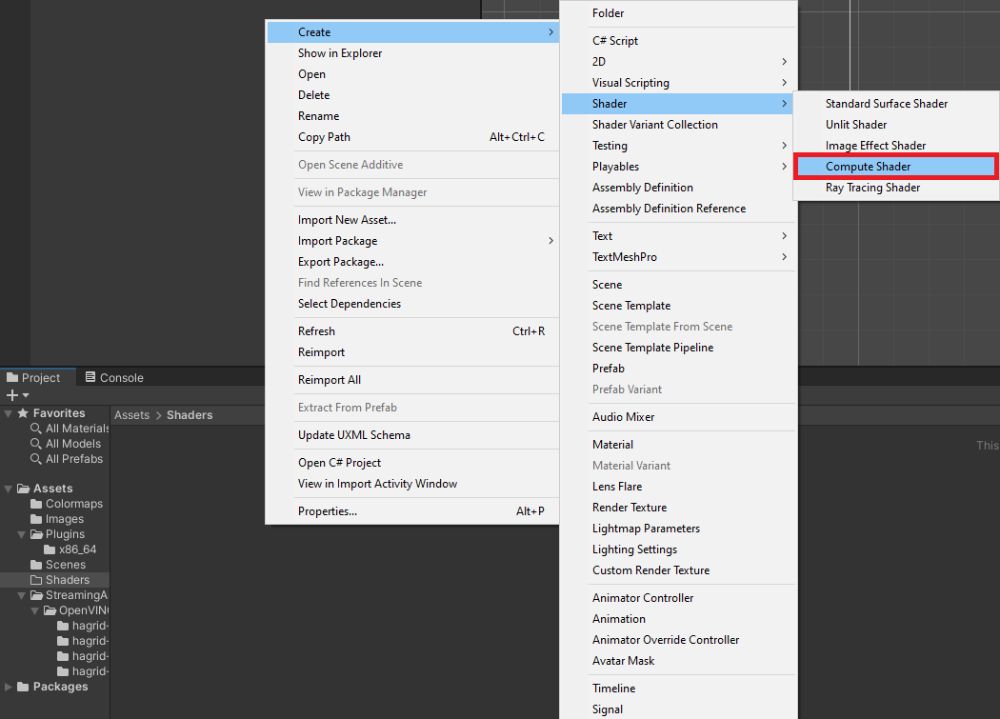{fig-align="center"}


Name the Compute Shader `ProcessingShader` and open it in the code editor. 


**Default Compute Shader Code**

```c#
// Each #kernel tells which function to compile; you can have many kernels
#pragma kernel CSMain

// Create a RenderTexture with enableRandomWrite flag and set it
// with cs.SetTexture
RWTexture2D<float4> Result;

[numthreads(8,8,1)]
void CSMain (uint3 id : SV_DispatchThreadID)
{
    // TODO: insert actual code here!

    Result[id.xy] = float4(id.x & id.y, (id.x & 15)/15.0, (id.y & 15)/15.0, 0.0);
}
```


We need to add a new `Texture2D` variable to store the pixel data for the input image. We'll remove the default method and create a new one called `FlipXAxis`. Replace the default method name in the `#pragma kernel` line at the top.

We need the input image height for the flip operation, which we can access with the [Texture2D::GetDimensions](https://docs.microsoft.com/en-us/windows/win32/direct3dhlsl/sm5-object-texture2d-getdimensions) function.


```c#
// Each #kernel tells which function to compile; you can have many kernels
#pragma kernel FlipXAxis

// The pixel data for the input image
Texture2D<float4> InputImage;
// The pixel data for the processed image
RWTexture2D<float4> Result;

// Flip the image around the x-axis
[numthreads(8, 8, 1)]
void FlipXAxis(uint3 id : SV_DispatchThreadID)
{
    // Stores the InputImage width
    uint width;
    // Stores the InputImage height
    uint height;
    // Get the dimensions of the InputImage
    InputImage.GetDimensions(width, height);

    // Update the y value for the pixel coordinates
    int2 coords = int2(id.x, height - id.y);
    Result[id.xy] = float4(InputImage[coords].x, InputImage[coords].y, InputImage[coords].z, 1.0f);
}
```


## Create Object Detector Script

We'll store the C# script that interacts with the OpenVINO plugin in a new `Scripts` folder. Right-click a space inside it and select `Create → C# Script`. 

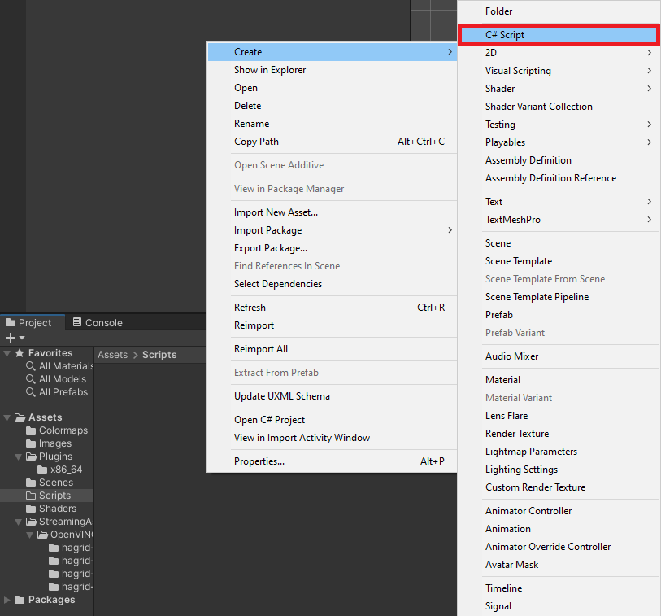{fig-align="center"}


Name the script `ObjectDetector` and open it in the code editor.


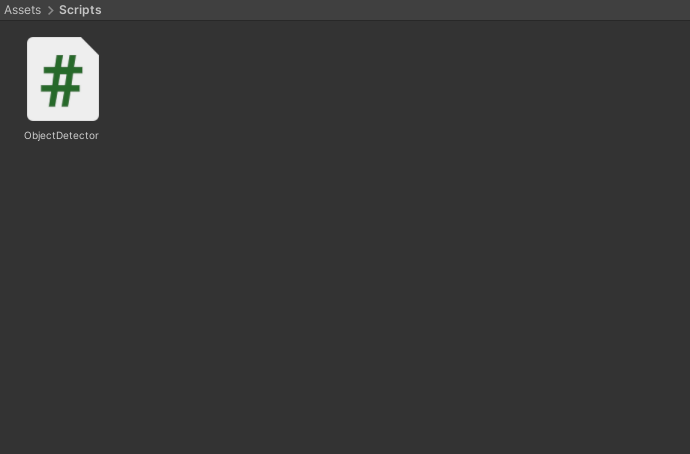{fig-align="center"}


**Default script code**

```c#
using System.Collections;
using System.Collections.Generic;
using UnityEngine;

public class ObjectDetector : MonoBehaviour
{
    // Start is called before the first frame update
    void Start()
    {
        
    }

    // Update is called once per frame
    void Update()
    {
        
    }
}
```


**Add required namespaces**

* [System](https://docs.microsoft.com/en-us/dotnet/api/system?view=net-5.0): Contains fundamental classes and base classes that define commonly-used value and reference data types, events and event handlers, interfaces, attributes, and processing exceptions.
* [UnityEngine.UI](https://docs.unity3d.com/Packages/com.unity.ugui@1.0/api/UnityEngine.UI.html): Provides access to UI elements.
* [UnityEngine.Rendering](https://docs.unity3d.com/Packages/com.unity.render-pipelines.core@5.9/api/UnityEngine.Rendering.html): Provides access to the elements of the rendering pipeline.
* [System.Runtime.InteropServices](https://docs.microsoft.com/en-us/dotnet/api/system.runtime.interopservices?view=net-6.0): Provides a wide variety of members that support COM interop and platform invoke services.
* [System.IO](https://docs.microsoft.com/en-us/dotnet/api/system.io?view=net-6.0): Allows reading and writing to files and data streams.

------

```c#
using System.Collections.Generic;
using UnityEngine;
using UnityEngine.Rendering;
using System;
using UnityEngine.UI;
using System.Runtime.InteropServices;
using System.IO;
```


**Add code to copy `plugins.xml` file to `StreamingAssets` folder**

Unity provides an [`InitializeOnLoad`](https://docs.unity3d.com/Manual/RunningEditorCodeOnLaunch.html) attribute to run code in the Unity Editor without requiring action from the user. This attribute requires the [`UnityEditor`](https://docs.unity3d.com/ScriptReference/UnityEditor.html) namespace. We can only use this while in the Editor, so we need to wrap the code in [Conditional compilation](https://docs.microsoft.com/en-us/dotnet/csharp/language-reference/preprocessor-directives#conditional-compilation) preprocessor directives. We'll place this code right below the namespaces.

```c#
#if UNITY_EDITOR
using UnityEditor;

[InitializeOnLoad]
public class Startup
{
    static Startup()
    {
        // Get all files named "plugins.xml"
        string[] files = Directory.GetFiles("./Assets/", "plugins.xml", SearchOption.AllDirectories);
        // Iterate through each found file
        foreach (string file in files)
        {
            // Check if the file is in the "x86_64" folder
            if (file.Contains("x86_64"))
            {
                // Define file path for StreamingAssets folder
                string targetPath = $"{Application.streamingAssetsPath}/plugins.xml";
                // Print the source file path
                Debug.Log(file);
                // Only copy the file to the StreamingAssets folder if it is not already present
                if (!File.Exists(targetPath)) File.Copy(file, targetPath);
            }
        }
    }
}
#endif
```


We use the `UNITY_EDITOR` [scripting symbol](https://docs.unity3d.com/Manual/PlatformDependentCompilation.html) to check whether we are in the Unity Editor. We are in the Editor, so it returns true, and the code executes.

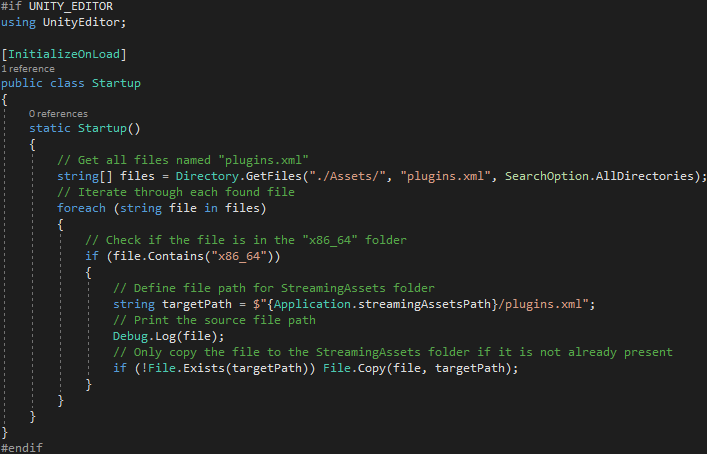{fig-align="center"}

If we check if we are not in the Unity Editor, it returns false, and the code block does not execute.

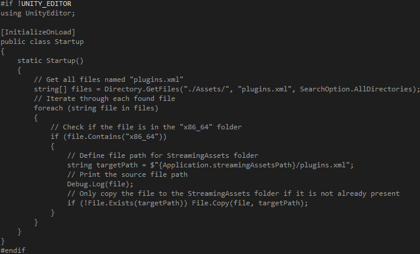{fig-align="center"}


We can verify the code works by saving the script and going to the `StreamingAssets` folder in the Editor. The plugins.xml file should be present.


{fig-align="center"}


### Define public variables

We'll add the required public variables above the Start method. We will be able to access these variables in the Inspector tab. We can add [Header](https://docs.unity3d.com/ScriptReference/HeaderAttribute.html) attributes to organize the public variables in the Inspector tab and use [Tooltip](https://docs.unity3d.com/ScriptReference/TooltipAttribute.html) attributes to provide information about variables.


**Define scene object variables**

First, we need a variable to access the screen object that displays either a test image or webcam input. We may or may not want to mirror the screen based on whether a webcam is facing the user.

```c#
[Header("Scene Objects")]
[Tooltip("The Screen object for the scene")]
public Transform screen;
[Tooltip("Mirror the in-game screen.")]
public bool mirrorScreen = true;
```


**Define data processing variables**

Next, we'll define the variables for processing model input. We can set the default target input resolution to `224` and use it to scale the source resolution while maintaining the original aspect ratio.

We'll also add a public `ComputeShader` variable to access the `ProcessingShader` we made earlier.

We need to download the pixel data for the input image from the GPU to the CPU before passing it to the plugin. This step can cause a significant performance bottleneck, so we'll add the option to read the model output asynchronously at the cost of a few frames of latency. This latency might cause the bounding box to trail slightly behind a fast-moving object on the screen. The effect should be minimal, provided the frame rate is high enough.

```c#
[Header("Data Processing")]
[Tooltip("The target minimum model input dimensions")]
public int targetDim = 224;
[Tooltip("The compute shader for GPU processing")]
public ComputeShader processingShader;
[Tooltip("Asynchronously download input image from the GPU to the CPU.")]
public bool useAsyncGPUReadback = true;
```


**Define output processing variables**

We pass in the JSON file containing the class labels as a [TextAsset](https://docs.unity3d.com/ScriptReference/TextAsset.html).

```c#
[Header("Output Processing")]
[Tooltip("A json file containing the colormaps for object classes")]
public TextAsset colormapFile;
[Tooltip("Minimum confidence score for keeping detected objects")]
[Range(0,1f)]
public float minConfidence = 0.5f;
```


**Define variables for debugging**

Next, we'll add a Boolean variable to toggle printing debug messages to the console.

```c#
[Header("Debugging")]
[Tooltip("Print debugging messages to the console")]
public bool printDebugMessages = true;
```


**Define webcam variables**

We need to specify a desired resolution and framerate when using a webcam as input.

```c#
[Header("Webcam")]
[Tooltip("Use a webcam as input")]
public bool useWebcam = false;
[Tooltip("The requested webcam dimensions")]
public Vector2Int webcamDims = new Vector2Int(1280, 720);
[Tooltip("The requested webcam framerate")]
[Range(0, 60)]
public int webcamFPS = 60;
```


**Define variables for user interface**

We'll make a simple GUI that displays the predicted class, the current framerate, and controls for selecting webcam devices, models, and compute devices.

```c#
[Header("GUI")]
[Tooltip("Display predicted class")]
public bool displayBoundingBoxes = true;
[Tooltip("Display number of detected objects")]
public bool displayProposalCount = true;
[Tooltip("Display fps")]
public bool displayFPS = true;
[Tooltip("The on-screen text color")]
public Color textColor = Color.red;
[Tooltip("The scale value for the on-screen font size")]
[Range(0, 99)]
public int fontScale = 50;
[Tooltip("The number of seconds to wait between refreshing the fps value")]
[Range(0.01f, 1.0f)]
public float fpsRefreshRate = 0.1f;
[Tooltip("The toggle for using a webcam as the input source")]
public Toggle useWebcamToggle;
[Tooltip("The dropdown menu that lists available webcam devices")]
public Dropdown webcamDropdown;
[Tooltip("The dropdown menu that lists available OpenVINO models")]
public Dropdown modelDropdown;
[Tooltip("The dropdown menu that lists available OpenVINO devices")]
public Dropdown deviceDropdown;
```


**Define public variables for the OpenVINO plugin**

```c#
[Header("OpenVINO")]
[Tooltip("The name of the openvino models folder")]
public string openvinoModelsDir = "OpenVINOModels";
```


### Define private variables

We'll add the required private variables right below the public variables.


**Define private webcam  variables**

We'll keep a list of available webcam devices so users can switch between them. Unity renders webcam input to a [WebcamTexture](https://docs.unity3d.com/ScriptReference/WebCamTexture.html).


```c#
// List of available webcam devices
private WebCamDevice[] webcamDevices;
// Live video input from a webcam
private WebCamTexture webcamTexture;
// The name of the current webcam  device
private string currentWebcam;
```


**Define input variables**

We'll update the dimensions and content of the screen object based on the test image or webcam.

When using asynchronous GPU readback, we need one Texture that stores data on the GPU and one that stores data on the CPU.

```c#
// The test image dimensions
private Vector2Int imageDims;
// The test image texture
private Texture imageTexture;
// The current screen object dimensions
private Vector2Int screenDims;
// The model GPU input texture
private RenderTexture inputTextureGPU;
// The model CPU input texture
private Texture2D inputTextureCPU;
```


**Define variable for tracking the current number of detected objects**

```c#
// Stores the number of detected objects
private int numObjects;
```


**Define variables for storing colormaps**

We need to create a couple of classes to parse the JSON content.

```c#
// A class for parsing in colormaps from a JSON file
[System.Serializable]
class ColorMap { public string label; public float[] color; }
// A class for reading in a list of colormaps from a JSON file
[System.Serializable]
class ColorMapList { public List<ColorMap> items; }
// Stores a list of colormaps from a JSON file
private ColorMapList colormapList;
// A list of colors that map to class labels
private Color[] colors;
// A list of single pixel textures that map to class labels
private Texture2D[] colorTextures;
```


**Define variables for tracking the framerate**

We'll define some variables to track the frame rate.

```c#
// The current frame rate value
private int fps = 0;
// Controls when the frame rate value updates
private float fpsTimer = 0f;
```


**Define private variables for the OpenVINO plugin**


```c#
// File paths for the available OpenVINO models
private List<string> modelPaths = new List<string>();
// Names of the available OpenVINO models
private List<string> modelNames = new List<string>();
// Names of the available OpenVINO devices
private List<string> openvinoDevices = new List<string>();
```


**Define a struct for reading object information from the OpenVINO plugin**

We need to create an `Object` struct for Unity to match the one we defined for the OpenVINO code, along with an array of `Object` structs that we'll update with the `PopulateObjectsArray()` function.

```c#
// Indicate that the members of the struct are laid out sequentially
[StructLayout(LayoutKind.Sequential)]
/// <summary>
/// Stores the information for a single object
/// </summary> 
public struct Object
{
    // The X coordinate for the top left bounding box corner
    public float x0;
    // The Y coordinate for the top left bounding box cornder
    public float y0;
    // The width of the bounding box
    public float width;
    // The height of the bounding box
    public float height;
    // The object class index for the detected object
    public int label;
    // The model confidence score for the object
    public float prob;

    public Object(float x0, float y0, float width, float height, int label, float prob)
    {
        this.x0 = x0;
        this.y0 = y0;
        this.width = width;
        this.height = height;
        this.label = label;
        this.prob = prob;
    }
}

// Stores information for the current list of detected objects
private Object[] objectInfoArray;
```


**Import functions from the OpenVINO plugin**

We pass the pointer to the input pixel data as an [IntPtr](https://docs.microsoft.com/en-us/dotnet/api/system.intptr?view=net-6.0).


```c#
// Name of the DLL file
const string dll = "OpenVINO_YOLOX_DLL";

[DllImport(dll)]
private static extern int GetDeviceCount();

[DllImport(dll)]
private static extern IntPtr GetDeviceName(int index);

[DllImport(dll)]
private static extern void SetConfidenceThreshold(float minConfidence);

[DllImport(dll)]
private static extern int LoadModel(string model, int index, int[] inputDims);

[DllImport(dll)]
private static extern int PerformInference(IntPtr inputData);

[DllImport(dll)]
private static extern void PopulateObjectsArray(IntPtr objects);

[DllImport(dll)]
private static extern void FreeResources();
```


### Define Initialization Methods

We first need to define some methods to initialize webcams, the screen object, any GUI dropdown menus, and the in-game camera.


**Define method to initialize a webcam device**

```c#
/// <summary>
/// Initialize the selected webcam device
/// </summary>
/// <param name="deviceName">The name of the selected webcam device</param>
private void InitializeWebcam(string deviceName)
{
    // Stop any webcams already playing
    if (webcamTexture && webcamTexture.isPlaying) webcamTexture.Stop();

    // Create a new WebCamTexture
    webcamTexture = new WebCamTexture(deviceName, webcamDims.x, webcamDims.y, webcamFPS);

    // Start the webcam
    webcamTexture.Play();
    // Check if webcam is playing
    useWebcam = webcamTexture.isPlaying;
    // Update toggle value
    useWebcamToggle.SetIsOnWithoutNotify(useWebcam);

    Debug.Log(useWebcam ? "Webcam is playing" : "Webcam not playing, option disabled");
}
```


**Define method to initialize the in-scene screen object**


```c#
/// <summary>
/// Resize and position an in-scene screen object
/// </summary>
private void InitializeScreen()
{
    // Set the texture for the screen object
    screen.gameObject.GetComponent<MeshRenderer>().material.mainTexture = useWebcam ? webcamTexture : imageTexture;
    // Set the screen dimensions
    screenDims = useWebcam ? new Vector2Int(webcamTexture.width, webcamTexture.height) : imageDims;

    // Flip the screen around the Y-Axis when using webcam
    float yRotation = useWebcam && mirrorScreen ? 180f : 0f;
    // Invert the scale value for the Z-Axis when using webcam
    float zScale = useWebcam && mirrorScreen ? -1f : 1f;

    // Set screen rotation
    screen.rotation = Quaternion.Euler(0, yRotation, 0);
    // Adjust the screen dimensions
    screen.localScale = new Vector3(screenDims.x, screenDims.y, zScale);

    // Adjust the screen position
    screen.position = new Vector3(screenDims.x / 2, screenDims.y / 2, 1);
}
```


**Define method to get the available OpenVINO models**


```c#
/// <summary>
/// Get the file paths for available OpenVION models
/// </summary>
private void GetOpenVINOModels()
{
    // Get the paths for each model folder
    foreach (string dir in System.IO.Directory.GetDirectories($"{Application.streamingAssetsPath}/{openvinoModelsDir}"))
    {
        string modelName = dir.Split('\\')[1];

        modelNames.Add(modelName.Substring(0, modelName.Length));

        // Get the paths for the XML file for each model
        foreach (string file in System.IO.Directory.GetFiles(dir))
        {
            if (file.EndsWith(".xml"))
            {
                modelPaths.Add(file);
            }
        }
    }
}
```


**Define method to get the names of available OpenVINO devices**

```c#
/// <summary>
/// Get the names of the available OpenVINO devices
/// </summary>
private void GetOpenVINODevices()
{
    // Get the number of available OpenVINO devices
    int deviceCount = GetDeviceCount();

    for (int i = 0; i < deviceCount; i++)
    {
        openvinoDevices.Add(Marshal.PtrToStringAnsi(GetDeviceName(i)));
    }
}
```


**Define method to initialize GUI dropdown menu options**

```c#
/// <summary>
/// Initialize the GUI dropdown list
/// </summary>
private void InitializeDropdown()
{
    // Create list of webcam device names
    List<string> webcamNames = new List<string>();
    foreach(WebCamDevice device in webcamDevices) webcamNames.Add(device.name);

    // Remove default dropdown options
    webcamDropdown.ClearOptions();
    // Add webcam device names to dropdown menu
    webcamDropdown.AddOptions(webcamNames);
    // Set the value for the dropdown to the current webcam device
    webcamDropdown.SetValueWithoutNotify(webcamNames.IndexOf(currentWebcam));

    // Remove default dropdown options
    modelDropdown.ClearOptions();
    // Add OpenVINO model names to menu
    modelDropdown.AddOptions(modelNames);
    // Select the first option in the dropdown
    modelDropdown.SetValueWithoutNotify(0);

    // Remove default dropdown options
    deviceDropdown.ClearOptions();
    // Add OpenVINO device names to menu
    deviceDropdown.AddOptions(openvinoDevices);
    // Select the first option in the dropdown
    deviceDropdown.SetValueWithoutNotify(0);
}
```


**Define method to initialize the in-scene camera object**


```c#
/// <summary>
/// Resize and position the main camera based on an in-scene screen object
/// </summary>
/// <param name="screenDims">The dimensions of an in-scene screen object</param>
private void InitializeCamera(Vector2Int screenDims, string cameraName = "Main Camera")
{
    // Get a reference to the Main Camera GameObject
    GameObject camera = GameObject.Find(cameraName);
    // Adjust the camera position to account for updates to the screenDims
    camera.transform.position = new Vector3(screenDims.x / 2, screenDims.y / 2, -10f);
    // Render objects with no perspective (i.e. 2D)
    camera.GetComponent<Camera>().orthographic = true;
    // Adjust the camera size to account for updates to the screenDims
    camera.GetComponent<Camera>().orthographicSize = screenDims.y / 2;
}
```


**Define method to update the selected OpenVINO model**

```c#
/// <summary>
/// Update the selected OpenVINO model
/// </summary>
public void UpdateOpenVINOModel()
{
    // Reset objectInfoArray
    objectInfoArray = new Object[0];

    int[] inputDims = new int[] {
        inputTextureCPU.width,
        inputTextureCPU.height
    };

    Debug.Log($"Selected Device: {openvinoDevices[deviceDropdown.value]}");

    // Load the specified OpenVINO model
    int return_msg = LoadModel(modelPaths[modelDropdown.value], deviceDropdown.value, inputDims);

    SetConfidenceThreshold(minConfidence);

    string[] return_messages = {
        "Model loaded and reshaped successfully", 
        "Failed to load model",
        "Failed to reshape model input",
    };

    Debug.Log($"Updated input dims: {inputDims[0]} x {inputDims[1]}");
    Debug.Log($"Return message: {return_messages[return_msg]}");
}
```


### Define Awake Method

We'll implement the code to copy the plugins.xml file from the `StreamingAssets` folder to the `Plugins/x86_64` folder in the build folder in the [Awake()](https://docs.unity3d.com/ScriptReference/MonoBehaviour.Awake.html) method. The code should be inactive since we are in the Editor.

```c#
// Awake is called when the script instance is being loaded
private void Awake()
{
    #if !UNITY_EDITOR
    // Define the path for the plugins.xml file in the StreamingAssets folder
    string sourcePath = $"{Application.streamingAssetsPath}/plugins.xml";
    // Define the destination path for the plugins.xml file
    string targetPath = $"{Application.dataPath}/Plugins/x86_64/plugins.xml";
    // Only copy the file if it is not already present at the destination
    if (!File.Exists(targetPath)) File.Copy(sourcePath, targetPath);
    #endif
}
```


### Define Start Method

The [Start](https://docs.unity3d.com/ScriptReference/MonoBehaviour.Start.html) method is [called](https://docs.unity3d.com/Manual/ExecutionOrder.html) once before the first frame update, so we'll perform any required setup steps here.


```c#
// Start is called before the first frame update
void Start()
{
    // Get the source image texture
    imageTexture = screen.gameObject.GetComponent<MeshRenderer>().material.mainTexture;
    // Get the source image dimensions as a Vector2Int
    imageDims = new Vector2Int(imageTexture.width, imageTexture.height);

    // Initialize list of available webcam devices
    webcamDevices = WebCamTexture.devices;
    foreach (WebCamDevice device in webcamDevices) Debug.Log(device.name);
    currentWebcam = webcamDevices[0].name;
    useWebcam = webcamDevices.Length > 0 ? useWebcam : false;
    // Initialize webcam
    if (useWebcam) InitializeWebcam(currentWebcam);

    // Resize and position the screen object using the source image dimensions
    InitializeScreen();
    // Resize and position the main camera using the source image dimensions
    InitializeCamera(screenDims);

    // Initialize list of color maps from JSON file
    colormapList = JsonUtility.FromJson<ColorMapList>(colormapFile.text);
    // Initialize the list of colors
    colors = new Color[colormapList.items.Count];
    // Initialize the list of color textures
    colorTextures = new Texture2D[colormapList.items.Count];

    // Populate the color and color texture arrays
    for (int i = 0; i < colors.Length; i++)
    {
        // Create a new color object
        colors[i] = new Color(
            colormapList.items[i].color[0],
            colormapList.items[i].color[1],
            colormapList.items[i].color[2]);
        // Create a single-pixel texture
        colorTextures[i] = new Texture2D(1, 1);
        colorTextures[i].SetPixel(0, 0, colors[i]);
        colorTextures[i].Apply();

    }

    // Get the file paths for available OpenVINO models
    GetOpenVINOModels();
    // Get the names of available OpenVINO devices
    GetOpenVINODevices();

    // Initialize the webcam dropdown list
    InitializeDropdown();
}
```


### Define Processing Methods

Next, we need to define methods to process images using the Compute Shader, calculate the input resolution, handle asynchronous GPU readback, and scale the bounding box information.


**Define method to process images using a compute shader**


```c#
/// <summary>
/// Process the provided image using the specified function on the GPU
/// </summary>
/// <param name="image">The target image RenderTexture</param>
/// <param name="computeShader">The target ComputerShader</param>
/// <param name="functionName">The target ComputeShader function</param>
/// <returns></returns>
private void ProcessImageGPU(RenderTexture image, ComputeShader computeShader, string functionName)
{
    // Specify the number of threads on the GPU
    int numthreads = 8;
    // Get the index for the specified function in the ComputeShader
    int kernelHandle = computeShader.FindKernel(functionName);
    // Define a temporary HDR RenderTexture
    RenderTexture result = new RenderTexture(image.width, image.height, 24, RenderTextureFormat.ARGBHalf);
    // Enable random write access
    result.enableRandomWrite = true;
    // Create the HDR RenderTexture
    result.Create();

    // Set the value for the Result variable in the ComputeShader
    computeShader.SetTexture(kernelHandle, "Result", result);
    // Set the value for the InputImage variable in the ComputeShader
    computeShader.SetTexture(kernelHandle, "InputImage", image);

    // Execute the ComputeShader
    computeShader.Dispatch(kernelHandle, result.width / numthreads, result.height / numthreads, 1);

    // Copy the result into the source RenderTexture
    Graphics.Blit(result, image);

    // Release RenderTexture
    result.Release();
}
```


**Define method to calculate input resolution**


```c#
/// <summary>
/// Scale the source image resolution to the target input dimensions
/// while maintaing the source aspect ratio.
/// </summary>
/// <param name="imageDims"></param>
/// <param name="targetDims"></param>
/// <returns></returns>
private Vector2Int CalculateInputDims(Vector2Int imageDims, int targetDim)
{
    Vector2Int inputDims = new Vector2Int();

    // Calculate the input dimensions using the target minimum dimension
    if (imageDims.x >= imageDims.y)
    {
        inputDims[0] = (int)(imageDims.x / ((float)imageDims.y / (float)targetDim));
        inputDims[1] = targetDim;
    }
    else
    {
        inputDims[0] = targetDim;
        inputDims[1] = (int)(imageDims.y / ((float)imageDims.x / (float)targetDim));
    }

    return inputDims;
}
```


**Define method to handle asynchronous GPU readback**


```c#
/// <summary>
/// Called once AsyncGPUReadback has been completed
/// </summary>
/// <param name="request"></param>
private void OnCompleteReadback(AsyncGPUReadbackRequest request)
{
    if (request.hasError)
    {
        Debug.Log("GPU readback error detected.");
        return;
    }

    // Make sure the Texture2D is not null
    if (inputTextureCPU)
    {
        // Fill Texture2D with raw data from the AsyncGPUReadbackRequest
        inputTextureCPU.LoadRawTextureData(request.GetData<uint>());
        // Apply changes to Textur2D
        inputTextureCPU.Apply();
    }
}
```


**Define method to send the input texture data to the plugin**


```c#
/// <summary>
/// Pin memory for the input data and pass a reference to the plugin for inference
/// </summary>
/// <param name="texture">The input texture</param>
/// <returns></returns>
public unsafe int UploadTexture(Texture2D texture)
{
    //Pin Memory
    fixed (byte* p = texture.GetRawTextureData())
    {
        // Perform inference and get the number of detected objects
        numObjects = PerformInference((IntPtr)p);
    }

    // Initialize the array
    objectInfoArray = new Object[numObjects];

    // Pin memory
    fixed (Object* o = objectInfoArray)
    {
        // Get the detected objects
        PopulateObjectsArray((IntPtr)o);
    }

    return numObjects;
}
```


**Define method to scale bounding boxes to the display resolution**


```c#
/// <summary>
/// Scale the latest bounding boxes to the display resolution
/// </summary>
public void ScaleBoundingBoxes()
{
    // Process new detected objects
    for (int i = 0; i < objectInfoArray.Length; i++)
    {
        // The smallest dimension of the screen
        float minScreenDim = Mathf.Min(screen.transform.localScale.x, screen.transform.localScale.y);
        // The smallest input dimension
        int minInputDim = Mathf.Min(inputTextureCPU.width, inputTextureCPU.height);
        // Calculate the scale value between the in-game screen and input dimensions
        float minImgScale = minScreenDim / minInputDim;
        // Calculate the scale value between the in-game screen and display
        float displayScale = Screen.height / screen.transform.localScale.y;

        // Scale bounding box to in-game screen resolution and flip the bbox coordinates vertically
        float x0 = objectInfoArray[i].x0 * minImgScale;
        float y0 = (inputTextureCPU.height - objectInfoArray[i].y0) * minImgScale;
        float width = objectInfoArray[i].width * minImgScale;
        float height = objectInfoArray[i].height * minImgScale;

        // Mirror bounding box across screen
        if (mirrorScreen && useWebcam) x0 = screen.transform.localScale.x - x0 - width;

        // Scale bounding boxes to display resolution
        objectInfoArray[i].x0 = x0 * displayScale;
        objectInfoArray[i].y0 = y0 * displayScale;
        objectInfoArray[i].width = width * displayScale;
        objectInfoArray[i].height = height * displayScale;

        // Offset the bounding box coordinates based on the difference between the in-game screen and display
        objectInfoArray[i].x0 += (Screen.width - screen.transform.localScale.x * displayScale) / 2;
    }
}
```


### Define Update method

We'll place anything we want to run every frame in the [Update](https://docs.unity3d.com/ScriptReference/MonoBehaviour.Update.html) method.


```c#
// Update is called once per frame
void Update()
{
    useWebcam = webcamDevices.Length > 0 ? useWebcam : false;
    if (useWebcam)
    {
        // Initialize webcam if it is not already playing
        if (!webcamTexture || !webcamTexture.isPlaying) InitializeWebcam(currentWebcam);

        // Skip the rest of the method if the webcam is not initialized
        if (webcamTexture.width <= 16) return;

        // Make sure screen dimensions match webcam resolution when using webcam
        if (screenDims.x != webcamTexture.width)
        {
            // Resize and position the screen object using the source image dimensions
            InitializeScreen();
            // Resize and position the main camera using the source image dimensions
            InitializeCamera(screenDims);
        }
    }
    else if (webcamTexture && webcamTexture.isPlaying)
    {
        // Stop the current webcam
        webcamTexture.Stop();

        // Resize and position the screen object using the source image dimensions
        InitializeScreen();
        // Resize and position the main camera using the source image dimensions
        InitializeCamera(screenDims);
    }

    // Scale the source image resolution
    Vector2Int inputDims = CalculateInputDims(screenDims, targetDim);
    if (printDebugMessages) Debug.Log($"Input Dims: {inputDims.x} x {inputDims.y}");

    // Initialize the input texture with the calculated input dimensions
    inputTextureGPU = RenderTexture.GetTemporary(inputDims.x, inputDims.y, 24, RenderTextureFormat.ARGBHalf);

    if (!inputTextureCPU || inputTextureCPU.width != inputTextureGPU.width)
    {
        inputTextureCPU = new Texture2D(inputDims.x, inputDims.y, TextureFormat.RGBA32, false);
        // Update the selected OpenVINO model
        UpdateOpenVINOModel();
    }

    // Copy the source texture into model input texture
    Graphics.Blit((useWebcam ? webcamTexture : imageTexture), inputTextureGPU);

    // Flip image before sending to DLL
    ProcessImageGPU(inputTextureGPU, processingShader, "FlipXAxis");

    // Download pixel data from GPU to CPU
    if (useAsyncGPUReadback)
    {
        AsyncGPUReadback.Request(inputTextureGPU, 0, TextureFormat.RGBA32, OnCompleteReadback);
    }
    else
    {
        RenderTexture.active = inputTextureGPU;
        inputTextureCPU.ReadPixels(new Rect(0, 0, inputTextureGPU.width, inputTextureGPU.height), 0, 0);
        inputTextureCPU.Apply();
    }

    // Send reference to inputData to DLL
    numObjects = UploadTexture(inputTextureCPU);
    if (printDebugMessages) Debug.Log($"Detected {numObjects} objects");
    // Scale bounding boxes
    ScaleBoundingBoxes();

    // Release the input texture
    RenderTexture.ReleaseTemporary(inputTextureGPU);
}
```


### Define GUI Methods

We need some methods to handle user interactions with the GUI and display the bounding boxes and current framerate.


**Define method to update webcam usage from GUI**


```c#
/// <summary>
/// This method is called when the value for the webcam toggle changes
/// </summary>
/// <param name="useWebcam"></param>
public void UpdateWebcamToggle(bool useWebcam)
{
    this.useWebcam = useWebcam;
}
```


**Define method to update webcam device from GUI**

```c#
/// <summary>
/// The method is called when the selected value for the webcam dropdown changes
/// </summary>
public void UpdateWebcamDevice()
{
    currentWebcam = webcamDevices[webcamDropdown.value].name;
    Debug.Log($"Selected Webcam: {currentWebcam}");
    // Initialize webcam if it is not already playing
    if (useWebcam) InitializeWebcam(currentWebcam);

    // Resize and position the screen object using the source image dimensions
    InitializeScreen();
    // Resize and position the main camera using the source image dimensions
    InitializeCamera(screenDims);
}
```


**Define method to update the minimum confidence value**

```c#
/// <summary>
/// Update the minimum confidence score for keeping bounding box proposals
/// </summary>
/// <param name="slider"></param>
public void UpdateConfidenceThreshold(Slider slider)
{
    minConfidence = slider.value;
    SetConfidenceThreshold(minConfidence);
}
```


**Define OnGUI method**

We'll display the predicted bounding boxes and current frame rate in the [OnGUI](https://docs.unity3d.com/ScriptReference/MonoBehaviour.OnGUI.html) method.

```c#
// OnGUI is called for rendering and handling GUI events.
public void OnGUI()
{
    // Initialize a rectangle for label text
    Rect labelRect = new Rect();
    // Initialize a rectangle for bounding boxes
    Rect boxRect = new Rect();

    GUIStyle labelStyle = new GUIStyle
    {
        fontSize = (int)(Screen.width * 11e-3)
    };
    labelStyle.alignment = TextAnchor.MiddleLeft;

    foreach (Object objectInfo in objectInfoArray)
    {
        if (!displayBoundingBoxes) break;

        // Skip object if label index is out of bounds
        if (objectInfo.label > colors.Length - 1) continue;

        // Get color for current class index
        Color color = colors[objectInfo.label];
        // Get label for current class index
        string name = colormapList.items[objectInfo.label].label;

        // Set bounding box coordinates
        boxRect.x = objectInfo.x0;
        boxRect.y = Screen.height - objectInfo.y0;
        // Set bounding box dimensions
        boxRect.width = objectInfo.width;
        boxRect.height = objectInfo.height;

        // Scale bounding box line width based on display resolution
        int lineWidth = (int)(Screen.width * 1.75e-3);
        // Render bounding box
        GUI.DrawTexture(
            position: boxRect,
            image: Texture2D.whiteTexture,
            scaleMode: ScaleMode.StretchToFill,
            alphaBlend: true,
            imageAspect: 0,
            color: color,
            borderWidth: lineWidth,
            borderRadius: 0);

        // Include class label and confidence score in label text
        string labelText = $" {name}: {(objectInfo.prob * 100).ToString("0.##")}%";

        // Initialize label GUI content
        GUIContent labelContent = new GUIContent(labelText);

        // Calculate the text size.
        Vector2 textSize = labelStyle.CalcSize(labelContent);

        // Set label text coordinates
        labelRect.x = objectInfo.x0;
        labelRect.y = Screen.height - objectInfo.y0 - textSize.y + lineWidth;

        // Set label text dimensions
        labelRect.width = Mathf.Max(textSize.x, objectInfo.width);
        labelRect.height = textSize.y;
        // Set label text and backgound color
        labelStyle.normal.textColor = color.grayscale > 0.5 ? Color.black : Color.white;
        labelStyle.normal.background = colorTextures[objectInfo.label];
        // Render label
        GUI.Label(labelRect, labelContent, labelStyle);

        Rect objectDot = new Rect();
        objectDot.height = lineWidth * 5;
        objectDot.width = lineWidth * 5;
        float radius = objectDot.width / 2;
        objectDot.x = (boxRect.x + boxRect.width / 2) - radius;
        objectDot.y = (boxRect.y + boxRect.height / 2) - radius;


        GUI.DrawTexture(
            position: objectDot,
            image: Texture2D.whiteTexture,
            scaleMode: ScaleMode.StretchToFill,
            alphaBlend: true,
            imageAspect: 0,
            color: color,
            borderWidth: radius,
            borderRadius: radius);

    }

    // Define styling information for GUI elements
    GUIStyle style = new GUIStyle
    {
        fontSize = (int)(Screen.width * (1f / (100f - fontScale)))
    };
    style.normal.textColor = textColor;

    // Define screen spaces for GUI elements
    Rect slot1 = new Rect(10, 10, 500, 500);
    Rect slot2 = new Rect(10, style.fontSize * 1.5f, 500, 500);

    string content = $"Objects Detected: {numObjects}";
    if (displayProposalCount) GUI.Label(slot1, new GUIContent(content), style);

    // Update framerate value
    if (Time.unscaledTime > fpsTimer)
    {
        fps = (int)(1f / Time.unscaledDeltaTime);
        fpsTimer = Time.unscaledTime + fpsRefreshRate;
    }

    // Adjust screen position when not showing predicted class
    Rect fpsRect = displayProposalCount ? slot2 : slot1;
    if (displayFPS) GUI.Label(fpsRect, new GUIContent($"FPS: {fps}"), style);
}
```


### Define OnDisable Method

We'll perform any clean-up steps in the [OnDisable ](https://docs.unity3d.com/ScriptReference/MonoBehaviour.OnDisable.html)method.


```c#
private void OnDisable()
{
    FreeResources();
}
```


## Set up Unity Scene

Now we can start setting up our Unity scene. We need a screen to display the webcam feed, an empty object to attach the object detector script, dropdown menus for selecting webcams, models, and compute devices, a toggle to activate a webcam feed, and a slider to update the confidence threshold.


**Create Screen object**

Right-click a space in the Hierarchy tab and select `3D Object → Quad`. We can name the new object Screen.

{fig-align="center"}


Next, drag and drop a test image from the `Assets → Images` folder onto the Screen object in the Scene view. Note that the Screen looks a bit dim. We need to change the shader for the Screen's Material so that it does not require an external light source.

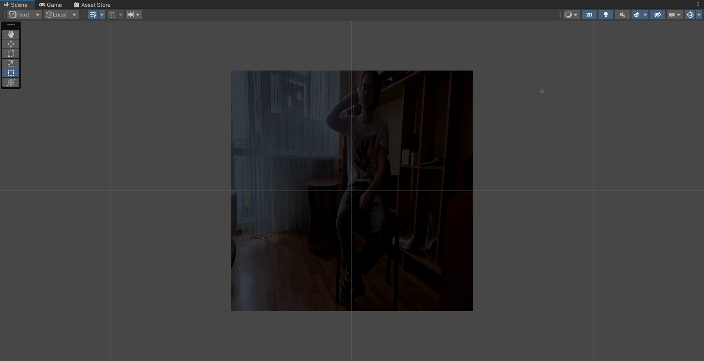{fig-align="center"}


Select the Screen in the Hierarchy tab and open the `Shader` dropdown menu in the Inspector tab. Type `Unlit/Texture` into the search box and press enter.


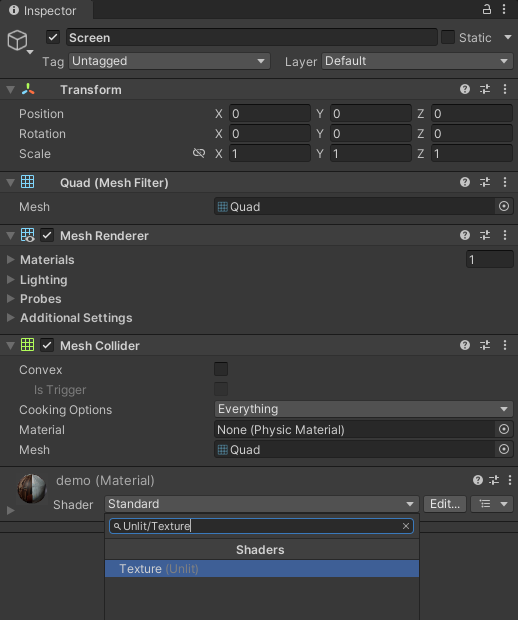{fig-align="center"}


**Create Inference Manager object**

Right-click a space in the Hierarchy tab and select `Create Empty`. Name the empty object `InferenceManager`.

{fig-align="center"}


With the `InferenceManager` object selected, drag the `ObjectDetector` script into the Inspector tab.

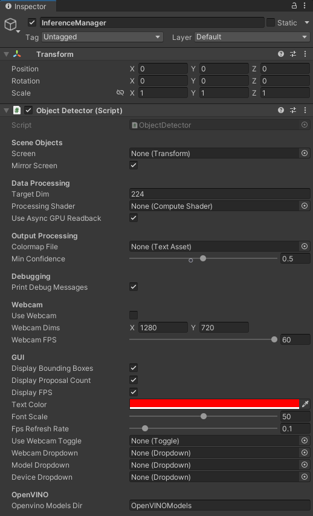{fig-align="center"}


Now we can assign the screen object, compute shader, and colormap file in the Inspector tab by dragging them into their respective fields.


**Add GUI prefab**

We still need to create the GUI controls. To save time, I made a [Prefab](https://docs.unity3d.com/Manual/Prefabs.html) that we can drop into the Scene. 

* **Google Drive:** [Canvas Prefab](https://drive.google.com/file/d/1RbL7qaIQNzWCI4z-WUArHgDFY8pUZtoE/view?usp=sharing)

Drag and drop the Canvas prefab into a new folder called Prefabs. 

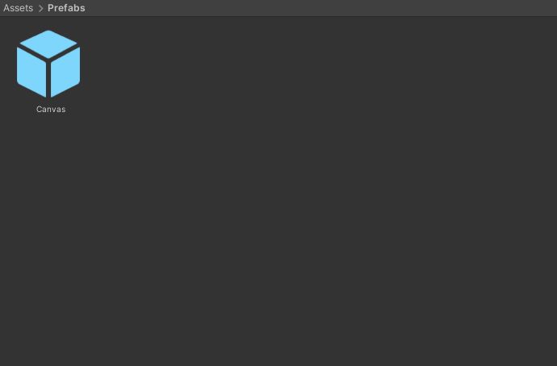{fig-align="center"}


From there, drag the prefab into the Hierarchy tab. We can see the GUI by switching to the Game view.

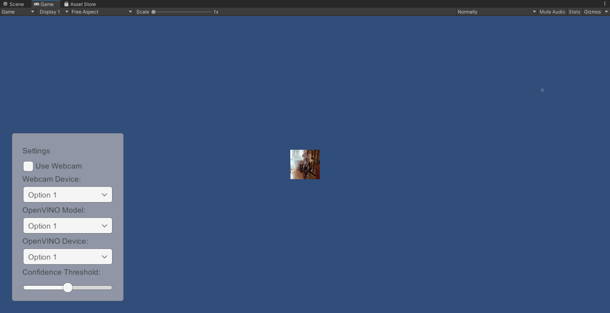{fig-align="center"}


**Configure Webcam Toggle On Value Changed function**

Next, we need to pair the `WebcamToggle` with the `UpdateWebcamToggle` function in the `ObjectDetector` script. Expand the Canvas object and select the `WebcamToggle`.

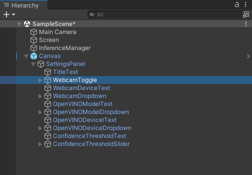{fig-align="center"}


Click and drag the `InferenceManager` into the `On Value Changed` field.

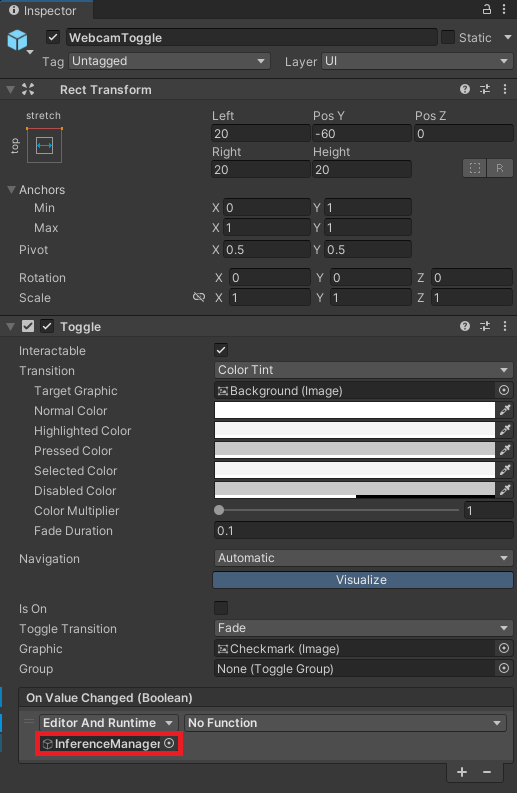{fig-align="center"}


Open the `No Function` dropdown menu and select `ObjectDetector → UpdateWebcamToggle`.

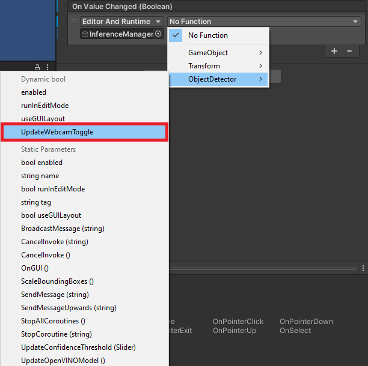{fig-align="center"}


**Configure Webcam Dropdown On Value Changed function**

We can follow the same steps to pair the `WebcamDropdown` with the `UpdateWebcamDevice` function in the `ObjectDetector` script.

{fig-align="center"}

This time select `ObjectDetector → UpdateWebcamDevice`.

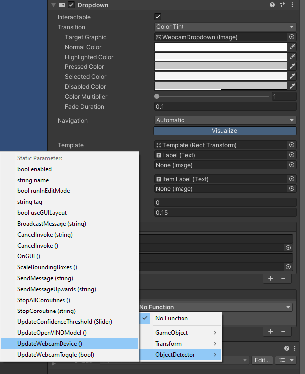{fig-align="center"}


**Configure `OpenVINOModelDropdown` On Value Changed Event**

{fig-align="center"}


**Configure `OpenVINODeviceDropdown` On Value Changed Event**

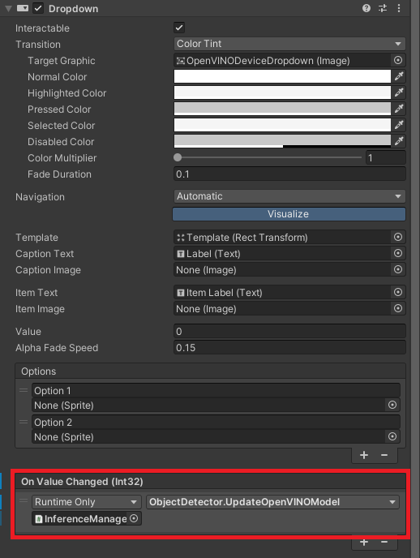{fig-align="center"}


**Configure `ConfidenceThresholdSlider` On Value Changed Event**

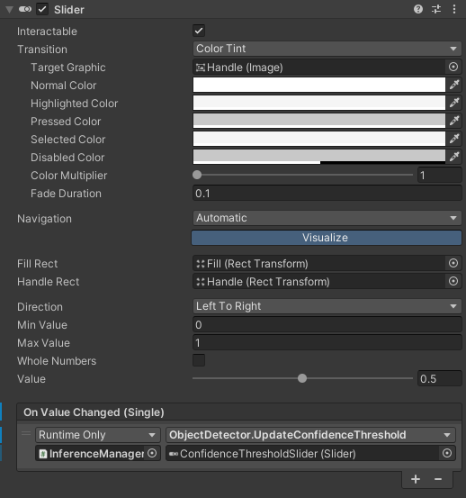{fig-align="center"}


**Assign GUI objects to Inference Manager**

We can now assign the GUI objects to their respective fields for the `ObjectDetector` script.

{fig-align="center"}


**Add Event System**

Before we can use the GUI, we need to add an Event System. Right-click a space in the Hierarchy tab and select `UI → Event System`.

{fig-align="center"}


## Test in Editor

Click the play button in the top-middle of the Editor window to test the project.

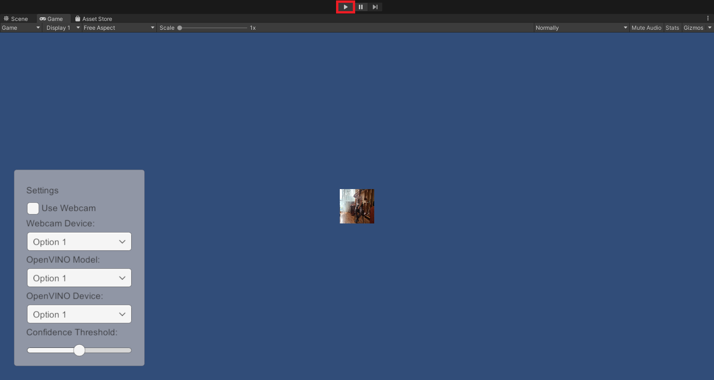{fig-align="center"}


There should be a bounding box for the call sign and one for the idle hand.

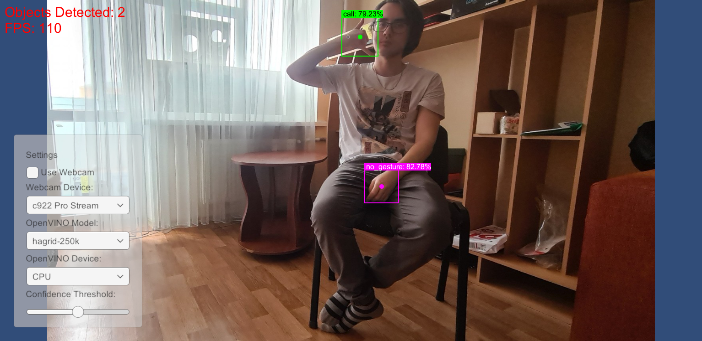{fig-align="center"}


## Summary

In this three-part tutorial series, we learned how to perform end-to-end object detection in Unity using IceVision and OpenVINO. In part 1, we trained a YOLOX model using IceVision and exported it to OpenVINO. In part 2, we created a dynamic link library (DLL) file in Visual Studio to perform object detection with the YOLOX model using OpenVINO. Finally, in this post, we integrated the trained model into a Unity project to perform real-time object detection. You now have a template to perform object detection in Unity that you can adapt to other projects.


**Previous:** [End-to-End Object Detection for Unity With IceVision and OpenVINO Pt. 2](../part-2/)


**Project Resources:** [GitHub Repository](https://github.com/cj-mills/icevision-openvino-unity-tutorial)

