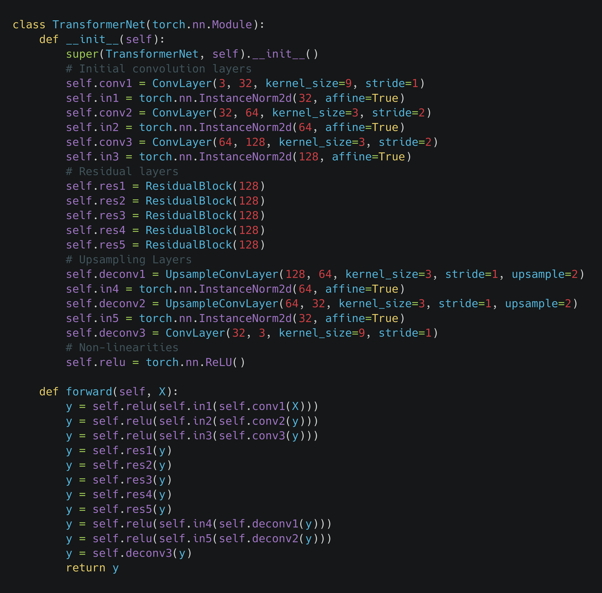
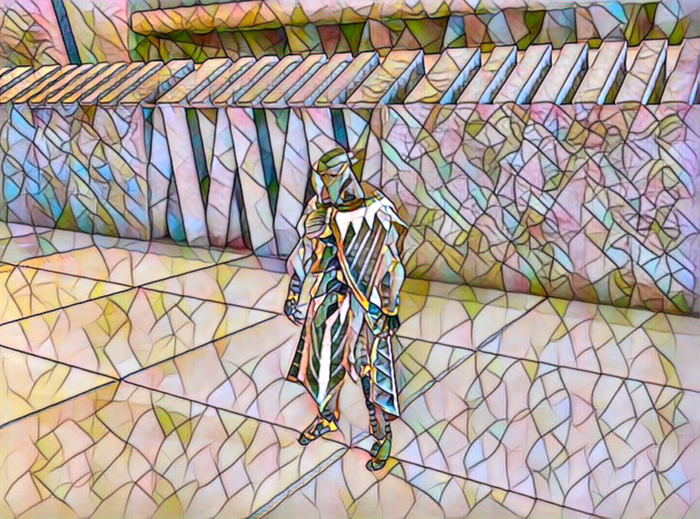
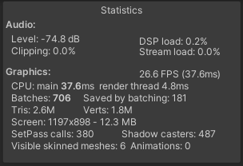
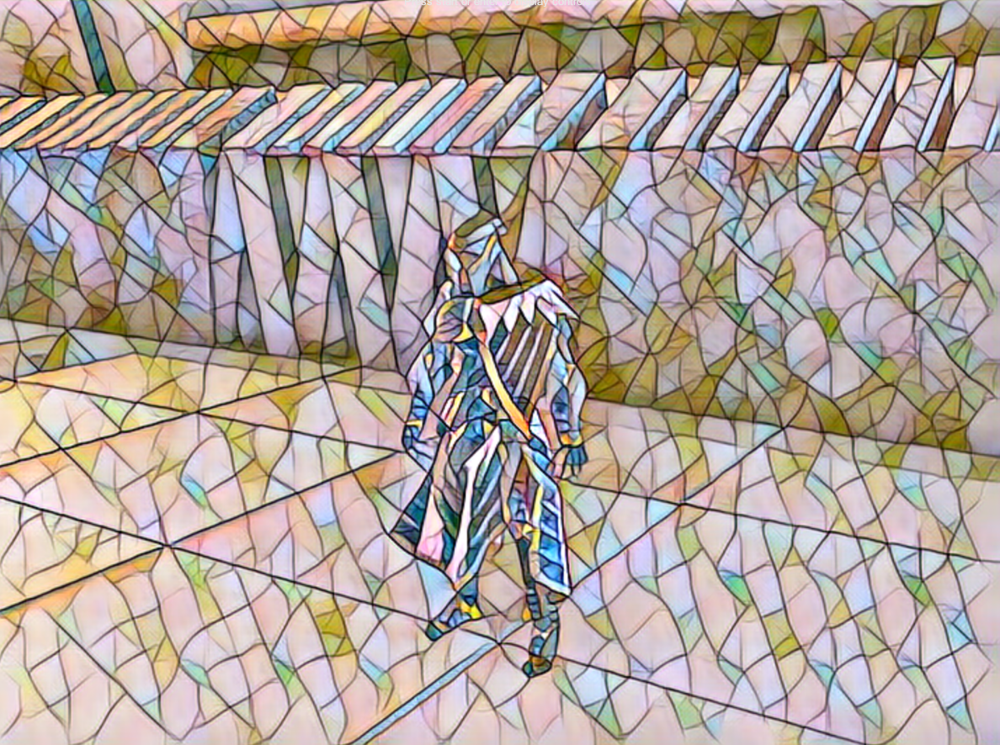
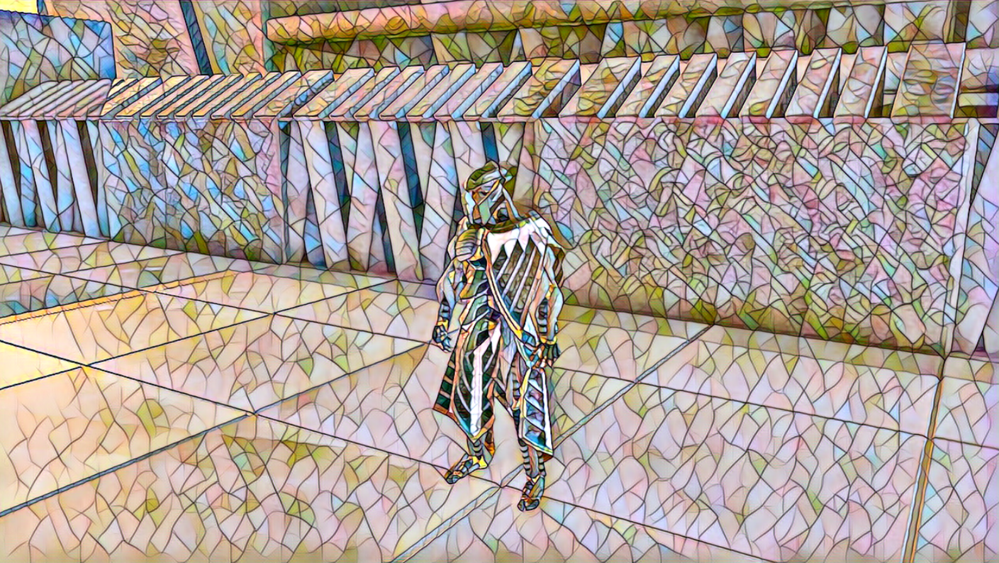
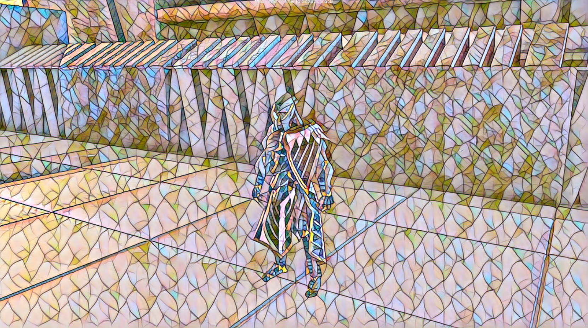
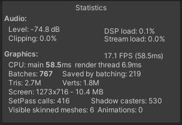
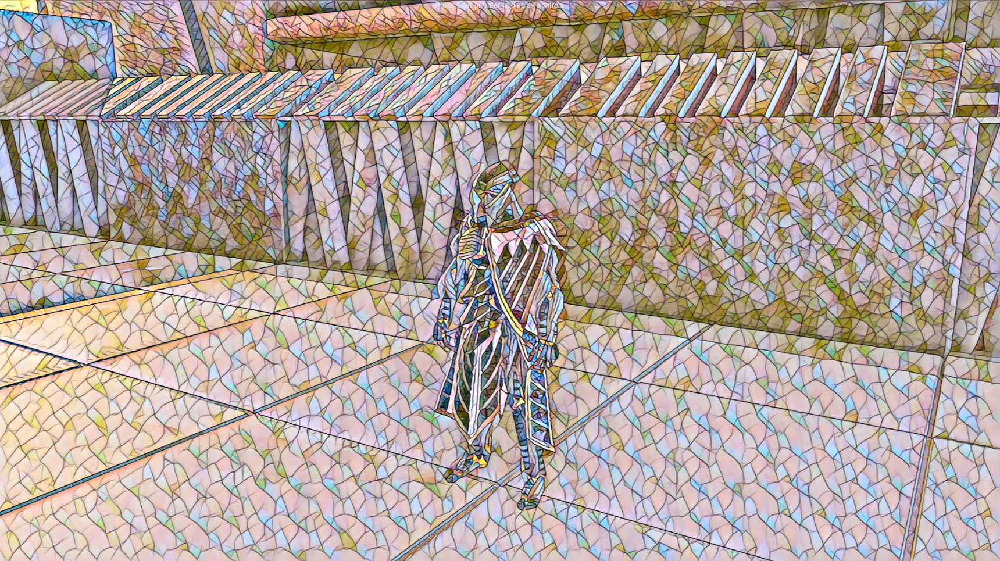
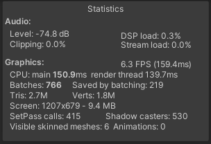

* [Introduction](#introduction)
* [Model Quantization](#model-quantization)
* [Network Pruning](#network-pruning)
* [Using a Smaller Model](#using-a-smaller-model)
* [Conclusion](#conclusion)

## Introduction

I finally got around to exploring different optimization methods to speed up the style transfer models in Unity. I started off with a couple post-training optimization techniques including quantization and pruning. I then tried training with smaller models. I should have started off with the smaller models.

## Model Quantization

I followed the example code in PyTorch's documentation to quantize the `fast_neural_style` model. The quantized model did seem to perform inference faster in Python. Unfortunately, there was no performance change after importing the quantized model to Unity.

Turns out it's not yet possible to export quantized models to ONNX for general use. According to this [forum post](https://discuss.pytorch.org/t/onnx-export-of-quantized-model/76884/8), quantized models can only be exported for Caffe2. While disappointing, this wasn't too surprising. Quantization is still in beta for PyTorch.

I then tried to quantize a regular ONNX model directly. This can be easily done using the Python [tool](https://github.com/microsoft/onnxruntime/blob/master/onnxruntime/python/tools/quantization/README.md) provided with ONNX Runtime. I was able to reduce the size of the model from 6.5MB to 1.65MB by following the example code in the tool's documentation. As I [suspected](../part-2/#conclusion) though, the quantized ONNX model uses operators that are not currently supported by Barracuda. I'd be surprised if supported wasn't added in the future, so I'll retry with new releases.

## Network Pruning

I went through the [pruning tutorial](https://pytorch.org/tutorials/intermediate/pruning_tutorial.html#remove-pruning-re-parametrization) provided by PyTorch and didn't encounter any issues applying the code to the fast_neural_style model. However, I didn't encounter any performance improvements. After some more [forum diving](https://discuss.pytorch.org/t/weight-pruning-on-bert/83429/2), I discovered that the pruning module is still an experimental feature. It's not currently meant as a means to improve inference speed. Also, it turns out that GPUs currently aren't optimized for the sparse networks that result from pruning. Apparently, this is [starting to change](https://timdettmers.com/2020/09/07/which-gpu-for-deep-learning/#Additional_Considerations_for_Ampere_RTX_30_Series) with the latest RTX 30 series cards from Nvidia.

## Using a Smaller Model

So both of the fancy optimization techniques I wanted to try are currently dead ends for my use case. Fortunately, I finally thought to try the much simpler approach of just starting with a smaller model. This really should have been the first approach I tried. 

I kept the number and types of layers in the model the same but reduced the size for many of the layers. I made no changes to other parts of the code. This turned out to be quite effective. 

### Original Model

{fig-align="center"}

### Smaller Model

{fig-align="center"}

I was able to reduce the size of the model from 6.5MB to less than 600KB without any significant visual changes in the output. Frame rates improved significantly compared to the original model at a given resolution. The performance gap narrows as the resolution increases, but frame rates for the smaller model are approximately 2x higher than the original. You can see comparisons of output quality and frame rates at different resolutions below.

### Resolution: 720 x 540

#### Original Model

{fig-align="center"}

{fig-align="center"}

#### Smaller Model

{fig-align="center"}

{fig-align="center"}

### Resolution: 1280 x 720

#### Original Model

{fig-align="center"}

{fig-align="center"}

#### Smaller Model

{fig-align="center"}

{fig-align="center"}

### Resolution: 1920 x 1080

#### Original Model

{fig-align="center"}

{fig-align="center"}

#### Smaller Model

{fig-align="center"}

{fig-align="center"}

## Conclusion

Now I'm really curious to see how an RTX 3080 or RX6800 XT would perform with this smaller model. 1080p is still out of reach, but 720p should be easily playable on the latest generation of GPUs. The next step is to see how much I can reduce the size of the [video style transfer model](https://github.com/OndrejTexler/Few-Shot-Patch-Based-Training) I tried previously. That model is roughly twice the size of the original `fast_neural_style` model. I might need to do more than reduce the size of some of the layers to get playable framerates.

<!-- Cloudflare Web Analytics --><!-- End Cloudflare Web Analytics -->