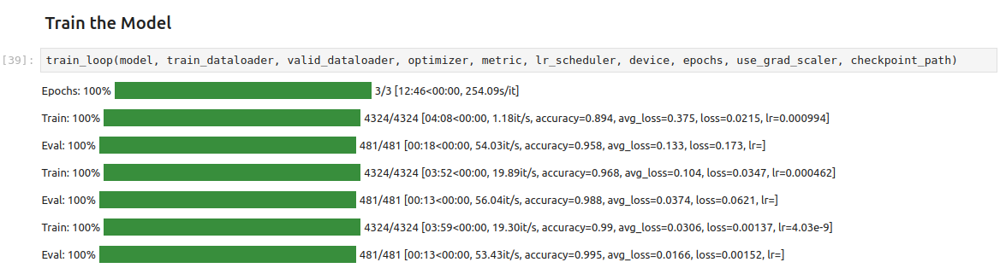

* [Introduction](#introduction)
* [Enable Resizable BAR in BIOS](#enable-resizable-bar-in-bios)
* [Install Ubuntu](#install-ubuntu)
* [Verify Resizable BAR](#verify-resizable-bar)
* [Install Drivers](#install-drivers)  
* [Set Up a Python Environment](#set-up-a-python-environment)  
* [Modify PyTorch Code](#modify-pytorch-code)  
* [Local LLM Inference with `IPEX-LLM`](#local-llm-inference-with-ipex-llm)  
* [Conclusion](#conclusion)


## Introduction

In this tutorial, I'll guide you through setting up Intel's [PyTorch extension](https://github.com/intel/intel-extension-for-pytorch) on [Ubuntu](https://ubuntu.com/download/desktop) to train models with their [Arc GPUs](https://www.intel.com/content/www/us/en/products/docs/discrete-gpus/arc/desktop/a-series/overview.html). The extension provides Intel's latest feature optimizations and hardware support before they get added to PyTorch. Most importantly for our case, it includes support for Intel's Arc GPUs and optimizations to take advantage of their Xe Matrix Extensions (XMX). 


The XMX engines are dedicated hardware for performing matrix operations like those in deep-learning workloads. Intel's PyTorch extension allows us to leverage this hardware with minimal changes to existing PyTorch code.


To illustrate this, we will walk through two use cases. First, we'll adapt the training code from my beginner-level PyTorch tutorial, where we fine-tune an image classification model from the [timm library](https://github.com/huggingface/pytorch-image-models) for hand gesture recognition. Second, we will use the [`ipex-llm`](https://github.com/intel-analytics/ipex-llm) library, which builds on Intel's PyTorch extension, to perform inference with the [LLaMA 3.1 8B Instruct](https://huggingface.co/meta-llama/Meta-Llama-3.1-8B-Instruct) model.


::: {.callout-note}

The current setup process is for version [`2.3.110+xpu`](https://intel.github.io/intel-extension-for-pytorch/xpu/2.3.110+xpu/) of Intel's PyTorch extension.

:::


::: {.callout-tip title="WSL"}

The following setup process also works for WSL (Windows Subsystem for Linux). If you are working in WSL, skip to the following section after enabling Resizable BAR:

- [Install Drivers](#install-drivers)

Follow the steps in the linked section below to deactivate the Integrated Graphics. This step is required to use the extension on Windows.

- [Getting Started with Intel’s PyTorch Extension for Arc GPUs on Windows - Disable Integrated Graphics](/posts/intel-pytorch-extension-tutorial/native-windows/#disable-integrated-graphics)

:::


## Enable Resizable BAR in BIOS

If you have an Arc GPU, one of the first things you should do is enable Resizable BAR. Resizable BAR allows a computer's processor to access the graphics card's entire memory instead of in small chunks. The Arc GPUs currently require this feature to perform as intended. You can enable the feature in your motherboard's BIOS.

Here are links on how to do this for some of the popular motherboard manufacturers:

- [ASRock](https://www.asrock.com/support/faq.asp?id=498)
- [Asus](https://www.asus.com/support/FAQ/1046107/)
- [EVGA](https://www.evga.com/support/faq/FAQdetails.aspx?faqid=59772)
- [Gigabyte](https://www.gigabyte.com/WebPage/785/NVIDIA_resizable_bar.html)
- [MSI](https://www.msi.com/blog/unlock-system-performance-to-extreme-resizable-bar)


## Install Ubuntu

Intel's [documentation](https://dgpu-docs.intel.com/driver/client/overview.html#client-install-options) recommends Ubuntu 22.04 LTS or newer. I verified the following steps in both Ubuntu 22.04 and 24.04. If you already have Ubuntu 22.04 LTS or newer installed, ensure it's fully updated.

- [Download Ubuntu Desktop Download Page](https://ubuntu.com/download/desktop)

The Ubuntu website provides [a step-by-step guide](https://ubuntu.com/tutorials/install-ubuntu-desktop#1-overview) to installing Ubuntu on your PC, and you can install it alongside an existing operating system.

- **Tutorial:** [Install Ubuntu with a Bootable USB Stick](https://ubuntu.com/tutorials/install-ubuntu-desktop#1-overview)

That tutorial calls for at least 25GB of free storage space, but I recommend at least 80 GB for our case.


## Verify Resizable BAR

Once you log into Ubuntu, you can verify Resizable BAR is active by opening a terminal (`Ctrl+Alt+T`) and running the following command:

```bash
lspci -v |grep -A8 VGA
```


Here is the output for the Arc A770 16GB card:


```text
$ lspci -v |grep -A8 VGA
00:02.0 VGA compatible controller: Intel Corporation RocketLake-S GT1 [UHD Graphics 750] (rev 04) (prog-if 00 [VGA controller])
	Subsystem: ASRock Incorporation RocketLake-S GT1 [UHD Graphics 750]
	Flags: bus master, fast devsel, latency 0, IRQ 172
	Memory at 6401000000 (64-bit, non-prefetchable) [size=16M]
	Memory at 4000000000 (64-bit, prefetchable) [size=256M]
	I/O ports at 3000 [size=64]
	Expansion ROM at 000c0000 [virtual] [disabled] [size=128K]
	Capabilities: <access denied>
	Kernel driver in use: i915
--
03:00.0 VGA compatible controller: Intel Corporation DG2 [Arc A770] (rev 08) (prog-if 00 [VGA controller])
	Subsystem: Intel Corporation DG2 [Arc A770]
	Flags: bus master, fast devsel, latency 0, IRQ 173
	Memory at a1000000 (64-bit, non-prefetchable) [size=16M]
	Memory at 6000000000 (64-bit, prefetchable) [size=16G]
	Expansion ROM at a2000000 [disabled] [size=2M]
	Capabilities: <access denied>
	Kernel driver in use: i915
	Kernel modules: i915
```

---

Note that the `[size=16G]` matches the total memory for the GPU. If you have the A750 8GB variant, it should read `[size=8G]` for your GPU.


## Install Drivers

Next, we will install the compute, media, and display runtimes.

### Add Intel Graphics drivers Repository
Run the following bash commands to add the Intel Graphics drivers repository:

```bash
wget -qO - https://repositories.intel.com/gpu/intel-graphics.key | \
sudo gpg --yes --dearmor --output /usr/share/keyrings/intel-graphics.gpg
echo "deb [arch=amd64 signed-by=/usr/share/keyrings/intel-graphics.gpg] https://repositories.intel.com/gpu/ubuntu jammy/lts/2350 unified" | \
sudo tee /etc/apt/sources.list.d/intel-gpu-jammy.list
sudo apt update
```

The above bash commands perform the following steps:

1. Download the Intel graphics repository's public key.
3. Convert the downloaded key to binary and save it.
4. Add the Intel graphics repository to the APT's list of package sources.
5. Update the package list from all configured repositories, including the newly added Intel repository.


### Install packages
Now we can install the required packages.

```bash
sudo apt install -y \
    intel-opencl-icd intel-level-zero-gpu level-zero \
    intel-media-va-driver-non-free libmfx1 libmfxgen1 libvpl2 \
    libegl-mesa0 libegl1-mesa libegl1-mesa-dev libgbm1 libgl1-mesa-dev libgl1-mesa-dri \
    libglapi-mesa libgles2-mesa-dev libglx-mesa0 libigdgmm12 libxatracker2 mesa-va-drivers \
    mesa-vdpau-drivers mesa-vulkan-drivers va-driver-all vainfo hwinfo clinfo
```


## Set Up a Python Environment 

Next, we can create a Python environment to run the training code. We'll install a patched version of PyTorch needed for Intel's extension, the extension itself, and the other dependencies for the training code.

### Install Mamba Package Manager

We'll use the [Mamba](https://mamba.readthedocs.io/en/latest/) package manager to create the Python environment. You can learn more about it in my [getting started](/posts/mamba-getting-started-tutorial-windows/) tutorial.

The following bash commands will download the latest release, install it, and relaunch the current bash shell to apply the relevant changes:

```bash
# Download the latest Miniforge3 installer for the current OS and architecture
wget "https://github.com/conda-forge/miniforge/releases/latest/download/Miniforge3-$(uname)-$(uname -m).sh"

# Run the Miniforge3 installer silently (-b flag for batch mode)
bash Miniforge3-$(uname)-$(uname -m).sh -b

# Initialize mamba for shell usage
~/miniforge3/bin/mamba init

# Restart the shell to apply changes
bash
```


### Create a Python Environment

Next, we'll create a Python environment and activate it. The current version of the extension supports Python 3.11, so we'll use that.

```bash
mamba create --name pytorch-arc python=3.11 -y
mamba activate pytorch-arc
```


### Install PyTorch and Intel’s PyTorch extension

The following command will install the required versions of PyTorch and torchvision, along with the extension itself:

```bash
pip install torch==2.3.1+cxx11.abi torchvision==0.18.1+cxx11.abi torchaudio==2.3.1+cxx11.abi intel-extension-for-pytorch==2.3.110+xpu oneccl_bind_pt==2.3.100+xpu --extra-index-url https://pytorch-extension.intel.com/release-whl/stable/xpu/us/
```


### Install additional dependencies

Lastly, we'll install the other training code dependencies. You can learn about these dependencies ([here](/posts/pytorch-train-image-classifier-timm-hf-tutorial/#installing-additional-libraries)).

```bash
pip install jupyter matplotlib pandas pillow timm torcheval torchtnt tqdm
pip install cjm_pandas_utils cjm_psl_utils cjm_pil_utils cjm_pytorch_utils cjm_torchvision_tfms
```


::: {.callout-important title="oneDNN Memory Layout"}


The previous version of this tutorial set an environment variable for the oneDNN memory layout to improve training speed. The performance improvement from this step is no longer significant and even prevents successful training for other model types.

If you followed the previous version of this tutorial, run the following command to remove the environment variable from the `.bashrc` file and apply the changes to the current shell:

```bash
sed -i '/export IPEX_XPU_ONEDNN_LAYOUT=1/d' ~/.bashrc && source ~/.bashrc
```


:::


## Modify PyTorch Code

It's finally time to train a model. The Jupyter Notebooks with the original and modified training code are available on GitHub at the links below.

- [pytorch-timm-image-classifier-training.ipynb](https://github.com/cj-mills/pytorch-timm-gesture-recognition-tutorial-code/blob/main/notebooks/pytorch-timm-image-classifier-training.ipynb)
- [intel-arc-pytorch-timm-image-classifier-training.ipynb](https://github.com/cj-mills/pytorch-timm-gesture-recognition-tutorial-code/blob/main/notebooks/intel-arc-pytorch-timm-image-classifier-training.ipynb)

You can also download the notebooks to the current directory by running the following commands:

```bash
wget https://raw.githubusercontent.com/cj-mills/pytorch-timm-gesture-recognition-tutorial-code/main/notebooks/pytorch-timm-image-classifier-training.ipynb \
wget https://raw.githubusercontent.com/cj-mills/pytorch-timm-gesture-recognition-tutorial-code/main/notebooks/intel-arc-pytorch-timm-image-classifier-training.ipynb
```


Once downloaded, run the following command to launch the Jupyter Notebook Environment:

```bash
jupyter notebook
```


### Set Environment Variables

First, we need to set the following environment variables:

```python
import os
os.environ['OCL_ICD_VENDORS'] = '/etc/OpenCL/vendors'
os.environ['CCL_ROOT'] = os.environ.get('CONDA_PREFIX', '')
```


### Import PyTorch Extension

Next, we import Intel's PyTorch extension with the following code:

```bash
import torch
import intel_extension_for_pytorch as ipex

print(f'PyTorch Version: {torch.__version__}')
print(f'Intel PyTorch Extension Version: {ipex.__version__}')
```

Note that we need to import PyTorch before the extension. Also, if you get the following user warning, don't worry. It's normal.

```text
PyTorch Version: 2.3.1+cxx11.abi
Intel PyTorch Extension Version: 2.3.110+xpu

/home/innom-dt/mambaforge/envs/pytorch-arc/lib/python3.11/site-packages/intel_extension_for_pytorch/llm/__init__.py:9: UserWarning: failed to use huggingface generation fuctions due to: No module named 'transformers'.
  warnings.warn(f"failed to use huggingface generation fuctions due to: {e}.")
```

---


### Update PyTorch Imports

We don't want to re-import `torch` after the extension, so we'll remove that line from the `Import PyTorch dependencies` section.


::: {.panel-tabset}
## Modified

```python
# Import PyTorch dependencies
import torch.nn as nn
from torch.amp import autocast
from torch.cuda.amp import GradScaler
from torch.utils.data import Dataset, DataLoader
```


## Original

```python
# Import PyTorch dependencies
import torch
import torch.nn as nn
from torch.amp import autocast
from torch.cuda.amp import GradScaler
from torch.utils.data import Dataset, DataLoader
```

:::


### Verify Arc GPU Availability

We can double-check that the extension can use the Arc GPU by getting the properties of the available `xpu` devices.

```python
import pandas as pd

def get_public_properties(obj):
    """
    Extract all public properties from an object.

    Args:
    obj: The object to extract properties from.

    Returns:
    dict: A dictionary containing the object's public properties and their values.
    """
    return {
        prop: getattr(obj, prop)
        for prop in dir(obj)
        if not prop.startswith("__") and not callable(getattr(obj, prop))
    }

# Get the number of available XPU devices
xpu_device_count = torch.xpu.device_count()

# Create a list of dictionaries containing properties for each XPU device
dict_properties_list = [
    get_public_properties(torch.xpu.get_device_properties(i))
    for i in range(xpu_device_count)
]

# Convert the list of dictionaries to a pandas DataFrame for easy viewing
pd.DataFrame(dict_properties_list)
```

<div style="overflow-x:auto;">
<table border="1" class="dataframe">
  <thead>
    <tr style="text-align: right;">
      <th></th>
      <th>driver_version</th>
      <th>gpu_eu_count</th>
      <th>gpu_subslice_count</th>
      <th>has_atomic64</th>
      <th>has_fp16</th>
      <th>has_fp64</th>
      <th>max_compute_units</th>
      <th>max_num_sub_groups</th>
      <th>max_work_group_size</th>
      <th>name</th>
      <th>platform_name</th>
      <th>sub_group_sizes</th>
      <th>total_memory</th>
      <th>type</th>
      <th>vendor</th>
      <th>version</th>
    </tr>
  </thead>
  <tbody>
    <tr>
      <th>0</th>
      <td>1.3.27642</td>
      <td>512</td>
      <td>32</td>
      <td>True</td>
      <td>True</td>
      <td>False</td>
      <td>512</td>
      <td>128</td>
      <td>1024</td>
      <td>Intel(R) Arc(TM) A770 Graphics</td>
      <td>Intel(R) Level-Zero</td>
      <td>[8, 16, 32]</td>
      <td>16225243136</td>
      <td>gpu</td>
      <td>Intel(R) Corporation</td>
      <td>1.3</td>
    </tr>
    <tr>
      <th>1</th>
      <td>1.3.27642</td>
      <td>32</td>
      <td>2</td>
      <td>True</td>
      <td>True</td>
      <td>False</td>
      <td>32</td>
      <td>64</td>
      <td>512</td>
      <td>Intel(R) UHD Graphics 750</td>
      <td>Intel(R) Level-Zero</td>
      <td>[8, 16, 32]</td>
      <td>30791524352</td>
      <td>gpu</td>
      <td>Intel(R) Corporation</td>
      <td>1.3</td>
    </tr>
  </tbody>
</table>
</div>


In this case, the A770 is the default device, and the integrated graphics on the CPU is available as the second device. The `total_memory` value for the integrated graphics is higher because it uses system memory.


### Update the Device Name

Next, we'll manually set the device name to `xpu`.

::: {.panel-tabset}

## Modified

```python
device = 'xpu'
dtype = torch.float32
device, dtype
```


## Original

```python
device = get_torch_device()
dtype = torch.float32
device, dtype
```


::: 


### Optimize the `model` and `optimizer` Objects
Before we run the `train_loop` function, we'll use Intel's PyTorch extension to apply optimizations to the model and optimizer objects. We'll also cast the model to the `bfloat16` data type, so we can train using mixed precision.


::: {.panel-tabset}


## Modified

```python
# Learning rate for the model
lr = 1e-3

# Number of training epochs
epochs = 3

# AdamW optimizer; includes weight decay for regularization
optimizer = torch.optim.AdamW(model.parameters(), lr=lr, eps=1e-5)

# Optimize the model and optimizer objects
model, optimizer = ipex.optimize(model, optimizer=optimizer, dtype=torch.bfloat16)

# Learning rate scheduler; adjusts the learning rate during training
lr_scheduler = torch.optim.lr_scheduler.OneCycleLR(optimizer, 
                                                   max_lr=lr, 
                                                   total_steps=epochs*len(train_dataloader))

# Performance metric: Multiclass Accuracy
metric = MulticlassAccuracy()
```


## Original

```python
# Learning rate for the model
lr = 1e-3

# Number of training epochs
epochs = 3

# AdamW optimizer; includes weight decay for regularization
optimizer = torch.optim.AdamW(model.parameters(), lr=lr, eps=1e-5)

# Learning rate scheduler; adjusts the learning rate during training
lr_scheduler = torch.optim.lr_scheduler.OneCycleLR(optimizer, 
                                                   max_lr=lr, 
                                                   total_steps=epochs*len(train_dataloader))

# Performance metric: Multiclass Accuracy
metric = MulticlassAccuracy()
```


::: 


### Train the Model
That's it for the required changes to the training code. We can now run the `train_loop` function. 


::: {.panel-tabset}


## Current

```text
Epochs: 100% |█████████| 3/3 [18:31<00:00, 369.74s/it]
Train: 100% |█████████| 4324/4324 [05:56<00:00, 12.48it/s, accuracy=0.843, avg_loss=0.542, loss=0.592, lr=0.000994]
Eval: 100% |█████████| 481/481 [00:19<00:00, 43.79it/s, accuracy=0.957, avg_loss=0.147, loss=0.133, lr=]
Train: 100% |█████████| 4324/4324 [05:53<00:00, 12.37it/s, accuracy=0.905, avg_loss=0.309, loss=0.321, lr=0.000462]
Eval: 100% |█████████| 481/481 [00:13<00:00, 44.92it/s, accuracy=0.97, avg_loss=0.092, loss=0.0842, lr=]
Train: 100% |█████████| 4324/4324 [05:54<00:00, 12.62it/s, accuracy=0.953, avg_loss=0.151, loss=0.0595, lr=4.03e-9]
Eval: 100% |█████████| 481/481 [00:13<00:00, 43.28it/s, accuracy=0.988, avg_loss=0.0389, loss=0.0422, lr=]
```


## Previous



:::


In my testing, the training speed is significantly slower with this extension than the one used for the previous version of this tutorial, with the total run taking 18 minutes 31 seconds versus 12 minutes 46 seconds.


### Update the Inference Code
Since we cast the model to `bloat16`, we must ensure input data use the same type. We can update the inference  code using the auto-cast context manager as shown below:

::: {.panel-tabset}

## Modified

```python
# Make a prediction with the model
with torch.no_grad(), autocast(torch.device(device).type):
    pred = model(img_tensor)
```

## Original

```python
# Make a prediction with the model
with torch.no_grad():
    pred = model(img_tensor)
```

:::


## Local LLM Inference with `IPEX-LLM`

To close out this tutorial, we will cover how to perform local LLM inference using Intel's [`ipex-llm`](https://github.com/intel-analytics/ipex-llm) library. This library allows us to run many popular LLMs in INT4 precision on our Arc GPU.


### Install oneAPI Packages
The `ipex-llm` library requires packages from the oneAPI toolkit. Run the following commands to install them:

```bash
# Refresh sudo credentials without running a command
sudo -v

# Download Intel's GPG key, convert it to a format for the package manager, and save it
wget -O- https://apt.repos.intel.com/intel-gpg-keys/GPG-PUB-KEY-INTEL-SW-PRODUCTS.PUB | gpg --dearmor | sudo tee /usr/share/keyrings/oneapi-archive-keyring.gpg > /dev/null

# Add Intel's repository to the system's package sources
echo "deb [signed-by=/usr/share/keyrings/oneapi-archive-keyring.gpg] https://apt.repos.intel.com/oneapi all main" | sudo tee /etc/apt/sources.list.d/oneAPI.list

# Update the package list to include Intel's repository
sudo apt update

# Install specific versions of Intel oneAPI components
sudo apt install intel-oneapi-common-vars=2024.0.0-49406 \
  intel-oneapi-common-oneapi-vars=2024.0.0-49406 \
  intel-oneapi-diagnostics-utility=2024.0.0-49093 \
  intel-oneapi-compiler-dpcpp-cpp=2024.0.2-49895 \
  intel-oneapi-dpcpp-ct=2024.0.0-49381 \
  intel-oneapi-mkl=2024.0.0-49656 \
  intel-oneapi-mkl-devel=2024.0.0-49656 \
  intel-oneapi-mpi=2021.11.0-49493 \
  intel-oneapi-mpi-devel=2021.11.0-49493 \
  intel-oneapi-dal=2024.0.1-25 \
  intel-oneapi-dal-devel=2024.0.1-25 \
  intel-oneapi-ippcp=2021.9.1-5 \
  intel-oneapi-ippcp-devel=2021.9.1-5 \
  intel-oneapi-ipp=2021.10.1-13 \
  intel-oneapi-ipp-devel=2021.10.1-13 \
  intel-oneapi-tlt=2024.0.0-352 \
  intel-oneapi-ccl=2021.11.2-5 \
  intel-oneapi-ccl-devel=2021.11.2-5 \
  intel-oneapi-dnnl-devel=2024.0.0-49521 \
  intel-oneapi-dnnl=2024.0.0-49521 \
  intel-oneapi-tcm-1.0=1.0.0-435
```


#### Set the oneAPI Environment Variables

You will need to run the following command to activate the oneAPI environment variables after starting a new shell:

```bash
# Set up the oneAPI environment variables for the current shell session
source /opt/intel/oneapi/setvars.sh
```

Alternatively, you can run the following command to add it to the `.bashrc` file:

```bash
echo 'source /opt/intel/oneapi/setvars.sh > /dev/null 2>&1' >> ~/.bashrc
```


### Create a New Python Environment
Each library version depends on specific versions of Intel's PyTorch extension. The most recent release of `ipex-llm` still depends on version `2.1.10+xpu` of the extension.

We can create a dedicated mamba environment for this library to avoid dependency conflicts:

```bash
mamba create --name ipex-llm-env python=3.11 -y
mamba activate ipex-llm-env
```


### Install PIP Packages
We will use the LLaMA 3.1 8B Instruct model for demonstration purposes, which requires [`transformers`](https://github.com/huggingface/transformers) `4.43.1` or newer. We also need the [`trl`](https://huggingface.co/docs/trl/en/index) (Transformer Reinforcement Learning) package.

```bash
# Installs intel_extension_for_pytorch==2.1.10+xpu as default
pip install --pre --upgrade ipex-llm[xpu] --extra-index-url https://pytorch-extension.intel.com/release-whl/stable/xpu/us/
pip install jupyter transformers==4.43.1 trl
```


We can launch a new Jupyter Notebook environment once the dependencies finish installing.

```bash
jupyter notebook
```


### Set Environment Variables
With our environment set up, we can dive into the code. First, we need to set the following environment variables:

```python
import os
os.environ['OCL_ICD_VENDORS'] = '/etc/OpenCL/vendors'
os.environ['CCL_ROOT'] = os.environ.get('CONDA_PREFIX', '')
os.environ['USE_XETLA'] = 'OFF'
os.environ['SYCL_CACHE_PERSISTENT'] = '1'
os.environ['SYCL_PI_LEVEL_ZERO_USE_IMMEDIATE_COMMANDLISTS'] = '1'
```


### Import the Required Dependencies
Next, we will import the necessary Python packages into our Jupyter Notebook.

```python
import torch
import time
import argparse

from ipex_llm.transformers import AutoModelForCausalLM
from transformers import AutoTokenizer

from IPython.display import Markdown
```

We can use the `Markdown` class from IPython to render Markdown output from the model inside the notebook.


### Define a Function to Prepare the Prompt
We can use the following function from this [example script](https://github.com/intel-analytics/ipex-llm/blob/main/python/llm/example/GPU/HuggingFace/LLM/llama3.1/generate.py) to prepare prompts for the LLama 3.1 model:

```python
def get_prompt(user_input: str, chat_history: list[tuple[str, str]], system_prompt: str) -> str:
    """
    Generate a formatted prompt for a LLaMA 3.1 chatbot conversation.

    This function takes the user's input, chat history, and system prompt,
    and combines them into a single formatted string for use in a LLaMA 3.1 chatbot system.

    Parameters:
    user_input (str): The current input from the user.
    chat_history (list[tuple[str, str]]): A list of tuples containing previous 
                                          (user_input, assistant_response) pairs.
    system_prompt (str): Initial instructions or context for the LLaMA 3.1 chatbot.

    Returns:
    str: A formatted string containing the entire conversation history and current input.
    """
    
    # Start the prompt with a special token
    prompt_texts = ['<|begin_of_text|>']

    # Add system prompt if it's not empty
    if system_prompt != '':
        prompt_texts.append(f'<|start_header_id|>system<|end_header_id|>\n\n{system_prompt}<|eot_id|>')

    # Add each pair of user input and assistant response from the chat history
    for history_input, history_response in chat_history:
        prompt_texts.append(f'<|start_header_id|>user<|end_header_id|>\n\n{history_input.strip()}<|eot_id|>')
        prompt_texts.append(f'<|start_header_id|>assistant<|end_header_id|>\n\n{history_response.strip()}<|eot_id|>')

    # Add the current user input and prepare for assistant's response
    prompt_texts.append(f'<|start_header_id|>user<|end_header_id|>\n\n{user_input.strip()}<|eot_id|><|start_header_id|>assistant<|end_header_id|>\n\n')
    
    # Join all parts of the prompt into a single string
    return ''.join(prompt_texts)
```


### Load the Model in INT4

Next, we can load the LLaMA 3.1 8B Instruct model in 4-bit precision. 

::: {.callout-important}

You will need to accept Meta's license agreement through the model's HuggingFace Hub page to access the model:

* [meta-llama/Meta-Llama-3.1-8B-Instruct](https://huggingface.co/meta-llama/Meta-Llama-3.1-8B-Instruct)

:::


```python
model_path = "meta-llama/Meta-Llama-3.1-8B-Instruct"

# Load model in 4 bit, which converts the relevant layers in the model into INT4 format
model = AutoModelForCausalLM.from_pretrained(model_path,
                                             load_in_4bit=True,
                                             optimize_model=True,
                                             trust_remote_code=True,
                                             use_cache=True)
model = model.half().to('xpu')

# Load tokenizer
tokenizer = AutoTokenizer.from_pretrained(model_path, trust_remote_code=True)
```


### Define Inference Parameters
Before running the model, we must define our prompts and the maximum number of tokens the model should generate.

```python
DEFAULT_SYSTEM_PROMPT = """\
"""

prompt_str = "Provide a clear, concise, and intuitive description of AI for beginners."
max_new_tokens = 512
```


### Perform Inference
Finally, we can run the model.

```python
# Disable gradient computation for inference
with torch.inference_mode():
    # Generate the input prompt using a custom function
    prompt = get_prompt(prompt_str, [], system_prompt=DEFAULT_SYSTEM_PROMPT)
    
    # Encode the prompt into token IDs and move to the XPU (Intel's GPU)
    input_ids = tokenizer.encode(prompt, return_tensors="pt").to('xpu')
    
    # Perform a warmup run to optimize the model
    # This run's output is discarded
    output = model.generate(input_ids, max_new_tokens=max_new_tokens)

    # Start the actual inference
    st = time.time()  # Record the start time
    
    # Generate the output using the language model
    output = model.generate(input_ids, max_new_tokens=max_new_tokens)
    
    # Ensure all XPU operations are completed before recording end time
    torch.xpu.synchronize()
    
    end = time.time()  # Record the end time
    
    # Move the output back to CPU for further processing
    output = output.cpu()
    
    # Decode the output tokens into a human-readable string
    # skip_special_tokens=False means we keep all special tokens in the output
    output_str = tokenizer.decode(output[0], skip_special_tokens=False)
    
    # Print the inference time
    print(f'Inference time: {end-st:.2f} seconds')
    
    # Print the original prompt
    print('-'*20, 'Prompt', '-'*20)
    print(prompt)

# Print the model's response
print('-'*20, 'Response (skip_special_tokens=False)', '-'*20)

# Extract the actual response from the output string
# This assumes the response is between the last '<|end_header_id|>\n\n' and '<|eot_id|>'
response = output_str.split('<|end_header_id|>\n\n')[-1].split('<|eot_id|>')[0]

# Display the response using Markdown formatting
Markdown(response)
```

```text
Inference time: 51.17 seconds
-------------------- Prompt --------------------
<|begin_of_text|><|start_header_id|>user<|end_header_id|>

Provide a clear, concise, and intuitive description of AI for beginners.<|eot_id|><|start_header_id|>assistant<|end_header_id|>


-------------------- Response (skip_special_tokens=False) --------------------
```

::: {.callout-note title="Model Response:"}

Here's a clear, concise, and intuitive description of AI for beginners:

**What is AI?**

Artificial Intelligence (AI) is a type of computer technology that  allows machines to think and learn like humans. It's a way to create  intelligent systems that can perform tasks that typically require human  intelligence, such as:

- Recognizing images and objects
- Understanding natural language
- Making decisions
- Solving problems
- Learning from data

**How does AI work?**

AI uses a combination of algorithms, data, and computer power to mimic human thought processes. Here's a simplified overview:

1. **Data collection**: Large amounts of data are gathered from various sources, such as images, text, or sensor readings.
2. **Pattern recognition**: AI algorithms analyze the data to identify patterns, relationships, and trends.
3. **Machine learning**: The AI system uses this analysis to make predictions, classify data, or make decisions.
4. **Improvement**: The AI system learns from its experiences and adjusts its performance over time.

**Types of AI**

There are several types of AI, including:

- **Narrow or Weak AI**: Designed to perform a specific task, like facial recognition or language translation.
- **Strong or General AI**: A hypothetical AI that can perform any intellectual task that humans can.
- **Superintelligence**: A hypothetical AI that surpasses human intelligence in all domains.

**Key benefits of AI**

AI has many benefits, including:

- **Improved efficiency**: AI can automate repetitive tasks, freeing up human time for more complex and creative work.
- **Enhanced decision-making**: AI can analyze vast amounts of data to make informed decisions.
- **Personalization**: AI can tailor experiences to individual preferences and needs.

**Key concepts**

Some key concepts to keep in mind:

- **Machine learning**: A type of AI that improves over time based on data experience.
- **Deep learning**: A type of machine learning that uses neural networks to analyze complex data.
- **Natural language processing**: A type of AI that enables computers to understand and generate human-like language.

That's a basic introduction to AI for beginners! I hope this helps  you understand the basics of this exciting and rapidly evolving field.

:::


## Conclusion

In this tutorial, we set up Intel's PyTorch extension on Ubuntu to train an image classification model and run a local Large Language Model using an Arc GPU. The exact setup steps may change with new versions, so check the [documentation](https://intel.github.io/intel-extension-for-pytorch/index.html#installation?platform=gpu&version=v2.3.110%2bxpu&os=linux%2fwsl2&package=pip) for the latest version to see if there are any changes. I'll try to keep this tutorial updated with any significant changes to the process.






