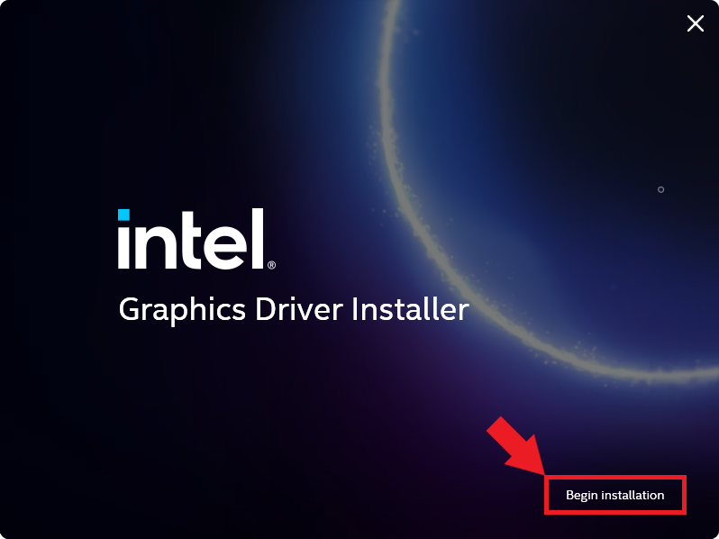
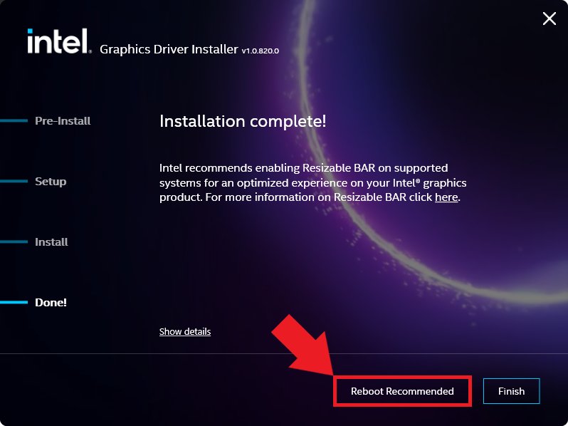
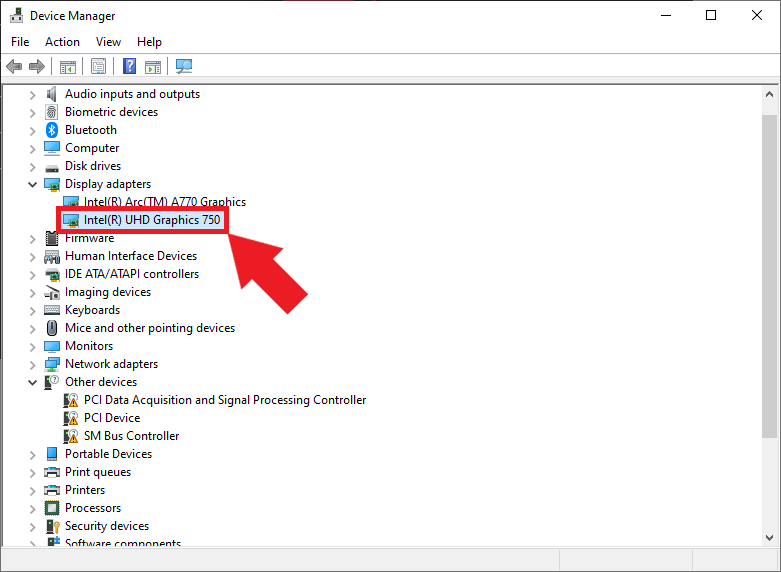
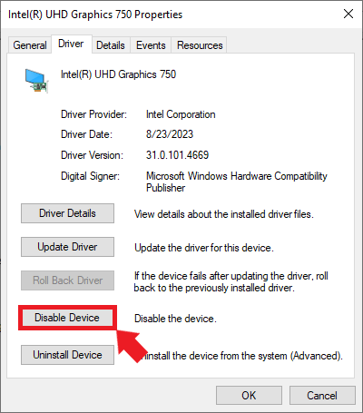
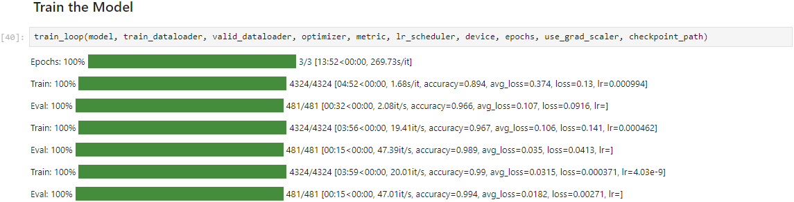

* [Introduction](#introduction)
* [Enable Resizable BAR in BIOS](#enable-resizable-bar-in-bios)
* [Install Drivers](#install-drivers)
* [Install Visual Studio](#install-visual-studio)
* [Install oneAPI Base Toolkit](#install-oneapi-base-toolkit)
* [Disable Integrated Graphics](#disable-integrated-graphics)
* [Set Up a Python Environment](#set-up-a-python-environment )
* [Modify PyTorch Code](#modify-pytorch-code)
* [Conclusion](#conclusion)


## Introduction

In this tutorial, I'll guide you through setting up Intel's [PyTorch extension](https://github.com/intel/intel-extension-for-pytorch) on [Windows](https://www.microsoft.com/en-us/windows) to train models with their [Arc GPUs](https://www.intel.com/content/www/us/en/products/docs/discrete-gpus/arc/desktop/a-series/overview.html). The extension provides Intel's latest feature optimizations and hardware support before they get added to PyTorch. Most importantly for our case, it now includes `experimental` support for Intel's Arc GPUs and optimizations to take advantage of their Xe Matrix Extensions (XMX). 


The XMX engines are dedicated hardware for performing matrix operations like those in deep-learning workloads. Intel's PyTorch extension allows us to leverage this hardware with minimal changes to existing PyTorch code.


To illustrate this, we'll adapt the training code from my [beginner-level PyTorch tutorial](https://christianjmills.com/posts/pytorch-train-image-classifier-timm-hf-tutorial/), where we fine-tune an image classification model from the [timm library](https://github.com/huggingface/pytorch-image-models) for hand gesture recognition. By the end of this tutorial, you'll know all steps required to set up Windows for training PyTorch models using Arc GPUs.


::: {.callout-note}

The current setup process is for version [`2.0.110+xpu`](https://intel.github.io/intel-extension-for-pytorch/xpu/2.0.110+xpu/) of Intel's PyTorch extension.

:::


## Enable Resizable BAR in BIOS

If you have an Arc GPU, one of the first things you should do is enable Resizable BAR. Resizable BAR allows a computer's processor to access the graphics card's entire memory instead of in small chunks. The Arc GPUs currently require this feature to perform as intended. You can enable the feature in your motherboard's BIOS.

Here are links on how to do this for some of the popular motherboard manufacturers:

- [ASRock](https://www.asrock.com/support/faq.asp?id=498)
- [Asus](https://www.asus.com/support/FAQ/1046107/)
- [EVGA](https://www.evga.com/support/faq/FAQdetails.aspx?faqid=59772)
- [Gigabyte](https://www.gigabyte.com/WebPage/785/NVIDIA_resizable_bar.html)
- [MSI](https://www.msi.com/blog/unlock-system-performance-to-extreme-resizable-bar)


With Resizable BAR enabled, let's ensure we have the latest drivers for our Arc GPU.


## Install Drivers

We can download the latest Arc GPU drivers from Intel's website at the link below:

- [Intel® Arc™ & Iris® Xe Graphics - Windows](https://www.intel.com/content/www/us/en/download/785597/intel-arc-iris-xe-graphics-windows.html?)


The latest driver version available was `31.0.101.4676` at the time of writing. Click the `Download` button under `Available Downloads` to download the installer.

{fig-align="center"}


Once downloaded, double-click the installer executable and follow the prompts to install the drivers.


{fig-align="center"}


You don't need to agree to join the Intel Computing Improvement program to install the drivers.

{fig-align="center"}


Once the installation completes, click the `Reboot Recommended` button to reboot the computer.

{fig-align="center"}


We can continue with the next step once we're back in Windows.


## Install Visual Studio

The [oneAPI Base Toolkit](https://www.intel.com/content/www/us/en/developer/tools/oneapi/base-toolkit.html#gs.ztyvfm), which Intel's extension depends on, requires [Visual Studio](https://visualstudio.microsoft.com/#vs-section) with the `Desktop development with C++` workload for some of its packages to function. We can download the installer for the free `Community` version of Visual Studio at the link below:

* [Visual Studio 2022 Downloads](https://visualstudio.microsoft.com/downloads/)


::: {.callout-tip collapse="true"}

## Installing the extension via compiling from source
There is a compatibility issue with the latest version of oneAPI (2023.2) and the latest version of Visual Studio 2022 that causes the compilation process for the extension to fail. You can download a version of Visual Studio 2019 from the link below if you want to compile the extension from its source code.


* [Visual Studio 2019 Download](https://visualstudio.microsoft.com/thank-you-downloading-visual-studio/?sku=Community&rel=16)

:::


{fig-align="center"}


Once downloaded, double-click the installer executable and click `Continue` in the popup window.


{fig-align="center"}


Select the `Desktop development with C++` workload under `Desktop & Mobile` and click `Install` in the bottom-right corner.


{fig-align="center"}


Once the installation finishes, Visual Studio will launch and prompt you to sign in. We can either skip that step or exit Visual Studio completely.

{fig-align="center"}


Next, Visual Studio will prompt us to personalize the theme and development settings. We don't need to use Visual Studio directly, so we stick with the defaults and exit the application once finished.

{fig-align="center"}


## Install oneAPI Base Toolkit

With the prerequisites satisfied, we can install the oneAPI Base Toolkit. The required packages in the toolkit will take up approximately 13GB of disk space.


### Download the oneAPI Toolkit Installer

We'll install the toolkit using the offline Windows installer available at the link below:


* [oneAPI Base Toolkit 2023.2 Windows Offline Installer](https://www.intel.com/content/www/us/en/developer/tools/oneapi/base-toolkit-download.html?operatingsystem=window&distributions=offline&version=2023.2.0)


The download page has a form to register with an email address. We can skip this by clicking the `Continue without signing up` text below the `Sign Up & Download` button.

{fig-align="center"}


Once downloaded, double-click the installer executable and click the `Extract` button in the popup window.


{fig-align="center"}


Once extracted, click the `Continue` button in the installer window.


{fig-align="center"}


Tick the checkbox on the next page to accept the license agreement and select the `Custom Installation` option. We can save a decent amount of space by only installing the necessary components.


{fig-align="center"}


For Intel's PyTorch extension to function, we need the following components:

- [Intel DPC++ Compatibility Tool](https://www.intel.com/content/www/us/en/developer/tools/oneapi/dpc-compatibility-tool.html#gs.4m6nmn)
- [Intel oneAPI DPC++ Library](https://www.intel.com/content/www/us/en/developer/tools/oneapi/dpc-library.html#gs.4m6ndt)
- [Intel oneAPI DPC++/C++ Compiler](https://www.intel.com/content/www/us/en/developer/tools/oneapi/dpc-compiler.html#gs.4m6nc1)
- [Intel oneAPI Math Kernel Library](https://www.intel.com/content/www/us/en/developer/tools/oneapi/onemkl.html#gs.4m6n49)
- [Intel Distribution for GDB](https://www.intel.com/content/www/us/en/developer/tools/oneapi/distribution-for-gdb.html#gs.4m6muy)
- [Intel oneAPI Threading Building Blocks](https://www.intel.com/content/www/us/en/developer/tools/oneapi/onetbb.html#gs.4m6q0f)


{fig-align="center"}


The next page allows us to integrate the oneAPI toolkit with installations of Visual Studio. We don't need to make any changes here.


{fig-align="center"}


As with the Intel Computing Improvement program for the Graphics drivers, we don't need to consent to the Intel Software Improvement program to use the toolkit. Go ahead and click the Install button to start the installation.


{fig-align="center"}


The installation process will likely take several minutes.


{fig-align="center"}


Click the Finish button in the popup window once the toolkit successfully installs and exit the installer window.


{fig-align="center"}


## Disable Integrated Graphics

I encountered the following error when I first attempted to use Intel's PyTorch extension on Windows:

```text
RuntimeError: Native API failed. Native API returns: -997 (Command failed to enqueue/execute) -997 (Command failed to enqueue/execute)
```

I could only resolve the issue by deactivating the iGPU in the Windows Device Manager. Future versions of the extension will likely eliminate this bug, but I'll include the steps to turn off the iGPUs for now.


Type Device Manager into the Windows search bar and click Open.


{fig-align="center"}


You will see the following popup message if you are not using an Administrator account. Click `OK` to continue.


{fig-align="center"}


In the Device Manager window, open the `Display adapters` dropdown. There should be at least two options: the Arc GPU and the iGPU included with the CPU. Double-click the iGPU listing to open its properties window.


{fig-align="center"}


Non-Administrator users must click the `Change settings` button to enable changes to the iGPU device properties.

{fig-align="center"}


Next, select the `Driver` tab and click the `Disable Device` button.

{fig-align="center"}


Click `Yes` in the popup window to confirm the changes.


{fig-align="center"}


::: {.callout-note}

You will need to repeat this step when you install new graphics drivers in the future, assuming future releases of Intel's extension do not resolve the issue.

:::


## Set Up a Python Environment 

Now, we can create a Python environment to run the training code. We'll install a patched version of PyTorch needed for Intel's extension, the extension itself, and the other dependencies for the training code.


### Install Mamba Package Manager

We'll use the [Mamba](https://mamba.readthedocs.io/en/latest/) package manager to create the Python environment. I have a dedicated tutorial for setting up Mamba on Windows:

- [**Setting Up a Local Python Environment with Mamba for Machine Learning Projects on Windows**](https://christianjmills.com/posts/mamba-getting-started-tutorial-windows/)


Open a command prompt window with the mamba environment active and navigate to a folder to store the training notebooks. For convenience, here is the command to activate the mamba environment from any command prompt window:

```bash
%USERPROFILE%\mambaforge\Scripts\activate
```


### Create a Python Environment

Next, we'll create a Python environment and activate it. The current version of the extension supports Python 3.11, so we'll use that.

```bash
mamba create --name pytorch-arc python=3.11 -y
mamba activate pytorch-arc
```


### Activate the oneAPI Environment
Run the following command to activate the oneAPI environment for this command prompt session:

```bash
call "C:\Program Files (x86)\Intel\oneAPI\setvars.bat"
```

We must reactivate the oneAPI environment whenever we open a new command prompt. It does not carry over from one terminal window to another.


### Install Training Code Dependencies

After that, we'll install the training code dependencies. You can learn about these dependencies ([here](https://christianjmills.com/posts/pytorch-train-image-classifier-timm-hf-tutorial/#installing-additional-libraries)).

```bash
pip install jupyter matplotlib pandas pillow timm torcheval torchtnt tqdm
pip install cjm_pandas_utils cjm_psl_utils cjm_pil_utils cjm_pytorch_utils
```


### Install Prerequisite Packages
The package for Intel's PyTorch extension requires a couple of conda packages:

- [pkg-config](https://anaconda.org/conda-forge/pkg-config/)
- [libuv](https://anaconda.org/conda-forge/libuv)

```bash
mamba install pkg-config libuv -y
```


### Install PyTorch and Intel’s PyTorch extension

The following command will install the patched version of PyTorch and the extension itself:


```bash
python -m pip install -U torch==2.0.0a0 intel_extension_for_pytorch==2.0.110+gitba7f6c1 -f https://developer.intel.com/ipex-whl-stable-xpu
```


Intel does not currently have a pre-compiled version of TorchVision available for Windows. We can compile a patched version of TorchVision from the source code using the instructions below:

::: {.callout-tip collapse="true"}
## Installing From Source Code

### Install Additional Dependencies for TorchVision
```bash
mamba install libpng -y
```
### Download the Compilation Batch File
```bash
curl -o compile_bundle.bat https://raw.githubusercontent.com/intel/intel-extension-for-pytorch/release/xpu/2.0.110/scripts/compile_bundle.bat
```

### Run the Batch File
```bash
compile_bundle.bat "C:\Program Files (x86)\Intel\oneAPI\compiler\latest" "C:\Program Files (x86)\Intel\oneAPI\mkl\2023.2.0"
```
:::


However, I did not notice any differences in performance between the standard version of TorchVision and the version I compiled from the source code The only thing of note is that pip complained when installing the patched version of PyTorch with the standard torchvision package. 

Compiling PyTorch, TorchVision, and Intel's Extension can take a long time. Therefore, I would stick with the standard version of TorchVision and ignore the warning from pip.


### Set oneDNN Memory Layout
We can improve training speed by setting an environment variable for the oneDNN memory layout. The following commands will add the appropriate value for the current command line session and save it for future sessions.


```bash
set IPEX_XPU_ONEDNN_LAYOUT=1
setx IPEX_XPU_ONEDNN_LAYOUT 1
```


## Modify PyTorch Code

It's finally time to train a model. The Jupyter Notebooks with the original and modified training code are available on GitHub at the links below.

- [pytorch-timm-image-classifier-training-windows-without-hf-datasets.ipynb](https://github.com/cj-mills/pytorch-timm-gesture-recognition-tutorial-code/blob/main/notebooks/pytorch-timm-image-classifier-training-windows-without-hf-datasets.ipynb)
- [intel-arc-pytorch-timm-image-classifier-training-windows-without-hf-datasets.ipynb](https://github.com/cj-mills/pytorch-timm-gesture-recognition-tutorial-code/blob/main/notebooks/intel-arc-pytorch-timm-image-classifier-training-windows-without-hf-datasets.ipynb)
- [windows_utils_without_hf.py](https://github.com/cj-mills/pytorch-timm-gesture-recognition-tutorial-code/blob/main/notebooks/windows_utils_without_hf.py)

You can also download the notebooks to the current directory by running the following commands:

```bash
curl -o pytorch-timm-image-classifier-training-windows-without-hf-datasets.ipynb https://raw.githubusercontent.com/cj-mills/pytorch-timm-gesture-recognition-tutorial-code/main/notebooks/pytorch-timm-image-classifier-training.ipynb
```

```bash
curl -o intel-arc-pytorch-timm-image-classifier-training-windows-without-hf-datasets.ipynb https://raw.githubusercontent.com/cj-mills/pytorch-timm-gesture-recognition-tutorial-code/main/notebooks/intel-arc-pytorch-timm-image-classifier-training-windows.ipynb
```

```bash
curl -o windows_utils_without_hf.py https://github.com/cj-mills/pytorch-timm-gesture-recognition-tutorial-code/blob/main/notebooks/windows_utils_without_hf.py
```


Once downloaded, run the following command to launch the Jupyter Notebook Environment:

```bash
jupyter notebook
```


### Import PyTorch Extension
We import Intel's PyTorch extension with the following code:

```bash
import torch
import intel_extension_for_pytorch as ipex

print(f'PyTorch Version: {torch.__version__}')
print(f'Intel PyTorch Extension Version: {ipex.__version__}')
```


### Update PyTorch Imports

We don't want to re-import `torch` after the extension, so we'll remove that line from the `Import PyTorch dependencies` section.


::: {.panel-tabset}
## Modified

```python
# Import PyTorch dependencies
import torch.nn as nn
from torch.amp import autocast
from torch.cuda.amp import GradScaler
from torchvision import transforms
import torchvision.transforms.functional as TF
from torch.utils.data import Dataset, DataLoader
from torchtnt.utils import get_module_summary
from torcheval.metrics import MulticlassAccuracy
```


## Original

```python
# Import PyTorch dependencies
import torch
import torch.nn as nn
from torch.amp import autocast
from torch.cuda.amp import GradScaler
from torchvision import transforms
import torchvision.transforms.functional as TF
from torch.utils.data import Dataset, DataLoader
from torcheval.tools import get_module_summary
from torcheval.metrics import MulticlassAccuracy
```

:::


### Verify Arc GPU Availability

We can double-check that the extension can use the Arc GPU by getting the properties of the available `xpu` devices.

```python
def get_public_properties(obj):
    return {
        prop: getattr(obj, prop)
        for prop in dir(obj)
        if not prop.startswith("__") and not callable(getattr(obj, prop))
    }

xpu_device_count = torch.xpu.device_count()
dict_properties_list = [get_public_properties(torch.xpu.get_device_properties(i)) for i in range(xpu_device_count)]
pd.DataFrame(dict_properties_list)
```

<div style="overflow-x:auto;">
<table border="1" class="dataframe">
  <thead>
    <tr style="text-align: right;">
      <th></th>
      <th>dev_type</th>
      <th>gpu_eu_count</th>
      <th>max_compute_units</th>
      <th>max_num_sub_groups</th>
      <th>max_work_group_size</th>
      <th>name</th>
      <th>platform_name</th>
      <th>sub_group_sizes</th>
      <th>support_fp64</th>
      <th>total_memory</th>
    </tr>
  </thead>
  <tbody>
    <tr>
      <th>0</th>
      <td>gpu</td>
      <td>512</td>
      <td>512</td>
      <td>128</td>
      <td>1024</td>
      <td>Intel(R) Arc(TM) A770 Graphics</td>
      <td>Intel(R) Level-Zero</td>
      <td>[8, 16, 32]</td>
      <td>False</td>
      <td>16704737280</td>
    </tr>
  </tbody>
</table>
</div>


In this case, the A770 is the only device listed since we deactivated the integrated graphics on the CPU.


### Update the Device Name

Next, we'll manually set the device name to `xpu`.

::: {.panel-tabset}

## Modified

```python
device = 'xpu'
dtype = torch.float32
device, dtype
```


## Original

```python
device = get_torch_device()
dtype = torch.float32
device, dtype
```


::: 


### Optimize the `model` and `optimizer` Objects
Before we run the `train_loop` function, we'll use Intel's PyTorch extension to apply optimizations to the model and optimizer objects. We'll also cast the model to the `bfloat16` data type, so we can train using mixed precision. Intel's PyTorch extension only supports the `bloat16` data type for mixed-precision training currently.


::: {.panel-tabset}


## Modified

```python
# Learning rate for the model
lr = 1e-3

# Number of training epochs
epochs = 3

# AdamW optimizer; includes weight decay for regularization
optimizer = torch.optim.AdamW(model.parameters(), lr=lr, eps=1e-5)

# Optimize the model and optimizer objects
model, optimizer = ipex.optimize(model, optimizer=optimizer, dtype=torch.bfloat16)

# Learning rate scheduler; adjusts the learning rate during training
lr_scheduler = torch.optim.lr_scheduler.OneCycleLR(optimizer, 
                                                   max_lr=lr, 
                                                   total_steps=epochs*len(train_dataloader))

# Performance metric: Multiclass Accuracy
metric = MulticlassAccuracy()

# Check for CUDA-capable GPU availability
use_grad_scaler = torch.cuda.is_available()
```


## Original

```python
# Learning rate for the model
lr = 1e-3

# Number of training epochs
epochs = 3

# AdamW optimizer; includes weight decay for regularization
optimizer = torch.optim.AdamW(model.parameters(), lr=lr, eps=1e-5)

# Learning rate scheduler; adjusts the learning rate during training
lr_scheduler = torch.optim.lr_scheduler.OneCycleLR(optimizer, 
                                                   max_lr=lr, 
                                                   total_steps=epochs*len(train_dataloader))

# Performance metric: Multiclass Accuracy
metric = MulticlassAccuracy()

# Check for CUDA-capable GPU availability
use_grad_scaler = torch.cuda.is_available()
```


::: 


### Train the Model
That's it for the required changes to the training code. We can now run the `train_loop` function. With the A770 and the dataset on an SSD, training takes between twelve and twelve and a half minutes to complete.

{fig-align="center"}


### Update the Inference Code
Since we cast the model to `bloat16`, we must ensure input data use the same type. We can update the inference  code using the auto-cast context manager as shown below:

::: {.panel-tabset}

## Modified

```python
# Make a prediction with the model
with torch.no_grad():
    with torch.xpu.amp.autocast(enabled=True, dtype=torch.bfloat16, cache_enabled=False):
        pred = model(img_tensor)
```

## Original

```python
# Make a prediction with the model
with torch.no_grad():
    pred = model(img_tensor)
```

:::


## Conclusion

In this tutorial, we set up Intel's PyTorch extension for the Windows OS and trained an image classification model using an Arc GPU. The exact setup steps may change with new versions, so check the [documentation](https://intel.github.io/intel-extension-for-pytorch/xpu/latest/tutorials/installation.html) for the latest version to see if there are any changes. I'll try to keep this tutorial updated with any significant changes to the process.


