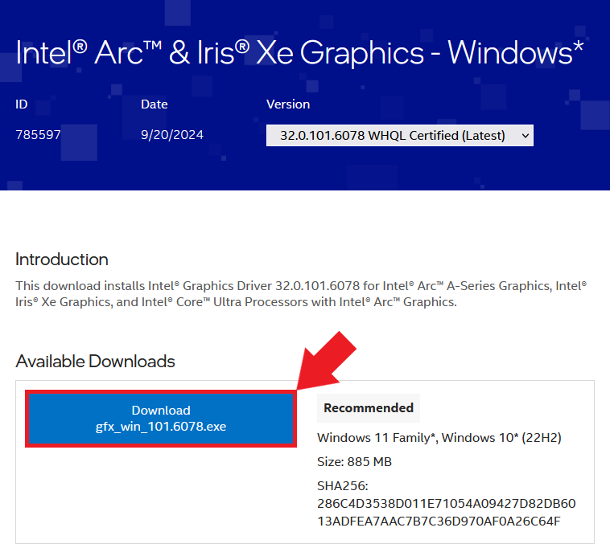
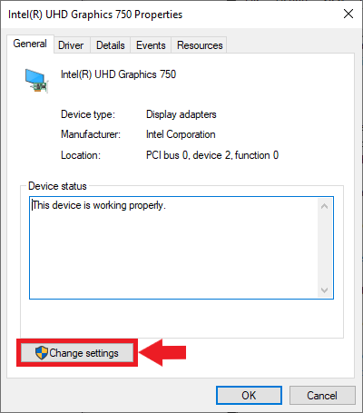

* [Introduction](#introduction)
* [Enable Resizable BAR in BIOS](#enable-resizable-bar-in-bios)
* [Install Drivers](#install-drivers)
* [Install Microsoft Visual C++ Redistributable](#install-microsoft-visual-c-redistributable)
* [Disable Integrated Graphics](#disable-integrated-graphics)
* [Set Up a Python Environment](#set-up-a-python-environment)  
* [Modify PyTorch Code](#modify-pytorch-code)  
* [Conclusion](#conclusion)


## Introduction

In this tutorial, I'll guide you through setting up Intel's [PyTorch extension](https://github.com/intel/intel-extension-for-pytorch) on [Windows](https://www.microsoft.com/en-us/windows) to train models with their [Arc GPUs](https://www.intel.com/content/www/us/en/products/docs/discrete-gpus/arc/desktop/a-series/overview.html). The extension provides Intel's latest feature optimizations and hardware support before they get added to PyTorch. Most importantly for our case, it includes support for Intel's Arc GPUs and optimizations to take advantage of their Xe Matrix Extensions (XMX). 


The XMX engines are dedicated hardware for performing matrix operations like those in deep-learning workloads. Intel's PyTorch extension allows us to leverage this hardware with minimal changes to existing PyTorch code.


To illustrate this, we'll adapt the training code from my [beginner-level PyTorch tutorial](https://christianjmills.com/posts/pytorch-train-image-classifier-timm-hf-tutorial/), where we fine-tune an image classification model from the [timm library](https://github.com/huggingface/pytorch-image-models) for hand gesture recognition. By the end of this tutorial, you'll know all steps required to set up Windows for training PyTorch models using Arc GPUs.


::: {.callout-note}

The current setup process is for version [`2.3.110+xpu`](https://intel.github.io/intel-extension-for-pytorch/xpu/2.3.110+xpu/) of Intel's PyTorch extension.

:::


::: {.callout-tip title="WSL"}

To use the extension in WSL (Windows Subsystem for Linux), follow the Ubuntu version of this tutorial starting from the section linked below after enabling Resizable BAR:

- [Getting Started with Intel’s PyTorch Extension for Arc GPUs on Ubuntu - Install Drivers](/posts/intel-pytorch-extension-tutorial/native-ubuntu/#install-drivers)

Follow the steps in the linked section below to deactivate the Integrated Graphics. This step is still required to use the extension in WSL.

- [Disable Integrated Graphics](#disable-integrated-graphics)

:::


## Enable Resizable BAR in BIOS

If you have an Arc GPU, one of the first things you should do is enable Resizable BAR. Resizable BAR allows a computer's processor to access the graphics card's entire memory instead of in small chunks. The Arc GPUs currently require this feature to perform as intended. You can enable the feature in your motherboard's BIOS.

Here are links on how to do this for some of the popular motherboard manufacturers:

- [ASRock](https://www.asrock.com/support/faq.asp?id=498)
- [Asus](https://www.asus.com/support/FAQ/1046107/)
- [EVGA](https://www.evga.com/support/faq/FAQdetails.aspx?faqid=59772)
- [Gigabyte](https://www.gigabyte.com/WebPage/785/NVIDIA_resizable_bar.html)
- [MSI](https://www.msi.com/blog/unlock-system-performance-to-extreme-resizable-bar)


With Resizable BAR enabled, let's ensure we have the latest drivers for our Arc GPU.


## Install Drivers

We can download the latest Arc GPU drivers from Intel's website at the link below:

- [Intel® Arc™ & Iris® Xe Graphics - Windows](https://www.intel.com/content/www/us/en/download/785597/intel-arc-iris-xe-graphics-windows.html?)


The latest driver version available was `32.0.101.6078` at the time of writing. Click the `Download` button under `Available Downloads` to download the installer.

{fig-align="center"}


Once downloaded, double-click the installer executable and follow the prompts to install the drivers.


{fig-align="center"}


You don't need to agree to join the Intel Computing Improvement program to install the drivers.

{fig-align="center"}


Once the installation completes, click the `Reboot Recommended` button to reboot the computer.

{fig-align="center"}


We can continue with the next step once we're back in Windows.


## Install Microsoft Visual C++ Redistributable

Intel's documentation also lists the Microsoft Visual C++ Redistributable as a dependency for this extension version, so make sure to install it as well. You can download the latest version at the link below:

* [Latest Microsoft Visual C++ Redistributable Version](https://learn.microsoft.com/en-us/cpp/windows/latest-supported-vc-redist?view=msvc-170#latest-microsoft-visual-c-redistributable-version)


## Disable Integrated Graphics

I encountered the following error when I attempted to use this version of Intel's PyTorch extension on Windows:

```text
RuntimeError: Can't add devices across platforms to a single context. -33 (PI_ERROR_INVALID_DEVICE)
```


I could only resolve the issue by deactivating the iGPU in the Windows Device Manager. Future versions of the extension may eliminate this bug, but I'll include the steps to turn off the iGPU for now.


Type Device Manager into the Windows search bar and click Open.


{fig-align="center"}


You will see the following popup message if you are not using an Administrator account. Click `OK` to continue.


{fig-align="center"}


In the Device Manager window, open the `Display adapters` dropdown. There should be at least two options: the Arc GPU and the iGPU included with the CPU. Double-click the iGPU listing to open its properties window.


{fig-align="center"}


Non-Administrator users must click the `Change settings` button to enable changes to the iGPU device properties.

{fig-align="center"}


Next, select the `Driver` tab and click the `Disable Device` button.

{fig-align="center"}


Click `Yes` in the popup window to confirm the changes.


{fig-align="center"}


::: {.callout-note}

You will need to repeat this step when you install new graphics drivers in the future, assuming future releases of Intel's extension do not resolve the issue.

:::


## Set Up a Python Environment 

Now, we can create a Python environment to run the training code. We'll install a patched version of PyTorch needed for Intel's extension, the extension itself, and the other dependencies for the training code.


### Install Mamba Package Manager

We'll use the [Mamba](https://mamba.readthedocs.io/en/latest/) package manager to create the Python environment. I have a dedicated tutorial for setting up Mamba on Windows:

- [**Setting Up a Local Python Environment with Mamba for Machine Learning Projects on Windows**](/posts/mamba-getting-started-tutorial-windows/)


Open a command prompt window with the mamba environment active and navigate to a folder to store the training notebooks. For convenience, here is the command to activate the mamba environment from any command prompt window:

```cmd
%USERPROFILE%\mambaforge\Scripts\activate
```


### Create a Python Environment

Next, we'll create a Python environment and activate it. The current version of the extension supports Python 3.11, so we'll use that.

```cmd
mamba create --name pytorch-arc python=3.11 -y
mamba activate pytorch-arc
```


### Install Prerequisite Packages
The package for Intel's PyTorch extension requires the [libuv](https://anaconda.org/conda-forge/libuv) conda package:

```cmd
mamba install libuv -y
```


### Install PyTorch and Intel’s PyTorch extension

The following command will install the patched version of PyTorch and the extension itself:


```cmd
pip install torch==2.3.1+cxx11.abi torchvision==0.18.1+cxx11.abi torchaudio==2.3.1+cxx11.abi intel-extension-for-pytorch==2.3.110+xpu --extra-index-url https://pytorch-extension.intel.com/release-whl/stable/xpu/us/
```


### Install Training Code Dependencies

After that, we'll install the training code dependencies. You can learn about these dependencies ([here](/posts/pytorch-train-image-classifier-timm-hf-tutorial/#installing-additional-libraries)).

```cmd
pip install jupyter matplotlib pandas pillow timm torcheval torchtnt tqdm
pip install cjm_pandas_utils cjm_psl_utils cjm_pil_utils cjm_pytorch_utils cjm_torchvision_tfms
```


::: {.callout-important title="oneDNN Memory Layout"}


The previous version of this tutorial set an environment variable for the oneDNN memory layout to improve training speed. The performance improvement from this step is no longer significant and even prevents successful training for other model types.

If you followed the previous version of this tutorial, run the following commands to deactivate this environment variable:

```cmd
set IPEX_XPU_ONEDNN_LAYOUT=0
setx IPEX_XPU_ONEDNN_LAYOUT 0
```


:::


## Modify PyTorch Code

It's finally time to train a model. The Jupyter Notebooks with the original and modified training code are available on GitHub at the links below.

- [notebooks/pytorch-timm-image-classifier-training-windows.ipynb](https://github.com/cj-mills/pytorch-timm-gesture-recognition-tutorial-code/blob/main/notebooks/pytorch-timm-image-classifier-training-windows.ipynb)
- [notebooks/intel-arc-pytorch-timm-image-classifier-training-windows.ipynb](https://github.com/cj-mills/pytorch-timm-gesture-recognition-tutorial-code/blob/main/notebooks/intel-arc-pytorch-timm-image-classifier-training-windows.ipynb)
- [notebooks/windows_utils.py](https://github.com/cj-mills/pytorch-timm-gesture-recognition-tutorial-code/blob/main/notebooks/windows_utils.py)

You can also download the notebooks to the current directory by running the following commands:

```cmd
curl -o pytorch-timm-image-classifier-training-windows.ipynb https://github.com/cj-mills/pytorch-timm-gesture-recognition-tutorial-code/blob/main/notebooks/pytorch-timm-image-classifier-training-windows.ipynb
```

```cmd
curl -o intel-arc-pytorch-timm-image-classifier-training-windows-without-hf-datasets.ipynb https://raw.githubusercontent.com/cj-mills/pytorch-timm-gesture-recognition-tutorial-code/main/notebooks/intel-arc-pytorch-timm-image-classifier-training-windows.ipynb
```

```cmd
curl -o windows_utils.py https://github.com/cj-mills/pytorch-timm-gesture-recognition-tutorial-code/blob/main/notebooks/windows_utils.py
```


Once downloaded, run the following command to launch the Jupyter Notebook Environment:

```cmd
jupyter notebook
```


### Import PyTorch Extension
We import Intel's PyTorch extension with the following code:

```cmd
import torch
import intel_extension_for_pytorch as ipex

print(f'PyTorch Version: {torch.__version__}')
print(f'Intel PyTorch Extension Version: {ipex.__version__}')
```

```text
C:\Users\Personal\mambaforge\envs\pytorch-arc\Lib\site-packages\torchvision\io\image.py:13: UserWarning: Failed to load image Python extension: 'Could not find module 'C:\Users\Personal\mambaforge\envs\pytorch-arc\Lib\site-packages\torchvision\image.pyd' (or one of its dependencies). Try using the full path with constructor syntax.'If you don't plan on using image functionality from `torchvision.io`, you can ignore this warning. Otherwise, there might be something wrong with your environment. Did you have `libjpeg` or `libpng` installed before building `torchvision` from source?
  warn(

PyTorch Version: 2.3.1+cxx11.abi
Intel PyTorch Extension Version: 2.3.110+xpu

C:\Users\Personal\mambaforge\envs\pytorch-arc\Lib\site-packages\intel_extension_for_pytorch\llm\__init__.py:9: UserWarning: failed to use huggingface generation fuctions due to: No module named 'transformers'.
  warnings.warn(f"failed to use huggingface generation fuctions due to: {e}.")
```


### Update PyTorch Imports

We don't want to re-import `torch` after the extension, so we'll remove that line from the `Import PyTorch dependencies` section.


::: {.panel-tabset}
## Modified

```python
# Import PyTorch dependencies
import torch.nn as nn
from torch.amp import autocast
from torch.cuda.amp import GradScaler
from torch.utils.data import Dataset, DataLoader
```


## Original

```python
# Import PyTorch dependencies
import torch
import torch.nn as nn
from torch.amp import autocast
from torch.cuda.amp import GradScaler
from torch.utils.data import Dataset, DataLoader
```

:::


### Verify Arc GPU Availability

We can double-check that the extension can use the Arc GPU by getting the properties of the available `xpu` devices.

```python
import pandas as pd

def get_public_properties(obj):
    """
    Extract all public properties from an object.

    Args:
    obj: The object to extract properties from.

    Returns:
    dict: A dictionary containing the object's public properties and their values.
    """
    return {
        prop: getattr(obj, prop)
        for prop in dir(obj)
        if not prop.startswith("__") and not callable(getattr(obj, prop))
    }

# Get the number of available XPU devices
xpu_device_count = torch.xpu.device_count()

# Create a list of dictionaries containing properties for each XPU device
dict_properties_list = [
    get_public_properties(torch.xpu.get_device_properties(i))
    for i in range(xpu_device_count)
]

# Convert the list of dictionaries to a pandas DataFrame for easy viewing
pd.DataFrame(dict_properties_list)
```

<div style="overflow-x:auto;">
<table border="1" class="dataframe">
  <thead>
    <tr style="text-align: right;">
      <th></th>
      <th>driver_version</th>
      <th>gpu_eu_count</th>
      <th>gpu_subslice_count</th>
      <th>has_atomic64</th>
      <th>has_fp16</th>
      <th>has_fp64</th>
      <th>max_compute_units</th>
      <th>max_num_sub_groups</th>
      <th>max_work_group_size</th>
      <th>name</th>
      <th>platform_name</th>
      <th>sub_group_sizes</th>
      <th>total_memory</th>
      <th>type</th>
      <th>vendor</th>
      <th>version</th>
    </tr>
  </thead>
  <tbody>
    <tr>
      <th>0</th>
      <td>1.3.30714</td>
      <td>512</td>
      <td>64</td>
      <td>True</td>
      <td>True</td>
      <td>False</td>
      <td>512</td>
      <td>128</td>
      <td>1024</td>
      <td>Intel(R) Arc(TM) A770 Graphics</td>
      <td>Intel(R) Level-Zero</td>
      <td>[8, 16, 32]</td>
      <td>16704737280</td>
      <td>gpu</td>
      <td>Intel(R) Corporation</td>
      <td>1.5</td>
    </tr>
  </tbody>
</table>
</div>


In this case, the A770 is the only device listed since we deactivated the integrated graphics on the CPU.


### Update the Device Name

Next, we'll manually set the device name to `xpu`.

::: {.panel-tabset}

## Modified

```python
device = 'xpu'
dtype = torch.float32
device, dtype
```


## Original

```python
device = get_torch_device()
dtype = torch.float32
device, dtype
```


::: 


### Optimize the `model` and `optimizer` Objects
Before we run the `train_loop` function, we'll use Intel's PyTorch extension to apply optimizations to the model and optimizer objects. We'll also cast the model to the `bfloat16` data type, so we can train using mixed precision.


::: {.panel-tabset}


## Modified

```python
# Learning rate for the model
lr = 1e-3

# Number of training epochs
epochs = 3

# AdamW optimizer; includes weight decay for regularization
optimizer = torch.optim.AdamW(model.parameters(), lr=lr, eps=1e-5)

# Optimize the model and optimizer objects
model, optimizer = ipex.optimize(model, optimizer=optimizer, dtype=torch.bfloat16)

# Learning rate scheduler; adjusts the learning rate during training
lr_scheduler = torch.optim.lr_scheduler.OneCycleLR(optimizer, 
                                                   max_lr=lr, 
                                                   total_steps=epochs*len(train_dataloader))

# Performance metric: Multiclass Accuracy
metric = MulticlassAccuracy()
```


## Original

```python
# Learning rate for the model
lr = 1e-3

# Number of training epochs
epochs = 3

# AdamW optimizer; includes weight decay for regularization
optimizer = torch.optim.AdamW(model.parameters(), lr=lr, eps=1e-5)

# Learning rate scheduler; adjusts the learning rate during training
lr_scheduler = torch.optim.lr_scheduler.OneCycleLR(optimizer, 
                                                   max_lr=lr, 
                                                   total_steps=epochs*len(train_dataloader))

# Performance metric: Multiclass Accuracy
metric = MulticlassAccuracy()
```


::: 


### Train the Model
That's it for the required changes to the training code. We can now run the `train_loop` function.


::: {.panel-tabset}


## Current

```text
Epochs: 100% |█████████| 3/3 [24:21<00:00, 478.44s/it]
Train: 100% |█████████| 4324/4324 [07:56<00:00, 10.52it/s, accuracy=0.844, avg_loss=0.535, loss=0.572, lr=0.000994]
Eval: 100% |█████████| 481/481 [00:49<00:00, 28.10it/s, accuracy=0.95, avg_loss=0.162, loss=0.0692, lr=]
Train: 100% |█████████| 4324/4324 [07:41<00:00, 10.73it/s, accuracy=0.914, avg_loss=0.281, loss=0.412, lr=0.000462]
Eval: 100% |█████████| 481/481 [00:23<00:00, 28.84it/s, accuracy=0.979, avg_loss=0.0653, loss=0.0793, lr=]
Train: 100% |█████████| 4324/4324 [07:09<00:00, 11.16it/s, accuracy=0.96, avg_loss=0.124, loss=0.0497, lr=4.03e-9]
Eval: 100% |█████████| 481/481 [00:21<00:00, 29.63it/s, accuracy=0.99, avg_loss=0.0314, loss=0.0783, lr=]
```


## Previous

{fig-align="center"}


:::


The training speed is significantly slower with this extension version. Although, it seems to improve with each iteration through the dataset.


### Update the Inference Code
Since we cast the model to `bloat16`, we must ensure input data use the same type. We can update the inference  code using the auto-cast context manager as shown below:

::: {.panel-tabset}

## Modified

```python
# Make a prediction with the model
with torch.no_grad(), autocast(torch.device(device).type):
    pred = model(img_tensor)
```

## Original

```python
# Make a prediction with the model
with torch.no_grad():
    pred = model(img_tensor)
```

:::


## Conclusion

In this tutorial, we set up Intel's PyTorch extension for the Windows OS and trained an image classification model using an Arc GPU. The exact setup steps may change with new versions, so check the [documentation](https://intel.github.io/intel-extension-for-pytorch/index.html#installation?platform=gpu&version=v2.3.110%2bxpu&os=windows&package=pip) for the latest version to see if there are any changes. I'll try to keep this tutorial updated with any significant changes to the process.






