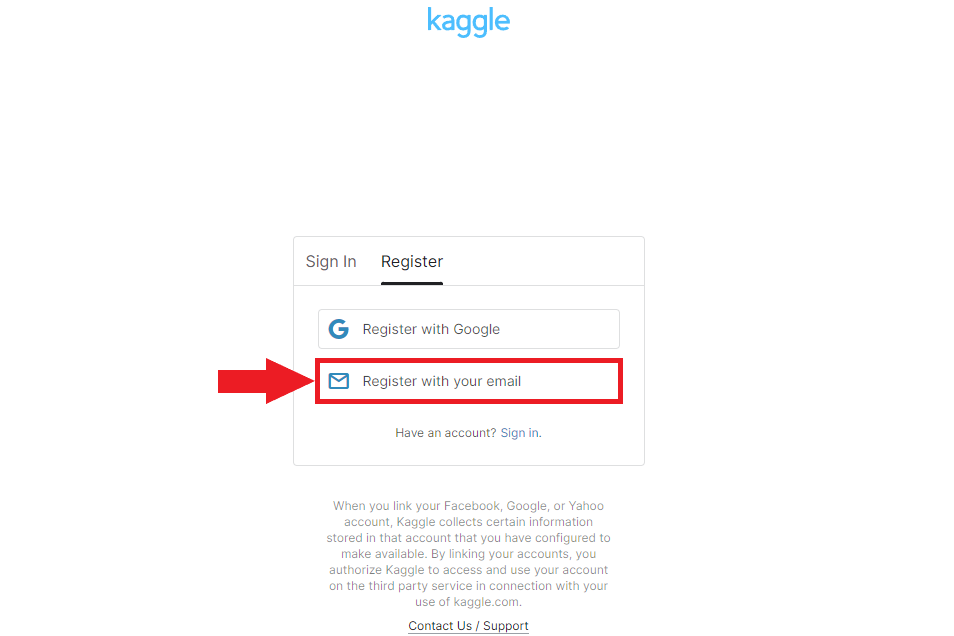
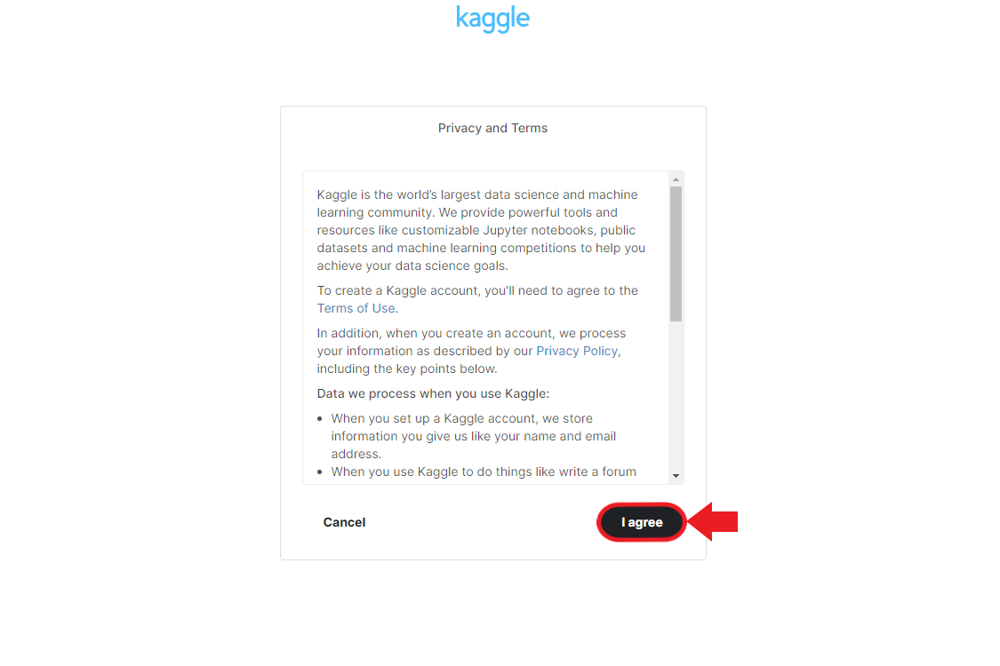
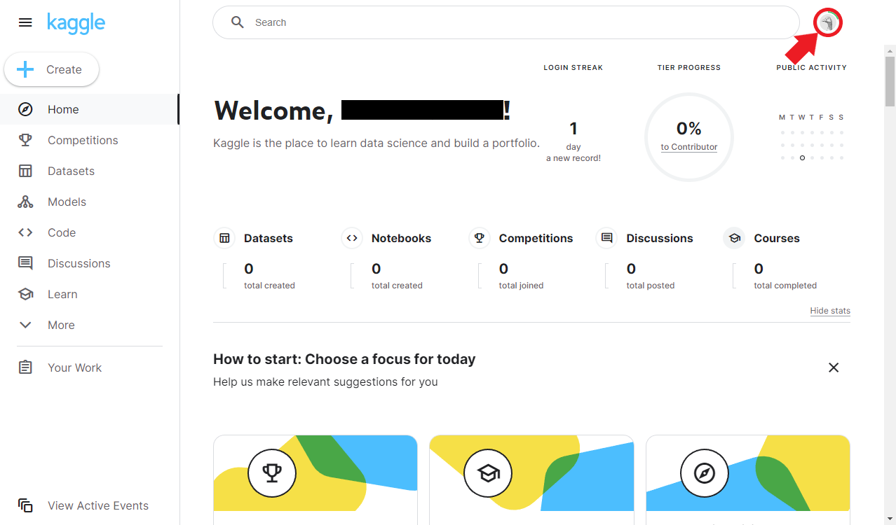

* [Introduction](#introduction)
* [Create a Kaggle Account](#create-a-kaggle-account)
* [Sign in to Kaggle](#sign-in-to-kaggle)
* [Access your Kaggle Account Settings](#access-your-kaggle-account-settings)
* [Generate Your Kaggle API Key](#generate-your-kaggle-api-key)
* [Store the Kaggle API Key](#store-the-kaggle-api-key)
* [Conclusion](#conclusion)


## Introduction

In this tutorial, I will guide you step-by-step to obtain a Kaggle API key, which you will need to access and download datasets from Kaggle using their API. This tutorial is suitable for beginners, even those who do not have a Kaggle account yet.


## Create a Kaggle Account

1. Visit Kaggle's website at [https://www.kaggle.com/](https://www.kaggle.com/)

   {fig-align="center"}<br>

2. Click on the `Register` button at the top-right corner of the page.

   {fig-align="center"}<br>

3. Select the `Register with your email` option. Alternatively, you can sign up using Google, Facebook, or Yahoo accounts.

   {fig-align="center"}<br>

4. Fill in the required information, including your name, email, and password, then click `Next`.

   {fig-align="center"}<br>

5. Click `I agree` to accept the Privacy and Terms agreement.

   {fig-align="center"}<br>

6. Kaggle will email a six-digit code to verify your email address. Enter the code in the prompt and click `Next` to complete your account registration.

   {fig-align="center"}<br>


## Sign in to Kaggle

1. If you aren't already signed in, click the `Sign In` button at the top-right corner of the Kaggle homepage.

   {fig-align="center"}<br>

2. Select the `Sign in with your email` option. Alternatively, you can sign in using Google, Facebook, or Yahoo accounts.

   {fig-align="center"}<br>

3. Enter your email/username and password, then click `Sign In`.

   {fig-align="center"}<br>


## Access your Kaggle Account Settings

1. Click on your profile picture at the top-right corner of the page. 

   {fig-align="center"}<br>

2. In the popout menu, click the `Settings` option.

   {fig-align="center"}<br>


## Generate Your Kaggle API Key

1. Scroll to the `API` section in your Account settings and click the `Create New API Token` button.

   {fig-align="center"}<br>

2. Kaggle will generate a JSON file named `kaggle.json` and prompt you to save the file to your computer.

   {fig-align="center"}<br>

3. Download the `kaggle.json` file and save it to a secure location on your computer. This file contains your Kaggle API key and username.


## Store the Kaggle API Key

Keep the `kaggle.json` file safe and secure, as it contains sensitive information. Remember to set the permissions for the `kaggle.json` file to be readable and writable only by you. Never share this file with anyone or upload it to public repositories. 


If you plan to use the Kaggle API on your local machine, ensure the `kaggle.json` file is in the following location:

* Windows: 

  ```bash
  C:\Users\<username>\.kaggle\kaggle.json
  ```

* Linux: 

  ```bash
  ~/.kaggle/kaggle.json
  ```

* macOS: 

  ```bash
  /Users/<username>/.kaggle/kaggle.json
  ```


## Conclusion

You have successfully obtained your Kaggle API key. You can now use it to download datasets from Kaggle using their API.





