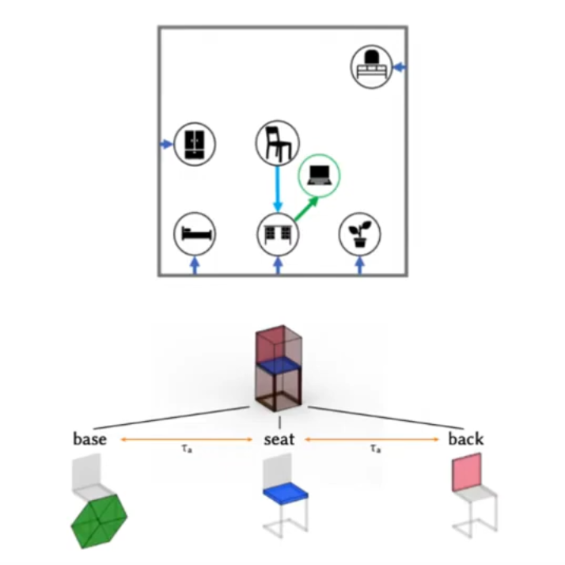
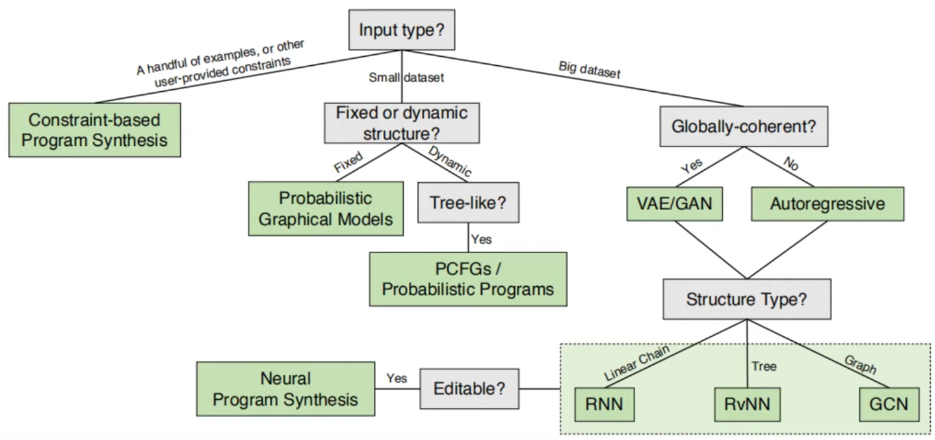

---
categories:
- ai
- notes
date: 2021-12-9
description: "In this presentation, Tao Wu provides a comprehensive overview of generative models for 3D structures, exploring various 3D representations, generative methodologies, and applications."
hide: false
search_exclude: false
title: "Notes on Learning Generative Models of 3D Structures"

aliases:
- /Notes-on-Learning-Generative-Models-of-3D-Structures/

twitter-card:
  creator: "@cdotjdotmills"
  site: "@cdotjdotmills"
  image: /images/default-preview-image-black.png
open-graph:
  image: /images/default-preview-image-black.png

---

* [Introduction](#introduction)
* [Structure-Aware Representation](#structure-aware-representation)  
* [Methodologies for Learning Generative Models](#methodologies-for-learning-generative-models)  
* [Application: Visual Program Induction](#application-visual-program-induction)

::: {.callout-tip title="Presentation Materials"}

* [CSC2547 Learning Generative Models of 3D Structures](https://www.youtube.com/watch?v=dDTU43UpCe0)
* [Learning Generative Models of 3D Structures (2020)](https://par.nsf.gov/servlets/purl/10155956) (PDF)

:::

## Introduction

- **Presenter:** Tao Wu
- **Topic:** Generative Modeling for 3D Contents
- **Source:** 2020 survey titled "Learning Generative Models of 3D Structures"
- **Focus:** Concepts in 3D representations and generative networks.
- **Importance of 3D Graphics:**
  - Critical to industries like gaming, animation, architecture, and interior design.
- **Problem:** Lack of training data due to high costs of data capturing and human labeling.
- **Solution:** Generative models can help address this data scarcity.
- **Generative vs. Discriminative Models:**
  - $$
    P(X) \ vs \ discriminative: P(Y|X)
    $$
  - **Generative models** learn the probability distribution over an input space (x). They can sample objects directly from x.
  - **Discriminative models** learn to predict an attribute (y) given an input (x).
- **Benefits of Generative Models:**
  - Simulating real-world environments.
  - Synthetically generating training data.
- **Target Audience:** New graduate students in computer science.
- **Survey Scope:** 
  - Large range of historical work.
  - Recent progress on generative 3D modeling.

## Structure-Aware Representation

- **Focus:** Learned generative models of **structured 3D content**.
- **Learned Model:** Trained with data instead of manual creation or rule-based systems.
- **Structured 3D Shapes and Scenes:** Collections of substructures, which can be further decomposed.
  {fig-align="center"}
  - **Example:** 
    - An indoor scene (room) consists of a chair, desk, and bed.
    - A chair can be decomposed into a base, seat, and back.
- **Structure-Aware:** Expressing 3D entities while allowing manipulation of their high-level structure.
- **Two Aspects of Structure-Aware Representation:**
  - Geometry of atomic elements.
  - Structural patterns.

### Representations of Low-Level Geometry

- **Point Clouds:** (Covered in previous lectures)
- **Triangle Mesh:** (Covered in previous lectures)
- **Implicit Surface:** A function determining whether a point is inside or outside a surface.

### Representations of 3D Structures

- **Segmented Geometry:** Linking a label to each part of the entity's geometry.
- **Partsets:** An ordered set of atoms.
- **Relationship Graphs:** Edges connect different parts.
- **Hierarchies (Trees):** Representing parent-child relationships between parts.
- **Hierarchical Graphs:** Combining relationship graphs and hierarchies.
- **Deterministic Program:** 
  - Most general way to represent 3D structures.
  - Can output any of the previous representations.
  - Beneficial for making patterns clear and allowing easy editing.

## Methodologies for Learning Generative Models

### Synthesis Methods Flowchart

{fig-align="center"}

- **Constraint-Based Program Synthesizer:** Best for few training examples. Finds the minimum cost program satisfying certain constraints.
- **Classic Probabilistic Models:** Suitable for larger datasets (but not large enough for deep learning).
  - **Probabilistic Graphical Models (e.g., Bayesian network, Markov random field):** Best for content with a fixed structure.
  - **Probabilistic Context-Free Grammar (PCFG):**  Better for varying structures.
    - **Context-Free Grammar (CFG):** Used in Natural Language Processing (NLP).
      - Consists of a start symbol, a set of terminals, a set of non-terminals, and rules mapping non-terminals to another layout.
      - **Example:** 
        - Non-terminal: F
        - Terminals: Left arrow, Right arrow, Leaf node
        - Derived tree (sentence) contains only terminals.
    - **PCFG:**  Augments CFG with probabilities for each rule.
      - Probability of a derived tree is the product of applied rule probabilities.
    - **Suitability:** Well-suited for dynamic model structures due to dynamic recursive nature.
- **Deep Neural Networks (DNNs):** Often the best choice when a large amount of training data is available.
  - **Autoregressive Model:** Iteratively consumes its output from one iteration as input to the next.
    {fig-align="center"}
    - **Example:**  Inserting one object at a time to generate an indoor scene.
    - **Weakness:** Prone to drift; errors in one step can cause subsequent outputs to diverge.
  - **Variational Autoencoders (VAEs) and Generative Adversarial Networks (GANs):** 
    - Popular in recent years.
    - Sample over a low-dimensional latent space.
    - Learn a generator that maps latent vectors to 3D shapes.
    - Use a global latent variable to control generation.
    - Trained with a reconstruction loss between input and generated output.
    - **Advantages:** Often outperform autoregressive models in global coherence.
  - **Network Suitability:** Different neural networks perform better with specific structured data representations.

## Application: Visual Program Induction

- **Definition:** Synthesizing a plausible program that creates 3D content.
- **Process:** Recovering the generator program from existing 3D shapes.
- **Early Examples:**  Reconstructing 3D shapes via simple geometric primitives.
  - **Example (2017 work):** Decomposing shapes into primitives and using chamfer distance as a loss function.
    - https://github.com/shubhtuls/volumetricPrimitives
    - [Learning Shape Abstractions](https://shubhtuls.github.io/volumetricPrimitives/)
    - [Learning Shape Abstractions by Assembling Volumetric Primitives](https://arxiv.org/abs/1612.00404)
- **More Recent Work:**
  {fig-align="center"}
  - Outputting 3D shape programs with loops and high-level structures.
  - Executing the program to reconstruct shapes.
  - https://github.com/HobbitLong/shape2prog
  - [Learning to Infer and Execute 3D Shape Programs](https://arxiv.org/abs/1901.02875)
- **Visual Program Induction from 2D Images:**
  - Inferring programs that generate 2D diagrams from hand-drawn sketches.
  - Using inferred programs for downstream tasks like image editing.
  - https://github.com/paschalidoud/superquadric_parsing
- **Benefits:** Efficient and flexible scene manipulation.


