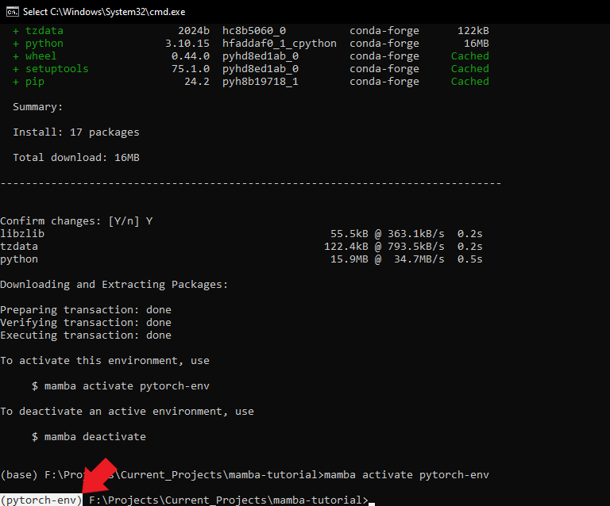
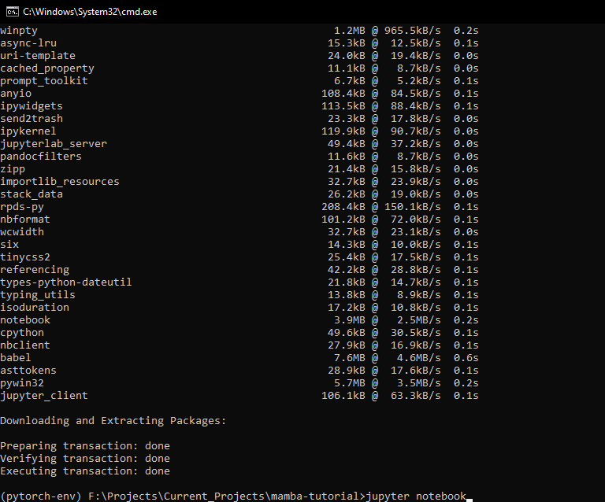
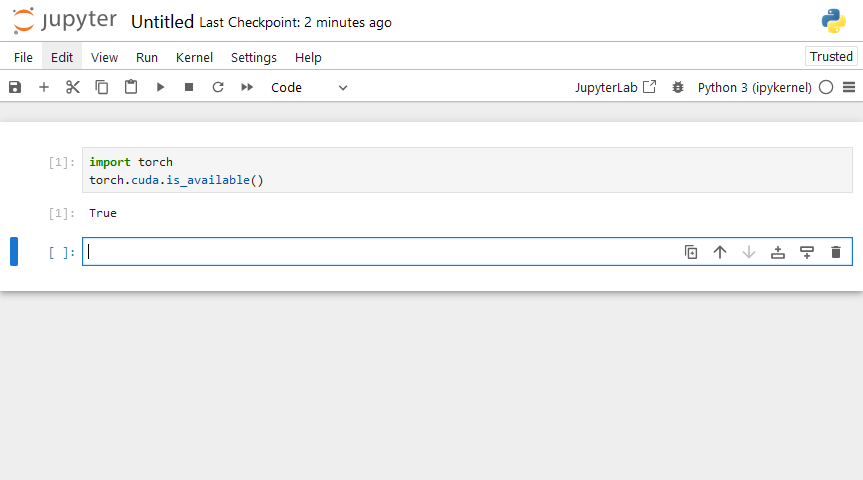

* [Introduction](#introduction)
* [An Overview of Machine Learning, PyTorch, and Jupyter](#an-overview-of-machine-learning-pytorch-and-jupyter)
* [Installing Mamba](#installing-mamba)
* [Access the Miniforge Prompt](#access-the-miniforge-prompt)
* [Benefits of Using Virtual Environments](#benefits-of-using-virtual-environments)
* [Creating a Python Environment](#creating-a-python-environment)
* [Package Overview](#package-overview)
* [Installing PyTorch and Jupyter](#installing-pytorch-and-jupyter)
* [Testing PyTorch and Jupyter Notebook Setup](#testing-pytorch-and-jupyter-notebook-setup)
* [Managing and Updating Packages with Mamba](managing-and-updating-packages-with-mamba)
* [Conclusion](#conclusion)


## Introduction

In this beginner-friendly tutorial, I'll guide you through installing the [Mamba](https://mamba.readthedocs.io/en/latest/index.html) package manager on your local Windows machine and using it to create Python environments. Mamba is a powerful tool that helps you create and manage virtual environments, allowing you to maintain separate configurations for different projects without conflicts. It provides a drop-in replacement for [conda](https://docs.conda.io/en/latest/) and offers higher speed and more reliable environment solutions.


In this tutorial, we'll use a practical example to demonstrate the effectiveness of Mamba. We'll install PyTorch and Jupyter, two essential tools for machine learning projects. To ensure we set up everything correctly, we'll verify the PyTorch installation by running a simple test in a Jupyter Notebook. By the end of this tutorial, you'll be well-equipped to begin your machine-learning projects using Mamba, PyTorch, and Jupyter.


## An Overview of Machine Learning, PyTorch, and Jupyter

Machine learning is a subset of artificial intelligence that enables computers to learn from data and make decisions or predictions without being explicitly programmed. It has become an essential tool across various domains, including natural language processing, computer vision, and speech recognition.

[PyTorch](https://pytorch.org/) is a popular open-source machine learning framework that enables users to perform tensor computations, build dynamic computational graphs, and implement custom machine learning architectures. PyTorch has gained widespread adoption due to its flexibility, ease of use, and strong community support.

[Jupyter](https://jupyter.org/) is an open-source project that provides an interactive computing environment where you can create and share documents containing live code, equations, visualizations, and narrative text. Jupyter Notebook is a web-based platform that allows users to write, run, and debug code. You can also create visualizations and explanatory text.

This tutorial will help kickstart your machine-learning projects by guiding you through setting up a local Python environment using Mamba, PyTorch, and Jupyter. If you're new to machine learning and want to learn more, I recommend the [Practical Deep Learning for Coders](https://course.fast.ai/) course. The course uses a hands-on approach to teach students to apply deep learning and machine learning to practical problems using PyTorch and the [fastai library](https://docs.fast.ai/).


## Installing Mamba

1. Download the Mambaforge installer for Windows from the [official Miniforge GitHub repository](https://github.com/conda-forge/miniforge#mambaforge).

   

   {fig-align="center"}<br>

   

2. Run the installer executable.

   1. You might get a popup from Microsoft Defender SmartScreen like the one below, saying it prevented an unrecognized app from starting. If so, click More info.

      {fig-align="center"}<br>

   2. Then click the "Run anyway" button.

      {fig-align="center"}<br>

   

3. Follow the on-screen instructions in the setup window.

   1. Click the `Next >` button in the setup window.

      {fig-align="center"}<br>

   2. Click the `I Agree` button to accept the license agreement.

      {fig-align="center"}<br>

   3. Select `Just Me` for the installation type and click the `Next >` button.

      {fig-align="center"}<br>

   4. Stick with the default install location and click the `Next >` button.

      {fig-align="center"}<br>

   5. Check the box to clear the package cache upon completion under installation options and click the `Install` button to start the installation process.

      {fig-align="center"}<br>

   6. Wait for the installation process to complete, then click the `Next >` button.

      {fig-align="center"}<br>

   7. Finally, click the `Finish` button to close the setup window.

      {fig-align="center"}<br>


## Access the Miniforge Prompt

On Windows, we use Mamba through the Miniforge Prompt. It is a dedicated command-line interface for interacting with conda environments.


Type "Miniforge Prompt" into the Windows search bar and click Open.


{fig-align="center"}<br>


A new command prompt will open at the location of your Windows user folder.


{fig-align="center"}<br>


Alternatively, you can activate the Miniforge Prompt from any regular command prompt with the following command:


```bash
%USERPROFILE%\mambaforge\Scripts\activate
```

{fig-align="center"}<br>


The text in front of the current directory path indicates the name of the current conda environment. 


{fig-align="center"}<br>


We can get a list of the available conda environments and their locations using the following command:

```bash
mamba env list
```

{fig-align="center"}<br>


The only one listed is "base." If we go to the associated directory path in File Explorer, we'll see the contents for the Mambaforge installation. Mambaforge will store any conda environments we create in the "envs" folder.


{fig-align="center"}<br>


## Benefits of Using Virtual Environments

Before creating a new Python environment, let's cover the benefits of using virtual environments and why they are essential when working with Python projects.

- **Isolation of Dependencies**: Virtual environments create isolated spaces for each project, allowing developers to install and manage different package versions without conflicts. This isolation ensures that the specific dependencies required for one project do not interfere with or break the dependencies of another project.
- **Easier Project Management**: Virtual environments help streamline project management by maintaining separate configurations for different projects. Developers can replicate or share project environments with team members, ensuring consistent behavior across various machines. Shareable project environments help developers collaborate, troubleshoot, and deploy projects.
- **Simplified System Maintenance**: Using virtual environments helps developers avoid cluttering their system-wide Python installation with numerous packages and varying versions. System maintenance is cleaner as developers can easily add, update, or remove packages within individual project environments without affecting other projects or the system as a whole.


## Creating a Python Environment

We can create new Python environments using the `mamba create` command. The following command will create one called `pytorch-env` with Python `3.10`:

```bash
mamba create --name "pytorch-env" python=3.10
```
{fig-align="center"}<br>


Mamba will ask you to confirm that you want to install the packages required to create the new conda environment. Type `Y` into the "Confirm changes" prompt.

{fig-align="center"}<br>


Alternatively, you can pre-approve the package installations by adding a `-y` to the end of the `mamba create` command.

```bash
   mamba create --name "pytorch-env" python=3.10 -y
```

   

Looking in the "envs" directory, we see a new folder for the conda environment we created.

{fig-align="center"}<br>


Once Mamba finishes creating the new environment, it will tell us we can activate and deactivate it using the following commands:

**Activate:**
```bash
mamba activate pytorch-env
```
**Deactivate:**
```bash
mamba deactivate
```
{fig-align="center"}<br>


When we activate it, the name in front of the current directory will change accordingly.


{fig-align="center"}<br>


## Package Overview

Before we install PyTorch and Jupyter, let's briefly explore the purpose of each package and why they're essential for machine learning projects.

- [**PyTorch**](https://pytorch.org/docs/stable/index.html): PyTorch is a fast, flexible, user-friendly, open-source machine learning framework. PyTorch allows developers to perform tensor computations, create dynamic computational graphs, and implement custom machine-learning architectures.
- [**torchvision**](https://pytorch.org/vision/stable/index.html): `torchvision` provides benchmark datasets, model architectures, and image transformations for computer vision.
- [**torchaudio**](https://pytorch.org/audio/stable/index.html): This package provides various tools and datasets for audio processing, including input/output functions, data loaders for popular audio datasets, and audio-specific transformations.
- [**Jupyter**](https://jupyter.org/): Jupyter is an open-source project that enables users to create and share documents containing live code, equations, visualizations, and narrative text. Jupyter Notebook is a web-based interactive computing environment where you can write, run, and debug code. You can also include visualizations and explanatory text.


## Installing PyTorch and Jupyter

We can install packages in our custom Python environment using `mamba` or the [`pip`](https://packaging.python.org/en/latest/key_projects/#pip) package installer. To use `mamba,` we replace the word `conda` in any `conda` install commands. 

For example, this is the `conda` command to install [PyTorch](https://pytorch.org/) on computers with Nvidia GPUs. 

```bash
conda install pytorch torchvision torchaudio pytorch-cuda=11.8 -c pytorch -c nvidia
```

For users without an Nvidia GPU:

```bash
conda install pytorch torchvision torchaudio cpuonly -c pytorch
```


Here is the modified command, which uses Mamba.

```bash
mamba install pytorch torchvision torchaudio pytorch-cuda=11.8 -c pytorch -c nvidia
```

{fig-align="center"}<br>


As before, type `Y` into the "Confirm changes" prompt.

{fig-align="center"}<br>


Alternatively, you can pre-approve the package installations by adding a `-y` to the end of the `mamba install` command.

```bash
mamba install pytorch torchvision torchaudio pytorch-cuda=11.8 -c pytorch -c nvidia -y
```


Installation time can vary depending on your system's hardware and Internet speed. Once it finishes, we'll install Jupyter using the following command:

```bash
mamba install jupyter -y
```

{fig-align="center"}<br>


## Testing PyTorch and Jupyter Notebook Setup

Now that we have PyTorch and Jupyter installed in our Python environment, we can verify everything works as expected by importing PyTorch into a Jupyter Notebook. Before that, I recommend changing the current directory to something more appropriate. I switched to a new folder outside my `G` drive using the following commands:

```bash
G:
cd Projects\Current_Projects\mamba-tutorial
```

{fig-align="center"}<br>


We can launch a Jupyter Notebook environment using the following command:

```bash
jupyter notebook
```

{fig-align="center"}<br>


The Jupyter Notebook environment will launch in a new tab in your default web browser.

{fig-align="center"}<br>


To create a new Jupyter Notebook, open the `New` drop-down menu and select the `Python 3 (ipykernel)`option.

{fig-align="center"}<br>


The notebook will open in a new tab.

{fig-align="center"}<br>


We can import PyTorch and verify it can use the Nvidia GPU by running the following code in the notebook:

```python
import torch
torch.cuda.is_available()
```

{fig-align="center"}<br>


## Managing and Updating Packages with Mamba

This section covers the commands to manage and update packages in your Python environment using Mamba. Proper package management is crucial for maintaining project stability and ensuring compatibility between dependencies.


### Listing Installed Packages

To view all the installed packages within your active Python environment, use the following command:

```bash
mamba list
```

This command will display a list of installed packages and their respective versions and channels.


### Updating a Package

Updating a package to its latest version is simple with Mamba. Use the following command, replacing package-name with the name of the package you want to update:

```bash
mamba update package-name
```

Mamba will search for the latest version of the package, resolve any dependencies, and prompt you to confirm the update.


### Updating All Packages

To update all packages within the active Python environment to their latest versions, run the following command:

```bash
mamba update --all
```

Mamba will check for updates for all installed packages and prompt you to confirm the changes.


### Installing a Specific Package Version

To install a specific package version, use the "=" sign to append the desired number to the package name. For example, to install version 1.0.0 of a package named example-package, use the following command:

```bash
mamba install example-package=1.0.0
```


### Removing a Package

To remove a package from the active Python environment, use the remove command, replacing package-name with the name of the package you want to remove:

```bash
mamba remove package-name
```

Mamba will prompt you to confirm the removal of the package and its dependencies.


### Searching for Packages

You can search for packages across various channels using the search command. To search for a package named example-package, run:

```bash
mamba search example-package
```

This command will display a list of available versions and channels for the specified package.


With these commands, you can effectively manage and update packages in your Python environment using Mamba, ensuring your projects stay up-to-date and compatible with the latest dependencies.


## Conclusion

In this tutorial, we successfully installed the Mamba package manager on a Windows machine and used it to create a local Python environment for our machine-learning project. We also installed tools like PyTorch and Jupyter to help us build machine-learning models.

By leveraging the power of virtual environments, we can maintain separate configurations for different projects, avoiding dependency conflicts and streamlining project management.



