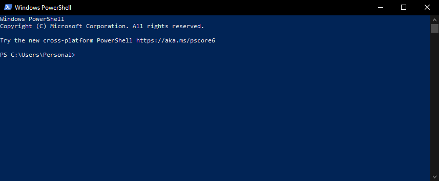
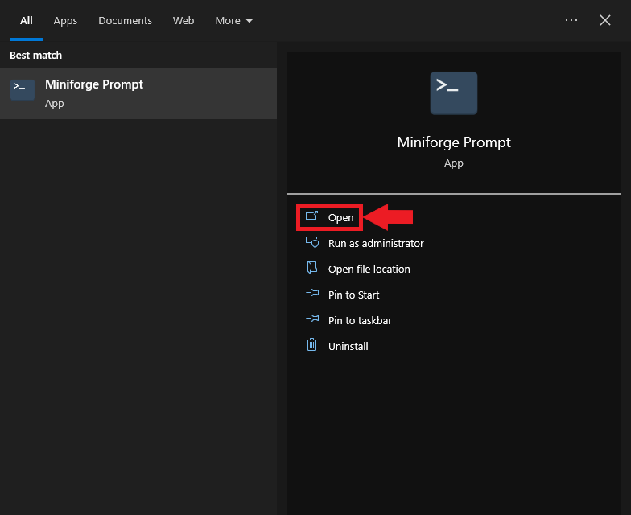
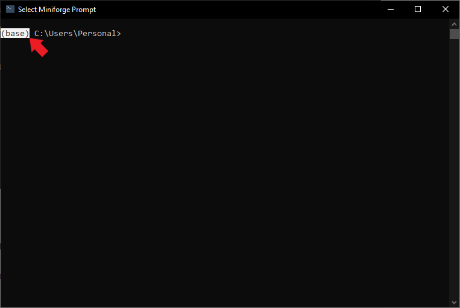
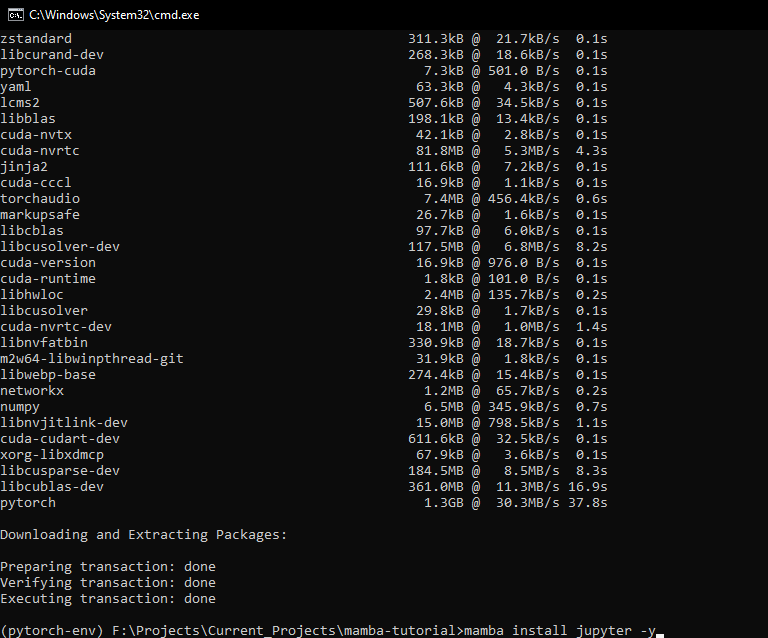
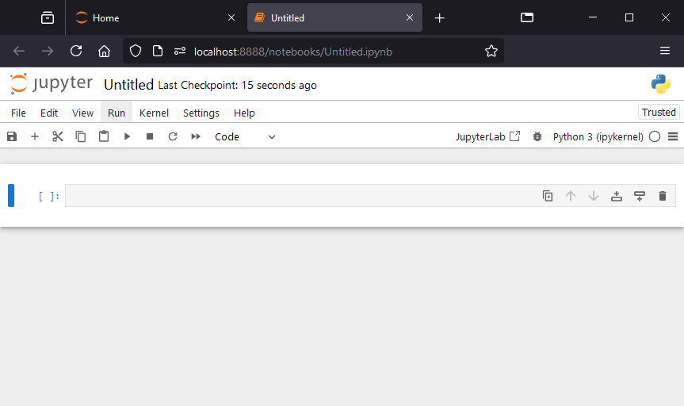

* [Introduction](#introduction)
* [An Overview of Machine Learning, PyTorch, and Jupyter](#an-overview-of-machine-learning-pytorch-and-jupyter)
* [Further Learning](#further-learning)
* [Installing Mamba](#installing-mamba)
* [Access the Miniforge Prompt](#access-the-miniforge-prompt)
* [Benefits of Using Virtual Environments](#benefits-of-using-virtual-environments)
* [Creating a Python Environment](#creating-a-python-environment)
* [Package Overview](#package-overview)
* [Installing PyTorch and Jupyter](#installing-pytorch-and-jupyter)
* [Testing PyTorch and Jupyter Notebook Setup](#testing-pytorch-and-jupyter-notebook-setup)
* [Managing and Updating Packages with Mamba](#managing-and-updating-packages-with-mamba)  
* [Conclusion](#conclusion)


## Introduction

This tutorial will guide you through installing [Mamba](https://mamba.readthedocs.io/en/latest/index.html) on your Windows machine and using it to create Python environments. Mamba is a high-performance package manager for managing virtual environments, allowing you to maintain separate configurations for different projects without conflicts. It serves as a faster and more reliable drop-in replacement for [conda](https://docs.conda.io/en/latest/).

We'll demonstrate Mamba's effectiveness by installing PyTorch and Jupyter—essential tools for machine learning projects. We'll verify the PyTorch installation by running a simple test in a Jupyter Notebook. By the end of this tutorial, you'll be ready to start your machine learning projects using Mamba, PyTorch, and Jupyter.

## An Overview of Machine Learning, PyTorch, and Jupyter

**Machine Learning** enables computers to learn from data and make decisions or predictions without explicit programming. It's crucial in fields like natural language processing, computer vision, and speech recognition.

**[PyTorch](https://pytorch.org/)** is a popular open-source machine learning framework that allows for tensor computations and dynamic computational graphs. Its flexibility and ease of use have led to widespread adoption.

**[Jupyter](https://jupyter.org/)** provides an interactive computing environment for creating and sharing documents containing live code, equations, visualizations, and narrative text. Jupyter Notebooks let you write, run, and debug code in a web-based platform.

## Further Learning

If you're new to machine learning and want to learn more, consider exploring the [Practical Deep Learning for Coders](https://course.fast.ai/) course. It uses a hands-on approach with PyTorch and the [fastai library](https://docs.fast.ai/) to teach you how to apply deep learning to real-world problems.


## Installing Mamba

We can install Mamba using [PowerShell](https://learn.microsoft.com/en-us/powershell/). Type `powershell` into the Windows search bar and click `Open`.

::: {.callout-tip title="Installing PowerShell" collapse="false"}

PowerShell is preinstalled on modern Windows versions. If it's not present on your machine, you can follow the installation steps at the link below:

* [Installing PowerShell on Windows](https://learn.microsoft.com/en-us/powershell/scripting/install/installing-powershell-on-windows?view=powershell-7.4) 

:::

{fig-align="center"}


A command-line interface should open in a new window:

{fig-align="center"}


Next, we will run the following commands inside the PowerShell interface to download and run the Miniforge3 installer:

1. **Download the Miniforge3 installer:**

   ```powershell
   Invoke-WebRequest -Uri "https://github.com/conda-forge/miniforge/releases/latest/download/Miniforge3-Windows-x86_64.exe" -OutFile "Miniforge3-Windows-x86_64.exe"
   ```

   This command downloads the latest Miniforge3 installer for Windows from [official Miniforge GitHub repository](https://github.com/conda-forge/miniforge?tab=readme-ov-file#download).

   * `Invoke-WebRequest`: This cmdlet downloads content from a web page.
   * `-Uri`: Specifies the URL to download from.
   * `-OutFile`: Specifies where to save the downloaded file.

2. **Install Miniforge3:**

   ```powershell
   Start-Process -FilePath "Miniforge3-Windows-x86_64.exe" -ArgumentList "/S /InstallationType=JustMe /AddToPath=0 /RegisterPython=0" -Wait
   ```

   This command silently runs the Miniforge3 installer.

   - `Start-Process`: Starts a new process (in this case, the installer).

   - `-FilePath`: Specifies the program to run.
     - `-ArgumentList`: Provides arguments to the installer:
       - `/S`: Runs the installer silently (no user interface).
       - `/InstallationType=JustMe`: Installs for the current user only.
       - `/AddToPath=0`: Doesn't add Miniforge to the system PATH.
       - `/RegisterPython=0`: Doesn't register this as the system's default Python.
   
   
      - `-Wait`: Waits for the installation to complete before continuing.
   


3. **Clean up:**

   ```powershell
   Remove-Item "Miniforge3-Windows-x86_64.exe"
   ```

   This command deletes the installer file after installation.

   - `Remove-Item`: Deletes the specified file.


We can close the PowerShell interface after running the last command. 


## Access the Miniforge Prompt

On Windows, we use Mamba through the Miniforge Prompt. It is a dedicated command-line interface for interacting with conda environments.


Type `Miniforge Prompt` into the Windows search bar and click `Open`.


{fig-align="center"}


A new command prompt will open at the location of your Windows user folder.


{fig-align="center"}


Alternatively, you can activate the Miniforge Prompt from any regular command prompt with the following command:


```bash
%USERPROFILE%\miniforge3\Scripts\activate
```

{fig-align="center"}


The text in front of the current directory path indicates the name of the current conda environment. 


{fig-align="center"}


We can get a list of the available conda environments and their locations using the following command:

```bash
mamba env list
```

{fig-align="center"}


The only one listed is `base`. If we go to the associated directory path in File Explorer, we'll see the contents for the Miniforge3 installation. Miniforge3 will store any conda environments we create in the "envs" folder.


{fig-align="center"}


## Benefits of Using Virtual Environments

Before we create a new Python virtual environment, let's discuss why virtual environments are essential and how they benefit your Python projects.

- **Isolation of Dependencies**: Virtual environments create isolated spaces for each project. This allows you to install and manage different package versions without conflicts. The dependencies of one project won't interfere with those of another.

- **Easier Project Management**: By maintaining separate configurations for each project, virtual environments make it easy to replicate or share environments with team members. This ensures consistent behavior across different machines and aids collaboration, troubleshooting, and deployment.

- **Simplified System Maintenance**: Using virtual environments prevents cluttering your system-wide Python installation with various packages and versions. You can manage packages within each project's environment without affecting other projects or your system.


## Creating a Python Environment

We can create new Python environments using the `mamba create` command. The following command will create one called `pytorch-env` with Python `3.10`:

```bash
mamba create --name "pytorch-env" python=3.10
```
{fig-align="center"}


Mamba will ask you to confirm that you want to install the packages required to create the new conda environment. Type `Y` into the "Confirm changes" prompt.

{fig-align="center"}


Alternatively, you can pre-approve the package installations by adding a `-y` to the end of the `mamba create` command.

```bash
mamba create --name "pytorch-env" python=3.10 -y
```

   

Looking in the `envs` directory, we see a new folder for the conda environment we created.

{fig-align="center"}


Once Mamba finishes creating the new environment, it will tell us we can activate and deactivate it using the following commands:

**Activate:**
```bash
mamba activate pytorch-env
```
**Deactivate:**
```bash
mamba deactivate
```
{fig-align="center"}


When we activate it, the name in front of the current directory will change accordingly.


{fig-align="center"}


## Package Overview

Before installing PyTorch and Jupyter, let's briefly explore what each package does and why they're important for machine learning projects.

- **PyTorch**: [Documentation](https://pytorch.org/docs/stable/index.html)
  - PyTorch is a fast and flexible open-source machine learning framework. It allows you to perform tensor computations, build dynamic computational graphs, and create custom machine learning models.

- **torchvision**: [Documentation](https://pytorch.org/vision/stable/index.html)
  - `torchvision` provides tools for computer vision tasks, including popular datasets, model architectures, and image transformations.

- **torchaudio**: [Documentation](https://pytorch.org/audio/stable/index.html)
  - `torchaudio` offers utilities and datasets for audio processing, such as functions for reading and writing audio files, loading popular audio datasets, and applying audio-specific transformations.

- **Jupyter**: [Website](https://jupyter.org/)
  - Jupyter is an open-source project that lets you create and share documents containing live code, equations, visualizations, and text. With Jupyter Notebook, you can write, run, and debug code in a web-based environment while including visualizations and explanatory text.


## Installing PyTorch and Jupyter

We can install packages in our custom Python environment using `mamba` or the [`pip`](https://packaging.python.org/en/latest/key_projects/#pip) package installer. To use `mamba,` we replace the word `conda` in any `conda` install commands. 

These are the `mamba` and `pip` commands to install [PyTorch](https://pytorch.org/) on Windows machines with Nvidia GPUs: 


::: {.panel-tabset}


## Mamba

```bash
mamba install pytorch torchvision torchaudio pytorch-cuda=12.4 -c pytorch -c nvidia
```


## Pip

```bash
pip install torch torchvision torchaudio --index-url https://download.pytorch.org/whl/cu124
```


:::


For users without an Nvidia GPU:


::: {.panel-tabset}

## Mamba

```bash
mamba install pytorch torchvision torchaudio cpuonly -c pytorch
```


## Pip

```bash
pip install torch torchvision torchaudio
```


:::


I'll install the packages with `mamba` for this tutorial. As before, type `Y` into the "Confirm changes" prompt.

{fig-align="center"}


Alternatively, you can pre-approve the package installations by adding a `-y` to the end of the `mamba install` command.

```bash
mamba install pytorch torchvision torchaudio pytorch-cuda=12.4 -c pytorch -c nvidia -y
```


Installation time can vary depending on your system's hardware and Internet speed. Once it finishes, we'll install Jupyter using the following command:


::: {.panel-tabset}


## Mamba

```bash
mamba install jupyter -y
```


## Pip

```bash
pip install jupyter
```


:::


{fig-align="center"}


## Testing PyTorch and Jupyter Notebook Setup

Now that we have PyTorch and Jupyter installed in our Python environment, we can verify everything works as expected by importing PyTorch into a Jupyter Notebook.

We can launch a Jupyter Notebook environment using the following command:

```bash
jupyter notebook
```

{fig-align="center"}


The Jupyter Notebook environment will launch in a new tab in your default web browser.

{fig-align="center"}


To create a new Jupyter Notebook, open the `New` drop-down menu and select the `Python 3 (ipykernel)`option.

{fig-align="center"}


The notebook will open in a new tab.

{fig-align="center"}


We can import PyTorch and verify it can use the Nvidia GPU by running the following code in the notebook:

```python
import torch
torch.cuda.is_available()
```

Select the code cell with your mouse and press `Ctrl+Enter` to run the code or `Shift+Enter` to run the code and move to the next cell. 

{fig-align="center"}


## Managing and Updating Packages with Mamba

This section covers the commands to manage and update packages in your Python environment using Mamba. Proper package management is crucial for maintaining project stability and ensuring compatibility between dependencies.


### Listing Installed Packages

To view all the installed packages within your active Python environment, use the following command:

```bash
mamba list
```

This command will display a list of installed packages and their respective versions and channels.


### Updating a Package

Updating a package to its latest version is simple with Mamba. Use the following command, replacing package-name with the name of the package you want to update:

```bash
mamba update package-name
```

Mamba will search for the latest version of the package, resolve any dependencies, and prompt you to confirm the update.


### Updating All Packages

To update all packages within the active Python environment to their latest versions, run the following command:

```bash
mamba update --all
```

Mamba will check for updates for all installed packages and prompt you to confirm the changes.


### Installing a Specific Package Version

To install a specific package version, use the "=" sign to append the desired number to the package name. For example, to install version 1.0.0 of a package named example-package, use the following command:

```bash
mamba install example-package=1.0.0
```


### Removing a Package

To remove a package from the active Python environment, use the remove command, replacing package-name with the name of the package you want to remove:

```bash
mamba remove package-name
```

Mamba will prompt you to confirm the removal of the package and its dependencies.


### Searching for Packages

You can search for packages across various channels using the search command. To search for a package named example-package, run:

```bash
mamba search example-package
```

This command will display a list of available versions and channels for the specified package.


With these commands, you can effectively manage and update packages in your Python environment using Mamba, ensuring your projects stay up-to-date and compatible with the latest dependencies.


## Conclusion

In this tutorial, you accomplished the following:

- **Installed the Mamba package manager** on your Windows machine.
- **Created a local Python virtual environment** for your machine learning project.
- **Installed essential tools** like PyTorch and Jupyter to help build machine learning models.

By leveraging virtual environments, you can:

- Maintain separate configurations for different projects.
- Avoid dependency conflicts between packages.
- Streamline project management and collaboration.






