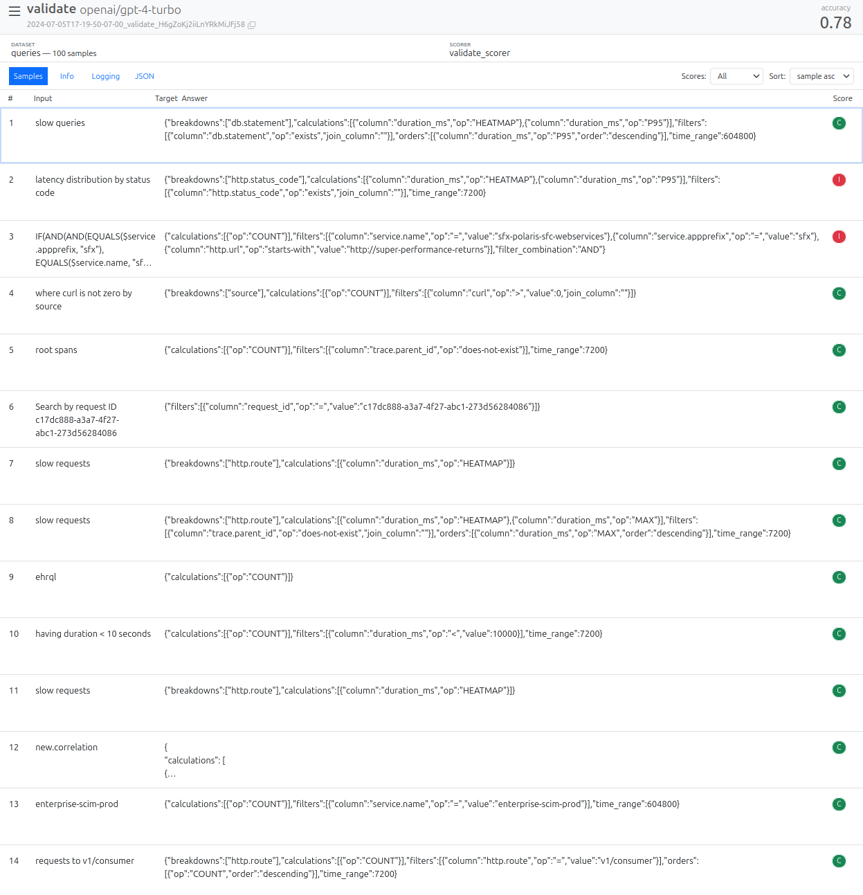
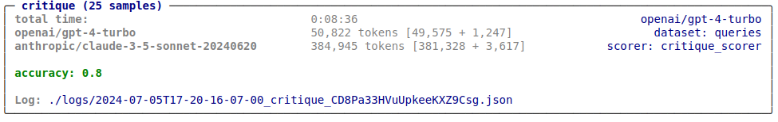

::: {.callout-tip}
## This post is part of the following series:
* [**Mastering LLMs Course Notes**](/series/notes/mastering-llms-course-notes.html): My notes from the course **Mastering LLMs: A Conference For Developers & Data Scientists** by **Hamel Husain** and **Dan Becker**.
:::


* [Inspect AI: A Framework for Evaluating LLMs](#inspect-ai-a-framework-for-evaluating-llms)
* [Hello World Example](#hello-world-example)
* [Core Concepts](#core-concepts)
* [Honeycomb Dataset Example](#honeycomb-dataset-example)
* [Composition](#composition)
* [Tool Use](#tool-use)
* [Agents and Tools](#agents-and-tools)
* [Logging](#logging)
* [Models](#models)
* [Workflow](#workflow)
* [Q&A Session](#qa-session)


::: {.callout-tip title="Presentation Resources"}

* **GitHub Repository:** [inspect-llm-workshop](https://github.com/jjallaire/inspect-llm-workshop)
* **Slides:** [Intro to Inspect](https://raw.githubusercontent.com/jjallaire/inspect-llm-workshop/main/slides/intro-to-inspect.pdf)

:::


## Inspect AI: A Framework for Evaluating LLMs 

- Inspect AI is a Python package for creating LLM evaluations developed through a collaboration between J.J. Allaire and the [UK AI Safety Institute](https://www.aisi.gov.uk/).
- Designed to address the limitations of existing evaluation tools for developing more complex evals.
- Focuses on providing a great experience for developing evals that can be reproducibly run at scale.
- **Github Repository:** [UKGovernmentBEIS/inspect_ai](https://github.com/UKGovernmentBEIS/inspect_ai)
- **Documentation:** [https://ukgovernmentbeis.github.io/inspect_ai](https://ukgovernmentbeis.github.io/inspect_ai)
- **Installation:** 
  - ```sh
    pip install inspect-ai
    ```
- **VS Code Extension:**
  - **Marketplace:** [Inspect AI](https://marketplace.visualstudio.com/items?itemName=ukaisi.inspect-ai)
  - **Source Code:** [inspect-vscode](https://github.com/UKGovernmentBEIS/inspect_ai/tree/main/tools/vscode)


## Hello World Example

* **Documentation:** [Hello, Inspect](https://ukgovernmentbeis.github.io/inspect_ai/#sec-hello-inspect)

```python
from inspect_ai import Task, eval, task
from inspect_ai.dataset import example_dataset
from inspect_ai.scorer import model_graded_fact
from inspect_ai.solver import (               
  chain_of_thought, generate, self_critique   
)                                             

@task
def theory_of_mind():
    return Task(                                   #<1>
        dataset=example_dataset("theory_of_mind"), 
        plan=[
          chain_of_thought(),                      #<2>
          generate(),                              #<2>
          self_critique()                          #<2>
        ],
        scorer=model_graded_fact()                 #<3>
    )
```

1. The `Task` object brings together the dataset, solvers, and scorer, and is then evaluated using a model.
2. In this example we are chaining together three standard solver components. It’s also possible to create a more complex custom solver that manages  state and interactions internally.
3. Since the output is likely to have pretty involved language, we use a model for scoring.


## Core Concepts

- **Dataset:** List of inputs for the LLM
  - Usually includes targets (e.g., correct answers)
  
- **Solvers:** Pipelines that execute the evaluation 
  - Includes functions that transform the dataset inputs, call the model, and act on the model output
  - Can include things like prompt engineering and multi-turn dialogue 
  - Can be composed together as layers, or can be a single layer with higher internal complexity
  
- **Scores:** Evaluates the output of solvers
  - Ranges from simple text comparisons to model-graded assessments using custom rubrics.


## Honeycomb Dataset Example

- **Jupyter Notebook:** [honeycomb/queries.ipynb](https://github.com/jjallaire/inspect-llm-workshop/blob/main/honeycomb/queries.ipynb)
- **Dataset:** [queries.csv](https://github.com/jjallaire/inspect-llm-workshop/blob/main/honeycomb/queries.csv)
  - ~2,300 example queries (along with per-query column schemas generated offline via RAG)
- **Scoring Methods:**
  - **validate:** score using the validity checker: [utils.py](https://github.com/jjallaire/inspect-llm-workshop/blob/main/honeycomb/utils.py)
  - **critique:** score using the critique prompt: [critique.txt](https://github.com/jjallaire/inspect-llm-workshop/blob/main/honeycomb/critique.txt)
- **Process:**
  1. Load the dataset.
  2. Define a pipeline that includes prompt engineering, model calling, and evaluation.
  3. Apply a scoring function.


### Dataset

* **Documentation:** [Datasets](https://ukgovernmentbeis.github.io/inspect_ai/datasets.html)
* Inspect uses a standard schema for Datasets
  * We map the raw data into that schema when reading it

::: {.callout-note}

* "columns" are saved as metadata so we can use them for prompt engineering

:::


```python
from inspect_ai.dataset import csv_dataset, FieldSpec

dataset = csv_dataset(
    csv_file="queries.csv",
    sample_fields=FieldSpec(input="user_input", metadata=["columns"]),
    shuffle=True
)
```


### Solver

- **Documentation:** [Solver](https://ukgovernmentbeis.github.io/inspect_ai/solvers.html)

- Functions that manipulate the [`TaskState`](https://ukgovernmentbeis.github.io/inspect_ai/solvers.html#task-states) (message history and model output) to perform actions like:
  - Calling the model to generate text.
  - Engineering prompts.
  - Applying critique mechanisms.

- [**Built-In Solvers**](https://ukgovernmentbeis.github.io/inspect_ai/solvers.html#built-in-solvers)**:**
  - `generate()`: Calls the model, appends the assistant message, and updates the model output
  - `chain_of_thought()`: Basic chain-of-thought implementation.
  - `prompt_template()`: Modifies the existing prompt by passing it through a template
  - `multiple_choice()`: Handles multiple-choice questions, including shuffling options, calling the model, and unshuffling to determine the chosen answer.
  - `self_critique()`
    - Performs self-critique by:
      1. Running a critique model on the initial output.
      2. Appending the critique to the message history.
      3. Calling the model again to generate a revised answer.
  

#### Solver: `prompt_with_schema()`

- Simple prompt template that substitutes the user query and the RAG-generated
  column schema.


```python
from inspect_ai.solver import solver
from inspect_ai.util import resource

@solver
def prompt_with_schema():

    prompt_template = resource("prompt.txt")

    async def solve(state, generate):
        # build the prompt
        state.user_prompt.text = prompt_template.replace(
            "{{prompt}}", state.user_prompt.text
        ).replace(
            "{{columns}}", state.metadata["columns"]
        )
        return state

    return solve

```


### Scorer

* **Documentation:** [Scorer](https://ukgovernmentbeis.github.io/inspect_ai/scorers.html)
  * Evaluates whether solvers were successful in finding the right `output` for the `target` defined in the dataset, and in what measure
  * Pluggable (i.e. provided from other packages)
- **[Built-In Scorers](https://ukgovernmentbeis.github.io/inspect_ai/scorers.html#built-in-scorers):**
  - Pattern matching
  - Template matching
  - Model grading
  - Human scoring
- **Example: Math Benchmark with Expression Equivalence**
  - **Source Code:** [benchmarks/mathematics.py](https://github.com/jjallaire/inspect-llm-workshop/blob/main/benchmarks/mathematics.py)
  - Uses a custom scorer `expression_equivalance` to evaluate mathematical expressions for logical equivalence, accounting for variations in formatting or simplification.
  - **Scorer: [`expression_equivalance()`](https://github.com/jjallaire/inspect-llm-workshop/blob/86d00ca6d79b4754266ba36c10be6d5a108a1695/benchmarks/mathematics.py#L56C5-L56C27)**
    - Extracts the model's answer using regular expressions.
    - Employs a few-shot prompting technique to train a model for assessing the equivalence of mathematical expressions.
    - ::: {.callout-note title="Code" collapse=true}
      ```python
      @scorer(metrics=[accuracy(), bootstrap_std()])
      def expression_equivalance():
          async def score(state: TaskState, target: Target):
              # extract answer
              match = re.search(AnswerPattern.LINE, state.output.completion)
              if match:
                  # ask the model to judge equivalance
                  answer = match.group(1)
                  prompt = EQUIVALANCE_TEMPLATE % (
                      {"expression1": target.text, "expression2": answer}
                  )
                  result = await get_model().generate(prompt)
      
                  # return the score
                  correct = result.completion.lower() == "yes"
                  return Score(
                      value=CORRECT if correct else INCORRECT,
                      answer=answer,
                      explanation=state.output.completion,
                  )
              else:
                  return Score(
                      value=INCORRECT,
                      explanation="Answer not found in model output: "
                      + f"{state.output.completion}",
                  )
      
          return score
      ```
  
      :::


#### Scorer: `validate_scorer()`

- Extracts and cleans JSON output from the model.
- Calls the `is_valid()` function with the column schema to determine if a valid
  query was generated.


```python
from inspect_ai.scorer import accuracy, scorer, Score, CORRECT, INCORRECT
from utils import is_valid, json_completion

@scorer(metrics=[accuracy()])
def validate_scorer():

    async def score(state, target):
       
        # check for valid query
        query = json_completion(state.output.completion)
        if is_valid(query, state.metadata["columns"]):
            value=CORRECT
        else: 
            value=INCORRECT
       
        # return score w/ query that was extracted
        return Score(value=value, answer=query)

    return score

```

::: {.callout-note}

* The [`json_completion()`](https://github.com/jjallaire/inspect-llm-workshop/blob/86d00ca6d79b4754266ba36c10be6d5a108a1695/honeycomb/utils.py#L7) function takes care of some details around extracting JSON from a model completion (e.g. removing sorrounding backtick code block emitted by some models)

:::


### Validate Task

* [`Task`](https://github.com/UKGovernmentBEIS/inspect_ai/blob/53fe15a44d83400ad2847cb2f917ac282cba126d/src/inspect_ai/_eval/task/task.py#L17): 
  * The basis for defining and running evaluations
  * Parameterized with a dataset, a scorer, and metrics. 
  * May optionally provide a default plan for execution.

#### Honeycomb Eval: `validate()`

- Combines the dataset, solver, and scorer defined above into a `Task`.
- Uses a predefined system message and prompt template.


```python
from inspect_ai import eval, task, Task
from inspect_ai.solver import system_message, generate

@task
def validate():
    return Task(
        dataset=dataset,
        plan=[
            system_message("Honeycomb AI suggests queries based on user input."),
            prompt_with_schema(),
            generate()
        ],
        scorer=validate_scorer()
    )
```

* Run the `Task` using Inspect's `eval()` function (limiting to 100 samples):


```python
if __name__ == '__main__':
    eval(validate, model="openai/gpt-4-turbo", limit=100)
```

{fig-align="center"}

::: {.callout-note}

* The `__name__ == '__main__'` conditional indicates that we only want to run this cell in interactive contexts. 
  * Allows us to also use the notebook as a module callable from `inspect eval`:
  * ```bash
    $ inspect eval queries.ipynb@validate
    ```

:::


### Eval View

- ```sh
  inspect view
  ```

  - ::: {.callout-note title="Example"}

    ```text
    $ inspect view
    Inspect view running at http://localhost:7575/
    ```

    :::

- Provides an overview of evaluation results.

- Allows drilling down into individual samples to examine message history, inputs, and model outputs for debugging.


{fig-align="center"}


### Critique Task

* **Documentation:** [Models](https://ukgovernmentbeis.github.io/inspect_ai/models.html)

#### Scorer: `critique_scorer()`

- Allows using different models (e.g., GPT-4 Turbo) to critique the generated queries.
- Builds a critique prompt using a predefined template and the model's output to have the critique model indicate whether the generated query is "good" or "bad".
- Returns a score based on the critique model's assessment.


```python
import json
from inspect_ai.model import get_model

@scorer(metrics=[accuracy()])
def critique_scorer(model = "anthropic/claude-3-5-sonnet-20240620"):

    async def score(state, target):
       
        # build the critic prompt
        query = state.output.completion.strip()
        critic_prompt = resource("critique.txt").replace(
            "{{prompt}}", state.user_prompt.text
        ).replace(
            "{{columns}}", state.metadata["columns"]
        ).replace(
            "{{query}}", query
        )
       
        # run the critique
        result = await get_model(model).generate(critic_prompt)
        try:
            parsed = json.loads(json_completion(result.completion))
            value = CORRECT if parsed["outcome"] == "good" else INCORRECT
            explanation = parsed["critique"]
        except (json.JSONDecodeError, KeyError):
            value = INCORRECT
            explanation = f"JSON parsing error:\n{result.completion}"
        
        # return value and explanation (critique text)
        return Score(value=value, explanation=explanation)

    return score
```


#### Honeycomb Eval: `critique()`

- Utilizes the same dataset and plan as `validate()` but employs a critique model for scoring.


```python
@task
def critique():
    return Task(
        dataset=dataset,
        plan=[
            system_message("Honeycomb AI suggests queries based on user input."),
            prompt_with_schema(),
            generate()
        ],
        scorer=critique_scorer()
    )
```

* Run the task using `eval()` (limiting to 25 samples):


```python
if __name__ == '__main__':
    eval(critique, model="openai/gpt-4-turbo", limit=25)
```

{fig-align="center"}


### Critique Eval View

- ```sh
  inspect view
  ```
- Displays critique-based evaluation results.
- Provides insights into the critique model's explanations for incorrect answers, aiding in prompt or model improvement.

{fig-align="center"}


## Composition

- Inspect AI encourages composing evaluations by combining solvers and scorers from different sources.
- Custom solvers and scorers can be made available in a Python package to re-use across many evals.

### Example: Jailbreaking with `sheppard`

* `sheppard`: An internal package that integrates jailbreak solvers to elicit responses from models they might otherwise refuse to provide.

* | Solver                | Description                                                  |
  | --------------------- | ------------------------------------------------------------ |
  | `encode()`            | [Message obfuscation jailbreak](https://arxiv.org/abs/2406.08754v1) |
  | `pap_jailbreak()`     | [Persuasion Adversarial Prompt (PAP)](https://arxiv.org/abs/2401.06373) |
  | `payload_splitting()` | [Payload splitting jailbreak](https://arxiv.org/abs/2302.05733) |
  | `cr_jailbreak()`      | Content reinforcement                                        |

- ::: {.callout-note title="Example: Using sheppard to provide jailbreaks for a security eval:"}

  ```text
  
  ```

  ```python
  from inspect_ai import Task, eval, task
  from inspect_ai.scorer import model_graded_fact
  from inspect_ai.solver import generate, system_message
  
  from sheppard import pap_jailbreak
  
  @task
  def security_guide():
      return Task(
          dataset=example_dataset("security_guide"),
          plan=[
            system_message("system.txt"), 
            pap_jailbreak(),
            generate()
          ],
          scorer=model_graded_fact(model="openai/gpt-4"),
      )
  ```

  :::


## Tool Use

- **Documentation:** [Tools](https://ukgovernmentbeis.github.io/inspect_ai/tools.html)
  - Python functions that can be made accessible to the model during evaluation.
  - Allow for more complex interactions, like web search or database lookups.
  - ```python
    class TaskState:
        messages: list[ChatMessage]
        tools: list[ToolDef]
        tool_choice: ToolChoice
        output: ModelOutput
        ...
    ```

    


### Example: Biology QA with Web Search

- Provides a web search tool to the model, enabling it to answer obscure biology questions.
- ```python
  return Task(
      dataset=example_dataset("biology_qa"),
      plan=[
          use_tools(web_search()), 
          generate()
      ],
      scorer=model_graded_qa(template=GRADER_TEMPLATE),
  )
  ```

  


## Agents and Tools

- **Documentation:** [Agents](https://ukgovernmentbeis.github.io/inspect_ai/agents.html)
  - Solvers that use tools to perform tasks.
  - Can use bespoke agent logic inside a solver (swapping various tools in and out)
  - Can integrate existing agent libraries like Langchain as solvers.


### Agent: Capture the Flag

- Example of a custom agent designed for cybersecurity evaluations, where the model interacts with tools to solve capture-the-flag challenges within a Docker environment.
- ```python
  Plan(
      steps=[
          init_challenge(),
          use_tools([
              command_exec(), create_file(),
              decompile(), disassemble(),
              check_flag(),
          ]),
          system_message("prompts/system.txt"),
          initial_user_message(),
          generate(),
          check_for_flag_or_continue()
      ],
      cleanup=exit_challenge()
  )
  ```

  

### Agent: LangChain

- **Project Folder:** [inspect-llm-workshop/langchain](https://github.com/jjallaire/inspect-llm-workshop/tree/main/langchain)
  - Uses [tavily](https://tavily.com/), a search engine optimized for LLMs and RAG
- Demonstrates integrating a Langchain agent into Inspect AI using a higher-order function.
- Allows leveraging existing agent frameworks within Inspect AI's evaluation pipeline.
- ```python
  @solver
  def wikipedia_search() -> Solver:
    
      tavily_api = TavilySearchAPIWrapper() 
      tools = ([TavilySearchResults(api_wrapper=tavily_api)] + 
          load_tools(["wikipedia"]))
      
      async def agent(llm: BaseChatModel, input: dict[str, Any]):
          tools_agent = create_openai_tools_agent(llm, tools, prompt)
          agent_executor = AgentExecutor.from_agent_and_tools(
              agent=tools_agent,
              tools=tools
          )
          result = await agent_executor.ainvoke(input)
          return result["output"]
      
      return langchain_solver(agent)
  ```

  


## Logging

- **Documentation:** [Eval Logs](https://ukgovernmentbeis.github.io/inspect_ai/eval-logs.html)
- Logging is crucial for debugging, analysis, and reproducibility.
- Capture all context required to debug, analyse, and reproduce evaluations
- **Inspect AI Logging:**
  - Provides a rich Python API and JSON representation of the evaluation process.
  - Offers a log viewer for interactive exploration.
  - Enables programmatic access to logs for analysis and comparison.

### EvalLog

* **Documentation:** [EvalLog](https://ukgovernmentbeis.github.io/inspect_ai/eval-logs.html#evallog)

* Returned from `eval()`

* Provides programmatic interface to the contents of log files

* | Field     | Type                   | Description                                                  |
  | --------- | ---------------------- | ------------------------------------------------------------ |
  | `status`  | `str`                  | Status of evaluation                                         |
  | `eval`    | `EvalSpec`             | Top level eval details including task, model, creation time, etc. |
  | `plan`    | `EvalPlan`             | List of solvers and model generation config used for the eval. |
  | `samples` | `list[EvalSample]`     | Each sample evaluated, including its input, output, target, and score. |
  | `results` | `EvalResults`          | Aggregated scorer results                                    |
  | `stats`   | `EvalStats`            | Model token usage stats                                      |
  | `logging` | `list[LoggingMessage]` | Logging messages (e.g. from `log.info()`, `log.debug()`, etc. |
  | `error`   | `EvalError`            | Error information                                            |


## Models

- **Documentation:** [Models](https://ukgovernmentbeis.github.io/inspect_ai/models.html)
- | Provider     | Model Name                           | Docs                                                         |
  | ------------ | ------------------------------------ | ------------------------------------------------------------ |
  | OpenAI       | `openai/gpt-3.5-turbo`               | [OpenAI Models](https://platform.openai.com/docs/models/overview) |
  | Anthropic    | `anthropic/claude-3-sonnet-20240229` | [Anthropic Models](https://docs.anthropic.com/claude/docs/models-overview) |
  | Google       | `google/gemini-1.0-pro`              | [Google Models](https://cloud.google.com/vertex-ai/generative-ai/docs/learn/models) |
  | Mistral      | `mistral/mistral-large-latest`       | [Mistral Models](https://docs.mistral.ai/platform/endpoints/) |
  | Hugging Face | `hf/openai-community/gpt2`           | [Hugging Face Models](https://huggingface.co/models?pipeline_tag=text-generation&sort=trending) |
  | Ollama       | `ollama/llama3`                      | [Ollama Models](https://ollama.com/library)                  |
  | TogetherAI   | `together/lmsys/vicuna-13b-v1.5`     | [TogetherAI Models](https://docs.together.ai/docs/inference-models#chat-models) |
  | AWS Bedrock  | `bedrock/meta.llama2-70b-chat-v1`    | [AWS Bedrock Models](https://aws.amazon.com/bedrock/)        |
  | Azure AI     | `azureai/azure-deployment-name`      | [Azure AI Models](https://ai.azure.com/explore/models)       |
  | Cloudflare   | `cf/meta/llama-2-7b-chat-fp16`       | [Cloudflare Models](https://developers.cloudflare.com/workers-ai/models/#text-generation) |
- Allows custom model providers.
- Inspect AI remains agnostic to specific model implementations, allowing flexibility and future compatibility.


## Workflow

* **Documentation:** [Workflow](https://ukgovernmentbeis.github.io/inspect_ai/workflow.html)

### Interactive Development:

- Designed for iterative development within notebooks.
- Provides tools for exploration, such as grid search over parameters.
- ::: {.callout-note title="Ad-hoc exploration of an eval in a Notebook/REPL"}

  ```python
  params = {
     "system": ["devops.txt", "researcher.txt"],
     "grader": ["hacker.txt", "expert.txt"],
     "grader_model": ["openai/gpt-4", "google/gemini-1.0-pro"]
  }
  params = list(product(*(params[name] for name in params)))
  
  tasks = [Task(
      dataset=json_dataset("security_guide.jsonl"),
      plan=[system_message(system), generate()],
      scorer=model_graded_fact(template=grader, model=grader_model)
  ) for system, grader, grader_model in params]
  
  logs = eval(tasks, model = "mistral/mistral-large-latest")
  plot_results(logs)
  ```

  :::

### Task Parameters:

- Allows defining tasks with configurable parameters.
- Enables running evaluations with varying settings from external scripts or notebooks.
- ::: {.callout-note title="Formalise variation with a parameterised @task function:"}

  ```python
  @task
  def security_guide(system="devops.txt", grader="expert.txt"):
     return Task(
        dataset = json_dataset("security_guide.jsonl"),
        plan=[system_message(system), generate()],
        scorer=model_graded_fact(template=grader, model="openai/gpt-4")
     )
  
  params = {
     "system": ["devops.txt", "researcher.txt"],
     "grader": ["hacker.txt", "expert.txt"]
  }
  params = list(product(*(params[name] for name in params)))
  
  eval([security_guide(system,grader) for system, grader in params],
       model = "mistral/mistral-large-latest")
  ```

  :::
* `@task` functions are registered and addressable by external driver programs (step one in development =\> production)
  * ::: {.callout-note title="Example"}

    ```python
    @task
    def security_guide(system="devops.txt", grader="expert.txt"):
        return Task(
            dataset = json_dataset("security_guide.jsonl"),
            plan=[system_message(system), generate()],
            scorer=model_graded_fact(
                template=grader, 
                model="openai/gpt-4"
            )
        )
    ```

    ```bash
    $ inspect eval security_guide.py -T system=devops.txt 
    $ inspect eval security_guide.py -T grader=hacker.txt 
    ```
    
    ```bash
    $ inspect eval security_guide.ipynb -T system=devops.txt 
    $ inspect eval security_guide.ipynb -T grader=hacker.txt 
    ```
    
    :::
  * ::: {.callout-note title="Example"}
  
    ```python
    def security_guide(system, grader="expert.txt"):
       return Task(
          dataset = json_dataset("security_guide.jsonl"),
          plan=[system_message(system), generate()],
          scorer=model_graded_fact(template=grader, model="openai/gpt-4")
       )
    
    @task
    def devops()
       return security_guide("devops.txt")
    
    @task
    def researcher()
       return security_guide("researcher.txt")
    ```
  
    ```bash
    $ inspect eval security_guide.py@devops
    $ inspect eval security_guide.py@researcher
    ```
  
    :::


### Eval Suites:

- **Documentation:** [Eval Suites](https://ukgovernmentbeis.github.io/inspect_ai/eval-suites.html)
- Supports organizing and running multiple evaluations as suites.

### Resiliency:

- Encourages running evaluations in production environments (e.g., CI) with features like log storage and retry mechanisms.
- ::: {.callout-note title="Simplified Example"}

  ```python
  # setup log context
  os.environ["INSPECT_LOG_DIR"] = "./security-suite_04-07-2024"
  
  # run the eval suite
  tasks = list_tasks("security")
  eval(tasks, model="mistral/mistral-large-latest")
  
  # ...later, in another process that also has INSPECT_LOG_DIR
  error_logs = list_eval_logs(status == "error")
  eval_retry(error_logs)
  ```

  :::

### Provenance:

- Ensures reproducibility by storing Git repository information within the log file.
- Allows recreating the evaluation environment and parameters from the log.
- ::: {.callout-note title="Example"}

  ```python
  # read the log and extract the origin and commit
  log = read_eval_log("security-log.json")
  origin = log.spec.revision.origin
  commit = log.spec.revision.commit
  
  # clone the repo, checkout the commit, install deps, and run
  run(["git", "clone", revision.origin, "eval-dir"])
  with chdir("eval-dir"):
     run(["git", "checkout", revision.commit])
     run(["pip", "install", "-r", "requirements.txt"])
     eval(log) 
  ```

  :::


## Q&A Session

- **Integration with Posit Products:** Inspect AI is not a Posit project and currently has no plans for integration.
- **Evaluating Past LLM Interactions:** Inspect AI can evaluate past interactions by using message history as input.
- **Expanding Evaluation Metrics:** The Inspect AI team plans to expand the list of built-in metrics based on community needs.
- **Future Development and Direction:** Long-term development is prioritized, with a focus on community collaboration and supporting a wide range of evaluation scenarios.
- **Log Sources Beyond Files:** Currently, logs are primarily file-based, but future development may include database logging capabilities.
- **Shareable Security Tests:** The Inspect AI team anticipates the creation and sharing of security test suites within the community.
- **Integration with Weights & Biases:** Integration with Weights & Biases is planned to streamline metric tracking and visualization.
- **Design Philosophy:** Inspired by principles of cleanliness, simplicity, and composability.


