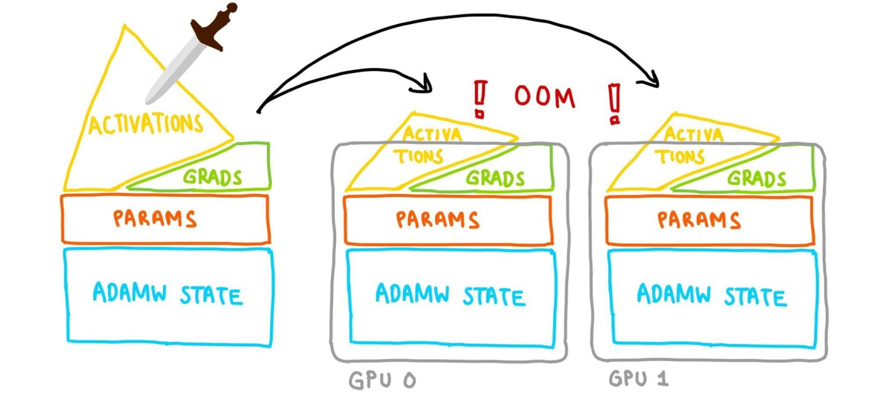
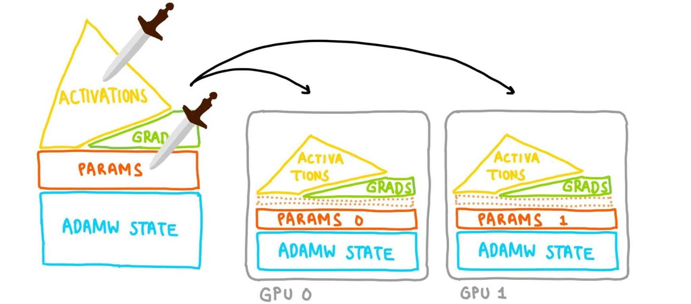

::: {.callout-tip}
## This post is part of the following series:
* [**Mastering LLMs Course Notes**](/series/notes/mastering-llms-course-notes.html): My notes from the course **Mastering LLMs: A Conference For Developers & Data Scientists** by **Hamel Husain** and **Dan Becker**.
:::


* [Introduction](#introduction)
* [Understanding Model Memory](#understanding-model-memory)
* [Optimizing Memory Usage](#optimizing-memory-usage)
* [Model Parallelism with FSDP](#model-parallelism-with-fsdp)
* [Benchmarking FSDP2](#benchmarking-fsdp2)


::: {.callout-tip title="Presentation Resources"}

* [Slaying OOMs](https://drive.google.com/drive/u/0/folders/1HmGNC4v4L5nXhtdDMVCpUBrme1ELp-2C)

:::


## Introduction

- OOM errors are a common challenge when working with large PyTorch models.
- Traditional solutions like reducing batch size or model size are limited in effectiveness.


## Understanding Model Memory

* **VRAM Constraint:** Modern GPUs have limited VRAM (e.g., 24GB for 3090s and 4090s), leading to challenges when training large models.
* **Model Memory Components:**
  * **Parameters:** Model weights, typically stored in FP16 (2 bytes per parameter). For a 7B parameter LLaMa model, this translates to 14GB.
  * **Gradients:** Calculated during backpropagation, require the same storage size as parameters (another 14GB for LLaMa 7B).
  * **Optimizer State:** Optimizers like Adam store additional information, often twice the size of parameters (28GB for LLaMa 7B).
  * **Activations:** Intermediate outputs of model layers. 
    * The size is harder to estimate and depends on factors like batch size and context length.
    * Activations tend to dominate memory usage at larger batch sizes and context lengths.
* **Example:** A full fine-tuning of a 7B parameter LLaMa model can easily exceed 56GB (14GB parameters + 14GB gradients + 28GB optimizer state), exceeding the VRAM capacity of most consumer GPUs.
* **Forum Post:** [How to measure memory usage from your model without running it?](https://dev-discuss.pytorch.org/t/how-to-measure-memory-usage-from-your-model-without-running-it/2024/1)


## Optimizing Memory Usage

### Optimizer Memory

* **Paper:** [Adam: A Method for Stochastic Optimization](https://arxiv.org/abs/1412.6980)
* While alternative optimizers like SGD might seem appealing due to their lower memory overhead, Adam remains dominant in practice due to its effectiveness. 
* Replacing Adam is challenging and might not yield significant memory savings.

### Parameter Quantization

* **4-bit Quantization:** Reduces the precision of model parameters from FP16 to INT4 (half a byte per parameter). 

* This technique can significantly reduce memory footprint, for example, bringing the size of a 7B parameter LLaMa model down from 14GB to 3.5GB. 

* **Torch Compile:** This tool can be leveraged to create efficient quantization kernels directly from Python code, eliminating the need for custom CUDA kernels.

  * Decorate `quantize_tensor` and `dequantize_tensor` functions with `@torch.compile()`

  * ::: {.callout-note title="Example:"}

    ```python
    import os
    os.environ["TORCH_LOGS"] = "output_code"
    import torch
    
    @torch.compile()
    def quantize_tensor(x_fp32):
        absmax = torch.max(torch.abs(x_fp32))
        c = 127.0 / absmax
        x_int8 = torch.round(c * x_fp32).to(torch.int8)
        return x_int8, c
    
    @torch.compile()
    def dequantize_tensor(x_int8, c):
        x_fp32 = x_int8.to(torch.float32) / c
        return x_fp32
    
    x_int8, c = quantize_tensor(torch.randn(10, device="cuda"))
    x_fp32 = dequantize_tensor(x_int8, c)
    ```

    :::

  * **Docs:** [https://pytorch.org/docs/stable/generated/torch.compile.html](https://pytorch.org/docs/stable/generated/torch.compile.html)
  * **Tutorial:** [Introduction to `torch.compile`](https://pytorch.org/tutorials/intermediate/torch_compile_tutorial.html)

### Gradient Optimization with LoRA

* Directly quantizing gradients to 4-bit negatively impacts convergence.
* **Low-Rank Adaptation (LoRA):** Circumvents this issue by training only a small subset of parameters (adapters) while keeping the majority frozen.
* **QLoRA:** This technique combines LoRA with parameter quantization to achieve significant memory savings without compromising accuracy.

### Challenges and Solutions with QLoRA

* QLoRA implementation can be complex, often requiring custom CUDA kernels (e.g., the original implementation by Tim Detmers consists of 4,000 lines of CUDA code).

  * Weights aren’t in int4 but NF4 which is closer to a normal distribution
  * Can’t matrix multiply NF4 tensors
    * need to dequantize and matmul

  * Can’t use the same max for everything otherwise you’re too sensitive to
    outliers
  * Quantization typically done in blocks with independent scales
  * QLoRA quantizes the scales (double quantization)

* **Simplified Implementation with Torch Compile:** [Driss Guessous](https://github.com/drisspg), a PyTorch developer, implemented QLoRA in approximately 900 lines of Python code using Torch Compile. 

  * **Code:** [torchao/dtypes/nf4tensor.py](https://www.github.com/torchao/dtypes/nf4tensor.py)

* **Tensor Subclasses:** PyTorch's tensor subclassing feature enables the creation of custom data types like NF4 (used in QLoRA), allowing for more efficient representation and manipulation of quantized tensors.

  * ::: {.callout-note title="Example:"}

    ```python
    return F.linear(input, weight.to(input.dtype))
    ```

    :::

  * **Docs:** [`torch.Tensor`](https://pytorch.org/docs/stable/tensors.html)

  * **[subclass_zoo](https://github.com/albanD/subclass_zoo/):** Contains a number of examples of Tensor subclasses in PyTorch


## Model Parallelism with FSDP

### Data Parallism

* **Data parallelism:** Split batches across multipls devices and keep a copy of the gradients, model params, and optimizer state on each device
* Data parallelism alone, while helpful, might not be sufficient for extremely large models.

{fig-align="center"}

### FSDP

* **Fully Sharded Data Parallel (FSDP):** Distributes model parameters (and by consequence the gradients, and optimizer states) across multiple GPUs, allowing for training models that exceed the memory capacity of a single device.
  * Memory corresponding to the layer getting processed will be freed when the layer is done.


{fig-align="center"}

* **Sharding:** Dividing model components into smaller chunks (shards) that can be placed on different GPUs.

* **All Gather Operations:** Used to gather necessary data from different GPUs during model training.

* **Layers**:

  * Every PyTorch `nn` module is a tree of more `nn` modules.
  * The user’s wrapping policy determines what gets treated as its own “layer”.
  * What you decided to wrap influences memory usage
    * Smaller blobs = less memory needs to be all-gathered at a time.

* **CPU Offloading:**

  * Can keep parameters on the CPU and move them to the GPU when computing forward + backward.

  * The optimizer update will be done on CPU, so the optim state lives there too.

    {fig-align="center"}


### FSDP1 vs. FSDP2

* **Goal:** Make all-gather efficient

* **Constraint:** [NCCL](https://developer.nvidia.com/nccl) (NVIDIA Collective Communications Library) requires each GPU contribute same-size Tensors

* **FSDP1:**
  * Flattens and concatenates all tensors before sharding, potentially leading to type and metadata conflicts.
  
    {fig-align="center"}
  
    * `t1` and the first part of `t2` get combined into a single tensor
    * The second part of `t2` gets combined with `t3` into a single tensor
    * `t2` gets split between GPUs
    * Forces `t1`, `t2`, and `t3` to all have the same d-type and other metadata
  
  * Can lead to non-deterministic memory spikes, making memory management challenging.
  
* **FSDP2 (Per-Parameter FSDP):**
  * Introduces distributed tensors (D-tensors) that allow for sharding individual tensors, preserving their original data types and metadata.
  
    {fig-align="center"}
  * Offers better memory determinism, ensuring more predictable and manageable memory usage.
  * Enables more flexible and efficient training scenarios, especially when combined with techniques like QLoRA.
  * Requires extra copies during all-gather compared to FSDP1
  * **Forum Post:** [FSDP & CUDACachingAllocator: an outsider newb perspective](https://dev-discuss.pytorch.org/t/fsdp-cudacachingallocator-an-outsider-newb-perspective/1486/1)

### CPU Offloading

* Leverages CPU memory to store parameters and optimizer states, further reducing the memory load on GPUs.
* Offloads the optimizer step to the CPU, allowing GPUs to focus on computationally intensive forward and backward passes.


## Benchmarking FSDP2

### Benchmarking Plan

* **Goal:** Run benchmarks, identify performance gaps between FSDP2 and the baseline (FSDP1 & bnb), and explore ways to improve FSDP2's speed.
* **Hardware:** Two NVIDIA 3090 GPUs (consumer-grade, 24GB VRAM each) acquired from Vast AI.
* **Baseline:** Answer.ai's train.py with FSDP1 and bnb, using a batch size of 8.

### Initial Benchmarking and Discrepancies

* **Benchmarking Environments:**

  * [Answer.ai's train.py](https://github.com/AnswerDotAI/fsdp_qLoRA/blob/main/train.py) (command-line configuration)

    * ```sh
      python train.py --model_name meta-llama/Llama-2-7b-hf --batch_size 8 --context_length 2048 --train_type
      qLoRA --use_gradient_checkpointing True --reentrant_checkpointing True --dataset dummy --dataset_samples
      48
      ```

  * [TorchTune recipe](https://github.com/pytorch/torchtune/blob/1fa1f04baf124c074dcd93831fa38c8b657af1e9/recipes/configs/dev/llama2/7B_qLoRA_fsdp2.yaml) (YAML configuration)

* **Initial Findings:**

  * |           | batch size | peak memory | runtime for a step |
    | --------- | ---------- | ----------- | ------------------ |
    | train.py  | 8          | 12.88 GiB   | 14.0s              |
    | torchtune | 8          | 12.60 GiB   | 16.5s              |

  * FSDP2 showed better peak memory usage.

  * FSDP2 was slower in runtime.

* **Tracing Analysis (Perfetto):**

  * **Blog Posts:** 
    * [Understanding GPU Memory 1: Visualizing All Allocations over Time](https://pytorch.org/blog/understanding-gpu-memory-1/)
    *  [Understanding GPU Memory 2: Finding and Removing Reference Cycles](https://pytorch.org/blog/understanding-gpu-memory-2/) 

  * **Traces:**
    * **Google Drive:** [answer.ai train.py](https://drive.google.com/file/d/1ObfUUySBwuaCSLMXRxFiM1w7XYMebxvB/view)
    * **Google Drive:** [torchtune](https://drive.google.com/file/d/1BpdlZZ55746IHcifho2u2okJQ1ihr8dY/view)

  * **[Perfetto](https://ui.perfetto.dev/):** A production-grade open-source stack for performance instrumentation and trace analysis
  * **Significant difference in the number of optimizer steps:** The optimizer took much longer in FSDP2.
  * **Double the number of operations:** Indicating FSDP2 might be training on more parameters than the baseline.


### Identifying the Root Causes

* **Root Cause 1: Configuration Discrepancy**
  * TorchTune recipe LoRA-fied to the output projection (adding two low rank adapters per layer), resulting in 64 additional parameters compared to train.py. 
* **Root Cause 2:  Tensor Subclass Dispatch Overhead**
  * Distributed tensors (D-tensors) introduce overhead due to metadata unwrapping during kernel calls.
  * This overhead was amplified by the increased number of parameters, making the optimizer step significantly slower in FSDP2.

### Addressing the Discrepancies and Further Benchmarking

* **Ensuring Apples-to-Apples Comparison:**
  * Standardized the dataset, parameter count, and wrapping policy across benchmarks.
* **Results After Standardization:**
  * Still slower runtime for FSDP2.
  * Significantly improved peak memory usage.
* **Further Analysis:**
  * Focused on forward pass, backward pass, and optimizer as the main culprits for the remaining performance gap.

### Deep Dive into Performance Gaps

* **Gap 1: Optimizer Step Slowdown**
  * **Problem:** D-tensor overhead resulted in a 3x slower optimizer step.
  * **Solution:** Collaborated with Intel to develop a fused Adam optimizer kernel for single dispatch and vectorization, leading to an 8x speedup.
* **Gap 2: Larger All Gather Operations**
  * **Problem 1:** FSDP2 packed more data (scalars and quantization factors) into the all gather operation, unlike the baseline.
  * **Problem 2:** Output projection wasn't quantized in FSDP2 when opting out of LoRA, leading to a 4x larger size compared to the baseline.
  * **Solution:** 
    * Problem 1 is expected behavior.
    * Problem 2 will be addressed by TorchTune in future releases. 
* **Gap 3: Overhead from Dequantization**
  * **Problem:**  FSDP2's dequantization process from NF4 to BF16 for CUDA kernels was less efficient than the specialized implementation used in the baseline. 
  * **Solution:** Explore using Torch Compile, custom Torch kernels, or Triton kernels for faster dequantization.
* **Gap 4: Different Rope Algorithms**
  * **Problem:** TorchTune and the baseline employed different Rope algorithms, leading to different operations before the SDPA. 
  * **Solution:** TorchTune to offer a wider selection of Rope algorithms.
* **Gap 5: Overlapping Communication and Computation**
  * **Problem:** FSDP2's stricter memory management exposed inefficiencies in overlapping CPU offloading with computation. The computation tasks were much smaller than the communication tasks, leading to idle time.
  * **Solution:** Adjusted the wrapping policy to group layers differently, enabling better overlap and reducing idle time. This solution is only feasible with FSDP2 due to its ability to handle mixed precision within a layer.


