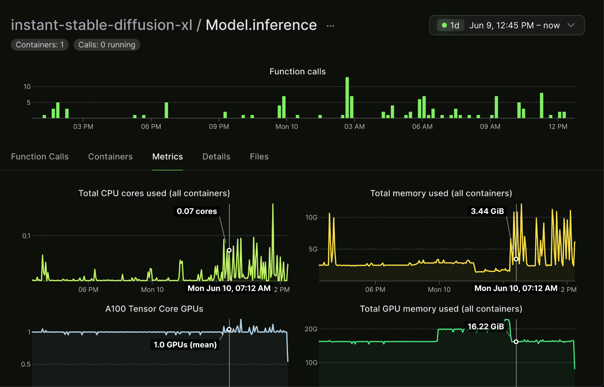
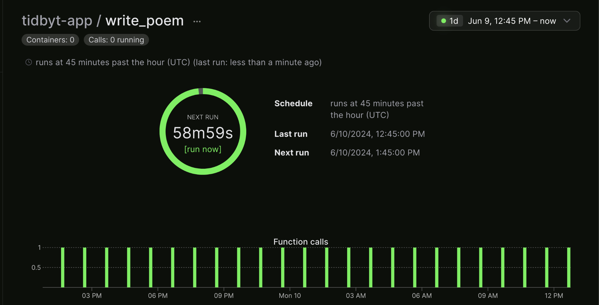
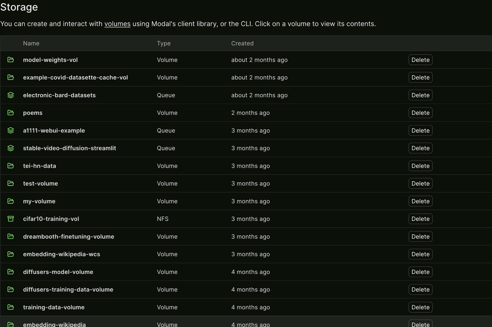
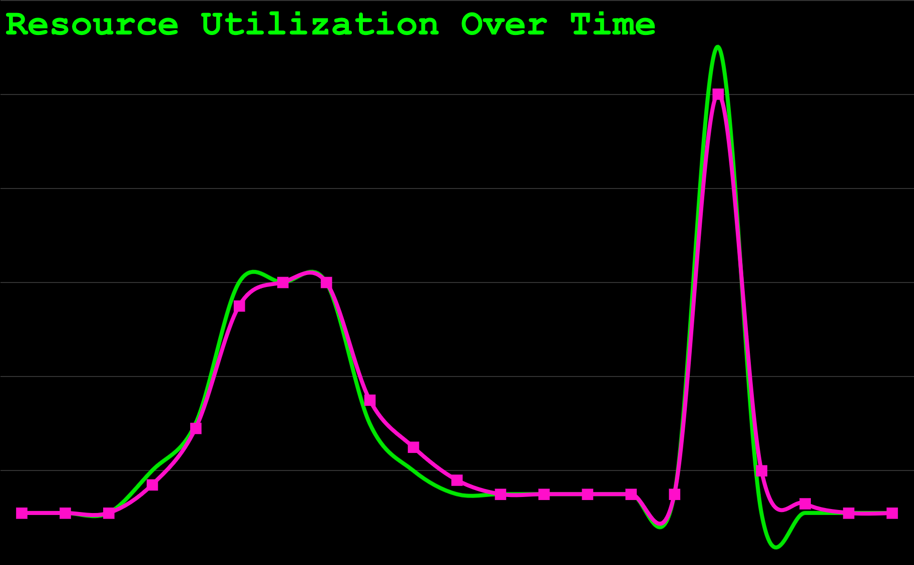

::: {.callout-tip}
## This post is part of the following series:
* [**Mastering LLMs Course Notes**](/series/notes/mastering-llms-course-notes.html): My notes from the course **Mastering LLMs: A Conference For Developers & Data Scientists** by **Hamel Husain** and **Dan Becker**.
:::

## Introduction

- **Speaker:** Charles ([@charles_irl](https://twitter.com/charles_irl) on Twitter)
- **Topic:** A deeper dive into Modal, focusing on its broader applications beyond fine-tuning LLMs.
- **Slides:** [Simple Scalable Serverless Services](https://docs.google.com/presentation/d/14uDnzd06j9i0zAQ3lTmB7QHBSO45BIsVGUZBZ3HKxGo/edit#slide=id.g2c7588f453b_0_272)

## Modal Overview

### Modal Vision: Scalable, Cost-Efficient, Serverless Services

- Modal's vision is to enable the deployment of scalable services that are cost-efficient and serverless, all while being simple and easy to use.

### Defining "Scalable Services"

#### Three Key Service Requirements: Input/Output, Storage, Compute

1. **Input/Output:** Connecting the service to the outside world and its information. 
   - This enables services to receive input and provide output over networks, unlike isolated scripts or notebooks.
2. **Storage:** Preserving information for later use.
   - Databases and file storage are crucial for storing and retrieving data within the service.
3. **Compute:** Manipulating and processing information.
   - Even simple storage solutions benefit from compute capabilities for efficient access and retrieval.

#### Scalability as Table Stakes

- Modern services are expected to scale to handle:
  - Global user bases accessing services concurrently.
  - Massive data storage needs, potentially reaching petabytes or more.
  - Computationally intensive tasks distributed across multiple machines.

#### Challenges and Importance of Scalability

- Failing to scale can lead to:
  - Service outages when traffic surges.
  - Poor user experiences due to slow response times.

#### Distributed Systems for Scalability

- Scalability is typically achieved through distributed systems, spreading the workload across numerous machines and data centers.
- However, building and managing distributed systems is complex and challenging.

### Modal's Solution: Simple Scalable Services with Python

- Modal aims to simplify the creation of scalable services using Python.

#### Pythonic Tools for Building Services

- **Web Endpoints and Servers:** Easily define web endpoints and servers that scale without complex configurations.
  - Modal handles the complexities of distribution and scaling, requiring minimal configuration from the developer.
- **Storage Options:**
  - **Caching and Distributed Storage:** Modal provides distributed dictionaries and queues for efficient inter-process communication in scaled environments.
  - **Volumes:** Abstract away the complexities of distributed file systems, offering a local file system interface for storing data like weights and datasets.
- **Compute with Python Functions:** Python functions serve as the fundamental units of work in Modal.
  - Define functions that execute upon endpoint requests or as cron jobs.

### Modal Dashboard Overview

#### Model Inference Function Example

- Modal's dashboard visualizes resource usage for running functions.
- Example: A model inference function triggered by user requests, scaling resources like CPU, memory, and GPU usage based on demand.

#### Scaling Up and Down Resources

- Modal dynamically adjusts resource allocation based on real-time needs, ensuring optimal performance and cost efficiency.

#### Handling Multiple Inputs

- Functions can be designed to handle multiple inputs concurrently, maximizing resource utilization.

#### Cron Jobs with Modal

- Schedule periodic function execution for tasks like:
  - Regularly displaying generated content.
  - Pulling data from production databases to data warehouses.
  - Performing regular data analysis.
  - Fine-tuning and retraining models on a cadence.
  - Rerunning evaluations with live user data.

## Q&A Session 1

#### Database Service Availability

- Modal does not currently offer a managed database service, particularly serverless Postgres.

#### Challenges of Serverless Postgres

- Two main types of databases:
  - **OLTP (Online Transaction Processing):** Difficult to scale due to row-level operations and complex joins.
  - **OLAP (Online Analytical Processing):** More straightforward to run on Modal using examples with tools like DuckDB and parquet files stored in S3.

#### Running Analytical Workloads on Modal

- Modal provides examples for running analytical workloads:
  - Downloading parquet files from S3.
  - Performing analysis using tools like DuckDB.

#### Challenges of Scaling Transaction Processing

- Distributed transaction processing databases are more challenging to build and scale effectively.

#### Recommendations for Serverless Postgres: Neon, Superbase

- For serverless Postgres, Modal recommends using external services like [Neon](https://neon.tech/) or [Superbase](https://www.superbase.com/), which integrate well with Modal's serverless API apps.

## Storage in Modal

### Importance of Data Storage

- Data storage is paramount, often defining the value of applications.

### Focus on Long-Term Storage

- This section emphasizes long-term storage solutions rather than in-memory dictionaries and queues.

### File System Abstractions: Volumes

#### Use Cases: Storing Weights, Datasets

- Volumes provide a distributed file system abstraction, ideal for storing:
  - Model weights.
  - Datasets, including large ones (terabyte-scale or even low petabyte-scale).

#### Examples of Stored Volumes

- Model weights from Axolotl fine-tuning runs.
- CIFAR-10 data and models.
- Raw Wikipedia dataset from Hugging Face Datasets in Arrow file format.

#### Handling Large Datasets

- Modal offers examples for storing and working with very large datasets on the order of terabytes or even low petabytes.

#### Volumes: Optimized for Write Once, Read Many Workloads

- Modal's volumes are designed for workloads where data is written infrequently but read frequently.
- This design choice optimizes for:
  - Datasets that are not frequently overwritten.
  - Model weights where new versions are written, but existing versions are not modified.

##### Explanation of Write Once, Read Many

- Data is written once and then read many times, common for datasets and model weights.

##### Benefits for Scaling

- Scaling read operations is significantly easier than scaling write operations, making volumes well-suited for read-heavy workloads.

## Q&A Session 2

#### Storage Pricing

- While Modal does not currently charge for storage, it plans to implement pricing eventually.
- The goal is to price storage at a rate comparable to S3, Modal's underlying storage provider.

#### Addressing Other Storage-Related Questions

- **Petabyte-Sized Datasets and S3:** Very large datasets may be stored directly on S3 rather than Modal's volumes.
- **Data Transport Costs:** Modal does not currently charge for data ingress or egress, but may implement pricing if it becomes a significant cost.
- **Explanation of Mounts:** Mounts make data from the local machine available to code running on Modal. This is useful for:
  - Accessing code files.
  - Including assets for static sites.

## Input and Output in Modal

### FastAPI Integration

#### Benefits of Using FastAPI with Modal

- Asynchronous Python: FastAPI enables asynchronous programming without the complexities of manually managing asynchronous operations.
- Documentation: FastAPI provides excellent documentation.
- Scalability: Asynchronous programming in FastAPI aligns well with Modal's scaling capabilities.
- Performance: Asynchronous operations can improve performance, especially with Modal's distributed architecture.

##### Asynchronous Python, Documentation, Scalability, Performance

- FastAPI simplifies asynchronous programming and offers performance benefits when used with Modal.

##### Modal's Handling of Synchronous and Asynchronous Functions

- Modal seamlessly handles both synchronous and asynchronous functions, avoiding common errors associated with mixing the two.

##### Flexibility and Performance with Async

- Developers can gradually introduce asynchronous code into their Modal projects without major refactoring.

#### Web Endpoints for Exposing Services

- FastAPI, based on the ASGI protocol, offers a robust way to define and expose web services.

##### FastAPI as a Dependency

- FastAPI is a dependency of Modal, simplifying project setup and dependency management.

##### Creating URLs from Python Functions

- Modal can automatically create URLs from Python functions, simplifying web service creation.

#### Asynchronous Server Gateway Interface (ASGI)

##### Flexibility Beyond FastAPI

- Modal supports any ASGI-compliant web framework, providing flexibility beyond FastAPI.

#### WSGI and Flask Support

##### Comparison of WSGI and ASGI

- Modal also supports WSGI (Web Server Gateway Interface), an older protocol commonly used with frameworks like Flask.
- While WSGI offers a mature ecosystem, it lacks native asynchronous support, potentially impacting performance compared to ASGI.

##### Potential Trade-offs with WSGI

- WSGI may provide a wider range of existing projects and libraries but might lack the performance advantages of ASGI.

#### Running Arbitrary Web Servers

- Modal allows running arbitrary web servers, even those not written in Python, by treating them as subprocesses.

## Q&A Session 3

#### DDoS Attack Prevention

- Modal does not currently have built-in DDoS protection but acknowledges its importance and plans to offer it in the future.

##### Current Mitigation Strategies

- Developers can implement authentication middleware in FastAPI or Flask to restrict access.

##### Importance of Authentication and Rate Limiting

- Authentication and rate limiting are crucial for preventing unauthorized access and mitigating DDoS attacks.

##### Potential for Cloudflare DDoS Protection

- Integrating with services like Cloudflare for DDoS protection is worth exploring.

#### WebSockets and Max Execution Time

- For questions related to WebSockets and maximum execution time, Modal recommends reaching out on their Slack channel for more specific guidance.

#### Clarification on Django's Async Support

- A participant clarifies that Django supports asynchronous views and requests when running under ASGI.

#### Addressing Storage-Related Questions

- Modal reiterates its stance on storage pricing and data transport costs, aiming for transparency and aligning with S3's pricing model.

## Serverless Nature of Modal

### Importance of Serverless Architecture

- Serverless architecture is a key aspect of Modal, contributing to its cost-efficiency and developer experience.

### Serverless for Cost Efficiency and Developer Experience

- Modal's serverless nature offers both financial and ergonomic benefits for development teams.

### Variable Resource Utilization

- Service resource usage fluctuates over time due to factors like:
  - Time zone-dependent usage patterns.
  - Traffic spikes from external events.

#### Provisioning for Peaks and Cost Implications

- Traditional approaches involve provisioning resources for peak usage, leading to wasted resources and unnecessary costs during off-peak times.

#### Resource Utilization Challenges

- Optimizing resource utilization becomes crucial to minimize costs, as exemplified by Amazon's journey into cloud computing.

#### The Rise of Cloud Computing

- Cloud computing emerged partly from the need to utilize idle resources effectively.

### Manual Provisioning and Its Drawbacks

- Manually scaling resources up and down can reduce costs but is reactive, stressful, and may not handle sudden traffic spikes well.

#### Handling Traffic Spikes

- Manual provisioning struggles to respond quickly to unexpected surges in traffic.

#### Reducing Costs but Potentially Sacrificing User Experience

- While manual provisioning can save costs, it can also lead to poor user experiences during scaling events.

### Automatic Provisioning and Autoscaling

#### Kubernetes and Autoscaling

- Tools like Kubernetes automate provisioning and scaling, dynamically adjusting resources based on demand.

#### Lag in Autoscaling

- Autoscaling typically involves a lag between resource demand and allocation.

#### Granularity of Autoscaling

- Smaller units of autoscaling allow for more precise resource allocation.

### Achieving Serverless: Matching Costs to Resource Utilization

- Serverless computing aims to align costs directly with resource consumption.

#### Scaling to Zero

- A defining characteristic of serverless is the ability to scale resources down to zero when not in use.

#### Functions as a Service (FaaS)

- Serverless is often implemented using Functions as a Service (FaaS), where individual functions are executed on demand.

### Benefits of Serverless: Cost Savings, Improved User Experience

- Serverless offers:
  - Reduced costs by paying only for resources consumed.
  - Improved user experiences by dynamically scaling to meet demand.

### Why Use a Serverless Platform Like Modal?

- Managing serverless infrastructure requires significant engineering effort.

#### Why Use a Serverless Platform Like Modal?

- Serverless platforms like Modal offer economies of scale, handling the complexities of:
  - Resource allocation.
  - Autoscaling.
  - Infrastructure management.

#### Amortizing Engineering Complexity

- Modal amortizes the engineering complexity of serverless across its entire user base.

#### Smoothing Fluctuations with Multiple Users

- Fluctuations in individual users' resource usage are smoothed out by the aggregate usage of all users on the platform.

#### Economics of Serverless Computing

- The "Berkeley View" paper highlights the economic benefits of serverless computing, emphasizing economies of scale and resource utilization.

##### Berkeley Paper on Serverless

- **Paper:** [Cloud Programming Simplified: A Berkeley View on Serverless Computing](https://arxiv.org/abs/1902.03383)

## Remote Procedure Calling (RPC) in Modal

### RPC as the Core Idea Behind Serverless

- Remote Procedure Calling (RPC) is fundamental to serverless computing and Modal's functionality.

### How RPC Works

- In RPC, local code invokes functions that execute on remote machines, abstracting away the complexities of network communication.
- **Book:** [Computer Networks: A Systems Approach](https://book.systemsapproach.org/index.html)
  - **Section:** [5.3 Remote Procedure Call](https://book.systemsapproach.org/e2e/rpc.html#remote-procedure-call)

#### Transparency and Seamlessness

- RPC strives for transparency, making remote function calls appear as if they were local.

### Modal's Implementation with gRPC

- Modal utilizes gRPC as its RPC framework.

### Understanding Modal's Behavior

#### Why Modal Feels Different from Local Python

- Modal's RPC mechanisms introduce differences compared to traditional local Python execution.

#### Code Execution on Modal's Machines

- Code, including functions, is sent to Modal's infrastructure for execution.

#### Dynamic Function Execution

- Modal dynamically uploads and executes functions defined in local scripts.

#### Handling Global Scope and Imports

- Understanding how Modal manages global scope and imports is crucial for writing effective Modal code.

### Running Code on GPUs

- Modal enables running code on GPUs even if the local machine lacks them.

### Demo: Mini Modal

#### Simulating Modal Locally

- **[MiniModal](https://github.com/charlesfrye/minimodal):** A simplified local simulation of Modal's core concepts.

#### Understanding Modal's Internals

- Mini Modal provides insights into Modal's internal workings, particularly its handling of virtual environments and code execution.

#### Separating Virtual Environments

- Mini Modal demonstrates the isolation of virtual environments, a key aspect of Modal's functionality.

## Q&A Session 4

#### How Modal Hosts Suno.ai

- [Suno.ai](https://suno.com/), a generative AI application, utilizes various Modal features, including functions, cron jobs, volumes, and web endpoints.

##### Suno.ai's Use of Modal's Features

- A blog post details Suno.ai's reasons for choosing Modal and how they leverage its features.

##### Blog Post about Suno.ai's Choice of Modal

- The blog post provides insights into Suno.ai's decision to use Modal and their experience with the platform.
