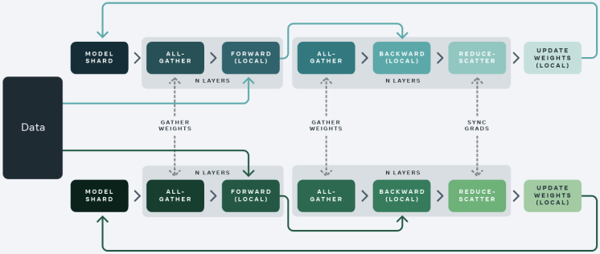

::: {.callout-tip}
## This post is part of the following series:
* [**Mastering LLMs Course Notes**](/series/notes/mastering-llms-course-notes.html): My notes from the course **Mastering LLMs: A Conference For Developers & Data Scientists** by **Hamel Husain** and **Dan Becker**.
:::


* [Fine-Tuning Fundamentals](#fine-tuning-fundamentals)
* [Axolotl Framework for Fine-Tuning](#axolotl-framework-for-fine-tuning)
* [Honeycomb Case Study: Fine-tuning LLMs for Natural Language Querying](#honeycomb-case-study-fine-tuning-llms-for-natural-language-querying)
* [Debugging Axolotl](#debugging-axolotl)
* [Scaling Model Training with More Compute](#scaling-model-training-with-more-compute)
* [Scaling Model Training with Accelerate](#scaling-model-training-with-accelerate)
* [DeepSpeed and FSDP Configurations in Axolotl](#deepspeed-and-fsdp-configurations-in-axolotl)
* [Training on Modal](#training-on-modal)
* [Q&A Session](#qa-session)


## Fine-Tuning Fundamentals

### Choosing the Right Base Model

* Two important factors to consider when selecting a base model are **model size** and **model family**.

#### Model Size

* **7 Billion vs. 13 Billion Parameter Models:** 7 billion parameter models offer a good balance between performance and resource requirements for many use cases. 
* **Popularity and Practicality:** 7 billion parameter base models are widely used for finetuning, evidenced by high download counts, suggesting a good starting point for most users.
* **Consider Resource Constraints:** Larger models (e.g., 70 billion parameters) require significant computational resources and may not be necessary for all applications.

#### Model Family 

* **Staying Current:** Opt for recently released and well-regarded models (e.g., Llama3).
* **Resources for Identifying Trends:** 
  * **Hugging Face Model Hub:** Sort by "hotness" to find trending models.
  * **Local Llama Subreddit:** The community actively discusses and evaluates various language models.
* **Prioritize Experimentation:**  Trying out a few popular models and iterating based on results is more beneficial than overthinking initial model selection.

### LoRA: Efficient Fine-tuning

* LoRA (Low-Rank Adaptation) is a technique for fine-tuning large language models by optimizing a smaller set of parameters, making the process more efficient.

#### How LoRA Works

1. **Simplified Model:** Imagine a single layer in a language model as a matrix transforming a 4,000-dimensional input (text embedding) into a 4,000-dimensional output.  
2. **Large Weight Matrix:** This single layer involves a 4,000 x 4,000 weight matrix, amounting to 16 million weights, which is computationally expensive to fine-tune directly.
3. **LoRA's Approach:**
   * Instead of adjusting the entire weight matrix, LoRA introduces two smaller matrices (4,000 x 16 and 16 x 4,000). 
   * Multiplying these matrices produces a 4,000 x 4,000 matrix, which is then added to the original weight matrix.
4. **Reduced Parameter Count:** LoRA significantly decreases the number of trainable parameters to 128,000,  requiring less RAM and making fine-tuning more manageable. 

#### Benefits and Recommendations

* **Efficiency:** LoRA enables fine-tuning on less powerful hardware.
* **Wide Adoption:** It is the dominant fine-tuning method in practice.
* **Practical Recommendation:** Start with LoRA for most fine-tuning tasks. 

### QLoRA: Enhancing Efficiency with Quantization

* QLoRA builds upon LoRA by using quantization to further reduce memory requirements.

#### Quantization

* **Bit Representation:** Numbers in computers are stored using bits. More bits allow for finer numerical representation.
* **QLoRA's Quantization:**  Reduces the number of bits used to store the weights in the LoRA matrices (e.g., from 16 bits to 4 bits). This limits the possible values but significantly reduces memory usage.
* **Potential Issue:** Training with QLoRA involves quantizing weights, which introduces quantization errors. When these LoRAs are merged back into the original model, the resulting model differs slightly from the trained version.
  *  This discrepancy arises because the quantized weights are not identical to the original weights, leading to slight variations in the model's behavior.

#### Practical Implications

* **RAM Savings:** QLoRA enables fine-tuning with even less RAM compared to standard LoRA.
* **Minimal Performance Impact:** While some accuracy trade-off is expected, the practical impact on results is often smaller than anticipated.
* **Common Practice:** Many practitioners use QLoRA as their default fine-tuning method due to its efficiency. 

### Importance of Data Quality 

####  Data Improvement over Hyperparameter Tuning 

* Many ML practitioners often prioritize hyperparameter optimization over data quality.
* The impact of improving data quality on model performance is significantly higher than that of hyperparameter tuning.
* Many successful LLM fine-tuners, like Teknium, creator of the Hermes models, prioritize high-quality data and data synthesis over deep mathematical understanding of the underlying transformer models.
* Fine-Tuning After Dataset Improvement
  * **Scenario:** You've fine-tuned a model, then improved and expanded your dataset. Should you continue fine-tuning the existing model or start from scratch?
  * **Recommendation:** Start fine-tuning from the base model again using the enhanced dataset.


#### Axolotl: Simplifying ML and Enabling Data Focus

* Axolotl abstracts away the complexities of transformers, enabling users to focus on data and model training without needing in-depth technical knowledge.
* Axolotl's user-friendliness, enables a shift in focus from code debugging to data analysis.
* This ease of use allows for more experimentation and exploration of the data, leading to a better understanding of the problem and potentially better solutions.

####  Axolotl: Built-in Best Practices and Efficiency

* Axolotl comes with sensible default values and best practices, saving users time and effort. 
* The speaker mentions "sample packing" as a specific example of a clever optimization feature within Axolotl that speeds up training.
* Users can leverage these pre-built optimizations instead of spending time figuring them out independently. 


## Axolotl Framework for Fine-Tuning

### Overview

* **Axolotl** simplifies the process of fine-tuning LLMs by providing a user-friendly wrapper for lower-level Hugging Face libraries.
* **Key Features:**
  * **Examples:** Provides numerous example configuration (YAML) files as starting points for different fine-tuning scenarios. 
  * **Flexibility:** Supports various data formats, training techniques (LoRA, QLoRA, DeepSpeed, FSDP), and integrations with tools like Weights & Biases.
  * **Ease of Use:** Abstracts away many complexities, allowing users to focus on data and model experimentation.

### Documentation

* **GitHub Repository:**  [https://github.com/OpenAccess-AI-Collective/axolotl](https://github.com/OpenAccess-AI-Collective/axolotl).
  * The README file contains most of the information needed to get started.
  * Follow the [Quickstart guide](https://github.com/OpenAccess-AI-Collective/axolotl?tab=readme-ov-file#quickstart-) for step-by-step instructions on preprocessing, training, and testing a fine-tuned model. 
* **Documentation Site:** [https://openaccess-ai-collective.github.io/axolotl/](https://openaccess-ai-collective.github.io/axolotl/)
* **Discord server:** [https://discord.gg/HhrNrHJPRb](https://discord.gg/HhrNrHJPRb)

### Installation

#### Create a Python Environment

::: {.panel-tabset}

## Conda

```bash
conda create --name axolotl-env python=3.11 -y
conda activate axolotl-env
```

## Mamba

```bash
mamba create --name axolotl-env python=3.11 -y
mamba activate axolotl-env
```

:::

#### Install Dependencies

```bash
pip install torch==2.3.0 torchvision==0.18.0 torchaudio==2.3.0 --index-url https://download.pytorch.org/whl/cu121
pip install packaging ninja
```

#### Install Axolotl

```bash
git clone https://github.com/OpenAccess-AI-Collective/axolotl
cd axolotl

pip install -e '.[flash-attn,deepspeed]'
```


### Configuration Files

* Define essential settings for training, including the base model, dataset, LoRA parameters, and more

* Axolotl configurations are written in YAML and can be complex.

  * **[Config options](https://openaccess-ai-collective.github.io/axolotl/docs/config.html):** A complete list of all configuration options.

* Start with an example config file and modify it according to your specific needs.

  * The "examples" directory in the repo is a good place to start.
  * Copy an example and run it as-is before making modifications.
  * Focus on changing the dataset initially, then explore other parameters as needed.

* Leverage the Axolotl Discord channel for sharing and finding configurations.

* Example: Fine-tuning a Mistral 7b model with QLORA.
  * Specifies the base model, data set, storage location, and various hyperparameters.
  * ::: {.callout-note title="YAML Config" collapse=true}

    ```text
    
    ```

    ```yaml
    base_model: mistralai/Mistral-7B-v0.1
    model_type: MistralForCausalLM
    tokenizer_type: LlamaTokenizer
    is_mistral_derived_model: true
    
    load_in_8bit: false
    load_in_4bit: true
    strict: false
    
    lora_fan_in_fan_out: false
    data_seed: 49
    seed: 49
    
    datasets:
      - path: _synth_data/alpaca_synth_queries_healed.jsonl
        type: sharegpt
        conversation: alpaca
    dataset_prepared_path: last_run_prepared
    val_set_size: 0.1
    output_dir: ./qlora-alpaca-out
    hub_model_id: hamel/hc-mistral-alpaca
    
    adapter: qlora
    lora_model_dir:
    
    sequence_len: 896
    sample_packing: false
    pad_to_sequence_len: true
    
    lora_r: 32
    lora_alpha: 16
    lora_dropout: 0.05
    lora_target_linear: true
    lora_fan_in_fan_out:
    lora_target_modules:
      - gate_proj
      - down_proj
      - up_proj
      - q_proj
      - v_proj
      - k_proj
      - o_proj
    
    wandb_project: hc-axolotl-mistral
    wandb_entity: hamelsmu
    
    gradient_accumulation_steps: 4
    micro_batch_size: 16
    eval_batch_size: 16
    num_epochs: 3
    optimizer: adamw_bnb_8bit
    lr_scheduler: cosine
    learning_rate: 0.0002
    max_grad_norm: 1.0
    adam_beta2: 0.95
    adam_epsilon: 0.00001
    save_total_limit: 12
    
    train_on_inputs: false
    group_by_length: false
    bf16: true
    fp16: false
    tf32: false
    
    gradient_checkpointing: true
    early_stopping_patience:
    resume_from_checkpoint:
    local_rank:
    logging_steps: 1
    xformers_attention:
    flash_attention: true
    
    loss_watchdog_threshold: 5.0
    loss_watchdog_patience: 3
    
    warmup_steps: 20
    evals_per_epoch: 4
    eval_table_size:
    eval_table_max_new_tokens: 128
    saves_per_epoch: 6
    debug:
    weight_decay: 0.0
    fsdp:
    fsdp_config:
    special_tokens:
      bos_token: "<s>"
      eos_token: "</s>"
      unk_token: "<unk>"
    save_safetensors: true
    
    ```

    :::


### Datasets

* Axolotl supports various data formats, including the common "alpaca" format.

  * [Example Dataset:](https://huggingface.co/datasets/mhenrichsen/alpaca_2k_test) [https://huggingface.co/datasets/mhenrichsen/alpaca_2k_test](https://huggingface.co/datasets/mhenrichsen/alpaca_2k_test)

* Data format determines the structure of your training data.
* ::: {.callout-note title="Alpaca Format" collapse=false} 
  ```text
  <start>
  Below is an instruction that describes a task, paired with an input that provides further context. Write a response that appropriately completes the request.
  
  ### Instruction:
  {instruction}
  
  ### Input:
  {input}
  
  ### Response:
  {output}
  <end>
  ```
  :::

  * Each sample contains an instruction, optional input, and desired response.
  * The model is trained to predict the text following the "Response:" section.


### Preprocessing Data

* Axolotl preprocesses data into a string format for training.
* The preprocessing step defines the template for formatting the input string.
* It's crucial to understand the chosen data template (e.g., alpaca, chatML) and how it impacts model training. 

### Training

* Axolotl uses a string and a mask for training.
  * The mask prevents certain parts of the input from influencing the loss function.
    * This ensures the model focuses on generating the desired output rather than replicating the entire input string.

  * Use the "train on inputs" flag to modify this behavior.

* The debug flag in the preprocessing step helps visualize the tokenization and masking process.

* Monitor progress and metrics using tools like Weights & Biases. 

### Running Axolotl

* The [Quickstart section](https://github.com/OpenAccess-AI-Collective/axolotl?tab=readme-ov-file#quickstart-) of the readme provides the necessary commands.

* Three main steps:

  1. Preprocess the data.

     - ```sh
       # preprocess datasets - optional but recommended
       CUDA_VISIBLE_DEVICES="" python -m axolotl.cli.preprocess examples/openllama-3b/lora.yml
       ```

  2. Train the model.

     - ```sh
       # finetune lora
       accelerate launch -m axolotl.cli.train examples/openllama-3b/lora.yml
       ```

  3. Test the model using the CLI tool or a lightweight Gradio app.

     - ```sh
       # inference
       accelerate launch -m axolotl.cli.inference examples/openllama-3b/lora.yml \
           --lora_model_dir="./outputs/lora-out"
       ```

     - ```bash
       # gradio
       accelerate launch -m axolotl.cli.inference examples/openllama-3b/lora.yml \
           --lora_model_dir="./outputs/lora-out" --gradio
       ```

     - The Gradio app allows for easy testing and interaction with the trained model in a web browser.

       - The Gradio app is for testing and not for production use.
     


## Honeycomb Case Study: Fine-tuning LLMs for Natural Language Querying

* **GitHub Repository:** [https://github.com/parlance-labs/ftcourse](https://github.com/parlance-labs/ftcourse)
* **Finetuned Model:** [https://huggingface.co/parlance-labs/hc-mistral-alpaca](https://huggingface.co/parlance-labs/hc-mistral-alpaca)

### Introduction

* **Honeycomb:** An observability platform with a domain-specific query language (HQL).
* **Goal:** Reduce the burden of learning HQL by allowing users to input natural language queries.
* **Approach:** Fine-tune an LLM to translate natural language queries into HQL.

### Initial Setup

* **Prompt Design:**
  * System prompt introduces Honeycomb AI and its purpose.
  * User schema (retrieved via RAG) provides context about the data. 
  * Fixed elements: Query specification (terse HQL guide), tips, and few-shot examples.
  * Completion model completes user queries into HQL using the provided context. 
* **Limitations:**  Prompt engineering alone is insufficient for complex scenarios. Fine-tuning allows for tailored improvements.
* **Initial Evaluation (Level 1: Unit Tests):**
  * Implemented unit tests with assertions to check query validity and correctness.
  * Validations included: JSON validity, invalid columns, invalid filters.
  * Iteratively refined assertions as new failure modes were discovered.

### Data Acquisition and Preparation

* **Challenge:** Limited real-world data due to privacy concerns and new product launch.
* **Solution:** Generate synthetic data using LLMs:
  * Prompt engineering: Instructed LLM to augment existing data by rewording queries, substituting columns, and modifying queries while maintaining valid structure.
  * Utilized level 1 assertions to filter out nonsensical generated queries.
* **Data Formatting:**
  * Prepared data in shared GPT-alpaca format for compatibility with Axolotl.
  * Structured as conversations with system, human (input), and GPT (output) roles to align with Axolotl's input handling and training objectives.
* **Config Setup:**
  * Utilized Axolotl's "sharegpt" and "alpaca" config for data format.
    * **[sharegpt](https://openaccess-ai-collective.github.io/axolotl/docs/dataset-formats/conversation.html#sharegpt):** conversations where `from` is `human`/`gpt`. 
  * Set "train on inputs" to false to focus the model on generating correct HQL queries.
  * Updated Weights & Biases and Hugging Face credentials for logging and model uploading. 

### Pre-Training Data Validation

* **Importance:** Verifying data preparation and identifying potential issues before training.
* **Process:**
  * Executed `axolotl preprocess` to flatten and assemble data into Axolotl's expected format.
  * Manually inspected preprocessed data within the `last_run/prepared` directory to ensure correct formatting and alignment with expectations.
  * Paid close attention to special tokens, spacing, and overall structure.
* **Tokenization:**
  * Investigated potential tokenization inconsistencies and their impact on model performance. 
  * Determined that minor inconsistencies, like extra spaces, didn't significantly affect the final results as long as consistency was maintained during inference.

### Training

* **Base Model:** Mistral 7b
* **Training Setup:**
  * Referred to examples and community resources for initial Mistral configuration.
  * Experimented with different learning rates, learning rate schedulers, and batch sizes to optimize performance.
* **Tools:**
  * Used Accelerate for efficient training management and distribution (covered in more detail later).
  * Integrated with Weights & Biases for logging training metrics and visualizing progress.
  * Utilized Hugging Face to store and share the trained model.
* **Results:** Model trained successfully and uploaded to Hugging Face.

### Sanity Checking and Evaluation

* **Blog Post:** [Your AI Product Needs Evals](https://hamel.dev/blog/posts/evals/)

* **Sanity Check:**
  * Pulled the trained model from Hugging Face.
  * Designed a template to feed natural language queries and schemas to the model.
  * Tested the model with sample inputs to verify basic functionality and output structure.
* **Level 1 Evaluation:** Monitored level 1 evals (assertions) to track query correctness and identify failing assertions.
* **Level 2 Evaluation:**
  * **Challenge:** Level 1 evals passed, but model output quality wasn't satisfactory. Synthetic data and model outputs required further refinement.
  * **Solution:** Built an LLM-based query judge:
    * Provided a prompt with instructions to act as a query evaluator.
    * Included few-shot examples of queries with human-written critiques.
    * Used a spreadsheet to gather critiques from Philip (domain expert) on model-generated queries.
    * Aligned the LLM judge with Philip's feedback by iteratively refining the prompt and examples.
  * **Outcome:** The LLM judge provided valuable insights into model shortcomings and areas for data improvement.

### Data Curation and Filtering

* **Goal:** Enhance the quality and diversity of the training data.
* **Approaches:**
  * **Fixing Bad Data:** Used the LLM judge's critiques to automatically improve flawed queries using an LLM. 
  * **Filtering:**
    * Utilized level 1 and level 2 evals to filter out incorrect and low-quality queries.
    * Implemented custom filters to remove low-complexity and overly complex queries.
    * Applied deduplication techniques to remove redundant data points.
      * Basic deduplication: Removed entries with identical natural language queries, schemas, or outputs.
      * Semantic deduplication: Explored tools like Lilac for fuzzy concept search and clustering to identify semantically similar entries and maximize data diversity.
  * **Tools:**
    * **[lilac](https://github.com/lilacai/lilac):** A tool for exploration, curation and quality control of datasets for training, fine-tuning and monitoring LLMs

### Iteration and Refinement

* The process of fine-tuning and evaluation was iterative.
* Continuously revisited and refined different stages, including:
  * Updating level 1 and level 2 evals based on new insights and failure modes.
  * Retraining the model with the curated and improved dataset.
  * Re-evaluating the model using both automated and human-based methods.

### Takeaways

This case study highlights the importance of a holistic approach to fine-tuning LLMs. It emphasizes the significance of:
* Iterative development and evaluation.
* Combining automated and human-in-the-loop techniques.
* Building tools and processes that incorporate domain expertise.
* Going beyond basic metrics and deeply analyzing data and model behavior to identify areas for improvement.


## Debugging Axolotl

* **Use the latest version of Axolotl:** Ensure you're using the most up-to-date version to avoid known issues.
* **Eliminate concurrency:** 
  * Use only one GPU.
  * Use a single dataset process.
  * This helps pinpoint the source of problems.
* **Minimize iteration time:**
  * Use a small dataset for faster processing.
  * Start with a small model for quicker training and testing.
* **Clear caches:**
  * This is especially critical for debugging dataset formation issues.
  * Cached data can lead to unexpected behavior and misinterpretations.
* **Debugging Tools:**
  * Axolotl's documentation provides detailed guidance on debugging techniques.
    * **Debugging How-To Guide:** [https://openaccess-ai-collective.github.io/axolotl/docs/debugging.html](https://openaccess-ai-collective.github.io/axolotl/docs/debugging.html)
  * Consider using VS Code to connect to Docker containers for easier debugging. 


## Scaling Model Training with More Compute

* **Source Slides:** [https://huggingface.co/spaces/muellerzr/llm-conf](https://huggingface.co/spaces/muellerzr/llm-conf)

### Model GPU Usage

* **🤗 Model Memory Calculator:** [https://huggingface.co/spaces/hf-accelerate/model-memory-usage](https://huggingface.co/spaces/hf-accelerate/model-memory-usage)

* **Calculating memory requirements:** To estimate GPU memory needed for training, consider:
  
  * Each parameter uses 4 bytes.
  * Backward pass needs ~2x the model size.
  * Optimizer (e.g., Adam) needs ~4x the model size.
  
* **Example:** BERT base (108 million parameters)
  * Full precision Training: ~1.6 GB
  
  * Mixed precision Training: ~1-2 GB (gradients in half precision)
  
  * | dtype   | Model     | Gradients | Backward pass | Optimizer step |  Highest  |
    | ------- | :-------- | :-------: | :-----------: | :------------: | :-------: |
    | float32 | 413.18 MB | 413.18 MB |   826.36 MB   |    1.61 GB     |  1.61 GB  |
    | float16 | 413.18 MB | 619.77 MB |   826.36 MB   |   826.36 MB    | 826.36 MB |
  
* **Scaling challenges:** LLMs like LLaMA 3 8B require significant VRAM 

  * Full precision Training: ~112 GB

  * | dtype   | Model    | Gradients | Backward pass | Optimizer step |  Highest  |
    | ------- | :------- | :-------: | :-----------: | :------------: | :-------: |
    | float32 | 28.21 GB | 28.21 GB  |   56.43 GB    |   112.84 GB    | 112.84 GB |
    | float16 | 28.21 GB | 42.32 GB  |   56.43 GB    |    56.43 GB    | 56.43 GB  |


### Distributed Training

* **Single GPU:** Simplest approach, limited by single GPU memory.
* **Distributed Data Parallelism (DDP):**
  * Full model on each GPU.
  * Data split across GPUs for faster processing.
  * Limited by the memory capacity of a single GPU.
* **Fully Sharded Data Parallelism (FSDP) & DeepSpeed:**
  * Model, optimizer states, and gradients sharded across GPUs.
  * Enables training models larger than a single GPU's memory.

### Fully Sharded Data Parallelism

::: {.panel-tabset}

## Standard data parallel training


## Fully sharded data parallel training



:::

* **Sharding strategies:**
  * **Full Shard:** Everything (optimizer state, gradients, parameters) is sharded.
  * **Shard Grad Op:** Optimizer state and gradients sharded, model joined during backward pass.
  * **No Shard:** Equivalent to DDP.
  * **Hybrid Shard:** Similar to Full Shard, but keeps a full model copy on each multi-node for faster communication.
* **Model splitting techniques:**
  * **Transformer-based:** Split at Transformer layer boundaries.
  * **Size-based:** Split after a specified number of parameters.
* **Offloading parameters:**
  * Offloads gradients and parameters to RAM when VRAM is insufficient.
  * Significantly slower due to data transfer between CPU and GPU.
    * 72 hrs on 2x4090s vs 1-2 hrs on 1xH100 for a full finetune of LLaMA 3 8B

### Additional Considerations

* **CPU RAM-efficient loading:** 
  * Use `device='meta'` to create a model skeleton without loading weights into memory.
  * Load weights only on one GPU and distribute to others when needed, saving CPU RAM.
* **Sync Module States:** Ensures consistent model states across GPUs, crucial for FSDP.


## Scaling Model Training with Accelerate

* **Source Slides:** [https://huggingface.co/spaces/muellerzr/llm-conf](https://huggingface.co/spaces/muellerzr/llm-conf)

### Accelerate: The Foundation

* Many popular libraries, such as HuggingFace Transformers, Axolotl, FastAI, and more, are built upon Accelerate.
* Accelerate simplifies the complexities of distributed training, making it user-friendly.

### Core Components of Accelerate

Accelerate consists of three primary frameworks:

* **Command-Line Interface (CLI):** Facilitates easy interaction and configuration, as showcased in Accelerate launch demonstrations.
* **Training Library:** This underlying engine powers distributed training, streamlining the process significantly.
* **Big Model Inference:** Designed for handling inference in large models.

### Key Commands in Accelerate

* **`accelerate config`:**
  * Configures the training environment.
  * Integrates seamlessly with configurations used in tools like Accelerate launch, allowing for consistent settings across different stages. 
* **`accelerate estimate-memory`:**
  *  Calculates and estimates memory requirements, particularly VRAM usage, which is crucial for efficient training.
* **`accelerate launch`:**
  * Executes the training script.

### Why Accelerate Matters: Simplifying Distributed Training 

* Launching and managing distributed training can be complicated, often involving different commands and setups for PyTorch, DeepSpeed, and other tools.
* Accelerate simplifies this process. Running a basic Python script often lacks distributed training capabilities, especially distributed data parallelism.  
* **Example:**  Without Accelerate, you would need to use specific commands like `torchrun`  with multiple arguments for running a script on two GPUs. 
* `accelerate launch` streamlines this process by handling the complexities and allowing users to specify the desired configuration without needing to remember numerous commands.

### Configuration and Execution with Accelerate 

*  Accelerate employs config files (similar to Axolotl) to define training parameters. 
*  **Example:** A config file can specify using a local multi-GPU setup with BF16 mixed precision on eight GPUs.  
*  When using FSDP, the config file can explicitly define all FSDP parameters. `accelerate launch` will automatically utilize FSDP for training based on these settings. 
*  For users of Axolotl or Transformers, these config files within Accelerate offer a straightforward way to manage training configurations.

### Accelerate Internals: A Low-Level View

*  While not essential for users primarily interacting with higher-level libraries like Axolotl or Transformers, understanding the inner workings of Accelerate can be beneficial.
*  **Device and Compute Agnostic:**  Accelerate is designed to function seamlessly across different operating systems (Mac, Windows) and hardware (CPUs, GPUs, TPUs).
*  **Minimal Intrusion and Complexity:**  The library aims to be minimally intrusive, requiring few code changes. 
   * Developers create an "accelerator" object that prepares the environment.
   * Simply replacing the standard backward function with `accelerator.backwards` is often sufficient for integrating Accelerate. 

###  Accelerate in Action: Data Sharding and Global Steps 

* **Data Sharding:** Similar to FSDP, Accelerate handles data sharding, distributing data efficiently across multiple GPUs.
* **Global Step:** It maintains a global training step to ensure consistency across distributed training. 
* **Example:** If training on eight GPUs with Accelerate, instead of a single GPU with a batch size of 16, each GPU would use a batch size of 2 (2 x 8 = 16). 
* This global step management eliminates the need for manual adjustments to the learning rate or scheduler when scaling training across multiple GPUs, simplifying the process and ensuring comparable results. 

### Protecting Training from "Dumb Decisions"

* **Avoiding BF16/FP16 conversion of model weights**: Converting weights leads to irreversible precision loss and negatively impacts fine-tuning.

* **Using `autocast` for Gradient Conversion**:  `autocast` preserves weight precision by only converting gradients, leading to more stable training and better fine-tuning capabilities.

* **Exploring 8-bit Training with Transformers Engine and MSAMP**: 

  * These technologies enable training with native 8-bit precision (not quantized versions), potentially offering significant speedups.

  * Converting the entire model to BF16 before using these technologies can lead to instability during training and suboptimal performance.

  * **[TransformerEngine](https://github.com/NVIDIA/TransformerEngine):** A library for accelerating Transformer models on NVIDIA GPUs, including using 8-bit floating point (FP8) precision on Hopper and Ada GPUs

    * Utilizes `autocast` for computations, performing them in 8-bit instead of 16-bit.

  * **[MS-AMP](https://github.com/Azure/MS-AMP):** Microsoft Automatic Mixed Precision Library 

    * Allows for further experimentation with 8-bit precision, even enabling optimizer states to be stored in 8-bit. 

  * | Optimization Level | Computation (GEMM) | Comm | Weight | Master Weight | Weight Gradient | Optimizer States |
    | ------------------ | ------------------ | ---- | ------ | ------------- | --------------- | ---------------- |
    | FP16 AMP           | FP16               | FP32 | FP32   | N/A           | FP32            | FP32+FP32        |
    | Nvidia TE          | FP8                | FP32 | FP32   | N/A           | FP32            | FP32+FP32        |
    | MS-AMP O1          | FP8                | FP8  | FP16   | N/A           | FP8             | FP32+FP32        |
    | MS-AMP O2          | FP8                | FP8  | FP16   | N/A           | FP8             | FP8+FP16         |
    | MS-AMP O3          | FP8                | FP8  | FP8    | FP16          | FP8             | FP8+FP16         |

* **Experimentation is Key**: It's crucial to experiment with different precision levels (FP16, BF16, 8-bit) to find the optimal balance between memory savings and training stability.

### DeepSpeed and FSDP

* Both tools offer comparable functionality and are largely interchangeable.
  * Choosing between DeepSpeed and FSDP often comes down to personal preference - aligning with Microsoft's ecosystem or staying within the native PyTorch framework. 

### Resources

- [🤗 Accelerate documentation](https://hf.co/docs/accelerate)
- [Launching distributed code](https://huggingface.co/docs/accelerate/basic_tutorials/launch)
- [Distributed code and Jupyter Notebooks](https://huggingface.co/docs/accelerate/basic_tutorials/notebook)
- [Migrating to 🤗 Accelerate easily](https://huggingface.co/docs/accelerate/basic_tutorials/migration)
- [Big Model Inference tutorial](https://huggingface.co/docs/accelerate/usage_guides/big_modeling)
- [DeepSpeed and 🤗 Accelerate](https://huggingface.co/docs/accelerate/usage_guides/deepspeed)
- [Fully Sharded Data Parallelism and 🤗 Accelerate](https://huggingface.co/docs/accelerate/usage_guides/fsdp)
- [FSDP vs DeepSpeed In-Depth](https://huggingface.co/docs/accelerate/concept_guides/fsdp_and_deepspeed)


## DeepSpeed and FSDP Configurations in Axolotl

###  DeepSpeed and FSDP Equivalencies

*   **DeepSpeed 03 is now equivalent to FSDP.** This means both offer similar functionalities for distributed training.
*   **Other DeepSpeed options (01, 02) are not directly equivalent to FSDP.**
*   **FSDP offers greater customization** by allowing users to specify which components are uploaded.

### Axolotl Configuration

*   **Axolotl uses config files for multi-GPU training with DeepSpeed and FSDP.** These configs streamline the setup process.
*   **Axolotl's FSDP configs are designed to prevent mismatches with Accelerate configurations.** This approach simplifies configuration and avoids common errors.
*   **Recommendation:** Remove the Accelerate config file when using Axolotl's FSDP configurations to prevent conflicts. Axolotl will handle the necessary Accelerate settings internally.

### Using Configuration Files

*   **Axolotl provides pre-built config files for DeepSpeed (01, 02, 03, BF16) and FSDP.** These offer a good starting point for most users.
*   **Start with a pre-built config and adjust as needed.** Consult Zach's presentations and documentation for advanced customization.
*   **Specify the desired config file within Axolotl's main config file.**

###  Clarifications and Tips

*   **DeepSpeed 03 (equivalent to FSDP) requires explicit BF16 specification in the config file.**  This differs from DeepSpeed 01/02 where 'auto' can be used.
*   **Set BF16 directly in the DeepSpeed 03 configuration file.**  Failure to do so may cause issues during trainer initialization.
*   **DeepSpeed 01 and 02 can leverage the 'auto' setting for BF16 and FP16.** DeepSpeed handles the data type selection after the trainer loads.


## Training on Modal

### Modal: Cloud-Native Python Development

*   **Modal:** Cloud platform simplifying Python code execution, offering a seamless local development experience in a remote environment.
    *   **Website:** [https://modal.com/](https://modal.com/)
    *   **Documentation:** [https://modal.com/docs/examples](https://modal.com/docs/examples)

*   **Key Features:**
    *   **Local-like Remote Development:** Mimics local development while leveraging remote resources.
    *   **Massively Parallel:** Easily parallelizes tasks like hyperparameter tuning, making it efficient for Axolotl.

####  Understanding Modal

*   **Explore the Documentation:** Detailed Modal documentation is available; start with the "Getting Started" and "Web Endpoint" guides.
    *   **[Web Endpoint Tutorial](https://modal.com/docs/guide/webhooks):**  Highlights Modal's real-time code update capabilities. Modify code and see the changes reflected in production instantly.
*   **Modal in Action:**  Demonstrated through building a transcript summarizer and integrating with tools like Weights & Biases and webhooks.

### Axolotl and Modal Integration: `llm-finetuning` Repo

*   **GitHub Repository:** [https://github.com/modal-labs/llm-finetuning](https://github.com/modal-labs/llm-finetuning)
*   **Purpose:** Provides a workflow for fine-tuning Axolotl using Modal, abstracting some complexities.
*   **Key Points:**
    *   **Automatic LoRA Merging:**  By default, merges LoRA weights into the base model upon training completion (can be disabled).
    *   **Data Flag:**  Requires a data flag for specifying the dataset; relying on the config file alone is insufficient.
    *   **DeepSpeed Configuration:**  Sourced from the Axolotl repository.

####  Using the `llm-finetuning` Repository

* Follow the [QuickStart guide](https://github.com/modal-labs/llm-finetuning?tab=readme-ov-file#quickstart) in the README.

####  Code Structure

*   **`src` Folder:**  Contains Modal-specific code.
    *   **`training.py`:**  Includes the `train` function that wraps the Axolotl CLI command.
    *   **`common.py`:** Handles environment setup, Docker container configuration, dependency installation, and secret management.
*   **Configuration Files:**
    *   **Demo Configuration:** Designed for a small, overfitting training run for demonstration purposes. Remember that the data flag overrides the dataset specified in the configuration file.
    *   **DeepSpeed Configuration:** Mounted from the Axolotl repository.

#### Debugging Data Within Modal

*   **Inspecting Data:**  Crucial step before full-scale training.
*   **Procedure:**
    *   Run `modal run` with the `--preproc-only` flag.
    *   Retrieve the run tag from the logs.
    *   Access the last run prepared folder using the run tag.
    *   Analyze the data similarly to the Honeycomb example, ensuring the correct format.


## Q&A Session

### Model Size for Fine-Tuning

* **Smaller isn't always better:** While smaller models (like 5.3B parameters) are available, a 7B model often provides a good balance between performance and computational cost. Smaller models may suffer from inferior reasoning abilities.
* **Context matters:** The ideal model size depends on the specific use case and available resources.

### Adapter Configuration

* **Rank and Alpha:** 
  * **Rank:** Determines the size of the adapter layers. A good starting point is 32 or 16.
  * **Alpha:** Typically set to 2x the rank. 
* **Experimentation is key:** Finding the optimal adapter configuration requires experimentation with different values and evaluating the impact on downstream task accuracy.
* **Resources:** 
  * A blog post by Sebastian Roushka discusses grid search for adapter configuration.
  * Jono Whittaker's talk "Napkin Math for Fine-Tuning" provides insights into parameter selection.

### Custom Evaluation During Fine-Tuning

* **Current limitations:**  While desired, there is no streamlined way to run custom evaluations periodically during fine-tuning in Axolotl.
* **Workarounds:**
  * Use the `eval_table_size` and `eval_max_tokens` settings in Axolotl to generate and log predictions from your test dataset at specific intervals.
  * Retrieve logged predictions from Weights & Biases and run custom evaluations externally. 

### Axolotl vs. Lower-Level Libraries

* **Axolotl Advantages:**
  * Simplifies the fine-tuning process by abstracting away complexities and gluing together different libraries (e.g., integrating QLoRA with FSDP). 
  * Rapidly incorporates new techniques and improvements from the fast-evolving LLM landscape.
* **Lower-Level Library Advantages:**
  * Offer greater flexibility and control for advanced use cases.
  * Enable functionalities not yet implemented in Axolotl, such as custom callbacks during training (e.g., manipulating data between batches). 

### Quantization Implications (4-bit vs. Higher Precision)

* **Trade-offs:** 
  * **Benefits:** Smaller model size, reduced RAM requirements, potentially faster inference.
  * **Drawbacks:** Possible performance degradation, especially noticeable with 4-bit quantization. 
* **Recommendations:**
  * Always evaluate the performance impact of quantization on your specific task. 
  * 8-bit or 10-bit quantization generally offers a good balance between size reduction and performance.
* **QLORA considerations:**
  * QLoRA is beneficial when GPU RAM is limited.
  * Avoid using QLoRA if you have sufficient GPU RAM, as quantization/dequantization overhead can negate potential speed gains.

### Deterministic Output Generation

* **Inference vs. Training:**
  * Deterministic output generation involves selecting the most likely token at inference time, rather than randomly sampling from the probability distribution.
* **Techniques:**
  * **Greedy decoding:** Selecting the most likely token at each step.
  * **Beam search:** Exploring multiple probable decoding paths.
  * **Guided generation:** Constraining token generation using grammars or rules to ensure specific output structures (e.g., JSON).
* **Fine-tuning's role:**
  * Fine-tuning can improve the model's ability to learn desired syntax and structure, leading to more reliable deterministic outputs.
  * However, heavily relying on guided generation might indicate a need for better fine-tuning.

### Additional Notes

* Mac M-series GPUs: PyTorch is supported, but MLX is recommended for a better fine-tuning experience.
* Agentic LLM Applications: Most, if not all, real-world LLM applications involve function calls, making them "agentic." Focus on thorough testing, including unit and integration tests, for function call workflows. 

