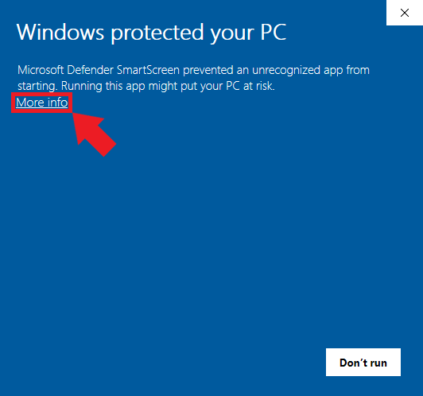
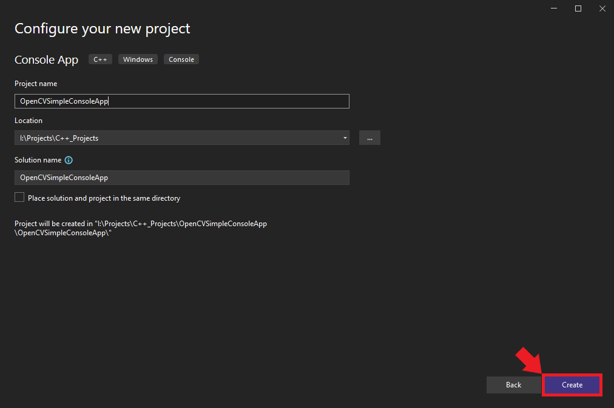
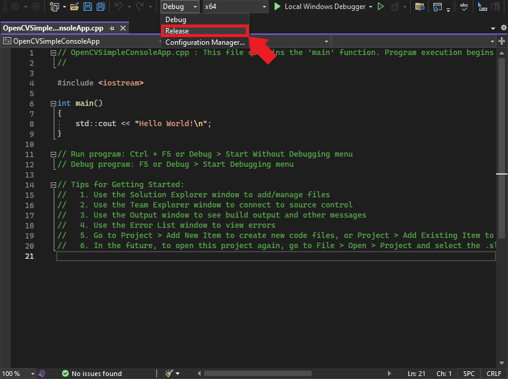
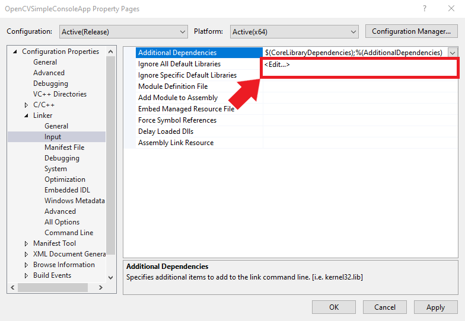
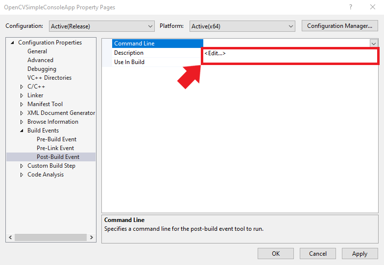
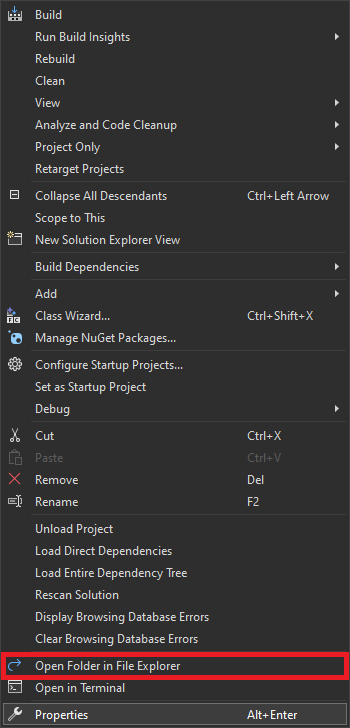
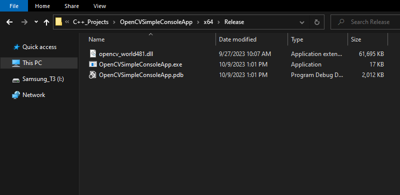
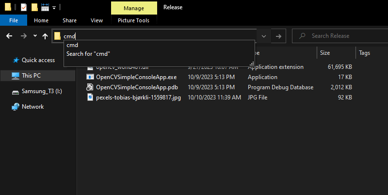
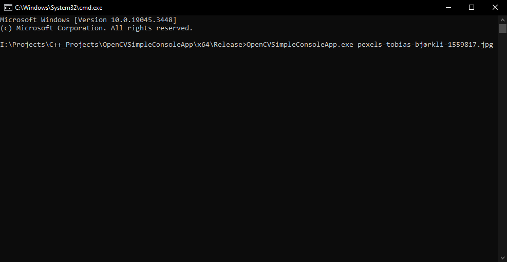

* [Introduction](#introduction)
* [Obtaining OpenCV: GitHub Download](#obtaining-opencv-github-download)
* [Creating a Console App Project](#creating-a-console-app-project)
* [Configuring for Release Build in Visual Studio](#configuring-for-release-build-in-visual-studio)
* [Setting Up Include Directories](#setting-up-include-directories)
* [Integrating Linker Dependencies](#integrating-linker-dependencies)
* [Defining Post-Build Events](#defining-post-build-events)
* [Incorporating OpenCV in Our C++ Code](#incorporating-opencv-in-our-c-code)
* [Building and Running the Project](#building-and-running-the-project)
* [Conclusion](#conclusion)


## Introduction

In this beginner-friendly tutorial, I'll walk you through integrating [OpenCV](https://opencv.org/) with your Visual Studio C++ projects on Windows. OpenCV (Open Source Computer Vision Library) is one of the most popular and mature libraries for computer vision. It provides tools and functionality to process and analyze images, videos, and more, which are invaluable for many applications, from facial recognition to augmented reality.

I'll guide you step-by-step, from downloading the latest OpenCV release from GitHub to embedding it within a Visual Studio C++ project. As a practical demonstration, we'll create a straightforward application that loads an image file and showcases it in a new window. By the end of this guide, you'll know how to integrate OpenCV into other Visual Studio C++ projects.


::: {.callout-important}
This post assumes [Visual Studio](https://visualstudio.microsoft.com/downloads/) is present on your system and has the `Desktop Development with C++` workload installed.
:::


## Obtaining OpenCV: GitHub Download

In this section, we'll download OpenCV from its official GitHub repository and extract it for use in our Visual Studio project.

### OpenCV GitHub Download

At the time of writing, the latest version of OpenCV was 4.8.1, which is available at the link below:

- [OpenCV 4.8.1](https://github.com/opencv/opencv/releases/tag/4.8.1)

On the release page, click `opencv-4.8.1-windows.exe` in the Assets list to download the executable.


{fig-align="center"}


Run the executable once it finishes downloading. 


### Windows Defender SmartScreen Warning

You might get a warning from Windows that the executable is an unrecognized app. We can bypass this by clicking the `More info` text, then the `Run anyway` button.

{fig-align="center"}


{fig-align="center"}


### Select Extraction Location

After bypassing the security warning, the executable will prompt us to select a location to extract the opencv folder. We must give Visual Studio this location to access OpenCV's functionality. I tend to place my C++ dependencies in a dedicated folder for consistency.

{fig-align="center"}


### Verify the Extraction

Once the extraction is complete, navigate to the chosen directory to ensure the OpenCV files are present and organized correctly. Inside the opencv folder, we can see a build and a source folder. Everything we need is in the build folder.


{fig-align="center"}


You've successfully downloaded and extracted OpenCV from GitHub. Now, we can integrate this library into a Visual Studio project.


## Creating a Console App Project

In this section, we'll create a simple C++ Console Application project.


### Launching Visual Studio

Begin by opening Visual Studio. On the welcome screen, locate the `Get started` section and choose `Create a new project`.


{fig-align="center"}


### Selecting the Project Type

We'll use the C++ `Console App` template for our project. Select the template from the list and click `Next` to proceed.


{fig-align="center"}


### Naming and Locating Your Project

Choose an appropriate name and location for the project and click the `Create` button. By default, the executable file will use the project name.


{fig-align="center"}


## Configuring for Release Build in Visual Studio

Once the project opens in Visual Studio, we must configure it for Release build. At the top of the window, open the Solution Configurations dropdown menu and select `Release`.

{fig-align="center"}


## Setting Up Include Directories

For our Visual Studio project to leverage OpenCV, it must be aware of the OpenCV library locations. By setting up include directories, we inform Visual Studio of OpenCV's whereabouts, allowing us to access its API.


### Navigating to the Project Properties

Right-click the project name in the Solution Explorer panel.

{fig-align="center"}


Then, select the `Properties` option in the popup menu.

{fig-align="center"}


### Accessing the Include Directories

In the Properties Window, open on the `C/C++` dropdown. Select the `Additional Include Directories` section and click `<Edit..>` in the dropdown.


{fig-align="center"}


### Incorporating OpenCV Path

Add the path for the following folder, replacing `<parent-folder-path>` with the full path to the parent folder for the OpenCV library, and click OK.

- `<parent-folder-path>\opencv\build\include`

{fig-align="center"}


With this setup, Visual Studio now knows where to find OpenCV.


## Integrating Linker Dependencies

Now that we've directed Visual Studio to the OpenCV includes, we must specify the necessary linker dependencies. These dependencies ensure the compiler knows which library files to consider during the build process.


### Navigating to Linker Dependencies

Open the Linker dropdown in the Properties window and select Input. Select Additional Dependencies and click `<Edit..>`.


{fig-align="center"}


### Specifying the OpenCV Library Path

Add the following path, replacing `<parent-folder-path>` with the full path to the parent folder for the OpenCV library, and click `OK`.

- `<parent-folder-path>\opencv\build\x64\vc16\lib\*.lib`


::: {.callout-warning}
The path to the `.lib` files can change between OpenCV versions. Verify the library path for the specific OpenCV version you are using.
:::


{fig-align="center"}


With this configuration in place, Visual Studio has all the necessary references to incorporate OpenCV functionality into our project.


## Defining Post-Build Events

Post-build events are crucial for automating specific tasks that should occur right after a successful build. In our case, we must ensure that the necessary DLL files from OpenCV get copied to the project's build directory. Setting this up will save you the manual effort of copy-pasting files after every build.

### Identifying the Necessary DLL

Our executable file will depend on the following DLL file included with OpenCV.

* `opencv_world481.dll`

{fig-align="center"}


::: {.callout-warning}
The name and path of the `.dll` file can change between OpenCV versions. Verify the DLL file path for the specific OpenCV version you are using.
:::


### Setting up Post-Build Events

We can add a post-build event in Visual Studio to automatically copy these DLL files to the build folder for the project at compile time. Open the Build Events dropdown in the Properties window and select Post-Build Event. Select Command Line and click `<Edit..>`.


{fig-align="center"}


### Inputting the Xcopy Command

Add the following command, replacing `<parent-folder-path>` with the full path to the parent folder for the OpenCV library, and click OK.

- ```text
  xcopy <parent-folder-path>\opencv\build\x64\vc16\bin\opencv_world481.dll $(SolutionDir)$(Platform)\$(Configuration)\ /c /y
  ```


This command tells Visual Studio to copy the OpenCV DLL into the appropriate build directory of your project.

{fig-align="center"}


### Saving Project Configurations

To finalize all the changes we've made, click on the Apply button. With that done, you can safely close out of the Properties window.

{fig-align="center"}


## Incorporating OpenCV in Our C++ Code

Now that our Visual Studio project can access OpenCV, it's time to dive into the code. In this section, we'll write a simple C++ program that leverages OpenCV to read an image file and display it in a window.

### Include OpenCV Headers
Remove the default headers in the C++ file and add the OpenCV header:

```c++
#include <opencv2/opencv.hpp>
```


### Basic Program Structure
Our `main` function begins by checking if the user provided an image path as an argument:

```c++
if (argc < 2) // Check if an argument is provided
{
    std::cerr << "Usage: " << argv[0] << " <path_to_image>" << std::endl;
    return -1;
}
```


### Loading the Image
We load the image from the provided path using the [`cv::imread`](https://docs.opencv.org/4.x/d4/da8/group__imgcodecs.html#ga288b8b3da0892bd651fce07b3bbd3a56) function:

```c++
// Read the image using the path provided as an argument
cv::Mat image = cv::imread(argv[1]);
```

It's essential to verify whether the image loaded successfully:

```c++
if (image.empty()) // Check if the image was loaded successfully
{
    std::cerr << "Error: Could not open or find the image!" << std::endl;
    return -1;
}
```


### Displaying the Image
Once our image is successfully loaded, we create a window and display the image using OpenCV functions. We use [`cv::namedWindow`](https://docs.opencv.org/4.x/d7/dfc/group__highgui.html#ga5afdf8410934fd099df85c75b2e0888b) to create a window with the given name and [`cv::imshow`](https://docs.opencv.org/4.x/d7/dfc/group__highgui.html#ga453d42fe4cb60e5723281a89973ee563) to display our image in that window:

```c++
cv::namedWindow("OpenCV Test", cv::WINDOW_AUTOSIZE);
cv::imshow("OpenCV Test", image);
```


### Await User Interaction
Finally, we use the [`cv::waitKey(0)`](https://docs.opencv.org/4.x/d7/dfc/group__highgui.html#gafa15c0501e0ddd90918f17aa071d3dd0) function to pause the program and wait indefinitely for the user to press a key. That ensures our image window remains open until we choose to close it:

```c++
cv::waitKey(0);
```


### Complete Code

```c++
#include <opencv2/opencv.hpp>

int main(int argc, char** argv)
{
    if (argc < 2) // Check if an argument is provided
    {
        std::cerr << "Usage: " << argv[0] << " <path_to_image>" << std::endl;
        return -1;
    }

    // Read the image using the path provided as an argument
    cv::Mat image = cv::imread(argv[1]);

    if (image.empty()) // Check if the image was loaded successfully
    {
        std::cerr << "Error: Could not open or find the image!" << std::endl;
        return -1;
    }

    // Display the image in a window named "OpenCV Test"
    cv::namedWindow("OpenCV Test", cv::WINDOW_AUTOSIZE);
    cv::imshow("OpenCV Test", image);

    // Wait for a key press indefinitely
    cv::waitKey(0);

    return 0;
}
```


## Building and Running the Project

Having integrated OpenCV into our code, we are ready to build and test our project. Follow the steps below to compile, run, and validate the Visual Studio C++ project.


### Compiling the Code

Open the Build menu at the top of the Visual Studio window and click `Build Solution`. This action will compile the project and generate the necessary output files in the project directory. Visual Studio will create a new `x64` folder in the project directory containing the executable file and the DLL file it depends on.

{fig-align="center"}


### Accessing the Build Output

To locate the compiled application, right-click the project name in the Solution Explorer panel and select Open Folder in File Explorer from the popup menu.

{fig-align="center"}


In the new File Explorer window, go to the parent folder and open the x64 → Release subfolder.

{fig-align="center"}


### Preparing an Image

Next, we'll need an image to test the application. I'll use this photo of the polar nights from Pexels, a free stock photo site.

- [Colorful polar lights over snowy mountain by Tobias Bjørkli](https://www.pexels.com/photo/colorful-polar-lights-over-snowy-mountain-1559817/)


{fig-align="center"}


### Running the Application

Now, we can open a command prompt and run the application. Select the address bar in the File Explorer window.


{fig-align="center"}


Type `cmd` into the text box and press Enter.


{fig-align="center"}


With the command prompt opened in the correct directory, run the application by typing its name followed by the image's path:


```bash
OpenCVSimpleConsoleApp.exe pexels-tobias-bjørkli-1559817.jpg
```


{fig-align="center"}


### Viewing the Result

After executing the command, the selected image should materialize in a new window, validating that the program runs as intended and that the OpenCV integration was successful.

{fig-align="center"}

Congratulations! You've successfully set up, built, and run a C++ project in Visual Studio integrated with OpenCV.


## Conclusion

In this tutorial, we've walked through the process of integrating OpenCV with a Visual Studio C++ project, from obtaining the library to displaying an image using the OpenCV API. This foundational knowledge will be instrumental as you delve deeper into computer vision projects leveraging OpenCV's capabilities. With your new skills, a plethora of advanced applications await exploration.






