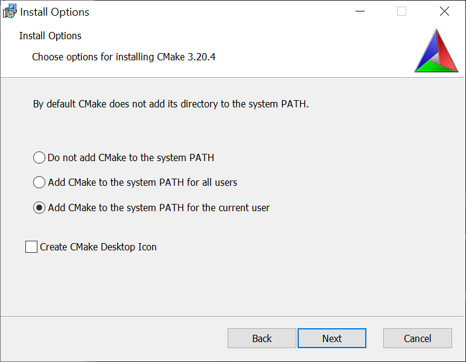
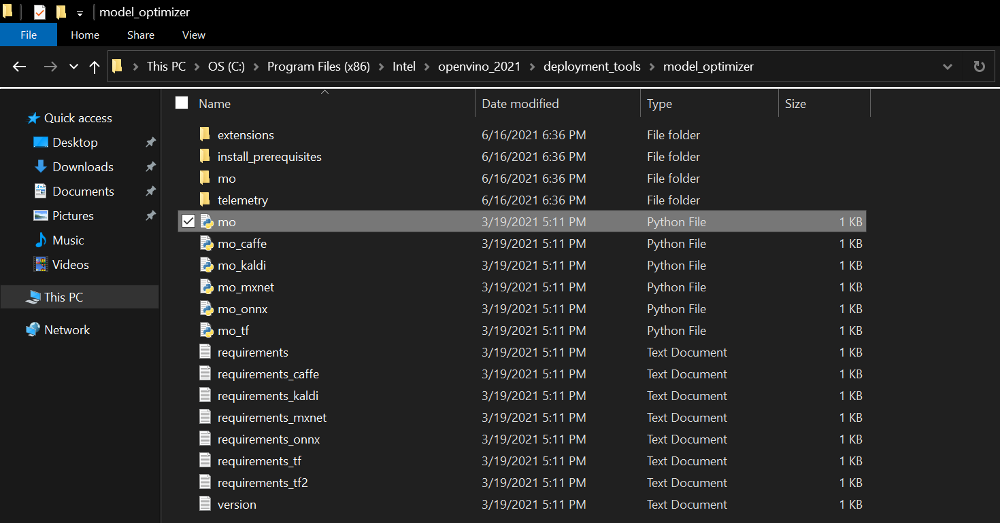
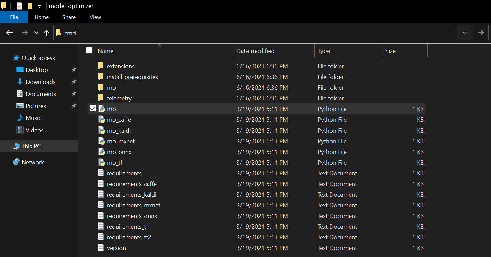

* [Overview](#overview)
* [Prerequisites](#prerequisites)
* [Convert ONNX Model to OpenVINO IR](#convert-onnx-model-to-openvino-ir)
* [Conclusion](#conclusion)


## Overview

In this tutorial series, we will cover how to create a [plugin](https://docs.unity3d.com/Manual/NativePlugins.html) that leverages the [OpenVINO™ Toolkit](https://docs.openvinotoolkit.org/latest/index.html) for the [Unity](https://unity.com/products/unity-platform) game engine. We will first create a [Dynamic link library (DLL)](https://docs.microsoft.com/en-us/troubleshoot/windows-client/deployment/dynamic-link-library) in Visual Studio to perform [inference](https://www.intel.com/content/www/us/en/artificial-intelligence/posts/deep-learning-training-and-inference.html) with a pretrained deep learning model. We will then demonstrate how to access this DLL inside a Unity application.

We will be using a computationally demanding [style transfer](https://github.com/pytorch/examples/tree/master/fast_neural_style#models) model to demonstrate the potential performance benefits from using the OpenVINO inference engine. The model takes in a single RGB image as input and has been trained to generate a stylized version of the image based on a specific style image. The steps for training this type of model are covered in an [earlier tutorial](https://software.intel.com/content/www/us/en/develop/articles/in-game-style-transfer-tutorial-leveraging-unity.html/).

In this first part, we will ensure the prerequisite software is installed on our system and convert a pretrained model from [ONNX](https://onnx.ai/) format to the OpenVINO [Intermediate Representation](https://docs.openvinotoolkit.org/latest/openvino_docs_MO_DG_IR_and_opsets.html) format.

<iframe width=100% height="480" src="https://www.youtube.com/embed/uSmczpnPam8" title="YouTube video player" frameborder="0" allow="accelerometer; autoplay; clipboard-write; encrypted-media; gyroscope; picture-in-picture" allowfullscreen></iframe>


## Prerequisites

The following prerequisites are required to complete this tutorial.

### Experience

This tutorial does not assume any prior experience with the OpenVINO™ Toolkit or Unity. However, some basic experience with Unity would be beneficial.

### System Requirements

The target platform for this project is Windows 10 64-bit. The OpenVINO™ Toolkit does not appear to support 32-bit versions. Given that the OpenVINO™ Toolkit is designed for Intel hardware, an Intel CPU and/or GPU is highly recommended.

### Unity

The first prerequisite we will want to set up is Unity. If you don't already have Unity installed, you can download Unity Hub from the link below.

* Unity Hub: ([download](https://store.unity.com/download?ref=personal))

Once Unity Hub is set up, you can install Unity 2020.3.12f1 (LTS) from the link below. 

* Unity Download Archive: ([download](https://unity3d.com/get-unity/download/archive))
* Download Unity 2020.3.12f1 (LTS): ([download](unityhub://2020.3.12f1/b3b2c6512326))

**Note:** The installation process will also install Visual Studio, one of the other prerequisites.

If you have never used Unity before, you can become acquainted with the basics by following the tutorial below. It will walk you through the installation process all the way to making an Angry Birds clone.

* [How to Make a Game - Unity Beginner Tutorial](https://www.youtube.com/watch?v=Lu76c85LhGY)


### Visual Studio

Visual Studio will be installed during the installation process for Unity. However it can also be downloaded directly from the link below.

* Visual Studio Community 2019: ([download](https://software.intel.com/content/www/us/en/develop/articles/in-game-style-transfer-tutorial-leveraging-unity.html/))


### Visual C++ Redistributables

The Visual C++ Redistributables should be installed along with Visual Studio. However, you can also download them from the link below.

* Latest C++ Redistributables: ([link](https://support.microsoft.com/en-us/topic/the-latest-supported-visual-c-downloads-2647da03-1eea-4433-9aff-95f26a218cc0))

### CMake

CMake is listed as a requirement for the OpenVINO™ Toolkit. However, it will not be needed for this tutorial. The download link for the latest release of CMake 64-bit is still provided below.

* CMake: [link](https://cmake.org/download/)

**Note:** Make sure to select one of the `Add CMake to the system PATH` options during the installation process.

{fig-align="center"}


### Python

We will need Python 3.6, 3.7, or 3.8 64-bit to convert the provided model from [ONNX format](https://onnx.ai/) to OpenVINO's [intermediate representation](https://docs.openvinotoolkit.org/latest/openvino_docs_MO_DG_IR_and_opsets.html).  We can install Python 3.8 from the Windows Store. This method automatically sets up the Python installation to be accessible from the command line. 

* Windows Store Python 3.8: ([link](https://www.microsoft.com/en-us/p/python-38/9mssztt1n39l?activetab=pivot:overviewtab))

### OpenVINO

We now have all the required prerequisites to install OpenVINO. We'll be using OpenVINO 2021.3 for this tutorial. You will need to fill out a registration form to download the toolkit.

* [Registration Link](https://software.seek.intel.com/openvino-toolkit)

* [Download Link](https://registrationcenter.intel.com/en/products/postregistration/?sn=C5RC-BZX263HW&Sequence=632852&encema=Wg/bUFJY2qspv9ef8QA1f1BOLNxZ1m3iLsVPacdcuTnDhAsIxOgbt1LgCVHooFk3zSUt/6VQWTA=&dnld=t&pass=yes)


## Convert ONNX Model to OpenVINO IR

Before we write any code, we need to convert the trained model to OpenVINO's [Intermediate Representation](https://docs.openvinotoolkit.org/latest/openvino_docs_MO_DG_IR_and_opsets.html) format. We will use the style transfer model from this [tutorial series](https://software.intel.com/content/www/us/en/develop/articles/in-game-style-transfer-tutorial-leveraging-unity.html/) as an example.

* [Mesh Shader Style Transfer Model](https://drive.google.com/file/d/1kFEwKJ_4FBohj937U_CtnGFo8in7oomq/view?usp=sharing)
* [Other models](https://drive.google.com/drive/folders/1C7eIf-oUgXLd2PXUkBflTSXE2g6StEEm?usp=sharing)

Open the File Explorer and Navigate to `C:\Program Files (x86)\Intel\openvino_2021\deployment_tools\model_optimizer`

{fig-align="center"}

Type `cmd` into the address bar and press `Enter` to open a command line prompt.

{fig-align="center"}

The `mo.py` script requires a few additional python packages. You can install them via [pip](https://pypi.org/project/pip/) with the following commands.

* [NumPy](https://numpy.org/): `pip install numpy`

* [defusedxml](https://github.com/tiran/defusedxml): `pip install defusedxml`

* [NetworkX](https://networkx.org/): `pip install networkx`

* [ONNX](https://github.com/onnx/onnx): `pip install onnx`

Once those are installed, we'll run the `mo.py` script with the following parameters.

`python mo.py --input_model <path-to-ONNX-model>  --model_name <openvino-model-name> --output_dir <path-to-save-openvino-model> --data_type FP16`

**Note:** [FP16](https://en.wikipedia.org/wiki/Half-precision_floating-point_format) or half precision is recommended for GPU inference. It reduces the size of the model and can increase inference speed.

Here is an example where `User_Name` would be replaced with the current Windows username.

`python mo.py --input_model C:\Users\User_Name\Downloads\final.onnx  --model_name mesh-shader_fp16 --output_dir C:\Users\User_Name\Downloads\ --data_type FP16`

We can also specify the input resolution with the `--input_shape [N,C,H,W]` parameter. For example, we could specify an input resolution of `960 x 540` with  `--input_shape [1,3,540,960]`. However, this is not required as we will be updating the input resolution from the Unity application at runtime.

The script will generate three files:

* [mesh-shader_fp16.bin](https://drive.google.com/file/d/1XsG198LkAwvm5UYGfhJHKMMNfyL_FoRT/view?usp=sharing)
* [mesh-shader_fp16.mapping](https://drive.google.com/file/d/1P1jaom-gBWkntiPvYe25nY4HIeXmSa_8/view?usp=sharing)
* [mesh-shader_fp16.xml](https://drive.google.com/file/d/1qkTaJa05HcgykLCEid31afCDUrZBkmhQ/view?usp=sharing)

We will need the `.bin` and `.xml` files. The `.xml` file describes the network topology, including the layer operations and flow of data through the network. Here is a snippet from the top of the generated `.xml` file.

```xml
<?xml version="1.0" ?>
<net name="mesh-shader_fp16" version="10">
	<layers>
		<layer id="0" name="input.1" type="Parameter" version="opset1">
			<data shape="1,3,960,540" element_type="f16"/>
			<output>
				<port id="0" precision="FP16" names="input.1">
					<dim>1</dim>
					<dim>3</dim>
					<dim>960</dim>
					<dim>540</dim>
				</port>
			</output>
		</layer>
		<layer id="1" name="Pad_0/Cast_111275_const" type="Const" version="opset1">
			<data offset="0" size="32" shape="4" element_type="i64"/>
			<output>
				<port id="0" precision="I64">
					<dim>4</dim>
				</port>
			</output>
		</layer>
```

The `.bin` file stores the constant values for the model learned during the training process.

* [Other models](https://drive.google.com/drive/folders/1RKN5DESNeZhOoENDKa7K_uqZ2u_Rbu0S?usp=sharing)


## Conclusion

That takes care of the required setup. In the next part, we will cover how to create a [Dynamic link library (DLL)](https://docs.microsoft.com/en-us/troubleshoot/windows-client/deployment/dynamic-link-library) in Visual Studio to perform [inference](https://www.intel.com/content/www/us/en/artificial-intelligence/posts/deep-learning-training-and-inference.html) with the OpenVINO IR model.

**Project Resources:**

[GitHub Repository](https://github.com/cj-mills/Unity-OpenVINO-Plugin)


### Next: [Part 2](../part-2/)



