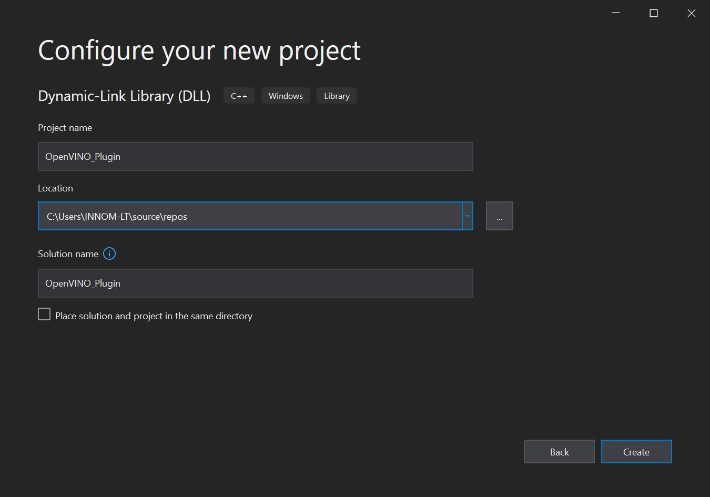
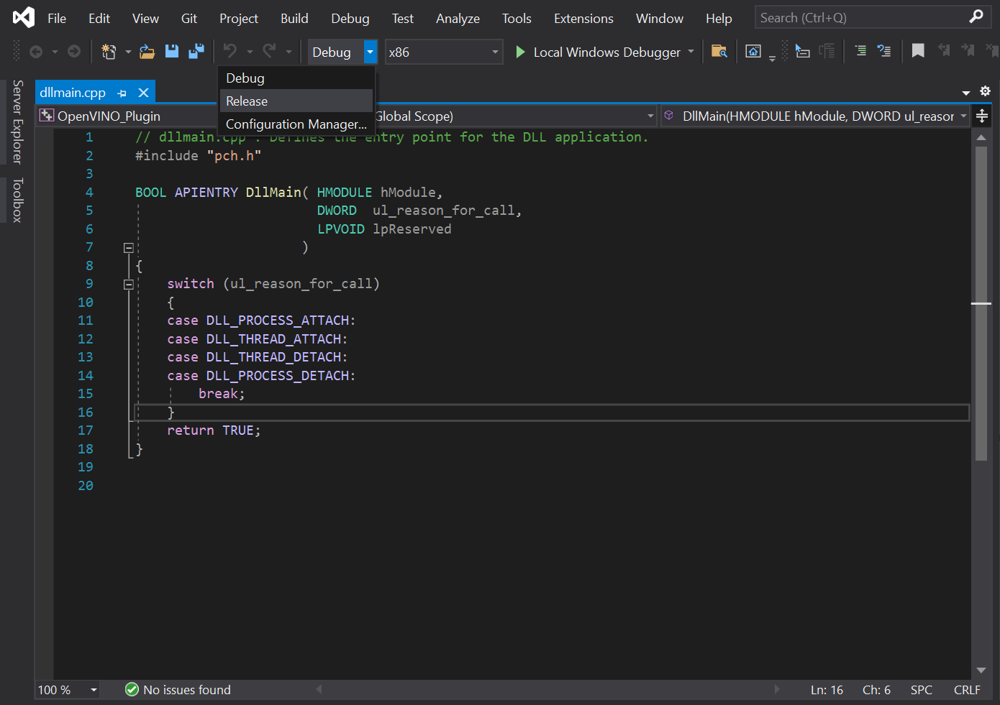
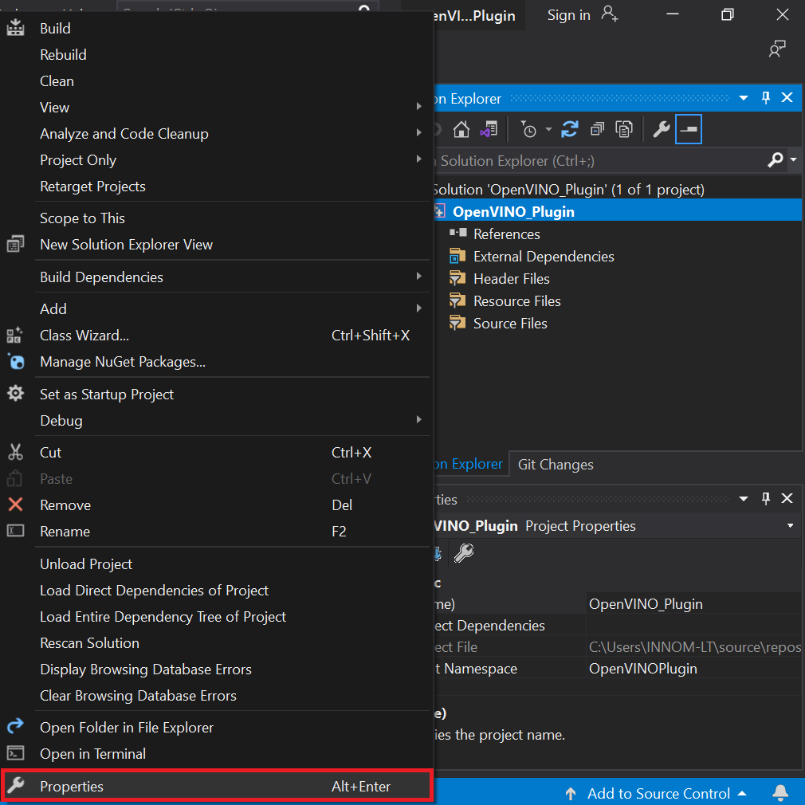
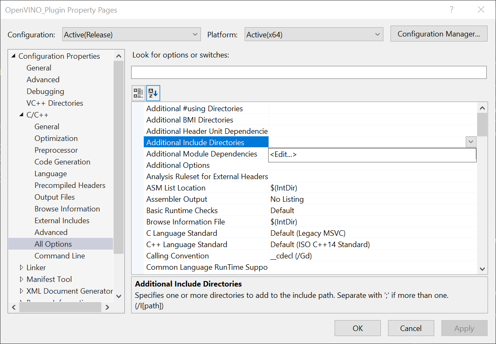
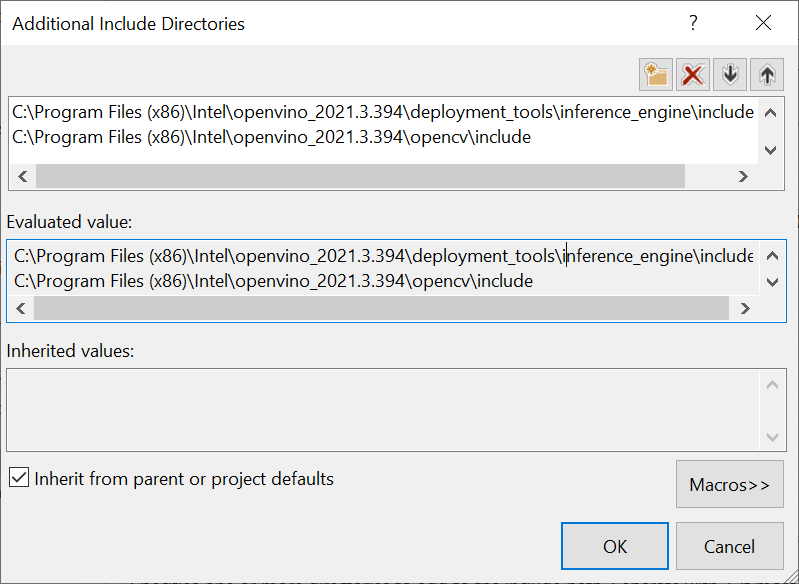
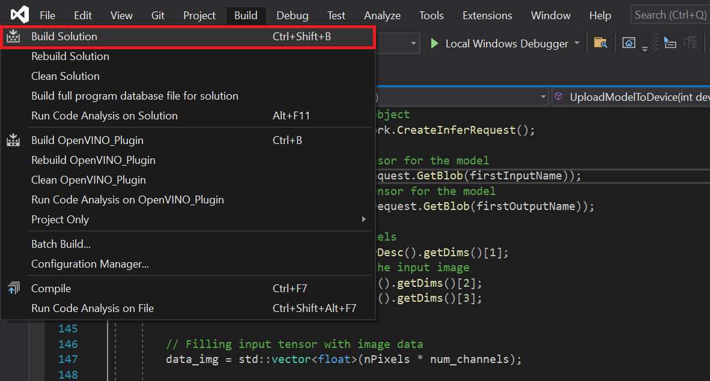

### Previous: [Part 1](../part-1/)

* [Overview](#overview)
* [Create a New Visual Studio Project](#create-a-new-visual-studio-project)
* [Configure Project](#configure-project)
* [Add Include Directories](#add-include-directories)
* [Link Libraries](#link-libraries)
* [Clear Default Code](#clear-default-code)
* [Update Precompiled Header File](#update-precompiled-header-file)
* [Update `dllmain`](#update-dllmain)
* [Build Solution](#build-solution)
* [Gather Dependencies](#gather-dependencies)
* [Conclusion](#conclusion)


## Overview

In [Part 1](../part-1/) of the tutorial, we first installed Unity, OpenVINO, and its prerequisite software. We then demonstrated how to use the python conversion script included with the OpenVINO™ Toolkit to convert a pretrained model from [ONNX](https://onnx.ai/) format to the OpenVINO [Intermediate Representation](https://docs.openvinotoolkit.org/latest/openvino_docs_MO_DG_IR_and_opsets.html) format.

In this part, we will walk through the steps needed to create a [Dynamic link library (DLL)](https://docs.microsoft.com/en-us/troubleshoot/windows-client/deployment/dynamic-link-library) in Visual Studio to perform [inference](https://www.intel.com/content/www/us/en/artificial-intelligence/posts/deep-learning-training-and-inference.html) with the pretrained deep learning model.

## Create a New Visual Studio Project

Open Visual Studio and select `Create a new project`.

{fig-align="center"}

Type `DLL` into the search bar. Select the `Dynamic-Link Library (DLL)` option and press `Next`. 

{fig-align="center"}

In the next window, we'll name the new project `OpenVINO_Plugin`. Take note of the `Location` the project will be saved to and click `Create`. The default location can be replaced, but we will need to access the project folder to get the generated DLL file.

{fig-align="center"}


## Configure Project

We need to update the default project configuration to access the OpenVINO™ Toolkit and build the project with it.

### Set Build Configuration and Platform

The OpenVINO™ Toolkit does not support `x86` builds. We will need to set the project to build for `x64`. At the top of the window, open the Solution Configurations dropdown menu, and select `Release`. 

{fig-align="center"}

Then, open the `Solution Platform` dropdown menu and select `x64`.

{fig-align="center"}


## Add Include Directories

Visual Studio needs to be told where the OpenVINO™ Toolkit is located, so we can access its APIs. In the Solution Explorer panel, right-click the project name.

{fig-align="center"}


Select `Properties` in the popup menu.

{fig-align="center"}


In the Properties Window, open the `C++` dropdown and click on `All Options`. Select the `Additional Include Directories` section and click on `<Edit..>` in the dropdown. 

{fig-align="center"}

We need to add the `include` directories for the OpenVINO inference engine and the [OpenCV](https://opencv.org/) libraries included with the OpenVINO™ Toolkit.

Add the following lines and then click `OK`. Feel free to open these folders in the File Explorer and see what exactly they provide access to.

* `C:\Program Files (x86)\Intel\openvino_2021.3.394\deployment_tools\inference_engine\include`

* `C:\Program Files (x86)\Intel\openvino_2021.3.394\opencv\include`

{fig-align="center"}


## Link Libraries

Next, open the Linker dropdown in the Properties window and select All Options. Scroll up to the top of the All Options section and select `Additional Dependencies`. 

{fig-align="center"}

Add the following lines for the OpenVINO and OpenCV libraries, then click `OK`. The `*` at the end tells Visual Studio to add all the `.lib` files contained in those folders. We do not technically need every single one, but this is more convenient than manually typing the specific file names.

* `C:\Program Files (x86)\Intel\openvino_2021.3.394\deployment_tools\inference_engine\lib\intel64\Release\*`
* `C:\Program Files (x86)\Intel\openvino_2021.3.394\opencv\lib\*`

{fig-align="center"}

Finally, click the `Apply` button and close the Properties window.

{fig-align="center"}


## Clear Default Code

Now, we can finally start coding. The default code for the dllmain.cpp file is as follows.

```c++
// dllmain.cpp : Defines the entry point for the DLL application.
#include "pch.h"

BOOL APIENTRY DllMain( HMODULE hModule,
                       DWORD  ul_reason_for_call,
                       LPVOID lpReserved
                     )
{
    switch (ul_reason_for_call)
    {
    case DLL_PROCESS_ATTACH:
    case DLL_THREAD_ATTACH:
    case DLL_THREAD_DETACH:
    case DLL_PROCESS_DETACH:
        break;
    }
    return TRUE;
}
```

We can delete everything below the `#include "pch.h"` line.

```c++
// dllmain.cpp : Defines the entry point for the DLL application.
#include "pch.h"
```


## Update Precompiled Header File

The `pch.h` file is a [Precompiled Header file](https://docs.microsoft.com/en-us/cpp/build/creating-precompiled-header-files?view=msvc-160) that is generated by Visual Studio. We can place any header files that won't be updated here and they will only be compiled once. This can reduce build times for larger projects. We can open the  `pch.h` file by selecting that line and pressing `F12`.

```c++
// pch.h: This is a precompiled header file.
// Files listed below are compiled only once, improving build performance for future builds.
// This also affects IntelliSense performance, including code completion and many code browsing features.
// However, files listed here are ALL re-compiled if any one of them is updated between builds.
// Do not add files here that you will be updating frequently as this negates the performance advantage.

#ifndef PCH_H
#define PCH_H

// add headers that you want to pre-compile here
#include "framework.h"


#endif //PCH_H
```

We'll add the required header files below `#include "framework.h"`. Each one can be explored by selecting that line and pressing `F12` as well.

```c++
// add headers that you want to pre-compile here
#include "framework.h"
// A header file that provides a set minimal required Inference Engine API.
#include <inference_engine.hpp>
// A header file that provides the API for the OpenCV modules.
#include <opencv2/opencv.hpp>
// Regular expressions standard header
#include <regex>
```


## Update `dllmain`

Back in the `dllmain.cpp` file, we'll add the `InferenceEngine` namespace and create a macro to mark functions we want to make accessible in Unity.

```c++
// dllmain.cpp : Defines the entry point for the DLL application.
#include "pch.h"

using namespace InferenceEngine;

// Create a macro to quickly mark a function for export
#define DLLExport __declspec (dllexport)
```

We need to wrap the code in `extern "C"` to prevent name-mangling issues with the compiler. 

```c++
// Create a macro to quickly mark a function for export
#define DLLExport __declspec (dllexport)

// Wrap code to prevent name-mangling issues
extern "C" {
    
}
```

### Declare Variables

Inside the wrapper, we'll declare the variables needed for the DLL. 

We need to keep track of the available compute devices for OpenVINO, so we can select them in Unity. Create an [`std::vector<std::string>`](https://www.cplusplus.com/reference/vector/vector/) variable named `availableDevices`.  This will store the names of supported devices found by OpenVINO on the system. We'll combine the list of available devices into a single [`std::string`](https://www.cplusplus.com/reference/string/string/) variable to send it to Unity.

Next, create a [`cv::Mat`](https://docs.opencv.org/3.4/d3/d63/classcv_1_1Mat.html) to store the input image data from Unity. 

To use the OpenVINO inference engine, we first need to create a [`Core`](https://docs.openvinotoolkit.org/latest/classInferenceEngine_1_1Core.html) instance called `ie`. We'll use this variable to read the model file, get the available compute devices, change configuration settings, and load the model onto the target compute device.

We'll store the information from the `.xml` and `.bin` file in a [`CNNNetwork`](https://docs.openvinotoolkit.org/latest/classInferenceEngine_1_1CNNNetwork.html) variable called `network`.

We need to create an executable version of the `network` before we can perform inference. Create an `ExecutableNetwork` variable called executable_network.

After that, we will create an [`InferRequest`](https://docs.openvinotoolkit.org/latest/ie_c_api/group__InferRequest.html) variable called `infer_request`. We'll use this variable to initiate inference for the model.

Once we create the inference request, we will need write access to the input [tensor](https://docs.openvinotoolkit.org/latest/classInferenceEngine_1_1TensorDesc.html) for the model and read access to the output tensor for the model. This is how we will update the input and read the output when performing inference. Create a [`MemoryBlob::Ptr`](https://docs.openvinotoolkit.org/2021.3/classInferenceEngine_1_1MemoryBlob.html#public_types) variable  called `minput` and a [`MemoryBlob::CPtr`](https://docs.openvinotoolkit.org/2021.3/classInferenceEngine_1_1MemoryBlob.html#public_types) variable called `moutput`.

Since the input and output dimensions are the same, we can use the same size variables when iterating through the input and output data. Create two [`size_t`](https://en.cppreference.com/w/c/types/size_t) variables to store the number of color channels and number of pixels for the input image.

Lastly, we will create an `std::vector<float>` called `data_img` that will be used for processing the raw model output.

#### Code :

```c++
// Wrap code to prevent name-mangling issues
extern "C" {
    // List of available compute devices
    std::vector<std::string> availableDevices;
    // An unparsed list of available compute devices
    std::string allDevices = "";
    // The name of the input layer of Neural Network "input.1"
    std::string firstInputName;
    // The name of the output layer of Neural Network "140"
    std::string firstOutputName;

    // Stores the pixel data for model input image and output image
    cv::Mat texture;

    // Inference engine instance
    Core ie;
    // Contains all the information about the Neural Network topology and related constant values for the model
    CNNNetwork network;
    // Provides an interface for an executable network on the compute device
    ExecutableNetwork executable_network;
    // Provides an interface for an asynchronous inference request
    InferRequest infer_request;
    
    // A pointer to the input tensor for the model
    MemoryBlob::Ptr minput;
    // A pointer to the output tensor for the model
    MemoryBlob::CPtr moutput;

    // The number of color channels 
    size_t num_channels;
    // The number of pixels in the input image
    size_t nPixels;

    // A vector for processing the raw model output
    std::vector<float> data_img;
}
```


### Create `GetAvailableDevices()` Function

We'll create a function that returns the available OpenVINO compute devices so that we can view and select them in Unity. This function simply combines the list of available devices into a single, comma separated string that will be parsed in Unity. We need to add the `DLLExport` macro since we'll be calling this function from Unity.

#### Code :

```c++
// Returns an unparsed list of available compute devices
DLLExport const std::string* GetAvailableDevices() {
    // Add all available compute devices to a single string
    for (auto&& device : availableDevices) {
        allDevices += device;
        allDevices += ((device == availableDevices[availableDevices.size() - 1]) ? "" : ",");
    }
    return &allDevices;
}
```


### Create `SetDeviceCache()` Function

It can take over 20 seconds to upload the OpenVINO model to a GPU. This is because OpenCL kernels are being compiled for the specific model and GPU at runtime. There isn't much we can do about this the first time a model is loaded to the GPU. However, we can eliminate this load time in future uses by storing cache files for the model. The cache files are specific to each GPU. Additional cache files will also be created when using a new input resolution for a model. We do not need to add the `DLLExport` macro as this function will only be called by other functions in the DLL.

We'll use a [regular expression](https://www.cplusplus.com/reference/regex/) to confirm a compute device is a GPU before attempting to set a cache directory for it.

We can specify the [directory](https://docs.openvinotoolkit.org/latest/namespaceInferenceEngine_1_1PluginConfigParams.html#ab02b7b3b01439a8bc9570f34f9fd5e91) to store cache files for each available GPU using the [`ie.SetConfig()`](https://docs.openvinotoolkit.org/latest/classInferenceEngine_1_1Core.html#a34aa9ac6fb237b634d5bf08b288e88d4) method. 
We'll just name the directory, `cache`.

By default, the cache directory will be created in the same folder as the executable file that will be generated from the Unity project.

#### Code :

```c++
// Configure the cache directory for GPU compute devices
void SetDeviceCache() {
    std::regex e("(GPU)(.*)");
    // Iterate through the available compute devices
    for (auto&& device : availableDevices) {
        // Only configure the cache directory for GPUs
        if (std::regex_match(device, e)) {
            ie.SetConfig({ {CONFIG_KEY(CACHE_DIR), "cache"} }, device);
        }
    }
}
```


### Create `PrepareBlobs()` Function

The next function will get the names of the input and output layers for the model and set the precision for them. We can access information about the input and output layers with [`network.getInputsInfo()`](https://docs.openvinotoolkit.org/latest/classInferenceEngine_1_1CNNNetwork.html#a76de2a6101fe8276f56b0dc0f99c7ff7) and [`network.getOutputsInfo()`](https://docs.openvinotoolkit.org/latest/classInferenceEngine_1_1CNNNetwork.html#af8a6200f549b15a895e2cfefd304a9c2) respectively. 

The model only has one input and output, so we can access them directly with `.begin()` rather than using a for loop. There are two values stored for each layer. The first contains the name of the layer and the second provides access to `get` and `set` [methods](https://docs.openvinotoolkit.org/latest/classInferenceEngine_1_1InputInfo.html#public_member_functions) for the layer.

#### Code :

```c++
// Get the names of the input and output layers and set the precision
DLLExport void PrepareBlobs() {
    // Get information about the network input
    InputsDataMap inputInfo(network.getInputsInfo());
    // Get the name of the input layer
    firstInputName = inputInfo.begin()->first;
    // Set the input precision
    inputInfo.begin()->second->setPrecision(Precision::U8);

    // Get information about the network output
    OutputsDataMap outputInfo(network.getOutputsInfo());
    // Get the name of the output layer
    firstOutputName = outputInfo.begin()->first;
    // Set the output precision
    outputInfo.begin()->second->setPrecision(Precision::FP32);
}
```


### Create `InitializeOpenVINO()` Function

This is where we will make the preparations for performing inference and will be the first function called from the plugin in Unity. The function will take in a path to an OpenVINO model and read in the network information. We'll then set the batch size for the network using [`network.setBatchSize()`](https://docs.openvinotoolkit.org/latest/classInferenceEngine_1_1ICNNNetwork.html#ac29fc798d8a318f380624bd350b28501) and call the [`PrepareBlobs()`](#create-prepareblobs-function) function. 

We can initialize our list of available devices by calling [`ie.GetAvailableDevices()`](https://docs.openvinotoolkit.org/latest/classInferenceEngine_1_1Core.html#acb212aa879e1234f51b845d2befae41c). Any available GPUs will be stored last, so we'll want to reverse the list. The first GPU found (typically integrated graphics) would be named `GPU.0`. The second would be named `GPU.1` and so on.

Lastly, we will call the [`SetDeviceCache()`](#create-setdevicecache-function) function now that we know what devices are available.

#### Code :

```c++
// Set up OpenVINO inference engine
DLLExport void InitializeOpenVINO(char* modelPath) {
    // Read network file
    network = ie.ReadNetwork(modelPath);
    // Set batch size to one image
    network.setBatchSize(1);
    // Get the output name and set the output precision
    PrepareBlobs();
    // Get a list of the available compute devices
    availableDevices = ie.GetAvailableDevices();
    // Reverse the order of the list
    std::reverse(availableDevices.begin(), availableDevices.end());
    // Specify the cache directory for GPU inference
    SetDeviceCache();
}
```


### Create `SetInputDims()` Function

Next, we'll make a function to update the input resolution for the model from Unity. The function will take in a width and height value. The output resolution (i.e. the amount of values the model needs to predict) is determined by the input resolution. As a result, the input resolution has a significant impact on both inference speed and output quality.

OpenVINO provides the [`InferenceEngine::CNNNetwork::reshape`](https://docs.openvinotoolkit.org/latest/classInferenceEngine_1_1ICNNNetwork.html#abcfd19bd3e69cbf69ed77285f748b1cf) method to update the input dimensions at runtime. This method also propagates the changes down to the outputs. 

To use it, we first need to create an [`InferenceEngine::SizeVector`](https://docs.openvinotoolkit.org/latest/namespaceInferenceEngine.html#a9400de686d3d0f48c30cd73d40e48576) variable and assign the new dimensions. We can then pass the `SizeVector` as  input to `network.reshape()`.

We'll also want to initialize the dimensions of the `texture` variable with the provided width and height values.

#### Code :

```c++
// Manually set the input resolution for the model
DLLExport void SetInputDims(int width, int height) {

    // Collect the map of input names and shapes from IR
    auto input_shapes = network.getInputShapes();

    // Set new input shapes
    std::string input_name;
    InferenceEngine::SizeVector input_shape;
    // create a tuple for accessing the input dimensions
    std::tie(input_name, input_shape) = *input_shapes.begin();
    // set batch size to the first input dimension
    input_shape[0] = 1;
    // changes input height to the image one
    input_shape[2] = height;
    // changes input width to the image one
    input_shape[3] = width;
    input_shapes[input_name] = input_shape;

    // Call reshape
    // Perform shape inference with the new input dimensions
    network.reshape(input_shapes);
    // Initialize the texture variable with the new dimensions
    texture = cv::Mat(height, width, CV_8UC4);
}
```


### Create `UploadModelToDevice()` Function

In this function, we will create an executable version of the network and create an inference request for it. This function will take as input an index for the `availableDevices` variable. This will allow us to specify and switch between compute devices in the Unity project at runtime. 

Once we have the inference request, we can get pointers to the input and output tensors using the [`.GetBlob()`](https://docs.openvinotoolkit.org/latest/classInferenceEngine_1_1InferRequest.html#a9601a4cda3f309181af34feedf1b914c) method. We need to cast each [`Blob`](https://docs.openvinotoolkit.org/latest/classInferenceEngine_1_1Blob.html) as a [`MemoryBlob`](https://docs.openvinotoolkit.org/latest/classInferenceEngine_1_1MemoryBlob.html). The dimensions of the input tensor can be accessed using the [`minput->getTensorDesc().getDims()`](https://docs.openvinotoolkit.org/latest/classInferenceEngine_1_1TensorDesc.html#aba4c616b6e9ba449da351066dbbf67f6) method.

We will return the name of the device the model will be executed on back to Unity.

#### Code :

```c++
// Create an executable network for the target compute device
DLLExport std::string* UploadModelToDevice(int deviceNum) {

    // Create executable network
    executable_network = ie.LoadNetwork(network, availableDevices[deviceNum]);
    // Create an inference request object
    infer_request = executable_network.CreateInferRequest();
    
    // Get a pointer to the input tensor for the model
    minput = as<MemoryBlob>(infer_request.GetBlob(firstInputName));
    // Get a pointer to the ouptut tensor for the model
    moutput = as<MemoryBlob>(infer_request.GetBlob(firstOutputName));

    // Get the number of color channels 
    num_channels = minput->getTensorDesc().getDims()[1];
    // Get the number of pixels in the input image
    size_t H = minput->getTensorDesc().getDims()[2];
    size_t W = minput->getTensorDesc().getDims()[3];
    nPixels = W * H;

    // Filling input tensor with image data
    data_img = std::vector<float>(nPixels * num_channels);
    
    // Return the name of the current compute device
    return &availableDevices[deviceNum];;
}
```


### Create `PerformInference()` Function

The last function in our DLL will take a pointer to raw pixel data from a Unity Texture2D as input. It will then prepare the input for the model, execute the model on the target device, process the raw output, and copy the processed output back to the memory location for the raw pixel data from Unity. 

We first need to assign the `inputData` to the [`texture.data`](https://docs.opencv.org/3.4/d3/d63/classcv_1_1Mat.html#a4d33bed1c850265370d2af0ff02e1564). The `inputData` from Unity will have an `RGBA` color format. However, the model is expecting an `RGB` color format. We can use the [`cv::cvtColor()`](https://docs.opencv.org/4.5.2/d8/d01/group__imgproc__color__conversions.html#ga397ae87e1288a81d2363b61574eb8cab) method to convert the color format for the `texture` variable.

We can get write-only access to the input tensor for the model with [`minput->wmap()`](https://docs.openvinotoolkit.org/latest/classInferenceEngine_1_1MemoryBlob.html#ac5c6b1ecf54a69f98a06df6d05187a7f). 

The pixel values are stored in a different order in the OpenCV `Mat` compared to the input tensor for the model. The `Mat` stores the red, green, and blue color values for a given pixel next to each other. In contrast, the input tensor stores all the red values for the entire image next to each other, then the green values, then the blue. We need to take this into account when writing values from `texture` to the input tensor and when reading values from the output tensor.

Once we have updated the input tensor with the current `inputData`, we can execute the model with [`infer_request.Infer()`](https://docs.openvinotoolkit.org/latest/classInferenceEngine_1_1InferRequest.html#a3391ce30894abde730523e9ca9371ce8). This will execute the model in synchronous mode.

When inference is complete, we can get read-only access to the output tensor with [`moutput->rmap()`](https://docs.openvinotoolkit.org/latest/classInferenceEngine_1_1MemoryBlob.html#a055940ba42eb270f348bedea9726cf12). 

Valid color values are in the range [0, 255]. However, the model might output values slightly outside of that range. We need to clamp the output values to this range. If we don't, the output in Unity will look like the image below where pixels near pure black or white are discolored.

{fig-align="center"}

We will perform this post processing step using the `std::vector<float> data_img` we declared earlier, before assigning the values back into `texture`.

We need to use the `cv::cvtColor()` method again to add an alpha channel back to `texture` 

Finally, we can copy the pixel data from `texture` back to the Unity texture data using the [`std::memcpy()`](https://en.cppreference.com/w/cpp/string/byte/memcpy) method.

#### Code :

```c++
// Perform inference with the provided texture data
DLLExport void PerformInference(uchar* inputData) {

    // Assign the inputData to the OpenCV Mat
    texture.data = inputData;
    // Remove the alpha channel
    cv::cvtColor(texture, texture, cv::COLOR_RGBA2RGB);

    // locked memory holder should be alive all time while access to its buffer happens
    LockedMemory<void> ilmHolder = minput->wmap();

    // Filling input tensor with image data
    auto input_data = ilmHolder.as<PrecisionTrait<Precision::U8>::value_type*>();

    // Iterate over each pixel in image
    for (size_t p = 0; p < nPixels; p++) {
        // Iterate over each color channel for each pixel in image
        for (size_t ch = 0; ch < num_channels; ++ch) {
            input_data[ch * nPixels + p] = texture.data[p * num_channels + ch];
        }
    }

    // Perform inference
    infer_request.Infer();

    // locked memory holder should be alive all time while access to its buffer happens
    LockedMemory<const void> lmoHolder = moutput->rmap();
    const auto output_data = lmoHolder.as<const PrecisionTrait<Precision::FP32>::value_type*>();

    // Iterate through each pixel in the model output
    for (size_t p = 0; p < nPixels; p++) {
        // Iterate through each color channel for each pixel in image
        for (size_t ch = 0; ch < num_channels; ++ch) {
            // Get values from the model output
            data_img[p * num_channels + ch] = static_cast<float>(output_data[ch * nPixels + p]);

            // Clamp color values to the range [0, 255]
            if (data_img[p * num_channels + ch] < 0) data_img[p * num_channels + ch] = 0;
            if (data_img[p * num_channels + ch] > 255) data_img[p * num_channels + ch] = 255;

            // Copy the processed output to the OpenCV Mat
            texture.data[p * num_channels + ch] = data_img[p * num_channels + ch];
        }
    }

    // Add alpha channel
    cv::cvtColor(texture, texture, cv::COLOR_RGB2RGBA);
    // Copy values from the OpenCV Mat back to inputData
    std::memcpy(inputData, texture.data, texture.total() * texture.channels());
}
```


## Build Solution

Now that the code is complete, we just need to build the solution to generate the `.dll` file.

Open the `Build` menu at the top of the Visual Studio window and click `Build Solution`. This will generate a new `x64` folder in the project's directory. 

{fig-align="center"}

Navigate to that folder in the File Explorer and open the `Release` child folder. Inside, you will find the `.dll` file along with a few other files that will not be needed.

{fig-align="center"}


## Gather Dependencies

The `.dll` file generated by our project is still dependent on other `.dll` files from both OpenVINO and OpenCV. Those `.dll` files have dependencies of their own as well. We will need to copy these dependencies along with the `OpenVINO_Plugin.dll` file into a new folder called `x86_64`  for the Unity project.

Here are the dependencies needed to use our `.dll`.

* `clDNNPlugin.dll`
* `inference_engine.dll`
* `inference_engine_ir_reader.dll`
* `inference_engine_legacy.dll`
* `inference_engine_lp_transformations.dll`
* `inference_engine_preproc.dll`
* `inference_engine_transformations.dll`
* `libhwloc-5.dll`
* `MKLDNNPlugin.dll`
* `ngraph.dll`
* `opencv_core_parallel_tbb452_64.dll`
* `opencv_core452.dll`
* `opencv_imgcodecs452.dll`
* `opencv_imgproc452.dll`
* `plugins.xml`
* `tbb.dll`

The required dependencies can be found in the following directories.

* OpenVINO: `C:\Program Files (x86)\Intel\openvino_2021.3.394\inference_engine\bin\intel64\Release`

* nGraph: `C:\Program Files (x86)\Intel\openvino_2021.3.394\deployment_tools\ngraph\lib`

* TBB: `C:\Program Files (x86)\Intel\openvino_2021.3.394\deployment_tools\inference_engine\external\tbb\bin`

* OpenCV: `C:\Program Files (x86)\Intel\openvino_2021.3.394\opencv\bin`


You can download a folder containing the `OpenVINO_Plugin.dll` file and its dependencies from the link below.

* [`x86_64` folder](https://drive.google.com/file/d/1lDjcVa5F9XZid5NyJj2twWXwACEkpa8n/view?usp=sharing)


## Conclusion

That is everything we need for the OpenVINO functionality. In the next part, we will demonstrate how to access this functionality as a plugin inside a Unity project.

**Project Resources:**

[GitHub Repository](https://github.com/cj-mills/Unity-OpenVINO-Plugin)


### Next: [Part 3](../part-3/)



