### Previous: [Part 2](../part-2/)

* [Overview](#overview)
* [Create New Project](#create-new-project)
* [Install Barracuda Package](#install-barracuda-package)
* [Add GUI](#add-gui)
* [Create Video Player](#create-video-player)
* [Set Up Style Transfer Code](#set-up-style-transfer-code)
* [Enable Unsafe Code](#enable-unsafe-code)
* [Attach Script to Camera](#attach-script-to-camera)
* [Assign UI Events](#assign-ui-events)
* [Build the Project](#build-the-project)
* [Add Models Folder](#add-models-folder)
* [Add Plugins folder](#add-plugins-folder)
* [Run the Application](#run-the-application)
* [Conclusion](#conclusion)


## Overview

In [Part 1](../part-1/) of the tutorial, we first installed Unity, OpenVINO, and its prerequisite software. We then demonstrated how to use the python conversion script included with the OpenVINO™ Toolkit to convert a pretrained model from [ONNX](https://onnx.ai/) format to the OpenVINO [Intermediate Representation](https://docs.openvinotoolkit.org/latest/openvino_docs_MO_DG_IR_and_opsets.html) format. In [Part 2](../part-2/), we walked through the steps needed to create a [Dynamic link library (DLL)](https://docs.microsoft.com/en-us/troubleshoot/windows-client/deployment/dynamic-link-library) in Visual Studio to perform [inference](https://www.intel.com/content/www/us/en/artificial-intelligence/posts/deep-learning-training-and-inference.html) with the pretrained deep learning model. In this part, we will demonstrate how to access the DLL as a plugin inside a Unity project.


## Create New Project

Open Unity Hub and click the `New` button. 

{fig-align="center"}

Stick with the default `3D` template and name the project `OpenVINO_Plugin_Demo`.  There appears to be some compatibility issues with the Barracuda library and some of the packages included with the 2D template.

Take note of where the project will be generated and click `Create`.

{fig-align="center"}

## Install Barracuda Package

To benchmark our plugin's performance, we'll be comparing the Intel-focused OpenVINO inference engine to Unity's cross-platform [Barracuda inference engine](https://docs.unity3d.com/Packages/com.unity.barracuda@1.0/manual/index.html). 

Open the `Window` menu at the top of the Unity Editor and select `Package Manager`.

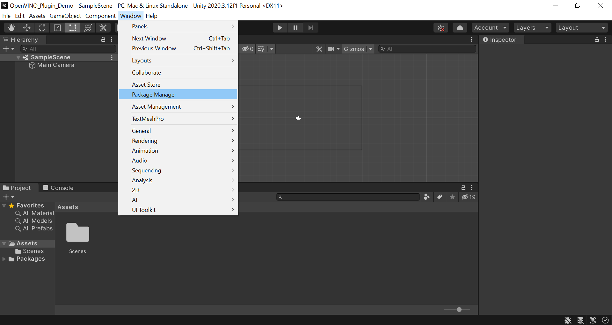{fig-align="center"}

In the Package Manager window, open the small dropdown menu in the left corner and select `Add package from git URL...`.

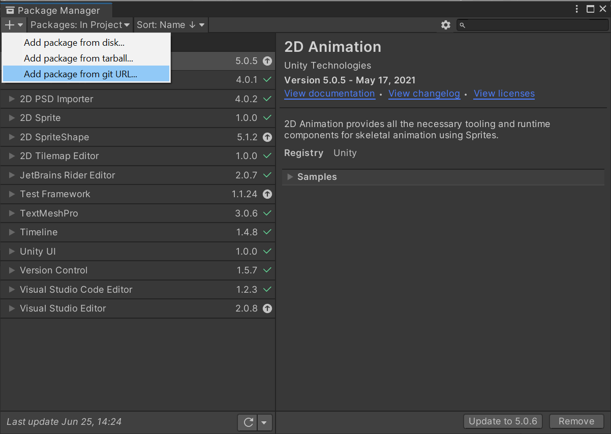{fig-align="center"}

Type `com.unity.barracuda` into the text box and click `Add`. This will install Barracuda version `1.0.4`. Go ahead and close the Package manager window once Barracuda finishes installing.

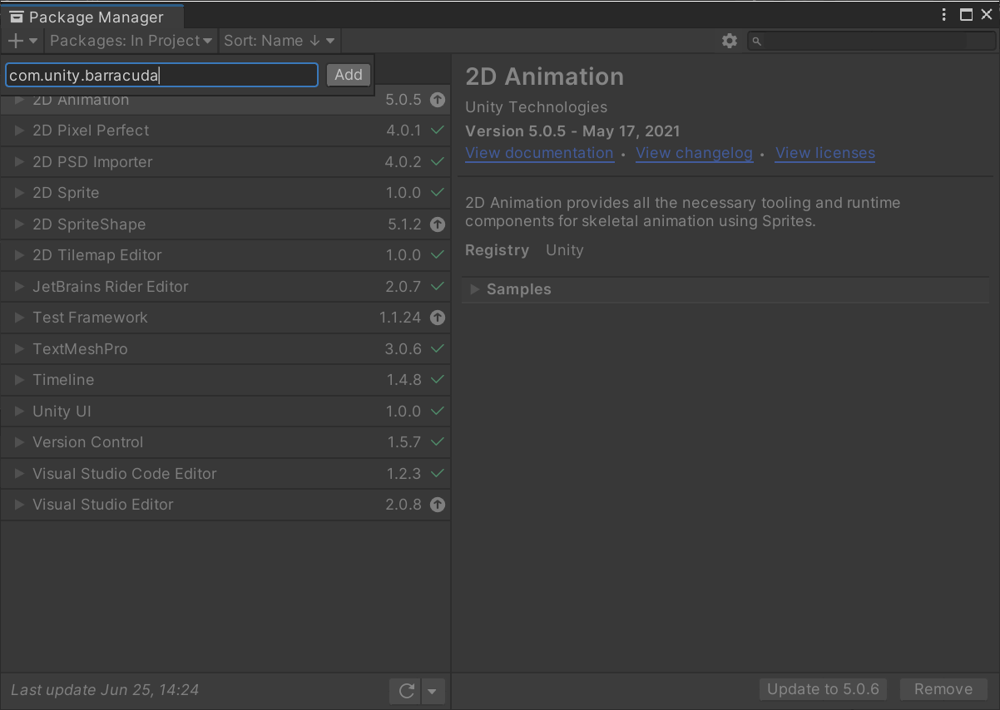{fig-align="center"}


## Add GUI

At the moment, we cannot use our OpenVINO plugin inside the Unity editor. There appears to be a dependency conflict between one of the dependencies for OpenVINO and the Unity editor.  If we look in the folder where the Unit editor executable is located, we can see that the editor also uses `tbb.dll`. However, it is a different version than the one required for OpenVINO.

We will need to build our Unity project without the plugin files, and then add them to the build folder where the project executable file is located.

Since we can't use the performance metrics and controls inside the editor, we will need to add our own.

The user interface will contain the following:

* Input fields for updating the height and width dimensions for the model input
* A dropdown menu for switching between the OpenVINO and Barracuda inference engines
* A dropdown menu for switching between style transfer models
* A toggle to turn image stylization on and off
* A toggle to turn asynchronous GPU readback on and off (more on this later)
* A button to exit the application
* A console readout for debugging
* A frame rate counter to measure performance

We will be using the free [Graphy](https://assetstore.unity.com/packages/tools/gui/graphy-ultimate-fps-counter-stats-monitor-debugger-105778) asset to display frame rate and other performance metrics. Everything else is already set up in the [prefab](https://docs.unity3d.com/Manual/Prefabs.html) linked below. 

* [Canvas Prefab](https://drive.google.com/file/d/12ca8Mc2Oi9BhT8m8xbKnOGKev0MQTNzx/view?usp=sharing)

### Import Canvas Prefab

Download the `Canvas.prefab` file from the above link and drop it into the assets folder in the Unity editor.

{fig-align="center"}

Drag and drop the prefab from the `Assets` folder into the `Hierarchy` tab. A `TMP Importer` popup window will appear. Click `Import TMP Essentials`. Close the popup window once the import is complete.

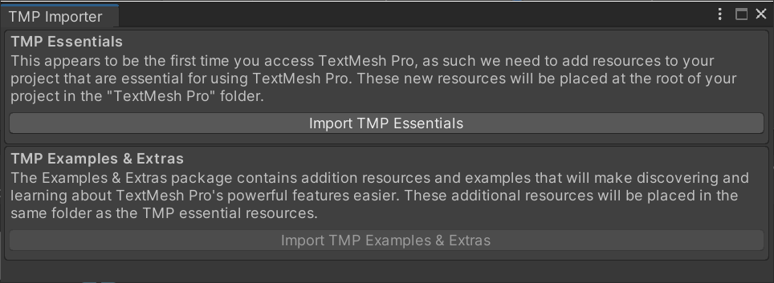{fig-align="center"}

If we select the `Game` tab, we can see the interface we just added. Don't worry if it looks squished.

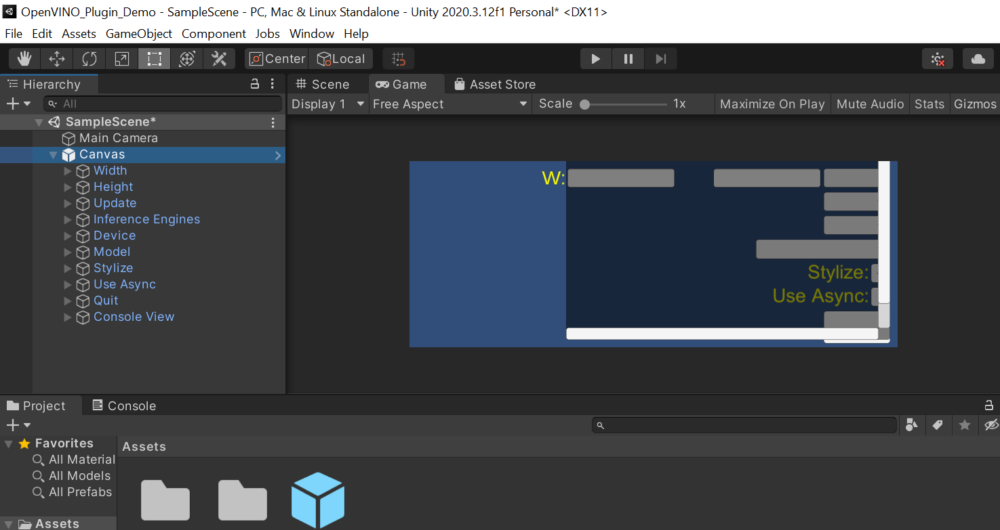{fig-align="center"}

### Add Graphy Package

Open the link to the Grapy Unity Store page below and click `Add to My Assets`. You will need to be signed in to your Unity account.

* Graphy Asset Store Page: ([link](https://assetstore.unity.com/packages/tools/gui/graphy-ultimate-fps-counter-stats-monitor-debugger-105778))

{fig-align="center"}

Back in Unity, open the Package Manager again and select the `Packages: In Project` dropdown. Switch the selection to `My Assets`. You will need to be signed in to view your assets.

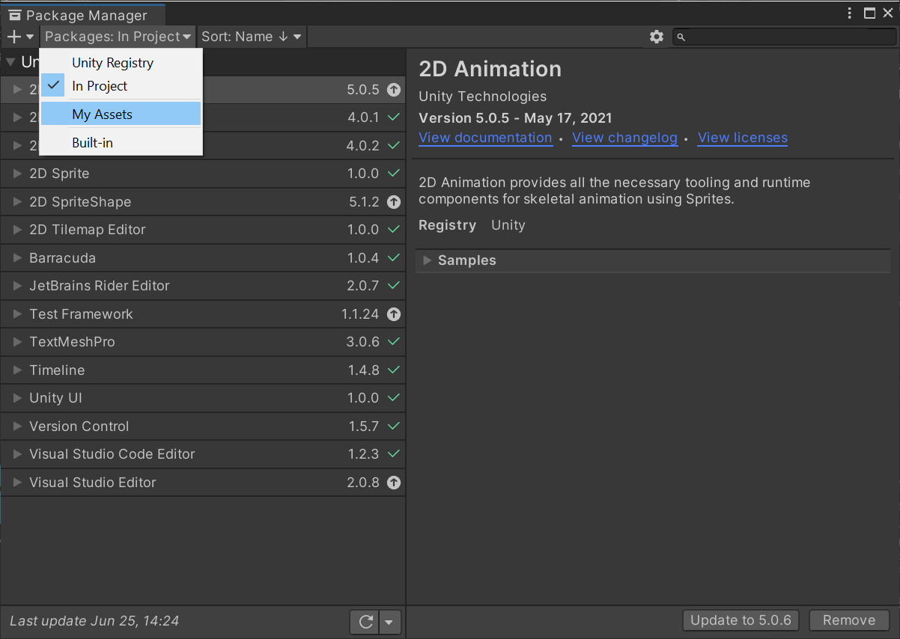{fig-align="center"}

Type `Graphy` into the search bar and click download.

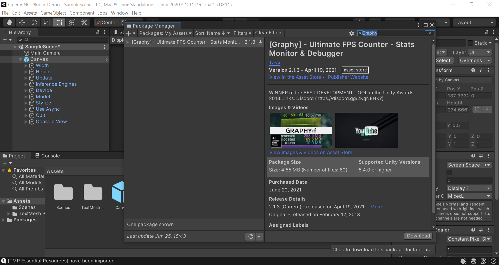{fig-align="center"}

Click `Import` once the package finished downloading. An `Import Unity Package` popup window will appear.

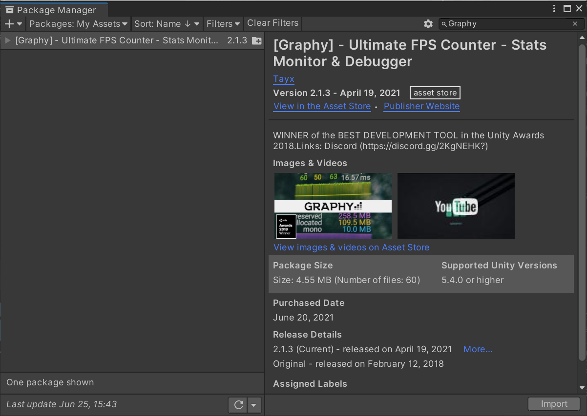{fig-align="center"}

Click `Import` in the popup window. Close the Package Manager window once the import is complete. There should now be a new folder called `Graphy - Ultimate Stats Monitor` in the `Assets` folder.

{fig-align="center"}

Inside the new folder, open the `Prefab` folder and drag the `[Graphy]` prefab into the Hierarchy tab. You will see that our game scene gets updated.

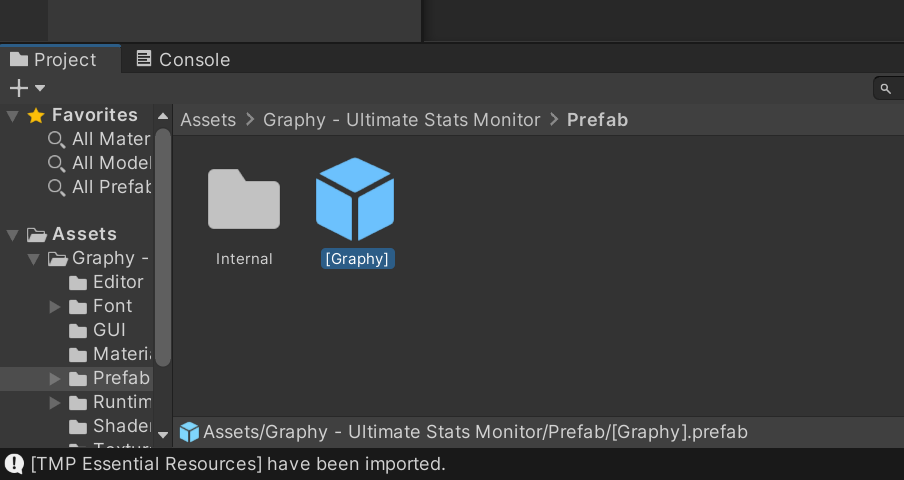{fig-align="center"}

With the `[Graphy]` object still selected in the Hierarchy tab. Scroll down in the `Inspector` tab to `Graphy Manager (Script)` section. Open the `Graph modules position` dropdown and select `TOP_LEFT`. Nothing will change in the game view, but the position will be updated when we build the project. 

{fig-align="center"}


### Add Event System

We need to add an [`Event System`](https://docs.unity3d.com/Packages/com.unity.ugui@1.0/manual/EventSystem.html) so that we can send events to [GameObjects](https://docs.unity3d.com/ScriptReference/GameObject.html) and their scripts based on user input. Right click an empty space in the Hierarchy tab. Open the `UI` submenu and select `Event System`.

{fig-align="center"}

### Make a Test Build

Before continuing, let's make a test build to confirm our GUI looks correct. First, press `Ctrl+s` to save the project.

Open the `File` menu  and select `Build Settings...`

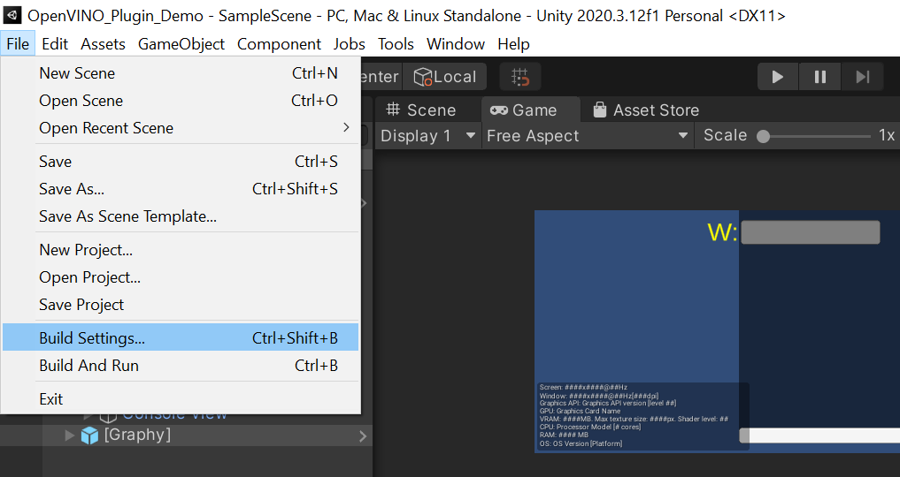{fig-align="center"}

Click build in the popup window. You will be prompted to select a folder to store the files generated during the build.

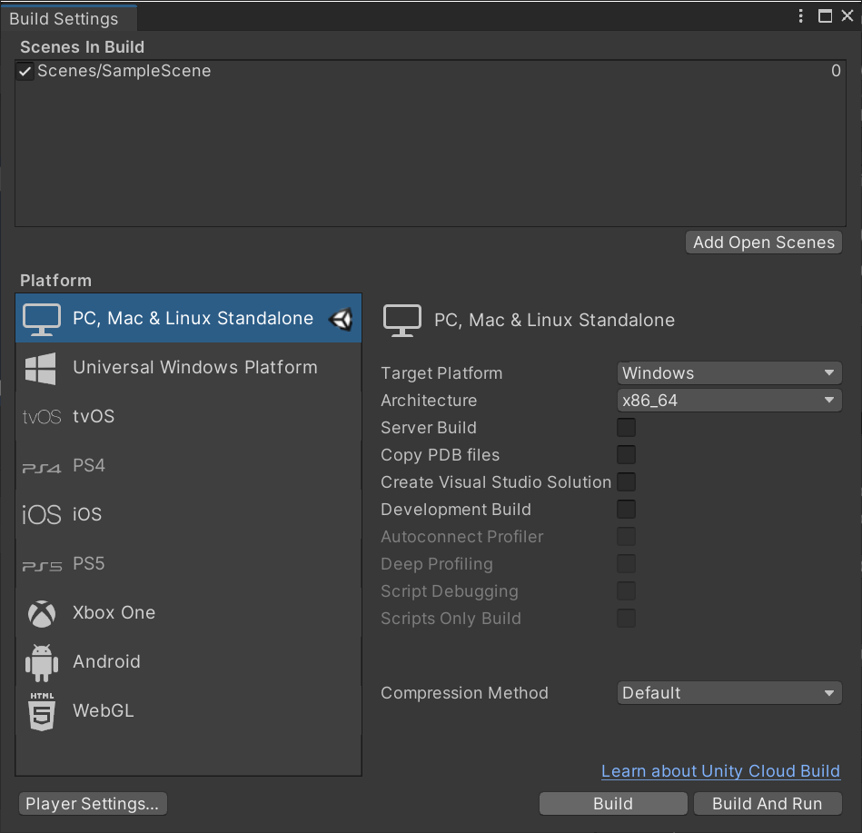{fig-align="center"}

Create a new folder in the default location and name it `Build`. Click select folder. 

{fig-align="center"}

Once the build is complete, a File Explorer window will open with the project executable selected. Double-click the executable to run it. 

{fig-align="center"}

You should get output similar to below. The buttons are not connected to any code just yet, so you will need to press `Alt+F4` to exit the application.

{fig-align="center"}


## Create Video Player

For this demo we'll just have a video file play in the background. While this demo can run on older integrated graphics, the frame rate would not be high enough to interact with a game environment. The newer discrete GPUs from Intel would be needed for playable frame rates. Since those are not widely available at the time of writing, we'll stick with a video.

### Import Video Files

We'll be using this video available on [Pexels](https://www.pexels.com/), a free stock photos & videos site. Download the video in `Full HD` resolution.

1. [Woman Dancing](https://www.pexels.com/video/woman-dancing-2873755/)

   **Note:** Renamed to `pexels_woman_dancing`

 

### Create the Videos Folder

In the `Assets` window, right-click an empty space, select the `Create` option, and click `Folder`. Name the folder `Videos`.

{fig-align="center"}

Double-click the `Videos` folder to open it.


### Add Video Files

Drag and drop the video file from the file explorer into the `Videos` folder.

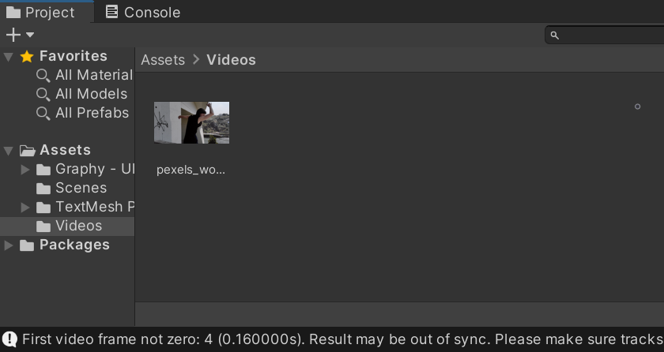{fig-align="center"}


### Create the Screen GameObject

We need to make a "screen" in Unity to watch the video. We'll use a [`Quad`](https://docs.unity3d.com/Manual/PrimitiveObjects.html) object for the screen. Right click an empty space in the `Hierarchy` tab, select the `3D Object` section and click `Quad`. We can just name it `VideoScreen`.

{fig-align="center"}


### Resize the Screen

With the `VideoScreen` object selected, we need to adjust the `Scale` parameter in the `Inspector` tab. Set the `X` value to 16 and the `Y` value to 9. Leave the `Z` value at 1.

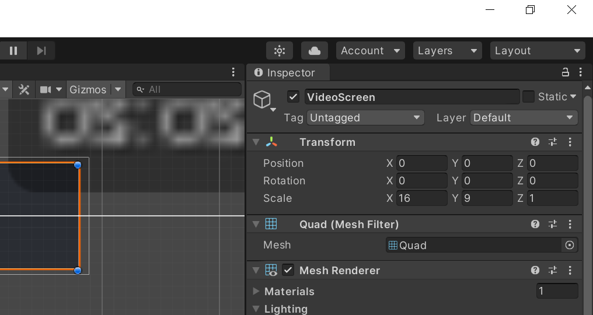{fig-align="center"}


### Update Screen Material

Create a new folder in the `Assets` section named `Materials`. Inside the Materials folder, right-click an empty space and select `Material` from the popup menu. We'll name the new material `video`.

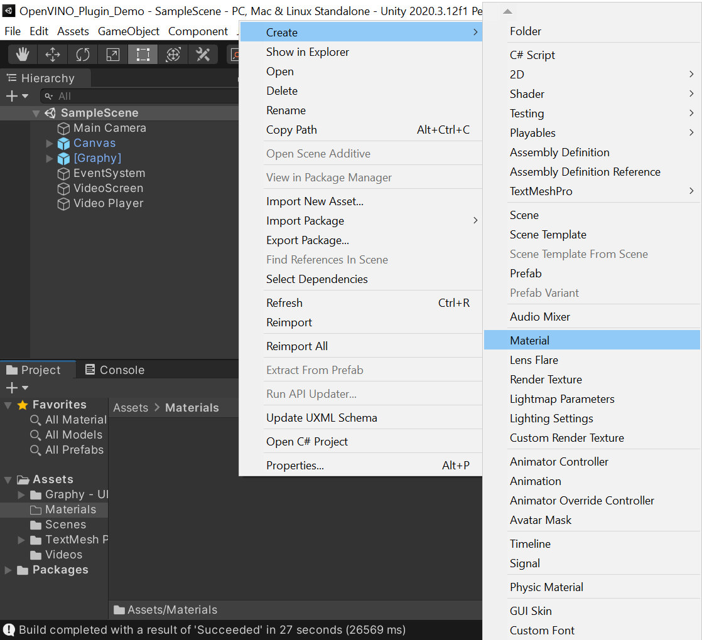{fig-align="center"}

With the `VideoScreen` object selected in the Hierarchy tab, open the `Materials` dropdown in the `Inspector` tab. Drag and drop the `video` material into the `Element 0` slot.

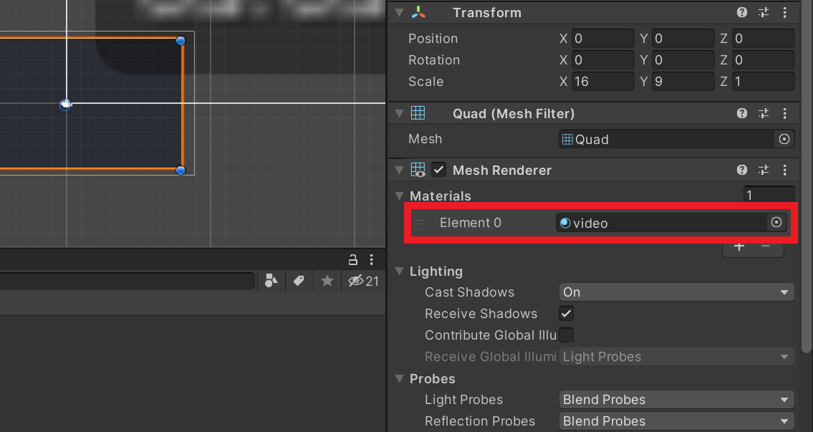{fig-align="center"}

With the `VideoScreen` object still selected, scroll down to the bottom of the Inspector tab and open the `Shader` dropdown menu. Select the `Unlit` option.

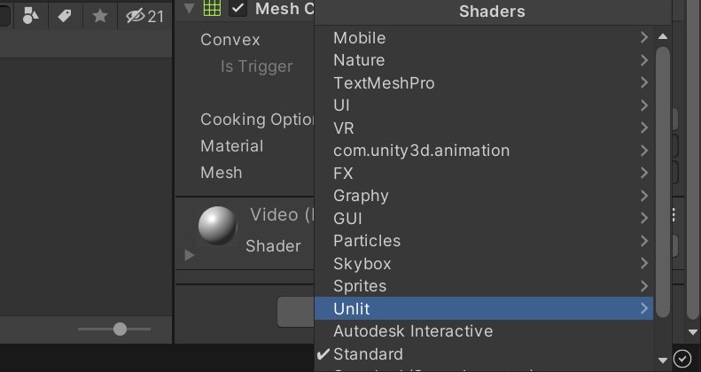{fig-align="center"}

Select `Texture` from the submenu. The video screen should now be white.

{fig-align="center"}


### Create the Video Player

In the `Hierarchy` tab, right-click an empty area, select the `Video` section, and click `Video Player`. This will create a new `GameObject` called `Video Player`.

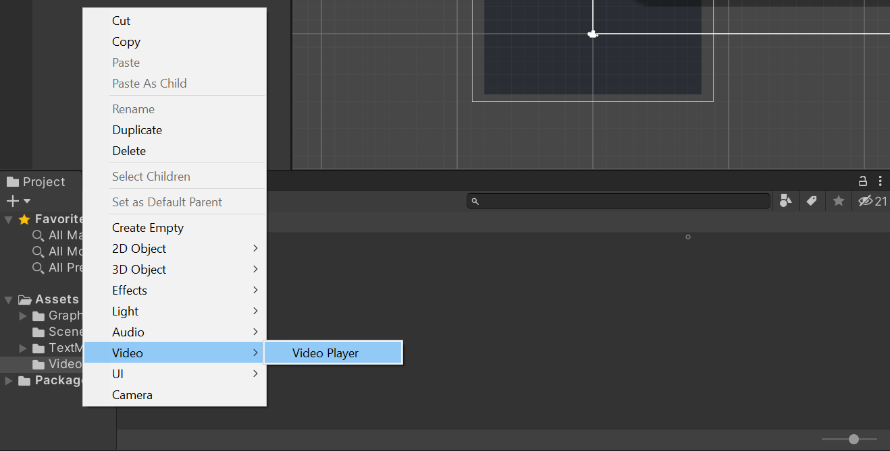{fig-align="center"}


### Set Video Clip

Select the `Video Player` object in the `Hierarchy` tab. Then, drag and drop the `pexels_woman_dancing` file into the `Video Clip` parameter in the `Inspector` tab.

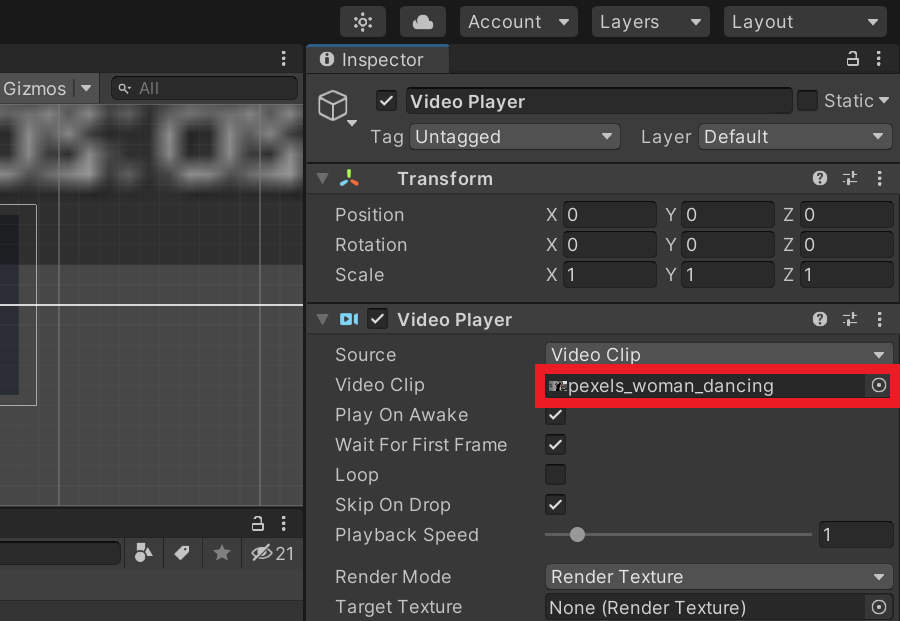{fig-align="center"}


### Make the Video Loop

Tick the `Loop` checkbox in the `Inspector` tab to make the video repeat when the project is running.

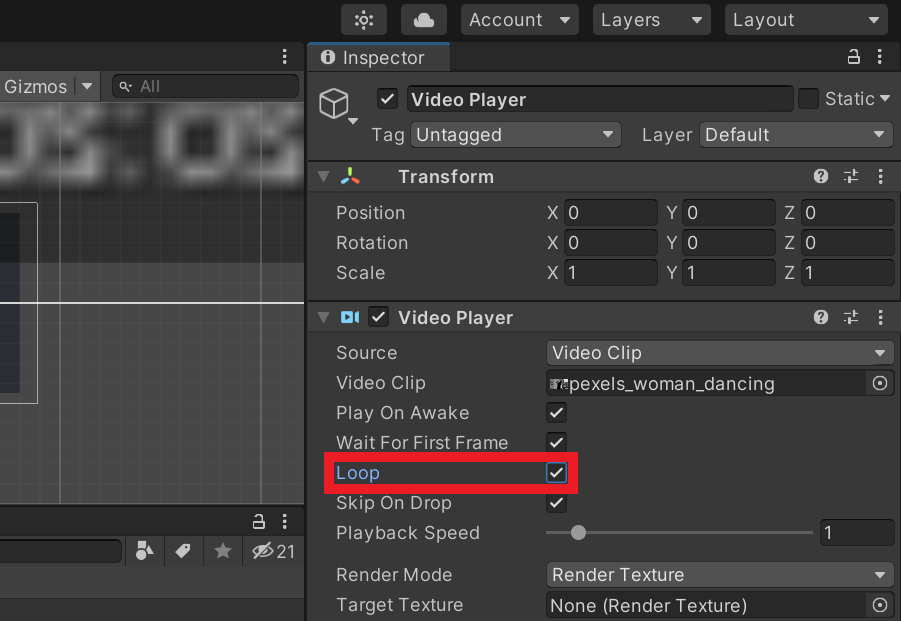{fig-align="center"}


### Set Render Mode

Open the `Render Mode` dropdown and `Material Override`.

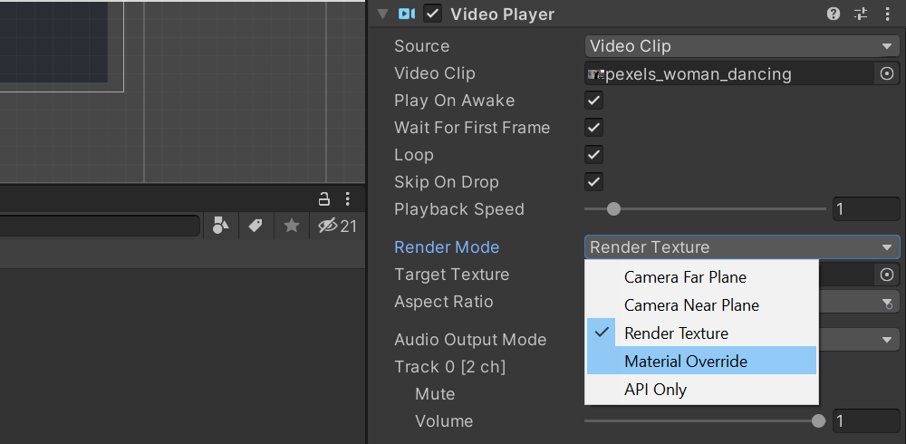{fig-align="center"}


### Specify Renderer

With the `Video Player` object still selected, drag and drop the `VideoScreen` object from the Hierarchy tab into the `Render` slot in the Inspector tab.

{fig-align="center"}


### Adjust the Camera

Before playing the video, we need to reposition and resize the `Main Camera` object. 

Select the `Main Camera` object in the `Hierarchy` tab.  Set the `Y`  value for the `Position` to `Y` and the  `Z` value for the `Position` to `-9`.

Finally, we need to set the Projection setting to `Orthographic` and adjust the Size parameter to `4.5` in the `Inspector` tab.

{fig-align="center"}


## Set Up Style Transfer Code

Now, we can implement the code for using both the Barracuda and OpenVINO inference engines.

### Create Style Transfer Folder

We'll place all our additions to the project in a new asset folder called `Style_Transfer`. This will help keep things organized.

### Import ONNX Files to Assets

Next, we need to import the original ONN file that we used earlier. This will be used by the Barracuda inference engine. Open the `Style_Transfer` folder and make a new folder called `Models`.

Drag and drop the ONNX file into the `Models` folder.

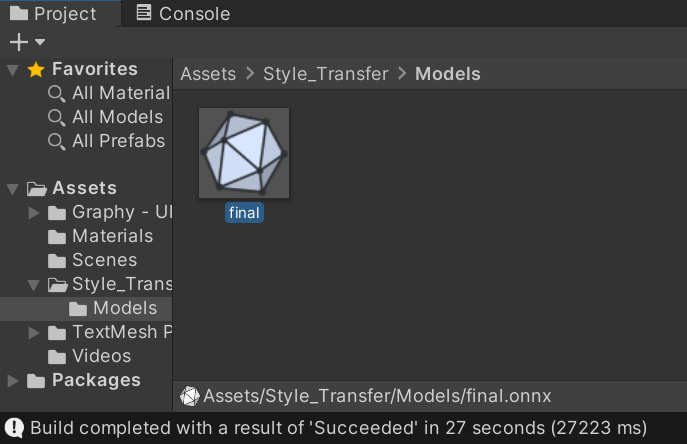{fig-align="center"}


### StyleTransferShader Compute Shader

We can perform both the preprocessing and postprocessing operations for the Barracuda model on the GPU since both the input and output are images. We'll implement these steps in a [compute shader](https://docs.unity3d.com/Manual/class-ComputeShader.html).

#### Create the Asset File

Open the `Style_Transfer` folder and create a new folder called `Shaders`. Enter the `Shaders` folder and right-click an empty space. Select `Shader` in the `Create` submenu and click `Compute Shader`. We’ll name it `StyleTransferShader`.

`image here`

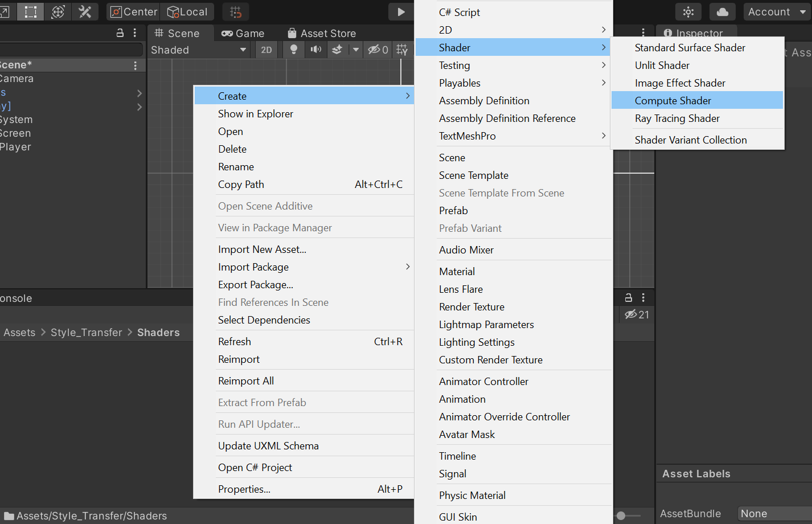{fig-align="center"}


#### Remove the Default Code

Open the `StyleTransferShader` in your code editor. By default, the `ComputeShader` will contain the following.

```c#
// Each #kernel tells which function to compile; you can have many kernels
#pragma kernel CSMain

// Create a RenderTexture with enableRandomWrite flag and set it
// with cs.SetTexture
RWTexture2D<float4> Result;

[numthreads(8,8,1)]
void CSMain (uint3 id : SV_DispatchThreadID)
{
    // TODO: insert actual code here!

    Result[id.xy] = float4(id.x & id.y, (id.x & 15)/15.0, (id.y & 15)/15.0, 0.0);
}
```

Delete the `CSMain` function along with the `#pragma kernel CSMain`. Next, we need to add a `Texture2D` variable to store the input image. Name it `InputImage` and give it a data type of `<half4>`. Use the same data type for the `Result` variable as well.

```c#
// Create a RenderTexture with enableRandomWrite flag and set it
// with cs.SetTexture
RWTexture2D<half4> Result;
// Stores the input image and is set with cs.SetTexture
Texture2D<half4> InputImage;
```


#### Create `ProcessInput` Function

The style transfer models expect RGB channel values to be in the range `[0, 255]`. Color values in Unity are in the range `[0,1]`. Therefore, we need to scale the three channel values for the `InputImage` by `255`. We'll perform this step in a new function called `ProcessInput` as shown below.

```c#
// Each #kernel tells which function to compile; you can have many kernels
#pragma kernel ProcessInput

// Create a RenderTexture with enableRandomWrite flag and set it
// with cs.SetTexture
RWTexture2D<half4> Result;
// Stores the input image and is set with cs.SetTexture
Texture2D<half4> InputImage;

[numthreads(4, 4, 1)]
void ProcessInput(uint3 id : SV_DispatchThreadID)
{
    Result[id.xy] = half4((InputImage[id.xy].x * 255.0h),
        (InputImage[id.xy].y * 255.0h),
        (InputImage[id.xy].z * 255.0h), 1.0h);
}
```


#### Create `ProcessOutput` Function

As we did in the DLL, we need to clamp the model output values to the range `[0, 255]`. We can use the built-in [`clamp()`](https://docs.microsoft.com/en-us/windows/win32/direct3dhlsl/dx-graphics-hlsl-clamp) method to make sure all values are in the correct range. We'll then scale the values back down to `[0, 1]` for Unity. We'll perform these steps in a new function called `ProcessOutput` as shown below.

```c#
// Each #kernel tells which function to compile; you can have many kernels
#pragma kernel ProcessInput
#pragma kernel ProcessOutput

// Create a RenderTexture with enableRandomWrite flag and set it
// with cs.SetTexture
RWTexture2D<half4> Result;
// Stores the input image and is set with cs.SetTexture
Texture2D<half4> InputImage;

[numthreads(4, 4, 1)]
void ProcessInput(uint3 id : SV_DispatchThreadID)
{
    Result[id.xy] = half4((InputImage[id.xy].x * 255.0h),
        (InputImage[id.xy].y * 255.0h),
        (InputImage[id.xy].z * 255.0h), 1.0h);
}

[numthreads(4, 4, 1)]
void ProcessOutput(uint3 id : SV_DispatchThreadID)
{
    Result[id.xy] = half4((clamp(InputImage[id.xy].x, 0.0h, 255.0h) / 255.0h),
        (clamp(InputImage[id.xy].y, 0.0f, 255.0h) / 255.0h),
        (clamp(InputImage[id.xy].z, 0.0f, 255.0h) / 255.0h), 1.0h);
}
```


#### Create  `FlipXAxis()` Function

The pixel data from Unity gets flipped when loaded into the `cv::Mat texture` variable in the DLL. We will need to flip the image before sending it to the plugin so that it will be in the correct orientation for the model. We will need to flip the image again when we receive the update pixel data back from the DLL. 

We need to know the height and width of the image to swap the pixel values. We'll store these values in `int` variables. We'll store the new `(x,y)` coordinates for individual pixel values in an `int2` variable. 

```c#
// Each #kernel tells which function to compile; you can have many kernels
#pragma kernel ProcessInput
#pragma kernel ProcessOutput
#pragma kernel FlipXAxis

// Create a RenderTexture with enableRandomWrite flag and set it
// with cs.SetTexture
RWTexture2D<half4> Result;
// Stores the input image and is set with cs.SetTexture
Texture2D<half4> InputImage;

[numthreads(4, 4, 1)]
void ProcessInput(uint3 id : SV_DispatchThreadID)
{
    Result[id.xy] = half4((InputImage[id.xy].x * 255.0h),
        (InputImage[id.xy].y * 255.0h),
        (InputImage[id.xy].z * 255.0h), 1.0h);
}

[numthreads(4, 4, 1)]
void ProcessOutput(uint3 id : SV_DispatchThreadID)
{
    Result[id.xy] = half4((clamp(InputImage[id.xy].x, 0.0h, 255.0h) / 255.0h),
        (clamp(InputImage[id.xy].y, 0.0f, 255.0h) / 255.0h),
        (clamp(InputImage[id.xy].z, 0.0f, 255.0h) / 255.0h), 1.0h);
}
    
// The height of the input image
int height;
// The width of the input image
int width;
// Stores the new location for individual pixel values
int2 coords;

[numthreads(4, 4, 1)]
void FlipXAxis(uint3 id : SV_DispatchThreadID)
{
    // Update the y value for the pixel coordinates
    coords = int2(id.x, height - id.y);
    Result[id.xy] = float4(InputImage[coords].x, InputImage[coords].y, InputImage[coords].z, 1.0f);
}
```


### Create `StyleTransfer` Script

We need to make a new `C#` script to perform inference with the style transfer model. This script will load the model, process the input, run the model, and process the output.

#### Create the Asset File

Open the `Style_Transfer` folder and create a new folder called `Scripts`. In the `Scripts` folder, right-click an empty space and select `C# Script` in the `Create` submenu. Name the script `StyleTransfer`.

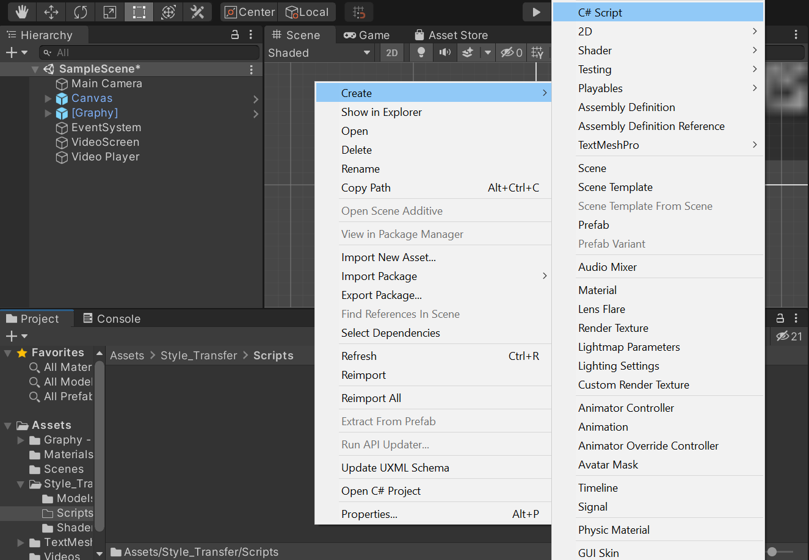{fig-align="center"}


#### Add Required Namespaces

We will start by adding the required namespaces at the top of the script.

* [`System`](https://docs.microsoft.com/en-us/dotnet/api/system?view=net-5.0): Contains fundamental classes and base classes that define commonly-used value and reference data types, events and event handlers, interfaces, attributes, and processing exceptions. 
* [`System.Runtime.InteropServices`](https://docs.microsoft.com/en-us/dotnet/api/system.runtime.interopservices?view=net-5.0): Provides a wide variety of members that support COM interop and platform invoke services. 
* [`UnityEngine.UI`](https://docs.unity3d.com/Packages/com.unity.ugui@1.0/api/UnityEngine.UI.html): Provides access to UI elements.
* [`Unity.Barracuda`](https://docs.unity3d.com/Packages/com.unity.barracuda@1.0/api/Unity.Barracuda.html): Provides access to the Barracuda library API.
* [`UnityEngine.Rendering`](https://docs.unity3d.com/Packages/com.unity.render-pipelines.core@5.9/api/UnityEngine.Rendering.html): Provides access to the elements of the rendering pipeline.

##### Code

```c#
using System.Collections;
using System.Collections.Generic;
using UnityEngine;
using System;
using System.Runtime.InteropServices;
using UnityEngine.UI;
using Unity.Barracuda;
using UnityEngine.Rendering;
```


#### Add Public Variables

Next, we add the publicly accessible variables inside the `StyleTransfer` class. 

We need to add a `ComputeShader` variable so that we can access the `StyleTransferShader` we made earlier.

There are several parts of the user interface that we will need to access inside the script.

* inference engine dropdown
* compute device dropdown
* model dropdown
* stylize toggle
* useAsync toggle
* input resolution fields
* console readout text

The last public variables will be a list of [`NNmodel`](https://docs.unity3d.com/Packages/com.unity.barracuda@1.0/api/Unity.Barracuda.NNModel.html) variables to store the ONNX models for the Barracuda engine and a [`WorkerFactory.Type`](https://docs.unity3d.com/Packages/com.unity.barracuda@1.0/api/Unity.Barracuda.WorkerFactory.Type.html) variable to specify the [backend](https://docs.unity3d.com/Packages/com.unity.barracuda@1.0/manual/Worker.html) for the Barracuda engine.

##### Code

```c#
public class StyleTransfer : MonoBehaviour
{
    [Tooltip("Performs the preprocessing and postprocessing steps")]
    public ComputeShader styleTransferShader;

    [Tooltip("Toggle between OpenVINO and Barracuda")]
    public TMPro.TMP_Dropdown inferenceEngineDropdown;

    [Tooltip("Switch between the available compute devices for OpenVINO")]
    public TMPro.TMP_Dropdown deviceDropdown;

    [Tooltip("Switch between the available OpenVINO models")]
    public TMPro.TMP_Dropdown modelDropdown;

    [Tooltip("Turn stylization on and off")]
    public Toggle stylize;

    [Tooltip("Turn AsyncGPUReadback on and off")]
    public Toggle useAsync;

    [Tooltip("Text box for the input width")]
    public TMPro.TMP_InputField widthText;
    [Tooltip("Text box for the input height")]
    public TMPro.TMP_InputField heightText;
    
    [Tooltip("Text area to display console output")]
    public Text consoleText;

    [Tooltip("The model asset file that will be used when performing inference")]
    public NNModel[] modelAssets;

    [Tooltip("The backend used when performing inference")]
    public WorkerFactory.Type workerType = WorkerFactory.Type.Auto;
```


#### Create DLL Method Declarations

We need to specify the name of the `.dll` file. We'll store this in a `const string`  variable called `dll`.

We can indicate that a given method is from a DLL by using the [ `DllImport`](https://docs.microsoft.com/en-us/dotnet/api/system.runtime.interopservices.dllimportattribute?view=net-5.0) attribute.

**Note:** The DLL functions that return string values have [`IntPtr`](https://docs.microsoft.com/en-us/dotnet/api/system.intptr?view=net-5.0) as their return values here. We will use the [`Marshal.PtrToStringAnsi()`](https://docs.microsoft.com/en-us/dotnet/api/system.runtime.interopservices.marshal.ptrtostringansi?view=net-5.0) method to get that string value at the memory location stored in the pointer.

We will be accessing the following methods from the DLL:

* `GetAvailableDevices`
* `InitializeOpenVINO`
* `SetInputDims`
* `PrepareBlobs`
* `UploadModelToDevice`
* `PerformInference`

##### Code

```c#

    // Name of the DLL file
    const string dll = "OpenVINO_Plugin";

    [DllImport(dll)]
    private static extern IntPtr GetAvailableDevices();

    [DllImport(dll)]
    private static extern void InitializeOpenVINO(string modelPath);

    [DllImport(dll)]
    private static extern bool SetInputDims(int width, int height);

    [DllImport(dll)]
    private static extern void PrepareBlobs();

    [DllImport(dll)]
    private static extern IntPtr UploadModelToDevice(int deviceNum = 0);

    [DllImport(dll)]
    private static extern void PerformInference(IntPtr inputData);
```


#### Add Private Variables

Lastly, we will add the variables that do not need to be publicly accessible. 

The models in the `modelAssets` variable will need to be compiled into runtime models to perform inference with them. We’ll store the compiled models in a new list of [`Model`](https://docs.unity3d.com/Packages/com.unity.barracuda@1.0/api/Unity.Barracuda.Model.html) variables called `m_RuntimeModels`.

We will create a separate inference engine interface for each of the Barracuda models. These will be stored in a list of [`IWorker`](https://docs.unity3d.com/Packages/com.unity.barracuda@1.0/api/Unity.Barracuda.IWorker.html) variables called engines.

We will need to resize and flip the input image in Unity before sending it to the OpenVINO plugin. We'll perform these operations using a temporary [`RenderTexture`](https://docs.unity3d.com/ScriptReference/RenderTexture.html) variable called `tempTex`.

For this tutorial, the pixel data currently needs to be downloaded from the GPU to the CPU before sending it to the plugin as well. We'll read the pixel data from `tempTex` to a [`Texture2D`](https://docs.unity3d.com/ScriptReference/Texture2D.html) variable called `inputTex`.

We will store the raw pixel data from `inputTex` in a [`byte[]`](https://docs.microsoft.com/en-us/dotnet/api/system.byte?view=net-5.0) variable called `inputData`.  We will be passing a pointer to this array as input to the `PerformInference()` method.

Next , we will create two `int` variables to store the current width and height values for the input dimensions. We'll give the width a default value of `960` and height a default value of `540`.

We also need two [`string`](https://docs.microsoft.com/en-us/dotnet/api/system.string?view=net-5.0) variables to store the unparsed list of available devices for OpenVINO and the current device being used.

Finally, we need four [`List<string>`](https://docs.microsoft.com/en-us/dotnet/api/system.collections.generic.list-1?view=net-5.0) variables to store the parsed list of available devices, the file paths for the OpenVINO models, the names of the OpenVINO models, and the names of the ONNX models.

##### Code

```c#
    // The compiled model used for performing inference
    private Model[] m_RuntimeModels;

    // The interface used to execute the neural network
    private IWorker[] engines;

    // Contains the resized input texture
    private RenderTexture tempTex;
    // Contains the input texture that will be sent to the OpenVINO inference engine
    private Texture2D inputTex;
    // Stores the raw pixel data for inputTex
    private byte[] inputData;

    // Input image width
    private int width = 960;
    // Input image height
    private int height = 540;

    // Unparsed list of available compute devices for OpenVINO
    private string openvinoDevices;
    // Current compute device for OpenVINO
    private string currentDevice;
    // Parsed list of compute devices for OpenVINO
    private List<string> deviceList = new List<string>();

    // File paths for the OpenVINO IR models
    private List<string> openVINOPaths = new List<string>();
    // Names of the OpenVINO IR model
    private List<string> openvinoModels = new List<string>();
    // Names of the ONNX models
    private List<string> onnxModels = new List<string>();
```


#### Define `Start()` Method

Here we will perform all the set up steps needed to initialize the user interface, OpenVINO plugin, and Barracuda inference engine.

**Note:** We are assuming that the OpenVINO models are stored in the same directory as the application executable, in a folder named `models`.

#### Method Steps

1. Get the name of the CPU and GPU
2. Create a list of the available OpenVINO IR models
3. Update model dropdown menu with list of OpenVINO models
4. Clear list of available compute devices
5. Check if either the CPU or GPU is made by Intel
   1. if true, initialize OpenVINO and update the list of compute devices
   2. if false, use the Barracuda inference engine
6. Initialize the `tempTex` and `inputTex` variables with the default resolution
7. Initialize the `m_RuntimeModels` variable
8. Initialize the `engines` variable
9. Compile the models in the `modelAssets` variable and initialize the inference engines for each.

##### Code

```c#
    // Start is called before the first frame update
    void Start()
    {
        string processorType = SystemInfo.processorType.ToString();
        Debug.Log($"Processor Type: {processorType}");
        string graphicsDeviceName = SystemInfo.graphicsDeviceName.ToString();
        Debug.Log($"Graphics Device Name: {graphicsDeviceName}");

        string[] openVINOFiles = System.IO.Directory.GetFiles("models");
        Debug.Log("Available OpenVINO Models");
        foreach (string file in openVINOFiles)
        {
            if (file.EndsWith(".xml"))
            {
                Debug.Log(file);
                openVINOPaths.Add(file);
                string modelName = file.Split('\\')[1];
                openvinoModels.Add(modelName.Substring(0, modelName.Length-4));
            }
        }

        // Remove default dropdown options
        modelDropdown.ClearOptions();
        // Add OpenVINO models to menu
        modelDropdown.AddOptions(openvinoModels);
        // Select the first option in the dropdown
        modelDropdown.SetValueWithoutNotify(0);

        // Remove default dropdown options
        deviceDropdown.ClearOptions();

        // Check if either the CPU of GPU is made by Intel
        if (processorType.Contains("Intel") || graphicsDeviceName.Contains("Intel"))
        {
            Debug.Log("Initializing OpenVINO");
            InitializeOpenVINO(openVINOPaths[0]);
            Debug.Log($"Setting Input Dims to W: {width} x H: {height}");
            SetInputDims(width, height);
            Debug.Log("Uploading IR Model to Compute Device");
            currentDevice = Marshal.PtrToStringAnsi(UploadModelToDevice());
            Debug.Log($"OpenVINO using: {currentDevice}");

            // Get an unparsed list of available 
            openvinoDevices = Marshal.PtrToStringAnsi(GetAvailableDevices());
            
            Debug.Log($"Available Devices:");
            // Parse list of available compute devices
            foreach (string device in openvinoDevices.Split(','))
            {
                // Add device name to list
                deviceList.Add(device);
                Debug.Log(device);
            }

            // Add OpenVINO compute devices to dropdown
            deviceDropdown.AddOptions(deviceList);
            // Set the value for the dropdown to the current compute device
            deviceDropdown.SetValueWithoutNotify(deviceList.IndexOf(currentDevice));
        }
        else
        {
            // Use Barracuda inference engine if not on Intel hardware
            inferenceEngineDropdown.SetValueWithoutNotify(1);
        }
        
        // Initialize textures with default input resolution
        tempTex = RenderTexture.GetTemporary(width, height, 24, RenderTextureFormat.ARGB32);
        inputTex = new Texture2D(width, height, TextureFormat.RGBA32, false);

        // Initialize list of Barracuda models
        m_RuntimeModels = new Model[modelAssets.Length];
        // Initialize list of Barracuda inference engines
        engines = new IWorker[modelAssets.Length];
        for(int i = 0; i < modelAssets.Length; i++)
        {
            // Add names of available ONNX models to list
            onnxModels.Add(modelAssets[i].name);
            Debug.Log($"ModelAsset Name: {modelAssets[i].name}");
            // Compile the model asset into an object oriented representation
            m_RuntimeModels[i] = ModelLoader.Load(modelAssets[i]);
            // Create a worker that will execute the model with the selected backend
            engines[i] = WorkerFactory.CreateWorker(workerType, m_RuntimeModels[i]);
        }
    }
```


#### Create `ProcessImage()` Method

Next, we'll make a new method to execute the `ProcessInput()`, `ProcessOutput()` and `FlipXAxis()` functions in our `ComputeShader`. This method will take in the image that needs to be processed as well as a function name to indicate which function we want to execute. We'll need to store the processed images in textures with HDR formats. This will allow us to use color values outside the default range of `[0, 1]`. As mentioned previously, the model expects values in the range of `[0, 255]`. 

##### Method Steps

1. Get the `ComputeShader` index for the specified function
2. Create a temporary `RenderTexture` with random write access enabled to store the processed image
3. Execute the `ComputeShader`
4. Copy the processed image back into the original `RenderTexture`
5. Release the temporary `RenderTexture`

##### Code

```c#
	/// <summary>
    /// Process the provided image using the specified function on the GPU
    /// </summary>
    /// <param name="image"></param>
    /// <param name="functionName"></param>
    /// <returns>The processed image</returns>
    private void ProcessImage(RenderTexture image, string functionName)
    {
        // Specify the number of threads on the GPU
        int numthreads = 4;
        // Get the index for the specified function in the ComputeShader
        int kernelHandle = styleTransferShader.FindKernel(functionName);
        // Define a temporary HDR RenderTexture
        RenderTexture result = RenderTexture.GetTemporary(image.width, image.height, 24, RenderTextureFormat.ARGBHalf);
        // Enable random write access
        result.enableRandomWrite = true;
        // Create the HDR RenderTexture
        result.Create();

        // Set the value for the Result variable in the ComputeShader
        styleTransferShader.SetTexture(kernelHandle, "Result", result);
        // Set the value for the InputImage variable in the ComputeShader
        styleTransferShader.SetTexture(kernelHandle, "InputImage", image);
        // Set the value for the height variable in the ComputeShader
        styleTransferShader.SetInt("height", image.height);
        // Set the value for the width variable in the ComputeShader
        styleTransferShader.SetInt("width", image.width);

        // Execute the ComputeShader
        styleTransferShader.Dispatch(kernelHandle, result.width / numthreads, result.height / numthreads, 1);

        // Copy the result into the source RenderTexture
        Graphics.Blit(result, image);

        // Release the temporary RenderTexture
        RenderTexture.ReleaseTemporary(result);
    }
```


#### Create `StylizeImage()` Method

We'll create a new method to handle stylizing individual frames from the camera with the Barracuda engine. This method will take in the `src` `RenderTexture` from the game camera and copy the stylized image back into that same `RenderTexture`.

##### Method Steps:

1. Resize the camera input to the `targetHeight`

   If the height of `src` is larger than the `targetHeight`, we'll calculate the new dimensions to downscale the camera input. We'll then adjust the new dimensions to be multiples of 8. This is to make sure we don't lose parts of the image after applying the processing steps with the `Compute shader`.

2. Apply preprocessing steps to the image

   We'll call the `ProcessImage()` method and pass `rTex` along with the name for the `ProcessInput()` function in the `ComputeShader`. The result will be stored in `rTex`.

3. Execute the model

   We'll use the `engine.Execute()` method to run the model with the current `input`. We can store the raw output from the model in a new `Tensor`.

4. Apply the postprocessing steps to the model output

   We'll call the `ProcessImage()` method and pass `rTex` along with the name for the `ProcessOutput()` function in the `ComputeShader`. The result will be stored in `rTex`.

5. Copy the stylized image to the `src` `RenderTexture`

   We'll use the `Graphics.Blit()` method to copy the final stylized image into the `src` `RenderTexture`.

6. Release the temporary `RenderTexture`

   Finally, we'll release the temporary `RenderTexture`.

##### Code

```c#
	/// <summary>
    /// Stylize the provided image
    /// </summary>
    /// <param name="src"></param>
    /// <returns></returns>
    private void StylizeImage(RenderTexture src)
    {
        // Create a new RenderTexture variable
        RenderTexture rTex;

        // Check if the target display is larger than the height
        // and make sure the height is at least 4
        if (src.height > height && height >= 4)
        {
            // Adjust the target image dimensions to be multiples of 4
            int targetHeight = height - (height % 4);
            int targetWidth = width - (width % 4);

            // Assign a temporary RenderTexture with the new dimensions
            rTex = RenderTexture.GetTemporary(targetWidth, targetHeight, 24, src.format);
        }
        else
        {
            // Assign a temporary RenderTexture with the src dimensions
            rTex = RenderTexture.GetTemporary(src.width, src.height, 24, src.format);
        }

        // Copy the src RenderTexture to the new rTex RenderTexture
        Graphics.Blit(src, rTex);

        // Apply preprocessing steps
        ProcessImage(rTex, "ProcessInput");

        // Create a Tensor of shape [1, rTex.height, rTex.width, 3]
        Tensor input = new Tensor(rTex, channels: 3);

        // Execute neural network with the provided input
        //engine.Execute(input);
        engines[modelDropdown.value].Execute(input);

        // Get the raw model output
        Tensor prediction = engines[modelDropdown.value].PeekOutput();

        // Release GPU resources allocated for the Tensor
        input.Dispose();

        // Make sure rTex is not the active RenderTexture
        RenderTexture.active = null;
        // Copy the model output to rTex
        prediction.ToRenderTexture(rTex);
        // Release GPU resources allocated for the Tensor
        prediction.Dispose();

        // Apply post processing steps
        ProcessImage(rTex, "ProcessOutput");
        // Copy rTex into src
        Graphics.Blit(rTex, src);

        // Release the temporary RenderTexture
        RenderTexture.ReleaseTemporary(rTex);
    }
```


#### Create `SetInferenceEngine()` Method

This method will be called when a new option is selected from the inference engine dropdown menu.

##### Method Steps

1. Create a temporary list of the models for the selected inference engine
2. Update the model dropdown menu with the temporary list
3. Check if the model that was last used for the previous inference engine is available for the selected inference engine.

##### Code

```c#
	/// <summary>
    /// Called when an inference engine option is selected from dropdown
    /// </summary>
    public void SetInferenceEngine()
    {
        // Get the list of models for the selected inference engine
        List<string> currentList = inferenceEngineDropdown.value == 0 ? openvinoModels : onnxModels;

        // Remove current dropdown options
        modelDropdown.ClearOptions();
        // Add current inference engine models to menu
        modelDropdown.AddOptions(currentList);
        // Select the first option in the dropdown
        modelDropdown.SetValueWithoutNotify(0);
        
        // Get index for current model selection
        int index = modelDropdown.value;
        // Get the name for the previously selected inference engine model
        string previousModel = inferenceEngineDropdown.value == 0 ? onnxModels[index] : openvinoModels[index];
        // Check if the model for the previous inference engine is available for the current engine
        if (currentList.Contains(previousModel))
        {
            modelDropdown.SetValueWithoutNotify(openvinoModels.IndexOf(previousModel));
        }
    }
```


#### Create `SetDevice()` Method

This method will be called when a new option is selected from the device dropdown menu.

##### Method Steps

1. Call `UploadModelToDevice()` method and save the returned value to `currentDevice`

##### Code

```c#
	/// <summary>
    /// Called when a compute device is selected from dropdown
    /// </summary>
    public void SetDevice()
    {
        // Uploading model to device
        currentDevice = Marshal.PtrToStringAnsi(UploadModelToDevice(deviceDropdown.value));
    }
```


#### Create `UpdateInputDims()` Method

This method will be called when the input dimensions are updated from the user interface.

##### Method Steps

1. Get integer values from user input for the height and width input fields
2. Update `tempTex` and `inputTex` with the new height and width values
3. Call `SetInputDims()` method.
4. Call `SetDevice()` method
5. Call `PrepareBlobs()` method

##### Code

```c#
	/// <summary>
    /// Called when the input resolution is updated
    /// </summary>
    public void UpdateInputDims()
    {
        // Get the integer value from the width input
        int.TryParse(widthText.text, out width);
        // Get the integer value from the height input
        int.TryParse(heightText.text, out height);

        // Update tempTex with the new dimensions
        tempTex = RenderTexture.GetTemporary(width, height, 24, RenderTextureFormat.ARGB32);
        // Update inputTex with the new dimensions
        inputTex = new Texture2D(width, height, TextureFormat.RGBA32, false);
        

        // Set input resolution width x height for the OpenVINO model
        Debug.Log($"Setting Input Dims to W: {width} x H: {height}");
        SetInputDims(width, height);
        SetDevice();

        // Preparing Output Blobs
        PrepareBlobs();
    }
```


#### Create `UpdateModel()` Method

This method will be called when a new option is selected from the model dropdown menu.

##### Method Steps

1. Check if the OpenVINO engine is currently selected
   1. Call `InitializeOpenVINO()` for selected the model.
   2. Call `UpdateInputDims()` method 

##### Code

```c#
	/// <summary>
    /// Called when a model option is selected from the dropdown
    /// </summary>
    public void UpdateModel()
    {
        Debug.Log($"Selected Model: {modelDropdown.value}");
        // Initialize the selected OpenVINO model
        if (inferenceEngineDropdown.value == 0)
        {
            InitializeOpenVINO(openVINOPaths[modelDropdown.value]);
            UpdateInputDims();
        }
    }
```


#### Create `UpdateTexture()` Method

This method is where we will send the current pixel data from `inputTex` to the OpenVINO plugin. We need to use the [`unsafe`](https://docs.microsoft.com/en-us/dotnet/csharp/language-reference/keywords/unsafe) keyword since we'll be creating a pointer to the `inputData` array. Unity does not allow unsafe code by default, so we will need to enable it in the Project Settings.

##### Method Steps

1. Pin the memory for `inputData` using a [`fixed`](https://docs.microsoft.com/en-us/dotnet/csharp/language-reference/keywords/fixed-statement) statement and get a pointer to the variable
2. Call the `PerformInference()` method with the pointer as input

##### Code

```c#
	/// <summary>
    /// Pin memory for the input data and send it to OpenVINO for inference
    /// </summary>
    /// <param name="inputData"></param>
    public unsafe void UpdateTexture(byte[] inputData)
    {
        //Pin Memory
        fixed (byte* p = inputData)
        {
            // Perform inference with OpenVINO
            PerformInference((IntPtr)p);
        }
    }
```


#### Create `OnCompleteReadback()` Callback

 As mentioned earlier, we currently need to download the pixel data for `tempTex` from the GPU to the CPU. This normally causes a [pipeline stall](https://en.wikipedia.org/wiki/Pipeline_stall) as Unity prevents any execution on the main thread to prevent the data from changing before it has finished downloading to the CPU. This can cause a noticeable performance bottleneck that increases with the amount of pixel data there is to download. 

Unity provides an alternative approach with [`AsyncGPUReadback`](https://docs.unity3d.com/ScriptReference/Rendering.AsyncGPUReadback.html) that does not block the main thread. However it adds a few frames of latency. This may or may not matter depending on the specific application.

This function will be called once the `AsyncGPUReadback` has completed. We can load the raw pixel data from the request directly to `inputTex`.

**Note:** It may be possible to access the underlying DirectX11 texture data directly using OpenVINO's [Remote Blob API](https://docs.openvinotoolkit.org/latest/openvino_docs_IE_DG_supported_plugins_GPU_RemoteBlob_API.html). However, this potential approach will need to be explored in a future post.

##### Method Steps

1. Check if an error occurred during the GPU readback.
2. Load the raw texture data from the readback into `inputTex`.
3. Apply the changes to `inputTex`.

##### Code

```c#
	/// <summary>
    /// Called once AsyncGPUReadback has been completed
    /// </summary>
    /// <param name="request"></param>
    void OnCompleteReadback(AsyncGPUReadbackRequest request)
    {
        if (request.hasError)
        {
            Debug.Log("GPU readback error detected.");
            return;
        }

        // Fill Texture2D with raw data from the AsyncGPUReadbackRequest
        inputTex.LoadRawTextureData(request.GetData<uint>());
        // Apply changes to Texture2D
        inputTex.Apply();
    }
```


#### Define `OnRenderImage()` Method

The [`OnRenderImage()`](https://docs.unity3d.com/ScriptReference/MonoBehaviour.OnRenderImage.html) method gets called after the Camera has finished rendering. This gives us access to the `RenderTexture` for the game camera as well as the `RenderTexture` for the target display. It allows us to stylize the final image from the in-game that would be displayed to the user. We'll only stylize the current frame if the stylize toggle is on.

##### Method Steps:

1. Check if the stylize UI toggle is ticked.
   1. Check which inference engine is currently selected
      * OpenVINO:
        1. Copy the `RenderTexture` for the camera to `tempTex`
        2. Flip the image
        3. Read pixel data from `tempTex` to `inputTex` either asynchronously or synchronously
        4. Call `UpdateTexture()` method
        5. Load the updated raw pixel data from `inputData` to `inputTex`
        6. Apply the changes to `inputTex`
        7. Copy the pixel data from `inputTex` to `tempTex`
        8. Flip the image again
        9. Copy the pixel data from `tempTex` to the `RenderTexture` for the camera
      * Barracuda:
        1.  Call `StylizeImage()` method
   2. Copy the `RenderTexture` for the camera to the `RenderTexture` for the target display.

##### Code

```c#
	/// <summary>
    /// OnRenderImage is called after the Camera had finished rendering 
    /// </summary>
    /// <param name="src">Input from the Camera</param>
    /// <param name="dest">The texture for the target display</param>
    void OnRenderImage(RenderTexture src, RenderTexture dest)
    {
        // Only stylize current frame if Stylize toggle is on
        if (stylize.isOn)
        {
            // Check which inference engine to use
            if (inferenceEngineDropdown.value == 0)
            {
                // Copy current frame to smaller temporary texture
                Graphics.Blit(src, tempTex);
                // Flip image before sending to DLL
                ProcessImage(tempTex, "FlipXAxis");

                if (useAsync.isOn)
                {
                    AsyncGPUReadback.Request(tempTex, 0, TextureFormat.RGBA32, OnCompleteReadback);
                }
                else
                {
                    RenderTexture.active = tempTex;
                    inputTex.ReadPixels(new Rect(0, 0, tempTex.width, tempTex.height), 0, 0);
                    inputTex.Apply();
                }

                // Get raw data from Texture2D
                inputData = inputTex.GetRawTextureData();
                // Send reference to inputData to DLL
                UpdateTexture(inputData);
                // Load the new image data from the DLL to the texture
                inputTex.LoadRawTextureData(inputData);
                // Apply the changes to the texture
                inputTex.Apply();
                // Copy output image to temporary texture
                Graphics.Blit(inputTex, tempTex);
                // Flip output image from DLL
                ProcessImage(tempTex, "FlipXAxis");
                // Copy the temporary texture to the source resolution texture
                Graphics.Blit(tempTex, src);
            }
            else
            {
                StylizeImage(src);
            }
        }
        
        Graphics.Blit(src, dest);
    }
```


#### Create `Log()` Method

Since we can't run the project in the Unity Editor with the plugin, we don't have direct access to the console. However, we can capture the text that gets sent to the console and display it in the user interface. This can be useful for debugging purposes.

##### Method Steps

1. Add the most recent console text to the console readout text area.

##### Code

```c#
	/// <summary>
    /// Updates on screen console text
    /// </summary>
    /// <param name="logString"></param>
    /// <param name="stackTrace"></param>
    /// <param name="type"></param>
    public void Log(string logString, string stackTrace, LogType type)
    {
        consoleText.text = consoleText.text + "\n " + logString;
    }
```


#### Define `OnEnable()` Method

The [`OnEnable()`](https://docs.unity3d.com/ScriptReference/MonoBehaviour.OnEnable.html) method is called when the `GameObject` the script is attached to becomes enabled or active.

##### Method Steps

1. Add `Log()` method to [`Application.logMessageReceived`](https://docs.unity3d.com/ScriptReference/Application-logMessageReceived.html) event.

##### Code

```c#
	// Called when the object becomes enabled and active
    void OnEnable()
    {
        Application.logMessageReceived += Log;
    }
```


#### Define `OnDestroy()` Method

We need to manually release the resources that get allocated for the inference engine interfaces and release the temporary `RenderTexture`. This should be one of the last actions performed. Therefore, we will do it in the [`OnDestroy()`](https://docs.unity3d.com/ScriptReference/MonoBehaviour.OnDestroy.html) method.

##### Method Steps

1. Remove the `inputTex` object.
2. Release the `tempTex` RenderTexture.
3. Release the resources allocated for each Barracuda inference engine interface.
4. Remove the Log function from the `Application.logMessageReceived` event.

##### Code

```c#
    // Called when the MonoBehaviour will be destroyed
    private void OnDestroy()
    {
        Destroy(inputTex);
        RenderTexture.ReleaseTemporary(tempTex);

        // Release the resources allocated for the inference engines
        foreach (IWorker engine in engines)
        {
            engine.Dispose();
        }
        
        Application.logMessageReceived -= Log;
    }
```


#### Create `Quit()` Method

This method will be called when the `Quit` button is clicked in the user interface and will cause the application to exit.

##### Method Steps

1. Call the [`Application.Quit()`](https://docs.unity3d.com/ScriptReference/Application.Quit.html) method.

##### Code

```c#
	/// <summary>
    /// Called when the Quit button is clicked.
    /// </summary>
    public void Quit()
    {
        // Causes the application to exit
        Application.Quit();
    }
```


That takes care of the required code for this project. However, we still need to enable unsafe code in the Project Settings for the `UpdateTexture()` method to be allowed.


## Enable Unsafe Code

Open the `Edit` menu at the top of the Unity Editor and select Project Settings. 

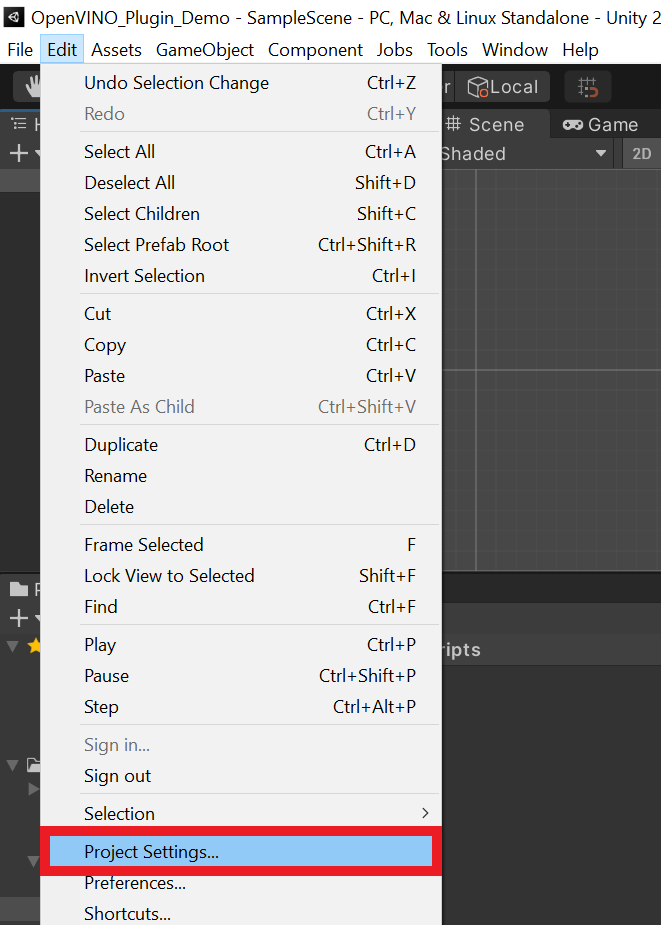

Select `Player` from the side menu and open the `Other Settings` dropdown menu.

{fig-align="center"}

Scroll down until you see the `Allow 'unsafe' Code` checkbox. Enable the setting and close the Project Settings window.

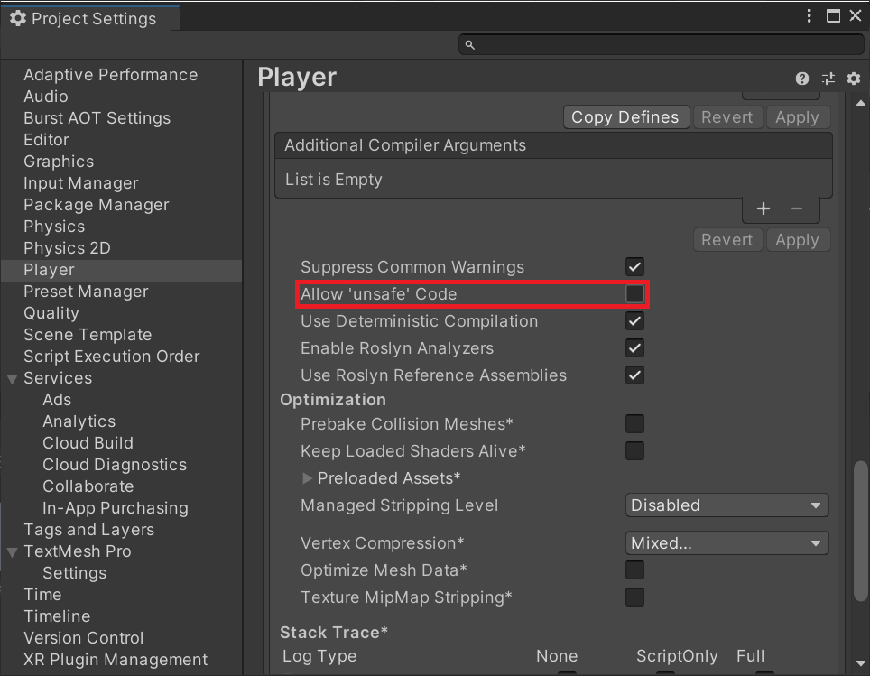{fig-align="center"}


## Attach Script to Camera

To run the `StyleTransfer` script, we need to attach it to the active `Camera` in the scene.

Select the `Main Camera` object in the Hierarchy Tab and click the little lock icon at the top of the Inspector tab. This will keep the `Main Camera` in the Inspector tab.

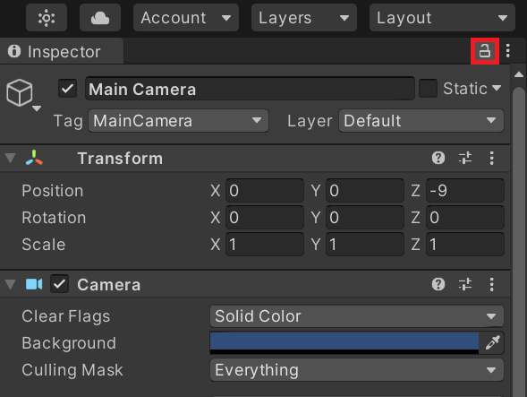{fig-align="center"}

Drag and drop the `StyleTransfer.cs` into the bottom of the Inspector tab. Now can assign the UI elements inside the Canvas object as well as the compute shader and any ONNX models. We can do so by dragging dropping them into their associated variable spots in the Inspector tab.

The actual text area for the `Console View` object is located at `Console View > Viewport > Content` in the Hierarchy tab.

{fig-align="center"}

We also need to select the `Compute Precompiled` option from the `Worker Type` dropdown menu.

`image here`

{fig-align="center"}

The fully populated script should look like the image below.

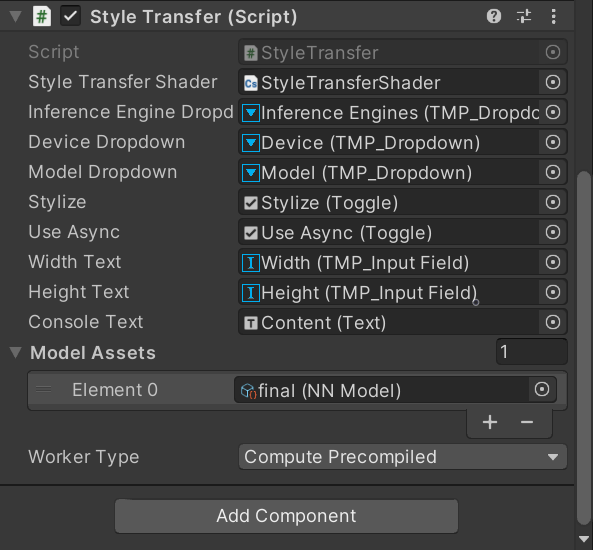{fig-align="center"}

Click the lock icon again to unlock the Inspector tab.


## Assign UI Events

Now we just need to assign the associated methods from the `StyleTransfer.cs` script to the UI event triggers.

### Update Button

Select the `Update` object inside the `Canvas` object.

{fig-align="center"}

Scroll down in the Inspector tab to the `On Click` section.

{fig-align="center"}

Drag and drop the `Main Camera` object into the `None (Object)` spot. Open the `No Function` dropdown menu. Open the `StyleTransfer` option and select `UpdateInputDims()`. 

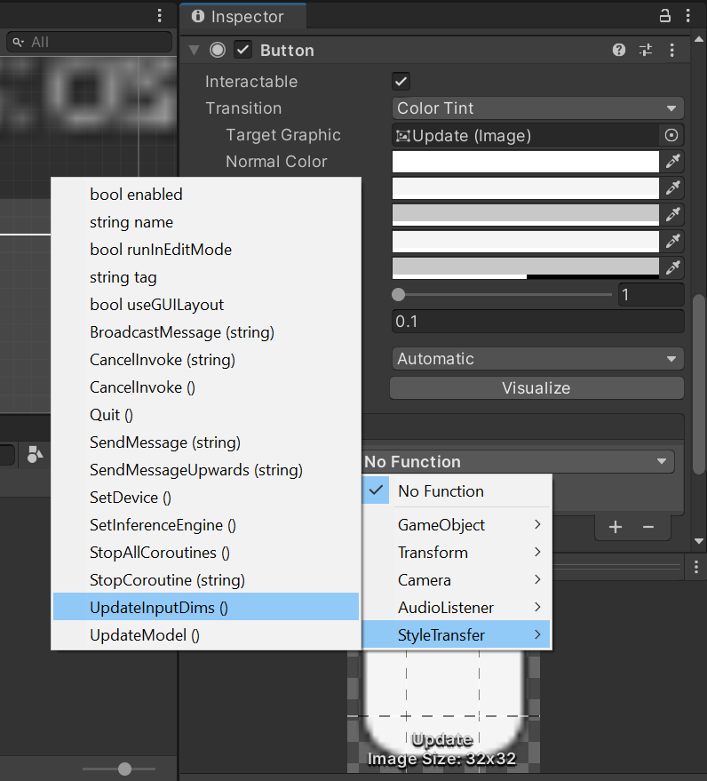{fig-align="center"}


### Inference Engine Dropdown

Select the `Inference Engines` object inside the `Canvas` object.

Scroll down in the Inspector tab to the `On Value Changed (Int32)` section and press the little plus sign.

{fig-align="center"}


Drag and drop the `Main Camera` object into the `None (Object)` spot.

{fig-align="center"}

This time, select the `StyleTransfer.SetInferenceEngine` method.

{fig-align="center"}


### Device Dropdown

Select the `Device` object inside the `Canvas` object and follow the same steps as the inference engine dropdown. This time, select the `StyleTransfer.SetDevice` method.

{fig-align="center"}


### Model Dropdown

Select the `Model` object inside the `Canvas` object and follow the same steps as the device dropdown. This time, select the `StyleTransfer.UpdateModel` method.

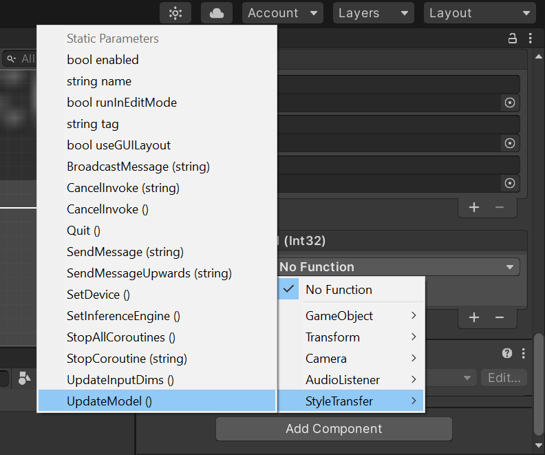{fig-align="center"}

### Quit Button

Select the `Quit` object inside the `Canvas` object and follow the same steps as the `Update` button. This time select the `StyleTransfer.Quit` method.

{fig-align="center"}


## Build the Project

Now we can build the completed project. Open the `Build Settings` window like before and press `Build`. We'll use the same folder as last time. If we did everything correctly, there should not be any build errors.


## Add Models Folder

Create a new folder in the same directory as the `OpenVINO_Plugin_Demo.exe` file and name it `models`. 

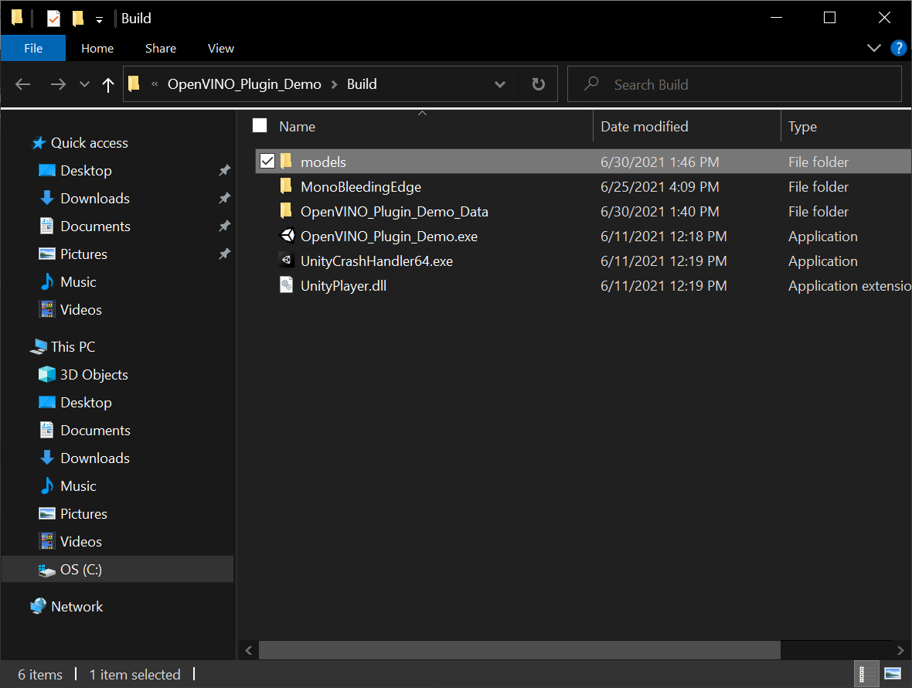{fig-align="center"}

We'll place the `.xml` and `.bin` files for any OpenVINO models in this folder.

{fig-align="center"}


## Add Plugins folder

Go back to the main build folder and open the `OpenVINO_Plugin_Demo_Data` folder.

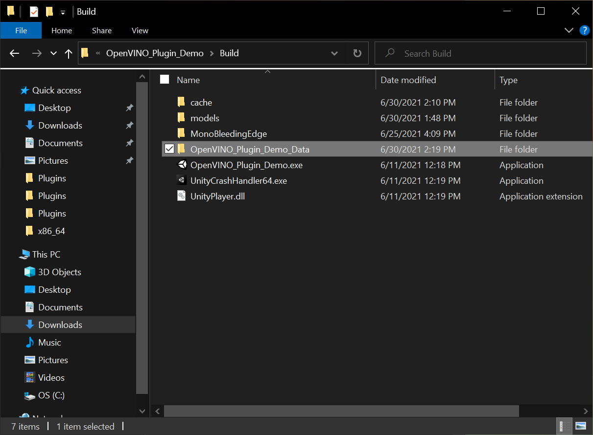{fig-align="center"}

From there, open the `Plugins` folder.

{fig-align="center"}

Copy and paste the `x86_64` from earlier that contains all the `.dll` files and dependencies in here.


## Run the Application

Now we can finally test the application. Go back to the main build folder and double-click the `OpenVINO_Plugin_Demo.exe` file to run it. Remember that the first time the application launches will be slow as the cache files are generated.

{fig-align="center"}


## Conclusion

We now have a general workflow for leveraging the OpenVINO™ Toolkit inside the Unity game engine. The style transfer model used in this tutorial is extremely demanding and can push even high-end graphics cards to their limit. The performance improvements from using OpenVINO make these types of models accessible to a wider audience. Less demanding models can even be offloaded to the integrated graphics or CPU. Tools like Unity are capable of much more than making games and it is exciting to see what will be possible by combining efficient deep learning models with real-time development platforms.

**Project Resources:**

[GitHub Repository](https://github.com/cj-mills/Unity-OpenVINO-Plugin)


