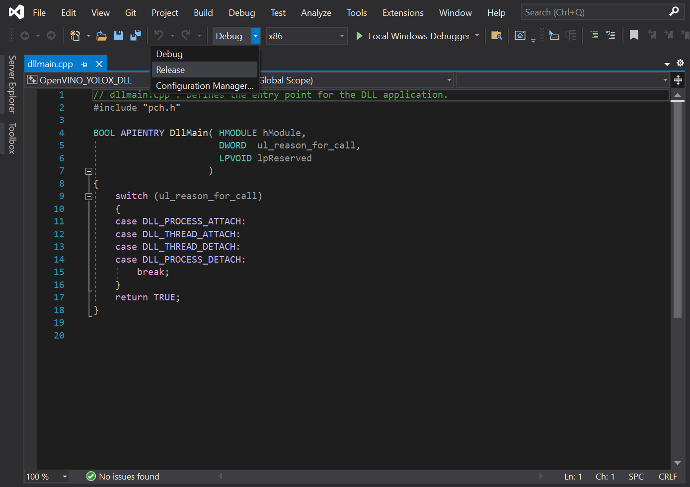
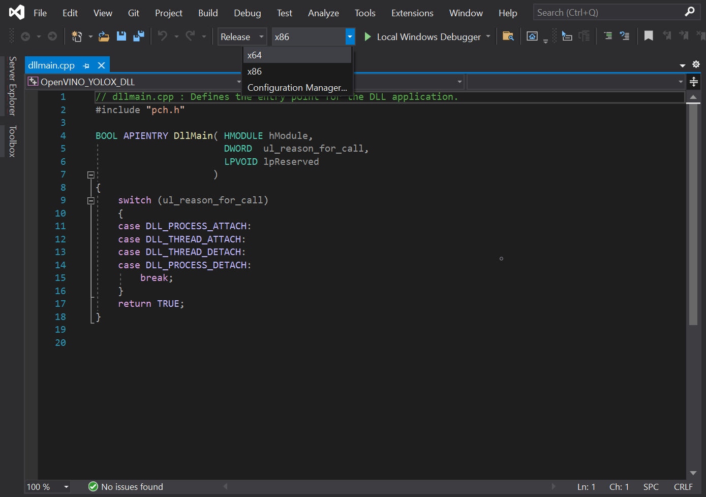
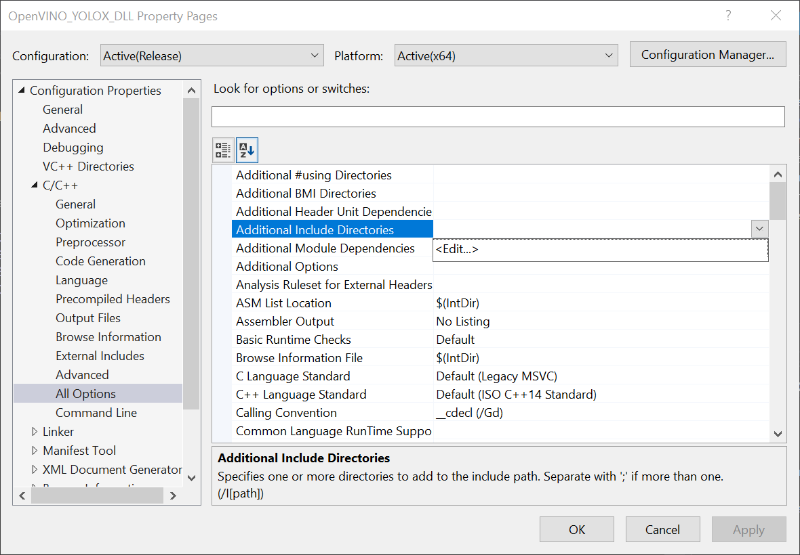
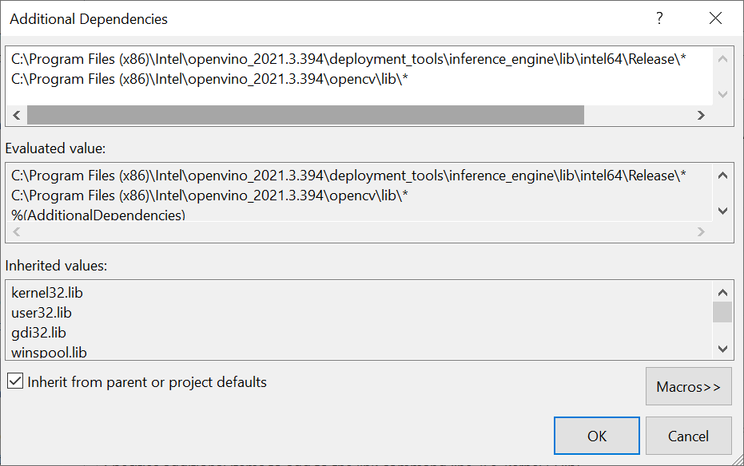
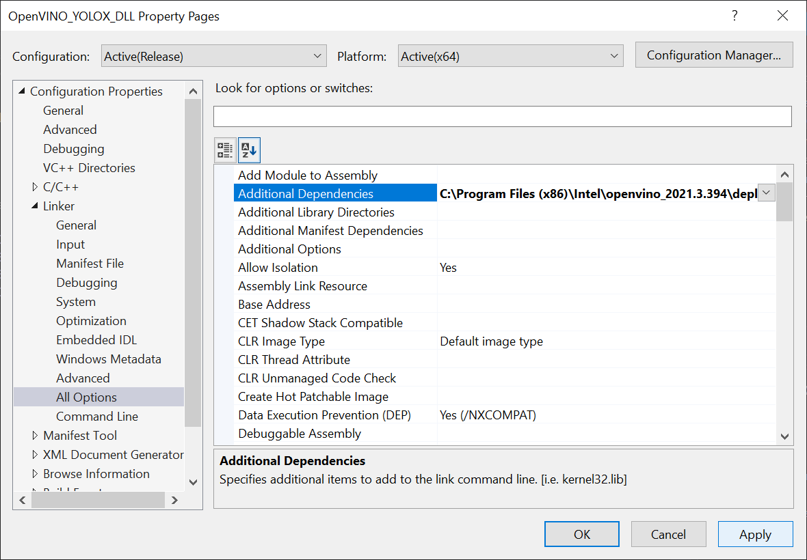
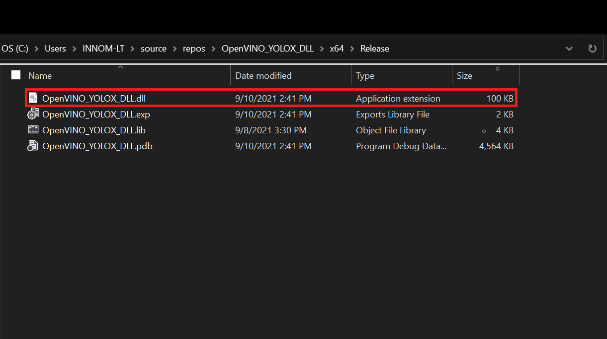

### 8/11/2022:

* This tutorial is outdated. Use the new version at the link below.
* [End-to-End Object Detection for Unity With IceVision and OpenVINO Pt. 1](../../icevision-openvino-unity-tutorial/part-1/)

------

### Previous: [Part 1](../part-1/)

* [Overview](#overview)
* [Create a New Visual Studio Project](#create-a-new-visual-studio-project)
* [Configure Project](#configure-project)
* [Add Include Directories](#add-include-directories)
* [Link Libraries](#link-libraries)
* [Clear Default Code](#clear-default-code)
* [Update Precompiled Header File](#update-precompiled-header-file)
* [Update `dllmain`](#update-dllmain)
* [Build Solution](#build-solution)
* [Gather Dependencies](#gather-dependencies)
* [Conclusion](#conclusion)


## Overview

In [Part 1](../part-1/) of the tutorial, we first installed Unity, OpenVINO, and its prerequisite software. We then downloaded some pretrained models that had been converted to the OpenVINO [Intermediate Representation](https://docs.openvinotoolkit.org/latest/openvino_docs_MO_DG_IR_and_opsets.html) format, along with some test videos.

In this part, we will walk through the steps needed to create a [Dynamic link library (DLL)](https://docs.microsoft.com/en-us/troubleshoot/windows-client/deployment/dynamic-link-library) in Visual Studio to perform [inference](https://www.intel.com/content/www/us/en/artificial-intelligence/posts/deep-learning-training-and-inference.html) with the pretrained deep learning model.

## Create a New Visual Studio Project

Open Visual Studio and select `Create a new project`.


Type `DLL` into the search bar. Select the `Dynamic-Link Library (DLL)` option and press `Next`. 


In the next window, we'll name the new project `OpenVINO_YOLOX_DLL`. Take note of the `Location` the project will be saved to and click `Create`. The default location can be replaced, but we will need to access the project folder to get the generated DLL file.


## Configure Project

We need to update the default project configuration to access the OpenVINO™ Toolkit and build the project with it.

### Set Build Configuration and Platform

The OpenVINO™ Toolkit does not support `x86` builds. We will need to set the project to build for `x64`. At the top of the window, open the Solution Configurations dropdown menu, and select `Release`. 



Then, open the `Solution Platform` dropdown menu and select `x64`.




## Add Include Directories

Visual Studio needs to be told where the OpenVINO™ Toolkit is located, so we can access its APIs. In the Solution Explorer panel, right-click the project name.


Select `Properties` in the popup menu.


In the Properties Window, open the `C++` dropdown and click on `All Options`. Select the `Additional Include Directories` section and click on `<Edit..>` in the dropdown.




We need to add the `include` directories for the OpenVINO inference engine and the [OpenCV](https://opencv.org/) libraries included with the OpenVINO™ Toolkit.

Add the following lines and then click `OK`. Feel free to open these folders in the File Explorer and see what exactly they provide access to.

* `C:\Program Files (x86)\Intel\openvino_2021.3.394\deployment_tools\inference_engine\include`
* `C:\Program Files (x86)\Intel\openvino_2021.3.394\opencv\include`


## Link Libraries

Next, open the Linker dropdown in the Properties window and select All Options. Scroll up to the top of the All Options section and select `Additional Dependencies`. 


Add the following lines for the OpenVINO and OpenCV libraries, then click `OK`. The `*` at the end tells Visual Studio to add all the `.lib` files contained in those folders. We do not technically need every single one, but this is more convenient than manually typing the specific file names.

* `C:\Program Files (x86)\Intel\openvino_2021.3.394\deployment_tools\inference_engine\lib\intel64\Release\*`
* `C:\Program Files (x86)\Intel\openvino_2021.3.394\opencv\lib\*`



Finally, click the `Apply` button and close the Properties window.




## Clear Default Code

Now, we can finally start coding. The default code for the dllmain.cpp file is as follows.

```c++
// dllmain.cpp : Defines the entry point for the DLL application.
#include "pch.h"

BOOL APIENTRY DllMain( HMODULE hModule,
                       DWORD  ul_reason_for_call,
                       LPVOID lpReserved
                     )
{
    switch (ul_reason_for_call)
    {
    case DLL_PROCESS_ATTACH:
    case DLL_THREAD_ATTACH:
    case DLL_THREAD_DETACH:
    case DLL_PROCESS_DETACH:
        break;
    }
    return TRUE;
}
```

We can delete everything below the `#include "pch.h"` line.

```c++
// dllmain.cpp : Defines the entry point for the DLL application.
#include "pch.h"
```


## Update Precompiled Header File

The pch.h file is a [Precompiled Header file](https://docs.microsoft.com/en-us/cpp/build/creating-precompiled-header-files?view=msvc-160) that is generated by Visual Studio. We can place any header files that won't be updated here and they will only be compiled once. This can reduce build times for larger projects. We can open the pch.h file by selecting that line and pressing F12.

```c++
// pch.h: This is a precompiled header file.
// Files listed below are compiled only once, improving build performance for future builds.
// This also affects IntelliSense performance, including code completion and many code browsing features.
// However, files listed here are ALL re-compiled if any one of them is updated between builds.
// Do not add files here that you will be updating frequently as this negates the performance advantage.

#ifndef PCH_H
#define PCH_H

// add headers that you want to pre-compile here
#include "framework.h"


#endif //PCH_H
```

We'll add the required header files below `#include "framework.h"`. Each one can be explored by selecting that line and pressing F12 as well.

```c++
// add headers that you want to pre-compile here
#include "framework.h"
// A header file that provides a set minimal required Inference Engine API.
#include <inference_engine.hpp>
// A header file that provides the API for the OpenCV modules.
#include <opencv2/opencv.hpp>
// Regular expressions standard header
#include <regex>
```


## Update dllmain

Back in the dllmain.cpp file, we'll add the InferenceEngine namespace and create a macro to mark functions we want to make accessible in Unity.

```c++
// dllmain.cpp : Defines the entry point for the DLL application.
#include "pch.h"

using namespace InferenceEngine;

// Create a macro to quickly mark a function for export
#define DLLExport __declspec (dllexport)
```

We need to wrap the code in extern "C" to prevent name - mangling issues with the compiler.

```c++
// Create a macro to quickly mark a function for export
#define DLLExport __declspec (dllexport)

// Wrap code to prevent name-mangling issues
extern "C" {

}
```


### Declare Variables

Inside the wrapper, we'll declare the persistent variables needed for the DLL.

* `Object`: The YOLOX model predicts the coordinates and dimensions for a bounding box that contains a detected object, along with the predicted object class and the confidence for that prediction. We will store this information for each prediction in a [struct](https://www.cplusplus.com/doc/tutorial/structures/) called Object. We will create a corresponding struct in Unity.

* `GridAndStride`: The model input is divided into grid cells which correspond to sections of the input image. We need to keep track of these grid cells to scale the predicted object locations back up to the source input resolution. We will keep track of this information using a new [struct](https://www.cplusplus.com/doc/tutorial/structures/) called GridAndStride.

* `img_w`: We need to keep track of the width of the input image to scale the model output back up to the source resolution.

* `img_h`: We need to keep track of the height of the input image to scale the model output back up to the source resolution.

* `input_w`: We need to keep track of the current input width for the model to generate the GridAndStride values as well as padding and resizing the input images.

* `input_h`: We need to keep track of the current input height for the model to generate the GridAndStride values as well as padding and resizing the input images.

* `count`: We will be passing the object predictions to Unity by populating an Object array from Unity. We need to know how many objects have been detected, so that we can initialize the array before filling it.

* `scale`: We need to keep track of the difference between the input image and the input dimensions of the model, so that we can scale up the model output back to the source resolution.

* `bbox_conf_thresh`: We will only consider model predictions with confidence scores above a specified threshold.

* `nms_thresh`: The way that the model detects objects makes it possible to detect the same object more than once. We can filter through multiple detections of the same object by checking how much two predicted bounding boxes overlap. If a bounding box overlaps one with a higher confidence too much, we can ignore it. This technique is called [Non Maximum Suppression (NMS)](https://learnopencv.com/non-maximum-suppression-theory-and-implementation-in-pytorch/).

* `available_devices_str`: We will pass a list of compute devices available for performing inference to Unity as a comma separated string. We need to make this string a global variable to keep the data persistent in memory.

* `available_devices`: We will store the unparsed list of available devices in a [vector](https://www.cplusplus.com/reference/vector/vector/).

* `grid_strides`: We will store the grid and stride values for scaling predicted object locations back up to the current input dimensions in a GridAndStride vector.

* `proposals`: We will store the object proposals with high enough confidence scores in an Object vector.

* `picked`: We will keep track of which object proposals we want to keep in a separate vector.

* `ie`: To use the OpenVINO inference engine, we first need to create a [Core](https://docs.openvinotoolkit.org/latest/classInferenceEngine_1_1Core.html) instance called ie. We'll use this variable to read the model file, get the available compute devices, change configuration settings, and load the model onto the target compute device.

* `network`: We'll store the information from the .xml and .bin file in a [CNNNetwork](https://docs.openvinotoolkit.org/latest/classInferenceEngine_1_1CNNNetwork.html) variable.

* `executable_network`: We need to create an executable version of the network before we can perform inference.

* `infer_request`: After that, we will create an [InferRequest](https://docs.openvinotoolkit.org/latest/ie_c_api/group__InferRequest.html) variable to initiate inference for the model.

* `minput`: Once we create the inference request, we will require write access to the input [tensor](https://docs.openvinotoolkit.org/latest/classInferenceEngine_1_1TensorDesc.html) for the model. We can access the input tensor using a [MemoryBlob::Ptr](https://docs.openvinotoolkit.org/2021.3/classInferenceEngine_1_1MemoryBlob.html#public_types) variable.

* `moutput`: After executing the model, we will need read access to the output tensor for the model. We can access the output tensor using a [MemoryBlob::CPtr](https://docs.openvinotoolkit.org/2021.3/classInferenceEngine_1_1MemoryBlob.html#public_types) variable.

#### Code :

```c++
// Wrap code to prevent name-mangling issues*
extern "C" {
	// Stores information about a single object prediction*
	struct Object
	{
		float x0;
		float y0;
		float width;
		float height;
		int label;
		float prob;
	};

	// Store grid offset and stride values to decode a section of the model output*
	struct GridAndStride
	{
		int grid0;
		int grid1;
		int stride;
	};

	// The width of the source input image*
	int img_w;
	// The height of the source input image*
	int img_h;
	// The input width for the model*
	int input_w = 640;
	// The input height for the model*
	int input_h = 640;
	// Stores the final number of objects detected after decoding the model output*
	int count = 0;

	// The scale value used to adjust the model output to the original unpadded image*
	float scale;
	// The minimum confidence score to consider an object proposal*
	float bbox_conf_thresh = 0.3;
	// The maximum intersection over union value before an object proposal will be ignored*
	float nms_thresh = 0.45;

	// An unparsed list of available compute devices*
	std::string available_devices_str = "";

	// List of available compute devices*
	std::vector<std::string> available_devices;
	// Stores the grid and stride values*
	std::vector<GridAndStride> grid_strides;
	// Stores the object proposals with confidence scores above bbox_conf_thresh*
	std::vector<Object> proposals;
	// Stores the indices for the object proposals selected using non-maximum suppression*
	std::vector<int> picked;

	// Inference engine instance*
	Core ie;
	// Contains all the information about the Neural Network topology and related constant values for the model*
	CNNNetwork network;
	// Provides an interface for an executable network on the compute device*
	ExecutableNetwork executable_network;
	// Provides an interface for an asynchronous inference request*
	InferRequest infer_request;

	// A pointer to the input tensor for the model*
	MemoryBlob::Ptr minput;
	// A pointer to the output tensor for the model*
	MemoryBlob::CPtr moutput;
}
```

 

### Create GetAvailableDevices() Function

We might want to compare the performance of executing the model on the CPU, GPU, or iGPU. Being able to manually select the compute device gives us the option to offload less demanding models to the integrated graphics, which would otherwise go unused.

This function combines the list of available devices into a single, comma separated string that will be parsed in Unity. We will use this list to manually select which device is used to execute the model. 

It can take over 20 seconds to upload the OpenVINO model to a GPU or iGPU. This is because OpenCL kernels are being compiled for the specific model and GPU at runtime. There isn't much we can do about this the first time a model is loaded to the GPU. However, we can eliminate this load time in future uses by storing cache files for the model. The cache files are specific to each GPU. Additional cache files will also be created when using a new input resolution for a model.

We'll use a [regular expression](https://www.cplusplus.com/reference/regex/) to confirm a compute device is a GPU before attempting to set a cache directory for it.

We can specify the [directory](https://docs.openvinotoolkit.org/latest/namespaceInferenceEngine_1_1PluginConfigParams.html#ab02b7b3b01439a8bc9570f34f9fd5e91) to store cache files for each available GPU using the [ie.SetConfig()](https://docs.openvinotoolkit.org/latest/classInferenceEngine_1_1Core.html#a34aa9ac6fb237b634d5bf08b288e88d4) method. 
 We'll just name the directory, cache. By default, the cache directory will be created in the same folder as the executable file that will be generated from the Unity project.

We need to add the DLLExport macro since we'll be calling this function from Unity.

#### Code :

```c++
// Returns an unparsed list of available compute devices
DLLExport const std::string* GetAvailableDevices() {

	// Get a list of the available compute devices
	available_devices = ie.GetAvailableDevices();
	// Reverse the order of the list
	std::reverse(available_devices.begin(), available_devices.end());

	// Configure the cache directory for GPU compute devices
	std::regex e("(GPU)(.*)");
	// Iterate through the available compute devices
	for (auto&& device : available_devices) {
		// Only configure the cache directory for GPUs
		if (std::regex_match(device, e)) {
			ie.SetConfig({ {CONFIG_KEY(CACHE_DIR), "cache"} }, device);
		}
	}

	// Add all available compute devices to a single string
	for (auto&& device : available_devices) {
		available_devices_str += device;
		available_devices_str += ((device == available_devices[available_devices.size() - 1]) ? "" : ",");
	}
	return &available_devices_str;
}
```

 

### Create GetObjectCount() Function

We need to get the final number of detected objects so that we can initialize the size of the Object array in Unity before populating it with the latest predictions. This function will simply return the value for the count variable to Unity.

#### Code:

```c++
// Get the final number of objects detected in the current model output
DLLExport int GetObjectCount() {
	return count;
}
```

 

### Create SetConfidenceThreshold() Function

Next, we will create a simple function to update the minimum confidence threshold from inside the Unity application.

#### Code:

```c++
// Set the minimum confidence score
DLLExport void SetConfidenceThreshold(float threshold) {
	bbox_conf_thresh = threshold;
}
```

 

### Create SetNMSThreshold() Function

We will also create a similar function to update the nms_threshold value.

#### Code:

```c++
// Set the maximum intersection over union value
DLLExport void SetNMSThreshold(float threshold) {
	nms_thresh = threshold;
}
```

 

### Create GenerateGridsAndStride() Function

The YOLOX model examines the input image using different stride values (i.e. different resolutions). This allows the model to better detect objects of different sizes in the image. A smaller stride value (e.g. 8) is used to detect smaller objects while a larger value (e.g. 32) is used to detect larger objects. Here, we can see the difference in results when using a single stride value in isolation.

**Stride: 8**


 

**Stride: 16**


 

**Stride: 32**


We need to keep track of these stride values along with the grid cells to properly scale the model output back up to the source resolution.

The specific strides values used by a model are determined during training. All the models used in this tutorial use stride values of 8, 16, and 32. The number of grid cells is dependent on the current input dimensions and stride value.

In this function, we will generate each combination of grid cells and stride values and store them in the grid_strides vector. This function will not be directly called from Unity, so we do not need to add the DLLExport macro.

#### Code:

```c++
// Generate the grid and stride values
void GenerateGridsAndStride() {

	// The stride values used to generate the gride_strides vector
	const int strides[] = { 8, 16, 32 };

	// Iterate through each stride value
	for (auto stride : strides)
	{
		// Calculate the grid dimensions
		int grid_height = input_h / stride;
		int grid_width = input_w / stride;

		// Store each combination of grid coordinates
		for (int g1 = 0; g1 < grid_height; g1++)
		{
			for (int g0 = 0; g0 < grid_width; g0++)
			{
				grid_strides.push_back(GridAndStride{ g0, g1, stride });
			}
		}
	}
}
```

 

### Create SetInputDims() Function

Next, we'll make a function to update the input resolution for the model from Unity. The function will take in a width and height value. The input resolution has a significant impact on both inference speed and model accuracy, so this should be tuned based on the target hardware and use case.

There are a few steps we need to take each time we use a different input resolution.

We first need to calculate the padded input dimensions for the model. We cannot use purely arbitrary dimensions for the model input, without causing an error. Therefore, we will pad the image resolution so that the height and width are multiples of 32.

We also need to calculate the value to scale the model output from the input dimensions to the source resolution.

Once we have the new input dimensions, we can update the grid_strides vector.

Finally, we perform shape inference to update the model dimensions. OpenVINO provides the [InferenceEngine::CNNNetwork::reshape](https://docs.openvinotoolkit.org/latest/classInferenceEngine_1_1ICNNNetwork.html#abcfd19bd3e69cbf69ed77285f748b1cf) method to update the input dimensions at runtime. This method also propagates the changes down to the outputs. 

To use it, we first need to create an [InferenceEngine::SizeVector](https://docs.openvinotoolkit.org/latest/namespaceInferenceEngine.html#a9400de686d3d0f48c30cd73d40e48576) variable and assign the new dimensions. We can then pass the SizeVector as input to network.reshape().

#### Code:

```c++
// Manually set the input resolution for the model
void SetInputDims(int width, int height) {

	img_w = width;
	img_h = height;

	// Calculate the padded model input dimensions
	input_w = (int)(32 * std::roundf(img_w / 32));
	input_h = (int)(32 * std::roundf(img_h / 32));

	// Calculate the value used to adjust the model output to the original unpadded image
	scale = std::min(input_w / (img_w * 1.0), input_h / (img_h * 1.0));

	// Generate grid_strides for the padded model input dimensions
	grid_strides.clear();
	GenerateGridsAndStride();

	// Collect the map of input names and shapes from IR
	auto input_shapes = network.getInputShapes();

	// Set new input shapes
	std::string input_name_1;
	InferenceEngine::SizeVector input_shape;
	// Create a tuple for accessing the input dimensions
	std::tie(input_name_1, input_shape) = *input_shapes.begin();
	// Set batch size to the first input dimension
	input_shape[0] = 1;
	// Update the height for the input dimensions
	input_shape[2] = input_h;
	// Update the width for the input dimensions
	input_shape[3] = input_w;
	input_shapes[input_name_1] = input_shape;

	// Perform shape inference with the new input dimensions
	network.reshape(input_shapes);
}
```

 

### Create UploadModelToDevice() Function

After updating the network with the current input dimensions, we can create an executable version of the network. This function will take as input an index for the availableDevices variable. This will allow us to specify and switch between compute devices in the Unity project at runtime.

After uploading the model to the compute device, we can create an inference request for it.

Once we have the inference request, we can get pointers to the input and output tensors using the [.GetBlob()](https://docs.openvinotoolkit.org/latest/classInferenceEngine_1_1InferRequest.html#a9601a4cda3f309181af34feedf1b914c) method. We need to cast each [Blob](https://docs.openvinotoolkit.org/latest/classInferenceEngine_1_1Blob.html) as a [MemoryBlob](https://docs.openvinotoolkit.org/latest/classInferenceEngine_1_1MemoryBlob.html). The dimensions of the input tensor can be accessed using the [minput->getTensorDesc().getDims()](https://docs.openvinotoolkit.org/latest/classInferenceEngine_1_1TensorDesc.html#aba4c616b6e9ba449da351066dbbf67f6) method.

We will return the name of the device the model will be executed on back to Unity.

#### Code:

```c++
// Create an executable network for the target compute device
std::string* UploadModelToDevice(int deviceNum) {

	// Create executable network
	executable_network = ie.LoadNetwork(network, available_devices[deviceNum]);
	// Create an inference request object
	infer_request = executable_network.CreateInferRequest();

	// Get the name of the input layer
	std::string input_name = network.getInputsInfo().begin()->first;
	// Get a pointer to the input tensor for the model
	minput = as<MemoryBlob>(infer_request.GetBlob(input_name));

	// Get the name of the output layer
	std::string output_name = network.getOutputsInfo().begin()->first;
	// Get a pointer to the output tensor for the model
	moutput = as<MemoryBlob>(infer_request.GetBlob(output_name));

	// Return the name of the current compute device
	return &available_devices[deviceNum];;
}
```

 

### Create InitOpenVINO() Function

We will call both the SetInputDims() and UploadModelToDevice() functions from a new function called InitOpenVINO(). This is the function that will be called from Unity to initialize the required OpenVINO variables. The function will take a path to a .xml file for a model along with the input resolution and the desired compute device.

#### Code:

```c++
// Set up OpenVINO inference engine
DLLExport std::string* InitOpenVINO(char* modelPath, int width, int height, int deviceNum) {

	// Read network file
	network = ie.ReadNetwork(modelPath);

	SetInputDims(width, height);

	return UploadModelToDevice(deviceNum);
}

```

 

### Create StaticResize() Function

As mentioned earlier, we need to pass the input image so that the dimensions are multiples of 32. In this function, we will pad and resize the image resolution to match the model input dimensions calculated in the SetInputDims() function.

We can do so by creating a new cv::Mat with the padded input dimensions and copying the pixel data to it. This means there will almost always be a small section of the model input that does not have anything in it. Fortunately, the padded section is small enough that the extra computation is negligible.

For example, this is how much padding is added at the default target input resolution of 640x360 (actual dimensions are 640x352).


 

#### Code:

```c++
// Resize and pad the source input image to the dimensions expected by the model
cv::Mat StaticResize(cv::Mat& img) {
	// Calculate the unpadded input dimensions
	float r = std::min(input_w / (img.cols * 1.0), input_h / (img.rows * 1.0));
	int unpad_w = r * img.cols;
	int unpad_h = r * img.rows;

	// Scale the input image to the unpadded input dimensions
	cv::Mat re(unpad_h, unpad_w, CV_8UC3);
	cv::resize(img, re, re.size());

	// Create a new Mat with the padded input dimensions
	cv::Mat out(input_h, input_w, CV_8UC3);
	// Copy the unpadded image data to the padded Mat
	re.copyTo(out(cv::Rect(0, 0, re.cols, re.rows)));
	return out;
}
```

 

### Create GenerateYoloxProposals() Function

We need to use the grid/stride combinations to decode the model output.

The dimensions for the model output are dependent on the number of object classes the model was trained to detect. We can extract this information from the moutput pointer which points to the output tensor for the model.

Once we have this information, we can iterate through the model output using the grid/stride combinations. Each grid cell/stride value pair in grid_strides corresponds to a single bounding box prediction.

Each bounding box prediction contains the following:

1. The X coordinate for the center of the bounding box

2. The Y coordinate for the center of the bounding box

3.     The width of the bounding box

4.     The height of the bounding box

5.     The likelihood that an object is present 

6.     A confidence score for each of the object classes

We need to first offset the (x,y) coordinates by the grid cell indices and then scale the coordinates using the stride value. The width and height values need to be scaled by the stride value as well.

While the model predicts the coordinates for the center of the bounding box, we will be using the coordinates for the top-left corner to draw the bounding box in Unity. We can obtain these coordinates by subtracting half the width and height from the x and y coordinates respectively.

We determine what type of object has been predicted by finding the object class with the highest confidence score.

Lastly, we will add any bounding box predictions with confidence scores higher than bbox_conf_thresh to the proposals vector.

#### Code:

```c++
// Create object proposals for all model predictions with high enough confidence scores
void GenerateYoloxProposals(const float* feat_ptr) {

	const int num_anchors = grid_strides.size();

	// Obtain the length of a single bounding box proposal
	const int proposal_length = moutput->getTensorDesc().getDims()[2];

	// Obtain the number of classes the model was trained to detect
	const int num_classes = proposal_length - 5;

	for (int anchor_idx = 0; anchor_idx < num_anchors; anchor_idx++)
	{
		// Get the current grid and stride values
		const int grid0 = grid_strides[anchor_idx].grid0;
		const int grid1 = grid_strides[anchor_idx].grid1;
		const int stride = grid_strides[anchor_idx].stride;

		// Get the starting index for the current proposal
		const int basic_pos = anchor_idx * proposal_length;

		// Get the coordinates for the center of the predicted bounding box
		float x_center = (feat_ptr[basic_pos + 0] + grid0) * stride;
		float y_center = (feat_ptr[basic_pos + 1] + grid1) * stride;

		// Get the dimensions for the predicte bounding box
		float w = exp(feat_ptr[basic_pos + 2]) * stride;
		float h = exp(feat_ptr[basic_pos + 3]) * stride;

		// Calculate the coordinates for the upper left corner of the bounding box
		float x0 = x_center - w * 0.5f;
		float y0 = y_center - h * 0.5f;

		// Get the confidence score that an object is present
		float box_objectness = feat_ptr[basic_pos + 4];

		// Initialize object struct with bounding box information
		Object obj = { x0 , y0, w, h, 0, 0 };

		// Find the object class with the highest confidence score
		for (int class_idx = 0; class_idx < num_classes; class_idx++)
		{
			// Get the confidence score for the current object class
			float box_cls_score = feat_ptr[basic_pos + 5 + class_idx];
			// Calculate the final confidence score for the object proposal
			float box_prob = box_objectness * box_cls_score;

			// Check for the highest confidence score
			if (box_prob > obj.prob) {
				obj.label = class_idx;
				obj.prob = box_prob;
			}
		}

		// Only add object proposals with high enough confidence scores
		if (obj.prob > bbox_conf_thresh) proposals.push_back(obj);
	}
}
```

 

### Create NmsSortedBboxes() Function

As mentioned earlier, it is possible for the model to detect the same object multiple times. This function will implement [Non Maximum Suppression (NMS)](https://learnopencv.com/non-maximum-suppression-theory-and-implementation-in-pytorch/) to sort through the generated object proposals and filter out the extra detections.

Note: This approach does not exclusively target duplicates of the same object. It is possible to filter out proposals for different objects if the second object overlaps too much of an object proposal with a higher confidence score. This is more likely when nms_thresh is set to a small value.

We can determine how much two bounding boxes overlap each other by dividing the area of where they overlap (i.e. the intersection) by the total area taken up by both bounding boxes (i.e. the union).

We can easily determine the intersection and union areas by creating OpenCV Rectangles using the bounding box information for the two object proposals. 

#### Code:

```c++
// Filter through a sorted list of object proposals using Non-maximum suppression
void NmsSortedBboxes() {

	const int n = proposals.size();

	// Iterate through the object proposals
	for (int i = 0; i < n; i++)
	{
		const Object& a = proposals[i];

		// Create OpenCV rectangle for the Object bounding box
		cv::Rect_<float> aRect = cv::Rect_<float>(a.x0, a.y0, a.width, a.height);
		// Get the bounding box area
		const float aRect_area = aRect.area();

		bool keep = true;

		// Check if the current object proposal overlaps any selected objects too much
		for (int j = 0; j < (int)picked.size(); j++)
		{
			const Object& b = proposals[picked[j]];

			// Create OpenCV rectangle for the Object bounding box
			cv::Rect_<float> bRect = cv::Rect_<float>(b.x0, b.y0, b.width, b.height);

			// Calculate the area where the two object bounding boxes overlap
			float inter_area = (aRect & bRect).area();
			// Calculate the union area of both bounding boxes
			float union_area = aRect_area + bRect.area() - inter_area;
			// Ignore object proposals that overlap selected objects too much
			if (inter_area / union_area > nms_thresh) keep = false;
		}

		// Keep object proposals that do not overlap selected objects too much
		if (keep) picked.push_back(i);
	}
}
```

 

### Create DecodeOutputs() Function

This is where we will call the GenerateYoloxProposals() function with the raw model output, sort the generated proposals, and filter out the duplicate proposals with the NmsSortedBboxes() function.

We need to clear the proposals vector before calling the GenerateYoloxProposals() function, so that we do not add to the proposals from the previous model input.

We will use the [std::sort()](https://www.cplusplus.com/reference/algorithm/sort/) to sort the object proposals, before filtering out the duplicates. First, we need to create a comparison function to use str::sort(). This comparison function will simply check if the confidence score of the first object proposal is greater than the second.

##### Code:

```c++
// The comparison function for sorting the object proposals
bool CompareProposals(const Object& a, const Object& b) {

	return a.prob > b.prob;
}
```

As with the proposals vector, we need to clear the picked vector before calling the NmsSortedBboxes() function.

Once we have filtered the object proposals, we can update the count value with the final number of selected proposals.

#### Code:

```c++
// Process the model output to determine detected objects
void DecodeOutputs(const float* prob) {

	// Remove the proposals for the previous model output
	proposals.clear();

	// Generate new proposals for the current model output
	GenerateYoloxProposals(prob);

	// Sort the generated proposals based on their confidence scores
	std::sort(proposals.begin(), proposals.end(), CompareProposals);

	// Remove the picked proposals for the previous model output
	picked.clear();
	// Pick detected objects to keep using Non-maximum Suppression
	NmsSortedBboxes();
	// Update the number of objects detected
	count = picked.size();
}
```

 

### Create PerformInference() Function

We will access the pixel data for the input image from Unity with a pointer to a [uchar](https://docs.opencv.org/4.5.1/d1/d1b/group__core__hal__interface.html#ga65f85814a8290f9797005d3b28e7e5fc) (unsigned 1 byte integer) array. We will store the pixel data in a [cv::Mat](https://docs.opencv.org/master/d3/d63/classcv_1_1Mat.html) variable.

The pixel data from Unity is in RGBA format while the model expects RGB format. Therefore, we need to first remove the alpha channel using the [cv::cvtColor()](https://docs.opencv.org/4.5.2/d8/d01/group__imgproc__color__conversions.html#ga397ae87e1288a81d2363b61574eb8cab) method. We can then pass the cv::Mat to the StaticResize() function and store the result in a new cv::Mat.

Next, we need to lock the memory for the model input so that we can fill it with the processed pixel data. We can get write-only access to the input tensor for the model with [minput->wmap()](https://docs.openvinotoolkit.org/latest/classInferenceEngine_1_1MemoryBlob.html#ac5c6b1ecf54a69f98a06df6d05187a7f).

The pixel values are stored in a different order in the OpenCV Mat compared to the input tensor for the model. The Mat stores the red, green, and blue color values for a given pixel next to each other. In contrast, the input tensor stores all the red values for the entire image next to each other, then the green values, then the blue. We need to take this into account when writing values from texture to the input tensor.

The color values need to be scaled from the range [0, 255] to [0, 1]. We then need to [standardize](https://en.wikipedia.org/wiki/Standard_score#Calculation) the color data using the mean and standard deviation values for the ImageNet dataset.

After that, we can finally execute the model.

As with the model input, we need to lock the memory for the model output tensor, so that we can read the predictions. We can get read-only access to the output tensor with [moutput->rmap()](https://docs.openvinotoolkit.org/latest/classInferenceEngine_1_1MemoryBlob.html#a055940ba42eb270f348bedea9726cf12). 

We will store a reference to the model predictions in a float pointer and pass it to the DecodeOutputs() function.

#### Code:

```c++
// Perform inference with the provided texture data
DLLExport void PerformInference(uchar* inputData) {

	// Store the pixel data for the source input image
	cv::Mat texture = cv::Mat(img_h, img_w, CV_8UC4);

	// Assign the inputData to the OpenCV Mat
	texture.data = inputData;
	// Remove the alpha channel
	cv::cvtColor(texture, texture, cv::COLOR_RGBA2RGB);
	// Resize and pad the input image
	cv::Mat pr_img = StaticResize(texture);

	// The number of color channels 
	int num_channels = pr_img.channels();
	// Get the number of pixels in the input image
	int H = minput->getTensorDesc().getDims()[2];
	int W = minput->getTensorDesc().getDims()[3];
	int nPixels = W * H;

	// locked memory holder should be alive all time while access to its buffer happens
	LockedMemory<void> ilmHolder = minput->wmap();

	// Filling input tensor with image data
	float* input_data = ilmHolder.as<float*>();

	// The mean of the ImageNet dataset used to train the model
	const float mean[] = { 0.485, 0.456, 0.406 };
	// The standard deviation of the ImageNet dataset used to train the model
	const float standard_dev[] = { 0.229, 0.224, 0.225 };

	// Iterate over each pixel in image
	for (int p = 0; p < nPixels; p++) {
		// Iterate over each color channel for each pixel in image
		for (int ch = 0; ch < num_channels; ++ch) {
			input_data[ch * nPixels + p] = (pr_img.data[p * num_channels + ch] / 255.0f - mean[ch]) / standard_dev[ch];
		}
	}

	// Perform inference
	infer_request.Infer();

	// locked memory holder should be alive all time while access to its buffer happens
	LockedMemory<const void> moutputHolder = moutput->rmap();
	const float* net_pred = moutputHolder.as<const PrecisionTrait<Precision::FP32>::value_type*>();

	// Process the model output
	DecodeOutputs(net_pred);
}
```

 

### Create PopulateObjectsArray() Function

Once we have processed the model output we can initialize the Object array in Unity by calling the GetObjectCount() function. We can then pass a reference to the array and populate it with the proposals vector.

Before adding an object to the array, we will scale the bounding box information of the object proposal to the original image resolution.

It is possible that the final image coordinates may be slightly outside the actual image dimensions. We handle these edge cases by clamping the bounding box coordinates between 0 and the image dimensions.

#### Code:

```c++
// Fill the provided array with the detected objects
DLLExport void PopulateObjectsArray(Object* objects) {

	for (int i = 0; i < count; i++)
	{
		Object object = proposals[picked[i]];

		// Adjust offset to original unpadded dimensions
		float x0 = (object.x0) / scale;
		float y0 = (object.y0) / scale;

		// Clamp the image coordinates to the original image dimensions
		x0 = std::max(std::min(x0, (float)(img_w - 1)), 0.f);
		y0 = std::max(std::min(y0, (float)(img_h - 1)), 0.f);

		// Save the final object information
		object.x0 = x0;
		object.y0 = y0;

		objects[i] = object;
	}
}
```

 

## Build Solution

Now that the code is complete, we just need to build the solution to generate the .dll file.

Open the Build menu at the top of the Visual Studio window and click Build Solution. This will generate a new x64 folder in the project's directory.


 

Navigate to that folder in the File Explorer and open the Release child folder. Inside, we can see the .dll file along with a few other files that will not be needed.



 

 

## Gather Dependencies

The .dll file generated by our project is still dependent on other .dll files from both OpenVINO and OpenCV. Those .dll files have dependencies of their own as well. We will need to copy these dependencies along with the OpenVINO_Plugin.dll file into a new folder called x86_64 for the Unity project.

Here are the dependencies needed to use our .dll.

* clDNNPlugin.dll

* inference_engine.dll

* inference_engine_ir_reader.dll

* inference_engine_legacy.dll

* inference_engine_lp_transformations.dll

* inference_engine_preproc.dll

* inference_engine_transformations.dll

* libhwloc-5.dll

* MKLDNNPlugin.dll

* ngraph.dll

* opencv_core_parallel_tbb452_64.dll

* opencv_core452.dll

* opencv_imgcodecs452.dll

* opencv_imgproc452.dll

* plugins.xml

* tbb.dll

The required dependencies can be found in the following directories.

* OpenVINO: C:\Program Files (x86)\Intel\openvino_2021.3.394\inference_engine\bin\intel64\Release

* nGraph: C:\Program Files (x86)\Intel\openvino_2021.3.394\deployment_tools\ngraph\lib

* TBB: C:\Program Files (x86)\Intel\openvino_2021.3.394\deployment_tools\inference_engine\external\tbb\bin

* OpenCV: C:\Program Files (x86)\Intel\openvino_2021.3.394\opencv\bin

A folder containing the OpenVINO_Plugin.dll file and its dependencies is also available to download at the link below.

* [Plugins folder](https://drive.google.com/file/d/1nn3uOE8KuYYOdaDm2xP8LBL3lqHUekDi/view?usp=sharing)

 

## Conclusion

That is everything we need for the OpenVINO™ functionality. In the next part, we will demonstrate how to access this functionality as a plugin inside a Unity project.

**Project Resources:**

[GitHub Repository](https://github.com/cj-mills/Unity-OpenVINO-YOLOX)


### Next: [Part 3](../part-3/)


<!-- Cloudflare Web Analytics --><script defer src='https://static.cloudflareinsights.com/beacon.min.js' data-cf-beacon='{"token": "56b8d2f624604c4891327b3c0d9f6703"}'></script><!-- End Cloudflare Web Analytics -->