### 8/11/2022:

* This tutorial is outdated. Use the new version at the link below.
* [End-to-End Object Detection for Unity With IceVision and OpenVINO Pt. 1](../../icevision-openvino-unity-tutorial/part-1/)

------

### Previous: [Part 2](../part-2/)

### Update 12/9/21: [In-Editor](../in-editor/)

* [Overview](#overview)
* [Create New Project](#create-new-project)
* [Add GUI](#add-gui)
* [Create Video Player](#create-video-player)
* [Add Label Canvas](#add-label-canvas)
* [Enable Unsafe Code](#enable-unsafe-code)
* [Include Unlit Shaders](#include-unlit-shaders)
* [Set Background Color](#set-background-color)
* [Set Up Project Code](#set-up-project-code)
* [Attach Script to GameObject](#attach-script-to-gameobject)
* [Assign UI Events](#assign-ui-events)
* [Build the Project](#build-the-project)
* [Add Models Folder](#add-models-folder)
* [Add Plugins folder](#add-plugins-folder)
* [Run the Application](#run-the-application)
* [Next Steps](#next-steps)


## Overview

In Part 1 of the tutorial, we first installed Unity, OpenVINO™, and the prerequisite software. We then downloaded some pretrained models in the OpenVINO™ [Intermediate Representation](https://docs.openvinotoolkit.org/latest/openvino_docs_MO_DG_IR_and_opsets.html) format, along with some videos to test the models.

In Part 2, we walked through the steps to create a [Dynamic link library (DLL)](https://docs.microsoft.com/en-us/troubleshoot/windows-client/deployment/dynamic-link-library) in Visual Studio to perform [inference](https://www.intel.com/content/www/us/en/artificial-intelligence/posts/deep-learning-training-and-inference.html) with the pre-trained deep learning models.

In this part, we will demonstrate how to create a Unity project to access the DLL as a plugin.


## Create New Project

Open Unity Hub and click the New button. 

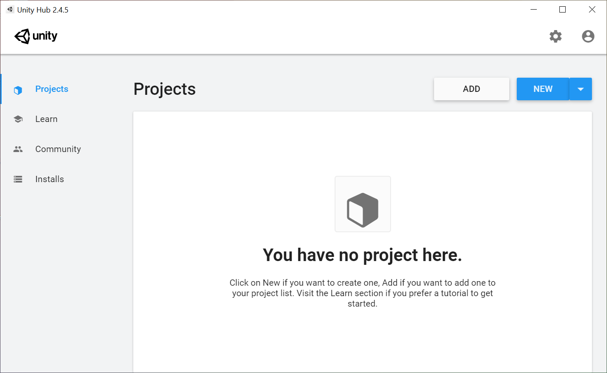{fig-align="center"}

 We can stick with the default 3D template and name the project OpenVINO_YOLOX_Demo. Take note of where the project will be generated and click Create.

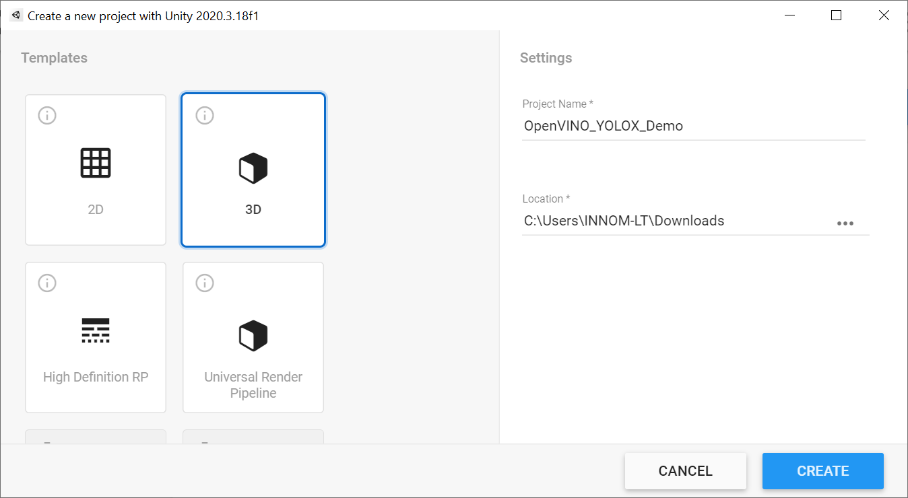{fig-align="center"}


 

## Add GUI

At the moment, we cannot use our OpenVINO plugin inside the Unity editor. There appears to be a dependency conflict between one of the dependencies for this version of OpenVINO and the Unity editor. However, this should be resolved for future versions of OpenVINO.

For now, we need to build our Unity project without the plugin files, and then add them to the build folder where the project executable file is located.

We will be using the free [Graphy](https://assetstore.unity.com/packages/tools/gui/graphy-ultimate-fps-counter-stats-monitor-debugger-105778) asset to display frame rate and other performance metrics at runtime. A simple user interface is already set up in the [prefab](https://docs.unity3d.com/Manual/Prefabs.html) linked below.

* [Canvas Prefab](https://drive.google.com/file/d/1e7hYBM7rBsqhvjWThfpMKbYbUVCBUPLM/view?usp=sharing)

### Import Canvas Prefab

Download the Canvas.prefab file from the above link and drop it into the assets folder in the Unity editor.

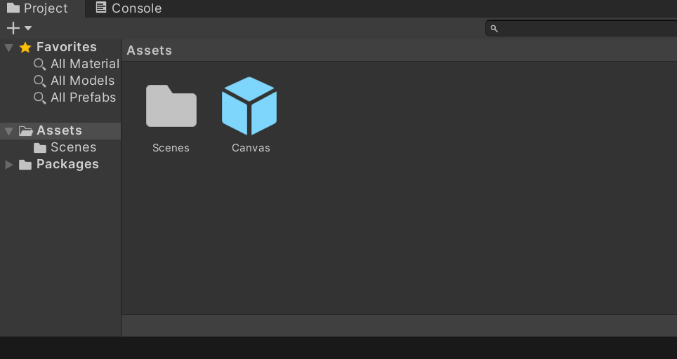{fig-align="center"}

 

Drag and drop the prefab from the Assets folder into the Hierarchy tab. A TMP Importer popup window will appear. Click Import TMP Essentials. Close the popup window once the import is complete.

{fig-align="center"}

If we select the Game tab, we can see the interface we just added. Don't worry if it looks squished.

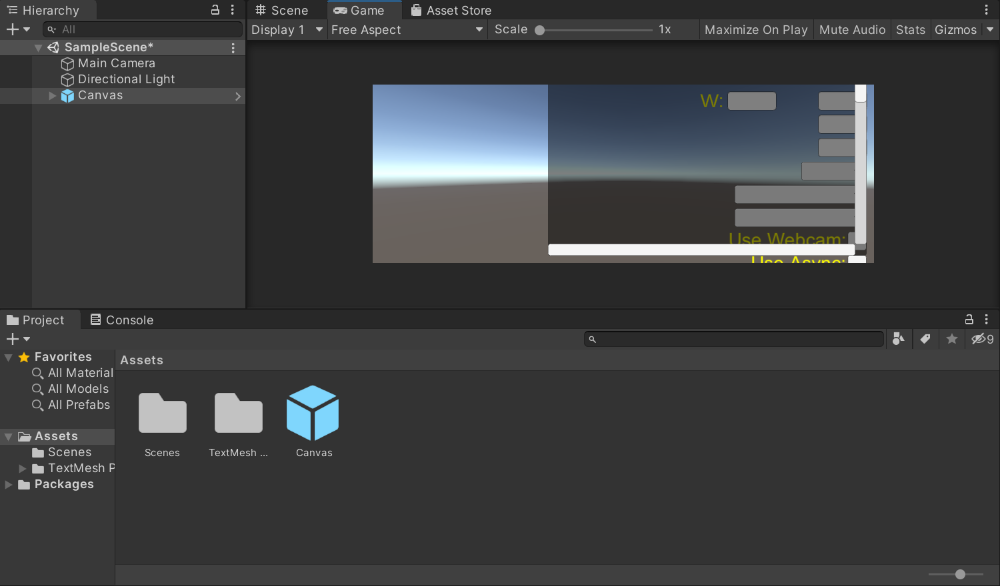{fig-align="center"}

 

### Install Graphy Package

This next step requires being signed into a Unity account. Open the link to the Graphy Unity Store page below and click Add to My Assets.

* Graphy Asset Store Page: ([link](https://assetstore.unity.com/packages/tools/gui/graphy-ultimate-fps-counter-stats-monitor-debugger-105778))

{fig-align="center"}

 

The Add to My Assets button should change to Open In Unity. Click the button again to open the asset in the Package Manager back in the editor.

The Package Manager window should popup in the editor with the Graphy asset selected. Click the download button in the bottom right corner.

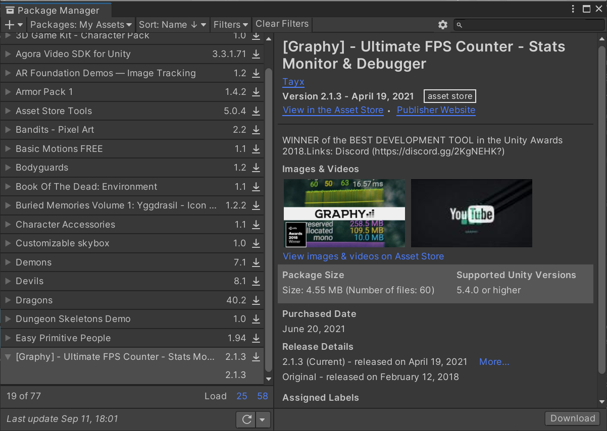{fig-align="center"}

 

Click Import once the package is finished downloading. An Import Unity Package popup window will appear.

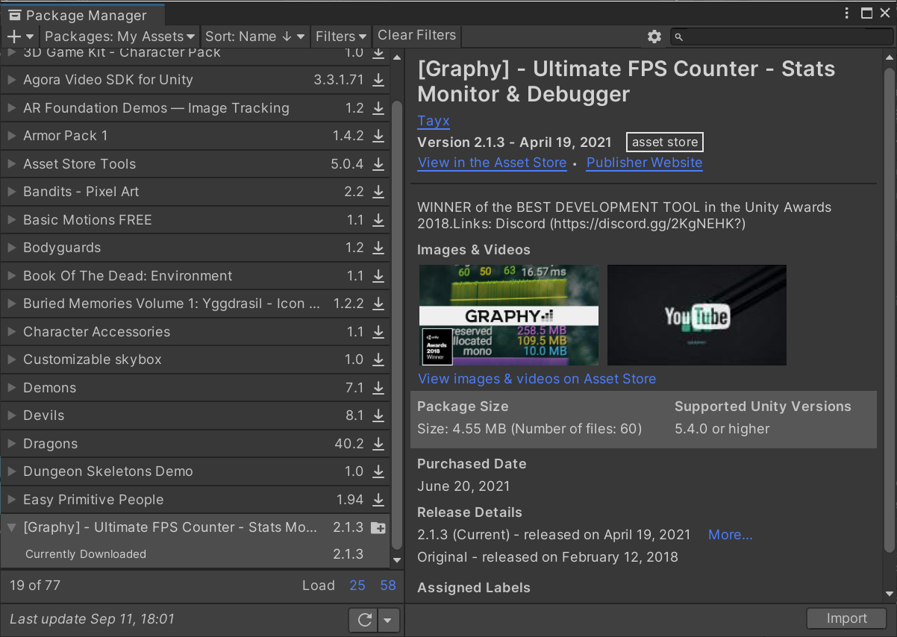{fig-align="center"}


 

Click Import in the popup window. Close the Package Manager window once the import is complete. There should now be a new folder called Graphy - Ultimate Stats Monitor in the Assets folder.

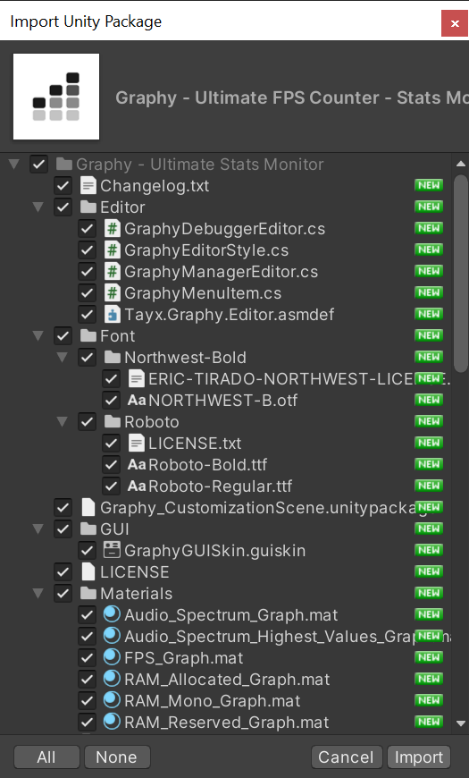{fig-align="center"}

 

Inside the new folder, open the Prefab folder and drag the [Graphy] prefab into the Hierarchy tab. We will see that our game scene gets updated.

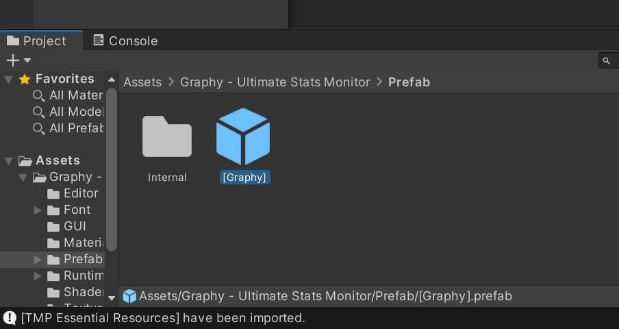{fig-align="center"}

 

With the `[Graphy]` object still selected in the Hierarchy tab. Scroll down in the Inspector tab to the Graphy Manager (Script) section. Open the Graph modules position dropdown and select TOP_LEFT. Nothing will change in the game view, but the position will be updated when we build the project. 

{fig-align="center"}

 

 

## Create Video Player

For this demo, we will obtain our input images from a video or webcam feed playing in the scene.

### Create the Videos Folder

In the Assets window, right-click an empty space, select the Create option, and click Folder. Name the folder Videos.

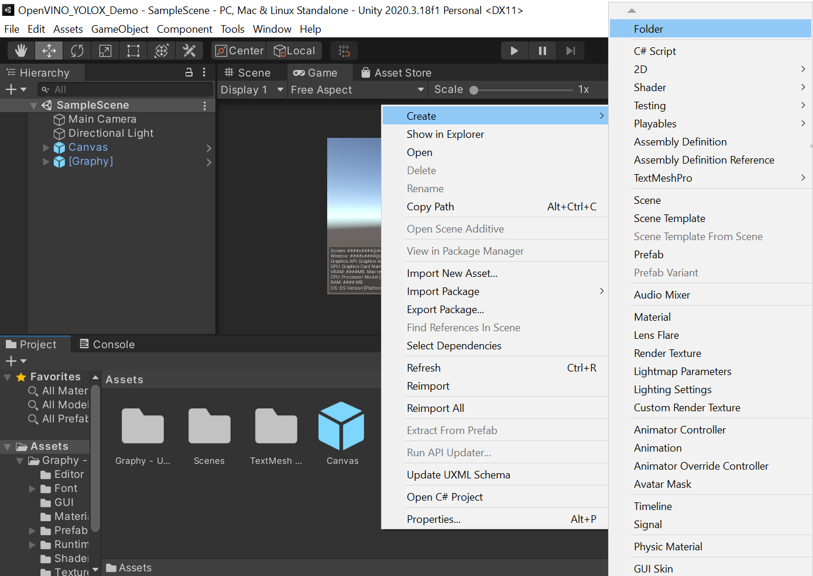{fig-align="center"}

 

Double-click the Videos folder to open it.

### Add Video Files

Drag and drop any video files from the file explorer into the Videos folder. We will be using the file names to populate the dropdown menu in the UI, so rename the files according to their target object class.

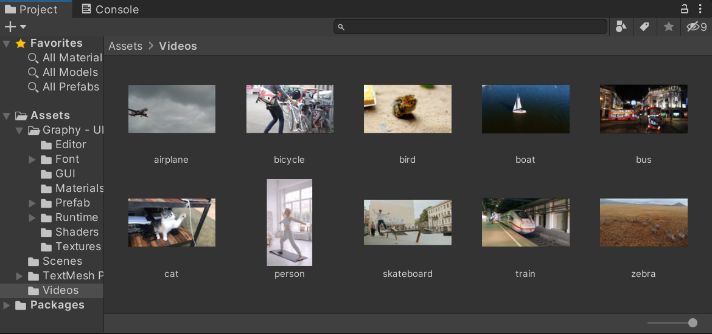{fig-align="center"}

 

### Create the Video Screen

We will use a [Quad](https://docs.unity3d.com/Manual/PrimitiveObjects.html) object for the screen. Right-click an empty space in the Hierarchy tab. Select the 3D Object section and click Quad. We can just name it VideoScreen.

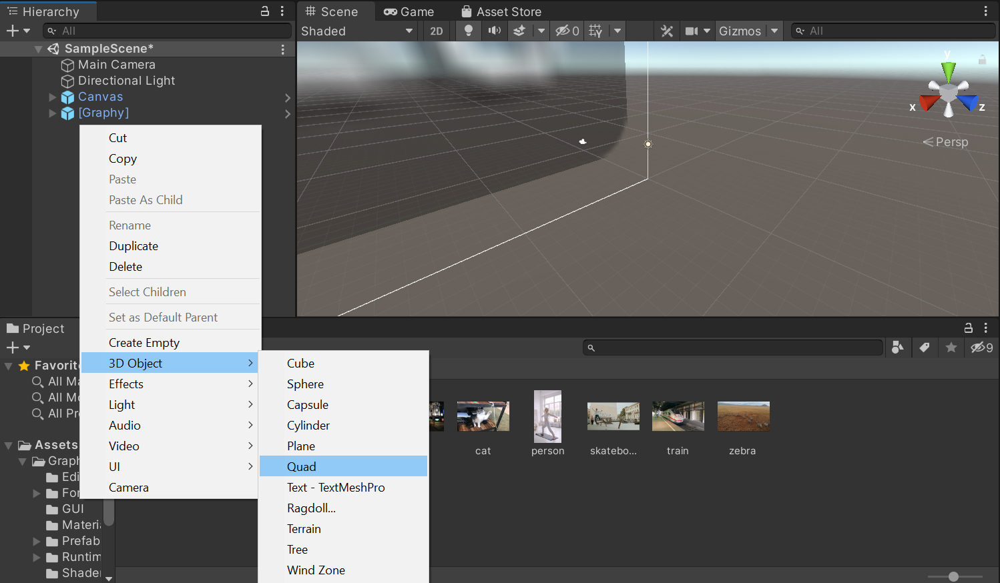{fig-align="center"}

 

We will be updating the VideoScreen dimensions in code based on the resolution of the video or webcam feed.

### Add Video Player Component

Unity has a [Video Player component](https://docs.unity3d.com/Manual/class-VideoPlayer.html) that provides the functionality to attach video files to the VideoScreen. With the VideoScreen object selected in the Hierarchy tab, click the Add Component button in the Inspector tab.

{fig-align="center"}

 

Type video into the search box and select Video Player from the search results.

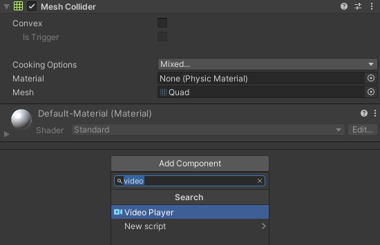{fig-align="center"}

 

We do not need to manually assign a video clip as this will be done in code.

### Make the Video Loop

Tick the Loop checkbox in the Inspector tab to make the video repeat when the project is running.

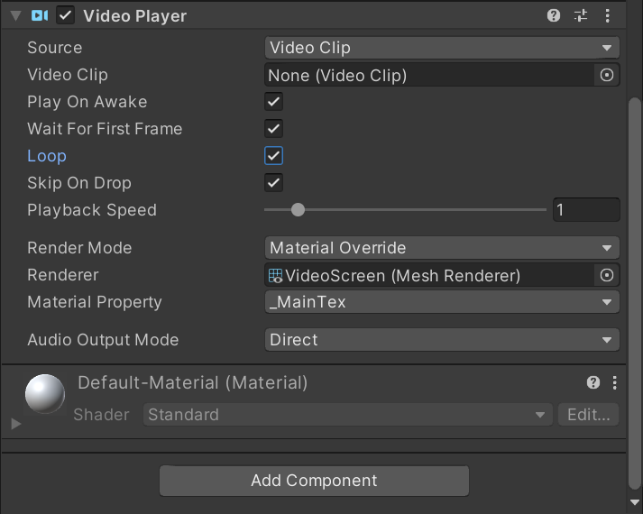{fig-align="center"}

 

## Add Label Canvas

We will attach the labels for each bounding box to a separate Canvas rather than the one containing the user interface. This will allow us to hide the user interface without hiding the labels.

Right-click an empty space in the Hierarchy tab. Select the UI section and click Canvas. We can just name it Label Canvas.

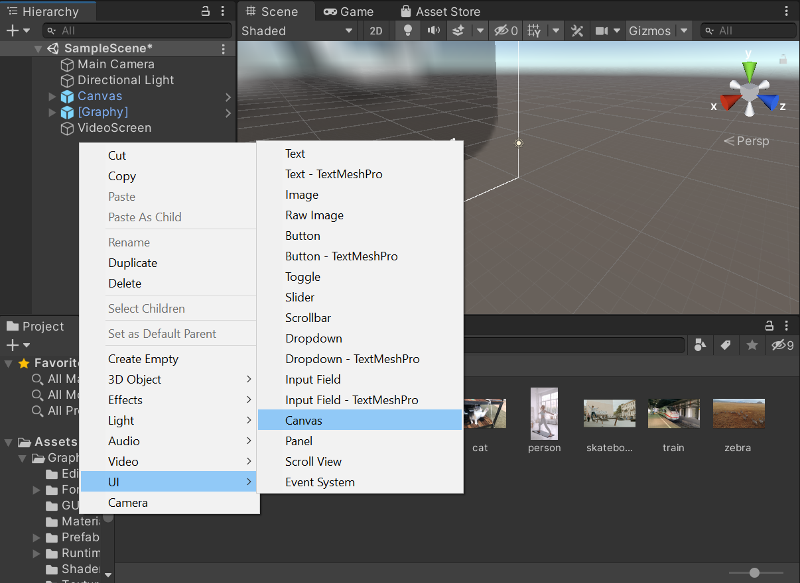{fig-align="center"}

 

## Enable Unsafe Code

In order to pass references to Unity variables to the OpenVINO plugin we will need to enable [unsafe](https://docs.microsoft.com/en-us/dotnet/csharp/language-reference/keywords/unsafe) code. Open the Edit menu at the top of the Unity Editor and select Project Settings.

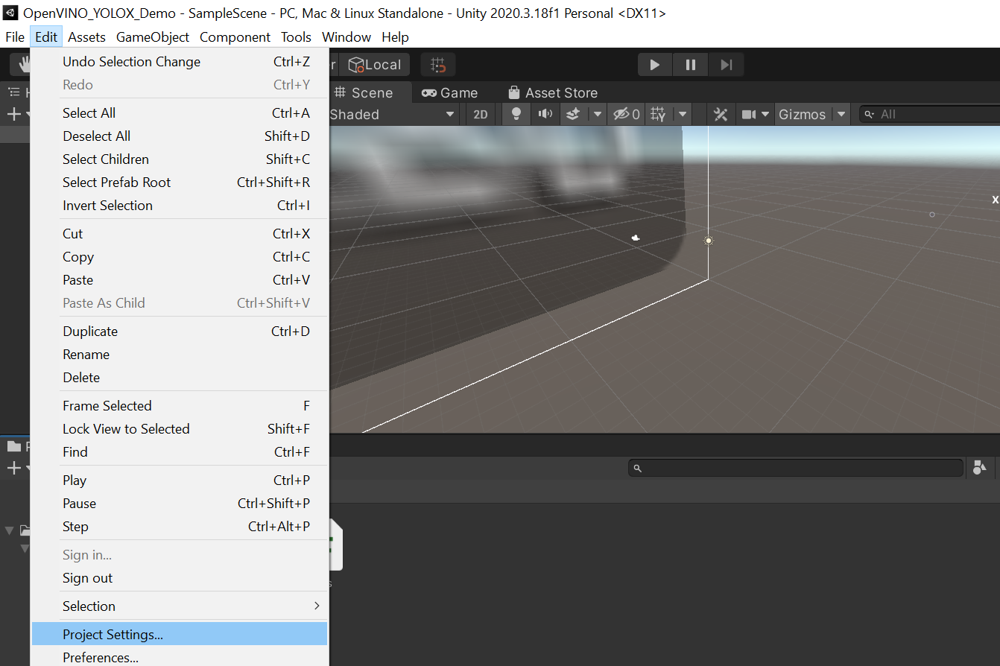{fig-align="center"}


Select Player from the side menu and open the Other Settings dropdown menu.

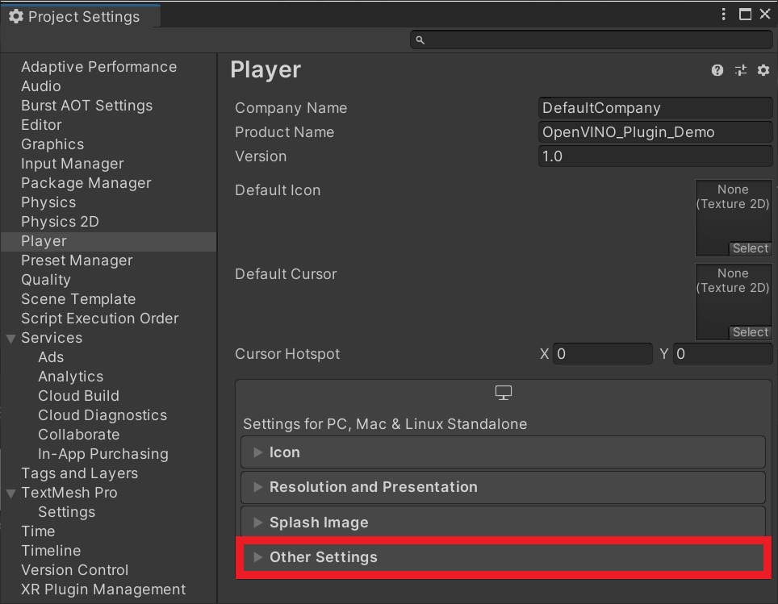{fig-align="center"}


Scroll down to the Allow 'unsafe' Code checkbox and enable it.

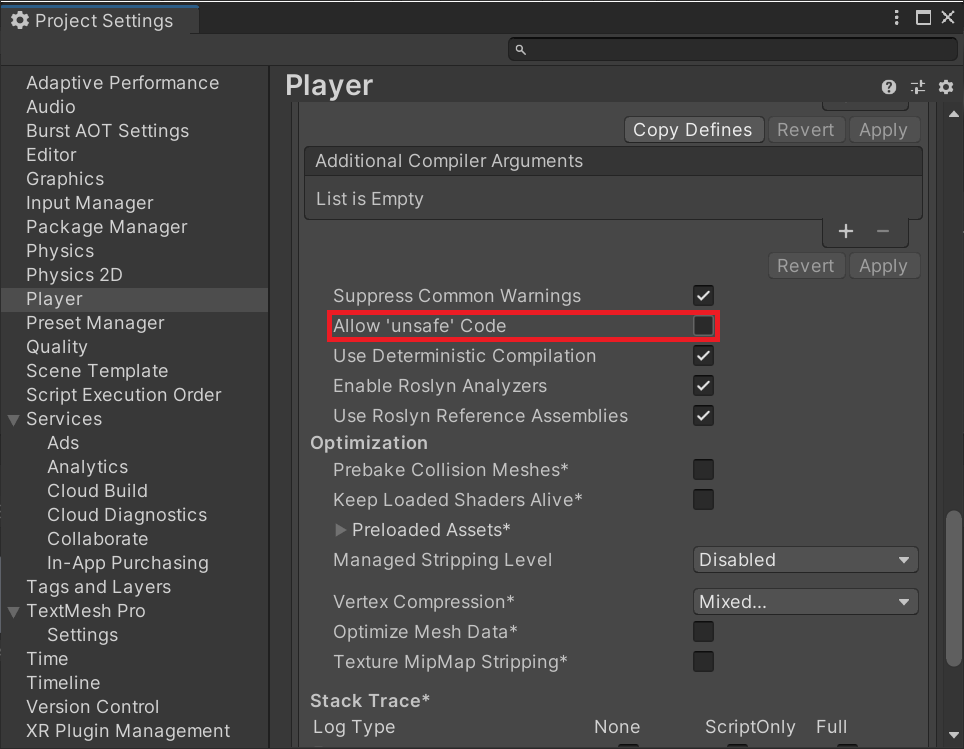{fig-align="center"}


 

## Include Unlit Shaders

We will be using Unlit shaders for both the video screen and the bounding boxes. By default, Unlit shaders are not included in project builds. We need to manually include them in the project settings. 

While still in the Project Settings window, select the Graphics submenu and scroll down to the Always Included Shaders section. Update the Size value to add an extra Element spot.

{fig-align="center"}


 Select the new bottom shader spot.

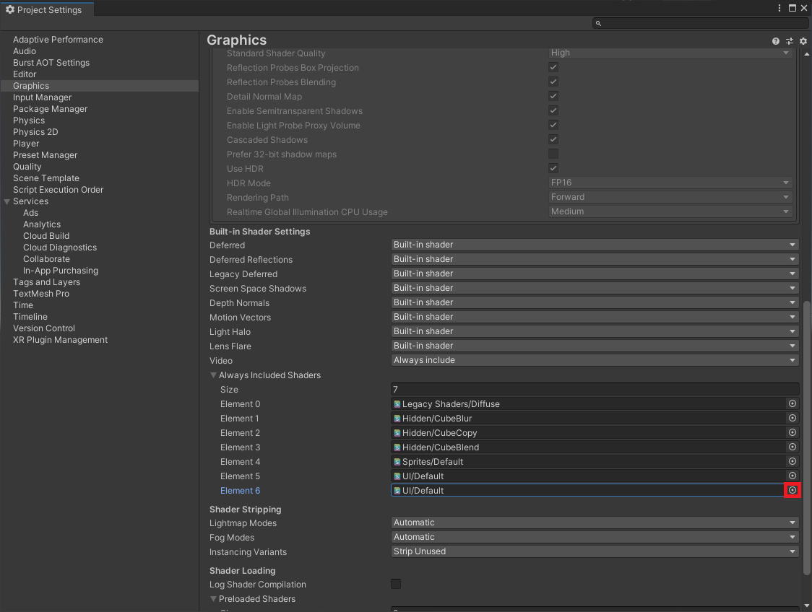{fig-align="center"}


Type Unlit/Texture shader into the Select Shader window and select Unlit/Texture from the available options. We can then close the Select Shader window.

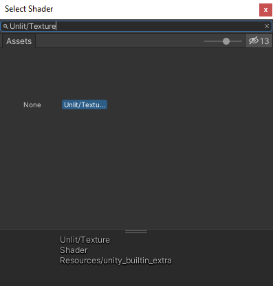{fig-align="center"}

 

We will also need the Unlit/Color shader for the bounding boxes so repeat these steps to add it as well.

{fig-align="center"}


Now we can close the project settings window.

 

## Set Background Color

One last thing we can do to make things a bit cleaner is to set the background color to a solid color. This will look a bit nicer when we play videos that have a different aspect ratio than the screen.

Select the Main Camera object in the Hierarchy tab. Over in the Inspector tab, open the Clear Flags dropdown and select Solid Color.

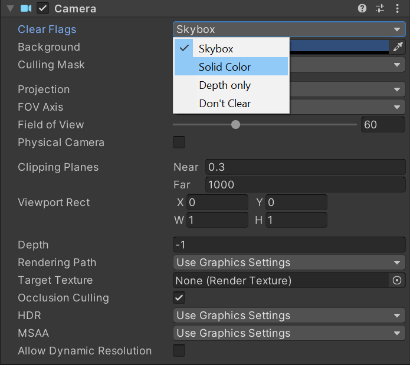{fig-align="center"}

 

Click on the color bar next to Background to set the color. 

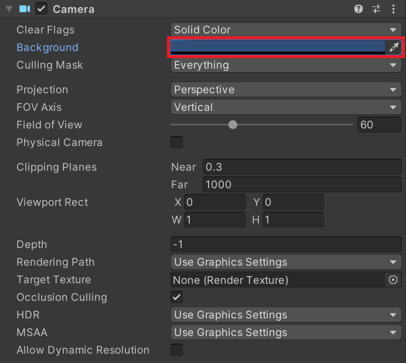{fig-align="center"}

 

We can make it pure black by setting the RGB color values to 0.

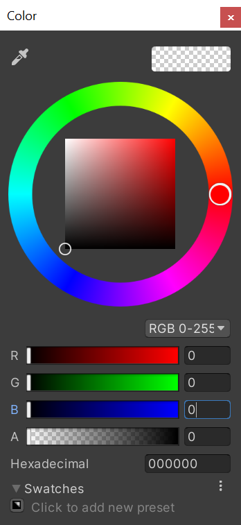{fig-align="center"}

 

 

 

 

 

## Set Up Project Code

Now, we can implement the code for the project.

### ImageProcessing Compute Shader

The pixel data from Unity gets flipped when loaded into the cv::Mat texture variable in the DLL. We will need to flip the image before sending it to the plugin so that it will be in the correct orientation for the model. We'll implement these steps on the GPU in a [compute shader](https://docs.unity3d.com/Manual/class-ComputeShader.html).

#### Create the Asset File

Create a new assets folder called Shaders. Enter the Shaders folder and right-click an empty space. Select Shader in the Create submenu and click Compute Shader. We’ll name it ImageProcessing.

#### Remove the Default Code

Open the ImageProcessing file in the code editor. By default, the ComputeShader will contain the following code.

```c#
// Each #kernel tells which function to compile; you can have many kernels
#pragma kernel CSMain

// Create a RenderTexture with enableRandomWrite flag and set it
// with cs.SetTexture
RWTexture2D<float4> Result;

[numthreads(8,8,1)]
void CSMain (uint3 id : SV_DispatchThreadID)
{
    // TODO: insert actual code here!

    Result[id.xy] = float4(id.x & id.y, (id.x & 15)/15.0, (id.y & 15)/15.0, 0.0);
}
```

Delete the CSMain function along with the #pragma kernel CSMain.

#### Create FlipXAxis() Function

Next, we need to add a Texture2D variable to store the input image. Name it InputImage and give it a data type of <half4>. Use the same data type for the Result variable as well.

We also need to know the height and width of the image to swap the pixel values. We'll store these values in int variables and store the new (x,y) coordinates for individual pixel values in an int2 variable.

##### Code:

```c#
// Each #kernel tells which function to compile; you can have many kernels
#pragma kernel FlipXAxis

// Create a RenderTexture with enableRandomWrite flag and set it
// with cs.SetTexture
RWTexture2D<half4> Result;
// Stores the input image and is set with cs.SetTexture
Texture2D<half4> InputImage;

// The height of the input image
int height;
// Stores the new location for individual pixel values
int2 coords;

[numthreads(4, 4, 1)]
void FlipXAxis(uint3 id : SV_DispatchThreadID)
{
    // Update the y value for the pixel coordinates
    coords = int2(id.x, height - id.y);
    Result[id.xy] = float4(InputImage[coords].x, InputImage[coords].y, InputImage[coords].z, 1.0f);
}
```

 

### Create Utils Script

We need to create an Object struct for Unity to match the one we defined for the OpenVINO code. We will place the Object and the list of object classes inside a separate C# script called Utils so that we can access them from multiple scripts.

#### Create the Asset File

Create a new assets folder called Scripts. In the Scripts folder, right-click an empty space and select C# Script in the Create submenu. Name the script Utils.

#### Required Namespaces

We will start by adding the required namespaces at the top of the script.

* [System](https://docs.microsoft.com/en-us/dotnet/api/system?view=net-5.0): Contains fundamental classes and base classes that define commonly-used value and reference data types, events and event handlers, interfaces, attributes, and processing exceptions. 

* [System.Runtime.InteropServices](https://docs.microsoft.com/en-us/dotnet/api/system.runtime.interopservices?view=net-5.0): Provides a wide variety of members that support COM interop and platform invoke services.

```c#
using UnityEngine;
using System;
using System.Runtime.InteropServices;
```


#### Object Struct

The Object struct in Unity has the exact same variables as the one in the DLL. We need to specify how the data in the struct is organized so that we can properly modify the Object array in the PopulateObjectsArray() function. We can use the [StructLayout](https://docs.microsoft.com/en-us/dotnet/api/system.runtime.interopservices.structlayoutattribute?view=net-5.0) attribute to indicate how the data is laid out. In our case, the data is laid out sequentially, so we specify [LayoutKind.Sequential](https://docs.microsoft.com/en-us/dotnet/api/system.runtime.interopservices.layoutkind?view=net-5.0).

##### Code:

```c#
// Indicate that the members of the struct are laid out sequentially
[StructLayout(LayoutKind.Sequential)]
/// <summary>
/// Stores the information for a single object
/// </summary> 
public struct Object
{
    // The X coordinate for the top left bounding box corner
    public float x0;
    // The Y coordinate for the top left bounding box corner
    public float y0;
    // The width of the bounding box
    public float width;
    // The height of the bounding box
    public float height;
    // The object class index for the detected object
    public int label;
    // The model confidence score for the object
    public float prob;

    public Object(float x0, float y0, float width, float height, int label, float prob)
    {
        this.x0 = x0;
        this.y0 = y0;
        this.width = width;
        this.height = height;
        this.label = label;
        this.prob = prob;
    }
}
```


#### object_classes Tuple

We will store the ordered list of object classes along with unique color codes in a Tuple array. The color codes will be used to set the color for the bounding boxes.

**Note:** The object classes need to be in the same order as what the model was trained on. This array will need to be updated when using models trained on a different dataset.

##### Code:

```c#
/// <summary>
/// The color coded, ordered list of object classes the model was trained to detect
/// </summary>
public static Tuple<string, Color>[] object_classes = new Tuple<string, Color>[] 
{
    Tuple.Create("person",         new Color(0.000f, 0.447f, 0.741f)),
    Tuple.Create("bicycle",        new Color(0.850f, 0.325f, 0.098f)),
    Tuple.Create("car",            new Color(0.929f, 0.694f, 0.125f)),
    Tuple.Create("motorcycle",     new Color(0.494f, 0.184f, 0.556f)),
    Tuple.Create("airplane",       new Color(0.466f, 0.674f, 0.188f)),
    Tuple.Create("bus",            new Color(0.301f, 0.745f, 0.933f)),
    Tuple.Create("train",          new Color(0.635f, 0.078f, 0.184f)),
    Tuple.Create("truck",          new Color(0.300f, 0.300f, 0.300f)),
    Tuple.Create("boat",           new Color(0.600f, 0.600f, 0.600f)),
    Tuple.Create("traffic light",  new Color(1.000f, 0.000f, 0.000f)),
    Tuple.Create("fire hydrant",   new Color(1.000f, 0.500f, 0.000f)),
    Tuple.Create("stop sign",      new Color(0.749f, 0.749f, 0.000f)),
    Tuple.Create("parking meter",  new Color(0.000f, 1.000f, 0.000f)),
    Tuple.Create("bench",          new Color(0.000f, 0.000f, 1.000f)),
    Tuple.Create("bird",           new Color(0.667f, 0.000f, 1.000f)),
    Tuple.Create("cat",            new Color(0.333f, 0.333f, 0.000f)),
    Tuple.Create("dog",            new Color(0.333f, 0.667f, 0.000f)),
    Tuple.Create("horse",          new Color(0.333f, 1.000f, 0.000f)),
    Tuple.Create("sheep",          new Color(0.667f, 0.333f, 0.000f)),
    Tuple.Create("cow",            new Color(0.667f, 0.667f, 0.000f)),
    Tuple.Create("elephant",       new Color(0.667f, 1.000f, 0.000f)),
    Tuple.Create("bear",           new Color(1.000f, 0.333f, 0.000f)),
    Tuple.Create("zebra",          new Color(1.000f, 0.667f, 0.000f)),
    Tuple.Create("giraffe",        new Color(1.000f, 1.000f, 0.000f)),
    Tuple.Create("backpack",       new Color(0.000f, 0.333f, 0.500f)),
    Tuple.Create("umbrella",       new Color(0.000f, 0.667f, 0.500f)),
    Tuple.Create("handbag",        new Color(0.000f, 1.000f, 0.500f)),
    Tuple.Create("tie",            new Color(0.333f, 0.000f, 0.500f)),
    Tuple.Create("suitcase",       new Color(0.333f, 0.333f, 0.500f)),
    Tuple.Create("frisbee",        new Color(0.333f, 0.667f, 0.500f)),
    Tuple.Create("skis",           new Color(0.333f, 1.000f, 0.500f)),
    Tuple.Create("snowboard",      new Color(0.667f, 0.000f, 0.500f)),
    Tuple.Create("sports ball",    new Color(0.667f, 0.333f, 0.500f)),
    Tuple.Create("kite",           new Color(0.667f, 0.667f, 0.500f)),
    Tuple.Create("baseball bat",   new Color(0.667f, 1.000f, 0.500f)),
    Tuple.Create("baseball glove", new Color(1.000f, 0.000f, 0.500f)),
    Tuple.Create("skateboard",     new Color(1.000f, 0.333f, 0.500f)),
    Tuple.Create("surfboard",      new Color(1.000f, 0.667f, 0.500f)),
    Tuple.Create("tennis racket",  new Color(1.000f, 1.000f, 0.500f)),
    Tuple.Create("bottle",         new Color(0.000f, 0.333f, 1.000f)),
    Tuple.Create("wine glass",     new Color(0.000f, 0.667f, 1.000f)),
    Tuple.Create("cup",            new Color(0.000f, 1.000f, 1.000f)),
    Tuple.Create("fork",           new Color(0.333f, 0.000f, 1.000f)),
    Tuple.Create("knife",          new Color(0.333f, 0.333f, 1.000f)),
    Tuple.Create("spoon",          new Color(0.333f, 0.667f, 1.000f)),
    Tuple.Create("bowl",           new Color(0.333f, 1.000f, 1.000f)),
    Tuple.Create("banana",         new Color(0.667f, 0.000f, 1.000f)),
    Tuple.Create("apple",          new Color(0.667f, 0.333f, 1.000f)),
    Tuple.Create("sandwich",       new Color(0.667f, 0.667f, 1.000f)),
    Tuple.Create("orange",         new Color(0.667f, 1.000f, 1.000f)),
    Tuple.Create("broccoli",       new Color(1.000f, 0.000f, 1.000f)),
    Tuple.Create("carrot",         new Color(1.000f, 0.333f, 1.000f)),
    Tuple.Create("hot dog",        new Color(1.000f, 0.667f, 1.000f)),
    Tuple.Create("pizza",          new Color(0.333f, 0.000f, 0.000f)),
    Tuple.Create("donut",          new Color(0.500f, 0.000f, 0.000f)),
    Tuple.Create("cake",           new Color(0.667f, 0.000f, 0.000f)),
    Tuple.Create("chair",          new Color(0.833f, 0.000f, 0.000f)),
    Tuple.Create("couch",          new Color(1.000f, 0.000f, 0.000f)),
    Tuple.Create("potted plant",   new Color(0.000f, 0.167f, 0.000f)),
    Tuple.Create("bed",            new Color(0.000f, 0.333f, 0.000f)),
    Tuple.Create("dining table",   new Color(0.000f, 0.500f, 0.000f)),
    Tuple.Create("toilet",         new Color(0.000f, 0.667f, 0.000f)),
    Tuple.Create("tv",             new Color(0.000f, 0.833f, 0.000f)),
    Tuple.Create("laptop",         new Color(0.000f, 1.000f, 0.000f)),
    Tuple.Create("mouse",          new Color(0.000f, 0.000f, 0.167f)),
    Tuple.Create("remote",         new Color(0.000f, 0.000f, 0.333f)),
    Tuple.Create("keyboard",       new Color(0.000f, 0.000f, 0.500f)),
    Tuple.Create("cell phone",     new Color(0.000f, 0.000f, 0.667f)),
    Tuple.Create("microwave",      new Color(0.000f, 0.000f, 0.833f)),
    Tuple.Create("oven",           new Color(0.000f, 0.000f, 1.000f)),
    Tuple.Create("toaster",        new Color(0.000f, 0.000f, 0.000f)),
    Tuple.Create("sink",           new Color(0.143f, 0.143f, 0.143f)),
    Tuple.Create("refrigerator",   new Color(0.286f, 0.286f, 0.286f)),
    Tuple.Create("book",           new Color(0.429f, 0.429f, 0.429f)),
    Tuple.Create("clock",          new Color(0.571f, 0.571f, 0.571f)),
    Tuple.Create("vase",           new Color(0.714f, 0.714f, 0.714f)),
    Tuple.Create("scissors",       new Color(0.857f, 0.857f, 0.857f)),
    Tuple.Create("teddy bear",     new Color(0.000f, 0.447f, 0.741f)),
    Tuple.Create("hair drier",     new Color(0.314f, 0.717f, 0.741f)),
    Tuple.Create("toothbrush",     new Color(0.50f, 0.5f, 0f))
};
```

 

### Create BoundingBox Script

We will implement the functionality for creating bounding boxes in a new script called BoundingBox. The BoundingBox class will handle creating a single bounding box along with updating its object class, position, and size. We will be creating as many BoundingBox instances as needed to handle the number of objects specified by the GetObjectCount() function.

#### Required Namespaces

* [TMPro](https://docs.unity3d.com/Packages/com.unity.textmeshpro@1.3/api/TMPro.html): Provides advanced text rendering capabilities

```c#
using UnityEngine;
using TMPro;
```


#### Properties

* bbox: A new [GameObject](https://docs.unity3d.com/ScriptReference/GameObject.html) will be created for each bounding box.

* text: The text showing the labe and confidence score will be stored in a separate GameObject as it needs to be attached to a Canvas

* canvas: We will store a reference to the Label Canvas object so that we can attach the text object to it. 

* info: This will store the Object struct for the bounding box.

* color: This will store the color specific to the current object class

* lineWidth: We shall set the line thickness for the bounding box based on the current screen size. Feel free to make this larger or smaller based on personal preference.

* fontSize: We shall also set the font size for the bounding box text based on the current screen size. Again, feel free to adjust this based on personal preference.

* textContent: We can display the text for the bounding using the [TextMeshProUGUI](https://docs.unity3d.com/Packages/com.unity.textmeshpro@1.1/api/TMPro.TextMeshProUGUI.html) component. We will attach this component to the text object.

* lineRenderer: We can draw the bounding box itself using a [LineRenderer](https://docs.unity3d.com/Manual/class-LineRenderer.html) component. We will attach this component to the bbox object.

##### Code:

```c#
// Contains the bounding box
private GameObject bbox = new GameObject();
// Contains the label text
private GameObject text = new GameObject();
// The canvas on which the bounding box labels will be drawn
private GameObject canvas = GameObject.Find("Label Canvas");

// The object information for the bounding box
private Utils.Object info;

// The object class color
private Color color;

// The adjusted line width for the bounding box
private int lineWidth = (int)(Screen.width * 1.75e-3);
// The adjusted font size based on the screen size
private float fontSize = (float)(Screen.width * 9e-3);

// The label text
private TextMeshProUGUI textContent;

// Draws the bounding box
private LineRenderer lineRenderer;
```


#### InitializeLabel()

The text for each bounding box will contain the name of the object class and the confidence score from the model output.

We shall make the text the color specified by the object class, left-justified, and aligned in the middle of the text box. The default size of the text box might be too small for some of the longer object names, so we shall make it a bit wider as well.

The text will be positioned just above the top-left corner of the bounding box. We can use the [WorldToScreenPoint()](https://docs.unity3d.com/ScriptReference/Camera.WorldToScreenPoint.html) method to map the desired in-game position to screen space.

##### Code:

```c#
/// <summary>
/// Initialize the label for the bounding box
/// </summary>
/// <param name="label"></param>
private void InitializeLabel()
{
    // Set the label text
    textContent.text = $"{text.name}: {(info.prob * 100).ToString("0.##")}%";
    // Set the text color
    textContent.color = color;
    // Set the text alignment
    textContent.alignment = TextAlignmentOptions.MidlineLeft;
    // Set the font size
    textContent.fontSize = fontSize;
    // Resize the text area
    RectTransform rectTransform = text.GetComponent<RectTransform>();
    rectTransform.sizeDelta = new Vector2(250, 50);
    // Position the label above the top left corner of the bounding box
    Vector3 textPos = Camera.main.WorldToScreenPoint(new Vector3(info.x0, info.y0, -10f));
    float xOffset = rectTransform.rect.width / 2;
    textPos = new Vector3(textPos.x + xOffset, textPos.y + textContent.fontSize, textPos.z);
    text.transform.position = textPos;
}
```


#### ToggleBBox()

We can toggle the visibility for the bounding box and text using the [SetActive()](https://docs.unity3d.com/ScriptReference/GameObject.SetActive.html) method. We will use this to hide any extra bounding boxes and to unhide them when they are needed again. 

##### Code:

```c#
/// <summary>
/// Toggle the visibility for the bounding box
/// </summary>
/// <param name="show"></param>
public void ToggleBBox(bool show)
{
    bbox.SetActive(show);
    text.SetActive(show);
}
```


#### InitializeBBox()

The bounding box will be the color specified by the object class. The lineRender will consist of five points to create a closed box; four for each corner and one to close the box.

1. Point #0: Top-left corner

2.     Point #1: Top-right corner

3.     Point #2: Bottom-right corner

4.     Point #3: Bottom-left corner

5.     Point #4: Top-left corner (close loop)

##### Code:

```c#
/// <summary>
/// Initialize the position and dimensions for the bounding box
/// </summary>
private void InitializeBBox()
{
    // Set the material color
    lineRenderer.material.color = color;

    // The bbox will consist of five points
    lineRenderer.positionCount = 5;

    // Set the width from the start point
    lineRenderer.startWidth = lineWidth;
    // Set the width from the end point
    lineRenderer.endWidth = lineWidth;

    // Get object information
    float x0 = info.x0;
    float y0 = info.y0;
    float width = info.width;
    float height = info.height;

    // Offset value to align the bounding box points
    float offset = lineWidth / 2;

    // Top left point
    Vector3 pos0 = new Vector3(x0, y0, 0);
    lineRenderer.SetPosition(0, pos0);
    // Top right point
    Vector3 pos1 = new Vector3(x0 + width, y0, 0);
    lineRenderer.SetPosition(1, pos1);
    // Bottom right point
    Vector3 pos2 = new Vector3(x0 + width, (y0 - height) + offset, 0);
    lineRenderer.SetPosition(2, pos2);
    // Bottom left point
    Vector3 pos3 = new Vector3(x0 + offset, (y0 - height) + offset, 0);
    lineRenderer.SetPosition(3, pos3);
    // Closing Point
    Vector3 pos4 = new Vector3(x0 + offset, y0 + offset, 0);
    lineRenderer.SetPosition(4, pos4);

    // Make sure the bounding box is visible
    ToggleBBox(true);
}
```


#### SetObjectInfo()

We will call the InitializeLabel() and InitializeBBox() methods from a new method called SetObjectInfo(). This method will also update the names for the bbox and text objects along with the color. We will use this method to update the bounding boxes based on the latest model output.

##### Code:

```c#
/// <summary>
/// Update the object info for the bounding box
/// </summary>
/// <param name="objectInfo"></param>
public void SetObjectInfo(Utils.Object objectInfo)
{
    // Set the object info
    info = objectInfo;
    // Get the object class label
    bbox.name = Utils.object_classes[objectInfo.label].Item1;
    text.name = bbox.name;
    // Get the object class color
    color = Utils.object_classes[objectInfo.label].Item2;

    // Initialize the label
    InitializeLabel();
    // Initialize the position and dimensions
    InitializeBBox();
}
```


#### Constructor

There are a few steps we need to take whenever we create a new BoundingBox instance.

First, we need to attach the textContent component to the text object and make the text object a child of the Label Canvas.

Next, we need to add the lineRender component to the bbox object and give it a new material with an Unlit/Color shader.

Lastly, we call the SetObjectInfo() method to update the bounding box and text. 

##### Code:

```c#
/// <summary>
/// Constructor for the bounding box
/// </summary>
/// <param name="objectInfo"></param>
public BoundingBox(Utils.Object objectInfo)
{
    // Add a text component to store the label text
    textContent = text.AddComponent<TextMeshProUGUI>();
    // Assign text object to the label canvas
    text.transform.SetParent(canvas.transform);

    // Add a line renderer to draw the bounding box
    lineRenderer = bbox.AddComponent<LineRenderer>();
    // Make LineRenderer Shader Unlit
    lineRenderer.material = new Material(Shader.Find("Unlit/Color"));

    // Update the object info for the bounding box
    SetObjectInfo(objectInfo);
}

```

 

### Create ObjectDetector Script

We will implement the functionality for calling the plugin functions and handling the model output in a new script. Open the Scripts folder in the Assets section and create a new C# script called ObjectDetector.

#### Add Required Namespaces

* [System](https://docs.microsoft.com/en-us/dotnet/api/system?view=net-5.0): Contains fundamental classes and base classes that define commonly-used value and reference data types, events and event handlers, interfaces, attributes, and processing exceptions. 

* [System.Runtime.InteropServices](https://docs.microsoft.com/en-us/dotnet/api/system.runtime.interopservices?view=net-5.0): Provides a wide variety of members that support COM interop and platform invoke services. 

* [UnityEngine.UI](https://docs.unity3d.com/Packages/com.unity.ugui@1.0/api/UnityEngine.UI.html): Provides access to UI elements.

* UnityEngine.Video: Provides access to the functionality for the Video Player component.

* [UnityEngine.Rendering](https://docs.unity3d.com/Packages/com.unity.render-pipelines.core@5.9/api/UnityEngine.Rendering.html): Provides access to the elements of the rendering pipeline.

##### Code:

```c#
using System.Collections.Generic;
using UnityEngine;
using UnityEngine.Video;
using UnityEngine.Rendering;
using System;
using System.Runtime.InteropServices;
using UnityEngine.UI;
```

#### Add Public Variables

* videoScreen: We need a reference to the VideoScreen object so that we can update its dimensions and access the VideoPlayer component.

* imageProcessingShader: We need a reference to the imageProcessing shader so that we can access the FlipXAxis function.

* deviceDropdown: We need access to the device dropdown menu, and update the list of available compute devices. 

* modelDropdown: The script will look for available model files when the application first starts. We will update the menu options based on what model files are found.

* videoDropdown:

* inference: The Inference toggle button in the UI will be used to indicate whether we want to execute the mode or just play the video feed.

* useWebcam: The Webcam toggle button in the UI will be used to switch between using a video file or webcam feed as input for the model.

* useAsync: The Use Async toggle button will be used to turn asynchronous GPU readback on and off (more on this later).

* consoleText: We don't have direct access to the console while running the application. However, we can capture the text that gets sent to the console and display it in the user interface. This can be useful for debugging purposes.

* videoClips: We will select which video files we want to have available in the Inspector tab.

##### Code:

```c#
[Tooltip("The screen for viewing preprocessed images")]
public Transform videoScreen;

[Tooltip("Performs the preprocessing steps")]
public ComputeShader imageProcessingShader;

[Tooltip("Switch between the available compute devices for OpenVINO")]
public TMPro.TMP_Dropdown deviceDropdown;

[Tooltip("Switch between the available OpenVINO models")]
public TMPro.TMP_Dropdown modelDropdown;

[Tooltip("Switch between the available video files")]
public TMPro.TMP_Dropdown videoDropdown;

[Tooltip("Turn stylization on and off")]
public Toggle inference;

[Tooltip("Use webcam feed as input")]
public Toggle useWebcam;

[Tooltip("Turn AsyncGPUReadback on and off")]
public Toggle useAsync;

[Tooltip("Text area to display console output")]
public Text consoleText;

[Tooltip("List of available video files")]
public VideoClip[] videoClips;
```

 

#### Create DLL Method Declarations

We need to specify the name of the .dll file. We'll store this in a const string variable called dll.

We can indicate that a given method is from a DLL by using the [ DllImport](https://docs.microsoft.com/en-us/dotnet/api/system.runtime.interopservices.dllimportattribute?view=net-5.0) attribute.

**Note:** The DLL functions that return string values have [IntPtr](https://docs.microsoft.com/en-us/dotnet/api/system.intptr?view=net-5.0) as their return values here. We will use the [Marshal.PtrToStringAnsi()](https://docs.microsoft.com/en-us/dotnet/api/system.runtime.interopservices.marshal.ptrtostringansi?view=net-5.0) method to get that string value at the memory location stored in the pointer.

##### Code:

```c#
// Name of the DLL file
const string dll = "OpenVINO_YOLOX_DLL";

[DllImport(dll)]
private static extern IntPtr GetAvailableDevices();

[DllImport(dll)]
private static extern IntPtr InitOpenVINO(string model, int width, int height, int device);

[DllImport(dll)]
private static extern void PerformInference(IntPtr inputData);

[DllImport(dll)]
private static extern void PopulateObjectsArray(IntPtr objects);

[DllImport(dll)]
private static extern int GetObjectCount();

[DllImport(dll)]
private static extern void SetNMSThreshold(float threshold);

[DllImport(dll)]
private static extern void SetConfidenceThreshold(float threshold);
```


#### Add Private Variables

* webcamDims: We will set the target resolution for a webcam to 1280x720

* videoDims: We need to keep track of the dimensions of the video screen for different methods in the script.

* targetDims: We will set the default target dims to 640x640. However, this will get updated to maintain the aspect ratio for the current video source.

* imageDims: This will store the unpadded dimensions of the image being fed to the model.

* webcamTexture: This will provide access to live video input from a webcam.

* videoTexture: This will store the current source video texture.

* rTex: This will store the texture used to create the input texture.

* inputTex: This contains the input texture that will be sent to the OpenVINO inference engine.

* performInference: Keeps track of whether to execute the OpenVINO model.

* webcamFPS: We will set the target frame rate for the webcam to 60fps.

* aspectRatioScale: Used to scale the input image dimensions while maintaining aspect ratio.

* currentDevice: Current compute device for OpenVINO.

* inputData: Stores the raw pixel data for inputTex.

* objectInfoArray: This is the Object array that we will update using the PopulateObjectsArray() function in the plugin. 

* boundingBoxes: Stores the bounding boxes for detected objects.

* deviceList: Parsed list of compute devices for OpenVINO.

* openVINOPaths: File paths for the OpenVINO IR models

* openvinoModels: Names of the OpenVINO IR model

* videoNames: Names of the available video files 

* canvas: A reference to the canvas for the user interface

* graphy: A reference to the Graphy on-screen metrics

* width: A references to the width input field for the target image dimensions

* height: A references to the height input field for the target image dimensions

##### Code:

```c#
// The requested webcam dimensions
private Vector2Int webcamDims = new Vector2Int(1280, 720);
// The dimensions of the current video source
private Vector2Int videoDims;
// The targrt resolution for input images
private Vector2Int targetDims = new Vector2Int(640, 640);
// The unpadded dimensions of the image being fed to the model
private Vector2Int imageDims = new Vector2Int(0, 0);

// Live video input from a webcam
private WebCamTexture webcamTexture;

// The source video texture
private RenderTexture videoTexture;
// The texture used to create the input texture
private RenderTexture rTex;

// Contains the input texture that will be sent to the OpenVINO inference engine
private Texture2D inputTex;

// Keeps track of whether to execute the OpenVINO model
private bool performInference = true;

// The requested webcam frame rate
private int webcamFPS = 60;

// Used to scale the input image dimensions while maintaining aspect ratio
private float aspectRatioScale;

// Current compute device for OpenVINO
private string currentDevice;

// Stores the raw pixel data for inputTex
private byte[] inputData;
// Stores information about detected objects
private Utils.Object[] objectInfoArray;

// Stores the bounding boxes for detected objects
private List<BoundingBox> boundingBoxes = new List<BoundingBox>();
// Parsed list of compute devices for OpenVINO
private List<string> deviceList = new List<string>();
// File paths for the OpenVINO IR models
private List<string> openVINOPaths = new List<string>();
// Names of the OpenVINO IR model
private List<string> openvinoModels = new List<string>();
// Names of the available video files 
private List<string> videoNames = new List<string>();

// A reference to the canvas for the user interface
private GameObject canvas;
// A reference to the Graphy on-screen metrics
private GameObject graphy;
// References to input fields for the target image dimensions
private TMPro.TMP_InputField width;
private TMPro.TMP_InputField height;
```


#### Create Log() Method

We can capture the console output using the [Applications.logMessageReceived](https://docs.unity3d.com/ScriptReference/Application-logMessageReceived.html) callback. We just need to append a function call to this callback that updates consoleText with the latest console message. This function will be called every time a log message is received. All it does is append the latest console message to the existing text for consoleText.

##### Code:

```c#
/// <summary>
/// Updates on-screen console text
/// </summary>
/// <param name="logString"></param>
/// <param name="stackTrace"></param>
/// <param name="type"></param>
public void Log(string logString, string stackTrace, LogType type)
{
    consoleText.text = consoleText.text + "\n " + logString;
}
```


#### Define OnEnable() Method

We will append the Log() method to the [Applications.logMessageReceived](https://docs.unity3d.com/ScriptReference/Application-logMessageReceived.html) callback in the [OnEnable()](https://docs.unity3d.com/ScriptReference/MonoBehaviour.OnEnable.html) method. The [OnEnable()](https://docs.unity3d.com/ScriptReference/MonoBehaviour.OnEnable.html) method is called when the GameObject the script is attached to becomes enabled.

##### Code:

```c#
// Called when the object becomes enabled and active
void OnEnable() 
{
    Application.logMessageReceived += Log;
}
```


#### Create InitializeVideoScreen() Method

We will update the position, orientation, and size of the VideoScreen object in a new method called InitializeVideoScreen. The method will take in width and height values.

First, we will set the video player component to render to a RenderTexture and set videoTexture as the target texture.

The default [shader](https://docs.unity3d.com/ScriptReference/Shader.html) assigned to the VideoScreen object needs to be replaced with an Unlit/Texture shader. This will remove the need for the screen to be lit by an in-game light.

Lastly, we will update the dimension and position of the VideoScreen object.

##### Code:

```c#
/// <summary>
/// Prepares the videoScreen GameObject to display the chosen video source.
/// </summary>
/// <param name="width"></param>
/// <param name="height"></param>
/// <param name="mirrorScreen"></param>
private void InitializeVideoScreen(int width, int height)
{
    // Set the render mode for the video player
    videoScreen.GetComponent<VideoPlayer>().renderMode = VideoRenderMode.RenderTexture;

    // Use new videoTexture for Video Player
    videoScreen.GetComponent<VideoPlayer>().targetTexture = videoTexture;

    // Apply the new videoTexture to the VideoScreen Gameobject
    videoScreen.gameObject.GetComponent<MeshRenderer>().material.shader = Shader.Find("Unlit/Texture");
    videoScreen.gameObject.GetComponent<MeshRenderer>().material.SetTexture("_MainTex", videoTexture);
    // Adjust the VideoScreen dimensions for the new videoTexture
    videoScreen.localScale = new Vector3(width, height, videoScreen.localScale.z);
    // Adjust the VideoScreen position for the new videoTexture
    videoScreen.position = new Vector3(width / 2, height / 2, 1);
}
```


#### Create InitializeWebcam() Method

When using a webcam, we will first initialize the webcamTexture with the target resolution and framerate. We will not know if the target resolution is supported by the webcam until we try playing it.

If there is no physical webcam available, Unity may try using a virtual camera from applications like [OBS](https://obsproject.com/). We can tell when this happens by checking the actual dimensions of the webcamTexture. If the resolution is set to 16x16, then it is safe to say something went wrong. When this happens, we will disable the webcam functionality.

If the webcamTexture is properly initialized, we will limit the target framerate to the same as the target frame rate for the webcam. This can help the application run more smoothly.

We will also disable the Video Player component. Lastly, we will update the values for videoDims with the final dimensions for the webcamTexture.

##### Code:

```c#
/// <summary>
/// Try to initialize and start a webcam
/// </summary>
private void InitializeWebcam()
{

    // Create a new WebCamTexture
    webcamTexture = new WebCamTexture(webcamDims.x, webcamDims.y, webcamFPS);

    // Start the Camera
    webcamTexture.Play();

    if (webcamTexture.width == 16)
    {
        webcamTexture.Stop();
        Debug.Log("\nUnable to initialize a webcam. Disabling option.\n");
        useWebcam.isOn = false;
        useWebcam.enabled = false;
    }
    else
    {
        // Limit application framerate to the target webcam framerate
        Application.targetFrameRate = webcamFPS;

        // Deactivate the Video Player
        videoScreen.GetComponent<VideoPlayer>().enabled = false;

        // Update the videoDims.y
        videoDims.y = webcamTexture.height;
        // Update the videoDims.x
        videoDims.x = webcamTexture.width;
    }
}
```


#### Create InitializeCamera() Method

Once the VideoScreen has been updated, either for a video or webcam feed, we need to resize and reposition the in-game camera. We will do so in a new method called InitializeCamera. 

We can access the Main Camera object with [GameObject.Find("Main Camera")](https://docs.unity3d.com/ScriptReference/GameObject.Find.html). We will set the X and Y coordinates to the same as the VideoScreen position.

The camera also needs to be set to [orthographic](https://docs.unity3d.com/ScriptReference/Camera-orthographic.html) mode to remove perspective.

Lastly, we need to update the size of the camera. The [orthographicSize](https://docs.unity3d.com/ScriptReference/Camera-orthographicSize.html) attribute is actually the half size, so we need to divide videoDims.y (i.e. the height) by 2 as well.

##### Code:

```c#
/// <summary>
/// Resizes and positions the in-game Camera to accommodate the video dimensions
/// </summary>
private void InitializeCamera()
{
    // Get a reference to the Main Camera GameObject
    GameObject mainCamera = GameObject.Find("Main Camera");
    // Adjust the camera position to account for updates to the VideoScreen
    mainCamera.transform.position = new Vector3(videoDims.x / 2, videoDims.y / 2, -10f);
    // Render objects with no perspective (i.e. 2D)
    mainCamera.GetComponent<Camera>().orthographic = true;
    // Adjust the camera size to account for updates to the VideoScreen
    int orthographicSize;
    if (((float)Screen.width / Screen.height) < ((float)videoDims.x / videoDims.y)){
        float scale = ((float)Screen.width / Screen.height) /
            ((float)videoDims.x / videoDims.y);
        orthographicSize = (int)((videoDims.y / 2) / scale);
    }
    else
    {
        orthographicSize = (int)(videoDims.y / 2);
    }

    Debug.Log($"Orthographic Size: {orthographicSize}");
    mainCamera.GetComponent<Camera>().orthographicSize = orthographicSize;
}
```


#### Create InitializeTextures() Method

Whenever the target input resolution is updated, we need to make sure that it maintains the same aspect ratio as the source video or webcam feed. Feeding a stretched or squashed image to the model could impact the model's accuracy.

Once we have adjusted the target input resolution, we can update rTex and inputTex with the new dimensions. We will also update the width and height input fields to make sure the user knows the adjusted resolution.

##### Code:

```c#
/// <summary>
/// Calculate the dimensions for the input image
/// </summary>
/// <param name="newVideo"></param>
private void InitializeTextures(bool newVideo = false)
{
    if (newVideo)
    {
        // Calculate scale for new  aspect ratio
        int min = Mathf.Min(videoTexture.width, videoTexture.height);
        int max = Mathf.Max(videoTexture.width, videoTexture.height);
        aspectRatioScale = (float)min / max;

        // Adjust the smallest input dimension to maintain the new aspect ratio
        if (max == videoTexture.height)
        {
            imageDims.x = (int)(targetDims.y * aspectRatioScale);
            imageDims.y = targetDims.y;
        }
        else
        {
            imageDims.y = (int)(targetDims.x * aspectRatioScale);
            imageDims.x = targetDims.x;
        }
    }
    else
    {
        // Adjust the input dimensions to maintain the current aspect ratio
        if (imageDims.x != targetDims.x)
        {
            imageDims.x = targetDims.x;
            aspectRatioScale = (float)videoTexture.height / videoTexture.width;
            imageDims.y = (int)(targetDims.x * aspectRatioScale);
            targetDims.y = imageDims.y;

        }
        if (imageDims.y != targetDims.y)
        {
            imageDims.y = targetDims.y;
            aspectRatioScale = (float)videoTexture.width / videoTexture.height;
            imageDims.x = (int)(targetDims.y * aspectRatioScale);
            targetDims.x = imageDims.x;

        }
    }

    // Initialize the RenderTexture that will store the processed input image
    rTex = RenderTexture.GetTemporary(imageDims.x, imageDims.y, 24, RenderTextureFormat.ARGB32);
    // Update inputTex with the new dimensions
    inputTex = new Texture2D(imageDims.x, imageDims.y, TextureFormat.RGBA32, false);

    // Update the values for the width and height input fields
    Debug.Log($"Setting Input Dims to W: {imageDims.x} x H: {imageDims.y}");
    width.text = $"{imageDims.x}";
    height.text = $"{imageDims.y}";
}
```


#### Create InitializeDropDowns() Method

This method will simply clear the default options for the dropdown menus in the UI, add the current options, and select the first option in the list.

##### Code:

```c#
/// <summary>
/// Initialize the options for the dropdown menus
/// </summary>
private void InitializeDropdowns()
{
    // Remove default dropdown options
    deviceDropdown.ClearOptions();
    // Add OpenVINO compute devices to dropdown
    deviceDropdown.AddOptions(deviceList);
    // Set the value for the dropdown to the current compute device
    deviceDropdown.SetValueWithoutNotify(deviceList.IndexOf(currentDevice));

    // Remove default dropdown options
    videoDropdown.ClearOptions();
    // Add OpenVINO models to menu
    videoDropdown.AddOptions(videoNames);
    // Select the first option in the dropdown
    videoDropdown.SetValueWithoutNotify(0);

    // Remove default dropdown options
    modelDropdown.ClearOptions();
    // Add OpenVINO models to menu
    modelDropdown.AddOptions(openvinoModels);
    // Select the first option in the dropdown
    modelDropdown.SetValueWithoutNotify(0);
}
```


#### Create InitializeOpenVINO() Method

We will call the InitiOpenVINO() function from the plugin in a new method called InitializeOpenVINO(). The InitiOpenVINO() function will only be called when the inference toggle is checked.

##### Code:

```c#
/// <summary>
/// Called when a model option is selected from the dropdown
/// </summary>
public void InitializeOpenVINO()
{
    // Only initialize OpenVINO when performing inference
    if (performInference == false) return;

    Debug.Log("Initializing OpenVINO");
    Debug.Log($"Selected Model: {openvinoModels[modelDropdown.value]}");
    Debug.Log($"Selected Model Path: {openVINOPaths[modelDropdown.value]}");
    Debug.Log($"Setting Input Dims to W: {imageDims.x} x H: {imageDims.y}");
    Debug.Log("Uploading IR Model to Compute Device");

    // Set up the neural network for the OpenVINO inference engine
    currentDevice = Marshal.PtrToStringAnsi(InitOpenVINO(
        openVINOPaths[modelDropdown.value],
        inputTex.width,
        inputTex.height,
        deviceDropdown.value));

    Debug.Log($"OpenVINO using: {currentDevice}");
}
```


#### Create InitializationSteps() Method

We will call the initialization methods in a new method called InitializationSteps(). This method will be called each time the model input is updated. This could be from changing the target input resolution, selecting a different video, or switching between using a webcam.

##### Code:

```c#
/// <summary>
/// Perform the initialization steps required when the model input is updated
/// </summary>
private void InitializationSteps()
{
    if (useWebcam.isOn)
    {
        // Initialize webcam
        InitializeWebcam();
    }
    else
    {
        Debug.Log($"Selected Video: {videoDropdown.value}");

        // Set Initial video clip
        videoScreen.GetComponent<VideoPlayer>().clip = videoClips[videoDropdown.value];
        // Update the videoDims.y
        videoDims.y = (int)videoScreen.GetComponent<VideoPlayer>().height;
        // Update the videoDims.x
        videoDims.x = (int)videoScreen.GetComponent<VideoPlayer>().width;
    }

    // Create a new videoTexture using the current video dimensions
    videoTexture = RenderTexture.GetTemporary(videoDims.x, videoDims.y, 24, RenderTextureFormat.ARGB32);

    // Initialize the videoScreen
    InitializeVideoScreen(videoDims.x, videoDims.y);
    // Adjust the camera based on the source video dimensions
    InitializeCamera();
    // Initialize the textures that store the model input
    InitializeTextures(true);
    // Set up the neural network for the OpenVINO inference engine
    InitializeOpenVINO();
}
```


#### Create GetOpenVINOModels()

Before we can perform the initialization steps, we need to get a list of available OpenVINO models. The models folder from part 1 of this tutorial will be placed in the same directory as the executable for the Unity application. We will search through the subfolders to obtain the paths to the .xml model files.

The actual .xml files are all named yolox_10.xml, so we will use the names of their respective parent directories for the dropdown menu options.

##### Code:

```c#
/// <summary>
/// Get the list of available OpenVINO models
/// </summary>
private void GetOpenVINOModels()
{
    // Get the subdirectories containing the available models
    string[] modelDirs = System.IO.Directory.GetDirectories("models");

    // Get the model files in each subdirectory
    List<string> openVINOFiles = new List<string>();
    foreach (string dir in modelDirs)
    {
        openVINOFiles.AddRange(System.IO.Directory.GetFiles(dir));
    }

    // Get the paths for the .xml files for each model
    Debug.Log("Available OpenVINO Models:");
    foreach (string file in openVINOFiles)
    {
        if (file.EndsWith(".xml"))
        {
            openVINOPaths.Add(file);
            string modelName = file.Split('\\')[1];
            openvinoModels.Add(modelName.Substring(0, modelName.Length));

            Debug.Log($"Model Name: {modelName}");
            Debug.Log($"File Path: {file}");
        }
    }
    Debug.Log("");
}
```


#### Define Start() Method

When the application starts, we will get references to the canvas, graphy, width, and height objects in the Hierarchy tab.

The OpenVINO plugin project has only been tested on Intel hardware, so we will confirm that Intel hardware is available. If it is, we will get the available OpenVINO models and call the GetAvailableDevices() function to see what compute devices are available for OpenVINO.

If there is no Intel hardware available, we will disable the option to perform inference, but still call the other initialization steps.

##### Code:

```c#
// Start is called before the first frame update
void Start()
{
    // Get references to GameObjects in hierarchy
    canvas = GameObject.Find("Canvas");
    graphy = GameObject.Find("[Graphy]");
    width = GameObject.Find("Width").GetComponent<TMPro.TMP_InputField>();
    height = GameObject.Find("Height").GetComponent<TMPro.TMP_InputField>();

    // Check if either the CPU of GPU is made by Intel
    string processorType = SystemInfo.processorType.ToString();
    string graphicsDeviceName = SystemInfo.graphicsDeviceName.ToString();
    if (processorType.Contains("Intel") || graphicsDeviceName.Contains("Intel"))
    {
        // Get the list of available models
        GetOpenVINOModels();

        // Get an unparsed list of available 
        string openvinoDevices = Marshal.PtrToStringAnsi(GetAvailableDevices());

        Debug.Log($"Available Devices:");
        // Parse list of available compute devices
        foreach (string device in openvinoDevices.Split(','))
        {
            // Add device name to list
            deviceList.Add(device);
            Debug.Log(device);
        }
    }
    else
    {
        inference.isOn = performInference = inference.enabled = false;
        Debug.Log("No Intel hardware detected");
    }

    // Get the names of the video clips
    foreach (VideoClip clip in videoClips) videoNames.Add(clip.name);

    // Initialize the dropdown menus
    InitializeDropdowns();
    // Perform the required 
    InitializationSteps();
}
```


#### Create FlipImage() Method

Next, we'll make a new method to execute the FlipXAxis() function in our ComputeShader. This method will take in the image that needs to be processed as well as a function name to indicate which function we want to execute.

##### Method Steps

1. Get the ComputeShader index for the specified function

2.     Create a temporary RenderTexture with random write access enabled to store the processed image

3. Execute the ComputeShader

4.     Copy the processed image back into the original RenderTexture

5.     Release the temporary RenderTexture

##### Code:

```c#
/// <summary>
/// Perform a flip operation of the GPU
/// </summary>
/// <param name="image">The image to be flipped</param>
/// <param name="tempTex">Stores the flipped image</param>
/// <param name="functionName">The name of the function to execute in the compute shader</param>
private void FlipImage(RenderTexture image, string functionName)
{
    // Specify the number of threads on the GPU
    int numthreads = 4;
    // Get the index for the PreprocessResNet function in the ComputeShader
    int kernelHandle = imageProcessingShader.FindKernel(functionName);

    /// Allocate a temporary RenderTexture
    RenderTexture result = RenderTexture.GetTemporary(image.width, image.height, 24, image.format);
    // Enable random write access
    result.enableRandomWrite = true;
    // Create the RenderTexture
    result.Create();

    // Set the value for the Result variable in the ComputeShader
    imageProcessingShader.SetTexture(kernelHandle, "Result", result);
    // Set the value for the InputImage variable in the ComputeShader
    imageProcessingShader.SetTexture(kernelHandle, "InputImage", image);
    // Set the value for the height variable in the ComputeShader
    imageProcessingShader.SetInt("height", image.height);
    // Set the value for the width variable in the ComputeShader
    imageProcessingShader.SetInt("width", image.width);

    // Execute the ComputeShader
    imageProcessingShader.Dispatch(kernelHandle, image.width / numthreads, image.height / numthreads, 1);

    // Copy the flipped image to tempTex
    Graphics.Blit(result, image);

    // Release the temporary RenderTexture
    RenderTexture.ReleaseTemporary(result);
}
```


#### Create OnCompleteReadback() Callback

We currently need to download the pixel data for tempTex from the GPU to the CPU. This normally causes a [pipeline stall](https://en.wikipedia.org/wiki/Pipeline_stall) as Unity prevents any execution on the main thread to prevent the data from changing before it has finished downloading to the CPU. This can cause a noticeable performance bottleneck that increases with the amount of pixel data there is to download. 

Unity provides an alternative approach with [AsyncGPUReadback](https://docs.unity3d.com/ScriptReference/Rendering.AsyncGPUReadback.html) that does not block the main thread. However it adds a few frames of latency. This may or may not matter depending on the specific application.

This function will be called once the AsyncGPUReadback has completed. We can load the raw pixel data from the request directly to inputTex.

##### Code:

```c#
/// <summary>
/// Called once AsyncGPUReadback has been completed
/// </summary>
/// <param name="request"></param>
void OnCompleteReadback(AsyncGPUReadbackRequest request)
{
    if (request.hasError)
    {
        Debug.Log("GPU readback error detected.");
        return;
    }

    // Fill Texture2D with raw data from the AsyncGPUReadbackRequest
    inputTex.LoadRawTextureData(request.GetData<uint>());
    // Apply changes to Texture2D
    inputTex.Apply();
}
```


#### Create UploadTexture() Method

This method is where we will send the current pixel data from inputTex to the OpenVINO plugin. We need to use the [unsafe](https://docs.microsoft.com/en-us/dotnet/csharp/language-reference/keywords/unsafe) keyword since we'll be creating a pointer to the inputData array. Unity does not allow unsafe code by default, so we will need to enable it in the Project Settings.

We need to pin the memory for inputData using a [fixed](https://docs.microsoft.com/en-us/dotnet/csharp/language-reference/keywords/fixed-statement) statement and get a pointer to the variable. We can then call the PerformInference() method with the pointer as input.

After executing the model, we will call the GetObjectCount() so that we can initialize the objectInfoArray.

Lastly, we need to pin the memory for the objectInfoArray, before calling the PopulateObjectsArray() function.

##### Code:

```c#
/// <summary>
/// Pin memory for the input data and send it to OpenVINO for inference
/// </summary>
/// <param name="inputData"></param>
public unsafe void UploadTexture(byte[] inputData)
{
    //Pin Memory
    fixed (byte* p = inputData)
    {
        // Perform inference
        PerformInference((IntPtr)p);
    }

    // Get the number of detected objects
    int numObjects = GetObjectCount();
    // Initialize the array
    objectInfoArray = new Utils.Object[numObjects];

    // Pin memory
    fixed (Utils.Object* o = objectInfoArray)
    {
        // Get the detected objects
        PopulateObjectsArray((IntPtr)o);
    }
}
```


#### Create UpdateBoundingBoxes() Method

After getting the object info for the current output predictions, we can update the boundingBoxes array with the new info. The position and dimensions for the bounding boxes need to be scaled based on the dimensions of the videoTexture. We also need to flip the bounding box coordinates vertically.

Since the model does not keep track of unique objects across video frames, we will just reuse the existing bounding box objects. We will only add new bounding boxes as needed. 

We are unlikely to need the same number of bounding boxes all the time, so we will deactivate any extras.

##### Code:

```c#
/// <summary>
/// Update the list of bounding boxes based on the latest output from the model
/// </summary>
private void UpdateBoundingBoxes()
{
    // Process new detected objects
    for (int i = 0; i < objectInfoArray.Length; i++)
    {
        // The smallest dimension of the videoTexture
        int minDimension = Mathf.Min(videoTexture.width, videoTexture.height);

        // The value used to scale the bbox locations up to the source resolution
        float scale = (float)minDimension / Mathf.Min(imageDims.x, imageDims.y);

        // Flip the bbox coordinates vertically
        objectInfoArray[i].y0 = rTex.height - objectInfoArray[i].y0;

        objectInfoArray[i].x0 *= scale;
        objectInfoArray[i].y0 *= scale;
        objectInfoArray[i].width *= scale;
        objectInfoArray[i].height *= scale;

        // Update bounding box list with new object info
        try
        {
            boundingBoxes[i].SetObjectInfo(objectInfoArray[i]);
        }
        catch
        {
            // Add a new bounding box object when needed
            boundingBoxes.Add(new BoundingBox(objectInfoArray[i]));
        }
    }

    // Turn off extra bounding boxes
    for (int i = 0; i < boundingBoxes.Count; i++)
    {
        if (i > objectInfoArray.Length - 1)
        {
            boundingBoxes[i].ToggleBBox(false);
        }
    }
}
```

 

#### Define Update() Method

The UI and performance metrics can take up a lot of the screen. We can toggle the visibility of the UI and metrics using the SetActive() method.

If we are using a webcam, we need to copy the pixel data from the webcamTexture to the videoTexture.

When not performing inference, we will just skip the rest of this method.

When we are performing inference, we need to copy the videoTexture to rTex so that we don't manipulate the video feed displayed to the viewers.

We can then flip the image, download the pixel data from the CPU to GPU, execute the model, and update the bounding boxes.

##### Code:

```c#
// Update is called once per frame
void Update()
{
    // Toggle the user interface
    if (Input.GetKeyDown("space"))
    {
        canvas.SetActive(!canvas.activeInHierarchy);
        graphy.SetActive(!graphy.activeInHierarchy);
    }

    // Copy webcamTexture to videoTexture if using webcam
    if (useWebcam.isOn) Graphics.Blit(webcamTexture, videoTexture);

    // Toggle whether to perform inference
    if (performInference == false) return;

    // Copy the videoTexture to the rTex RenderTexture
    Graphics.Blit(videoTexture, rTex);

    // Flip image before sending to DLL
    FlipImage(rTex, "FlipXAxis");

    // Download pixel data from GPU to CPU
    if (useAsync.isOn)
    {
        AsyncGPUReadback.Request(rTex, 0, TextureFormat.RGBA32, OnCompleteReadback);
    }
    else
    {
        RenderTexture.active = rTex;
        inputTex.ReadPixels(new Rect(0, 0, rTex.width, rTex.height), 0, 0);
        inputTex.Apply();
    }

    // Send reference to inputData to DLL
    UploadTexture(inputTex.GetRawTextureData());

    // Update bounding boxes with new object info
    UpdateBoundingBoxes();
}
```

 

#### Create UpdateInputDims() Method

This method will be called when the input dimensions are updated from the user interface. We first need to parse the user input for the width and height input fields and use the values to update targetDims. We can then call InitializeTextures() and InitializeOpenVINO().

##### Code:

```c#
/// <summary>
/// Called when the input dimensions are updated in the GUI
/// </summary>
public void UpdateInputDims()
{
    // Pares the new width value
    int newWidth;
    int.TryParse(width.text, out newWidth);
    // Parse the new height value
    int newHeight;
    int.TryParse(height.text, out newHeight);
    // Update target dims
    targetDims = new Vector2Int(newWidth, newHeight);
    // Initialize the textures that store the model input
    InitializeTextures();
    // Set up the neural network for the OpenVINO inference engine
    InitializeOpenVINO();
}
```


#### Create UpdateInferenceValue() Method

This method will be called when the user interacts with the inference toggle. If the toggle is turned on, we will call the InitializeOpenVINO() method. Otherwise, we will disable all the bounding boxes.

##### Code:

```c#
/// <summary>
/// Called when the value for the Inference toggle is updated
/// </summary>
public void UpdateInferenceValue()
{
    // Only update the performInference value if the canvas is active
    performInference = inference.isOn;

    if (performInference)
    {
        InitializeOpenVINO();
    }
    else
    {
        // Hide all bounding boxes when not performing inference
        for (int i = 0; i < boundingBoxes.Count; i++)
        {
            boundingBoxes[i].ToggleBBox(false);
        }
    }
}
```


#### Create UpdateNMSThreshold() Method

This method will be called when the NMS threshold value is updated. It simply parses the user input and then calls the SetNMSThreshold() function in the plugin.

##### Code:

```c#
/// <summary>
/// Called when the NMS threshold value is updated in the GUI
/// </summary>
/// <param name="inputField"></param>
public void UpdateNMSThreshold(TMPro.TMP_InputField inputField)
{
    // Parse the input field value
    float threshold;
    float.TryParse(inputField.text, out threshold);
    // Clamp threshold value between 0 and 1
    threshold = Mathf.Min(threshold, 1f);
    threshold = Mathf.Max(0f, threshold);
    // Update the threshold value
    inputField.text = $"{threshold}";
    SetNMSThreshold(threshold);
}
```


#### Create UpdateConfidenceThreshold() Method

Likewise, this method is called when the confidence score threshold is updated, and calls the SetConfidenceThreshold() function in the plugin.

##### Code:

```c#
/// <summary>
/// Called when the confidence threshold is updated in the GUI
/// </summary>
/// <param name="inputField"></param>
public void UpdateConfThreshold(TMPro.TMP_InputField inputField)
{
    // Parse the input field value
    float threshold;
    float.TryParse(inputField.text, out threshold);
    // Clamp threshold value between 0 and 1
    threshold = Mathf.Min(threshold, 1f);
    threshold = Mathf.Max(0f, threshold);
    // Update the threshold value
    inputField.text = $"{threshold}";
    SetConfidenceThreshold(threshold);
}
```


#### Create UpdateVideo() Method

This method will be called when a new video is selected from the video dropdown menu. We will only call the InitializationSteps() method if we are using the video player and not a webcam.

##### Code:

```c#
/// <summary>
/// Called when a model option is selected from the dropdown
/// </summary>
public void UpdateVideo()
{
    if (videoScreen.GetComponent<VideoPlayer>().enabled == false) return;

    Debug.Log($"Selected Video: {videoDropdown.value}");
    InitializationSteps();
}
```


#### Create UseWebcam() Method

This method will be called when the user interacts with the useWebcam toggle. If the user wants to use a webcam, we will first confirm that there is a webcam available. If there is not, we will disable the option to use a webcam.

If the user does not want to use a webcam, we will stop the webcam feed and re-enable the video player.

We need to call the InitializationSteps() method whether we are starting or stopping the webcam.

##### Code:

```c#
/// <summary>
/// Called when the value for the Use Webcam toggle is updated
/// </summary>
public void UseWebcam()
{
    if (useWebcam.isOn)
    {
        WebCamDevice[] devices = WebCamTexture.devices;
        for (int i = 0; i < devices.Length; i++)
        {
            Debug.Log(devices[i].name);
        }

        if (WebCamTexture.devices.Length == 0)
        {
            Debug.Log("No webcam device detected.");
            useWebcam.SetIsOnWithoutNotify(false);
        }
    }
    else
    {
        // Stop the webcam
        webcamTexture.Stop();
        // Activate the Video Player
        videoScreen.GetComponent<VideoPlayer>().enabled = true;
    }

    InitializationSteps();
}
```


#### Define OnDestroy() Method

When the script stops running, we will remove the Log() method from the logMessageReceived callback.

##### Code:

```c#
// Called when the MonoBehaviour will be destroyed
private void OnDestroy()
{        
    Application.logMessageReceived -= Log;
}
```


#### Create Quit() Method

This method will be called when the Quit button is clicked in the user interface and will cause the application to exit.

##### Code:

```c#
/// <summary>
/// Called when the Quit button is clicked.
/// </summary>
public void Quit()
{
    // Causes the application to exit
    Application.Quit();
}
```

That takes care of the required code for this project.

 

 

## Attach Script to GameObject 

To use the ObjectDetector script, we need to attach it to a GameObject. Right-click an empty space in the Hierarchy tab and select Create Empty. Name the new object Object Detector.

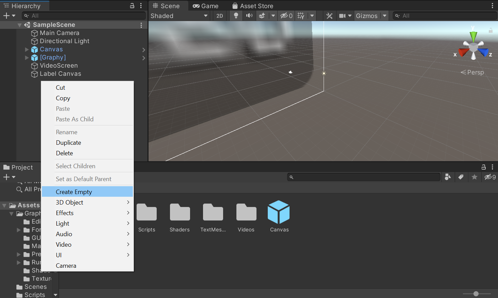{fig-align="center"}


With the object still selected, drag and drop the ObjectDetector script into the Hierarchy tab.

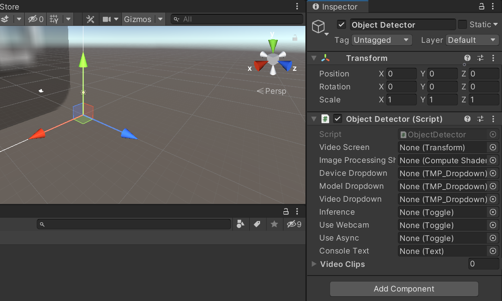{fig-align="center"}


Now we can drag and drop the objects in the Hierarchy tab into their associated spots in the Inspector tab.

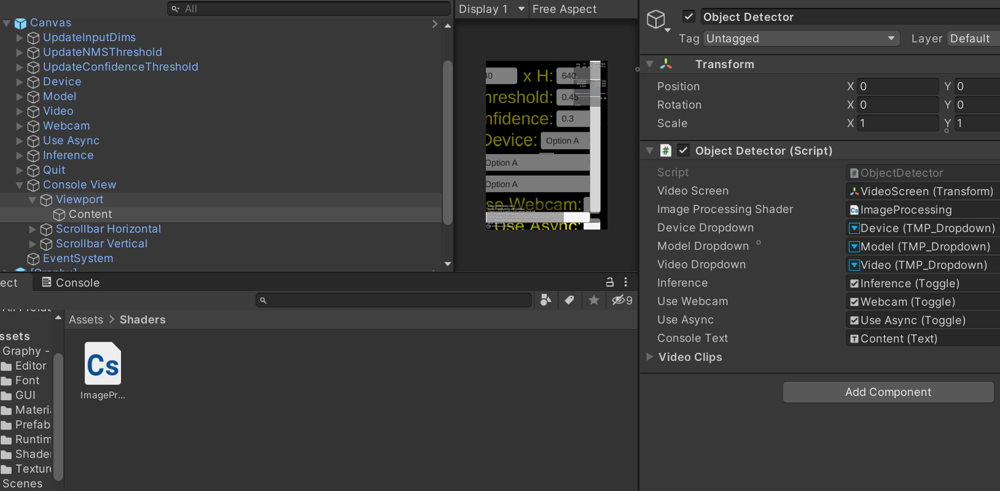{fig-align="center"}


Next, we will need to click the small lock button at the top of the Inspector tab to keep the Object Detector selected.

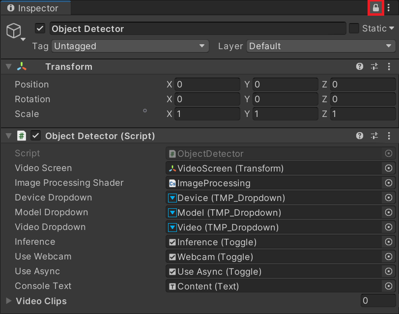{fig-align="center"}


Now we can add the video files by selecting all of them in the Assets section and dragging them onto the Video Clips slot in the Inspector tab. We can unlock the Inspector tab after we have added the videos.

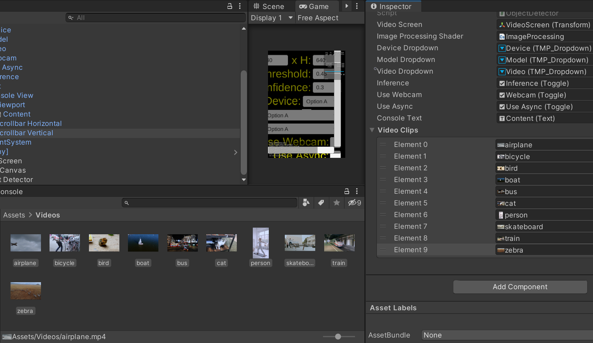{fig-align="center"}

 

## Assign UI Events

The last step needed before we can build the project is to assign the UI events.

### Input Dims

Open the UpdateInputDims container inside the Canvas object and select Width. 

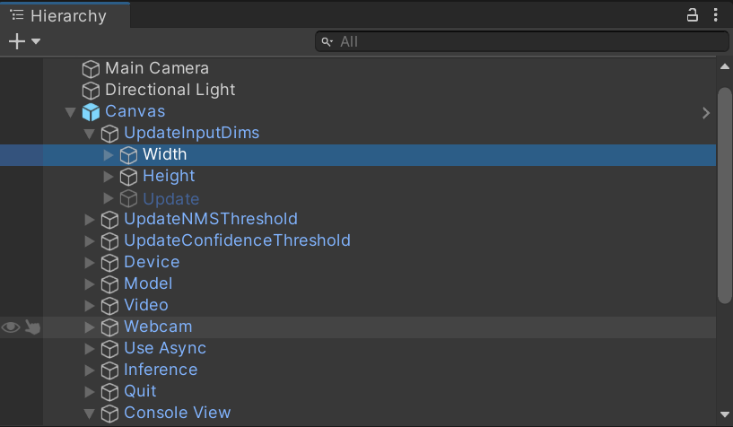{fig-align="center"}


In the Inspector tab, scroll down to On End Edit.

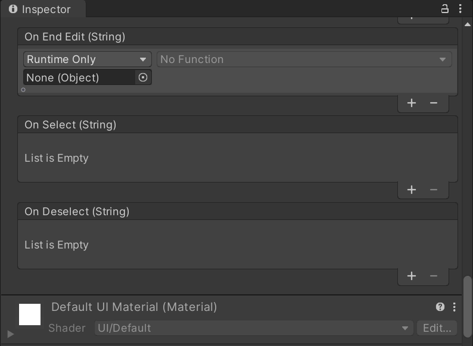{fig-align="center"}


Drag and drop the Object Detector object from the Hierarchy tab onto the None (Object) slot.

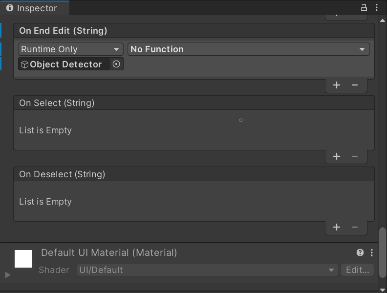{fig-align="center"}


Click on the No Function dropdown menu and open the ObjectDetector section. Select the UpdateInputDims() method from the list.

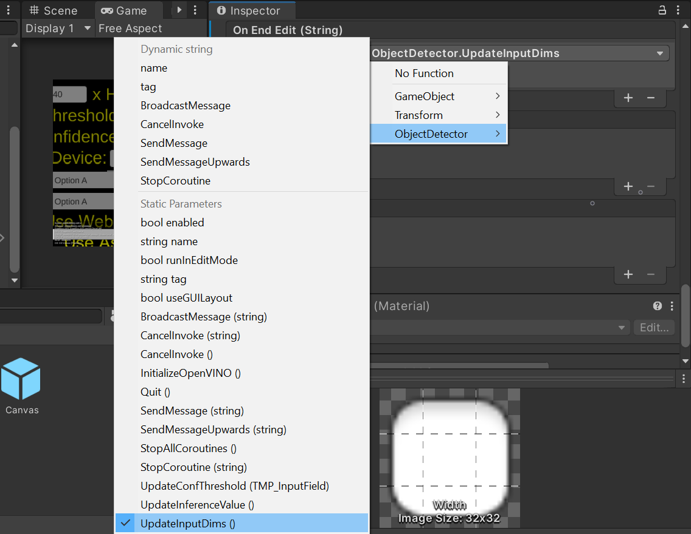{fig-align="center"}


Perform the same steps for the Height object.

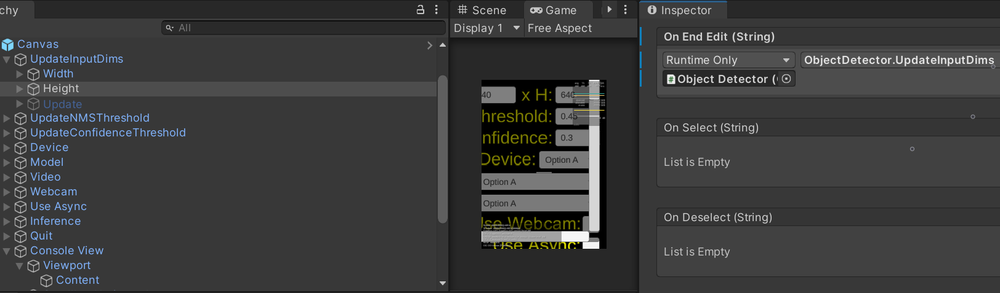{fig-align="center"}


### NMS Threshold

Open the UpdateNMSThreshold container inside the Canvas object and select Threshold.

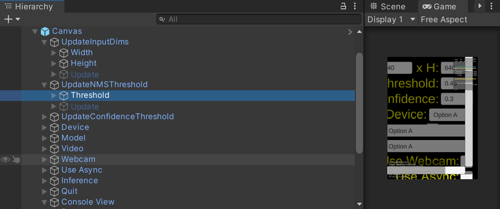{fig-align="center"}


In the Inspector tab, scroll down to On End Edit. Drag and drop the Object Detector object from the Hierarchy tab onto the None (Object) slot. This time, select the UpdateNMSThreshold(TMP_InputField) option from the function menu.

### Confidence Threshold

Open the UpdateConfidenceThreshold container inside the Canvas object and select Threshold. In the Inspector tab, scroll down to On End Edit. Drag and drop the Object Detector object from the Hierarchy tab onto the None (Object) slot. This time, select the UpdateConfThreshold(TMP_InputField) option from the function menu.

### Device Dropdown

Select the Device object inside the Canvas. In the Inspector tab, scroll down to On Value Changed (Int32). Drag and drop the Object Detector object from the Hierarchy tab onto the None (Object) slot. This time, select the InitializeOpenVINO() option from the function menu.

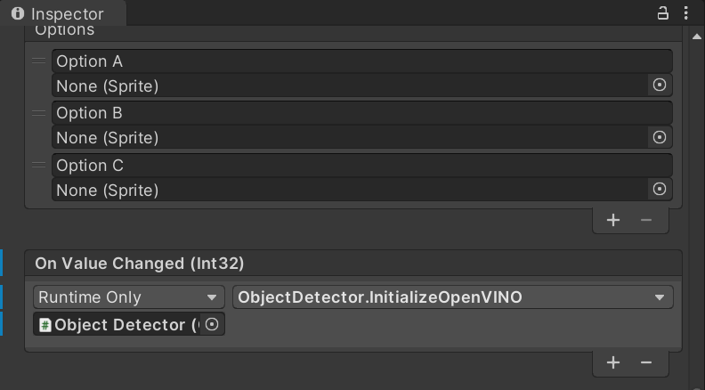{fig-align="center"}


### Model Dropdown

Select the Model object inside the Canvas. In the Inspector tab, scroll down to On Value Changed (Int32). Drag and drop the Object Detector object from the Hierarchy tab onto the None (Object) slot. Again, select the InitializeOpenVINO() option from the function menu.

### Video Dropdown

Select the Video object inside the Canvas. In the Inspector tab, scroll down to On Value Changed (Int32). Drag and drop the Object Detector object from the Hierarchy tab onto the None (Object) slot. This time, select the UpdateVideo() option from the function menu.

### Webcam Toggle

Select the Webcam object inside the Canvas. In the Inspector tab, scroll down to On Value Changed (Boolean). Drag and drop the Object Detector object from the Hierarchy tab onto the None (Object) slot. This time, select the UseWebcam() option from the function menu.

### Inference

Select the Inference object inside the Canvas. In the Inspector tab, scroll down to On Value Changed (Boolean). Drag and drop the Object Detector object from the Hierarchy tab onto the None (Object) slot. This time, select the UpdateInferenceValue() option from the function menu.

### Quit

Select the Quit object inside the Canvas. In the Inspector tab, scroll down to On Click(). Drag and drop the Object Detector object from the Hierarchy tab onto the None (Object) slot. This time, select the Quite() option from the function menu.

 

## Build the Project

Now we can build the completed project. First, press Ctrl+s to save the project. Open the File menu and select Build Settings...

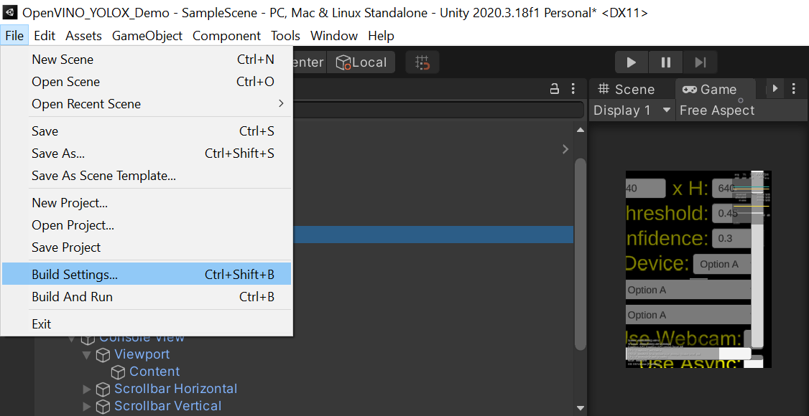{fig-align="center"}


Click build in the popup window. You will be prompted to select a folder to store the files generated during the build.

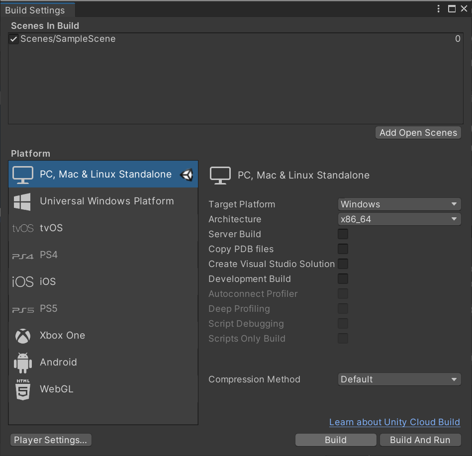{fig-align="center"}


Create a new folder in the default location and name it Build. Click Select Folder. 

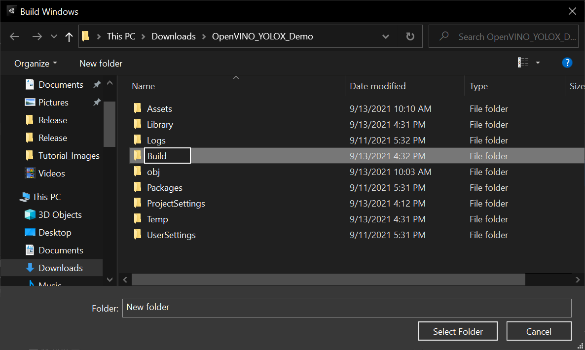{fig-align="center"}


Once the build is complete, a File Explorer window will open with the project executable selected.

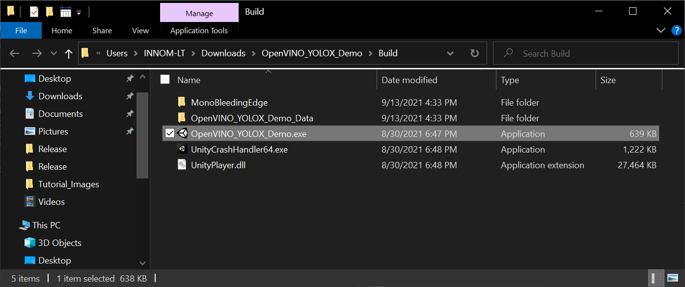{fig-align="center"}


## Add Models Folder

Copy and paste `models` folder from part 1 into the folder with the project executable.

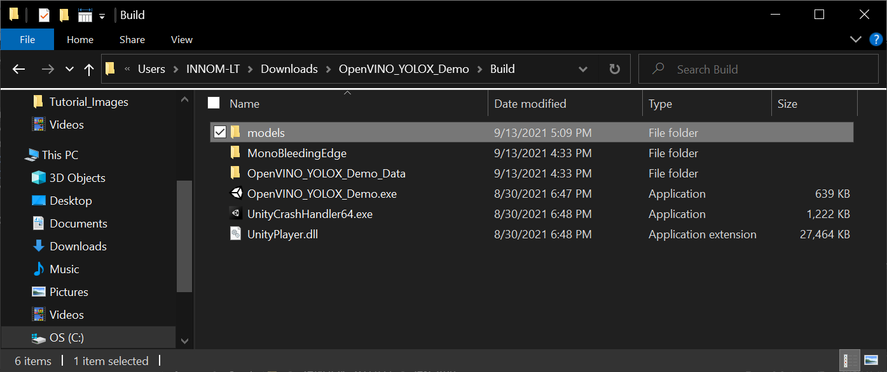{fig-align="center"}


## Add the Plugins folder

Open the OpenVINO_YOLOX_Demo_Data folder inside the Build directory. Copy and paste the Plugins folder from part 2.

{fig-align="center"}


## Run the Application

At last, we can test our project. Double-click the executable to run it. Remember that the first time the application launches will be slow as the cache files are generated.


# Next Steps

We now have a general workflow for implementing real-time object detection with the OpenVINO™ Toolkit inside the Unity game engine.

As mentioned previously, these models can be trained for a wide variety of applications. They can even be combined with other models to add new capabilities like [tracking](https://blog.roboflow.com/zero-shot-object-tracking/) unique objects across multiple frames.

Instructions for training these models on custom datasets can be found in the[ official documentation](https://yolox.readthedocs.io/en/latest/train_custom_data.html). Alternatively, online services like[ ](https://blog.roboflow.com/how-to-train-yolox-on-a-custom-dataset/)[roboflow](https://blog.roboflow.com/how-to-train-yolox-on-a-custom-dataset/) can make training more convenient. Trained models need to be converted from PyTorch to ONNX ([instructions](https://github.com/Megvii-BaseDetection/YOLOX/tree/main/demo/ONNXRuntime)), before being converted to OpenVINO ([instructions](https://github.com/Megvii-BaseDetection/YOLOX/tree/main/demo/OpenVINO/cpp)).

  

**Project Resources:**

[GitHub Repository](https://github.com/cj-mills/Unity-OpenVINO-YOLOX)

 


<!-- Cloudflare Web Analytics --><script defer src='https://static.cloudflareinsights.com/beacon.min.js' data-cf-beacon='{"token": "56b8d2f624604c4891327b3c0d9f6703"}'></script><!-- End Cloudflare Web Analytics -->

