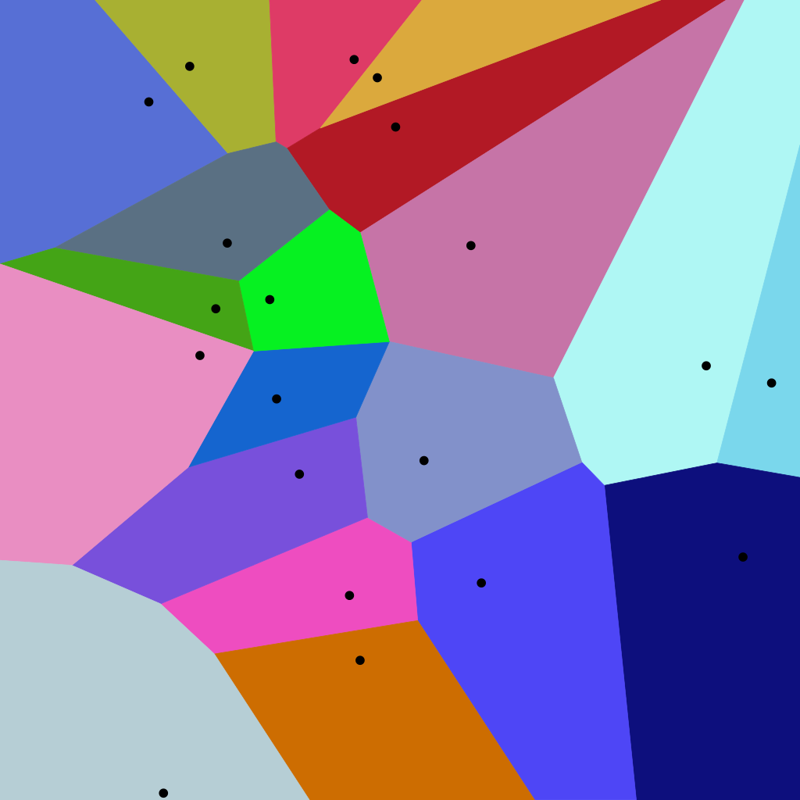
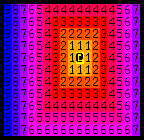

* [Introduction](#introduction)
* [Examples of Procedural Generation in Games](#examples-of-procedural-generation-in-games)
* [Map Generation Algorithms](#map-generation-algorithms)  
* [Combining Techniques](#combining-techniques)  
* [Dijkstra Maps](#dijkstra-maps)
* [Conclusion](#conclusion)
* [Additional Resources](#additional-resources)

::: {.callout-tip title="Presentation Resources"}

* **Video:** [Herbert Wolverson - Procedural Map Generation Techniques](https://www.youtube.com/watch?v=TlLIOgWYVpI&list=WL&index=112)
* **Source Code for Talk:** [GitHub Repository](https://github.com/thebracket/roguelike-celebration-2020)
* **Online Book:** [Roguelike Tutorial - In Rust](https://bfnightly.bracketproductions.com/chapter23-prefix.html)

:::

## Introduction

- **Procedural Map Generation:** Using algorithms to create maps for games, and then using additional algorithms to refine and ensure usability. (Source: Speaker's definition)
- Benefits of Procedural Generation: 
  - **Infinite Replayability:** Creates unique maps each playthrough, preventing memorization and encouraging players to learn game systems. (citing Rogue as an example)
  - **Dynamic Gameplay:** Prevents static level design, enhancing replayability.

## Examples of Procedural Generation in Games

- **Rogue (1980):**
  - One of the first examples of procedural generation.
  - Used simple room placement and random corridors to keep game size small.
  - Resulted in a unique map for each new game.
- **Dwarf Fortress:**
  - Extensive use of procedural generation for various aspects of the game.
  - Examples:
    - Overworld generation: Mountains, forests, volcanoes, etc.
    - Civilizations: History, relationships, deities, etc.
    - Individual characters: Beliefs, personalities, histories, etc.
- Key Takeaway: 
  - Randomness in these games is not purely random.
  - Algorithms guide the randomness to create desired outcomes while ensuring variation.

## Map Generation Algorithms

### Simple Room Placement

{fig-align="center"}

- Algorithm:
  1. Start with a solid map (all walls).
  2. Pick a random rectangle for a room.
  3. If the rectangle doesn't overlap existing rooms, carve it out.
  4. Repeat steps 2-3 until a desired number of rooms are placed.
  5. Connect rooms with corridors. (referencing Python roguelike dev tutorial)
- **Dogleg Corridors:** A simple corridor generation method that randomly switches between vertical and horizontal segments.
- Limitations: Can result in clustered rooms and inefficient layouts.

### Binary Space Partition (BSP) Rooms

{fig-align="center"}

- **Binary Space Partition (BSP):** Recursively dividing a space into two parts.
- Algorithm:
  1. Divide the map in half (either vertically or horizontally).
  2. Recursively divide each half until the desired room size is reached.
  3. Optionally add a gutter (1 tile border) around each room to prevent merging.
- Benefits:
  - Better room spacing compared to simple room placement.
  - Used in games like NetHack.
- Limitations: Can lead to predictable, rectangular layouts.

### Cellular Automata

{fig-align="center"}

- Based on the principle of **Conway's Game of Life**, where simple rules govern the evolution of a grid-based system.
- Algorithm:
  1. Initialize the map randomly with walls and floors (approximately 50/50).
  2. Iterate through each tile (excluding edges):
     - Count the number of neighboring walls (including diagonals).
     - Apply rules based on neighbor count:
       - 0 neighbors: Become a wall.
       - 1-4 neighbors: Become a floor.
       - 5+ neighbors: Become a wall. (suggesting rule customization)
  3. Repeat step 2 for a set number of iterations.
- Benefits:
  - Creates organic, natural-looking maps from random initial states.
  - Simple and fast algorithm.
  - Deterministic: Same seed produces the same map.
- Limitations: Can be difficult to control the specific shapes and features generated.

### Drunkard's Walk

{fig-align="center"}

- Algorithm:
  1. Start with a solid map.
  2. Place a "drunkard" (e.g., a digging entity) at a random point.
  3. The drunkard moves randomly, carving out a path as it goes.
  4. Set a maximum distance for the drunkard to travel before it "passes out".
  5. Repeat steps 2-4, spawning new drunkards within the open areas, until a desired percentage of the map is open. (using 1/3 as an example)
- Benefits:
  - Guarantees a contiguous map (no unreachable areas).
  - Creates maps that resemble natural formations like caverns.
- Limitations: Can lead to winding, inefficient paths.

### Diffusion-Limited Aggregation (DLA)

{fig-align="center"}

- [Explanation](http://www.roguebasin.com/index.php/Diffusion-limited_aggregation)

- Algorithm:

  1. Start with a small "seed" of open tiles.
  2. Pick a random point on the map and shoot a "particle" in a random direction.
  3. If the particle hits an open tile, carve out the last solid tile it passed through.
  4. If the particle doesn't hit an open tile, keep shooting until it does.

- Benefits:

  - Creates winding, branching open areas.
  - Guarantees a contiguous map.

- Variations:

  - **Central Attractor:** Particles are shot towards the center of the map, creating a central open area surrounded by a more complex perimeter. (suggesting dragon hoard placement in the center)

    {fig-align="center"}

  - **Symmetry:** Applying symmetry to the algorithm can create more structured and deliberate patterns.

### Voronoi Diagrams

{fig-align="center"}

- Algorithm:

  1. Place "seed" points randomly or deliberately across the map.
  2. For each tile on the map, determine the closest seed point using a distance algorithm (e.g., Euclidean, Manhattan, Chebyshev).
  3. Assign the tile to the region belonging to its closest seed point.

- Benefits: 

  - Creates regions that represent areas of influence around each seed point.

  - Can be used for various purposes (e.g., city generation, monster placement). (referencing [Apocalypse Taxi](https://thebracket.itch.io/apocalypse-taxi))

    {fig-align="center"}

- Distance Algorithms:

  - **Euclidean (Pythagoras):** Standard straight-line distance, resulting in smooth edges.
  - **Manhattan:** Distance measured as the sum of horizontal and vertical steps, creating sharp, grid-like edges.
  - **Chebyshev:** Distance measured as the maximum of the horizontal and vertical distances, producing a mix between Euclidean and Manhattan.

- Uses:

  - Alien cell structures (walls along edges).
  - Monster placement based on relationships (e.g., keeping allies together, separating enemies).
  - City generation (roads along edges, different regions for different city zones).

### Perlin and Simplex Noise

{fig-align="center"}

- **Perlin Noise and Simplex Noise:** Algorithms that generate continuous, smoothly varying values across a space.
- Properties:
  - Output values typically range from -1 to 1.
  - Adjacent values are smoothly related.
  - Continuous: Zooming in on a section of the noise produces a similar pattern at a finer scale.
- Variables:
  - **Octaves:** Number of different noise functions blended together, affecting detail.
  - **Gain:** How much each octave contributes to the final result, affecting amplitude.
  - **Lacunarity:**  Adjusts the frequency of each octave, introducing randomness and detail.
  - **Frequency:** How quickly the noise values change across space, affecting the scale of features.
- Uses:
  - Overworld generation: Creating terrain heightmaps.
  - Cloud generation.
  - Particle effects.
  - Wood grain textures.
- Recommendations: Experiment with different Perlin/Simplex noise tools and variable values to achieve desired results.

## Combining Techniques

- **Key Concept:** Rarely use just one algorithm for map generation.
- Examples:
  - Combining BSP (for a fortress) with Cellular Automata (for an underworld) to create a multi-themed map.
  - Adding prefabs (e.g., fortifications) to enhance the combined map and tell a story.
  - Using DLA to carve out sections of a BSP or Cellular Automata map, creating a more organic and weathered look.

### Prefabs

- **Prefabs:** Pre-designed map sections that can be inserted into a procedurally generated map.
- Benefits:
  - Introduce deliberate design elements into a random map.
  - Add specific features, challenges, or story elements. (using a trap room as an example)
- Placement:
  - In room-based maps: Find a room large enough to accommodate the prefab.
  - In non-room-based maps: Randomly sample locations and check for fit.
- Considerations: Use prefabs sparingly to maintain variety and avoid predictability.

## Dijkstra Maps

{fig-align="center"}

- [Explanation](http://www.roguebasin.com/index.php/The_Incredible_Power_of_Dijkstra_Maps)
- **Dijkstra Maps:**  Represent the distance from one or more starting points to all other reachable points on a map. (referencing Rogue Basin article "The Incredible Power of Dijkstra Maps")
- Algorithm:
  1. Initialize the map with a sentinel value (representing unreachable areas).
  2. Set the starting point(s) to a value of 0.
  3. Iterate through the map, assigning increasing distance values to reachable tiles based on their distance from the starting point(s).
- Uses:
  - Identifying and removing unreachable areas in maps generated with algorithms like Cellular Automata.
  - Placing starting and ending points:
    - Starting Point: Find an open tile near a desired location that is reachable from the main map area.
    - Ending Point:
      - For simple progression, place near the opposite edge of the map from the starting point.
      - To hide secrets, place in the least accessible area.
  - **Hot Path Analysis:**
    1. Generate a path between the starting and ending points (e.g., using A*).
    2. Create a Dijkstra map using the points on the path as starting points.
    3. Tiles with low distance values on the Dijkstra map represent areas close to the optimal path. (using a threshold of 10 as an example)
- Applications of Hot Path Analysis:
  - Removing irrelevant map sections in linear progression games.
  - Hiding bonus content or challenges in areas off the hot path.
  - Ordering story elements or puzzle placement based on likely player progression. (using examples of grandfather's advice and a locked door puzzle)

## Conclusion

- Procedural map generation involves guiding randomness with algorithms to create diverse and engaging maps.
- Combining multiple techniques and using tools like Dijkstra maps can lead to more complex and interesting results.
- The choice of algorithms and their parameters should be driven by the desired gameplay experience and the story you want to tell through your map.

## Additional Resources

- Source code for the talk: [https://github.com/thebracket/roguelike-celebration-2020](https://github.com/thebracket/roguelike-celebration-2020)
- Rust Roguelike Tutorial: [https://bfnightly.bracketproductions.com/rustbook/](https://bfnightly.bracketproductions.com/rustbook/)
- "The Incredible Power of Dijkstra Maps" (Rogue Basin): [http://www.roguebasin.com/index.php?title=The_Incredible_Power_of_Dijkstra_Maps](http://www.roguebasin.com/index.php?title=The_Incredible_Power_of_Dijkstra_Maps)
- "Hands on Rust, Effective Learning Through 2D Game Development and Play" (PragProg): [https://pragprog.com/](https://pragprog.com/)


