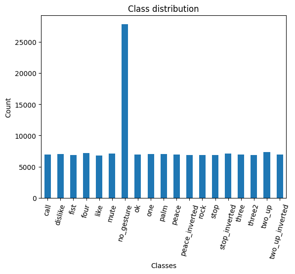
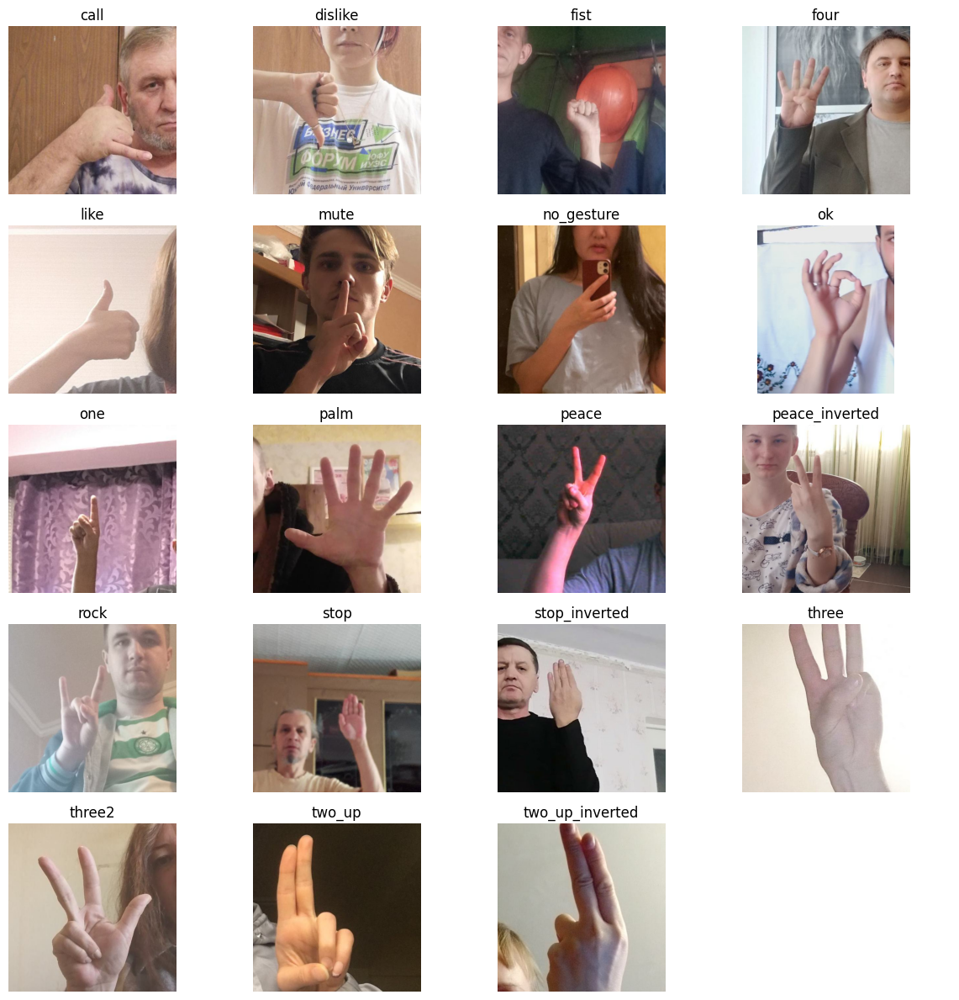

::: {.callout-tip}
## This post is part of the following series:
* [**Fine-Tuning Image Classifiers with PyTorch and the timm library for Beginners**](/series/tutorials/pytorch-train-image-classifier-series.html)
:::


* [Introduction](#introduction)
* [Getting Started with the Code](#getting-started-with-the-code)
* [Setting Up Your Python Environment](#setting-up-your-python-environment)
* [Importing the Required Dependencies](#importing-the-required-dependencies)
* [Setting Up the Project](#setting-up-the-project)
* [Loading and Exploring the Dataset](#loading-and-exploring-the-dataset)
* [Selecting a Model](#selecting-a-model)
* [Preparing the Data](#preparing-the-data)
* [Fine-tuning the Model](#fine-tuning-the-model)
* [Making Predictions with the Model](#making-predictions-with-the-model)
* [Exploring the In-Browser Demo](#exploring-the-in-browser-demo)
* [Conclusion](#conclusion)


## Introduction

Welcome to this hands-on guide to fine-tuning image classifiers with [PyTorch](https://pytorch.org/) and the [timm library](https://github.com/huggingface/pytorch-image-models)! Fine-tuning refers to taking a pre-trained model and adjusting its parameters using a new dataset to enhance its performance on a specific task. We can leverage pre-trained models to achieve high performance even when working with limited data and computational resources. The timm library further aids our goal with its wide range of pre-trained models, catering to diverse needs and use cases.

In this tutorial, we develop a hand gesture recognizer. Hand gesture recognition has many real-world applications, ranging from human-computer interaction and sign-language translation to creating immersive gaming experiences. By the end of this tutorial, you will have a practical hand gesture recognizer and a solid foundation to apply to other image classification tasks. You'll also be able to interact with a model trained with this tutorial's code through an in-browser demo that runs locally on your computer. Check out the video below for a quick preview.

{fig-align="center"}

This guide is structured so that you don't need a deep understanding of deep learning to complete it. If you follow the instructions, you can make it through! Yet, if you are eager to delve deeper into machine learning and deep learning, I recommend fast.ai's [Practical Deep Learning for Coders](https://course.fast.ai/) course. The course employs a hands-on approach that starts you off training models from the get-go and gradually digs deeper into the foundational concepts. 

Let's dive in and start training our hand gesture classifier!


## Getting Started with the Code

The tutorial code is available as a [Jupyter Notebook](https://jupyter.org/), which you can run locally or in a cloud-based environment like [Google Colab](https://colab.research.google.com/). If you're new to these platforms or need some guidance setting up, I've created dedicated tutorials to help you:

* [**Getting Started with Google Colab**](https://christianjmills.com/posts/google-colab-getting-started-tutorial/)**:** This tutorial introduces you to Google Colab, a free, cloud-based Jupyter Notebook service. You'll learn to write, run, and share Python code directly in your browser.

* [**Setting Up a Local Python Environment with Mamba for Machine Learning Projects on Windows**](https://christianjmills.com/posts/mamba-getting-started-tutorial-windows/)**:** This tutorial guides you through installing the Mamba package manager on Windows, setting up a local Python environment, and installing PyTorch and Jupyter for machine learning projects.

No matter your choice of environment, you'll be well-prepared to follow along with the rest of this tutorial. You can download the notebook from the tutorial's GitHub repository or open the notebook directly in Google Colab using the links below.


| Platform            | Jupyter Notebook                                             | Utility File                                                 |
| ------------------- | ------------------------------------------------------------ | ------------------------------------------------------------ |
| Google Colab        | [Open In Colab](https://colab.research.google.com/github/cj-mills/pytorch-timm-gesture-recognition-tutorial-code/blob/main/notebooks/pytorch-timm-image-classifier-training-colab.ipynb) |                                                              |
| Linux               | [GitHub Repository](https://github.com/cj-mills/pytorch-timm-gesture-recognition-tutorial-code/blob/main/notebooks/pytorch-timm-image-classifier-training.ipynb) |                                                              |
| Linux (Intel Arc)   | [GitHub Repository](https://github.com/cj-mills/pytorch-timm-gesture-recognition-tutorial-code/blob/main/notebooks/intel-arc-pytorch-timm-image-classifier-training.ipynb) |                                                              |
| Windows             | [GitHub Repository](https://github.com/cj-mills/pytorch-timm-gesture-recognition-tutorial-code/blob/main/notebooks/pytorch-timm-image-classifier-training-windows.ipynb) | [windows_utils_hf.py](https://github.com/cj-mills/pytorch-timm-gesture-recognition-tutorial-code/blob/main/notebooks/windows_utils_hf.py) |
| Windows (Intel Arc) | [GitHub Repository](https://github.com/cj-mills/pytorch-timm-gesture-recognition-tutorial-code/blob/main/notebooks/intel-arc-pytorch-timm-image-classifier-training-windows.ipynb) | [windows_utils_hf.py](https://github.com/cj-mills/pytorch-timm-gesture-recognition-tutorial-code/blob/main/notebooks/windows_utils_hf.py) |


## Setting Up Your Python Environment

Before diving into the code, we'll create a Python environment and install the necessary libraries. Creating a dedicated environment will ensure our project has all its dependencies in one place and does not interfere with other Python projects you may have.

Please note that this section is for readers setting up a local Python environment on their machines. If you're following this tutorial on a cloud-based platform like Google Colab, the platform already provides an isolated environment with many Python libraries pre-installed. In that case, you may skip this section and directly proceed to the [code sections](#importing-the-required-dependencies). However, you may still need to install certain libraries specific to this tutorial using similar `pip install` commands within your notebook. The dedicated Colab Notebook contains the instructions for running it in Google Colab.

### Creating a Python Environment

First, we'll create a Python environment using [Conda](https://docs.conda.io/en/latest/). Conda is a package manager that can create isolated Python environments. These environments are like sandboxed spaces where you can install Python libraries without affecting the rest of your system.

To create a new Python environment, open a terminal with Conda/Mamba installed and run the following commands:


::: {.panel-tabset}
## Conda

``` {.bash}
# Create a new Python 3.10 environment
conda create --name pytorch-env python=3.10 -y
# Activate the environment
conda activate pytorch-env
```

## Mamba

``` {.bash}
# Create a new Python 3.10 environment
mamba create --name pytorch-env python=3.10 -y
# Activate the environment
mamba activate pytorch-env
```

:::

The first command creates a new Python environment named `pytorch-env` using Python 3.10. The `-y` flag confirms that we want to proceed with the installation. After building the environment, the second command activates it, setting it as the active Python environment.

### Installing PyTorch

PyTorch is a popular open-source machine learning framework that enables users to perform tensor computations, build dynamic computational graphs, and implement custom machine learning architectures.
To install PyTorch with CUDA support (which allows PyTorch to leverage NVIDIA GPUs for faster training), we'll use the following command:

::: {.panel-tabset}
## Linux (CUDA)

``` {.bash}
# Install PyTorch with CUDA
pip install torch torchvision torchaudio --index-url https://download.pytorch.org/whl/cu118
```

## Mac

``` {.bash}
# MPS (Metal Performance Shaders) acceleration is available on MacOS 12.3+
pip install torch torchvision torchaudio
```

## Windows (CUDA)

``` {.bash}
# Install PyTorch with CUDA
pip install torch torchvision torchaudio --index-url https://download.pytorch.org/whl/cu118
```

:::


Installation instructions for specific hardware and operating systems are available in the "Get Started" section of the PyTorch website.

- [PyTorch: Get Started](https://pytorch.org/get-started/locally/)


### Installing Additional Libraries

We also need to install some additional libraries for our project. If you're new to Python or haven't used some of these packages before, don't worry. 

Here's a brief overview:

- [`datasets`](https://huggingface.co/docs/datasets/index): A library for accessing and sharing datasets for Audio, Computer Vision, and Natural Language Processing (NLP) tasks.
- [`jupyter`](https://jupyter.org/): An open-source web application that allows you to create and share documents that contain live code, equations, visualizations, and narrative text.
- [`matplotlib`](https://matplotlib.org/): This package provides a comprehensive collection of visualization tools to create high-quality plots, charts, and graphs for data exploration and presentation.
- [`pandas`](https://pandas.pydata.org/): This package provides fast, powerful, and flexible data analysis and manipulation tools.
- [`pillow`](https://pillow.readthedocs.io/en/stable/): The Python Imaging Library adds image processing capabilities.
- [`timm`](https://github.com/huggingface/pytorch-image-models): The timm library provides state-of-the-art (SOTA) computer vision models, layers, utilities, optimizers, schedulers, data loaders, augmentations, and training/evaluation scripts.
- [`torcheval`](https://pytorch.org/torcheval/stable/): A library with simple and straightforward tooling for model evaluations.
- [`torchtnt`](https://pytorch.org/tnt/stable/): A library for PyTorch training tools and utilities.
- [`tqdm`](https://tqdm.github.io/): A Python library that provides fast, extensible progress bars for loops and other iterable objects in Python.
- [`Jupyter Client`](https://jupyter-client.readthedocs.io/en/stable/): This package contains the reference implementation of the [Jupyter protocol](https://jupyter-client.readthedocs.io/en/latest/messaging.html). It also provides client and kernel management APIs for working with kernels. We will install an older version than the one included with Jupyter (<8) to avoid an issue that causes the training notebook to freeze during training ([link](https://discourse.jupyter.org/t/jupyter-notebook-zmq-message-arrived-on-closed-channel-error/17869)).
- [`PyZMQ`](https://pyzmq.readthedocs.io/en/latest/): This package provides Python bindings for ZeroMQ, a lightweight and fast messaging implementation used by Jupyter Notebooks. We will install an older version than the one included with Jupyter (<25) to avoid an issue that causes the training notebook to freeze during training ([link](https://discourse.jupyter.org/t/jupyter-notebook-zmq-message-arrived-on-closed-channel-error/17869)).

To install these additional libraries, we'll use the following command:

```bash
# Install additional dependencies
pip install datasets jupyter matplotlib pandas pillow timm torcheval torchtnt tqdm
# Install older pyzmq and jupyter client versions
pip install --upgrade "jupyter_client<8" "pyzmq<25"
```


### Installing Utility Packages

Finally, we will install some utility packages I made to help us handle images ([`cjm_pil_utils`](https://cj-mills.github.io/cjm-pil-utils/)), interact with PyTorch ([`cjm_pytorch_utils`](https://cj-mills.github.io/cjm-pytorch-utils/)), and work with pandas DataFrames ([`cjm_pandas_utils`](https://cj-mills.github.io/cjm-pandas-utils/)):

```bash
# Install utility packages
pip install cjm_pandas_utils cjm_pil_utils cjm_pytorch_utils
```

Now, our environment is all setup and ready to go! Remember, these libraries are just tools. If you don't fully understand them yet, don't worry. As we go through the tutorial, we'll learn more about these tools and see them in action.


### Launching Jupyter Notebook

Now that our environment is ready, it's time to launch Jupyter Notebook. Jupyter Notebooks provide an interactive coding environment where we'll work for the rest of this tutorial.
To launch Jupyter Notebook, navigate to the location where you have stored the tutorial notebook (if you downloaded it) from a terminal with the `pytorch-env` environment active, and type the following command:

```bash
jupyter notebook
```

This command will open a new tab in your default web browser, showing the Jupyter file browser. From the Jupyter file browser, you can open the tutorial notebook or create a new one to start the next section.
Remember: If you close your terminal, the Jupyter Notebook server will stop. So, keep your terminal running while you're working on the tutorial.


## Importing the Required Dependencies

With our environment set up, it's time to start the coding part of this tutorial. First, we will import the necessary Python packages into our Jupyter Notebook. Here's a brief overview of how we'll use these packages:

- **HuggingFace Datasets dependencies**: I host the dataset on [HuggingFace Hub](https://huggingface.co/datasets/cj-mills/hagrid-classification-512p-no-gesture-150k-zip), and this package allows us to load our dataset with a single line of code.
- **matplotlib**: We use the matplotlib package to explore the dataset samples and class distribution.
- **NumPy**: We'll use it to store PIL Images as arrays of pixel values.
- **pandas**: We use Pandas `DataFrame` and `Series` objects to format data as tables.
- **PIL (Pillow)**: We'll use it for opening and working with image files.
- **Python Standard Library dependencies**: These are built-in modules that come with Python. We'll use them for various tasks like handling file paths ([`pathlib.Path`](https://docs.python.org/3/library/pathlib.html#pathlib.Path)), manipulating JSON files ([`json`](https://docs.python.org/3/library/json.html)), random number generation ([`random`](https://docs.python.org/3/library/random.html)), multiprocessing ([`multiprocessing`](https://docs.python.org/3/library/multiprocessing.html)), mathematical operations ([`math`](https://docs.python.org/3/library/math.html)), copying Python objects ([`copy`](https://docs.python.org/3/library/copy.html)), file matching patterns ([`glob`](https://docs.python.org/3/library/glob.html)), working with dates and times ([`datetime`](https://docs.python.org/3/library/datetime.html)), and interacting with the operating system ([`os`](https://docs.python.org/3/library/os.html)).
- **PyTorch dependencies**: We'll use PyTorch's various modules for building our model, processing data, and training.
- **timm library**: We'll use the timm library to download and prepare a pre-trained model for fine-tuning.
- **tqdm**: We use the library to track the progress of longer processes like training.
- **Utility functions**: These are helper functions from the packages we installed earlier. They provide shortcuts for routine tasks and keep our code clean and readable.

```python
# Import Python Standard Library dependencies
from copy import copy
import datetime
from glob import glob
import json
import math
import multiprocessing
import os
from pathlib import Path
import random

# Import utility functions
from cjm_pandas_utils.core import markdown_to_pandas
from cjm_pil_utils.core import resize_img
from cjm_pytorch_utils.core import set_seed, pil_to_tensor, tensor_to_pil, get_torch_device, denorm_img_tensor

# Import HuggingFace Datasets dependencies
from datasets import load_dataset

# Import matplotlib for creating plots
import matplotlib.pyplot as plt

# Import numpy 
import numpy as np

# Import pandas module for data manipulation
import pandas as pd

# Set options for Pandas DataFrame display
pd.set_option('max_colwidth', None)  # Do not truncate the contents of cells in the DataFrame
pd.set_option('display.max_rows', None)  # Display all rows in the DataFrame
pd.set_option('display.max_columns', None)  # Display all columns in the DataFrame

# Import PIL for image manipulation
from PIL import Image

# Import timm library
import timm

# Import PyTorch dependencies
import torch
import torch.nn as nn
from torch.amp import autocast
from torch.cuda.amp import GradScaler
from torchvision import transforms
import torchvision.transforms.functional as TF
from torch.utils.data import Dataset, DataLoader
from torchtnt.utils import get_module_summary
from torcheval.metrics import MulticlassAccuracy

# Import tqdm for progress bar
from tqdm.auto import tqdm
```

Having successfully imported the dependencies, we are ready to move to the next step.

::: {.callout-note title="Update August 24, 2023"}
The [get_module_summary](https://pytorch.org/tnt/stable/utils/utils.html#torchtnt.utils.get_module_summary) function moved from the [torcheval](https://pytorch.org/torcheval/stable/) package to [torchtnt](https://pytorch.org/tnt/stable/index.html).
:::


## Setting Up the Project

In this section, we set up some basics for our project. First, we set a seed for generating random numbers using the [`set_seed`](https://cj-mills.github.io/cjm-pytorch-utils/core.html#set_seed) function from the `cjm_pytorch_utils` package.

### Setting a Random Number Seed


A fixed seed value is helpful when training deep-learning models for reproducibility, debugging, and comparison. Having reproducible results allows others to confirm your findings. Using a fixed seed can make it easier to find bugs as it ensures the same inputs produce the same outputs. Likewise, using fixed seed values lets you compare performance between models and training parameters. That said, it's often a good idea to test different seed values to see how your model's performance varies between them. Also, don't use a fixed seed value when you deploy the final model.

```python
# Set the seed for generating random numbers in PyTorch, NumPy, and Python's random module.
seed = 1234
set_seed(seed)
```

### Setting the Device and Data Type

Next, we determine the device to run our computations on and the data type of our tensors using the [`get_torch_device`](https://cj-mills.github.io/cjm-pytorch-utils/core.html#get_torch_device) function from the `cjm_pytorch_utils` package.

PyTorch can run on either a CPU or a GPU. The `get_torch_device` function will automatically check if a supported Nvidia or Mac GPU is available. Otherwise, it will use the CPU. We'll use the device and type variables to ensure all tensors and model weights are on the correct device and have the same data type. Otherwise, we might get errors.

```python
device = get_torch_device()
dtype = torch.float32
device, dtype
```

```text
('cuda', torch.float32)
```

---

### Setting the Directory Paths

We'll then set up a directory for our project to store our results and other related files. The code currently creates the folder in the current directory (`./`). Update the path if that is not suitable for you.

```python
# The name for the project
project_name = f"pytorch-timm-image-classifier"

# The path for the project folder
project_dir = Path(f"./{project_name}/")

# Create the project directory if it does not already exist
project_dir.mkdir(parents=True, exist_ok=True)

print(project_dir)
```

```text
pytorch-timm-image-classifier
```

---

We also need a place to store our datasets. We're going to create a directory for this purpose. If running locally, select a suitable folder location to store the dataset. For a cloud service like Google Colab, you can set it to the current directory.

```python
# Define path to store datasets
dataset_dir = Path("/mnt/980_1TB_1/Datasets/")
# Create the dataset directory if it does not exist
dataset_dir.mkdir(parents=True, exist_ok=True)
print(f"Dataset Directory: {dataset_dir}")
```

```text
Dataset Directory: /mnt/980_1TB_1/Datasets
```

---

Double-check the project and dataset directories exist in the specified paths and that you can add files to them before continuing.

At this point, our environment is set up and ready to go. We've set our random seed, determined our computation device, and set up directories for our project and dataset. In the next section, we will download and explore the dataset.


## Loading and Exploring the Dataset

Now that we set up our project, we can start working with our dataset. The dataset we'll use is a downscaled subset of [HaGRID](https://github.com/hukenovs/hagrid) (HAnd Gesture Recognition Image Dataset) that I modified for image classification tasks. The dataset contains images for `18` distinct hand gestures and an additional `no_gesture` class for idle hands. The dataset is approximately `3.8 GB`, but you will need about `7.6 GB` to store the archive file and extracted dataset.

* **HuggingFace Hub Dataset Repository:** [cj-mills/hagrid-classification-512p-no-gesture-150k-zip](https://huggingface.co/datasets/cj-mills/hagrid-classification-512p-no-gesture-150k-zip)

The following steps demonstrate how to load the dataset from the HuggingFace Hub, inspect the dataset, and visualize some sample images.

### Setting the Dataset Path

We'll first set up the path for our dataset. We'll construct the HuggingFace Hub dataset name by combining the username and the dataset name. We then define where to cache the dataset locally.

```python
# Set the name of the dataset
dataset_name = 'hagrid-classification-512p-no-gesture-150k-zip'

# Construct the HuggingFace Hub dataset name by combining the username and dataset name
hf_dataset = f'cj-mills/{dataset_name}'
print(f"HuggingFace Dataset: {hf_dataset}")

# Create the path to the directory where the dataset will be cached
cache_dir = Path(f'{dataset_dir}/{dataset_name}')
print(f"Dataset Path: {cache_dir}")
```

```text
HuggingFace Dataset: cj-mills/hagrid-classification-512p-no-gesture-150k-zip
Dataset Path: /mnt/980_1TB_1/Datasets/hagrid-classification-512p-no-gesture-150k-zip
```

---

### Downloading the Dataset

We'll now download the dataset from the HuggingFace Hub using the `load_dataset` function. We'll set the number of worker processes for loading data to the number of CPU cores available on your machine.


If you are following the tutorial on a Windows machine, you might need to enable longer file path lengths for the `load_dataset` function to work:


::: {.callout-tip collapse="true"}

## Enable Long File Paths in Windows

1. Type “Registry Editor” into the Windows search bar and click `Run as administrator`.

   

2. In the Registry Editor, input the following location into the text box and press `Enter`.

	```text
	Computer\HKEY_LOCAL_MACHINE\SYSTEM\CurrentControlSet\Control\FileSystem
	```

   

3. Double-click the entry named `LongPathsEnabled`.

   

4. Update the `Value data:` value to `1`.

   

5. You may now close the Registry Editor and continue with the tutorial.

:::


```python
# Set the number of worker processes for loading data. This should be the number of CPUs available.
num_workers = multiprocessing.cpu_count()

# Load the dataset from Hugging Face Hub
dataset = load_dataset(hf_dataset, 
                       split='train', 
                       cache_dir=cache_dir, 
                       num_proc=num_workers)

# Print dataset summary
print(dataset)
```

```text
Dataset({
    features: ['image', 'label'],
    num_rows: 153735
})
```

---


The dataset summary indicates there are 153,735 samples. Each sample has an image and a label. The label values for each dataset sample are index values corresponding to class names. For example, the label value `0` corresponds to the `call`  gesture.

### Deleting the Archive File

After loading the dataset, we can delete the downloaded archive file to free up some space. We define a helper function, `delete_files_in_directory`, which deletes all files in a specified directory.

```python
def delete_files_in_directory(directory: Path):
    """
    Delete all files in a given directory.

    Args:
        directory (Path): The directory in which to delete files.

    Raises:
        Exception: If there's an error when trying to delete a file, an exception is raised and caught.
        The exception is then logged and the process continues with the remaining files.
    """
    if not directory.exists():
        print(f"Directory {directory} does not exist.")
        return
    
    for item in directory.glob('*'):
        if not item.is_file():
            continue

        try:
            item.unlink()
        except Exception as e:
            print(f"Unable to delete file {item}. Error: {e}")
```

We'll then use this function to delete the archive file.

```python
download_directory = Path(os.path.join(cache_dir, "downloads"))
delete_files_in_directory(download_directory)
```

### Inspecting the Class Distribution

Next, we get the names of all the classes in our dataset and inspect the distribution of images among these classes. A balanced dataset (where each class has approximately the same number of instances) is ideal for training a machine-learning model.

#### Get image classes

```python
class_names = dataset.features['label'].names

pd.DataFrame(class_names)
```


<div style="overflow-x:auto; max-height:500px">
<table border="1" class="dataframe">
  <thead>
    <tr style="text-align: right;">
      <th></th>
      <th>0</th>
    </tr>
  </thead>
  <tbody>
    <tr>
      <th>0</th>
      <td>call</td>
    </tr>
    <tr>
      <th>1</th>
      <td>dislike</td>
    </tr>
    <tr>
      <th>2</th>
      <td>fist</td>
    </tr>
    <tr>
      <th>3</th>
      <td>four</td>
    </tr>
    <tr>
      <th>4</th>
      <td>like</td>
    </tr>
    <tr>
      <th>5</th>
      <td>mute</td>
    </tr>
    <tr>
      <th>6</th>
      <td>no_gesture</td>
    </tr>
    <tr>
      <th>7</th>
      <td>ok</td>
    </tr>
    <tr>
      <th>8</th>
      <td>one</td>
    </tr>
    <tr>
      <th>9</th>
      <td>palm</td>
    </tr>
    <tr>
      <th>10</th>
      <td>peace</td>
    </tr>
    <tr>
      <th>11</th>
      <td>peace_inverted</td>
    </tr>
    <tr>
      <th>12</th>
      <td>rock</td>
    </tr>
    <tr>
      <th>13</th>
      <td>stop</td>
    </tr>
    <tr>
      <th>14</th>
      <td>stop_inverted</td>
    </tr>
    <tr>
      <th>15</th>
      <td>three</td>
    </tr>
    <tr>
      <th>16</th>
      <td>three2</td>
    </tr>
    <tr>
      <th>17</th>
      <td>two_up</td>
    </tr>
    <tr>
      <th>18</th>
      <td>two_up_inverted</td>
    </tr>
  </tbody>
</table>
</div>


#### Visualize the class distribution

```python
class_counts = pd.DataFrame(dataset['label']).value_counts().sort_index()

# Plot the distribution
class_counts.plot(kind='bar')
plt.title('Class distribution')
plt.ylabel('Count')
plt.xlabel('Classes')
plt.xticks(range(len(class_counts.index)), class_names)  # Set the x-axis tick labels
plt.xticks(rotation=75)

  # Rotate x-axis labels
plt.show()
```


{fig-align="center"}


Each class, excluding the `no_gesture` class, has roughly the same number of samples. The `no_gesture` class contains approximately four times as many images because of the immense variety of non-matching hand positions.

### Visualizing Sample Images

Lastly, we will visualize the first sample image of each class in our dataset. Visualizing the samples helps us get a feel for the kind of images we're working with and whether they're suitable for the task at hand.

```python
# Get indices for the first sample in the dataset for each class
indices = [dataset['label'].index(value) for value in range(len(class_names)) if value in dataset['label']]

# Calculate the number of rows and columns
grid_size = math.floor(math.sqrt(len(indices)))
n_rows = grid_size+(1 if grid_size**2 < len(indices) else 0)
n_cols = grid_size

# Create a list to store the first image found for each class
images = dataset[indices]['image']
labels = dataset[indices]['label']

# Create a figure for the grid
fig, axs = plt.subplots(n_rows, n_cols, figsize=(10,10))

for i, ax in enumerate(axs.flatten()):
    # If we have an image for this subplot
    if i < len(images) and images[i]:
        # Add the image to the subplot
        ax.imshow(np.array(images[i]))
        # Set the title to the corresponding class name
        ax.set_title(class_names[labels[i]])
        # Remove the axis
        ax.axis('off')
    else:
        # If no image, hide the subplot
        ax.axis('off')

# Display the grid
plt.tight_layout()
plt.show()
```


{fig-align="center"}


We have loaded the dataset, inspected its class distribution, and visualized some sample images. In the next section, we will select and load our model.


## Selecting a Model

Choosing a suitable model for your task is crucial for the success of your machine learning project. The model you select will depend on several factors, including the size and nature of your dataset, the problem you're trying to solve, and the computational resources you have at your disposal.

### Exploring Available Models

You can explore the pretrained models available in the timm library using the `timm.list_models()` method. The library has hundreds of models, so we'll narrow our search to the [ResNet18](https://arxiv.org/abs/1512.03385) family of models. ResNet 18 models are popular for image classification tasks due to their balance of accuracy and speed.

```python
pd.DataFrame(timm.list_models('resnet18*', pretrained=True))
```

<div style="overflow-x:auto; max-height:500px">
<table border="1" class="dataframe">
  <thead>
    <tr style="text-align: right;">
      <th></th>
      <th>0</th>
    </tr>
  </thead>
  <tbody>
    <tr>
      <th>0</th>
      <td>resnet18.a1_in1k</td>
    </tr>
    <tr>
      <th>1</th>
      <td>resnet18.a2_in1k</td>
    </tr>
    <tr>
      <th>2</th>
      <td>resnet18.a3_in1k</td>
    </tr>
    <tr>
      <th>3</th>
      <td>resnet18.fb_ssl_yfcc100m_ft_in1k</td>
    </tr>
    <tr>
      <th>4</th>
      <td>resnet18.fb_swsl_ig1b_ft_in1k</td>
    </tr>
    <tr>
      <th>5</th>
      <td>resnet18.gluon_in1k</td>
    </tr>
    <tr>
      <th>6</th>
      <td>resnet18.tv_in1k</td>
    </tr>
    <tr>
      <th>7</th>
      <td>resnet18d.ra2_in1k</td>
    </tr>
  </tbody>
</table>
</div>


### Choosing the ResNet18-D Model

For this tutorial, I went with the pretrained [ResNet 18-D](https://github.com/huggingface/pytorch-image-models/blob/4b8cfa6c0a355a9b3cb2a77298b240213fb3b921/timm/models/resnet.py#L869) model. This model's balance of accuracy and speed makes it suitable for real-time applications, such as hand gesture recognition. While this model is a good all-rounder, others may work better for specific applications. For example, some models are designed to run on mobile devices and may sacrifice some accuracy for improved performance. Whatever your requirements are, the timm library likely has a suitable model for your needs. Feel free to try different models and see how they compare.

### Inspecting the ResNet18-D Model Configuration

Next, we will inspect the configuration of our chosen model. The model config gives us information about the pretraining process for the model.

```python
# Import the resnet module
from timm.models import resnet

# Define the ResNet model variant to use
resnet_model = 'resnet18d'

# Get the default configuration of the chosen model
model_cfg = resnet.default_cfgs[resnet_model].default.to_dict()

# Show the default configuration values
pd.DataFrame.from_dict(model_cfg, orient='index')
```

<div style="overflow-x:auto; max-height:500px">
<table border="1" class="dataframe">
  <thead>
    <tr style="text-align: right;">
      <th></th>
      <th>0</th>
    </tr>
  </thead>
  <tbody>
    <tr>
      <th>url</th>
      <td>https://github.com/rwightman/pytorch-image-models/releases/download/v0.1-weights/resnet18d_ra2-48a79e06.pth</td>
    </tr>
    <tr>
      <th>hf_hub_id</th>
      <td>timm/</td>
    </tr>
    <tr>
      <th>custom_load</th>
      <td>False</td>
    </tr>
    <tr>
      <th>input_size</th>
      <td>(3, 224, 224)</td>
    </tr>
    <tr>
      <th>test_input_size</th>
      <td>(3, 288, 288)</td>
    </tr>
    <tr>
      <th>fixed_input_size</th>
      <td>False</td>
    </tr>
    <tr>
      <th>interpolation</th>
      <td>bicubic</td>
    </tr>
    <tr>
      <th>crop_pct</th>
      <td>0.875</td>
    </tr>
    <tr>
      <th>test_crop_pct</th>
      <td>0.95</td>
    </tr>
    <tr>
      <th>crop_mode</th>
      <td>center</td>
    </tr>
    <tr>
      <th>mean</th>
      <td>(0.485, 0.456, 0.406)</td>
    </tr>
    <tr>
      <th>std</th>
      <td>(0.229, 0.224, 0.225)</td>
    </tr>
    <tr>
      <th>num_classes</th>
      <td>1000</td>
    </tr>
    <tr>
      <th>pool_size</th>
      <td>(7, 7)</td>
    </tr>
    <tr>
      <th>first_conv</th>
      <td>conv1.0</td>
    </tr>
    <tr>
      <th>classifier</th>
      <td>fc</td>
    </tr>
    <tr>
      <th>origin_url</th>
      <td>https://github.com/huggingface/pytorch-image-models</td>
    </tr>
  </tbody>
</table>
</div>


### Retrieving Normalization Statistics

Before we can use the ResNet18-D model, we need to normalize our dataset. Normalization is a process that changes the range of pixel intensity values to make the neural network converge faster during training. It is performed by subtracting the mean from the pixel values and dividing by the standard deviation of the dataset. The mean and standard deviation values specific to the dataset used in the pretraining process of our model are called normalization statistics. To do this, we will retrieve the normalization statistics (mean and std) specific to our pretrained model.

```python
# Retrieve normalization statistics (mean and std) specific to the pretrained model
mean, std = model_cfg['mean'], model_cfg['std']
norm_stats = (mean, std)
norm_stats
```

```text
((0.485, 0.456, 0.406), (0.229, 0.224, 0.225))
```

---


### Loading the ResNet18-D Model

We can now load our model. We'll set the number of output classes equal to the number of image classes in our dataset. We'll also specify the device and data type for the model.

```python
# Create a pretrained ResNet model with the number of output classes equal to the number of class names
# 'timm.create_model' function automatically downloads and initializes the pretrained weights
resnet18 = timm.create_model(resnet_model, pretrained=True, num_classes=len(class_names))

# Set the device and data type for the model
resnet18 = resnet18.to(device=device, dtype=dtype)

# Add attributes to store the device and model name for later reference
resnet18.device = device
resnet18.name = resnet_model
```

### Selecting the Model

With our model loaded, we can now select it for training.

```python
model = resnet18
```

### Summarizing the Model

Finally, let's generate a summary of our model. The summary gives us an overview of its structure and performance characteristics.

```python
# Define the input to the model
test_inp = torch.randn(1, 3, 256, 256).to(device)

# Get a summary of the model as a Pandas DataFrame
summary_df = markdown_to_pandas(f"{get_module_summary(model, [test_inp])}")

# Filter the summary to only contain Conv2d layers and the model
summary_df = summary_df[(summary_df.index == 0) | (summary_df['Type'] == 'Conv2d')]

# Remove the column "Contains Uninitialized Parameters?"
summary_df.drop('Contains Uninitialized Parameters?', axis=1)
```


<div style="overflow-x:auto; max-height:500px">
<table border="1" class="dataframe">
  <thead>
    <tr style="text-align: right;">
      <th></th>
      <th>Type</th>
      <th># Parameters</th>
      <th># Trainable Parameters</th>
      <th>Size (bytes)</th>
      <th>Forward FLOPs</th>
      <th>Backward FLOPs</th>
      <th>In size</th>
      <th>Out size</th>
    </tr>
  </thead>
  <tbody>
    <tr>
      <th>0</th>
      <td>ResNet</td>
      <td>11.2 M</td>
      <td>11.2 M</td>
      <td>44.9 M</td>
      <td>2.7 G</td>
      <td>5.3 G</td>
      <td>[1, 3, 256, 256]</td>
      <td>[1, 19]</td>
    </tr>
    <tr>
      <th>2</th>
      <td>Conv2d</td>
      <td>864</td>
      <td>864</td>
      <td>3.5 K</td>
      <td>14.2 M</td>
      <td>14.2 M</td>
      <td>[1, 3, 256, 256]</td>
      <td>[1, 32, 128, 128]</td>
    </tr>
    <tr>
      <th>5</th>
      <td>Conv2d</td>
      <td>9.2 K</td>
      <td>9.2 K</td>
      <td>36.9 K</td>
      <td>150 M</td>
      <td>301 M</td>
      <td>[1, 32, 128, 128]</td>
      <td>[1, 32, 128, 128]</td>
    </tr>
    <tr>
      <th>8</th>
      <td>Conv2d</td>
      <td>18.4 K</td>
      <td>18.4 K</td>
      <td>73.7 K</td>
      <td>301 M</td>
      <td>603 M</td>
      <td>[1, 32, 128, 128]</td>
      <td>[1, 64, 128, 128]</td>
    </tr>
    <tr>
      <th>14</th>
      <td>Conv2d</td>
      <td>36.9 K</td>
      <td>36.9 K</td>
      <td>147 K</td>
      <td>150 M</td>
      <td>301 M</td>
      <td>[1, 64, 64, 64]</td>
      <td>[1, 64, 64, 64]</td>
    </tr>
    <tr>
      <th>19</th>
      <td>Conv2d</td>
      <td>36.9 K</td>
      <td>36.9 K</td>
      <td>147 K</td>
      <td>150 M</td>
      <td>301 M</td>
      <td>[1, 64, 64, 64]</td>
      <td>[1, 64, 64, 64]</td>
    </tr>
    <tr>
      <th>23</th>
      <td>Conv2d</td>
      <td>36.9 K</td>
      <td>36.9 K</td>
      <td>147 K</td>
      <td>150 M</td>
      <td>301 M</td>
      <td>[1, 64, 64, 64]</td>
      <td>[1, 64, 64, 64]</td>
    </tr>
    <tr>
      <th>28</th>
      <td>Conv2d</td>
      <td>36.9 K</td>
      <td>36.9 K</td>
      <td>147 K</td>
      <td>150 M</td>
      <td>301 M</td>
      <td>[1, 64, 64, 64]</td>
      <td>[1, 64, 64, 64]</td>
    </tr>
    <tr>
      <th>33</th>
      <td>Conv2d</td>
      <td>73.7 K</td>
      <td>73.7 K</td>
      <td>294 K</td>
      <td>75.5 M</td>
      <td>150 M</td>
      <td>[1, 64, 64, 64]</td>
      <td>[1, 128, 32, 32]</td>
    </tr>
    <tr>
      <th>38</th>
      <td>Conv2d</td>
      <td>147 K</td>
      <td>147 K</td>
      <td>589 K</td>
      <td>150 M</td>
      <td>301 M</td>
      <td>[1, 128, 32, 32]</td>
      <td>[1, 128, 32, 32]</td>
    </tr>
    <tr>
      <th>43</th>
      <td>Conv2d</td>
      <td>8.2 K</td>
      <td>8.2 K</td>
      <td>32.8 K</td>
      <td>8.4 M</td>
      <td>16.8 M</td>
      <td>[1, 64, 32, 32]</td>
      <td>[1, 128, 32, 32]</td>
    </tr>
    <tr>
      <th>46</th>
      <td>Conv2d</td>
      <td>147 K</td>
      <td>147 K</td>
      <td>589 K</td>
      <td>150 M</td>
      <td>301 M</td>
      <td>[1, 128, 32, 32]</td>
      <td>[1, 128, 32, 32]</td>
    </tr>
    <tr>
      <th>51</th>
      <td>Conv2d</td>
      <td>147 K</td>
      <td>147 K</td>
      <td>589 K</td>
      <td>150 M</td>
      <td>301 M</td>
      <td>[1, 128, 32, 32]</td>
      <td>[1, 128, 32, 32]</td>
    </tr>
    <tr>
      <th>56</th>
      <td>Conv2d</td>
      <td>294 K</td>
      <td>294 K</td>
      <td>1.2 M</td>
      <td>75.5 M</td>
      <td>150 M</td>
      <td>[1, 128, 32, 32]</td>
      <td>[1, 256, 16, 16]</td>
    </tr>
    <tr>
      <th>61</th>
      <td>Conv2d</td>
      <td>589 K</td>
      <td>589 K</td>
      <td>2.4 M</td>
      <td>150 M</td>
      <td>301 M</td>
      <td>[1, 256, 16, 16]</td>
      <td>[1, 256, 16, 16]</td>
    </tr>
    <tr>
      <th>66</th>
      <td>Conv2d</td>
      <td>32.8 K</td>
      <td>32.8 K</td>
      <td>131 K</td>
      <td>8.4 M</td>
      <td>16.8 M</td>
      <td>[1, 128, 16, 16]</td>
      <td>[1, 256, 16, 16]</td>
    </tr>
    <tr>
      <th>69</th>
      <td>Conv2d</td>
      <td>589 K</td>
      <td>589 K</td>
      <td>2.4 M</td>
      <td>150 M</td>
      <td>301 M</td>
      <td>[1, 256, 16, 16]</td>
      <td>[1, 256, 16, 16]</td>
    </tr>
    <tr>
      <th>74</th>
      <td>Conv2d</td>
      <td>589 K</td>
      <td>589 K</td>
      <td>2.4 M</td>
      <td>150 M</td>
      <td>301 M</td>
      <td>[1, 256, 16, 16]</td>
      <td>[1, 256, 16, 16]</td>
    </tr>
    <tr>
      <th>79</th>
      <td>Conv2d</td>
      <td>1.2 M</td>
      <td>1.2 M</td>
      <td>4.7 M</td>
      <td>75.5 M</td>
      <td>150 M</td>
      <td>[1, 256, 16, 16]</td>
      <td>[1, 512, 8, 8]</td>
    </tr>
    <tr>
      <th>84</th>
      <td>Conv2d</td>
      <td>2.4 M</td>
      <td>2.4 M</td>
      <td>9.4 M</td>
      <td>150 M</td>
      <td>301 M</td>
      <td>[1, 512, 8, 8]</td>
      <td>[1, 512, 8, 8]</td>
    </tr>
    <tr>
      <th>89</th>
      <td>Conv2d</td>
      <td>131 K</td>
      <td>131 K</td>
      <td>524 K</td>
      <td>8.4 M</td>
      <td>16.8 M</td>
      <td>[1, 256, 8, 8]</td>
      <td>[1, 512, 8, 8]</td>
    </tr>
    <tr>
      <th>92</th>
      <td>Conv2d</td>
      <td>2.4 M</td>
      <td>2.4 M</td>
      <td>9.4 M</td>
      <td>150 M</td>
      <td>301 M</td>
      <td>[1, 512, 8, 8]</td>
      <td>[1, 512, 8, 8]</td>
    </tr>
    <tr>
      <th>97</th>
      <td>Conv2d</td>
      <td>2.4 M</td>
      <td>2.4 M</td>
      <td>9.4 M</td>
      <td>150 M</td>
      <td>301 M</td>
      <td>[1, 512, 8, 8]</td>
      <td>[1, 512, 8, 8]</td>
    </tr>
  </tbody>
</table>
</div>
---

We can see from the summary that the ResNet18-D model is about `45 MB` in size and needs to perform about `2.7 billion` floating-point operations to process a single `256x256` input image. For context, the larger mid-size ResNet50-D model is about `95 MB` and performs about `5.7 billion` floating-point ops for the same image. On the other end, the tiniest variant of the mobile-optimized MobileNetV3 model is `2.4 MB` and only takes about `30 million` floating-point operations.

That is valuable information when considering how we will deploy the fine-tuned model. For example, the in-browser demo I mentioned will first download the model to your local machine. The larger the model, the longer it will take for the demo to start. Likewise, the number of floating-point operations will influence what hardware can run the model smoothly. For real-time applications, even milliseconds can matter for inference speed. Inference involves making predictions with a trained model on new, unseen data.

The model architecture also influences inference speed beyond the raw number of floating-point operations. The MobileNetv3 architecture is tuned to mobile phone CPUs, while the ResNet architectures can better leverage larger GPUs.

That completes the model selection and setup. In the next section, we will prepare our dataset for training.


## Preparing the Data

Next, we will prepare our data for the model training process. The data preparation involves several steps, such as applying data augmentation techniques, setting up the train-validation split for the dataset, resizing and padding the images, defining the training dataset class, and initializing DataLoaders to feed data to the model.

### Selecting a Sample Image

Let's begin by selecting a random image from the dataset to visualize the data preparation steps.


```python
# Select a random item from the dataset
item = random.choice(dataset)

label = class_names[item['label']]
sample_img = item['image']
    
print(f"Image Label: {label}")
    
# Display the image
sample_img
```

```text
Image Label: stop
```


{fig-align="center"}


### Data Augmentation

Next, we'll define what data augmentations to apply to images during training. Data augmentation is a technique that effectively expands the size and diversity of a dataset by creating variations of existing samples. It helps the model learn general features instead of memorizing specific examples.

We'll use [trivial augmentation](https://arxiv.org/abs/2103.10158), which applies a single, random transform to each image. This simple method can be highly effective for data augmentation. 

However, we'll need to create a custom version of the [TrivialAugmentWide](https://pytorch.org/vision/main/generated/torchvision.transforms.TrivialAugmentWide.html) class from PyTorch's transforms module, as some of the default parameters are not ideal for this dataset. This custom class defines a dictionary of operations for augmenting the images, and we can customize each operation's parameters.

#### Trivial Augmentation


```python
from torch import Tensor
from typing import Dict, Tuple, List, Optional

# This class extends the TrivialAugmentWide class provided by PyTorch's transforms module.
# TrivialAugmentWide is an augmentation policy randomly applies a single augmentation to each image.
class CustomTrivialAugmentWide(transforms.TrivialAugmentWide):
    # The _augmentation_space method defines a custom augmentation space for the augmentation policy.
    # This method returns a dictionary where each key is the name of an augmentation operation and 
    # the corresponding value is a tuple of a tensor and a boolean value.
    # The tensor defines the magnitude of the operation, and the boolean defines  
    # whether to perform the operation in both the positive and negative directions (True)
    # or only in the positive direction (False).
    def _augmentation_space(self, num_bins: int) -> Dict[str, Tuple[Tensor, bool]]:
        
        # Define custom augmentation space
        custom_augmentation_space = {
            # Identity operation doesn't change the image
            "Identity": (torch.tensor(0.0), False),
            
            # Distort the image along the x or y axis, respectively.
            "ShearX": (torch.linspace(0.0, 0.25, num_bins), True),
            "ShearY": (torch.linspace(0.0, 0.25, num_bins), True),

            # Move the image along the x or y axis, respectively.
            "TranslateX": (torch.linspace(0.0, 32.0, num_bins), True),
            "TranslateY": (torch.linspace(0.0, 32.0, num_bins), True),

            # Rotate operation: rotates the image.
            "Rotate": (torch.linspace(0.0, 45.0, num_bins), True),

            # Adjust brightness, color, contrast,and sharpness respectively.
            "Brightness": (torch.linspace(0.0, 0.75, num_bins), True),
            "Color": (torch.linspace(0.0, 0.99, num_bins), True),
            "Contrast": (torch.linspace(0.0, 0.99, num_bins), True),
            "Sharpness": (torch.linspace(0.0, 0.99, num_bins), True),

            # Reduce the number of bits used to express the color in each channel of the image.
            "Posterize": (8 - (torch.arange(num_bins) / ((num_bins - 1) / 6)).round().int(), False),

            # Invert all pixel values above a threshold.
            "Solarize": (torch.linspace(255.0, 0.0, num_bins), False),

            # Maximize the image contrast by setting the darkest color to black and the lightest to white.
            "AutoContrast": (torch.tensor(0.0), False),

            # Equalize the image histogram to improve its contrast.
            "Equalize": (torch.tensor(0.0), False),
        }
        
        # The function returns the dictionary of operations.
        return custom_augmentation_space
```


You can test the custom augmentation method by applying it to the sample image and displaying the result. Remember, the augmentation should be different each time we use it.


#### Test the transform


```python
# Create a TrivialAugmentWide object
trivial_aug = CustomTrivialAugmentWide()

# Convert the image to a tensor
img_tensor = transforms.PILToTensor()(sample_img)[None]
print(img_tensor.shape)

# Apply the TrivialAugmentWide to the tensor
tensor_to_pil(trivial_aug(img_tensor))
```

```text
torch.Size([1, 3, 512, 512])
```


{fig-align="center"}


### Training-Validation Split

Next, we'll split the dataset into training and validation sets. The model will use the training set to update its parameters, and we will use the validation set to evaluate the model's performance on data it has not seen before. Validation sets are needed when training models because we want to verify the model can generalize well to new data before we deploy it.


**Get training and validation sets**


```python
# Define the percentage of the images that should be used for validation
val_pct = 0.1

# Split the dataset into training and validation sets
train_split, val_split = dataset.train_test_split(test_size=val_pct).values()

# Print the number of images in the training and validation sets
len(train_split), len(val_split)
```

```text
(138361, 15374)
```

---


### Image Resizing and Padding

Next, we define a class called `ResizePad` to resize and pad images, making them a uniform size. Making all the input images the same size allows us to feed samples to the model in batches, allowing us to leverage our GPU more efficiently.

#### Resize Pad Transform


```python
class ResizePad(nn.Module):
    def __init__(self, max_sz=256, padding_mode='edge'):
        """
        A PyTorch module that resizes an image tensor and adds padding to make it a square tensor.

        Args:
        max_sz (int, optional): The size of the square tensor.
        padding_mode (str, optional): The padding mode used when adding padding to the tensor.
        """
        super().__init__()
        self.max_sz = max_sz
        self.padding_mode = padding_mode
        
    def forward(self, x):
        # Get the width and height of the image tensor
        w, h = TF.get_image_size(x)
        
        # Resize the image tensor so that its minimum dimension is equal to `max_sz`
        size = int(min(w, h) / (max(w, h) / self.max_sz))
        x = TF.resize(x, size=size, antialias=True)
        
        # Add padding to make the image tensor a square
        w, h = TF.get_image_size(x)
        offset = (self.max_sz - min(w, h)) // 2
        padding = [0, offset] if h < w else [offset, 0]
        x = TF.pad(x, padding=padding, padding_mode=self.padding_mode)
        x = TF.resize(x, size=[self.max_sz] * 2, antialias=True)
        
        return x
```


For training, we'll resize and pad the images to `288x288`. That should be large enough for the model to get adequate detail while keeping training time low.


#### Set training image size


```python
train_sz = (288,288)
```


You can test the ResizePad transform on the sample image to see how it resizes and pads the sample. The following code crops the sample image to make the padding more apparent.


#### Test the transform


```python
print(f"Source image: {sample_img.size}")

# Crop the source image
w, h = sample_img.size
cropped_img = sample_img.crop([0, h//4, w, h-h//4])
print(f"Cropped image: {cropped_img.size}")

# Create a `ResizePad` object
resize_pad = ResizePad(max_sz=max(train_sz))

# Convert the cropped image to a tensor
img_tensor = transforms.PILToTensor()(cropped_img)[None]
print(f"Cropped tensor: {img_tensor.shape}")

# Resize and pad the tensor
resized_tensor = resize_pad(img_tensor)
print(f"Padded tensor: {resized_tensor.shape}")

# Display the updated image
tensor_to_pil(resized_tensor)
```

```text
Source image: (512, 512)
Cropped image: (512, 256)
Cropped tensor: torch.Size([1, 3, 256, 512])
Padded tensor: torch.Size([1, 3, 288, 288])
```


{fig-align="center"}


### Training Dataset Class

Next, we define a custom PyTorch Dataset class that will get used in a [DataLoader](https://pytorch.org/docs/stable/data.html#torch.utils.data.DataLoader) to create batches. This class fetches a sample from the dataset at a given index and returns the transformed image and its corresponding label index.


```python
class ImageDataset(Dataset):
    """A PyTorch Dataset class to be used in a DataLoader to create batches.
    
    Attributes:
        dataset: A list of dictionaries containing 'label' and 'image' keys.
        classes: A list of class names.
        tfms: A torchvision.transforms.Compose object combining all the desired transformations.
    """
    def __init__(self, dataset, classes, tfms):
        self.dataset = dataset
        self.classes = classes
        self.tfms = tfms
        
    def __len__(self):
        """Returns the total number of samples in this dataset."""
        return len(self.dataset)

    def __getitem__(self, idx):
        """Fetches a sample from the dataset at the given index.
        
        Args:
            idx: The index to fetch the sample from.
            
        Returns:
            A tuple of the transformed image and its corresponding label index.
        """
        sample = self.dataset[idx]
        image, label = sample['image'], sample['label']
        return self.tfms(image), label
```


### Image Transforms

We'll then define the transformations for the training and validation datasets. Note that we only apply data augmentation to the training dataset. Both datasets will have their images resized and padded and the pixel values normalized.


```python
# Define the transformations for training and validation datasets
# Note: Data augmentation is performed only on the training dataset
train_tfms = transforms.Compose([
    ResizePad(max_sz=max(train_sz)),
    trivial_aug,
    transforms.ToTensor(),
    transforms.Normalize(*norm_stats),
])

valid_tfms = transforms.Compose([
    ResizePad(max_sz=max(train_sz)),
    transforms.ToTensor(),
    transforms.Normalize(*norm_stats),
])
```


### Initialize Datasets

We instantiate the PyTorch datasets using the dataset splits, class names, and defined transformations.


```python
# Instantiate the datasets using the defined transformations
train_dataset = ImageDataset(dataset=train_split, classes=class_names, tfms=train_tfms)
valid_dataset = ImageDataset(dataset=val_split, classes=class_names, tfms=valid_tfms)

# Print the number of samples in the training and validation datasets
print(f'Training dataset size: {len(train_dataset)}')
print(f'Validation dataset size: {len(valid_dataset)}')
```

```text
Training dataset size: 138361
Validation dataset size: 15374
```

---


### Inspect Samples

Let's inspect a sample from the training and validation sets to verify that the data preparation steps get applied correctly.

**Inspect training set sample**


```python
# Get the label for the first image in the training set
print(f"Label: {train_dataset.classes[train_dataset[0][1]]}")

# Get the first image in the training set
tensor_to_pil(denorm_img_tensor(train_dataset[0][0], *norm_stats))
```

```text
Label: dislike
```

{fig-align="center"}


**Inspect validation set sample**


```python
# Get the label for the first image in the validation set
print(f"Label: {valid_dataset.classes[valid_dataset[0][1]]}")

# Get the first image in the validation set
tensor_to_pil(denorm_img_tensor(valid_dataset[0][0], *norm_stats))
```

```text
Label: no_gesture
```

{fig-align="center"}


We then define the batch size for training and initialize the [DataLoaders](https://pytorch.org/docs/stable/data.html#torch.utils.data.Dataset), which are used to efficiently create batches of data for the model to process during training.


### Training Batch Size

Next, we set the batch size for training. This number indicates how many sample images get fed to the model at once. The larger the batch size, the more GPU memory we need. The current batch size should be fine for most modern GPUs.  If you still get an out-of-memory error, try lowering the batch size to `8`, then restart the Jupyter Notebook.


```python
bs = 32
```


### Initialize DataLoaders

We initialize the DataLoaders for the training and validation datasets. We'll set the number of worker processes for loading data to the number of available CPUs.


```python
# Set the number of worker processes for loading data. This should be the number of CPUs available.
num_workers = multiprocessing.cpu_count()

# Define parameters for DataLoader
data_loader_params = {
    'batch_size': bs,  # Batch size for data loading
    'num_workers': num_workers,  # Number of subprocesses to use for data loading
    'persistent_workers': True,  # If True, the data loader will not shutdown the worker processes after a dataset has been consumed once. This allows to maintain the worker dataset instances alive.
    'pin_memory': True,  # If True, the data loader will copy Tensors into CUDA pinned memory before returning them. Useful when using GPU.
    'pin_memory_device': device,  # Specifies the device where the data should be loaded. Commonly set to use the GPU.
}

# Create DataLoader for training data. Data is shuffled for every epoch.
train_dataloader = DataLoader(train_dataset, **data_loader_params, shuffle=True)

# Create DataLoader for validation data. Shuffling is not necessary for validation data.
valid_dataloader = DataLoader(valid_dataset, **data_loader_params)

# Print the number of batches in the training and validation DataLoaders
print(f'Number of batches in train DataLoader: {len(train_dataloader)}')
print(f'Number of batches in validation DataLoader: {len(valid_dataloader)}')
```

```text
Number of batches in train DataLoader: 4324
Number of batches in validation DataLoader: 481
```

---

That completes the data preparation. Now we can finally train our hand gesture recognizer.


## Fine-tuning the Model

In this section, we will implement the training code and fine-tune our model. The training process revolves around the concept of an 'epoch'. Each epoch represents one complete pass through the entire training and validation datasets. To help with this, we will define a function called `run_epoch` to handle a single training/validation epoch and one called `train_loop` to execute the main training loop.

### Define the Training Loop

Let's start by defining the `run_epoch` function. This function runs a single training or validation epoch and calculates the loss and performance metric for the given dataset. The term 'loss' refers to a number representing how far our model's predictions are from the actual values. The goal of training is to minimize this value.
We use the `autocast` context manager to perform mixed precision training. Mixed-precision training involves performing some operations in `16-bit` precision to speed up training and reduce memory requirements. Modern GPUs tend to have specialized hardware to accelerate these lower-precision operations, and this feature allows us to utilize that.


```python
# Function to run a single training/validation epoch
def run_epoch(model, dataloader, optimizer, metric, lr_scheduler, device, scaler, is_training):
    # Set model to training mode if 'is_training' is True, else set to evaluation mode
    model.train() if is_training else model.eval()
    
    # Reset the performance metric
    metric.reset()
    # Initialize the average loss for the current epoch 
    epoch_loss = 0
    # Initialize progress bar with total number of batches in the dataloader
    progress_bar = tqdm(total=len(dataloader), desc="Train" if is_training else "Eval")
    
    # Iterate over data batches
    for batch_id, (inputs, targets) in enumerate(dataloader):
        # Move inputs and targets to the specified device (e.g., GPU)
        inputs, targets = inputs.to(device), targets.to(device)
        
        # Enables gradient calculation if 'is_training' is True
        with torch.set_grad_enabled(is_training):
            # Automatic Mixed Precision (AMP) context manager for improved performance
            with autocast(device):
                outputs = model(inputs) # Forward pass
                loss = torch.nn.functional.cross_entropy(outputs, targets) # Compute loss
        
        # Update the performance metric
        metric.update(outputs.detach().cpu(), targets.detach().cpu())
        
        # If in training mode
        if is_training:
            if scaler is not None: # If using AMP
                # Scale the loss and backward propagation
                scaler.scale(loss).backward()
                scaler.step(optimizer) # Make an optimizer step
                scaler.update() # Update the scaler
            else:
                loss.backward() # Backward propagation
                optimizer.step() # Make an optimizer step
            
            optimizer.zero_grad() # Clear the gradients
            lr_scheduler.step() # Update learning rate
        
        loss_item = loss.item()
        epoch_loss += loss_item
        # Update progress bar
        progress_bar.set_postfix(accuracy=metric.compute().item(), 
                                 loss=loss_item, 
                                 avg_loss=epoch_loss/(batch_id+1), 
                                 lr=lr_scheduler.get_last_lr()[0] if is_training else "")
        progress_bar.update()
        
        # If loss is NaN or infinity, stop training
        if math.isnan(loss_item) or math.isinf(loss_item):
            print(f"Loss is NaN or infinite at epoch {epoch}, batch {batch_id}. Stopping training.")
            break
        
    progress_bar.close()
    return epoch_loss / (batch_id + 1)
```


This function performs one pass through the given dataset. It first sets the model to training or evaluation mode depending on whether we are training or validating. Then, for each batch of data, it performs a forward pass (calculating the predictions of the model), computes the loss, and then, if in training mode, performs a backward pass to adjust the model's parameters.

Next, we'll define the `train_loop` function, which executes the main training loop. It iterates over each epoch, runs through the training and validation sets, and saves the best model based on the validation loss.


```python
# Main training loop
def train_loop(model, train_dataloader, valid_dataloader, optimizer, metric, lr_scheduler, device, epochs, use_amp, checkpoint_path):
    # Initialize GradScaler for Automatic Mixed Precision (AMP) if 'use_amp' is True
    scaler = GradScaler() if use_amp else None
    best_loss = float('inf')

    # Iterate over each epoch
    for epoch in tqdm(range(epochs), desc="Epochs"):
        # Run training epoch and compute training loss
        train_loss = run_epoch(model, train_dataloader, optimizer, metric, lr_scheduler, device, scaler, is_training=True)
        
        with torch.no_grad():
            # Run validation epoch and compute validation loss
            valid_loss = run_epoch(model, valid_dataloader, None, metric, None, device, scaler, is_training=False)
        
        # If current validation loss is lower than the best one so far, save model and update best loss
        if valid_loss < best_loss:
            best_loss = valid_loss
            metric_value = metric.compute().item()
            torch.save(model.state_dict(), checkpoint_path)
            
            training_metadata = {
                'epoch': epoch,
                'train_loss': train_loss,
                'valid_loss': valid_loss, 
                'metric_value': metric_value,
                'learning_rate': lr_scheduler.get_last_lr()[0],
                'model_architecture': model.name
            }
            
            # Save best_loss and metric_value in a JSON file
            with open(Path(checkpoint_path.parent/'training_metadata.json'), 'w') as f:
                json.dump(training_metadata, f)

        # If loss is NaN or infinity, stop training
        if any(math.isnan(loss) or math.isinf(loss) for loss in [train_loss, valid_loss]):
            print(f"Loss is NaN or infinite at epoch {epoch}. Stopping training.")
            break

    # If using AMP, clean up the unused memory in GPU
    if use_amp:
        torch.cuda.empty_cache()
```

This function coordinates the training process. It runs the previously defined `run_epoch` function for each epoch in the training process, calculating the training and validation losses. It saves the model state as a checkpoint when the model achieves a lower validation loss. It will also save data such as the current epoch, loss values, metric value, learning rate, and model name to a JSON file. If the `run_epoch` function returns `NaN` (Not a Number) or infinity loss values, it halts the training process since this typically indicates an issue with the training.

### Set the Model Checkpoint Path

Before we proceed with training, let's generate a timestamp for the training session and create a directory to store the checkpoints. These checkpoints will allow us to save the model state periodically. That enables us to load the model checkpoint later to resume training, export the model to a different format or perform inference directly.

```python
# Generate timestamp for the training session (Year-Month-Day_Hour_Minute_Second)
timestamp = datetime.datetime.now().strftime("%Y-%m-%d_%H-%M-%S")

# Create a directory to store the checkpoints if it does not already exist
checkpoint_dir = Path(project_dir/f"{timestamp}")

# Create the checkpoint directory if it does not already exist
checkpoint_dir.mkdir(parents=True, exist_ok=True)

# The model checkpoint path
checkpoint_path = checkpoint_dir/f"{model.name}.pth"

print(checkpoint_path)
```

```text
pytorch-timm-image-classifier/2023-05-22_16-35-03/resnet18d.pth
```

---


### Configure the Training Parameters

Now, let's configure the parameters for training. We'll define the learning rate, number of training epochs, optimizer, learning rate scheduler, and performance metric and check for CUDA-capable GPU availability. 
The learning rate determines how much we adjust the model in response to the estimated error each time the weights are updated. Choosing an optimal learning rate is essential for good model performance.

We're using [AdamW](https://www.fast.ai/posts/2018-07-02-adam-weight-decay.html) as our optimizer, which includes weight decay for regularization, and the [OneCycleLR](https://sgugger.github.io/the-1cycle-policy.html) scheduler to adjust the learning rate during training. The one-cycle learning rate policy is a training approach where the learning rate starts low, increases gradually to a maximum, then decreases again, all within a single iteration or epoch, aiming to converge faster and yield better performance.

```python
# Learning rate for the model
lr = 1e-3

# Number of training epochs
epochs = 3

# AdamW optimizer; includes weight decay for regularization
optimizer = torch.optim.AdamW(model.parameters(), lr=lr, eps=1e-5)

# Learning rate scheduler; adjusts the learning rate during training
lr_scheduler = torch.optim.lr_scheduler.OneCycleLR(optimizer, 
                                                   max_lr=lr, 
                                                   total_steps=epochs*len(train_dataloader))

# Performance metric: Multiclass Accuracy
metric = MulticlassAccuracy()

# Check for CUDA-capable GPU availability
use_amp = torch.cuda.is_available()
```

We'll use [Multiclass Accuracy](https://pytorch.org/torcheval/stable/generated/torcheval.metrics.MulticlassAccuracy.html#torcheval.metrics.MulticlassAccuracy) for our performance metric as this is a multiclass classification problem where each image falls into one of many classes.


### Train the Model

Finally, we can train the model using the `train_loop` function.  Training time will depend on the available hardware. Feel free to take a break if the progress bar indicates it will take a while.

::: {.callout-note}
## Google Colab Users
Training usually takes around 1 hour and 20 minutes on the free GPU tier of Google Colab.
:::

```python
train_loop(model, train_dataloader, valid_dataloader, optimizer, metric, lr_scheduler, device, epochs, use_amp, checkpoint_path)
```

```text
Epochs: 100%|█████████| 3/3 [11:15<00:00, 224.96s/it]
Train: 100%|██████████| 4324/4324 [03:29<00:00, 21.75it/s, accuracy=0.894, avg_loss=0.374, loss=0.0984, lr=0.000994]
Eval: 100%|██████████| 481/481 [00:17<00:00, 50.42it/s, accuracy=0.975, avg_loss=0.081, loss=0.214, lr=]
Train: 100%|██████████| 4324/4324 [03:28<00:00, 22.39it/s, accuracy=0.968, avg_loss=0.105, loss=0.0717, lr=0.000462]
Eval: 100%|██████████| 481/481 [00:16<00:00, 55.14it/s, accuracy=0.988, avg_loss=0.0354, loss=0.02, lr=]
Train: 100%|██████████| 4324/4324 [03:28<00:00, 21.94it/s, accuracy=0.99, avg_loss=0.0315, loss=0.00148, lr=4.03e-9]
Eval: 100%|██████████| 481/481 [00:16<00:00, 53.87it/s, accuracy=0.995, avg_loss=0.0173, loss=0.000331, lr=]
```

At last, we have our hand gesture recognizer. The readout for the final validation run indicates the model achieved an approximate `99.5%` accuracy, meaning it missed less than `100` of the `15,374` samples in the validation set. To wrap up the tutorial, we'll test our fine-tuned model by performing inference on individual images.


## Making Predictions with the Model

In this final part of the tutorial, you will learn how to make predictions with the fine-tuned model on individual images, allowing us to see the model in action and assess its performance. Understanding how to apply trained models is crucial for implementing them in real-world applications.

Let's start by setting the minimum input dimension for inference. We'll use the same size as the input images we used during training but allow non-square input.

```python
# Set the minimum input dimension for inference 
infer_sz = max(train_sz)
```

Next, we will randomly select an image from our dataset and resize it to the inference size. The [`resize_img`](https://cj-mills.github.io/cjm-pil-utils/core.html#resize_img) function will scale the image so the smallest dimension is the specified inference size while maintaining the original aspect ratio.

```python
# Choose a random item from the dataset
item = random.choice(dataset)

# Open the image and resize it
sample_img = item['image']
inp_img = resize_img(sample_img.copy(), infer_sz)
```

We then convert the image to a normalized tensor using the [`pil_to_tensor`](https://cj-mills.github.io/cjm-pytorch-utils/core.html#pil_to_tensor) function and move it to the device where our model resides (CPU or GPU).

```python
# Convert the image to a normalized tensor and move it to the device
img_tensor = pil_to_tensor(inp_img, *norm_stats).to(device=device)
```

With our image prepared, we can now use our model to make a prediction. The following code block runs our model in a no-gradient context using `torch.no_grad()`. That informs PyTorch that we do not need to keep track of gradients in this operation, saving memory.

```python
# Make a prediction with the model
with torch.no_grad():
    pred = model(img_tensor)
```

After obtaining the raw prediction, we apply the [Softmax](https://pytorch.org/docs/stable/generated/torch.nn.Softmax.html) function to convert these values into probabilities that sum up to 1.

```python
# Scale the model predictions to add up to 1
pred_scores = torch.softmax(pred, dim=1)
```

Then, we retrieve the highest confidence score and its corresponding class index. The class index is converted into the actual class name using the `train_dataset.classes` lookup table.

```python
# Get the highest confidence score
confidence_score = pred_scores.max()

# Get the class index with the highest confidence score and convert it to the class name
pred_class = train_dataset.classes[torch.argmax(pred_scores)]
```

We then format the prediction data, including the target class, the predicted class, and the confidence score of the prediction, as a [Pandas Series](https://pandas.pydata.org/docs/reference/api/pandas.Series.html) and print it.

```python
# Store the prediction data in a Pandas Series for easy formatting
pred_data = pd.Series({
    "Target Class:": class_names[item['label']],
    "Predicted Class:": pred_class,
    "Confidence Score:": f"{confidence_score*100:.2f}%"
})

# Print the prediction data
print(pred_data.to_string(header=False))
```

```text
Target Class:           like
Predicted Class:        like
Confidence Score:    100.00%
```

---

Finally, we display the sample image for visual verification.

```python
# Display the image
sample_img
```

{fig-align="center"}


For this sample, the model was 100% confident in its prediction. The model will likely be less sure about images it has not seen before.


### Testing the Model on New Data

Let's try an image from the free stock photo site, [Pexels](https://www.pexels.com/photo/man-doing-rock-and-roll-sign-2769554/).

```python
import urllib.request

test_img_url = "https://huggingface.co/datasets/cj-mills/pexel-hand-gesture-test-images/resolve/main/pexels-2769554-man-doing-rock-and-roll-sign.jpg"
test_img_path = Path("./pexels-man-doing-rock-and-roll-sign.jpg")

if test_img_path.is_file():
    print("Image already exists.")
else:
    urllib.request.urlretrieve(test_img_url, test_img_path)
    print("Image downloaded.")

sample_img = Image.open(test_img_path)
sample_img
```

```text
Image already exists.
```

{fig-align="center"}

This image is a bit tricky. The man in the photo makes a `rock` gesture with their left hand, but their right hand is visible and strongly resembles samples from the `no_gesture` class. Let's see what the model predicts using the same approach as above.

```python
target_cls = "rock"

# Set the minimum input dimension for inference 
infer_sz = max(train_sz)

inp_img = resize_img(sample_img.copy(), infer_sz)

# Convert the image to a normalized tensor and move it to the device
img_tensor = pil_to_tensor(inp_img, *norm_stats).to(device=device)

# Make a prediction with the model
with torch.no_grad():
    pred = model(img_tensor)
        
# Scale the model predictions to add up to 1
pred_scores = torch.softmax(pred, dim=1)

# Get the highest confidence score
confidence_score = pred_scores.max()

# Get the class index with the highest confidence score and convert it to the class name
pred_class = train_dataset.classes[torch.argmax(pred_scores)]

# Store the prediction data in a Pandas Series for easy formatting
pred_data = pd.Series({
    "Input Size:": inp_img.size,
    "Target Class:": target_cls,
    "Predicted Class:": pred_class,
    "Confidence Score:": f"{confidence_score*100:.2f}%"
})

# Print the prediction data
print(pred_data.to_string(header=False))

# Display the image
sample_img
```

```text
Input Size:          (288, 416)
Target Class:              rock
Predicted Class:           rock
Confidence Score:        99.70%
```

{fig-align="center"}


Even though this image is a different shape than the training data and has an idle hand, the model confidently predicts `rock` as the most likely gesture class.


### Saving the Class Labels

Let's save the dataset class labels in a dedicated JSON file so we don't need to load the whole dataset to make predictions with the model in the future. I'll cover how to load the model checkpoint we saved earlier and use it for inference in a future tutorial.

```python
# Save class labels
class_labels = {"classes": list(train_dataset.classes)}

# Set file path
class_labels_path = checkpoint_dir/f"{dataset_name}-classes.json"

# Save class labels in JSON format
with open(class_labels_path, "w") as write_file:
    json.dump(class_labels, write_file)
    
print(class_labels_path)
```

```text
pytorch-timm-image-classifier/2023-05-22_16-35-03/hagrid-classification-512p-no-gesture-150k-zip-classes.json
```

---

We now have a functioning hand-gesture recognizer and know how to make predictions with it on individual images. Before we wrap up this tutorial, let's check out the in-browser demo I mentioned at the beginning of the post.


::: {.callout-caution}
## Google Colab Users
1. Don't forget to download the model checkpoint and class labels from the Colab Environment's file browser. ([tutorial link](https://christianjmills.com/posts/google-colab-getting-started-tutorial/#working-with-data)) 
2. Once you finish training and download the files, turn off hardware acceleration for the Colab Notebook to save GPU time. ([tutorial link](https://christianjmills.com/posts/google-colab-getting-started-tutorial/#using-hardware-acceleration))
:::


## Exploring the In-Browser Demo

You've gotten your hands dirty with the code. Now let's see our fine-tuned model in action! I've set up an online demo that allows you to interact with a hand gesture recognizer trained with this tutorial's code in your web browser. No downloads or installations are required.

The demo includes sample images that you can use to test the model. Try these images first to see how the model interprets different hand gestures. Once you're ready, you can switch on your webcam to provide live input to the model.

Online demos are a great way to see and share the fruits of your labor and explore ways to apply your hand gesture recognizer in real-world scenarios.

I invite you to share any interesting results or experiences with the demo in the comments below. Whether it's a tricky input image the model handles or a surprising failure case, I'd love to hear about it!

Check out the demo below, and have fun exploring!

- [In-Browser Hand Gesture Recognition Demo](https://cj-mills.github.io/pytorch-timm-gesture-recognition-tutorial-code/)


## Conclusion

Congratulations on completing this tutorial on fine-tuning image classifiers with PyTorch and the timm library! You've taken significant strides in your machine learning journey by creating a practical hand gesture recognizer.

Throughout this tutorial, we've covered many topics, including setting up your Python environment, importing necessary dependencies, project initialization, dataset loading and exploration, model selection, data preparation, and model fine-tuning. Finally, we made predictions with our fine-tuned model on individual images and tested the model with an interactive, in-browser demo.

This hands-on tutorial underscored the practical applications of fine-tuning image classification models, especially when working with limited data and computational resources. The hand gesture recognizer you've built has many real-world applications, and you now have a solid foundation to tackle other image classification tasks.

If you're intrigued by the underlying concepts leveraged in this tutorial and wish to deepen your understanding, I recommend fast.ai's [Practical Deep Learning for Coders](https://course.fast.ai/) course. By the end, you'll thoroughly understand the model and training code and have the know-how to implement them from scratch.

While our tutorial concludes here, your journey in deep learning is far from over. In the upcoming tutorials, we'll explore topics such as incorporating preprocessing and post-processing steps into the model, exporting the model to different formats for deployment, using the fine-tuned model to identify flawed training samples in our dataset, and building interactive in-browser demo projects similar to the one featured in this tutorial.

Once again, congratulations on your achievement, and keep learning!


If you found this guide helpful, consider sharing it with others and exploring some of my other tutorials linked below.


## Recommended Tutorials

* [**Exporting timm Image Classifiers from Pytorch to ONNX**](./onnx-export/)**:** Learn how to export timm image classification models from PyTorch to ONNX and perform inference using ONNX Runtime.
* [**Training YOLOX Models for Real-Time Object Detection in Pytorch**](../pytorch-train-object-detector-yolox-tutorial/): Learn how to train YOLOX models for real-time object detection in PyTorch by creating a hand gesture detection model.


