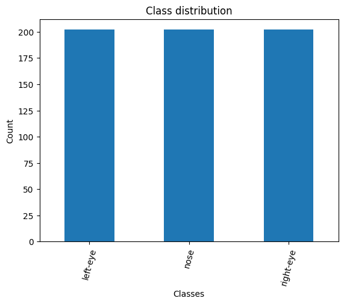
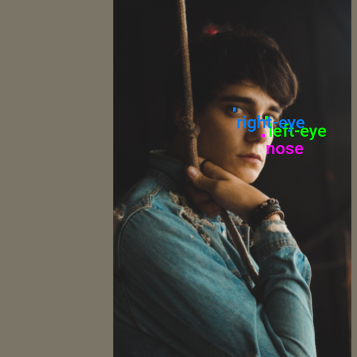
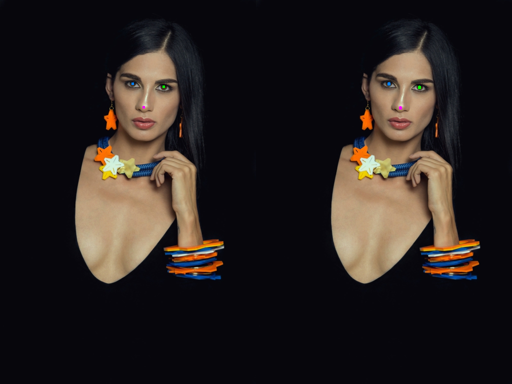

::: {.callout-tip}
## This post is part of the following series:
* [**Training Keypoint R-CNN Models with PyTorch**](/series/tutorials/pytorch-train-keypoint-rcnn-series.html)
:::


* [Introduction](#introduction)
* [Getting Started with the Code](#getting-started-with-the-code)
* [Setting Up Your Python Environment](#setting-up-your-python-environment)
* [Importing the Required Dependencies](#importing-the-required-dependencies)
* [Setting Up the Project](#setting-up-the-project)
* [Loading and Exploring the Dataset](#loading-and-exploring-the-dataset)
* [Loading the Keypoint R-CNN Model](#loading-the-keypoint-r-cnn-model)
* [Preparing the Data](#preparing-the-data)
* [Fine-tuning the Model](#fine-tuning-the-model)
* [Making Predictions with the Model](#making-predictions-with-the-model)
* [Conclusion](#conclusion)


## Introduction

Welcome to this hands-on guide to training Keypoint R-CNN models in PyTorch. Keypoint estimation models predict the locations of points on a given object or person, allowing us to recognize and interpret poses, gestures, or significant parts of objects.

{fig-align="center"}

The tutorial walks through setting up a Python environment, loading the raw keypoint annotations, annotating and augmenting images, creating a custom [Dataset](https://pytorch.org/tutorials/beginner/basics/data_tutorial.html) class to feed samples to a model, finetuning a Keypoint R-CNN model, and performing inference.

This guide is suitable for beginners and experienced practitioners, providing the code, explanations, and resources needed to understand and implement each step. Upon completion, you will have a solid foundation for training custom key point estimation models for other projects.

## Getting Started with the Code

The tutorial code is available as a [Jupyter Notebook](https://jupyter.org/), which you can run locally or in a cloud-based environment like [Google Colab](https://colab.research.google.com/). I have dedicated tutorials for those new to these platforms or who need guidance setting up:

::: {.callout-tip title="Setup Guides" collapse="true"}

* [**Getting Started with Google Colab**](/posts/google-colab-getting-started-tutorial/)
* [**Setting Up a Local Python Environment with Mamba for Machine Learning Projects on Windows**](/posts/mamba-getting-started-tutorial-windows/)

:::


::: {.callout-tip title="Tutorial Code" collapse="false"}

| Platform     | Jupyter Notebook                                             |
| ------------ | ------------------------------------------------------------ |
| Google Colab | [Open In Colab](https://colab.research.google.com/github/cj-mills/pytorch-keypoint-rcnn-tutorial-code/blob/main/notebooks/pytorch-keypoint-r-cnn-training-labelme.ipynb) |
| Linux        | [GitHub Repository](https://github.com/cj-mills/pytorch-keypoint-rcnn-tutorial-code/blob/main/notebooks/pytorch-keypoint-r-cnn-training-labelme.ipynb) |
| Windows      | [GitHub Repository](https://github.com/cj-mills/pytorch-keypoint-rcnn-tutorial-code/blob/main/notebooks/pytorch-keypoint-r-cnn-training-labelme-windows.ipynb) |


:::





## Setting Up Your Python Environment

Before diving into the code, we'll cover the steps to create a local Python environment and install the necessary dependencies.


### Creating a Python Environment

First, we'll create a Python environment using [Conda](https://docs.conda.io/en/latest/)/[Mamba](https://mamba.readthedocs.io/en/latest/). Open a terminal with Conda/Mamba installed and run the following commands:


::: {.panel-tabset}
## Conda

``` {.bash}
# Create a new Python 3.11 environment
conda create --name pytorch-env python=3.11 -y
# Activate the environment
conda activate pytorch-env
```

## Mamba

``` {.bash}
# Create a new Python 3.11 environment
mamba create --name pytorch-env python=3.11 -y
# Activate the environment
mamba activate pytorch-env
```

:::


### Installing PyTorch

Next, we'll install [PyTorch](https://pytorch.org/). Run the appropriate command for your hardware and operating system.

::: {.panel-tabset}
## Linux/Windows (CUDA)

``` {.bash}
# Install PyTorch with CUDA
pip install torch torchvision torchaudio --index-url https://download.pytorch.org/whl/cu128
```

## Mac

``` {.bash}
# MPS (Metal Performance Shaders) acceleration is available on MacOS 12.3+
pip install torch torchvision torchaudio
```

## Linux (CPU)

``` {.bash}
# Install PyTorch for CPU only
pip install torch torchvision torchaudio --index-url https://download.pytorch.org/whl/cpu
```

## Windows (CPU)

``` {.bash}
# Install PyTorch for CPU only
pip install torch torchvision torchaudio
```

:::


### Installing Additional Libraries

We also need to install some additional libraries for our project.

::: {.callout-note title="Package Descriptions" collapse="true"}

| Package       | Description                                                  |
| ------------- | ------------------------------------------------------------ |
| `jupyter`     | An  open-source web application that allows you to create and share  documents that contain live code, equations, visualizations, and  narrative text. ([link](https://jupyter.org/)) |
| `matplotlib`  | This package provides a comprehensive collection of visualization tools to  create high-quality plots, charts, and graphs for data exploration and  presentation. ([link](https://matplotlib.org/)) |
| `pandas`      | This package provides fast, powerful, and flexible data analysis and manipulation tools. ([link](https://pandas.pydata.org/)) |
| `pillow`      | The Python Imaging Library adds image processing capabilities. ([link](https://pillow.readthedocs.io/en/stable/)) |
| `torchtnt`    | A Python library that provides fast, extensible progress bars for loops and other iterable objects in Python. ([link](https://tqdm.github.io/)) |
| `tabulate`    | Pretty-print tabular data in Python. ([link](https://pypi.org/project/tabulate/)) |
| `tqdm`        | A Python library that provides fast, extensible progress bars for loops and other iterable objects in Python. ([link](https://tqdm.github.io/)) |
| `distinctipy` | A lightweight python package providing functions to generate colours that are visually distinct from one another. ([link](https://distinctipy.readthedocs.io/en/latest/)) |

:::

Run the following command to install these additional libraries:

```bash
# Install additional dependencies
pip install distinctipy jupyter matplotlib pandas pillow torchtnt==0.2.0 tabulate tqdm
```


### Installing Utility Packages

We will also install some utility packages I made, which provide shortcuts for routine tasks.

::: {.callout-note title="Package Descriptions" collapse="true"}

| Package                | Description                                                  |
| ---------------------- | ------------------------------------------------------------ |
| `cjm_pandas_utils`     | Some utility functions for working with Pandas. ([link](https://cj-mills.github.io/cjm-pandas-utils/)) |
| `cjm_pil_utils`        | Some PIL utility functions I frequently use. ([link](https://cj-mills.github.io/cjm-pil-utils/)) |
| `cjm_psl_utils`        | Some utility functions using the Python Standard Library. ([link](https://cj-mills.github.io/cjm-psl-utils/)) |
| `cjm_pytorch_utils`    | Some utility functions for working with PyTorch. ([link](https://cj-mills.github.io/cjm-pytorch-utils/)) |
| `cjm_torchvision_tfms` | Some custom Torchvision tranforms. ([link](https://cj-mills.github.io/cjm-torchvision-tfms/)) |

:::

Run the following command to install the utility packages:

```python
# Install additional utility packages
pip install cjm_pandas_utils cjm_pil_utils cjm_psl_utils cjm_pytorch_utils cjm_torchvision_tfms
```

With our environment set up, we can open our Jupyter Notebook and dive into the code. 


## Importing the Required Dependencies

First, we will import the necessary Python modules into our Jupyter Notebook.


```python
# Import Python Standard Library dependencies
from contextlib import contextmanager
import datetime
from functools import partial
from glob import glob
import json
import math
import multiprocessing
import os
from pathlib import Path
import random

# Import utility functions
from cjm_pandas_utils.core import markdown_to_pandas
from cjm_pil_utils.core import resize_img, get_img_files, stack_imgs
from cjm_psl_utils.core import download_file, file_extract
from cjm_pytorch_utils.core import set_seed, pil_to_tensor, tensor_to_pil, get_torch_device, denorm_img_tensor, move_data_to_device
from cjm_torchvision_tfms.core import ResizeMax, PadSquare, CustomRandomIoUCrop, RandomPixelCopy

# Import the distinctipy module
from distinctipy import distinctipy

# Import matplotlib for creating plots
import matplotlib.pyplot as plt

# Import numpy
import numpy as np

# Import the pandas package
import pandas as pd

# Do not truncate the contents of cells and display all rows and columns
pd.set_option('max_colwidth', None, 'display.max_rows', None, 'display.max_columns', None)

# Import PIL for image manipulation
from PIL import Image

# Import PyTorch dependencies
import torch
import torch.nn as nn
from torch.amp import autocast
from torch.cuda.amp import GradScaler

from torch.utils.data import Dataset, DataLoader
from torchtnt.utils import get_module_summary

# Import torchvision dependencies
import torchvision
torchvision.disable_beta_transforms_warning()
from torchvision.tv_tensors import BoundingBoxes
from torchvision.utils import draw_bounding_boxes
import torchvision.transforms.v2  as transforms

# Import Keypoint R-CNN
from torchvision.models.detection.keypoint_rcnn import KeypointRCNNPredictor
from torchvision.models.detection.rpn import AnchorGenerator
from torchvision.models.detection import keypointrcnn_resnet50_fpn

# Import tqdm for progress bar
from tqdm.auto import tqdm
```

Torchvision provides dedicated [`torch.Tensor`](https://pytorch.org/docs/stable/tensors.html) subclasses for different annotation types called [`TVTensors`](https://pytorch.org/vision/stable/tv_tensors.html). Torchvision’s V2 transforms use these subclasses to update the  annotations based on the applied image augmentations. While there is  currently no dedicated TVTensor class for keypoint annotations, we can  use the one for [bounding boxes](https://pytorch.org/vision/stable/generated/torchvision.tv_tensors.BoundingBoxes.html) instead. Torchvision does include a [`draw_keypoints`](https://pytorch.org/vision/stable/generated/torchvision.utils.draw_keypoints.html) function, but we might as well stick with the [`draw_bounding_boxes`](https://pytorch.org/vision/stable/generated/torchvision.utils.draw_bounding_boxes.html) function to annotate images.


## Setting Up the Project

In this section, we set up some basics for our project, such as initializing random number generators, setting the PyTorch device to run the model, and preparing the folders for our project and datasets.

### Setting a Random Number Seed

First, we set the seed for generating random numbers using the [set_seed](https://cj-mills.github.io/cjm-pytorch-utils/core.html#set_seed) function from the `cjm_pytorch_utils` package.


```python
# Set the seed for generating random numbers in PyTorch, NumPy, and Python's random module.
seed = 123
set_seed(seed)
```

### Setting the Device and Data Type

Next, we determine the device to use for training using the [get_torch_device](https://cj-mills.github.io/cjm-pytorch-utils/core.html#get_torch_device) function from the `cjm_pytorch_utils` package and set the data type of our tensors.


```python
device = get_torch_device()
dtype = torch.float32
device, dtype
```


```text
('cuda', torch.float32)
```


### Setting the Directory Paths

We can then set up a directory for our project to store our results and other related files. We also need a place to store our dataset. The following code creates the folders in the current directory (`./`). Update the path if that is not suitable for you.


```python
# The name for the project
project_name = f"pytorch-keypoint-r-cnn"

# The path for the project folder
project_dir = Path(f"./{project_name}/")

# Create the project directory if it does not already exist
project_dir.mkdir(parents=True, exist_ok=True)

# Define path to store datasets
dataset_dir = Path("./Datasets/")
# Create the dataset directory if it does not exist
dataset_dir.mkdir(parents=True, exist_ok=True)

# Define path to store archive files
archive_dir = dataset_dir/'../Archive'
# Create the archive directory if it does not exist
archive_dir.mkdir(parents=True, exist_ok=True)

# Creating a Series with the paths and converting it to a DataFrame for display
pd.Series({
    "Project Directory:": project_dir,
    "Dataset Directory:": dataset_dir, 
    "Archive Directory:": archive_dir
}).to_frame().style.hide(axis='columns')
```

<div style="overflow-x:auto; max-height:500px">
<table id="T_c7875">
  <thead>
  </thead>
  <tbody>
    <tr>
      <th id="T_c7875_level0_row0" class="row_heading level0 row0" >Project Directory:</th>
      <td id="T_c7875_row0_col0" class="data row0 col0" >pytorch-keypoint-r-cnn</td>
    </tr>
    <tr>
      <th id="T_c7875_level0_row1" class="row_heading level0 row1" >Dataset Directory:</th>
      <td id="T_c7875_row1_col0" class="data row1 col0" >Datasets</td>
    </tr>
    <tr>
      <th id="T_c7875_level0_row2" class="row_heading level0 row2" >Archive Directory:</th>
      <td id="T_c7875_row2_col0" class="data row2 col0" >Datasets/../Archive</td>
    </tr>
  </tbody>
</table>
</div>

Double-check the project and dataset directories exist in the specified paths and that you can add files to them before continuing. At this point, our project is set up and ready to go. In the next section, we will download and explore the dataset.


## Loading and Exploring the Dataset

I annotated a small dataset with key points for this tutorial using images from the free stock photo site [Pexels](https://www.pexels.com/). The dataset is available on [HuggingFace Hub](https://huggingface.co/) at the link below:

- **Dataset Repository:** [labelme-keypoint-eyes-noses-dataset](https://huggingface.co/datasets/cj-mills/labelme-keypoint-eyes-noses-dataset/tree/main)


The dataset contains 2D coordinates for eyes and noses on human faces.


::: {.callout-tip title="Keypoint Annotation Format"}

The keypoints for this dataset use the [LabelMe](https://github.com/labelmeai/labelme) annotation format. You can learn more about this format and how to work with such annotations in the tutorial linked below:

* [Working with LabelMe Keypoint Annotations in Torchvision](/posts/torchvision-labelme-annotation-tutorials/keypoints/)

:::

### Setting the Dataset Path

First, we construct the name for the Hugging Face Hub dataset and set where to download and extract the dataset.


```python
# Set the name of the dataset
dataset_name = 'labelme-keypoint-eyes-noses-dataset'

# Construct the HuggingFace Hub dataset name by combining the username and dataset name
hf_dataset = f'cj-mills/{dataset_name}'

# Create the path to the zip file that contains the dataset
archive_path = Path(f'{archive_dir}/{dataset_name}.zip')

# Create the path to the directory where the dataset will be extracted
dataset_path = Path(f'{dataset_dir}/{dataset_name}')

# Creating a Series with the dataset name and paths and converting it to a DataFrame for display
pd.Series({
    "HuggingFace Dataset:": hf_dataset, 
    "Archive Path:": archive_path, 
    "Dataset Path:": dataset_path
}).to_frame().style.hide(axis='columns')
```

<div style="overflow-x:auto; max-height:500px">
<table id="T_be76c">
  <thead>
  </thead>
  <tbody>
    <tr>
      <th id="T_be76c_level0_row0" class="row_heading level0 row0" >HuggingFace Dataset:</th>
      <td id="T_be76c_row0_col0" class="data row0 col0" >cj-mills/labelme-keypoint-eyes-noses-dataset</td>
    </tr>
    <tr>
      <th id="T_be76c_level0_row1" class="row_heading level0 row1" >Archive Path:</th>
      <td id="T_be76c_row1_col0" class="data row1 col0" >Datasets/../Archive/labelme-keypoint-eyes-noses-dataset.zip</td>
    </tr>
    <tr>
      <th id="T_be76c_level0_row2" class="row_heading level0 row2" >Dataset Path:</th>
      <td id="T_be76c_row2_col0" class="data row2 col0" >Datasets/labelme-keypoint-eyes-noses-dataset</td>
    </tr>
  </tbody>
</table>
</div>


### Downloading the Dataset

We can now download the archive file and extract the dataset using the [`download_file`](https://cj-mills.github.io/cjm-psl-utils/core.html#download_file) and [`file_extract`](https://cj-mills.github.io/cjm-psl-utils/core.html#file_extract) functions from the `cjm_psl_utils` package. We can delete the archive afterward to save space.


```python
# Construct the HuggingFace Hub dataset URL
dataset_url = f"https://huggingface.co/datasets/{hf_dataset}/resolve/main/{dataset_name}.zip"
print(f"HuggingFace Dataset URL: {dataset_url}")

# Set whether to delete the archive file after extracting the dataset
delete_archive = True

# Download the dataset if not present
if dataset_path.is_dir():
    print("Dataset folder already exists")
else:
    print("Downloading dataset...")
    download_file(dataset_url, archive_dir)    
    
    print("Extracting dataset...")
    file_extract(fname=archive_path, dest=dataset_dir)
    
    # Delete the archive if specified
    if delete_archive: archive_path.unlink()
```

### Get Image File Paths

Next, we will make a dictionary that maps each image’s unique name to  its file path, allowing us to retrieve the file path for a given image  more efficiently.


```python
# Get a list of image files in the dataset
img_file_paths = get_img_files(dataset_path)

# Create a dictionary that maps file names to file paths
img_dict = {file.stem : file for file in (img_file_paths)}

# Print the number of image files
print(f"Number of Images: {len(img_dict)}")

# Display the first five entries from the dictionary using a Pandas DataFrame
pd.DataFrame.from_dict(img_dict, orient='index').head()
```

```text
Number of Images: 200
```

<div style="overflow-x:auto; max-height:500px">
<table border="1" class="dataframe">
  <thead>
    <tr style="text-align: right;">
      <th></th>
      <th>0</th>
    </tr>
  </thead>
  <tbody>
    <tr>
      <th>denim-jacket-fashion-fashion-model-1848570</th>
      <td>Datasets/labelme-keypoint-eyes-noses-dataset/denim-jacket-fashion-fashion-model-1848570.jpg</td>
    </tr>
    <tr>
      <th>dried-dry-face-2965690</th>
      <td>Datasets/labelme-keypoint-eyes-noses-dataset/dried-dry-face-2965690.jpg</td>
    </tr>
    <tr>
      <th>elderly-face-old-person-2856346</th>
      <td>Datasets/labelme-keypoint-eyes-noses-dataset/elderly-face-old-person-2856346.jpg</td>
    </tr>
    <tr>
      <th>elderly-hair-man-1319289</th>
      <td>Datasets/labelme-keypoint-eyes-noses-dataset/elderly-hair-man-1319289.jpg</td>
    </tr>
    <tr>
      <th>face-facial-expression-fashion-2592000</th>
      <td>Datasets/labelme-keypoint-eyes-noses-dataset/face-facial-expression-fashion-2592000.jpg</td>
    </tr>
  </tbody>
</table>
</div>


### Get Image Annotations

We will then read the content of the JSON annotation file associated  with each image into a single Pandas DataFrame so we can easily query  the annotations.


```python
# Get a list of JSON files in the dataset
annotation_file_paths = list(dataset_path.glob('*.json'))

# Create a generator that yields Pandas DataFrames containing the data from each JSON file
cls_dataframes = (pd.read_json(f, orient='index').transpose() for f in tqdm(annotation_file_paths))

# Concatenate the DataFrames into a single DataFrame
annotation_df = pd.concat(cls_dataframes, ignore_index=False)

# Assign the image file name as the index for each row
annotation_df['index'] = annotation_df.apply(lambda row: row['imagePath'].split('.')[0], axis=1)
annotation_df = annotation_df.set_index('index')

# Keep only the rows that correspond to the filenames in the 'img_dict' dictionary
annotation_df = annotation_df.loc[list(img_dict.keys())]

# Print the first 5 rows of the DataFrame
annotation_df.head()
```

<div style="overflow-x:auto; max-height:500px">
<table border="1" class="dataframe">
  <thead>
    <tr style="text-align: right;">
      <th></th>
      <th>version</th>
      <th>flags</th>
      <th>shapes</th>
      <th>imagePath</th>
      <th>imageData</th>
      <th>imageHeight</th>
      <th>imageWidth</th>
    </tr>
    <tr>
      <th>index</th>
      <th></th>
      <th></th>
      <th></th>
      <th></th>
      <th></th>
      <th></th>
      <th></th>
    </tr>
  </thead>
  <tbody>
    <tr>
      <th>denim-jacket-fashion-fashion-model-1848570</th>
      <td>5.3.1</td>
      <td>{}</td>
      <td>[{'label': 'left-eye', 'points': [[329.17073170731703, 252.59756097560972]], 'group_id': None, 'description': '', 'shape_type': 'point', 'flags': {}}, {'label': 'nose', 'points': [[323.68292682926835, 291.0121951219512]], 'group_id': None, 'description': '', 'shape_type': 'point', 'flags': {}}, {'label': 'right-eye', 'points': [[260.2682926829268, 234.91463414634143]], 'group_id': None, 'description': '', 'shape_type': 'point', 'flags': {}}]</td>
      <td>denim-jacket-fashion-fashion-model-1848570.jpg</td>
      <td>None</td>
      <td>768</td>
      <td>512</td>
    </tr>
    <tr>
      <th>dried-dry-face-2965690</th>
      <td>5.3.1</td>
      <td>{}</td>
      <td>[{'label': 'right-eye', 'points': [[201.7317073170732, 351.9878048780488]], 'group_id': None, 'description': '', 'shape_type': 'point', 'flags': {}}, {'label': 'left-eye', 'points': [[333.43902439024396, 342.23170731707313]], 'group_id': None, 'description': '', 'shape_type': 'point', 'flags': {}}, {'label': 'nose', 'points': [[271.2439024390244, 436.1341463414634]], 'group_id': None, 'description': '', 'shape_type': 'point', 'flags': {}}]</td>
      <td>dried-dry-face-2965690.jpg</td>
      <td>None</td>
      <td>768</td>
      <td>512</td>
    </tr>
    <tr>
      <th>elderly-face-old-person-2856346</th>
      <td>5.3.1</td>
      <td>{}</td>
      <td>[{'label': 'left-eye', 'points': [[302.3414634146342, 286.1341463414634]], 'group_id': None, 'description': '', 'shape_type': 'point', 'flags': {}}, {'label': 'nose', 'points': [[243.80487804878055, 339.79268292682923]], 'group_id': None, 'description': '', 'shape_type': 'point', 'flags': {}}, {'label': 'right-eye', 'points': [[196.2439024390244, 286.7439024390244]], 'group_id': None, 'description': '', 'shape_type': 'point', 'flags': {}}]</td>
      <td>elderly-face-old-person-2856346.jpg</td>
      <td>None</td>
      <td>768</td>
      <td>512</td>
    </tr>
    <tr>
      <th>elderly-hair-man-1319289</th>
      <td>5.3.1</td>
      <td>{}</td>
      <td>[{'label': 'right-eye', 'points': [[490.910569105691, 175.71544715447155]], 'group_id': None, 'description': '', 'shape_type': 'point', 'flags': {}}, {'label': 'left-eye', 'points': [[548.6341463414634, 167.58536585365852]], 'group_id': None, 'description': '', 'shape_type': 'point', 'flags': {}}, {'label': 'nose', 'points': [[526.6829268292682, 201.73170731707316]], 'group_id': None, 'description': '', 'shape_type': 'point', 'flags': {}}]</td>
      <td>elderly-hair-man-1319289.jpg</td>
      <td>None</td>
      <td>512</td>
      <td>768</td>
    </tr>
    <tr>
      <th>face-facial-expression-fashion-2592000</th>
      <td>5.3.1</td>
      <td>{}</td>
      <td>[{'label': 'left-eye', 'points': [[301.45454545454544, 106.85561497326205]], 'group_id': None, 'description': '', 'shape_type': 'point', 'flags': {}}, {'label': 'right-eye', 'points': [[250.65240641711233, 115.94652406417114]], 'group_id': None, 'description': '', 'shape_type': 'point', 'flags': {}}, {'label': 'nose', 'points': [[272.0427807486631, 121.29411764705884]], 'group_id': None, 'description': '', 'shape_type': 'point', 'flags': {}}]</td>
      <td>face-facial-expression-fashion-2592000.jpg</td>
      <td>None</td>
      <td>672</td>
      <td>512</td>
    </tr>
  </tbody>
</table>
</div>


### Inspecting the Class Distribution

Now that we have the annotation data, we can extract the unique class names and inspect the class distribution. A balanced dataset (where each class has approximately the same number of instances) is ideal for training a machine-learning model.

#### Get image classes


```python
# Explode the 'shapes' column in the annotation_df dataframe
# Apply the pandas Series function to the 'shapes' column of the dataframe
shapes_df = annotation_df['shapes'].explode().to_frame().shapes.apply(pd.Series)

# Get a list of unique labels in the 'annotation_df' DataFrame
class_names = shapes_df['label'].unique().tolist()

# Display labels using a Pandas DataFrame
pd.DataFrame(class_names)
```


<div style="overflow-x:auto; max-height:500px">
<table border="1" class="dataframe">
  <thead>
    <tr style="text-align: right;">
      <th></th>
      <th>0</th>
    </tr>
  </thead>
  <tbody>
    <tr>
      <th>0</th>
      <td>left-eye</td>
    </tr>
    <tr>
      <th>1</th>
      <td>nose</td>
    </tr>
    <tr>
      <th>2</th>
      <td>right-eye</td>
    </tr>
  </tbody>
</table>
</div>


#### Visualize the class distribution


```python
# Get the number of samples for each object class
class_counts = shapes_df['label'].value_counts()

# Plot the distribution
class_counts.plot(kind='bar')
plt.title('Class distribution')
plt.ylabel('Count')
plt.xlabel('Classes')
plt.xticks(range(len(class_counts.index)), class_counts.index, rotation=75)  # Set the x-axis tick labels
plt.show()
```

{fig-align="center"}


### Visualizing Image Annotations

In this section, we will annotate a single image with its bounding boxes using torchvision’s [`BoundingBoxes`](https://pytorch.org/vision/stable/generated/torchvision.tv_tensors.BoundingBoxes.html) class and [`draw_bounding_boxes`](https://pytorch.org/vision/stable/generated/torchvision.utils.draw_bounding_boxes.html) function.

#### Generate a color map

First, we will generate a color map for the object classes.


```python
# Generate a list of colors with a length equal to the number of labels
colors = distinctipy.get_colors(len(class_names))

# Make a copy of the color map in integer format
int_colors = [tuple(int(c*255) for c in color) for color in colors]

# Generate a color swatch to visualize the color map
distinctipy.color_swatch(colors)
```

{fig-align="center"}


#### Download a font file

The [`draw_bounding_boxes`](https://pytorch.org/vision/stable/generated/torchvision.utils.draw_bounding_boxes.html) function included with torchvision uses a pretty small font size. We  can increase the font size if we use a custom font. Font files are  available on sites like [Google Fonts](https://fonts.google.com/), or we can use one included with the operating system.


```python
# Set the name of the font file
font_file = 'KFOlCnqEu92Fr1MmEU9vAw.ttf'

# Download the font file
download_file(f"https://fonts.gstatic.com/s/roboto/v30/{font_file}", "./")
```

#### Define the bounding box annotation function

We can make a partial function using `draw_bounding_boxes` since we’ll use the same box thickness and font each time we visualize bounding boxes.


```python
draw_bboxes = partial(draw_bounding_boxes, fill=True, width=4, font=font_file, font_size=25)
```

### Annotate sample image

Finally, we will open a sample image and annotate it with it’s associated bounding boxes.


```python
# Get the file ID of the first image file
file_id = list(img_dict.keys())[0]

# Open the associated image file as a RGB image
sample_img = Image.open(img_dict[file_id]).convert('RGB')

# Extract the labels and bounding box annotations for the sample image
labels = [shape['label'] for shape in annotation_df.loc[file_id]['shapes']]
keypoints = torch.tensor(np.array([shape['points'] for shape in annotation_df.loc[file_id]['shapes']])).reshape(-1,2)
BBOX_DIM = 4
keypoints_bboxes = torch.cat((keypoints, torch.ones(len(keypoints), 2)*BBOX_DIM), dim=1)

# Annotate the sample image with labels and bounding boxes
annotated_tensor = draw_bboxes(
    image=transforms.PILToTensor()(sample_img), 
    boxes=torchvision.ops.box_convert(torch.Tensor(keypoints_bboxes), 'cxcywh', 'xyxy'),
    labels=labels, 
    colors=[int_colors[i] for i in [class_names.index(label) for label in labels]]
)

tensor_to_pil(annotated_tensor)
```

{fig-align="center"}


## Loading the Keypoint R-CNN Model

TorchVision provides [checkpoints](https://pytorch.org/vision/stable/models.html#table-of-all-available-keypoint-detection-weights) for the Keypoint R-CNN model trained on the [COCO](https://cocodataset.org/) (Common Objects in Context) dataset. We can initialize a model with these pretrained weights using the [`keypointrcnn_resnet50_fpn`](https://pytorch.org/vision/stable/models/generated/torchvision.models.detection.keypointrcnn_resnet50_fpn.html?highlight=keypointrcnn_resnet50_fpn) function. We must then replace the keypoint predictor for the pretrained model with a new one for our dataset.


```python
# Load a pre-trained model
model = keypointrcnn_resnet50_fpn(weights='DEFAULT')

# Replace the classifier head with the number of keypoints
in_features = model.roi_heads.keypoint_predictor.kps_score_lowres.in_channels
model.roi_heads.keypoint_predictor = KeypointRCNNPredictor(in_channels=in_features, num_keypoints=len(class_names))

# Set the model's device and data type
model.to(device=device, dtype=dtype);

# Add attributes to store the device and model name for later reference
model.device = device
model.name = 'keypointrcnn_resnet50_fpn'
```

The model internally normalizes input using the mean and standard  deviation values used during the pretraining process, so we do not need  to keep track of them separately.

### Summarizing the Model

Before moving on, let’s generate a summary of our model to get an  overview of its performance characteristics. We can use this to gauge  the computational requirements for deploying the model.


```python
# Define the input to the model
test_inp = torch.randn(1, 3, 256, 256).to(device)

# Get a summary of the model as a Pandas DataFrame
summary_df = markdown_to_pandas(f"{get_module_summary(model.eval(), [test_inp])}")

# Filter the summary to only the model
summary_df = summary_df[summary_df.index == 0]

# Remove the column "Contains Uninitialized Parameters?"
summary_df.drop(['In size', 'Out size', 'Contains Uninitialized Parameters?'], axis=1)
```

<div style="overflow-x:auto; max-height:500px">
<table border="1" class="dataframe">
  <thead>
    <tr style="text-align: right;">
      <th></th>
      <th>Type</th>
      <th># Parameters</th>
      <th># Trainable Parameters</th>
      <th>Size (bytes)</th>
      <th>Forward FLOPs</th>
    </tr>
  </thead>
  <tbody>
    <tr>
      <th>0</th>
      <td>KeypointRCNN</td>
      <td>59.0 M</td>
      <td>58.8 M</td>
      <td>236 M</td>
      <td>144 G</td>
    </tr>
  </tbody>
</table>
</div>
The above table shows the model has approximately `58.8` million trainable parameters. It takes up `263` Megabytes and performs around `144` billion floating point operations for a single `256x256` RGB image. This model internally resizes input images and executes the  same number of floating point operations for different input  resolutions.

That completes the model setup. In the next section, we will prepare our dataset for training.


## Preparing the Data

The data preparation involves several steps, such as applying data  augmentation techniques, setting up the train-validation split for the  dataset, resizing and padding the images, defining the training dataset  class, and initializing DataLoaders to feed data to the model.

### Training-Validation Split

Let’s begin by defining the training-validation split. We’ll randomly select 90% of the available samples for the training set and use the  remaining 10% for the validation set.


```python
# Get the list of image IDs
img_keys = list(img_dict.keys())

# Shuffle the image IDs
random.shuffle(img_keys)

# Define the percentage of the images that should be used for training
train_pct = 0.9
val_pct = 0.1

# Calculate the index at which to split the subset of image paths into training and validation sets
train_split = int(len(img_keys)*train_pct)
val_split = int(len(img_keys)*(train_pct+val_pct))

# Split the subset of image paths into training and validation sets
train_keys = img_keys[:train_split]
val_keys = img_keys[train_split:]

# Print the number of images in the training and validation sets
pd.Series({
    "Training Samples:": len(train_keys),
    "Validation Samples:": len(val_keys)
}).to_frame().style.hide(axis='columns')
```

<div style="overflow-x:auto; max-height:500px">
<table id="T_39a47">
  <thead>
  </thead>
  <tbody>
    <tr>
      <th id="T_39a47_level0_row0" class="row_heading level0 row0" >Training Samples:</th>
      <td id="T_39a47_row0_col0" class="data row0 col0" >180</td>
    </tr>
    <tr>
      <th id="T_39a47_level0_row1" class="row_heading level0 row1" >Validation Samples:</th>
      <td id="T_39a47_row1_col0" class="data row1 col0" >20</td>
    </tr>
  </tbody>
</table>
</div>


### Data Augmentation

Here, we will define some data augmentations to apply to images  during training. I created a few custom image transforms to help  streamline the code.

The [first](https://cj-mills.github.io/cjm-torchvision-tfms/core.html#customrandomioucrop) extends the [`RandomIoUCrop`](https://pytorch.org/vision/stable/generated/torchvision.transforms.v2.RandomIoUCrop.html#torchvision.transforms.v2.RandomIoUCrop) transform included with torchvision to give the user more control over how much it crops into bounding box areas. The [second](https://cj-mills.github.io/cjm-torchvision-tfms/core.html#resizemax) resizes images based on their largest dimension rather than their smallest. The [third](https://cj-mills.github.io/cjm-torchvision-tfms/core.html#padsquare) applies square padding and allows the padding to be applied equally on both sides or randomly split between the two sides.

All three are available through the [`cjm-torchvision-tfms`](https://cj-mills.github.io/cjm-torchvision-tfms/) package.

#### Set training image size

First, we will specify the image size to use during training.


```python
# Set training image size
train_sz = 512
```

#### Initialize custom transforms

Next, we can initialize the transform objects.


```python
# Create a RandomIoUCrop object
iou_crop = CustomRandomIoUCrop(min_scale=0.3, 
                               max_scale=1.0, 
                               min_aspect_ratio=0.5, 
                               max_aspect_ratio=2.0, 
                               sampler_options=[0.0, 0.1, 0.3, 0.5, 0.7, 0.9, 1.0],
                               trials=400, 
                               jitter_factor=0.25)

# Create a `ResizeMax` object
resize_max = ResizeMax(max_sz=train_sz)

# Create a `PadSquare` object
pad_square = PadSquare(shift=True)
```

#### Test the transforms

Torchvision’s V2 image transforms take an image and a `targets` dictionary. The `targets` dictionary contains the annotations and labels for the image.

We will pass input through the `CustomRandomIoUCrop` transform first and then through `ResizeMax` and `PadSquare`. We can pass the result through a final resize operation to ensure both sides match the `train_sz` value.

::: {.callout-important}

Always use the [`SanitizeBoundingBoxes`](https://pytorch.org/vision/stable/generated/torchvision.transforms.v2.SanitizeBoundingBoxes.html#torchvision.transforms.v2.SanitizeBoundingBoxes) transform to clean up annotations after using data augmentations that alter bounding boxes (e.g., cropping, warping, etc.).
:::


```python
# Extract the labels for the sample
labels = [shape['label'] for shape in annotation_df.loc[file_id]['shapes']]

# Prepare bounding box targets
targets = {'boxes': BoundingBoxes(torchvision.ops.box_convert(keypoints_bboxes, 'cxcywh', 'xyxy'), 
                                format='xyxy', 
                                canvas_size=sample_img.size[::-1]), 
           'labels': torch.Tensor([class_names.index(label) for label in labels])}

# Crop the image
cropped_img, targets = iou_crop(sample_img, targets)

# Resize the image
resized_img, targets = resize_max(cropped_img, targets)

# Pad the image
padded_img, targets = pad_square(resized_img, targets)

# Ensure the padded image is the target size
resize = transforms.Resize([train_sz] * 2, antialias=True)
resized_padded_img, targets = resize(padded_img, targets)
sanitized_img, targets = transforms.SanitizeBoundingBoxes()(resized_padded_img, targets)

# Get colors for dataset sample
sample_colors = [int_colors[i] for i in [class_names.index(label) for label in labels]]

# Annotate the augmented image with updated labels and bounding boxes
annotated_tensor = draw_bboxes(
    image=transforms.PILToTensor()(sanitized_img), 
    boxes=targets['boxes'], 
    labels=[class_names[int(label.item())] for label in targets['labels']], 
    colors=sample_colors,
)

# Display the annotated image
display(tensor_to_pil(annotated_tensor))

pd.Series({
    "Source Image:": sample_img.size,
    "Cropped Image:": cropped_img.size,
    "Resized Image:": resized_img.size,
    "Padded Image:": padded_img.size,
    "Resized Padded Image:": resized_padded_img.size,
}).to_frame().style.hide(axis='columns')
```

{fig-align="center"}

<div style="overflow-x:auto; max-height:500px">
<table id="T_5be68">
  <thead>
  </thead>
  <tbody>
    <tr>
      <th id="T_5be68_level0_row0" class="row_heading level0 row0" >Source Image:</th>
      <td id="T_5be68_row0_col0" class="data row0 col0" >(512, 768)</td>
    </tr>
    <tr>
      <th id="T_5be68_level0_row1" class="row_heading level0 row1" >Cropped Image:</th>
      <td id="T_5be68_row1_col0" class="data row1 col0" >(512, 768)</td>
    </tr>
    <tr>
      <th id="T_5be68_level0_row2" class="row_heading level0 row2" >Resized Image:</th>
      <td id="T_5be68_row2_col0" class="data row2 col0" >(341, 511)</td>
    </tr>
    <tr>
      <th id="T_5be68_level0_row3" class="row_heading level0 row3" >Padded Image:</th>
      <td id="T_5be68_row3_col0" class="data row3 col0" >(511, 511)</td>
    </tr>
    <tr>
      <th id="T_5be68_level0_row4" class="row_heading level0 row4" >Resized Padded Image:</th>
      <td id="T_5be68_row4_col0" class="data row4 col0" >(512, 512)</td>
    </tr>
  </tbody>
</table>
</div>

Now that we know how to apply data augmentations, we can put all the steps we’ve covered into a custom Dataset class.

### Training Dataset Class

The following custom Dataset class is responsible for loading a single  image, preparing the associated annotations, applying any image  transforms, and returning the final `image` tensor and its `target` dictionary during training.

We will be applying the `SanitizeBoundingBoxes` transform here as well. This transform can remove key points if a previous transform moves them outside the image dimensions. The Keypoint R-CNN model still expects values for key points even when not visible, so we will fill the target annotations with dummy values as needed.


```python
class LabelMeKeypointDataset(Dataset):
    """
    A PyTorch Dataset class for handling LabelMe image keypoints.
    
    This class extends PyTorch's Dataset and is designed to work with image data and
    associated keypoints annotations. It supports loading images and corresponding
    keypoints annotations, and applying transformations.

    Attributes:
        img_keys (list): List of image keys.
        annotation_df (DataFrame): DataFrame containing annotations for each image.
        img_dict (dict): Dictionary mapping image keys to their file paths.
        class_to_idx (dict): Dictionary mapping class names to class indices.
        transforms (callable, optional): Transformations to be applied to the images and targets.
    """

    def __init__(self, img_keys, annotation_df, img_dict, class_to_idx, transforms=None):
        """
        Initializes the LabelMeKeypointDataset with image keys, annotations, and other relevant information.
        
        Args:
            img_keys (list): List of image keys.
            annotation_df (DataFrame): DataFrame containing annotations for each image.
            img_dict (dict): Dictionary mapping image keys to their file paths.
            class_to_idx (dict): Dictionary mapping class names to class indices.
            transforms (callable, optional): Transformations to be applied to the images and targets.
        """
        super(Dataset, self).__init__()
        
        self._img_keys = img_keys
        self._annotation_df = annotation_df
        self._img_dict = img_dict
        self._class_to_idx = class_to_idx
        self._transforms = transforms
        self.sanitize_bboxes = torchvision.transforms.v2.SanitizeBoundingBoxes()

        self.BBOX_DIM = 4
        self.DUMMY_VALUE = -1

    def __len__(self):
        """
        Returns the number of items in the dataset.
        
        Returns:
            int: Number of items in the dataset.
        """
        return len(self._img_keys)
        
    def __getitem__(self, index):
        """
        Retrieves an item from the dataset at the specified index.
        
        Args:
            index (int): Index of the item to retrieve.

        Returns:
            tuple: A tuple containing the image and its corresponding target (annotations).
        """
        img_key = self._img_keys[index]
        annotation = self._annotation_df.loc[img_key]
        image, target = self._load_image_and_target(annotation)
        
        # Applying transformations if specified
        if self._transforms:
            image, target = self._transforms(image, target)

        # Fill any missing keypoints with dummy values
        target = self._fill_and_order_target(target)
        return image, target

    def order_points_by_labels(self, data, label_order):
        """
        Extracts and orders points from a list of dictionaries based on a given order of labels.
    
        :param data: List of dictionaries containing labels and points.
        :param label_order: List of labels in the desired order.
        :return: List of points in the specified label order.
        """
        ordered_points = []
        label_to_points = {item['label']: item['points'] for item in data}
    
        for label in label_order:
            points = label_to_points.get(label)
            if points is not None:
                ordered_points.extend(points)

        return ordered_points

    def _load_image_and_target(self, annotation):
        """
        Loads an image and its corresponding target (annotations) based on the provided annotation.
        
        Args:
            annotation (DataFrame row): Annotation data for a specific image.
            Returns:
        tuple: A tuple containing the loaded image and its corresponding target data.
        """
        # Load the image from the file path specified in the annotations
        filepath = self._img_dict[annotation.name]
        image = Image.open(filepath).convert('RGB')

        # Extracting keypoints from the annotation and converting them to a tensor
        keypoints = self.order_points_by_labels(annotation['shapes'], self._class_to_idx.keys())
        keypoints = torch.tensor(np.array(keypoints, dtype=np.float32)).reshape(-1, 2)
        
        # Adding an offset to create bounding boxes around keypoints
        keypoints_bboxes = torch.cat((keypoints, torch.ones(len(keypoints), 2) * self.BBOX_DIM), dim=1)
                
        # Convert bounding box format and create a BoundingBoxes object
        bbox_tensor = torchvision.ops.box_convert(keypoints_bboxes, 'cxcywh', 'xyxy')
        boxes = BoundingBoxes(bbox_tensor, format='xyxy', canvas_size=image.size[::-1])
        
        # Create tensor for labels based on the class indices
        labels = torch.Tensor([self._class_to_idx[label] for label in self._class_to_idx.keys()])
        
        return image, {'boxes': boxes, 'labels': labels}

    def _fill_and_order_target(self, target):
        """
        Fills and orders the target bounding boxes and labels based on the class index.
    
        This method ensures that each target has a bounding box and label for each class,
        even if some classes are not present in the original target. Missing classes
        are filled with dummy values.
    
        Args:
            target (dict): A dictionary containing 'boxes' and 'labels' keys, where
                           'boxes' is a tensor of bounding boxes and 'labels' is a tensor
                           of labels corresponding to these boxes.
    
        Returns:
            dict: The updated target dictionary with boxes and labels ordered and filled
                  according to the class index.
        """
    
        # Initialize new boxes with dummy values for each class
        new_boxes = torch.full((len(self._class_to_idx), 4), self.DUMMY_VALUE)
        # Prepare labels tensor based on the class indices
        new_labels = torch.tensor(list(self._class_to_idx.values()), dtype=torch.float32)
    
        # Iterate over each class label
        for i, label in enumerate(new_labels):
            # Check if the current label exists in the target's labels
            if label in target['labels']:
                # Find the index of the current label in the target's labels
                idx = (target['labels'] == label).nonzero(as_tuple=True)[0]
                # Assign the corresponding box to the new boxes tensor
                new_boxes[i] = target['boxes'][idx]
    
        # Update the target dictionary with the new boxes and labels
        target['boxes'] = new_boxes
        target['labels'] = new_labels
    
        return target
```


### Image Transforms

Here, we will specify and organize all the image transforms to apply during training.


```python
# Compose transforms for data augmentation
data_aug_tfms = transforms.Compose(
    transforms=[
        transforms.ColorJitter(
                brightness = (0.8, 1.125),
                contrast = (0.5, 1.5),
                saturation = (0.5, 1.5),
                hue = (-0.05, 0.05),
        ),
        transforms.RandomGrayscale(),
        transforms.RandomEqualize(),
        RandomPixelCopy(max_pct=0.025),
        transforms.RandomPerspective(distortion_scale=0.15, p=0.5, fill=(123, 117, 104)),
        transforms.RandomRotation(degrees=90, fill=(123, 117, 104)),
        iou_crop,
    ],
)

# Compose transforms to resize and pad input images
resize_pad_tfm = transforms.Compose([
    resize_max, 
    pad_square,
    transforms.Resize([train_sz] * 2, antialias=True)
])

# Compose transforms to sanitize bounding boxes and normalize input data
final_tfms = transforms.Compose([
    transforms.ToImage(), 
    transforms.ToDtype(torch.float32, scale=True),
    transforms.SanitizeBoundingBoxes(),
])

# Define the transformations for training and validation datasets
train_tfms = transforms.Compose([
    data_aug_tfms, 
    resize_pad_tfm, 
    final_tfms
])
valid_tfms = transforms.Compose([resize_pad_tfm, final_tfms])
```

### Initialize Datasets

Now, we can create the dataset objects for the training and validation sets using the image dictionary, the annotation DataFrame, and the image transforms.


```python
# Create a mapping from class names to class indices
class_to_idx = {c: i for i, c in enumerate(class_names)}

# Instantiate the dataset using the defined transformations
train_dataset = LabelMeKeypointDataset(train_keys, annotation_df, img_dict, class_to_idx, train_tfms)
valid_dataset = LabelMeKeypointDataset(val_keys, annotation_df, img_dict, class_to_idx, valid_tfms)

# Print the number of samples in the training and validation datasets
pd.Series({
    'Training dataset size:': len(train_dataset),
    'Validation dataset size:': len(valid_dataset)}
).to_frame().style.hide(axis='columns')
```

<div style="overflow-x:auto; max-height:500px">
<table id="T_408f0">
  <thead>
  </thead>
  <tbody>
    <tr>
      <th id="T_408f0_level0_row0" class="row_heading level0 row0" >Training dataset size:</th>
      <td id="T_408f0_row0_col0" class="data row0 col0" >180</td>
    </tr>
    <tr>
      <th id="T_408f0_level0_row1" class="row_heading level0 row1" >Validation dataset size:</th>
      <td id="T_408f0_row1_col0" class="data row1 col0" >20</td>
    </tr>
  </tbody>
</table>
</div>


### Inspect Samples

Let’s verify the dataset objects work correctly by inspecting the first samples from the training and validation sets.

#### Inspect training set sample

Since our custom dataset fills missing annotations with dummy values, we will pass the target dictionary through the `SanitizeBoundingBoxes` function again.


```python
# Get a sample image and its target annotations
dataset_sample = train_dataset[0]

# Sanitize bounding boxes to remove dummy values
targets = dataset_sample[1]
targets['boxes'] = BoundingBoxes(targets['boxes'], format='xyxy', canvas_size=dataset_sample[0].shape[1:])
sanitized_image, sanitized_targets = transforms.SanitizeBoundingBoxes()(dataset_sample[0], targets)

# Annotate the sample image with the sanitized annotations
annotated_tensor = draw_bboxes(
    image=(sanitized_image*255).to(dtype=torch.uint8), 
    boxes=sanitized_targets['boxes'], 
    labels=[class_names[int(i.item())] for i in sanitized_targets['labels']], 
    colors=[int_colors[int(i.item())] for i in sanitized_targets['labels']]
)

tensor_to_pil(annotated_tensor)
```

{fig-align="center"}


#### Inspect validation set sample


```python
dataset_sample = valid_dataset[0]

annotated_tensor = draw_bboxes(
    image=(dataset_sample[0]*255).to(dtype=torch.uint8), 
    boxes=dataset_sample[1]['boxes'], 
    labels=[class_names[int(i.item())] for i in dataset_sample[1]['labels']], 
    colors=[int_colors[int(i.item())] for i in dataset_sample[1]['labels']]
)

tensor_to_pil(annotated_tensor)
```

{fig-align="center"}


### Initialize DataLoaders

The last step before training is to instantiate the DataLoaders for the  training and validation sets. Try decreasing the batch size if you  encounter memory limitations.


```python
# Set the training batch size
bs = 4

# Set the number of worker processes for loading data. This should be the number of CPUs available.
num_workers = multiprocessing.cpu_count()

# Define parameters for DataLoader
data_loader_params = {
    'batch_size': bs,  # Batch size for data loading
    'num_workers': num_workers,  # Number of subprocesses to use for data loading
    'persistent_workers': True,  # If True, the data loader will not shutdown the worker processes after a dataset has been consumed once. This allows to maintain the worker dataset instances alive.
    'pin_memory': 'cuda' in device,  # If True, the data loader will copy Tensors into CUDA pinned memory before returning them. Useful when using GPU.
    'pin_memory_device': device if 'cuda' in device else '',  # Specifies the device where the data should be loaded. Commonly set to use the GPU.
    'collate_fn': lambda batch: tuple(zip(*batch)),
}

# Create DataLoader for training data. Data is shuffled for every epoch.
train_dataloader = DataLoader(train_dataset, **data_loader_params, shuffle=True)

# Create DataLoader for validation data. Shuffling is not necessary for validation data.
valid_dataloader = DataLoader(valid_dataset, **data_loader_params)

# Print the number of batches in the training and validation DataLoaders
print(f'Number of batches in train DataLoader: {len(train_dataloader)}')
print(f'Number of batches in validation DataLoader: {len(valid_dataloader)}')
```

    Number of batches in train DataLoader: 45
    Number of batches in validation DataLoader: 5


## Fine-tuning the Model

In this section, we will implement the training code and fine-tune our model.

### Define Utility Functions

First, we need to define a couple of utility functions.

#### Define a function to create a bounding box that encapsulates the key points

The Keypoint R-CNN model expects a bounding box encapsulating the points associated with a given person/object. We could include these bounding box annotations in our dataset (e.g., have bounding boxes around each face). However, dynamically making one large enough to contain the key points will suffice.


```python
def keypoints_to_bbox(keypoints, offset=10):
    """
    Convert a tensor of keypoint coordinates to a bounding box.

    Args:
    keypoints (Tensor): A tensor of shape (N, 2), where N is the number of keypoints.

    Returns:
    Tensor: A tensor representing the bounding box [xmin, ymin, xmax, ymax].
    """
    x_coordinates, y_coordinates = keypoints[:, 0], keypoints[:, 1]

    xmin = torch.min(x_coordinates)
    ymin = torch.min(y_coordinates)
    xmax = torch.max(x_coordinates)
    ymax = torch.max(y_coordinates)

    bbox = torch.tensor([xmin-offset, ymin-offset, xmax+offset, ymax+offset])

    return bbox
```

#### Define a conditional `autocast` context manager

The autocast context manager that handles mixed-precision training on CPUs does not fully support the Keypoint R-CNN model. Therefore, we will only use mixed-precision training when not using the CPU.

```python
@contextmanager
def conditional_autocast(device):
    """
    A context manager for conditional automatic mixed precision (AMP).

    This context manager applies automatic mixed precision for operations if the
    specified device is not a CPU. It's a no-op (does nothing) if the device is a CPU.
    Mixed precision can speed up computations and reduce memory usage on compatible
    hardware, primarily GPUs.

    Parameters:
    device (str): The device type, e.g., 'cuda' or 'cpu', which determines whether
                  autocasting is applied.

    Yields:
    None - This function does not return any value but enables the wrapped code
           block to execute under the specified precision context.
    """

    # Check if the specified device is not a CPU
    if 'cpu' not in device:
        # If the device is not a CPU, enable autocast for the specified device type.
        # Autocast will automatically choose the precision (e.g., float16) for certain
        # operations to improve performance.
        with autocast(device_type=device):
            yield
    else:
        # If the device is a CPU, autocast is not applied.
        # This yields control back to the with-block with no changes.
        yield
```


### Define the Training Loop

The following function performs a single pass through the training or validation set.

As mentioned earlier, the Keypoint R-CNN model expects values for key points even when not visible. We indicate which key points are visible, with a `1` for visible and a `0` for not.

The model has different behavior when in `training` mode versus `evaluation` mode. In training mode, it calculates the loss internally for the  key point estimation task and returns a dictionary with the individual loss values. We can sum up these separate values to get  the total loss.


```python
# Function to run a single training/validation epoch
def run_epoch(model, dataloader, optimizer, lr_scheduler, device, scaler, epoch_id, is_training):
    """
    Function to run a single training or evaluation epoch.
    
    Args:
        model: A PyTorch model to train or evaluate.
        dataloader: A PyTorch DataLoader providing the data.
        optimizer: The optimizer to use for training the model.
        loss_func: The loss function used for training.
        device: The device (CPU or GPU) to run the model on.
        scaler: Gradient scaler for mixed-precision training.
        is_training: Boolean flag indicating whether the model is in training or evaluation mode.
    
    Returns:
        The average loss for the epoch.
    """
    # Set model to training mode
    model.train()
    
    # Initialize the average loss for the current epoch 
    epoch_loss = 0
    # Initialize progress bar with total number of batches in the dataloader
    progress_bar = tqdm(total=len(dataloader), desc="Train" if is_training else "Eval")
    
    # Iterate over data batches
    for batch_id, (inputs, targets) in enumerate(dataloader):
        
        # Move inputs and targets to the specified device
        inputs = torch.stack(inputs).to(device)
        # Extract the ground truth bounding boxes and labels
        gt_bboxes, gt_labels = zip(*[(d['boxes'].to(device), d['labels'].to(device)) for d in targets])
        
        # Convert ground truth bounding boxes from 'xyxy' to 'cxcywh' format and only keep center coordinates
        gt_keypoints = torchvision.ops.box_convert(torch.stack(gt_bboxes), 'xyxy', 'cxcywh')[:,:,:2]
        
        # Initialize a visibility tensor with ones, indicating all keypoints are visible
        visibility = torch.ones(len(inputs),gt_keypoints.shape[1],1).to(device)
        # Create a visibility mask based on whether the bounding boxes are valid (greater than or equal to 0)
        visibility_mask = (torch.stack(gt_bboxes) >= 0.)[..., 0].view(visibility.shape).to(device)
        
        # Concatenate the keypoints with the visibility mask, adding a visibility channel to keypoints
        gt_keypoints_with_visibility = torch.concat((
            gt_keypoints, 
            visibility*visibility_mask
        ), dim=2)
        
        # Convert keypoints to bounding boxes for each input and move them to the specified device
        gt_object_bboxes = torch.vstack([keypoints_to_bbox(keypoints) for keypoints in gt_keypoints]).to(device)
        # Initialize ground truth labels as tensor of ones and move them to the specified device
        gt_labels = torch.ones(len(inputs), dtype=torch.int64).to(device)
        
        # Prepare the targets for the Keypoint R-CNN model
        # This includes bounding boxes, labels, and keypoints with visibility for each input image
        keypoint_rcnn_targets = [
            {'boxes' : boxes[None], 'labels': labels[None], 'keypoints': keypoints[None]}
            for boxes, labels, keypoints in zip(gt_object_bboxes, gt_labels, gt_keypoints_with_visibility)
        ]

        
        # Forward pass with Automatic Mixed Precision (AMP) context manager
        with conditional_autocast(torch.device(device).type):
            if is_training:
                losses = model(inputs.to(device), move_data_to_device(keypoint_rcnn_targets, device))
            else:
                with torch.no_grad():
                    losses = model(inputs.to(device), move_data_to_device(keypoint_rcnn_targets, device))
        
            # Compute the loss
            loss = sum([loss for loss in losses.values()])  # Sum up the losses
                
        # If in training mode
        if is_training:
            if scaler:
                scaler.scale(loss).backward()
                scaler.step(optimizer)
                old_scaler = scaler.get_scale()
                scaler.update()
                new_scaler = scaler.get_scale()
                if new_scaler >= old_scaler:
                    lr_scheduler.step()
            else:
                loss.backward()
                optimizer.step()
                lr_scheduler.step()
                
            optimizer.zero_grad()
        
        loss_item = loss.item()
        epoch_loss += loss_item
        # Update progress bar
        progress_bar.set_postfix(loss=loss_item, 
                                 avg_loss=epoch_loss/(batch_id+1), 
                                 lr=lr_scheduler.get_last_lr()[0] if is_training else "")
        progress_bar.update()
        
        # If loss is NaN or infinity, stop training
        if is_training:
            stop_training_message = f"Loss is NaN or infinite at epoch {epoch_id}, batch {batch_id}. Stopping training."
            assert not math.isnan(loss_item) and math.isfinite(loss_item), stop_training_message
        
    progress_bar.close()
    return epoch_loss / (batch_id + 1)
```


Next, we define the `train_loop` function, which executes the main training loop. It iterates over each epoch, runs through the  training and validation sets, and saves the best model based on the  validation loss.


```python
def train_loop(model, 
               train_dataloader, 
               valid_dataloader, 
               optimizer,  
               lr_scheduler, 
               device, 
               epochs, 
               checkpoint_path, 
               use_scaler=False):
    """
    Main training loop.
    
    Args:
        model: A PyTorch model to train.
        train_dataloader: A PyTorch DataLoader providing the training data.
        valid_dataloader: A PyTorch DataLoader providing the validation data.
        optimizer: The optimizer to use for training the model.
        lr_scheduler: The learning rate scheduler.
        device: The device (CPU or GPU) to run the model on.
        epochs: The number of epochs to train for.
        checkpoint_path: The path where to save the best model checkpoint.
        use_scaler: Whether to scale graidents when using a CUDA device
    
    Returns:
        None
    """
    # Initialize a gradient scaler for mixed-precision training if the device is a CUDA GPU
    scaler = torch.cuda.amp.GradScaler() if device.type == 'cuda' and use_scaler else None
    best_loss = float('inf')  # Initialize the best validation loss

    # Loop over the epochs
    for epoch in tqdm(range(epochs), desc="Epochs"):
        # Run a training epoch and get the training loss
        train_loss = run_epoch(model, train_dataloader, optimizer, lr_scheduler, device, scaler, epoch, is_training=True)
        # Run an evaluation epoch and get the validation loss
        with torch.no_grad():
            valid_loss = run_epoch(model, valid_dataloader, None, None, device, scaler, epoch, is_training=False)

        # If the validation loss is lower than the best validation loss seen so far, save the model checkpoint
        if valid_loss < best_loss:
            best_loss = valid_loss
            torch.save(model.state_dict(), checkpoint_path)

            # Save metadata about the training process
            training_metadata = {
                'epoch': epoch,
                'train_loss': train_loss,
                'valid_loss': valid_loss, 
                'learning_rate': lr_scheduler.get_last_lr()[0],
                'model_architecture': model.name
            }
            with open(Path(checkpoint_path.parent/'training_metadata.json'), 'w') as f:
                json.dump(training_metadata, f)

    # If the device is a GPU, empty the cache
    if device.type != 'cpu':
        getattr(torch, device.type).empty_cache()
```

### Set the Model Checkpoint Path

Before we proceed with training, let’s generate a timestamp for the  training session and create a directory to save the checkpoints during  training.


```python
# Generate timestamp for the training session (Year-Month-Day_Hour_Minute_Second)
timestamp = datetime.datetime.now().strftime("%Y-%m-%d_%H-%M-%S")

# Create a directory to store the checkpoints if it does not already exist
checkpoint_dir = Path(project_dir/f"{timestamp}")

# Create the checkpoint directory if it does not already exist
checkpoint_dir.mkdir(parents=True, exist_ok=True)

# The model checkpoint path
checkpoint_path = checkpoint_dir/f"{model.name}.pth"

print(checkpoint_path)
```

    pytorch-keypoint-r-cnn/2024-01-28_17-07-09/keypointrcnn_resnet50_fpn.pth


Let’s also save a copy of the colormap for the current dataset in the training folder for future use.

### Save the Color Map


```python
# Create a color map and write it to a JSON file
color_map = {'items': [{'label': label, 'color': color} for label, color in zip(class_names, colors)]}
with open(f"{checkpoint_dir}/{dataset_path.name}-colormap.json", "w") as file:
    json.dump(color_map, file)

# Print the name of the file that the color map was written to
print(f"{checkpoint_dir}/{dataset_path.name}-colormap.json")
```

    pytorch-keypoint-r-cnn/2024-01-28_17-07-09/labelme-keypoint-eyes-noses-dataset-colormap.json

### Configure the Training Parameters

Now, we can configure the parameters for training. We must specify  the learning rate and number of training epochs. We will also  instantiate the optimizer and learning rate scheduler.


```python
# Learning rate for the model
lr = 5e-4

# Number of training epochs
epochs = 70

# AdamW optimizer; includes weight decay for regularization
optimizer = torch.optim.AdamW(model.parameters(), lr=lr)

# Learning rate scheduler; adjusts the learning rate during training
lr_scheduler = torch.optim.lr_scheduler.OneCycleLR(optimizer, 
                                                   max_lr=lr, 
                                                   total_steps=epochs*len(train_dataloader))
```

### Train the Model

Finally, we can train the model using the `train_loop` function. Training time will depend on the available hardware.


::: {.callout-note}

Training usually takes around 30 minutes on the free GPU tier of Google Colab.

:::


```python
train_loop(model=model, 
           train_dataloader=train_dataloader,
           valid_dataloader=valid_dataloader,
           optimizer=optimizer, 
           lr_scheduler=lr_scheduler, 
           device=torch.device(device), 
           epochs=epochs, 
           checkpoint_path=checkpoint_path,
           use_scaler=True)
```

::: {.callout-note title="Training Progress" collapse="true"}


```text
Epochs: 100% |██████████| 70/70 [07:29<00:00, 6.55s/it]
Train: 100% |██████████| 45/45 [00:07<00:00, 8.58it/s, avg_loss=6.95, loss=6.07, lr=2.27e-5]
Eval: 100% |██████████| 5/5 [00:00<00:00, 8.31it/s, avg_loss=5.17, loss=5.31, lr=]
Train: 100% |██████████| 45/45 [00:05<00:00, 8.50it/s, avg_loss=5.42, loss=4.87, lr=3.07e-5]
Eval: 100% |██████████| 5/5 [00:00<00:00, 14.40it/s, avg_loss=4.3, loss=4.14, lr=]
Train: 100% |██████████| 45/45 [00:06<00:00, 7.09it/s, avg_loss=4.85, loss=4.88, lr=4.38e-5]
Eval: 100% |██████████| 5/5 [00:00<00:00, 14.72it/s, avg_loss=4.54, loss=4.73, lr=]
Train: 100% |██████████| 45/45 [00:05<00:00, 8.12it/s, avg_loss=4.55, loss=4.27, lr=6.18e-5]
Eval: 100% |██████████| 5/5 [00:00<00:00, 13.73it/s, avg_loss=4.16, loss=3.78, lr=]
Train: 100% |██████████| 45/45 [00:06<00:00, 8.77it/s, avg_loss=4.37, loss=4.64, lr=8.42e-5]
Eval: 100% |██████████| 5/5 [00:00<00:00, 14.63it/s, avg_loss=3.79, loss=3.36, lr=]
Train: 100% |██████████| 45/45 [00:05<00:00, 8.46it/s, avg_loss=4.53, loss=6.24, lr=0.000111]
Eval: 100% |██████████| 5/5 [00:00<00:00, 14.26it/s, avg_loss=3.81, loss=3.25, lr=]
Train: 100% |██████████| 45/45 [00:05<00:00, 8.30it/s, avg_loss=4.39, loss=4.33, lr=0.00014]
Eval: 100% |██████████| 5/5 [00:00<00:00, 14.50it/s, avg_loss=3.93, loss=3.63, lr=]
Train: 100% |██████████| 45/45 [00:05<00:00, 8.64it/s, avg_loss=4.2, loss=4.98, lr=0.000173]
Eval: 100% |██████████| 5/5 [00:00<00:00, 14.93it/s, avg_loss=3.85, loss=3.1, lr=]
Train: 100% |██████████| 45/45 [00:05<00:00, 8.43it/s, avg_loss=4.37, loss=4.64, lr=0.000207]
Eval: 100% |██████████| 5/5 [00:00<00:00, 15.57it/s, avg_loss=4.49, loss=4.54, lr=]
Train: 100% |██████████| 45/45 [00:05<00:00, 8.54it/s, avg_loss=4.26, loss=3.53, lr=0.000242]
Eval: 100% |██████████| 5/5 [00:00<00:00, 14.36it/s, avg_loss=4.11, loss=4.03, lr=]
Train: 100% |██████████| 45/45 [00:05<00:00, 8.48it/s, avg_loss=4.38, loss=4.53, lr=0.000278]
Eval: 100% |██████████| 5/5 [00:00<00:00, 14.60it/s, avg_loss=4.34, loss=3.82, lr=]
Train: 100% |██████████| 45/45 [00:05<00:00, 8.51it/s, avg_loss=4.58, loss=4.45, lr=0.000314]
Eval: 100% |██████████| 5/5 [00:00<00:00, 15.03it/s, avg_loss=4.42, loss=4.41, lr=]
Train: 100% |██████████| 45/45 [00:05<00:00, 8.58it/s, avg_loss=4.47, loss=3.38, lr=0.000348]
Eval: 100% |██████████| 5/5 [00:00<00:00, 15.05it/s, avg_loss=4.24, loss=3.27, lr=]
Train: 100% |██████████| 45/45 [00:05<00:00, 8.53it/s, avg_loss=4.44, loss=5.01, lr=0.00038]
Eval: 100% |██████████| 5/5 [00:00<00:00, 14.75it/s, avg_loss=4.22, loss=4.14, lr=]
Train: 100% |██████████| 45/45 [00:05<00:00, 8.58it/s, avg_loss=4.54, loss=4.36, lr=0.00041]
Eval: 100% |██████████| 5/5 [00:00<00:00, 15.24it/s, avg_loss=4.02, loss=3.7, lr=]
Train: 100% |██████████| 45/45 [00:05<00:00, 8.83it/s, avg_loss=4.55, loss=3.89, lr=0.000436]
Eval: 100% |██████████| 5/5 [00:00<00:00, 14.35it/s, avg_loss=4.04, loss=3.33, lr=]
Train: 100% |██████████| 45/45 [00:05<00:00, 8.58it/s, avg_loss=4.57, loss=4.49, lr=0.000459]
Eval: 100% |██████████| 5/5 [00:00<00:00, 14.79it/s, avg_loss=4.68, loss=4.85, lr=]
Train: 100% |██████████| 45/45 [00:05<00:00, 8.84it/s, avg_loss=4.57, loss=4.47, lr=0.000477]
Eval: 100% |██████████| 5/5 [00:00<00:00, 14.73it/s, avg_loss=3.98, loss=3.36, lr=]
Train: 100% |██████████| 45/45 [00:05<00:00, 8.83it/s, avg_loss=4.4, loss=4.59, lr=0.00049]
Eval: 100% |██████████| 5/5 [00:00<00:00, 14.27it/s, avg_loss=4.11, loss=3.59, lr=]
Train: 100% |██████████| 45/45 [00:05<00:00, 8.76it/s, avg_loss=4.59, loss=4.98, lr=0.000497]
Eval: 100% |██████████| 5/5 [00:00<00:00, 14.49it/s, avg_loss=3.98, loss=3.41, lr=]
Train: 100% |██████████| 45/45 [00:05<00:00, 8.85it/s, avg_loss=4.35, loss=4.5, lr=0.0005]
Eval: 100% |██████████| 5/5 [00:00<00:00, 15.15it/s, avg_loss=4, loss=3.34, lr=]
Train: 100% |██████████| 45/45 [00:05<00:00, 8.05it/s, avg_loss=4.6, loss=5.02, lr=0.000499]
Eval: 100% |██████████| 5/5 [00:00<00:00, 13.54it/s, avg_loss=4.14, loss=3.99, lr=]
Train: 100% |██████████| 45/45 [00:06<00:00, 8.92it/s, avg_loss=4.5, loss=3.75, lr=0.000498]
Eval: 100% |██████████| 5/5 [00:00<00:00, 14.00it/s, avg_loss=4.38, loss=4.55, lr=]
Train: 100% |██████████| 45/45 [00:05<00:00, 8.39it/s, avg_loss=4.25, loss=3.95, lr=0.000495]
Eval: 100% |██████████| 5/5 [00:00<00:00, 14.46it/s, avg_loss=3.72, loss=3.16, lr=]
Train: 100% |██████████| 45/45 [00:05<00:00, 8.55it/s, avg_loss=4.26, loss=5.19, lr=0.000492]
Eval: 100% |██████████| 5/5 [00:00<00:00, 15.02it/s, avg_loss=4.54, loss=4.14, lr=]
Train: 100% |██████████| 45/45 [00:05<00:00, 8.46it/s, avg_loss=4.15, loss=3.68, lr=0.000487]
Eval: 100% |██████████| 5/5 [00:00<00:00, 14.73it/s, avg_loss=3.94, loss=3.61, lr=]
Train: 100% |██████████| 45/45 [00:05<00:00, 8.77it/s, avg_loss=4.3, loss=3.22, lr=0.000482]
Eval: 100% |██████████| 5/5 [00:00<00:00, 14.81it/s, avg_loss=3.71, loss=3.57, lr=]
Train: 100% |██████████| 45/45 [00:05<00:00, 8.42it/s, avg_loss=4.08, loss=3.55, lr=0.000475]
Eval: 100% |██████████| 5/5 [00:00<00:00, 14.04it/s, avg_loss=3.88, loss=3.6, lr=]
Train: 100% |██████████| 45/45 [00:05<00:00, 8.42it/s, avg_loss=4.18, loss=3.19, lr=0.000468]
Eval: 100% |██████████| 5/5 [00:00<00:00, 14.78it/s, avg_loss=3.84, loss=3.7, lr=]
Train: 100% |██████████| 45/45 [00:05<00:00, 8.52it/s, avg_loss=4.09, loss=3.7, lr=0.000459]
Eval: 100% |██████████| 5/5 [00:00<00:00, 14.19it/s, avg_loss=3.91, loss=3.65, lr=]
Train: 100% |██████████| 45/45 [00:06<00:00, 8.16it/s, avg_loss=3.93, loss=4.28, lr=0.00045]
Eval: 100% |██████████| 5/5 [00:00<00:00, 14.02it/s, avg_loss=3.8, loss=3.52, lr=]
Train: 100% |██████████| 45/45 [00:06<00:00, 8.15it/s, avg_loss=4.04, loss=3.38, lr=0.00044]
Eval: 100% |██████████| 5/5 [00:00<00:00, 14.09it/s, avg_loss=3.88, loss=4.04, lr=]
Train: 100% |██████████| 45/45 [00:06<00:00, 8.36it/s, avg_loss=4.1, loss=3.53, lr=0.000429]
Eval: 100% |██████████| 5/5 [00:00<00:00, 14.44it/s, avg_loss=3.7, loss=2.95, lr=]
Train: 100% |██████████| 45/45 [00:05<00:00, 8.62it/s, avg_loss=4.05, loss=4.06, lr=0.000418]
Eval: 100% |██████████| 5/5 [00:00<00:00, 14.18it/s, avg_loss=3.78, loss=3.28, lr=]
Train: 100% |██████████| 45/45 [00:05<00:00, 8.20it/s, avg_loss=3.95, loss=3.53, lr=0.000406]
Eval: 100% |██████████| 5/5 [00:00<00:00, 14.48it/s, avg_loss=3.44, loss=3.38, lr=]
Train: 100% |██████████| 45/45 [00:05<00:00, 8.27it/s, avg_loss=3.86, loss=2.82, lr=0.000393]
Eval: 100% |██████████| 5/5 [00:00<00:00, 15.31it/s, avg_loss=3.63, loss=3, lr=]
Train: 100% |██████████| 45/45 [00:05<00:00, 8.35it/s, avg_loss=3.97, loss=3.48, lr=0.000379]
Eval: 100% |██████████| 5/5 [00:00<00:00, 14.21it/s, avg_loss=3.62, loss=3.22, lr=]
Train: 100% |██████████| 45/45 [00:05<00:00, 8.46it/s, avg_loss=3.72, loss=3.94, lr=0.000365]
Eval: 100% |██████████| 5/5 [00:00<00:00, 14.22it/s, avg_loss=3.45, loss=2.83, lr=]
Train: 100% |██████████| 45/45 [00:06<00:00, 8.30it/s, avg_loss=3.75, loss=3.34, lr=0.000351]
Eval: 100% |██████████| 5/5 [00:00<00:00, 14.41it/s, avg_loss=3.52, loss=3.38, lr=]
Train: 100% |██████████| 45/45 [00:05<00:00, 8.63it/s, avg_loss=3.7, loss=4.19, lr=0.000336]
Eval: 100% |██████████| 5/5 [00:00<00:00, 15.00it/s, avg_loss=3.56, loss=2.9, lr=]
Train: 100% |██████████| 45/45 [00:05<00:00, 8.47it/s, avg_loss=3.65, loss=4.22, lr=0.000321]
Eval: 100% |██████████| 5/5 [00:00<00:00, 14.94it/s, avg_loss=3.67, loss=3.11, lr=]
Train: 100% |██████████| 45/45 [00:05<00:00, 8.50it/s, avg_loss=3.58, loss=4.13, lr=0.000305]
Eval: 100% |██████████| 5/5 [00:00<00:00, 14.86it/s, avg_loss=3.55, loss=2.98, lr=]
Train: 100% |██████████| 45/45 [00:05<00:00, 8.55it/s, avg_loss=3.54, loss=3.29, lr=0.00029]
Eval: 100% |██████████| 5/5 [00:00<00:00, 14.17it/s, avg_loss=3.42, loss=2.62, lr=]
Train: 100% |██████████| 45/45 [00:05<00:00, 8.25it/s, avg_loss=3.51, loss=3.97, lr=0.000274]
Eval: 100% |██████████| 5/5 [00:00<00:00, 14.54it/s, avg_loss=3.33, loss=2.68, lr=]
Train: 100% |██████████| 45/45 [00:05<00:00, 8.39it/s, avg_loss=3.5, loss=2.83, lr=0.000258]
Eval: 100% |██████████| 5/5 [00:00<00:00, 14.36it/s, avg_loss=3.27, loss=2.94, lr=]
Train: 100% |██████████| 45/45 [00:05<00:00, 8.22it/s, avg_loss=3.45, loss=4.09, lr=0.000242]
Eval: 100% |██████████| 5/5 [00:00<00:00, 14.64it/s, avg_loss=3.63, loss=3.29, lr=]
Train: 100% |██████████| 45/45 [00:05<00:00, 8.37it/s, avg_loss=3.44, loss=2.97, lr=0.000226]
Eval: 100% |██████████| 5/5 [00:00<00:00, 13.97it/s, avg_loss=3.44, loss=2.87, lr=]
Train: 100% |██████████| 45/45 [00:06<00:00, 8.26it/s, avg_loss=3.35, loss=2.87, lr=0.00021]
Eval: 100% |██████████| 5/5 [00:00<00:00, 14.52it/s, avg_loss=3.35, loss=2.94, lr=]
Train: 100% |██████████| 45/45 [00:05<00:00, 8.29it/s, avg_loss=3.32, loss=3.1, lr=0.000194]
Eval: 100% |██████████| 5/5 [00:00<00:00, 14.92it/s, avg_loss=3.58, loss=3.28, lr=]
Train: 100% |██████████| 45/45 [00:05<00:00, 8.67it/s, avg_loss=3.21, loss=3.25, lr=0.000179]
Eval: 100% |██████████| 5/5 [00:00<00:00, 15.04it/s, avg_loss=3.36, loss=2.86, lr=]
Train: 100% |██████████| 45/45 [00:06<00:00, 8.12it/s, avg_loss=3.29, loss=2.95, lr=0.000163]
Eval: 100% |██████████| 5/5 [00:00<00:00, 15.03it/s, avg_loss=3.36, loss=2.87, lr=]
Train: 100% |██████████| 45/45 [00:06<00:00, 8.07it/s, avg_loss=3.21, loss=3.99, lr=0.000148]
Eval: 100% |██████████| 5/5 [00:00<00:00, 14.45it/s, avg_loss=3.32, loss=2.96, lr=]
Train: 100% |██████████| 45/45 [00:06<00:00, 8.23it/s, avg_loss=3.21, loss=2.92, lr=0.000134]
Eval: 100% |██████████| 5/5 [00:00<00:00, 14.38it/s, avg_loss=3.15, loss=2.81, lr=]
Train: 100% |██████████| 45/45 [00:06<00:00, 8.05it/s, avg_loss=3.13, loss=2.58, lr=0.00012]
Eval: 100% |██████████| 5/5 [00:00<00:00, 14.48it/s, avg_loss=3.39, loss=2.86, lr=]
Train: 100% |██████████| 45/45 [00:06<00:00, 8.27it/s, avg_loss=3.07, loss=2.13, lr=0.000107]
Eval: 100% |██████████| 5/5 [00:00<00:00, 14.16it/s, avg_loss=3.15, loss=2.68, lr=]
Train: 100% |██████████| 45/45 [00:06<00:00, 7.66it/s, avg_loss=3.12, loss=3.1, lr=9.39e-5]
Eval: 100% |██████████| 5/5 [00:00<00:00, 14.06it/s, avg_loss=3.27, loss=2.85, lr=]
Train: 100% |██████████| 45/45 [00:06<00:00, 7.56it/s, avg_loss=3.02, loss=3.05, lr=8.17e-5]
Eval: 100% |██████████| 5/5 [00:00<00:00, 14.53it/s, avg_loss=3.24, loss=2.74, lr=]
Train: 100% |██████████| 45/45 [00:06<00:00, 8.42it/s, avg_loss=2.99, loss=2.36, lr=7.02e-5]
Eval: 100% |██████████| 5/5 [00:00<00:00, 14.08it/s, avg_loss=3.1, loss=2.56, lr=]
Train: 100% |██████████| 45/45 [00:06<00:00, 8.24it/s, avg_loss=2.93, loss=2.53, lr=5.94e-5]
Eval: 100% |██████████| 5/5 [00:00<00:00, 14.33it/s, avg_loss=3.21, loss=2.85, lr=]
Train: 100% |██████████| 45/45 [00:06<00:00, 8.11it/s, avg_loss=2.98, loss=2.77, lr=4.94e-5]
Eval: 100% |██████████| 5/5 [00:00<00:00, 14.40it/s, avg_loss=3.31, loss=2.95, lr=]
Train: 100% |██████████| 45/45 [00:06<00:00, 8.16it/s, avg_loss=3.04, loss=3.37, lr=4.03e-5]
Eval: 100% |██████████| 5/5 [00:00<00:00, 14.74it/s, avg_loss=3.15, loss=2.93, lr=]
Train: 100% |██████████| 45/45 [00:05<00:00, 8.33it/s, avg_loss=3, loss=3.06, lr=3.2e-5]
Eval: 100% |██████████| 5/5 [00:00<00:00, 14.16it/s, avg_loss=3.1, loss=2.8, lr=]
Train: 100% |██████████| 45/45 [00:06<00:00, 8.36it/s, avg_loss=2.92, loss=2.94, lr=2.46e-5]
Eval: 100% |██████████| 5/5 [00:00<00:00, 14.99it/s, avg_loss=3.23, loss=2.85, lr=]
Train: 100% |██████████| 45/45 [00:06<00:00, 8.45it/s, avg_loss=2.86, loss=2.2, lr=1.81e-5]
Eval: 100% |██████████| 5/5 [00:00<00:00, 15.14it/s, avg_loss=3.06, loss=2.78, lr=]
Train: 100% |██████████| 45/45 [00:06<00:00, 8.53it/s, avg_loss=2.94, loss=2.69, lr=1.26e-5]
Eval: 100% |██████████| 5/5 [00:00<00:00, 14.66it/s, avg_loss=3.07, loss=2.53, lr=]
Train: 100% |██████████| 45/45 [00:06<00:00, 8.29it/s, avg_loss=2.86, loss=2.94, lr=8.09e-6]
Eval: 100% |██████████| 5/5 [00:00<00:00, 14.19it/s, avg_loss=3.04, loss=2.48, lr=]
Train: 100% |██████████| 45/45 [00:06<00:00, 8.56it/s, avg_loss=2.79, loss=2.45, lr=4.54e-6]
Eval: 100% |██████████| 5/5 [00:00<00:00, 13.92it/s, avg_loss=3.15, loss=2.65, lr=]
Train: 100% |██████████| 45/45 [00:06<00:00, 7.95it/s, avg_loss=2.87, loss=2.57, lr=2.01e-6]
Eval: 100% |██████████| 5/5 [00:00<00:00, 14.27it/s, avg_loss=3.02, loss=2.29, lr=]
Train: 100% |██████████| 45/45 [00:06<00:00, 8.31it/s, avg_loss=2.93, loss=2.63, lr=4.93e-7]
Eval: 100% |██████████| 5/5 [00:00<00:00, 14.89it/s, avg_loss=2.96, loss=2.65, lr=]
Train: 100% |██████████| 45/45 [00:06<00:00, 8.32it/s, avg_loss=2.87, loss=2.75, lr=2.25e-9]
Eval: 100% |██████████| 5/5 [00:00<00:00, 14.32it/s, avg_loss=3.07, loss=2.65, lr=]
```


:::


At last, we have our fine-tuned Keypoint R-CNN model. To wrap up the tutorial, we can test our model by performing inference on individual  images.


## Making Predictions with the Model

In this final part of the tutorial, we will cover how to perform  inference on individual images with our Mask R-CNN model and filter the  predictions.

### Prepare Input Data

Let’s use an image from the validation set. That way, we have  some ground truth annotation data to compare against. Unlike during  training, we won’t stick to square input dimensions for inference.


```python
# Choose a random item from the validation set
file_id = val_keys[0]

# Retrieve the image file path associated with the file ID
test_file = img_dict[file_id]

# Open the test file
test_img = Image.open(test_file).convert('RGB')

input_img = resize_img(test_img, target_sz=train_sz, divisor=1)

# Calculate the scale between the source image and the resized image
min_img_scale = min(test_img.size) / min(input_img.size)

display(test_img)

# Print the prediction data as a Pandas DataFrame for easy formatting
pd.Series({
    "Source Image Size:": test_img.size,
    "Input Dims:": input_img.size,
    "Min Image Scale:": min_img_scale,
    "Input Image Size:": input_img.size
}).to_frame().style.hide(axis='columns')
```

{fig-align="center"}

<div style="overflow-x:auto; max-height:500px">
<table id="T_0ac3f">
  <thead>
  </thead>
  <tbody>
    <tr>
      <th id="T_0ac3f_level0_row0" class="row_heading level0 row0" >Source Image Size:</th>
      <td id="T_0ac3f_row0_col0" class="data row0 col0" >(512, 768)</td>
    </tr>
    <tr>
      <th id="T_0ac3f_level0_row1" class="row_heading level0 row1" >Input Dims:</th>
      <td id="T_0ac3f_row1_col0" class="data row1 col0" >(512, 768)</td>
    </tr>
    <tr>
      <th id="T_0ac3f_level0_row2" class="row_heading level0 row2" >Min Image Scale:</th>
      <td id="T_0ac3f_row2_col0" class="data row2 col0" >1.000000</td>
    </tr>
    <tr>
      <th id="T_0ac3f_level0_row3" class="row_heading level0 row3" >Input Image Size:</th>
      <td id="T_0ac3f_row3_col0" class="data row3 col0" >(512, 768)</td>
    </tr>
  </tbody>
</table>
</div>


### Get Target Annotation Data


```python
# Extract the source annotations for the test image
gt_labels = [shape['label'] for shape in annotation_df.loc[file_id]['shapes']]
gt_keypoints = torch.tensor(np.array([shape['points'] for shape in annotation_df.loc[file_id]['shapes']])).reshape(-1,2)
gt_keypoints_bboxes = torch.cat((gt_keypoints, torch.ones(len(gt_keypoints), 2)*BBOX_DIM), dim=1)
```

### Pass Input Data to the Model

Now, we can convert the test image to a tensor and pass it to the  model. Ensure the model is set to evaluation mode to get predictions  instead of loss values.


```python
# Set the model to evaluation mode
model.eval();

# Ensure the model and input data are on the same device
model.to(device);
input_tensor = transforms.Compose([transforms.ToImage(), 
                                   transforms.ToDtype(torch.float32, scale=True)])(input_img)[None].to(device)

# Make a prediction with the model
with torch.no_grad():
    model_output = model(input_tensor)[0]
```

### Filter the Model Output

The model performs most post-processing steps internally, so we only  need to filter the output based on the desired confidence threshold. The model returns predictions as a list of dictionaries. Each dictionary  stores bounding boxes, label indices, confidence scores, and  key points for a single sample in the input batch.

Since we resized the test image, we must scale the key points to the source resolution.


```python
# Set the confidence threshold
conf_threshold = 0.8

# Filter the output based on the confidence threshold
scores_mask = model_output['scores'] > conf_threshold

# Extract and scale the predicted keypoints
predicted_keypoints = (model_output['keypoints'][scores_mask])[:,:,:-1].reshape(-1,2)*min_img_scale
```

### Compare Model Predictions with the Source Annotations

Finally, we can compare the model predictions with the ground-truth annotations.


```python
# Annotate the test image with the ground-truth annotations
gt_annotated_tensor = draw_bboxes(
    image=transforms.PILToTensor()(test_img), 
    boxes=torchvision.ops.box_convert(torch.Tensor(gt_keypoints_bboxes), 'cxcywh', 'xyxy'),
    # labels=gt_labels, 
    colors=[int_colors[i] for i in [class_names.index(label) for label in gt_labels]]
)

# Prepare the labels and bounding box annotations for the test image
labels = class_names*sum(scores_mask).item()
keypoints_bboxes = torch.cat((predicted_keypoints.cpu(), torch.ones(len(predicted_keypoints), 2)), dim=1)

# Annotate the test image with the model predictions
annotated_tensor = draw_bboxes(
    image=transforms.PILToTensor()(test_img), 
    boxes=torchvision.ops.box_convert(torch.Tensor(keypoints_bboxes), 'cxcywh', 'xyxy'), 
    # labels=labels, 
    colors=[int_colors[i] for i in [class_names.index(label) for label in labels]]
)

stack_imgs([tensor_to_pil(gt_annotated_tensor), tensor_to_pil(annotated_tensor)])
```

{fig-align="center"}

The model appears to have learned to detect eyes and noses as desired.


## Conclusion

Congratulations on completing this tutorial for training Keypoint R-CNN models in PyTorch! The skills and knowledge you acquired here provide a solid foundation for future projects.

As a next step, perhaps try annotating a keypoint dataset with [LabelMe](https://github.com/labelmeai/labelme) for your own Keypoint R-CNN model or experiment with the data augmentations to see how they impact model accuracy.


## Recommended Tutorials

- [**Exporting Keypoint R-CNN Models from PyTorch to ONNX**](/posts/pytorch-train-keypoint-rcnn-tutorial/onnx-export/)**:** Learn how to export Keypoint R-CNN models from PyTorch to ONNX and perform inference using ONNX Runtime.
- [**Training Mask R-CNN Models with PyTorch**](/posts/pytorch-train-mask-rcnn-tutorial/)**:** Learn how to train Mask R-CNN models on custom datasets with PyTorch.






