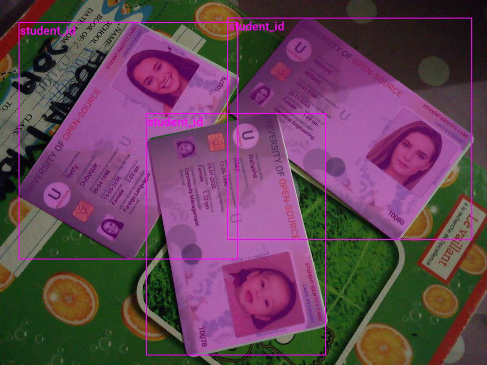
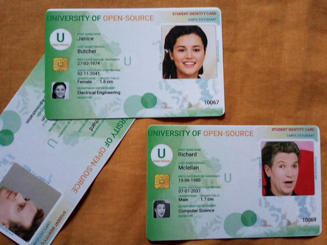
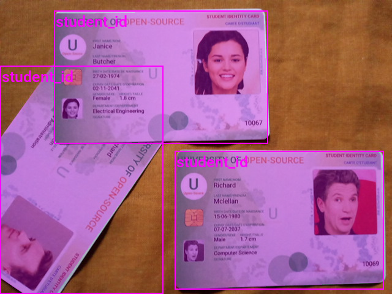
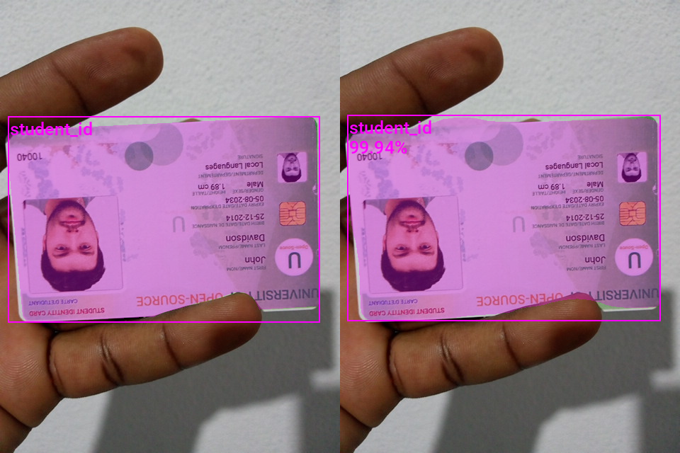

::: {.callout-tip}
## This post is part of the following series:
* [**Training Mask R-CNN Models with PyTorch**](/series/tutorials/pytorch-train-mask-rcnn-series.html)
:::


* [Introduction](#introduction)
* [Getting Started with the Code](#getting-started-with-the-code)
* [Setting Up Your Python Environment](#setting-up-your-python-environment)
* [Importing the Required Dependencies](#importing-the-required-dependencies)
* [Setting Up the Project](#setting-up-the-project)
* [Loading and Exploring the Dataset](#loading-and-exploring-the-dataset)
* [Loading the Mask R-CNN Model](#loading-the-mask-r-cnn-model)
* [Preparing the Data](#preparing-the-data)
* [Fine-tuning the Model](#fine-tuning-the-model)
* [Making Predictions with the Model](#making-predictions-with-the-model)
* [Conclusion](#conclusion)


## Introduction

Welcome to this hands-on guide to training [Mask R-CNN](https://arxiv.org/abs/1703.06870) models in PyTorch! Mask R-CNN models can identify and locate multiple objects within images and generate segmentation masks for each detected object.

For this tutorial, we will fine-tune a Mask R-CNN model from the [`torchvision`](https://pytorch.org/vision/stable/index.html) library on a small sample dataset of annotated student ID card images.

{fig-align="center"}


This tutorial is suitable for anyone with rudimentary PyTorch experience. If you are new to PyTorch and want to start with a beginner-focused project, check out my tutorial on fine-tuning image classifiers.

* [Fine-Tuning Image Classifiers with PyTorch and the timm library for Beginners](../pytorch-train-image-classifier-timm-hf-tutorial/)


::: {.callout-note title="Update: October 4, 2023"}

I updated the tutorial code for torchvision [`0.16.0`](https://github.com/pytorch/vision/releases/tag/v0.16.0).

:::


## Getting Started with the Code

The tutorial code is available as a [Jupyter Notebook](https://jupyter.org/), which you can run locally or in a cloud-based environment like [Google Colab](https://colab.research.google.com/). I have dedicated tutorials for those new to these platforms or who need guidance setting up:

::: {.callout-tip title="Setup Guides" collapse="true"}

* [**Getting Started with Google Colab**](/posts/google-colab-getting-started-tutorial/)

* [**Setting Up a Local Python Environment with Mamba for Machine Learning Projects on Windows**](/posts/mamba-getting-started-tutorial-windows/)


:::


::: {.callout-tip title="Tutorial Code" collapse="false"}

| Platform     | Jupyter Notebook                                             | Utility File                                                 |
| ------------ | ------------------------------------------------------------ | ------------------------------------------------------------ |
| Google Colab | [Open In Colab](https://colab.research.google.com/github/cj-mills/pytorch-mask-rcnn-tutorial-code/blob/main/notebooks/pytorch-mask-r-cnn-training-colab.ipynb) |                                                              |
| Linux        | [GitHub Repository](https://github.com/cj-mills/pytorch-mask-rcnn-tutorial-code/blob/main/notebooks/pytorch-mask-r-cnn-training.ipynb) |                                                              |
| Windows      | [GitHub Repository](https://github.com/cj-mills/pytorch-mask-rcnn-tutorial-code/blob/main/notebooks/pytorch-mask-r-cnn-training-windows.ipynb) | [windows_utils.py](https://github.com/cj-mills/pytorch-mask-rcnn-tutorial-code/blob/main/notebooks/windows_utils.py) |


:::


## Setting Up Your Python Environment

Before diving into the code, we'll cover the steps to create a local Python environment and install the necessary dependencies. The dedicated Colab Notebook includes the code to install the required dependencies in Google Colab.


### Creating a Python Environment

First, we'll create a Python environment using [Conda](https://docs.conda.io/en/latest/)/[Mamba](https://mamba.readthedocs.io/en/latest/). Open a terminal with Conda/Mamba installed and run the following commands:


::: {.panel-tabset}
## Conda

``` {.bash}
# Create a new Python 3.10 environment
conda create --name pytorch-env python=3.10 -y
# Activate the environment
conda activate pytorch-env
```

## Mamba

``` {.bash}
# Create a new Python 3.10 environment
mamba create --name pytorch-env python=3.10 -y
# Activate the environment
mamba activate pytorch-env
```

:::


### Installing PyTorch

Next, we'll install PyTorch. Run the appropriate command for your hardware and operating system.

::: {.panel-tabset}
## Linux/Windows (CUDA)

``` {.bash}
# Install PyTorch with CUDA
pip install torch torchvision torchaudio --index-url https://download.pytorch.org/whl/cu121
```

## Mac

``` {.bash}
# MPS (Metal Performance Shaders) acceleration is available on MacOS 12.3+
pip install torch torchvision torchaudio
```

## Linux (CPU)

``` {.bash}
# Install PyTorch for CPU only
pip install torch torchvision torchaudio --index-url https://download.pytorch.org/whl/cpu
```

## Windows (CPU)

``` {.bash}
# Install PyTorch for CPU only
pip install torch torchvision torchaudio
```

:::


### Installing Additional Libraries

We also need to install some additional libraries for our project.

::: {.callout-note title="Package Descriptions" collapse="true"}


| Package       | Description                                                  |
| ------------- | ------------------------------------------------------------ |
| `jupyter`     | An  open-source web application that allows you to create and share  documents that contain live code, equations, visualizations, and  narrative text. ([link](https://jupyter.org/)) |
| `matplotlib`  | This package provides a comprehensive collection of visualization tools to  create high-quality plots, charts, and graphs for data exploration and  presentation. ([link](https://matplotlib.org/)) |
| `pandas`      | This package provides fast, powerful, and flexible data analysis and manipulation tools. ([link](https://pandas.pydata.org/)) |
| `pillow`      | The Python Imaging Library adds image processing capabilities. ([link](https://pillow.readthedocs.io/en/stable/)) |
| `torchtnt`    | A library for PyTorch training tools and utilities. ([link](https://pytorch.org/tnt/stable/)) |
| `tqdm`        | A Python library that provides fast, extensible progress bars for loops and other iterable objects in Python. ([link](https://tqdm.github.io/)) |
| `tabulate`    | Pretty-print tabular data in Python. ([link](https://pypi.org/project/tabulate/)) |
| `distinctipy` | A lightweight python package providing functions to generate colours that are visually distinct from one another. ([link](https://distinctipy.readthedocs.io/en/latest/)) |


:::

Run the following commands to install these additional libraries:

```bash
# Install additional dependencies
pip install distinctipy jupyter matplotlib pandas pillow torchtnt==0.2.0 tqdm tabulate
```


### Installing Utility Packages

We'll also install some utility packages I made to help us handle images, interact with PyTorch, and work with Pandas DataFrames. These utility packages provide shortcuts for routine tasks and keep our code clean and readable.

::: {.callout-note title="Package Descriptions" collapse="true"}


| Package                | Description                                                  |
| ---------------------- | ------------------------------------------------------------ |
| `cjm_pandas_utils`     | Some utility functions for working with Pandas. ([link](https://cj-mills.github.io/cjm-pandas-utils/)) |
| `cjm_pil_utils`        | Some PIL utility functions I frequently use. ([link](https://cj-mills.github.io/cjm-pil-utils/)) |
| `cjm_psl_utils`        | Some utility functions using the Python Standard Library. ([link](https://cj-mills.github.io/cjm-psl-utils/)) |
| `cjm_pytorch_utils`    | Some utility functions for working with PyTorch. ([link](https://cj-mills.github.io/cjm-pytorch-utils/)) |
| `cjm_torchvision_tfms` | Some custom Torchvision tranforms. ([link](https://cj-mills.github.io/cjm-torchvision-tfms/)) |


:::

Run the following commands to install the utility packages:

```python
# Install additional utility packages
pip install cjm_pandas_utils cjm_pil_utils cjm_psl_utils cjm_pytorch_utils cjm_torchvision_tfms
```


## Importing the Required Dependencies

With our environment set up, let’s dive into the code. First, we will import the necessary Python packages into our Jupyter Notebook.


```python
# Import Python Standard Library dependencies
import datetime
from functools import partial
from glob import glob
import json
import math
import multiprocessing
import os
from pathlib import Path
import random
from typing import Any, Dict, Optional

# Import utility functions
from cjm_psl_utils.core import download_file, file_extract, get_source_code
from cjm_pil_utils.core import resize_img, get_img_files, stack_imgs
from cjm_pytorch_utils.core import pil_to_tensor, tensor_to_pil, get_torch_device, set_seed, denorm_img_tensor, move_data_to_device
from cjm_pandas_utils.core import markdown_to_pandas, convert_to_numeric, convert_to_string
from cjm_torchvision_tfms.core import ResizeMax, PadSquare, CustomRandomIoUCrop

# Import the distinctipy module
from distinctipy import distinctipy

# Import matplotlib for creating plots
import matplotlib.pyplot as plt

# Import numpy
import numpy as np

# Import the pandas package
import pandas as pd

# Set options for Pandas DataFrame display
pd.set_option('max_colwidth', None)  # Do not truncate the contents of cells in the DataFrame
pd.set_option('display.max_rows', None)  # Display all rows in the DataFrame
pd.set_option('display.max_columns', None)  # Display all columns in the DataFrame

# Import PIL for image manipulation
from PIL import Image, ImageDraw

# Import PyTorch dependencies
import torch
from torch.amp import autocast
from torch.cuda.amp import GradScaler
import torch.nn as nn
import torch.nn.functional as F
from torch.utils.data import Dataset, DataLoader
from torchtnt.utils import get_module_summary
import torchvision
torchvision.disable_beta_transforms_warning()
from torchvision.tv_tensors import BoundingBoxes, Mask
from torchvision.utils import draw_bounding_boxes, draw_segmentation_masks
import torchvision.transforms.v2  as transforms
from torchvision.transforms.v2 import functional as TF

# Import Mask R-CNN
from torchvision.models.detection import maskrcnn_resnet50_fpn_v2, MaskRCNN
from torchvision.models.detection import MaskRCNN_ResNet50_FPN_V2_Weights
from torchvision.models.detection.faster_rcnn import FastRCNNPredictor
from torchvision.models.detection.mask_rcnn import MaskRCNNPredictor

# Import tqdm for progress bar
from tqdm.auto import tqdm
```


## Setting Up the Project

In this section, we set up some basics for our project, such as initializing random number generators, setting the PyTorch device to run the model, and preparing the folders for our project and datasets.

### Setting a Random Number Seed

First, we set the seed for generating random numbers using the [set_seed](https://cj-mills.github.io/cjm-pytorch-utils/core.html#set_seed) function from the `cjm_pytorch_utils` package.


```python
# Set the seed for generating random numbers in PyTorch, NumPy, and Python's random module.
seed = 1234
set_seed(seed)
```

### Setting the Device and Data Type

Next, we determine the device to use for training using the [get_torch_device](https://cj-mills.github.io/cjm-pytorch-utils/core.html#get_torch_device) function from the `cjm_pytorch_utils` package and set the data type of our tensors.


```python
device = get_torch_device()
dtype = torch.float32
device, dtype
```


```text
('cuda', torch.float32)
```


### Setting the Directory Paths

We can then set up a directory for our project to store our results  and other related files. The following code creates the folder in the  current directory (`./`). Update the path if that is not suitable for you.

We also need a place to store our dataset. Readers following the tutorial on their local machine should select a location with read-and-write access to store datasets. For a cloud service like Google Colab, you can set it to the current directory.


```python
# The name for the project
project_name = f"pytorch-mask-r-cnn-instance-segmentation"

# The path for the project folder
project_dir = Path(f"./{project_name}/")

# Create the project directory if it does not already exist
project_dir.mkdir(parents=True, exist_ok=True)

# Define path to store datasets
dataset_dir = Path("./Datasets/")
# Create the dataset directory if it does not exist
dataset_dir.mkdir(parents=True, exist_ok=True)

pd.Series({
    "Project Directory:": project_dir, 
    "Dataset Directory:": dataset_dir
}).to_frame().style.hide(axis='columns')
```

<div style="overflow-x:auto; max-height:500px">
<table id="T_68713">
  <thead>
  </thead>
  <tbody>
    <tr>
      <th id="T_68713_level0_row0" class="row_heading level0 row0" >Project Directory:</th>
      <td id="T_68713_row0_col0" class="data row0 col0" >pytorch-mask-r-cnn-instance-segmentation</td>
    </tr>
    <tr>
      <th id="T_68713_level0_row1" class="row_heading level0 row1" >Dataset Directory:</th>
      <td id="T_68713_row1_col0" class="data row1 col0" >Datasets</td>
    </tr>
  </tbody>
</table>
</div>
Double-check the project and dataset directories exist in the specified paths and that you can add files to them before continuing. At this  point, our project is set up and ready to go. In the next section, we  will download and explore the dataset.


## Loading and Exploring the Dataset

Now that we set up the project, we can start working with our dataset. The dataset is originally from the following GitHub repository:

- [pytorch-for-information-extraction](https://github.com/MbassiJaphet/pytorch-for-information-extraction)

I made a fork of the original repository with only the files needed for this tutorial, which takes up approximately 77 MB.


::: {.callout-tip title="Segmentation Annotation Format"}

The segmentation masks for this dataset uses the [LabelMe](https://github.com/labelmeai/labelme) annotation format. You can learn more about this format and how to work with such annotations in the tutorial linked below:

* [Working with LabelMe Segmentation Annotations in Torchvision](/posts/torchvision-labelme-annotation-tutorials/segmentation-polygons/)

:::


### Setting the Dataset Path

We first need to construct the name for the GitHub repository and define the path to the subfolder with the dataset.


```python
# Set the name of the dataset
dataset_name = 'pytorch-for-information-extraction'

# Construct the GitHub repository name 
gh_repo = f'cj-mills/{dataset_name}'

# Create the path to the directory where the dataset will be extracted
dataset_path = Path(f'{dataset_dir}/{dataset_name}/code/datasets/detection/student-id/')

pd.Series({
    "GitHub Repository:": gh_repo, 
    "Dataset Path:": dataset_path
}).to_frame().style.hide(axis='columns')
```

<div style="overflow-x:auto; max-height:500px">
<table id="T_e4eb3">
  <thead>
  </thead>
  <tbody>
    <tr>
      <th id="T_e4eb3_level0_row0" class="row_heading level0 row0" >GitHub Repository:</th>
      <td id="T_e4eb3_row0_col0" class="data row0 col0" >cj-mills/pytorch-for-information-extraction</td>
    </tr>
    <tr>
      <th id="T_e4eb3_level0_row1" class="row_heading level0 row1" >Dataset Path:</th>
      <td id="T_e4eb3_row1_col0" class="data row1 col0" >Datasets/pytorch-for-information-extraction/code/datasets/detection/student-id</td>
    </tr>
  </tbody>
</table>
</div>


### Downloading the Dataset

We can now clone the repository to the dataset directory we defined earlier.


```python
# Clone the dataset repository from GitHub
!git clone {f'https://github.com/{gh_repo}.git'} {dataset_dir/dataset_name}
```


### Getting the Image and Annotation Files

The dataset folder contains sample images and annotation files. Each sample image has its own JSON annotation file.


```python
# Get a list of image files in the dataset
img_file_paths = get_img_files(dataset_path)

# Get a list of JSON files in the dataset
annotation_file_paths = list(dataset_path.glob('*.json'))

# Display the names of the folders using a Pandas DataFrame
pd.DataFrame({"Image File": [file.name for file in img_file_paths], 
              "Annotation File":[file.name for file in annotation_file_paths]}).head()
```

<div style="overflow-x:auto; max-height:500px">
<table border="1" class="dataframe">
  <thead>
    <tr style="text-align: right;">
      <th></th>
      <th>Image File</th>
      <th>Annotation File</th>
    </tr>
  </thead>
  <tbody>
    <tr>
      <th>0</th>
      <td>10134.jpg</td>
      <td>10134.json</td>
    </tr>
    <tr>
      <th>1</th>
      <td>10135.jpg</td>
      <td>10135.json</td>
    </tr>
    <tr>
      <th>2</th>
      <td>10136.jpg</td>
      <td>10136.json</td>
    </tr>
    <tr>
      <th>3</th>
      <td>10137.jpg</td>
      <td>10137.json</td>
    </tr>
    <tr>
      <th>4</th>
      <td>10138.jpg</td>
      <td>10138.json</td>
    </tr>
  </tbody>
</table>
</div>


### Get Image File Paths

Each image file has a unique name that we can use to locate the corresponding annotation data. Let’s make a dictionary that maps image names to file paths. The dictionary will allow us to retrieve the file path for a given image more efficiently.


```python
# Create a dictionary that maps file names to file paths
img_dict = {file.stem : file for file in img_file_paths}

# Print the number of image files
print(f"Number of Images: {len(img_dict)}")

# Display the first five entries from the dictionary using a Pandas DataFrame
pd.DataFrame.from_dict(img_dict, orient='index').head()
```

```text
Number of Images: 150
```

<div style="overflow-x:auto; max-height:500px">
<table border="1" class="dataframe">
  <thead>
    <tr style="text-align: right;">
      <th></th>
      <th>0</th>
    </tr>
  </thead>
  <tbody>
    <tr>
      <th>10134</th>
      <td>Datasets/pytorch-for-information-extraction/code/datasets/detection/student-id/10134.jpg</td>
    </tr>
    <tr>
      <th>10135</th>
      <td>Datasets/pytorch-for-information-extraction/code/datasets/detection/student-id/10135.jpg</td>
    </tr>
    <tr>
      <th>10136</th>
      <td>Datasets/pytorch-for-information-extraction/code/datasets/detection/student-id/10136.jpg</td>
    </tr>
    <tr>
      <th>10137</th>
      <td>Datasets/pytorch-for-information-extraction/code/datasets/detection/student-id/10137.jpg</td>
    </tr>
    <tr>
      <th>10138</th>
      <td>Datasets/pytorch-for-information-extraction/code/datasets/detection/student-id/10138.jpg</td>
    </tr>
  </tbody>
</table>
</div>


### Get Image Annotations

Next, we read the contents of the JSON annotation files into a Pandas DataFrame so we can easily query the annotations.


```python
# Create a generator that yields Pandas DataFrames containing the data from each JSON file
cls_dataframes = (pd.read_json(f, orient='index').transpose() for f in tqdm(annotation_file_paths))

# Concatenate the DataFrames into a single DataFrame
annotation_df = pd.concat(cls_dataframes, ignore_index=False)

# Assign the image file name as the index for each row
annotation_df['index'] = annotation_df.apply(lambda row: row['imagePath'].split('.')[0], axis=1)
annotation_df = annotation_df.set_index('index')

# Keep only the rows that correspond to the filenames in the 'img_dict' dictionary
annotation_df = annotation_df.loc[list(img_dict.keys())]

# Print the first 5 rows of the DataFrame
annotation_df.head()
```

<div style="overflow-x:auto; max-height:500px">
<table border="1" class="dataframe">
  <thead>
    <tr style="text-align: right;">
      <th></th>
      <th>version</th>
      <th>flags</th>
      <th>shapes</th>
      <th>lineColor</th>
      <th>fillColor</th>
      <th>imagePath</th>
      <th>imageData</th>
      <th>imageHeight</th>
      <th>imageWidth</th>
    </tr>
    <tr>
      <th>index</th>
      <th></th>
      <th></th>
      <th></th>
      <th></th>
      <th></th>
      <th></th>
      <th></th>
      <th></th>
      <th></th>
    </tr>
  </thead>
  <tbody>
    <tr>
      <th>10134</th>
      <td>3.21.1</td>
      <td>{}</td>
      <td>[{'label': 'student_id', 'line_color': None, 'fill_color': None, 'points': [[83.7142857142857, 133.57142857142856], [86.57142857142856, 123.57142857142856], [95.14285714285714, 117.14285714285714], [595.1428571428571, 125.71428571428571], [604.4285714285713, 127.85714285714285], [607.2857142857142, 138.57142857142856], [619.4285714285713, 443.57142857142856], [612.2857142857142, 449.2857142857142], [97.99999999999997, 469.2857142857142], [85.14285714285714, 465.71428571428567], [78.0, 457.1428571428571]], 'shape_type': 'polygon', 'flags': {}}]</td>
      <td>[0, 255, 0, 128]</td>
      <td>[255, 0, 0, 128]</td>
      <td>10134.jpg</td>
      <td></td>
      <td>480</td>
      <td>640</td>
    </tr>
    <tr>
      <th>10135</th>
      <td>3.21.1</td>
      <td>{}</td>
      <td>[{'label': 'student_id', 'line_color': None, 'fill_color': None, 'points': [[125.85714285714283, 288.57142857142856], [391.57142857142856, 24.285714285714285], [459.4285714285714, 7.857142857142857], [612.2857142857142, 166.42857142857142], [612.2857142857142, 174.28571428571428], [334.4285714285714, 477.85714285714283], [321.57142857142856, 478.5714285714285], [127.99999999999997, 297.1428571428571]], 'shape_type': 'polygon', 'flags': {}}]</td>
      <td>[0, 255, 0, 128]</td>
      <td>[255, 0, 0, 128]</td>
      <td>10135.jpg</td>
      <td></td>
      <td>480</td>
      <td>640</td>
    </tr>
    <tr>
      <th>10136</th>
      <td>3.21.1</td>
      <td>{}</td>
      <td>[{'label': 'student_id', 'line_color': None, 'fill_color': None, 'points': [[62.28571428571428, 44.285714285714285], [70.85714285714285, 39.99999999999999], [571.5714285714286, 81.42857142857142], [582.9999999999999, 90.71428571428571], [634.4285714285713, 374.99999999999994], [634.4285714285713, 389.2857142857142], [622.9999999999999, 394.2857142857142], [46.571428571428555, 427.1428571428571], [35.85714285714285, 424.99999999999994], [30.857142857142847, 414.99999999999994]], 'shape_type': 'polygon', 'flags': {}}]</td>
      <td>[0, 255, 0, 128]</td>
      <td>[255, 0, 0, 128]</td>
      <td>10136.jpg</td>
      <td></td>
      <td>480</td>
      <td>640</td>
    </tr>
    <tr>
      <th>10137</th>
      <td>3.21.1</td>
      <td>{}</td>
      <td>[{'label': 'student_id', 'line_color': None, 'fill_color': None, 'points': [[81.57142857142856, 137.85714285714283], [84.42857142857142, 129.28571428571428], [273.71428571428567, 29.999999999999996], [284.4285714285714, 29.999999999999996], [549.4285714285713, 277.85714285714283], [550.8571428571428, 288.57142857142856], [362.2857142857142, 472.85714285714283], [354.4285714285714, 472.85714285714283], [345.1428571428571, 467.1428571428571]], 'shape_type': 'polygon', 'flags': {}}, {'label': 'student_id', 'line_color': None, 'fill_color': None, 'points': [[324.4285714285714, 69.28571428571428], [340.1428571428571, 0.7142857142857141], [525.8571428571428, 27.857142857142854], [529.4285714285713, 177.14285714285714], [395.1428571428571, 135.0]], 'shape_type': 'polygon', 'flags': {}}]</td>
      <td>[0, 255, 0, 128]</td>
      <td>[255, 0, 0, 128]</td>
      <td>10137.jpg</td>
      <td></td>
      <td>480</td>
      <td>640</td>
    </tr>
    <tr>
      <th>10138</th>
      <td>3.21.1</td>
      <td>{}</td>
      <td>[{'label': 'student_id', 'line_color': None, 'fill_color': None, 'points': [[202.28571428571425, 12.142857142857142], [208.71428571428567, 2.857142857142856], [434.4285714285714, 70.0], [411.57142857142856, 392.1428571428571], [407.2857142857142, 445.71428571428567], [402.99999999999994, 453.57142857142856], [392.2857142857142, 454.99999999999994], [165.85714285714283, 470.71428571428567], [155.85714285714283, 467.85714285714283], [152.28571428571428, 459.2857142857142]], 'shape_type': 'polygon', 'flags': {}}]</td>
      <td>[0, 255, 0, 128]</td>
      <td>[255, 0, 0, 128]</td>
      <td>10138.jpg</td>
      <td></td>
      <td>480</td>
      <td>640</td>
    </tr>
  </tbody>
</table>
</div>
---

The `shapes` column contains the point coordinates to draw the segmentation masks. We will also use this information to generate the associated bounding box annotations.


### Inspecting the Class Distribution

Now that we have the annotation data, we can extract the unique class names and inspect the class distribution. This small sample dataset only has one object class, but reviewing the class distribution is still good practice for other datasets.

#### Get image classes


```python
# Explode the 'shapes' column in the annotation_df dataframe
# Convert the resulting series to a dataframe and rename the 'shapes' column to 'shapes'
# Apply the pandas Series function to the 'shapes' column of the dataframe
shapes_df = annotation_df['shapes'].explode().to_frame().shapes.apply(pd.Series)
```


```python
# Get a list of unique labels in the 'annotation_df' DataFrame
class_names = shapes_df['label'].unique().tolist()

# Display labels using a Pandas DataFrame
pd.DataFrame(class_names)
```


<div style="overflow-x:auto; max-height:500px">
<table border="1" class="dataframe">
  <thead>
    <tr style="text-align: right;">
      <th></th>
      <th>0</th>
    </tr>
  </thead>
  <tbody>
    <tr>
      <th>0</th>
      <td>student_id</td>
    </tr>
  </tbody>
</table>
</div>


#### Visualize the class distribution


```python
# Get the number of samples for each object class
class_counts = shapes_df['label'].value_counts()

# Plot the distribution
class_counts.plot(kind='bar')
plt.title('Class distribution')
plt.ylabel('Count')
plt.xlabel('Classes')
plt.xticks(range(len(class_counts.index)), class_names, rotation=75)  # Set the x-axis tick labels
plt.show()
```

{fig-align="center"}


#### Add a background class

The Mask R-CNN model provided with the torchvision library expects datasets to have a `background` class. We can prepend one to the list of class names.


```python
# Prepend a `background` class to the list of class names
class_names = ['background']+class_names

# Display labels using a Pandas DataFrame
pd.DataFrame(class_names)
```

<div style="overflow-x:auto; max-height:500px">
<table border="1" class="dataframe">
  <thead>
    <tr style="text-align: right;">
      <th></th>
      <th>0</th>
    </tr>
  </thead>
  <tbody>
    <tr>
      <th>0</th>
      <td>background</td>
    </tr>
    <tr>
      <th>1</th>
      <td>student_id</td>
    </tr>
  </tbody>
</table>
</div>


### Visualizing Image Annotations

Lastly, we will visualize the segmentation masks and bounding boxes for one of the sample images to demonstrate how to interpret the annotations.

#### Generate a color map

While not required, assigning a unique color to segmentation masks and bounding boxes for each object class enhances visual distinction, allowing for easier identification of different objects in the scene. We can use the [`distinctipy`](https://distinctipy.readthedocs.io/en/latest/) package to generate a visually distinct colormap.


```python
# Generate a list of colors with a length equal to the number of labels
colors = distinctipy.get_colors(len(class_names))

# Make a copy of the color map in integer format
int_colors = [tuple(int(c*255) for c in color) for color in colors]

# Generate a color swatch to visualize the color map
distinctipy.color_swatch(colors)
```

{fig-align="center"}


#### Download a font file

The [`draw_bounding_boxes`](https://pytorch.org/vision/stable/generated/torchvision.utils.draw_bounding_boxes.html) function included with torchvision uses a pretty small font size. We  can increase the font size if we use a custom font. Font files are  available on sites like [Google Fonts](https://fonts.google.com/), or we can use one included with the operating system.


```python
# Set the name of the font file
font_file = 'KFOlCnqEu92Fr1MmEU9vAw.ttf'

# Download the font file
download_file(f"https://fonts.gstatic.com/s/roboto/v30/{font_file}", "./")
```


#### Define the bounding box annotation function

Let’s make a partial function using `draw_bounding_boxes` since we’ll use the same box thickness and font each time we visualize bounding boxes.


```python
draw_bboxes = partial(draw_bounding_boxes, fill=False, width=2, font=font_file, font_size=25)
```


### Selecting a Sample Image

We can use the unique ID for an image in the image dictionary to get the image’s file path and the associated annotations from the annotation DataFrame.

#### Load the sample image


```python
# Get the file ID of the first image file
file_id = list(img_dict.keys())[56]

# Open the associated image file as a RGB image
sample_img = Image.open(img_dict[file_id]).convert('RGB')

# Print the dimensions of the image
print(f"Image Dims: {sample_img.size}")

# Show the image
sample_img
```

```text
Image Dims: (640, 480)
```

{fig-align="center"}


#### Inspect the corresponding annotation data


```python
# Get the row from the 'annotation_df' DataFrame corresponding to the 'file_id'
annotation_df.loc[file_id].to_frame()
```

<div style="overflow-x:auto; max-height:500px">
<table border="1" class="dataframe">
  <thead>
    <tr style="text-align: right;">
      <th></th>
      <th>10067</th>
    </tr>
  </thead>
  <tbody>
    <tr>
      <th>version</th>
      <td>3.21.1</td>
    </tr>
    <tr>
      <th>flags</th>
      <td>{}</td>
    </tr>
    <tr>
      <th>shapes</th>
      <td>[{'label': 'student_id', 'line_color': None, 'fill_color': None, 'points': [[90.85714285714283, 22.142857142857142], [414.4285714285714, 17.857142857142854], [427.2857142857142, 19.285714285714285], [430.1428571428571, 24.999999999999996], [437.99999999999994, 222.85714285714283], [432.99999999999994, 227.1428571428571], [270.1428571428571, 231.42857142857142], [101.57142857142856, 234.28571428571428], [92.28571428571428, 232.85714285714283], [88.0, 227.85714285714283], [89.42857142857142, 44.99999999999999], [88.0, 31.428571428571427]], 'shape_type': 'polygon', 'flags': {}}, {'label': 'student_id', 'line_color': None, 'fill_color': None, 'points': [[0.14285714285713802, 226.42857142857142], [85.85714285714283, 107.14285714285714], [87.28571428571428, 234.99999999999997], [101.57142857142856, 235.7142857142857], [266.57142857142856, 231.42857142857142], [91, 479], [38, 479], [0, 453]], 'shape_type': 'polygon', 'flags': {}}, {'label': 'student_id', 'line_color': None, 'fill_color': None, 'points': [[287.99999999999994, 257.1428571428571], [293.71428571428567, 246.42857142857142], [314.4285714285714, 246.42857142857142], [615.1428571428571, 247.1428571428571], [621.5714285714286, 253.57142857142856], [626.5714285714286, 456.4285714285714], [617.9999999999999, 461.4285714285714], [311.57142857142856, 471.4285714285714], [297.2857142857143, 472.1428571428571], [290.1428571428571, 469.99999999999994], [285.1428571428571, 464.99999999999994]], 'shape_type': 'polygon', 'flags': {}}]</td>
    </tr>
    <tr>
      <th>lineColor</th>
      <td>[0, 255, 0, 128]</td>
    </tr>
    <tr>
      <th>fillColor</th>
      <td>[255, 0, 0, 128]</td>
    </tr>
    <tr>
      <th>imagePath</th>
      <td>10067.jpg</td>
    </tr>
    <tr>
      <th>imageData</th>
      <td></td>
    </tr>
    <tr>
      <th>imageHeight</th>
      <td>480</td>
    </tr>
    <tr>
      <th>imageWidth</th>
      <td>640</td>
    </tr>
  </tbody>
</table>
</div>
---

The lists of point coordinates in the shapes column are the vertices of a polygon for the individual segmentation masks. We can use these to generate images for each segmentation mask.


#### Define a function to convert segmentation polygons to images


```python
def create_polygon_mask(image_size, vertices):
    """
    Create a grayscale image with a white polygonal area on a black background.

    Parameters:
    - image_size (tuple): A tuple representing the dimensions (width, height) of the image.
    - vertices (list): A list of tuples, each containing the x, y coordinates of a vertex
                        of the polygon. Vertices should be in clockwise or counter-clockwise order.

    Returns:
    - PIL.Image.Image: A PIL Image object containing the polygonal mask.
    """

    # Create a new black image with the given dimensions
    mask_img = Image.new('L', image_size, 0)
    
    # Draw the polygon on the image. The area inside the polygon will be white (255).
    ImageDraw.Draw(mask_img, 'L').polygon(vertices, fill=(255))

    # Return the image with the drawn polygon
    return mask_img
```


#### Annotate sample image

The torchvision library provides a [`draw_segmentation_masks`](https://pytorch.org/vision/stable/generated/torchvision.utils.draw_segmentation_masks.html#torchvision.utils.draw_segmentation_masks) function to annotate images with segmentation masks. We can use the [`masks_to_boxes`](https://pytorch.org/vision/stable/generated/torchvision.ops.masks_to_boxes.html#torchvision.ops.masks_to_boxes) function included with torchvision to generate bounding box annotations in the `[top-left X, top-left Y, bottom-right X, bottom-right Y]` format from the segmentation masks. That is the same format the `draw_bounding_boxes` function expects so we can use the output directly.


```python
# Extract the labels for the sample
labels = [shape['label'] for shape in annotation_df.loc[file_id]['shapes']]
# Extract the polygon points for segmentation mask
shape_points = [shape['points'] for shape in annotation_df.loc[file_id]['shapes']]
# Format polygon points for PIL
xy_coords = [[tuple(p) for p in points] for points in shape_points]
# Generate mask images from polygons
mask_imgs = [create_polygon_mask(sample_img.size, xy) for xy in xy_coords]
# Convert mask images to tensors
masks = torch.concat([Mask(transforms.PILToTensor()(mask_img), dtype=torch.bool) for mask_img in mask_imgs])
# Generate bounding box annotations from segmentation masks
bboxes = torchvision.ops.masks_to_boxes(masks)

# Annotate the sample image with segmentation masks
annotated_tensor = draw_segmentation_masks(
    image=transforms.PILToTensor()(sample_img), 
    masks=masks, 
    alpha=0.3, 
    colors=[int_colors[i] for i in [class_names.index(label) for label in labels]]
)

# Annotate the sample image with labels and bounding boxes
annotated_tensor = draw_bboxes(
    image=annotated_tensor, 
    boxes=bboxes, 
    labels=labels, 
    colors=[int_colors[i] for i in [class_names.index(label) for label in labels]]
)

tensor_to_pil(annotated_tensor)
```


{fig-align="center"}


We have explored the dataset and visualized the annotations for a sample image. In the next section, we will load and prepare our model.


## Loading the Mask R-CNN Model

TorchVision provides [checkpoints](https://pytorch.org/vision/stable/models/generated/torchvision.models.detection.maskrcnn_resnet50_fpn_v2.html#torchvision.models.detection.MaskRCNN_ResNet50_FPN_V2_Weights) for the Mask R-CNN model trained on the [COCO](https://cocodataset.org/) (Common Objects in Context) dataset. We can initialize a model with these pretrained weights using the [`maskrcnn_resnet50_fpn_v2`](https://pytorch.org/vision/stable/models/generated/torchvision.models.detection.maskrcnn_resnet50_fpn_v2.html#torchvision.models.detection.maskrcnn_resnet50_fpn_v2) function. We must then replace the bounding box and segmentation mask predictors for the pretrained model with new ones for our dataset.


```python
# Initialize a Mask R-CNN model with pretrained weights
model = maskrcnn_resnet50_fpn_v2(weights='DEFAULT')

# Get the number of input features for the classifier
in_features_box = model.roi_heads.box_predictor.cls_score.in_features
in_features_mask = model.roi_heads.mask_predictor.conv5_mask.in_channels

# Get the numbner of output channels for the Mask Predictor
dim_reduced = model.roi_heads.mask_predictor.conv5_mask.out_channels

# Replace the box predictor
model.roi_heads.box_predictor = FastRCNNPredictor(in_channels=in_features_box, num_classes=len(class_names))

# Replace the mask predictor
model.roi_heads.mask_predictor = MaskRCNNPredictor(in_channels=in_features_mask, dim_reduced=dim_reduced, num_classes=len(class_names))

# Set the model's device and data type
model.to(device=device, dtype=dtype);

# Add attributes to store the device and model name for later reference
model.device = device
model.name = 'maskrcnn_resnet50_fpn_v2'
```

The model internally normalizes input using the mean and standard deviation values used during the pretraining process, so we do not need to keep track of them separately.


### Summarizing the Model

Before moving on, let’s generate a summary of our model to get an overview of its performance characteristics. We can use this to gauge the computational requirements for deploying the model.


```python
test_inp = torch.randn(1, 3, 256, 256).to(device)

summary_df = markdown_to_pandas(f"{get_module_summary(model.eval(), [test_inp])}")

# # Filter the summary to only contain Conv2d layers and the model
summary_df = summary_df[summary_df.index == 0]

summary_df.drop(['In size', 'Out size', 'Contains Uninitialized Parameters?'], axis=1)
```

<div style="overflow-x:auto; max-height:500px">
<table border="1" class="dataframe">
  <thead>
    <tr style="text-align: right;">
      <th></th>
      <th>Type</th>
      <th># Parameters</th>
      <th># Trainable Parameters</th>
      <th>Size (bytes)</th>
      <th>Forward FLOPs</th>
    </tr>
  </thead>
  <tbody>
    <tr>
      <th>0</th>
      <td>MaskRCNN</td>
      <td>45.9 M</td>
      <td>45.7 M</td>
      <td>183 M</td>
      <td>331 G</td>
    </tr>
  </tbody>
</table>
</div>
The above table shows the model has approximately `45.7` million trainable parameters. It takes up `183` Megabytes and performs around `331` billion floating point operations for a single `256x256` RGB image. This model internally resizes input images and executes the same number of floating point operations for different input resolutions.

That completes the model setup. In the next section, we will prepare our dataset for training.


## Preparing the Data

The data preparation involves several steps, such as applying data augmentation techniques, setting up the train-validation split for the dataset, resizing and padding the images, defining the training dataset class, and initializing DataLoaders to feed data to the model.

### Training-Validation Split

Let’s begin by defining the training-validation split. We’ll randomly select 80% of the available samples for the training set and use the remaining 20% for the validation set.


```python
# Get the list of image IDs
img_keys = list(img_dict.keys())

# Shuffle the image IDs
random.shuffle(img_keys)

# Define the percentage of the images that should be used for training
train_pct = 0.8
val_pct = 0.2

# Calculate the index at which to split the subset of image paths into training and validation sets
train_split = int(len(img_keys)*train_pct)
val_split = int(len(img_keys)*(train_pct+val_pct))

# Split the subset of image paths into training and validation sets
train_keys = img_keys[:train_split]
val_keys = img_keys[train_split:]

# Print the number of images in the training and validation sets
pd.Series({
    "Training Samples:": len(train_keys),
    "Validation Samples:": len(val_keys)
}).to_frame().style.hide(axis='columns')
```

<div style="overflow-x:auto; max-height:500px">
<table id="T_ebe49">
  <thead>
  </thead>
  <tbody>
    <tr>
      <th id="T_ebe49_level0_row0" class="row_heading level0 row0" >Training Samples:</th>
      <td id="T_ebe49_row0_col0" class="data row0 col0" >120</td>
    </tr>
    <tr>
      <th id="T_ebe49_level0_row1" class="row_heading level0 row1" >Validation Samples:</th>
      <td id="T_ebe49_row1_col0" class="data row1 col0" >30</td>
    </tr>
  </tbody>
</table>
</div>


### Data Augmentation

Next, we can define what data augmentations to apply to images during training. I created a few custom image transforms to help streamline the code.

The [first](https://cj-mills.github.io/cjm-torchvision-tfms/core.html#customrandomioucrop) extends torchvision’s [`RandomIoUCrop`](https://pytorch.org/vision/stable/generated/torchvision.transforms.v2.RandomIoUCrop.html#torchvision.transforms.v2.RandomIoUCrop) transform to give the user more control over how much it crops into bounding box areas. The [second](https://cj-mills.github.io/cjm-torchvision-tfms/core.html#resizemax) resizes images based on their largest dimension rather than their smallest. The [third](https://cj-mills.github.io/cjm-torchvision-tfms/core.html#padsquare) applies square padding and allows the padding to be applied equally on both sides or randomly split between the two sides.

All three are available through the [`cjm-torchvision-tfms`](https://cj-mills.github.io/cjm-torchvision-tfms/) package.

#### Set training image size

First, we’ll set the size to use for training. The [`ResizeMax`](https://cj-mills.github.io/cjm-torchvision-tfms/core.html#resizemax) transform will resize images so that the longest dimension equals this value while preserving the aspect ratio. The [`PadSquare`](https://cj-mills.github.io/cjm-torchvision-tfms/core.html#padsquare) transform will then pad the other side to make all the input squares.


```python
# Set training image size
train_sz = 512
```

#### Initialize the transforms

Now, we can initialize the transform objects. The `jitter_factor` parameter for the [`CustomRandomIoUCrop`](https://cj-mills.github.io/cjm-torchvision-tfms/core.html#customrandomioucrop) transform controls how much the center coordinates for the crop area  can deviate from the center of a bounding box. Setting this to a value  greater than zero allows the transform to crop into the bounding box  area. We’ll keep this value small as cutting into the hand gestures too  much will change their meaning.


```python
# Create a RandomIoUCrop object
iou_crop = CustomRandomIoUCrop(min_scale=0.3, 
                               max_scale=1.0, 
                               min_aspect_ratio=0.5, 
                               max_aspect_ratio=2.0, 
                               sampler_options=[0.0, 0.1, 0.3, 0.5, 0.7, 0.9, 1.0],
                               trials=400, 
                               jitter_factor=0.25)
```


```python
# Create a `ResizeMax` object
resize_max = ResizeMax(max_sz=train_sz)

# Create a `PadSquare` object
pad_square = PadSquare(shift=True, fill=0)
```


::: {.callout-note}

We must use a scalar value for the `fill` parameter when applying the `PadSquare` transform to images with segmentation masks.

:::


#### Test the transforms

We’ll pass input through the `CustomRandomIoUCrop` transform first and then through `ResizeMax` and `PadSquare`. We can pass the result through a final resize operation to ensure both sides match the `train_sz` value.


```python
# Extract the labels for the sample
labels = [shape['label'] for shape in annotation_df.loc[file_id]['shapes']]
# Extract the polygon points for segmentation mask
shape_points = [shape['points'] for shape in annotation_df.loc[file_id]['shapes']]
# Format polygon points for PIL
xy_coords = [[tuple(p) for p in points] for points in shape_points]
# Generate mask images from polygons
mask_imgs = [create_polygon_mask(sample_img.size, xy) for xy in xy_coords]
# Convert mask images to tensors
masks = torch.concat([Mask(transforms.PILToTensor()(mask_img), dtype=torch.bool) for mask_img in mask_imgs])
# Generate bounding box annotations from segmentation masks
bboxes = BoundingBoxes(data=torchvision.ops.masks_to_boxes(masks), format='xyxy', canvas_size=sample_img.size[::-1])

# Get colors for dataset sample
sample_colors = [int_colors[i] for i in [class_names.index(label) for label in labels]]

# Prepare mask and bounding box targets
targets = {
    'masks': Mask(masks), 
    'boxes': bboxes, 
    'labels': torch.Tensor([class_names.index(label) for label in labels])
}

# Crop the image
cropped_img, targets = iou_crop(sample_img, targets)

# Resize the image
resized_img, targets = resize_max(cropped_img, targets)

# Pad the image
padded_img, targets = pad_square(resized_img, targets)

# Ensure the padded image is the target size
resize = transforms.Resize([train_sz] * 2, antialias=True)
resized_padded_img, targets = resize(padded_img, targets)
sanitized_img, targets = transforms.SanitizeBoundingBoxes()(resized_padded_img, targets)

# Annotate the sample image with segmentation masks
annotated_tensor = draw_segmentation_masks(
    image=transforms.PILToTensor()(sanitized_img), 
    masks=targets['masks'], 
    alpha=0.3, 
    colors=sample_colors
)

# Annotate the sample image with labels and bounding boxes
annotated_tensor = draw_bboxes(
    image=annotated_tensor, 
    boxes=targets['boxes'], 
    labels=[class_names[int(label.item())] for label in targets['labels']], 
    colors=sample_colors
)

# # Display the annotated image
display(tensor_to_pil(annotated_tensor))

pd.Series({
    "Source Image:": sample_img.size,
    "Cropped Image:": cropped_img.size,
    "Resized Image:": resized_img.size,
    "Padded Image:": padded_img.size,
    "Resized Padded Image:": resized_padded_img.size,
}).to_frame().style.hide(axis='columns')
```


{fig-align="center"}

<div style="overflow-x:auto; max-height:500px">
<table id="T_10683">
  <thead>
  </thead>
  <tbody>
    <tr>
      <th id="T_10683_level0_row0" class="row_heading level0 row0" >Source Image:</th>
      <td id="T_10683_row0_col0" class="data row0 col0" >(640, 480)</td>
    </tr>
    <tr>
      <th id="T_10683_level0_row1" class="row_heading level0 row1" >Cropped Image:</th>
      <td id="T_10683_row1_col0" class="data row1 col0" >(286, 387)</td>
    </tr>
    <tr>
      <th id="T_10683_level0_row2" class="row_heading level0 row2" >Resized Image:</th>
      <td id="T_10683_row2_col0" class="data row2 col0" >(378, 511)</td>
    </tr>
    <tr>
      <th id="T_10683_level0_row3" class="row_heading level0 row3" >Padded Image:</th>
      <td id="T_10683_row3_col0" class="data row3 col0" >(511, 511)</td>
    </tr>
    <tr>
      <th id="T_10683_level0_row4" class="row_heading level0 row4" >Resized Padded Image:</th>
      <td id="T_10683_row4_col0" class="data row4 col0" >(512, 512)</td>
    </tr>
  </tbody>
</table>
</div>


### Training Dataset Class

Now, we can define a custom dataset class to load images, extract the segmentation masks, generate the bounding box annotations, and apply the image transforms during training.


```python
class StudentIDDataset(Dataset):
    """
    This class represents a PyTorch Dataset for a collection of images and their annotations.
    The class is designed to load images along with their corresponding segmentation masks, bounding box annotations, and labels.
    """
    def __init__(self, img_keys, annotation_df, img_dict, class_to_idx, transforms=None):
        """
        Constructor for the HagridDataset class.

        Parameters:
        img_keys (list): List of unique identifiers for images.
        annotation_df (DataFrame): DataFrame containing the image annotations.
        img_dict (dict): Dictionary mapping image identifiers to image file paths.
        class_to_idx (dict): Dictionary mapping class labels to indices.
        transforms (callable, optional): Optional transform to be applied on a sample.
        """
        super(Dataset, self).__init__()
        
        self._img_keys = img_keys  # List of image keys
        self._annotation_df = annotation_df  # DataFrame containing annotations
        self._img_dict = img_dict  # Dictionary mapping image keys to image paths
        self._class_to_idx = class_to_idx  # Dictionary mapping class names to class indices
        self._transforms = transforms  # Image transforms to be applied
        
    def __len__(self):
        """
        Returns the length of the dataset.

        Returns:
        int: The number of items in the dataset.
        """
        return len(self._img_keys)
        
    def __getitem__(self, index):
        """
        Fetch an item from the dataset at the specified index.

        Parameters:
        index (int): Index of the item to fetch from the dataset.

        Returns:
        tuple: A tuple containing the image and its associated target (annotations).
        """
        # Retrieve the key for the image at the specified index
        img_key = self._img_keys[index]
        # Get the annotations for this image
        annotation = self._annotation_df.loc[img_key]
        # Load the image and its target (segmentation masks, bounding boxes and labels)
        image, target = self._load_image_and_target(annotation)
        
        # Apply the transformations, if any
        if self._transforms:
            image, target = self._transforms(image, target)
        
        return image, target

    def _load_image_and_target(self, annotation):
        """
        Load an image and its target (bounding boxes and labels).

        Parameters:
        annotation (pandas.Series): The annotations for an image.

        Returns:
        tuple: A tuple containing the image and a dictionary with 'boxes' and 'labels' keys.
        """
        # Retrieve the file path of the image
        filepath = self._img_dict[annotation.name]
        # Open the image file and convert it to RGB
        image = Image.open(filepath).convert('RGB')
        
        # Convert the class labels to indices
        labels = [shape['label'] for shape in annotation['shapes']]
        labels = torch.Tensor([self._class_to_idx[label] for label in labels])
        labels = labels.to(dtype=torch.int64)

        # Convert polygons to mask images
        shape_points = [shape['points'] for shape in annotation['shapes']]
        xy_coords = [[tuple(p) for p in points] for points in shape_points]
        mask_imgs = [create_polygon_mask(image.size, xy) for xy in xy_coords]
        masks = Mask(torch.concat([Mask(transforms.PILToTensor()(mask_img), dtype=torch.bool) for mask_img in mask_imgs]))

        # Generate bounding box annotations from segmentation masks
        bboxes = BoundingBoxes(data=torchvision.ops.masks_to_boxes(masks), format='xyxy', canvas_size=image.size[::-1])
                
        return image, {'masks': masks,'boxes': bboxes, 'labels': labels}
```


### Image Transforms

We'll add additional data augmentations with the IoU crop transform to help the model generalize.

| Transform         | Description                                                  |
| ----------------- | ------------------------------------------------------------ |
| `ColorJitter`     | Randomly change the brightness, contrast, saturation and hue of an image or video. ([link](https://pytorch.org/vision/stable/generated/torchvision.transforms.v2.ColorJitter.html#torchvision.transforms.v2.ColorJitter)) |
| `RandomGrayscale` | Randomly convert image or videos to grayscale with a probability of p (default 0.1). ([link](https://pytorch.org/vision/stable/generated/torchvision.transforms.v2.RandomGrayscale.html#torchvision.transforms.v2.RandomGrayscale)) |
| `RandomEqualize`  | Equalize the histogram of the given image or video with a given probability. ([link](https://pytorch.org/vision/stable/generated/torchvision.transforms.v2.RandomEqualize.html#torchvision.transforms.v2.RandomEqualize)) |
| `RandomPosterize` | Randomly posterize an image by reducing the number of bits for each color channel. ([link](https://pytorch.org/vision/stable/generated/torchvision.transforms.v2.RandomPosterize.html#torchvision.transforms.v2.RandomPosterize)) |


```python
# Compose transforms for data augmentation
data_aug_tfms = transforms.Compose(
    transforms=[
        iou_crop,
        transforms.ColorJitter(
                brightness = (0.875, 1.125),
                contrast = (0.5, 1.5),
                saturation = (0.5, 1.5),
                hue = (-0.05, 0.05),
        ),
        transforms.RandomGrayscale(),
        transforms.RandomEqualize(),
        transforms.RandomPosterize(bits=3, p=0.5),
        transforms.RandomHorizontalFlip(p=0.5),
    ],
)

# Compose transforms to resize and pad input images
resize_pad_tfm = transforms.Compose([
    resize_max, 
    pad_square,
    transforms.Resize([train_sz] * 2, antialias=True)
])

# Compose transforms to sanitize bounding boxes and normalize input data
final_tfms = transforms.Compose([
    transforms.ToImage(), 
    transforms.ToDtype(torch.float32, scale=True),
    transforms.SanitizeBoundingBoxes(),
])

# Define the transformations for training and validation datasets
train_tfms = transforms.Compose([
    data_aug_tfms, 
    resize_pad_tfm, 
    final_tfms
])
valid_tfms = transforms.Compose([resize_pad_tfm, final_tfms])
```

We do not need to include a `Normalize` transform as the model internally normalizes input.

::: {.callout-important}

Always use the [`SanitizeBoundingBoxes`](https://pytorch.org/vision/stable/generated/torchvision.transforms.v2.SanitizeBoundingBoxes.html#torchvision.transforms.v2.SanitizeBoundingBoxes) transform to clean up annotations after using data augmentations that alter bounding boxes (e.g., cropping, warping, etc.).
:::


### Initialize Datasets

Now, we can create our training and validation dataset objects using the dataset splits and transforms.


```python
# Create a mapping from class names to class indices
class_to_idx = {c: i for i, c in enumerate(class_names)}

# Instantiate the datasets using the defined transformations
train_dataset = StudentIDDataset(train_keys, annotation_df, img_dict, class_to_idx, train_tfms)
valid_dataset = StudentIDDataset(val_keys, annotation_df, img_dict, class_to_idx, valid_tfms)

# Print the number of samples in the training and validation datasets
pd.Series({
    'Training dataset size:': len(train_dataset),
    'Validation dataset size:': len(valid_dataset)}
).to_frame().style.hide(axis='columns')
```

<div style="overflow-x:auto; max-height:500px">
<table id="T_71879">
  <thead>
  </thead>
  <tbody>
    <tr>
      <th id="T_71879_level0_row0" class="row_heading level0 row0" >Training dataset size:</th>
      <td id="T_71879_row0_col0" class="data row0 col0" >120</td>
    </tr>
    <tr>
      <th id="T_71879_level0_row1" class="row_heading level0 row1" >Validation dataset size:</th>
      <td id="T_71879_row1_col0" class="data row1 col0" >30</td>
    </tr>
  </tbody>
</table>
</div>


### Inspect Samples

Let’s verify the dataset objects work correctly by inspecting the first samples from the training and validation sets.

#### Inspect training set sample


```python
dataset_sample = train_dataset[0]

# Get colors for dataset sample
sample_colors = [int_colors[int(i.item())] for i in dataset_sample[1]['labels']]

# Annotate the sample image with segmentation masks
annotated_tensor = draw_segmentation_masks( 
    image=(dataset_sample[0]*255).to(dtype=torch.uint8), 
    masks=dataset_sample[1]['masks'], 
    alpha=0.3, 
    colors=sample_colors
)

# Annotate the sample image with bounding boxes
annotated_tensor = draw_bboxes(
    image=annotated_tensor, 
    boxes=dataset_sample[1]['boxes'], 
    labels=[class_names[int(i.item())] for i in dataset_sample[1]['labels']], 
    colors=sample_colors
)

tensor_to_pil(annotated_tensor)
```

{fig-align="center"}


#### Inspect validation set sample


```python
dataset_sample = valid_dataset[0]

# Get colors for dataset sample
sample_colors = [int_colors[int(i.item())] for i in dataset_sample[1]['labels']]

# Annotate the sample image with segmentation masks
annotated_tensor = draw_segmentation_masks(
    image=(dataset_sample[0]*255).to(dtype=torch.uint8),
    masks=dataset_sample[1]['masks'], 
    alpha=0.3, 
    colors=sample_colors
)

# Annotate the sample image with bounding boxes
annotated_tensor = draw_bboxes(
    image=annotated_tensor, 
    boxes=dataset_sample[1]['boxes'], 
    labels=[class_names[int(i.item())] for i in dataset_sample[1]['labels']], 
    colors=sample_colors
)

tensor_to_pil(annotated_tensor)
```

{fig-align="center"}


### Initialize DataLoaders

The last step before training is to instantiate the DataLoaders for the training and validation sets. Try decreasing the batch size if you encounter memory limitations.


```python
# Set the training batch size
bs = 4

# Set the number of worker processes for loading data.
num_workers = multiprocessing.cpu_count()//2

# Define parameters for DataLoader
data_loader_params = {
    'batch_size': bs,  # Batch size for data loading
    'num_workers': num_workers,  # Number of subprocesses to use for data loading
    'persistent_workers': True,  # If True, the data loader will not shutdown the worker processes after a dataset has been consumed once. This allows to maintain the worker dataset instances alive.
    'pin_memory': 'cuda' in device,  # If True, the data loader will copy Tensors into CUDA pinned memory before returning them. Useful when using GPU.
    'pin_memory_device': device if 'cuda' in device else '',  # Specifies the device where the data should be loaded. Commonly set to use the GPU.
    'collate_fn': lambda batch: tuple(zip(*batch)),
}

# Create DataLoader for training data. Data is shuffled for every epoch.
train_dataloader = DataLoader(train_dataset, **data_loader_params, shuffle=True)

# Create DataLoader for validation data. Shuffling is not necessary for validation data.
valid_dataloader = DataLoader(valid_dataset, **data_loader_params)

# Print the number of batches in the training and validation DataLoaders
pd.Series({
    'Number of batches in train DataLoader:': len(train_dataloader),
    'Number of batches in validation DataLoader:': len(valid_dataloader)}
).to_frame().style.hide(axis='columns')
```

<div style="overflow-x:auto; max-height:500px">
<table id="T_15fe8">
  <thead>
  </thead>
  <tbody>
    <tr>
      <th id="T_15fe8_level0_row0" class="row_heading level0 row0" >Number of batches in train DataLoader:</th>
      <td id="T_15fe8_row0_col0" class="data row0 col0" >30</td>
    </tr>
    <tr>
      <th id="T_15fe8_level0_row1" class="row_heading level0 row1" >Number of batches in validation DataLoader:</th>
      <td id="T_15fe8_row1_col0" class="data row1 col0" >8</td>
    </tr>
  </tbody>
</table>
</div>
That completes the data preparation. Now, we can finally train our Mask R-CNN model.


## Fine-tuning the Model

In this section, we will implement the training code and fine-tune our model.

### Define the Training Loop

The following function performs a single pass through the training or validation set.

The model has different behavior when in `training` mode versus `evaluation` mode. In training mode, it calculates the loss internally for the object detection and segmentation tasks and returns a dictionary with the individual loss values. We can sum up these separate values to get the total loss.


```python
def run_epoch(model, dataloader, optimizer, lr_scheduler, device, scaler, epoch_id, is_training):
    """
    Function to run a single training or evaluation epoch.
    
    Args:
        model: A PyTorch model to train or evaluate.
        dataloader: A PyTorch DataLoader providing the data.
        optimizer: The optimizer to use for training the model.
        loss_func: The loss function used for training.
        device: The device (CPU or GPU) to run the model on.
        scaler: Gradient scaler for mixed-precision training.
        is_training: Boolean flag indicating whether the model is in training or evaluation mode.
    
    Returns:
        The average loss for the epoch.
    """
    # Set the model to training mode
    model.train()
    
    epoch_loss = 0  # Initialize the total loss for this epoch
    progress_bar = tqdm(total=len(dataloader), desc="Train" if is_training else "Eval")  # Initialize a progress bar
    
    # Loop over the data
    for batch_id, (inputs, targets) in enumerate(dataloader):
        # Move inputs and targets to the specified device
        inputs = torch.stack(inputs).to(device)
        
        # Forward pass with Automatic Mixed Precision (AMP) context manager
        with autocast(torch.device(device).type):
            if is_training:
                losses = model(inputs.to(device), move_data_to_device(targets, device))
            else:
                with torch.no_grad():
                    losses = model(inputs.to(device), move_data_to_device(targets, device))
        
            # Compute the loss
            loss = sum([loss for loss in losses.values()])  # Sum up the losses

        # If in training mode, backpropagate the error and update the weights
        if is_training:
            if scaler:
                scaler.scale(loss).backward()
                scaler.step(optimizer)
                old_scaler = scaler.get_scale()
                scaler.update()
                new_scaler = scaler.get_scale()
                if new_scaler >= old_scaler:
                    lr_scheduler.step()
            else:
                loss.backward()
                optimizer.step()
                lr_scheduler.step()
                
            optimizer.zero_grad()

        # Update the total loss
        loss_item = loss.item()
        epoch_loss += loss_item
        
        # Update the progress bar
        progress_bar_dict = dict(loss=loss_item, avg_loss=epoch_loss/(batch_id+1))
        if is_training:
            progress_bar_dict.update(lr=lr_scheduler.get_last_lr()[0])
        progress_bar.set_postfix(progress_bar_dict)
        progress_bar.update()

        # If loss is NaN or infinity, stop training
        if is_training:
            stop_training_message = f"Loss is NaN or infinite at epoch {epoch_id}, batch {batch_id}. Stopping training."
            assert not math.isnan(loss_item) and math.isfinite(loss_item), stop_training_message

    # Cleanup and close the progress bar 
    progress_bar.close()
    
    # Return the average loss for this epoch
    return epoch_loss / (batch_id + 1)
```

Next, we define the `train_loop` function, which executes the main training loop. It iterates over each epoch, runs through the training and validation sets, and saves the best model based on the validation loss.

```python
def train_loop(model, 
               train_dataloader, 
               valid_dataloader, 
               optimizer,  
               lr_scheduler, 
               device, 
               epochs, 
               checkpoint_path, 
               use_scaler=False):
    """
    Main training loop.
    
    Args:
        model: A PyTorch model to train.
        train_dataloader: A PyTorch DataLoader providing the training data.
        valid_dataloader: A PyTorch DataLoader providing the validation data.
        optimizer: The optimizer to use for training the model.
        lr_scheduler: The learning rate scheduler.
        device: The device (CPU or GPU) to run the model on.
        epochs: The number of epochs to train for.
        checkpoint_path: The path where to save the best model checkpoint.
        use_scaler: Whether to scale graidents when using a CUDA device
    
    Returns:
        None
    """
    # Initialize a gradient scaler for mixed-precision training if the device is a CUDA GPU
    scaler = torch.cuda.amp.GradScaler() if device.type == 'cuda' and use_scaler else None
    best_loss = float('inf')  # Initialize the best validation loss

    # Loop over the epochs
    for epoch in tqdm(range(epochs), desc="Epochs"):
        # Run a training epoch and get the training loss
        train_loss = run_epoch(model, train_dataloader, optimizer, lr_scheduler, device, scaler, epoch, is_training=True)
        # Run an evaluation epoch and get the validation loss
        with torch.no_grad():
            valid_loss = run_epoch(model, valid_dataloader, None, None, device, scaler, epoch, is_training=False)

        # If the validation loss is lower than the best validation loss seen so far, save the model checkpoint
        if valid_loss < best_loss:
            best_loss = valid_loss
            torch.save(model.state_dict(), checkpoint_path)

            # Save metadata about the training process
            training_metadata = {
                'epoch': epoch,
                'train_loss': train_loss,
                'valid_loss': valid_loss, 
                'learning_rate': lr_scheduler.get_last_lr()[0],
                'model_architecture': model.name
            }
            with open(Path(checkpoint_path.parent/'training_metadata.json'), 'w') as f:
                json.dump(training_metadata, f)

    # If the device is a GPU, empty the cache
    if device.type != 'cpu':
        getattr(torch, device.type).empty_cache()
```


### Set the Model Checkpoint Path

Before we proceed with training, let’s generate a timestamp for the training session and create a directory to save the checkpoints during training.


```python
# Generate timestamp for the training session (Year-Month-Day_Hour_Minute_Second)
timestamp = datetime.datetime.now().strftime("%Y-%m-%d_%H-%M-%S")

# Create a directory to store the checkpoints if it does not already exist
checkpoint_dir = Path(project_dir/f"{timestamp}")

# Create the checkpoint directory if it does not already exist
checkpoint_dir.mkdir(parents=True, exist_ok=True)

# The model checkpoint path
checkpoint_path = checkpoint_dir/f"{model.name}.pth"

print(checkpoint_path)
```

```text
pytorch-mask-r-cnn-instance-segmentation/2023-09-19_15-17-57/maskrcnn_resnet50_fpn_v2.pth
```


Let’s also save a copy of the colormap for the current dataset in the training folder for future use.


### Save the Color Map


```python
# Create a color map and write it to a JSON file
color_map = {'items': [{'label': label, 'color': color} for label, color in zip(class_names, colors)]}
with open(f"{checkpoint_dir}/{dataset_path.name}-colormap.json", "w") as file:
    json.dump(color_map, file)

# Print the name of the file that the color map was written to
print(f"{checkpoint_dir}/{dataset_path.name}-colormap.json")
```

```text
pytorch-mask-r-cnn-instance-segmentation/2023-09-19_15-17-57/student-id-colormap.json
```


### Configure the Training Parameters

Now, we can configure the parameters for training. We must specify the learning rate and number of training epochs. We will also instantiate the optimizer and learning rate scheduler.


```python
# Learning rate for the model
lr = 5e-4

# Number of training epochs
epochs = 40

# AdamW optimizer; includes weight decay for regularization
optimizer = torch.optim.AdamW(model.parameters(), lr=lr)

# Learning rate scheduler; adjusts the learning rate during training
lr_scheduler = torch.optim.lr_scheduler.OneCycleLR(optimizer, 
                                                   max_lr=lr, 
                                                   total_steps=epochs*len(train_dataloader))
```


### Train the Model

Finally, we can train the model using the `train_loop` function. Training time will depend on the available hardware.

::: {.callout-note}

Training usually takes around 13 minutes on the free GPU tier of Google Colab.

:::


```python
train_loop(model=model, 
           train_dataloader=train_dataloader,
           valid_dataloader=valid_dataloader,
           optimizer=optimizer, 
           lr_scheduler=lr_scheduler, 
           device=torch.device(device), 
           epochs=epochs, 
           checkpoint_path=checkpoint_path,
           use_scaler=True)
```

<div style="height: 500px; overflow-y: auto;">
<pre class="text">
<code>Epochs: 100%|██████████| 40/40 [03:22<00:00, 5.04s/it]
Train: 100%|██████████| 30/30 [00:04<00:00, 8.51it/s, loss=0.472, avg_loss=0.917, lr=2.82e-5]
Eval: 100%|██████████| 8/8 [00:00<00:00, 12.23it/s, loss=0.346, avg_loss=0.421]
Train: 100%|██████████| 30/30 [00:04<00:00, 9.10it/s, loss=0.134, avg_loss=0.35, lr=5.23e-5]
Eval: 100%|██████████| 8/8 [00:00<00:00, 12.53it/s, loss=0.138, avg_loss=0.209]
Train: 100%|██████████| 30/30 [00:04<00:00, 8.67it/s, loss=0.371, avg_loss=0.207, lr=9.07e-5]
Eval: 100%|██████████| 8/8 [00:00<00:00, 10.86it/s, loss=0.0978, avg_loss=0.147]
Train: 100%|██████████| 30/30 [00:04<00:00, 9.08it/s, loss=0.125, avg_loss=0.191, lr=0.000141]
Eval: 100%|██████████| 8/8 [00:00<00:00, 10.68it/s, loss=0.0925, avg_loss=0.182]
Train: 100%|██████████| 30/30 [00:04<00:00, 9.17it/s, loss=0.17, avg_loss=0.227, lr=0.000199]
Eval: 100%|██████████| 8/8 [00:00<00:00, 11.88it/s, loss=0.0917, avg_loss=0.205]
Train: 100%|██████████| 30/30 [00:04<00:00, 8.87it/s, loss=0.116, avg_loss=0.193, lr=0.000261]
Eval: 100%|██████████| 8/8 [00:00<00:00, 12.42it/s, loss=0.075, avg_loss=0.13]
Train: 100%|██████████| 30/30 [00:04<00:00, 8.81it/s, loss=0.154, avg_loss=0.2, lr=0.000323]
Eval: 100%|██████████| 8/8 [00:00<00:00, 10.71it/s, loss=0.111, avg_loss=0.144]
Train: 100%|██████████| 30/30 [00:04<00:00, 8.56it/s, loss=0.17, avg_loss=0.206, lr=0.000381]
Eval: 100%|██████████| 8/8 [00:00<00:00, 14.12it/s, loss=0.136, avg_loss=0.177]
Train: 100%|██████████| 30/30 [00:04<00:00, 9.12it/s, loss=0.668, avg_loss=0.252, lr=0.000431]
Eval: 100%|██████████| 8/8 [00:00<00:00, 11.77it/s, loss=0.15, avg_loss=0.357]
Train: 100%|██████████| 30/30 [00:04<00:00, 9.13it/s, loss=0.297, avg_loss=0.3, lr=0.000469]
Eval: 100%|██████████| 8/8 [00:00<00:00, 11.99it/s, loss=0.139, avg_loss=0.22]
Train: 100%|██████████| 30/30 [00:04<00:00, 9.16it/s, loss=0.357, avg_loss=0.254, lr=0.000492]
Eval: 100%|██████████| 8/8 [00:00<00:00, 11.99it/s, loss=0.135, avg_loss=0.193]
Train: 100%|██████████| 30/30 [00:04<00:00, 8.85it/s, loss=0.471, avg_loss=0.253, lr=0.0005]
Eval: 100%|██████████| 8/8 [00:00<00:00, 12.07it/s, loss=0.0909, avg_loss=0.165]
Train: 100%|██████████| 30/30 [00:04<00:00, 9.19it/s, loss=0.454, avg_loss=0.216, lr=0.000498]
Eval: 100%|██████████| 8/8 [00:00<00:00, 11.56it/s, loss=0.104, avg_loss=0.172]
Train: 100%|██████████| 30/30 [00:04<00:00, 9.03it/s, loss=0.165, avg_loss=0.225, lr=0.000494]
Eval: 100%|██████████| 8/8 [00:00<00:00, 11.85it/s, loss=0.0873, avg_loss=0.14]
Train: 100%|██████████| 30/30 [00:04<00:00, 8.82it/s, loss=0.0918, avg_loss=0.215, lr=0.000486]
Eval: 100%|██████████| 8/8 [00:00<00:00, 11.76it/s, loss=0.0951, avg_loss=0.137]
Train: 100%|██████████| 30/30 [00:04<00:00, 9.16it/s, loss=0.1, avg_loss=0.179, lr=0.000475]
Eval: 100%|██████████| 8/8 [00:00<00:00, 11.66it/s, loss=0.0898, avg_loss=0.131]
Train: 100%|██████████| 30/30 [00:04<00:00, 9.03it/s, loss=0.205, avg_loss=0.164, lr=0.000461]
Eval: 100%|██████████| 8/8 [00:00<00:00, 11.70it/s, loss=0.103, avg_loss=0.131]
Train: 100%|██████████| 30/30 [00:04<00:00, 9.20it/s, loss=0.118, avg_loss=0.201, lr=0.000445]
Eval: 100%|██████████| 8/8 [00:00<00:00, 10.57it/s, loss=0.0923, avg_loss=0.168]
Train: 100%|██████████| 30/30 [00:04<00:00, 9.15it/s, loss=0.0848, avg_loss=0.197, lr=0.000426]
Eval: 100%|██████████| 8/8 [00:00<00:00, 12.11it/s, loss=0.0793, avg_loss=0.135]
Train: 100%|██████████| 30/30 [00:04<00:00, 8.94it/s, loss=0.138, avg_loss=0.169, lr=0.000405]
Eval: 100%|██████████| 8/8 [00:00<00:00, 12.12it/s, loss=0.0741, avg_loss=0.134]
Train: 100%|██████████| 30/30 [00:04<00:00, 9.00it/s, loss=0.3, avg_loss=0.195, lr=0.000382]
Eval: 100%|██████████| 8/8 [00:00<00:00, 11.81it/s, loss=0.133, avg_loss=0.163]
Train: 100%|██████████| 30/30 [00:04<00:00, 9.09it/s, loss=0.29, avg_loss=0.126, lr=0.000358]
Eval: 100%|██████████| 8/8 [00:00<00:00, 11.96it/s, loss=0.0742, avg_loss=0.12]
Train: 100%|██████████| 30/30 [00:04<00:00, 8.97it/s, loss=0.113, avg_loss=0.136, lr=0.000332]
Eval: 100%|██████████| 8/8 [00:00<00:00, 14.36it/s, loss=0.0749, avg_loss=0.116]
Train: 100%|██████████| 30/30 [00:04<00:00, 9.12it/s, loss=0.0852, avg_loss=0.137, lr=0.000305]
Eval: 100%|██████████| 8/8 [00:00<00:00, 12.19it/s, loss=0.0689, avg_loss=0.114]
Train: 100%|██████████| 30/30 [00:04<00:00, 9.16it/s, loss=0.118, avg_loss=0.142, lr=0.000277]
Eval: 100%|██████████| 8/8 [00:00<00:00, 11.83it/s, loss=0.0643, avg_loss=0.117]
Train: 100%|██████████| 30/30 [00:04<00:00, 9.01it/s, loss=0.0898, avg_loss=0.134, lr=0.000249]
Eval: 100%|██████████| 8/8 [00:00<00:00, 12.22it/s, loss=0.0726, avg_loss=0.105]
Train: 100%|██████████| 30/30 [00:04<00:00, 9.02it/s, loss=0.0792, avg_loss=0.122, lr=0.000221]
Eval: 100%|██████████| 8/8 [00:00<00:00, 11.67it/s, loss=0.0679, avg_loss=0.1]
Train: 100%|██████████| 30/30 [00:04<00:00, 9.13it/s, loss=0.0842, avg_loss=0.127, lr=0.000193]
Eval: 100%|██████████| 8/8 [00:00<00:00, 11.75it/s, loss=0.0724, avg_loss=0.101]
Train: 100%|██████████| 30/30 [00:04<00:00, 9.11it/s, loss=0.0794, avg_loss=0.126, lr=0.000167]
Eval: 100%|██████████| 8/8 [00:00<00:00, 11.94it/s, loss=0.0656, avg_loss=0.0925]
Train: 100%|██████████| 30/30 [00:04<00:00, 9.02it/s, loss=0.0992, avg_loss=0.113, lr=0.000141]
Eval: 100%|██████████| 8/8 [00:00<00:00, 11.72it/s, loss=0.0586, avg_loss=0.0914]
Train: 100%|██████████| 30/30 [00:04<00:00, 9.05it/s, loss=0.15, avg_loss=0.117, lr=0.000116]
Eval: 100%|██████████| 8/8 [00:00<00:00, 12.15it/s, loss=0.0593, avg_loss=0.089]
Train: 100%|██████████| 30/30 [00:04<00:00, 9.06it/s, loss=0.23, avg_loss=0.107, lr=9.34e-5]
Eval: 100%|██████████| 8/8 [00:00<00:00, 11.97it/s, loss=0.0559, avg_loss=0.0899]
Train: 100%|██████████| 30/30 [00:04<00:00, 8.93it/s, loss=0.0678, avg_loss=0.0973, lr=7.26e-5]
Eval: 100%|██████████| 8/8 [00:00<00:00, 11.98it/s, loss=0.0631, avg_loss=0.0831]
Train: 100%|██████████| 30/30 [00:04<00:00, 9.11it/s, loss=0.0892, avg_loss=0.0847, lr=5.4e-5]
Eval: 100%|██████████| 8/8 [00:00<00:00, 12.03it/s, loss=0.0587, avg_loss=0.0813]
Train: 100%|██████████| 30/30 [00:04<00:00, 9.08it/s, loss=0.0662, avg_loss=0.0854, lr=3.78e-5]
Eval: 100%|██████████| 8/8 [00:00<00:00, 11.68it/s, loss=0.06, avg_loss=0.0842]
Train: 100%|██████████| 30/30 [00:04<00:00, 8.96it/s, loss=0.065, avg_loss=0.0936, lr=2.44e-5]
Eval: 100%|██████████| 8/8 [00:00<00:00, 12.23it/s, loss=0.0532, avg_loss=0.0795]
Train: 100%|██████████| 30/30 [00:04<00:00, 8.70it/s, loss=0.226, avg_loss=0.0877, lr=1.37e-5]
Eval: 100%|██████████| 8/8 [00:00<00:00, 12.32it/s, loss=0.0544, avg_loss=0.0792]
Train: 100%|██████████| 30/30 [00:04<00:00, 9.10it/s, loss=0.0718, avg_loss=0.0849, lr=6.06e-6]
Eval: 100%|██████████| 8/8 [00:00<00:00, 11.96it/s, loss=0.0556, avg_loss=0.0769]
Train: 100%|██████████| 30/30 [00:04<00:00, 9.03it/s, loss=0.0538, avg_loss=0.0903, lr=1.47e-6]
Eval: 100%|██████████| 8/8 [00:00<00:00, 10.89it/s, loss=0.0526, avg_loss=0.0778]
Train: 100%|██████████| 30/30 [00:04<00:00, 9.13it/s, loss=0.0511, avg_loss=0.0853, lr=3.75e-9]
Eval: 100%|██████████| 8/8 [00:00<00:00, 11.66it/s, loss=0.0526, avg_loss=0.0772]</code>
</pre>
</div>
---

At last, we have our fine-tuned Mask R-CNN model. To wrap up the tutorial, we can test our model by performing inference on individual images.


## Making Predictions with the Model

In this final part of the tutorial, we will cover how to perform inference on individual images with our Mask R-CNN model and filter the predictions.

### Preparing Input Data

Let’s use a random image from the validation set. That way, we have some ground truth annotation data to compare against. Unlike during training, we won’t stick to square input dimensions for inference.


```python
# Choose a random item from the validation set
file_id = random.choice(val_keys)

# Retrieve the image file path associated with the file ID
test_file = img_dict[file_id]

# Open the test file
test_img = Image.open(test_file).convert('RGB')

# Resize the test image
input_img = resize_img(test_img, target_sz=train_sz, divisor=1)

# Calculate the scale between the source image and the resized image
min_img_scale = min(test_img.size) / min(input_img.size)

display(test_img)

# Print the prediction data as a Pandas DataFrame for easy formatting
pd.Series({
    "Source Image Size:": test_img.size,
    "Input Dims:": input_img.size,
    "Min Image Scale:": min_img_scale,
    "Input Image Size:": input_img.size
}).to_frame().style.hide(axis='columns')
```


{fig-align="center"}

<div style="overflow-x:auto; max-height:500px">
<table id="T_73deb">
  <thead>
  </thead>
  <tbody>
    <tr>
      <th id="T_73deb_level0_row0" class="row_heading level0 row0" >Source Image Size:</th>
      <td id="T_73deb_row0_col0" class="data row0 col0" >(480, 640)</td>
    </tr>
    <tr>
      <th id="T_73deb_level0_row1" class="row_heading level0 row1" >Input Dims:</th>
      <td id="T_73deb_row1_col0" class="data row1 col0" >(512, 682)</td>
    </tr>
    <tr>
      <th id="T_73deb_level0_row2" class="row_heading level0 row2" >Min Image Scale:</th>
      <td id="T_73deb_row2_col0" class="data row2 col0" >0.937500</td>
    </tr>
    <tr>
      <th id="T_73deb_level0_row3" class="row_heading level0 row3" >Input Image Size:</th>
      <td id="T_73deb_row3_col0" class="data row3 col0" >(512, 682)</td>
    </tr>
  </tbody>
</table>
</div>


#### Get the target annotation data


```python
# Extract the polygon points for segmentation mask
target_shape_points = [shape['points'] for shape in annotation_df.loc[file_id]['shapes']]
# Format polygon points for PIL
target_xy_coords = [[tuple(p) for p in points] for points in target_shape_points]
# Generate mask images from polygons
target_mask_imgs = [create_polygon_mask(test_img.size, xy) for xy in target_xy_coords]
# Convert mask images to tensors
target_masks = Mask(torch.concat([Mask(transforms.PILToTensor()(mask_img), dtype=torch.bool) for mask_img in target_mask_imgs]))

# Get the target labels and bounding boxes
target_labels = [shape['label'] for shape in annotation_df.loc[file_id]['shapes']]
target_bboxes = BoundingBoxes(data=torchvision.ops.masks_to_boxes(target_masks), format='xyxy', canvas_size=test_img.size[::-1])
```


#### Pass the input data to the model

Now, we can convert the test image to a tensor and pass it to the model. Ensure the model is set to evaluation mode to get predictions instead of loss values.


```python
# Set the model to evaluation mode
model.eval();

# Ensure the model and input data are on the same device
model.to(device)
input_tensor = transforms.Compose([transforms.ToImage(), transforms.ToDtype(torch.float32, scale=True)])(input_img)[None].to(device)

# Make a prediction with the model
with torch.no_grad():
    model_output = model(input_tensor)
```

#### Filter the model output

The model performs most post-processing steps internally, so we only need to filter the output based on the desired confidence threshold. The model returns predictions as a list of dictionaries. Each dictionary stores bounding boxes, label indices, confidence scores, and segmentation masks for a single sample in the input batch.

Since we resized the test image, we must scale the bounding boxes and segmentation masks to the source resolution.


```python
# Set the confidence threshold
threshold = 0.5

# Move model output to the CPU
model_output = move_data_to_device(model_output, 'cpu')

# Filter the output based on the confidence threshold
scores_mask = model_output[0]['scores'] > threshold

# Scale the predicted bounding boxes
pred_bboxes = BoundingBoxes(model_output[0]['boxes'][scores_mask]*min_img_scale, format='xyxy', canvas_size=input_img.size[::-1])

# Get the class names for the predicted label indices
pred_labels = [class_names[int(label)] for label in model_output[0]['labels'][scores_mask]]

# Extract the confidence scores
pred_scores = model_output[0]['scores']

# Scale and stack the predicted segmentation masks
pred_masks = F.interpolate(model_output[0]['masks'][scores_mask], size=test_img.size[::-1])
pred_masks = torch.concat([Mask(torch.where(mask >= threshold, 1, 0), dtype=torch.bool) for mask in pred_masks])
```

#### Annotate the image using the model predictions 


```python
# Get the annotation colors for the targets and predictions
target_colors=[int_colors[i] for i in [class_names.index(label) for label in target_labels]]
pred_colors=[int_colors[i] for i in [class_names.index(label) for label in pred_labels]]

# Convert the test images to a tensor
img_tensor = transforms.PILToTensor()(test_img)

# Annotate the test image with the target segmentation masks
annotated_tensor = draw_segmentation_masks(image=img_tensor, masks=target_masks, alpha=0.3, colors=target_colors)
# Annotate the test image with the target bounding boxes
annotated_tensor = draw_bboxes(image=annotated_tensor, boxes=target_bboxes, labels=target_labels, colors=target_colors)
# Display the annotated test image
annotated_test_img = tensor_to_pil(annotated_tensor)

# Annotate the test image with the predicted segmentation masks
annotated_tensor = draw_segmentation_masks(image=img_tensor, masks=pred_masks, alpha=0.3, colors=pred_colors)
# Annotate the test image with the predicted labels and bounding boxes
annotated_tensor = draw_bboxes(
    image=annotated_tensor, 
    boxes=pred_bboxes, 
    labels=[f"{label}\n{prob*100:.2f}%" for label, prob in zip(pred_labels, pred_scores)],
    colors=pred_colors
)

# Display the annotated test image with the predicted bounding boxes
display(stack_imgs([annotated_test_img, tensor_to_pil(annotated_tensor)]))

# Print the prediction data as a Pandas DataFrame for easy formatting
pd.Series({
    "Target BBoxes:": [f"{label}:{bbox}" for label, bbox in zip(target_labels, np.round(target_bboxes.numpy(), decimals=3))],
    "Predicted BBoxes:": [f"{label}:{bbox}" for label, bbox in zip(pred_labels, pred_bboxes.round(decimals=3).numpy())],
    "Confidence Scores:": [f"{label}: {prob*100:.2f}%" for label, prob in zip(pred_labels, pred_scores)]
}).to_frame().style.hide(axis='columns')
```


{fig-align="center"}

<div style="overflow-x:auto; max-height:500px">
<table id="T_da99b">
  <thead>
  </thead>
  <tbody>
    <tr>
      <th id="T_da99b_level0_row0" class="row_heading level0 row0" >Target BBoxes:</th>
      <td id="T_da99b_row0_col0" class="data row0 col0" >['student_id:[ 11. 164. 451. 455.]']</td>
    </tr>
    <tr>
      <th id="T_da99b_level0_row1" class="row_heading level0 row1" >Predicted BBoxes:</th>
      <td id="T_da99b_row1_col0" class="data row1 col0" >['student_id:[ 10.621 162.709 452.722 453.537]']</td>
    </tr>
    <tr>
      <th id="T_da99b_level0_row2" class="row_heading level0 row2" >Confidence Scores:</th>
      <td id="T_da99b_row2_col0" class="data row2 col0" >['student_id: 99.94%']</td>
    </tr>
  </tbody>
</table>
</div>
The segmentation mask has a few rough spots, but the model appears to have learned to detect and segment ID cards as desired.


::: {.callout-caution}
## Google Colab Users
1. Don't forget to download the model checkpoint and class labels from the Colab Environment's file browser. ([tutorial link](https://christianjmills.com/posts/google-colab-getting-started-tutorial/#working-with-data)) 
2. Once you finish training and download the files, turn off hardware acceleration for the Colab Notebook to save GPU time. ([tutorial link](https://christianjmills.com/posts/google-colab-getting-started-tutorial/#using-hardware-acceleration))
:::


## Conclusion

Congratulations on completing this tutorial for training Mask R-CNN models in PyTorch! The skills and knowledge you’ve acquired here serve as a solid foundation for future projects.


## Recommended Tutorials

- [**Exporting Mask R-CNN Models from PyTorch to ONNX**](./onnx-export/)**:** Learn how to export Mask R-CNN models from PyTorch to ONNX and perform inference using ONNX Runtime.
- [**Working with LabelMe Segmentation Annotations in Torchvision**](/posts/torchvision-labelme-annotation-tutorials/segmentation-polygons/)**:** Learn how to work with LabelMe segmentation annotations in torchvision for instance segmentation tasks.



