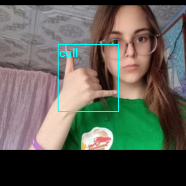

::: {.callout-tip}
## This post is part of the following series:
* [**Training YOLOX Models for Real-Time Object Detection in PyTorch**](/series/tutorials/pytorch-train-object-detector-yolox-series.html)
:::

  


* [Introduction](#introduction)
* [Getting Started with the Code](#getting-started-with-the-code)
* [Setting Up Your Python Environment](#setting-up-your-python-environment)
* [Importing the Required Dependencies](#importing-the-required-dependencies)
* [Setting Up the Project](#setting-up-the-project)
* [Loading and Exploring the Dataset](#loading-and-exploring-the-dataset)
* [Selecting a Model](#selecting-a-model)
* [Preparing the Data](#preparing-the-data)
* [Fine-tuning the Model](#fine-tuning-the-model)
* [Making Predictions with the Model](#making-predictions-with-the-model)
* [Conclusion](#conclusion)


## Introduction

Welcome to this hands-on guide to training real-time object detection models in [PyTorch](https://pytorch.org/)! Object detectors can identify and locate multiple objects within images and videos, allowing you to quantify them and track their location. The [YOLOX](https://arxiv.org/abs/2107.08430) model we'll use is fast and accurate, making it well-suited for real-time applications.

In this tutorial, we create a hand gesture detector that identifies and locates various hand gestures within images. Real-time gesture detection has many applications ranging from human-computer interaction and sign-language interpretation to augmented reality and interactive gaming experiences. 

After completing the tutorial, you will have a real-time gesture detector, plus a blueprint for training YOLOX models on other object detection tasks. You can then deploy models trained with this tutorial's code in real-time applications. For an example, check out the demo video below from a [project](https://github.com/cj-mills/barracuda-inference-yolox-demo) made with the [Unity game engine](https://unity.com/).

{fig-align="center"}

This tutorial is suitable for anyone with rudimentary PyTorch experience. If you are new to PyTorch and want to start with a beginner-focused project, check out my tutorial on fine-tuning image classifiers.

* [Fine-Tuning Image Classifiers with PyTorch and the timm library for Beginners](../pytorch-train-image-classifier-timm-hf-tutorial/)


::: {.callout-note title="Update: October 4, 2023"}

I updated the tutorial code for torchvision [`0.16.0`](https://github.com/pytorch/vision/releases/tag/v0.16.0).

:::


## Getting Started with the Code

The tutorial code is available as a [Jupyter Notebook](https://jupyter.org/), which you can run locally or in a cloud-based environment like [Google Colab](https://colab.research.google.com/). I have dedicated tutorials for those new to these platforms or who need guidance setting up:

* [**Getting Started with Google Colab**](../google-colab-getting-started-tutorial/)

* [**Setting Up a Local Python Environment with Mamba for Machine Learning Projects on Windows**](../mamba-getting-started-tutorial-windows/)


| Platform     | Jupyter Notebook                                             | Utility File                                                 |
| ------------ | ------------------------------------------------------------ | ------------------------------------------------------------ |
| Google Colab | [Open In Colab](https://colab.research.google.com/github/cj-mills/pytorch-yolox-object-detection-tutorial-code/blob/main/notebooks/pytorch-yolox-object-detector-training-colab.ipynb) |                                                              |
| Linux        | [GitHub Repository](https://github.com/cj-mills/pytorch-yolox-object-detection-tutorial-code/blob/main/notebooks/pytorch-yolox-object-detector-training.ipynb) |                                                              |
| Windows      | [GitHub Repository](https://github.com/cj-mills/pytorch-yolox-object-detection-tutorial-code/blob/main/notebooks/pytorch-yolox-object-detector-training-windows.ipynb) | [windows_utils.py](https://github.com/cj-mills/pytorch-yolox-object-detection-tutorial-code/blob/main/notebooks/windows_utils.py) |


::: {.callout-tip}

I've added a notebook for training models on the [COCO dataset](https://cocodataset.org/#home) to this tutorial's GitHub repository. You can modify it to train models on other datasets that follow the COCO annotation format.

* [pytorch-yolox-object-detector-training-coco.ipynb](https://github.com/cj-mills/pytorch-yolox-object-detection-tutorial-code/blob/main/notebooks/pytorch-yolox-object-detector-training-coco.ipynb)

:::


## Setting Up Your Python Environment

Before diving into the code, we'll cover the steps to create a local Python environment and install the necessary dependencies. The dedicated Colab Notebook includes the code to install the required dependencies in Google Colab.


### Creating a Python Environment

First, we'll create a Python environment using [Conda](https://docs.conda.io/en/latest/)/[Mamba](https://mamba.readthedocs.io/en/latest/). Open a terminal with Conda/Mamba installed and run the following commands:


::: {.panel-tabset}
## Conda

``` {.bash}
# Create a new Python 3.10 environment
conda create --name pytorch-env python=3.10 -y
# Activate the environment
conda activate pytorch-env
```

## Mamba

``` {.bash}
# Create a new Python 3.10 environment
mamba create --name pytorch-env python=3.10 -y
# Activate the environment
mamba activate pytorch-env
```

:::


### Installing PyTorch

Next, we'll install PyTorch. Run the appropriate command for your hardware and operating system.

::: {.panel-tabset}
## Linux/Windows (CUDA)

``` {.bash}
# Install PyTorch with CUDA
pip install torch torchvision torchaudio --index-url https://download.pytorch.org/whl/cu118
```

## Mac

``` {.bash}
# MPS (Metal Performance Shaders) acceleration is available on MacOS 12.3+
pip install torch torchvision torchaudio
```

## Linux (CPU)

``` {.bash}
# Install PyTorch for CPU only
pip install torch torchvision torchaudio --index-url https://download.pytorch.org/whl/cpu
```

## Windows (CPU)

``` {.bash}
# Install PyTorch for CPU only
pip install torch torchvision torchaudio
```

:::


### Installing Additional Libraries

We also need to install some additional libraries for our project.

| Package       | Description                                                  |
| ------------- | ------------------------------------------------------------ |
| `jupyter`     | An  open-source web application that allows you to create and share  documents that contain live code, equations, visualizations, and  narrative text. ([link](https://jupyter.org/)) |
| `matplotlib`  | This package provides a comprehensive collection of visualization tools to  create high-quality plots, charts, and graphs for data exploration and  presentation. ([link](https://matplotlib.org/)) |
| `pandas`      | This package provides fast, powerful, and flexible data analysis and manipulation tools. ([link](https://pandas.pydata.org/)) |
| `pillow`      | The Python Imaging Library adds image processing capabilities. ([link](https://pillow.readthedocs.io/en/stable/)) |
| `torchtnt`    | A library for PyTorch training tools and utilities. ([link](https://pytorch.org/tnt/stable/)) |
| `tqdm`        | A Python library that provides fast, extensible progress bars for loops and other iterable objects in Python. ([link](https://tqdm.github.io/)) |
| `tabulate`    | Pretty-print tabular data in Python. ([link](https://pypi.org/project/tabulate/)) |
| `pyarrow`     | This library provides a Python API for functionality provided by the [Arrow](https://arrow.apache.org/) C++ libraries, along with tools for Arrow integration and interoperability with pandas. ([link](https://pypi.org/project/pyarrow/)) |
| `fastparquet` | A python implementation of the parquet format, used implicitly by Pandas. ([link](https://pypi.org/project/fastparquet/)) |
| `distinctipy` | A lightweight python package providing functions to generate colours that are visually distinct from one another. ([link](https://distinctipy.readthedocs.io/en/latest/)) |


Run the following commands to install these additional libraries:

```bash
# Install additional dependencies
pip install distinctipy jupyter matplotlib pandas pillow torchtnt tqdm
# Install extra dependencies for pandas
pip install tabulate pyarrow fastparquet
```


### Installing Utility Packages

Walking through the code for the YOLOX model and the code for computing loss values during training would make this tutorial unreasonably long. Therefore, I included that code in a dedicated [pip package.](https://pypi.org/project/cjm-yolox-pytorch/) A link to the documentation is available in the table below.

We'll also install some additional packages I made to help us handle images, interact with PyTorch, and work with Pandas DataFrames. These utility packages provide shortcuts for routine tasks and keep our code clean and readable.


| Package                | Description                                                  |
| ---------------------- | ------------------------------------------------------------ |
| `cjm_pandas_utils`     | Some utility functions for working with Pandas. ([link](https://cj-mills.github.io/cjm-pandas-utils/)) |
| `cjm_pil_utils`        | Some PIL utility functions I frequently use. ([link](https://cj-mills.github.io/cjm-pil-utils/)) |
| `cjm_psl_utils`        | Some utility functions using the Python Standard Library. ([link](https://cj-mills.github.io/cjm-psl-utils/)) |
| `cjm_pytorch_utils`    | Some utility functions for working with PyTorch. ([link](https://cj-mills.github.io/cjm-pytorch-utils/)) |
| `cjm_torchvision_tfms` | Some custom Torchvision tranforms. ([link](https://cj-mills.github.io/cjm-torchvision-tfms/)) |
| `cjm_yolox_pytorch`    | A PyTorch implementation of the [YOLOX](https://arxiv.org/abs/2107.08430) object detection model based on [OpenMMLab](https://github.com/open-mmlab)’s implementation in the [mmdetection](https://github.com/open-mmlab/mmdetection) library. ([link](https://cj-mills.github.io/cjm-yolox-pytorch/)) |

Run the following commands to install the utility packages:

```python
# Install YOLOX utility package
pip install cjm_yolox_pytorch

# Install additional utility packages
pip install cjm_pandas_utils cjm_pil_utils cjm_psl_utils cjm_pytorch_utils cjm_torchvision_tfms
```


## Importing the Required Dependencies

With our environment set up, let's dive into the code. First, we will import the necessary Python packages into our Jupyter Notebook.


```python
# Import Python Standard Library dependencies
import datetime
from functools import partial
from glob import glob
import json
import math
import multiprocessing
import os
from pathlib import Path
import random
from typing import Any, Dict, Optional

# Import utility functions
from cjm_psl_utils.core import download_file, file_extract, get_source_code
from cjm_pil_utils.core import resize_img, get_img_files, stack_imgs
from cjm_pytorch_utils.core import pil_to_tensor, tensor_to_pil, get_torch_device, set_seed, denorm_img_tensor
from cjm_pandas_utils.core import markdown_to_pandas, convert_to_numeric, convert_to_string
from cjm_torchvision_tfms.core import ResizeMax, PadSquare, CustomRandomIoUCrop

# Import YOLOX package
from cjm_yolox_pytorch.model import build_model, MODEL_CFGS, NORM_STATS
from cjm_yolox_pytorch.utils import generate_output_grids
from cjm_yolox_pytorch.loss import YOLOXLoss
from cjm_yolox_pytorch.inference import YOLOXInferenceWrapper

# Import the distinctipy module
from distinctipy import distinctipy

# Import matplotlib for creating plots
import matplotlib.pyplot as plt

# Import numpy
import numpy as np

# Import the pandas package
import pandas as pd

# Set options for Pandas DataFrame display
pd.set_option('max_colwidth', None)  # Do not truncate the contents of cells in the DataFrame
pd.set_option('display.max_rows', None)  # Display all rows in the DataFrame
pd.set_option('display.max_columns', None)  # Display all columns in the DataFrame

# Import PIL for image manipulation
from PIL import Image

# Import PyTorch dependencies
import torch
from torch.amp import autocast
from torch.cuda.amp import GradScaler
import torch.nn as nn
import torch.nn.functional as F
from torch.utils.data import Dataset, DataLoader
from torchtnt.utils import get_module_summary
import torchvision
torchvision.disable_beta_transforms_warning()
from torchvision.tv_tensors import BoundingBoxes
from torchvision.utils import draw_bounding_boxes
import torchvision.transforms.v2  as transforms
from torchvision.transforms.v2 import functional as TF

# Import tqdm for progress bar
from tqdm.auto import tqdm
```


## Setting Up the Project

In this section, we set up some basics for our project, such as initializing random number generators, setting the PyTorch device to run the model, and preparing the folders for our project and datasets.


### Setting a Random Number Seed

First, we set the seed for generating random numbers using the [set_seed](https://cj-mills.github.io/cjm-pytorch-utils/core.html#set_seed) function from the `cjm_pytorch_utils` package.


```python
# Set the seed for generating random numbers in PyTorch, NumPy, and Python's random module.
seed = 1234
set_seed(seed)
```


### Setting the Device and Data Type

Next, we determine the device to use for training and set the data type of our tensors using the [get_torch_device](https://cj-mills.github.io/cjm-pytorch-utils/core.html#get_torch_device) function from the `cjm_pytorch_utils` package.


```python
device = get_torch_device()
dtype = torch.float32
device, dtype
```


```text
('cuda', torch.float32)
```


### Setting the Directory Paths

We can then set up a directory for our project to store our results and other related files. The following code creates the folder in the current directory (`./`). Update the path if that is not suitable for you.


We also need a place to store our datasets and a location to download the zip file containing the dataset. Readers following the tutorial on their local machine should select locations with read and write access to store archive files and datasets. For a cloud service like Google Colab, you can set it to the current directory.


```python
# The name for the project
project_name = f"pytorch-yolox-object-detector"

# The path for the project folder
project_dir = Path(f"./{project_name}/")

# Create the project directory if it does not already exist
project_dir.mkdir(parents=True, exist_ok=True)

# Define path to store datasets
dataset_dir = Path("/mnt/980_1TB_2/Datasets/")
# Create the dataset directory if it does not exist
dataset_dir.mkdir(parents=True, exist_ok=True)

# Define path to store archive files
archive_dir = dataset_dir/'../Archive'
# Create the archive directory if it does not exist
archive_dir.mkdir(parents=True, exist_ok=True)

pd.Series({
    "Project Directory:": project_dir, 
    "Dataset Directory:": dataset_dir, 
    "Archive Directory:": archive_dir
}).to_frame().style.hide(axis='columns')
```

<div style="overflow-x:auto; max-height:500px">
<table id="T_574bb">
  <thead>
  </thead>
  <tbody>
    <tr>
      <th id="T_574bb_level0_row0" class="row_heading level0 row0" >Project Directory:</th>
      <td id="T_574bb_row0_col0" class="data row0 col0" >pytorch-yolox-object-detector</td>
    </tr>
    <tr>
      <th id="T_574bb_level0_row1" class="row_heading level0 row1" >Dataset Directory:</th>
      <td id="T_574bb_row1_col0" class="data row1 col0" >/mnt/980_1TB_2/Datasets</td>
    </tr>
    <tr>
      <th id="T_574bb_level0_row2" class="row_heading level0 row2" >Archive Directory:</th>
      <td id="T_574bb_row2_col0" class="data row2 col0" >/mnt/980_1TB_2/Datasets/../Archive</td>
    </tr>
  </tbody>
</table>
</div>


Double-check the project and dataset directories exist in the specified paths and that you can add files to them before continuing. At this point, our project is set up and ready to go. In the next section, we will download and explore the dataset.


## Loading and Exploring the Dataset

Now that we set up the project, we can start working with our dataset. The dataset is a downscaled subset of [HaGRID](https://github.com/hukenovs/hagrid) (HAnd Gesture Recognition Image Dataset), which contains 18 distinct hand gestures and an additional `no_gesture` class for idle hands. 

I made four subsets of different sizes available on Hugging Face Hub. The most compact subset of the dataset is approximately 1 GB, with 31,833 samples. You will need about 2 GB to store the archive file and extracted dataset.


We will download and access the dataset directly rather than through Hugging Face's [Datasets](https://huggingface.co/docs/datasets/index) library. 


### Setting the Dataset Path

We first need to construct the name for the chosen Hugging Face Hub dataset and define where to download and extract the dataset.


```python
# Set the name of the dataset
dataset_name = 'hagrid-sample-30k-384p'
# dataset_name = 'hagrid-sample-120k-384p'
# dataset_name = 'hagrid-sample-250k-384p'
# dataset_name = 'hagrid-sample-500k-384p'

# Construct the HuggingFace Hub dataset name by combining the username and dataset name
hf_dataset = f'cj-mills/{dataset_name}'

# Create the path to the zip file that contains the dataset
archive_path = Path(f'{archive_dir}/{dataset_name}.zip')

# Create the path to the directory where the dataset will be extracted
dataset_path = Path(f'{dataset_dir}/{dataset_name}')

pd.Series({
    "HuggingFace Dataset:": hf_dataset, 
    "Archive Path:": archive_path, 
    "Dataset Path:": dataset_path
}).to_frame().style.hide(axis='columns')
```

<div style="overflow-x:auto; max-height:500px">
<table id="T_52612">
  <thead>
  </thead>
  <tbody>
    <tr>
      <th id="T_52612_level0_row0" class="row_heading level0 row0" >HuggingFace Dataset:</th>
      <td id="T_52612_row0_col0" class="data row0 col0" >cj-mills/hagrid-sample-30k-384p</td>
    </tr>
    <tr>
      <th id="T_52612_level0_row1" class="row_heading level0 row1" >Archive Path:</th>
      <td id="T_52612_row1_col0" class="data row1 col0" >/mnt/980_1TB_2/Datasets/../Archive/hagrid-sample-30k-384p.zip</td>
    </tr>
    <tr>
      <th id="T_52612_level0_row2" class="row_heading level0 row2" >Dataset Path:</th>
      <td id="T_52612_row2_col0" class="data row2 col0" >/mnt/980_1TB_2/Datasets/hagrid-sample-30k-384p</td>
    </tr>
  </tbody>
</table>
</div>


### Downloading the Dataset

We can now download the dataset archive file and extract the dataset using the [`download_file`](https://cj-mills.github.io/cjm-psl-utils/core.html#download_file) and [`file_extract`](https://cj-mills.github.io/cjm-psl-utils/core.html#file_extract) functions from the `cjm_psl_utils` package. We can delete the archive afterward to save space.


```python
# Construct the HuggingFace Hub dataset URL
dataset_url = f"https://huggingface.co/datasets/{hf_dataset}/resolve/main/{dataset_name}.zip"
print(f"HuggingFace Dataset URL: {dataset_url}")

# Set whether to delete the archive file after extracting the dataset
delete_archive = True

# Download the dataset if not present
if dataset_path.is_dir():
    print("Dataset folder already exists")
else:
    print("Downloading dataset...")
    download_file(dataset_url, archive_dir)    
    
    print("Extracting dataset...")
    file_extract(fname=archive_path, dest=dataset_dir)
    
    # Delete the archive if specified
    if delete_archive: archive_path.unlink()
```


### Getting the Image and Annotation Folders

The dataset has two folders containing the sample images and annotation files. The image folder organizes samples for each gesture class into separate subfolders. Each image subfolder has a corresponding JSON annotation file.


```python
# Create a list of the items in the 'dataset_path' directory
dir_content = [item for item in dataset_path.iterdir() if item.is_dir()]

# Get the path of the 'ann_train_val' directory
annotation_dir = dataset_path/'ann_train_val'

# Remove the 'ann_train_val' directory from the list of items
dir_content.remove(annotation_dir)

# Get the path of the remaining directory, which is assumed to be the image directory
img_dir = dir_content[0]

# Print the paths of the annotation and image directories
print(f"Annotation Directory: {annotation_dir}")
print(f"Image Directory: {img_dir}")

# Get a list of files in the 'annotation_dir' directory
annotation_file_paths = list(annotation_dir.glob('*.json'))

# Get a list of folders in the 'img_dir' directory
img_folder_paths = [folder for folder in img_dir.iterdir() if folder.is_dir()]

# Display the names of the folders using a Pandas DataFrame
pd.DataFrame({"Image Folder": [folder.name for folder in img_folder_paths], 
              "Annotation File":[file.name for file in annotation_file_paths]})
```

```text
Annotation Directory: /mnt/980_1TB_2/Datasets/hagrid-sample-30k-384p/ann_train_val
Image Directory: /mnt/980_1TB_2/Datasets/hagrid-sample-30k-384p/hagrid_30k
```

<div style="overflow-x:auto; max-height:500px">
<table border="1" class="dataframe">
  <thead>
    <tr style="text-align: right;">
      <th></th>
      <th>Image Folder</th>
      <th>Annotation File</th>
    </tr>
  </thead>
  <tbody>
    <tr>
      <th>0</th>
      <td>train_val_call</td>
      <td>call.json</td>
    </tr>
    <tr>
      <th>1</th>
      <td>train_val_dislike</td>
      <td>dislike.json</td>
    </tr>
    <tr>
      <th>2</th>
      <td>train_val_fist</td>
      <td>fist.json</td>
    </tr>
    <tr>
      <th>3</th>
      <td>train_val_four</td>
      <td>four.json</td>
    </tr>
    <tr>
      <th>4</th>
      <td>train_val_like</td>
      <td>like.json</td>
    </tr>
    <tr>
      <th>5</th>
      <td>train_val_mute</td>
      <td>mute.json</td>
    </tr>
    <tr>
      <th>6</th>
      <td>train_val_ok</td>
      <td>ok.json</td>
    </tr>
    <tr>
      <th>7</th>
      <td>train_val_one</td>
      <td>one.json</td>
    </tr>
    <tr>
      <th>8</th>
      <td>train_val_palm</td>
      <td>palm.json</td>
    </tr>
    <tr>
      <th>9</th>
      <td>train_val_peace</td>
      <td>peace.json</td>
    </tr>
    <tr>
      <th>10</th>
      <td>train_val_peace_inverted</td>
      <td>peace_inverted.json</td>
    </tr>
    <tr>
      <th>11</th>
      <td>train_val_rock</td>
      <td>rock.json</td>
    </tr>
    <tr>
      <th>12</th>
      <td>train_val_stop</td>
      <td>stop.json</td>
    </tr>
    <tr>
      <th>13</th>
      <td>train_val_stop_inverted</td>
      <td>stop_inverted.json</td>
    </tr>
    <tr>
      <th>14</th>
      <td>train_val_three</td>
      <td>three.json</td>
    </tr>
    <tr>
      <th>15</th>
      <td>train_val_three2</td>
      <td>three2.json</td>
    </tr>
    <tr>
      <th>16</th>
      <td>train_val_two_up</td>
      <td>two_up.json</td>
    </tr>
    <tr>
      <th>17</th>
      <td>train_val_two_up_inverted</td>
      <td>two_up_inverted.json</td>
    </tr>
  </tbody>
</table>
</div>


### Get Image File Paths

Each image file has a unique name that we can use to locate the corresponding annotation data. Let's make a dictionary that maps image names to file paths. The dictionary will allow us to retrieve the file path for a given image more efficiently.


```python
# Get all image files in the 'img_dir' directory
img_dict = {
    file.stem : file # Create a dictionary that maps file names to file paths
    for folder in img_folder_paths # Iterate through each image folder
    for file in get_img_files(folder) # Get a list of image files in each image folder
}

# Print the number of image files
print(f"Number of Images: {len(img_dict)}")

# Display the first five entries from the dictionary using a Pandas DataFrame
pd.DataFrame.from_dict(img_dict, orient='index').head()
```

```text
Number of Images: 31833
```

<div style="overflow-x:auto; max-height:500px">
<table border="1" class="dataframe">
  <thead>
    <tr style="text-align: right;">
      <th></th>
      <th>0</th>
    </tr>
  </thead>
  <tbody>
    <tr>
      <th>00005c9c-3548-4a8f-9d0b-2dd4aff37fc9</th>
      <td>/mnt/980_1TB_2/Datasets/hagrid-sample-30k-384p/hagrid_30k/train_val_call/00005c9c-3548-4a8f-9d0b-2dd4aff37fc9.jpg</td>
    </tr>
    <tr>
      <th>0020a3db-82d8-47aa-8642-2715d4744db5</th>
      <td>/mnt/980_1TB_2/Datasets/hagrid-sample-30k-384p/hagrid_30k/train_val_call/0020a3db-82d8-47aa-8642-2715d4744db5.jpg</td>
    </tr>
    <tr>
      <th>004ac93f-0f7c-49a4-aadc-737e0ad4273c</th>
      <td>/mnt/980_1TB_2/Datasets/hagrid-sample-30k-384p/hagrid_30k/train_val_call/004ac93f-0f7c-49a4-aadc-737e0ad4273c.jpg</td>
    </tr>
    <tr>
      <th>006cac69-d3f0-47f9-aac9-38702d038ef1</th>
      <td>/mnt/980_1TB_2/Datasets/hagrid-sample-30k-384p/hagrid_30k/train_val_call/006cac69-d3f0-47f9-aac9-38702d038ef1.jpg</td>
    </tr>
    <tr>
      <th>00973fac-440e-4a56-b60c-2a06d5fb155d</th>
      <td>/mnt/980_1TB_2/Datasets/hagrid-sample-30k-384p/hagrid_30k/train_val_call/00973fac-440e-4a56-b60c-2a06d5fb155d.jpg</td>
    </tr>
  </tbody>
</table>
</div>


### Get Bounding Box Annotations

Next, we read the contents of the JSON annotation files into a Pandas DataFrame so we can easily query the annotations. Reading each JSON file can be slow, so I added a [parquet](https://parquet.apache.org/) file with a premade annotation DataFrame.


```python
# Set the file path for the annotations DataFrame
annotation_df_pq_path = dataset_path/'annotations_df.parquet'

if annotation_df_pq_path.is_file():
    # Load the annotations DataFrame if present
    annotation_df = pd.read_parquet(annotation_df_pq_path)
else:
    # Create a generator that yields Pandas DataFrames containing the data from each JSON file
    cls_dataframes = (pd.read_json(f).transpose() for f in tqdm(annotation_file_paths))

    # Concatenate the DataFrames into a single DataFrame
    annotation_df = pd.concat(cls_dataframes, ignore_index=False)

    # Keep only the rows that correspond to the filenames in the 'img_dict' dictionary
    annotation_df = annotation_df.loc[list(img_dict.keys())]

    # Save the annotations DataFrame to disk
    annotation_df.to_parquet(annotation_df_pq_path)

# Print the first 5 rows of the DataFrame
annotation_df.head()
```


<div style="overflow-x:auto; max-height:500px">
<table border="1" class="dataframe">
  <thead>
    <tr style="text-align: right;">
      <th></th>
      <th>bboxes</th>
      <th>labels</th>
      <th>leading_hand</th>
      <th>leading_conf</th>
      <th>user_id</th>
    </tr>
  </thead>
  <tbody>
    <tr>
      <th>00005c9c-3548-4a8f-9d0b-2dd4aff37fc9</th>
      <td>[[0.23925175, 0.28595301, 0.25055143, 0.20777627]]</td>
      <td>[call]</td>
      <td>right</td>
      <td>1.0</td>
      <td>5a389ffe1bed6660a59f4586c7d8fe2770785e5bf79b09334aa951f6f119c024</td>
    </tr>
    <tr>
      <th>0020a3db-82d8-47aa-8642-2715d4744db5</th>
      <td>[[0.5801012999999999, 0.53265105, 0.14562138, 0.12286348]]</td>
      <td>[call]</td>
      <td>left</td>
      <td>1.0</td>
      <td>0d6da2c87ef8eabeda2dcfee2dc5b5035e878137a91b149c754a59804f3dce32</td>
    </tr>
    <tr>
      <th>004ac93f-0f7c-49a4-aadc-737e0ad4273c</th>
      <td>[[0.46294793, 0.26419774, 0.13834939000000002, 0.10784189]]</td>
      <td>[call]</td>
      <td>right</td>
      <td>1.0</td>
      <td>d50f05d9d6ca9771938cec766c3d621ff863612f9665b0e4d991c086ec04acc9</td>
    </tr>
    <tr>
      <th>006cac69-d3f0-47f9-aac9-38702d038ef1</th>
      <td>[[0.38799208, 0.44643898, 0.27068787, 0.18277858]]</td>
      <td>[call]</td>
      <td>right</td>
      <td>1.0</td>
      <td>998f6ad69140b3a59cb9823ba680cce62bf2ba678058c2fc497dbbb8b22b29fe</td>
    </tr>
    <tr>
      <th>00973fac-440e-4a56-b60c-2a06d5fb155d</th>
      <td>[[0.40980118, 0.38144198, 0.08338464, 0.06229785], [0.6122035100000001, 0.6780825500000001, 0.04700606, 0.07640522]]</td>
      <td>[call, no_gesture]</td>
      <td>right</td>
      <td>1.0</td>
      <td>4bb3ee1748be58e05bd1193939735e57bb3c0ca59a7ee38901744d6b9e94632e</td>
    </tr>
  </tbody>
</table>
</div>


::: {.callout-note}
Note that one of the samples contains a `no_gesture` label to identify an idle hand in the image.
:::


### Inspecting the Class Distribution

Now that we have the annotation data, we can get the unique class names and inspect the distribution of samples among the gesture classes.

#### Get image classes


```python
# Get a list of unique labels in the 'annotation_df' DataFrame
class_names = annotation_df['labels'].explode().unique().tolist()
class_names.sort()

# Display labels using a Pandas DataFrame
pd.DataFrame(class_names)
```


<div style="overflow-x:auto; max-height:500px">
<table border="1" class="dataframe">
  <thead>
    <tr style="text-align: right;">
      <th></th>
      <th>0</th>
    </tr>
  </thead>
  <tbody>
    <tr>
      <th>0</th>
      <td>call</td>
    </tr>
    <tr>
      <th>1</th>
      <td>dislike</td>
    </tr>
    <tr>
      <th>2</th>
      <td>fist</td>
    </tr>
    <tr>
      <th>3</th>
      <td>four</td>
    </tr>
    <tr>
      <th>4</th>
      <td>like</td>
    </tr>
    <tr>
      <th>5</th>
      <td>mute</td>
    </tr>
    <tr>
      <th>6</th>
      <td>no_gesture</td>
    </tr>
    <tr>
      <th>7</th>
      <td>ok</td>
    </tr>
    <tr>
      <th>8</th>
      <td>one</td>
    </tr>
    <tr>
      <th>9</th>
      <td>palm</td>
    </tr>
    <tr>
      <th>10</th>
      <td>peace</td>
    </tr>
    <tr>
      <th>11</th>
      <td>peace_inverted</td>
    </tr>
    <tr>
      <th>12</th>
      <td>rock</td>
    </tr>
    <tr>
      <th>13</th>
      <td>stop</td>
    </tr>
    <tr>
      <th>14</th>
      <td>stop_inverted</td>
    </tr>
    <tr>
      <th>15</th>
      <td>three</td>
    </tr>
    <tr>
      <th>16</th>
      <td>three2</td>
    </tr>
    <tr>
      <th>17</th>
      <td>two_up</td>
    </tr>
    <tr>
      <th>18</th>
      <td>two_up_inverted</td>
    </tr>
  </tbody>
</table>
</div>


#### Visualize the class distribution


```python
# Get the number of samples for each object class
class_counts = annotation_df['labels'].explode().value_counts().sort_index()

# Plot the distribution
class_counts.plot(kind='bar')
plt.title('Class distribution')
plt.ylabel('Count')
plt.xlabel('Classes')
plt.xticks(range(len(class_counts.index)), class_names, rotation=75)  # Set the x-axis tick labels
plt.show()
```

{fig-align="center"}

Each class, excluding `no_gesture`, has roughly the same number of samples. There are approximately four times as many `no_gesture` samples because of the immense variety of non-matching hand positions.


### Visualizing Bounding Box Annotations

Lastly, we will visualize the bounding box for one of the sample images to demonstrate how to interpret the annotations.


#### Generate a color map

While not required, assigning a unique color to bounding boxes for each object class enhances visual distinction, allowing for easier identification of different objects in the scene. We can use the [`distinctipy`](https://distinctipy.readthedocs.io/en/latest/) package to generate a visually distinct colormap.


```python
# Generate a list of colors with a length equal to the number of labels
colors = distinctipy.get_colors(len(class_names))

# Make a copy of the color map in integer format
int_colors = [tuple(int(c*255) for c in color) for color in colors]

# Generate a color swatch to visualize the color map
distinctipy.color_swatch(colors)
```

{fig-align="center"}


#### Download a font file

The [`draw_bounding_boxes`](https://pytorch.org/vision/stable/generated/torchvision.utils.draw_bounding_boxes.html) function included with torchvision uses a pretty small font size. We can increase the font size if we use a custom font. Font files are available on sites like [Google Fonts](https://fonts.google.com/), or we can use one included with the operating system.


```python
# Define the filename of the font file
font_file = 'KFOlCnqEu92Fr1MmEU9vAw.ttf'

# Download the font file
download_file(f"https://fonts.gstatic.com/s/roboto/v30/{font_file}", "./")
```


#### Define the bounding box annotation function

Let's make a partial function using `draw_bounding_boxes` since we'll use the same box thickness and font each time we visualize bounding boxes.


```python
draw_bboxes = partial(draw_bounding_boxes, fill=False, width=2, font=font_file, font_size=25)
```


### Selecting a Sample Image

We can use the unique ID for an image in the image dictionary to get the image's file path and the associated annotations from the annotation DataFrame.

#### Load the sample image


```python
# Get the file ID of the first image file
file_id = list(img_dict.keys())[0]

# Open the associated image file as a RGB image
sample_img = Image.open(img_dict[file_id]).convert('RGB')

# Print the dimensions of the image
print(f"Image Dims: {sample_img.size}")

# Show the image
sample_img
```

```text
Image Dims: (384, 512)
```


{fig-align="center"}


#### Inspect the corresponding annotation data


```python
# Get the row from the 'annotation_df' DataFrame corresponding to the 'file_id'
annotation_df.loc[file_id].to_frame()
```


<div style="overflow-x:auto; max-height:500px">
<table border="1" class="dataframe">
  <thead>
    <tr style="text-align: right;">
      <th></th>
      <th>00005c9c-3548-4a8f-9d0b-2dd4aff37fc9</th>
    </tr>
  </thead>
  <tbody>
    <tr>
      <th>bboxes</th>
      <td>[[0.23925175, 0.28595301, 0.25055143, 0.20777627]]</td>
    </tr>
    <tr>
      <th>labels</th>
      <td>[call]</td>
    </tr>
    <tr>
      <th>leading_hand</th>
      <td>right</td>
    </tr>
    <tr>
      <th>leading_conf</th>
      <td>1.0</td>
    </tr>
    <tr>
      <th>user_id</th>
      <td>5a389ffe1bed6660a59f4586c7d8fe2770785e5bf79b09334aa951f6f119c024</td>
    </tr>
  </tbody>
</table>
</div>


The bounding box annotations are in the format `[top-left X, top-left Y, width, height]`. The HaGRID dataset also normalizes bounding box annotations for this dataset to the range `[0,1]` based on the image dimensions. Therefore, we need to scale the `top-left X` and `width` values by the image width and the `top-left Y` and `height` values by the image height.


#### Annotate sample image

The `draw_bounding_boxes` function expects bounding box annotations in `[top-left X, top-left Y, bottom-right X, bottom-right Y]` format, so we'll use the [`box_convert`](https://pytorch.org/vision/stable/generated/torchvision.ops.box_convert.html#torchvision.ops.box_convert) function included with torchvision to convert the bounding box annotations from `[x,y,w,h]` to `[x,y,x,y]` format.


```python
# Extract the labels and bounding box annotations for the sample image
labels = annotation_df.loc[file_id]['labels']
bboxes = annotation_df.loc[file_id]['bboxes']

# Calculate the bounding boxes in the image size scale
width, height = sample_img.size
bboxes = [[x*width, y*height, w*width, h*height] for x, y, w, h in bboxes]

# Annotate the sample image with labels and bounding boxes
annotated_tensor = draw_bboxes(
    image=transforms.PILToTensor()(sample_img), 
    boxes=torchvision.ops.box_convert(torch.Tensor(bboxes), 'xywh', 'xyxy'), 
    labels=labels, 
    colors=[int_colors[i] for i in [class_names.index(label) for label in labels]]
)

tensor_to_pil(annotated_tensor)
```

{fig-align="center"}


We have loaded the dataset, inspected its class distribution, and visualized the bounding box annotations for a sample image. In the next section, we will select and load our model.


## Selecting a Model

I provide five predefined model configurations of different sizes in the [`cjm_yolox_pytorch`](https://cj-mills.github.io/cjm-yolox-pytorch/) package. Each predefined config comes with a model checkpoint trained on the [COCO](https://cocodataset.org) (Common Objects in Context) dataset.


### Exploring Available Models


```python
pd.DataFrame(MODEL_CFGS).transpose()
```


<div style="overflow-x:auto; max-height:500px">
<table border="1" class="dataframe">
  <thead>
    <tr style="text-align: right;">
      <th></th>
      <th>deepen_factor</th>
      <th>widen_factor</th>
      <th>neck_in_channels</th>
      <th>neck_out_channels</th>
      <th>neck_num_csp_blocks</th>
      <th>head_in_channels</th>
      <th>head_feat_channels</th>
    </tr>
  </thead>
  <tbody>
    <tr>
      <th>yolox_tiny</th>
      <td>0.33</td>
      <td>0.375</td>
      <td>[96, 192, 384]</td>
      <td>96</td>
      <td>1</td>
      <td>96</td>
      <td>96</td>
    </tr>
    <tr>
      <th>yolox_s</th>
      <td>0.33</td>
      <td>0.5</td>
      <td>[128, 256, 512]</td>
      <td>128</td>
      <td>1</td>
      <td>128</td>
      <td>128</td>
    </tr>
    <tr>
      <th>yolox_m</th>
      <td>0.67</td>
      <td>0.75</td>
      <td>[192, 384, 768]</td>
      <td>192</td>
      <td>2</td>
      <td>192</td>
      <td>192</td>
    </tr>
    <tr>
      <th>yolox_l</th>
      <td>1.0</td>
      <td>1.0</td>
      <td>[256, 512, 1024]</td>
      <td>256</td>
      <td>3</td>
      <td>256</td>
      <td>256</td>
    </tr>
    <tr>
      <th>yolox_x</th>
      <td>1.33</td>
      <td>1.25</td>
      <td>[320, 640, 1280]</td>
      <td>320</td>
      <td>4</td>
      <td>320</td>
      <td>320</td>
    </tr>
  </tbody>
</table>
</div>


We'll go with the `yolox_tiny` configuration as it is the most efficient and sufficiently accurate on this dataset.


### Loading the YOLOX-Tiny Model

We can initialize a `yolox_tiny` model with the pretrained weights and the appropriate number of output classes using the [`build_model`](https://cj-mills.github.io/cjm-yolox-pytorch/model.html#build_model) function included with the `cjm_yolox_pytorch` package.


```python
# Select the YOLOX model configuration
model_type = 'yolox_tiny'
# model_type = 'yolox_s'
# model_type = 'yolox_m'
# model_type = 'yolox_l'
# model_type = 'yolox_x'

# Set whether to initialize the model with pretrained weights
pretrained = True

# Create a YOLOX model with the number of output classes equal to the number of class names
model = build_model(model_type, len(class_names), pretrained=pretrained).to(device=device, dtype=dtype)

# Add attributes to store the device and model name for later reference
model.device = device
model.name = model_type

# Get stride values for processing output
strides = model.bbox_head.strides
```


### Get Normalization Statistics

Next, we need the normalization stats used during the pretraining process.


```python
# Retrieve normalization statistics (mean and std) specific to the pretrained checkpoints
norm_stats = [*NORM_STATS[model_type].values()] if pretrained else ([0.5]*3, [1.0]*3)

# Print the mean and standard deviation
pd.DataFrame(norm_stats)
```


<div style="overflow-x:auto; max-height:500px">
<table border="1" class="dataframe">
  <thead>
    <tr style="text-align: right;">
      <th></th>
      <th>0</th>
      <th>1</th>
      <th>2</th>
    </tr>
  </thead>
  <tbody>
    <tr>
      <th>0</th>
      <td>0.5</td>
      <td>0.5</td>
      <td>0.5</td>
    </tr>
    <tr>
      <th>1</th>
      <td>1.0</td>
      <td>1.0</td>
      <td>1.0</td>
    </tr>
  </tbody>
</table>
</div>


### Summarizing the Model

Before moving on, let's generate a summary of our model to get an overview of its performance characteristics. We can use this to gauge the difference in computational requirements between the model configs.


```python
# Define the input to the model
backbone_inp = torch.randn(1, 3, 256, 256).to(device)
with torch.no_grad(): neck_inp = model.backbone(backbone_inp)
with torch.no_grad(): head_inp = model.neck(neck_inp)

# Get a summary of the model as a Pandas DataFrame
backbone_summary = markdown_to_pandas(f"{get_module_summary(model.backbone, [backbone_inp])}").iloc[0]
neck_summary = markdown_to_pandas(f"{get_module_summary(model.neck, [neck_inp])}").iloc[0]
head_summary = markdown_to_pandas(f"{get_module_summary(model.bbox_head, [head_inp])}").iloc[0]
summary_df = pd.concat([backbone_summary, neck_summary, head_summary], axis=1).transpose()

parameters_df = summary_df['# Parameters'].apply(convert_to_numeric)
trainable_parameters = summary_df['# Trainable Parameters'].apply(convert_to_numeric)
size_df = summary_df['Size (bytes)'].apply(convert_to_numeric)
forward_flops_df = summary_df['Forward FLOPs'].apply(convert_to_numeric)

# compute sums and add a new row
total_row = {'Type': f'{model_type}',
             '# Parameters': convert_to_string(parameters_df.sum()),
             '# Trainable Parameters': convert_to_string(trainable_parameters.sum()),
             'Size (bytes)': convert_to_string(size_df.sum()),
             'Forward FLOPs': convert_to_string(forward_flops_df.sum()), 
             'In size': backbone_summary['In size'], 
             'Out size': head_summary['Out size']}

summary_df = pd.concat([pd.DataFrame([total_row]), summary_df], ignore_index=True)

# Remove extra columns
summary_df.drop(['In size', 'Out size', 'Contains Uninitialized Parameters?'], axis=1)
```

<div style="overflow-x:auto; max-height:500px">
<table border="1" class="dataframe">
  <thead>
    <tr style="text-align: right;">
      <th></th>
      <th>Type</th>
      <th># Parameters</th>
      <th># Trainable Parameters</th>
      <th>Size (bytes)</th>
      <th>Forward FLOPs</th>
    </tr>
  </thead>
  <tbody>
    <tr>
      <th>0</th>
      <td>yolox_tiny</td>
      <td>5.1 M</td>
      <td>5.1 M</td>
      <td>20.2 M</td>
      <td>1.206 G</td>
    </tr>
    <tr>
      <th>1</th>
      <td>CSPDarknet</td>
      <td>2.4 M</td>
      <td>2.4 M</td>
      <td>9.5 M</td>
      <td>500 M</td>
    </tr>
    <tr>
      <th>2</th>
      <td>YOLOXPAFPN</td>
      <td>1.7 M</td>
      <td>1.7 M</td>
      <td>6.7 M</td>
      <td>257 M</td>
    </tr>
    <tr>
      <th>3</th>
      <td>YOLOXHead</td>
      <td>1.0 M</td>
      <td>1.0 M</td>
      <td>4.0 M</td>
      <td>449 M</td>
    </tr>
  </tbody>
</table>
</div>


The above table shows the summary for the entire `yolox_tiny` model and the model's backbone, neck, and head individually. The model has approximately `5.1` million trainable parameters. It takes up `20.2` Megabytes of space and performs around `1.2` billion floating point operations for a single `256x256` RGB image. 

For reference, the `yolox_x` model has about `99` million trainable parameters, takes up over `395` MB, and performs around `22.5` billion floating point operations for the same input.

That completes the model selection and setup. In the next section, we will prepare our dataset for training.


## Preparing the Data

The data preparation involves several steps, such as applying data augmentation techniques, setting up the train-validation split for the dataset, resizing and padding the images, defining the training dataset class, and initializing DataLoaders to feed data to the model.


### Training-Validation Split

Let's begin by defining the training-validation split. We'll randomly select 90% of the available samples for the training set and use the remaining 10% for the validation set.


```python
# Get the list of image IDs
img_keys = list(img_dict.keys())

# Shuffle the image IDs
random.shuffle(img_keys)

# Define the percentage of the images that should be used for training
train_pct = 0.9
val_pct = 0.1

# Calculate the index at which to split the subset of image paths into training and validation sets
train_split = int(len(img_keys)*train_pct)
val_split = int(len(img_keys)*(train_pct+val_pct))

# Split the subset of image paths into training and validation sets
train_keys = img_keys[:train_split]
val_keys = img_keys[train_split:]

# Print the number of images in the training and validation sets
pd.Series({
    "Training Samples:": len(train_keys),
    "Validation Samples:": len(val_keys)
}).to_frame().style.hide(axis='columns')
```

<div style="overflow-x:auto; max-height:500px">
<table id="T_475ce">
  <thead>
  </thead>
  <tbody>
    <tr>
      <th id="T_475ce_level0_row0" class="row_heading level0 row0" >Training Samples:</th>
      <td id="T_475ce_row0_col0" class="data row0 col0" >28649</td>
    </tr>
    <tr>
      <th id="T_475ce_level0_row1" class="row_heading level0 row1" >Validation Samples:</th>
      <td id="T_475ce_row1_col0" class="data row1 col0" >3184</td>
    </tr>
  </tbody>
</table>
</div>


### Data Augmentation

Next, we can define what data augmentations to apply to images during training. I created a few custom image transforms to help streamline the code.

The [first](https://cj-mills.github.io/cjm-torchvision-tfms/core.html#customrandomioucrop) extends torchvision's [`RandomIoUCrop`](https://pytorch.org/vision/stable/generated/torchvision.transforms.v2.RandomIoUCrop.html#torchvision.transforms.v2.RandomIoUCrop) transform to give the user more control over how much it crops into bounding box areas. The [second](https://cj-mills.github.io/cjm-torchvision-tfms/core.html#resizemax) resizes images based on their largest dimension rather than their smallest. The [third](https://cj-mills.github.io/cjm-torchvision-tfms/core.html#padsquare) applies square padding and allows the padding to be applied equally on both sides or randomly split between the two sides.

All three are available through the [`cjm-torchvision-tfms`](https://cj-mills.github.io/cjm-torchvision-tfms/) package. 

#### Set training image size

First, we'll set the size to use for training. The [`ResizeMax`](https://cj-mills.github.io/cjm-torchvision-tfms/core.html#resizemax) transform will resize images so that the longest dimension equals this value while preserving the aspect ratio. The [`PadSquare`](https://cj-mills.github.io/cjm-torchvision-tfms/core.html#padsquare) transform will then pad the other side to make all the input squares. The input width and height must be multiples of the max [stride value](#loading-the-yolox-tiny-model).


```python
# Show a list of potential input resolutions
print([max(strides)*i for i in range(7,21)])

# Set training image size to a multiple of the max stride value
train_sz = 384
```

```text
[224, 256, 288, 320, 352, 384, 416, 448, 480, 512, 544, 576, 608, 640]
```


#### Initialize the transforms

Now we can initialize the transform objects. The `jitter_factor` parameter for the [`CustomRandomIoUCrop`](https://cj-mills.github.io/cjm-torchvision-tfms/core.html#customrandomioucrop) transform controls how much the center coordinates for the crop area can deviate from the center of a bounding box. Setting this to a value greater than zero allows the transform to crop into the bounding box area. We'll keep this value small as cutting into the hand gestures too much will change their meaning.


```python
# Create a RandomIoUCrop object
iou_crop = CustomRandomIoUCrop(min_scale=0.3, 
                               max_scale=1.0, 
                               min_aspect_ratio=0.5, 
                               max_aspect_ratio=2.0, 
                               sampler_options=[0.0, 0.1, 0.3, 0.5, 0.7, 0.9, 1.0],
                               trials=400, 
                               jitter_factor=0.25)
```

```python
# Create a `ResizeMax` object
resize_max = ResizeMax(max_sz=train_sz)

# Create a `PadSquare` object
pad_square = PadSquare(shift=True)
```


#### Test the transforms

We'll pass input through the `CustomRandomIoUCrop` transform first and then through `ResizeMax`, and `PadSquare`. We can pass the result through a final resize operation to ensure both sides match the `train_sz` value.


```python
# Prepare bounding box targets
targets = {'boxes': BoundingBoxes(torchvision.ops.box_convert(torch.Tensor(bboxes), 'xywh', 'xyxy'), 
                                format='xyxy', 
                                canvas_size=sample_img.size[::-1]), 
           'labels': labels}

# Crop the image
cropped_img, targets = iou_crop(sample_img, targets)

# Resize the image
resized_img, targets = resize_max(cropped_img, targets)

# Pad the image
padded_img, targets = pad_square(resized_img, targets)

# Ensure the padded image is the target size
resize = transforms.Resize([train_sz] * 2, antialias=True)
resized_padded_img, targets = resize(padded_img, targets)

# Annotate the augmented image with updated labels and bounding boxes
annotated_tensor = draw_bboxes(
    image=transforms.PILToTensor()(resized_padded_img), 
    boxes=targets['boxes'], 
    labels=targets['labels'], 
    colors=[int_colors[i] for i in [class_names.index(label) for label in labels]]
)

# Display the annotated image
display(tensor_to_pil(annotated_tensor))

pd.Series({
    "Source Image:": sample_img.size,
    "Cropped Image:": cropped_img.size,
    "Resized Image:": resized_img.size,
    "Padded Image:": padded_img.size,
    "Resized Padded Image:": resized_padded_img.size,
}).to_frame().style.hide(axis='columns')
```

{fig-align="center"}

<div style="overflow-x:auto; max-height:500px">
<table id="T_271f1">
  <thead>
  </thead>
  <tbody>
    <tr>
      <th id="T_271f1_level0_row0" class="row_heading level0 row0" >Source Image:</th>
      <td id="T_271f1_row0_col0" class="data row0 col0" >(384, 512)</td>
    </tr>
    <tr>
      <th id="T_271f1_level0_row1" class="row_heading level0 row1" >Cropped Image:</th>
      <td id="T_271f1_row1_col0" class="data row1 col0" >(294, 228)</td>
    </tr>
    <tr>
      <th id="T_271f1_level0_row2" class="row_heading level0 row2" >Resized Image:</th>
      <td id="T_271f1_row2_col0" class="data row2 col0" >(382, 297)</td>
    </tr>
    <tr>
      <th id="T_271f1_level0_row3" class="row_heading level0 row3" >Padded Image:</th>
      <td id="T_271f1_row3_col0" class="data row3 col0" >(382, 382)</td>
    </tr>
    <tr>
      <th id="T_271f1_level0_row4" class="row_heading level0 row4" >Resized Padded Image:</th>
      <td id="T_271f1_row4_col0" class="data row4 col0" >(384, 384)</td>
    </tr>
  </tbody>
</table>
</div>


### Training Dataset Class

Now we can define a custom dataset class to load images, extract the bounding box annotation, and apply the image transforms during training.


```python
class HagridDataset(Dataset):
    """
    This class represents a PyTorch Dataset for a collection of images and their annotations.
    The class is designed to load images along with their corresponding bounding box annotations and labels.
    """
    def __init__(self, img_keys, annotation_df, img_dict, class_to_idx, transforms=None):
        """
        Constructor for the HagridDataset class.

        Parameters:
        img_keys (list): List of unique identifiers for images.
        annotation_df (DataFrame): DataFrame containing the image annotations.
        img_dict (dict): Dictionary mapping image identifiers to image file paths.
        class_to_idx (dict): Dictionary mapping class labels to indices.
        transforms (callable, optional): Optional transform to be applied on a sample.
        """
        super(Dataset, self).__init__()
        
        self._img_keys = img_keys  # List of image keys
        self._annotation_df = annotation_df  # DataFrame containing annotations
        self._img_dict = img_dict  # Dictionary mapping image keys to image paths
        self._class_to_idx = class_to_idx  # Dictionary mapping class names to class indices
        self._transforms = transforms  # Image transforms to be applied
        
    def __len__(self):
        """
        Returns the length of the dataset.

        Returns:
        int: The number of items in the dataset.
        """
        return len(self._img_keys)
        
    def __getitem__(self, index):
        """
        Fetch an item from the dataset at the specified index.

        Parameters:
        index (int): Index of the item to fetch from the dataset.

        Returns:
        tuple: A tuple containing the image and its associated target (annotations).
        """
        # Retrieve the key for the image at the specified index
        img_key = self._img_keys[index]
        # Get the annotations for this image
        annotation = self._annotation_df.loc[img_key]
        # Load the image and its target (bounding boxes and labels)
        image, target = self._load_image_and_target(annotation)
        
        # Apply the transformations, if any
        if self._transforms:
            image, target = self._transforms(image, target)
        
        return image, target

    def _load_image_and_target(self, annotation):
        """
        Load an image and its target (bounding boxes and labels).

        Parameters:
        annotation (pandas.Series): The annotations for an image.

        Returns:
        tuple: A tuple containing the image and a dictionary with 'boxes' and 'labels' keys.
        """
        # Retrieve the file path of the image
        filepath = self._img_dict[annotation.name]
        # Open the image file and convert it to RGB
        image = Image.open(filepath).convert('RGB')
        # Calculate the bounding boxes in the image size scale
        bbox_list = np.array([bbox*(image.size*2) for bbox in annotation.bboxes])
        
        # Convert bounding box coordinates from [xmin, ymin, width, height] to [xmin, ymin, xmax, ymax]
        bbox_tensor = torchvision.ops.box_convert(torch.Tensor(bbox_list), 'xywh', 'xyxy')
        # Create a BoundingBoxes object with the bounding boxes
        boxes = BoundingBoxes(bbox_tensor, format='xyxy', canvas_size=image.size[::-1])
        # Convert the class labels to indices
        labels = torch.Tensor([self._class_to_idx[label] for label in annotation.labels])
        return image, {'boxes': boxes, 'labels': labels}
```


### Image Transforms

We'll add additional data augmentations with the IoU crop transform to help the model generalize.


| Transform         | Description                                                  |
| ----------------- | ------------------------------------------------------------ |
| `RandomZoomOut`   | Randomly pad images, videos, bounding boxes and masks creating a zoom out effect. ([link](https://pytorch.org/vision/stable/generated/torchvision.transforms.v2.RandomZoomOut.html#torchvision.transforms.v2.RandomZoomOut)) |
| `ColorJitter`     | Randomly change the brightness, contrast, saturation and hue of an image or video. ([link](https://pytorch.org/vision/stable/generated/torchvision.transforms.v2.ColorJitter.html#torchvision.transforms.v2.ColorJitter)) |
| `RandomGrayscale` | Randomly convert image or videos to grayscale with a probability of p (default 0.1). ([link](https://pytorch.org/vision/stable/generated/torchvision.transforms.v2.RandomGrayscale.html#torchvision.transforms.v2.RandomGrayscale)) |
| `RandomEqualize`  | Equalize the histogram of the given image or video with a given probability. ([link](https://pytorch.org/vision/stable/generated/torchvision.transforms.v2.RandomEqualize.html#torchvision.transforms.v2.RandomEqualize)) |
| `RandomPosterize` | Randomly posterize an image by reducing the number of bits for each color channel. ([link](https://pytorch.org/vision/stable/generated/torchvision.transforms.v2.RandomPosterize.html#torchvision.transforms.v2.RandomPosterize)) |


```python
# Compose transforms for data augmentation
data_aug_tfms = transforms.Compose(
    transforms=[
        transforms.RandomChoice([
            transforms.RandomZoomOut(fill= (123, 117, 104), side_range=(1.125, 1.5)), 
            iou_crop
        ], p=[0.3, 0.7]),
        transforms.ColorJitter(
                brightness = (0.875, 1.125),
                contrast = (0.5, 1.5),
                saturation = (0.5, 1.5),
                hue = (-0.05, 0.05),
        ),
        transforms.RandomGrayscale(),
        transforms.RandomEqualize(),
        transforms.RandomPosterize(bits=3, p=0.5),
        transforms.RandomHorizontalFlip(p=0.5),
    ],
)

# Compose transforms to resize and pad input images
resize_pad_tfm = transforms.Compose([
    resize_max, 
    pad_square,
    transforms.Resize([train_sz] * 2, antialias=True)
])

# Compose transforms to sanitize bounding boxes and normalize input data
final_tfms = transforms.Compose([
    transforms.ToImage(), 
    transforms.ToDtype(torch.float32, scale=True),
    transforms.SanitizeBoundingBoxes(),
    transforms.Normalize(*norm_stats),
])

# Define the transformations for training and validation datasets
train_tfms = transforms.Compose([
    data_aug_tfms, 
    resize_pad_tfm, 
    final_tfms
])
valid_tfms = transforms.Compose([resize_pad_tfm, final_tfms])
```


::: {.callout-important}

Always use the [`SanitizeBoundingBoxes`](https://pytorch.org/vision/stable/generated/torchvision.transforms.v2.SanitizeBoundingBoxes.html#torchvision.transforms.v2.SanitizeBoundingBoxes) transform to clean up annotations after using data augmentations that alter bounding boxes (e.g., cropping, warping, etc.).
:::


### Initialize Datasets

Now we can create our training and validation dataset objects using the dataset splits and transforms.


```python
# Create a mapping from class names to class indices
class_to_idx = {c: i for i, c in enumerate(class_names)}

# Instantiate the datasets using the defined transformations
train_dataset = HagridDataset(train_keys, annotation_df, img_dict, class_to_idx, train_tfms)
valid_dataset = HagridDataset(val_keys, annotation_df, img_dict, class_to_idx, valid_tfms)

# Print the number of samples in the training and validation datasets
pd.Series({
    'Training dataset size:': len(train_dataset),
    'Validation dataset size:': len(valid_dataset)}
).to_frame().style.hide(axis='columns')
```

<div style="overflow-x:auto; max-height:500px">
<table id="T_1219d">
  <thead>
  </thead>
  <tbody>
    <tr>
      <th id="T_1219d_level0_row0" class="row_heading level0 row0" >Training dataset size:</th>
      <td id="T_1219d_row0_col0" class="data row0 col0" >28649</td>
    </tr>
    <tr>
      <th id="T_1219d_level0_row1" class="row_heading level0 row1" >Validation dataset size:</th>
      <td id="T_1219d_row1_col0" class="data row1 col0" >3184</td>
    </tr>
  </tbody>
</table>
</div>


### Inspect Samples

Let's verify the dataset objects work properly by inspecting the first samples from the training and validation sets.

#### Inspect training set sample


```python
dataset_sample = train_dataset[0]

annotated_tensor = draw_bboxes(
    image=(denorm_img_tensor(dataset_sample[0], *norm_stats)*255).to(dtype=torch.uint8), 
    boxes=dataset_sample[1]['boxes'], 
    labels=[class_names[int(i.item())] for i in dataset_sample[1]['labels']], 
    colors=[int_colors[int(i.item())] for i in dataset_sample[1]['labels']]
)

tensor_to_pil(annotated_tensor)
```

{fig-align="center"}


#### Inspect validation set sample


```python
dataset_sample = valid_dataset[0]

annotated_tensor = draw_bboxes(
    image=(denorm_img_tensor(dataset_sample[0], *norm_stats)*255).to(dtype=torch.uint8), 
    boxes=dataset_sample[1]['boxes'], 
    labels=[class_names[int(i.item())] for i in dataset_sample[1]['labels']], 
    colors=[int_colors[int(i.item())] for i in dataset_sample[1]['labels']]
)

tensor_to_pil(annotated_tensor)
```

{fig-align="center"}


### Initialize DataLoaders

The last step before training is to instantiate the DataLoaders for the training and validation sets. Try decreasing the `bs` and `prefetch_factor` values if you encounter memory limitations.


```python
# Set the training batch size
bs = 32

# Set the number of worker processes for loading data.
num_workers = multiprocessing.cpu_count()//2

# Define parameters for DataLoader
data_loader_params = {
    'batch_size': bs,  # Batch size for data loading
    'num_workers': num_workers,  # Number of subprocesses to use for data loading
    'collate_fn': lambda batch: tuple(zip(*batch)),
    'drop_last': True,
    'prefetch_factor': 8,
    'pin_memory': True,
    'pin_memory_device': device
}

# Create DataLoader for training data. Data is shuffled for every epoch.
train_dataloader = DataLoader(train_dataset, **data_loader_params, shuffle=True)

# Create DataLoader for validation data. Shuffling is not necessary for validation data.
valid_dataloader = DataLoader(valid_dataset, **data_loader_params)

# Print the number of batches in the training and validation DataLoaders
pd.Series({
    'Number of batches in train DataLoader:': len(train_dataloader),
    'Number of batches in validation DataLoader:': len(valid_dataloader)}
).to_frame().style.hide(axis='columns')
```

<div style="overflow-x:auto; max-height:500px">
<table id="T_b5faf">
  <thead>
  </thead>
  <tbody>
    <tr>
      <th id="T_b5faf_level0_row0" class="row_heading level0 row0" >Number of batches in train DataLoader:</th>
      <td id="T_b5faf_row0_col0" class="data row0 col0" >895</td>
    </tr>
    <tr>
      <th id="T_b5faf_level0_row1" class="row_heading level0 row1" >Number of batches in validation DataLoader:</th>
      <td id="T_b5faf_row1_col0" class="data row1 col0" >99</td>
    </tr>
  </tbody>
</table>
</div>


That completes the data preparation. Now we can finally train our hand gesture detector.


## Fine-tuning the Model

In this section, we will implement the training code and fine-tune our model.

### Define the Training Loop

The following function performs a single pass through the training or validation set.

The model takes in a batch of images and returns a tuple containing three variables. The first variable stores the image classification predictions for each proposed bounding box, which we use to determine the object type for a given bounding box. The second holds the coordinates and dimensions for all potential bounding boxes. The third variable contains probability scores for each proposed detection, indicating the likelihood it is an object.

The model always makes the same number of predictions for a given image size. Given a `384x384` image, the model will make `(384/8)*(384/8) + (384/16)*(384/16) + (384/32)*(384/32) = 3024` predictions. However, many of those predictions get filtered out when performing inference. 

During training, we must determine which of the model's predictions to pair with the ground truth annotations from our dataset before calculating the loss. YOLOX uses an approach called [SimOTA](https://cj-mills.github.io/cjm-yolox-pytorch/simota.html#simotaassigner) for this step. The [YOLOXLoss](https://cj-mills.github.io/cjm-yolox-pytorch/loss.html#yoloxloss) class performs this assignment automatically when [called](https://cj-mills.github.io/cjm-yolox-pytorch/loss.html#yoloxloss.__call__).


```python
def run_epoch(model, dataloader, optimizer, lr_scheduler, loss_func, device, scaler, is_training):
    """
    Function to run a single training or evaluation epoch.
    
    Args:
        model: A PyTorch model to train or evaluate.
        dataloader: A PyTorch DataLoader providing the data.
        optimizer: The optimizer to use for training the model.
        loss_func: The loss function used for training.
        device: The device (CPU or GPU) to run the model on.
        scaler: Gradient scaler for mixed-precision training.
        is_training: Boolean flag indicating whether the model is in training or evaluation mode.
    
    Returns:
        The average loss for the epoch.
    """
    # Set the model to training mode if is_training is True, otherwise set it to evaluation mode
    model.train() if is_training else model.eval()
    
    epoch_loss = 0  # Initialize the total loss for this epoch
    progress_bar = tqdm(total=len(dataloader), desc="Train" if is_training else "Eval")  # Initialize a progress bar
    
    # Loop over the data
    for batch_id, (inputs, targets) in enumerate(dataloader):
        # Move inputs and targets to the specified device
        inputs = torch.stack(inputs).to(device)
        # Extract the ground truth bounding boxes and labels
        gt_bboxes, gt_labels = zip(*[(d['boxes'].to(device), d['labels'].to(device)) for d in targets])

        # Forward pass with Automatic Mixed Precision (AMP) context manager
        with autocast(torch.device(device).type):
            cls_scores, bbox_preds, objectnesses = model(inputs)
        
            # Compute the loss
            losses = loss_func(cls_scores, bbox_preds, objectnesses, gt_bboxes, gt_labels)
            loss = sum([loss for loss in losses.values()])  # Sum up the losses

        # If in training mode, backpropagate the error and update the weights
        if is_training:
            if scaler:
                scaler.scale(loss).backward()
                scaler.step(optimizer)
                old_scaler = scaler.get_scale()
                scaler.update()
                new_scaler = scaler.get_scale()
                if new_scaler >= old_scaler:
                    lr_scheduler.step()
            else:
                loss.backward()
                optimizer.step()
                lr_scheduler.step()
                
            optimizer.zero_grad()

        # Update the total loss
        loss_item = loss.item()
        epoch_loss += loss_item
        
        # Update the progress bar
        progress_bar_dict = dict(loss=loss_item, avg_loss=epoch_loss/(batch_id+1))
        if is_training:
            progress_bar_dict.update(lr=lr_scheduler.get_last_lr()[0])
        progress_bar.set_postfix(progress_bar_dict)
        progress_bar.update()

        # If the loss is NaN or infinite, stop the training/evaluation process
        if math.isnan(loss_item) or math.isinf(loss_item):
            print(f"Loss is NaN or infinite at batch {batch_id}. Stopping {'training' if is_training else 'evaluation'}.")
            break

    # Cleanup and close the progress bar 
    progress_bar.close()
    
    # Return the average loss for this epoch
    return epoch_loss / (batch_id + 1)
```


Next, we define the `train_loop` function, which executes the main training loop. It iterates over each epoch, runs through the training and validation sets, and saves the best model based on the validation loss.


```python
def train_loop(model, 
               train_dataloader, 
               valid_dataloader, 
               optimizer, 
               loss_func, 
               lr_scheduler, 
               device, 
               epochs, 
               checkpoint_path, 
               use_scaler=False):
    """
    Main training loop.
    
    Args:
        model: A PyTorch model to train.
        train_dataloader: A PyTorch DataLoader providing the training data.
        valid_dataloader: A PyTorch DataLoader providing the validation data.
        optimizer: The optimizer to use for training the model.
        loss_func: The loss function used for training.
        lr_scheduler: The learning rate scheduler.
        device: The device (CPU or GPU) to run the model on.
        epochs: The number of epochs to train for.
        checkpoint_path: The path where to save the best model checkpoint.
        use_scaler: Whether to scale graidents when using a CUDA device
    
    Returns:
        None
    """
    # Initialize a gradient scaler for mixed-precision training if the device is a CUDA GPU
    scaler = torch.cuda.amp.GradScaler() if device.type == 'cuda' and use_scaler else None
    best_loss = float('inf')  # Initialize the best validation loss

    # Loop over the epochs
    for epoch in tqdm(range(epochs), desc="Epochs"):
        # Run a training epoch and get the training loss
        train_loss = run_epoch(model, train_dataloader, optimizer, lr_scheduler, loss_func, device, scaler, is_training=True)
        # Run an evaluation epoch and get the validation loss
        with torch.no_grad():
            valid_loss = run_epoch(model, valid_dataloader, None, None, loss_func, device, scaler, is_training=False)

        # If the validation loss is lower than the best validation loss seen so far, save the model checkpoint
        if valid_loss < best_loss:
            best_loss = valid_loss
            torch.save(model.state_dict(), checkpoint_path)

            # Save metadata about the training process
            training_metadata = {
                'epoch': epoch,
                'train_loss': train_loss,
                'valid_loss': valid_loss, 
                'learning_rate': lr_scheduler.get_last_lr()[0],
                'model_architecture': model.name
            }
            with open(Path(checkpoint_path.parent/'training_metadata.json'), 'w') as f:
                json.dump(training_metadata, f)

        # If the training or validation loss is NaN or infinite, stop the training process
        if any(math.isnan(loss) or math.isinf(loss) for loss in [train_loss, valid_loss]):
            print(f"Loss is NaN or infinite at epoch {epoch}. Stopping training.")
            break

    # If the device is a GPU, empty the cache
    if device.type != 'cpu':
        getattr(torch, device.type).empty_cache()
```


### Set the Model Checkpoint Path

Before we proceed with training, let's generate a timestamp for the training session and create a directory to save the checkpoints during training.


```python
# Generate timestamp for the training session (Year-Month-Day_Hour_Minute_Second)
timestamp = datetime.datetime.now().strftime("%Y-%m-%d_%H-%M-%S")

# Create a directory to store the checkpoints if it does not already exist
checkpoint_dir = Path(project_dir/f"{timestamp}")

# Create the checkpoint directory if it does not already exist
checkpoint_dir.mkdir(parents=True, exist_ok=True)

# The model checkpoint path
checkpoint_path = checkpoint_dir/f"{model.name}.pth"

print(checkpoint_path)
```

```text
pytorch-yolox-object-detector/2023-08-17_16-14-43/yolox_tiny.pth
```


Let's save a copy of the normalization stats and the colormap for the current dataset in the training folder for future use.


### Save the Normalization Stats


```python
# Convert tuples to dictionaries for easier JSON representation
norm_stats_dict = {"mean": norm_stats[0], "std_dev": norm_stats[1]}

# Export to JSON
with open(f"{checkpoint_dir}/norm_stats.json", "w") as f:
    json.dump(norm_stats_dict, f)

# Print the name of the file that the normalization stats were written to
print(f"{checkpoint_dir}/norm_stats.json")
```
```text
pytorch-yolox-object-detector/2023-08-17_16-14-43/norm_stats.json
```


### Save the Color Map


```python
# Create a color map and write it to a JSON file
color_map = {'items': [{'label': label, 'color': color} for label, color in zip(class_names, colors)]}
with open(f"{checkpoint_dir}/{dataset_path.name}-colormap.json", "w") as file:
    json.dump(color_map, file)

# Print the name of the file that the color map was written to
print(f"{checkpoint_dir}/{dataset_path.name}-colormap.json")
```

```text
pytorch-yolox-object-detector/2023-08-17_16-14-43/hagrid-sample-30k-384p-colormap.json
```


### Configure the Training Parameters

Now, we can configure the parameters for training. We must define the learning rate, the number of training epochs and instantiate the optimizer, learning rate scheduler, and a `YOLOXLoss` object.


```python
# Learning rate for the model
lr = 5e-4

# Number of training epochs
epochs = 10
# epochs = 20

# AdamW optimizer; includes weight decay for regularization
optimizer = torch.optim.AdamW(model.parameters(), lr=lr)

# Learning rate scheduler; adjusts the learning rate during training
lr_scheduler = torch.optim.lr_scheduler.OneCycleLR(optimizer, 
                                                   max_lr=lr, 
                                                   total_steps=epochs*len(train_dataloader))

# Initialize the loss function for evaluating model predictions
yolox_loss = YOLOXLoss(num_classes=model.bbox_head.cls_out_channels, bbox_loss_weight=10.0, use_l1=False)
```


### Train the Model

Finally, we can train the model using the `train_loop` function. Training time will depend on the available hardware.

::: {.callout-note}
Training usually takes around 3 hours and 6 minutes on the free GPU tier of Google Colab.
:::


```python
train_loop(model=model, 
           train_dataloader=train_dataloader,
           valid_dataloader=valid_dataloader,
           optimizer=optimizer, 
           loss_func=yolox_loss, 
           lr_scheduler=lr_scheduler, 
           device=torch.device(device), 
           epochs=epochs, 
           checkpoint_path=checkpoint_path,
           use_scaler=True)
```


```text
Epochs:   100%|██████████| 10/10 [21:14<00:00, 126.73s/it]
Train:   100%|██████████| 895/895 [01:57<00:00, 11.01it/s, loss=7.48, avg_loss=13, lr=0.000139]
Eval:   100%|██████████| 99/99 [00:10<00:00, 13.75it/s, loss=6.72, avg_loss=6.56]
Train:   100%|██████████| 895/895 [01:58<00:00, 10.77it/s, loss=5.92, avg_loss=6.19, lr=0.000379]
Eval:   100%|██████████| 99/99 [00:10<00:00, 14.25it/s, loss=5.03, avg_loss=4.73]
Train:   100%|██████████| 895/895 [02:01<00:00, 10.70it/s, loss=4.76, avg_loss=5.14, lr=0.0005]
Eval:   100%|██████████| 99/99 [00:10<00:00, 13.20it/s, loss=4.51, avg_loss=4.23]
Train:   100%|██████████| 895/895 [02:00<00:00, 10.72it/s, loss=4.32, avg_loss=4.63, lr=0.000475]
Eval:   100%|██████████| 99/99 [00:10<00:00, 13.60it/s, loss=4.16, avg_loss=3.86]
Train:   100%|██████████| 895/895 [01:57<00:00, 11.12it/s, loss=4.35, avg_loss=4.31, lr=0.000406]
Eval:   100%|██████████| 99/99 [00:10<00:00, 14.25it/s, loss=4.03, avg_loss=3.62]
Train:   100%|██████████| 895/895 [01:54<00:00, 11.15it/s, loss=3.64, avg_loss=4, lr=0.000306]
Eval:   100%|██████████| 99/99 [00:10<00:00, 14.10it/s, loss=3.75, avg_loss=3.37]
Train:   100%|██████████| 895/895 [01:54<00:00, 11.08it/s, loss=3.35, avg_loss=3.71, lr=0.000195]
Eval:   100%|██████████| 99/99 [00:10<00:00, 14.07it/s, loss=3.72, avg_loss=3.13]
Train:   100%|██████████| 895/895 [01:54<00:00, 11.10it/s, loss=3.1, avg_loss=3.44, lr=9.47e-5]
Eval:   100%|██████████| 99/99 [00:10<00:00, 14.24it/s, loss=3.35, avg_loss=2.9]
Train:   100%|██████████| 895/895 [01:54<00:00, 11.16it/s, loss=2.93, avg_loss=3.24, lr=2.51e-5]
Eval:   100%|██████████| 99/99 [00:10<00:00, 14.15it/s, loss=3.46, avg_loss=2.8]
Train:   100%|██████████| 895/895 [01:58<00:00, 10.89it/s, loss=3.03, avg_loss=3.14, lr=3.54e-9]
Eval:   100%|██████████| 99/99 [00:10<00:00, 13.65it/s, loss=3.28, avg_loss=2.77]
```


At last, we have our hand gesture detector. To wrap up the tutorial, we can test our model by performing inference on individual images.


## Making Predictions with the Model

In this final part of the tutorial, we will cover how to perform inference on individual images with our YOLOX model and filter the predictions.

### Preparing the Model for Inference

Whenever we make predictions with the model, we must normalize the input data, scale the predicted bounding boxes, and calculate the associated confidence scores. Since these steps are always required, I included a [wrapper class](https://cj-mills.github.io/cjm-yolox-pytorch/inference.html#yoloxinferencewrapper) with the `cjm_yolox_pytorch` package.

#### Wrap the model with preprocessing and post-processing steps


```python
# Convert the normalization stats to tensors
mean_tensor = torch.tensor(norm_stats[0]).view(1, 3, 1, 1)
std_tensor = torch.tensor(norm_stats[1]).view(1, 3, 1, 1)

# Set the model to evaluation mode
model.eval();

# Wrap the model with preprocessing and post-processing steps
wrapped_model = YOLOXInferenceWrapper(model, mean_tensor, std_tensor).to(device=device)
```

With our model prepped with the preprocessing and post-processing steps, we only need to prepare some input data.

### Preparing Input Data

Let's start with a random image from the validation set. That way, we have some ground truth bounding boxes to compare against. Unlike during training, we won't stick to square input dimensions for inference. However, we still need to ensure both input dimensions are multiples of the max [stride value](#loading-the-yolox-tiny-model).


```python
# Choose a random item from the validation set
file_id = random.choice(val_keys)

# Retrieve the image file path associated with the file ID
test_file = img_dict[file_id]

# Open the test file
test_img = Image.open(test_file).convert('RGB')

# Resize the test image
resized_img = resize_img(test_img, target_sz=train_sz, divisor=1)

# Ensure the input dimensions are multiples of the max stride
input_dims = [dim - dim % max(strides) for dim in resized_img.size]

# Calculate the offsets from the resized image dimensions to the input dimensions
offsets = (np.array(resized_img.size) - input_dims)/2

# Calculate the scale between the source image and the resized image
min_img_scale = min(test_img.size) / min(resized_img.size)

# Crop the resized image to the input dimensions
input_img = resized_img.crop(box=[*offsets, *resized_img.size-offsets])

# Get the target labels and bounding boxes
target_labels = annotation_df.loc[file_id]['labels']
target_bboxes = annotation_df.loc[file_id]['bboxes']

# Scale bounding boxes according to image dimensions
target_bboxes = [bbox*(resized_img.size*2) for bbox in target_bboxes]
# Offset bounding boxes according to input dimensions
target_bboxes = np.array([bbox/min_img_scale-[*offsets, 0, 0] for bbox in target_bboxes])

# Create a tensor from the test image and annotate it
annotated_tensor = draw_bboxes(
    image=transforms.PILToTensor()(input_img), 
    boxes=torchvision.ops.box_convert(torch.Tensor(target_bboxes), 'xywh', 'xyxy'), 
    labels=target_labels, 
    colors=[int_colors[i] for i in [class_names.index(label) for label in target_labels]]
)

# Display the annotated test image
annotated_test_img = tensor_to_pil(annotated_tensor)
display(annotated_test_img)

# Print the prediction data as a Pandas DataFrame for easy formatting
pd.Series({
    "Resized Image Size:": resized_img.size,
    "Input Dims:": input_dims,
    "Offsets:": offsets,
    "Min Image Scale:": min_img_scale,
    "Input Image Size:": input_img.size, 
    "Target BBoxes:": [f"{label}:{bbox}" for label, bbox in zip(target_labels, np.round(target_bboxes, decimals=3))]
}).to_frame().style.hide(axis='columns')
```


{fig-align="center"}

<div style="overflow-x:auto; max-height:500px">
<table id="T_a5b54">
  <thead>
  </thead>
  <tbody>
    <tr>
      <th id="T_a5b54_level0_row0" class="row_heading level0 row0" >Resized Image Size:</th>
      <td id="T_a5b54_row0_col0" class="data row0 col0" >(384, 511)</td>
    </tr>
    <tr>
      <th id="T_a5b54_level0_row1" class="row_heading level0 row1" >Input Dims:</th>
      <td id="T_a5b54_row1_col0" class="data row1 col0" >[384, 480]</td>
    </tr>
    <tr>
      <th id="T_a5b54_level0_row2" class="row_heading level0 row2" >Offsets:</th>
      <td id="T_a5b54_row2_col0" class="data row2 col0" >[ 0.  15.5]</td>
    </tr>
    <tr>
      <th id="T_a5b54_level0_row3" class="row_heading level0 row3" >Min Image Scale:</th>
      <td id="T_a5b54_row3_col0" class="data row3 col0" >1.000000</td>
    </tr>
    <tr>
      <th id="T_a5b54_level0_row4" class="row_heading level0 row4" >Input Image Size:</th>
      <td id="T_a5b54_row4_col0" class="data row4 col0" >(384, 480)</td>
    </tr>
    <tr>
      <th id="T_a5b54_level0_row5" class="row_heading level0 row5" >Target BBoxes:</th>
      <td id="T_a5b54_row5_col0" class="data row5 col0" >['palm:[208.828 180.933 117.177 151.437]']</td>
    </tr>
  </tbody>
</table>
</div>


### Pass the input data to the model

Now we can convert the test image to a tensor and pass it to the wrapped model.


```python
# Ensure the model and input data are on the same device
wrapped_model.to(device);
input_tensor = transforms.Compose([transforms.ToImage(), 
                                   transforms.ToDtype(torch.float32, scale=True)])(input_img)[None].to(device)

# Make a prediction with the model
with torch.no_grad():
    model_output = wrapped_model(input_tensor)

model_output.shape
```


```text
torch.Size([1, 3780, 6])
```


With an input resolution of `384x480`, there are `3780` bounding box proposals. Each contains the top-left X and Y coordinates and dimensions for a bounding box, plus the class index and the associated confidence score. Most of these proposals are useless, so we'll filter them out.

### Filtering Model Output

We first use a threshold value to remove proposals the model is not confident about. Then, we can use the [`nms`](https://pytorch.org/vision/stable/generated/torchvision.ops.nms.html#torchvision.ops.nms) function included with torchvision to remove overlapping bounding boxes using non-maximum suppression.


```python
# Set the bounding box confidence threshold
bbox_conf_thresh = 0.45

# Move model output to the CPU
model_output = model_output.to('cpu')

# Filter the proposals based on the confidence threshold
max_probs = model_output[:, : ,-1]
mask = max_probs > bbox_conf_thresh
proposals = model_output[mask]

# Sort the proposals by probability in descending order
proposals = proposals[proposals[..., -1].argsort(descending=True)]

# Set the non-max suppression threshold
iou_thresh = 0.45

# Filter bouning box proposals using NMS
proposal_indices = torchvision.ops.nms(
    boxes=torchvision.ops.box_convert(proposals[:, :-2], 'xywh', 'xyxy'), 
    scores=proposals[:, -1], 
    iou_threshold=iou_thresh
)
proposals = proposals[proposal_indices]

# Convert the proposals to a Pandas DataFrame
proposals_df = pd.DataFrame([
    {'x0': x0, 'y0': y0, 'width': w, 'height': h, 'label': label, 'prob': prob} 
    for x0, y0, w, h, label, prob in proposals.numpy()
])

if len(proposals_df) > 0:
    # Add the label names to the DataFrame
    proposals_df['label'] = proposals_df['label'].apply(lambda x: class_names[int(x)])

# Print the proposals Dataframe
proposals_df
```


<div style="overflow-x:auto; max-height:500px">
<table border="1" class="dataframe">
  <thead>
    <tr style="text-align: right;">
      <th></th>
      <th>x0</th>
      <th>y0</th>
      <th>width</th>
      <th>height</th>
      <th>label</th>
      <th>prob</th>
    </tr>
  </thead>
  <tbody>
    <tr>
      <th>0</th>
      <td>210.370773</td>
      <td>181.496429</td>
      <td>113.071388</td>
      <td>148.285553</td>
      <td>palm</td>
      <td>0.958708</td>
    </tr>
  </tbody>
</table>
</div>


By the end, we have a single `palm` gesture proposal. All that's left is to see how it compares to the ground-truth bounding box for this sample.


#### Annotate image using bounding box proposals


```python
# Extract x0, y0, width, height columns
pred_bboxes = proposals[:,:-2]

# Extract label and prob columns as lists
pred_labels = [class_names[int(idx)] for idx in proposals[:,4]]
pred_probs = proposals[:,5]

annotated_tensor = draw_bboxes(
    image=transforms.PILToTensor()(input_img), 
    boxes=torchvision.ops.box_convert(pred_bboxes, 'xywh', 'xyxy'), 
    labels=[f"{label}\n{prob*100:.2f}%" for label, prob in zip(pred_labels, pred_probs)], 
    colors=[int_colors[class_names.index(i)] for i in pred_labels]
)

# Display the annotated test image with the predicted bounding boxes
display(stack_imgs([annotated_test_img, tensor_to_pil(annotated_tensor)]))

# Print the prediction data as a Pandas DataFrame for easy formatting
pd.Series({
    "Target BBoxes:": [f"{label}:{bbox}" for label, bbox in zip(target_labels, np.round(target_bboxes, decimals=3))],
    "Predicted BBoxes:": [f"{label}:{bbox}" for label, bbox in zip(pred_labels, pred_bboxes.round(decimals=3).numpy())],
    "Confidence Scores:": [f"{label}: {prob*100:.2f}%" for label, prob in zip(pred_labels, pred_probs)]
}).to_frame().style.hide(axis='columns')
```

{fig-align="center"}

<div style="overflow-x:auto; max-height:500px">
<table id="T_5ea2f">
  <thead>
  </thead>
  <tbody>
    <tr>
      <th id="T_5ea2f_level0_row0" class="row_heading level0 row0" >Target BBoxes:</th>
      <td id="T_5ea2f_row0_col0" class="data row0 col0" >['palm:[208.828 180.933 117.177 151.437]']</td>
    </tr>
    <tr>
      <th id="T_5ea2f_level0_row1" class="row_heading level0 row1" >Predicted BBoxes:</th>
      <td id="T_5ea2f_row1_col0" class="data row1 col0" >['palm:[210.371 181.496 113.071 148.286]']</td>
    </tr>
    <tr>
      <th id="T_5ea2f_level0_row2" class="row_heading level0 row2" >Confidence Scores:</th>
      <td id="T_5ea2f_row2_col0" class="data row2 col0" >['palm: 95.87%']</td>
    </tr>
  </tbody>
</table>
</div>
The predicted bounding box is not a perfect match to the ground-truth values, but it's pretty close. Now let's test the model on a brand-new image.


### Testing the Model on New Data

If we deploy the model in a real-world setting, we might want to scale predicted bounding boxes back up to a high-resolution source image. Below, we'll show how to do this using an input image with a different aspect ratio than the source image. The test image is from the free stock photo site, [Pexels](https://www.pexels.com/photo/man-doing-rock-and-roll-sign-2769554/).


```python
test_img_name = "pexels-2769554-man-doing-rock-and-roll-sign.jpg"
test_img_url = f"https://huggingface.co/datasets/cj-mills/pexel-hand-gesture-test-images/resolve/main/{test_img_name}"

download_file(test_img_url, './', False)

test_img = Image.open(test_img_name)

# Crop test image so it's height is not a multiple of the max stride
test_img = test_img.crop(box=[0, 1, test_img.width, test_img.height-1])
display(test_img)

pd.Series({
    "Test Image Size:": test_img.size, 
    "Cropped Image Size:": test_img.size
}).to_frame().style.hide(axis='columns')
```


{fig-align="center"}

<div style="overflow-x:auto; max-height:500px">
<table id="T_9e9ba">
  <thead>
  </thead>
  <tbody>
    <tr>
      <th id="T_9e9ba_level0_row0" class="row_heading level0 row0" >Test Image Size:</th>
      <td id="T_9e9ba_row0_col0" class="data row0 col0" >(640, 958)</td>
    </tr>
    <tr>
      <th id="T_9e9ba_level0_row1" class="row_heading level0 row1" >Cropped Image Size:</th>
      <td id="T_9e9ba_row1_col0" class="data row1 col0" >(640, 958)</td>
    </tr>
  </tbody>
</table>
</div>


Since the input and source images have different aspect ratios, we'll offset any predicted bounding box coordinates.


```python
# Resize image without cropping to multiple of the max stride
resized_img = resize_img(test_img, target_sz=train_sz, divisor=1)

# Calculating the input dimensions that multiples of the max stride
input_dims = [dim - dim % max(strides) for dim in resized_img.size]

# Calculate the offsets from the resized image dimensions to the input dimensions
offsets = (np.array(resized_img.size) - input_dims)/2

# Calculate the scale between the source image and the resized image
min_img_scale = min(test_img.size) / min(resized_img.size)

# Crop the resized image to the input dimensions
input_img = resized_img.crop(box=[*offsets, *resized_img.size-offsets])

display(input_img)

pd.Series({
    "Resized Image Size:": resized_img.size,
    "Input Dims:": input_dims,
    "Offsets:": offsets,
    "Min Image Scale:": min_img_scale,
    "Input Image Size:": input_img.size
}).to_frame().style.hide(axis='columns')
```

{fig-align="center"}

<div style="overflow-x:auto; max-height:500px">
<table id="T_59a8a">
  <thead>
  </thead>
  <tbody>
    <tr>
      <th id="T_59a8a_level0_row0" class="row_heading level0 row0" >Resized Image Size:</th>
      <td id="T_59a8a_row0_col0" class="data row0 col0" >(384, 574)</td>
    </tr>
    <tr>
      <th id="T_59a8a_level0_row1" class="row_heading level0 row1" >Input Dims:</th>
      <td id="T_59a8a_row1_col0" class="data row1 col0" >[384, 544]</td>
    </tr>
    <tr>
      <th id="T_59a8a_level0_row2" class="row_heading level0 row2" >Offsets:</th>
      <td id="T_59a8a_row2_col0" class="data row2 col0" >[ 0. 15.]</td>
    </tr>
    <tr>
      <th id="T_59a8a_level0_row3" class="row_heading level0 row3" >Min Image Scale:</th>
      <td id="T_59a8a_row3_col0" class="data row3 col0" >1.666667</td>
    </tr>
    <tr>
      <th id="T_59a8a_level0_row4" class="row_heading level0 row4" >Input Image Size:</th>
      <td id="T_59a8a_row4_col0" class="data row4 col0" >(384, 544)</td>
    </tr>
  </tbody>
</table>
</div>


With our input image prepared, we can pass it through the model and perform the same filtering steps. But this time, we'll offset the `(x,y)` coordinates for the predicted bounding boxes and scale the dimensions to the source resolution.


```python
input_tensor = transforms.Compose([transforms.ToImage(), 
                                   transforms.ToDtype(torch.float32, scale=True)])(input_img)[None].to(device)
wrapped_model.to(device)

with torch.no_grad():
    model_output = wrapped_model(input_tensor).to('cpu')

# Filter the proposals based on the confidence threshold
max_probs = model_output[:, : ,-1]
mask = max_probs > bbox_conf_thresh
proposals = model_output[mask]

# Sort the proposals by probability in descending order
proposals = proposals[proposals[..., -1].argsort(descending=True)]

# Filter bouning box proposals using NMS
proposal_indices = torchvision.ops.nms(
    boxes=torchvision.ops.box_convert(proposals[:, :-2], 'xywh', 'xyxy'), 
    scores=proposals[:, -1], 
    iou_threshold=iou_thresh
)
proposals = proposals[proposal_indices]

# Offset and scale the predicted bounding boxes
pred_bboxes = (proposals[:,:4]+torch.Tensor([*offsets, 0, 0]))*min_img_scale

# Extract label and prob columns as lists
pred_labels = [class_names[int(idx)] for idx in proposals[:,4]]
pred_probs = proposals[:,5]

annotated_tensor = draw_bboxes(
    image=transforms.PILToTensor()(test_img), 
    boxes=torchvision.ops.box_convert(torch.Tensor(pred_bboxes), 'xywh', 'xyxy'), 
    labels=[f"{label}\n{prob*100:.2f}%" for label, prob in zip(pred_labels, pred_probs)], 
    colors=[int_colors[class_names.index(i)] for i in pred_labels]
)

display(tensor_to_pil(annotated_tensor))

# Print the prediction data as a Pandas Series for easy formatting
pd.Series({
    "Predicted BBoxes:": [f"{label}:{bbox}" for label, bbox in zip(pred_labels, pred_bboxes.round(decimals=3).numpy())],
    "Confidence Scores:": [f"{label}: {prob*100:.2f}%" for label, prob in zip(pred_labels, pred_probs)]
}).to_frame().style.hide(axis='columns')
```

{fig-align="center"}

<div style="overflow-x:auto; max-height:500px">
<table id="T_1ad00">
  <thead>
  </thead>
  <tbody>
    <tr>
      <th id="T_1ad00_level0_row0" class="row_heading level0 row0" >Predicted BBoxes:</th>
      <td id="T_1ad00_row0_col0" class="data row0 col0" >['rock:[341.466 240.903 112.367 113.142]', 'no_gesture:[197.428 520.04 100.073 77.791]']</td>
    </tr>
    <tr>
      <th id="T_1ad00_level0_row1" class="row_heading level0 row1" >Confidence Scores:</th>
      <td id="T_1ad00_row1_col0" class="data row1 col0" >['rock: 93.36%', 'no_gesture: 84.87%']</td>
    </tr>
  </tbody>
</table>
</div>


::: {.callout-caution}
## Google Colab Users
1. Don't forget to download the model checkpoint and class labels from the Colab Environment's file browser. ([tutorial link](https://christianjmills.com/posts/google-colab-getting-started-tutorial/#working-with-data)) 
2. Once you finish training and download the files, turn off hardware acceleration for the Colab Notebook to save GPU time. ([tutorial link](https://christianjmills.com/posts/google-colab-getting-started-tutorial/#using-hardware-acceleration))
:::


## Conclusion

Congratulations on completing this tutorial for training real-time object detection models in PyTorch! By now, you have successfully built a hand gesture detector that can identify and locate various gestures within images. The skills and knowledge you've acquired here serve as a solid foundation for future object detection projects. 

If you found this guide helpful, consider sharing it with others and exploring some of my other tutorials linked below.


## Recommended Tutorials

- [**Exporting YOLOX Models from PyTorch to ONNX**](./onnx-export/)**:** Learn how to export YOLOX models from PyTorch to ONNX and perform inference using ONNX Runtime.
- [**Exporting YOLOX Models from PyTorch to TensorFlow.js**](./tfjs-export/)**:** Learn how to export YOLOX models from PyTorch to TensorFlow.js to leverage efficient object detection in web applications.

