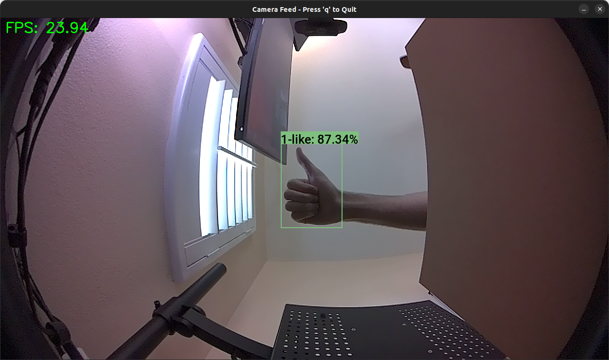
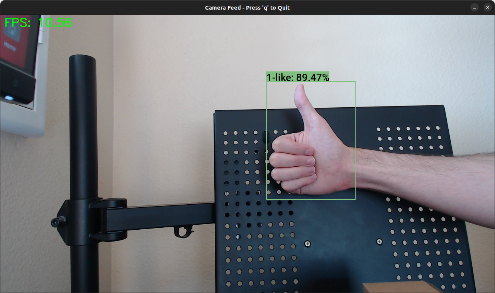

::: {.callout-tip}
## This post is part of the following series:
* [**Training YOLOX Models for Real-Time Object Detection in PyTorch**](/series/tutorials/pytorch-train-object-detector-yolox-series.html)
:::


* [Introduction](#introduction)
* [Prerequisites](#prerequisites)
* [Setting Up a Python Environment](#setting-up-a-python-environment)
* [Getting Started with the Code](#getting-started-with-the-code)
* [Importing the Required Dependencies](#importing-the-required-dependencies)
* [Defining Utility Functions](#defining-utility-functions)  
* [Setting Up the Project](#setting-up-the-project)  
* [Loading the Checkpoint Data](#loading-the-checkpoint-data)  
* [Create an Inference Session](#create-an-inference-session)
* [Tracking Objects in a Camera Feed](#tracking-objects-in-a-camera-feed)  
* [Conclusion](#conclusion)


## Introduction

Welcome back to this series on real-time object detection with YOLOX. So far, this series has covered how to:

- Finetune a YOLOX model in PyTorch to detect hand signs.
- Export the finetuned model to ONNX.
- Use the ByteTrack object tracker to track objects across video frames.
- Quantize the model with ONNX Runtime and TensorRT for int8 inference on NVIDIA hardware.

This post builds on those past tutorials by walking through deploying our model on an NVIDIA [Jetson Orin Nano](https://developer.nvidia.com/embedded/learn/get-started-jetson-orin-nano-devkit) developer kit to perform real-time object tracking from a camera feed. Additionally, we will use ONNX Runtime's TensoRT execution provider to leverage the Jetson's Tensor Cores.

Released in 2023, the Jetson Orin Nano is NVIDIA's entry-level single-board computer and offers a balance of performance and power efficiency for edge AI applications. Its compact form factor and robust inference capabilities make it a suitable platform for deploying real-time object-tracking systems in various scenarios, from human-computer interaction to industrial automation. 

Whether you're working with the pre-trained hand-sign detection model used in this series or a custom model, real-time object tracking on the Jetson Orin Nano opens up many possibilities for edge applications.


## Prerequisites

This tutorial is for Jetson devices loaded with [Jetpack 6](https://developer.nvidia.com/embedded/jetpack-sdk-60). You can follow the official guide from NVIDIA to ensure your Jetson is ready.

- [Jetson Orin Nano Developer Kit Getting Started Guide](https://developer.nvidia.com/embedded/learn/get-started-jetson-orin-nano-devkit)

The code for this tutorial assumes the Jetson device has either a USB or [CSI](https://en.wikipedia.org/wiki/Camera_Serial_Interface) Camera attached. While a USB camera will work, a CSI Camera is preferable due to the improved frame rate and latency.

The Jetson Orin Nano devkit has 22-pin MIPI CSI camera connectors. If your CSI camera module uses a 15-pin connector, you will need a 15-pin to 22-pin adapter cable. You can order a pack of 3 on Amazon at the link below:

- [Arducam for Raspberry Pi Zero Camera Cable Set, 1.5" 2.87" 5.9" Ribbon Flex Extension Cables for Pi Zero&W, Pack of 3](https://www.amazon.com/Arducam-Raspberry-Camera-Ribbon-Extension/dp/B085RW9K13)


## Setting Up a Python Environment
With our Jetson device prepared, we can set up a Python environment to run the demo code.

### Install Mamba Package Manager
As with previous tutorials in this series, we will use the Mamba package manager to create and manage our Python environment.

Run the following bash commands on the Jetson to download the latest release, install  it, and relaunch the current bash shell to apply the relevant changes:

```bash
# Download the latest Miniforge3 installer for the current OS and architecture
wget "https://github.com/conda-forge/miniforge/releases/latest/download/Miniforge3-$(uname)-$(uname -m).sh"

# Run the Miniforge3 installer silently (-b flag for batch mode)
bash Miniforge3-$(uname)-$(uname -m).sh -b

# Initialize mamba for shell usage
~/miniforge3/bin/mamba init

# Restart the shell to apply changes
bash
```


### Create a Python Environment
Next, we will create and activate a Python 3.10 environment.

```bash
mamba create --name object-tracking-env python=3.10 -y
mamba activate object-tracking-env
```


### Install OpenCV Dependencies
As with the [earlier object-tracking tutorial](../byte-track/), we will use the [`opencv-python`](https://pypi.org/project/opencv-python/) package to obtain input for our model. Since we are on a Jetson, we must build the package with support for USB and CSI Camera input enabled.

To do that, we must install some dependencies:


::: {.callout-note title="Package Descriptions:" collapse="true"}

| Package                          | Description                                                |
| -------------------------------- | ---------------------------------------------------------- |
| libgstreamer1.0-dev              | Development files for the GStreamer multimedia framework   |
| libgstreamer-plugins-base1.0-dev | Development files for GStreamer plugins (base)             |
| libgstreamer-plugins-bad1.0-dev  | Development files for GStreamer plugins (bad)              |
| gstreamer1.0-plugins-base        | GStreamer plugins from the "base" set                      |
| gstreamer1.0-plugins-good        | GStreamer plugins from the "good" set                      |
| gstreamer1.0-plugins-bad         | GStreamer plugins from the "bad" set                       |
| gstreamer1.0-plugins-ugly        | GStreamer plugins from the "ugly" set                      |
| gstreamer1.0-libav               | LibAV plugin for GStreamer                                 |
| gstreamer1.0-tools               | Tools for GStreamer                                        |
| gstreamer1.0-x                   | GStreamer plugins for X11                                  |
| gstreamer1.0-alsa                | GStreamer plugin for ALSA                                  |
| gstreamer1.0-gl                  | GStreamer plugins for GL                                   |
| gstreamer1.0-gtk3                | GStreamer plugin for GTK+3                                 |
| gstreamer1.0-qt5                 | GStreamer plugins for Qt5                                  |
| gstreamer1.0-pulseaudio          | GStreamer plugin for PulseAudio                            |
| libgtk2.0-dev                    | Development files for the GTK+ library                     |
| pkg-config                       | Manage compile and link flags for libraries                |
| libavcodec-dev                   | Development files for libavcodec (FFmpeg)                  |
| libavformat-dev                  | Development files for libavformat (FFmpeg)                 |
| libswscale-dev                   | Development files for libswscale (FFmpeg)                  |
| python3-dev                      | Header files and a static library for Python3              |
| python3-numpy                    | NumPy library for Python3                                  |
| libtbb2                          | Threading Building Blocks (TBB) library                    |
| libtbb-dev                       | Threading Building Blocks (TBB) development files          |
| libjpeg-dev                      | Development files for the JPEG library                     |
| libpng-dev                       | Development files for the PNG library                      |
| libtiff-dev                      | Development files for the TIFF library                     |
| libdc1394-22-dev                 | Development files for libdc1394 (IEEE 1394 camera control) |
| libv4l-dev                       | Development files for libv4l (video4linux)                 |
| v4l-utils                        | Collection of command line video4linux utilities           |
| libcanberra-gtk-module           | GTK+ module for the libcanberra sound library              |
| libcanberra-gtk3-module          | GTK+3 module for the libcanberra sound library             |

:::

```bash
sudo apt-get update
sudo apt-get install -y \
	build-essential cmake git \
    libgstreamer1.0-dev libgstreamer-plugins-base1.0-dev libgstreamer-plugins-bad1.0-dev \
    gstreamer1.0-plugins-base gstreamer1.0-plugins-good gstreamer1.0-plugins-bad gstreamer1.0-plugins-ugly \
    gstreamer1.0-libav gstreamer1.0-tools gstreamer1.0-x gstreamer1.0-alsa gstreamer1.0-gl \
    gstreamer1.0-gtk3 gstreamer1.0-qt5 gstreamer1.0-pulseaudio \
    libgtk2.0-dev pkg-config libavcodec-dev libavformat-dev libswscale-dev \
    python3-dev python3-numpy \
    libtbb2 libtbb-dev libjpeg-dev libpng-dev libtiff-dev \
    libdc1394-22-dev \
    libv4l-dev v4l-utils \
    libcanberra-gtk-module libcanberra-gtk3-module
```


### Build `opencv-python` Pip Wheel

With the dependencies installed, we can clone the `opencv-python` GitHub repository and build and install the Python wheel.

::: {.callout-note}

This process will also install NumPy.

:::

```bash
# Clone the opencv-python repository with all its submodules
git clone --recursive https://github.com/opencv/opencv-python.git

# Change directory to the cloned repository
cd opencv-python

# Add the current directory to Git's safe.directory list to avoid ownership issues
git config --global --add safe.directory $(pwd)

# Set CMAKE_ARGS environment variable with OpenCV build options
export CMAKE_ARGS="-D WITH_GSTREAMER=ON -D WITH_GTK=ON -D WITH_V4L=ON -D WITH_LIBV4L=ON -D WITH_OPENGL=ON"

# Set MAKEFLAGS to use all available CPU cores for compilation
export MAKEFLAGS="-j$(nproc)"

# Upgrade pip and install/upgrade the wheel package
pip install --upgrade pip wheel

# Build the OpenCV Python wheel
pip wheel . --verbose

# Install the built OpenCV Python wheel
pip install opencv_python*.whl

# Move back to the parent directory
cd ..

# Check if OpenCV was built with GStreamer support by printing build information and filtering for GStreamer
python -c "import cv2; print(cv2.getBuildInformation())" | grep "GStreamer"
```

```text
    GStreamer:                   YES (1.20.3)
```


::: {.callout-note}

The final print statement verifies that we successfully built OpenCV with GStreamer support, which we need for using CSI Cameras.

:::


### Install ONNX Runtime

Next, we will install ONNX Runtime to use its TensorRT Execution Provider. The [previous tutorial](../ort-tensorrt-ubuntu/) that utilized this execution provider used the dedicated [tensorrt pip package](https://pypi.org/project/tensorrt/). This time, we will use the version of TensorRT that comes with Jetpack 6. 

According to NVIDIA's [release page](https://developer.nvidia.com/embedded/jetpack-sdk-60) for Jetpack 6, it comes with CUDA 12.2 and TensorRT 8.6.

Looking at ONNX Runtime's [documentation](https://onnxruntime.ai/docs/execution-providers/TensorRT-ExecutionProvider.html#requirements), we can see that we need ONNX Runtime 1.17 for those versions of CUDA and TensorRT.

We can download a pre-built Python 3.10 wheel for ONNX Runtime 1.17 from the webpage linked below:

- [Jetson Zoo: ONNX Runtime](https://elinux.org/Jetson_Zoo#ONNX_Runtime)

Run the following commands to download and install the required Python wheel:

```bash
wget https://nvidia.box.com/shared/static/i7n40ki3pl2x57vyn4u7e9asyiqlnl7n.whl -O onnxruntime_gpu-1.17.0-cp310-cp310-linux_aarch64.whl
pip install onnxruntime_gpu-1.17.0-cp310-cp310-linux_aarch64.whl
```


### Install Additional Dependencies

To wrap up our environment setup, we will install a few additional dependencies for our demo project and downgrade NumPy to a version supported by ONNX Runtime.

```bash
pip install -U "numpy<2"
pip install jupyter cjm_psl_utils cjm_pil_utils cjm_byte_track
```


With our environment set up, we can dive into the code. 


## Getting Started with the Code

This tutorial walks through the demo as a Jupyter Notebook, but the code is also available as a Python script.

| Jupyter Notebook                                             | Python Script                                                |
| ------------------------------------------------------------ | ------------------------------------------------------------ |
| [yolox-ort-trt-bytetrack-jetson.ipynb](https://github.com/cj-mills/pytorch-yolox-object-detection-tutorial-code/blob/main/notebooks/yolox-ort-trt-bytetrack-jetson.ipynb) | [scripts/yolox-ort-tensorrt-byte-track.py](https://github.com/cj-mills/pytorch-yolox-object-detection-tutorial-code/blob/main/scripts/yolox-ort-tensorrt-byte-track.py) |


## Importing the Required Dependencies

First, we will import the necessary Python packages.


```python
# Standard library imports
import json  # For JSON data handling
from pathlib import Path  # For file path operations
import time  # For time-related functions
import threading  # For multi-threading support
from typing import List  # For type hinting
import queue  # For queue data structure

# ByteTrack package for object tracking
from cjm_byte_track.core import BYTETracker
from cjm_byte_track.matching import match_detections_with_tracks

# Utility functions
from cjm_psl_utils.core import download_file  # For downloading files
from cjm_pil_utils.core import resize_img  # For resizing images

# OpenCV for computer vision tasks
import cv2

# NumPy for numerical operations
import numpy as np

# PIL (Python Imaging Library) for image processing
from PIL import Image, ImageDraw, ImageFont

# ONNX (Open Neural Network Exchange) for machine learning interoperability
import onnxruntime as ort  # ONNX Runtime for model inference
```


## Defining Utility Functions

Next, we will define some utility functions for our demo, starting with those needed for performing inference with our YOLOX ONNX model.

### Define Functions for YOLOX Inference

These steps remain unchanged from [previous tutorials](../byte-track/#defining-utility-functions).

```python
def prepare_image_for_inference(frame:np.ndarray, target_sz:int, max_stride:int):

    """
    Prepares an image for inference by performing a series of preprocessing steps.
    
    Steps:
    1. Converts a BGR image to RGB.
    2. Resizes the image to a target size without cropping, considering a given divisor.
    3. Calculates input dimensions as multiples of the max stride.
    4. Calculates offsets based on the resized image dimensions and input dimensions.
    5. Computes the scale between the original and resized image.
    6. Crops the resized image based on calculated input dimensions.
    
    Parameters:
    - frame (numpy.ndarray): The input image in BGR format.
    - target_sz (int): The target minimum size for resizing the image.
    - max_stride (int): The maximum stride to be considered for calculating input dimensions.
    
    Returns:
    tuple: 
    - rgb_img (PIL.Image): The converted RGB image.
    - input_dims (list of int): Dimensions of the image that are multiples of max_stride.
    - offsets (numpy.ndarray): Offsets from the resized image dimensions to the input dimensions.
    - min_img_scale (float): Scale factor between the original and resized image.
    - input_img (PIL.Image): Cropped image based on the calculated input dimensions.
    """

    # Convert the BGR image to RGB
    rgb_img = Image.fromarray(cv2.cvtColor(frame, cv2.COLOR_BGR2RGB))
    # Resize image without cropping to multiple of the max stride
    resized_img = resize_img(rgb_img, target_sz=target_sz, divisor=1)
    
    # Calculating the input dimensions that multiples of the max stride
    input_dims = [dim - dim % max_stride for dim in resized_img.size]
    # Calculate the offsets from the resized image dimensions to the input dimensions
    offsets = (np.array(resized_img.size) - input_dims) / 2
    # Calculate the scale between the source image and the resized image
    min_img_scale = min(rgb_img.size) / min(resized_img.size)
    
    # Crop the resized image to the input dimensions
    input_img = resized_img.crop(box=[*offsets, *resized_img.size - offsets])
    
    return rgb_img, input_dims, offsets, min_img_scale, input_img
```


```python
def generate_output_grids_np(height, width, strides=[8,16,32]):
    """
    Generate a numpy array containing grid coordinates and strides for a given height and width.

    Args:
        height (int): The height of the image.
        width (int): The width of the image.

    Returns:
        np.ndarray: A numpy array containing grid coordinates and strides.
    """

    all_coordinates = []

    for stride in strides:
        # Calculate the grid height and width
        grid_height = height // stride
        grid_width = width // stride

        # Generate grid coordinates
        g1, g0 = np.meshgrid(np.arange(grid_height), np.arange(grid_width), indexing='ij')

        # Create an array of strides
        s = np.full((grid_height, grid_width), stride)

        # Stack the coordinates along with the stride
        coordinates = np.stack((g0.flatten(), g1.flatten(), s.flatten()), axis=-1)

        # Append to the list
        all_coordinates.append(coordinates)

    # Concatenate all arrays in the list along the first dimension
    output_grids = np.concatenate(all_coordinates, axis=0)

    return output_grids
```


```python
def calculate_boxes_and_probs(model_output:np.ndarray, output_grids:np.ndarray) -> np.ndarray:
    """
    Calculate the bounding boxes and their probabilities.

    Parameters:
    model_output (numpy.ndarray): The output of the model.
    output_grids (numpy.ndarray): The output grids.

    Returns:
    numpy.ndarray: The array containing the bounding box coordinates, class labels, and maximum probabilities.
    """
    # Calculate the bounding box coordinates
    box_centroids = (model_output[..., :2] + output_grids[..., :2]) * output_grids[..., 2:]
    box_sizes = np.exp(model_output[..., 2:4]) * output_grids[..., 2:]

    x0, y0 = [t.squeeze(axis=2) for t in np.split(box_centroids - box_sizes / 2, 2, axis=2)]
    w, h = [t.squeeze(axis=2) for t in np.split(box_sizes, 2, axis=2)]

    # Calculate the probabilities for each class
    box_objectness = model_output[..., 4]
    box_cls_scores = model_output[..., 5:]
    box_probs = np.expand_dims(box_objectness, -1) * box_cls_scores

    # Get the maximum probability and corresponding class for each proposal
    max_probs = np.max(box_probs, axis=-1)
    labels = np.argmax(box_probs, axis=-1)

    return np.array([x0, y0, w, h, labels, max_probs]).transpose((1, 2, 0))
```


```python
def process_outputs(outputs:np.ndarray, input_dims:tuple, bbox_conf_thresh:float):

    """
    Process the model outputs to generate bounding box proposals filtered by confidence threshold.
    
    Parameters:
    - outputs (numpy.ndarray): The raw output from the model, which will be processed to calculate boxes and probabilities.
    - input_dims (tuple of int): Dimensions (height, width) of the input image to the model.
    - bbox_conf_thresh (float): Threshold for the bounding box confidence/probability. Bounding boxes with a confidence
                                score below this threshold will be discarded.
    
    Returns:
    - numpy.array: An array of proposals where each proposal is an array containing bounding box coordinates
                   and its associated probability, sorted in descending order by probability.
    """

    # Process the model output
    outputs = calculate_boxes_and_probs(outputs, generate_output_grids_np(*input_dims))
    # Filter the proposals based on the confidence threshold
    max_probs = outputs[:, :, -1]
    mask = max_probs > bbox_conf_thresh
    proposals = outputs[mask]
    # Sort the proposals by probability in descending order
    proposals = proposals[proposals[..., -1].argsort()][::-1]
    return proposals
```


```python
def calc_iou(proposals:np.ndarray) -> np.ndarray:
    """
    Calculates the Intersection over Union (IoU) for all pairs of bounding boxes (x,y,w,h) in 'proposals'.

    The IoU is a measure of overlap between two bounding boxes. It is calculated as the area of
    intersection divided by the area of union of the two boxes.

    Parameters:
    proposals (2D np.array): A NumPy array of bounding boxes, where each box is an array [x, y, width, height].

    Returns:
    iou (2D np.array): The IoU matrix where each element i,j represents the IoU of boxes i and j.
    """

    # Calculate coordinates for the intersection rectangles
    x1 = np.maximum(proposals[:, 0], proposals[:, 0][:, None])
    y1 = np.maximum(proposals[:, 1], proposals[:, 1][:, None])
    x2 = np.minimum(proposals[:, 0] + proposals[:, 2], (proposals[:, 0] + proposals[:, 2])[:, None])
    y2 = np.minimum(proposals[:, 1] + proposals[:, 3], (proposals[:, 1] + proposals[:, 3])[:, None])
    
    # Calculate intersection areas
    intersections = np.maximum(x2 - x1, 0) * np.maximum(y2 - y1, 0)

    # Calculate union areas
    areas = proposals[:, 2] * proposals[:, 3]
    unions = areas[:, None] + areas - intersections

    # Calculate IoUs
    iou = intersections / unions

    # Return the iou matrix
    return iou
```


```python
def nms_sorted_boxes(iou:np.ndarray, iou_thresh:float=0.45) -> np.ndarray:
    """
    Applies non-maximum suppression (NMS) to sorted bounding boxes.

    It suppresses boxes that have high overlap (as defined by the IoU threshold) with a box that 
    has a higher score.

    Parameters:
    iou (np.ndarray): An IoU matrix where each element i,j represents the IoU of boxes i and j.
    iou_thresh (float): The IoU threshold for suppression. Boxes with IoU > iou_thresh are suppressed.

    Returns:
    keep (np.ndarray): The indices of the boxes to keep after applying NMS.
    """

    # Create a boolean mask to keep track of boxes
    mask = np.ones(iou.shape[0], dtype=bool)

    # Apply non-max suppression
    for i in range(iou.shape[0]):
        if mask[i]:
            # Suppress boxes with higher index and IoU > threshold
            mask[(iou[i] > iou_thresh) & (np.arange(iou.shape[0]) > i)] = False

    # Return the indices of the boxes to keep
    return np.arange(iou.shape[0])[mask]
```


```python
def draw_bboxes_pil(image, boxes, labels, colors, font, width=2, font_size=18, probs=None):
    """
    Annotates an image with bounding boxes, labels, and optional probability scores.

    Parameters:
    - image (PIL.Image): The input image on which annotations will be drawn.
    - boxes (list of tuples): A list of bounding box coordinates where each tuple is (x, y, w, h).
    - labels (list of str): A list of labels corresponding to each bounding box.
    - colors (list of str): A list of colors for each bounding box and its corresponding label.
    - font (str): Path to the font file to be used for displaying the labels.
    - width (int, optional): Width of the bounding box lines. Defaults to 2.
    - font_size (int, optional): Size of the font for the labels. Defaults to 18.
    - probs (list of float, optional): A list of probability scores corresponding to each label. Defaults to None.

    Returns:
    - annotated_image (PIL.Image): The image annotated with bounding boxes, labels, and optional probability scores.
    """
    
    # Define a reference diagonal
    REFERENCE_DIAGONAL = 1000
    
    # Scale the font size using the hypotenuse of the image
    font_size = int(font_size * (np.hypot(*image.size) / REFERENCE_DIAGONAL))
    
    # Add probability scores to labels if provided
    if probs is not None:
        labels = [f"{label}: {prob*100:.2f}%" for label, prob in zip(labels, probs)]

    # Create an ImageDraw object for drawing on the image
    draw = ImageDraw.Draw(image)

    # Load the font file (outside the loop)
    fnt = ImageFont.truetype(font, font_size)
    
    # Compute the mean color value for each color
    mean_colors = [np.mean(np.array(color)) for color in colors]

    # Loop through the bounding boxes, labels, and colors
    for box, label, color, mean_color in zip(boxes, labels, colors, mean_colors):
        # Get the bounding box coordinates
        x, y, w, h = box

        # Draw the bounding box on the image
        draw.rectangle([x, y, x+w, y+h], outline=color, width=width)
        
        # Get the size of the label text box
        label_w, label_h = draw.textbbox(xy=(0,0), text=label, font=fnt)[2:]
        
        # Draw the label rectangle on the image
        draw.rectangle([x, y-label_h, x+label_w, y], outline=color, fill=color)

        # Draw the label text on the image
        font_color = 'black' if mean_color > 127.5 else 'white'
        draw.multiline_text((x, y-label_h), label, font=fnt, fill=font_color)
        
    return image
```


### Define a Function to Generate a GStreamer Pipeline

Next, we will define a function to generate a GStreamer pipeline string for OpenCV. We need this to get input from a CSI camera. 

The code is a lightly modified version of the [implementation](https://github.com/JetsonHacksNano/CSI-Camera/blob/e11a0fa1f68519166e1627c5277c6dfda29f9d2f/simple_camera.py#L17) in the following JetsonHacks repository.

- [CSI-Camera](https://github.com/JetsonHacksNano/CSI-Camera/tree/master)


```python
def gstreamer_pipeline(
    sensor_id=0,
    capture_width=1920,
    capture_height=1080,
    display_width=960,
    display_height=540,
    framerate=30,
    flip_method=0,
):
    """
    Generate a GStreamer pipeline string for capturing and processing video from a camera.

    This function creates a pipeline that captures video from an NVIDIA Argus camera,
    performs necessary conversions, and prepares the video for display or further processing.

    Args:
        sensor_id (int): The ID of the camera sensor to use (default: 0).
        capture_width (int): The width of the captured video in pixels (default: 1920).
        capture_height (int): The height of the captured video in pixels (default: 1080).
        display_width (int): The width of the displayed/processed video in pixels (default: 960).
        display_height (int): The height of the displayed/processed video in pixels (default: 540).
        framerate (int): The desired framerate of the video capture (default: 30).
        flip_method (int): The method used to flip the image, if needed (default: 0, no flip).

    Returns:
        str: A GStreamer pipeline string that can be used with GStreamer-based applications.
    """
    return (
        # Start with nvarguscamerasrc to capture from NVIDIA Argus camera
        f"nvarguscamerasrc sensor-id={sensor_id} ! "
        # Set the captured video format and properties
        f"video/x-raw(memory:NVMM), width=(int){capture_width}, height=(int){capture_height}, framerate=(fraction){framerate}/1 ! "
        # Use nvvidconv to convert the video and potentially flip the image
        f"nvvidconv flip-method={flip_method} ! "
        # Set the display/processing video format and properties
        f"video/x-raw, width=(int){display_width}, height=(int){display_height}, format=(string)BGRx ! "
        # Convert the video color format
        f"videoconvert ! "
        # Set the final video format to BGR for compatibility with OpenCV
        f"video/x-raw, format=(string)BGR ! appsink"
    )
```

### Define a Wrapper Class for Reading Camera Frames

When testing the demo using OpenCV's `VideoCapture` class directly, I noticed a delay between the input to the camera (e.g., me waving my hand) and what showed on the preview window. 

This lag only occurred when performing inference, and the delay increased at higher framerates. It was as if there were a frame queue that built up faster than the Jetson could process.

This effect is not necessarily a problem, depending on the application. However, I found it annoying, so I used the following solution to get around it. It is essentially a wrapper for the `VideoCapture` class that helps ensure we only work with the most recent frame from the camera.


```python
class FrameDropper:
    """
    A class for efficiently reading frames from a video capture device,
    dropping frames if necessary to maintain real-time processing.
    """

    def __init__(self, cv2_capture: cv2.VideoCapture, queue_size=1):
        """
        Initialize the FrameDropper.

        Args:
            cv2_capture (cv2.VideoCapture): The video capture object.
            queue_size (int): Maximum number of frames to keep in the queue.
        """
        # Store the video capture object
        self.cap = cv2_capture
        
        # Create a queue to store frames with a maximum size
        self.q = queue.Queue(maxsize=queue_size)
        
        # Create an event to signal when to stop the thread
        self.stop_flag = threading.Event()
        
        # Create a separate thread for reading frames
        self.thread = threading.Thread(target=self._reader)
        
        # Set the thread as a daemon, so it will automatically close when the main program exits
        self.thread.daemon = True
        
        # Start the thread
        self.thread.start()

    def _reader(self):
        """
        Continuously read frames from the video capture device and manage the frame queue.
        Runs in a separate thread.
        """
        while not self.stop_flag.is_set():  # Continue until the stop flag is set
            # Read a frame from the video capture device
            ret, frame = self.cap.read()
            
            if not ret:  # If reading the frame failed, exit the loop
                break
            
            if not self.q.full():  # If the queue is not full
                self.q.put(frame)  # Add the frame to the queue
            else:
                try:
                    # If the queue is full, try to remove the oldest frame
                    self.q.get_nowait()
                except queue.Empty:
                    # If the queue is empty (unlikely, but possible due to race conditions)
                    pass
                # Add the new frame to the queue
                self.q.put(frame)

    def read(self):
        """
        Read a frame from the queue.

        Returns:
            tuple: (True, frame) where frame is the next available frame.
        """
        # Get the next frame from the queue and return it
        # The 'True' indicates that a frame was successfully read
        return True, self.q.get()

    def release(self):
        """
        Stop the reading thread and release the video capture resources.
        """
        # Set the stop flag to signal the thread to stop
        self.stop_flag.set()
        
        # Release the video capture object
        self.cap.release()
        
        # Wait for the thread to finish
        self.thread.join()
```

1. The class employs threading to read frames in the background, enhancing processing efficiency.
2. The class utilizes the [queue](https://docs.python.org/3/library/queue.html) module to manage frames safely across threads.
3. A separate thread executes the `_reader` method, which continuously reads frames and manages the queue.
4. When the queue reaches capacity, the class discards the oldest frame to accommodate the newest one. This approach ensures the availability of the most recent frame for processing.
5. The main video processing loop accesses frames from the queue through the `read` method.
6. The release method stops the thread and frees up resources once the program finishes with video capture.


That takes care of the utility code.


## Setting Up the Project

Next, we will set the folder locations for our project and the directory with the ONNX model, JSON  colormap file, and the [calibration data](../ort-tensorrt-ubuntu/#inspect-tensorrt-cache-folder) used by TensorRT to [quantize the model](../ort-tensorrt-ubuntu/#quantization-process). 

### Set the Directory Paths


```python
# The name for the project
project_name = f"pytorch-yolox-object-detector"

# The path for the project folder
project_dir = Path(f"./{project_name}/")

# Create the project directory if it does not already exist
project_dir.mkdir(parents=True, exist_ok=True)

# The path to the checkpoint folder
checkpoint_folder = "2024-02-17_11-08-46"
checkpoint_dir = Path(project_dir/checkpoint_folder)
```


::: {.callout-tip title="Sample Files:"}

* I made an ONNX model available on Hugging Face Hub with a colormap file and a `trt_engine_cache` folder in the repository linked below:
  * [cj-mills/yolox-hagrid-onnx](https://huggingface.co/cj-mills/yolox-hagrid-onnx/tree/main)


:::


### Download a Font File

We should also ensure we have a font file for annotating images.


```python
# Set the name of the font file
font_file = 'KFOlCnqEu92Fr1MmEU9vAw.ttf'

# Download the font file
download_file(f"https://fonts.gstatic.com/s/roboto/v30/{font_file}", "./")
```


## Loading the Checkpoint Data

Next, we will load the colormap and set the max stride value for processing model output.

### Load the Colormap


```python
# The colormap path
colormap_path = list(checkpoint_dir.glob('*colormap.json'))[0]

# Load the JSON colormap data
with open(colormap_path, 'r') as file:
        colormap_json = json.load(file)

# Convert the JSON data to a dictionary        
colormap_dict = {item['label']: item['color'] for item in colormap_json['items']}

# Extract the class names from the colormap
class_names = list(colormap_dict.keys())

# Make a copy of the colormap in integer format
int_colors = [tuple(int(c*255) for c in color) for color in colormap_dict.values()]
```

### Set the Preprocessing and Post-Processing Parameters


```python
max_stride = 32
input_dim_slice = slice(2, 4, None)
```


## Create an Inference Session

Now, we can create an inference session using the TensorRT execution provider. 

::: {.callout-warning}

The following code assumes the [`trt_engine_cache`](../ort-tensorrt-ubuntu/#inspect-tensorrt-cache-folder) folder is in the same directory as the ONNX model.

:::


```python
# Get the filename for the ONNX model
# Assumes there's only one .onnx file in the checkpoint directory
onnx_file_path = list(checkpoint_dir.glob('*.onnx'))[0]

# Set up a directory for TensorRT engine cache
trt_cache_dir = checkpoint_dir / 'trt_engine_cache'

# Initialize ONNX Runtime session options
sess_opt = ort.SessionOptions()
# Disable memory optimizations to potentially improve performance
sess_opt.enable_cpu_mem_arena = False
sess_opt.enable_mem_pattern = False
sess_opt.enable_mem_reuse = False
# Set execution mode to sequential for predictable behavior
sess_opt.execution_mode = ort.ExecutionMode.ORT_SEQUENTIAL
# Enable all graph optimizations
sess_opt.graph_optimization_level = ort.GraphOptimizationLevel.ORT_ENABLE_ALL

# Configure TensorRT Execution Provider settings
providers = [
    ('TensorrtExecutionProvider', {
        'device_id': 0,  # GPU device ID (0 for the first GPU)
        'trt_int8_enable': True,  # Enable INT8 precision mode
        'trt_engine_cache_enable': True,  # Enable caching of TensorRT engines
        'trt_engine_cache_path': str(trt_cache_dir),  # Path to store TensorRT cache
        'trt_int8_calibration_table_name': 'calibration.flatbuffers',  # INT8 calibration file
        'trt_max_workspace_size': 4e9,  # Maximum TensorRT workspace size (4GB)
        'trt_timing_cache_enable': True,  # Enable timing cache for faster engine building
        'trt_force_sequential_engine_build': True,  # Build engines sequentially
        'trt_dla_enable': False,  # Disable DLA (Deep Learning Accelerator)
        'trt_max_partition_iterations': 1000,  # Max iterations for partitioning
        'trt_min_subgraph_size': 1,  # Minimum subgraph size for TensorRT
    })
]

# Create an ONNX Runtime InferenceSession with the specified options and providers
session = ort.InferenceSession(onnx_file_path, sess_options=sess_opt, providers=providers)
```
```text
[0;93m2024-09-05 16:34:58.430807424 [W:onnxruntime:Default, tensorrt_execution_provider.h:83 log] [2024-09-05 23:34:58 WARNING] onnx2trt_utils.cpp:372: Your ONNX model has been generated with INT64 weights, while TensorRT does not natively support INT64. Attempting to cast down to INT32.[m
[0;93m2024-09-05 16:34:58.430935716 [W:onnxruntime:Default, tensorrt_execution_provider.h:83 log] [2024-09-05 23:34:58 WARNING] onnx2trt_utils.cpp:400: One or more weights outside the range of INT32 was clamped[m
[0;93m2024-09-05 16:34:58.472815780 [W:onnxruntime:Default, tensorrt_execution_provider.h:83 log] [2024-09-05 23:34:58 WARNING] onnx2trt_utils.cpp:372: Your ONNX model has been generated with INT64 weights, while TensorRT does not natively support INT64. Attempting to cast down to INT32.[m
[0;93m2024-09-05 16:34:58.472888966 [W:onnxruntime:Default, tensorrt_execution_provider.h:83 log] [2024-09-05 23:34:58 WARNING] onnx2trt_utils.cpp:400: One or more weights outside the range of INT32 was clamped[m
```


## Tracking Objects in a Camera Feed

Next, we will define the camera feed settings and the inference parameters. 

### Define Camera Feed Settings 


::: {.panel-tabset}

## CSI

```python
use_csi = True
sensor_id=0
flip_method = 0
framerate=60
capture_width=1280
capture_height=720
```

## USB

```python
use_csi = False
sensor_id=0
flip_method = 0
framerate=60
capture_width=1280
capture_height=720
```

:::

::: {.callout-warning}

If you have multiple camera devices attached to the Jetson (e.g., a USB camera and a CSI camera), set the correct `sensor_id` for the target device.

:::


### Define Inference Parameters


```python
test_sz = 384
bbox_conf_thresh = 0.35
iou_thresh = 0.45
```


### Build TensorRT Engine

The TensorRT build process can take several minutes on the Jetson, so we will use a random sample input to build the engine before starting the camera feed loop.


```python
%%time
# Create a sample input with the target dimensions 
test_img = Image.fromarray(np.random.randn(capture_height, capture_width, 3).astype(np.uint8))
resized_img = resize_img(test_img, test_sz)
input_tensor_np = np.array(resized_img, dtype=np.float32).transpose((2, 0, 1))[None]/255

# Perform a single inference run to build the TensorRT engine for the current input dimensions
session.run(None, {"input": input_tensor_np});
```
```text
2024-09-06 13:40:43.685287224 [W:onnxruntime:Default, tensorrt_execution_provider.cc:189 loadTimingCacheFile] [TensorRT EP] Could not read timing cache from: pytorch-yolox-object-detector/2024-02-17_11-08-46/trt_engine_cache/TensorrtExecutionProvider_cache_sm87.timing. A new timing cache will be generated and written.
2024-09-06 13:40:43.695805375 [W:onnxruntime:Default, tensorrt_execution_provider.h:83 log] [2024-09-06 20:40:43 WARNING] Calibrator is not being used. Users must provide dynamic range for all tensors that are not Int32 or Bool.
CPU times: user 7min 25s, sys: 20.8 s, total: 7min 46s
Wall time: 8min 10s
```


### Detect, Track, and Annotate Objects

At last, we can initialize our video capture and tracker objects and implement our video processing loop.

#### Overview

1. The following code sets up a video capture system, supporting either a CSI camera or a V4L2 camera based on the `use_csi` flag.
2. It creates a `FrameDropper` object to manage video capture.
3. The code initializes a `BYTETracker` for object tracking.
4. Inside a main processing loop, the system continuously:
   - Captures frames from the video feed
   - Prepares each frame for inference
   - Runs the ONNX model to detect objects
   - Processes the model outputs to generate object proposals
   - Applies non-max suppression to filter overlapping detections
   - Updates the tracker with new detections
   - Matches detections with existing tracks
   - Annotates the frame with bounding boxes and tracking IDs
   - Calculates and displays the current FPS
5. The code uses OpenCV to create a window and display the annotated frames in real-time.
6. It implements an exit mechanism, listening for a 'q' key press to stop the processing loop.
7. Finally, the code ensures proper resource cleanup by releasing the video capture and closing all windows when the program terminates.


```python
# Set up window title for display
window_title = "Camera Feed - Press 'q' to Quit"

# Configure camera source based on the 'use_csi' flag
if use_csi:
    # Use CSI camera with GStreamer pipeline
    src = gstreamer_pipeline(sensor_id=sensor_id,
                       display_width=capture_width,
                       display_height=capture_height,
                       flip_method=flip_method, 
                       capture_width=capture_width, 
                       capture_height=capture_height, 
                       framerate=framerate)
    cv2_capture = cv2.VideoCapture(src)
else:
    # Use V4L2 camera
    cv2_capture = cv2.VideoCapture(sensor_id, cv2.CAP_V4L2)
    cv2_capture.set(cv2.CAP_PROP_FRAME_WIDTH, capture_width)
    cv2_capture.set(cv2.CAP_PROP_FRAME_HEIGHT, capture_height)
    cv2_capture.set(cv2.CAP_PROP_FPS, framerate)

# Create a FrameDropper object to handle video capture
video_capture = FrameDropper(cv2_capture)

# Initialize the ByteTracker for object tracking
tracker = BYTETracker(track_thresh=0.25, track_buffer=30, match_thresh=0.8, frame_rate=30)

try:
    # Create a named window for displaying the video feed
    window_handle = cv2.namedWindow(window_title, cv2.WINDOW_AUTOSIZE)
    
    # Main processing loop
    while True:
        start_time = time.perf_counter()
        
        # Capture a frame from the video feed
        ret_val, frame = video_capture.read()
        
        if not ret_val:
            print("Failed to retrieve frame")
            continue
    
        # Prepare the input image for inference
        rgb_img, input_dims, offsets, min_img_scale, input_img = prepare_image_for_inference(frame, test_sz, max_stride)
        
        # Convert the input image to NumPy format for the model
        input_tensor_np = np.array(input_img, dtype=np.float32).transpose((2, 0, 1))[None]/255
                        
        # Run inference using the ONNX session
        outputs = session.run(None, {"input": input_tensor_np})[0]
    
        # Process the model output to get object proposals
        proposals = process_outputs(outputs, input_tensor_np.shape[input_dim_slice], bbox_conf_thresh)
        
        # Apply non-max suppression to filter overlapping proposals
        proposal_indices = nms_sorted_boxes(calc_iou(proposals[:, :-2]), iou_thresh)
        proposals = proposals[proposal_indices]
        
        # Extract bounding boxes, labels, and probabilities from proposals
        bbox_list = (proposals[:,:4]+[*offsets, 0, 0])*min_img_scale
        label_list = [class_names[int(idx)] for idx in proposals[:,4]]
        probs_list = proposals[:,5]

        # Initialize track IDs for detected objects
        track_ids = [-1]*len(bbox_list)

        # Convert bounding boxes to top-left bottom-right (tlbr) format
        tlbr_boxes = bbox_list.copy()
        tlbr_boxes[:, 2:4] += tlbr_boxes[:, :2]

        # Update tracker with detections
        tracks = tracker.update(
            output_results=np.concatenate([tlbr_boxes, probs_list[:, np.newaxis]], axis=1),
            img_info=rgb_img.size,
            img_size=rgb_img.size)

        if len(tlbr_boxes) > 0 and len(tracks) > 0:
            # Match detections with tracks
            track_ids = match_detections_with_tracks(tlbr_boxes=tlbr_boxes, track_ids=track_ids, tracks=tracks)
    
            # Filter object detections based on tracking results
            bbox_list, label_list, probs_list, track_ids = zip(*[(bbox, label, prob, track_id) 
                                                                for bbox, label, prob, track_id 
                                                                in zip(bbox_list, label_list, probs_list, track_ids) if track_id != -1])
            
            if len(bbox_list) > 0:
                # Annotate the current frame with bounding boxes and tracking IDs
                annotated_img = draw_bboxes_pil(
                    image=rgb_img, 
                    boxes=bbox_list, 
                    labels=[f"{track_id}-{label}" for track_id, label in zip(track_ids, label_list)],
                    probs=probs_list,
                    colors=[int_colors[class_names.index(i)] for i in label_list],  
                    font=font_file,
                )
                annotated_frame = cv2.cvtColor(np.array(annotated_img), cv2.COLOR_RGB2BGR)
        else:
            # If no detections, use the original frame
            annotated_frame = frame
    
        # Calculate and display FPS
        end_time = time.perf_counter()
        processing_time = end_time - start_time
        fps = 1 / processing_time
    
        fps_text = f"FPS: {fps:.2f}"
        cv2.putText(annotated_frame, fps_text, (10, 30), cv2.FONT_HERSHEY_SIMPLEX, 1, (0, 255, 0), 2)
        
        # Display the annotated frame
        cv2.imshow(window_title, annotated_frame)
        
        # Check for 'q' key press to exit the loop
        if cv2.waitKey(1) & 0xFF == ord('q'):
            break
finally:
    # Clean up resources
    video_capture.release()
    cv2.destroyAllWindows()
```


::: {.panel-tabset}


## CSI

```text
[ WARN:0@9.753] global cap_gstreamer.cpp:1777 open OpenCV | GStreamer warning: Cannot query video position: status=0, value=-1, duration=-1
Gtk-Message: 16:34:59.286: Failed to load module "canberra-gtk-module"
[0;93m2024-09-05 16:34:59.358765333 [W:onnxruntime:Default, tensorrt_execution_provider.h:83 log] [2024-09-05 23:34:59 WARNING] Using an engine plan file across different models of devices is not recommended and is likely to affect performance or even cause errors.[m


GST_ARGUS: Creating output stream
CONSUMER: Waiting until producer is connected...
GST_ARGUS: Available Sensor modes :
GST_ARGUS: 3280 x 2464 FR = 21.000000 fps Duration = 47619048 ; Analog Gain range min 1.000000, max 10.625000; Exposure Range min 13000, max 683709000;

GST_ARGUS: 3280 x 1848 FR = 28.000001 fps Duration = 35714284 ; Analog Gain range min 1.000000, max 10.625000; Exposure Range min 13000, max 683709000;

GST_ARGUS: 1920 x 1080 FR = 29.999999 fps Duration = 33333334 ; Analog Gain range min 1.000000, max 10.625000; Exposure Range min 13000, max 683709000;

GST_ARGUS: 1640 x 1232 FR = 29.999999 fps Duration = 33333334 ; Analog Gain range min 1.000000, max 10.625000; Exposure Range min 13000, max 683709000;

GST_ARGUS: 1280 x 720 FR = 59.999999 fps Duration = 16666667 ; Analog Gain range min 1.000000, max 10.625000; Exposure Range min 13000, max 683709000;

GST_ARGUS: Running with following settings:
   Camera index = 0 
   Camera mode  = 4 
   Output Stream W = 1280 H = 720 
   seconds to Run    = 0 
   Frame Rate = 59.999999 
GST_ARGUS: Setup Complete, Starting captures for 0 seconds
GST_ARGUS: Starting repeat capture requests.
CONSUMER: Producer has connected; continuing.
```


## USB

```text
Gtk-Message: 14:40:32.594: Failed to load module "canberra-gtk-module"
2024-09-05 14:40:33.129041923 [W:onnxruntime:Default, tensorrt_execution_provider.h:83 log] [2024-09-05 21:40:33 WARNING] Using an engine plan file across different models of devices is not recommended and is likely to affect performance or even cause errors.
```


:::


A new window should pop up displaying the camera feed. 


### Comparing Performance

As mentioned earlier, a CSI Camera is preferable due to the improved framerate and latency. We can see in the following screenshots just how significant the performance gap can be. 


::: {.panel-tabset}


## CSI (≈24fps)




## USB (≈11fps)




:::


The USB camera also introduces a slight but noticeable delay in the camera input.


## Conclusion

Congratulations on reaching the end of this tutorial. You've successfully learned to deploy a YOLOX object detection model on an NVIDIA Jetson Orin Nano for real-time object tracking from a camera feed. This tutorial covered several aspects:

1. Setting up a Python environment on the Jetson Orin Nano with the necessary dependencies
2. Loading and preparing a pre-trained YOLOX model for inference
3. Configuring ONNX Runtime with the TensorRT execution provider for optimized inference
4. Implementing frame capture and processing
5. Integrating the ByteTrack algorithm for object tracking
6. Creating a real-time video processing pipeline that detects, tracks, and annotates objects

This project provides a foundation for numerous real-world applications.

Some potential next steps to consider:

1. Experiment with different model architectures or custom-trained models for other use cases
2. Implement additional features like object counting or trajectory analysis
3. Explore ways to stream the processed video over a network for remote monitoring






