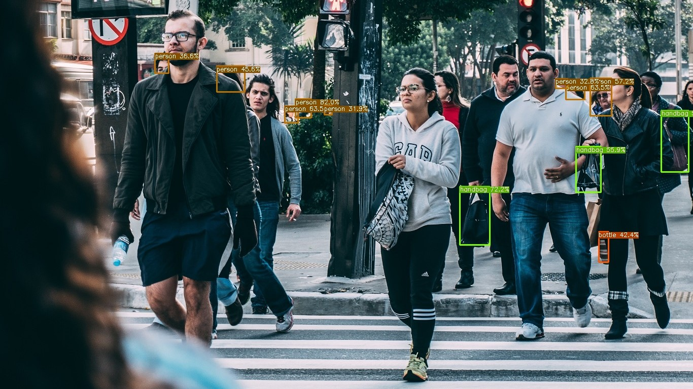

::: {.callout-tip}
## This post is part of the following series:
* [**Training YOLOX Models for Real-Time Object Detection in PyTorch**](/series/tutorials/pytorch-train-object-detector-yolox-series.html)
:::


* [Introduction](#introduction)
* [Getting Started with the Code](#getting-started-with-the-code)
* [Setting Up Your Python Environment](#setting-up-your-python-environment)
* [Importing the Required Dependencies](#importing-the-required-dependencies)
* [Setting Up the Project](#setting-up-the-project)
* [Loading the Checkpoint Data](#loading-the-checkpoint-data)
* [Exporting the Model to ONNX](#exporting-the-model-to-onnx)
* [Performing Inference with ONNX Runtime](#performing-inference-with-onnx-runtime)
* [Conclusion](#conclusion)


## Introduction

Welcome back to this series on training YOLOX models for real-time applications! [Previously](../), we demonstrated how to fine-tune a YOLOX model in PyTorch by creating a hand gesture detector. This tutorial builds on that by showing how to export the model to [ONNX](https://onnx.ai/) and perform inference using [ONNX Runtime](https://onnxruntime.ai/docs/). 

ONNX (Open Neural Network Exchange) is an open format to represent machine learning models and make them portable across various platforms. ONNX Runtime is a cross-platform inference accelerator that provides interfaces to hardware-specific libraries. By exporting our model to ONNX, we can deploy it to multiple devices and leverage hardware acceleration for faster inference. When it comes to real-time applications, even minor speedups have a noticeable impact.

Additionally, we'll implement the functionality to handle post-processing and draw bounding boxes without relying on PyTorch as a dependency. By the end of this tutorial, you will have an ONNX version of our YOLOX model that you can deploy to servers and edge devices using ONNX Runtime.


::: {.callout-important title="This post assumes the reader has completed the previous tutorial linked below:"}
* [Training YOLOX Models for Real-Time Object Detection in PyTorch](../)
:::


## Getting Started with the Code

As with the previous tutorial, the code is available as a Jupyter Notebook.

| Jupyter Notebook                                             | Google Colab                                                 |
| ------------------------------------------------------------ | ------------------------------------------------------------ |
| [GitHub Repository](https://github.com/cj-mills/pytorch-yolox-object-detection-tutorial-code/blob/main/notebooks/pytorch-yolox-object-detector-onnx-export.ipynb) | [Open In Colab](https://colab.research.google.com/github/cj-mills/pytorch-yolox-object-detection-tutorial-code/blob/main/notebooks/pytorch-yolox-object-detector-onnx-export-colab.ipynb) |


## Setting Up Your Python Environment

We'll need to add a few new libraries to our [Python environment](../#setting-up-your-python-environment) for working with ONNX models.

::: {.callout-note title="Package Descriptions" collapse="true"}

| Package           | Description                                                  |
| ----------------- | ------------------------------------------------------------ |
| `onnx`            | This package provides a Python API for working with ONNX models. ([link](https://pypi.org/project/onnx/)) |
| `onnxruntime`     | ONNX Runtime is a runtime accelerator for machine learning models. ([link](https://onnxruntime.ai/)) |
| `onnx-simplifier` | This package helps simplify ONNX models. ([link](https://pypi.org/project/onnx-simplifier/)) |

:::

Run the following command to install these additional libraries:

```bash
# Install ONNX packages
pip install onnx onnxruntime onnx-simplifier
```


## Importing the Required Dependencies

With our environment updated, we can dive into the code. First, we will import the necessary Python dependencies into our Jupyter Notebook.


```python
# Import Python Standard Library dependencies
import json
from pathlib import Path
import random

# Import utility functions
from cjm_psl_utils.core import download_file
from cjm_pil_utils.core import resize_img

# Import YOLOX package
from cjm_yolox_pytorch.model import build_model
from cjm_yolox_pytorch.inference import YOLOXInferenceWrapper

# Import numpy
import numpy as np

# Import the pandas package
import pandas as pd

# Import PIL for image manipulation
from PIL import Image, ImageDraw, ImageFont

# Import PyTorch dependencies
import torch

# Import ONNX dependencies
import onnx # Import the onnx module
from onnxsim import simplify # Import the method to simplify ONNX models
import onnxruntime as ort # Import the ONNX Runtime
```


## Setting Up the Project

In this section, we'll set the folder locations for our project and training session with the PyTorch checkpoint. Let's also ensure we have a font file for annotating images.

### Set the Directory Paths


```python
# The name for the project
project_name = f"pytorch-yolox-object-detector"

# The path for the project folder
project_dir = Path(f"./{project_name}/")

# Create the project directory if it does not already exist
project_dir.mkdir(parents=True, exist_ok=True)

# The path to the checkpoint folder
checkpoint_dir = Path(project_dir/f"2024-02-17_11-08-46")

pd.Series({
    "Project Directory:": project_dir,
    "Checkpoint Directory:": checkpoint_dir,
}).to_frame().style.hide(axis='columns')
```


<div style="overflow-x:auto; max-height:500px">
<table id="T_3c82a">
  <thead>
  </thead>
  <tbody>
    <tr>
      <th id="T_3c82a_level0_row0" class="row_heading level0 row0" >Project Directory:</th>
      <td id="T_3c82a_row0_col0" class="data row0 col0" >pytorch-yolox-object-detector</td>
    </tr>
    <tr>
      <th id="T_3c82a_level0_row1" class="row_heading level0 row1" >Checkpoint Directory:</th>
      <td id="T_3c82a_row1_col0" class="data row1 col0" >pytorch-yolox-object-detector/2024-02-17_11-08-46</td>
    </tr>
  </tbody>
</table>
</div>


::: {.callout-tip title="I made some model checkpoints available on Hugging Face Hub in the repository linked below:"}
* [cj-mills/yolox-hagrid-pytorch](https://huggingface.co/cj-mills/yolox-hagrid-pytorch/tree/main)
:::


::: {.callout-tip title="Those following along on Google Colab can drag the contents of their checkpoint folder into Colab's file browser. "}
:::


### Download a Font File


```python
# Set the name of the font file
font_file = 'KFOlCnqEu92Fr1MmEU9vAw.ttf'

# Download the font file
download_file(f"https://fonts.gstatic.com/s/roboto/v30/{font_file}", "./")
```


## Loading the Checkpoint Data

Now we can load the colormap and normalization stats used during training and initialize a YOLOX model with the saved checkpoint.

### Load the Colormap


```python
# The colormap path
colormap_path = list(checkpoint_dir.glob('*colormap.json'))[0]

# Load the JSON colormap data
with open(colormap_path, 'r') as file:
        colormap_json = json.load(file)

# Convert the JSON data to a dictionary        
colormap_dict = {item['label']: item['color'] for item in colormap_json['items']}

# Extract the class names from the colormap
class_names = list(colormap_dict.keys())

# Make a copy of the colormap in integer format
int_colors = [tuple(int(c*255) for c in color) for color in colormap_dict.values()]
```

### Load the Normalization Statistics


```python
# The normalization stats path
norm_stats_path = checkpoint_dir/'norm_stats.json'

# Read the normalization stats from the JSON file
with open(norm_stats_path, "r") as f:
    norm_stats_dict = json.load(f)

# Convert the dictionary to a tuple
norm_stats = (norm_stats_dict["mean"], norm_stats_dict["std_dev"])

# Print the mean and standard deviation
pd.DataFrame(norm_stats)
```


<div style="overflow-x:auto; max-height:500px">
<table border="1" class="dataframe">
  <thead>
    <tr style="text-align: right;">
      <th></th>
      <th>0</th>
      <th>1</th>
      <th>2</th>
    </tr>
  </thead>
  <tbody>
    <tr>
      <th>0</th>
      <td>0.5</td>
      <td>0.5</td>
      <td>0.5</td>
    </tr>
    <tr>
      <th>1</th>
      <td>1.0</td>
      <td>1.0</td>
      <td>1.0</td>
    </tr>
  </tbody>
</table>
</div>


### Load the Model Checkpoint


```python
# The model checkpoint path
checkpoint_path = list(checkpoint_dir.glob('*.pth'))[0]

# Load the model checkpoint onto the CPU
model_checkpoint = torch.load(checkpoint_path, map_location='cpu')
```


### Load the Trained YOLOX Model


```python
# Select the YOLOX model configuration
model_type = checkpoint_path.stem

# Create a YOLOX model with the number of output classes equal to the number of class names
model = build_model(model_type, len(class_names))

# Get stride values for processing output
strides = model.bbox_head.strides

# Initialize the model with the checkpoint parameters and buffers
model.load_state_dict(model_checkpoint)
```

```text
<All keys matched successfully>
```


## Exporting the Model to ONNX

Before exporting the model, we'll wrap it with the preprocessing and post-processing steps  as we did [previously](../#preparing-the-model-for-inference). These steps will be included in the ONNX model, reducing the code we need to write when deploying the model to other platforms.

### Prepare the Model for Inference

The [`YOLOXInferenceWrapper`](https://cj-mills.github.io/cjm-yolox-pytorch/inference.html#yoloxinferencewrapper) class has some optional settings we did not explore in the previous tutorial. The `scale_inp` setting will scale pixel data from the range `[0,255]` to` [0,1]`, and the `channels_last` setting sets the model to expect input tensors in channels-last format. These settings can be helpful when deploying to platforms where tensor operations are less convenient.

Additionally, we can turn off the post-processing steps if we plan to deploy the model using tools that do not support those operations, like the [Barracuda](https://docs.unity3d.com/Packages/com.unity.barracuda@3.0/manual/index.html) inference library for the [Unity](https://unity.com/) game engine.

The post-processing steps require the width and height of the input tensor. The indices for accessing those values depend on the format for the input tensor, so we'll store the [`slice`](https://docs.python.org/3/library/functions.html#slice) to access them for later.


::: {.panel-tabset}
## Default Settings

``` {.python}
# Convert the normalization stats to tensors
mean_tensor = torch.tensor(norm_stats[0]).view(1, 3, 1, 1)
std_tensor = torch.tensor(norm_stats[1]).view(1, 3, 1, 1)

# Set the model to evaluation mode
model.eval();

# Wrap the model with preprocessing and post-processing steps
wrapped_model = YOLOXInferenceWrapper(model, 
                                      mean_tensor, 
                                      std_tensor, 
                                      scale_inp=False, # Scale input values from the rang [0,255] to [0,1]
                                      channels_last=False, # Have the model expect input in channels-last format
                                      run_box_and_prob_calculation=True # Enable or disable post-processing steps
                                     )

# Get the slice object for extracting the input dimensions
input_dim_slice = wrapped_model.input_dim_slice
input_dim_slice
```
``` {.text}
slice(2, 4, None)
```

## Inverse

``` {.python}
# Convert the normalization stats to tensors
mean_tensor = torch.tensor(norm_stats[0]).view(1, 3, 1, 1)
std_tensor = torch.tensor(norm_stats[1]).view(1, 3, 1, 1)

# Set the model to evaluation mode
model.eval();

# Wrap the model with preprocessing and post-processing steps
wrapped_model = YOLOXInferenceWrapper(model, 
                                      mean_tensor, 
                                      std_tensor, 
                                      scale_inp=True, # Scale input values from the rang [0,255] to [0,1]
                                      channels_last=True, # Have the model expect input in channels-first format
                                      run_box_and_prob_calculation=False # Enable or disable post-processing steps
                                     )

# Get the slice object for extracting the input dimensions
input_dim_slice = wrapped_model.input_dim_slice
input_dim_slice
```
``` {.text}
slice(1, 3, None)
```

:::


::: {.callout-note title="Settings for Unity's Barracuda Inference Library:"}
```python
scale_inp=False
channels_last=False
run_box_and_prob_calculation=False
```
:::

### Prepare the Input Tensor

We need a sample input tensor for the export process.

::: {.panel-tabset}
## Default

``` {.python}
input_tensor = torch.randn(1, 3, 256, 256)
```

## Channels-Last

``` {.python}
input_tensor = torch.randn(1, 256, 256, 3)
```
:::


### Export the Model to ONNX

We can export the model using PyTorch's [`torch.onnx.export()`](https://pytorch.org/docs/stable/onnx.html#torch.onnx.export) function. This function performs a single pass through the model and records all operations to generate a [TorchScript graph](https://pytorch.org/docs/stable/jit.html). It then exports this graph to ONNX by decomposing each graph node (which contains a PyTorch operator) into a series of ONNX operators.

If we want the ONNX model to support different input sizes, we must set the width and height input axes as dynamic. These axes again depend on the input format, so we'll use the slice object we saved earlier.


```python
# Set a filename for the ONNX model
onnx_file_path = f"{checkpoint_dir}/{colormap_path.stem.removesuffix('-colormap')}-{model_type}.onnx"

# Export the PyTorch model to ONNX format
torch.onnx.export(wrapped_model.cpu(),
                  input_tensor.cpu(),
                  onnx_file_path,
                  export_params=True,
                  do_constant_folding=False,
                  input_names = ['input'],
                  output_names = ['output'],
                  dynamic_axes={'input': {input_dim_slice.start : 'height', input_dim_slice.stop-1 : 'width'}}
                 )
```
```text
============= Diagnostic Run torch.onnx.export version 2.0.1+cu118 =============
verbose: False, log level: Level.ERROR
======================= 0 NONE 0 NOTE 0 WARNING 0 ERROR ========================
```

::: {.callout-note}
The export function will return a `TracerWarning` when we export the model with the post-processing steps enabled. The post-processing steps involve iterating over the list of stride values for the YOLOX model, and the exported ONNX model will not support dynamic sizes for that list. We can ignore this warning as the stride values will not change during inference.
:::


### Simplify the ONNX model

The ONNX models generated by PyTorch are not always the most concise. We can use the [`onnx-simplifier`](https://pypi.org/project/onnx-simplifier/) package to tidy up the exported model.

::: {.callout-warning}
This step is usually optional but is necessary for the ONNX model to work with the Barracuda inference library.
:::


```python
# Load the ONNX model from the onnx_file_name
onnx_model = onnx.load(onnx_file_path)

# Simplify the model
model_simp, check = simplify(onnx_model)

# Save the simplified model to the onnx_file_name
onnx.save(model_simp, onnx_file_path)
```


## Performing Inference with ONNX Runtime

Now that we have our ONNX model, it's time to test it with ONNX Runtime.

### Create an Inference Session

We interact with models in ONNX Runtime through an [`InferenceSession`](https://onnxruntime.ai/docs/api/python/api_summary.html#load-and-run-a-model) object. Here we can specify which Execution Providers to use for inference and other configuration information. [Execution Providers](https://onnxruntime.ai/docs/execution-providers/) are the interfaces for hardware-specific inference engines like [TensorRT](https://onnxruntime.ai/docs/execution-providers/TensorRT-ExecutionProvider.html) for NVIDIA and [OpenVINO](https://onnxruntime.ai/docs/execution-providers/OpenVINO-ExecutionProvider.html) for Intel. By default, the `InferenceSession` uses the generic `CPUExecutionProvider`.


```python
# Load the model and create an InferenceSession
session = ort.InferenceSession(onnx_file_path, providers=['CPUExecutionProvider'])
```

### Define Utility Functions

In the previous tutorial, we used PyTorch to [process the model output](../#wrap-the-model-with-preprocessing-and-post-processing-steps), [filter the predictions](../#filtering-model-output), and [annotate images with bounding boxes](../#annotate-image-using-bounding-box-proposals). Now we will implement that functionality using [NumPy](https://numpy.org/) and [PIL](https://pillow.readthedocs.io/en/stable/).

#### Define a function to generate the output grids

The YOLOX model uses information from different parts of its [backbone model](https://cj-mills.github.io/cjm-yolox-pytorch/model.html#cspdarknet) to make predictions. In our case, it uses features from three sections, with one early, in the middle, and at the end of the backbone model. This approach helps the YOLOX model detect objects of different sizes in the image.

We use the stride values to scale predictions from these sections back to the input resolution. Here, we can see the difference in results when using a single stride value in isolation with a YOLOX model trained on the [COCO](https://cocodataset.org/#home) dataset.


::: {.panel-tabset}
## Stride 8
{fig-align="center"}

## Stride 16
{fig-align="center"}

## Stride 32
{fig-align="center"}

:::


The following function generates grids of values using the input dimensions and stride values to scale bounding box predictions to the input resolution.


```python
def generate_output_grids_np(height, width, strides=[8,16,32]):
    """
    Generate a numpy array containing grid coordinates and strides for a given height and width.

    Args:
        height (int): The height of the image.
        width (int): The width of the image.

    Returns:
        np.ndarray: A numpy array containing grid coordinates and strides.
    """

    all_coordinates = []

    for stride in strides:
        # Calculate the grid height and width
        grid_height = height // stride
        grid_width = width // stride

        # Generate grid coordinates
        g1, g0 = np.meshgrid(np.arange(grid_height), np.arange(grid_width), indexing='ij')

        # Create an array of strides
        s = np.full((grid_height, grid_width), stride)

        # Stack the coordinates along with the stride
        coordinates = np.stack((g0.flatten(), g1.flatten(), s.flatten()), axis=-1)

        # Append to the list
        all_coordinates.append(coordinates)

    # Concatenate all arrays in the list along the first dimension
    output_grids = np.concatenate(all_coordinates, axis=0)

    return output_grids
```


#### Define a function to calculate bounding boxes and probabilities

Next, we'll scale the bounding box predictions and extract the predicted class and corresponding confidence score.


```python
def calculate_boxes_and_probs(model_output:np.ndarray, output_grids:np.ndarray) -> np.ndarray:
    """
    Calculate the bounding boxes and their probabilities.

    Parameters:
    model_output (numpy.ndarray): The output of the model.
    output_grids (numpy.ndarray): The output grids.

    Returns:
    numpy.ndarray: The array containing the bounding box coordinates, class labels, and maximum probabilities.
    """
    # Calculate the bounding box coordinates
    box_centroids = (model_output[..., :2] + output_grids[..., :2]) * output_grids[..., 2:]
    box_sizes = np.exp(model_output[..., 2:4]) * output_grids[..., 2:]

    x0, y0 = [t.squeeze(axis=2) for t in np.split(box_centroids - box_sizes / 2, 2, axis=2)]
    w, h = [t.squeeze(axis=2) for t in np.split(box_sizes, 2, axis=2)]

    # Calculate the probabilities for each class
    box_objectness = model_output[..., 4]
    box_cls_scores = model_output[..., 5:]
    box_probs = np.expand_dims(box_objectness, -1) * box_cls_scores

    # Get the maximum probability and corresponding class for each proposal
    max_probs = np.max(box_probs, axis=-1)
    labels = np.argmax(box_probs, axis=-1)

    return np.array([x0, y0, w, h, labels, max_probs]).transpose((1, 2, 0))
```


#### Define a function to calculate the intersection-over-union

Previously, we used the [nms](https://pytorch.org/vision/stable/generated/torchvision.ops.nms.html#torchvision.ops.nms) function included with torchvision to filter bounding box proposals using Non-Maximum Suppression. This approach filters bounding box proposals when they overlap too much with another bounding box with a higher confidence score. 

We determine how much a pair of bounding boxes overlap by computing the Intersection over Union (IoU). The following function shows how to do this in NumPy.


```python
def calc_iou(proposals:np.ndarray) -> np.ndarray:
    """
    Calculates the Intersection over Union (IoU) for all pairs of bounding boxes (x,y,w,h) in 'proposals'.

    The IoU is a measure of overlap between two bounding boxes. It is calculated as the area of
    intersection divided by the area of union of the two boxes.

    Parameters:
    proposals (2D np.array): A NumPy array of bounding boxes, where each box is an array [x, y, width, height].

    Returns:
    iou (2D np.array): The IoU matrix where each element i,j represents the IoU of boxes i and j.
    """

    # Calculate coordinates for the intersection rectangles
    x1 = np.maximum(proposals[:, 0], proposals[:, 0][:, None])
    y1 = np.maximum(proposals[:, 1], proposals[:, 1][:, None])
    x2 = np.minimum(proposals[:, 0] + proposals[:, 2], (proposals[:, 0] + proposals[:, 2])[:, None])
    y2 = np.minimum(proposals[:, 1] + proposals[:, 3], (proposals[:, 1] + proposals[:, 3])[:, None])
    
    # Calculate intersection areas
    intersections = np.maximum(x2 - x1, 0) * np.maximum(y2 - y1, 0)

    # Calculate union areas
    areas = proposals[:, 2] * proposals[:, 3]
    unions = areas[:, None] + areas - intersections

    # Calculate IoUs
    iou = intersections / unions

    # Return the iou matrix
    return iou
```


#### Define a function to filter bounding box proposals using Non-Maximum Suppression

Now we create a function to determine which proposal indices to keep using the calculated IoU values.


```python
def nms_sorted_boxes(iou:np.ndarray, iou_thresh:float=0.45) -> np.ndarray:
    """
    Applies non-maximum suppression (NMS) to sorted bounding boxes.

    It suppresses boxes that have high overlap (as defined by the IoU threshold) with a box that 
    has a higher score.

    Parameters:
    iou (np.ndarray): An IoU matrix where each element i,j represents the IoU of boxes i and j.
    iou_thresh (float): The IoU threshold for suppression. Boxes with IoU > iou_thresh are suppressed.

    Returns:
    keep (np.ndarray): The indices of the boxes to keep after applying NMS.
    """

    # Create a boolean mask to keep track of boxes
    mask = np.ones(iou.shape[0], dtype=bool)

    # Apply non-max suppression
    for i in range(iou.shape[0]):
        if mask[i]:
            # Suppress boxes with higher index and IoU > threshold
            mask[(iou[i] > iou_thresh) & (np.arange(iou.shape[0]) > i)] = False

    # Return the indices of the boxes to keep
    return np.arange(iou.shape[0])[mask]
```


#### Define a function to annotate an image with bounding boxes

Now that we have implemented the functionality to process and filter the model output, we only need to annotate images with bounding boxes and labels. PIL includes functionality to draw boxes and write text on images. The following function also scales the font size based on the image resolution to keep the relative size consistent across images.


```python
def draw_bboxes_pil(image, boxes, labels, colors, font, width:int=2, font_size:int=18, probs=None):
    """
    Annotates an image with bounding boxes, labels, and optional probability scores.

    This function draws bounding boxes on the provided image using the given box coordinates, 
    colors, and labels. If probabilities are provided, they will be added to the labels.

    Parameters:
    image (PIL.Image): The input image on which annotations will be drawn.
    boxes (list of tuples): A list of bounding box coordinates where each tuple is (x, y, w, h).
    labels (list of str): A list of labels corresponding to each bounding box.
    colors (list of str): A list of colors for each bounding box and its corresponding label.
    font (str): Path to the font file to be used for displaying the labels.
    width (int, optional): Width of the bounding box lines. Defaults to 2.
    font_size (int, optional): Size of the font for the labels. Defaults to 25.
    probs (list of float, optional): A list of probability scores corresponding to each label. Defaults to None.

    Returns:
    annotated_image (PIL.Image): The image annotated with bounding boxes, labels, and optional probability scores.
    """
    
    # Define a reference diagonal
    REFERENCE_DIAGONAL = 1000
    
    # Scale the font size using the hypotenuse of the image
    font_size = int(font_size * (np.hypot(*image.size) / REFERENCE_DIAGONAL))
    
    # Add probability scores to labels
    if probs is not None:
        labels = [f"{label}: {prob*100:.2f}%" for label, prob in zip(labels, probs)]
    
    # Create a copy of the image
    annotated_image = image.copy()

    # Create an ImageDraw object for drawing on the image
    draw = ImageDraw.Draw(annotated_image)

    # Loop through the bounding boxes and labels in the 'annotation' DataFrame
    for i in range(len(labels)):
        # Get the bounding box coordinates
        x, y, w, h = boxes[i]

        # Create a tuple of coordinates for the bounding box
        shape = (x, y, x+w, y+h)

        # Draw the bounding box on the image
        draw.rectangle(shape, outline=colors[i], width=width)
        
        # Load the font file
        fnt = ImageFont.truetype(font, font_size)
        
        # Draw the label box on the image
        label_w, label_h = draw.textbbox(xy=(0,0), text=labels[i], font=fnt)[2:]
        draw.rectangle((x, y-label_h, x+label_w, y), outline=colors[i], fill=colors[i], width=width)

        # Draw the label on the image
        draw.multiline_text((x, y-label_h), labels[i], font=fnt, fill='black' if np.mean(int_colors[5]) > 127.5 else 'white')
        
    return annotated_image
```

With our utility functions taken care of, we can select an image to test our ONNX model.


### Select a Test Image

Let's use the same test image and input size from the [previous tutorial](../#testing-the-model-on-new-data) to compare the results with the PyTorch model.


```python
test_img_name = "pexels-2769554-man-doing-rock-and-roll-sign.jpg"
test_img_url = f"https://huggingface.co/datasets/cj-mills/pexel-hand-gesture-test-images/resolve/main/{test_img_name}"

download_file(test_img_url, './', False)

test_img = Image.open(test_img_name)
display(test_img)

pd.Series({
    "Test Image Size:": test_img.size, 
}).to_frame().style.hide(axis='columns')
```


{fig-align="center"}
    

<div style="overflow-x:auto; max-height:500px">
<table id="T_59825">
  <thead>
  </thead>
  <tbody>
    <tr>
      <th id="T_59825_level0_row0" class="row_heading level0 row0" >Test Image Size:</th>
      <td id="T_59825_row0_col0" class="data row0 col0" >(640, 960)</td>
    </tr>
  </tbody>
</table>
</div>


### Prepare the Test Image


```python
# Set test image size
test_sz = 384

# Resize image without cropping to multiple of the max stride
resized_img = resize_img(test_img, target_sz=test_sz, divisor=1)

# Calculating the input dimensions that multiples of the max stride
input_dims = [dim - dim % max(strides) for dim in resized_img.size]

# Calculate the offsets from the resized image dimensions to the input dimensions
offsets = (np.array(resized_img.size) - input_dims)/2

# Calculate the scale between the source image and the resized image
min_img_scale = min(test_img.size) / min(resized_img.size)

# Crop the resized image to the input dimensions
input_img = resized_img.crop(box=[*offsets, *resized_img.size-offsets])

display(input_img)

pd.Series({
    "Resized Image Size:": resized_img.size,
    "Input Dims:": input_dims,
    "Offsets:": offsets,
    "Min Image Scale:": min_img_scale,
    "Input Image Size:": input_img.size
}).to_frame().style.hide(axis='columns')
```


{fig-align="center"}


<div style="overflow-x:auto; max-height:500px">
<table id="T_90177">
  <thead>
  </thead>
  <tbody>
    <tr>
      <th id="T_90177_level0_row0" class="row_heading level0 row0" >Resized Image Size:</th>
      <td id="T_90177_row0_col0" class="data row0 col0" >(384, 576)</td>
    </tr>
    <tr>
      <th id="T_90177_level0_row1" class="row_heading level0 row1" >Input Dims:</th>
      <td id="T_90177_row1_col0" class="data row1 col0" >[384, 576]</td>
    </tr>
    <tr>
      <th id="T_90177_level0_row2" class="row_heading level0 row2" >Offsets:</th>
      <td id="T_90177_row2_col0" class="data row2 col0" >[0. 0.]</td>
    </tr>
    <tr>
      <th id="T_90177_level0_row3" class="row_heading level0 row3" >Min Image Scale:</th>
      <td id="T_90177_row3_col0" class="data row3 col0" >1.666667</td>
    </tr>
    <tr>
      <th id="T_90177_level0_row4" class="row_heading level0 row4" >Input Image Size:</th>
      <td id="T_90177_row4_col0" class="data row4 col0" >(384, 576)</td>
    </tr>
  </tbody>
</table>
</div>


### Prepare the Input Tensor

When we convert the PIL input image to a NumPy array, we need to reorder the array values to channels-first format, scale the values from `[0,255]` to `[0,1]`, and add a batch dimension. When we enable the `scale_inp` and `channels_last` options, we only need to add a batch dimension.


::: {.panel-tabset}
## Default

``` {.python}
# Convert the existing input image to NumPy format
input_tensor_np = np.array(input_img, dtype=np.float32).transpose((2, 0, 1))[None]/255
```

## Scaled & Channels-Last

``` {.python}
# Convert the existing input image to NumPy format
input_tensor_np = np.array(input_img, dtype=np.float32)[None]
```

:::

### Compute the Predictions

Now we can finally perform inference with our ONNX model.

```python
# Run inference
outputs = session.run(None, {"input": input_tensor_np})[0]

# Process the model output
if not wrapped_model.run_box_and_prob_calculation:
    outputs = calculate_boxes_and_probs(outputs, generate_output_grids_np(*input_tensor_np.shape[input_dim_slice]))

bbox_conf_thresh = 0.45
iou_thresh = 0.45

# Filter the proposals based on the confidence threshold
max_probs = outputs[:, : ,-1]
mask = max_probs > bbox_conf_thresh
proposals = outputs[mask]

# Sort the proposals by probability in descending order
proposals = proposals[proposals[..., -1].argsort()][::-1]

# Apply non-max suppression to the proposals with the specified threshold
proposal_indices = nms_sorted_boxes(calc_iou(proposals[:, :-2]), iou_thresh)
proposals = proposals[proposal_indices]

bbox_list = (proposals[:,:4]+[*offsets, 0, 0])*min_img_scale
label_list = [class_names[int(idx)] for idx in proposals[:,4]]
probs_list = proposals[:,5]

draw_bboxes_pil(
    image=test_img, 
    boxes=bbox_list, 
    labels=label_list,
    probs=probs_list,
    colors=[int_colors[class_names.index(i)] for i in label_list], 
    font=font_file,
)
```


{fig-align="center"}

<div style="overflow-x:auto; max-height:500px">
<table id="T_5637a">
  <thead>
  </thead>
  <tbody>
    <tr>
      <th id="T_5637a_level0_row0" class="row_heading level0 row0" >Predicted BBoxes:</th>
      <td id="T_5637a_row0_col0" class="data row0 col0" >['rock:[342.625 242.367 111.735 110.166]', 'no_gesture:[192.449 518.634 104.243 80.717]']</td>
    </tr>
    <tr>
      <th id="T_5637a_level0_row1" class="row_heading level0 row1" >Confidence Scores:</th>
      <td id="T_5637a_row1_col0" class="data row1 col0" >['rock: 91.29%', 'no_gesture: 86.78%']</td>
    </tr>
  </tbody>
</table>
</div>


The model predictions should be virtually identical to the PyTorch model, but the probability scores can sometimes vary slightly.


::: {.callout-caution}
## Google Colab Users
1. Don't forget to download the ONNX model from the Colab Environment's file browser. ([tutorial link](https://christianjmills.com/posts/google-colab-getting-started-tutorial/#working-with-data)) 
:::


## Conclusion

Congratulations on reaching the end of this tutorial! We previously trained a YOLOX model in PyTorch for hand gesture detection, and now we've exported that model to ONNX. With this, we can streamline our deployment process and leverage platform-specific hardware optimizations through ONNX Runtime.

As you move forward, consider exploring more about ONNX and its ecosystem. Check out the available [Execution Providers](https://onnxruntime.ai/docs/execution-providers/) that provide flexible interfaces to different hardware acceleration libraries.


## Recommended Tutorials

* [**Quantizing YOLOX with ONNX Runtime and TensorRT in Ubuntu**](../ort-tensorrt-ubuntu/): Learn how to quantize YOLOX models with ONNX Runtime and TensorRT for int8 inference.
* [**Real-Time Object Tracking with YOLOX and ByteTrack**](../byte-track/): Learn how to track objects across video frames with YOLOX and ByteTrack.
* [**Real-Time Object Detection in Unity with ONNX Runtime and DirectML**](/series/tutorials/onnx-runtime-unity-series.html): Learn how to integrate a native plugin within the Unity game engine for real-time object detection using ONNX Runtime.  



