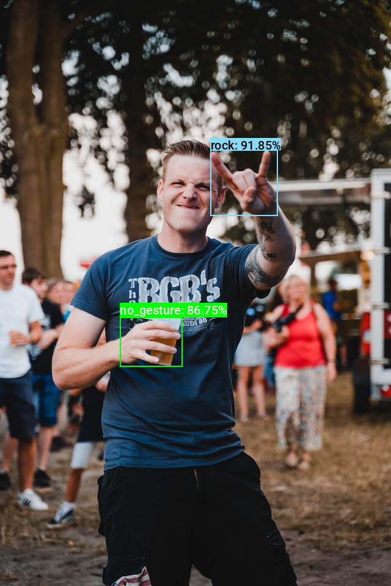

::: {.callout-tip}
## This post is part of the following series:
* [**Training YOLOX Models for Real-Time Object Detection in PyTorch**](/series/tutorials/pytorch-train-object-detector-yolox-series.html)
:::


* [Introduction](#introduction)
* [Quantization Process](#quantization-process)
* [Getting Started with the Code](#getting-started-with-the-code)
* [Setting Up Your Python Environment](#setting-up-your-python-environment)
* [Importing the Required Dependencies](#importing-the-required-dependencies)
* [Setting Up the Project](#setting-up-the-project)
* [Loading the Checkpoint Data](#loading-the-checkpoint-data)
* [Loading the Dataset](#loading-the-dataset)
* [Collecting Calibration Data](#collecting-calibration-data)
* [Performing Inference with TensorRT](#performing-inference-with-tensorrt)
* [Conclusion](#conclusion)


## Introduction

Welcome back to this series on real-time object detection with YOLOX. Previously, we [fine-tuned a YOLOX](../) model in PyTorch to detect hand signs and [exported it to ONNX](../onnx-export). This tutorial covers quantizing our ONNX model and performing int8 inference using ONNX Runtime and TensorRT.

Quantization aims to make inference more computationally and memory efficient using a lower precision data type (e.g., 8-bit integer (int8)) for the model weights and activations. Modern devices increasingly have specialized hardware for running models at these lower precisions for improved performance.

ONNX Runtime includes tools to assist with quantizing our model from its original float32 precision to int8. ONNX Runtime's execution providers also make it easier to leverage the hardware-specific inference libraries used to run models on the specialized hardware. In this tutorial, we will use the TensorRT Execution Provider to perform int8-precision inference.

TensorRT is a high-performance inference library for NVIDIA hardware. For our purposes it allows us to run our YOLOX model at 16-bit and 8-bit precision, while leveraging the specialized tensor cores in modern NVIDIA devices.

::: {.callout-important title="This post assumes the reader has completed the previous tutorial linked below:"}
* [Exporting YOLOX Models from PyTorch to ONNX](../onnx-export)
:::


::: {.callout-important title="TensorRT Hardware Requirements:"}

TensorRT requires NVIDIA hardware with CUDA [Compute Capability](https://docs.nvidia.com/cuda/cuda-c-programming-guide/index.html#compute-capabilities) 7.0 or higher (e.g., RTX 20-series or newer). Check the Compute Capability tables at the link below for your Nvidia hardware:

* [GPU Computer Capability Tables](https://developer.nvidia.com/cuda-gpus#compute)


 You can follow along using the free GPU-tier of Google Colab if you do not have any supported hardware.

:::


## Quantization Process

Quantizing our model involves converting the original 32-bit floating point values to 8-bit integers. float32 precision allows for a significantly greater range of possible values versus int8. To find the best way to map the float32 values to int8, we must compute the range of float32 values in the model. 

The float32 values for the model weights are static, while the activation values depend on the input fed to the model. We can calculate a suitable range of activation values by feeding sample inputs through the model and recording the activations. TensorRT can then use this information when quantizing the model. We will use a subset of images from the [original training dataset](../#loading-and-exploring-the-dataset) to generate this calibration data.


## Getting Started with the Code

As with the previous tutorial, the code is available as a Jupyter Notebook.

| Jupyter Notebook                                             | Google Colab                                                 |
| ------------------------------------------------------------ | ------------------------------------------------------------ |
| [GitHub Repository](https://github.com/cj-mills/pytorch-yolox-object-detection-tutorial-code/blob/main/notebooks/yolox-object-detector-ort-tensorrt-int8-calibration-inference.ipynb) | [Open In Colab](https://colab.research.google.com/github/cj-mills/pytorch-yolox-object-detection-tutorial-code/blob/main/notebooks/yolox-object-detector-ort-tensorrt-int8-calibration-inference-colab.ipynb) |


## Setting Up Your Python Environment

First, we must add a few new libraries to our [Python environment](../onnx-export/#setting-up-your-python-environment). 


### Install CUDA Package

Both ONNX Runtime and TensorRT require CUDA for use with NVIDIA GPUs. The most recent CUDA version supported by ONNX Runtime is 12.2.

Run the following command to install CUDA in our Python environment with [Conda/Mamba](https://docs.nvidia.com/cuda/cuda-installation-guide-linux/index.html#conda-installation).

::: {.panel-tabset}

## Conda

```bash
conda install cuda -c nvidia/label/cuda-12.2.0 -y
```

## Mamba

```bash
mamba install cuda -c nvidia/label/cuda-12.2.0 -y
```

:::

### Install ONNX Runtime and TensorRT

The only additional libraries we need are ONNX Runtime with GPU support and TensorRT, assuming the packages used in the previous two tutorials are already in the Python environment.


::: {.callout-note title="Package Descriptions" collapse="true"}

| Package           | Description                                                  |
| ----------------- | ------------------------------------------------------------ |
| `onnxruntime-gpu` | ONNX Runtime is a runtime accelerator for machine learning models. ([link](https://pypi.org/project/onnxruntime-gpu/)) |
| `tensorrt`        | A high performance deep learning inference library for Nvidia devices. ([link](https://pypi.org/project/tensorrt/)) |

:::

Run the following commands to install the libraries:

```bash
# Install TensorRT packages
pip install 'tensorrt==8.6.1' --extra-index-url https://pypi.nvidia.com

# Install ONNX Runtime for CUDA 12
pip install -U onnxruntime-gpu --extra-index-url https://aiinfra.pkgs.visualstudio.com/PublicPackages/_packaging/onnxruntime-cuda-12/pypi/simple/
```


With our environment updated, we can dive into the code. 


## Importing the Required Dependencies

First, we will import the necessary Python dependencies into our Jupyter Notebook.


```python
# Import Python Standard Library dependencies
import json
import os
from pathlib import Path
import random

# Import utility functions
from cjm_psl_utils.core import download_file, file_extract
from cjm_pil_utils.core import resize_img, get_img_files
from cjm_pil_utils.annotation import draw_bboxes

# Import numpy
import numpy as np

# Import the pandas package
import pandas as pd

# Do not truncate the contents of cells and display all rows and columns
pd.set_option('max_colwidth', None, 'display.max_rows', None, 'display.max_columns', None)

# Import PIL for image manipulation
from PIL import Image

# Import ONNX dependencies
import onnxruntime as ort # Import the ONNX Runtime
from onnxruntime.quantization import CalibrationDataReader, CalibrationMethod, create_calibrator, write_calibration_table

# Import tensorrt_libs
import tensorrt_libs

# Import tqdm for progress bar
from tqdm.auto import tqdm
```


::: {.callout-important}

Make sure to import the `tensorrt_libs` module that is part of the `tensorrt` pip package. Otherwise, you will need to update the `LD_LIBRARY_PATH` environment variable with the path to the TensorRT library files.

:::


## Setting Up the Project

Next, we will set the folder locations for our project, the calibration dataset, and the directory with the ONNX model and JSON colormap file. We should also ensure we have a font file for annotating images.

### Setting the Directory Paths

Readers following the tutorial on their local machine should select locations with read and write access to store the archived and extracted dataset. For a cloud service like Google Colab, you can set it to the  current directory.


```python
# The name for the project
project_name = f"pytorch-yolox-object-detector"

# The path for the project folder
project_dir = Path(f"./{project_name}/")

# Create the project directory if it does not already exist
project_dir.mkdir(parents=True, exist_ok=True)

# Define path to store datasets
dataset_dir = Path("/mnt/980_1TB_2/Datasets/")
# Create the dataset directory if it does not exist
dataset_dir.mkdir(parents=True, exist_ok=True)

# Define path to store archive files
archive_dir = dataset_dir/'../Archive'
# Create the archive directory if it does not exist
archive_dir.mkdir(parents=True, exist_ok=True)

# The path to the checkpoint folder
checkpoint_dir = Path(project_dir/f"2024-02-17_11-08-46")

pd.Series({
    "Project Directory:": project_dir, 
    "Dataset Directory:": dataset_dir, 
    "Archive Directory:": archive_dir,
    "Checkpoint Directory:": checkpoint_dir,
}).to_frame().style.hide(axis='columns')
```

<div style="overflow-x:auto; max-height:500px">
<table id="T_32fa5">
  <thead>
  </thead>
  <tbody>
    <tr>
      <th id="T_32fa5_level0_row0" class="row_heading level0 row0" >Project Directory:</th>
      <td id="T_32fa5_row0_col0" class="data row0 col0" >pytorch-yolox-object-detector</td>
    </tr>
    <tr>
      <th id="T_32fa5_level0_row1" class="row_heading level0 row1" >Dataset Directory:</th>
      <td id="T_32fa5_row1_col0" class="data row1 col0" >/mnt/980_1TB_2/Datasets</td>
    </tr>
    <tr>
      <th id="T_32fa5_level0_row2" class="row_heading level0 row2" >Archive Directory:</th>
      <td id="T_32fa5_row2_col0" class="data row2 col0" >/mnt/980_1TB_2/Datasets/../Archive</td>
    </tr>
    <tr>
      <th id="T_32fa5_level0_row3" class="row_heading level0 row3" >Checkpoint Directory:</th>
      <td id="T_32fa5_row3_col0" class="data row3 col0" >pytorch-yolox-object-detector/2024-02-17_11-08-46</td>
    </tr>
  </tbody>
</table>
</div>


::: {.callout-tip title="I made an ONNX model  available on Hugging Face Hub with a colormap file in the repository linked below:"}
* [cj-mills/yolox-hagrid-onnx](https://huggingface.co/cj-mills/yolox-hagrid-onnx/tree/main)
:::

::: {.callout-tip title="Those following along on Google Colab can drag the contents of their checkpoint folder into Colab's file browser. "}
:::


### Download a Font File


```python
# Set the name of the font file
font_file = 'KFOlCnqEu92Fr1MmEU9vAw.ttf'

# Download the font file
download_file(f"https://fonts.gstatic.com/s/roboto/v30/{font_file}", "./")
```


## Loading the Checkpoint Data

Now, we can load the colormap, set the path for the ONNX model, and set the max stride value.

### Load the Colormap


```python
# The colormap path
colormap_path = list(checkpoint_dir.glob('*colormap.json'))[0]

# Load the JSON colormap data
with open(colormap_path, 'r') as file:
        colormap_json = json.load(file)

# Convert the JSON data to a dictionary        
colormap_dict = {item['label']: item['color'] for item in colormap_json['items']}

# Extract the class names from the colormap
class_names = list(colormap_dict.keys())

# Make a copy of the colormap in integer format
int_colors = [tuple(int(c*255) for c in color) for color in colormap_dict.values()]
```

### Set Model Checkpoint Information


```python
# The onnx model path
onnx_file_path = list(checkpoint_dir.glob('*.onnx'))[0]

# Set max stride value for processing output
max_stride = 32
```


## Loading the Dataset

Now that we set up the project, we can download our dataset and select a subset to use for calibration.

### Setting the Dataset Path

We first need to construct the name for the Hugging Face Hub dataset and define where to download and extract the dataset.


```python
# Set the name of the dataset
dataset_name = 'hagrid-sample-30k-384p'

# Construct the HuggingFace Hub dataset name by combining the username and dataset name
hf_dataset = f'cj-mills/{dataset_name}'

# Create the path to the zip file that contains the dataset
archive_path = Path(f'{archive_dir}/{dataset_name}.zip')

# Create the path to the directory where the dataset will be extracted
dataset_path = Path(f'{dataset_dir}/{dataset_name}')

pd.Series({
    "HuggingFace Dataset:": hf_dataset, 
    "Archive Path:": archive_path, 
    "Dataset Path:": dataset_path
}).to_frame().style.hide(axis='columns')
```

<div style="overflow-x:auto; max-height:500px">
<table id="T_7fa45">
  <thead>
  </thead>
  <tbody>
    <tr>
      <th id="T_7fa45_level0_row0" class="row_heading level0 row0" >HuggingFace Dataset:</th>
      <td id="T_7fa45_row0_col0" class="data row0 col0" >cj-mills/hagrid-sample-30k-384p</td>
    </tr>
    <tr>
      <th id="T_7fa45_level0_row1" class="row_heading level0 row1" >Archive Path:</th>
      <td id="T_7fa45_row1_col0" class="data row1 col0" >/mnt/980_1TB_2/Datasets/../Archive/hagrid-sample-30k-384p.zip</td>
    </tr>
    <tr>
      <th id="T_7fa45_level0_row2" class="row_heading level0 row2" >Dataset Path:</th>
      <td id="T_7fa45_row2_col0" class="data row2 col0" >/mnt/980_1TB_2/Datasets/hagrid-sample-30k-384p</td>
    </tr>
  </tbody>
</table>
</div>


### Downloading the Dataset

We can now download the dataset archive file and extract the dataset. We can delete the archive afterward to save space.


```python
# Construct the HuggingFace Hub dataset URL
dataset_url = f"https://huggingface.co/datasets/{hf_dataset}/resolve/main/{dataset_name}.zip"
print(f"HuggingFace Dataset URL: {dataset_url}")

# Set whether to delete the archive file after extracting the dataset
delete_archive = True

# Download the dataset if not present
if dataset_path.is_dir():
    print("Dataset folder already exists")
else:
    print("Downloading dataset...")
    download_file(dataset_url, archive_dir)    
    
    print("Extracting dataset...")
    file_extract(fname=archive_path, dest=dataset_dir)
    
    # Delete the archive if specified
    if delete_archive: archive_path.unlink()
```


### Get Image File Paths

Once downloaded, we can get the paths to the images in the dataset.


```python
# Get a list of all JPG image files in the dataset
img_file_paths = list(dataset_path.glob("./**/*.jpg"))

# Print the number of image files
print(f"Number of Images: {len(img_file_paths)}")

# Display the first five entries from the dictionary using a Pandas DataFrame
pd.DataFrame(img_file_paths).head()
```

```text
Number of Images: 31833
```

<div style="overflow-x:auto; max-height:500px">
<table border="1" class="dataframe">
  <thead>
    <tr style="text-align: right;">
      <th></th>
      <th>0</th>
    </tr>
  </thead>
  <tbody>
    <tr>
      <th>0</th>
      <td>/mnt/980_1TB_2/Datasets/hagrid-sample-30k-384p/hagrid_30k/train_val_call/00005c9c-3548-4a8f-9d0b-2dd4aff37fc9.jpg</td>
    </tr>
    <tr>
      <th>1</th>
      <td>/mnt/980_1TB_2/Datasets/hagrid-sample-30k-384p/hagrid_30k/train_val_call/0020a3db-82d8-47aa-8642-2715d4744db5.jpg</td>
    </tr>
    <tr>
      <th>2</th>
      <td>/mnt/980_1TB_2/Datasets/hagrid-sample-30k-384p/hagrid_30k/train_val_call/004ac93f-0f7c-49a4-aadc-737e0ad4273c.jpg</td>
    </tr>
    <tr>
      <th>3</th>
      <td>/mnt/980_1TB_2/Datasets/hagrid-sample-30k-384p/hagrid_30k/train_val_call/006cac69-d3f0-47f9-aac9-38702d038ef1.jpg</td>
    </tr>
    <tr>
      <th>4</th>
      <td>/mnt/980_1TB_2/Datasets/hagrid-sample-30k-384p/hagrid_30k/train_val_call/00973fac-440e-4a56-b60c-2a06d5fb155d.jpg</td>
    </tr>
  </tbody>
</table>
</div>


### Select Sample Images

Using every image in the dataset for the calibration process would be unnecessary and time-consuming, so we'll select a random subset.


```python
random.seed(1234) # Set random seed for consistency 
sample_percentage = 0.1
random.shuffle(img_file_paths)
sample_img_paths = random.sample(img_file_paths, int(len(img_file_paths)*sample_percentage))
```


::: {.callout-tip title='Other Datasets:'}

Try to have at least `200` samples for the calibration set if adapting this tutorial to another dataset. 

:::


## Collecting Calibration Data

With the dataset samples selected, we can feed them through the model and collect the calibration data.

### Implement a CalibrationDataReader

First, we will implement a [`CalibrationDataReader`](https://github.com/microsoft/onnxruntime/blob/07788e082ef2c78c3f4e72f49e7e7c3db6f09cb0/onnxruntime/python/tools/quantization/calibrate.py#L30) class to load and prepare samples to feed through the model.


```python
class CalibrationDataReaderCV(CalibrationDataReader):
    """
    A subclass of CalibrationDataReader specifically designed for handling
    image data for calibration in computer vision tasks. This reader loads,
    preprocesses, and provides images for model calibration.
    """
    
    def __init__(self, img_file_paths, target_sz, max_stride=32, input_name='input'):
        """
        Initializes a new instance of the CalibrationDataReaderCV class.
        
        Args:
            img_file_paths (list): A list of image file paths.
            target_sz (tuple): The target size (width, height) to resize images to.
            max_stride (int, optional): Maximum stride for ensuring input dimension compatibility. Default is 32.
            input_name (str, optional): The name of the input node in the ONNX model. Default is 'input'.
        """
        super().__init__()  # Initialize the base class
        
        # Initialization of instance variables
        self._img_file_paths = img_file_paths
        self.input_name = input_name
        self.max_stride = max_stride
        self.enum = iter(img_file_paths)  # Create an iterator over the image paths
        self.target_sz = target_sz
        
    def get_next(self):
        """
        Retrieves, processes, and returns the next image in the sequence as a NumPy array suitable for model input.
        
        Returns:
            dict: A dictionary with a single key-value pair where the key is `input_name` and the value is the
                  preprocessed image as a NumPy array, or None if there are no more images.
        """
        
        img_path = next(self.enum, None)  # Get the next image path
        if not img_path:
            return None  # If there are no more paths, return None

        # Load the image from the filepath and convert to RGB
        image = Image.open(img_path).convert('RGB')

        # Resize the image to the target size
        resized_img = resize_img(image, target_sz=self.target_sz, divisor=1)
        
        # Adjust dimensions to be multiples of max_stride
        input_dims = [dim - dim % self.max_stride for dim in resized_img.size]
        
        # Calculate offsets for cropping to maintain aspect ratio
        offsets = (np.array(resized_img.size) - np.array(input_dims)) / 2
        
        # Calculate the scale between original and resized images for potential use
        min_img_scale = min(image.size) / min(resized_img.size)
        max_img_scale = max(image.size) / max(resized_img.size)
        
        # Crop the resized image based on calculated offsets to fit model input requirements
        input_img = resized_img.crop(box=[*offsets, *(np.array(resized_img.size) - offsets)])

        # Convert the image to a NumPy array, normalize, and add a batch dimension
        input_tensor_np = np.array(input_img, dtype=np.float32).transpose((2, 0, 1))[None] / 255

        # Return the image in a dictionary under the specified input name
        return {self.input_name: input_tensor_np}
```


::: {.callout-warning title='Preprocessing Steps:'}

This `CalibrationDataReader` class does not normalize the input as our ONNX model performs that step internally. Be sure to include any required input normalization if adapting this tutorial to another model that does not include it internally.

:::


### Specify a Cache Folder

Next, we will create a folder to store the collected calibration data and any cache files generated by TensorRT.


```python
trt_cache_dir = checkpoint_dir/'trt_engine_cache'
trt_cache_dir.mkdir(parents=True, exist_ok=True)
trt_cache_dir
```


```text
PosixPath('pytorch-yolox-object-detector/2024-02-17_11-08-46/trt_engine_cache')
```


### Collect Calibration Data

Now, we can create a calibrator object and an instance of our custom `CalibrationDataReader` object to collect the activation values and compute the range of values. The calibrator object creates a temporary ONNX model for the calibration process that we can delete afterward.

After feeding the data samples through the model, we will save the generated calibration file for TensorRT to use later. 


```python
%%time

target_sz = 384

# Save path for temporary ONNX model used during calibration process
augmented_model_path = onnx_file_path.parent/f"{onnx_file_path.stem}-augmented.onnx"

try:
    # Create a calibrator object for the ONNX model.
    calibrator = create_calibrator(
        model=onnx_file_path, 
        op_types_to_calibrate=None, 
        augmented_model_path=augmented_model_path, 
        calibrate_method=CalibrationMethod.MinMax
    )

    # Set the execution providers for the calibrator.
    calibrator.set_execution_providers(["CUDAExecutionProvider", "CPUExecutionProvider"])

    # Initialize the custom CalibrationDataReader object
    calibration_data_reader = CalibrationDataReaderCV(img_file_paths=sample_img_paths, 
                                                      target_sz=target_sz, 
                                                      max_stride=max_stride, 
                                                      input_name=calibrator.model.graph.input[0].name)

    # Collect calibration data using the specified data reader.
    calibrator.collect_data(data_reader=calibration_data_reader)

    # Initialize an empty dictionary to hold the new compute range values.
    new_compute_range = {}

    # Compute data and update the compute range for each key in the calibrator's data.
    for k, v in calibrator.compute_data().data.items():
        # Extract the min and max values from the range_value.
        v1, v2 = v.range_value
        # Convert the min and max values to float and store them in the new_compute_range dictionary.
        new_compute_range[k] = (float(v1.item()), float(v2.item()))
        
    # Write the computed calibration table to the specified directory.
    write_calibration_table(new_compute_range, dir=str(trt_cache_dir))
    
except Exception as e:
    # Catch any exceptions that occur during the calibration process.
    print("An error occurred:", e)

finally:
    # Remove temporary ONNX file created during the calibration process
    if augmented_model_path.exists():
        augmented_model_path.unlink()
```

```text
CPU times: user 48 s, sys: 4.13 s, total: 52.1 s
Wall time: 56.7 s
```


### Inspect TensorRT Cache Folder

Looking in the cache folder, we should see three new files.


```python
# Print the content of the module folder as a Pandas DataFrame
pd.DataFrame([path.name for path in trt_cache_dir.iterdir()])
```


<div style="overflow-x:auto; max-height:500px">
<table border="1" class="dataframe">
  <thead>
    <tr style="text-align: right;">
      <th></th>
      <th>0</th>
    </tr>
  </thead>
  <tbody>
    <tr>
      <th>0</th>
      <td>calibration.cache</td>
    </tr>
    <tr>
      <th>1</th>
      <td>calibration.flatbuffers</td>
    </tr>
    <tr>
      <th>2</th>
      <td>calibration.json</td>
    </tr>
  </tbody>
</table>
</div>


That takes care of the calibration process. In the next section, we will create an ONNX Runtime inference session and perform inference with TensorRT.


## Performing Inference with TensorRT

To have TensorRT quantize the model for int8 inference, we need to specify the path to the cache folder and the calibration table file name and enable int8 precision when initializing the inference session.

### Create an Inference Session


```python
ort.get_available_providers()
```


```text
['TensorrtExecutionProvider', 'CUDAExecutionProvider', 'CPUExecutionProvider']
```


```python
providers = [
    ('TensorrtExecutionProvider', {
        'device_id': 0, # The device ID
        'trt_max_workspace_size': 4e9, # Maximum workspace size for TensorRT engine (1e9 ≈ 1GB)
        'trt_engine_cache_enable': True, # Enable TensorRT engine caching
        'trt_engine_cache_path': str(trt_cache_dir), # Path for TensorRT engine, profile files, and int8 calibration table
        'trt_int8_enable': True, # Enable int8 mode in TensorRT
        'trt_int8_calibration_table_name': 'calibration.flatbuffers', # int8 calibration table file for non-QDQ models in int8 mode
    })
]

sess_opt = ort.SessionOptions()

# Load the model and create an InferenceSession
session = ort.InferenceSession(onnx_file_path, sess_options=sess_opt, providers=providers)
```


::: {.callout-note title='TensorRT Warning Messages:'}

You might see warning messages like the example below when creating the inference session with TensorRT. These are normal, and you can safely ignore them.

```text
2024-03-28 13:07:04.725964281 [W:onnxruntime:Default, tensorrt_execution_provider.h:83 log] [2024-03-28 20:07:04 WARNING] onnx2trt_utils.cpp:374: Your ONNX model has been generated with INT64 weights, while TensorRT does not natively support INT64. Attempting to cast down to INT32.
2024-03-28 13:07:04.725986806 [W:onnxruntime:Default, tensorrt_execution_provider.h:83 log] [2024-03-28 20:07:04 WARNING] onnx2trt_utils.cpp:400: One or more weights outside the range of INT32 was clamped
2024-03-28 13:07:04.738993049 [W:onnxruntime:Default, tensorrt_execution_provider.h:83 log] [2024-03-28 20:07:04 WARNING] onnx2trt_utils.cpp:374: Your ONNX model has been generated with INT64 weights, while TensorRT does not natively support INT64. Attempting to cast down to INT32.
2024-03-28 13:07:04.739015348 [W:onnxruntime:Default, tensorrt_execution_provider.h:83 log] [2024-03-28 20:07:04 WARNING] onnx2trt_utils.cpp:400: One or more weights outside the range of INT32 was clamped
```

:::


### Define Utility Functions

Next, we will redefine the same utility functions from the [previous tutorial](../onnx-export/#define-utility-functions).

#### Define a function to generate the output grids


```python
def generate_output_grids_np(height, width, strides=[8,16,32]):
    """
    Generate a numpy array containing grid coordinates and strides for a given height and width.

    Args:
        height (int): The height of the image.
        width (int): The width of the image.

    Returns:
        np.ndarray: A numpy array containing grid coordinates and strides.
    """

    all_coordinates = []

    for stride in strides:
        # Calculate the grid height and width
        grid_height = height // stride
        grid_width = width // stride

        # Generate grid coordinates
        g1, g0 = np.meshgrid(np.arange(grid_height), np.arange(grid_width), indexing='ij')

        # Create an array of strides
        s = np.full((grid_height, grid_width), stride)

        # Stack the coordinates along with the stride
        coordinates = np.stack((g0.flatten(), g1.flatten(), s.flatten()), axis=-1)

        # Append to the list
        all_coordinates.append(coordinates)

    # Concatenate all arrays in the list along the first dimension
    output_grids = np.concatenate(all_coordinates, axis=0)

    return output_grids
```

#### Define a function to calculate bounding boxes and probabilities


```python
def calculate_boxes_and_probs(model_output:np.ndarray, output_grids:np.ndarray) -> np.ndarray:
    """
    Calculate the bounding boxes and their probabilities.

    Parameters:
    model_output (numpy.ndarray): The output of the model.
    output_grids (numpy.ndarray): The output grids.

    Returns:
    numpy.ndarray: The array containing the bounding box coordinates, class labels, and maximum probabilities.
    """
    # Calculate the bounding box coordinates
    box_centroids = (model_output[..., :2] + output_grids[..., :2]) * output_grids[..., 2:]
    box_sizes = np.exp(model_output[..., 2:4]) * output_grids[..., 2:]

    x0, y0 = [t.squeeze(axis=2) for t in np.split(box_centroids - box_sizes / 2, 2, axis=2)]
    w, h = [t.squeeze(axis=2) for t in np.split(box_sizes, 2, axis=2)]

    # Calculate the probabilities for each class
    box_objectness = model_output[..., 4]
    box_cls_scores = model_output[..., 5:]
    box_probs = np.expand_dims(box_objectness, -1) * box_cls_scores

    # Get the maximum probability and corresponding class for each proposal
    max_probs = np.max(box_probs, axis=-1)
    labels = np.argmax(box_probs, axis=-1)

    return np.array([x0, y0, w, h, labels, max_probs]).transpose((1, 2, 0))
```

#### Define a function to calculate the intersection-over-union


```python
def calc_iou(proposals:np.ndarray) -> np.ndarray:
    """
    Calculates the Intersection over Union (IoU) for all pairs of bounding boxes (x,y,w,h) in 'proposals'.

    The IoU is a measure of overlap between two bounding boxes. It is calculated as the area of
    intersection divided by the area of union of the two boxes.

    Parameters:
    proposals (2D np.array): A NumPy array of bounding boxes, where each box is an array [x, y, width, height].

    Returns:
    iou (2D np.array): The IoU matrix where each element i,j represents the IoU of boxes i and j.
    """

    # Calculate coordinates for the intersection rectangles
    x1 = np.maximum(proposals[:, 0], proposals[:, 0][:, None])
    y1 = np.maximum(proposals[:, 1], proposals[:, 1][:, None])
    x2 = np.minimum(proposals[:, 0] + proposals[:, 2], (proposals[:, 0] + proposals[:, 2])[:, None])
    y2 = np.minimum(proposals[:, 1] + proposals[:, 3], (proposals[:, 1] + proposals[:, 3])[:, None])
    
    # Calculate intersection areas
    intersections = np.maximum(x2 - x1, 0) * np.maximum(y2 - y1, 0)

    # Calculate union areas
    areas = proposals[:, 2] * proposals[:, 3]
    unions = areas[:, None] + areas - intersections

    # Calculate IoUs
    iou = intersections / unions

    # Return the iou matrix
    return iou
```

#### Define a function to filter bounding box proposals using Non-Maximum Suppression


```python
def nms_sorted_boxes(iou:np.ndarray, iou_thresh:float=0.45) -> np.ndarray:
    """
    Applies non-maximum suppression (NMS) to sorted bounding boxes.

    It suppresses boxes that have high overlap (as defined by the IoU threshold) with a box that 
    has a higher score.

    Parameters:
    iou (np.ndarray): An IoU matrix where each element i,j represents the IoU of boxes i and j.
    iou_thresh (float): The IoU threshold for suppression. Boxes with IoU > iou_thresh are suppressed.

    Returns:
    keep (np.ndarray): The indices of the boxes to keep after applying NMS.
    """

    # Create a boolean mask to keep track of boxes
    mask = np.ones(iou.shape[0], dtype=bool)

    # Apply non-max suppression
    for i in range(iou.shape[0]):
        if mask[i]:
            # Suppress boxes with higher index and IoU > threshold
            mask[(iou[i] > iou_thresh) & (np.arange(iou.shape[0]) > i)] = False

    # Return the indices of the boxes to keep
    return np.arange(iou.shape[0])[mask]
```

### Select a Test Image

We can use the same test image and input size from the [previous tutorial](../onnx-export/#select-a-test-image).


```python
test_img_name = "pexels-2769554-man-doing-rock-and-roll-sign.jpg"
test_img_url = f"https://huggingface.co/datasets/cj-mills/pexel-hand-gesture-test-images/resolve/main/{test_img_name}"

download_file(test_img_url, './', False)

test_img = Image.open(test_img_name)
display(test_img)

pd.Series({
    "Test Image Size:": test_img.size, 
}).to_frame().style.hide(axis='columns')
```


{fig-align="center"}

<div style="overflow-x:auto; max-height:500px">
<table id="T_235a6">
  <thead>
  </thead>
  <tbody>
    <tr>
      <th id="T_235a6_level0_row0" class="row_heading level0 row0" >Test Image Size:</th>
      <td id="T_235a6_row0_col0" class="data row0 col0" >(640, 960)</td>
    </tr>
  </tbody>
</table>
</div>


### Prepare the Test Image


```python
# Set the input image size
test_sz = 384

# Resize image without cropping to multiple of the max stride
resized_img = resize_img(test_img, target_sz=test_sz, divisor=1)

# Calculating the input dimensions that multiples of the max stride
input_dims = [dim - dim % max_stride for dim in resized_img.size]

# Calculate the offsets from the resized image dimensions to the input dimensions
offsets = (np.array(resized_img.size) - input_dims)/2

# Calculate the scale between the source image and the resized image
min_img_scale = min(test_img.size) / min(resized_img.size)

# Crop the resized image to the input dimensions
input_img = resized_img.crop(box=[*offsets, *resized_img.size-offsets])

display(input_img)

pd.Series({
    "Resized Image Size:": resized_img.size,
    "Input Dims:": input_dims,
    "Offsets:": offsets,
    "Min Image Scale:": min_img_scale,
    "Input Image Size:": input_img.size
}).to_frame().style.hide(axis='columns')
```


{fig-align="center"}


<div style="overflow-x:auto; max-height:500px">
<table id="T_46f67">
  <thead>
  </thead>
  <tbody>
    <tr>
      <th id="T_46f67_level0_row0" class="row_heading level0 row0" >Resized Image Size:</th>
      <td id="T_46f67_row0_col0" class="data row0 col0" >(384, 576)</td>
    </tr>
    <tr>
      <th id="T_46f67_level0_row1" class="row_heading level0 row1" >Input Dims:</th>
      <td id="T_46f67_row1_col0" class="data row1 col0" >[384, 576]</td>
    </tr>
    <tr>
      <th id="T_46f67_level0_row2" class="row_heading level0 row2" >Offsets:</th>
      <td id="T_46f67_row2_col0" class="data row2 col0" >[0. 0.]</td>
    </tr>
    <tr>
      <th id="T_46f67_level0_row3" class="row_heading level0 row3" >Min Image Scale:</th>
      <td id="T_46f67_row3_col0" class="data row3 col0" >1.666667</td>
    </tr>
    <tr>
      <th id="T_46f67_level0_row4" class="row_heading level0 row4" >Input Image Size:</th>
      <td id="T_46f67_row4_col0" class="data row4 col0" >(384, 576)</td>
    </tr>
  </tbody>
</table>
</div>


### Prepare the Input Tensor


```python
# Convert the existing input image to NumPy format
input_tensor_np = np.array(input_img, dtype=np.float32).transpose((2, 0, 1))[None]/255
```

### Build TensorRT Engine

TensorRT will build an optimized and quantized representation of our model called an engine when we first pass input to the inference session. It will save a copy of this engine object to the cache folder we specified earlier. The build process can take a bit, so caching the engine will save time for future use. 


```python
%%time
# Perform a single inference run to build the TensorRT engine for the current input dimensions
session.run(None, {"input": input_tensor_np});
```


    CPU times: user 1min 22s, sys: 5.69 s, total: 1min 27s
    Wall time: 1min 39s


::: {.callout-note}

TensorRT needs to build separate engine files for different input dimensions.

:::


### Inspect TensorRT Cache Folder

If we look in the cache folder again, we can see a new `.engine` file and a new `.profile` file.


```python
# Print the content of the module folder as a Pandas DataFrame
pd.DataFrame([path.name for path in trt_cache_dir.iterdir()])
```


<div style="overflow-x:auto; max-height:500px">
<table border="1" class="dataframe">
  <thead>
    <tr style="text-align: right;">
      <th></th>
      <th>0</th>
    </tr>
  </thead>
  <tbody>
    <tr>
      <th>0</th>
      <td>calibration.cache</td>
    </tr>
    <tr>
      <th>1</th>
      <td>calibration.flatbuffers</td>
    </tr>
    <tr>
      <th>2</th>
      <td>calibration.json</td>
    </tr>
    <tr>
      <th>3</th>
      <td>TensorrtExecutionProvider_TRTKernel_graph_main_graph_12802227604276161730_0_0_int8_sm89.engine</td>
    </tr>
    <tr>
      <th>4</th>
      <td>TensorrtExecutionProvider_TRTKernel_graph_main_graph_12802227604276161730_0_0_int8_sm89.profile</td>
    </tr>
  </tbody>
</table>
</div>


### Benchmark Quantized Model

With the TensorRT engine built, we can benchmark our quantized model to gauge the raw inference speeds.


```python
%%timeit
session.run(None, {"input": input_tensor_np})
```

```text
866 µs ± 7.83 µs per loop (mean ± std. dev. of 7 runs, 1,000 loops each)
```

In my testing for this model, TensoRT int8 inference tends to be about 2.8-3x faster than the CUDA execution provider with the original float32 model.


Of course, it does not matter how much faster the quantized model is if there is a significant drop in accuracy, so let's verify the prediction results.

### Compute the Predictions


```python
# Run inference
outputs = session.run(None, {"input": input_tensor_np})[0]

# Process the model output
outputs = calculate_boxes_and_probs(outputs, generate_output_grids_np(*input_tensor_np.shape[2:4]))

bbox_conf_thresh = 0.45
iou_thresh = 0.45

# Filter the proposals based on the confidence threshold
max_probs = outputs[:, : ,-1]
mask = max_probs > bbox_conf_thresh
proposals = outputs[mask]

# Sort the proposals by probability in descending order
proposals = proposals[proposals[..., -1].argsort()][::-1]

# Apply non-max suppression to the proposals with the specified threshold
proposal_indices = nms_sorted_boxes(calc_iou(proposals[:, :-2]), iou_thresh)
proposals = proposals[proposal_indices]

bbox_list = (proposals[:,:4]+[*offsets, 0, 0])*min_img_scale
label_list = [class_names[int(idx)] for idx in proposals[:,4]]
probs_list = proposals[:,5]

annotated_img = draw_bboxes(
    image=test_img, 
    boxes=bbox_list, 
    labels=label_list,
    probs=probs_list,
    colors=[int_colors[class_names.index(i)] for i in label_list], 
    font=font_file,
)

display(annotated_img)

# Print the prediction data as a Pandas Series for easy formatting
pd.Series({
    "Predicted BBoxes:": [f"{label}:{bbox}" for label, bbox in zip(label_list, bbox_list.round(decimals=3))],
    "Confidence Scores:": [f"{label}: {prob*100:.2f}%" for label, prob in zip(label_list, probs_list)]
}).to_frame().style.hide(axis='columns')
```


{fig-align="center"}


<div style="overflow-x:auto; max-height:500px">
<table id="T_b5125">
  <thead>
  </thead>
  <tbody>
    <tr>
      <th id="T_b5125_level0_row0" class="row_heading level0 row0" >Predicted BBoxes:</th>
      <td id="T_b5125_row0_col0" class="data row0 col0" >['rock:[344.66  245.036 109.577 108.912]', 'no_gesture:[196.431 519.459 101.863  80.836]']</td>
    </tr>
    <tr>
      <th id="T_b5125_level0_row1" class="row_heading level0 row1" >Confidence Scores:</th>
      <td id="T_b5125_row1_col0" class="data row1 col0" >['rock: 91.85%', 'no_gesture: 86.75%']</td>
    </tr>
  </tbody>
</table>
</div>


---


The probability scores will likely differ slightly from the full-precision ONNX model, but the predicted object classes should be the same.


::: {.callout-caution}
## Google Colab Users
Don't forget to download the content of the `trt_engine_cache` folder from the Colab Environment's file browser. ([tutorial link](https://christianjmills.com/posts/google-colab-getting-started-tutorial/#working-with-data)) 
:::


## Conclusion

Congratulations on reaching the end of this tutorial. We previously trained a YOLOX model in PyTorch for hand gesture detection, and now we've quantized that model for optimized inference on NVIDIA hardware. Our model is now smaller, faster, and better suited for real-time applications and edge devices like the Jetson Orin Nano.


## Recommended Tutorials

* [**Real-Time Object Tracking with YOLOX and ByteTrack**](../byte-track/): Learn how to track objects across video frames with YOLOX and ByteTrack.



