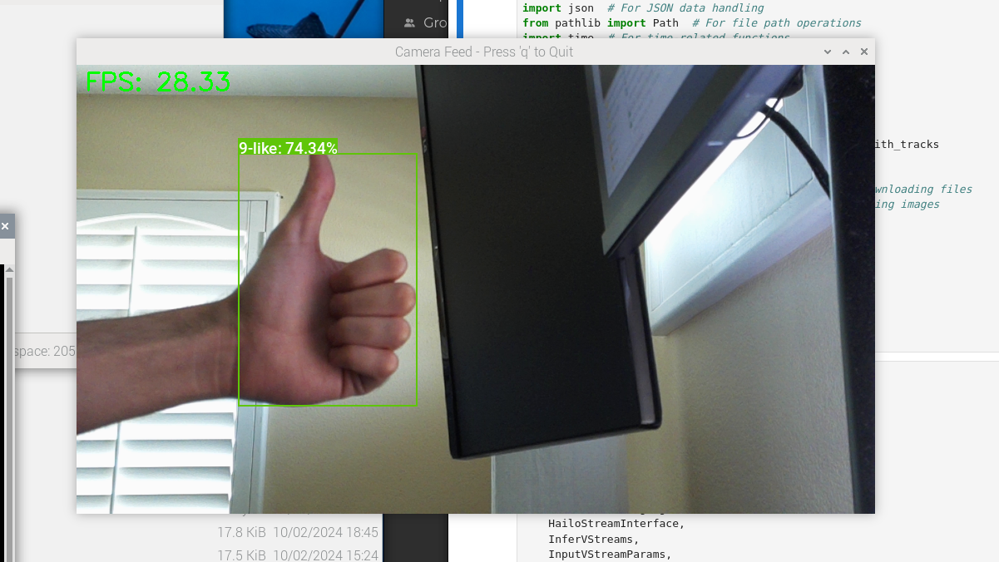

::: {.callout-tip}
## This post is part of the following series:
* [**Training YOLOX Models for Real-Time Object Detection in PyTorch**](/series/tutorials/pytorch-train-object-detector-yolox-series.html)
:::


* [Introduction](#introduction)
* [Prerequisites](#prerequisites)  
* [Compiling Our Model](#compiling-our-model)  
* [Preparing the Raspberry Pi](#preparing-the-raspberry-pi)  
* [Setting Up a Python Virtual Environment](#setting-up-a-python-virtual-environment)  
* [Getting Started with the Code](#getting-started-with-the-code-1)
* [Importing the Required Dependencies](#importing-the-required-dependencies-1)
* [Define Utility Functions](#define-utility-functions)  
* [Setting Up the Project](#setting-up-the-project-1)  
* [Loading the Inference Resources](#loading-the-inference-resources)  
* [Tracking Objects in a Camera Feed](#tracking-objects-in-a-camera-feed)  
* [Conclusion](#conclusion)


## Introduction

Welcome back to this series on real-time object detection with YOLOX. So far, this series has covered how to:

- Finetune a YOLOX model in PyTorch to detect hand signs.
- Export the finetuned model to ONNX.
- Use the ByteTrack object tracker to track objects across video frames.

This post builds on those past tutorials by walking through deploying our model on a [Raspberry Pi 5](https://www.raspberrypi.com/products/raspberry-pi-5/) to perform real-time object tracking from a camera feed using the [Raspberry Pi AI Kit](https://www.raspberrypi.com/products/ai-kit/).

Released in June 2024, the AI Kit uses the [Hailo-8L accelerator](https://hailo.ai/products/ai-accelerators/hailo-8l-ai-accelerator-for-ai-light-applications/) from [Hailo AI](https://hailo.ai/). The Hailo-8L can perform 13 tera-operations per second (TOPS), making it suitable for lightweight real-time inference on edge devices.

Whether you are working with the pre-trained hand-sign detector used in this series or a custom model, real-time object tracking with the Raspberry Pi AI Kit opens up many possibilities for edge applications.


## Prerequisites

Before diving into the tutorial, there are some prerequisites to cover.

### Hardware

The code for this tutorial assumes the Raspberry Pi has an attached [CSI](https://en.wikipedia.org/wiki/Camera_Serial_Interface) camera.

The Raspberry Pi 5 has 22-pin MIPI CSI camera connectors. If your CSI camera module uses a 15-pin connector, you will need a 15-pin  to 22-pin adapter cable. You can order a pack of 3 on Amazon at the link below:

- [Arducam for Raspberry Pi Zero Camera Cable Set, 1.5” 2.87” 5.9” Ribbon Flex Extension Cables for Pi Zero&W, Pack of 3](https://www.amazon.com/Arducam-Raspberry-Camera-Ribbon-Extension/dp/B085RW9K13)

### Software

This tutorial uses the [Dataflow Compiler](https://hailo.ai/products/hailo-software/hailo-ai-software-suite/#sw-dc) (DFC) Python package, available through the [Hailo AI Developer Zone](https://hailo.ai/developer-zone/). At the time of writing, you must create an account to access this Python package and the associated documentation. You can create a Developer Zone account at the link below:

- [Hailo AI Developer Zone - Request Access](https://hailo.ai/developer-zone/request-access/)

### OS

At the time of writing, Hailo AI only supports the Dataflow Compiler Python package on x86 Linux platforms. If you are on Windows, you can run the conversion process through [WSL](https://learn.microsoft.com/en-us/windows/wsl/about).


## Compiling Our Model

We must first compile our YOLOX model for the Hailo-8L accelerator before running it on the AI Kit. The compilation process consists of the following steps:

1. Convert the ONNX model into a Hailo-compatible representation. ([link](https://hailo.ai/developer-zone/documentation/v3-29-0/?sp_referrer=tutorials_notebooks%2Fnotebooks%2FDFC_1_Parsing_Tutorial.html))
2. Quantize the Hailo-compatible representation into an 8-bit model. ([link](https://hailo.ai/developer-zone/documentation/v3-29-0/?page=tutorials_notebooks%2Fnotebooks%2FDFC_2_Model_Optimization_Tutorial.html))
3. Compile the 8-bit model into an HEF binary file for the Hailo-8L accelerator. ([link](https://hailo.ai/developer-zone/documentation/v3-29-0/?sp_referrer=tutorials_notebooks%2Fnotebooks%2FDFC_3_Compilation_Tutorial.html))

We use the [Dataflow Compiler](https://hailo.ai/products/hailo-software/hailo-ai-software-suite/#sw-dc) package provided by Hailo AI to perform these steps:

- [Developer Zone - Dataflow Compiler User Guide](https://hailo.ai/developer-zone/documentation/v3-29-0/)


### Download the Dataflow Compiler

You can download the Dataflow Compiler Python wheel file from the Software Downloads page in the Hailo AI Developer Zone at the page linked below:

- [Developer Zone - Software Downloads](https://hailo.ai/developer-zone/software-downloads/)


In the selection interface, choose the following options:

- **Select Product:** `ACCELERATORS`
- **Software Package:** `AI Software Suite`
- **Software Sub-Package:** `Dataflow Compiler`
- **Architecture:** `x86`
- **OS:** `Linux`
- **Python Version:** `3.10`


### Setting Up a Python Environment

After downloading the Dataflow Compiler, we can set up our Python environment.


#### Install Mamba Package Manager

As with previous tutorials in this series, we will use the Mamba package manager to create and manage our Python environment.

If you do not have it installed, run the following bash commands to download the latest release, install it, and relaunch the current bash shell to apply the  relevant changes:

```bash
# Download the latest Miniforge3 installer for the current OS and architecture
wget "https://github.com/conda-forge/miniforge/releases/latest/download/Miniforge3-$(uname)-$(uname -m).sh"

# Run the Miniforge3 installer silently (-b flag for batch mode)
bash Miniforge3-$(uname)-$(uname -m).sh -b

# Initialize mamba for shell usage
~/miniforge3/bin/mamba init

# Restart the shell to apply changes
bash
```


#### Create a Python Environment

Next, we will create and activate a Python 3.10 environment.

```bash
mamba create --name hailo-compiler-env python=3.10 -y
mamba activate hailo-compiler-env
```


#### Install the Dataflow Compiler

We can install the Dataflow Compiler package once inside the mamba environment.

```bash
pip install hailo_dataflow_compiler-3.29.0-py3-none-linux_x86_64.whl
```


#### Install Additional Dependencies
We will install a few additional dependencies for the conversion process to wrap up our environment setup.

```bash
pip install cjm_psl_utils cjm_pil_utils
```


### Getting Started with the Code
This tutorial walks through the conversion process in a Jupyter Notebook, which is available at the link below:

| Jupyter Notebook                                             |
| ------------------------------------------------------------ |
| [pytorch-yolox-object-detector-hailo-export.ipynb](https://github.com/cj-mills/pytorch-yolox-object-detection-tutorial-code/blob/main/notebooks/pytorch-yolox-object-detector-hailo-export.ipynb) |


### Importing the Required Dependencies
First, we will import the necessary Python packages.

```python
# Import Python Standard Library dependencies
import json
import os
import random
from pathlib import Path
import subprocess
from typing import Tuple, Optional, NamedTuple

# Import third-party libraries
import numpy as np
import pandas as pd
from PIL import Image, ImageDraw, ImageFont
from tqdm.auto import tqdm

# Import ONNX
import onnx

# Import Hailo SDK dependencies
from hailo_sdk_client import ClientRunner, InferenceContext, CalibrationDataType
from hailo_sdk_client.exposed_definitions import SUPPORTED_HW_ARCHS

# Import utility functions
from cjm_psl_utils.core import download_file, file_extract
from cjm_pil_utils.core import resize_img, get_img_files
from cjm_pil_utils.annotation import draw_bboxes
```


### Setting Up the Project

#### Set the Directory Paths


```python
# The name for the project
project_name = f"pytorch-yolox-object-detector"

# The path for the project folder
project_dir = Path(f"./{project_name}/")

# Create the project directory if it does not already exist
project_dir.mkdir(parents=True, exist_ok=True)

# The path to the checkpoint folder
checkpoint_dir = Path(project_dir/f"2024-09-08_19-22-32")

pd.Series({
    "Project Directory:": project_dir,
    "Checkpoint Directory:": checkpoint_dir,
}).to_frame().style.hide(axis='columns')
```

<div style="overflow-x:auto; max-height:500px">
<table id="T_982ee">
  <thead>
  </thead>
  <tbody>
    <tr>
      <th id="T_982ee_level0_row0" class="row_heading level0 row0" >Project Directory:</th>
      <td id="T_982ee_row0_col0" class="data row0 col0" >pytorch-yolox-object-detector</td>
    </tr>
    <tr>
      <th id="T_982ee_level0_row1" class="row_heading level0 row1" >Checkpoint Directory:</th>
      <td id="T_982ee_row1_col0" class="data row1 col0" >pytorch-yolox-object-detector/2024-09-08_19-22-32</td>
    </tr>
  </tbody>
</table>
</div>


::: {.callout-tip title="Sample Files:"}

* I made an ONNX model available on Hugging Face Hub with a colormap file in the repository linked below:
  * [cj-mills/yolox-hagrid-onnx](https://huggingface.co/cj-mills/yolox-hagrid-onnx/tree/main)


:::


#### Download a Font File


```python
# Set the name of the font file
font_file = 'KFOlCnqEu92Fr1MmEU9vAw.ttf'

# Download the font file
download_file(f"https://fonts.gstatic.com/s/roboto/v30/{font_file}", "./")
```


### Loading the Checkpoint Data

#### Load the Colormap


```python
# The colormap path
colormap_path = list(checkpoint_dir.glob('*colormap.json'))[0]

# Load the JSON colormap data
with open(colormap_path, 'r') as file:
        colormap_json = json.load(file)

# Convert the JSON data to a dictionary        
colormap_dict = {item['label']: item['color'] for item in colormap_json['items']}

# Extract the class names from the colormap
class_names = list(colormap_dict.keys())

# Make a copy of the colormap in integer format
int_colors = [tuple(int(c*255) for c in color) for color in colormap_dict.values()]
```

#### Set Model Checkpoint Information


```python
# The onnx model path
onnx_file_path = list(checkpoint_dir.glob('*.onnx'))[0]

# Set max stride value for processing output
max_stride = 32
```


### Parsing

The first step in the conversion process is to parse our ONNX model to the Hailo Archive (HAR) format. This HAR file will contain the graph structure and weights for the model used by the Hailo Runtime ([HailoRT](https://hailo.ai/products/hailo-software/hailo-ai-software-suite/#sw-hailort)).

#### Initialize a Dataflow Compiler API client

We parse the ONNX model using a Dataflow Compiler API  client. We must specify the target Hailo accelerator when initializing the client. The SUPPORTED_HW_ARCHS constant stores the list of valid hardware architecture names.


```python
# Display supported hardware architectures
SUPPORTED_HW_ARCHS
```


```text
['hailo8',
 'hailo8r',
 'hailo8l',
 'hailo15h',
 'hailo15m',
 'hailo15l',
 'hailo10h']
```

For the Hailo-8L, we pass in hailo8l for the hardware architecture parameter.


```python
# Initialize a Dataflow Compiler API client
runner = ClientRunner(hw_arch="hailo8l")
```

#### Selecting an Input Resolution

HailoRT does not support dynamic input resolutions, so we must specify one when parsing the model. 

I will use the [Raspberry Pi Camera Module 3](https://www.raspberrypi.com/products/camera-module-3/) for the demo, which has a `16:9` aspect ratio. Also, remember that the YOLOX model expects the input dimensions to be multiples of `32`.

Based on those constraints, I will use a resolution of `height:512 x width:288` for the input.


```python
# Set the input resolution for the model
input_sz = (512, 288)
```

#### Parse the ONNX Model

After deciding on an input resolution, we can parse the ONNX model using the [`translate_onnx_model`](https://hailo.ai/developer-zone/documentation/v3-29-0/?sp_referrer=api%2Fbuild_api.html#hailo_sdk_client.runner.client_runner.ClientRunner.translate_onnx_model) method. We specify the path to the ONNX model, model name, input and output nodes, and input shape in `[batch_size, channels, height, width]` format.


```python
# Parse the ONNX Model
# This step translates the ONNX model to a format compatible with Hailo hardware
hn, npz = runner.translate_onnx_model(
    str(onnx_file_path),
    onnx_file_path.stem,  # Use the filename (without extension) as the model name
    start_node_names=["input"],  # Specify the input node name
    end_node_names=['output'],  # Specify the output node name
    net_input_shapes={"input": [1, 3, *input_sz[::-1]]},  # Define input shape: [batch_size, channels, height, width]
)
```

```text
[info] Translation started on ONNX model hagrid-sample-30k-384p-yolox_tiny
[info] Restored ONNX model hagrid-sample-30k-384p-yolox_tiny (completion time: 00:00:00.06)
[info] Extracted ONNXRuntime meta-data for Hailo model (completion time: 00:00:00.19)
[info] NMS structure of yolox (or equivalent architecture) was detected.
[info] In order to use HailoRT post-processing capabilities, these end node names should be used: /Sigmoid /Sigmoid_1 /model/bbox_head/multi_level_conv_reg.0/Conv /Sigmoid_2 /Sigmoid_3 /model/bbox_head/multi_level_conv_reg.1/Conv /Sigmoid_4 /Sigmoid_5 /model/bbox_head/multi_level_conv_reg.2/Conv.
[info] Start nodes mapped from original model: 'input': 'hagrid-sample-30k-384p-yolox_tiny/input_layer1'.
[info] End nodes mapped from original model: '/Transpose'.
[info] Translation completed on ONNX model hagrid-sample-30k-384p-yolox_tiny (completion time: 00:00:00.72)
```


#### Inspect HAR Output Shape
If we compare the input and output shapes of the Hailo Archive to the original ONNX model, we can see the `translate_onnx_model` method converted the model to a channels-last format. We must account for this when processing the model output during inference.

```python
# Get input and output shapes from the Hailo Archive (HAR)
har_input_shape = runner.get_hn_dict()['layers']['hagrid-sample-30k-384p-yolox_tiny/input_layer1']['input_shapes'][0]
har_output_shape = runner.get_hn_dict()['layers']['hagrid-sample-30k-384p-yolox_tiny/output_layer1']['output_shapes'][0]

# Load the original ONNX model
onnx_model = onnx.load_model(onnx_file_path)

# Extract input and output shapes from the ONNX model
onnx_input_shape = [dim.dim_value for dim in onnx_model.graph.input[0].type.tensor_type.shape.dim]
onnx_output_shape = [dim.dim_value for dim in onnx_model.graph.output[0].type.tensor_type.shape.dim]

# Create a DataFrame to compare ONNX and HAR shapes
pd.DataFrame({"ONNX": {"input_shape:":onnx_input_shape, "output_shape:": onnx_output_shape},
              "HAR": {"input_shape:":har_input_shape, "output_shape:": har_output_shape}})
```
<div style="overflow-x:auto; max-height:500px">
<table border="1" class="dataframe">
  <thead>
    <tr style="text-align: right;">
      <th></th>
      <th>ONNX</th>
      <th>HAR</th>
    </tr>
  </thead>
  <tbody>
    <tr>
      <th>input_shape:</th>
      <td>[1, 3, 0, 0]</td>
      <td>[-1, 288, 512, 3]</td>
    </tr>
    <tr>
      <th>output_shape:</th>
      <td>[1, 0, 24]</td>
      <td>[-1, 1, 24, 3024]</td>
    </tr>
  </tbody>
</table>
</div>

::: {.callout-note}

The zeros in the onnx shapes indicate dynamic axes.

:::


#### Save the Hailo Archive

We can then save the Hailo Archive using the [`save_har`](https://hailo.ai/developer-zone/documentation/v3-29-0/?sp_referrer=api%2Fbuild_api.html#hailo_sdk_client.runner.client_runner.ClientRunner.save_har) method.


```python
# Save the Hailo Archive (HAR) file
hailo_model_har_name = f"{onnx_file_path.stem}_hailo_model.har"
hailo_model_har_path = onnx_file_path.parent/hailo_model_har_name
runner.save_har(hailo_model_har_path)
```

```text
[info] Saved HAR to: /mnt/ACASIS_4TB/Projects/GitHub/pytorch-yolox-object-detection-tutorial-code/notebooks/pytorch-yolox-object-detector/2024-09-08_19-22-32/hagrid-sample-30k-384p-yolox_tiny_hailo_model.har
```

#### Visualize the Graph Structure

After saving the HAR file, we can visualize its graph structure using the Hailo visualizer tool. The visualizer tool creates an SVG of the graph that we can optionally view in the browser.


```python
# Visualize the Graph Structure
!hailo visualizer {hailo_model_har_path} --no-browser
```

```text
[[32minfo[0m] Current Time: 12:00:34, 10/14/24
[[32minfo[0m] CPU: Architecture: x86_64, Model: 11th Gen Intel(R) Core(TM) i7-11700K @ 3.60GHz, Number Of Cores: 16, Utilization: 5.2%
[[32minfo[0m] Memory: Total: 31GB, Available: 20GB
[[32minfo[0m] System info: OS: Linux, Kernel: 6.8.0-45-generic
[[32minfo[0m] Hailo DFC Version: 3.29.0
[[32minfo[0m] HailoRT Version: Not Installed
[[32minfo[0m] PCIe: No Hailo PCIe device was found
[[32minfo[0m] Running `hailo visualizer pytorch-yolox-object-detector/2024-09-08_19-22-32/hagrid-sample-30k-384p-yolox_tiny_hailo_model.har --no-browser`
```


Now that we have our Hailo Archive file, we can move on to the optimization step.


### Model Optimization

The optimization process involves converting our full-precision HAR file to a quantized 8-bit HAR file.

#### Quantization Process

Quantizing our model involves converting the original 32-bit floating point (float32) values to 8-bit integer (int8) values. Float32 precision allows for a significantly greater range of possible values versus int8. To find the optimal mapping from float32 to int8, we must compute the range of float32 values present in the model.

The float32 values in our model fall into two categories:

1. Model weights: Static values that do not change after training.
2. Activation values: Dynamic values that depend on the input fed to the model and change during inference.

To accurately quantize both weights and activations, we need to:

1. Analyze the range of weight values across the entire model.
2. Estimate a suitable range for activation values by feeding sample inputs through the model and recording the resulting activations. This process generates what we call calibration data.

The Dataflow Compiler handles this process for us. It determines the best way to map the original float32 values to int8, aiming to preserve model accuracy while reducing its size and computational requirements. All we need to provide is the calibration data. 

We will use a subset of images from the original training dataset to generate this calibration data. This approach ensures that our quantized model can handle the types of inputs it is likely to encounter in real-world usage.

By quantizing our model in this way, we can significantly reduce its memory footprint and increase its inference speed, often with minimal loss in accuracy.


#### Set the Dataset Path

We first need to construct the name for the Hugging Face Hub dataset and define where to download and extract the dataset.


```python
# Define path to store datasets
dataset_dir = Path("/mnt/Storage/Datasets")
# Create the dataset directory if it does not exist
dataset_dir.mkdir(parents=True, exist_ok=True)

# Define path to store archive files
archive_dir = dataset_dir/'../Archive'
# Create the archive directory if it does not exist
archive_dir.mkdir(parents=True, exist_ok=True)

# Set the name of the dataset
dataset_name = 'hagrid-sample-30k-384p'

# Construct the HuggingFace Hub dataset name by combining the username and dataset name
hf_dataset = f'cj-mills/{dataset_name}'

# Create the path to the zip file that contains the dataset
archive_path = Path(f'{archive_dir}/{dataset_name}.zip')

# Create the path to the directory where the dataset will be extracted
dataset_path = Path(f'{dataset_dir}/{dataset_name}')

pd.Series({
    "HuggingFace Dataset:": hf_dataset, 
    "Archive Path:": archive_path, 
    "Dataset Path:": dataset_path
}).to_frame().style.hide(axis='columns')
```


<style type="text/css">
</style>
<table id="T_dcb5a">
  <thead>
  </thead>
  <tbody>
    <tr>
      <th id="T_dcb5a_level0_row0" class="row_heading level0 row0" >HuggingFace Dataset:</th>
      <td id="T_dcb5a_row0_col0" class="data row0 col0" >cj-mills/hagrid-sample-30k-384p</td>
    </tr>
    <tr>
      <th id="T_dcb5a_level0_row1" class="row_heading level0 row1" >Archive Path:</th>
      <td id="T_dcb5a_row1_col0" class="data row1 col0" >/mnt/Storage/Datasets/../Archive/hagrid-sample-30k-384p.zip</td>
    </tr>
    <tr>
      <th id="T_dcb5a_level0_row2" class="row_heading level0 row2" >Dataset Path:</th>
      <td id="T_dcb5a_row2_col0" class="data row2 col0" >/mnt/Storage/Datasets/hagrid-sample-30k-384p</td>
    </tr>
  </tbody>
</table>


#### Download the Dataset

We can now download the dataset archive file and extract the dataset. We can delete the archive afterward to save space.


```python
# Construct the HuggingFace Hub dataset URL
dataset_url = f"https://huggingface.co/datasets/{hf_dataset}/resolve/main/{dataset_name}.zip"
print(f"HuggingFace Dataset URL: {dataset_url}")

# Set whether to delete the archive file after extracting the dataset
delete_archive = True

# Download the dataset if not present
if dataset_path.is_dir():
    print("Dataset folder already exists")
else:
    print("Downloading dataset...")
    download_file(dataset_url, archive_dir)    
    
    print("Extracting dataset...")
    file_extract(fname=archive_path, dest=dataset_dir)
    
    # Delete the archive if specified
    if delete_archive: archive_path.unlink()
```

```text
HuggingFace Dataset URL: https://huggingface.co/datasets/cj-mills/hagrid-sample-30k-384p/resolve/main/hagrid-sample-30k-384p.zip
Dataset folder already exists
```

#### Get Image File Paths

Once downloaded, we can get the paths to the images in the dataset.


```python
# Get a list of all JPG image files in the dataset
img_file_paths = list(dataset_path.glob("./**/*.jpg"))

# Print the number of image files
print(f"Number of Images: {len(img_file_paths)}")

# Display the first five entries from the dictionary using a Pandas DataFrame
pd.DataFrame(img_file_paths).head()
```

```text
Number of Images: 31833
```

<div style="overflow-x:auto; max-height:500px">
<table border="1" class="dataframe">
  <thead>
    <tr style="text-align: right;">
      <th></th>
      <th>0</th>
    </tr>
  </thead>
  <tbody>
    <tr>
      <th>0</th>
      <td>/mnt/Storage/Datasets/hagrid-sample-30k-384p/hagrid_30k/train_val_call/00005c9c-3548-4a8f-9d0b-2dd4aff37fc9.jpg</td>
    </tr>
    <tr>
      <th>1</th>
      <td>/mnt/Storage/Datasets/hagrid-sample-30k-384p/hagrid_30k/train_val_call/0020a3db-82d8-47aa-8642-2715d4744db5.jpg</td>
    </tr>
    <tr>
      <th>2</th>
      <td>/mnt/Storage/Datasets/hagrid-sample-30k-384p/hagrid_30k/train_val_call/004ac93f-0f7c-49a4-aadc-737e0ad4273c.jpg</td>
    </tr>
    <tr>
      <th>3</th>
      <td>/mnt/Storage/Datasets/hagrid-sample-30k-384p/hagrid_30k/train_val_call/006cac69-d3f0-47f9-aac9-38702d038ef1.jpg</td>
    </tr>
    <tr>
      <th>4</th>
      <td>/mnt/Storage/Datasets/hagrid-sample-30k-384p/hagrid_30k/train_val_call/00973fac-440e-4a56-b60c-2a06d5fb155d.jpg</td>
    </tr>
  </tbody>
</table>
</div>


#### Select Sample Images

Using every image in the dataset for the calibration process would be unnecessary and time-consuming, so we’ll select a random subset. The Dataflow Compiler documentation recommends at least `1024` samples.


```python
random.seed(1234) # Set random seed for consistency 
sample_img_paths = random.sample(img_file_paths, 1024)
```


#### Define a Preprocessing Function

Now that we have our sample images, we will create a function to ensure they are in the expected format for the optimization process.


```python
def preproc(image, output_height, output_width, resize_side):
    """
    This function resizes the input image while maintaining its aspect ratio,
    crops (or pads) it to the desired output size, and normalizes pixel values
    to the range [0, 1].

    Parameters:
        image (PIL.Image.Image or np.ndarray): The input image to preprocess.
        output_height (int): The desired output height of the image.
        output_width (int): The desired output width of the image.
        resize_side (int): The size to which the smallest side of the image is resized.

    Returns:
        np.ndarray: The preprocessed image as a NumPy array of shape (output_height, output_width, 3),
                    with pixel values normalized to the range [0, 1].
    """

    # Ensure the image is a NumPy array
    if isinstance(image, Image.Image):
        # Convert PIL Image to NumPy array
        image = np.array(image)

    # Get the original image dimensions
    h, w = image.shape[:2]  # h = height, w = width

    # Calculate the scaling factor to resize the image
    # We want the smallest side to be 'resize_side' pixels
    scale = resize_side / min(h, w)

    # Compute the new image dimensions after resizing
    new_h = int(h * scale)
    new_w = int(w * scale)

    # Resize the image using bilinear interpolation for smoother results
    # Convert the NumPy array back to a PIL Image for resizing
    resized_image = Image.fromarray(image).resize((new_w, new_h), Image.BILINEAR)

    # Convert the resized image back to a NumPy array
    resized_image = np.array(resized_image)

    # Calculate coordinates for center cropping
    # We want to crop the center 'output_height' x 'output_width' area
    top = (new_h - output_height) // 2  # Starting y-coordinate
    left = (new_w - output_width) // 2  # Starting x-coordinate
    bottom = top + output_height        # Ending y-coordinate
    right = left + output_width         # Ending x-coordinate

    # Check if we need to pad the image (if the crop area extends beyond the image boundaries)
    if top < 0 or left < 0:
        # Calculate how much padding is needed on each side
        pad_top = max(0, -top)                # Positive value indicates padding needed
        pad_bottom = max(0, bottom - new_h)   # Padding needed at the bottom
        pad_left = max(0, -left)              # Padding needed on the left
        pad_right = max(0, right - new_w)     # Padding needed on the right

        # Pad the image with zeros (black pixels) on each side
        # The padding tuple format is ((top, bottom), (left, right), (channel_start, channel_end))
        resized_image = np.pad(
            resized_image,
            pad_width=((pad_top, pad_bottom), (pad_left, pad_right), (0, 0)),
            mode='constant',
            constant_values=0
        )

        # After padding, update the crop coordinates to the padded image
        top = pad_top
        left = pad_left
        bottom = top + output_height
        right = left + output_width

    # Crop the image to the desired output size
    # This will extract the central region of the image
    cropped_image = resized_image[top:bottom, left:right]

    # Normalize pixel values to the range [0, 1]
    # Convert pixel values to float32 and divide by 255
    normalized_image = cropped_image.astype(np.float32) / 255.0

    # Return the preprocessed image
    return normalized_image
```


#### Verify the Preprocessing Function
We can test the preprocessing function on one of the sample images.


```python
# Select a sample image
sample_img = Image.open(sample_img_paths[0])
sample_img
```

{fig-align="center"}

```python
# Process the sample image
img_preproc_np = preproc(sample_img, output_height=input_sz[1], output_width=input_sz[0], resize_side=input_sz[0])
print(f"processed_inp.shape: {img_preproc_np.shape}")
# Visualize the processed sample image
Image.fromarray((img_preproc_np*255).astype(np.uint8))
```

```text
processed_inp.shape: (288, 512, 3)
```

{fig-align="center"}


#### Generate a Calibration Dataset

Next, we will generate our dataset of preprocessing input samples and store it in a NumPy array.


```python
# Create an empty numpy array to store the calibration dataset
# Shape: (number of images, height, width, color channels)
calib_dataset = np.zeros((len(sample_img_paths), input_sz[1], input_sz[0], 3), dtype=np.float32)

# Iterate through each image path in the sample_img_paths list
for idx, img_path in enumerate(tqdm(sample_img_paths)):
    # Open and read the image file
    img = np.array(Image.open(img_path))
    
    # Preprocess the image
    img_preproc_np = preproc(img, output_height=input_sz[1], output_width=input_sz[0], resize_side=input_sz[0])
    
    # Store the preprocessed image in the calibration dataset
    calib_dataset[idx, :, :, :] = img_preproc_np
```


#### Initialize a Hailo Dataflow Compiler API Client

After generating the calibration dataset, we will initialize a  DFC API client with the Hailo Archive file.


```python
# By default it uses the hw_arch that is saved on the HAR. For overriding, use the hw_arch flag.
runner = ClientRunner(har=str(hailo_model_har_path))
```


#### Quantize the Hailo Archive

We use the `optimize` method to quantize the Hailo Archive using the calibration data.

::: {.callout-note title="Input Normalization"}

Our ONNX model includes the required input normalization step. Those following along with an ONNX model that does not perform input normalization can create a model script to add this step to the Hailo Archive.

:::


::: {.panel-tabset}


### Default


```python
# Call Optimize to perform the optimization process
runner.optimize(calib_dataset)
```


### Add Normalization Step

```python
# Create a model script that tells the compiler to add a normalization on the beginning of the model
alls = "normalization1 = normalization([0.5, 0.5, 0.5], [1.0, 1.0, 1.0])\n"

# Load the model script to ClientRunner so it will be considered on optimization
runner.load_model_script(alls)

# Call optimize to perform the optimization process
runner.optimize(calib_dataset)
```


:::


::: {.callout-note title="Model Optimization Console Output" collapse="true"}


<div style="overflow-x:auto; max-height:500px">

```text
[info] Starting Model Optimization


2024-10-14 16:40:58.891458: I tensorflow/compiler/xla/stream_executor/cuda/cuda_gpu_executor.cc:996] successful NUMA node read from SysFS had negative value (-1), but there must be at least one NUMA node, so returning NUMA node zero. See more at https://github.com/torvalds/linux/blob/v6.0/Documentation/ABI/testing/sysfs-bus-pci#L344-L355
2024-10-14 16:40:58.919769: W tensorflow/core/common_runtime/gpu/gpu_device.cc:1956] Cannot dlopen some GPU libraries. Please make sure the missing libraries mentioned above are installed properly if you would like to use GPU. Follow the guide at https://www.tensorflow.org/install/gpu for how to download and setup the required libraries for your platform.
Skipping registering GPU devices...
2024-10-14 16:40:59.068703: I tensorflow/compiler/xla/stream_executor/cuda/cuda_gpu_executor.cc:996] successful NUMA node read from SysFS had negative value (-1), but there must be at least one NUMA node, so returning NUMA node zero. See more at https://github.com/torvalds/linux/blob/v6.0/Documentation/ABI/testing/sysfs-bus-pci#L344-L355
2024-10-14 16:40:59.091439: W tensorflow/core/common_runtime/gpu/gpu_device.cc:1956] Cannot dlopen some GPU libraries. Please make sure the missing libraries mentioned above are installed properly if you would like to use GPU. Follow the guide at https://www.tensorflow.org/install/gpu for how to download and setup the required libraries for your platform.
Skipping registering GPU devices...


[warning] Reducing optimization level to 0 (the accuracy won't be optimized and compression won't be used) because there's no available GPU
[warning] Running model optimization with zero level of optimization is not recommended for production use and might lead to suboptimal accuracy results
[info] Model received quantization params from the hn
[info] Starting Mixed Precision
[info] Mixed Precision is done (completion time is 00:00:00.43)
[info] LayerNorm Decomposition skipped
[info] Starting Statistics Collector
[info] Using dataset with 64 entries for calibration


Calibration:   0%|                                                            | 0/64 [00:00<?, ?entries/s]2024-10-14 16:41:06.120679: I tensorflow/core/common_runtime/executor.cc:1197] [/device:CPU:0] (DEBUG INFO) Executor start aborting (this does not indicate an error and you can ignore this message): INVALID_ARGUMENT: You must feed a value for placeholder tensor 'Placeholder/_0' with dtype int32
     [[{{node Placeholder/_0}}]]
2024-10-14 16:41:06.137874: I tensorflow/core/common_runtime/executor.cc:1197] [/device:CPU:0] (DEBUG INFO) Executor start aborting (this does not indicate an error and you can ignore this message): INVALID_ARGUMENT: You must feed a value for placeholder tensor 'Placeholder/_0' with dtype float and shape [1,288,512,3]
     [[{{node Placeholder/_0}}]]
Calibration:   2%|▊                                                   | 1/64 [00:18<19:28, 18.54s/entries]2024-10-14 16:41:21.430751: I tensorflow/core/common_runtime/executor.cc:1197] [/device:CPU:0] (DEBUG INFO) Executor start aborting (this does not indicate an error and you can ignore this message): INVALID_ARGUMENT: You must feed a value for placeholder tensor 'Placeholder/_0' with dtype float and shape [1,288,512,3]
     [[{{node Placeholder/_0}}]]
2024-10-14 16:41:21.471131: I tensorflow/core/common_runtime/executor.cc:1197] [/device:CPU:0] (DEBUG INFO) Executor start aborting (this does not indicate an error and you can ignore this message): INVALID_ARGUMENT: You must feed a value for placeholder tensor 'Placeholder/_0' with dtype float and shape [1,288,512,3]
     [[{{node Placeholder/_0}}]]
2024-10-14 16:41:21.511112: I tensorflow/core/common_runtime/executor.cc:1197] [/device:CPU:0] (DEBUG INFO) Executor start aborting (this does not indicate an error and you can ignore this message): INVALID_ARGUMENT: You must feed a value for placeholder tensor 'Placeholder/_0' with dtype float and shape [1,288,512,3]
     [[{{node Placeholder/_0}}]]
Calibration:   6%|███▎                                                | 4/64 [00:18<03:32,  3.54s/entries]2024-10-14 16:41:21.550471: I tensorflow/core/common_runtime/executor.cc:1197] [/device:CPU:0] (DEBUG INFO) Executor start aborting (this does not indicate an error and you can ignore this message): INVALID_ARGUMENT: You must feed a value for placeholder tensor 'Placeholder/_0' with dtype float and shape [1,288,512,3]
     [[{{node Placeholder/_0}}]]
2024-10-14 16:41:21.591526: I tensorflow/core/common_runtime/executor.cc:1197] [/device:CPU:0] (DEBUG INFO) Executor start aborting (this does not indicate an error and you can ignore this message): INVALID_ARGUMENT: You must feed a value for placeholder tensor 'Placeholder/_0' with dtype float and shape [1,288,512,3]
     [[{{node Placeholder/_0}}]]
2024-10-14 16:41:21.632570: I tensorflow/core/common_runtime/executor.cc:1197] [/device:CPU:0] (DEBUG INFO) Executor start aborting (this does not indicate an error and you can ignore this message): INVALID_ARGUMENT: You must feed a value for placeholder tensor 'Placeholder/_0' with dtype float and shape [1,288,512,3]
     [[{{node Placeholder/_0}}]]
Calibration:  11%|█████▋                                              | 7/64 [00:18<01:34,  1.66s/entries]2024-10-14 16:41:21.674128: I tensorflow/core/common_runtime/executor.cc:1197] [/device:CPU:0] (DEBUG INFO) Executor start aborting (this does not indicate an error and you can ignore this message): INVALID_ARGUMENT: You must feed a value for placeholder tensor 'Placeholder/_0' with dtype float and shape [1,288,512,3]
     [[{{node Placeholder/_0}}]]
2024-10-14 16:41:21.713795: I tensorflow/core/common_runtime/executor.cc:1197] [/device:CPU:0] (DEBUG INFO) Executor start aborting (this does not indicate an error and you can ignore this message): INVALID_ARGUMENT: You must feed a value for placeholder tensor 'Placeholder/_0' with dtype float and shape [1,288,512,3]
     [[{{node Placeholder/_0}}]]
2024-10-14 16:41:21.754394: I tensorflow/core/common_runtime/executor.cc:1197] [/device:CPU:0] (DEBUG INFO) Executor start aborting (this does not indicate an error and you can ignore this message): INVALID_ARGUMENT: You must feed a value for placeholder tensor 'Placeholder/_0' with dtype float and shape [1,288,512,3]
     [[{{node Placeholder/_0}}]]
Calibration:  16%|███████▉                                           | 10/64 [00:18<00:51,  1.04entries/s]2024-10-14 16:41:21.797370: I tensorflow/core/common_runtime/executor.cc:1197] [/device:CPU:0] (DEBUG INFO) Executor start aborting (this does not indicate an error and you can ignore this message): INVALID_ARGUMENT: You must feed a value for placeholder tensor 'Placeholder/_0' with dtype float and shape [1,288,512,3]
     [[{{node Placeholder/_0}}]]
2024-10-14 16:41:21.839853: I tensorflow/core/common_runtime/executor.cc:1197] [/device:CPU:0] (DEBUG INFO) Executor start aborting (this does not indicate an error and you can ignore this message): INVALID_ARGUMENT: You must feed a value for placeholder tensor 'Placeholder/_0' with dtype float and shape [1,288,512,3]
     [[{{node Placeholder/_0}}]]
2024-10-14 16:41:21.881414: I tensorflow/core/common_runtime/executor.cc:1197] [/device:CPU:0] (DEBUG INFO) Executor start aborting (this does not indicate an error and you can ignore this message): INVALID_ARGUMENT: You must feed a value for placeholder tensor 'Placeholder/_0' with dtype float and shape [1,288,512,3]
     [[{{node Placeholder/_0}}]]
Calibration:  20%|██████████▎                                        | 13/64 [00:19<00:31,  1.64entries/s]2024-10-14 16:41:21.924537: I tensorflow/core/common_runtime/executor.cc:1197] [/device:CPU:0] (DEBUG INFO) Executor start aborting (this does not indicate an error and you can ignore this message): INVALID_ARGUMENT: You must feed a value for placeholder tensor 'Placeholder/_0' with dtype float and shape [1,288,512,3]
     [[{{node Placeholder/_0}}]]
2024-10-14 16:41:21.966733: I tensorflow/core/common_runtime/executor.cc:1197] [/device:CPU:0] (DEBUG INFO) Executor start aborting (this does not indicate an error and you can ignore this message): INVALID_ARGUMENT: You must feed a value for placeholder tensor 'Placeholder/_0' with dtype float and shape [1,288,512,3]
     [[{{node Placeholder/_0}}]]
2024-10-14 16:41:22.006793: I tensorflow/core/common_runtime/executor.cc:1197] [/device:CPU:0] (DEBUG INFO) Executor start aborting (this does not indicate an error and you can ignore this message): INVALID_ARGUMENT: You must feed a value for placeholder tensor 'Placeholder/_0' with dtype float and shape [1,288,512,3]
     [[{{node Placeholder/_0}}]]
Calibration:  25%|████████████▊                                      | 16/64 [00:19<00:19,  2.45entries/s]2024-10-14 16:41:22.046813: I tensorflow/core/common_runtime/executor.cc:1197] [/device:CPU:0] (DEBUG INFO) Executor start aborting (this does not indicate an error and you can ignore this message): INVALID_ARGUMENT: You must feed a value for placeholder tensor 'Placeholder/_0' with dtype float and shape [1,288,512,3]
     [[{{node Placeholder/_0}}]]
2024-10-14 16:41:22.088094: I tensorflow/core/common_runtime/executor.cc:1197] [/device:CPU:0] (DEBUG INFO) Executor start aborting (this does not indicate an error and you can ignore this message): INVALID_ARGUMENT: You must feed a value for placeholder tensor 'Placeholder/_0' with dtype float and shape [1,288,512,3]
     [[{{node Placeholder/_0}}]]
2024-10-14 16:41:22.128298: I tensorflow/core/common_runtime/executor.cc:1197] [/device:CPU:0] (DEBUG INFO) Executor start aborting (this does not indicate an error and you can ignore this message): INVALID_ARGUMENT: You must feed a value for placeholder tensor 'Placeholder/_0' with dtype float and shape [1,288,512,3]
     [[{{node Placeholder/_0}}]]
Calibration:  30%|███████████████▏                                   | 19/64 [00:19<00:12,  3.52entries/s]2024-10-14 16:41:22.167066: I tensorflow/core/common_runtime/executor.cc:1197] [/device:CPU:0] (DEBUG INFO) Executor start aborting (this does not indicate an error and you can ignore this message): INVALID_ARGUMENT: You must feed a value for placeholder tensor 'Placeholder/_0' with dtype float and shape [1,288,512,3]
     [[{{node Placeholder/_0}}]]
2024-10-14 16:41:22.209148: I tensorflow/core/common_runtime/executor.cc:1197] [/device:CPU:0] (DEBUG INFO) Executor start aborting (this does not indicate an error and you can ignore this message): INVALID_ARGUMENT: You must feed a value for placeholder tensor 'Placeholder/_0' with dtype float and shape [1,288,512,3]
     [[{{node Placeholder/_0}}]]
2024-10-14 16:41:22.249356: I tensorflow/core/common_runtime/executor.cc:1197] [/device:CPU:0] (DEBUG INFO) Executor start aborting (this does not indicate an error and you can ignore this message): INVALID_ARGUMENT: You must feed a value for placeholder tensor 'Placeholder/_0' with dtype float and shape [1,288,512,3]
     [[{{node Placeholder/_0}}]]
Calibration:  34%|█████████████████▌                                 | 22/64 [00:19<00:08,  4.87entries/s]2024-10-14 16:41:22.288732: I tensorflow/core/common_runtime/executor.cc:1197] [/device:CPU:0] (DEBUG INFO) Executor start aborting (this does not indicate an error and you can ignore this message): INVALID_ARGUMENT: You must feed a value for placeholder tensor 'Placeholder/_0' with dtype float and shape [1,288,512,3]
     [[{{node Placeholder/_0}}]]
2024-10-14 16:41:22.326467: I tensorflow/core/common_runtime/executor.cc:1197] [/device:CPU:0] (DEBUG INFO) Executor start aborting (this does not indicate an error and you can ignore this message): INVALID_ARGUMENT: You must feed a value for placeholder tensor 'Placeholder/_0' with dtype float and shape [1,288,512,3]
     [[{{node Placeholder/_0}}]]
2024-10-14 16:41:22.366214: I tensorflow/core/common_runtime/executor.cc:1197] [/device:CPU:0] (DEBUG INFO) Executor start aborting (this does not indicate an error and you can ignore this message): INVALID_ARGUMENT: You must feed a value for placeholder tensor 'Placeholder/_0' with dtype float and shape [1,288,512,3]
     [[{{node Placeholder/_0}}]]
Calibration:  39%|███████████████████▉                               | 25/64 [00:19<00:05,  6.54entries/s]2024-10-14 16:41:22.408393: I tensorflow/core/common_runtime/executor.cc:1197] [/device:CPU:0] (DEBUG INFO) Executor start aborting (this does not indicate an error and you can ignore this message): INVALID_ARGUMENT: You must feed a value for placeholder tensor 'Placeholder/_0' with dtype float and shape [1,288,512,3]
     [[{{node Placeholder/_0}}]]
2024-10-14 16:41:22.448734: I tensorflow/core/common_runtime/executor.cc:1197] [/device:CPU:0] (DEBUG INFO) Executor start aborting (this does not indicate an error and you can ignore this message): INVALID_ARGUMENT: You must feed a value for placeholder tensor 'Placeholder/_0' with dtype float and shape [1,288,512,3]
     [[{{node Placeholder/_0}}]]
2024-10-14 16:41:22.487582: I tensorflow/core/common_runtime/executor.cc:1197] [/device:CPU:0] (DEBUG INFO) Executor start aborting (this does not indicate an error and you can ignore this message): INVALID_ARGUMENT: You must feed a value for placeholder tensor 'Placeholder/_0' with dtype float and shape [1,288,512,3]
     [[{{node Placeholder/_0}}]]
Calibration:  44%|██████████████████████▎                            | 28/64 [00:19<00:04,  8.50entries/s]2024-10-14 16:41:22.526808: I tensorflow/core/common_runtime/executor.cc:1197] [/device:CPU:0] (DEBUG INFO) Executor start aborting (this does not indicate an error and you can ignore this message): INVALID_ARGUMENT: You must feed a value for placeholder tensor 'Placeholder/_0' with dtype float and shape [1,288,512,3]
     [[{{node Placeholder/_0}}]]
2024-10-14 16:41:22.567167: I tensorflow/core/common_runtime/executor.cc:1197] [/device:CPU:0] (DEBUG INFO) Executor start aborting (this does not indicate an error and you can ignore this message): INVALID_ARGUMENT: You must feed a value for placeholder tensor 'Placeholder/_0' with dtype float and shape [1,288,512,3]
     [[{{node Placeholder/_0}}]]
2024-10-14 16:41:22.606615: I tensorflow/core/common_runtime/executor.cc:1197] [/device:CPU:0] (DEBUG INFO) Executor start aborting (this does not indicate an error and you can ignore this message): INVALID_ARGUMENT: You must feed a value for placeholder tensor 'Placeholder/_0' with dtype float and shape [1,288,512,3]
     [[{{node Placeholder/_0}}]]
Calibration:  48%|████████████████████████▋                          | 31/64 [00:19<00:03, 10.67entries/s]2024-10-14 16:41:22.646712: I tensorflow/core/common_runtime/executor.cc:1197] [/device:CPU:0] (DEBUG INFO) Executor start aborting (this does not indicate an error and you can ignore this message): INVALID_ARGUMENT: You must feed a value for placeholder tensor 'Placeholder/_0' with dtype float and shape [1,288,512,3]
     [[{{node Placeholder/_0}}]]
2024-10-14 16:41:22.687785: I tensorflow/core/common_runtime/executor.cc:1197] [/device:CPU:0] (DEBUG INFO) Executor start aborting (this does not indicate an error and you can ignore this message): INVALID_ARGUMENT: You must feed a value for placeholder tensor 'Placeholder/_0' with dtype float and shape [1,288,512,3]
     [[{{node Placeholder/_0}}]]
2024-10-14 16:41:22.728979: I tensorflow/core/common_runtime/executor.cc:1197] [/device:CPU:0] (DEBUG INFO) Executor start aborting (this does not indicate an error and you can ignore this message): INVALID_ARGUMENT: You must feed a value for placeholder tensor 'Placeholder/_0' with dtype float and shape [1,288,512,3]
     [[{{node Placeholder/_0}}]]
Calibration:  53%|███████████████████████████                        | 34/64 [00:19<00:02, 12.89entries/s]2024-10-14 16:41:22.769389: I tensorflow/core/common_runtime/executor.cc:1197] [/device:CPU:0] (DEBUG INFO) Executor start aborting (this does not indicate an error and you can ignore this message): INVALID_ARGUMENT: You must feed a value for placeholder tensor 'Placeholder/_0' with dtype float and shape [1,288,512,3]
     [[{{node Placeholder/_0}}]]
2024-10-14 16:41:22.810197: I tensorflow/core/common_runtime/executor.cc:1197] [/device:CPU:0] (DEBUG INFO) Executor start aborting (this does not indicate an error and you can ignore this message): INVALID_ARGUMENT: You must feed a value for placeholder tensor 'Placeholder/_0' with dtype float and shape [1,288,512,3]
     [[{{node Placeholder/_0}}]]
2024-10-14 16:41:22.848900: I tensorflow/core/common_runtime/executor.cc:1197] [/device:CPU:0] (DEBUG INFO) Executor start aborting (this does not indicate an error and you can ignore this message): INVALID_ARGUMENT: You must feed a value for placeholder tensor 'Placeholder/_0' with dtype float and shape [1,288,512,3]
     [[{{node Placeholder/_0}}]]
Calibration:  58%|█████████████████████████████▍                     | 37/64 [00:20<00:01, 15.12entries/s]2024-10-14 16:41:22.889144: I tensorflow/core/common_runtime/executor.cc:1197] [/device:CPU:0] (DEBUG INFO) Executor start aborting (this does not indicate an error and you can ignore this message): INVALID_ARGUMENT: You must feed a value for placeholder tensor 'Placeholder/_0' with dtype float and shape [1,288,512,3]
     [[{{node Placeholder/_0}}]]
2024-10-14 16:41:22.928209: I tensorflow/core/common_runtime/executor.cc:1197] [/device:CPU:0] (DEBUG INFO) Executor start aborting (this does not indicate an error and you can ignore this message): INVALID_ARGUMENT: You must feed a value for placeholder tensor 'Placeholder/_0' with dtype float and shape [1,288,512,3]
     [[{{node Placeholder/_0}}]]
2024-10-14 16:41:22.966166: I tensorflow/core/common_runtime/executor.cc:1197] [/device:CPU:0] (DEBUG INFO) Executor start aborting (this does not indicate an error and you can ignore this message): INVALID_ARGUMENT: You must feed a value for placeholder tensor 'Placeholder/_0' with dtype float and shape [1,288,512,3]
     [[{{node Placeholder/_0}}]]
Calibration:  62%|███████████████████████████████▉                   | 40/64 [00:20<00:01, 17.18entries/s]2024-10-14 16:41:23.009711: I tensorflow/core/common_runtime/executor.cc:1197] [/device:CPU:0] (DEBUG INFO) Executor start aborting (this does not indicate an error and you can ignore this message): INVALID_ARGUMENT: You must feed a value for placeholder tensor 'Placeholder/_0' with dtype float and shape [1,288,512,3]
     [[{{node Placeholder/_0}}]]
2024-10-14 16:41:23.050717: I tensorflow/core/common_runtime/executor.cc:1197] [/device:CPU:0] (DEBUG INFO) Executor start aborting (this does not indicate an error and you can ignore this message): INVALID_ARGUMENT: You must feed a value for placeholder tensor 'Placeholder/_0' with dtype float and shape [1,288,512,3]
     [[{{node Placeholder/_0}}]]
2024-10-14 16:41:23.091871: I tensorflow/core/common_runtime/executor.cc:1197] [/device:CPU:0] (DEBUG INFO) Executor start aborting (this does not indicate an error and you can ignore this message): INVALID_ARGUMENT: You must feed a value for placeholder tensor 'Placeholder/_0' with dtype float and shape [1,288,512,3]
     [[{{node Placeholder/_0}}]]
Calibration:  67%|██████████████████████████████████▎                | 43/64 [00:20<00:01, 18.88entries/s]2024-10-14 16:41:23.131485: I tensorflow/core/common_runtime/executor.cc:1197] [/device:CPU:0] (DEBUG INFO) Executor start aborting (this does not indicate an error and you can ignore this message): INVALID_ARGUMENT: You must feed a value for placeholder tensor 'Placeholder/_0' with dtype float and shape [1,288,512,3]
     [[{{node Placeholder/_0}}]]
2024-10-14 16:41:23.173946: I tensorflow/core/common_runtime/executor.cc:1197] [/device:CPU:0] (DEBUG INFO) Executor start aborting (this does not indicate an error and you can ignore this message): INVALID_ARGUMENT: You must feed a value for placeholder tensor 'Placeholder/_0' with dtype float and shape [1,288,512,3]
     [[{{node Placeholder/_0}}]]
2024-10-14 16:41:23.214569: I tensorflow/core/common_runtime/executor.cc:1197] [/device:CPU:0] (DEBUG INFO) Executor start aborting (this does not indicate an error and you can ignore this message): INVALID_ARGUMENT: You must feed a value for placeholder tensor 'Placeholder/_0' with dtype float and shape [1,288,512,3]
     [[{{node Placeholder/_0}}]]
Calibration:  72%|████████████████████████████████████▋              | 46/64 [00:20<00:00, 20.27entries/s]2024-10-14 16:41:23.254185: I tensorflow/core/common_runtime/executor.cc:1197] [/device:CPU:0] (DEBUG INFO) Executor start aborting (this does not indicate an error and you can ignore this message): INVALID_ARGUMENT: You must feed a value for placeholder tensor 'Placeholder/_0' with dtype float and shape [1,288,512,3]
     [[{{node Placeholder/_0}}]]
2024-10-14 16:41:23.295213: I tensorflow/core/common_runtime/executor.cc:1197] [/device:CPU:0] (DEBUG INFO) Executor start aborting (this does not indicate an error and you can ignore this message): INVALID_ARGUMENT: You must feed a value for placeholder tensor 'Placeholder/_0' with dtype float and shape [1,288,512,3]
     [[{{node Placeholder/_0}}]]
2024-10-14 16:41:23.335322: I tensorflow/core/common_runtime/executor.cc:1197] [/device:CPU:0] (DEBUG INFO) Executor start aborting (this does not indicate an error and you can ignore this message): INVALID_ARGUMENT: You must feed a value for placeholder tensor 'Placeholder/_0' with dtype float and shape [1,288,512,3]
     [[{{node Placeholder/_0}}]]
Calibration:  77%|███████████████████████████████████████            | 49/64 [00:20<00:00, 21.53entries/s]2024-10-14 16:41:23.373498: I tensorflow/core/common_runtime/executor.cc:1197] [/device:CPU:0] (DEBUG INFO) Executor start aborting (this does not indicate an error and you can ignore this message): INVALID_ARGUMENT: You must feed a value for placeholder tensor 'Placeholder/_0' with dtype float and shape [1,288,512,3]
     [[{{node Placeholder/_0}}]]
2024-10-14 16:41:23.413181: I tensorflow/core/common_runtime/executor.cc:1197] [/device:CPU:0] (DEBUG INFO) Executor start aborting (this does not indicate an error and you can ignore this message): INVALID_ARGUMENT: You must feed a value for placeholder tensor 'Placeholder/_0' with dtype float and shape [1,288,512,3]
     [[{{node Placeholder/_0}}]]
2024-10-14 16:41:23.452769: I tensorflow/core/common_runtime/executor.cc:1197] [/device:CPU:0] (DEBUG INFO) Executor start aborting (this does not indicate an error and you can ignore this message): INVALID_ARGUMENT: You must feed a value for placeholder tensor 'Placeholder/_0' with dtype float and shape [1,288,512,3]
     [[{{node Placeholder/_0}}]]
Calibration:  81%|█████████████████████████████████████████▍         | 52/64 [00:20<00:00, 22.51entries/s]2024-10-14 16:41:23.492637: I tensorflow/core/common_runtime/executor.cc:1197] [/device:CPU:0] (DEBUG INFO) Executor start aborting (this does not indicate an error and you can ignore this message): INVALID_ARGUMENT: You must feed a value for placeholder tensor 'Placeholder/_0' with dtype float and shape [1,288,512,3]
     [[{{node Placeholder/_0}}]]
2024-10-14 16:41:23.532348: I tensorflow/core/common_runtime/executor.cc:1197] [/device:CPU:0] (DEBUG INFO) Executor start aborting (this does not indicate an error and you can ignore this message): INVALID_ARGUMENT: You must feed a value for placeholder tensor 'Placeholder/_0' with dtype float and shape [1,288,512,3]
     [[{{node Placeholder/_0}}]]
2024-10-14 16:41:23.572460: I tensorflow/core/common_runtime/executor.cc:1197] [/device:CPU:0] (DEBUG INFO) Executor start aborting (this does not indicate an error and you can ignore this message): INVALID_ARGUMENT: You must feed a value for placeholder tensor 'Placeholder/_0' with dtype float and shape [1,288,512,3]
     [[{{node Placeholder/_0}}]]
Calibration:  86%|███████████████████████████████████████████▊       | 55/64 [00:20<00:00, 23.19entries/s]2024-10-14 16:41:23.613164: I tensorflow/core/common_runtime/executor.cc:1197] [/device:CPU:0] (DEBUG INFO) Executor start aborting (this does not indicate an error and you can ignore this message): INVALID_ARGUMENT: You must feed a value for placeholder tensor 'Placeholder/_0' with dtype float and shape [1,288,512,3]
     [[{{node Placeholder/_0}}]]
2024-10-14 16:41:23.655717: I tensorflow/core/common_runtime/executor.cc:1197] [/device:CPU:0] (DEBUG INFO) Executor start aborting (this does not indicate an error and you can ignore this message): INVALID_ARGUMENT: You must feed a value for placeholder tensor 'Placeholder/_0' with dtype float and shape [1,288,512,3]
     [[{{node Placeholder/_0}}]]
2024-10-14 16:41:23.702068: I tensorflow/core/common_runtime/executor.cc:1197] [/device:CPU:0] (DEBUG INFO) Executor start aborting (this does not indicate an error and you can ignore this message): INVALID_ARGUMENT: You must feed a value for placeholder tensor 'Placeholder/_0' with dtype float and shape [1,288,512,3]
     [[{{node Placeholder/_0}}]]
Calibration:  91%|██████████████████████████████████████████████▏    | 58/64 [00:20<00:00, 23.12entries/s]2024-10-14 16:41:23.743654: I tensorflow/core/common_runtime/executor.cc:1197] [/device:CPU:0] (DEBUG INFO) Executor start aborting (this does not indicate an error and you can ignore this message): INVALID_ARGUMENT: You must feed a value for placeholder tensor 'Placeholder/_0' with dtype float and shape [1,288,512,3]
     [[{{node Placeholder/_0}}]]
2024-10-14 16:41:23.784390: I tensorflow/core/common_runtime/executor.cc:1197] [/device:CPU:0] (DEBUG INFO) Executor start aborting (this does not indicate an error and you can ignore this message): INVALID_ARGUMENT: You must feed a value for placeholder tensor 'Placeholder/_0' with dtype float and shape [1,288,512,3]
     [[{{node Placeholder/_0}}]]
2024-10-14 16:41:23.826286: I tensorflow/core/common_runtime/executor.cc:1197] [/device:CPU:0] (DEBUG INFO) Executor start aborting (this does not indicate an error and you can ignore this message): INVALID_ARGUMENT: You must feed a value for placeholder tensor 'Placeholder/_0' with dtype float and shape [1,288,512,3]
     [[{{node Placeholder/_0}}]]
Calibration:  95%|████████████████████████████████████████████████▌  | 61/64 [00:20<00:00, 23.45entries/s]2024-10-14 16:41:23.867680: I tensorflow/core/common_runtime/executor.cc:1197] [/device:CPU:0] (DEBUG INFO) Executor start aborting (this does not indicate an error and you can ignore this message): INVALID_ARGUMENT: You must feed a value for placeholder tensor 'Placeholder/_0' with dtype float and shape [1,288,512,3]
     [[{{node Placeholder/_0}}]]
2024-10-14 16:41:23.909671: I tensorflow/core/common_runtime/executor.cc:1197] [/device:CPU:0] (DEBUG INFO) Executor start aborting (this does not indicate an error and you can ignore this message): INVALID_ARGUMENT: You must feed a value for placeholder tensor 'Placeholder/_0' with dtype float and shape [1,288,512,3]
     [[{{node Placeholder/_0}}]]
2024-10-14 16:41:23.952654: I tensorflow/core/common_runtime/executor.cc:1197] [/device:CPU:0] (DEBUG INFO) Executor start aborting (this does not indicate an error and you can ignore this message): INVALID_ARGUMENT: You must feed a value for placeholder tensor 'Placeholder/_0' with dtype float and shape [1,288,512,3]
     [[{{node Placeholder/_0}}]]
Calibration: 100%|███████████████████████████████████████████████████| 64/64 [00:21<00:00,  3.03entries/s]

[info] Statistics Collector is done (completion time is 00:00:22.37)
[info] Starting Fix zp_comp Encoding
[info] Fix zp_comp Encoding is done (completion time is 00:00:00.00)
[info] Matmul Equalization skipped
[info] No shifts available for layer hagrid-sample-30k-384p-yolox_tiny/conv79/conv_op, using max shift instead. delta=0.0653
[info] No shifts available for layer hagrid-sample-30k-384p-yolox_tiny/conv79/conv_op, using max shift instead. delta=0.0327
[info] Finetune encoding skipped
[info] Bias Correction skipped
[info] Adaround skipped
[info] Quantization-Aware Fine-Tuning skipped
[info] Layer Noise Analysis skipped
[info] The calibration set seems to not be normalized, because the values range is [(0.0, 1.0), (0.0, 1.0), (0.0, 1.0)].
Since the neural core works in 8-bit (between 0 to 255), a quantization will occur on the CPU of the runtime platform.
Add a normalization layer to the model to offload the normalization to the neural core.
Refer to the user guide Hailo Dataflow Compiler user guide / Model Optimization / Optimization Related Model Script Commands / model_modification_commands / normalization for details.
[info] Model Optimization is done
```
</div>


:::


#### Save the Quantized Hailo Archive

After the optimization process finishes, we can save the quantized Hailo Archive using the `save_har` method.


```python
# Save the result state to a Quantized HAR file
quantized_model_har_path = onnx_file_path.parent/f"{onnx_file_path.stem}_quantized_model.har"
runner.save_har(quantized_model_har_path)
```

```text
[info] Saved HAR to: /mnt/ACASIS_4TB/Projects/GitHub/pytorch-yolox-object-detection-tutorial-code/notebooks/pytorch-yolox-object-detector/2024-09-08_19-22-32/hagrid-sample-30k-384p-yolox_tiny_quantized_model.har
```

As a final step, we should perform inference with the quantized model to verify it maintains sufficient accuracy.


#### Define Functions to Handle Arbitrary Input Resolutions

The images fed to the model during inference may not always be the target resolution or aspect ratio. Therefore, we will create some utility functions to handle arbitrary input resolutions.

We will keep track of the offset and scaling values to adjust the predicted bounding boxes to the source image.

```python
class ImageTransformData(NamedTuple):
    """
    A data class that stores transformation information applied to an image.

    Attributes:
        offset (Tuple[int, int]): The (x, y) offset where the resized image was pasted.
        scale (float): The scaling factor applied to the original image.
    """
    offset: Tuple[int, int]
    scale: float
```

```python
def resize_and_pad(
    image: Image.Image,
    target_sz: Tuple[int, int],
    return_transform_data: bool = False,
    fill_color: Tuple[int, int, int] = (255, 255, 255)
) -> Tuple[Image.Image, Optional[ImageTransformData]]:
    """
    Resize an image while maintaining its aspect ratio and pad it to fit the target size.

    Args:
        image (Image.Image): The original PIL Image to be resized and padded.
        target_sz (Tuple[int, int]): The desired size (width, height) for the output image.
        return_transform_data (bool, optional): If True, returns transformation data (offset and scale).
        fill_color (Tuple[int, int, int], optional): The color to use for padding (default is white).

    Returns:
        Tuple[Image.Image, Optional[ImageTransformData]]: The resized and padded image,
        and optionally the transformation data.
    """
    # Unpack the target size into width and height
    target_width, target_height = target_sz

    # Get the original image size
    orig_width, orig_height = image.size

    # Calculate the aspect ratios of the original and target images
    aspect_ratio = orig_width / orig_height
    target_aspect_ratio = target_width / target_height

    # Determine new size while maintaining aspect ratio
    if aspect_ratio > target_aspect_ratio:
        # If the original image is wider than the target aspect ratio, limit by width
        new_width = target_width
        new_height = int(new_width / aspect_ratio)
        scale = target_width / orig_width
    else:
        # If the original image is taller than the target aspect ratio, limit by height
        new_height = target_height
        new_width = int(new_height * aspect_ratio)
        scale = target_height / orig_height

    # Resize the image to the new dimensions using high-quality downsampling filter
    resized_image = image.resize((new_width, new_height), Image.LANCZOS)

    # Create a new image with the target size and fill it with the fill color
    padded_image = Image.new('RGB', target_sz, fill_color)  # White background by default

    # Calculate the position to paste the resized image onto the padded image to center it
    paste_x = (target_width - new_width) // 2
    paste_y = (target_height - new_height) // 2

    # Paste the resized image onto the center of the padded image
    padded_image.paste(resized_image, (paste_x, paste_y))

    if return_transform_data:
        # If requested, create transformation data to return
        transform_data = ImageTransformData(offset=(paste_x, paste_y), scale=scale)
        return padded_image, transform_data
    else:
        return padded_image, None
```


```python
def adjust_bbox(
    bbox: Tuple[float, float, float, float],
    transform_data: ImageTransformData
) -> Tuple[float, float, float, float]:
    """
    Adjust a bounding box according to the transformation data (offset and scale).

    Args:
        bbox (Tuple[float, float, float, float]): The original bounding box as (x, y, width, height).
        transform_data (ImageTransformData): The transformation data containing offset and scale.

    Returns:
        Tuple[float, float, float, float]: The adjusted bounding box.
    """
    # Unpack the bounding box coordinates and size
    x, y, w, h = bbox

    # Unpack the transformation data
    offset_x, offset_y = transform_data.offset
    scale = transform_data.scale

    # Adjust the coordinates by subtracting the offset and dividing by the scale
    adjusted_x = (x - offset_x) / scale
    adjusted_y = (y - offset_y) / scale

    # Adjust the size by dividing by the scale
    adjusted_w = w / scale
    adjusted_h = h / scale

    return (adjusted_x, adjusted_y, adjusted_w, adjusted_h)
```


#### Define Postprocessing Functions

Next, we will redefine the same utility functions from the previous tutorial.

```python
def generate_output_grids_np(height, width, strides=[8,16,32]):
    """
    Generate a numpy array containing grid coordinates and strides for a given height and width.

    Args:
        height (int): The height of the image.
        width (int): The width of the image.

    Returns:
        np.ndarray: A numpy array containing grid coordinates and strides.
    """

    all_coordinates = []

    for stride in strides:
        # Calculate the grid height and width
        grid_height = height // stride
        grid_width = width // stride

        # Generate grid coordinates
        g1, g0 = np.meshgrid(np.arange(grid_height), np.arange(grid_width), indexing='ij')

        # Create an array of strides
        s = np.full((grid_height, grid_width), stride)

        # Stack the coordinates along with the stride
        coordinates = np.stack((g0.flatten(), g1.flatten(), s.flatten()), axis=-1)

        # Append to the list
        all_coordinates.append(coordinates)

    # Concatenate all arrays in the list along the first dimension
    output_grids = np.concatenate(all_coordinates, axis=0)

    return output_grids
```

```python
def calculate_boxes_and_probs(model_output:np.ndarray, output_grids:np.ndarray) -> np.ndarray:
    """
    Calculate the bounding boxes and their probabilities.

    Parameters:
    model_output (numpy.ndarray): The output of the model.
    output_grids (numpy.ndarray): The output grids.

    Returns:
    numpy.ndarray: The array containing the bounding box coordinates, class labels, and maximum probabilities.
    """
    # Calculate the bounding box coordinates
    box_centroids = (model_output[..., :2] + output_grids[..., :2]) * output_grids[..., 2:]
    box_sizes = np.exp(model_output[..., 2:4]) * output_grids[..., 2:]

    x0, y0 = [t.squeeze(axis=2) for t in np.split(box_centroids - box_sizes / 2, 2, axis=2)]
    w, h = [t.squeeze(axis=2) for t in np.split(box_sizes, 2, axis=2)]

    # Calculate the probabilities for each class
    box_objectness = model_output[..., 4]
    box_cls_scores = model_output[..., 5:]
    box_probs = np.expand_dims(box_objectness, -1) * box_cls_scores

    # Get the maximum probability and corresponding class for each proposal
    max_probs = np.max(box_probs, axis=-1)
    labels = np.argmax(box_probs, axis=-1)

    return np.array([x0, y0, w, h, labels, max_probs]).transpose((1, 2, 0))
```

```python
def process_outputs(outputs:np.ndarray, input_dims:tuple, bbox_conf_thresh:float):

    """
    Process the model outputs to generate bounding box proposals filtered by confidence threshold.
    
    Parameters:
    - outputs (numpy.ndarray): The raw output from the model, which will be processed to calculate boxes and probabilities.
    - input_dims (tuple of int): Dimensions (height, width) of the input image to the model.
    - bbox_conf_thresh (float): Threshold for the bounding box confidence/probability. Bounding boxes with a confidence
                                score below this threshold will be discarded.
    
    Returns:
    - numpy.array: An array of proposals where each proposal is an array containing bounding box coordinates
                   and its associated probability, sorted in descending order by probability.
    """

    # Process the model output
    outputs = calculate_boxes_and_probs(outputs, generate_output_grids_np(*input_dims))
    # Filter the proposals based on the confidence threshold
    max_probs = outputs[:, :, -1]
    mask = max_probs > bbox_conf_thresh
    proposals = outputs[mask]
    # Sort the proposals by probability in descending order
    proposals = proposals[proposals[..., -1].argsort()][::-1]
    return proposals
```

```python
def calc_iou(proposals:np.ndarray) -> np.ndarray:
    """
    Calculates the Intersection over Union (IoU) for all pairs of bounding boxes (x,y,w,h) in 'proposals'.

    The IoU is a measure of overlap between two bounding boxes. It is calculated as the area of
    intersection divided by the area of union of the two boxes.

    Parameters:
    proposals (2D np.array): A NumPy array of bounding boxes, where each box is an array [x, y, width, height].

    Returns:
    iou (2D np.array): The IoU matrix where each element i,j represents the IoU of boxes i and j.
    """

    # Calculate coordinates for the intersection rectangles
    x1 = np.maximum(proposals[:, 0], proposals[:, 0][:, None])
    y1 = np.maximum(proposals[:, 1], proposals[:, 1][:, None])
    x2 = np.minimum(proposals[:, 0] + proposals[:, 2], (proposals[:, 0] + proposals[:, 2])[:, None])
    y2 = np.minimum(proposals[:, 1] + proposals[:, 3], (proposals[:, 1] + proposals[:, 3])[:, None])
    
    # Calculate intersection areas
    intersections = np.maximum(x2 - x1, 0) * np.maximum(y2 - y1, 0)

    # Calculate union areas
    areas = proposals[:, 2] * proposals[:, 3]
    unions = areas[:, None] + areas - intersections

    # Calculate IoUs
    iou = intersections / unions

    # Return the iou matrix
    return iou
```


```python
def nms_sorted_boxes(iou:np.ndarray, iou_thresh:float=0.45) -> np.ndarray:
    """
    Applies non-maximum suppression (NMS) to sorted bounding boxes.

    It suppresses boxes that have high overlap (as defined by the IoU threshold) with a box that 
    has a higher score.

    Parameters:
    iou (np.ndarray): An IoU matrix where each element i,j represents the IoU of boxes i and j.
    iou_thresh (float): The IoU threshold for suppression. Boxes with IoU > iou_thresh are suppressed.

    Returns:
    keep (np.ndarray): The indices of the boxes to keep after applying NMS.
    """

    # Create a boolean mask to keep track of boxes
    mask = np.ones(iou.shape[0], dtype=bool)

    # Apply non-max suppression
    for i in range(iou.shape[0]):
        if mask[i]:
            # Suppress boxes with higher index and IoU > threshold
            mask[(iou[i] > iou_thresh) & (np.arange(iou.shape[0]) > i)] = False

    # Return the indices of the boxes to keep
    return np.arange(iou.shape[0])[mask]
```


#### Define Bounding Box Annotation Function

Lastly, we will define a function for annotating the source image with the predicted bounding boxes.


```python
def draw_bboxes_pil(image, boxes, labels, colors, font, width:int=2, font_size:int=18, probs=None):
    """
    Annotates an image with bounding boxes, labels, and optional probability scores.

    This function draws bounding boxes on the provided image using the given box coordinates, 
    colors, and labels. If probabilities are provided, they will be added to the labels.

    Parameters:
    image (PIL.Image): The input image on which annotations will be drawn.
    boxes (list of tuples): A list of bounding box coordinates where each tuple is (x, y, w, h).
    labels (list of str): A list of labels corresponding to each bounding box.
    colors (list of str): A list of colors for each bounding box and its corresponding label.
    font (str): Path to the font file to be used for displaying the labels.
    width (int, optional): Width of the bounding box lines. Defaults to 2.
    font_size (int, optional): Size of the font for the labels. Defaults to 25.
    probs (list of float, optional): A list of probability scores corresponding to each label. Defaults to None.

    Returns:
    annotated_image (PIL.Image): The image annotated with bounding boxes, labels, and optional probability scores.
    """
    
    # Define a reference diagonal
    REFERENCE_DIAGONAL = 1000
    
    # Scale the font size using the hypotenuse of the image
    font_size = int(font_size * (np.hypot(*image.size) / REFERENCE_DIAGONAL))
    
    # Add probability scores to labels
    if probs is not None:
        labels = [f"{label}: {prob*100:.2f}%" for label, prob in zip(labels, probs)]
    
    # Create a copy of the image
    annotated_image = image.copy()

    # Create an ImageDraw object for drawing on the image
    draw = ImageDraw.Draw(annotated_image)

    # Loop through the bounding boxes and labels in the 'annotation' DataFrame
    for i in range(len(labels)):
        # Get the bounding box coordinates
        x, y, w, h = boxes[i]

        # Create a tuple of coordinates for the bounding box
        shape = (x, y, x+w, y+h)

        # Draw the bounding box on the image
        draw.rectangle(shape, outline=colors[i], width=width)
        
        # Load the font file
        fnt = ImageFont.truetype(font, font_size)
        
        # Draw the label box on the image
        label_w, label_h = draw.textbbox(xy=(0,0), text=labels[i], font=fnt)[2:]
        draw.rectangle((x, y-label_h, x+label_w, y), outline=colors[i], fill=colors[i], width=width)

        # Draw the label on the image
        draw.multiline_text((x, y-label_h), labels[i], font=fnt, fill='black' if np.mean(colors[i]) > 127.5 else 'white')
        
    return annotated_image
```


#### Initialize a Hailo Dataflow Compiler API Client

With our utility functions implemented, we can initialize a new DFC API client with the quantized HAR file.


```python
runner = ClientRunner(har=str(quantized_model_har_path))
```

#### Prepare the Model Input

Next, we will prepare the model input using our `resized_and_pad` image.


```python
# Resize and pad the sample image to the desired input size, retrieving transformation data.
input_img, transform_data = resize_and_pad(sample_img, input_sz, True)

# Convert the resized and padded image into a NumPy array suitable for model input.
input_tensor_np = np.array(input_img, dtype=np.float32)[None] / 255

# Print the transformation data to understand how the image was resized and where it was placed.
print(f"transform_data: {transform_data}")

# Print the shape of the input tensor to verify it matches the expected input shape for the model.
# The shape is expected to be (batch_size, height, width, channels).
print(f"input_tensor_np.shape: {input_tensor_np.shape}")

# Display the resized and padded image.
input_img
```

```text
transform_data: ImageTransformData(offset=(64, 0), scale=0.75)
input_tensor_np.shape: (1, 288, 512, 3)
```

{fig-align="center"}


#### Perform Inference with the Quantized Model

We perform inference with the quantized model using the `infer_context` method with the `SDK_QUANTIZED` inference context.


```python
# Create an inference context for quantized model execution
with runner.infer_context(InferenceContext.SDK_QUANTIZED) as ctx:
    # Perform inference using the quantized model
    # input_tensor_np is assumed to be a pre-processed input image as a numpy array
    quantized_res = runner.infer(ctx, input_tensor_np)

# Print the shape of the inference results
print(quantized_res.shape)
```

```text
Inference: 0entries [00:00, ?entries/s]2024-10-14 16:41:47.043075: I tensorflow/core/common_runtime/executor.cc:1197] [/device:CPU:0] (DEBUG INFO) Executor start aborting (this does not indicate an error and you can ignore this message): INVALID_ARGUMENT: You must feed a value for placeholder tensor 'Placeholder/_0' with dtype int32
	 [[{{node Placeholder/_0}}]]
Inference: 8entries [00:31,  3.97s/entries]

(1, 1, 24, 3024)
```


#### Process the Model Output

At last, we can process the model output and visualize the bounding box predictions.

Since our postprocessing methods are for the channels-first ONNX model, we must first convert the output from the channels-last Hailo Archive.

After processing the bounding box predictions from the raw model output, we can use the transformation data to offset and scale them to the source image.


```python
# Transpose and extract the first element of the quantized results
outputs = quantized_res.transpose(0, 1, 3, 2)[0]

# Process the outputs to generate initial object proposals
proposals = process_outputs(outputs, input_sz[::-1], 0.3)

# Apply non-max suppression (NMS) to remove overlapping bounding boxes
# Calculate Intersection over Union (IoU) for the proposals
iou_matrix = calc_iou(proposals[:, :-2])
# Apply NMS with a threshold of 0.45 to get indices of kept proposals
proposal_indices = nms_sorted_boxes(iou_matrix, 0.45)
# Keep only the proposals that passed NMS
proposals = proposals[proposal_indices]

# Prepare lists for bounding boxes, labels, and probabilities
bbox_list = [adjust_bbox(bbox, transform_data) for bbox in proposals[:,:4]]
label_list = [class_names[int(idx)] for idx in proposals[:,4]]
probs_list = proposals[:,5]

# Draw bounding boxes on the image
annotated_img = draw_bboxes_pil(
    image=sample_img,          # The original image
    boxes=bbox_list,           # List of bounding boxes
    labels=label_list,         # List of class labels for each box
    probs=probs_list,          # List of probabilities for each box
    colors=[int_colors[class_names.index(i)] for i in label_list],  # Colors for each box based on class
    font=font_file,            # Font file for text on the image
)

# Display the annotated image
display(annotated_img)
```


{fig-align="center"}


That completes the optimization process. All that is left is to compile the quantized Hailo Archive for the target Hailo-8L accelerator.


### Compilation

To compile the model, we only need to initialize a DFC API client with the quantized HAR file, call the compile method, and save the result as a binary Hailo Executable Format (HEF) file.

#### Compile the Quantized Model


```python
# Initialize a Hailo Dataflow Compiler API Client
# This creates a runner object that will be used to compile the model
runner = ClientRunner(har=str(quantized_model_har_path))

# Compile the quantized model for the target Hailo hardware
# This step converts the model into a format that can run on Hailo accelerators
hef = runner.compile()

# Define the path for the compiled model
# We use the same directory and name as the original ONNX file, but change the extension to .hef
# 'hef' stands for Hailo Executable Format
compiled_model_hef_path = onnx_file_path.parent / f"{onnx_file_path.stem}.hef"

# Write the compiled model to a file
# We open the file in binary write mode ('wb') because HEF is a binary format
with open(compiled_model_hef_path, "wb") as f:
    f.write(hef)
```


::: {.callout-note title="Model Compilation Console Output" collapse="true"}

<div style="overflow-x:auto; max-height:500px">

```text
[info] To achieve optimal performance, set the compiler_optimization_level to "max" by adding performance_param(compiler_optimization_level=max) to the model script. Note that this may increase compilation time.
[info] Loading network parameters
[info] Starting Hailo allocation and compilation flow
[info] Finding the best partition to contexts...
[?25l[info] Iteration #1 - Contexts: 4
[info] Iteration #2 - Contexts: 4
[info] Iteration #3 - Contexts: 4
[info] Iteration #4 - Contexts: 4
[info] Iteration #5 - Contexts: 4
[info] Iteration #6 - Contexts: 4
[info] Iteration #7 - Contexts: 4
[info] Iteration #8 - Contexts: 4
[info] Iteration #9 - Contexts: 4
[info] Iteration #10 - Contexts: 4
[info] Iteration #11 - Contexts: 4
[info] Iteration #12 - Contexts: 4
[info] Iteration #13 - Contexts: 4
[info] Iteration #14 - Contexts: 4
[info] Iteration #15 - Contexts: 4
[info] Iteration #16 - Contexts: 4
[info] Iteration #17 - Contexts: 4
[info] Iteration #18 - Contexts: 4
[info] Iteration #19 - Contexts: 4
[info] Iteration #20 - Contexts: 4
[info] Iteration #21 - Contexts: 4
[info] Iteration #22 - Contexts: 4
[info] Iteration #23 - Contexts: 4
[info] Iteration #24 - Contexts: 4
[info] Iteration #25 - Contexts: 4
[info] Iteration #26 - Contexts: 4
[info] Iteration #27 - Contexts: 4
[info] Iteration #28 - Contexts: 4
[info] Iteration #29 - Contexts: 4
[info] Iteration #30 - Contexts: 4
[info] Iteration #31 - Contexts: 4
[info] Iteration #32 - Contexts: 4
[info] Iteration #33 - Contexts: 4
[info] Iteration #34 - Contexts: 4
[info] Iteration #35 - Contexts: 4
[info] Iteration #36 - Contexts: 4
[info] Iteration #37 - Contexts: 4
[info] Iteration #38 - Contexts: 4
[info] Iteration #39 - Contexts: 4
[info] Iteration #40 - Contexts: 4
[info] Iteration #41 - Contexts: 4
[info] Iteration #42 - Contexts: 4
[info] Iteration #43 - Contexts: 4
[info] Iteration #44 - Contexts: 4
[info] Iteration #45 - Contexts: 4
[info] Iteration #46 - Contexts: 4
[info] Iteration #47 - Contexts: 4
[info] Iteration #48 - Contexts: 4
[info] Iteration #49 - Contexts: 4
[info] Iteration #50 - Contexts: 4
[info] Iteration #51 - Contexts: 4
[info] Iteration #52 - Contexts: 4
[info] Iteration #53 - Contexts: 4
[info] Iteration #54 - Contexts: 4
[info] Iteration #55 - Contexts: 4
[info] Iteration #56 - Contexts: 4
[info] Iteration #57 - Contexts: 4
[info] Iteration #58 - Contexts: 4
[info] Iteration #59 - Contexts: 4
[info] Iteration #60 - Contexts: 4
[info] Iteration #61 - Contexts: 4
[info] Iteration #62 - Contexts: 4
[info] Iteration #63 - Contexts: 4
[info] Iteration #64 - Contexts: 4
[info] Iteration #65 - Contexts: 4
[info] Iteration #66 - Contexts: 4
[info] Iteration #67 - Contexts: 4
[info] Iteration #68 - Contexts: 4
[info] Iteration #69 - Contexts: 4
[info] Iteration #70 - Contexts: 4
[info] Iteration #71 - Contexts: 4
[info] Iteration #72 - Contexts: 4
[info] Iteration #73 - Contexts: 4
[info] Iteration #74 - Contexts: 4
[info] Iteration #75 - Contexts: 4
[info] Iteration #76 - Contexts: 4
[info] Iteration #77 - Contexts: 4
[info] Iteration #78 - Contexts: 4
[info] Iteration #79 - Contexts: 4
[info] Iteration #80 - Contexts: 4
[info] Iteration #81 - Contexts: 4
[info] Iteration #82 - Contexts: 5
[info] Iteration #83 - Contexts: 5
[info] Iteration #84 - Contexts: 5
[info] Iteration #85 - Contexts: 5
[info] Iteration #86 - Contexts: 5
[info] Iteration #87 - Contexts: 5
[info] Iteration #88 - Contexts: 5
[info] Iteration #89 - Contexts: 5
[info] Iteration #90 - Contexts: 5
[info] Iteration #91 - Contexts: 5
[info] Iteration #92 - Contexts: 5
[info] Iteration #93 - Contexts: 5
[info] Iteration #94 - Contexts: 5
[info] Iteration #95 - Contexts: 5
[info] Iteration #96 - Contexts: 5
[info] Iteration #97 - Contexts: 5
[info] Iteration #98 - Contexts: 5
[info] Iteration #99 - Contexts: 5
[info] Iteration #100 - Contexts: 5
[info] Iteration #101 - Contexts: 5
[info] Iteration #102 - Contexts: 5
[info] Iteration #103 - Contexts: 5
[info] Iteration #104 - Contexts: 5
[info] Iteration #105 - Contexts: 5
[info] Iteration #106 - Contexts: 5
[info] Iteration #107 - Contexts: 5
[info] Iteration #108 - Contexts: 5
[info] Iteration #109 - Contexts: 5
[info] Iteration #110 - Contexts: 5
[info] Iteration #111 - Contexts: 5
[info] Iteration #112 - Contexts: 5
[info] Iteration #113 - Contexts: 5
[info] Iteration #114 - Contexts: 5
[info] Iteration #115 - Contexts: 5
[info] Iteration #116 - Contexts: 5
[info] Iteration #117 - Contexts: 5
[info] Iteration #118 - Contexts: 5
[info] Iteration #119 - Contexts: 5
[info] Iteration #120 - Contexts: 5
[info] Iteration #121 - Contexts: 5
[info] Iteration #122 - Contexts: 5
[info] Iteration #123 - Contexts: 5
[info] Iteration #124 - Contexts: 5
[info] Iteration #125 - Contexts: 5
[info] Iteration #126 - Contexts: 5
[info] Iteration #127 - Contexts: 5
[info] Iteration #128 - Contexts: 5
[info] Iteration #129 - Contexts: 5
[info] Iteration #130 - Contexts: 5
[info] Iteration #131 - Contexts: 5
[info] Iteration #132 - Contexts: 5
[info] Iteration #133 - Contexts: 5
[info] Iteration #134 - Contexts: 5
[info] Iteration #135 - Contexts: 5
[info] Iteration #136 - Contexts: 5
[info] Iteration #137 - Contexts: 5
[info] Iteration #138 - Contexts: 5
[info] Iteration #139 - Contexts: 5
[info] Iteration #140 - Contexts: 5
[info] Iteration #141 - Contexts: 5
[info] Iteration #142 - Contexts: 5
[info] Iteration #143 - Contexts: 5
[info] Iteration #144 - Contexts: 5
[info] Iteration #145 - Contexts: 5
[info] Iteration #146 - Contexts: 5
[info] Iteration #147 - Contexts: 5
[info] Iteration #148 - Contexts: 5
[info] Iteration #149 - Contexts: 5
[info] Iteration #150 - Contexts: 5
[info] Iteration #151 - Contexts: 5
[info] Iteration #152 - Contexts: 5
[info] Iteration #153 - Contexts: 6
[info] Iteration #154 - Contexts: 6
[info] Iteration #155 - Contexts: 6
[info] Iteration #156 - Contexts: 6
[info] Iteration #157 - Contexts: 6
[info] Iteration #158 - Contexts: 6
[info] Iteration #159 - Contexts: 6
[info] Iteration #160 - Contexts: 6
[info] Iteration #161 - Contexts: 6
[info] Iteration #162 - Contexts: 6
[info] Iteration #163 - Contexts: 6
[info] Iteration #164 - Contexts: 6
[info] Iteration #165 - Contexts: 6
[info] Iteration #166 - Contexts: 6
[info] Iteration #167 - Contexts: 6
[info] Iteration #168 - Contexts: 6
[info] Iteration #169 - Contexts: 6
[info] Iteration #170 - Contexts: 6
[info] Iteration #171 - Contexts: 6
[info] Iteration #172 - Contexts: 6
[?25h
[info] Using Multi-context flow
[info] Resources optimization guidelines: Strategy -> GREEDY Objective -> MAX_FPS
[info] Resources optimization params: max_control_utilization=60%, max_compute_utilization=60%, max_compute_16bit_utilization=60%, max_memory_utilization (weights)=60%, max_input_aligner_utilization=60%, max_apu_utilization=60%
[info] input_layer1: Pass
[info] concat1: Pass
[info] space_to_depth1: Pass
[info] ew_add1: Pass
[info] conv3: Pass
[info] ew_add2: Pass
[info] mul_and_add1: Pass
[info] conv10: Pass
[info] conv13: Pass
[info] conv5: Pass
[info] auto_reshape_from_input_layer1_to_mul_and_add1: Pass
[info] conv4: Pass
[info] conv11: Pass
[info] conv18_dc: Pass
[info] conv12: Pass
[info] context_0_to_context_1_21: Pass
[info] conv6: Pass
[info] conv7: Pass
[info] ew_add3: Pass
[info] conv15: Pass
[info] conv1_sd1: Pass
[info] conv14: Pass
[info] conv17: Pass
[info] conv18_d0: Pass
[info] conv2_ws: Pass
[info] context_0_to_context_2_0: Pass
[info] conv2_sdc: Pass
[info] conv2_sd0: Pass
[info] context_0_to_context_1_2: Pass
[info] conv16: Pass
[info] conv2_sd2: Pass
[info] conv19: Pass
[info] conv1_sd0: Pass
[info] ew_add4: Pass
[info] conv8_sdc: Pass
[info] conv9: Pass
[info] conv8_ws: Pass
[info] concat2: Pass
[info] conv2_sd1: Pass
[info] conv18_d1: Pass
[info] conv1_sdc: Pass
[info] conv1_ws: Pass
[info] conv8_sd0: Pass
[info] conv8_sd1: Pass
[info] conv25: Pass
[info] ew_add6: Pass
[info] ew_add5: Pass
[info] conv23: Pass
[info] conv21: Pass
[info] conv20: Pass
[info] concat4: Pass
[info] maxpool1: Pass
[info] conv29: Pass
[info] ew_add7: Pass
[info] conv22: Pass
[info] conv24: Pass
[info] conv26: Pass
[info] concat3: Pass
[info] conv27: Pass
[info] conv30: Pass
[info] conv33: Pass
[info] conv37: Pass
[info] maxpool2_d1: Pass
[info] maxpool2_dc: Pass
[info] context_0_to_context_1_in_3: Pass
[info] context_1_to_context_2_9: Pass
[info] conv35: Pass
[info] conv38: Pass
[info] context_1_to_context_2_7: Pass
[info] context_0_to_context_1_in_22: Pass
[info] conv36: Pass
[info] maxpool3_d0: Pass
[info] maxpool3_d2: Pass
[info] conv28_d0: Pass
[info] maxpool3_fs: Pass
[info] context_1_to_context_3_5: Pass
[info] concat5: Pass
[info] resize1: Pass
[info] conv28_dc: Pass
[info] maxpool3_dc: Pass
[info] conv31: Pass
[info] context_0_to_context_1_in_4: Pass
[info] concat6: Pass
[info] conv32: Pass
[info] maxpool2_fs: Pass
[info] maxpool2_d0: Pass
[info] maxpool3_d1: Pass
[info] conv28_d1: Pass
[info] conv34: Pass
[info] concat9: Pass
[info] conv45: Pass
[info] conv39: Pass
[info] resize2: Pass
[info] conv42: Pass
[info] concat7: Pass
[info] conv41: Pass
[info] conv43: Pass
[info] conv40: Pass
[info] conv46: Pass
[info] conv47: Pass
[info] concat8: Pass
[info] conv44: Pass
[info] conv48: Pass
[info] conv49: Pass
[info] conv58: Pass
[info] conv59: Pass
[info] concat10: Pass
[info] conv57: Pass
[info] conv54: Pass
[info] conv55: Pass
[info] conv56: Pass
[info] conv53_d1: Pass
[info] conv53_d2: Pass
[info] conv52_d0: Pass
[info] conv52_dc: Pass
[info] conv53_d0: Pass
[info] conv52_d1: Pass
[info] conv53_dc: Pass
[info] conv51_d0: Pass
[info] conv52_d2: Pass
[info] conv51_d2: Pass
[info] conv51_dc: Pass
[info] context_2_to_context_3_13: Pass
[info] context_2_to_context_3_11: Pass
[info] context_2_to_context_3_15: Pass
[info] context_2_to_context_3_17: Pass
[info] context_2_to_context_3_19: Pass
[info] context_1_to_context_2_in_10: Pass
[info] conv50_d0: Pass
[info] context_0_to_context_2_in_1: Pass
[info] conv51_d1: Pass
[info] context_1_to_context_2_in_8: Pass
[info] conv50_dc: Pass
[info] conv50_d2: Pass
[info] conv50_d1: Pass
[info] sh_from_conv49_to_conv50_d0-2_conv51_d0: Pass
[info] output_layer1: Pass
[info] conv75: Pass
[info] conv61: Pass
[info] conv73: Pass
[info] concat15: Pass
[info] conv76: Pass
[info] conv72: Pass
[info] conv71: Pass
[info] conv79: Pass
[info] concat13: Pass
[info] concat12: Pass
[info] conv77: Pass
[info] conv60: Pass
[info] conv81: Pass
[info] conv82: Pass
[info] conv80: Pass
[info] conv78: Pass
[info] conv69: Pass
[info] conv83: Pass
[info] conv70: Pass
[info] concat14: Pass
[info] conv64: Pass
[info] concat16: Pass
[info] conv68: Pass
[info] format_conversion3: Pass
[info] conv63: Pass
[info] conv67: Pass
[info] conv66: Pass
[info] concat11: Pass
[info] format_conversion2: Pass
[info] conv65: Pass
[info] format_conversion4: Pass
[info] format_conversion1: Pass
[info] concat17: Pass
[info] conv74_d0: Pass
[info] conv62_dc: Pass
[info] conv74_dc: Pass
[info] auto_reshape_from_format_conversion4_to_output_layer1: Pass
[info] context_2_to_context_3_in_12: Pass
[info] context_1_to_context_3_in_6: Pass
[info] conv74_d1: Pass
[info] conv62_d0: Pass
[info] context_2_to_context_3_in_14: Pass
[info] context_2_to_context_3_in_16: Pass
[info] context_2_to_context_3_in_18: Pass
[info] context_2_to_context_3_in_20: Pass
[info] conv62_d1: Pass
[info] Solving the allocation (Mapping), time per context: 59m 59s


    
    [info] Context:0/0 Iteration 0: Mapping prepost...          
              cluster_0  cluster_1  cluster_2  cluster_3  cluster_4  cluster_5  cluster_6  cluster_7  prepost 
     worker0  *          *          *          *          *          *          *          *          V       
     worker1                                                                                                  
     worker2                                                                                                  
     worker3                                                                                                  
    
  00:00
[info] Context:0/3 Iteration 0: Trying parallel splits...   
          cluster_0  cluster_1  cluster_2  cluster_3  cluster_4  cluster_5  cluster_6  cluster_7  prepost 
 worker0                                                                                                  
 worker1                                                                                                  
 worker2                                                                                                  
 worker3                                                                                                  

  00:00
[info] Context:0/3 Iteration 0: Trying parallel splits...   
          cluster_0  cluster_1  cluster_2  cluster_3  cluster_4  cluster_5  cluster_6  cluster_7  prepost 
 worker0                                                                                                  
 worker1                                                                                                  
 worker2  *          *          *          *          *          *          *          *          V       
 worker3                                                                                                  

  00:00
[info] Context:0/3 Iteration 0: Trying parallel splits...   
          cluster_0  cluster_1  cluster_2  cluster_3  cluster_4  cluster_5  cluster_6  cluster_7  prepost 
 worker0                                                                                                  
 worker1                                                                                                  
 worker2  *          *          *          *          *          *          *          *          V       
 worker3  *          *          *          *          *          *          *          *          V       

  00:00
[info] Context:0/3 Iteration 0: Trying parallel splits...   
          cluster_0  cluster_1  cluster_2  cluster_3  cluster_4  cluster_5  cluster_6  cluster_7  prepost 
 worker0                                                                                                  
 worker1                                                                                                  
 worker2  *          *          *          *          *          *          *          *          V       
 worker3  *          *          *          *          *          *          *          *          V       

  00:00
[info] Context:0/3 Iteration 0: Trying parallel splits...   
          cluster_0  cluster_1  cluster_2  cluster_3  cluster_4  cluster_5  cluster_6  cluster_7  prepost 
 worker0                                                                                                  
 worker1                                                                                                  
 worker2  *          *          *          *          *          *          *          *          V       
 worker3  *          *          *          *          *          *          *          *          V       

  00:00
[info] Context:0/3 Iteration 0: Trying parallel splits...   
          cluster_0  cluster_1  cluster_2  cluster_3  cluster_4  cluster_5  cluster_6  cluster_7  prepost 
 worker0                                                                                                  
 worker1  *          *          *          *          *          *          *          *          V       
 worker2  *          *          *          *          *          *          *          *          V       
 worker3  *          *          *          *          *          *          *          *          V       

  00:00
[info] Context:0/3 Iteration 0: Trying parallel splits...   
          cluster_0  cluster_1  cluster_2  cluster_3  cluster_4  cluster_5  cluster_6  cluster_7  prepost 
 worker0                                                                                                  
 worker1  *          *          *          *          *          *          *          *          V       
 worker2  *          V          *          *          V          *          *          *          V       
 worker3  *          *          *          *          *          *          *          *          V       

  00:00
[info] Context:0/3 Iteration 0: Trying parallel splits...   
          cluster_0  cluster_1  cluster_2  cluster_3  cluster_4  cluster_5  cluster_6  cluster_7  prepost 
 worker0                                                                                                  
 worker1  *          *          *          *          *          *          *          *          V       
 worker2  *          V          *          *          V          V          *          *          V       
 worker3  *          *          *          *          *          *          *          *          V       

  00:00
[info] Context:0/3 Iteration 0: Trying parallel splits...   
          cluster_0  cluster_1  cluster_2  cluster_3  cluster_4  cluster_5  cluster_6  cluster_7  prepost 
 worker0                                                                                                  
 worker1  *          *          *          *          *          *          *          *          V       
 worker2  V          V          *          *          V          V          *          *          V       
 worker3  *          *          *          *          *          *          *          *          V       

  00:00
[info] Context:0/3 Iteration 0: Trying parallel splits...   
          cluster_0  cluster_1  cluster_2  cluster_3  cluster_4  cluster_5  cluster_6  cluster_7  prepost 
 worker0                                                                                                  
 worker1  V          *          *          *          V          V          *          *          V       
 worker2  V          V          *          *          V          V          *          *          V       
 worker3  *          *          *          *          *          *          *          *          V       

  00:00
[info] Context:0/3 Iteration 0: Trying parallel splits...   
          cluster_0  cluster_1  cluster_2  cluster_3  cluster_4  cluster_5  cluster_6  cluster_7  prepost 
 worker0                                                                                                  
 worker1  V          *          *          *          V          V          *          *          V       
 worker2  V          V          *          *          V          V          *          *          V       
 worker3  *          *          *          *          *          *          *          *          V       

  00:00
[info] Context:0/3 Iteration 0: Trying parallel splits...   
          cluster_0  cluster_1  cluster_2  cluster_3  cluster_4  cluster_5  cluster_6  cluster_7  prepost 
 worker0                                                                                                  
 worker1  V          *          *          *          V          V          *          *          V       
 worker2  V          V          *          *          V          V          *          *          V       
 worker3  V          V          *          *          V          V          *          *          V       

  00:00
[info] Context:0/3 Iteration 0: Trying parallel splits...   
          cluster_0  cluster_1  cluster_2  cluster_3  cluster_4  cluster_5  cluster_6  cluster_7  prepost 
 worker0                                                                                                  
 worker1  V          *          *          *          V          V          *          *          V       
 worker2  V          V          *          *          V          V          *          *          V       
 worker3  V          V          *          *          V          V          *          *          V       

  00:00
[info] Context:0/3 Iteration 0: Trying parallel splits...   
          cluster_0  cluster_1  cluster_2  cluster_3  cluster_4  cluster_5  cluster_6  cluster_7  prepost 
 worker0                                                                                                  
 worker1  V          *          *          *          V          V          *          *          V       
 worker2  V          V          *          *          V          V          *          *          V       
 worker3  V          V          *          *          V          V          *          *          V       

  00:00
[info] Context:0/3 Iteration 0: Trying parallel splits...   
          cluster_0  cluster_1  cluster_2  cluster_3  cluster_4  cluster_5  cluster_6  cluster_7  prepost 
 worker0                                                                                                  
 worker1  V          *          *          *          V          V          *          *          V       
 worker2  V          V          *          *          V          V          *          *          V       
 worker3  V          V          *          *          V          V          *          *          V       

  00:00
[info] Context:0/3 Iteration 0: Trying parallel splits...   
          cluster_0  cluster_1  cluster_2  cluster_3  cluster_4  cluster_5  cluster_6  cluster_7  prepost 
 worker0                                                                                                  
 worker1  V          *          *          *          V          V          *          *          V       
 worker2  V          V          *          *          V          V          *          *          V       
 worker3  V          V          *          *          V          V          *          *          V       

  00:00
[info] Context:0/3 Iteration 0: Trying parallel splits...   
          cluster_0  cluster_1  cluster_2  cluster_3  cluster_4  cluster_5  cluster_6  cluster_7  prepost 
 worker0                                                                                                  
 worker1  V          *          *          *          V          V          *          *          V       
 worker2  V          V          *          *          V          V          *          *          V       
 worker3  V          V          *          *          V          V          *          *          V       

  00:00
[info] Context:0/3 Iteration 0: Trying parallel splits...   
          cluster_0  cluster_1  cluster_2  cluster_3  cluster_4  cluster_5  cluster_6  cluster_7  prepost 
 worker0                                                                                                  
 worker1  V          *          *          *          V          V          *          *          V       
 worker2  V          V          *          *          V          V          *          *          V       
 worker3  V          V          *          *          V          V          *          *          V       

  00:00
[info] Context:0/3 Iteration 0: Trying parallel splits...   
          cluster_0  cluster_1  cluster_2  cluster_3  cluster_4  cluster_5  cluster_6  cluster_7  prepost 
 worker0                                                                                                  
 worker1  V          *          *          *          V          V          *          *          V       
 worker2  V          V          *          *          V          V          *          *          V       
 worker3  V          V          *          *          V          V          *          *          V       

  00:00
[info] Context:0/3 Iteration 0: Trying parallel splits...   
          cluster_0  cluster_1  cluster_2  cluster_3  cluster_4  cluster_5  cluster_6  cluster_7  prepost 
 worker0                                                                                                  
 worker1  V          *          *          *          V          V          *          *          V       
 worker2  V          V          *          *          V          V          *          *          V       
 worker3  V          V          *          *          V          V          *          *          V       

  00:00
[info] Context:0/3 Iteration 0: Trying parallel splits...   
          cluster_0  cluster_1  cluster_2  cluster_3  cluster_4  cluster_5  cluster_6  cluster_7  prepost 
 worker0                                                                                                  
 worker1  V          *          *          *          V          V          *          *          V       
 worker2  V          V          *          *          V          V          *          *          V       
 worker3  V          V          *          *          V          V          *          *          V       

  00:00
[info] Context:0/3 Iteration 0: Trying parallel splits...   
          cluster_0  cluster_1  cluster_2  cluster_3  cluster_4  cluster_5  cluster_6  cluster_7  prepost 
 worker0                                                                                                  
 worker1  V          *          *          *          V          V          *          *          V       
 worker2  V          V          *          *          V          V          *          *          V       
 worker3  V          V          *          *          V          V          *          *          V       

  00:00
[info] Context:0/3 Iteration 0: Trying parallel splits...   
          cluster_0  cluster_1  cluster_2  cluster_3  cluster_4  cluster_5  cluster_6  cluster_7  prepost 
 worker0                                                                                                  
 worker1  V          *          *          *          V          V          *          *          V       
 worker2  V          V          *          *          V          V          *          *          V       
 worker3  V          V          *          *          V          V          *          *          V       

  00:00
[info] Context:0/3 Iteration 0: Trying parallel splits...   
          cluster_0  cluster_1  cluster_2  cluster_3  cluster_4  cluster_5  cluster_6  cluster_7  prepost 
 worker0                                                                                                  
 worker1  V          *          *          *          V          V          *          *          V       
 worker2  V          V          *          *          V          V          *          *          V       
 worker3  V          V          *          *          V          V          *          *          V       

  00:00


    
    [info] Context:1/3 Iteration 0: Trying parallel splits...   
              cluster_0  cluster_1  cluster_2  cluster_3  cluster_4  cluster_5  cluster_6  cluster_7  prepost 
     worker0                                                                                                  
     worker1                                                                                                  
     worker2                                                                                                  
     worker3                                                                                                  
    
  00:00
[info] Context:1/3 Iteration 0: Trying parallel splits...   
          cluster_0  cluster_1  cluster_2  cluster_3  cluster_4  cluster_5  cluster_6  cluster_7  prepost 
 worker0                                                                                                  
 worker1                                                                                                  
 worker2                                                                                                  
 worker3  *          *          *          *          *          *          *          *          V       

  00:01
[info] Context:1/3 Iteration 0: Trying parallel splits...   
          cluster_0  cluster_1  cluster_2  cluster_3  cluster_4  cluster_5  cluster_6  cluster_7  prepost 
 worker0                                                                                                  
 worker1                                                                                                  
 worker2  *          *          *          *          *          *          *          *          V       
 worker3  *          *          *          *          *          *          *          *          V       

  00:01
[info] Context:1/3 Iteration 0: Trying parallel splits...   
          cluster_0  cluster_1  cluster_2  cluster_3  cluster_4  cluster_5  cluster_6  cluster_7  prepost 
 worker0                                                                                                  
 worker1                                                                                                  
 worker2  *          *          *          *          *          *          *          *          V       
 worker3  *          *          *          *          *          *          *          *          V       

  00:01
[info] Context:1/3 Iteration 0: Trying parallel splits...   
          cluster_0  cluster_1  cluster_2  cluster_3  cluster_4  cluster_5  cluster_6  cluster_7  prepost 
 worker0                                                                                                  
 worker1  *          *          *          *          *          *          *          *          V       
 worker2  *          *          *          *          *          *          *          *          V       
 worker3  *          *          *          *          *          *          *          *          V       

  00:01
[info] Context:1/3 Iteration 0: Trying parallel splits...   
          cluster_0  cluster_1  cluster_2  cluster_3  cluster_4  cluster_5  cluster_6  cluster_7  prepost 
 worker0                                                                                                  
 worker1  *          *          *          *          *          *          *          *          V       
 worker2  *          *          *          *          *          *          *          *          V       
 worker3  V          *          *          *          V          *          *          *          V       

  00:01
[info] Context:1/3 Iteration 0: Trying parallel splits...   
          cluster_0  cluster_1  cluster_2  cluster_3  cluster_4  cluster_5  cluster_6  cluster_7  prepost 
 worker0                                                                                                  
 worker1  *          *          *          *          *          *          *          *          V       
 worker2  *          V          *          *          V          V          *          *          V       
 worker3  V          *          *          *          V          *          *          *          V       

  00:01
[info] Context:1/3 Iteration 0: Trying parallel splits...   
          cluster_0  cluster_1  cluster_2  cluster_3  cluster_4  cluster_5  cluster_6  cluster_7  prepost 
 worker0                                                                                                  
 worker1  V          V          *          *          V          V          *          *          V       
 worker2  *          V          *          *          V          V          *          *          V       
 worker3  V          *          *          *          V          *          *          *          V       

  00:01
[info] Context:1/3 Iteration 0: Trying parallel splits...   
          cluster_0  cluster_1  cluster_2  cluster_3  cluster_4  cluster_5  cluster_6  cluster_7  prepost 
 worker0                                                                                                  
 worker1  V          V          *          *          V          V          *          *          V       
 worker2  V          V          *          *          V          V          *          *          V       
 worker3  V          *          *          *          V          *          *          *          V       

  00:01
[info] Context:1/3 Iteration 0: Trying parallel splits...   
          cluster_0  cluster_1  cluster_2  cluster_3  cluster_4  cluster_5  cluster_6  cluster_7  prepost 
 worker0                                                                                                  
 worker1  V          V          *          *          V          V          *          *          V       
 worker2  V          V          *          *          V          V          *          *          V       
 worker3  V          *          *          *          V          *          *          *          V       

  00:01
[info] Context:1/3 Iteration 0: Trying parallel splits...   
          cluster_0  cluster_1  cluster_2  cluster_3  cluster_4  cluster_5  cluster_6  cluster_7  prepost 
 worker0                                                                                                  
 worker1  V          V          *          *          V          V          *          *          V       
 worker2  V          V          *          *          V          V          *          *          V       
 worker3  V          *          *          *          V          *          *          *          V       

  00:01
[info] Context:1/3 Iteration 0: Trying parallel splits...   
          cluster_0  cluster_1  cluster_2  cluster_3  cluster_4  cluster_5  cluster_6  cluster_7  prepost 
 worker0                                                                                                  
 worker1  V          V          *          *          V          V          *          *          V       
 worker2  V          V          *          *          V          V          *          *          V       
 worker3  V          *          *          *          V          *          *          *          V       

  00:01
[info] Context:1/3 Iteration 0: Trying parallel splits...   
          cluster_0  cluster_1  cluster_2  cluster_3  cluster_4  cluster_5  cluster_6  cluster_7  prepost 
 worker0                                                                                                  
 worker1  V          V          *          *          V          V          *          *          V       
 worker2  V          V          *          *          V          V          *          *          V       
 worker3  V          *          *          *          V          *          *          *          V       

  00:01
[info] Context:1/3 Iteration 0: Trying parallel splits...   
          cluster_0  cluster_1  cluster_2  cluster_3  cluster_4  cluster_5  cluster_6  cluster_7  prepost 
 worker0                                                                                                  
 worker1  V          V          *          *          V          V          *          *          V       
 worker2  V          V          *          *          V          V          *          *          V       
 worker3  V          *          *          *          V          *          *          *          V       

  00:01
[info] Context:1/3 Iteration 0: Trying parallel splits...   
          cluster_0  cluster_1  cluster_2  cluster_3  cluster_4  cluster_5  cluster_6  cluster_7  prepost 
 worker0                                                                                                  
 worker1  V          V          *          *          V          V          *          *          V       
 worker2  V          V          *          *          V          V          *          *          V       
 worker3  V          *          *          *          V          *          *          *          V       

  00:01
[info] Context:1/3 Iteration 4: Trying parallel mapping...  
          cluster_0  cluster_1  cluster_2  cluster_3  cluster_4  cluster_5  cluster_6  cluster_7  prepost 
 worker0  V          V          *          *          V          V          *          *          V       
 worker1  V          V          *          *          V          V          *          *          V       
 worker2  V          V          *          *          V          V          *          *          V       
 worker3  V          *          *          *          V          *          *          *          V       

  00:01
[info] Context:1/3 Iteration 4: Trying parallel mapping...  
          cluster_0  cluster_1  cluster_2  cluster_3  cluster_4  cluster_5  cluster_6  cluster_7  prepost 
 worker0  V          V          *          *          V          V          *          *          V       
 worker1  V          V          *          *          V          V          *          *          V       
 worker2  V          V          *          *          V          V          *          *          V       
 worker3  V          *          *          *          V          *          *          *          V       

  00:01
[info] Context:1/3 Iteration 4: Trying parallel mapping...  
          cluster_0  cluster_1  cluster_2  cluster_3  cluster_4  cluster_5  cluster_6  cluster_7  prepost 
 worker0  V          V          *          *          V          V          *          *          V       
 worker1  V          V          *          *          V          V          *          *          V       
 worker2  V          V          *          *          V          V          *          *          V       
 worker3  V          *          *          *          V          *          *          *          V       

  00:01
[info] Context:1/3 Iteration 4: Trying parallel mapping...  
          cluster_0  cluster_1  cluster_2  cluster_3  cluster_4  cluster_5  cluster_6  cluster_7  prepost 
 worker0  V          V          *          *          V          V          *          *          V       
 worker1  V          V          *          *          V          V          *          *          V       
 worker2  V          V          *          *          V          V          *          *          V       
 worker3  V          *          *          *          V          *          *          *          V       

  00:01
[info] Context:1/3 Iteration 4: Trying parallel mapping...  
          cluster_0  cluster_1  cluster_2  cluster_3  cluster_4  cluster_5  cluster_6  cluster_7  prepost 
 worker0  V          V          *          *          V          V          *          *          V       
 worker1  V          V          *          *          V          V          *          *          V       
 worker2  V          V          *          *          V          V          *          *          V       
 worker3  V          *          *          *          V          *          *          *          V       

  00:01
[info] Context:1/3 Iteration 4: Trying parallel mapping...  
          cluster_0  cluster_1  cluster_2  cluster_3  cluster_4  cluster_5  cluster_6  cluster_7  prepost 
 worker0  V          V          *          *          V          V          *          *          V       
 worker1  V          V          *          *          V          V          *          *          V       
 worker2  V          V          *          *          V          V          *          *          V       
 worker3  V          *          *          *          V          *          *          *          V       

  00:01
[info] Context:1/3 Iteration 4: Trying parallel mapping...  
          cluster_0  cluster_1  cluster_2  cluster_3  cluster_4  cluster_5  cluster_6  cluster_7  prepost 
 worker0  V          V          *          *          V          V          *          *          V       
 worker1  V          V          *          *          V          V          *          *          V       
 worker2  V          V          *          *          V          V          *          *          V       
 worker3  V          *          *          *          V          *          *          *          V       

  00:01
[info] Context:1/3 Iteration 4: Trying parallel mapping...  
          cluster_0  cluster_1  cluster_2  cluster_3  cluster_4  cluster_5  cluster_6  cluster_7  prepost 
 worker0  V          V          *          *          V          V          *          *          V       
 worker1  V          V          *          *          V          V          *          *          V       
 worker2  V          V          *          *          V          V          *          *          V       
 worker3  V          *          *          *          V          *          *          *          V       

  00:01
[info] Context:1/3 Iteration 4: Trying parallel mapping...  
          cluster_0  cluster_1  cluster_2  cluster_3  cluster_4  cluster_5  cluster_6  cluster_7  prepost 
 worker0  V          V          *          *          V          V          *          *          V       
 worker1  V          V          *          *          V          V          *          *          V       
 worker2  V          V          *          *          V          V          *          *          V       
 worker3  V          *          *          *          V          *          *          *          V       

  00:01
[info] Context:1/3 Iteration 4: Trying parallel mapping...  
          cluster_0  cluster_1  cluster_2  cluster_3  cluster_4  cluster_5  cluster_6  cluster_7  prepost 
 worker0  V          V          *          *          V          V          *          *          V       
 worker1  V          V          *          *          V          V          *          *          V       
 worker2  V          V          *          *          V          V          *          *          V       
 worker3  V          *          *          *          V          *          *          *          V       

  00:01


    
    [info] Context:2/3 Iteration 0: Trying parallel splits...   
              cluster_0  cluster_1  cluster_2  cluster_3  cluster_4  cluster_5  cluster_6  cluster_7  prepost 
     worker0                                                                                                  
     worker1                                                                                                  
     worker2                                                                                                  
     worker3                                                                                                  
    
  00:02
[info] Context:2/3 Iteration 0: Trying parallel splits...   
          cluster_0  cluster_1  cluster_2  cluster_3  cluster_4  cluster_5  cluster_6  cluster_7  prepost 
 worker0                                                                                                  
 worker1                                                                                                  
 worker2                                                                                                  
 worker3  *          *          *          *          *          *          *          *          V       

  00:02
[info] Context:2/3 Iteration 0: Trying parallel splits...   
          cluster_0  cluster_1  cluster_2  cluster_3  cluster_4  cluster_5  cluster_6  cluster_7  prepost 
 worker0                                                                                                  
 worker1                                                                                                  
 worker2  *          *          *          *          *          *          *          *          V       
 worker3  *          *          *          *          *          *          *          *          V       

  00:02
[info] Context:2/3 Iteration 0: Trying parallel splits...   
          cluster_0  cluster_1  cluster_2  cluster_3  cluster_4  cluster_5  cluster_6  cluster_7  prepost 
 worker0                                                                                                  
 worker1                                                                                                  
 worker2  *          *          *          *          *          *          *          *          V       
 worker3  *          *          *          *          *          *          *          *          V       

  00:02
[info] Context:2/3 Iteration 0: Trying parallel splits...   
          cluster_0  cluster_1  cluster_2  cluster_3  cluster_4  cluster_5  cluster_6  cluster_7  prepost 
 worker0                                                                                                  
 worker1                                                                                                  
 worker2  *          *          *          *          *          *          *          *          V       
 worker3  *          *          *          *          *          *          *          *          V       

  00:02
[info] Context:2/3 Iteration 0: Trying parallel splits...   
          cluster_0  cluster_1  cluster_2  cluster_3  cluster_4  cluster_5  cluster_6  cluster_7  prepost 
 worker0                                                                                                  
 worker1                                                                                                  
 worker2  *          *          *          *          *          *          *          *          V       
 worker3  *          *          *          *          *          *          *          *          V       

  00:02
[info] Context:2/3 Iteration 0: Trying parallel splits...   
          cluster_0  cluster_1  cluster_2  cluster_3  cluster_4  cluster_5  cluster_6  cluster_7  prepost 
 worker0                                                                                                  
 worker1  *          *          *          *          *          *          *          *          V       
 worker2  *          *          *          *          *          *          *          *          V       
 worker3  *          *          *          *          *          *          *          *          V       

  00:02
[info] Context:2/3 Iteration 0: Trying parallel splits...   
          cluster_0  cluster_1  cluster_2  cluster_3  cluster_4  cluster_5  cluster_6  cluster_7  prepost 
 worker0                                                                                                  
 worker1  *          *          *          *          *          *          *          *          V       
 worker2  *          V          *          *          *          *          *          *          V       
 worker3  *          *          *          *          *          *          *          *          V       

  00:02
[info] Context:2/3 Iteration 0: Trying parallel splits...   
          cluster_0  cluster_1  cluster_2  cluster_3  cluster_4  cluster_5  cluster_6  cluster_7  prepost 
 worker0                                                                                                  
 worker1  *          *          *          *          V          *          *          *          V       
 worker2  *          V          *          *          *          *          *          *          V       
 worker3  *          *          *          *          *          *          *          *          V       

  00:02
[info] Context:2/3 Iteration 0: Trying parallel splits...   
          cluster_0  cluster_1  cluster_2  cluster_3  cluster_4  cluster_5  cluster_6  cluster_7  prepost 
 worker0                                                                                                  
 worker1  *          *          *          *          V          *          *          *          V       
 worker2  *          V          *          *          *          *          *          *          V       
 worker3  *          *          *          *          *          *          *          *          V       

  00:02
[info] Context:2/3 Iteration 4: Trying parallel mapping...  
          cluster_0  cluster_1  cluster_2  cluster_3  cluster_4  cluster_5  cluster_6  cluster_7  prepost 
 worker0  *          *          *          *          V          V          *          *          V       
 worker1  *          *          *          *          V          *          *          *          V       
 worker2  *          V          *          *          *          *          *          *          V       
 worker3  *          *          *          *          *          *          *          *          V       

  00:02
[info] Context:2/3 Iteration 4: Trying parallel mapping...  
          cluster_0  cluster_1  cluster_2  cluster_3  cluster_4  cluster_5  cluster_6  cluster_7  prepost 
 worker0  *          *          *          *          V          V          *          *          V       
 worker1  *          *          *          *          V          *          *          *          V       
 worker2  *          V          *          *          *          *          *          *          V       
 worker3  *          *          *          *          *          *          *          *          V       

  00:02
[info] Context:2/3 Iteration 4: Trying parallel mapping...  
          cluster_0  cluster_1  cluster_2  cluster_3  cluster_4  cluster_5  cluster_6  cluster_7  prepost 
 worker0  *          V          *          *          V          V          *          *          V       
 worker1  *          *          *          *          V          *          *          *          V       
 worker2  *          V          *          *          *          *          *          *          V       
 worker3  *          *          *          *          *          *          *          *          V       

  00:02
[info] Context:2/3 Iteration 4: Trying parallel mapping...  
          cluster_0  cluster_1  cluster_2  cluster_3  cluster_4  cluster_5  cluster_6  cluster_7  prepost 
 worker0  *          V          *          *          V          V          *          *          V       
 worker1  *          *          *          *          V          *          *          *          V       
 worker2  *          V          *          *          *          *          *          *          V       
 worker3  *          *          *          *          *          *          *          *          V       

  00:02
[info] Context:2/3 Iteration 4: Trying parallel mapping...  
          cluster_0  cluster_1  cluster_2  cluster_3  cluster_4  cluster_5  cluster_6  cluster_7  prepost 
 worker0  *          V          *          *          V          V          *          *          V       
 worker1  *          *          *          *          V          *          *          *          V       
 worker2  *          V          *          *          *          *          *          *          V       
 worker3  *          *          *          *          *          *          *          *          V       

  00:02
[info] Context:2/3 Iteration 4: Trying parallel mapping...  
          cluster_0  cluster_1  cluster_2  cluster_3  cluster_4  cluster_5  cluster_6  cluster_7  prepost 
 worker0  *          V          *          *          V          V          *          *          V       
 worker1  *          *          *          *          V          *          *          *          V       
 worker2  *          V          *          *          *          *          *          *          V       
 worker3  *          *          *          *          *          *          *          *          V       

  00:02
[info] Context:2/3 Iteration 4: Trying parallel mapping...  
          cluster_0  cluster_1  cluster_2  cluster_3  cluster_4  cluster_5  cluster_6  cluster_7  prepost 
 worker0  *          V          *          *          V          V          *          *          V       
 worker1  *          *          *          *          V          *          *          *          V       
 worker2  *          V          *          *          *          *          *          *          V       
 worker3  *          *          *          *          *          *          *          *          V       

  00:02
[info] Context:2/3 Iteration 4: Trying parallel mapping...  
          cluster_0  cluster_1  cluster_2  cluster_3  cluster_4  cluster_5  cluster_6  cluster_7  prepost 
 worker0  *          V          *          *          V          V          *          *          V       
 worker1  *          *          *          *          V          *          *          *          V       
 worker2  *          V          *          *          *          *          *          *          V       
 worker3  *          *          *          *          *          *          *          *          V       

  00:02
[info] Context:2/3 Iteration 4: Trying parallel mapping...  
          cluster_0  cluster_1  cluster_2  cluster_3  cluster_4  cluster_5  cluster_6  cluster_7  prepost 
 worker0  *          V          *          *          V          V          *          *          V       
 worker1  *          *          *          *          V          *          *          *          V       
 worker2  *          V          *          *          *          *          *          *          V       
 worker3  *          *          *          *          *          *          *          *          V       

  00:02
[info] Context:2/3 Iteration 4: Trying parallel mapping...  
          cluster_0  cluster_1  cluster_2  cluster_3  cluster_4  cluster_5  cluster_6  cluster_7  prepost 
 worker0  V          V          *          *          V          V          *          *          V       
 worker1  *          *          *          *          V          *          *          *          V       
 worker2  *          V          *          *          *          *          *          *          V       
 worker3  *          *          *          *          *          *          *          *          V       

  00:04
[info] Context:2/3 Iteration 4: Trying parallel mapping...  
          cluster_0  cluster_1  cluster_2  cluster_3  cluster_4  cluster_5  cluster_6  cluster_7  prepost 
 worker0  V          V          *          *          V          V          *          *          V       
 worker1  V          *          *          *          V          V          *          *          V       
 worker2  *          V          *          *          *          *          *          *          V       
 worker3  *          *          *          *          *          *          *          *          V       

  00:04
[info] Context:2/3 Iteration 4: Trying parallel mapping...  
          cluster_0  cluster_1  cluster_2  cluster_3  cluster_4  cluster_5  cluster_6  cluster_7  prepost 
 worker0  V          V          *          *          V          V          *          *          V       
 worker1  V          *          *          *          V          V          *          *          V       
 worker2  V          V          *          *          V          V          *          *          V       
 worker3  *          *          *          *          *          *          *          *          V       

  00:04
[info] Context:2/3 Iteration 4: Trying parallel mapping...  
          cluster_0  cluster_1  cluster_2  cluster_3  cluster_4  cluster_5  cluster_6  cluster_7  prepost 
 worker0  V          V          *          *          V          V          *          *          V       
 worker1  V          *          *          *          V          V          *          *          V       
 worker2  V          V          *          *          V          V          *          *          V       
 worker3  *          V          *          *          V          V          *          *          V       

  00:04
[info] Context:2/3 Iteration 4: Trying parallel mapping...  
          cluster_0  cluster_1  cluster_2  cluster_3  cluster_4  cluster_5  cluster_6  cluster_7  prepost 
 worker0  V          V          *          *          V          V          *          *          V       
 worker1  V          *          *          *          V          V          *          *          V       
 worker2  V          V          *          *          V          V          *          *          V       
 worker3  V          V          *          *          V          V          *          *          V       

  00:04


    
    [info] Context:3/3 Iteration 0: Trying parallel splits...   
              cluster_0  cluster_1  cluster_2  cluster_3  cluster_4  cluster_5  cluster_6  cluster_7  prepost 
     worker0                                                                                                  
     worker1                                                                                                  
     worker2                                                                                                  
     worker3                                                                                                  
    
  00:05
[info] Context:3/3 Iteration 0: Trying parallel splits...   
          cluster_0  cluster_1  cluster_2  cluster_3  cluster_4  cluster_5  cluster_6  cluster_7  prepost 
 worker0                                                                                                  
 worker1  *          *          *          *          *          *          *          *          V       
 worker2                                                                                                  
 worker3                                                                                                  

  00:05
[info] Context:3/3 Iteration 0: Trying parallel splits...   
          cluster_0  cluster_1  cluster_2  cluster_3  cluster_4  cluster_5  cluster_6  cluster_7  prepost 
 worker0                                                                                                  
 worker1  *          *          *          *          *          *          *          *          V       
 worker2  *          *          *          *          *          *          *          *          V       
 worker3                                                                                                  

  00:05
[info] Context:3/3 Iteration 0: Trying parallel splits...   
          cluster_0  cluster_1  cluster_2  cluster_3  cluster_4  cluster_5  cluster_6  cluster_7  prepost 
 worker0                                                                                                  
 worker1  *          *          *          *          *          *          *          *          V       
 worker2  *          *          *          *          *          *          *          *          V       
 worker3                                                                                                  

  00:05
[info] Context:3/3 Iteration 4: Trying parallel mapping...  
          cluster_0  cluster_1  cluster_2  cluster_3  cluster_4  cluster_5  cluster_6  cluster_7  prepost 
 worker0  *          *          *          *          *          *          *          *          V       
 worker1  *          *          *          *          *          *          *          *          V       
 worker2  *          *          *          *          *          *          *          *          V       
 worker3                                                                                                  

  00:05
[info] Context:3/3 Iteration 4: Trying parallel mapping...  
          cluster_0  cluster_1  cluster_2  cluster_3  cluster_4  cluster_5  cluster_6  cluster_7  prepost 
 worker0  *          *          *          *          *          *          *          *          V       
 worker1  *          *          *          *          *          V          *          *          V       
 worker2  *          *          *          *          *          *          *          *          V       
 worker3                                                                                                  

  00:05
[info] Context:3/3 Iteration 4: Trying parallel mapping...  
          cluster_0  cluster_1  cluster_2  cluster_3  cluster_4  cluster_5  cluster_6  cluster_7  prepost 
 worker0  *          *          *          *          *          *          *          *          V       
 worker1  V          *          *          *          V          V          *          *          V       
 worker2  *          *          *          *          *          *          *          *          V       
 worker3                                                                                                  

  00:05
[info] Context:3/3 Iteration 4: Trying parallel mapping...  
          cluster_0  cluster_1  cluster_2  cluster_3  cluster_4  cluster_5  cluster_6  cluster_7  prepost 
 worker0  *          *          *          *          *          *          *          *          V       
 worker1  V          *          *          *          V          V          *          *          V       
 worker2  *          *          *          *          *          *          *          *          V       
 worker3  V          V          *          *          V          V          *          *          V       

  00:05
[info] Context:3/3 Iteration 4: Trying parallel mapping...  
          cluster_0  cluster_1  cluster_2  cluster_3  cluster_4  cluster_5  cluster_6  cluster_7  prepost 
 worker0  *          *          *          *          *          *          *          *          V       
 worker1  V          *          *          *          V          V          *          *          V       
 worker2  V          V          *          *          V          V          *          *          V       
 worker3  V          V          *          *          V          V          *          *          V       

  00:05
[info] Context:3/3 Iteration 4: Trying parallel mapping...  
          cluster_0  cluster_1  cluster_2  cluster_3  cluster_4  cluster_5  cluster_6  cluster_7  prepost 
 worker0  *          *          *          *          *          *          *          *          V       
 worker1  V          *          *          *          V          V          *          *          V       
 worker2  V          V          *          *          V          V          *          *          V       
 worker3  V          V          *          *          V          V          *          *          V       

  00:05
[info] Context:3/3 Iteration 4: Trying parallel mapping...  
          cluster_0  cluster_1  cluster_2  cluster_3  cluster_4  cluster_5  cluster_6  cluster_7  prepost 
 worker0  *          *          *          *          *          *          *          *          V       
 worker1  V          *          *          *          V          V          *          *          V       
 worker2  V          V          *          *          V          V          *          *          V       
 worker3  V          V          *          *          V          V          *          *          V       

  00:05
[info] Context:3/3 Iteration 4: Trying parallel mapping...  
          cluster_0  cluster_1  cluster_2  cluster_3  cluster_4  cluster_5  cluster_6  cluster_7  prepost 
 worker0  *          *          *          *          *          *          *          *          V       
 worker1  V          *          *          *          V          V          *          *          V       
 worker2  V          V          *          *          V          V          *          *          V       
 worker3  V          V          *          *          V          V          *          *          V       

  00:05
[info] Context:3/3 Iteration 4: Trying parallel mapping...  
          cluster_0  cluster_1  cluster_2  cluster_3  cluster_4  cluster_5  cluster_6  cluster_7  prepost 
 worker0  *          *          *          *          *          *          *          *          V       
 worker1  V          *          *          *          V          V          *          *          V       
 worker2  V          V          *          *          V          V          *          *          V       
 worker3  V          V          *          *          V          V          *          *          V       

  00:05
[info] Context:3/3 Iteration 4: Trying parallel mapping...  
          cluster_0  cluster_1  cluster_2  cluster_3  cluster_4  cluster_5  cluster_6  cluster_7  prepost 
 worker0  *          *          *          *          *          *          *          *          V       
 worker1  V          *          *          *          V          V          *          *          V       
 worker2  V          V          *          *          V          V          *          *          V       
 worker3  V          V          *          *          V          V          *          *          V       

  00:05
[info] Context:3/3 Iteration 4: Trying parallel mapping...  
          cluster_0  cluster_1  cluster_2  cluster_3  cluster_4  cluster_5  cluster_6  cluster_7  prepost 
 worker0  *          *          *          *          *          *          *          *          V       
 worker1  V          *          *          *          V          V          *          *          V       
 worker2  V          V          *          *          V          V          *          *          V       
 worker3  V          V          *          *          V          V          *          *          V       

  00:05
[info] Context:3/3 Iteration 4: Trying parallel mapping...  
          cluster_0  cluster_1  cluster_2  cluster_3  cluster_4  cluster_5  cluster_6  cluster_7  prepost 
 worker0  *          *          *          *          *          *          *          *          V       
 worker1  V          *          *          *          V          V          *          *          V       
 worker2  V          V          *          *          V          V          *          *          V       
 worker3  V          V          *          *          V          V          *          *          V       

  00:05
[info] Context:3/3 Iteration 4: Trying parallel mapping...  
          cluster_0  cluster_1  cluster_2  cluster_3  cluster_4  cluster_5  cluster_6  cluster_7  prepost 
 worker0  *          *          *          *          *          *          *          *          V       
 worker1  V          *          *          *          V          V          *          *          V       
 worker2  V          V          *          *          V          V          *          *          V       
 worker3  V          V          *          *          V          V          *          *          V       

  00:05
[info] Context:3/3 Iteration 4: Trying parallel mapping...  
          cluster_0  cluster_1  cluster_2  cluster_3  cluster_4  cluster_5  cluster_6  cluster_7  prepost 
 worker0  *          *          *          *          *          *          *          *          V       
 worker1  V          *          *          *          V          V          *          *          V       
 worker2  V          V          *          *          V          V          *          *          V       
 worker3  V          V          *          *          V          V          *          *          V       

  00:05
[info] Context:3/3 Iteration 4: Trying parallel mapping...  
          cluster_0  cluster_1  cluster_2  cluster_3  cluster_4  cluster_5  cluster_6  cluster_7  prepost 
 worker0  *          *          *          *          *          *          *          *          V       
 worker1  V          *          *          *          V          V          *          *          V       
 worker2  V          V          *          *          V          V          *          *          V       
 worker3  V          V          *          *          V          V          *          *          V       

  00:05
[info] Context:3/3 Iteration 4: Trying parallel mapping...  
          cluster_0  cluster_1  cluster_2  cluster_3  cluster_4  cluster_5  cluster_6  cluster_7  prepost 
 worker0  *          *          *          *          *          *          *          *          V       
 worker1  V          *          *          *          V          V          *          *          V       
 worker2  V          V          *          *          V          V          *          *          V       
 worker3  V          V          *          *          V          V          *          *          V       

  00:05
[info] Context:3/3 Iteration 4: Trying parallel mapping...  
          cluster_0  cluster_1  cluster_2  cluster_3  cluster_4  cluster_5  cluster_6  cluster_7  prepost 
 worker0  *          *          *          *          *          *          *          *          V       
 worker1  V          *          *          *          V          V          *          *          V       
 worker2  V          V          *          *          V          V          *          *          V       
 worker3  V          V          *          *          V          V          *          *          V       

  00:05
[info] Context:3/3 Iteration 4: Trying parallel mapping...  
          cluster_0  cluster_1  cluster_2  cluster_3  cluster_4  cluster_5  cluster_6  cluster_7  prepost 
 worker0  *          *          *          *          *          *          *          *          V       
 worker1  V          *          *          *          V          V          *          *          V       
 worker2  V          V          *          *          V          V          *          *          V       
 worker3  V          V          *          *          V          V          *          *          V       

  00:05
[info] Context:3/3 Iteration 4: Trying parallel mapping...  
          cluster_0  cluster_1  cluster_2  cluster_3  cluster_4  cluster_5  cluster_6  cluster_7  prepost 
 worker0  *          *          *          *          *          *          *          *          V       
 worker1  V          *          *          *          V          V          *          *          V       
 worker2  V          V          *          *          V          V          *          *          V       
 worker3  V          V          *          *          V          V          *          *          V       

  00:05
[info] Context:3/3 Iteration 4: Trying parallel mapping...  
          cluster_0  cluster_1  cluster_2  cluster_3  cluster_4  cluster_5  cluster_6  cluster_7  prepost 
 worker0  V          V          *          *          V          V          *          *          V       
 worker1  V          *          *          *          V          V          *          *          V       
 worker2  V          V          *          *          V          V          *          *          V       
 worker3  V          V          *          *          V          V          *          *          V       

  00:06

[info] context_0 (context_0):
Iterations: 4
Reverts on cluster mapping: 0
Reverts on inter-cluster connectivity: 0
Reverts on pre-mapping validation: 0
Reverts on split failed: 0
[info] context_1 (context_1):
Iterations: 4
Reverts on cluster mapping: 0
Reverts on inter-cluster connectivity: 0
Reverts on pre-mapping validation: 0
Reverts on split failed: 0
[info] context_2 (context_2):
Iterations: 4
Reverts on cluster mapping: 0
Reverts on inter-cluster connectivity: 0
Reverts on pre-mapping validation: 0
Reverts on split failed: 0
[info] context_3 (context_3):
Iterations: 4
Reverts on cluster mapping: 0
Reverts on inter-cluster connectivity: 0
Reverts on pre-mapping validation: 0
Reverts on split failed: 0
[info] context_0 utilization: 
[info] +-----------+---------------------+---------------------+--------------------+
[info] | Cluster   | Control Utilization | Compute Utilization | Memory Utilization |
[info] +-----------+---------------------+---------------------+--------------------+
[info] | cluster_0 | 100%                | 76.6%               | 57.8%              |
[info] | cluster_1 | 31.3%               | 15.6%               | 13.3%              |
[info] | cluster_4 | 62.5%               | 34.4%               | 34.4%              |
[info] | cluster_5 | 50%                 | 23.4%               | 21.1%              |
[info] +-----------+---------------------+---------------------+--------------------+
[info] | Total     | 60.9%               | 37.5%               | 31.6%              |
[info] +-----------+---------------------+---------------------+--------------------+
[info] context_1 utilization: 
[info] +-----------+---------------------+---------------------+--------------------+
[info] | Cluster   | Control Utilization | Compute Utilization | Memory Utilization |
[info] +-----------+---------------------+---------------------+--------------------+
[info] | cluster_0 | 100%                | 39.1%               | 44.5%              |
[info] | cluster_1 | 25%                 | 25%                 | 22.7%              |
[info] | cluster_4 | 100%                | 67.2%               | 55.5%              |
[info] | cluster_5 | 18.8%               | 12.5%               | 7%                 |
[info] +-----------+---------------------+---------------------+--------------------+
[info] | Total     | 60.9%               | 35.9%               | 32.4%              |
[info] +-----------+---------------------+---------------------+--------------------+
[info] context_2 utilization: 
[info] +-----------+---------------------+---------------------+--------------------+
[info] | Cluster   | Control Utilization | Compute Utilization | Memory Utilization |
[info] +-----------+---------------------+---------------------+--------------------+
[info] | cluster_0 | 56.3%               | 73.4%               | 44.5%              |
[info] | cluster_1 | 50%                 | 40.6%               | 35.2%              |
[info] | cluster_4 | 87.5%               | 59.4%               | 53.1%              |
[info] | cluster_5 | 50%                 | 60.9%               | 36.7%              |
[info] +-----------+---------------------+---------------------+--------------------+
[info] | Total     | 60.9%               | 58.6%               | 42.4%              |
[info] +-----------+---------------------+---------------------+--------------------+
[info] context_3 utilization: 
[info] +-----------+---------------------+---------------------+--------------------+
[info] | Cluster   | Control Utilization | Compute Utilization | Memory Utilization |
[info] +-----------+---------------------+---------------------+--------------------+
[info] | cluster_0 | 50%                 | 39.1%               | 33.6%              |
[info] | cluster_1 | 75%                 | 57.8%               | 42.2%              |
[info] | cluster_4 | 50%                 | 32.8%               | 28.1%              |
[info] | cluster_5 | 68.8%               | 48.4%               | 35.9%              |
[info] +-----------+---------------------+---------------------+--------------------+
[info] | Total     | 60.9%               | 44.5%               | 35%                |
[info] +-----------+---------------------+---------------------+--------------------+
[info] Successful Mapping (allocation time: 3m 55s)
[info] Compiling context_0...
[info] Compiling context_1...
[info] Compiling context_2...
[info] Compiling context_3...
[info] Bandwidth of model inputs: 3.375 Mbps, outputs: 0.553711 Mbps (for a single frame)
[info] Bandwidth of DDR buffers: 0.0 Mbps (for a single frame)
[info] Bandwidth of inter context tensors: 10.9688 Mbps (for a single frame)
[info] Compiling context_0...
[info] Compiling context_1...
[info] Compiling context_2...
[info] Compiling context_3...
[info] Bandwidth of model inputs: 3.375 Mbps, outputs: 0.553711 Mbps (for a single frame)
[info] Bandwidth of DDR buffers: 0.0 Mbps (for a single frame)
[info] Bandwidth of inter context tensors: 10.9688 Mbps (for a single frame)
[info] Building HEF...
[info] Successful Compilation (compilation time: 7s)

```

</div>

:::


#### Run the Profiler Tool

After compiling the model, we can run the Hailo profiler tool, which will open an HTML report in the browser.


```python
# Define the path for the compiled model HAR file
compiled_model_har_path = onnx_file_path.parent / f"{onnx_file_path.stem}_compiled_model.har"

# Save the compiled model as a HAR file
runner.save_har(compiled_model_har_path)

# Run the Hailo profiler on the compiled model
subprocess.run(["hailo", "profiler", str(compiled_model_har_path)], check=True)
```

::: {.callout-note title="Profiler Console Output" collapse="true"}


```text
[info] Saved HAR to: /mnt/ACASIS_4TB/Projects/GitHub/pytorch-yolox-object-detection-tutorial-code/notebooks/pytorch-yolox-object-detector/2024-09-08_19-22-32/hagrid-sample-30k-384p-yolox_tiny_compiled_model.har
[info] Current Time: 18:24:13, 10/14/24
[info] CPU: Architecture: x86_64, Model: 11th Gen Intel(R) Core(TM) i7-11700K @ 3.60GHz, Number Of Cores: 16, Utilization: 1.8%
[info] Memory: Total: 31GB, Available: 14GB
[info] System info: OS: Linux, Kernel: 6.8.0-45-generic
[info] Hailo DFC Version: 3.29.0
[info] HailoRT Version: Not Installed
[info] PCIe: No Hailo PCIe device was found
[info] Running `hailo profiler pytorch-yolox-object-detector/2024-09-08_19-22-32/hagrid-sample-30k-384p-yolox_tiny_compiled_model.har`
[info] Running profile for hagrid-sample-30k-384p-yolox_tiny in state compiled_model
[info] 
Model Details
--------------------------------  ----------
Input Tensors Shapes              288x512x3
Operations per Input Tensor       5.43 GOPs
Operations per Input Tensor       2.72 GMACs
Pure Operations per Input Tensor  5.43 GOPs
Pure Operations per Input Tensor  2.72 GMACs
Model Parameters                  5.09 M
--------------------------------  ----------

Profiler Input Settings
-----------------  -----------------
Optimization Goal  Reach Highest FPS
Profiler Mode      Compiled
-----------------  -----------------

Performance Summary
----------------------  ---
Number of Devices       1
Number of Contexts      4
Throughput              N/A
Latency                 N/A
Operations per Second   N/A
MACs per Second         N/A
Total Input Bandwidth   N/A
Total Output Bandwidth  N/A
Context Switch Configs  N/A
----------------------  ---
[info] Saved Profiler HTML Report to: /mnt/ACASIS_4TB/Projects/GitHub/pytorch-yolox-object-detection-tutorial-code/notebooks/hagrid-sample-30k-384p-yolox_tiny_compiled_model.html
CompletedProcess(args=['hailo', 'profiler', 'pytorch-yolox-object-detector/2024-09-08_19-22-32/hagrid-sample-30k-384p-yolox_tiny_compiled_model.har'], returncode=0)
```


:::


At last, we have completed the compilation process. Now, we can load our compiled model onto the Raspberry Pi and perform real-time object tracking.


## Preparing the Raspberry Pi

This tutorial continues on a Raspberry Pi 5 with a freshly installed operating system, and it assumes a CSI camera module and an AI Kit are connected.

If you do not have a Raspberry Pi prepared, you can go through the following sections from the official Raspberry Pi documentation:

- [Getting started with your Raspberry Pi](https://www.raspberrypi.com/documentation/computers/getting-started.html)
- [Install a Raspberry Pi camera](https://www.raspberrypi.com/documentation/accessories/camera.html#install-a-raspberry-pi-camera)
- [AI Kit - Install ](https://www.raspberrypi.com/documentation/accessories/ai-kit.html)


### Hailo AI Kit Setup

After logging into the Raspberry Pi, we can set it up to use the AI Kit.

#### Ensure the Raspberry Pi is fully updated

To start, we should verify the Raspberry Pi is fully updated.

```bash
sudo apt update && sudo apt full-upgrade -y
```

#### Enable PCIe Gen 3.0

Next, the official documentation recommends enabling PCIe Gen 3.0 for the best performance.

```bash
sudo raspi-config
```

1. Select `Advanced Options`.
2. Select `PCIe Speed`.
3. Choose `Yes` to enable PCIe Gen 3 mode.
4. Select `Finish` to exit.
5. Reboot for the changes to take effect.

#### Install AI Kit Dependencies

After the reboot, we can install the hailo-all package, which includes all the dependencies needed to use the AI Kit.

```bash
sudo apt install hailo-all -y && sudo reboot
```

Installs the following dependencies:

- Hailo kernel device driver and firmware
- HailoRT middleware software
- Hailo Tappas core post-processing libraries
- The `rpicam-apps` Hailo post-processing software demo stages


## Setting Up a Python Virtual Environment

While we can install the Mamba package manager on the Raspberry Pi, a standard Python [virtual environment](https://docs.python.org/3/library/venv.html) provides a more streamlined setup process for our needs.

#### Create a Python Virtual Environment

When creating the virtual environment, we will use the `--system-site-packages` option to give the virtual environment access to the system `site-packages` directory. 

That will allow us to access the `hailort`, `numpy`, `opencv-python`, and `picamera2` packages already installed on the Raspberry Pi.

```bash
# Create a venv that can access the system Python packages
python3 -m venv --system-site-packages object-tracking-env
```

#### Activate Python Virtual Environment

```bash
# Activate the object-tracking-env venv
source ./object-tracking-env/bin/activate
```

#### Install Demo Dependencies

With the virtual environment active, we will install a few additional packages for our demo code.

```bash
pip install cjm_byte_track cjm_psl_utils cjm_pil_utils jupyter
```


With our environment set up, we can dive into the demo code.


::: {.callout-important title="Move Inference Resources to Raspberry Pi"}

Before continuing, copy the compiled HEF file and the JSON colormap file to same folder on the Raspberry Pi where you created the virtual environment.

:::


## Getting Started with the Code
This tutorial walks through the demo as a Jupyter Notebook, but the code is also available as a Python script.


| Jupyter Notebook                                             | Python Script                                                |
| ------------------------------------------------------------ | ------------------------------------------------------------ |
| [yolox-hailo-bytetrack-rpi.ipynb](https://github.com/cj-mills/pytorch-yolox-object-detection-tutorial-code/blob/main/notebooks/yolox-hailo-bytetrack-rpi.ipynb) | [yolox-hailo-bytetrack-rpi.py](https://github.com/cj-mills/pytorch-yolox-object-detection-tutorial-code/blob/main/scripts/yolox-hailo-bytetrack-rpi.py) |


## Importing the Required Dependencies
First, we will import the necessary Python packages.


```python
# Import Python Standard Library dependencies
import json
from pathlib import Path
import time
from typing import Tuple, Optional, NamedTuple

# ByteTrack package for object tracking
from cjm_byte_track.core import BYTETracker
from cjm_byte_track.matching import match_detections_with_tracks

# Utility functions
from cjm_psl_utils.core import download_file  # For downloading files
from cjm_pil_utils.core import resize_img  # For resizing images

# OpenCV for computer vision tasks
import cv2

# NumPy for numerical operations
import numpy as np

# PIL (Python Imaging Library) for image processing
from PIL import Image, ImageDraw, ImageFont

# Import Hailo Runtime dependencies
from hailo_platform import (
    HEF,
    ConfigureParams,
    FormatType,
    HailoSchedulingAlgorithm,
    HailoStreamInterface,
    InferVStreams,
    InputVStreamParams,
    OutputVStreamParams,
    VDevice
)

# Import Picamera2
from picamera2 import Picamera2, Preview
```


## Define Utility Functions

Next, we will add all the utility functions we implemented for the optimization step.

#### Define Functions to Handle Arbitrary Input Resolutions

The original `resize_and_pad` function ended up being a performance bottleneck on the Raspberry Pi, so I updated it to use NumPy and the OpenCV `resize` method instead of PIL.

```python
class ImageTransformData(NamedTuple):
    """
    A data class that stores transformation information applied to an image.

    Attributes:
        offset (Tuple[int, int]): The (x, y) offset where the resized image was pasted.
        scale (float): The scaling factor applied to the original image.
    """
    offset: Tuple[int, int]
    scale: float
```

```python
def resize_and_pad(
    image: np.ndarray,
    target_sz: Tuple[int, int],
    return_transform_data: bool = False,
    fill_color: Tuple[int, int, int] = (255, 255, 255)
) -> Tuple[np.ndarray, Optional[ImageTransformData]]:
    """
    Resize an image while maintaining its aspect ratio and pad it to fit the target size.

    Args:
        image (np.ndarray): The original image as a numpy array.
        target_sz (Tuple[int, int]): The desired size (width, height) for the output image.
        return_transform_data (bool, optional): If True, returns transformation data (offset and scale).
        fill_color (Tuple[int, int, int], optional): The color to use for padding (default is white).

    Returns:
        Tuple[np.ndarray, Optional[ImageTransformData]]: The resized and padded image,
        and optionally the transformation data.
    """
    target_width, target_height = target_sz
    orig_height, orig_width = image.shape[:2]
    
    aspect_ratio = orig_width / orig_height
    target_aspect_ratio = target_width / target_height

    if aspect_ratio > target_aspect_ratio:
        new_width = target_width
        new_height = int(new_width / aspect_ratio)
        scale = target_width / orig_width
    else:
        new_height = target_height
        new_width = int(new_height * aspect_ratio)
        scale = target_height / orig_height

    resized_image = cv2.resize(image, (new_width, new_height), interpolation=cv2.INTER_NEAREST)

    paste_x = (target_width - new_width) // 2
    paste_y = (target_height - new_height) // 2

    padded_image = np.full((target_height, target_width, 3), fill_color, dtype=np.uint8)
    padded_image[paste_y:paste_y+new_height, paste_x:paste_x+new_width] = resized_image

    if return_transform_data:
        transform_data = ImageTransformData(offset=(paste_x, paste_y), scale=scale)
        return padded_image, transform_data
    else:
        return padded_image, None
```


```python
def adjust_bbox(
    bbox: Tuple[float, float, float, float],
    transform_data: ImageTransformData
) -> Tuple[float, float, float, float]:
    """
    Adjust a bounding box according to the transformation data (offset and scale).

    Args:
        bbox (Tuple[float, float, float, float]): The original bounding box as (x, y, width, height).
        transform_data (ImageTransformData): The transformation data containing offset and scale.

    Returns:
        Tuple[float, float, float, float]: The adjusted bounding box.
    """
    # Unpack the bounding box coordinates and size
    x, y, w, h = bbox

    # Unpack the transformation data
    offset_x, offset_y = transform_data.offset
    scale = transform_data.scale

    # Adjust the coordinates by subtracting the offset and dividing by the scale
    adjusted_x = (x - offset_x) / scale
    adjusted_y = (y - offset_y) / scale

    # Adjust the size by dividing by the scale
    adjusted_w = w / scale
    adjusted_h = h / scale

    return (adjusted_x, adjusted_y, adjusted_w, adjusted_h)
```

#### Define Postprocessing Functions

```python
def generate_output_grids_np(height, width, strides=[8,16,32]):
    """
    Generate a numpy array containing grid coordinates and strides for a given height and width.

    Args:
        height (int): The height of the image.
        width (int): The width of the image.

    Returns:
        np.ndarray: A numpy array containing grid coordinates and strides.
    """

    all_coordinates = []

    for stride in strides:
        # Calculate the grid height and width
        grid_height = height // stride
        grid_width = width // stride

        # Generate grid coordinates
        g1, g0 = np.meshgrid(np.arange(grid_height), np.arange(grid_width), indexing='ij')

        # Create an array of strides
        s = np.full((grid_height, grid_width), stride)

        # Stack the coordinates along with the stride
        coordinates = np.stack((g0.flatten(), g1.flatten(), s.flatten()), axis=-1)

        # Append to the list
        all_coordinates.append(coordinates)

    # Concatenate all arrays in the list along the first dimension
    output_grids = np.concatenate(all_coordinates, axis=0)

    return output_grids
```

```python
def calculate_boxes_and_probs(model_output:np.ndarray, output_grids:np.ndarray) -> np.ndarray:
    """
    Calculate the bounding boxes and their probabilities.

    Parameters:
    model_output (numpy.ndarray): The output of the model.
    output_grids (numpy.ndarray): The output grids.

    Returns:
    numpy.ndarray: The array containing the bounding box coordinates, class labels, and maximum probabilities.
    """
    # Calculate the bounding box coordinates
    box_centroids = (model_output[..., :2] + output_grids[..., :2]) * output_grids[..., 2:]
    box_sizes = np.exp(model_output[..., 2:4]) * output_grids[..., 2:]

    x0, y0 = [t.squeeze(axis=2) for t in np.split(box_centroids - box_sizes / 2, 2, axis=2)]
    w, h = [t.squeeze(axis=2) for t in np.split(box_sizes, 2, axis=2)]

    # Calculate the probabilities for each class
    box_objectness = model_output[..., 4]
    box_cls_scores = model_output[..., 5:]
    box_probs = np.expand_dims(box_objectness, -1) * box_cls_scores

    # Get the maximum probability and corresponding class for each proposal
    max_probs = np.max(box_probs, axis=-1)
    labels = np.argmax(box_probs, axis=-1)

    return np.array([x0, y0, w, h, labels, max_probs]).transpose((1, 2, 0))
```

```python
def process_outputs(outputs:np.ndarray, input_dims:tuple, bbox_conf_thresh:float):

    """
    Process the model outputs to generate bounding box proposals filtered by confidence threshold.
    
    Parameters:
    - outputs (numpy.ndarray): The raw output from the model, which will be processed to calculate boxes and probabilities.
    - input_dims (tuple of int): Dimensions (height, width) of the input image to the model.
    - bbox_conf_thresh (float): Threshold for the bounding box confidence/probability. Bounding boxes with a confidence
                                score below this threshold will be discarded.
    
    Returns:
    - numpy.array: An array of proposals where each proposal is an array containing bounding box coordinates
                   and its associated probability, sorted in descending order by probability.
    """

    # Process the model output
    outputs = calculate_boxes_and_probs(outputs, generate_output_grids_np(*input_dims))
    # Filter the proposals based on the confidence threshold
    max_probs = outputs[:, :, -1]
    mask = max_probs > bbox_conf_thresh
    proposals = outputs[mask]
    # Sort the proposals by probability in descending order
    proposals = proposals[proposals[..., -1].argsort()][::-1]
    return proposals
```

```python
def calc_iou(proposals:np.ndarray) -> np.ndarray:
    """
    Calculates the Intersection over Union (IoU) for all pairs of bounding boxes (x,y,w,h) in 'proposals'.

    The IoU is a measure of overlap between two bounding boxes. It is calculated as the area of
    intersection divided by the area of union of the two boxes.

    Parameters:
    proposals (2D np.array): A NumPy array of bounding boxes, where each box is an array [x, y, width, height].

    Returns:
    iou (2D np.array): The IoU matrix where each element i,j represents the IoU of boxes i and j.
    """

    # Calculate coordinates for the intersection rectangles
    x1 = np.maximum(proposals[:, 0], proposals[:, 0][:, None])
    y1 = np.maximum(proposals[:, 1], proposals[:, 1][:, None])
    x2 = np.minimum(proposals[:, 0] + proposals[:, 2], (proposals[:, 0] + proposals[:, 2])[:, None])
    y2 = np.minimum(proposals[:, 1] + proposals[:, 3], (proposals[:, 1] + proposals[:, 3])[:, None])
    
    # Calculate intersection areas
    intersections = np.maximum(x2 - x1, 0) * np.maximum(y2 - y1, 0)

    # Calculate union areas
    areas = proposals[:, 2] * proposals[:, 3]
    unions = areas[:, None] + areas - intersections

    # Calculate IoUs
    iou = intersections / unions

    # Return the iou matrix
    return iou
```


```python
def nms_sorted_boxes(iou:np.ndarray, iou_thresh:float=0.45) -> np.ndarray:
    """
    Applies non-maximum suppression (NMS) to sorted bounding boxes.

    It suppresses boxes that have high overlap (as defined by the IoU threshold) with a box that 
    has a higher score.

    Parameters:
    iou (np.ndarray): An IoU matrix where each element i,j represents the IoU of boxes i and j.
    iou_thresh (float): The IoU threshold for suppression. Boxes with IoU > iou_thresh are suppressed.

    Returns:
    keep (np.ndarray): The indices of the boxes to keep after applying NMS.
    """

    # Create a boolean mask to keep track of boxes
    mask = np.ones(iou.shape[0], dtype=bool)

    # Apply non-max suppression
    for i in range(iou.shape[0]):
        if mask[i]:
            # Suppress boxes with higher index and IoU > threshold
            mask[(iou[i] > iou_thresh) & (np.arange(iou.shape[0]) > i)] = False

    # Return the indices of the boxes to keep
    return np.arange(iou.shape[0])[mask]
```

#### Define Bounding Box Annotation Function


```python
def draw_bboxes_pil(image, boxes, labels, colors, font, width:int=2, font_size:int=18, probs=None):
    """
    Annotates an image with bounding boxes, labels, and optional probability scores.

    This function draws bounding boxes on the provided image using the given box coordinates, 
    colors, and labels. If probabilities are provided, they will be added to the labels.

    Parameters:
    image (PIL.Image): The input image on which annotations will be drawn.
    boxes (list of tuples): A list of bounding box coordinates where each tuple is (x, y, w, h).
    labels (list of str): A list of labels corresponding to each bounding box.
    colors (list of str): A list of colors for each bounding box and its corresponding label.
    font (str): Path to the font file to be used for displaying the labels.
    width (int, optional): Width of the bounding box lines. Defaults to 2.
    font_size (int, optional): Size of the font for the labels. Defaults to 25.
    probs (list of float, optional): A list of probability scores corresponding to each label. Defaults to None.

    Returns:
    annotated_image (PIL.Image): The image annotated with bounding boxes, labels, and optional probability scores.
    """
    
    # Define a reference diagonal
    REFERENCE_DIAGONAL = 1000
    
    # Scale the font size using the hypotenuse of the image
    font_size = int(font_size * (np.hypot(*image.size) / REFERENCE_DIAGONAL))
    
    # Add probability scores to labels
    if probs is not None:
        labels = [f"{label}: {prob*100:.2f}%" for label, prob in zip(labels, probs)]
    
    # Create a copy of the image
    annotated_image = image.copy()

    # Create an ImageDraw object for drawing on the image
    draw = ImageDraw.Draw(annotated_image)

    # Loop through the bounding boxes and labels in the 'annotation' DataFrame
    for i in range(len(labels)):
        # Get the bounding box coordinates
        x, y, w, h = boxes[i]

        # Create a tuple of coordinates for the bounding box
        shape = (x, y, x+w, y+h)

        # Draw the bounding box on the image
        draw.rectangle(shape, outline=colors[i], width=width)
        
        # Load the font file
        fnt = ImageFont.truetype(font, font_size)
        
        # Draw the label box on the image
        label_w, label_h = draw.textbbox(xy=(0,0), text=labels[i], font=fnt)[2:]
        draw.rectangle((x, y-label_h, x+label_w, y), outline=colors[i], fill=colors[i], width=width)

        # Draw the label on the image
        draw.multiline_text((x, y-label_h), labels[i], font=fnt, fill='black' if np.mean(colors[i]) > 127.5 else 'white')
        
    return annotated_image
```


## Setting Up the Project

Next, we will set the folder location for the HEF model and JSON colormap file.

### Set the Directory Paths


```python
# The path to the checkpoint folder
checkpoint_dir = Path("./")
```

### Download a Font File

We should also ensure we have a font file for annotating images.


```python
# Set the name of the font file
font_file = 'KFOlCnqEu92Fr1MmEU9vAw.ttf'

# Download the font file
download_file(f"https://fonts.gstatic.com/s/roboto/v30/{font_file}", "./")
```


## Loading the Inference Resources

Next, we will load the colormap and the compiled HEF model.

### Load the Colormap


```python
# The colormap path
colormap_path = list(checkpoint_dir.glob('*colormap.json'))[0]

# Load the JSON colormap data
with open(colormap_path, 'r') as file:
        colormap_json = json.load(file)

# Convert the JSON data to a dictionary        
colormap_dict = {item['label']: item['color'] for item in colormap_json['items']}

# Extract the class names from the colormap
class_names = list(colormap_dict.keys())

# Make a copy of the colormap in integer format
int_colors = [tuple(int(c*255) for c in color) for color in colormap_dict.values()]
```

### Load the Compiled HEF Model


```python
# The HEF (Hailo Executable Format) model path
hef_file_path = list(checkpoint_dir.glob('*.hef'))[0]

# Load the compiled HEF to Hailo device
hef = HEF(str(hef_file_path))

# Set VDevice (Virtual Device) params to disable the HailoRT service feature
params = VDevice.create_params()
params.scheduling_algorithm = HailoSchedulingAlgorithm.NONE

# Create a Hailo virtual device with the specified parameters
target = VDevice(params=params)

# Get the "network groups" (connectivity groups, aka. "different networks") information from the .hef
# Configure the device with the HEF and PCIe interface
configure_params = ConfigureParams.create_from_hef(hef=hef, interface=HailoStreamInterface.PCIe)
network_groups = target.configure(hef, configure_params)

# Select the first network group (there's only one in this case)
network_group = network_groups[0]
network_group_params = network_group.create_params()

# Create input and output virtual streams params
# These specify the format of the input and output data (in this case, 32-bit float)
input_vstreams_params = InputVStreamParams.make(network_group, format_type=FormatType.FLOAT32)
output_vstreams_params = OutputVStreamParams.make(network_group, format_type=FormatType.FLOAT32)

# Get information about the input and output virtual streams
input_vstream_info = hef.get_input_vstream_infos()[0]
output_vstream_info = hef.get_output_vstream_infos()[0]
```


## Tracking Objects in a Camera Feed

Next, we will define the dimensions for the camera feed preview and inference parameters for processing the model output.

### Define Inference Parameters


```python
# Set the desired preview size
preview_width, preview_height = 960, 540

bbox_conf_thresh = 0.35
iou_thresh = 0.45
```


### Detect, Track, and Annotate Objects

At last, we can set up a Picamera2 for video capture, initialize our object tracker, and implement our video processing loop.


```python
# Set up window title for display
window_title = "Camera Feed - Press 'q' to Quit"

# Create a Picamera2 object
picam2 = Picamera2()

# Print available sensor modes
print("Available sensor modes:")
for i, mode in enumerate(picam2.sensor_modes):
    print(f"Mode {i}: {mode['size']}x{mode['fps']}fps")

# Choose a mode (let's say we want the second mode, index 1)
chosen_mode = picam2.sensor_modes[0]

# Create a configuration using the chosen mode
config = picam2.create_preview_configuration(
    main={
        "size": chosen_mode["size"],
        "format": "RGB888"
    },
    controls={
        "FrameRate": chosen_mode["fps"]
    },
    sensor={
        "output_size": chosen_mode["size"],
        "bit_depth": chosen_mode["bit_depth"]
    }
)

# Configure the camera
picam2.configure(config)

# Start the camera
picam2.start()

# Initialize the ByteTracker for object tracking
tracker = BYTETracker(track_thresh=0.25, track_buffer=30, match_thresh=0.8, frame_rate=30)

try:
    
    # Main processing loop
    while True:
        start_time = time.perf_counter()
        
        # Capture a frame
        frame = picam2.capture_array()

        # Resize and pad the sample image to the desired input size, retrieving transformation data.
        input_img_np, transform_data = resize_and_pad(frame, input_vstream_info.shape[::-1][1:], True)
        
        # Convert the input image to NumPy format for the model
        input_tensor_np = np.array(input_img_np, dtype=np.float32)[None]/255
        input_tensor_np = np.ascontiguousarray(input_tensor_np)
                        
        # Run inference
        input_data = {input_vstream_info.name: input_tensor_np}
        with InferVStreams(network_group, input_vstreams_params, output_vstreams_params) as infer_pipeline:
            with network_group.activate(network_group_params):
                infer_results = infer_pipeline.infer(input_data)

        # Transpose and extract the first element of the quantized results
        outputs = infer_results[output_vstream_info.name].transpose(0, 1, 3, 2)[0]
    
        # Process the model output to get object proposals
        proposals = process_outputs(outputs, input_vstream_info.shape[:-1], bbox_conf_thresh)
        
        # Apply non-max suppression to filter overlapping proposals
        proposal_indices = nms_sorted_boxes(calc_iou(proposals[:, :-2]), iou_thresh)
        proposals = proposals[proposal_indices]
        
        # Extract bounding boxes, labels, and probabilities from proposals
        bbox_list = [adjust_bbox(bbox, transform_data) for bbox in proposals[:,:4]]
        label_list = [class_names[int(idx)] for idx in proposals[:,4]]
        probs_list = proposals[:,5]

        # Initialize track IDs for detected objects
        track_ids = [-1]*len(bbox_list)

        # Convert bounding boxes to top-left bottom-right (tlbr) format
        tlbr_boxes = np.array(bbox_list).reshape(-1,4).copy()
        tlbr_boxes[:, 2:4] += tlbr_boxes[:, :2]

        # Update tracker with detections
        tracks = tracker.update(
            output_results=np.concatenate([tlbr_boxes, probs_list[:, np.newaxis]], axis=1),
            img_info=frame.shape[::-1][1:],
            img_size=frame.shape[::-1][1:])

        if len(tlbr_boxes) > 0 and len(tracks) > 0:
            # Match detections with tracks
            track_ids = match_detections_with_tracks(tlbr_boxes=tlbr_boxes, track_ids=track_ids, tracks=tracks)
    
            # Filter object detections based on tracking results
            bbox_list, label_list, probs_list, track_ids = zip(*[(bbox, label, prob, track_id) 
                                                                for bbox, label, prob, track_id 
                                                                in zip(bbox_list, label_list, probs_list, track_ids) if track_id != -1])
            
            if len(bbox_list) > 0:
                # Annotate the current frame with bounding boxes and tracking IDs
                annotated_img = draw_bboxes_pil(
                    image=Image.fromarray(frame), 
                    boxes=bbox_list, 
                    labels=[f"{track_id}-{label}" for track_id, label in zip(track_ids, label_list)],
                    probs=probs_list,
                    colors=[int_colors[class_names.index(i)] for i in label_list],  
                    font=font_file,
                )
                annotated_frame = cv2.resize(np.array(annotated_img), (preview_width, preview_height))
        else:
            # If no detections, use the original frame
            annotated_frame = cv2.resize(frame, (preview_width, preview_height))
        
        # Calculate and display FPS
        end_time = time.perf_counter()
        processing_time = end_time - start_time
        fps = 1 / processing_time
    
        fps_text = f"FPS: {fps:.2f}"
        cv2.putText(annotated_frame, fps_text, (10, 30), cv2.FONT_HERSHEY_SIMPLEX, 1, (0, 255, 0), 2)
        
        # Display the annotated frame
        cv2.imshow(window_title, annotated_frame)
        
        # Check for 'q' key press to exit the loop
        if cv2.waitKey(1) & 0xFF == ord('q'):
            break
finally:
    # Stop the camera and close the preview window
    cv2.destroyAllWindows()
    picam2.close()
```

```text
[1:30:25.480652426] [128869][1;32m INFO[1;37mCamera[1;34mcamera_manager.cpp:325[0mlibcamera v0.3.2+27-7330f29b
[1:30:25.488873181] [128898][1;32m INFO[1;37mRPI[1;34mpisp.cpp:695[0mlibpisp version v1.0.7 28196ed6edcf 29-08-2024 (16:33:32)
[1:30:25.500040780] [128898][1;32m INFO[1;37mRPI[1;34mpisp.cpp:1154[0mRegistered camera /base/axi/pcie@120000/rp1/i2c@80000/imx708@1a to CFE device /dev/media0 and ISP device /dev/media1 using PiSP variant BCM2712_C0
[1:30:25.504580397] [128869][1;32m INFO[1;37mCamera[1;34mcamera.cpp:1197[0mconfiguring streams: (0) 640x480-XBGR8888 (1) 1536x864-BGGR_PISP_COMP1
[1:30:25.504707471] [128898][1;32m INFO[1;37mRPI[1;34mpisp.cpp:1450[0mSensor: /base/axi/pcie@120000/rp1/i2c@80000/imx708@1a - Selected sensor format: 1536x864-SBGGR10_1X10 - Selected CFE format: 1536x864-PC1B
[1:30:25.509482661] [128869][1;32m INFO[1;37mCamera[1;34mcamera.cpp:1197[0mconfiguring streams: (0) 640x480-XBGR8888 (1) 2304x1296-BGGR_PISP_COMP1
[1:30:25.509651716] [128898][1;32m INFO[1;37mRPI[1;34mpisp.cpp:1450[0mSensor: /base/axi/pcie@120000/rp1/i2c@80000/imx708@1a - Selected sensor format: 2304x1296-SBGGR10_1X10 - Selected CFE format: 2304x1296-PC1B
[1:30:25.515647718] [128869][1;32m INFO[1;37mCamera[1;34mcamera.cpp:1197[0mconfiguring streams: (0) 640x480-XBGR8888 (1) 4608x2592-BGGR_PISP_COMP1
[1:30:25.515820199] [128898][1;32m INFO[1;37mRPI[1;34mpisp.cpp:1450[0mSensor: /base/axi/pcie@120000/rp1/i2c@80000/imx708@1a - Selected sensor format: 4608x2592-SBGGR10_1X10 - Selected CFE format: 4608x2592-PC1B
[1:30:25.527309279] [128869][1;32m INFO[1;37mCamera[1;34mcamera.cpp:1197[0mconfiguring streams: (0) 1536x864-RGB888 (1) 1536x864-BGGR_PISP_COMP1
[1:30:25.527468649] [128898][1;32m INFO[1;37mRPI[1;34mpisp.cpp:1450[0mSensor: /base/axi/pcie@120000/rp1/i2c@80000/imx708@1a - Selected sensor format: 1536x864-SBGGR10_1X10 - Selected CFE format: 1536x864-PC1B


Available sensor modes:
Mode 0: (1536, 864)x120.13fps
Mode 1: (2304, 1296)x56.03fps
Mode 2: (4608, 2592)x14.35fps


libpng warning: iCCP: known incorrect sRGB profile
libpng warning: iCCP: known incorrect sRGB profile
libpng warning: iCCP: known incorrect sRGB profile
libpng warning: iCCP: known incorrect sRGB profile
libpng warning: iCCP: known incorrect sRGB profile
```


A new window should pop up displaying the camera feed. I got approximately 30fps in my testing.

{fig-align="center"}


## Conclusion

Congratulations on completing this comprehensive tutorial. You've successfully learned how to deploy a YOLOX object detection model on a Raspberry Pi 5 using the Hailo-8L AI accelerator for real-time object tracking from a camera feed. This tutorial covered several aspects:

1. Setting up the Raspberry Pi 5 with the Hailo AI Kit and necessary software dependencies
2. Preparing and optimizing a YOLOX model for the Hailo-8L accelerator using the Dataflow Compiler
3. Compiling the optimized model into a Hailo Executable Format (HEF) file
4. Implementing efficient frame capture and processing using Picamera2
5. Integrating the ByteTrack algorithm for robust object tracking
6. Creating a real-time video processing pipeline that detects, tracks, and annotates objects

This project provides a solid foundation for numerous real-world applications in edge AI and computer vision.

Some potential next steps to consider:

1. Experiment with different YOLOX model sizes or custom-trained models for specific use cases
2. Implement additional features like object counting, activity recognition, or anomaly detection
4. Integrate the system with other IoT devices or cloud services for more complex applications
5. Investigate power consumption optimization techniques for battery-powered deployments






