* [Introduction](#introduction)
* [Import Dependencies](#import-dependencies)
* [Define Helper Functions](#define-helper-functions)
* [Set up Scene](#set-up-scene)
* [Create and Position Camera](#create-and-position-camera)
* [Create Material With Emission Shader](#create-material-with-emission-shader)
* [Create a Plane With the Material](#create-a-plane-with-the-material)
* [Cut Out Center From Plane](#cut-out-center-from-plane)
* [Add Shape Keys](#add-shape-keys)
* [Add Keyframes](#add-keyframes)
* [Conclusion](#conclusion)

## Introduction

I decided to recreate this [short tutorial](https://www.youtube.com/watch?v=N3FZcFk-dZA&list=PLGKIkAXk1OeTti1rRVTJF_9_JCC3zY0bh&index=11) from YouTube to practice using the Blender Python API. This post goes through the code I came up with to replicate the tutorial plus some small additions.

{fig-align="center"}

## Import Dependencies

The only dependencies strictly required for this tutorial are `bpy` and `bmesh`. The `bpy` package is the base API for Blender and the `bmesh` module provides access to Blender's internal mesh editing API. I also used the `math` module from the Python Standard Library for one of my helper functions. 

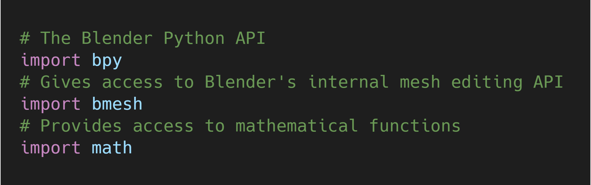{fig-align="center"}

## Define Helper Functions

I made some wrapper functions for the standard location, rotation, and scale transformations as well as getting the name of the active object.

You can get the name of the active object with `bpy.context.active_object.name`.

The three standard transformations can be accessed for individual objects with the following:

* `bpy.data.objects["object_name"].location`
* `bpy.data.objects["object_name"].rotation_euler`
* `bpy.data.objects["object_name"].scale`

I also made a function to empty the default collection so that nothing gets duplicated. Collections can be accessed with `bpy.data.collections["collection_name"]` or `bpy.data.collections[index]`.

Lastly, I made a function to easily add sequences of keyframes to a given object. The function uses the built-in `setattr()` method to set the desired value for the target object and uses the `object.keyframe_insert()` method to add the keyframe. 

{fig-align="center"}

## Set up Scene

The first thing I do is set the Color Management property, View Transform, from the default value of `Filmic` to `Standard`. This setting can be accessed at `bpy.data.scenes["Scene"].view_settings.view_transform`.

Next, I set the background to the desired color. In my case, it's pure black. The background color is stored in `bpy.data.worlds['World'].node_tree.nodes["Background"].inputs[0].default_value`.

The last setup step is to clear any objects added from the last time the script was run with the `clear_collection()` function.

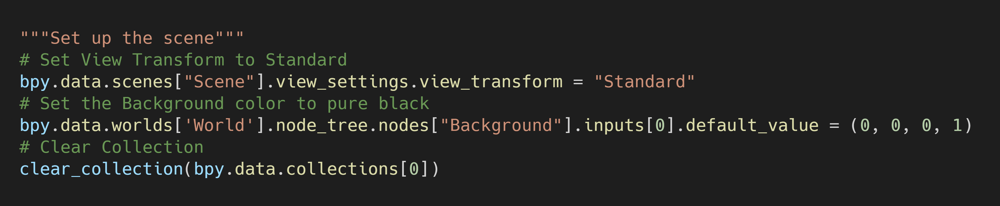{fig-align="center"}

## Create and Position Camera

Cameras can be added using the `bpy.ops.object.camera_add()` method. I then positioned the camera using the wrapper functions I defined earlier.

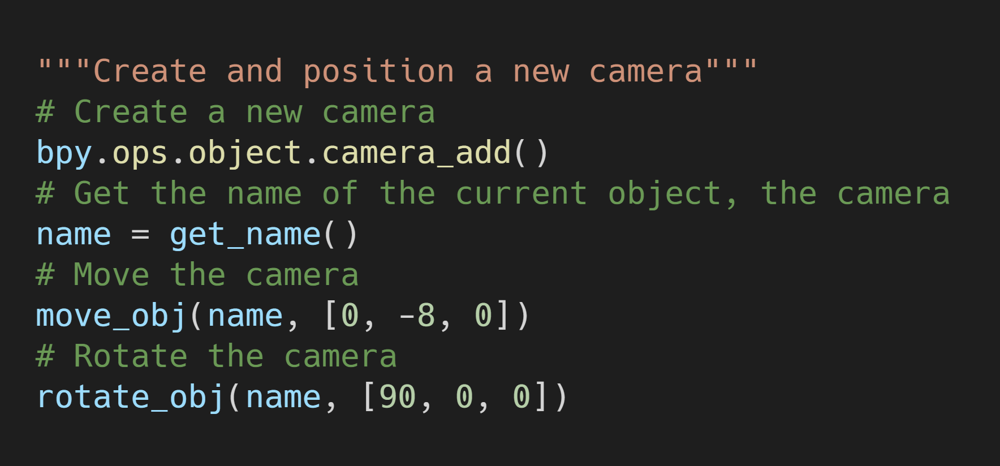{fig-align="center"}

## Create Material With Emission Shader

I decided to add some color to the motion graphic so I needed to create a new material. It is recommended to check if the material exists before trying to create it. This can be done in one line as shown below.

`material = bpy.data.materials.get(material_name) or bpy.data.materials.new(material_name)`

Since there's is no light, I'll add an `Emission` shader. This requires enabling nodes for the material with `material.use_nodes = True`. 

Next, I remove the default `Principled_BSDF` node as well as any `Emission` nodes from earlier runs. Nodes can be removed using the `material.node_tree.nodes.remove()` method.

The `Emission` node needs to be linked to the first slot in the `Material Output` node. Nodes are linked using the `material.node_tree.links.new()` method.

{fig-align="center"}

## Create a Plane With the Material

The object in the above motion graphic is a plain. Plains can be added using the `bpy.ops.mesh.primitive_plane_add()` method. 

I then assign the previously created material to the plane. Materials can be added to an object with `object.data.materials.append(material)`.

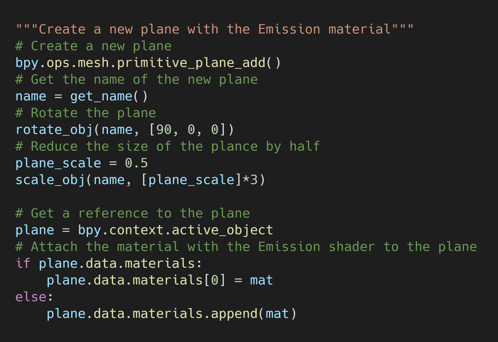{fig-align="center"}

## Cut Out Center From Plane

The next step is to make a square hole in the plane like in the above Gif. This requires modifying the mesh for the plane. 

Mesh data for the currently selected object is stored at `bpy.context.object.data`.

To edit the mesh, we need to get a BMesh representation. We first create an empty BMesh with `bm = bmesh.new()` and then fill it with the mesh using `bm.from_mesh(mesh)`.

We can make the square by adding a new inset to the plane using the `bmesh.ops.inset_individual()` method. Then, we delete the new face that gets created with `bmesh.ops.delete()`. 

The mesh then needs to be updated with these alterations using `bm.to_mesh(mesh)`. Finally, we need to free the BMesh representation we created with `bm.free()`.

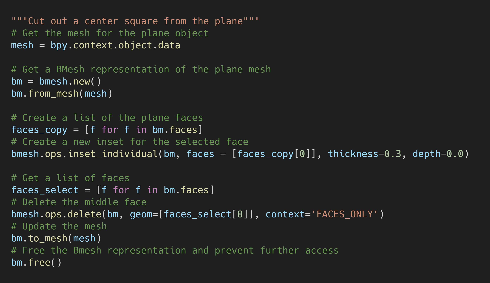{fig-align="center"}

## Add Shape Keys

We can add shape keys with the `bpy.ops.object.shape_key_add()` method. To deform the plane, we need to access its vertices. We can do this in edit mode with the `bmesh` module.

We first enter edit mode for the plane with `bpy.ops.object.mode_set(mode="EDIT")`. We can then create a new BMesh representation for the current mesh in edit mode using `bm = bmesh.from_edit_mesh(mesh)`.

The vertices are stored in `bm.verts`, but we need to create our own list since we can't index it directly.

Unlike the tutorial video, I just set the positions for the inner vertices directly. It took some trial and error to determine the correct indices for the inner vertices.

After freeing the BMesh representation, we can enter object mode with `bpy.ops.object.mode_set(mode="OBJECT")`.

#### First Shape Key

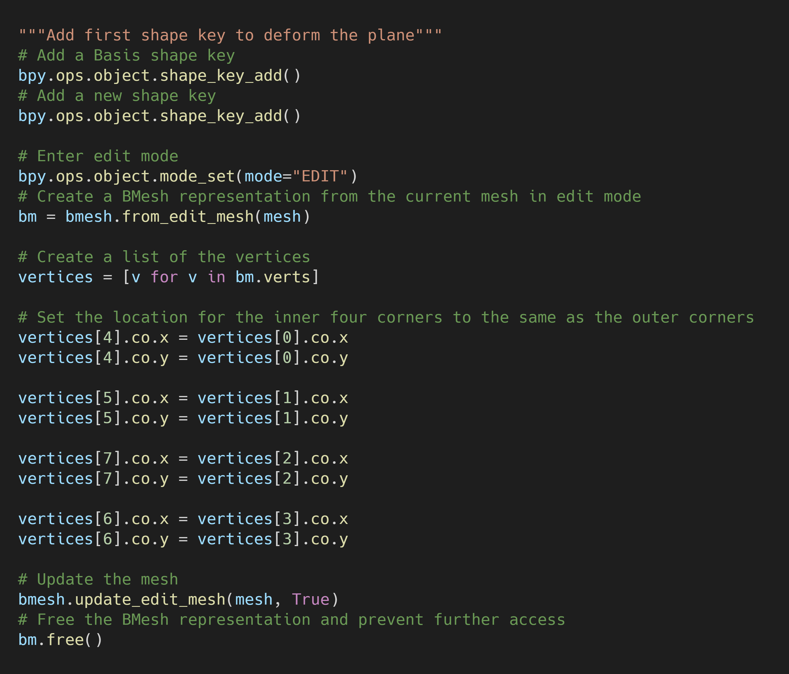{fig-align="center"}

### Second Shape Key

The process for the second shape key is identical except it only moves two of the inner vertices.

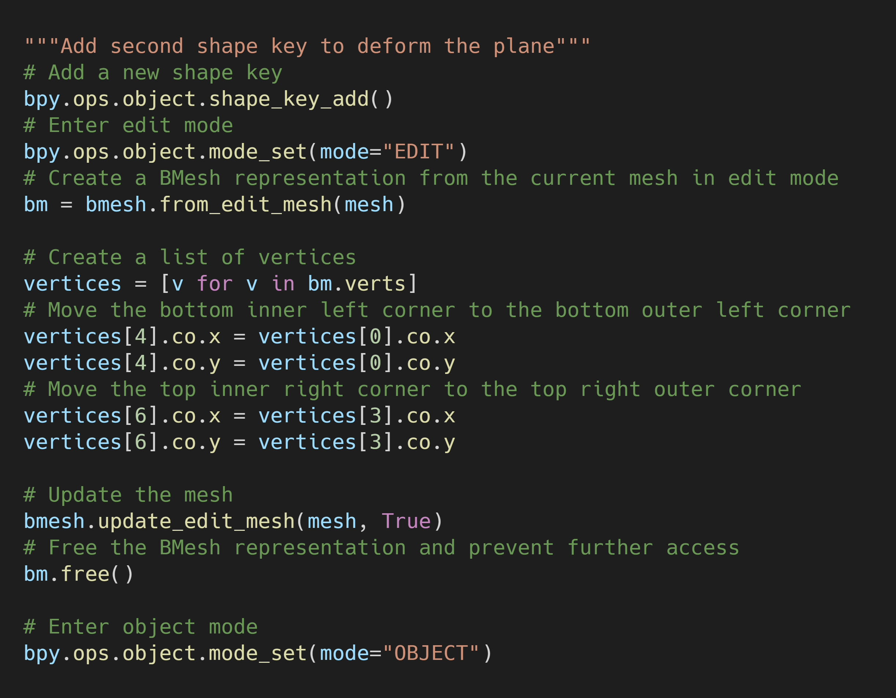{fig-align="center"}

## Add Keyframes

Before adding the keyframes, I set the render frame rate as well the start and end frames for the scene. The frame rate is stored at `bpy.context.scene.render.fps`.

The start and end frames are stored in `bpy.data.scenes['Scene'].frame_start` and `bpy.data.scenes['Scene'].frame_end` respectively. 

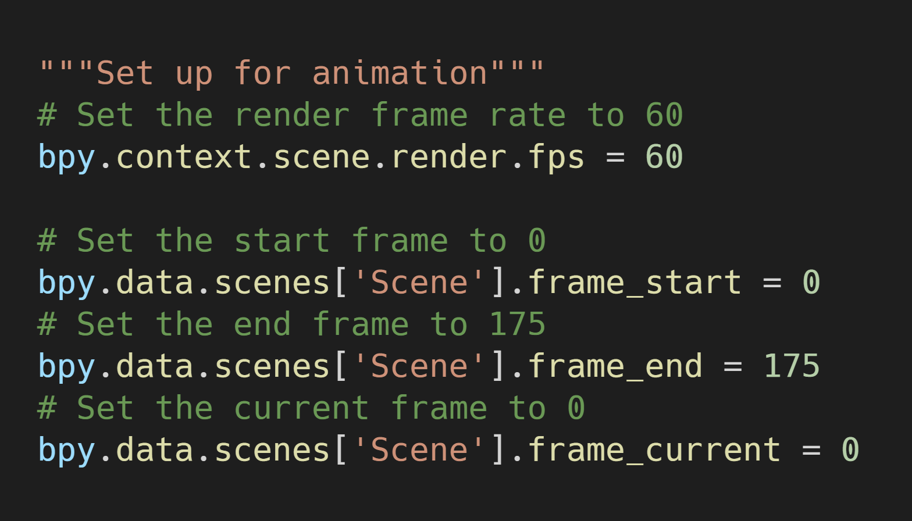{fig-align="center"}

### Shape Keys

The shape keys for the plane are stored in `bpy.context.selected_objects[0].data.shape_keys`. Individual shape keys can be accessed with `bpy.context.selected_objects[0].data.shape_keys.key_blocks[index]`.

#### First Shape Key

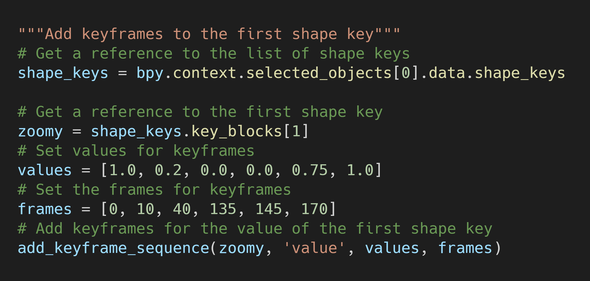{fig-align="center"}

#### Second Shape Key

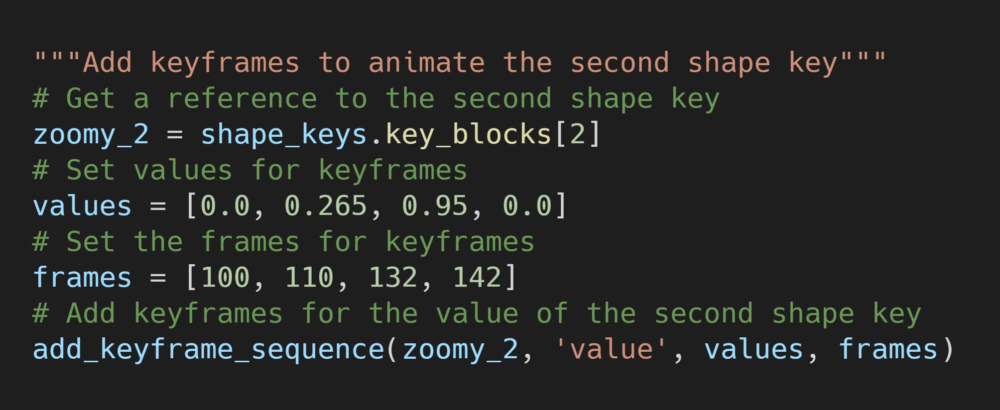{fig-align="center"}

### Plane Rotation

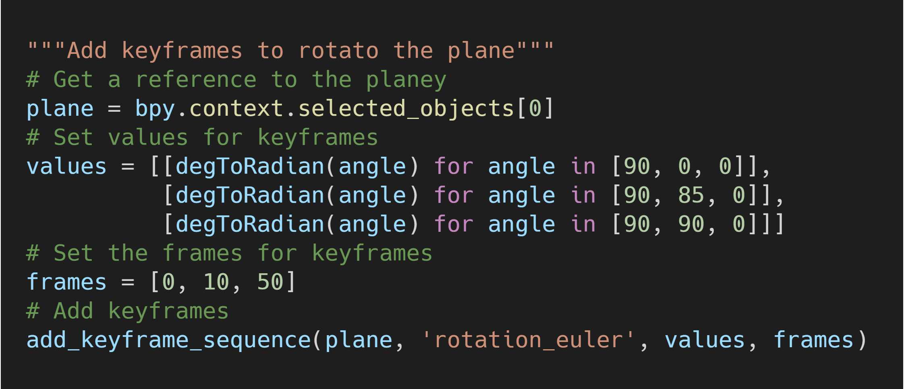{fig-align="center"}

### Material Color

The color for the Emision shader can be accessed at `material.node_tree.nodes["Emission"].inputs["Color"].default_value`.

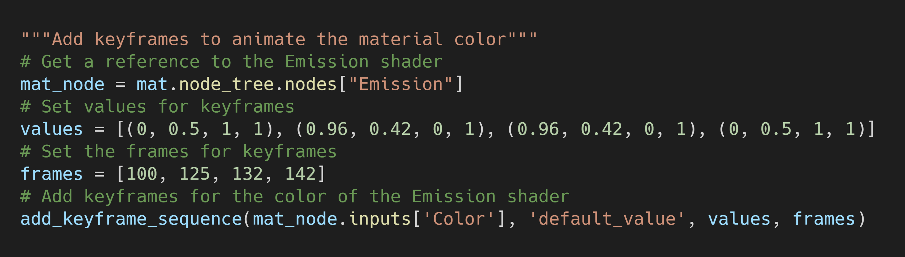{fig-align="center"}

## Conclusion

I feel like this exercise was worthwhile as it forced me to learn about multiple parts of the API. Although, it took quite a bit longer than the nine minute length of the tutorial video to track down all the required parts of the API. Finding out how to properly add the Emission shader was particularly time consuming. I did not realize that the name used to create the Emission shader was different than the name used to reference it. Fortunately, Blender has been around for a while and someone on the internet had already asked how to do most of the individual steps.

**Tutorial Resources:** [GitHub Repository](https://github.com/cj-mills/Shape-Key-Motion-Graphic-Blender-API)

<!-- Cloudflare Web Analytics --><!-- End Cloudflare Web Analytics -->