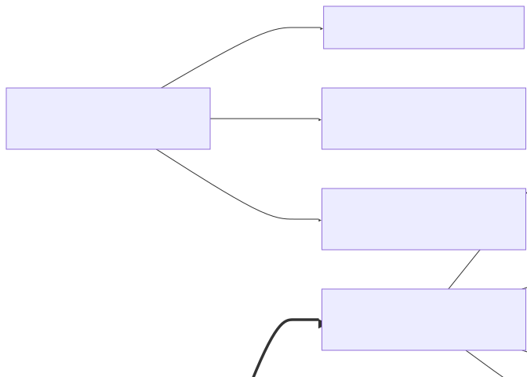

# SIWC Lecture 1: Dialogue Engineering: Problem-Solving with AI and Code
Christian Mills
2025-03-19

<script  src="../../../site_libs/quarto-diagram/mermaid-postprocess-shim.js"></script>

- [1. Course Introduction and
  Overview](#1-course-introduction-and-overview)
  - [1.1 Course Logistics and
    Administration](#11-course-logistics-and-administration)
    - [1.1.1 Technical Requirements and
      Limitations](#111-technical-requirements-and-limitations)
    - [1.1.2 Discord Usage and
      Navigation](#112-discord-usage-and-navigation)
    - [1.1.3 Course Support Resources](#113-course-support-resources)
  - [1.2 Course Philosophy and
    Approach](#12-course-philosophy-and-approach)
    - [1.2.1 Dialogue Engineering
      Concept](#121-dialogue-engineering-concept)
    - [1.2.2 Problem-Solving Framework](#122-problem-solving-framework)
    - [1.2.3 Intended Audience and
      Prerequisites](#123-intended-audience-and-prerequisites)
- [2. SolveIt Platform Introduction](#2-solveit-platform-introduction)
  - [2.1 Platform Overview and
    Purpose](#21-platform-overview-and-purpose)
    - [2.1.1 Development Background](#211-development-background)
    - [2.1.2 Design Philosophy](#212-design-philosophy)
  - [2.2 Platform Interface and
    Features](#22-platform-interface-and-features)
    - [2.2.1 Message Types](#221-message-types)
    - [2.2.2 Interface Navigation](#222-interface-navigation)
    - [2.2.3 Technical Capabilities](#223-technical-capabilities)
- [3. Problem-Solving Methodology](#3-problem-solving-methodology)
  - [3.1 Exploratory Programming
    Approach](#31-exploratory-programming-approach)
    - [3.1.1 Data Visualization at Every
      Step](#311-data-visualization-at-every-step)
    - [3.1.2 Incremental Development](#312-incremental-development)
    - [3.1.3 Flow State Programming](#313-flow-state-programming)
  - [3.2 Pair Programming Application](#32-pair-programming-application)
    - [3.2.1 Navigator and Driver
      Roles](#321-navigator-and-driver-roles)
    - [3.2.2 Collaborative
      Problem-Solving](#322-collaborative-problem-solving)
    - [3.2.3 Benefits of Multiple
      Perspectives](#323-benefits-of-multiple-perspectives)
  - [3.3 AI Integration in
    Problem-Solving](#33-ai-integration-in-problem-solving)
    - [3.3.1 Appropriate Use Cases for
      AI](#331-appropriate-use-cases-for-ai)
    - [3.3.2 Learning from AI
      Suggestions](#332-learning-from-ai-suggestions)
    - [3.3.3 Maintaining Control of the
      Process](#333-maintaining-control-of-the-process)
- [4. Advent of Code as Practice
  Framework](#4-advent-of-code-as-practice-framework)
  - [4.1 Advent of Code Overview](#41-advent-of-code-overview)
    - [4.1.1 Structure and Purpose](#411-structure-and-purpose)
    - [4.1.2 Benefits for Learning](#412-benefits-for-learning)
  - [4.2 Setting Up Advent of Code](#42-setting-up-advent-of-code)
    - [4.2.1 Account Creation and
      Authentication](#421-account-creation-and-authentication)
    - [4.2.2 Data Access in SolveIt](#422-data-access-in-solveit)
- [5. Practical Demonstration: Solving AOC 2023 Day
  1](#5-practical-demonstration-solving-aoc-2023-day-1)
  - [5.1 Problem Understanding](#51-problem-understanding)
    - [5.1.1 Reading and Analyzing
      Requirements](#511-reading-and-analyzing-requirements)
    - [5.1.2 Identifying Sample Data and Expected
      Results](#512-identifying-sample-data-and-expected-results)
  - [5.2 Data Preparation and
    Exploration](#52-data-preparation-and-exploration)
    - [5.2.1 Loading and Examining Sample
      Data](#521-loading-and-examining-sample-data)
    - [5.2.2 Data Structure Selection and
      Conversion](#522-data-structure-selection-and-conversion)
  - [5.3 Solution Development](#53-solution-development)
    - [5.3.1 Finding First and Last
      Digits](#531-finding-first-and-last-digits)
    - [5.3.2 Combining Digits into
      Numbers](#532-combining-digits-into-numbers)
    - [5.3.3 Processing Multiple Lines](#533-processing-multiple-lines)
    - [5.3.4 Solution Verification](#534-solution-verification)
  - [5.4 Solution Refinement and
    Scaling](#54-solution-refinement-and-scaling)
    - [5.4.1 Function Creation](#541-function-creation)
    - [5.4.2 Applying to Full Dataset](#542-applying-to-full-dataset)
    - [5.4.3 Final Verification](#543-final-verification)
- [6. Course Progression and Next
  Steps](#6-course-progression-and-next-steps)
  - [6.1 Homework Assignments](#61-homework-assignments)
    - [6.1.1 Completing Day 1 Part B](#611-completing-day-1-part-b)
    - [6.1.2 Attempting Day 2](#612-attempting-day-2)
  - [6.2 Future Lesson Preview](#62-future-lesson-preview)
    - [6.2.1 Advanced Applications](#621-advanced-applications)
    - [6.2.2 Additional Problem Types](#622-additional-problem-types)

> [!TIP]
>
> ### This post is part of the following series:
>
> - **SIWC Course Notes**: My notes from the **SIWC** course from
>   **Fast.ai**.  

1.  [Course Introduction and
    Overview](#course-introduction-and-overview)
2.  [SolveIt Platform Introduction](#solveit-platform-introduction)  
3.  [Problem-Solving Methodology](#problem-solving-methodology)  
4.  [Advent of Code as Practice
    Framework](#advent-of-code-as-practice-framework)  
5.  [Practical Demonstration: Solving AOC 2023 Day
    1](#practical-demonstration-solving-aoc-2023-day-1)  
6.  [Course Progression and Next
    Steps](#course-progression-and-next-steps)



## 1. Course Introduction and Overview

> *An introduction to the “Solve It With Code” course, covering both
> administrative details and the core philosophy behind the dialogue
> engineering approach.*

### 1.1 Course Logistics and Administration

> *Essential information about technical requirements, communication
> platforms, and support resources for course participants.*

#### 1.1.1 Technical Requirements and Limitations

##### 1.1.1.1 Disk Space Quotas

- **2 GB quota limit** for all user data on SolveIt platform
- **Warning**: Users exceeding 2 GB will have all data deleted within 2
  days
- **Best practice**: Keep usage well below 2 GB to avoid SQLite write
  failures
- **Typical usage example**: Instructor’s database is approximately 500
  KB

##### 1.1.1.2 Resource Usage Guidelines

- SolveIt is a **shared resource** with limited computational capacity
- **Avoid**: Running CPU-intensive processes that may affect other users
- **Future improvements**: Additional controls will be added to prevent
  accidental resource overuse
- **Troubleshooting**: Future lessons will cover how to stop instances
  using excessive resources

#### 1.1.2 Discord Usage and Navigation

##### 1.1.2.1 Channel Organization

- **Main sections**:

  - Announcements: Critical course information
  - Admin: Course management information
  - Geographic regions: Region-specific discussions
  - Topic-specific channels: For different course aspects
  - Advent of Code channels: Separate channel for each day’s challenge
    (programming puzzles used as practice in this course)

- **Navigation techniques**:

  | Technique | Purpose | How to Use |
  |----|----|----|
  | Muting channels | Reduce noise from irrelevant channels | Right-click channel → Mute channel |
  | Unread navigation | Quickly find new content | Alt+Shift+Down (Option+Shift+Down on Mac) |
  | Thread viewing | Follow conversation threads | Click on thread to open in sidebar |
  | Back navigation | Return to previous location | Cmd/Ctrl+\[ |

##### 1.1.2.2 Communication Features

- **Thread creation**: Use for multi-response conversations
  - Benefits: Keeps discussions organized
  - Method: Click “Create thread” when replying
- **Message saving**:
  - Create personal server: Add server → “My own server”
  - Forward important messages: Right-click → Forward → Select your
    server
- **Notification settings**:
  - **Recommended**: Set Announcements channel to “All Messages”
  - Method: Right-click channel → Notification Settings → All Messages

#### 1.1.3 Course Support Resources

##### 1.1.3.1 Office Hours

- **Purpose**: Direct assistance from Answer AI team members
- **Access method**: Join voice channels during scheduled events
- **Participation options**:
  - Ask questions about course content
  - Get help with SolveIt platform issues
  - Listen without participating (“lurking”)
- **Finding sessions**: Check Discord Events tab for schedule

##### 1.1.3.2 Study Groups

- **Purpose**: Peer collaboration and mutual assistance
- **Organization**: Community-driven, not necessarily led by Answer AI
  staff
- **Target audience**: Students in similar time zones or with compatible
  schedules
- **Location**: Dedicated voice channels in Discord

##### 1.1.3.3 Tutoring Options

- **Purpose**: One-on-one paid assistance
- **Arrangement**: Direct between tutors and students
  - Not formally affiliated with course
  - No commission taken by Answer AI
- **Finding tutors**: Check “tutors” thread in admin channel

### 1.2 Course Philosophy and Approach

> *The foundational concepts and methodologies that define the course,
> including dialogue engineering, Polya’s problem-solving framework, and
> considerations for participants of varying skill levels.*

#### 1.2.1 Dialogue Engineering Concept

##### 1.2.1.1 Definition and Purpose

- **Dialogue Engineering**: A structured approach to combining coding
  with AI assistance
- **Core principles**:
  - User maintains control of the process
  - Iterative, step-by-step problem solving
  - Focus on learning and improving coding skills
  - Structured conversation with both AI and code interpreter
- **Development background**:
  - Created at Answer AI over the past year
  - Evolved from teaching experiences and internal tool development
  - Addresses frustrations with existing AI coding interfaces

##### 1.2.1.2 Comparison to Traditional AI Interaction

| Aspect | Traditional AI Interaction | Dialogue Engineering Approach |
|----|----|----|
| Control | AI often takes lead | User maintains control |
| Code generation | Large blocks generated at once | Small, incremental steps |
| Verification | Post-generation review | Continuous data checking |
| Learning outcome | May reduce coding skills | Improves coding proficiency |
| Mental model | “AI does the work” | “AI assists my work” |
| Dopamine response | Quick hits from large outputs | Sustained flow state |
| Technical debt | Often high | Minimized through understanding |
| Code ownership | Unclear boundaries | Clear user ownership |

> “We often find ourselves trying to bully them or needle them or try
> every way we can to get them to actually do what we want. And then the
> process of kind of then working with them combined with code can be
> quite messy.” - Jeremy

#### 1.2.2 Problem-Solving Framework

##### 1.2.2.1 George Polya’s Approach

- **Source**: Based on mathematician George Polya’s book “How to Solve
  It”
- **Four-step framework**:
  1.  **Understand the problem**
      - Identify exactly what you’re being asked to do
      - Summarize available information
      - Restate the problem in your own words
  2.  **Devise a plan**
      - Consider similar problems you’ve seen before
      - Break problem into smaller pieces
      - Work backward from the solution
      - Consider what the step before the solution looks like
  3.  **Carry out the plan**
      - Implement the solution step by step
      - Check each step
      - Prove each step is correct
  4.  **Look back**
      - Examine the solution
      - Consider if there’s a better way
      - Think about what you learned
- **Process flow**: Understand Problem → Devise Plan → Carry Out Plan →
  Look Back → (cycle back to earlier steps as needed)
- **AI integration**: AI can assist at each stage of this framework
  - Help identify problem requirements
  - Suggest similar problems
  - Assist with implementation details
  - Evaluate solution quality

##### 1.2.2.2 Application to Programming

- **Adaptation principles**:
  - Programming problems follow similar patterns to mathematical
    problems
  - Breaking down problems is essential in both domains
  - Checking work at each step prevents cascading errors
  - Building from small, verified components to complete solutions
- **Implementation in course**:
  - Advent of Code problems serve as structured exercises
  - Solutions built incrementally with data verification at each step
  - Focus on understanding over using specialized algorithms
  - Practical demonstration in Section 5 illustrates this approach

#### 1.2.3 Intended Audience and Prerequisites

##### 1.2.3.1 Skill Level Considerations

- **Mixed audience composition**:

  - Experienced programmers (including AI researchers and professors)
  - Intermediate coders
  - Programming beginners

- **Participation approach by level**:

  | Skill Level | Suggested Approach | Expectations |
  |----|----|----|
  | Beginners | Follow examples closely, ask questions | May progress more slowly, focus on fundamentals |
  | Intermediate | Apply techniques to new problems | Balance learning new concepts with practicing skills |
  | Advanced | Help others, refresh fundamentals | May complete exercises quickly, encouraged to explore variations |

- **Community attitude**:

  - Supportive environment for all skill levels
  - Experienced members encouraged to help newer programmers
  - No expectation of perfection in communications

##### 1.2.3.2 Learning Expectations

- **Course pace**:
  - Self-directed with suggested homework
  - No concept of “falling behind”
  - Recording available for missed sessions
- **Knowledge building**:
  - Will develop Python skills through practice
  - Will learn dialogue engineering approach
  - Will improve problem-solving abilities
  - No expectation of prior Python knowledge
- **Experimental nature**:
  - Course itself is evolving and experimental
  - Student feedback will shape future direction
  - Flexibility in approach and content

## 2. SolveIt Platform Introduction

> *An overview of the custom platform developed for the course,
> including its development background, design philosophy, interface
> features, and technical capabilities.*

### 2.1 Platform Overview and Purpose

> *The development history of SolveIt, its relationship to Answer AI’s
> internal tool “AI Magic,” and the philosophy that influenced its
> user-centric, iterative design approach.*

#### 2.1.1 Development Background

##### 2.1.1.1 Relationship to AI Magic

- **SolveIt**: Education-focused version of Answer AI’s internal tool
  “AI Magic”
- **Development timeline**:
  - AI Magic developed internally throughout the past year
  - SolveIt created as simplified, education-focused adaptation
  - First public release for this course
- **Usage comparison**:
  - Jeremy uses AI Magic for 90-95% of his daily programming work
  - SolveIt contains core functionality of AI Magic tailored for
    learning

##### 2.1.1.2 Technologies Used

- **Built with**:
  - **Fast HTML**: Framework developed by Answer AI for easier building
  - **Fast Light**: Data storage technology
  - **Claude Sonnet**: AI model powering the assistant functionality
- **Architecture**:
  - Custom web application (not using Jupiter or similar)
  - Docker containers for user instances
  - Python 3.11 interpreter for code execution

#### 2.1.2 Design Philosophy

##### 2.1.2.1 User Control vs AI Control

- **Core principle**: User maintains control of the programming process
  - Contrasts with tools where AI generates large code blocks
  - Avoids the “technical debt” of not understanding generated code
  - Prevents skills deterioration from overreliance on AI
- **Mental model shift**:
  - From: “AI does the work for me”
  - To: “I solve problems with AI assistance”
- **Design considerations**:
  - Intentionally avoids “dopamine hits” from large code generation
  - Focuses on sustainable learning rather than quick results
  - May initially feel frustrating to experienced developers used to
    other AI tools

> “There’s a certain dopamine hit to typing a sentence and getting 300
> lines of code out, and it’s not necessarily healthy. And we’re
> definitely not going to give that dopamine hit.” - Jeremy

##### 2.1.2.2 Iterative Problem-Solving

- **Approach characteristics**:
  - Small, incremental steps rather than large leaps
  - Continuous data verification at each stage
  - Building understanding through exploration
  - Learning from AI suggestions rather than blindly implementing them
- **Benefits**:
  - Deeper understanding of code and problems
  - Improved debugging capabilities
  - Greater confidence in solution correctness
  - Enhanced learning and skill development

### 2.2 Platform Interface and Features

> *A detailed exploration of SolveIt’s interface components, including
> the three message types (code, note, prompt), navigation features, and
> technical capabilities that support dialogue engineering.*

#### 2.2.1 Message Types

| Message Type | Primary Purpose | Execution | Visibility to AI | Common Uses |
|----|----|----|----|----|
| Code | Execute Python | Yes | Yes | Testing, data manipulation, solution implementation |
| Note | Documentation | No | Yes | Problem statements, thoughts, organization |
| Prompt | AI interaction | No | Triggers AI response | Getting help, explanations, suggestions |

##### 2.2.1.1 Code Messages

- **Purpose**: Execute Python code in persistent interpreter
- **Functionality**:
  - Code is executed when submitted
  - Results displayed below the code
  - Variables persist between code messages
  - Execution time displayed after running
- **Best practices**:
  - End most code messages with output to verify results
  - Use consistent variable names (e.g., ‘x’ for current focus)
  - Keep code segments small and focused
  - Verify data at each step

##### 2.2.1.2 Note Messages

- **Purpose**: Document thoughts, questions, or problem statements
- **Functionality**:
  - Supports markdown formatting
  - Visible to both user and AI assistant
  - No execution or response generated
  - Can include code blocks using triple backticks
- **Common uses**:
  - Documenting problem requirements
  - Taking notes on approach or strategy
  - Creating section headers for organization
  - Preserving important information for reference

##### 2.2.1.3 Prompt Messages

- **Purpose**: Direct interaction with the AI assistant
- **Functionality**:
  - Questions or requests sent to Claude Sonnet
  - AI responds with markdown-formatted text
  - AI can see all previous messages above the prompt
  - Code suggestions can be copied with one click
- **Effective usage**:
  - Ask for help with syntax or programming concepts
  - Request explanations of error messages
  - Get suggestions for approach or strategy
  - Learn about unfamiliar functions or libraries

#### 2.2.2 Interface Navigation

##### 2.2.2.1 Keyboard Shortcuts

- **Message type selection**:
  - Control/Command + J: Code message
  - Control/Command + K: Note message
  - Control/Command + L: Prompt message
- **Execution shortcuts**:
  - Control/Command + Enter: Submit current message
  - Control/Command + Shift: Various platform functions
- **Code editing**:
  - Control/Command + Right bracket: Indent selected lines
  - Tab: Autocomplete suggestions

##### 2.2.2.2 Message Editing

- **Editing existing messages**:
  - Click on message title to edit (most reliable method)
  - Double-click message content to edit (may change in future)
- **Message management**:
  - Add messages above or below any existing message
  - Copy messages with “Add message with code” button
  - Run all code messages with “Run all” button
  - Clear Python interpreter state with “Clear” button

#### 2.2.3 Technical Capabilities

##### 2.2.3.1 Python Environment

- **Specifications**:
  - Python 3.11 interpreter
  - Persistent between messages
  - Standard library available
  - Pre-installed packages include:
    - numpy, matplotlib, pandas
    - advent-of-code-data
    - scipy, beautifulsoup4, lxml
    - networkx, graphviz
    - duckdb, sympy
    - httpx, pillow
    - ghapi, fastcore
- **Environment features**:
  - Dynamic autocomplete based on actual objects
  - Function argument hints
  - Variable inspection panel
  - Help documentation access

##### 2.2.3.2 Persistence Features

- **Instance persistence**:
  - Each user gets unique subdomain URL
  - Docker container with 1 CPU, 1GB RAM, 2GB disk
  - Environment persists indefinitely (not ephemeral)
  - Can install additional packages with pip
- **Dialogue saving**:
  - Dialogues saved automatically as you work
  - No manual saving required
  - Accessible from dashboard after disconnecting
  - Multiple dialogues can be created and managed

##### 2.2.3.3 Export Options

- **Export formats**:
  - IPython notebook (.ipynb)
  - Python file (.py)
- **Additional settings**:
  - Light/dark theme toggle
  - Environment secrets management
  - Context setting for AI assistant

## 3. Problem-Solving Methodology

> *The structured approach to solving programming problems using
> exploratory programming, pair programming, and AI integration
> techniques that form the core methodology of the course.*

### 3.1 Exploratory Programming Approach

> *A programming methodology focused on continuous data verification,
> incremental development, and creating a sustainable flow state that
> leads to more reliable and understandable solutions.*

| Aspect | Traditional Approach | Exploratory Approach |
|----|----|----|
| Planning | Extensive upfront design | Evolving design through exploration |
| Implementation | Large code blocks | Small, incremental steps |
| Verification | Testing after implementation | Continuous data checking |
| Debugging | Dedicated debugging phase | Integrated throughout process |
| Flow | Separate planning and coding | Integrated thinking and doing |

#### 3.1.1 Data Visualization at Every Step

- **Core principle**: Examine data after every operation
  - Prevents cascading errors from incorrect assumptions
  - Builds understanding of data transformations
  - Reduces debugging time and complexity
- **Implementation practices**:
  - End most code blocks with output display
  - Print intermediate variables to verify values
  - Visually inspect data structures and types
  - Verify expectations match reality at each step
- **Common mistake avoided**:
  - Writing extensive code without checking results
  - Making assumptions about data structure or content
  - Discovering errors only after many dependent steps

> “This is a huge mistake I find even from very experienced developers
> is that they don’t look at their data at every single point.”

#### 3.1.2 Incremental Development

- **Process characteristics**:
  - Start with a single example rather than full dataset
  - Build solution in small, verifiable steps
  - Test each component before combining
  - Gradually expand scope once core logic works
- **Benefits**:
  - Easier to understand and debug small pieces
  - Builds confidence in solution correctness
  - Creates natural checkpoints for verification
  - Reduces cognitive load by focusing attention
- **Application pattern**:
  1.  Select minimal representative example
  2.  Solve for single case manually
  3.  Translate manual solution to code
  4.  Verify with test case
  5.  Expand to handle full dataset

#### 3.1.3 Flow State Programming

- **Characteristics of flow state**:
  - Continuous improvement without major roadblocks
  - Solutions typically work first time when applied
  - Confidence in code correctness at each step
  - Reduced anxiety about unexpected errors
- **Enablers of flow state**:
  - Small, manageable steps
  - Continuous data verification
  - Clear understanding of each operation
  - Immediate feedback loop
- **Jeremy’s experience**:
  - “Programming normally works for me… I am normally in a flow state”
  - “I am normally continuously improving”
  - “When I apply my function to my input, it works first time”
  - “It’s not because I’m clever… it’s because I check my data at every
    point”

### 3.2 Pair Programming Application

> *The collaborative problem-solving approach using navigator and driver
> roles, where responsibilities are divided between conceptual
> problem-solving and implementation to leverage multiple perspectives.*

#### 3.2.1 Navigator and Driver Roles

- **Driver responsibilities**:
  - Types code and implements solutions
  - Focuses on syntax correctness
  - Executes the approach determined by navigator
  - Maintains code organization and readability
- **Navigator responsibilities**:
  - Determines solution approach
  - Solves problems conceptually
  - Researches necessary information
  - Identifies potential issues or edge cases
- **Communication pattern**:
  - Navigator describes solution strategy
  - Driver implements strategy in code
  - Both verify results together
  - Roles can switch as needed

#### 3.2.2 Collaborative Problem-Solving

- **Interaction dynamics**:
  - Verbal articulation of thought processes
  - Real-time feedback and correction
  - Shared responsibility for solution quality
  - Combined knowledge and experience
- **Dialogue patterns**:
  - Explicit reasoning about approach
  - Questions to clarify understanding
  - Suggestions for alternatives
  - Immediate validation of ideas
- **Course implementation**:
  - Jeremy as driver (typist)
  - Jono as navigator (solution strategist)
  - Demonstration of thinking process verbally
  - Explicit handoffs between conceptual and implementation phases

#### 3.2.3 Benefits of Multiple Perspectives

- **Error detection improvements**:
  - Second set of eyes catches mistakes
  - Different mental models identify different issues
  - Immediate feedback prevents compounding errors
- **Knowledge sharing**:
  - Exposure to different problem-solving approaches
  - Learning from partner’s techniques and knowledge
  - Verbalization forces clearer thinking
- **Example from demonstration**:
  - Jono spotted variable name error (x vs. lines)
  - Different approaches to finding first/last digits discussed
  - Complementary skills in syntax vs. strategy

### 3.3 AI Integration in Problem-Solving

> *Techniques for effectively incorporating AI assistance into the
> problem-solving process while maintaining user control, expanding
> knowledge, and avoiding over-reliance on generated solutions.*

#### 3.3.1 Appropriate Use Cases for AI

- **Syntax assistance**:
  - Fixing code errors
  - Providing correct syntax for unfamiliar operations
  - Suggesting appropriate function calls
- **Knowledge gaps**:
  - Explaining unfamiliar concepts
  - Providing information about libraries or functions
  - Suggesting approaches for specific problems
- **Problem understanding**:
  - Helping identify requirements
  - Restating problems in different terms
  - Breaking down complex problems
- **Non-recommended uses**:
  - Generating complete solutions without understanding
  - Replacing learning with dependency
  - Outsourcing core problem-solving skills

#### 3.3.2 Learning from AI Suggestions

- **Knowledge expansion approach**:

  - Investigate every new function or concept mentioned by AI
  - Read documentation for unfamiliar elements
  - Understand principles, not just implementation

- **Example process**:

      1. AI suggests using int() function to convert string to integer
      2. Check documentation with help(int) or int?
      3. Learn about additional parameters like base conversion
      4. Incorporate understanding into solution

- **Depth over convenience**:

  - Go beyond immediate solution
  - Build lasting knowledge from each interaction
  - Develop ability to modify and adapt solutions

- **Jeremy’s approach**:

  - “As soon as AI tells me about any feature of any library or any
    programming language or anything that I didn’t know before, I always
    check it and learn about it”
  - “I have read the docs for every Python function I’ve ever used”

- **Real-world example: Fractional indexing discovery**:

  - **Problem context**: Jeremy needed to insert messages between
    existing messages in SolveIt
    - Traditional approach: Messages had auto-incrementing integer IDs
    - Challenge: Cannot insert a key between integer keys (e.g., between
      5 and 6)
  - **Discovery process**:
    1.  **Initial insight**: Wondered if float keys could allow
        insertion between values
    2.  **AI consultation**: Asked AI Magic, “What if we made this ID a
        float, and I could insert things between them?”
    3.  **Validation**: AI confirmed this was a viable approach
    4.  **Knowledge expansion**: Asked AI, “Does this thing have a
        name?”
    5.  **Concept identification**: Learned it was called “fractional
        indexing”
    6.  **Independent research**: Googled the term to learn more
    7.  **Solution refinement**: Discovered a Python library for
        fractional indexing
    8.  **Implementation improvement**: Found library used base-65
        encoded digits instead of floats
  - **Learning outcomes**:
    - Discovered an established algorithm for a seemingly novel problem
    - Found a better implementation than initially conceived
    - Gained reusable knowledge applicable to future problems
    - Developed deeper understanding by going beyond AI’s initial
      suggestion
  - **Key principle demonstrated**:
    - Use AI to help identify concepts and possibilities
    - Don’t stop at the first working solution
    - Verify and expand knowledge through documentation and research
    - Build lasting understanding rather than temporary fixes

#### 3.3.3 Maintaining Control of the Process

- **Mental model of AI interaction**:
  - AI sees what’s “above” current position in dialogue
  - AI doesn’t have access to interpreter state
  - AI responds to text, not to execution results
- **Control techniques**:
  - Explicit, specific questions rather than open-ended requests
  - Breaking problems into small, manageable pieces
  - Verifying and understanding all suggestions before implementation
  - Maintaining your own solution strategy
- **Dialogue structure importance**:
  - Positioning questions strategically in dialogue
  - Adding context through notes when needed
  - Building conversation that AI can follow
  - Using headings and organization to maintain clarity

## 4. Advent of Code as Practice Framework

> *An introduction to Advent of Code as the primary practice environment
> for the course, including its structure, educational benefits, and
> setup process within the SolveIt platform.*

### 4.1 Advent of Code Overview

> *A description of the Advent of Code programming challenge, its
> structure, and why its well-defined problems with clear validation
> make it an ideal framework for practicing dialogue engineering.*

#### 4.1.1 Structure and Purpose

- **What is Advent of Code**:
  - Annual programming challenge running throughout December
  - One new puzzle released each day (25 total)
  - Created by Eric Wastl
  - Available at adventofcode.com
  - Course will primarily use 2023 puzzles
- **Puzzle structure**:
  - Each day contains two related parts
  - Part 2 unlocks after completing Part 1
  - Each part requires submitting a specific answer (often a number)
  - Puzzles follow a continuous holiday-themed narrative
- **Technical characteristics**:
  - Well-specified programming problems with clear requirements
  - Includes sample data with expected outputs
  - Validation of solutions through answer submission
  - Increasing difficulty as days progress

#### 4.1.2 Benefits for Learning

- **Educational advantages**:
  - **Well-defined scope**: No changing requirements or scope creep
  - **Clear validation**: Immediate feedback on solution correctness
  - **Progressive difficulty**: Builds skills gradually
  - **Diverse challenges**: Covers various programming concepts
- **Suitability for dialogue engineering**:
  - Structured problems ideal for step-by-step approach
  - Sample data perfect for incremental development
  - Self-contained nature focuses on problem-solving techniques
  - Solvable with basic programming knowledge
- **Learning vs. competition approach**:
  - Course emphasizes understanding over speed
  - Focus on process rather than just getting answers
  - Building transferable problem-solving skills
  - Understanding fundamentals rather than specialized algorithms

> “One of the interesting things that’s kind of fun that happens as you
> finish a challenge is it opens up the Advent of Code forum for that
> challenge where you can read other people’s solutions. And as you get
> to the later ones, you’ll see pretty much all the solutions are from
> people who seem to have a very extensive background… It can make you
> think like, oh, the way to solve these problems is to learn a thousand
> individual special case things. But actually we’re going to be
> explaining how to solve all of the things that we cover with nothing
> other than the Python standard library and a basic understanding which
> we’ll develop during the course of lists and dictionaries.”

- **Sample vs. Full Input Approach Comparison**:

  | Aspect | Sample Input | Full Input |
  |----|----|----|
  | Source | Provided in problem description | Retrieved via aocd or website |
  | Size | Small, manageable examples | Often large datasets |
  | Purpose | Development and testing | Final verification |
  | When to use | During solution development | After solution works on samples |
  | Verification | Compare with expected output in description | Submit answer to website |

### 4.2 Setting Up Advent of Code

> *Step-by-step instructions for creating an Advent of Code account,
> configuring authentication in SolveIt, and accessing puzzle data
> through the provided libraries.*

#### 4.2.1 Account Creation and Authentication

- **Account requirements**:
  - Free account needed to access puzzles and submit answers
  - Can log in via GitHub, Google, Twitter, or Reddit
  - Each user receives personalized input data
  - Solutions must be verified with your specific data
- **Authentication process**:
  - Create/log into account at adventofcode.com
  - Browser stores session cookie for authentication
  - This session ID is needed to access data programmatically

#### 4.2.2 Data Access in SolveIt

##### 4.2.2.1 Session Key Configuration

- **Retrieving session key**:
  1.  Log into Advent of Code website
  2.  Open browser developer tools (Control+Shift+C)
  3.  Navigate to Application tab → Cookies
  4.  Find and copy the “session” cookie value
- **Configuring in SolveIt**:
  1.  Click on Settings in SolveIt interface
  2.  Select Secrets tab
  3.  Add new secret with name “AOC_SESSION”
  4.  Paste session cookie value
  5.  Save the secret
- **Security considerations**:
  - Keep session key private
  - SolveIt stores this securely as an environment variable
  - No need to include key in code or notebooks

##### 4.2.2.2 Using the AOC Data Library

- **Advent-of-code-data package**:

  - Pre-installed in SolveIt environment
  - Provides easy access to puzzle inputs
  - Handles authentication automatically
  - Caches data to avoid unnecessary requests

- **Basic usage**:

  ``` python
  from aocd import get_data

  # Get data for specific day and year
  data = get_data(day=1, year=2023)

  # Print sample to verify
  print(data[:100])  # Show first 100 characters
  ```

- **Alternative approaches**:

  - Manual copy-paste from website (less convenient)
  - Direct HTTP requests (more complex)
  - Local file storage (requires additional setup)

- **Best practice**:

  - Test solutions with sample data first
  - Only use full input when sample works correctly
  - Parse input string appropriately for each problem

## 5. Practical Demonstration: Solving AOC 2023 Day 1

> *A comprehensive walkthrough of solving Advent of Code 2023 Day 1 Part
> A, demonstrating the dialogue engineering approach from problem
> understanding through solution implementation and verification.*

### 5.1 Problem Understanding

> *The process of carefully reading and analyzing the problem
> requirements, identifying key components, and selecting appropriate
> test cases before beginning implementation.*

#### 5.1.1 Reading and Analyzing Requirements

- **Problem summary**:
  - Recover calibration values from a document
  - Each line contains a calibration value formed by combining digits
  - Need to find the first and last digit in each line
  - Combine these digits to form a two-digit number
  - Sum all these numbers for the final answer
- **Key requirements identification**:
  - Extract first digit from each line
  - Extract last digit from each line
  - Combine digits to form a number (not addition)
  - Process all lines in the input
  - Sum the resulting numbers
- **Problem clarification approach**:
  - Read problem statement completely before starting
  - Identify explicit requirements and implicit assumptions
  - Use notes to document understanding
  - Reference problem description throughout solution process

#### 5.1.2 Identifying Sample Data and Expected Results

- **Sample input provided**:

      1abc2
      pqr3stu8vwx
      a1b2c3d4e5f
      treb7uchet

- **Expected outputs**:

  - Line 1: First digit = 1, Last digit = 2, Value = 12
  - Line 2: First digit = 3, Last digit = 8, Value = 38
  - Line 3: First digit = 1, Last digit = 5, Value = 15
  - Line 4: First digit = 7, Last digit = 7, Value = 77
  - Sum of all values: 12 + 38 + 15 + 77 = 142

- **Test case selection**:

  - Choose representative example (line 2: “pqr3stu8vwx”)
  - Verify understanding with expected result (38)
  - Start with single case before handling all cases

### 5.2 Data Preparation and Exploration

> *Techniques for loading, examining, and structuring the sample data to
> facilitate exploration and incremental solution development.*

#### 5.2.1 Loading and Examining Sample Data

- **Data loading approach**:

  - Copy sample input directly from problem description
  - Store in variable using triple quotes for multi-line string
  - Print data to verify correct loading

- **Implementation**:

  ``` python
  # Store sample input
  samp = """1abc2
  pqr3stu8vwx
  a1b2c3d4e5f
  treb7uchet"""

  # Verify data
  print(samp)
  ```

- **Data inspection**:

  - Visually verify correct formatting
  - Check for any unexpected characters or whitespace
  - Ensure line breaks are preserved

#### 5.2.2 Data Structure Selection and Conversion

- **Structure selection rationale**:

  - Problem requires processing each line individually
  - List structure allows access to individual lines
  - String splitting provides clean separation of lines

- **Conversion to list**:

  ``` python
  # Split into lines
  lines = samp.splitlines()

  # Verify result
  print(lines)
  ```

- **Single example selection**:

  - Choose second line for detailed exploration
  - Store in variable for focused development
  - Print to verify selection

  ``` python
  # Select single example
  x = lines[1]  # "pqr3stu8vwx"

  # Verify selection
  print(x)
  ```

### 5.3 Solution Development

> *The step-by-step process of building a solution, from character
> iteration and digit identification to combining digits and processing
> multiple lines, with continuous verification at each stage.*

#### 5.3.1 Finding First and Last Digits

##### 5.3.1.1 Character Iteration

- **Approach selection**:

  - Iterate through each character in the string
  - Check if character is a digit
  - Track first and last digits found

- **Initial implementation**:

  ``` python
  # Loop through each character
  for o in x:
      print(o)
  ```

- **Verification**:

  - Confirm each character is processed individually
  - Observe output to ensure iteration works as expected

##### 5.3.1.2 Digit Identification

- **Digit detection method**:

  - Use Python’s built-in `isdigit()` string method
  - Test each character to determine if it’s a digit
  - Print results to verify correct identification

- **Implementation and testing**:

  ``` python
  # Test digit detection
  for o in x:
      print(o, o.isdigit())
  ```

- **First and last digit extraction**:

  ``` python
  # Initialize variables
  first = None
  last = None

  # Find first digit
  for o in x:
      if o.isdigit():
          first = o
          break

  # Find last digit
  for o in x:
      if o.isdigit():
          last = o

  # Show results
  print("First digit:", first)
  print("Last digit:", last)
  ```

- **Issue identification**:

  - Last digit implementation overwrites with each new digit
  - Need to keep updating the “last” variable throughout the loop

#### 5.3.2 Combining Digits into Numbers

- **String concatenation approach**:

  - Combine first and last digits as strings
  - Convert the combined string to an integer

- **Implementation**:

  ``` python
  # Combine digits
  combined = first + last

  # Convert to integer
  result = int(combined)

  # Verify result
  print(result)  # Should be 38
  ```

- **Understanding the conversion**:

  - String concatenation: “3” + “8” = “38”
  - Integer conversion: int(“38”) = 38
  - Not mathematical addition: 3 + 8 ≠ 38

#### 5.3.3 Processing Multiple Lines

- **Function creation**:

  - Encapsulate digit-finding logic in a function
  - Apply to each line in the input
  - Collect results for all lines

- **Implementation**:

  ``` python
  def get_digits(x):
      first = None
      last = None

      # Find first digit
      for o in x:
          if o.isdigit():
              first = o
              break

      # Find last digit
      for o in x:
          if o.isdigit():
              last = o

      return first, last

  # Process all lines
  results = []
  for line in lines:
      first, last = get_digits(line)
      result = int(first + last)
      results.append(result)

  # Show all results
  print(results)
  ```

#### 5.3.4 Solution Verification

- **Sum calculation**:

  ``` python
  # Calculate sum
  total = sum(results)

  # Verify against expected result
  print(total)  # Should be 142
  ```

- **Validation against expected output**:

  - Confirm individual line results match expectations
  - Verify final sum matches expected 142
  - Check for any unexpected behavior or edge cases

### 5.4 Solution Refinement and Scaling

> *The process of encapsulating the solution in a reusable function,
> applying it to the full dataset, and performing final verification to
> ensure correctness.*

#### 5.4.1 Function Creation

- **Final solution function**:

  ``` python
  def solve_1a(lines):
      res = 0
      for line in lines:
          first, last = get_digits(line)
          res += int(first + last)
      return res
  ```

- **Function design considerations**:

  - Clear, descriptive name (solve_1a)
  - Single responsibility (solving part A of day 1)
  - Takes input lines as parameter
  - Returns final sum as result

#### 5.4.2 Applying to Full Dataset

- **Loading full input**:

  ``` python
  from aocd import get_data

  # Get actual puzzle input
  inp = get_data(day=1, year=2023)

  # Convert to lines
  full_lines = inp.splitlines()
  ```

- **Solution application**:

  ``` python
  # Apply solution to full dataset
  answer = solve_1a(full_lines)

  # Display result
  print(answer)
  ```

#### 5.4.3 Final Verification

- **Correctness checks**:
  - Verify solution works correctly on sample data
  - Confirm solution produces correct result on full data
  - Check for any performance issues with larger dataset
- **Result submission**:
  - Submit answer to Advent of Code website
  - Receive confirmation of correct solution
  - Unlock part B of the challenge

## 6. Course Progression and Next Steps

> *An outline of immediate homework assignments and the future direction
> of the course, including upcoming applications and the evolving nature
> of the course content.*

### 6.1 Homework Assignments

> *Specific tasks for students to complete before the next lesson,
> including finishing Day 1 Part B and attempting Day 2, with
> flexibility considerations for different skill levels.*

#### 6.1.1 Completing Day 1 Part B

- **Assignment details**:
  - Complete the second half of Advent of Code 2023 Day 1
  - Apply the same dialogue engineering approach demonstrated in class
  - Follow the step-by-step problem-solving methodology
  - Verify solution with both sample and full data
- **Learning objectives**:
  - Practice the exploratory programming approach independently
  - Reinforce understanding of data verification at each step
  - Apply the problem-solving techniques without instructor guidance
  - Build confidence in solving problems with dialogue engineering
- **Support resources**:
  - Reference the class demonstration for Part A
  - Use Discord channels for questions
  - Attend office hours if needed

#### 6.1.2 Attempting Day 2

- **Assignment details**:
  - Attempt Advent of Code 2023 Day 2 (both parts if possible)
  - Apply the same methodology to a new problem
  - Focus on process rather than just getting the answer
  - Document your approach and solution
- **Flexibility considerations**:
  - No strict deadline for completion
  - No concept of “falling behind” in the course
  - Adapt pace to your comfort level and available time
  - Focus on understanding rather than speed
- **Alternative options**:
  - For those finding Day 2 challenging: Focus on mastering Day 1
    completely
  - For experienced programmers: Try additional days or explore
    variations
  - When Advent of Code 2024 begins: Try the new puzzles as they’re
    released

### 6.2 Future Lesson Preview

> *A glimpse of the advanced applications, expanded problem domains, and
> community-driven aspects that will shape the course as it progresses
> beyond the initial lessons.*

#### 6.2.1 Advanced Applications

- **Expanded problem domains**:
  - Screen scraping applications
  - Machine learning evaluation
  - Data processing tasks
  - Web-based applications
- **Methodology extensions**:
  - Applying dialogue engineering to larger projects
  - Handling more complex data structures
  - Working with external APIs and services
  - Developing reusable components
- **Learning progression**:
  - Building from fundamental concepts to advanced applications
  - Gradually introducing more complex Python features
  - Developing deeper understanding of problem-solving patterns
  - Expanding beyond Advent of Code to real-world problems

#### 6.2.2 Additional Problem Types

- **Course structure plans**:
  - Combination of Advent of Code problems and other examples
  - Show and tell segments featuring interesting applications
  - Demonstrations of dialogue engineering for different domains
  - Incorporation of student questions and examples
- **Community involvement**:
  - Discord discussions will influence future lesson content
  - Student examples may be featured in later lessons
  - Questions about applying techniques to specific domains will be
    addressed
  - Collaborative exploration of the dialogue engineering approach
- **Experimental nature**:
  - Course will evolve based on student feedback and experiences
  - New techniques and approaches will be introduced as developed
  - Balance between structured teaching and exploratory learning
  - Continuous refinement of the dialogue engineering methodology

------------------------------------------------------------------------

> [!TIP]
>
> ### About Me:
>
> I’m Christian Mills, a deep learning consultant specializing in
> practical AI implementations. I help clients leverage cutting-edge AI
> technologies to solve real-world problems.
>
> Interested in working together? Fill out my [Quick AI Project
> Assessment](https://docs.google.com/forms/d/e/1FAIpQLScKDKPJF9Be47LA3nrEDXTVpzH2UMLz8SzHMHM9hWT5qlvjkw/viewform?usp=sf_link)
> form or learn more [about me](../../../about.html).
