---
categories:
- style_transfer
- unity
- tutorial
date: 2021-7-4
description: This post covers how to select which game objects get stylized in the
  Unity scene.
hide: false
layout: post
search_exclude: false
title: Targeted In-Game Style Transfer Tutorial
toc: false

aliases:
- /Targeted-In-Game-Style-Transfer-Tutorial/
---

* [Overview](#overview)
* [Download Unity Project](#download-unity-project)
* [Method](#method)
* [Create Depth Cameras](#create-depth-cameras)
* [Update StyleTransferShader](#update-styletransfershader)
* [Update StyleTransfer Script](#update-styleTransfer-script)
* [Assign Depth Cameras](#assign-depth-cameras)
* [Assign Stylize Layer With Code](#assign-stylize-layer-with-code)
* [Conclusion](#conclusion)

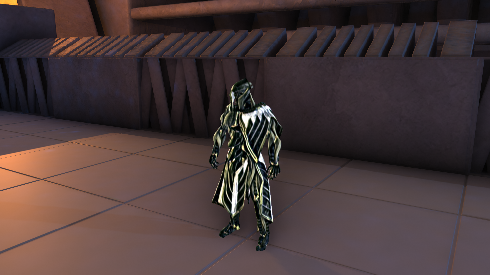

## Overview

In this follow up to the in-game style transfer [tutorial](../end-to-end-in-game-style-transfer-tutorial/part-1/), we'll cover a method to stylize specific GameObjects in a Unity. This tutorial builds on the project from the previous tutorial. If you did not follow that tutorial, you can follow the steps to download the project below. 


## Download Unity Project

**Note:** You can skip this section If you followed the previous tutorial and already have the project.

You can download the project from the previous tutorial by clicking on the link below.

* GitHub Repository: ([download](https://github.com/cj-mills/End-to-End-In-Game-Style-Transfer-Tutorial/archive/refs/heads/main.zip))

Once the download is complete, extract the project folder.

Open Unity Hub and click the `Add` button.

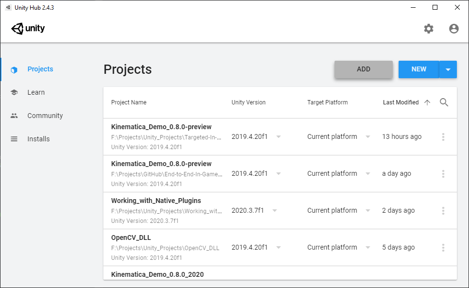

Navigate to the extracted `End-to-End-In-Game-Style-Transfer-Tutorial-Intel-main` folder and select the `Kinematica_Demo_0.8.0-preview` folder.

We'll be working in Unity 2019.4.20, but later versions are also supported.

The project will take several minutes to open the first time as it imports the project assets.

### Fix `AssetImporter` Error

You might get an error like the one below after opening the project in Unity. 

`AssetImporter is referencing an asset from the previous import. This should not happen.`

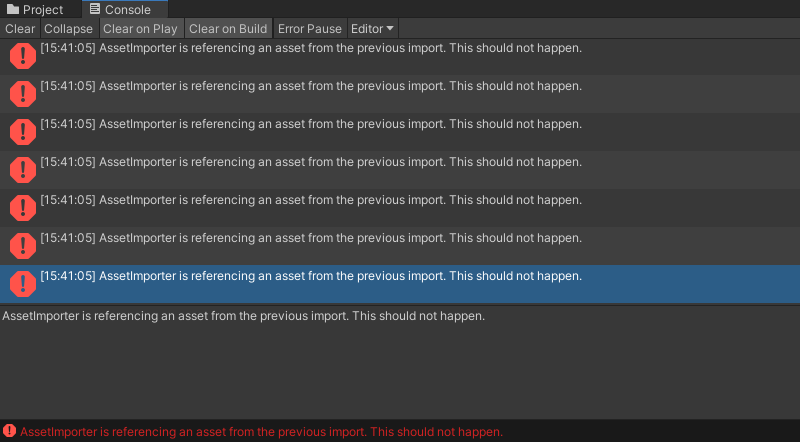

You can fix this issue by rebuilding the Unit asset. Open the `Kinematica` folder in the Assets section and double-click on the `Unit` asset. This will open the `Kinematica Asset Builder` window. 

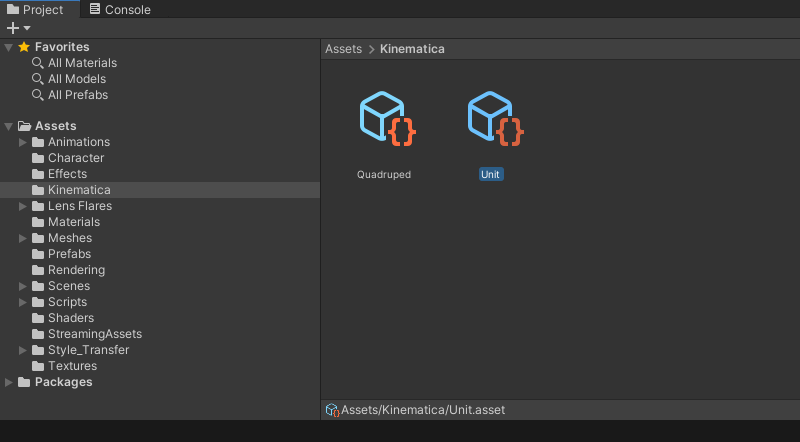

Click `Build` in the pop-up window. You can close the pop-up window once the build is complete.

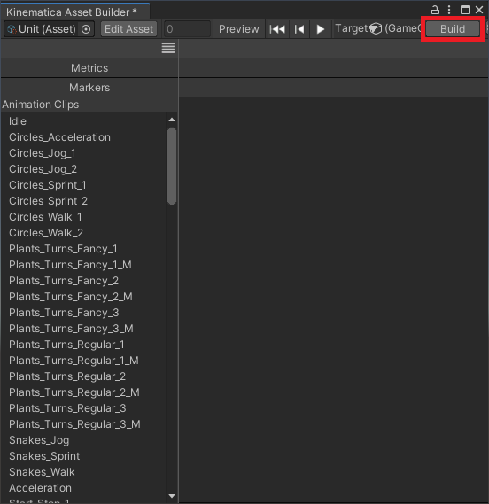


Back in the `Assets` section, open the `Biped` scene in the `Scenes` folder. The project should run normally now. However, there might be some stuttering the first time it is run.

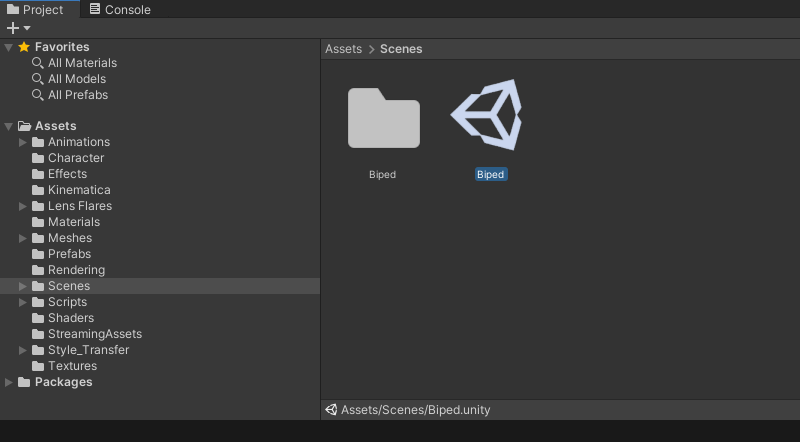


## Method

For this method, we'll still be using the entire camera frame as the input for the style transfer model. However, we can use [Layers](https://docs.unity3d.com/Manual/Layers.html) to identify what parts of the final image will be from the stylized version of the current frame.

We'll need to capture depth data from the scene to determine what needs to be stylized at runtime. We can't use the regular color data because the lighting is different when a camera only renders certain parts of the scene.

#### Standard Scene

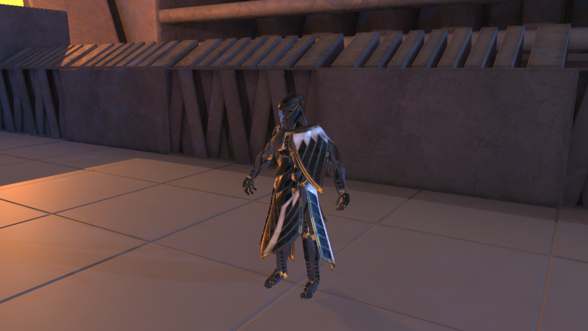

#### Character Only

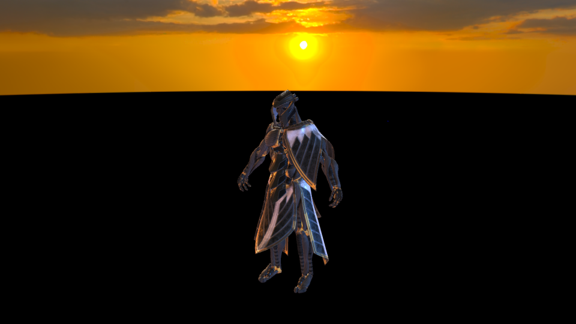


Here is an example of depth data captured from the camera that has been edited to be more easily viewable. Depth data is stored in the red color channel and can be difficult to see.

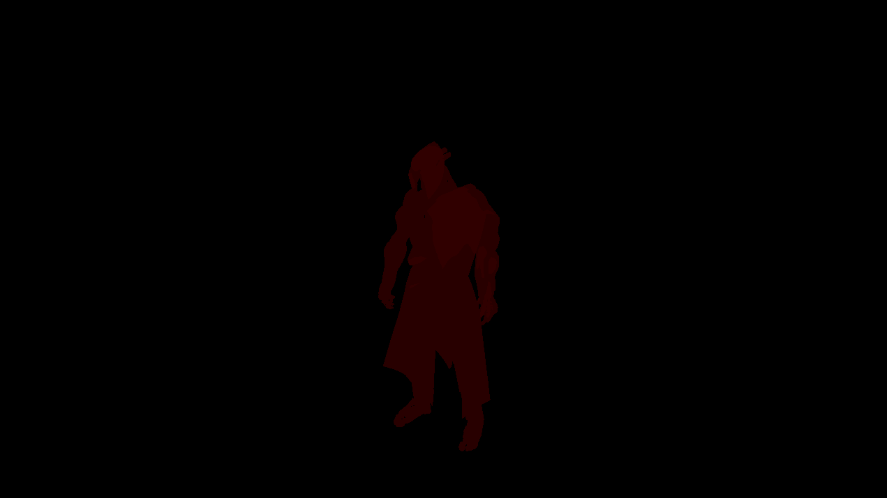


## Create Depth Cameras

In the `Hierarchy` tab, select the `Main Camera` object and press Ctrl-d twice to create two copies.

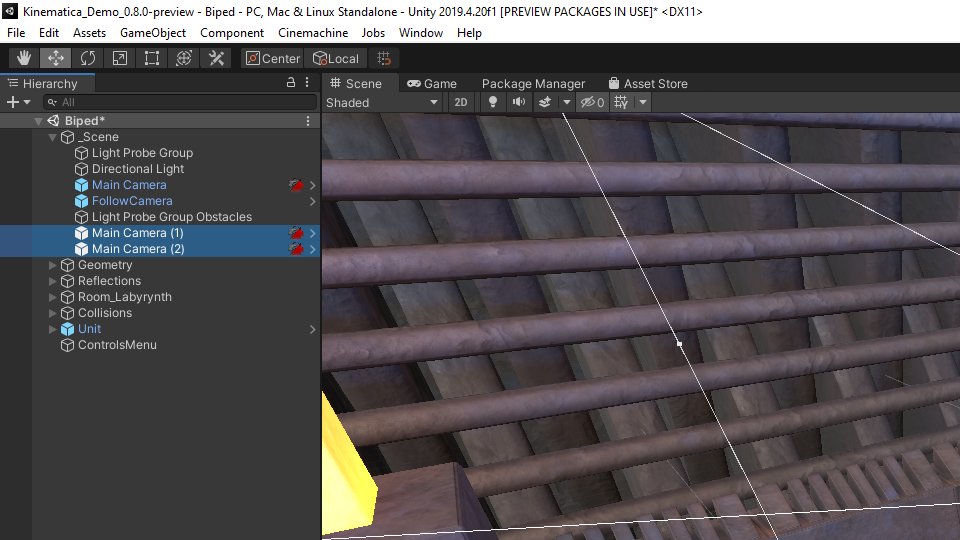

Hold Ctrl and select both of the camera copies. Drag them onto the original `Main Camera` object to make them child objects.

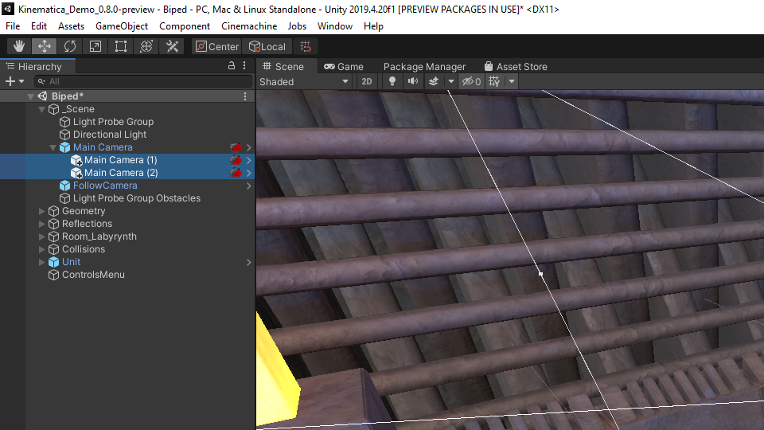


With the duplicates still selected, we will remove every component except the `Camera` component. You can remove components by right-clicking on the component name and selecting `Remove Component`. 

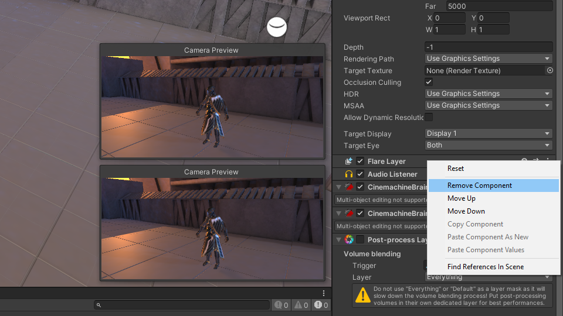


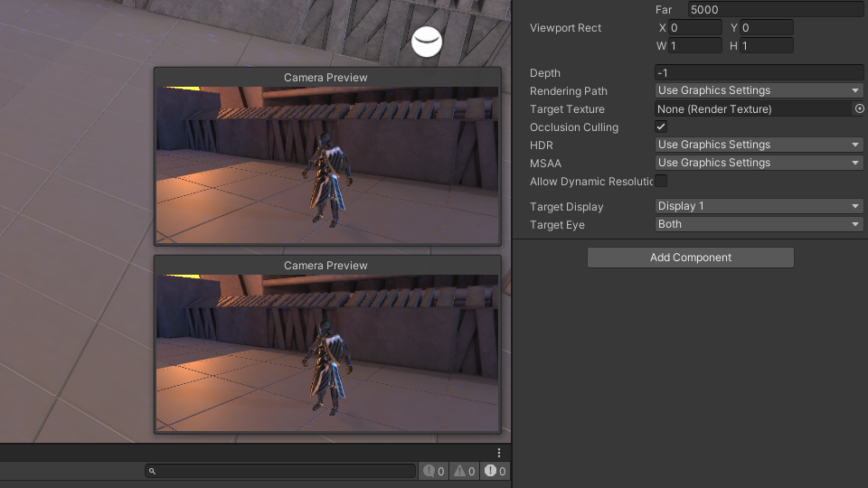

Also, make sure that the position and rotation values for the Transform component for each of the depth cameras are set to to zero. We need to make sure they are in exactly the same position as the Main Camera, or the depth values will be off.

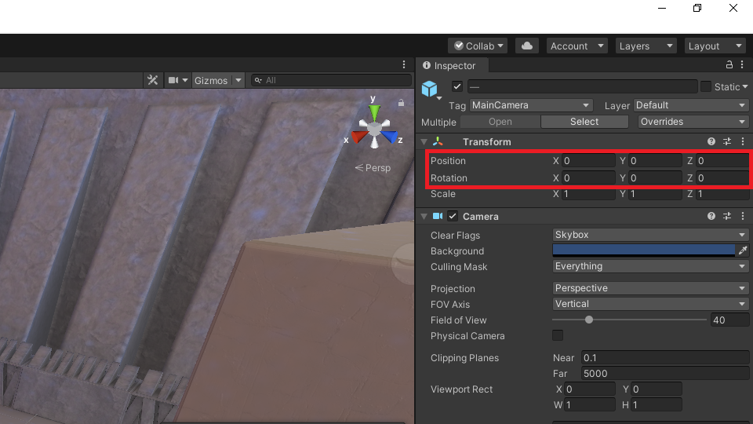

One of the duplicate cameras will capture the depth data for the GameObjects we want to stylize. We'll call this one `Style Depth`. The second duplicate will capture the depth data for the standard scene, and be called `Source Depth`.

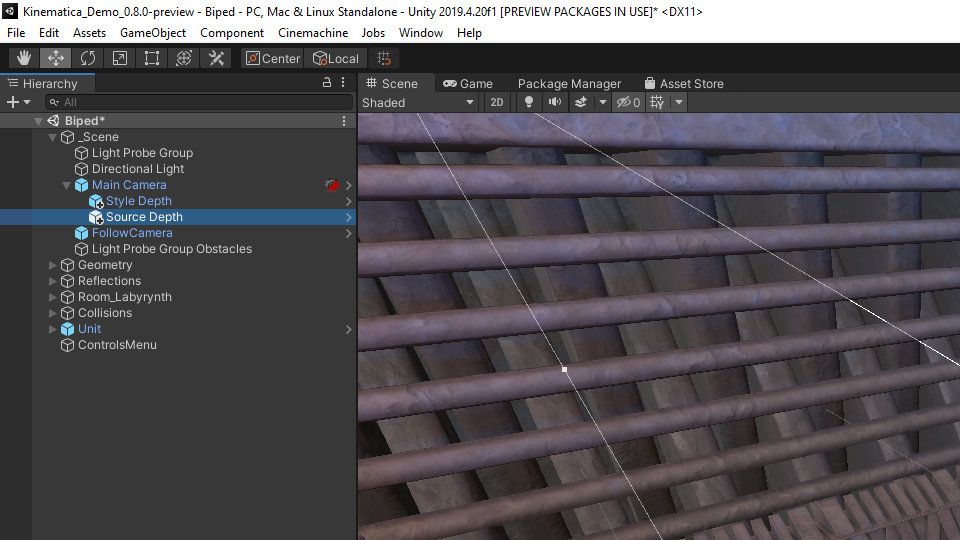


### Create Stylize Layer

We'll identify the GameObjects we want to stylize by assigning a new Layer to these objects. Select the `Layers` drop-down menu and click `Edit Layers...`.

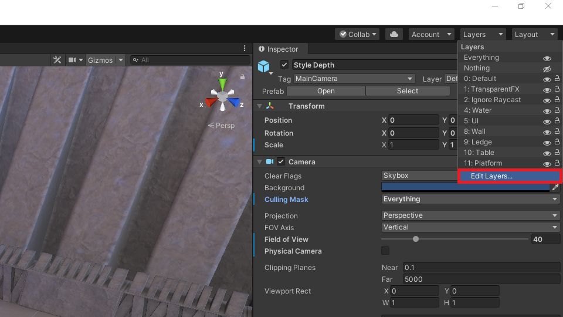

In the Inspector tab open the `Layers` drop-down and enter `Stylize` in the `User Layer 12` slot. 

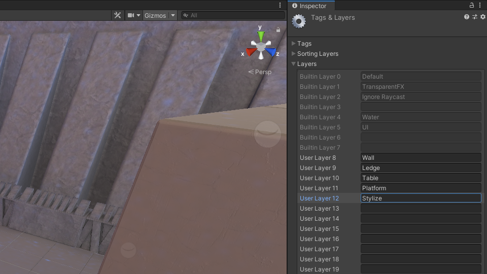

#### Set Style Depth Culling Mask

Lastly, with the `Stylize Depth` camera selected, set the `Culling Mask` to `Stylize` only in the Inspector tab.

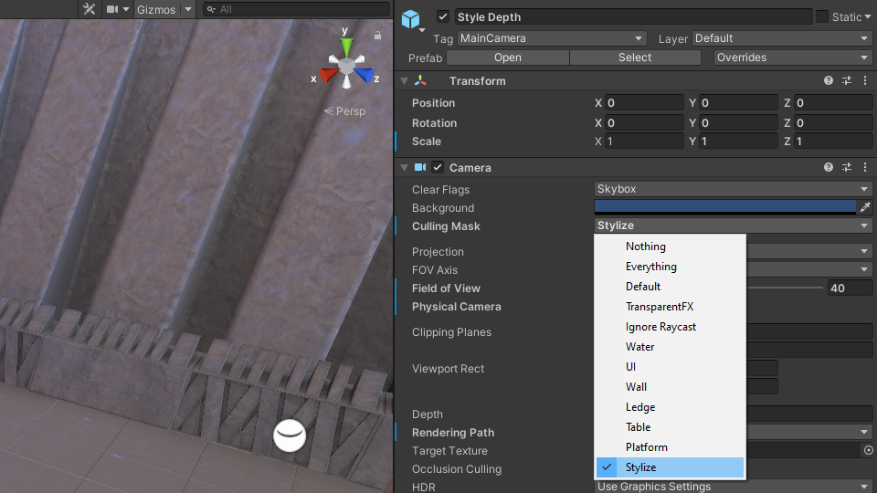


### Assign Stylize Layer

We can assign the Stylize layer to just about any GameObject we wish. To start, let's assign it to the `Unit` parent object in the `Hierarchy` tab which contains the GameObjects for the character model. With the Unit object selected in the Hierarchy tab, select the `Stylize` layer from the Layer drop-down in the Inspector tab.

**Note:** You might get a bunch of errors in the console when you select the Unit object. You can ignore these.

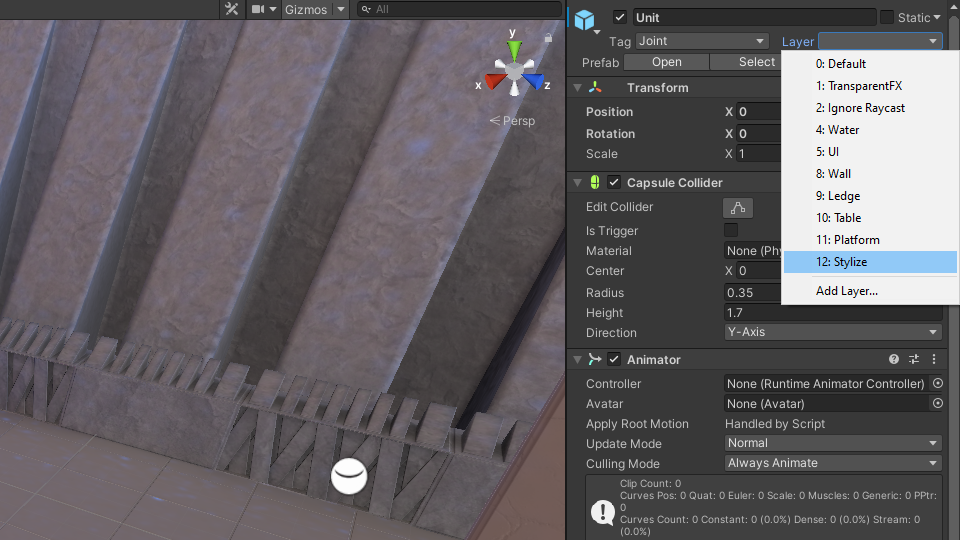

You will be prompted to chose whether to set the layer for the child objects as well. Select `Yes, change children`.

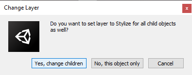


## Update StyleTransferShader

Next, we will add a new function to our compute shader that will select what parts of the stylize frame to keep. In the Assets section, open the `Shaders` subfolder located inside the `Style_Transfer` folder. Open the `StyleTransferShader` in your code editor.


First, we need to add three new Texture2D variables. Two of these will store the depth data from the `Style Depth` and `Source Depth` cameras. The third will store the original image for the current frame.

```c#
// Each #kernel tells which function to compile; you can have many kernels
#pragma kernel ProcessInput
#pragma kernel ProcessOutput

// Create a RenderTexture with enableRandomWrite flag and set it
// with cs.SetTexture
RWTexture2D<half4> Result;
// Stores the input image and is set with cs.SetTexture
Texture2D<half4> InputImage;

// Stores the depth data from the StyleDepth camera
Texture2D<half4> StyleDepth;
// Stores the depth data from the SourceDepth camera
Texture2D<half4> SrcDepth;
// Store the original image from the current frame
Texture2D<half4> SrcImage;

[numthreads(8, 8, 1)]
void ProcessInput(uint3 id : SV_DispatchThreadID)
{
    Result[id.xy] = half4((InputImage[id.xy].x * 255.0h),
        (InputImage[id.xy].y * 255.0h),
        (InputImage[id.xy].z * 255.0h), 1.0h);
}
```


Now we can add the new function. We'll call it `Merge` since it merges the original and stylized frame. This function compares the pixel values from the StyleDepth and SrcDepth textures. If they match, that means a target GameObject is present and there is nothing in front of it. However, this does not account for parts of the scene with infinite depth like the sky. We can add another check to see if the current pixel value for the StyleDepth texture is greater than zero.

```c#
[numthreads(8, 8, 1)]
void Merge(uint3 id : SV_DispatchThreadID)
{
    bool match = StyleDepth[id.xy].x == SrcDepth[id.xy].x;

    if (match && (StyleDepth[id.xy].x > 0)) {
        Result[id.xy] = half4(InputImage[id.xy].r, InputImage[id.xy].g, InputImage[id.xy].b, InputImage[id.xy].a);
    }
    else {
        Result[id.xy] = half4(SrcImage[id.xy].r, SrcImage[id.xy].g, SrcImage[id.xy].b, SrcImage[id.xy].a);
    }
}
```


Now we just need to add the `#pragma kernel Merge` line at the top of the file.

```c#
// Each #kernel tells which function to compile; you can have many kernels
#pragma kernel ProcessInput
#pragma kernel ProcessOutput
#pragma kernel Merge
```


## Update StyleTransfer Script

The next step is to modify the `StyleTransfer` script. The script is located in the Scripts subfolder inside the Style_Transfer folder.

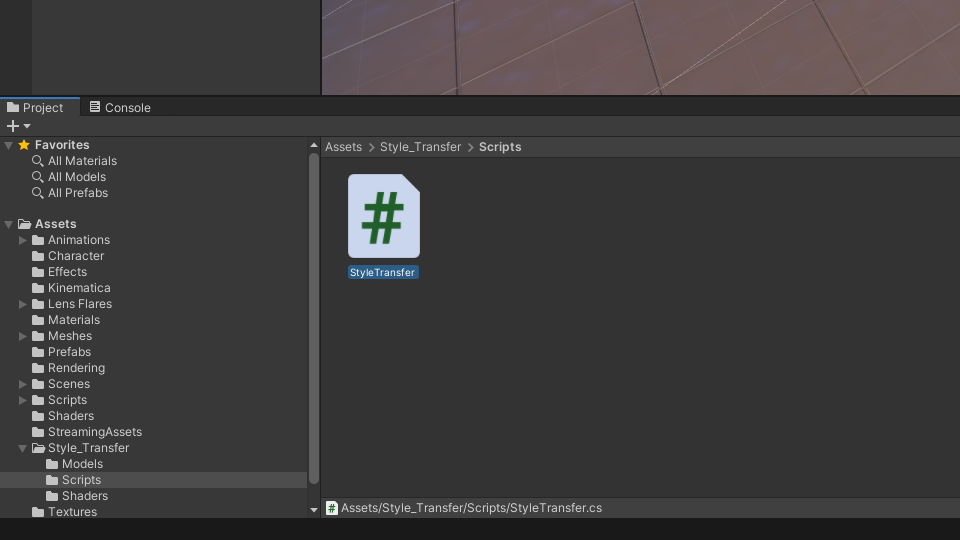


#### Add Depth Camera Variables

The only new variables we need to add are for the two depth cameras. We'll name them `styleDepth` and `sourceDepth` respectively. We can also add another `bool` variable to toggle the targeted stylization.

```c#
public class StyleTransfer : MonoBehaviour
{
    [Tooltip("Performs the preprocessing and postprocessing steps")]
    public ComputeShader styleTransferShader;

    [Tooltip("Stylize the camera feed")]
    public bool stylizeImage = true;

    [Tooltip("Stylize only specified GameObjects")]
    public bool targetedStylization = true;

    [Tooltip("The height of the image being fed to the model")]
    public int targetHeight = 540;

    [Tooltip("The model asset file that will be used when performing inference")]
    public NNModel modelAsset;

    [Tooltip("The backend used when performing inference")]
    public WorkerFactory.Type workerType = WorkerFactory.Type.Auto;

    [Tooltip("Captures the depth data for the target GameObjects")]
    public Camera styleDepth;

    [Tooltip("Captures the depth data for the entire scene")]
    public Camera sourceDepth;
```


#### Assign Depth Textures

Currently, the depth cameras are just capturing standard color data. We need to manually assign `Depth` textures to the `targetTexture` property for both of the cameras. We'll do this at the top of the `Start()` method. The textures need to have the same dimensions as target screen. We can access this in `Screen.width` and `Screen.height`.

```c#
// Start is called before the first frame update
void Start()
{
    // Get the screen dimensions
    int width = Screen.width;
    int height = Screen.height;

    // Force the StyleDepth Camera to render to a Depth texture
    styleDepth.targetTexture = RenderTexture.GetTemporary(width, height, 24, RenderTextureFormat.Depth);
    styleDepth.forceIntoRenderTexture = true;
    // Force the SourceDepth Camera to render to a Depth texture
    sourceDepth.targetTexture = RenderTexture.GetTemporary(width, height, 24, RenderTextureFormat.Depth);
    sourceDepth.forceIntoRenderTexture = true;

    // Compile the model asset into an object oriented representation
    m_RuntimeModel = ModelLoader.Load(modelAsset);

    // Create a worker that will execute the model with the selected backend
    engine = WorkerFactory.CreateWorker(workerType, m_RuntimeModel);
}
```


#### Update Depth Texture Dimensions

If the screen resolution changes while the project is running, the resolution for the depth textures will need to be updated as well. We can check if the screen resolution has changed in the `Update()` method.

```c#
private void Update()
{
    if (styleDepth.targetTexture.width != Screen.width || styleDepth.targetTexture.height != Screen.height)
    {
        // Get the screen dimensions
        int width = Screen.width;
        int height = Screen.height;
        // Assign depth textures with the new dimensions
        styleDepth.targetTexture = RenderTexture.GetTemporary(width, height, 24, RenderTextureFormat.Depth);
        sourceDepth.targetTexture = RenderTexture.GetTemporary(width, height, 24, RenderTextureFormat.Depth);
    }
}
```


#### Release Depth Textures

We will release the temporary Depth textures in the `OnDisable()` method.

```c#
// OnDisable is called when the MonoBehavior becomes disabled or inactive
private void OnDisable()
{
    // Release the resources allocated for the inference engine
    engine.Dispose();
    // Release the Depth texture for the StyleDepth camera
    RenderTexture.ReleaseTemporary(styleDepth.targetTexture);
    // Release the Depth texture for the SourceDepth camera
    RenderTexture.ReleaseTemporary(sourceDepth.targetTexture);
}
```


#### Create `Merge()` Method

Next, we need to add a new method to dispatch the Merge function in the compute shader. This method will be nearly identical to the existing `ProcessImage()` method except that it will also set the values for the `StyleDepth`, `SrcDepth`, and `SrcImage` variables.

```c#
/// <summary>
/// Merge the stylized frame and the original frame on the GPU
/// </summary>
/// <param name="styleImage"></param>
/// <param name="sourceImage"></param>
/// <returns>The merged image</returns>
private void Merge(RenderTexture styleImage, RenderTexture sourceImage)
{
    // Specify the number of threads on the GPU
    int numthreads = 8;
    // Get the index for the specified function in the ComputeShader
    int kernelHandle = styleTransferShader.FindKernel("Merge");
    // Define a temporary HDR RenderTexture
    int width = styleImage.width;
    int height = styleImage.height;
    RenderTexture result = RenderTexture.GetTemporary(width, height, 24, RenderTextureFormat.ARGBHalf);
    // Enable random write access
    result.enableRandomWrite = true;
    // Create the HDR RenderTexture
    result.Create();

    // Set the value for the Result variable in the ComputeShader
    styleTransferShader.SetTexture(kernelHandle, "Result", result);
    // Set the value for the InputImage variable in the ComputeShader
    styleTransferShader.SetTexture(kernelHandle, "InputImage", styleImage);
    // Set the value for the StyleDepth variable in the ComputeShader
    styleTransferShader.SetTexture(kernelHandle, "StyleDepth", styleDepth.activeTexture);
    // Set the value for the SrcDepth variable in the ComputeShader
    styleTransferShader.SetTexture(kernelHandle, "SrcDepth", sourceDepth.activeTexture);
    // Set the value for the SrcImage variable in the ComputeShader
    styleTransferShader.SetTexture(kernelHandle, "SrcImage", sourceImage);

    // Execute the ComputeShader
    styleTransferShader.Dispatch(kernelHandle, result.width / numthreads, result.height / numthreads, 1);

    // Copy the result into the source RenderTexture
    Graphics.Blit(result, styleImage);

    // Release the temporary RenderTexture
    RenderTexture.ReleaseTemporary(result);
}
```


#### Update `OnRenderImage()` Method

We'll call the `Merge()` method inside the `OnRenderImage()` method. First, we need to create a copy of the current frame before it gets stylized. The `Merge()` method will only be called when `targetedStylization` is set to `true` and `stylizeImage` is set to `true`. Lastly, we need to release the temporary `RenderTexture` for the copy of the current frame.

```c#
/// <summary>
/// OnRenderImage is called after the Camera had finished rendering 
/// </summary>
/// <param name="src">Input from the Camera</param>
/// <param name="dest">The texture for the targer display</param>
void OnRenderImage(RenderTexture src, RenderTexture dest)
{
    // Create a temporary RenderTexture to store copy of the current frame
    RenderTexture sourceImage = RenderTexture.GetTemporary(src.width, src.height, 24, src.format);
    // Copyt the current frame
    Graphics.Blit(src, sourceImage);

    if (stylizeImage)
    {
        StylizeImage(src);

        if (targetedStylization)
        {
            // Merge the stylized frame and origina frame
            Merge(src, sourceImage);
        }
    }

    Graphics.Blit(src, dest);

    // Release the temporary RenderTexture
    RenderTexture.ReleaseTemporary(sourceImage);
}
```


## Assign Depth Cameras

The last step is to assign the depth cameras to the `StyleTransfer` script in the Inspector tab. Select the Main Camera object in the Hierarchy tab. Drag and drop each of the depth cameras into their respective spots in the Inspector tab.

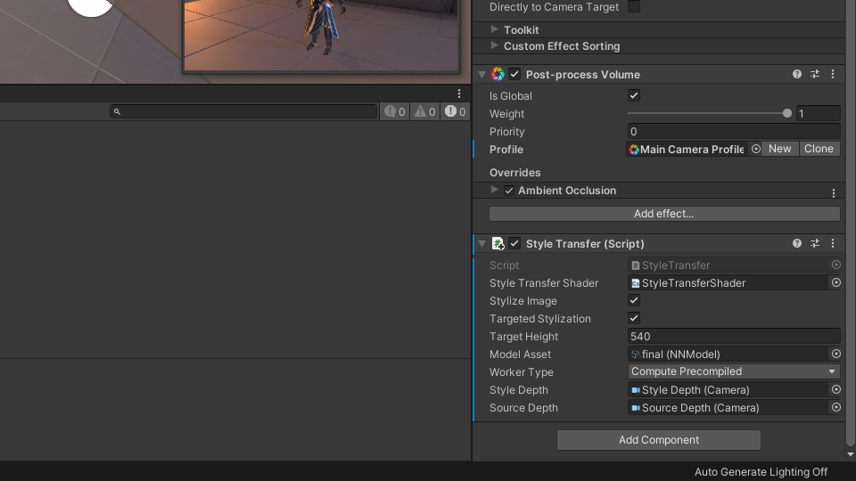

### Test it Out

If you hit the play button, you should see that only the GameObjects with the Stylize layer are stylized.


## Assign Stylize Layer With Code

You might want to change which objects are stylized depending on certain conditions. As an example, we'll demonstrate how to toggle stylization on and off for a GameObject when they are clicked on with the mouse at runtime.

### Method

A common method to select GameObjects with the mouse is to use the `Physics.Raycast()` method. This approach involves casting a ray (i.e. a line) from the camera to the current mouse position. If that ray makes contact with a GameObject that has a collider component, we can identify that object and manipulate it in code.

This method will not work if the GameObject does not have a collider, so keep that in mind when using this approach in other projects. 

The Kinematica Demo is not ideally structured for selecting individual GameObjects with the mouse. For example, the colliders for the level boundaries are not directly attached to the GameObjects like the one outlined below. That means we can't click on any of the four level boundaries without adding new collider components.

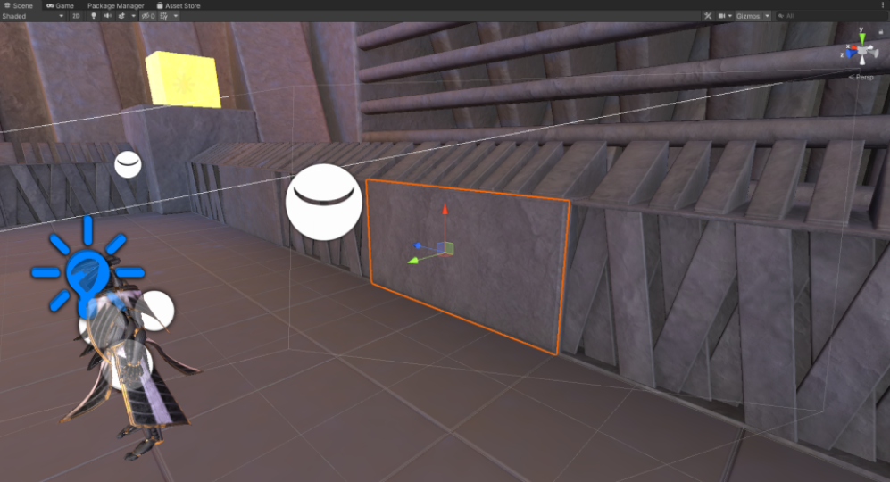

The floor panels already have their own colliders attached and will work out of the box.

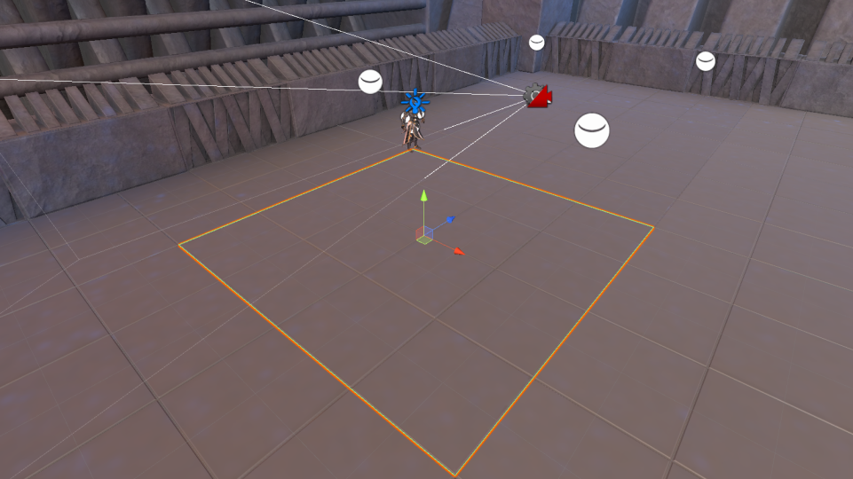

The obstacles that we can climb over are actually children of GameObjects that have a collider. That means every child object will be stylized rather than the specific child object we click on.


### Steps

We'll implement the following steps in the `Update()` method.

1. Check if the mouse button has been clicked with `Input.GetMouseButtonUp()` method.
2. Create a new `Ray` variable that contains a ray going from the main camera to the current mouse position
3. Create a new `RaycastHit` variable.
4. Check if the ray has hit any colliders with the `Physics.Raycast()` method.
   1. Get a list of the child objects of the GameObject with the collider, including GameObject itself.
   2. Iterate through the list of child objects.
      1. Check if the child object has a `MeshRenderer` component that is enabled.
         1. Toggle the objects layer between `Default` and `Stylize`.

```c#
if (styleDepth.targetTexture.width != Screen.width || styleDepth.targetTexture.height != Screen.height)
{
    // Get the screen dimensions
    int width = Screen.width;
    int height = Screen.height;

    // Assign depth textures with the new dimensions
    styleDepth.targetTexture = RenderTexture.GetTemporary(width, height, 24, RenderTextureFormat.Depth);
    sourceDepth.targetTexture = RenderTexture.GetTemporary(width, height, 24, RenderTextureFormat.Depth);
}

if (Input.GetMouseButtonUp(0))
{
    Ray ray = Camera.main.ScreenPointToRay(Input.mousePosition);
    RaycastHit hit;
    if (Physics.Raycast(ray, out hit))
    {
        Transform[] allChildren = hit.transform.gameObject.GetComponentsInChildren<Transform>();
        for (int i = 0; i < allChildren.Length; i++)
        {
            MeshRenderer meshRenderer = allChildren[i].GetComponent<MeshRenderer>();
            if (meshRenderer != null && meshRenderer.enabled)
            {
                if (allChildren[i].gameObject.layer == 12)
                {
                    allChildren[i].gameObject.layer = 0;
                }
                else
                {
                    allChildren[i].gameObject.layer = 12;
                }
            }
        }
    }
}
```


If we run the game now, we can click on GameObjects with colliders to toggle the stylization effect.


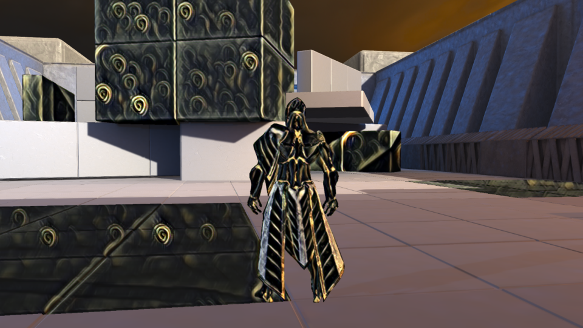


## Conclusion

