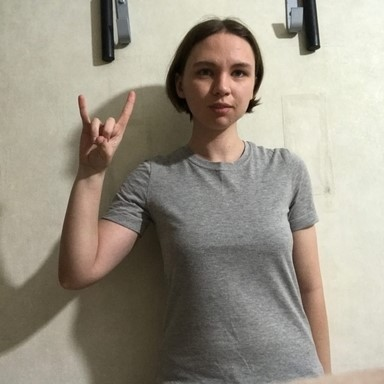
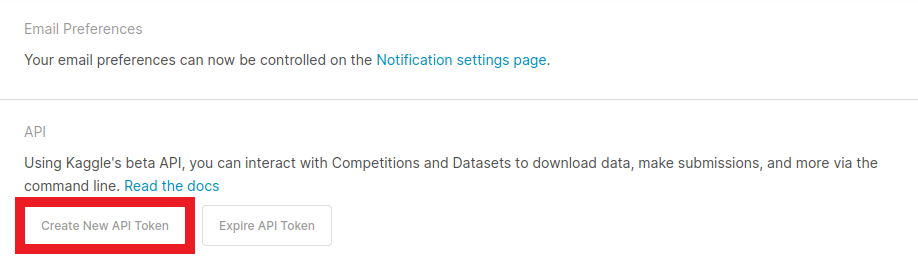
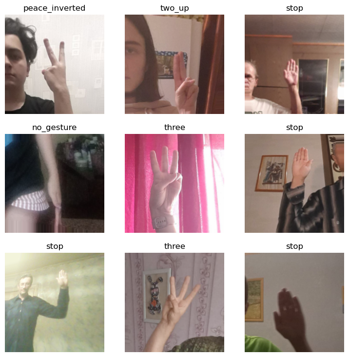
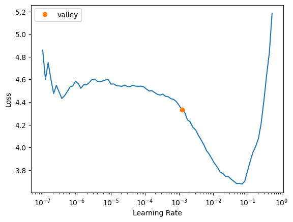

* [Introduction](#introduction)
* [Overview](#overview)
* [Install Dependencies](#install-dependencies)
* [Import Dependencies](#import-dependencies)
* [Select a Model](#select-a-model)
* [Download the Dataset](#download-the-dataset)
* [Inspect the Dataset](#inspect-the-dataset)
* [Define DataLoaders](#define-dataloaders)
* [Finetune the Model](#finetune-the-model)
* [Clean Dataset (Optional)](#clean-dataset-optional)
* [Test the Model](#test-the-model)
* [Export the Model](#export-the-model)
* [Export Inference Data](#export-inference-data)
* [Summary](#summary)


## Tutorial Links

- [Part 1](../part-1/): Train a hand gesture classifier using fastai and export it to TensorFlow.js.
- [Part 2](../part-2/): Create a TensorFlow.js plugin for the Unity game engine.
- [Part 3](../part-3/): Build a Unity project as a WebGL application and host it using GitHub Pages.
- [GitHub Repository](https://github.com/cj-mills/tensorflow-js-unity-tutorial)


## Introduction

In this three-part tutorial series, we will use [fastai](https://docs.fast.ai/) and [TensorFlow.js](https://www.tensorflow.org/js/) to create an in-browser hand gesture recognition system in [Unity](https://unity.com/). In Part 1, we will train a hand gesture classifier using fastai and export it to TensorFlow.js. In Part 2, we will create a TensorFlow.js plugin for the Unity game engine. Finally, in Part 3, we will host the Unity project as a live demo on GitHub Pages. By the end of this tutorial series, you will have a hand gesture recognition system that you can use in your Unity projects.

**In-Browser Demo:** [Hand Gesture Classifier](https://cj-mills.github.io/fastai-hand-gesture-classifier-webgl-demo/)

The tutorial uses a downscaled version of [HaGRID](https://github.com/hukenovs/hagrid) (HAnd Gesture Recognition Image Dataset) that I modified for image classification tasks. The dataset contains images for 18 distinct hand gestures and an additional `no_gesture` class to account for idle hands.

<div>
<details><summary><strong>Reference Images</strong></summary><br/>
<div style="overflow-x:auto; overflow-y: auto; max-height:500px">
<table>
<thead>
<tr>
<th>Class</th>
<th>Image</th>
</tr>
</thead>
<tbody>
<tr>
<td>call</td>
<td></td>
</tr>
<tr>
<td>dislike</td>
<td></td>
</tr>
<tr>
<td>fist</td>
<td></td>
</tr>
<tr>
<td>four</td>
<td></td>
</tr>
<tr>
<td>like</td>
<td></td>
</tr>
<tr>
<td>mute</td>
<td></td>
</tr>
<tr>
<td>ok</td>
<td></td>
</tr>
<tr>
<td>one</td>
<td></td>
</tr>
<tr>
<td>palm</td>
<td></td>
</tr>
<tr>
<td>peace</td>
<td></td>
</tr>
<tr>
<td>peace_inverted</td>
<td></td>
</tr>
<tr>
<td>rock</td>
<td></td>
</tr>
<tr>
<td>stop</td>
<td></td>
</tr>
<tr>
<td>stop_inverted</td>
<td></td>
</tr>
<tr>
<td>three</td>
<td></td>
</tr>
<tr>
<td>three2</td>
<td></td>
</tr>
<tr>
<td>two_up</td>
<td></td>
</tr>
<tr>
<td>two_up_inverted</td>
<td></td>
</tr>
</tbody>
</table>
</div>
</details>
</div>
We can use a model trained on this dataset to map hand gestures to user input via a webcam in Unity.


## Overview

In Part 1 of this tutorial series, we finetune an image classifier from the [timm library](https://github.com/rwightman/pytorch-image-models) using fastai and export it to TensorFlow.js. We will start by installing and importing the necessary dependencies. Then, we will select a model to use and download a dataset to train it. After inspecting the dataset, we will define data loaders to use for training. Finally, we will finetune and export the model. We also demonstrate how to clean the dataset to improve training. By the end of this post, you will have a trained hand gesture classifier that you can use in web applications.


You can find links to view the training code and run it on [Google Colab](https://colab.research.google.com/?utm_source=scs-index) and [Kaggle](https://www.kaggle.com/docs/notebooks) below.

| Jupyter Notebook             | Colab                                                        | Kaggle                                                       |
| --------------------------------- | ------------------------------------------------------------ | ------------------------------------------------------------ |
| [GitHub Repository](https://github.com/cj-mills/tensorflow-js-unity-tutorial/blob/main/notebooks/Fastai-timm-HaGRID-classification-TFJS.ipynb) | [Open In Colab](https://colab.research.google.com/github/cj-mills/tensorflow-js-unity-tutorial/blob/main/notebooks/Fastai-timm-HaGRID-classification-TFJS-Colab.ipynb) | [Open in Kaggle](https://kaggle.com/kernels/welcome?src=https://github.com/cj-mills/tensorflow-js-unity-tutorial/blob/main/notebooks/Fastai-timm-HaGRID-classification-TFJS-Kaggle.ipynb) |


## Install Dependencies

The training code requires [PyTorch](https://pytorch.org/) for the fastai library, the fastai library itself for training, and the [Kaggle API Python package](https://github.com/Kaggle/kaggle-api) for downloading the dataset. The [timm](https://github.com/rwightman/pytorch-image-models) library provides access to a wide range of pretrained image models.

**Install model training dependencies**


```python
# %%capture
# !pip install -U torch torchvision torchaudio
# !pip install -U fastai==2.7.9
# !pip install -U kaggle
# !pip install -U Pillow
# !pip install -U timm
```


The model conversion process involves exporting the PyTorch model to [ONNX](https://onnx.ai/), converting the ONNX model to a TensorFlow [SavedModel](https://www.tensorflow.org/guide/saved_model), then converting the SavedModel to TensorFlow.js [web format](https://www.tensorflow.org/js/tutorials/conversion/import_saved_model#step_1_convert_an_existing_tensorflow_model_to_the_tensorflowjs_web_format).


**Install Tensorflow.js conversion dependencies**


```python
# %%capture
# !pip install -U onnxruntime
# !pip install onnx-tf
# !pip install tensorflowjs
# !pip install tensorflow_probability
# !pip install onnx-simplifier
# !pip install simple-onnx-processing-tools
# !pip install -U onnx_graphsurgeon --index-url https://pypi.ngc.nvidia.com
```


## Import Dependencies


**Import all fastai computer vision functionality**


```python
from fastai.vision.all import *
```


**Import pandas and disable column and row limits**


```python
import pandas as pd
pd.set_option('max_colwidth', None)
pd.set_option('display.max_rows', None)
pd.set_option('display.max_columns', None)
```


**Import timm library**


```python
import timm
```


```python
timm.__version__
```


```text
'0.6.7'
```


## Select a Model

Timm provides many pretrained models, but not all are fast enough for real-time applications. We can filter through the available models using the `timm.list_models()` function.

**View available ResNet models**


```python
pd.DataFrame(timm.list_models('resnet*', pretrained=True))
```


<div style="overflow-x:auto; overflow-y: auto; max-height:500px">
<table border="1" class="dataframe">
  <thead>
    <tr style="text-align: right;">
      <th></th>
      <th>0</th>
    </tr>
  </thead>
  <tbody>
    <tr>
      <th>0</th>
      <td>resnet10t</td>
    </tr>
    <tr>
      <th>1</th>
      <td>resnet14t</td>
    </tr>
    <tr>
      <th>2</th>
      <td>resnet18</td>
    </tr>
    <tr>
      <th>3</th>
      <td>resnet18d</td>
    </tr>
    <tr>
      <th>4</th>
      <td>resnet26</td>
    </tr>
    <tr>
      <th>5</th>
      <td>resnet26d</td>
    </tr>
    <tr>
      <th>6</th>
      <td>resnet26t</td>
    </tr>
    <tr>
      <th>7</th>
      <td>resnet32ts</td>
    </tr>
    <tr>
      <th>8</th>
      <td>resnet33ts</td>
    </tr>
    <tr>
      <th>9</th>
      <td>resnet34</td>
    </tr>
    <tr>
      <th>10</th>
      <td>resnet34d</td>
    </tr>
    <tr>
      <th>11</th>
      <td>resnet50</td>
    </tr>
    <tr>
      <th>12</th>
      <td>resnet50_gn</td>
    </tr>
    <tr>
      <th>13</th>
      <td>resnet50d</td>
    </tr>
    <tr>
      <th>14</th>
      <td>resnet51q</td>
    </tr>
    <tr>
      <th>15</th>
      <td>resnet61q</td>
    </tr>
    <tr>
      <th>16</th>
      <td>resnet101</td>
    </tr>
    <tr>
      <th>17</th>
      <td>resnet101d</td>
    </tr>
    <tr>
      <th>18</th>
      <td>resnet152</td>
    </tr>
    <tr>
      <th>19</th>
      <td>resnet152d</td>
    </tr>
    <tr>
      <th>20</th>
      <td>resnet200d</td>
    </tr>
    <tr>
      <th>21</th>
      <td>resnetaa50</td>
    </tr>
    <tr>
      <th>22</th>
      <td>resnetblur50</td>
    </tr>
    <tr>
      <th>23</th>
      <td>resnetrs50</td>
    </tr>
    <tr>
      <th>24</th>
      <td>resnetrs101</td>
    </tr>
    <tr>
      <th>25</th>
      <td>resnetrs152</td>
    </tr>
    <tr>
      <th>26</th>
      <td>resnetrs200</td>
    </tr>
    <tr>
      <th>27</th>
      <td>resnetrs270</td>
    </tr>
    <tr>
      <th>28</th>
      <td>resnetrs350</td>
    </tr>
    <tr>
      <th>29</th>
      <td>resnetrs420</td>
    </tr>
    <tr>
      <th>30</th>
      <td>resnetv2_50</td>
    </tr>
    <tr>
      <th>31</th>
      <td>resnetv2_50d_evos</td>
    </tr>
    <tr>
      <th>32</th>
      <td>resnetv2_50d_gn</td>
    </tr>
    <tr>
      <th>33</th>
      <td>resnetv2_50x1_bit_distilled</td>
    </tr>
    <tr>
      <th>34</th>
      <td>resnetv2_50x1_bitm</td>
    </tr>
    <tr>
      <th>35</th>
      <td>resnetv2_50x1_bitm_in21k</td>
    </tr>
    <tr>
      <th>36</th>
      <td>resnetv2_50x3_bitm</td>
    </tr>
    <tr>
      <th>37</th>
      <td>resnetv2_50x3_bitm_in21k</td>
    </tr>
    <tr>
      <th>38</th>
      <td>resnetv2_101</td>
    </tr>
    <tr>
      <th>39</th>
      <td>resnetv2_101x1_bitm</td>
    </tr>
    <tr>
      <th>40</th>
      <td>resnetv2_101x1_bitm_in21k</td>
    </tr>
    <tr>
      <th>41</th>
      <td>resnetv2_101x3_bitm</td>
    </tr>
    <tr>
      <th>42</th>
      <td>resnetv2_101x3_bitm_in21k</td>
    </tr>
    <tr>
      <th>43</th>
      <td>resnetv2_152x2_bit_teacher</td>
    </tr>
    <tr>
      <th>44</th>
      <td>resnetv2_152x2_bit_teacher_384</td>
    </tr>
    <tr>
      <th>45</th>
      <td>resnetv2_152x2_bitm</td>
    </tr>
    <tr>
      <th>46</th>
      <td>resnetv2_152x2_bitm_in21k</td>
    </tr>
    <tr>
      <th>47</th>
      <td>resnetv2_152x4_bitm</td>
    </tr>
    <tr>
      <th>48</th>
      <td>resnetv2_152x4_bitm_in21k</td>
    </tr>
  </tbody>
</table>
</div>
------


The smaller ResNet models are both fast and sufficiently accurate in most settings. Unfortunately, the `resnet10t` and `resnet14t` models contain operations unsupported by the TensorFlow.js conversion script. We'll instead use the `resnet18` model for our lightweight option.


**Inspect config for specific model**

Each model comes with a set of default configuration parameters. We must keep track of the `mean` and `std` values used to normalize the model input. Many pretrained models use the [ImageNet normalization stats](https://github.com/fastai/fastai/blob/de5982cfac41597d432e3c424da847d250f8c5e1/fastai/vision/core.py#L31), but others, like MobileViT, [do not](https://github.com/rwightman/pytorch-image-models/blob/d4ea5c7d7d55967a8bedbfbb58962131d8aba776/timm/models/mobilevit.py#L37).


```python
from timm.models import resnet
resnet_model = 'resnet18'
pd.DataFrame.from_dict(resnet.default_cfgs[resnet_model], orient='index')
```


<div style="overflow-x:auto; overflow-y: auto; max-height:500px">
<table border="1" class="dataframe">
  <thead>
    <tr style="text-align: right;">
      <th></th>
      <th>0</th>
    </tr>
  </thead>
  <tbody>
    <tr>
      <th>url</th>
      <td>https://download.pytorch.org/models/resnet18-5c106cde.pth</td>
    </tr>
    <tr>
      <th>num_classes</th>
      <td>1000</td>
    </tr>
    <tr>
      <th>input_size</th>
      <td>(3, 224, 224)</td>
    </tr>
    <tr>
      <th>pool_size</th>
      <td>(7, 7)</td>
    </tr>
    <tr>
      <th>crop_pct</th>
      <td>0.875</td>
    </tr>
    <tr>
      <th>interpolation</th>
      <td>bilinear</td>
    </tr>
    <tr>
      <th>mean</th>
      <td>(0.485, 0.456, 0.406)</td>
    </tr>
    <tr>
      <th>std</th>
      <td>(0.229, 0.224, 0.225)</td>
    </tr>
    <tr>
      <th>first_conv</th>
      <td>conv1</td>
    </tr>
    <tr>
      <th>classifier</th>
      <td>fc</td>
    </tr>
  </tbody>
</table>
</div>


**View available [ConvNeXt](https://arxiv.org/abs/2201.03545) models**


```python
pd.DataFrame(timm.list_models('convnext*', pretrained=True))
```


<div style="overflow-x:auto; overflow-y: auto; max-height:500px">
<table border="1" class="dataframe">
  <thead>
    <tr style="text-align: right;">
      <th></th>
      <th>0</th>
    </tr>
  </thead>
  <tbody>
    <tr>
      <th>0</th>
      <td>convnext_base</td>
    </tr>
    <tr>
      <th>1</th>
      <td>convnext_base_384_in22ft1k</td>
    </tr>
    <tr>
      <th>2</th>
      <td>convnext_base_in22ft1k</td>
    </tr>
    <tr>
      <th>3</th>
      <td>convnext_base_in22k</td>
    </tr>
    <tr>
      <th>4</th>
      <td>convnext_large</td>
    </tr>
    <tr>
      <th>5</th>
      <td>convnext_large_384_in22ft1k</td>
    </tr>
    <tr>
      <th>6</th>
      <td>convnext_large_in22ft1k</td>
    </tr>
    <tr>
      <th>7</th>
      <td>convnext_large_in22k</td>
    </tr>
    <tr>
      <th>8</th>
      <td>convnext_nano</td>
    </tr>
    <tr>
      <th>9</th>
      <td>convnext_small</td>
    </tr>
    <tr>
      <th>10</th>
      <td>convnext_small_384_in22ft1k</td>
    </tr>
    <tr>
      <th>11</th>
      <td>convnext_small_in22ft1k</td>
    </tr>
    <tr>
      <th>12</th>
      <td>convnext_small_in22k</td>
    </tr>
    <tr>
      <th>13</th>
      <td>convnext_tiny</td>
    </tr>
    <tr>
      <th>14</th>
      <td>convnext_tiny_384_in22ft1k</td>
    </tr>
    <tr>
      <th>15</th>
      <td>convnext_tiny_hnf</td>
    </tr>
    <tr>
      <th>16</th>
      <td>convnext_tiny_in22ft1k</td>
    </tr>
    <tr>
      <th>17</th>
      <td>convnext_tiny_in22k</td>
    </tr>
    <tr>
      <th>18</th>
      <td>convnext_xlarge_384_in22ft1k</td>
    </tr>
    <tr>
      <th>19</th>
      <td>convnext_xlarge_in22ft1k</td>
    </tr>
    <tr>
      <th>20</th>
      <td>convnext_xlarge_in22k</td>
    </tr>
  </tbody>
</table>
</div>


------


The `convnext_nano` model is highly accurate for its size and is a good choice when compute power is less constrained.


**Inspect config for specific model**


```python
from timm.models import convnext
convnext_model = 'convnext_nano'
pd.DataFrame.from_dict(convnext.default_cfgs[convnext_model], orient='index')
```


<div style="overflow-x:auto; overflow-y: auto; max-height:500px">
<table border="1" class="dataframe">
  <thead>
    <tr style="text-align: right;">
      <th></th>
      <th>0</th>
    </tr>
  </thead>
  <tbody>
    <tr>
      <th>url</th>
      <td>https://github.com/rwightman/pytorch-image-models/releases/download/v0.1-rsb-weights/convnext_nano_d1h-7eb4bdea.pth</td>
    </tr>
    <tr>
      <th>num_classes</th>
      <td>1000</td>
    </tr>
    <tr>
      <th>input_size</th>
      <td>(3, 224, 224)</td>
    </tr>
    <tr>
      <th>pool_size</th>
      <td>(7, 7)</td>
    </tr>
    <tr>
      <th>crop_pct</th>
      <td>0.95</td>
    </tr>
    <tr>
      <th>interpolation</th>
      <td>bicubic</td>
    </tr>
    <tr>
      <th>mean</th>
      <td>(0.485, 0.456, 0.406)</td>
    </tr>
    <tr>
      <th>std</th>
      <td>(0.229, 0.224, 0.225)</td>
    </tr>
    <tr>
      <th>first_conv</th>
      <td>stem.0</td>
    </tr>
    <tr>
      <th>classifier</th>
      <td>head.fc</td>
    </tr>
    <tr>
      <th>test_input_size</th>
      <td>(3, 288, 288)</td>
    </tr>
    <tr>
      <th>test_crop_pct</th>
      <td>1.0</td>
    </tr>
  </tbody>
</table>
</div>
------


**Select a model**


```python
# model_type = resnet
# model_name = resnet_model
```


```python
model_type = convnext
model_name = convnext_model
```


**Extract normalization stats from model config**


```python
mean = model_type.default_cfgs[model_name]['mean']
std = model_type.default_cfgs[model_name]['std']
mean, std
```


```text
((0.485, 0.456, 0.406), (0.229, 0.224, 0.225))
```


## Download the Dataset

The Kaggle API tool requires an API Key for a Kaggle account. Sign in or create a Kaggle account using the link below, then click the Create New API Token button.

- **Kaggle Account Settings:** [https://www.kaggle.com/me/account](https://www.kaggle.com/me/account)

{fig-align="center"}


Kaggle will generate and download a `kaggle.json` file containing your username and new API token. Initialize the `creds` variable with the values for each.


**Enter Kaggle username and API token**


```python
creds = '{"username":"","key":""}'
```


**Save Kaggle credentials if none are present**

* **Source:** [https://github.com/fastai/fastbook/blob/master/09_tabular.ipynb](https://github.com/fastai/fastbook/blob/master/09_tabular.ipynb)


```python
cred_path = Path('~/.kaggle/kaggle.json').expanduser()
# Save API key to a json file if it does not already exist
if not cred_path.exists():
    cred_path.parent.mkdir(exist_ok=True)
    cred_path.write_text(creds)
    cred_path.chmod(0o600)
```


**Import Kaggle API**


```python
from kaggle import api
```


**Select a dataset**

Now that we have our Kaggle credentials set, we need to define the dataset and where to store it. I made three different-sized versions of the dataset available on Kaggle.

- [HaGRID Classification 512p no_gesture 150k](https://www.kaggle.com/datasets/innominate817/hagrid-classification-512p-no-gesture-150k) 
  - Images: 154,816
  - Size: 4 GB
- [HaGRID Classification 512p no_gesture 300k](https://www.kaggle.com/datasets/innominate817/hagrid-classification-512p-no-gesture-300k)
  - Images: 309,632
  - Size: 8 GB
- [HaGRID Classification 512p no_gesture](https://www.kaggle.com/datasets/innominate817/hagrid-classification-512p-no-gesture)
  - Images: 619,264
  - Size: 15 GB


```python
dataset_name = 'hagrid-classification-512p-no-gesture-150k'
# dataset_name = 'hagrid-classification-512p-no-gesture-300k'
# dataset_name = 'hagrid-classification-512p-no-gesture'

kaggle_dataset = f'innominate817/{dataset_name}'
```


**Define path to dataset**

We will use the default archive and data folders for the fastai library to store the compressed and uncompressed datasets.


```python
archive_dir = URLs.path()
dataset_dir = archive_dir/'../data'
archive_path = Path(f'{archive_dir}/{dataset_name}.zip')
dataset_path = Path(f'{dataset_dir}/{dataset_name}')
```


**Define method to extract the dataset from an archive file**


```python
def file_extract(fname, dest=None):
    "Extract `fname` to `dest` using `tarfile` or `zipfile`."
    if dest is None: dest = Path(fname).parent
    fname = str(fname)
    if   fname.endswith('gz'):  tarfile.open(fname, 'r:gz').extractall(dest)
    elif fname.endswith('zip'): zipfile.ZipFile(fname     ).extractall(dest)
    else: raise Exception(f'Unrecognized archive: {fname}')
```


**Download the dataset if it is not present**


```python
if not archive_path.exists():
    api.dataset_download_cli(kaggle_dataset, path=archive_dir)
    file_extract(fname=archive_path, dest=dataset_path)
```


## Inspect the Dataset

We can start inspecting the dataset once it finishes downloading.

**Inspect the dataset path**


```python
pd.DataFrame(list(dataset_path.ls()))
```


<div style="overflow-x:auto; overflow-y: auto; max-height:500px">
<table border="1" class="dataframe">
  <thead>
    <tr style="text-align: right;">
      <th></th>
      <th>0</th>
    </tr>
  </thead>
  <tbody>
    <tr>
      <th>0</th>
      <td>/home/innom-dt/.fastai/archive/../data/hagrid-classification-512p-no-gesture-150k/hagrid-classification-512p-no-gesture-150k</td>
    </tr>
  </tbody>
</table>
</div>


**Get image file paths**


```python
img_dir = dataset_path/dataset_name
```


```python
files = get_image_files(img_dir)
len(files)
```


```text
154816
```


**Inspect files**

The dataset indicates the image class in the parent folder names.


```python
pd.DataFrame([files[0], files[-1]])
```


<div style="overflow-x:auto; overflow-y: auto; max-height:500px">
<table border="1" class="dataframe">
  <thead>
    <tr style="text-align: right;">
      <th></th>
      <th>0</th>
    </tr>
  </thead>
  <tbody>
    <tr>
      <th>0</th>
      <td>/home/innom-dt/.fastai/archive/../data/hagrid-classification-512p-no-gesture-150k/hagrid-classification-512p-no-gesture-150k/stop/3ac51cf4-cd81-4803-a608-76a55b36df26.jpeg</td>
    </tr>
    <tr>
      <th>1</th>
      <td>/home/innom-dt/.fastai/archive/../data/hagrid-classification-512p-no-gesture-150k/hagrid-classification-512p-no-gesture-150k/two_up/d5a0a30d-92aa-4a7c-9621-1fed0e8f0b66.jpeg</td>
    </tr>
  </tbody>
</table>
</div>


**Inspect class folder names**

There are 19 class folders, and the dataset does not predefine a training-validation split.


```python
folder_names = [path.name for path in Path(img_dir).ls()]
if 'models' in folder_names: 
    os.removedirs(img_dir/'models')
    folder_names.remove('models')
folder_names.sort()
print(f"Num classes: {len(folder_names)}")
pd.DataFrame(folder_names)
```

```text
Num classes: 19
```

<div style="overflow-x:auto; overflow-y: auto; max-height:500px">
<table border="1" class="dataframe">
  <thead>
    <tr style="text-align: right;">
      <th></th>
      <th>0</th>
    </tr>
  </thead>
  <tbody>
    <tr>
      <th>0</th>
      <td>call</td>
    </tr>
    <tr>
      <th>1</th>
      <td>dislike</td>
    </tr>
    <tr>
      <th>2</th>
      <td>fist</td>
    </tr>
    <tr>
      <th>3</th>
      <td>four</td>
    </tr>
    <tr>
      <th>4</th>
      <td>like</td>
    </tr>
    <tr>
      <th>5</th>
      <td>mute</td>
    </tr>
    <tr>
      <th>6</th>
      <td>no_gesture</td>
    </tr>
    <tr>
      <th>7</th>
      <td>ok</td>
    </tr>
    <tr>
      <th>8</th>
      <td>one</td>
    </tr>
    <tr>
      <th>9</th>
      <td>palm</td>
    </tr>
    <tr>
      <th>10</th>
      <td>peace</td>
    </tr>
    <tr>
      <th>11</th>
      <td>peace_inverted</td>
    </tr>
    <tr>
      <th>12</th>
      <td>rock</td>
    </tr>
    <tr>
      <th>13</th>
      <td>stop</td>
    </tr>
    <tr>
      <th>14</th>
      <td>stop_inverted</td>
    </tr>
    <tr>
      <th>15</th>
      <td>three</td>
    </tr>
    <tr>
      <th>16</th>
      <td>three2</td>
    </tr>
    <tr>
      <th>17</th>
      <td>two_up</td>
    </tr>
    <tr>
      <th>18</th>
      <td>two_up_inverted</td>
    </tr>
  </tbody>
</table>
</div>
------


**Inspect one of the training images**


```python
import PIL
img = PIL.Image.open(files[0])
print(f"Class: {files[0].parent.name}")
print(f"Image Dims: {img.shape}")
img
```
```text
    Class: stop
    Image Dims: (512, 512)
```

{fig-align="center"}


## Define DataLoaders

Next, we need to define the [Transforms](https://docs.fast.ai/vision.augment.html) for the [DataLoaders](https://docs.fast.ai/vision.data.html#ImageDataLoaders) object.

**Define target input dimensions**

The Unity project will take input from a webcam, which will likely not have a square aspect ratio. We can still train the models with a square aspect ratio, and training at `256x256` (65,536 pixels) is more efficient than training at `384x216` (82,944 pixels) for a 16:9 aspect ratio. 

The ResNet and ConvNeXt models handle arbitrary input dimensions well. However, we must export some models like MobileViT with the exact input dimensions used for inference.


```python
size_1_1 = (256, 256)
size_16_9 = (216, 384)
size = size_1_1
```


**Define Transforms**

We can leave most of the options in [`aug_transforms`](https://docs.fast.ai/vision.augment.html#aug_transforms) at their default values. The HaGRID dataset is diverse enough that we don't need to add too much augmentation. However, we will disable the `max_rotate` option as orientation is relevant for gesture recognition.


```python
item_tfms = [Resize(size, method=ResizeMethod.Pad, pad_mode=PadMode.Border)]

batch_tfms = [
    *aug_transforms(
        size=size, 
        mult=1.0,
        do_flip=True,
        flip_vert=False,
        max_rotate=0.0,
        min_zoom=1.0,
        max_zoom=1.1,
        max_lighting=0.2,
        max_warp=0.2, 
        p_affine=0.75,
        pad_mode=PadMode.Border)
]
```

**Note:** The fastai library automatically normalizes input for timm models as of version [2.7.5](https://github.com/fastai/fastai/releases/tag/2.7.5).


**Define batch size**


```python
bs = 32
```


**Define DataLoaders object**

We can use the [`from_folder`](https://docs.fast.ai/vision.data.html#ImageDataLoaders.from_folder) method to instantiate the DataLoaders object.


```python
dls = ImageDataLoaders.from_folder(
    path=img_dir, 
    valid_pct=0.2, 
    bs=bs, 
    item_tfms=item_tfms, 
    batch_tfms=batch_tfms
)
```


**Verify DataLoaders object**

Let’s verify the DataLoaders object works as expected before training a model.


```python
dls.train.show_batch()
```
{fig-align="center"}


## Finetune the Model

Now we can define the [`Learner`](https://docs.fast.ai/learner.html#learner) object and finetune the selected model.

**Define [metrics](https://docs.fast.ai/metrics.html)**


```python
metrics = [error_rate, accuracy]
```


**Define Learner object**


```python
learn = vision_learner(dls, model_name, metrics=metrics)
```


**Define model checkpoint file path**


```python
checkpoint_path = Path(f"{dataset_path.name}-{model_name}.pth")
checkpoint_path
```


```text
Path('hagrid-classification-512p-no-gesture-150k-convnext_nano.pth')
```


**Load existing checkpoint (Optional)**


```python
# if checkpoint_path.exists():
#     print("Loading checkpoint...")
#     checkpoint = torch.load(checkpoint_path)
#     learn.model.load_state_dict(checkpoint)
```


**Find learning rate**


```python
suggested_lrs = learn.lr_find()
```

{fig-align="center"}

**Define learning rate**

We can use a slightly higher learning rate than the learning rate finder recommends to speed up training. 


```python
lr = suggested_lrs.valley*3
lr
```


```text
0.003606793354265392
```


**Define number of epochs**

We should not need to train for more than a few epochs.


```python
epochs = 4
```


**Define callbacks**

Training with mixed precision can significantly reduce training time on modern GPUs. However, the older GPUs on the free tiers for Google Colab and Kaggle will likely not benefit from it.


```python
cbs = [MixedPrecision()]
```


**Fine tune model**


```python
learn.fine_tune(epochs, base_lr=lr, cbs=cbs)
```

<div style="overflow-x:auto; overflow-y: auto; max-height:500px">
<table border="1" class="dataframe">
  <thead>
    <tr style="text-align: left;">
      <th>epoch</th>
      <th>train_loss</th>
      <th>valid_loss</th>
      <th>error_rate</th>
      <th>accuracy</th>
      <th>time</th>
    </tr>
  </thead>
  <tbody>
    <tr>
      <td>0</td>
      <td>0.372442</td>
      <td>0.189683</td>
      <td>0.061299</td>
      <td>0.938701</td>
      <td>04:22</td>
    </tr>
  </tbody>
</table>
</div>

<div style="overflow-x:auto; overflow-y: auto; max-height:500px">
<table border="1" class="dataframe">
  <thead>
    <tr style="text-align: left;">
      <th>epoch</th>
      <th>train_loss</th>
      <th>valid_loss</th>
      <th>error_rate</th>
      <th>accuracy</th>
      <th>time</th>
    </tr>
  </thead>
  <tbody>
    <tr>
      <td>0</td>
      <td>0.096614</td>
      <td>0.054749</td>
      <td>0.017214</td>
      <td>0.982786</td>
      <td>05:29</td>
    </tr>
    <tr>
      <td>1</td>
      <td>0.048555</td>
      <td>0.033598</td>
      <td>0.010012</td>
      <td>0.989988</td>
      <td>05:34</td>
    </tr>
    <tr>
      <td>2</td>
      <td>0.030899</td>
      <td>0.018264</td>
      <td>0.005555</td>
      <td>0.994445</td>
      <td>05:32</td>
    </tr>
    <tr>
      <td>3</td>
      <td>0.018128</td>
      <td>0.015447</td>
      <td>0.004877</td>
      <td>0.995123</td>
      <td>05:30</td>
    </tr>
  </tbody>
</table>
</div>


**Save model checkpoint**


```python
torch.save(learn.model.state_dict(), checkpoint_path)
```

**Make predictions for a group of images**


```python
learn.show_results()
```


{fig-align="center"}
    

**Define an Interpretation object**

Once the model finishes training, we can create an [Interpretation](https://docs.fast.ai/interpret.html#interpretation) object to see where it struggles. An Interpretation object is also helpful to see if there are any mislabeled/low-quality training images.


```python
interp = Interpretation.from_learner(learn)
```


**Plot top losses**


```python
interp.plot_top_losses(k=9, figsize=(15,10))
```

{fig-align="center"}


## Clean Dataset (Optional)

I spent some time cleaning the modified HaGRID datasets, but there are likely some training images that should still be moved or deleted. If the model accuracy is insufficient, consider using the [`ImageClassifierCleaner`](https://docs.fast.ai/vision.widgets.html#imageclassifiercleaner) widget to edit the dataset.

**Import fastai [ImageClassifierCleaner](https://docs.fast.ai/vision.widgets.html#imageclassifiercleaner)**


```python
# from fastai.vision.widgets import ImageClassifierCleaner
```

**Mark images to delete or move**


```python
# cleaner = ImageClassifierCleaner(learn)
# cleaner
```

**Inspect samples to change**


```python
# cleaner.change()
```

**Move selected samples to target class folder**  


```python
# for idx,cat in cleaner.change(): shutil.move(str(cleaner.fns[idx]), img_dir/cat)
```

**Inspect samples to delete**


```python
# cleaner.delete()
```

**Delete selected samples**


```python
# for idx in cleaner.delete(): cleaner.fns[idx].unlink()
```

**Note:** Restart the notebook and finetune the trained model after cleaning the dataset.


## Test the Model

Next, we will test the model on a single image.

**Select a test image**


```python
import PIL
```


```python
test_file = files[0]
test_file.parent.name, test_file.name
```


```text
('stop', '3ac51cf4-cd81-4803-a608-76a55b36df26.jpeg')
```


```python
test_img = PIL.Image.open(test_file)
print(f"Source image size: {test_img.size}")
test_img
```

```text
Source image size: (512, 512)
```

{fig-align="center"}


**Set target size**

We will test the model with the target inference resolution to verify it performs as desired. 


```python
size = size_16_9
size
```


```text
(216, 384)
```


**Option 1: Pad to target input dims**


```python
padded_img = PIL.ImageOps.pad(test_img, [size[1], size[0]], method=PIL.Image.Resampling.BICUBIC)
print(f"Padded image size: {padded_img.size}")
padded_img
```

```text
Padded image size: (384, 216)
```


{fig-align="center"}


**Option 2: Stretch to target input dims**


```python
stretched_img = test_img.resize([size[1], size[0]])
print(f"Stretched image size: {stretched_img.size}")
stretched_img
```

```text
Stretched image size: (384, 216)
```


{fig-align="center"}


**Make a prediction on padded image using a [fastai.vision.core.PILImage](https://docs.fast.ai/vision.core.html#PILImage)**


```python
pred = learn.predict(PILImage(padded_img))
pred, pred[2].max()
```
```text
    (('stop',
      TensorBase(13),
      TensorBase([5.6481e-08, 2.9167e-09, 1.7013e-08, 1.0619e-07, 7.0342e-09, 4.3362e-10,
              1.9056e-08, 7.8481e-07, 1.9450e-08, 5.0064e-06, 3.8272e-09, 8.2519e-11,
              4.3597e-08, 9.9999e-01, 2.3984e-08, 1.0935e-08, 2.4180e-09, 2.1497e-08,
              5.9654e-10])),
     TensorBase(1.0000))
```


**Make a prediction on stretched image using a [fastai.vision.core.PILImage](https://docs.fast.ai/vision.core.html#PILImage)**


```python
pred = learn.predict(PILImage(stretched_img))
pred, pred[2].max()
```

```text
(('stop',
  TensorBase(13),
  TensorBase([1.3940e-06, 4.6373e-07, 1.3970e-04, 6.4621e-07, 6.8510e-08, 9.9468e-09,
          1.1748e-07, 1.3881e-06, 1.1672e-06, 3.1076e-04, 9.0491e-09, 7.7261e-10,
          8.4245e-08, 9.9954e-01, 1.7898e-07, 2.6569e-08, 3.4712e-08, 2.2750e-08,
          6.5716e-09])),
 TensorBase(0.9995))
```


When we are satisfied with the model, we can start preparing for implementing it in TensorFlow.js. We will need to apply some of the preprocessing and post-processing that fastai applies automatically.


**Inspect the `after_item` pipeline**

We do not need to worry about padding the input image as both the ResNet and ConvNeXt models handle arbitrary input dimensions.


```python
learn.dls.after_item
```


```text
Pipeline: Resize -- {'size': (256, 256), 'method': 'pad', 'pad_mode': 'border', 'resamples': (<Resampling.BILINEAR: 2>, <Resampling.NEAREST: 0>), 'p': 1.0} -> ToTensor
```


**Inspect the `after_batch` pipeline**

The `after_batch` pipeline first scales the image color channel values from `[0,255]` to `[0,1]`. We will need to do the same for the TensorFlow.js plugin. We will also need to normalize the input image with the relevant normalization stats.


```python
learn.dls.after_batch
```


```text
Pipeline: IntToFloatTensor -- {'div': 255.0, 'div_mask': 1} -> Flip -- {'size': (256, 256), 'mode': 'bilinear', 'pad_mode': 'border', 'mode_mask': 'nearest', 'align_corners': True, 'p': 0.5} -> Brightness -- {'max_lighting': 0.2, 'p': 1.0, 'draw': None, 'batch': False} -> Normalize -- {'mean': tensor([[[[0.4850]],

         [[0.4560]],

         [[0.4060]]]], device='cuda:0'), 'std': tensor([[[[0.2290]],

         [[0.2240]],

         [[0.2250]]]], device='cuda:0'), 'axes': (0, 2, 3)}
```


**Convert image to tensor**

We'll first prepare the input image by converting it to a tensor, batching it, and moving it to the GPU.


```python
img_tensor = tensor(padded_img).permute(2, 0, 1).float().unsqueeze(dim=0).cuda()
img_tensor.shape, img_tensor
```
```text
    (torch.Size([1, 3, 216, 384]),
     tensor([[[[0., 0., 0.,  ..., 0., 0., 0.],
               [0., 0., 0.,  ..., 0., 0., 0.],
               [0., 0., 0.,  ..., 0., 0., 0.],
               ...,
               [0., 0., 0.,  ..., 0., 0., 0.],
               [0., 0., 0.,  ..., 0., 0., 0.],
               [0., 0., 0.,  ..., 0., 0., 0.]],
     
              [[0., 0., 0.,  ..., 0., 0., 0.],
               [0., 0., 0.,  ..., 0., 0., 0.],
               [0., 0., 0.,  ..., 0., 0., 0.],
               ...,
               [0., 0., 0.,  ..., 0., 0., 0.],
               [0., 0., 0.,  ..., 0., 0., 0.],
               [0., 0., 0.,  ..., 0., 0., 0.]],
     
              [[0., 0., 0.,  ..., 0., 0., 0.],
               [0., 0., 0.,  ..., 0., 0., 0.],
               [0., 0., 0.,  ..., 0., 0., 0.],
               ...,
               [0., 0., 0.,  ..., 0., 0., 0.],
               [0., 0., 0.,  ..., 0., 0., 0.],
               [0., 0., 0.,  ..., 0., 0., 0.]]]], device='cuda:0'))
```


**Scale tensor values**

We'll then scale the values from [0, 255] to [0, 1].


```python
scaled_tensor = img_tensor / 255
```


Next, we'll prepare the normalization values.


**Prepare mean values**


```python
mean_tensor = tensor(mean).view(1,1,-1).permute(2, 0, 1).unsqueeze(dim=0).cuda()
mean_tensor.shape, mean_tensor
```
```text
    (torch.Size([1, 3, 1, 1]),
     tensor([[[[0.4850]],
     
              [[0.4560]],
     
              [[0.4060]]]], device='cuda:0'))
```


**Prepare std_dev values**


```python
std_tensor = tensor(std).view(1,1,-1).permute(2, 0, 1).unsqueeze(dim=0).cuda()
std_tensor.shape, std_tensor
```
```text
    (torch.Size([1, 3, 1, 1]),
     tensor([[[[0.2290]],
     
              [[0.2240]],
     
              [[0.2250]]]], device='cuda:0'))
```


We can integrate the normalization preprocessing step and the Softmax postprocessing function into the exported model by creating a custom forward method. This way, we don't need to store the normalization stats for each model in a separate file.


**Create a backup of the default model forward function**

We first need to create a backup of the current forward method.


```python
origin_forward = learn.model.forward
```


**Define custom forward function for exporting the model**

The custom forward method will normalize the input tensor, feed it to the original forward method and pass the raw output through a Softmax function.


```python
def forward_export(self, x):
    
    # Normalize input
    normalized_tensor = (x - mean_tensor) / std_tensor
    
    # Get raw model output
    preds = origin_forward(normalized_tensor)
    
    # Apply SoftMax function
    return torch.nn.functional.softmax(preds, dim=1)
```

**Note:** This custom forward method might also be a suitable spot to resize input images for models like MobileViT with fixed input dimensions.


**Add custom forward function to model**

We then add the custom forward method to the model using [monkey patching](https://machinelearningmastery.com/monkey-patching-python-code/).


```python
learn.model.forward_export = forward_export.__get__(learn.model)
```


**Test custom forward function**

Now we can test the custom forward method to verify it returns the expected prediction.


```python
with torch.no_grad():
    preds = learn.model.forward_export(scaled_tensor)
preds.cpu().argmax(), preds.cpu()
```
```text
    (TensorBase(13),
     TensorBase([[1.8443e-08, 1.8163e-09, 1.3866e-08, 2.6368e-08, 1.0109e-09, 6.3904e-10,
              2.6506e-09, 7.7717e-09, 3.7365e-10, 1.0260e-06, 9.1487e-11, 4.4600e-11,
              4.3488e-10, 1.0000e+00, 1.8129e-08, 3.4815e-09, 3.7684e-10, 1.1454e-08,
              1.1459e-10]]))
```


**Get the class labels**


```python
learn.dls.vocab
```
```text
    ['call', 'dislike', 'fist', 'four', 'like', 'mute', 'no_gesture', 'ok', 'one', 'palm', 'peace', 'peace_inverted', 'rock', 'stop', 'stop_inverted', 'three', 'three2', 'two_up', 'two_up_inverted']
```


**Get the predicted class label**


```python
learn.dls.vocab[preds.cpu().argmax()]
```
```text
    'stop'
```


**Replace model forward function with custom function**

Lastly, we need to replace the current forward method with the custom one before exporting the model to ONNX.


```python
learn.model.forward = learn.model.forward_export
```


## Export the Model

Now we can begin the process of converting the PyTorch model to TensorFlow.js.

**Define ONNX opset version**


```python
opset = 15
```


**Define ONNX file name**


```python
onnx_file_name = f"{dataset_path.name}-{learn.arch}-opset{opset}.onnx"
print(onnx_file_name)
```

    hagrid-classification-512p-no-gesture-150k-convnext_nano-opset15.onnx


**Export trained model to ONNX**

We will also unlock the input dimensions for the model to give ourselves more flexibility in Unity. This setting will not matter for models like MobileViT that require exact input dimensions.


```python
torch.onnx.export(learn.model.cpu(),
                  batched_tensor,
                  onnx_file_name,
                  export_params=True,
                  opset_version=opset,
                  do_constant_folding=True,
                  input_names = ['input'],
                  output_names = ['output'],
                  dynamic_axes={'input': {2 : 'height', 3 : 'width'}}
                 )
```


**Import dependencies for TensorFlow.js conversion**


```python
import onnx
from scc4onnx import order_conversion
from onnxsim import simplify
from onnx_tf.backend import prepare
```


**Load ONNX model**


```python
onnx_model = onnx.load(onnx_file_name)
```


**Inspect model input**

Looking at the input layer for the ONNX model, we can see that it is channels-first. However, the channels-last format is more straightforward for preparing model input in JavaScript. We can switch the model input to channels-last format using the [scc4onnx](https://pypi.org/project/scc4onnx/) package.


```python
onnx_model.graph.input[0]
```


```text
name: "input"
type {
  tensor_type {
    elem_type: 1
    shape {
      dim {
        dim_value: 1
      }
      dim {
        dim_value: 3
      }
      dim {
        dim_param: "height"
      }
      dim {
        dim_param: "width"
      }
    }
  }
}
```


**Get input name**


```python
input_name = onnx_model.graph.input[0].name
input_name
```


```text
'input'
```


**Convert model input to channels-last format**


```python
onnx_model = order_conversion(
    onnx_graph=onnx_model,
    input_op_names_and_order_dims={f"{input_name}": [0,2,3,1]},
    non_verbose=True
)
```


**Inspect updated model input**

If we look at the input layer again, we can see it is now in channels-last format.


```python
onnx_model.graph.input[0]
```


```text
name: "input"
type {
  tensor_type {
    elem_type: 1
    shape {
      dim {
        dim_value: 1
      }
      dim {
        dim_param: "height"
      }
      dim {
        dim_param: "width"
      }
      dim {
        dim_value: 3
      }
    }
  }
}
```


**Simplify ONNX model**

The ONNX models generated by PyTorch are not always the most concise. We can use the [onnx-simplifier](https://pypi.org/project/onnx-simplifier/) package to tidy up the exported model. This step is entirely optional.


```python
onnx_model, check = simplify(onnx_model)
check
```


```text
True
```


**Prepare ONNX model for Tensorflow Backend**

Next, we need to convert the ONNX model to an internal representation of the computational graph.


```python
tf_rep = prepare(onnx_model)
```


**Define path for TensorFlow [saved model](https://www.tensorflow.org/guide/saved_model) directory**


```python
tf_model_dir = f"./{onnx_file_name.split('.')[0]}"
tf_model_dir
```


```text
'./hagrid-classification-512p-no-gesture-150k-convnext_nano-opset15'
```


We can now export the internal representation to a Tensorflow proto file.


**Export backend representation to a Tensorflow proto file**


```python
tf_rep.export_graph(tf_model_dir)
```


**Define directory path to store tfjs model files**


```python
tfjs_model_dir = f"{tf_model_dir}-tfjs-uint8"
tfjs_model_dir
```


```text
'./hagrid-classification-512p-no-gesture-150k-convnext_nano-opset15-tfjs-uint8'
```


**Define arguments for tfjs converter script**

The TensorFlow.js conversion script provides a few quantization options. These can significantly reduce the model file size. The file size matters since users download the models when loading the web demo. However, using the quantization options on small models like MobileNet can hurt accuracy.


```python
from IPython.display import Markdown, display
```


```python
tfjs_convert_command = f"""tensorflowjs_converter
                 --input_format=tf_saved_model 
                 --output_format=tfjs_graph_model 
                 --signature_name=serving_default 
                 --saved_model_tags=serve 
                 "{tf_model_dir}" 
                 "{tfjs_model_dir}"
                 "--quantize_uint8"
                 """
tfjs_convert_command = " ".join(tfjs_convert_command.split())
display(Markdown(f"```bash\n{tfjs_convert_command}\n```"))
```


```bash
tensorflowjs_converter --input_format=tf_saved_model --output_format=tfjs_graph_model --signature_name=serving_default --saved_model_tags=serve "./hagrid-classification-512p-no-gesture-150k-convnext_nano-opset15" "./hagrid-classification-512p-no-gesture-150k-convnext_nano-opset15-tfjs-uint8" "--quantize_uint8"
```


**Export SavedModel to TFJS format**

The conversion script will create a new folder containing a `model.json` file describing the model architecture and some BIN files storing the model weights.


```python
print("Exporting TensorFlow SavedModel to TensorFlow.js Graph model...")
conversion_result = %sx $tfjs_convert_command
print("\n".join(conversion_result))
```


## Export Inference Data

We can export the list of class labels to a JSON file and import it into the Unity project. That way, we don’t have to hardcode them, and we can easily swap in models trained on different datasets.


```python
import json
```


**Export class labels**


```python
labels = list(learn.dls.vocab)
labels
```


    ['call',
     'dislike',
     'fist',
     'four',
     'like',
     'mute',
     'no_gesture',
     'ok',
     'one',
     'palm',
     'peace',
     'peace_inverted',
     'rock',
     'stop',
     'stop_inverted',
     'three',
     'three2',
     'two_up',
     'two_up_inverted']


```python
class_labels = {"classes": labels}
class_labels_file_name = f"{dataset_path.name}-classes.json"

with open(class_labels_file_name, "w") as write_file:
    json.dump(class_labels, write_file)
```


## Summary

In this post, we finetuned an image classifier from the timm library using fastai and exported it to TensorFlow.js. We started by installing and importing the necessary dependencies, then selected a model to use and downloaded a dataset to train it. After inspecting the dataset, we defined data loaders to use for training. Finally, we finetuned and exported the model. We also demonstrated how to clean the dataset to improve training. With this completed, we are ready to move on to Part 2 of this tutorial series, where we will create a TensorFlow.js plugin for the Unity game engine.


**Next:** [In-Browser Hand Gesture Recognition for Unity with Fastai and TensorFlow.js Pt. 2](../part-2/)


**Project Resources:** [GitHub Repository](https://github.com/cj-mills/tensorflow-js-unity-tutorial)


<!-- Cloudflare Web Analytics --><script defer src='https://static.cloudflareinsights.com/beacon.min.js' data-cf-beacon='{"token": "56b8d2f624604c4891327b3c0d9f6703"}'></script><!-- End Cloudflare Web Analytics -->