* [Overview](#overview)
* [Set Up Unity Hub](#set-up-unity-hub)
* [Install Unity Editor](#install-unity-editor)
* [Create New Project](#create-new-project)
* [Import Assets](#import-assets)
* [Create JavaScript Utility File](#create-javascript-utility-file)
* [Create jslib Plugin](#create-jslib-plugin)
* [Import Plugin Functions](#import-plugin-functions)
* [Create Image Classifier Script](#create-image-classifier-script)
* [Set up Unity Scene](#set-up-unity-scene)
* [Test in Browser](#test-in-browser)
* [Summary](#summary)


## Tutorial Links

- [Part 1](../part-1/): Train a hand gesture classifier using fastai and export it to TensorFlow.js.
- [Part 2](../part-2/): Create a TensorFlow.js plugin for the Unity game engine.
- [Part 3](../part-3/): Build a Unity project as a WebGL application and host it using GitHub Pages.
- [GitHub Repository](https://github.com/cj-mills/tensorflow-js-unity-tutorial)


## Overview

In Part 2 of this tutorial series, we first install Unity Hub, download a Unity Editor, and create a new Unity project. Next, we will import any required assets and add a JavaScript utility file and [jslib plugin](https://docs.unity3d.com/Manual/webgl-interactingwithbrowserscripting.html). We will then create an image classifier script to use our trained model in Unity and set up the Unity scene to use it. Finally, we will test our project in a browser. By the end of this post, you will have a working TensorFlow.js plugin for Unity that you can use to recognize hand gestures in your projects.


## Set Up Unity Hub

Before creating a project, we must install [Unity Hub](https://unity3d.com/get-unity/download), create a [UnityID account](https://id.unity.com/), and activate a (free) Unity license. The beginner Unity tutorial at the link below covers all these steps and how to create a simple flappy bird-style game. 

- [Make Your First Video Game - Ultimate Beginner Unity3D Tutorial](https://www.youtube.com/watch?v=8rdfcq-jePw&t=113s)

The link opens to the part covering how to install Unity for the first time, but I recommend watching the entire tutorial for those new to Unity.


## Install Unity Editor

After installing Unity Hub and activating a license, we must add a version of the Unity Editor. We will use the latest 2022.1+ release. The tutorial uses 2022.1.19, which you can install directly from the link below.

- **Unity download archive:** [Unity 2022.1.19](unityhub://2022.1.19f1/2fd7b40534d1)

Open Unity Hub and select the `Installs` section in the side panel. Then click the `Install Editor` button in the upper right-hand corner.

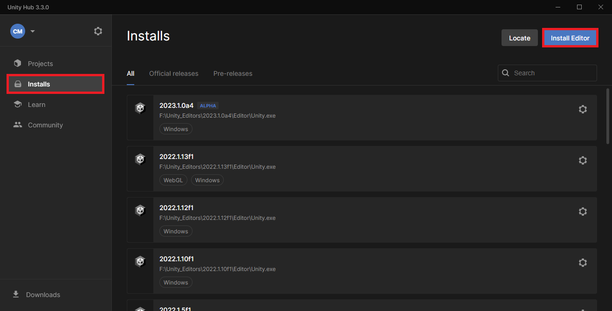{fig-align="center"}


Click the `Install` button next to the latest `2022.1` version under `Other Versions`.


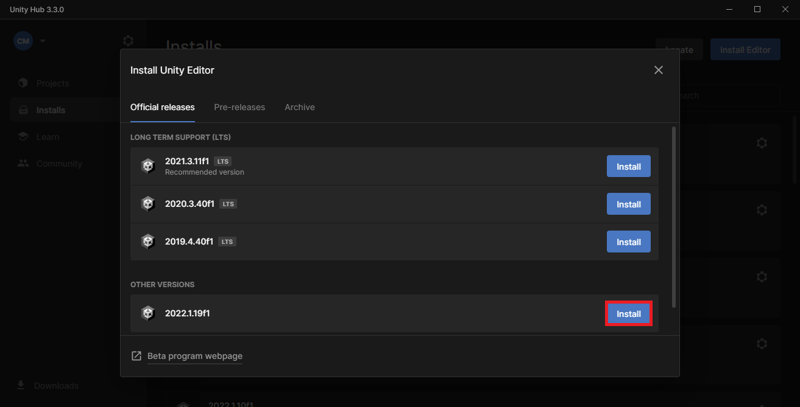{fig-align="center"}


Scroll down the `Add modules` selection menu and click the check box next to `WebGL Build Support`. Click the `Install` button after selecting all desired modules.


{fig-align="center"}


Unity Hub will begin downloading and installing the selected editor version.


## Create New Project

Go back to the `Projects` section after the editor finishes installing and click `New Project`.

{fig-align="center"}


Select the target editor version from the `Editor Version` dropdown menu.


{fig-align="center"}


Select the `2D Core` template.


{fig-align="center"}


Pick a name for the project and a location for the project folder.


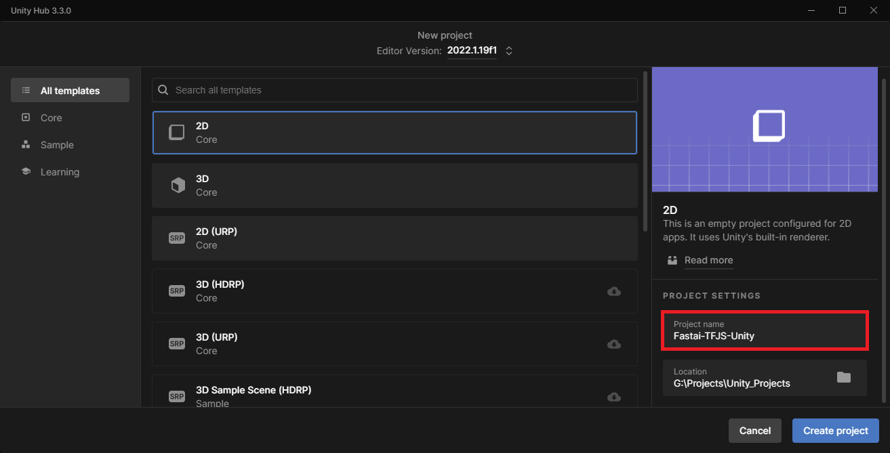{fig-align="center"}


Finally, click `Create Project` in the lower right-hand corner.


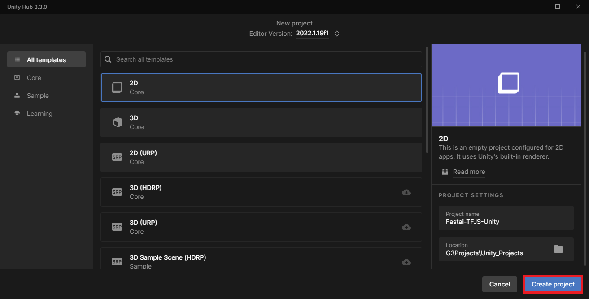{fig-align="center"}


The Unity Editor may take a few minutes to open the new project.


## Import Assets

Inside the editor window, we will first import any class labels, test images, and TensorFlow.js models into the `Assets` folder. 


**Import class labels**

Right-click a space in the `Assets` section and select `Create → Folder` from the popup menu.


{fig-align="center"}


Name the new folder `ClassLabels`.


{fig-align="center"}


Drag and drop any JSON class label files from the operating system's file explorer into the `ClassLabels` folder. Sample files are available in the Google Drive link below.

* **Google Drive:** [ClassLabels](https://drive.google.com/drive/folders/1PzdlGfKMScGKhvnIlSPZ1EQDbErkXxkR?usp=sharing)


{fig-align="center"}


**Import sample images**

Next, create an `Images` folder and drop any test images into it. Sample files are available in the Google Drive link below.

**Google Drive:** [Images](https://drive.google.com/drive/folders/1T8C_22m7Rwd6S1FlJG5NdZ2TVMMB_WpB?usp=sharing)

{fig-align="center"}


Unity automatically imports images as a Sprite (2D and UI) [texture type](https://docs.unity3d.com/Manual/TextureTypes.html). We don't need to change it for our purposes.


**Import TFJS models**

We need to place the TensorFlow.js models in a [StreamingAssets](https://docs.unity3d.com/Manual/StreamingAssets.html) folder to include them in the final application. Create a new folder named `StreamingAssets`. Let's put the folders for each model in a new subfolder called `TFJSModels` to keep things organized.

* **Google Drive:** [TFJSModels](https://drive.google.com/drive/folders/1H86x7jrS7Bj-4305NclBTHO7VANgm4PG?usp=sharing)


{fig-align="center"}


Inside each subfolder are the JSON and BIN files for a TensorFlow.js model.


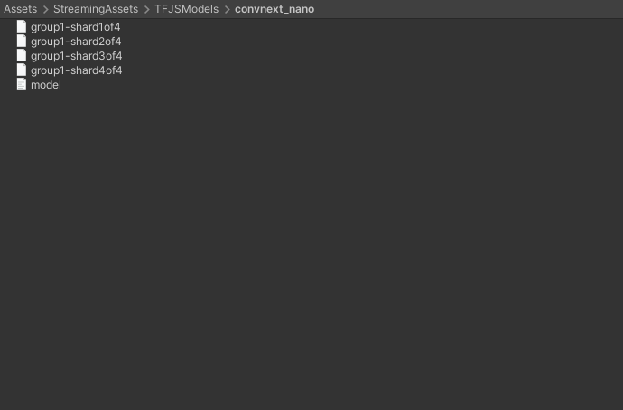{fig-align="center"}


## Create JavaScript Utility File

Before creating the jslib plugin, we'll add a JavaScript file with a utility function to the `StreamingAssets` folder. Open the `StreamingAssets` folder in a code editor and create a new JavaScript file called `utils.js`.


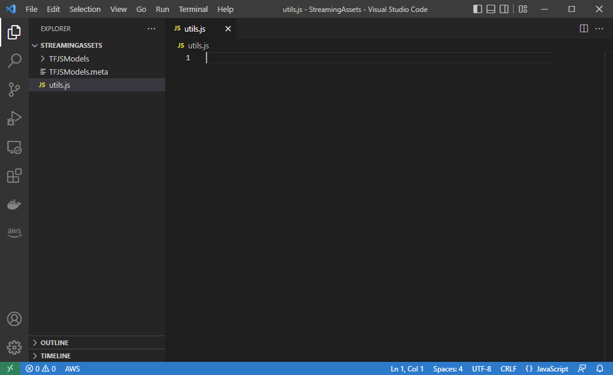{fig-align="center"}


**Define function to perform inference asynchronously**

This function will take in the model, input data, and shape for the input tensor as input. 

We can use the [`tf. tidy()`](https://js.tensorflow.org/api/latest/#tidy) method included with TensorFlow.js for automatic memory cleanup. TensorFlow.js also provides a built-in [ArgMax](https://js.tensorflow.org/api/latest/#argMax) to extract the predicted class index.

```javascript
// Perform inference with the provided model and input data
async function PerformInferenceAsync(model, float32Data, shape) {

    const outputData = tf.tidy(() => {
        // Initialize the input tensor
        const input_tensor = tf.tensor(float32Data, shape, 'float32');
        // Make a prediction.
        return model.predict(input_tensor);
    });
    // Pass raw output through a SoftMax function
    let results = await outputData.data();
    // Extract the predicted class from the model output
    let index = await tf.argMax(results).data();
    return [index, results[index]];
}
```


## Create jslib Plugin

Now we can create the jslib [plugin](https://docs.unity3d.com/Manual/webgl-interactingwithbrowserscripting.html) to use the TensorFlow.js models. In the `Assets` section, create a new folder called `Plugins`. Then create a subfolder called `WebGL`.

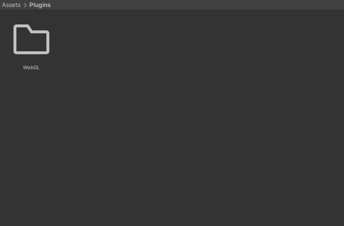{fig-align="center"}


Open the `WebGL` folder in a code editor and create a new file called `WebGLPlugin.jslib`. For formatting purposes, we can set the jslib file as JavaScript.

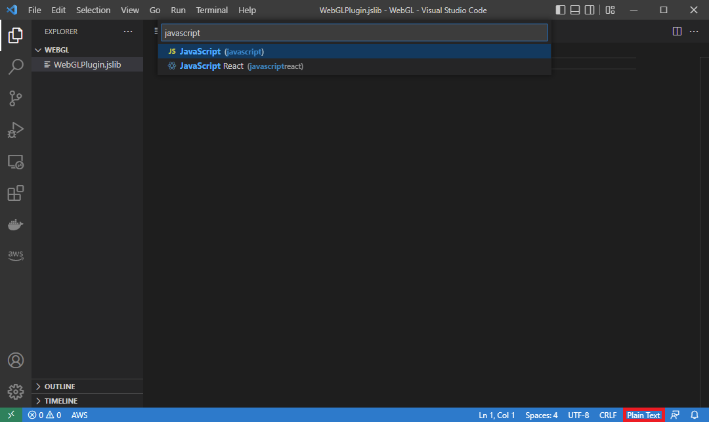{fig-align="center"}


**Basic plugin format**

Here is the basic format for the jslib plugin. We'll place any functions we want accessible from Unity inside the `plugin` variable.

```javascript
// Define plugin functions
let plugin = {
    
}

// Add plugin functions
mergeInto(LibraryManager.library, plugin);
```


**Define function to add external JavaScript dependencies**

We first need to add the script tag for the TensorFlow.js [npm package](https://www.npmjs.com/package/@tensorflow/tfjs) and the `utils.js` script in the `StreamingAssets` folder.

```javascript
// Add additional JavaScript dependencies to the html page
GetExternalJS: function () {

    // Add base TensorFlow.js dependencies
    let tfjs_script = document.createElement("script");
    tfjs_script.src = "https://cdn.jsdelivr.net/npm/@tensorflow/tfjs@3.20.0/dist/tf.min.js";
    document.head.appendChild(tfjs_script);

    // Add custom utility functions
    let script = document.createElement("script");
    script.src = "./StreamingAssets/utils.js";
    document.head.appendChild(script);
},
```


**Define function to set the TensorFlow.js compute backend**

Next, we'll add a function to update the compute backend. At the time of writing, I only recommend using the [WebGL backend](https://github.com/tensorflow/tfjs/tree/master/tfjs-backend-webgl). The base [CPU backend](https://github.com/tensorflow/tfjs/tree/master/tfjs-backend-cpu) is not suitable for real-time applications. The [WASM backend](https://github.com/tensorflow/tfjs/tree/master/tfjs-backend-wasm) enables multi-threaded CPU inference but does not have full operator support. Lastly, the [WebGPU backend](https://github.com/tensorflow/tfjs/tree/master/tfjs-backend-webgpu) is not yet officially supported by browsers.

```javascript
// Set the TFJS inference backend
SetTFJSBackend: function (backend) {
  let backend_str = UTF8ToString(backend);
  try {
     tf.setBackend(backend_str).then(() => { });
     console.log(`Successfully set ${backend_str} backend.`);
  } catch (error) {
     console.log("Error occurred. Falling back to WebGL backend.");
     tf.setBackend('webgl');
  }
},
```


**Define function to Initialize a TensorFlow.js model**

We'll pass a file path for a `model.json` file and an array to store the predicted class index and the corresponding confidence score. We'll be able to access the updated array values in Unity.

```javascript
// Load a TFJS model
InitTFJSModel: async function (model_path, output_data) {

    // Convert bytes to the text
    let model_path_str = UTF8ToString(model_path);
    // Load the TensorFlow.js model at the provided file path
    this.model = await tf.loadGraphModel(model_path_str, { fromTFHub: false });

    // Check the model input shape
    const input_shape = this.model.inputs[0].shape;
    console.log(`Input Shape: ${input_shape}`);

    // Initialize an array to store the predicted class index and confidence score
    this.prediction = new Float32Array(buffer, output_data, 2);
},
```


**Define function to perform inference with a input image**

Loading the model can take several seconds, depending on the user's internet connection. We don't want to perform inference until after it initializes.

Due to the way Unity reads texture data from the GPU to the CPU, we need to read the image data from the bottom up to make the image correctly oriented.

After populating the input array, we'll wait for the asynchronous inference function to finish before updating the prediction array.

```javascript
// Perform inference with the provided image data
PerformInference: function (image_data, size, width, height) {

    // Only perform inference after loading a model
    if (typeof this.model == 'undefined') {
        console.log("Model not defined yet");
        return false;
    }

    // Initialize an array with the raw image data
    const uintArray = new Uint8ClampedArray(buffer, image_data, size, width, height);

    // Channels-last order
    const [input_array] = new Array(new Array());

    // Flip input image from Unity
    for (let row = height - 1; row >= 0; row--) {
        let slice = uintArray.slice(row * width * 3, (row * width * 3) + (width * 3));
        // Scale color values from [0,255] to [0,1]
        for (let col = 0; col < slice.length; col += 3) {
            input_array.push(slice[col + 0]/255);
            input_array.push(slice[col + 1]/255);
            input_array.push(slice[col + 2]/255);
        }
    }

    // Initialize the input array with the preprocessed input data
    const float32Data = Float32Array.from(input_array);
    const shape = [1, height, width, 3];

    // Pass preprocessed input to the model
    PerformInferenceAsync(this.model, float32Data, shape).then(output => {

        // Store class index and confidence value
        this.prediction[0] = output[0];
        this.prediction[1] = output[1];
    })
    return true;
},
```


That's it for the plugin code. Next, we need to import the functions in Unity.


## Import Plugin Functions

We'll import the plugin functions in a dedicated C# script and make them accessible as a static class. Right-click a space inside the `WebGL` folder and select `Create → C# Script`.

{fig-align="center"}


Name the new script WebGLPlugin.


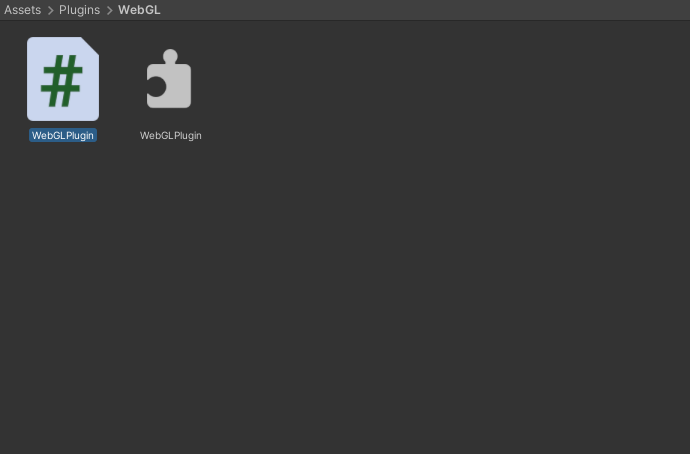{fig-align="center"}


**Default script code**

By default, C# scripts contain the following code. We don't need any of it in this case.

```c#
using System.Collections;
using System.Collections.Generic;
using UnityEngine;

public class ImageClassifier : MonoBehaviour
{
    // Start is called before the first frame update
    void Start()
    {
        
    }

    // Update is called once per frame
    void Update()
    {
        
    }
}
```


We need the [System.Runtime.InteropServices](https://docs.microsoft.com/en-us/dotnet/api/system.runtime.interopservices?view=net-5.0) namespace to handle interactions with the jslib plugin.


```c#
using System.Runtime.InteropServices;

/// <summary>
/// Class with JavaScript plugin functions for WebGL.
/// </summary>
public static class WebGLPlugin
{
    // Import "GetExternalJS" plugin function
    [DllImport("__Internal")]
    public static extern void GetExternalJS();
    // Import "SetTFJSBackend" plugin function
    [DllImport("__Internal")]
    public static extern void SetTFJSBackend(string backend);
    // Import "InitTFJSModel" plugin function
    [DllImport("__Internal")]
    public static extern void InitTFJSModel(string model_path, float[] output_data, int output_size);
    // Import "PerformInference" plugin function
    [DllImport("__Internal")]
    public static extern bool PerformInference(byte[] image_data, int size, int width, int height);
}

```


## Create Image Classifier Script

Now we can create the main script for the Unity project. This script will handle getting input images, sending them to the model, and using the returned predictions to update on-screen readouts. We'll store it in a new `Scripts` folder and name it `ImageClassifier`.


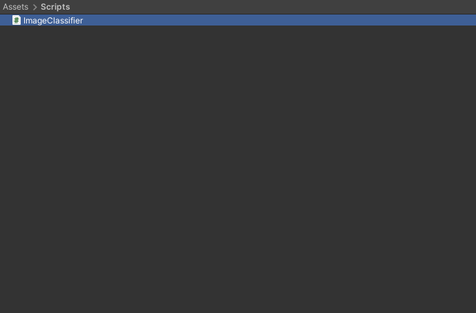{fig-align="center"}


**Add required namespaces**

* [System](https://docs.microsoft.com/en-us/dotnet/api/system?view=net-5.0): Contains fundamental classes and base classes that define commonly-used value and reference data types, events and event handlers, interfaces, attributes, and processing exceptions.
* [UnityEngine.UI](https://docs.unity3d.com/Packages/com.unity.ugui@1.0/api/UnityEngine.UI.html): Provides access to UI elements.
* [UnityEngine.Rendering](https://docs.unity3d.com/Packages/com.unity.render-pipelines.core@5.9/api/UnityEngine.Rendering.html): Provides access to the elements of the rendering pipeline.
* [System.IO](https://learn.microsoft.com/en-us/dotnet/api/system.io?view=net-7.0): Contains types that allow reading and writing to files and data streams, and types that provide basic file and directory support.
* [UnityEngine.Networking](https://docs.unity3d.com/Packages/com.unity.multiplayer-hlapi@1.0/api/UnityEngine.Networking.html): Provides access to the [UnityWebRequest](https://docs.unity3d.com/ScriptReference/Networking.UnityWebRequest.html) module to communicate with http services.

------

```c#
using System.Collections;
using System.Collections.Generic;
using UnityEngine;
using System;
using UnityEngine.UI;
using System.IO;
using UnityEngine.Networking;
```


**Add code to create a list of available TFJS models**

We can't browse for available TFJS models while running the Unity application in the browser, so we need to create a list of model names and file paths to check at runtime. We can do this automatically within the Unity Editor.


Unity provides an [InitializeOnLoad](https://docs.unity3d.com/Manual/RunningEditorCodeOnLaunch.html) attribute to run code in the Unity Editor without requiring action from the user. This attribute requires the [UnityEditor](https://docs.unity3d.com/ScriptReference/UnityEditor.html) namespace. We can only use this while in the Editor, so we need to wrap the code in [Conditional compilation](https://docs.microsoft.com/en-us/dotnet/csharp/language-reference/preprocessor-directives#conditional-compilation) preprocessor directives. This code will go right below the namespaces.


We use the `UNITY_EDITOR` [scripting symbol](https://docs.unity3d.com/Manual/PlatformDependentCompilation.html) to check whether we are in the Unity Editor. When we are in the Editor, it returns true, and the code executes.


```c#
#if UNITY_EDITOR
using UnityEditor;

[InitializeOnLoad]
public class Startup
{
    // A helper class that stores the name and file path for a TensorFlow.js model
    [System.Serializable]
    class ModelData
    {
        public string name;
        public string path;

        public ModelData(string name, string path)
        {
            this.name = name;
            this.path = path;
        }
    }

    // A helper class that stores a list of TensorFlow.js model names and file paths
    [System.Serializable]
    class ModelList
    {
        public List<ModelData> models;

        public ModelList(List<ModelData> models)
        {
            this.models = models;
        }
    }

    static Startup()
    {
        string tfjsModelsDir = "TFJSModels";
        List<ModelData> models = new List<ModelData>();

        Debug.Log("Available models");
        // Get the paths for each model folder
        foreach (string dir in Directory.GetDirectories($"{Application.streamingAssetsPath}/{tfjsModelsDir}"))
        {
            string dirStr = dir.Replace("\\", "/");
            // Extract the model folder name
            string[] splits = dirStr.Split('/');
            string modelName = splits[splits.Length - 1];

            // Get the paths for the model.json file for each model
            foreach (string file in Directory.GetFiles(dirStr))
            {
                if (file.EndsWith("model.json"))
                {
                    string fileStr = file.Replace("\\", "/").Replace(Application.streamingAssetsPath, "");
                    models.Add(new ModelData(modelName, fileStr));
                }
            }
        }

        ModelList modelList = new ModelList(models);
        // Format the list of available models as a string in JSON format
        string json = JsonUtility.ToJson(modelList);
        Debug.Log($"Model List JSON: {json}");
        // Write the list of available TensorFlow.js models to a JSON file
        using StreamWriter writer = new StreamWriter($"{Application.streamingAssetsPath}/models.json");
        writer.Write(json);
    }
}
#endif
```


This code runs after opening the project in the Unity Editor or saving changes to this script. We can verify the code works by saving the script and going to the `StreamingAssets` folder in the Editor. The `models.json` file should be present.


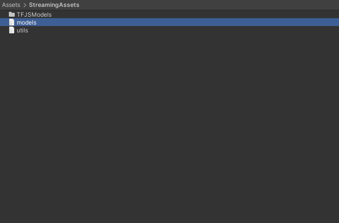{fig-align="center"}


### Define public variables

We'll add the required public variables above the Start method. We will be able to access these variables in the Inspector tab. We can add [Header](https://docs.unity3d.com/ScriptReference/HeaderAttribute.html) attributes to organize the public variables in the Inspector tab and use [Tooltip](https://docs.unity3d.com/ScriptReference/TooltipAttribute.html) attributes to provide information about variables.


**Define scene object variables**

First, we need a variable to access the screen object that displays either a test image or webcam input.

```c#
[Header("Scene Objects")]
[Tooltip("The Screen object for the scene")]
public Transform screen;
```


**Define data processing variables**

We can set the default target input resolution to 216 and use it to scale the source resolution while maintaining the original aspect ratio.


```c#
[Header("Data Processing")]
[Tooltip("The target minimum model input dimensions")]
public int targetDim = 216;
```


**Define output processing variables**

We pass in the JSON file containing the class labels as a [TextAsset](https://docs.unity3d.com/ScriptReference/TextAsset.html).

```c#
[Header("Output Processing")]
[Tooltip("A json file containing the class labels")]
public TextAsset classLabels;
[Tooltip("Minimum confidence score for keeping predictions")]
[Range(0, 1f)]
public float minConfidence = 0.5f;
```


**Define variables for debugging**

Next, we'll add a Boolean variable to toggle printing debug messages to the console. These messages get printed to the console in the browser as well.

```c#
[Header("Debugging")]
[Tooltip("Print debugging messages to the console")]
public bool printDebugMessages = true;
```


**Define webcam variables**

We need to specify a desired resolution and framerate when using a webcam as input.

```c#
[Header("Webcam")]
[Tooltip("Use a webcam as input")]
public bool useWebcam = false;
[Tooltip("The requested webcam dimensions")]
public Vector2Int webcamDims = new Vector2Int(1280, 720);
[Tooltip("The requested webcam framerate")]
[Range(0, 60)]
public int webcamFPS = 60;
```


**Define variables for user interface**

We'll make a simple GUI that displays the predicted class, the current framerate, and controls for selecting webcam devices, models, and backends.

```c#
[Header("GUI")]
[Tooltip("Display predicted class")]
public bool displayPredictedClass = true;
[Tooltip("Display fps")]
public bool displayFPS = true;
[Tooltip("The on-screen text color")]
public Color textColor = Color.yellow;
[Tooltip("The scale value for the on-screen font size")]
[Range(0, 99)]
public int fontScale = 50;
[Tooltip("The number of seconds to wait between refreshing the fps value")]
[Range(0.01f, 1.0f)]
public float fpsRefreshRate = 0.1f;
[Tooltip("The toggle for using a webcam as the input source")]
public Toggle useWebcamToggle;
[Tooltip("The dropdown menu that lists available webcam devices")]
public Dropdown webcamDropdown;
[Tooltip("The dropdown menu that lists available TFJS models")]
public Dropdown modelDropdown;
[Tooltip("The dropdown menu that lists available TFJS backends")]
public Dropdown backendDropdown;
```


**Define TensorFlow.js variables**

We'll store the path to the `StreamingAssets` sub-folder containing the TensorFlow.js models in a string variable.

```c#
[Header("TFJS")]
[Tooltip("The name of the TFJS models folder")]
public string tfjsModelsDir = "TFJSModels";
```


### Define private variables

We'll add the required private variables right below the public variables.


**Define private webcam  variables**

We'll keep a list of available webcam devices so users can switch between them. Unity renders webcam input to a [WebcamTexture](https://docs.unity3d.com/ScriptReference/WebCamTexture.html).

```c#
// List of available webcam devices
private WebCamDevice[] webcamDevices;
// Live video input from a webcam
private WebCamTexture webcamTexture;
// The name of the current webcam  device
private string currentWebcam;
```


**Define input variables**

We'll update the dimensions and content of the screen object based on the test image or webcam.

```c#
// The test image dimensions
Vector2Int imageDims;
// The test image texture
Texture imageTexture;
// The current screen object dimensions
Vector2Int screenDims;
// The model GPU input texture
RenderTexture inputTextureGPU;
// The model CPU input texture
Texture2D inputTextureCPU;
```


**Define variables for class labels**

We need to create a little class that indicates the structure of the JSON content. Our JSON file only contains a single array of strings. We can store this array in a dedicated variable.

```c#
// A class for reading in class labels from a JSON file
class ClassLabels { public string[] classes; }
// The ordered list of class names
private string[] classes;
```


**Define variable to track whether a model is initialized**

We'll track whether a model is ready for inference so we can tell the user if a model is still loading.

```c#
// Stores whether the TensorFlow.js model is ready for inference
bool modelInitialized;
```


**Define variables for tracking the framerate**

Lastly, we need to define a couple of variables for the custom fps counter.

```c#
// The current frame rate value
private int fps = 0;
// Controls when the frame rate value updates
private float fpsTimer = 0f;
```


**Define variables to store values for GUI dropdowns**

We'll update the lists of model paths and names at runtime using the `models.json` file in the `StreamingAssets` folder.

As mentioned previously, I only recommend using the WebGL backend at the time of writing, so we'll hardcode that option here. In the future, we can check if each backend type is available in the jslib plugin and update the list in Unity.

```c#
// File paths for the available TFJS models
List<string> modelPaths = new List<string>();
// Names of the available TFJS models
List<string> modelNames = new List<string>();
// Names of the available TFJS backends
List<string> tfjsBackends = new List<string> { "webgl" };
```


**Define variable to store the current inference output**

We'll share the memory for this array with the jslib plugin. We'll update the values in the plugin and access them in this script.

```c#
// Stores the latest model prediction and confidence score
float[] output_data = new float[2];
```


**Define variables for reading the `models.json` file**

We need to create a couple of helper classes that indicate the structure of the `models.json` file.

```c#
// A helper class to store the name and file path of a TensorFlow.js model
[System.Serializable]
class ModelData { public string name; public string path; }
// A helper class to store a read a list of available TensorFlow.js models from a JSON file
[System.Serializable]
class ModelList { public List<ModelData> models; }
```


### Define Initialization Methods

We first need to define some methods to initialize webcams, the screen object, any GUI dropdown menus, and the in-game camera.


**Define method to initialize a webcam device**


```c#
/// <summary>
/// Initialize the selected webcam device
/// </summary>
/// <param name="deviceName">The name of the selected webcam device</param>
void InitializeWebcam(string deviceName)
{
    // Stop any webcams already playing
    if (webcamTexture && webcamTexture.isPlaying) webcamTexture.Stop();

    // Create a new WebCamTexture
    webcamTexture = new WebCamTexture(deviceName, webcamDims.x, webcamDims.y, webcamFPS);

    // Start the webcam
    webcamTexture.Play();
    // Check if webcam is playing
    useWebcam = webcamTexture.isPlaying;
    // Update toggle value
    useWebcamToggle.SetIsOnWithoutNotify(useWebcam);

    Debug.Log(useWebcam ? "Webcam is playing" : "Webcam not playing, option disabled");
}
```


**Define method to initialize the in-scene screen object**


```c#
/// <summary>
/// Resize and position an in-scene screen object
/// </summary>
void InitializeScreen()
{
    // Set the texture for the screen object
    screen.gameObject.GetComponent<MeshRenderer>().material.mainTexture = useWebcam ? webcamTexture : imageTexture;
    // Set the screen dimensions
    screenDims = useWebcam ? new Vector2Int(webcamTexture.width, webcamTexture.height) : imageDims;

    // Flip the screen around the Y-Axis when using webcam
    float yRotation = useWebcam ? 180f : 0f;
    // Invert the scale value for the Z-Axis when using webcam
    float zScale = useWebcam ? -1f : 1f;

    // Set screen rotation
    screen.rotation = Quaternion.Euler(0, yRotation, 0);
    // Adjust the screen dimensions
    screen.localScale = new Vector3(screenDims.x, screenDims.y, zScale);

    // Adjust the screen position
    screen.position = new Vector3(screenDims.x / 2, screenDims.y / 2, 1);
}
```


**Define method to switch TensorFlow.js models**


```c#
/// <summary>
/// Load a TensorFlow.js model
/// </summary>
public void UpdateTFJSModel()
{
    // Load TensorFlow.js model in JavaScript plugin
    WebGLPlugin.InitTFJSModel(modelPaths[modelDropdown.value], output_data, output_data.Length);
}
```


**Define method to read the list of available TensorFlow.js models**

We can parse the raw JSON content from the `models.json` file using the [`JsonUtility.FromJson()`](https://docs.unity3d.com/ScriptReference/JsonUtility.FromJson.html) method. We'll then update the associated GUI dropdown with the available model names.

```c#
/// <summary>
/// Get the names and paths of the available TensorFlow.js models
/// </summary>
/// <param name="json"></param>
void GetTFJSModels(string json)
{
    ModelList modelList = JsonUtility.FromJson<ModelList>(json);
    foreach (ModelData model in modelList.models)
    {
        //Debug.Log($"{model.name}: {model.path}");
        modelNames.Add(model.name);
        string path = $"{Application.streamingAssetsPath}{model.path}";
        modelPaths.Add(path);
    }
    // Remove default dropdown options
    modelDropdown.ClearOptions();
    // Add TFJS model names to menu
    modelDropdown.AddOptions(modelNames);
    // Select the first option in the dropdown
    modelDropdown.SetValueWithoutNotify(0);
}
```


**Define method to download the list of available TensorFlow.js models**

At runtime, we must fetch the `models.json` file from the hosting server before parsing its content. Getting the file is an asynchronous operation, so we'll use a [coroutine](https://docs.unity3d.com/ScriptReference/MonoBehaviour.StartCoroutine.html). Once we have the file, we'll pass it to the `GetTFJSModels` method.

```c#
/// <summary>
/// Download the JSON file with the available TFJS model information
/// </summary>
/// <param name="uri"></param>
/// <returns></returns>
IEnumerator GetRequest(string uri)
{
    using (UnityWebRequest webRequest = UnityWebRequest.Get(uri))
    {
        // Request and wait for the desired page.
        yield return webRequest.SendWebRequest();

        string[] pages = uri.Split('/');
        int page = pages.Length - 1;

        switch (webRequest.result)
        {
            case UnityWebRequest.Result.ConnectionError:
            case UnityWebRequest.Result.DataProcessingError:
                Debug.LogError(pages[page] + ": Error: " + webRequest.error);
                break;
            case UnityWebRequest.Result.ProtocolError:
                Debug.LogError(pages[page] + ": HTTP Error: " + webRequest.error);
                break;
            case UnityWebRequest.Result.Success:
                Debug.Log(pages[page] + ":\nReceived: " + webRequest.downloadHandler.text);

                // Extract the available model names and file paths from the JSON string
                GetTFJSModels(webRequest.downloadHandler.text);
                // Initialize one of the available TensorFlow.js models
                UpdateTFJSModel();
                break;
        }
    }
}
```


**Define method to initialize GUI dropdown menu options**


```c#
/// <summary>
/// Initialize the GUI dropdown list
/// </summary>
void InitializeDropdown()
{
    // Create list of webcam device names
    List<string> webcamNames = new List<string>();
    foreach (WebCamDevice device in webcamDevices) webcamNames.Add(device.name);

    // Remove default dropdown options
    webcamDropdown.ClearOptions();
    // Add webcam device names to dropdown menu
    webcamDropdown.AddOptions(webcamNames);
    // Set the value for the dropdown to the current webcam device
    webcamDropdown.SetValueWithoutNotify(webcamNames.IndexOf(currentWebcam));

    // Get the available TensorFlow.js models
    string modelListPath = $"{Application.streamingAssetsPath}/models.json";
    StartCoroutine(GetRequest(modelListPath));

    // Remove default dropdown options
    backendDropdown.ClearOptions();
    // Add TFJS backend names to menu
    backendDropdown.AddOptions(tfjsBackends);
    // Select the first option in the dropdown
    backendDropdown.SetValueWithoutNotify(0);
}
```


**Define method to initialize the in-scene camera object**


```c#
/// <summary>
/// Resize and position the main camera based on an in-scene screen object
/// </summary>
/// <param name="screenDims">The dimensions of an in-scene screen object</param>
void InitializeCamera(Vector2Int screenDims, string cameraName = "Main Camera")
{
    // Get a reference to the Main Camera GameObject
    GameObject camera = GameObject.Find(cameraName);
    // Adjust the camera position to account for updates to the screenDims
    camera.transform.position = new Vector3(screenDims.x / 2, screenDims.y / 2, -10f);
    // Render objects with no perspective (i.e. 2D)
    camera.GetComponent<Camera>().orthographic = true;
    // Adjust the camera size to account for updates to the screenDims
    camera.GetComponent<Camera>().orthographicSize = screenDims.y / 2;
}
```


### Define Awake method

We'll call the `GetExternalJS` function from the jslib plugin in the [Awake()](https://docs.unity3d.com/ScriptReference/MonoBehaviour.Awake.html) method.

```c#
// Awake is called when the script instance is being loaded
void Awake()
{
    WebGLPlugin.GetExternalJS();
}
```


### Define Start method

The [Start](https://docs.unity3d.com/ScriptReference/MonoBehaviour.Start.html) method is [called](https://docs.unity3d.com/Manual/ExecutionOrder.html) once before the first frame update, so we'll perform any required setup steps here.

```c#
// Start is called before the first frame update
void Start()
{
    // Get the source image texture
    imageTexture = screen.gameObject.GetComponent<MeshRenderer>().material.mainTexture;
    // Get the source image dimensions as a Vector2Int
    imageDims = new Vector2Int(imageTexture.width, imageTexture.height);

    // Initialize list of available webcam devices
    webcamDevices = WebCamTexture.devices;
    foreach (WebCamDevice device in webcamDevices) Debug.Log(device.name);
    currentWebcam = webcamDevices[0].name;
    useWebcam = webcamDevices.Length > 0 ? useWebcam : false;
    // Initialize webcam
    if (useWebcam) InitializeWebcam(currentWebcam);

    // Resize and position the screen object using the source image dimensions
    InitializeScreen();
    // Resize and position the main camera using the source image dimensions
    InitializeCamera(screenDims);

    // Initialize list of class labels from JSON file
    classes = JsonUtility.FromJson<ClassLabels>(classLabels.text).classes;

    // Initialize the webcam dropdown list
    InitializeDropdown();

    // Update the current TensorFlow.js compute backend
    WebGLPlugin.SetTFJSBackend(tfjsBackends[backendDropdown.value]);
}
```


### Define Processing Methods

Next, we need to define a preprocessing method to calculate the input resolution.


**Define method to calculate input resolution**


```c#
/// <summary>
/// Scale the source image resolution to the target input dimensions
/// while maintaing the source aspect ratio.
/// </summary>
/// <param name="imageDims"></param>
/// <param name="targetDims"></param>
/// <returns></returns>
Vector2Int CalculateInputDims(Vector2Int imageDims, int targetDim)
{
    // Clamp the minimum dimension value to 64px
    targetDim = Mathf.Max(targetDim, 64);

    Vector2Int inputDims = new Vector2Int();

    // Calculate the input dimensions using the target minimum dimension
    if (imageDims.x >= imageDims.y)
    {
        inputDims[0] = (int)(imageDims.x / ((float)imageDims.y / (float)targetDim));
        inputDims[1] = targetDim;
    }
    else
    {
        inputDims[0] = targetDim;
        inputDims[1] = (int)(imageDims.y / ((float)imageDims.x / (float)targetDim));
    }

    return inputDims;
}
```


### Define Update method

We'll place anything we want to run every frame in the [Update](https://docs.unity3d.com/ScriptReference/MonoBehaviour.Update.html) method.

```c#
// Update is called once per frame
void Update()
{
    useWebcam = webcamDevices.Length > 0 ? useWebcam : false;
    if (useWebcam)
    {
        // Initialize webcam if it is not already playing
        if (!webcamTexture || !webcamTexture.isPlaying) InitializeWebcam(currentWebcam);

        // Skip the rest of the method if the webcam is not initialized
        if (webcamTexture.width <= 16) return;

        // Make sure screen dimensions match webcam resolution when using webcam
        if (screenDims.x != webcamTexture.width)
        {
            // Resize and position the screen object using the source image dimensions
            InitializeScreen();
            // Resize and position the main camera using the source image dimensions
            InitializeCamera(screenDims);
        }
    }
    else if (webcamTexture && webcamTexture.isPlaying)
    {
        // Stop the current webcam
        webcamTexture.Stop();

        // Resize and position the screen object using the source image dimensions
        InitializeScreen();
        // Resize and position the main camera using the source image dimensions
        InitializeCamera(screenDims);
    }

    // Scale the source image resolution
    Vector2Int inputDims = CalculateInputDims(screenDims, targetDim);

    // Initialize the input texture with the calculated input dimensions
    inputTextureGPU = RenderTexture.GetTemporary(inputDims.x, inputDims.y, 24, RenderTextureFormat.ARGB32);

    if (!inputTextureCPU || inputTextureCPU.width != inputTextureGPU.width)
    {
        inputTextureCPU = new Texture2D(inputDims.x, inputDims.y, TextureFormat.RGB24, false);
    }

    if (printDebugMessages) Debug.Log($"Input Dims: {inputTextureGPU.width}x{inputTextureGPU.height}");

    // Copy the source texture into model input texture
    Graphics.Blit((useWebcam ? webcamTexture : imageTexture), inputTextureGPU);

    // Download pixel data from GPU to CPU
    RenderTexture.active = inputTextureGPU;
    inputTextureCPU.ReadPixels(new Rect(0, 0, inputTextureGPU.width, inputTextureGPU.height), 0, 0);
    inputTextureCPU.Apply();

    // Get the current input dimensions
    int width = inputTextureCPU.width;
    int height = inputTextureCPU.height;
    int size = width * height * 3;

    // Pass the input data to the plugin to perform inference
    modelInitialized = WebGLPlugin.PerformInference(inputTextureCPU.GetRawTextureData(), size, width, height);

    // Check if index is valid
    if (printDebugMessages) Debug.Log(modelInitialized ? $"Predicted Class: {classes[(int)output_data[0]]}" : "Not Initialized");

    // Release the input texture
    RenderTexture.ReleaseTemporary(inputTextureGPU);
}
```


### Define GUI Methods

We need some methods to handle user interactions with the GUI and display the predicted class and current framerate.


**Define method to update webcam usage from GUI**


```c#
/// <summary>
/// This method is called when the value for the webcam toggle changes
/// </summary>
/// <param name="useWebcam"></param>
public void UpdateWebcamToggle(bool useWebcam)
{
    this.useWebcam = useWebcam;
}
```


**Define method to update webcam device from GUI**


```c#
/// <summary>
/// The method is called when the selected value for the webcam dropdown changes
/// </summary>
public void UpdateWebcamDevice()
{
    currentWebcam = webcamDevices[webcamDropdown.value].name;
    Debug.Log($"Selected Webcam: {currentWebcam}");
    // Initialize webcam if it is not already playing
    if (useWebcam) InitializeWebcam(currentWebcam);

    // Resize and position the screen object using the source image dimensions
    InitializeScreen();
    // Resize and position the main camera using the source image dimensions
    InitializeCamera(screenDims);
}
```


**Define method to update the TensorFlow.js backend**


```c#
/// <summary>
/// Update the TensorFlow.js compute backend
/// </summary>
public void UpdateTFJSBackend()
{
    WebGLPlugin.SetTFJSBackend(tfjsBackends[backendDropdown.value]);
}
```


**Define method to update the confidence threshold**


```c#
/// <summary>
/// Update the minimum confidence score for keeping predictions
/// </summary>
/// <param name="slider"></param>
public void UpdateConfidenceThreshold(Slider slider)
{
    minConfidence = slider.value;
}
```


**Define OnGUI method**

We'll display the predicted class and current frame rate in the [OnGUI](https://docs.unity3d.com/ScriptReference/MonoBehaviour.OnGUI.html) method. We'll show a different message while the model is still loading.

```c#
// OnGUI is called for rendering and handling GUI events.
public void OnGUI()
{
    // Define styling information for GUI elements
    GUIStyle style = new GUIStyle
    {
        fontSize = (int)(Screen.width * (1f / (100f - fontScale)))
    };
    style.normal.textColor = textColor;

    // Define screen spaces for GUI elements
    Rect slot1 = new Rect(10, 10, 500, 500);
    Rect slot2 = new Rect(10, style.fontSize * 1.5f, 500, 500);

    // Verify predicted class index is valid
    string labelText = $"{classes[(int)output_data[0]]} {(output_data[1] * 100).ToString("0.##")}%";
    if (output_data[1] < minConfidence) labelText = "None";
    string content = modelInitialized ? $"Predicted Class: {labelText}" : "Loading Model...";
    if (displayPredictedClass) GUI.Label(slot1, new GUIContent(content), style);

    // Update framerate value
    if (Time.unscaledTime > fpsTimer)
    {
        fps = (int)(1f / Time.unscaledDeltaTime);
        fpsTimer = Time.unscaledTime + fpsRefreshRate;
    }

    // Adjust screen position when not showing predicted class
    Rect fpsRect = displayPredictedClass ? slot2 : slot1;
    if (displayFPS) GUI.Label(fpsRect, new GUIContent($"FPS: {fps}"), style);
}
```


That's it for the code.


## Set up Unity Scene

We can, at last, start setting up our Unity scene. We need a screen to display the webcam feed, an empty object to attach the `ImageClassifier` script, a dropdown menu for selecting webcam devices, and a toggle to switch between the test image and a webcam feed.


**Create Screen object**

Right-click a space in the Hierarchy tab and select `3D Object → Quad`. We can name the new object `Screen`.


{fig-align="center"}


Next, drag and drop a test image from the `Assets → Images` folder onto the `Screen` object in the Scene view. Note that the Screen looks a bit dim. We need to change the shader for the Screen's Material so that it does not require an external light source.


{fig-align="center"}


Select the Screen in the Hierarchy tab and open the Shader dropdown menu in the Inspector tab. Type `Unlit/Texture` into the search box and press enter.


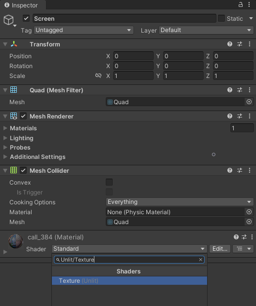{fig-align="center"}


**Create Inference Manager object**

Right-click a space in the Hierarchy tab and select Create Empty. Name the empty object `InferenceManager`.

{fig-align="center"}


With the `InferenceManager` object selected, drag the `ImageClassifier` script into the Inspector tab.


{fig-align="center"}


Now we can assign the Screen and class labels file in the Inspector tab by dragging them into their respective fields.


{fig-align="center"}


**Add GUI prefab**

We still need to create the GUI toggle and dropdown menu. To save time, I made a [Prefab](https://docs.unity3d.com/Manual/Prefabs.html) that we can drop into the Scene. 

* **Google Drive:** [Prefabs folder](https://drive.google.com/drive/folders/1K3tgzMmNavqamlHPsrQn26K6A0n1uinb?usp=sharing)

Drag and drop the `Prefabs` folder into the `Assets` section.


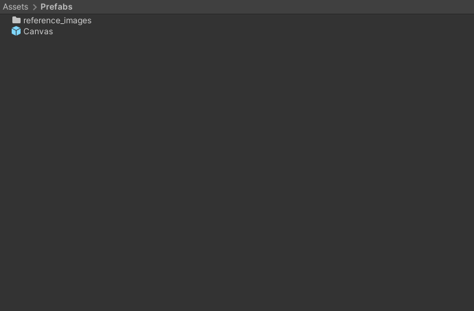{fig-align="center"}


Open the `Prefabs` folder and drag the Canvas prefab into the Hierarchy tab. We can see the GUI by switching to the Game view.

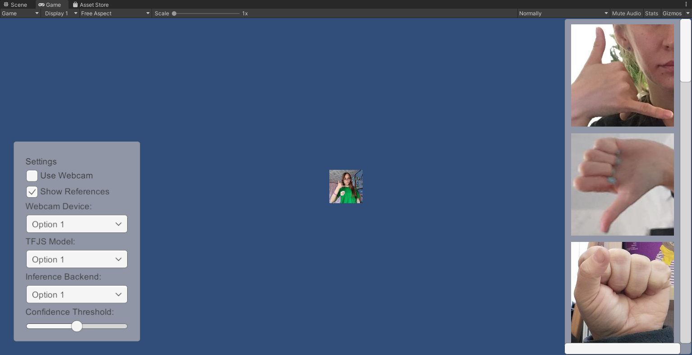{fig-align="center"}


**Configure Webcam Toggle On Value Changed function**

Next, we need to pair the `WebcamToggle` with the `UpdateWebcamToggle` function in the `ImageClassifier` script. Expand the Canvas object and select the `WebcamToggle`.


{fig-align="center"}


Click and drag the `InferenceManager` into the `On Value Changed` field.


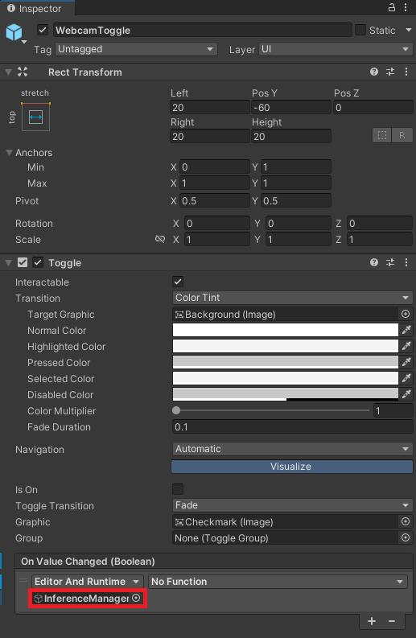{fig-align="center"}


Open the `No Function` dropdown menu and select `ImageClassifier → UpdateWebcamToggle`.


{fig-align="center"}


**Configure Webcam Dropdown On Value Changed function**

We can follow the same steps to pair the `WebcamDropdown` with the `UpdateWebcamDevice` function in the `ImageClassifier` script.


{fig-align="center"}


This time select `ImageClassifier → UpdateWebcamDevice`.


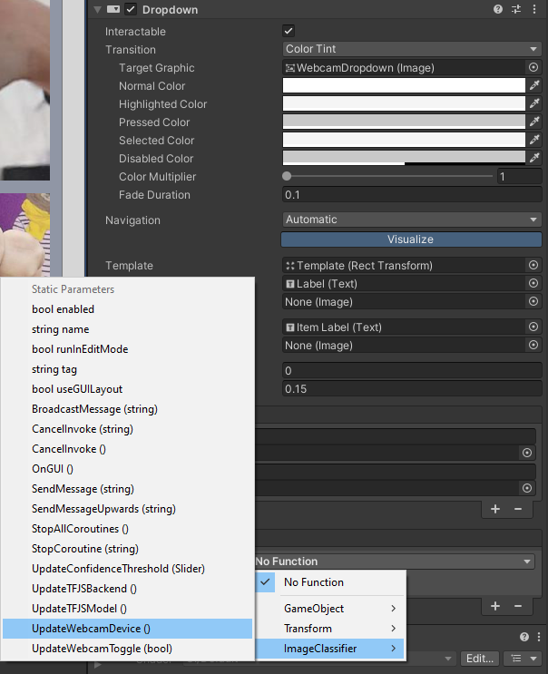{fig-align="center"}


**Configure `TFJSModelDropdown` On Value Changed function**

{fig-align="center"}


**Configure `TFJSBackendDropdown` On Value Changed function**

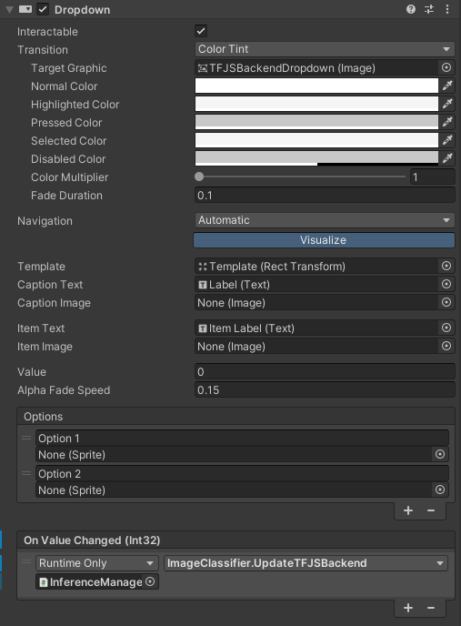{fig-align="center"}


**Configure `ConfidenceThresholdSlider` On Value Changed Event**

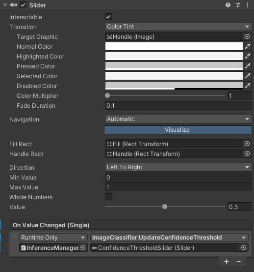{fig-align="center"}


**Assign GUI objects to Inference Manager**

We can now assign the `WebcamToggle` and `WebcamDropdown` objects to their respective fields for the `ImageClassifier` script.

{fig-align="center"}


**Add Event System**

Before we can use the GUI, we need to add an Event System. Right-click a space in the Hierarchy tab and select `UI → Event System`.

{fig-align="center"}


## Test in Browser

Now, we can build the project and test it in a web browser. In the Unity project, select `File → Build Settings...` in the top menu bar to open the Build Settings window.

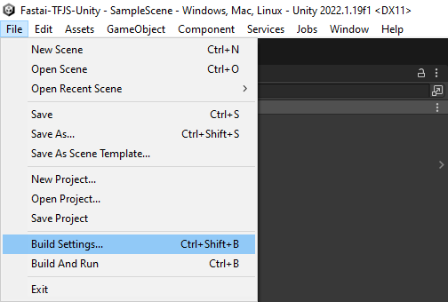{fig-align="center"}


Select `WebGL` from the list of platforms and click Switch Platform.

{fig-align="center"}


Unity enables compression by default for WebGL builds, which GitHub Pages does not support. We can disable compression in the Player Settings. Click the `Player Settings...` button in the bottom-left corner of the Build Settings window.

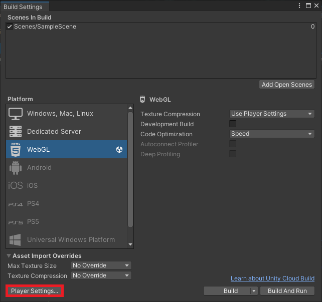{fig-align="center"}


Select `Disabled` from the Compression Format dropdown menu and close the Project Settings window.

{fig-align="center"}


We can test the WebGL build locally by clicking `Build and Run` in the Build Settings window.


{fig-align="center"}


Unity will prompt us to select a folder to store the build files. Create a new folder called `Build`. Open the folder and click `Select Folder` to start the build process.

{fig-align="center"}


Unity caps the framerate to the default [target framerate](https://docs.unity3d.com/ScriptReference/Application-targetFrameRate.html) for the platform. My desktop display maxes out at 60fps.


**Test ConvNeXt nano performance**

Performance for the ConvNeXt nano model fluctuates in the mid to high 50s. That is significantly lower than native inference options like OpenVINO or DirectML but still usable. GPU utilization seems to max out around 34% on my desktop.

{fig-align="center"}


**Test ResNet18 performance**

The smaller ResNet18 model reaches the display's 60fps max refresh rate but likely also falls far short of native inference options.

{fig-align="center"}


## Summary

In this post, we installed Unity Hub, downloaded a Unity Editor, and created a new Unity project. We then imported the required assets and added a JavaScript utility file and jslib plugin. Next, we created an image classifier script to use our trained model in Unity and set up the Unity scene to use it. Finally, we tested our project in a browser. With this completed, we are ready to move on to Part 3 of this tutorial series, where we will host our Unity project as a live demo on [GitHub Pages](https://pages.github.com/).


**Previous:** [In-Browser Hand Gesture Recognition for Unity with Fastai and TensorFlow.js Pt. 1](../part-1/)

**Next:** [In-Browser Hand Gesture Recognition for Unity with Fastai and TensorFlow.js Pt. 3](../part-3/)

**Project Resources:** [GitHub Repository](https://github.com/cj-mills/tensorflow-js-unity-tutorial)


<!-- Cloudflare Web Analytics --><script defer src='https://static.cloudflareinsights.com/beacon.min.js' data-cf-beacon='{"token": "56b8d2f624604c4891327b3c0d9f6703"}'></script><!-- End Cloudflare Web Analytics -->