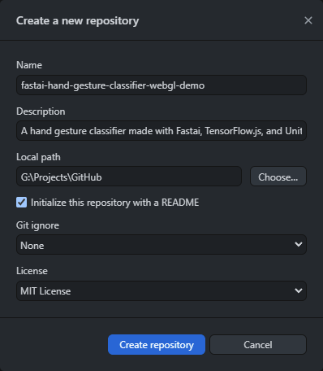
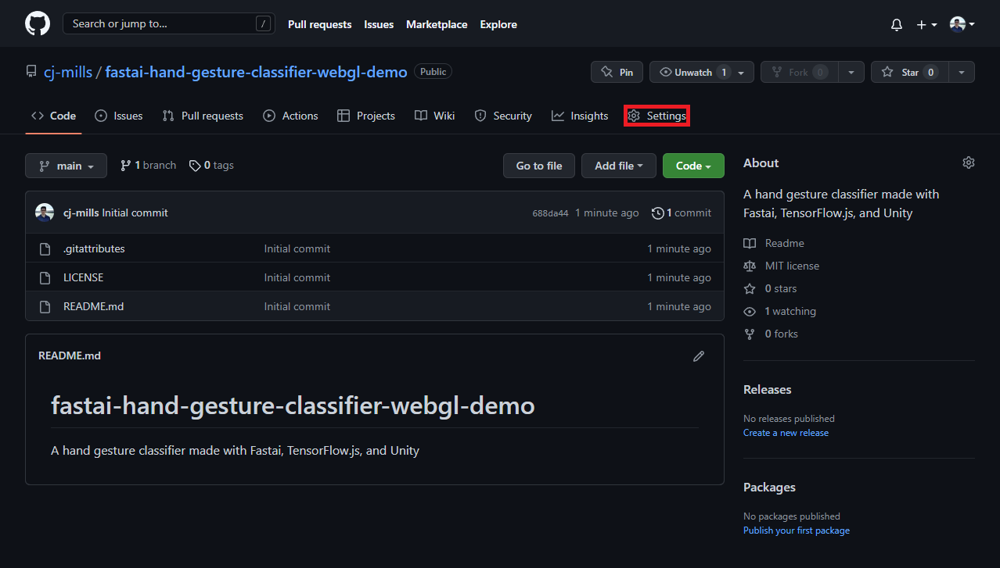
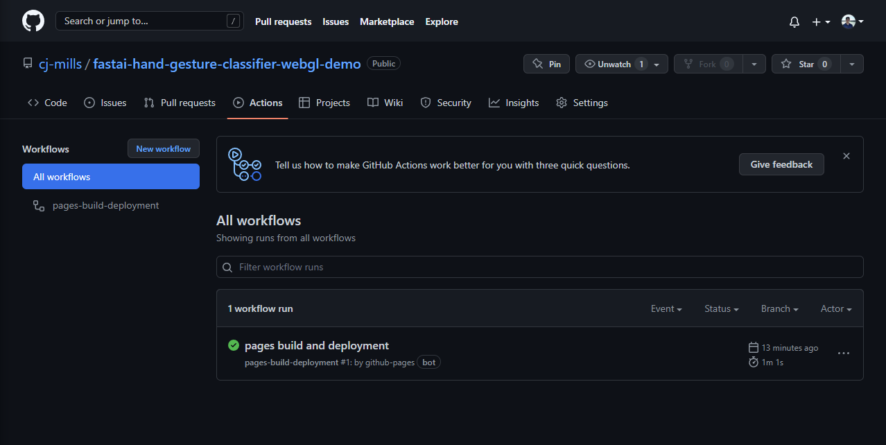
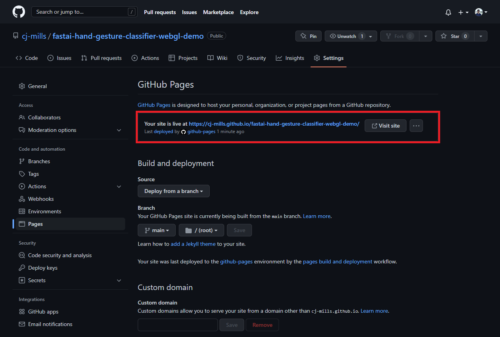
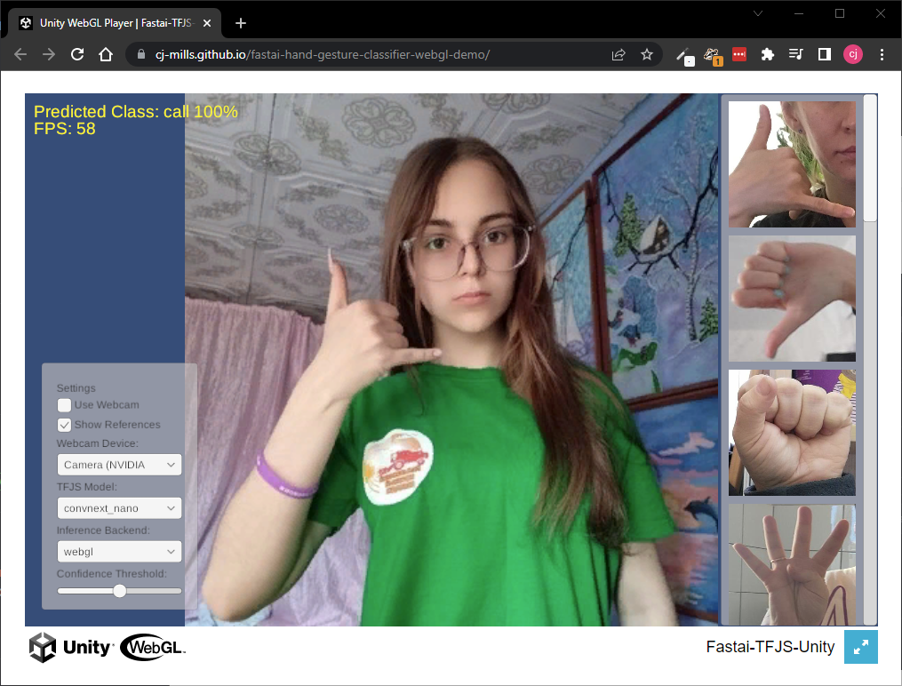

* [Overview](#overview)
* [Create GitHub Pages Repository](#create-github-pages-repository)
* [Add Unity Build Files](#add-unity-build-files)
* [Test Live Demo](#test-live-demo)
* [Summary](#summary)

## Tutorial Links

- [Part 1](../part-1/): Train a hand gesture classifier using fastai and export it to TensorFlow.js.
- [Part 2](../part-2/): Create a TensorFlow.js plugin for the Unity game engine.
- [Part 3](../part-3/): Build a Unity project as a WebGL application and host it using GitHub Pages.
- [GitHub Repository](https://github.com/cj-mills/tensorflow-js-unity-tutorial)

## Overview

In Part 3 of this tutorial series, we will create a [GitHub Pages](https://pages.github.com/) repository to host our Unity project as a live demo. We will start by creating a repository and adding the Unity build files. Then, we will test the live demo to verify it works properly. By the end of this post, you will have a live demo of your hand gesture recognition system that you can share with others.

## Create GitHub Pages Repository

We first need to create a [new GitHub repository](https://github.com/new) to store the WebGL build. We can do this on GitHub or locally using Git, GitHub Desktop, or another tool. 

{fig-align="center"}

Open the Settings tab for the new repository on GitHub.

{fig-align="center"}

Open the `Pages` section. Switch the source branch to `main` and click the `Save` button to start the automated build process.

{fig-align="center"}

We can check the GitHub Pages build progress under the Actions tab for the repository.

{fig-align="center"}

The web page will be accessible once the `pages build and deployment` workflow completes. Although, we don't have any web pages at the moment.

{fig-align="center"}

GitHub will provide a URL for accessing the web demo in the GitHub Pages section once it finishes building.

{fig-align="center"}

## Add Unity Build Files

Now let's add the WebGL build from the previous post. Open the `Build` folder from [part 2.](../part-2/#test-in-browser)

{fig-align="center"}

Copy the folder content to the repository for the GitHub Pages demo.

{fig-align="center"}

We can push the local changes to GitHub, which will automatically trigger the `pages build and deployment` workflow.

{fig-align="center"}

## Test Live Demo

We can test the web demo at the URL provided by GitHub once the build workflow completes.

{fig-align="center"}

## Summary

In this tutorial series, we demonstrated how to use fastai and TensorFlow.js to create a hand gesture recognition system in Unity. In Part 1, we trained a hand gesture classifier using fastai and exported it to TensorFlow.js. In Part 2, we created a TensorFlow.js plugin for the Unity game engine. Finally, in this post, we hosted the Unity project as a live demo on GitHub Pages. With this tutorial series, you now have the tools and knowledge to use TensorFlow.js models in Unity applications.

**Previous:** [In-Browser Hand Gesture Recognition for Unity with Fastai and TensorFlow.js Pt. 2](../part-2/)

**Project Resources:** [GitHub Repository](https://github.com/cj-mills/tensorflow-js-unity-tutorial)

<!-- Cloudflare Web Analytics --><!-- End Cloudflare Web Analytics -->