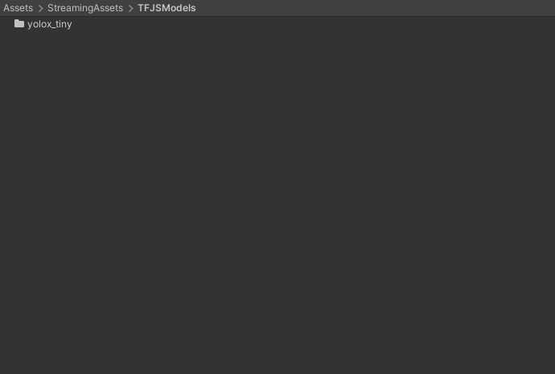
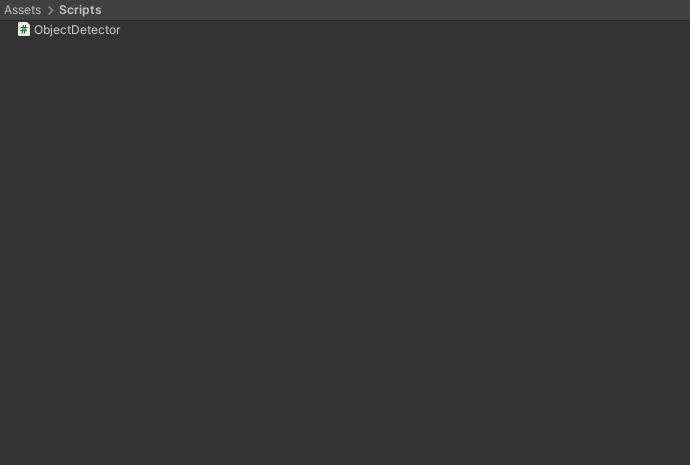
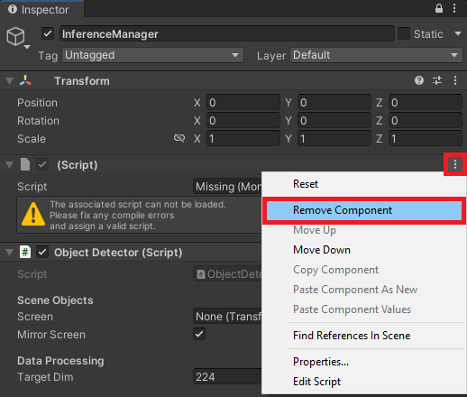
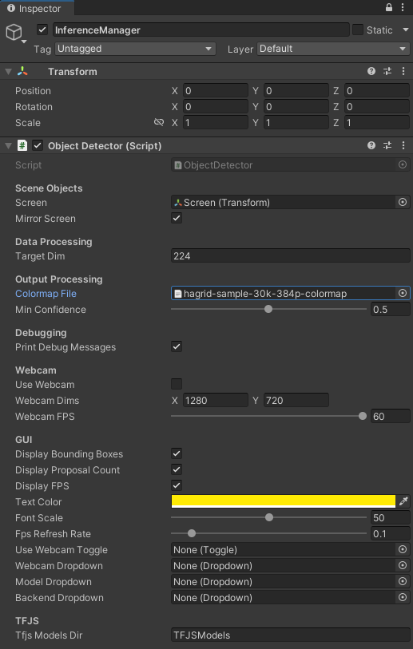
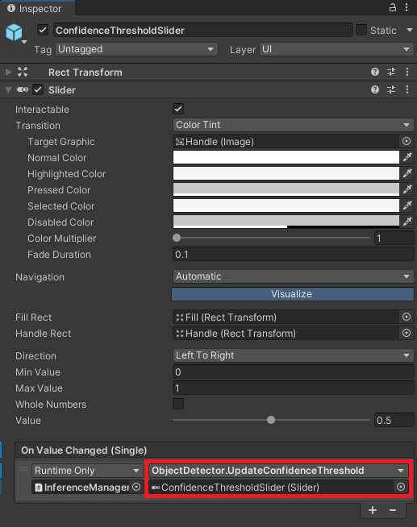
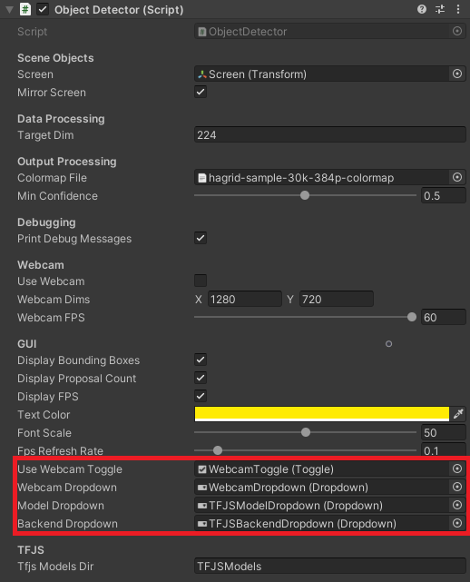
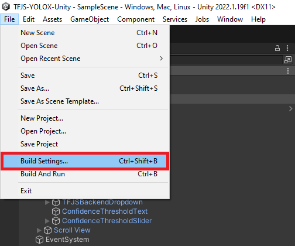
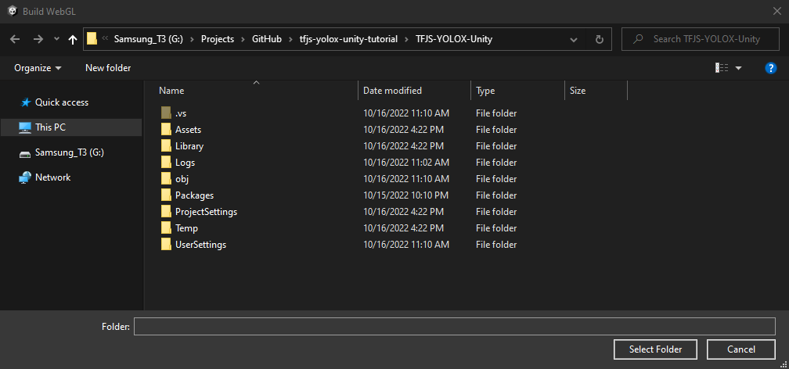

* [Overview](#overview)
* [Convert Model to TFJS](#convert-model-to-tfjs)
* [Import Assets](#import-assets)
* [Update JavaScript Utility File](#update-javascript-utility-file)
* [Update jslib Plugin](#update-jslib-plugin)
* [Import Plugin Functions](#import-plugin-functions)
* [Create Object Detector Script](#create-object-detector-script)
* [Update Unity Scene](#update-unity-scene)
* [Test in Browser](#test-in-browser)
* [Summary](#summary)


## Overview

This follow-up post shows you how to modify an existing Unity project from a [previous tutorial](http://../tensorflow-js-unity-tutorial/part-1/) to use [TensorFlow.js](https://www.tensorflow.org/js) for in-browser object detection. We will begin by converting a pre-existing model to the TensorFlow.js format and importing it into [Unity](https://unity.com/). Next, we will update the JavaScript utility file and the jslib plugin from the original project. After setting up the plugin, we will create a script to implement the object detector in Unity and update our scene to use it. Finally, we will test the project in-browser to ensure it works properly.


**In-Browser Demo:** [Hand Gesture Detector](https://cj-mills.github.io/hand-gesture-detector-webgl-demo/)


**Project Resources**

* [GitHub Repository](https://github.com/cj-mills/tfjs-yolox-unity-tutorial): The final Unity project for this tutorial.
* [Colormaps](https://drive.google.com/drive/folders/1sTU5fiG6mmq19fWzpmptBNJNN4qhN_yi?usp=sharing): A JSON colormap file that maps each object class to a distinct color.
* [TFJSModels](https://drive.google.com/drive/folders/1kuSyQcW032Is1o1a3n8w9LGzdL_d44aC?usp=sharing): A YOLOX model in TensorFlow.js format.
* [In-Browser Hand Gesture Recognition for Unity with Fastai and TensorFlow.js ](../tensorflow-js-unity-tutorial/part-1/): The previous tutorial.


## Convert Model to TFJS

We first need a YOLOX model in TensorFlow.js format. We can use the [same steps](../tensorflow-js-unity-tutorial/part-1/#export-the-model) from the original tutorial to convert the YOLOX model from a [previous tutorial](../icevision-openvino-unity-tutorial/part-1/). The YOLOX model detects the same hand gestures as the image classifier from the original tutorial.


A link to the model conversion notebook is below, along with links for running the notebook on [Google Colab](https://colab.research.google.com/?utm_source=scs-index) and [Kaggle](https://www.kaggle.com/docs/notebooks).


| Jupyter Notebook             | Colab                                                        | Kaggle                                                       |
| --------------------------------- | ------------------------------------------------------------ | ------------------------------------------------------------ |
| [GitHub Repository](https://github.com/cj-mills/tfjs-yolox-unity-tutorial/blob/main/notebooks/ONNX-to-TF-to-TFJS.ipynb) | [Open In Colab](https://colab.research.google.com/github/cj-mills/tfjs-yolox-unity-tutorial/blob/main/notebooks/ONNX-to-TF-to-TFJS-Colab.ipynb) | [Open in Kaggle](https://kaggle.com/kernels/welcome?src=https://github.com/cj-mills/tfjs-yolox-unity-tutorial/blob/main/notebooks/ONNX-to-TF-to-TFJS-Kaggle.ipynb) |


## Import Assets

Open the Unity project from the original tutorial in the Unity Editor. Alternatively, you can create a copy of the project and rename it to something more appropriate. We will first import the colormap and TensorFlow.js model into the `Assets` folder.


**Import color map**

We'll store the colormap JSON file in a new folder called `Colormaps`. Drag and drop the JSON colormap file from the operating system's file explorer into the `Colormaps` folder.

* **Google Drive:** [Colormaps](https://drive.google.com/drive/folders/1sTU5fiG6mmq19fWzpmptBNJNN4qhN_yi?usp=sharing)


{fig-align="center"}


**Import TFJS model**

We need to replace the existing TensorFlow.js models in the `StreamingAssets` folder with the YOLOX model.

* **Google Drive:** [TFJSModels](https://drive.google.com/drive/folders/1kuSyQcW032Is1o1a3n8w9LGzdL_d44aC?usp=sharing)


{fig-align="center"}


## Update JavaScript Utility File

We'll update the function in the utils.js file in the `StreamingAssets` folder to return the raw model output.


**Update function to perform inference asynchronously with YOLOX model**

```javascript
// Perform inference with the provided model and input data
async function PerformInferenceAsync(model, float32Data, shape) {

    const outputData = tf.tidy(() => {
        const input_tensor = tf.tensor(float32Data, shape, 'float32');
        // Make a prediction.
        return model.predict(input_tensor);
    });
    return await outputData.data();
}
```


## Update jslib Plugin

We also need to make a few updates to the `WebGLPlugin.jslib` file.


**Update function to Initialize TFJS model**

We'll update the `InitTFJSModel` function to take the path to the YOLOX `model.json` file and the normalization stats to the plugin.

```javascript
// Load a TFJS YOLOX model
InitTFJSModel: async function (model_path, mean, std_dev) {

    // Convert bytes to the text
    let model_path_str = UTF8ToString(model_path);
    // Load the TensorFlow.js model at the provided file path
    this.model = await tf.loadGraphModel(model_path_str, { fromTFHub: false });

    // Check the model input shape
    const input_shape = this.model.inputs[0].shape;
    console.log(`Input Shape: ${input_shape}`);

    // Store normalization stats
    this.mean = new Float32Array(buffer, mean, 3);
    this.std_dev = new Float32Array(buffer, std_dev, 3);
},
```


**Define function to update output array**

The size of the raw model output depends on the input resolution. That means we need to update the output array each time we update the input resolution.

```javascript
// Update the array which stores the raw model output
UpdateOutputArray: function (array_data, size) {
    delete this.output_array;
    this.output_array = new Float32Array(buffer, array_data, size);
    console.log(`New output size JS: ${this.output_array.length}`);
},
```


**Update inference function for YOLOX model**

Lastly, we need to update the `PerformInference` function to normalize the input data and fill the shared output array with the raw model output.

```javascript
// Perform inference with the provided image data
PerformInference: function (image_data, size, width, height) {

    // Only perform inference after loading a model
    if (typeof this.model == 'undefined') {
        console.log("Model not defined yet");
        return false;
    }

    // Initialize an array with the raw image data
    const uintArray = new Uint8ClampedArray(buffer, image_data, size, width, height);

    // Channels-last order
    const [input_array] = new Array(new Array());

    // Flip input image from Unity
    for (let row = height - 1; row >= 0; row--) {
        let slice = uintArray.slice(row * width * 3, (row * width * 3) + (width * 3));
        for (let col = 0; col < slice.length; col += 3) {
            input_array.push(((slice[col + 0] / 255.0) - this.mean[0]) / this.std_dev[0]);
            input_array.push(((slice[col + 1] / 255.0) - this.mean[1]) / this.std_dev[1]);
            input_array.push(((slice[col + 2] / 255.0) - this.mean[2]) / this.std_dev[2]);
        }
    }

    // Initialize the input array with the preprocessed input data
    const float32Data = Float32Array.from(input_array);
    const shape = [1, height, width, 3];

    // Pass preprocessed input to the model
    PerformInferenceAsync(this.model, float32Data, shape).then(output => {
        if (output_array.length == output.length) {
            this.output_array.set(output);
        }
        else {
            console.log(`Model output size JS: ${output.length}`);
            this.output_array.fill(0);
        }
    })
    return true;
},
```


That's it for the changes to the plugin code. Next, we need to update the script where we import the functions in Unity.


## Import Plugin Functions

We need to update the import line for `InitTFJSModel` and import the new `UpdateOutputArray` function in the `WebGLPlugin.cs` script.


```c#
using System.Runtime.InteropServices;

/// <summary>
/// Class with JavaScript plugin functions for WebGL.
/// </summary>
public static class WebGLPlugin
{
    // Import "GetExternalJS" plugin function
    [DllImport("__Internal")]
    public static extern void GetExternalJS();
    // Import "SetTFJSBackend" plugin function
    [DllImport("__Internal")]
    public static extern void SetTFJSBackend(string backend);
    // Import "InitTFJSModel" plugin function
    [DllImport("__Internal")]
    public static extern void InitTFJSModel(string model_path, float[] mean, float[] std);
    // Import "UpdateOutputArray" plugin function
    [DllImport("__Internal")]
    public static extern void UpdateOutputArray(float[] output_data, int size);
    // Import "PerformInference" plugin function
    [DllImport("__Internal")]
    public static extern bool PerformInference(byte[] image_data, int size, int width, int height);
}
```

Changing the import line for `InitTFJSModel` will cause an error in the `ImageClassifier` script, but we will resolve this in the next section.


## Create Object Detector Script

We'll replace the `ImageClassifier` script from the original tutorial with a new script called `ObjectDetector`. It will handle getting input images, sending them to the model, processing the model output, and drawing bounding boxes around detected objects. Delete the existing `ImageClassifier` script.


{fig-align="center"}


**Add required namespaces**

* [System](https://docs.microsoft.com/en-us/dotnet/api/system?view=net-5.0): Contains fundamental classes and base classes that define commonly-used value and reference data types, events and event handlers, interfaces, attributes, and processing exceptions.
* [UnityEngine.UI](https://docs.unity3d.com/Packages/com.unity.ugui@1.0/api/UnityEngine.UI.html): Provides access to UI elements.
* [UnityEngine.Rendering](https://docs.unity3d.com/Packages/com.unity.render-pipelines.core@5.9/api/UnityEngine.Rendering.html): Provides access to the elements of the rendering pipeline.
* [System.IO](https://learn.microsoft.com/en-us/dotnet/api/system.io?view=net-7.0): Contains types that allow reading and writing to files and data streams, and types that provide basic file and directory support.
* [UnityEngine.Networking](https://docs.unity3d.com/Packages/com.unity.multiplayer-hlapi@1.0/api/UnityEngine.Networking.html): Provides access to the [UnityWebRequest](https://docs.unity3d.com/ScriptReference/Networking.UnityWebRequest.html) module to communicate with http services.
* [System.Linq](https://learn.microsoft.com/en-us/dotnet/api/system.linq?view=net-7.0): Provides classes and interfaces that support queries that use Language-Integrated Query (LINQ).

------

```c#
using System.Collections;
using System.Collections.Generic;
using UnityEngine;
using System;
using UnityEngine.UI;
using System.IO;
using UnityEngine.Networking;
using System.Linq;
```


**Add code to create a list of available TFJS models**

We can use the [same code](../tensorflow-js-unity-tutorial/part-2/#create-image-classifier-script) to create a list of available TFJS models used in the `ImageClassifier` script. This code will go right below the namespaces.

```c#
#if UNITY_EDITOR
using UnityEditor;

[InitializeOnLoad]
public class Startup
{
    // A helper class that stores the name and file path for a TensorFlow.js model
    [System.Serializable]
    class ModelData
    {
        public string name;
        public string path;

        public ModelData(string name, string path)
        {
            this.name = name;
            this.path = path;
        }
    }

    // A helper class that stores a list of TensorFlow.js model names and file paths
    [System.Serializable]
    class ModelList
    {
        public List<ModelData> models;

        public ModelList(List<ModelData> models)
        {
            this.models = models;
        }
    }

    static Startup()
    {
        string tfjsModelsDir = "TFJSModels";
        List<ModelData> models = new List<ModelData>();

        Debug.Log("Available models");
        // Get the paths for each model folder
        foreach (string dir in Directory.GetDirectories($"{Application.streamingAssetsPath}/{tfjsModelsDir}"))
        {
            string dirStr = dir.Replace("\\", "/");
            // Extract the model folder name
            string[] splits = dirStr.Split('/');
            string modelName = splits[splits.Length - 1];

            // Get the paths for the model.json file for each model
            foreach (string file in Directory.GetFiles(dirStr))
            {
                if (file.EndsWith("model.json"))
                {
                    string fileStr = file.Replace("\\", "/").Replace(Application.streamingAssetsPath, "");
                    models.Add(new ModelData(modelName, fileStr));
                }
            }
        }

        ModelList modelList = new ModelList(models);
        // Format the list of available models as a string in JSON format
        string json = JsonUtility.ToJson(modelList);
        Debug.Log($"Model List JSON: {json}");
        // Write the list of available TensorFlow.js models to a JSON file
        using StreamWriter writer = new StreamWriter($"{Application.streamingAssetsPath}/models.json");
        writer.Write(json);
    }
}
#endif
```


### Define public variables

The required public variables are mostly the same as the [`ImageClassifier` script](../tensorflow-js-unity-tutorial/part-2/#define-public-variables).


**Define scene object variables**

We'll add a new variable to indicate whether to mirror the in-scene screen.

```c#
[Header("Scene Objects")]
[Tooltip("The Screen object for the scene")]
public Transform screen;
[Tooltip("Mirror the in-game screen.")]
public bool mirrorScreen = true;
```


**Define data processing variables**

We'll increase the default target input resolution from `216` to `224`.

```c#
[Header("Data Processing")]
[Tooltip("The target minimum model input dimensions")]
public int targetDim = 224;
```


**Define output processing variables**

We'll replace the `classLabels` [TextAsset](https://docs.unity3d.com/ScriptReference/TextAsset.html) with a variable for the colormap JSON file.

```c#
[Header("Output Processing")]
[Tooltip("A json file containing the colormaps for object classes")]
public TextAsset colormapFile;
[Tooltip("Minimum confidence score for keeping predictions")]
[Range(0, 1f)]
public float minConfidence = 0.5f;
```


**Define variables for debugging (unchanged)**

```c#
[Header("Debugging")]
[Tooltip("Print debugging messages to the console")]
public bool printDebugMessages = true;
```


**Define webcam variables (unchanged)**

```c#
[Header("Webcam")]
[Tooltip("Use a webcam as input")]
public bool useWebcam = false;
[Tooltip("The requested webcam dimensions")]
public Vector2Int webcamDims = new Vector2Int(1280, 720);
[Tooltip("The requested webcam framerate")]
[Range(0, 60)]
public int webcamFPS = 60;
```


**Define variables for user interface**

We'll replace the `displayPredictedClass` GUI variable with two new variables that control displaying bounding boxes and the number of detected objects.

```c#
[Header("GUI")]
[Tooltip("Display predicted class")]
public bool displayBoundingBoxes = true;
[Tooltip("Display number of detected objects")]
public bool displayProposalCount = true;
[Tooltip("Display fps")]
public bool displayFPS = true;
[Tooltip("The on-screen text color")]
public Color textColor = Color.yellow;
[Tooltip("The scale value for the on-screen font size")]
[Range(0, 99)]
public int fontScale = 50;
[Tooltip("The number of seconds to wait between refreshing the fps value")]
[Range(0.01f, 1.0f)]
public float fpsRefreshRate = 0.1f;
[Tooltip("The toggle for using a webcam as the input source")]
public Toggle useWebcamToggle;
[Tooltip("The dropdown menu that lists available webcam devices")]
public Dropdown webcamDropdown;
[Tooltip("The dropdown menu that lists available TFJS models")]
public Dropdown modelDropdown;
[Tooltip("The dropdown menu that lists available TFJS backends")]
public Dropdown backendDropdown;
```


**Define TensorFlow.js variables (unchanged)**

```c#
[Header("TFJS")]
[Tooltip("The name of the TFJS models folder")]
public string tfjsModelsDir = "TFJSModels";
```


### Define private variables

We'll add the required private variables right below the public variables.


**Define private webcam  variables (unchanged)**

```c#
// List of available webcam devices
private WebCamDevice[] webcamDevices;
// Live video input from a webcam
private WebCamTexture webcamTexture;
// The name of the current webcam  device
private string currentWebcam;
```


**Define input variables (unchanged)**

```c#
// The test image dimensions
Vector2Int imageDims;
// The test image texture
Texture imageTexture;
// The current screen object dimensions
Vector2Int screenDims;
// The model GPU input texture
RenderTexture inputTextureGPU;
// The model CPU input texture
Texture2D inputTextureCPU;
```


**Define variables for colormap**

We'll create a couple of classes to parse the JSON colormap content.

```c#
// A class for parsing in colormaps from a JSON file
[System.Serializable]
class ColorMap { public string label; public float[] color; }
// A class for reading in a list of colormaps from a JSON file
[System.Serializable]
class ColorMapList { public List<ColorMap> items; }
// Stores a list of colormaps from a JSON file
private ColorMapList colormapList;
// A list of colors that map to class labels
private Color[] colors;
// A list of single pixel textures that map to class labels
private Texture2D[] colorTextures;
```


**Define variable to track whether a model is initialized (unchanged)**

```c#
// Stores whether the TensorFlow.js model is ready for inference
bool modelInitialized;
```


**Define variables for tracking the framerate (unchanged)**

```c#
// The current frame rate value
private int fps = 0;
// Controls when the frame rate value updates
private float fpsTimer = 0f;
```


**Define variables to store values for GUI dropdowns (unchanged)**

```c#
// File paths for the available TFJS models
List<string> modelPaths = new List<string>();
// Names of the available TFJS models
List<string> modelNames = new List<string>();
// Names of the available TFJS backends
List<string> tfjsBackends = new List<string> { "webgl" };
```


**Define variables for reading the `models.json` file (unchanged)**

```c#
// A helper class to store the name and file path of a TensorFlow.js model
[System.Serializable]
class ModelData { public string name; public string path; }
// A helper class to store a read a list of available TensorFlow.js models from a JSON file
[System.Serializable]
class ModelList { public List<ModelData> models; }
```


**Define variables for normalization stats**

The YOLOX model uses the standard ImageNet normalization stats from PyTorch.

```c#
// The normalization stats for the YOLOX model
float[] mean = new float[] { 0.485f, 0.456f, 0.406f };
float[] std = new float[] { 0.229f, 0.224f, 0.225f };
```


**Define struct to store information for object predictions**

```c#
/// <summary>
/// Stores the information for a single object
/// </summary> 
public struct Object
{
    // The X coordinate for the top left bounding box corner
    public float x0;
    // The Y coordinate for the top left bounding box cornder
    public float y0;
    // The width of the bounding box
    public float width;
    // The height of the bounding box
    public float height;
    // The object class index for the detected object
    public int label;
    // The model confidence score for the object
    public float prob;

    public Object(float x0, float y0, float width, float height, int label, float prob)
    {
        this.x0 = x0;
        this.y0 = y0;
        this.width = width;
        this.height = height;
        this.label = label;
        this.prob = prob;
    }
}
```


**Define struct to store grid offset and stride values**

```c#
// Store grid offset and stride values to decode a section of the model output
public struct GridAndStride
{
    public int grid0;
    public int grid1;
    public int stride;

    public GridAndStride(int grid0, int grid1, int stride)
    {
        this.grid0 = grid0;
        this.grid1 = grid1;
        this.stride = stride;
    }
}
```


**Define variables for processing model output**

```c#
// Stores information for the current list of detected objects
private Object[] objectInfoArray;
// Stores the grid and stride values to navigate the raw model output
List<GridAndStride> grid_strides = new List<GridAndStride>();
// The stride values used to generate the gride_strides vector
int[] strides = new int[] { 8, 16, 32 };
// Stores the raw model output
float[] output_array;
// The scale values used to adjust the model output to the source image resolution
float scale_x;
float scale_y;
// Stores the number of detected objects
private int numObjects;
```


### Define Initialization Methods

The initialization methods are identical to those from the `ImageClassifier` script except for `UpdateTFJSModel`.


**Define method to initialize a webcam device (unchanged)**

```c#
/// <summary>
/// Initialize the selected webcam device
/// </summary>
/// <param name="deviceName">The name of the selected webcam device</param>
void InitializeWebcam(string deviceName)
{
    // Stop any webcams already playing
    if (webcamTexture && webcamTexture.isPlaying) webcamTexture.Stop();

    // Create a new WebCamTexture
    webcamTexture = new WebCamTexture(deviceName, webcamDims.x, webcamDims.y, webcamFPS);

    // Start the webcam
    webcamTexture.Play();
    // Check if webcam is playing
    useWebcam = webcamTexture.isPlaying;
    // Update toggle value
    useWebcamToggle.SetIsOnWithoutNotify(useWebcam);

    Debug.Log(useWebcam ? "Webcam is playing" : "Webcam not playing, option disabled");
}
```


**Define method to initialize the in-scene screen object (unchanged)**

```c#
/// <summary>
/// Resize and position an in-scene screen object
/// </summary>
void InitializeScreen()
{
    // Set the texture for the screen object
    screen.gameObject.GetComponent<MeshRenderer>().material.mainTexture = useWebcam ? webcamTexture : imageTexture;
    // Set the screen dimensions
    screenDims = useWebcam ? new Vector2Int(webcamTexture.width, webcamTexture.height) : imageDims;

    // Flip the screen around the Y-Axis when using webcam
    float yRotation = useWebcam ? 180f : 0f;
    // Invert the scale value for the Z-Axis when using webcam
    float zScale = useWebcam ? -1f : 1f;

    // Set screen rotation
    screen.rotation = Quaternion.Euler(0, yRotation, 0);
    // Adjust the screen dimensions
    screen.localScale = new Vector3(screenDims.x, screenDims.y, zScale);

    // Adjust the screen position
    screen.position = new Vector3(screenDims.x / 2, screenDims.y / 2, 1);
}
```


**Define method to switch TensorFlow.js models**


```c#
/// <summary>
/// Load a TensorFlow.js model
/// </summary>
public void UpdateTFJSModel()
{
    // Load TensorFlow.js model in JavaScript plugin
    WebGLPlugin.InitTFJSModel(modelPaths[modelDropdown.value], mean, std);
}
```


**Define method to read the list of available TensorFlow.js models (unchanged)**

```c#
/// <summary>
/// Get the names and paths of the available TensorFlow.js models
/// </summary>
/// <param name="json"></param>
void GetTFJSModels(string json)
{
    ModelList modelList = JsonUtility.FromJson<ModelList>(json);
    foreach (ModelData model in modelList.models)
    {
        //Debug.Log($"{model.name}: {model.path}");
        modelNames.Add(model.name);
        string path = $"{Application.streamingAssetsPath}{model.path}";
        modelPaths.Add(path);
    }
    // Remove default dropdown options
    modelDropdown.ClearOptions();
    // Add TFJS model names to menu
    modelDropdown.AddOptions(modelNames);
    // Select the first option in the dropdown
    modelDropdown.SetValueWithoutNotify(0);
}
```


**Define method to download the list of available TensorFlow.js models (unchanged)**

```c#
/// <summary>
/// Download the JSON file with the available TFJS model information
/// </summary>
/// <param name="uri"></param>
/// <returns></returns>
IEnumerator GetRequest(string uri)
{
    using (UnityWebRequest webRequest = UnityWebRequest.Get(uri))
    {
        // Request and wait for the desired page.
        yield return webRequest.SendWebRequest();

        string[] pages = uri.Split('/');
        int page = pages.Length - 1;

        switch (webRequest.result)
        {
            case UnityWebRequest.Result.ConnectionError:
            case UnityWebRequest.Result.DataProcessingError:
                Debug.LogError(pages[page] + ": Error: " + webRequest.error);
                break;
            case UnityWebRequest.Result.ProtocolError:
                Debug.LogError(pages[page] + ": HTTP Error: " + webRequest.error);
                break;
            case UnityWebRequest.Result.Success:
                Debug.Log(pages[page] + ":\nReceived: " + webRequest.downloadHandler.text);

                // Extract the available model names and file paths from the JSON string
                GetTFJSModels(webRequest.downloadHandler.text);
                // Initialize one of the available TensorFlow.js models
                UpdateTFJSModel();
                break;
        }
    }
}
```


**Define method to initialize GUI dropdown menu options (unchanged)**


```c#
/// <summary>
/// Initialize the GUI dropdown list
/// </summary>
void InitializeDropdown()
{
    // Create list of webcam device names
    List<string> webcamNames = new List<string>();
    foreach (WebCamDevice device in webcamDevices) webcamNames.Add(device.name);

    // Remove default dropdown options
    webcamDropdown.ClearOptions();
    // Add webcam device names to dropdown menu
    webcamDropdown.AddOptions(webcamNames);
    // Set the value for the dropdown to the current webcam device
    webcamDropdown.SetValueWithoutNotify(webcamNames.IndexOf(currentWebcam));

    // Get the available TensorFlow.js models
    string modelListPath = $"{Application.streamingAssetsPath}/models.json";
    StartCoroutine(GetRequest(modelListPath));

    // Remove default dropdown options
    backendDropdown.ClearOptions();
    // Add TFJS backend names to menu
    backendDropdown.AddOptions(tfjsBackends);
    // Select the first option in the dropdown
    backendDropdown.SetValueWithoutNotify(0);
}
```


**Define method to initialize the in-scene camera object (unchanged)**


```c#
/// <summary>
/// Resize and position the main camera based on an in-scene screen object
/// </summary>
/// <param name="screenDims">The dimensions of an in-scene screen object</param>
void InitializeCamera(Vector2Int screenDims, string cameraName = "Main Camera")
{
    // Get a reference to the Main Camera GameObject
    GameObject camera = GameObject.Find(cameraName);
    // Adjust the camera position to account for updates to the screenDims
    camera.transform.position = new Vector3(screenDims.x / 2, screenDims.y / 2, -10f);
    // Render objects with no perspective (i.e. 2D)
    camera.GetComponent<Camera>().orthographic = true;
    // Adjust the camera size to account for updates to the screenDims
    camera.GetComponent<Camera>().orthographicSize = screenDims.y / 2;
}
```


### Define Awake method (unchanged)

```c#
// Awake is called when the script instance is being loaded
void Awake()
{
    WebGLPlugin.GetExternalJS();
}
```


### Define Start method

In the Start method, we need to initialize the color map variables with the JSON file.

```c#
// Start is called before the first frame update
void Start()
{
    // Get the source image texture
    imageTexture = screen.gameObject.GetComponent<MeshRenderer>().material.mainTexture;
    // Get the source image dimensions as a Vector2Int
    imageDims = new Vector2Int(imageTexture.width, imageTexture.height);

    // Initialize list of available webcam devices
    webcamDevices = WebCamTexture.devices;
    foreach (WebCamDevice device in webcamDevices) Debug.Log(device.name);
    currentWebcam = webcamDevices[0].name;
    useWebcam = webcamDevices.Length > 0 ? useWebcam : false;
    // Initialize webcam
    if (useWebcam) InitializeWebcam(currentWebcam);

    // Resize and position the screen object using the source image dimensions
    InitializeScreen();
    // Resize and position the main camera using the source image dimensions
    InitializeCamera(screenDims);


    // Initialize list of color maps from JSON file
    colormapList = JsonUtility.FromJson<ColorMapList>(colormapFile.text);
    // Initialize the list of colors
    colors = new Color[colormapList.items.Count];
    // Initialize the list of color textures
    colorTextures = new Texture2D[colormapList.items.Count];

    // Populate the color and color texture arrays
    for (int i = 0; i < colors.Length; i++)
    {
        // Create a new color object
        colors[i] = new Color(
            colormapList.items[i].color[0],
            colormapList.items[i].color[1],
            colormapList.items[i].color[2]);
        // Create a single-pixel texture
        colorTextures[i] = new Texture2D(1, 1);
        colorTextures[i].SetPixel(0, 0, colors[i]);
        colorTextures[i].Apply();

    }

    // Initialize the webcam dropdown list
    InitializeDropdown();

    // Update the current TensorFlow.js compute backend
    WebGLPlugin.SetTFJSBackend(tfjsBackends[backendDropdown.value]);
}
```


### Define Processing Methods

The preprocessing methods are identical to those from the `ImageClassifier` script. However, we need to add some post-processing methods to extract object predictions from the raw model output.


**Define method to calculate input resolution (unchanged)**

```c#
/// <summary>
/// Scale the source image resolution to the target input dimensions
/// while maintaing the source aspect ratio.
/// </summary>
/// <param name="imageDims"></param>
/// <param name="targetDims"></param>
/// <returns></returns>
Vector2Int CalculateInputDims(Vector2Int imageDims, int targetDim)
{
    // Clamp the minimum dimension value to 64px
    targetDim = Mathf.Max(targetDim, 64);

    Vector2Int inputDims = new Vector2Int();

    // Calculate the input dimensions using the target minimum dimension
    if (imageDims.x >= imageDims.y)
    {
        inputDims[0] = (int)(imageDims.x / ((float)imageDims.y / (float)targetDim));
        inputDims[1] = targetDim;
    }
    else
    {
        inputDims[0] = targetDim;
        inputDims[1] = (int)(imageDims.y / ((float)imageDims.x / (float)targetDim));
    }

    return inputDims;
}
```


**Define method to scale bounding boxes to the display resolution**

```c#
/// <summary>
/// Scale the latest bounding boxes to the display resolution
/// </summary>
public void ScaleBoundingBoxes()
{
    // Process new detected objects
    for (int i = 0; i < objectInfoArray.Length; i++)
    {
        // The smallest dimension of the screen
        float minScreenDim = Mathf.Min(screen.transform.localScale.x, screen.transform.localScale.y);
        // The smallest input dimension
        int minInputDim = Mathf.Min(inputTextureCPU.width, inputTextureCPU.height);
        // Calculate the scale value between the in-game screen and input dimensions
        float minImgScale = minScreenDim / minInputDim;
        // Calculate the scale value between the in-game screen and display
        float displayScale = Screen.height / screen.transform.localScale.y;

        // Scale bounding box to in-game screen resolution and flip the bbox coordinates vertically
        float x0 = objectInfoArray[i].x0 * minImgScale;
        float y0 = (inputTextureCPU.height - objectInfoArray[i].y0) * minImgScale;
        float width = objectInfoArray[i].width * minImgScale;
        float height = objectInfoArray[i].height * minImgScale;

        // Mirror bounding box across screen
        if (mirrorScreen && useWebcam)
        {
            x0 = screen.transform.localScale.x - x0 - width;
        }

        // Scale bounding boxes to display resolution
        objectInfoArray[i].x0 = x0 * displayScale;
        objectInfoArray[i].y0 = y0 * displayScale;
        objectInfoArray[i].width = width * displayScale;
        objectInfoArray[i].height = height * displayScale;

        // Offset the bounding box coordinates based on the difference between the in-game screen and display
        objectInfoArray[i].x0 += (Screen.width - screen.transform.localScale.x * displayScale) / 2;
    }
}
```


**Define method to generate stride values to navigate the raw model output**

We'll generate offset values based on the input dimensions and stride values, which we can use to traverse the output array.

```c#
/// <summary>
/// Generate offset values to navigate the raw model output
/// </summary>
/// <param name="height">The model input height</param>
/// <param name="width">The model input width</param>
/// <returns></returns>
List<GridAndStride> GenerateGridStrides(int height, int width)
{
    List<GridAndStride> grid_strides = new List<GridAndStride>();

    // Iterate through each stride value
    foreach (int stride in strides)
    {
        // Calculate the grid dimensions
        int grid_height = height / stride;
        int grid_width = width / stride;

        Debug.Log($"Gride: {grid_height} x {grid_width}");

        // Store each combination of grid coordinates
        for (int g1 = 0; g1 < grid_height; g1++)
        {

            for (int g0 = 0; g0 < grid_width; g0++)
            {
                grid_strides.Add(new GridAndStride(g0, g1, stride));
            }
        }
    }
    return grid_strides;
}
```


**Define method to generate object detection proposals from the raw model output**

Next, we define a method to iterate through the output array and decode the bounding box information for each object proposal. We only want to keep the ones with a high enough confidence score. The model predicts the center coordinates of a bounding box, but we store the coordinates for the top-left corner as we use this to draw the rectangles on the screen.

```c#
/// <summary>
/// Generate object detection proposals from the raw model output
/// </summary>
/// <param name="model_output">The raw model output</param>
/// <param name="proposal_length">The length of a single proposal</param>
/// <returns></returns>
List<Object> GenerateYOLOXProposals(float[] model_output, int proposal_length)
{
    List<Object> proposals = new List<Object>();

    // Obtain the number of classes the model was trained to detect
    int num_classes = proposal_length - 5;

    for (int anchor_idx = 0; anchor_idx < grid_strides.Count; anchor_idx++)
    {
        // Get the current grid and stride values
        var grid0 = grid_strides[anchor_idx].grid0;
        var grid1 = grid_strides[anchor_idx].grid1;
        var stride = grid_strides[anchor_idx].stride;

        // Get the starting index for the current proposal
        var start_idx = anchor_idx * proposal_length;

        // Get the coordinates for the center of the predicted bounding box
        var x_center = (model_output[start_idx + 0] + grid0) * stride;
        var y_center = (model_output[start_idx + 1] + grid1) * stride;

        // Get the dimensions for the predicted bounding box
        var w = Mathf.Exp(model_output[start_idx + 2]) * stride;
        var h = Mathf.Exp(model_output[start_idx + 3]) * stride;

        // Calculate the coordinates for the upper left corner of the bounding box
        var x0 = x_center - w * 0.5f;
        var y0 = y_center - h * 0.5f;

        x0 /= scale_x;
        y0 /= scale_y;
        w /= scale_x;
        h /= scale_y;

        // Get the confidence score that an object is present
        var box_objectness = model_output[start_idx + 4];

        // Initialize object struct with bounding box information
        Object obj = new Object(x0, y0, w, h, 0, 0);

        // Find the object class with the highest confidence score
        for (int class_idx = 0; class_idx < num_classes; class_idx++)
        {
            // Get the confidence score for the current object class
            var box_cls_score = model_output[start_idx + 5 + class_idx];
            // Calculate the final confidence score for the object proposal
            var box_prob = box_objectness * box_cls_score;

            // Check for the highest confidence score
            if (box_prob > obj.prob)
            {
                obj.label = class_idx;
                obj.prob = box_prob;
            }
        }

        // Only add object proposals with high enough confidence scores
        if (obj.prob > minConfidence) proposals.Add(obj);
    }

    // Sort the proposals based on the confidence score in descending order
    proposals = proposals.OrderByDescending(x => x.prob).ToList();

    return proposals;
}
```


**Define function to calculate the union area of two bounding boxes**

```c#
/// <summary>
/// Calculate the union area of two bounding boxes
/// </summary>
/// <param name="a"></param>
/// <param name="b"></param>
/// <returns></returns>
float CalcUnionArea(Object a, Object b)
{
    var x = Mathf.Min(a.x0, b.x0);
    var y = Mathf.Min(a.y0, b.y0);
    var w = Mathf.Max(a.x0 + a.width, b.x0 + b.width) - x;
    var h = Mathf.Max(a.y0 + a.height, b.y0 + b.height) - y;
    return w * h;
}
```


**Define function to calculate the intersection area of two bounding boxes**

```c#
/// <summary>
/// Calculate the intersection area of two bounding boxes
/// </summary>
/// <param name="a"></param>
/// <param name="b"></param>
/// <returns></returns>
float CalcInterArea(Object a, Object b)
{
    var x = Mathf.Max(a.x0, b.x0);
    var y = Mathf.Max(a.y0, b.y0);
    var w = Mathf.Min(a.x0 + a.width, b.x0 + b.width) - x;
    var h = Mathf.Min(a.y0 + a.height, b.y0 + b.height) - y;
    return w * h;
}
```


**Define function to sort bounding box proposals using Non-Maximum Suppression**

```c#
/// <summary>
/// Sort bounding box proposals using Non-Maximum Suppression
/// </summary>
/// <param name="proposals"></param>
/// <param name="nms_thresh"></param>
/// <returns></returns>
List<int> NMSSortedBoxes(List<Object> proposals, float nms_thresh = 0.45f)
{
    List<int> proposal_indices = new List<int>();

    for (int i = 0; i < proposals.Count; i++)
    {
        var a = proposals[i];
        bool keep = true;

        // Check if the current object proposal overlaps any selected objects too much
        foreach (int j in proposal_indices)
        {
            var b = proposals[j];

            // Calculate the area where the two object bounding boxes overlap
            var inter_area = CalcInterArea(a, b);

            // Calculate the union area of both bounding boxes
            var union_area = CalcUnionArea(a, b);

            // Ignore object proposals that overlap selected objects too much
            if (inter_area / union_area > nms_thresh) keep = false;
        }

        // Keep object proposals that do not overlap selected objects too much
        if (keep) proposal_indices.Add(i);
    }

    return proposal_indices;
}
```


### Define Update method

Most of the Update method is identical to the one from the `ImageClassifier` script, besides the post-processing steps. Although, there is an odd quirk with part of the YOLOX model in TensorFlow.js.

The YOLOX model requires input dimensions that are multiples of 32. However, if we perform inference with such an input resolution, we get an error like the one below.

```text
Uncaught (in promise) Error: Error in concat4D: Shape of tensors[1] (1,3,111,112) does not match the shape of the rest (1,3,112,112) along the non-concatenated axis 1.
```

I don't know why this occurs in TensorFlow.js, but we can resolve it by adding 1 to each input dimension. So instead of an input resolution of `224x224`, we have `225x225`.

```c#
// Update is called once per frame
void Update()
{
    useWebcam = webcamDevices.Length > 0 ? useWebcam : false;
    if (useWebcam)
    {
        // Initialize webcam if it is not already playing
        if (!webcamTexture || !webcamTexture.isPlaying) InitializeWebcam(currentWebcam);

        // Skip the rest of the method if the webcam is not initialized
        if (webcamTexture.width <= 16) return;

        // Make sure screen dimensions match webcam resolution when using webcam
        if (screenDims.x != webcamTexture.width)
        {
            // Resize and position the screen object using the source image dimensions
            InitializeScreen();
            // Resize and position the main camera using the source image dimensions
            InitializeCamera(screenDims);
        }
    }
    else if (webcamTexture && webcamTexture.isPlaying)
    {
        // Stop the current webcam
        webcamTexture.Stop();

        // Resize and position the screen object using the source image dimensions
        InitializeScreen();
        // Resize and position the main camera using the source image dimensions
        InitializeCamera(screenDims);
    }


    // Scale the source image resolution
    Vector2Int sourceDims = CalculateInputDims(screenDims, targetDim);
    Vector2Int inputDims = sourceDims;
    inputDims[0] = (inputDims[0] - inputDims[0] % 32) + 1;
    inputDims[1] = (inputDims[1] - inputDims[1] % 32) + 1;
    scale_x = inputDims[0] / (float)sourceDims[0];
    scale_y = inputDims[1] / (float)sourceDims[1];


    // Initialize the input texture with the calculated input dimensions
    inputTextureGPU = RenderTexture.GetTemporary(inputDims.x, inputDims.y, 24, RenderTextureFormat.ARGB32);

    if (!inputTextureCPU || inputTextureCPU.width != inputTextureGPU.width)
    {
        inputTextureCPU = new Texture2D(inputDims.x, inputDims.y, TextureFormat.RGB24, false);
        grid_strides = new List<GridAndStride>();
        grid_strides = GenerateGridStrides(inputDims[1], inputDims[0]);

        int output_size = grid_strides.Count * (colors.Length + 5);
        output_array = new float[output_size];
        WebGLPlugin.UpdateOutputArray(output_array, output_size);
        Debug.Log($"Updating output array to {output_size}");
        Debug.Log($"Input Dims: {inputTextureCPU.width}x{inputTextureCPU.height}");
    }

    if (printDebugMessages) Debug.Log($"Input Dims: {inputTextureGPU.width}x{inputTextureGPU.height}");

    // Copy the source texture into model input texture
    Graphics.Blit((useWebcam ? webcamTexture : imageTexture), inputTextureGPU);

    // Download pixel data from GPU to CPU
    RenderTexture.active = inputTextureGPU;
    inputTextureCPU.ReadPixels(new Rect(0, 0, inputTextureGPU.width, inputTextureGPU.height), 0, 0);
    inputTextureCPU.Apply();

    // Get the current input dimensions
    int width = inputTextureCPU.width;
    int height = inputTextureCPU.height;
    int size = width * height * 3;

    // Pass the input data to the plugin to perform inference
    modelInitialized = WebGLPlugin.PerformInference(inputTextureCPU.GetRawTextureData(), size, width, height);

    // Release the input texture
    RenderTexture.ReleaseTemporary(inputTextureGPU);

    if (modelInitialized == false) return;

    List<Object> proposals = GenerateYOLOXProposals(output_array, colors.Length + 5);

    List<int> proposal_indices = NMSSortedBoxes(proposals);
    numObjects = proposal_indices.Count;
    objectInfoArray = new Object[numObjects];
    for (int i = 0; i < objectInfoArray.Length; i++)
    {
        objectInfoArray[i] = proposals[proposal_indices[i]];
    }
    ScaleBoundingBoxes();

}
```


### Define GUI Methods


**Define method to update webcam usage from GUI (unchanged)**

```c#
/// <summary>
/// This method is called when the value for the webcam toggle changes
/// </summary>
/// <param name="useWebcam"></param>
public void UpdateWebcamToggle(bool useWebcam)
{
    this.useWebcam = useWebcam;
}
```


**Define method to update webcam device from GUI (unchanged)**

```c#
/// <summary>
/// The method is called when the selected value for the webcam dropdown changes
/// </summary>
public void UpdateWebcamDevice()
{
    currentWebcam = webcamDevices[webcamDropdown.value].name;
    Debug.Log($"Selected Webcam: {currentWebcam}");
    // Initialize webcam if it is not already playing
    if (useWebcam) InitializeWebcam(currentWebcam);

    // Resize and position the screen object using the source image dimensions
    InitializeScreen();
    // Resize and position the main camera using the source image dimensions
    InitializeCamera(screenDims);
}
```


**Define method to update the TensorFlow.js backend (unchanged)**

```c#
/// <summary>
/// Update the TensorFlow.js compute backend
/// </summary>
public void UpdateTFJSBackend()
{
    WebGLPlugin.SetTFJSBackend(tfjsBackends[backendDropdown.value]);
}
```


**Define method to update the confidence threshold (unchanged)**

```c#
/// <summary>
/// Update the minimum confidence score for keeping predictions
/// </summary>
/// <param name="slider"></param>
public void UpdateConfidenceThreshold(Slider slider)
{
    minConfidence = slider.value;
}
```


**Define OnGUI method**

We’ll display the predicted bounding boxes and current frame rate in the [OnGUI](https://docs.unity3d.com/ScriptReference/MonoBehaviour.OnGUI.html) method. We'll show a different message while the model is still loading.

```c#
// OnGUI is called for rendering and handling GUI events.
public void OnGUI()
{
    // Initialize a rectangle for label text
    Rect labelRect = new Rect();
    // Initialize a rectangle for bounding boxes
    Rect boxRect = new Rect();

    GUIStyle labelStyle = new GUIStyle
    {
        fontSize = (int)(Screen.width * 11e-3)
    };
    labelStyle.alignment = TextAnchor.MiddleLeft;

    foreach (Object objectInfo in objectInfoArray)
    {
        if (!displayBoundingBoxes) break;

        // Skip object if label index is out of bounds
        if (objectInfo.label > colors.Length - 1) continue;

        // Get color for current class index
        Color color = colors[objectInfo.label];
        // Get label for current class index
        string name = colormapList.items[objectInfo.label].label;

        // Set bounding box coordinates
        boxRect.x = objectInfo.x0;
        boxRect.y = Screen.height - objectInfo.y0;
        // Set bounding box dimensions
        boxRect.width = objectInfo.width;
        boxRect.height = objectInfo.height;

        // Scale bounding box line width based on display resolution
        int lineWidth = (int)(Screen.width * 1.75e-3);
        // Render bounding box
        GUI.DrawTexture(
            position: boxRect,
            image: Texture2D.whiteTexture,
            scaleMode: ScaleMode.StretchToFill,
            alphaBlend: true,
            imageAspect: 0,
            color: color,
            borderWidth: lineWidth,
            borderRadius: 0);

        // Include class label and confidence score in label text
        string labelText = $" {name}: {(objectInfo.prob * 100).ToString("0.##")}%";

        // Initialize label GUI content
        GUIContent labelContent = new GUIContent(labelText);

        // Calculate the text size.
        Vector2 textSize = labelStyle.CalcSize(labelContent);

        // Set label text coordinates
        labelRect.x = objectInfo.x0;
        labelRect.y = Screen.height - objectInfo.y0 - textSize.y + lineWidth;

        // Set label text dimensions
        labelRect.width = Mathf.Max(textSize.x, objectInfo.width);
        labelRect.height = textSize.y;
        // Set label text and backgound color
        labelStyle.normal.textColor = color.grayscale > 0.5 ? Color.black : Color.white;
        labelStyle.normal.background = colorTextures[objectInfo.label];
        // Render label
        GUI.Label(labelRect, labelContent, labelStyle);

        Rect objectDot = new Rect();
        objectDot.height = lineWidth * 5;
        objectDot.width = lineWidth * 5;
        float radius = objectDot.width / 2;
        objectDot.x = (boxRect.x + boxRect.width / 2) - radius;
        objectDot.y = (boxRect.y + boxRect.height / 2) - radius;


        GUI.DrawTexture(
            position: objectDot,
            image: Texture2D.whiteTexture,
            scaleMode: ScaleMode.StretchToFill,
            alphaBlend: true,
            imageAspect: 0,
            color: color,
            borderWidth: radius,
            borderRadius: radius);

    }

    // Define styling information for GUI elements
    GUIStyle style = new GUIStyle
    {
        fontSize = (int)(Screen.width * (1f / (100f - fontScale)))
    };
    style.normal.textColor = textColor;

    // Define screen spaces for GUI elements
    Rect slot1 = new Rect(10, 10, 500, 500);
    Rect slot2 = new Rect(10, style.fontSize * 1.5f, 500, 500);

    string content = $"Objects Detected: {numObjects}";
    if (displayProposalCount) GUI.Label(slot1, new GUIContent(modelInitialized ? content : "Loading Model..."), style);

    // Update framerate value
    if (Time.unscaledTime > fpsTimer)
    {
        fps = (int)(1f / Time.unscaledDeltaTime);
        fpsTimer = Time.unscaledTime + fpsRefreshRate;
    }

    // Adjust screen position when not showing predicted class
    Rect fpsRect = displayProposalCount ? slot2 : slot1;
    if (displayFPS) GUI.Label(fpsRect, new GUIContent($"FPS: {fps}"), style);
}
```


That's it for the code updates.


## Update Unity Scene

All that's left is to swap out the `ImageClassifier` script in the Unity scene.


**Update Inference Manager object**

With the `InferenceManager` object selected, drag the `ObjectDetector` script into the Inspector tab.


{fig-align="center"}


Remove the empty script component left over from the `ImageClassifier` script.

{fig-align="center"}


Now we can assign the Screen object and colormap file in the Inspector tab by dragging them into their respective fields.


{fig-align="center"}


**Configure Webcam Toggle On Value Changed function**

Next, we need to pair the `WebcamToggle` with the `UpdateWebcamToggle` function in the `ObjectDetector` script. Expand the Canvas object and select the `WebcamToggle`.


{fig-align="center"}


Click and drag the `InferenceManager` into the `On Value Changed` field.


{fig-align="center"}


Open the dropdown menu and select `ObjectDetector → UpdateWebcamToggle`.


{fig-align="center"}


**Configure Webcam Dropdown On Value Changed function**

{fig-align="center"}


**Configure `TFJSModelDropdown` On Value Changed function**

{fig-align="center"}


**Configure `TFJSBackendDropdown` On Value Changed function**

{fig-align="center"}


**Configure `ConfidenceThresholdSlider` On Value Changed Event**

{fig-align="center"}


**Assign GUI objects to Inference Manager**

{fig-align="center"}


## Test in Browser

Now, we can build the project and test it in a web browser. In the Unity project, select `File → Build Settings...` in the top menu bar to open the Build Settings window.

{fig-align="center"}


Select `WebGL` from the list of platforms and click `Switch Platform` if it is not already the target platform.

{fig-align="center"}


We can test the WebGL build locally by clicking `Build and Run` in the Build Settings window.


{fig-align="center"}


Unity will prompt us to select a folder to store the build files or default to the Build folder from the original tutorial. If it's the former, create a new folder called `Build`. Open the folder and click `Select Folder` to start the build process.

{fig-align="center"}


Unity caps the framerate to the default [target framerate](https://docs.unity3d.com/ScriptReference/Application-targetFrameRate.html) for the platform. My desktop display maxes out at 60fps.


**Test YOLOX Tiny performance**

As with the image classifier models in the original tutorial, performance is far lower in WebGL with the YOLOX model than when using native inference options.

{fig-align="center"}


**Full-screen**

Performance seems slightly better when in full-screen mode.

{fig-align="center"}


## Summary

In this follow-up tutorial, we showed you how to use TensorFlow.js for in-browser object detection in Unity. We began by converting our model to TFJS and importing the necessary assets. Next, we updated our JavaScript and jslib plugin files. We then created an object detector script and updated our Unity scene to use it. Finally, we tested everything in the browser to ensure that our project worked as expected. With this tutorial, you should now be able to use TensorFlow.js for in-browser object detection in your Unity projects.


<!-- Cloudflare Web Analytics --><script defer src='https://static.cloudflareinsights.com/beacon.min.js' data-cf-beacon='{"token": "56b8d2f624604c4891327b3c0d9f6703"}'></script><!-- End Cloudflare Web Analytics -->