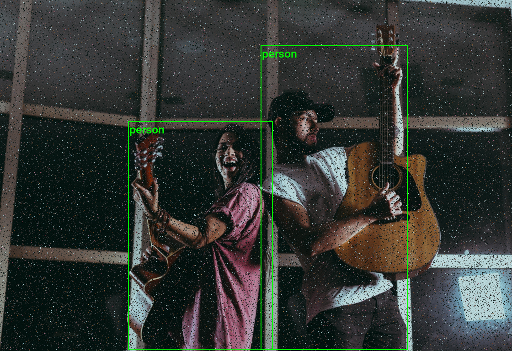
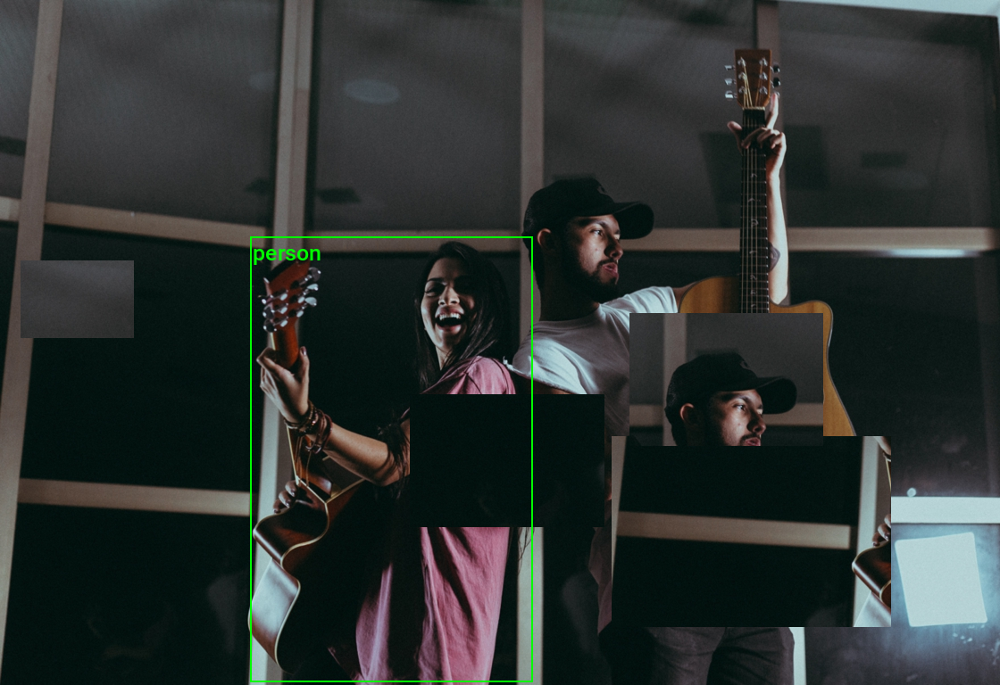

* [Introduction](#introduction)
* [Getting Started with the Code](#getting-started-with-the-code)
* [Setting Up Your Python Environment](#setting-up-your-python-environment)
* [Importing the Required Dependencies](#importing-the-required-dependencies)
* [Loading and Exploring the Dataset](#loading-and-exploring-the-dataset)
* [Examining the Transforms V2 Class](#examining-the-transforms-v2-class)
* [Creating a Random Pixel Copy Transform](#creating-a-random-pixel-copy-transform)
* [Creating a Random Patch Copy Transform](#creating-a-random-patch-copy-transform)
* [Conclusion](#conclusion)


## Introduction

Welcome to this hands-on guide to creating custom [V2 transforms](https://pytorch.org/vision/stable/transforms.html#v1-or-v2-which-one-should-i-use) in torchvision. Torchvision's V2 [image transforms](https://pytorch.org/vision/stable/transforms.html#v2-api-reference-recommended) support annotations for various tasks, such as [bounding boxes](/posts/torchvision-labelme-annotation-tutorials/bounding-boxes/) for object detection and [segmentation masks](/posts/torchvision-labelme-annotation-tutorials/segmentation-polygons/) for image segmentation. 

The tutorial walks through setting up a Python environment, loading the raw annotations into a [Pandas DataFrame](https://pandas.pydata.org/docs/reference/api/pandas.DataFrame.html), and creating custom data augmentations that support bounding box annotations.

Data augmentation is a technique that creates variations of existing training samples to prevent a model from seeing the same sample twice. The goal is to help the model learn general features versus memorizing specific examples.

This guide is suitable for beginners and experienced practitioners, providing the code, explanations, and resources needed to understand and implement each step. Upon completion, you will have a solid foundation for creating custom V2 image transforms in torchvision for object detection tasks.


## Getting Started with the Code

The tutorial code is available as a [Jupyter Notebook](https://jupyter.org/), which you can run locally or in a cloud-based environment like [Google Colab](https://colab.research.google.com/). I have dedicated tutorials for those new to these platforms or who need guidance setting up:

::: {.callout-tip title="Setup Guides" collapse="true"}

* [**Getting Started with Google Colab**](/posts/google-colab-getting-started-tutorial/)
* [**Setting Up a Local Python Environment with Mamba for Machine Learning Projects on Windows**](/posts/mamba-getting-started-tutorial-windows/)

:::

::: {.callout-tip title="Tutorial Code" collapse="true"}
| Jupyter Notebook: | [GitHub Repository](https://github.com/cj-mills/torchvision-annotation-tutorials/blob/main/notebooks/labelme/torchvision-custom-v2-transform-tutorial.ipynb) | [Open In Colab](https://colab.research.google.com/github/cj-mills/torchvision-annotation-tutorials/blob/main/notebooks/labelme/torchvision-custom-v2-transform-tutorial.ipynb) |
| ----------------- | ------------------------------------------------------------ | ------------------------------------------------------------ |
|                   |                                                              |                                                              |

:::


## Setting Up Your Python Environment

Before diving into the code, we'll cover the steps to create a local Python environment and install the necessary dependencies.


### Creating a Python Environment

First, we'll create a Python environment using [Conda](https://docs.conda.io/en/latest/)/[Mamba](https://mamba.readthedocs.io/en/latest/). Open a terminal with Conda/Mamba installed and run the following commands:


::: {.panel-tabset}
## Conda

``` {.bash}
# Create a new Python 3.11 environment
conda create --name pytorch-env python=3.11 -y
# Activate the environment
conda activate pytorch-env
```

## Mamba

``` {.bash}
# Create a new Python 3.11 environment
mamba create --name pytorch-env python=3.11 -y
# Activate the environment
mamba activate pytorch-env
```

:::


### Installing PyTorch

Next, we'll install [PyTorch](https://pytorch.org/). Run the appropriate command for your hardware and operating system.

::: {.panel-tabset}
## Linux/Windows (CUDA)

``` {.bash}
# Install PyTorch with CUDA
pip install torch torchvision torchaudio --index-url https://download.pytorch.org/whl/cu121
```

## Mac

``` {.bash}
# MPS (Metal Performance Shaders) acceleration is available on MacOS 12.3+
pip install torch torchvision torchaudio
```

## Linux (CPU)

``` {.bash}
# Install PyTorch for CPU only
pip install torch torchvision torchaudio --index-url https://download.pytorch.org/whl/cpu
```

## Windows (CPU)

``` {.bash}
# Install PyTorch for CPU only
pip install torch torchvision torchaudio
```

:::


### Installing Additional Libraries

We also need to install some additional libraries for our project.


::: {.callout-note title="Package Descriptions" collapse="true"}

 | Package       | Description                                                  |
| ------------- | ------------------------------------------------------------ |
| `jupyter`     | An  open-source web application that allows you to create and share  documents that contain live code, equations, visualizations, and  narrative text. ([link](https://jupyter.org/)) |
| `matplotlib`  | This package provides a comprehensive collection of visualization tools to  create high-quality plots, charts, and graphs for data exploration and  presentation. ([link](https://matplotlib.org/)) |
| `pandas`      | This package provides fast, powerful, and flexible data analysis and manipulation tools. ([link](https://pandas.pydata.org/)) |
| `pillow`      | The Python Imaging Library adds image processing capabilities. ([link](https://pillow.readthedocs.io/en/stable/)) |
| `tqdm`        | A Python library that provides fast, extensible progress bars for loops and other iterable objects in Python. ([link](https://tqdm.github.io/)) |
| `distinctipy` | A lightweight python package providing functions to generate colours that are visually distinct from one another. ([link](https://distinctipy.readthedocs.io/en/latest/)) |

:::


Run the following commands to install these additional libraries:

```bash
# Install additional dependencies
pip install distinctipy jupyter matplotlib pandas pillow tqdm
```


### Installing Utility Packages

We will also install some utility packages I made, which provide shortcuts for routine tasks.


::: {.callout-note title="Package Descriptions" collapse="true"}
| Package             | Description                                                  |
| ------------------- | ------------------------------------------------------------ |
| `cjm_pil_utils`     | Some PIL utility functions I frequently use. ([link](https://cj-mills.github.io/cjm-pil-utils/)) |
| `cjm_psl_utils`     | Some utility functions using the Python Standard Library. ([link](https://cj-mills.github.io/cjm-psl-utils/)) |
| `cjm_pytorch_utils` | Some utility functions for working with PyTorch. ([link](https://cj-mills.github.io/cjm-pytorch-utils/)) |

:::
Run the following commands to install the utility packages:

```python
# Install additional utility packages
pip install cjm_pil_utils cjm_psl_utils cjm_pytorch_utils
```

With our environment set up, we can open our Jupyter Notebook and dive into the code. 


## Importing the Required Dependencies

First, we will import the necessary Python packages into our Jupyter Notebook.


```python
# Import Python Standard Library dependencies
from functools import partial
from pathlib import Path
from typing import Any, Dict, Optional, List, Tuple, Union
import random
from functools import singledispatchmethod

# Import utility functions
from cjm_pil_utils.core import get_img_files
from cjm_psl_utils.core import download_file, file_extract
from cjm_pytorch_utils.core import tensor_to_pil

# Import the distinctipy module
from distinctipy import distinctipy

# Import matplotlib for creating plots
import matplotlib.pyplot as plt

# Import numpy
import numpy as np

# Import the pandas package
import pandas as pd

# Do not truncate the contents of cells and display all rows and columns
pd.set_option('max_colwidth', None, 'display.max_rows', None, 'display.max_columns', None)

# Import PIL for image manipulation
from PIL import Image

# Import PyTorch dependencies
import torch
from torch.utils.data import Dataset, DataLoader

# Import torchvision dependencies
import torchvision
torchvision.disable_beta_transforms_warning()
from torchvision.tv_tensors import BoundingBoxes, Mask
from torchvision import tv_tensors
from torchvision.tv_tensors import wrap as tv_wrap
from torchvision.utils import draw_bounding_boxes
import torchvision.transforms.v2 as transforms

# Import tqdm for progress bar
from tqdm.auto import tqdm
```

After importing the dependencies, we can load our dataset.


## Loading and Exploring the Dataset

We will use the following toy dataset containing images from the free stock photo site [Pexels](https://www.pexels.com/) and its bounding box annotations:

- **Dataset Repository:** [labelme-bounding-box-toy-dataset](https://huggingface.co/datasets/cj-mills/labelme-bounding-box-toy-dataset/tree/main)


::: {.callout-tip title="Bounding Box Annotation Format"}

The bounding boxes for this dataset use the [LabelMe](https://github.com/labelmeai/labelme) annotation format. You can learn more about this format and how to work with such annotations in the tutorial linked below:

* [Working with LabelMe Bounding Box Annotations in Torchvision](/posts/torchvision-labelme-annotation-tutorials/bounding-boxes/)

:::


### Setting the Directory Paths

We first need to specify a place to store our dataset and a location to download the zip file containing it. The following code creates the folders in the current directory (`./`). Update the path if that is not suitable for you.


```python
# Define path to store datasets
dataset_dir = Path("./Datasets/")
# Create the dataset directory if it does not exist
dataset_dir.mkdir(parents=True, exist_ok=True)

# Define path to store archive files
archive_dir = dataset_dir/'../Archive'
# Create the archive directory if it does not exist
archive_dir.mkdir(parents=True, exist_ok=True)

# Creating a Series with the paths and converting it to a DataFrame for display
pd.Series({
    "Dataset Directory:": dataset_dir, 
    "Archive Directory:": archive_dir
}).to_frame().style.hide(axis='columns')
```

<div style="overflow-x:auto; max-height:500px">
<table id="T_4e87e">
  <thead>
  </thead>
  <tbody>
    <tr>
      <th id="T_4e87e_level0_row0" class="row_heading level0 row0" >Dataset Directory:</th>
      <td id="T_4e87e_row0_col0" class="data row0 col0" >Datasets</td>
    </tr>
    <tr>
      <th id="T_4e87e_level0_row1" class="row_heading level0 row1" >Archive Directory:</th>
      <td id="T_4e87e_row1_col0" class="data row1 col0" >Datasets/../Archive</td>
    </tr>
  </tbody>
</table>
</div>


### Setting the Dataset Path

Next, we construct the name for the Hugging Face Hub dataset and set where to download and extract the dataset.


```python
# Set the name of the dataset
dataset_name = 'labelme-bounding-box-toy-dataset'

# Construct the HuggingFace Hub dataset name by combining the username and dataset name
hf_dataset = f'cj-mills/{dataset_name}'

# Create the path to the zip file that contains the dataset
archive_path = Path(f'{archive_dir}/{dataset_name}.zip')

# Create the path to the directory where the dataset will be extracted
dataset_path = Path(f'{dataset_dir}/{dataset_name}')

# Creating a Series with the dataset name and paths and converting it to a DataFrame for display
pd.Series({
    "HuggingFace Dataset:": hf_dataset, 
    "Archive Path:": archive_path, 
    "Dataset Path:": dataset_path
}).to_frame().style.hide(axis='columns')
```

<div style="overflow-x:auto; max-height:500px">
<table id="T_e1208">
  <thead>
  </thead>
  <tbody>
    <tr>
      <th id="T_e1208_level0_row0" class="row_heading level0 row0" >HuggingFace Dataset:</th>
      <td id="T_e1208_row0_col0" class="data row0 col0" >cj-mills/labelme-bounding-box-toy-dataset</td>
    </tr>
    <tr>
      <th id="T_e1208_level0_row1" class="row_heading level0 row1" >Archive Path:</th>
      <td id="T_e1208_row1_col0" class="data row1 col0" >Datasets/../Archive/labelme-bounding-box-toy-dataset.zip</td>
    </tr>
    <tr>
      <th id="T_e1208_level0_row2" class="row_heading level0 row2" >Dataset Path:</th>
      <td id="T_e1208_row2_col0" class="data row2 col0" >Datasets/labelme-bounding-box-toy-dataset</td>
    </tr>
  </tbody>
</table>
</div>


### Downloading the Dataset

We can now download the archive file and extract the dataset using the [`download_file`](https://cj-mills.github.io/cjm-psl-utils/core.html#download_file) and [`file_extract`](https://cj-mills.github.io/cjm-psl-utils/core.html#file_extract) functions from the `cjm_psl_utils` package. We can delete the archive afterward to save space.


```python
# Construct the HuggingFace Hub dataset URL
dataset_url = f"https://huggingface.co/datasets/{hf_dataset}/resolve/main/{dataset_name}.zip"
print(f"HuggingFace Dataset URL: {dataset_url}")

# Set whether to delete the archive file after extracting the dataset
delete_archive = True

# Download the dataset if not present
if dataset_path.is_dir():
    print("Dataset folder already exists")
else:
    print("Downloading dataset...")
    download_file(dataset_url, archive_dir)    
    
    print("Extracting dataset...")
    file_extract(fname=archive_path, dest=dataset_dir)
    
    # Delete the archive if specified
    if delete_archive: archive_path.unlink()
```


### Get Image File Paths

Next, we will make a dictionary that maps each image's unique name to its file path, allowing us to retrieve the file path for a given image more efficiently.


```python
# Get a list of image files in the dataset
img_file_paths = get_img_files(dataset_path)

# Create a dictionary that maps file names to file paths
img_dict = {file.stem : file for file in (img_file_paths)}

# Print the number of image files
print(f"Number of Images: {len(img_dict)}")

# Display the first five entries from the dictionary using a Pandas DataFrame
pd.DataFrame.from_dict(img_dict, orient='index').head()
```

```text
Number of Images: 28
```

<div style="overflow-x:auto; max-height:500px">
<table border="1" class="dataframe">
  <thead>
    <tr style="text-align: right;">
      <th></th>
      <th>0</th>
    </tr>
  </thead>
  <tbody>
    <tr>
      <th>adults-attractive-beautiful-1727660</th>
      <td>Datasets/labelme-bounding-box-toy-dataset/adults-attractive-beautiful-1727660.jpg</td>
    </tr>
    <tr>
      <th>balloon-launch-festival-flame-1426050</th>
      <td>Datasets/labelme-bounding-box-toy-dataset/balloon-launch-festival-flame-1426050.jpg</td>
    </tr>
    <tr>
      <th>bar-beer-celebration-3009788</th>
      <td>Datasets/labelme-bounding-box-toy-dataset/bar-beer-celebration-3009788.jpg</td>
    </tr>
    <tr>
      <th>beach-child-daughter-1438511</th>
      <td>Datasets/labelme-bounding-box-toy-dataset/beach-child-daughter-1438511.jpg</td>
    </tr>
    <tr>
      <th>cellphone-festival-girl-1408983</th>
      <td>Datasets/labelme-bounding-box-toy-dataset/cellphone-festival-girl-1408983.jpg</td>
    </tr>
  </tbody>
</table>
</div>


### Get Image Annotations

We will then read the content of the JSON annotation file associated with each image into a single Pandas DataFrame so we can easily query the annotations.


```python
# Get a list of JSON files in the dataset
annotation_file_paths = list(dataset_path.glob('*.json'))

# Create a generator that yields Pandas DataFrames containing the data from each JSON file
cls_dataframes = (pd.read_json(f, orient='index').transpose() for f in tqdm(annotation_file_paths))

# Concatenate the DataFrames into a single DataFrame
annotation_df = pd.concat(cls_dataframes, ignore_index=False)

# Assign the image file name as the index for each row
annotation_df['index'] = annotation_df.apply(lambda row: row['imagePath'].split('.')[0], axis=1)
annotation_df = annotation_df.set_index('index')

# Keep only the rows that correspond to the filenames in the 'img_dict' dictionary
annotation_df = annotation_df.loc[list(img_dict.keys())]

# Print the first 5 rows of the DataFrame
annotation_df.head()
```

<div style="overflow-x:auto; max-height:500px">
<table border="1" class="dataframe">
  <thead>
    <tr style="text-align: right;">
      <th></th>
      <th>version</th>
      <th>flags</th>
      <th>shapes</th>
      <th>imagePath</th>
      <th>imageData</th>
      <th>imageHeight</th>
      <th>imageWidth</th>
    </tr>
    <tr>
      <th>index</th>
      <th></th>
      <th></th>
      <th></th>
      <th></th>
      <th></th>
      <th></th>
      <th></th>
    </tr>
  </thead>
  <tbody>
    <tr>
      <th>adults-attractive-beautiful-1727660</th>
      <td>5.3.1</td>
      <td>{}</td>
      <td>[{'label': 'person', 'points': [[450.1688537597656, 174.04931640625], [925.5413818359375, 765.6500244140625]], 'group_id': None, 'description': '', 'shape_type': 'rectangle', 'flags': {}}, {'label': 'person', 'points': [[1.195121951219533, 169.67073170731703], [448.7560975609756, 766.6219512195121]], 'group_id': None, 'description': '', 'shape_type': 'rectangle', 'flags': {}}]</td>
      <td>adults-attractive-beautiful-1727660.jpg</td>
      <td>None</td>
      <td>768</td>
      <td>928</td>
    </tr>
    <tr>
      <th>balloon-launch-festival-flame-1426050</th>
      <td>5.3.1</td>
      <td>{}</td>
      <td>[{'label': 'person', 'points': [[740.9563598632812, 368.4273681640625], [1088.41552734375, 764.3656005859375]], 'group_id': None, 'description': '', 'shape_type': 'rectangle', 'flags': {}}]</td>
      <td>balloon-launch-festival-flame-1426050.jpg</td>
      <td>None</td>
      <td>768</td>
      <td>1152</td>
    </tr>
    <tr>
      <th>bar-beer-celebration-3009788</th>
      <td>5.3.1</td>
      <td>{}</td>
      <td>[{'label': 'person', 'points': [[670.41650390625, 147.376953125], [1088.8197021484375, 760.0108642578125]], 'group_id': None, 'description': '', 'shape_type': 'rectangle', 'flags': {}}, {'label': 'person', 'points': [[116.53658536585372, 207.47560975609753], [629.3414634146342, 766.6219512195121]], 'group_id': None, 'description': '', 'shape_type': 'rectangle', 'flags': {}}, {'label': 'person', 'points': [[250.68292682926835, 1.378048780487799], [455.5609756097561, 225.15853658536582]], 'group_id': None, 'description': '', 'shape_type': 'rectangle', 'flags': {}}, {'label': 'person', 'points': [[427.51219512195127, 2.59756097560975], [593.9756097560976, 219.67073170731703]], 'group_id': None, 'description': '', 'shape_type': 'rectangle', 'flags': {}}, {'label': 'person', 'points': [[647.6341463414634, 2.59756097560975], [817.7560975609756, 137.96341463414632]], 'group_id': None, 'description': '', 'shape_type': 'rectangle', 'flags': {}}, {'label': 'person', 'points': [[731.170731707317, 0.7682926829268231], [917.1463414634146, 221.49999999999997]], 'group_id': None, 'description': '', 'shape_type': 'rectangle', 'flags': {}}, {'label': 'person', 'points': [[1009.2195121951219, 19.670731707317067], [1116.5365853658536, 262.3536585365854]], 'group_id': None, 'description': '', 'shape_type': 'rectangle', 'flags': {}}]</td>
      <td>bar-beer-celebration-3009788.jpg</td>
      <td>None</td>
      <td>768</td>
      <td>1216</td>
    </tr>
    <tr>
      <th>beach-child-daughter-1438511</th>
      <td>5.3.1</td>
      <td>{}</td>
      <td>[{'label': 'person', 'points': [[393.214111328125, 317.10064697265625], [588.5502319335938, 723.3473510742188]], 'group_id': None, 'description': '', 'shape_type': 'rectangle', 'flags': {}}, {'label': 'person', 'points': [[578.9024390243902, 351.3780487804878], [692.9268292682926, 697.1097560975609]], 'group_id': None, 'description': '', 'shape_type': 'rectangle', 'flags': {}}]</td>
      <td>beach-child-daughter-1438511.jpg</td>
      <td>None</td>
      <td>768</td>
      <td>1120</td>
    </tr>
    <tr>
      <th>cellphone-festival-girl-1408983</th>
      <td>5.3.1</td>
      <td>{}</td>
      <td>[{'label': 'person', 'points': [[119.5823974609375, 97.06643676757812], [886.0499877929688, 763.5545654296875]], 'group_id': None, 'description': '', 'shape_type': 'rectangle', 'flags': {}}]</td>
      <td>cellphone-festival-girl-1408983.jpg</td>
      <td>None</td>
      <td>768</td>
      <td>1152</td>
    </tr>
  </tbody>
</table>
</div>


### Visualizing Image Annotations

In this section, we will annotate a single image with its bounding boxes using torchvision's [`BoundingBoxes`](https://pytorch.org/vision/stable/generated/torchvision.tv_tensors.BoundingBoxes.html) class and [`draw_bounding_boxes`](https://pytorch.org/vision/stable/generated/torchvision.utils.draw_bounding_boxes.html) function.

#### Get image classes

First, we get the names of all the classes in our dataset.


```python
# Explode the 'shapes' column in the annotation_df dataframe
# Convert the resulting series to a dataframe and rename the 'shapes' column to 'shapes'
# Apply the pandas Series function to the 'shapes' column of the dataframe
shapes_df = annotation_df['shapes'].explode().to_frame().shapes.apply(pd.Series)

# Get a list of unique labels in the 'annotation_df' DataFrame
class_names = shapes_df['label'].unique().tolist()

# Display labels using a Pandas DataFrame
pd.DataFrame(class_names)
```

<div style="overflow-x:auto; max-height:500px">
<table border="1" class="dataframe">
  <thead>
    <tr style="text-align: right;">
      <th></th>
      <th>0</th>
    </tr>
  </thead>
  <tbody>
    <tr>
      <th>0</th>
      <td>person</td>
    </tr>
  </tbody>
</table>
</div>

#### Generate a color map

Next, we will generate a color map for the object classes.


```python
# Generate a list of colors with a length equal to the number of labels
colors = distinctipy.get_colors(len(class_names))

# Make a copy of the color map in integer format
int_colors = [tuple(int(c*255) for c in color) for color in colors]

# Generate a color swatch to visualize the color map
distinctipy.color_swatch(colors)
```

{fig-align="center"}


#### Download a font file

The [`draw_bounding_boxes`](https://pytorch.org/vision/stable/generated/torchvision.utils.draw_bounding_boxes.html) function included with torchvision uses a pretty small font size. We  can increase the font size if we use a custom font. Font files are  available on sites like [Google Fonts](https://fonts.google.com/), or we can use one included with the operating system.


```python
# Set the name of the font file
font_file = 'KFOlCnqEu92Fr1MmEU9vAw.ttf'

# Download the font file
download_file(f"https://fonts.gstatic.com/s/roboto/v30/{font_file}", "./")
```

#### Define the bounding box annotation function

We can make a partial function using `draw_bounding_boxes` since we’ll use the same box thickness and font each time we visualize bounding boxes.


```python
draw_bboxes = partial(draw_bounding_boxes, fill=False, width=2, font=font_file, font_size=25)
```


#### Define function that ensures bounding boxes are in a consistent format

```python
def correct_bounding_boxes(bboxes):
    # Ensure input is a NumPy array
    bboxes = np.asarray(bboxes)
    
    # Correct x coordinates
    # Swap the x coordinates if the top-left x is greater than the bottom-right x
    x_min = np.minimum(bboxes[:, 0], bboxes[:, 2])
    x_max = np.maximum(bboxes[:, 0], bboxes[:, 2])
    
    # Correct y coordinates
    # Swap the y coordinates if the top-left y is greater than the bottom-right y
    y_min = np.minimum(bboxes[:, 1], bboxes[:, 3])
    y_max = np.maximum(bboxes[:, 1], bboxes[:, 3])
    
    # Construct the corrected bounding boxes array
    corrected_bboxes = np.stack([x_min, y_min, x_max, y_max], axis=1)
    
    return corrected_bboxes
```


#### Annotate sample image

Finally, we will open a sample image and annotate it with it's associated bounding boxes.


```python
# Get the file ID of the first image file
file_id = list(img_dict.keys())[19]

# Open the associated image file as a RGB image
sample_img = Image.open(img_dict[file_id]).convert('RGB')

# Extract the labels and bounding box annotations for the sample image
labels = [shape['label'] for shape in annotation_df.loc[file_id]['shapes']]
bboxes = np.array([shape['points'] for shape in annotation_df.loc[file_id]['shapes']], dtype=np.float32).reshape(len(labels),4)

# Annotate the sample image with labels and bounding boxes
annotated_tensor = draw_bboxes(
    image=transforms.PILToTensor()(sample_img), 
    boxes=BoundingBoxes(torchvision.ops.box_convert(torch.Tensor(bboxes), 'xyxy', 'xyxy'), format='xyxy', canvas_size=sample_img.size[::-1]),
    labels=labels, 
    colors=[int_colors[i] for i in [class_names.index(label) for label in labels]]
)

tensor_to_pil(annotated_tensor)
```

{fig-align="center"}


We have loaded the dataset and visualized the annotations for a sample image. In the next section, we will explore the V2 Transforms class.


## Examining the Transforms V2 Class

Our custom transforms will inherit from the [`transforms.v2.Transform`](https://github.com/pytorch/vision/blob/315f31527e720999eecbb986679b3177d4ed5e37/torchvision/transforms/v2/_transform.py#L17) class, so let's look at the source code for that class first.


::: {.callout-note title="Transforms V2 Class Source Code" collapse="true"}

```python
class Transform(nn.Module):


    # Class attribute defining transformed types. Other types are passed-through without any transformation
    # We support both Types and callables that are able to do further checks on the type of the input.
    _transformed_types: Tuple[Union[Type, Callable[[Any], bool]], ...] = (torch.Tensor, PIL.Image.Image)
    
    def __init__(self) -> None:
        super().__init__()
        _log_api_usage_once(self)
    
    def _check_inputs(self, flat_inputs: List[Any]) -> None:
        pass
    
    def _get_params(self, flat_inputs: List[Any]) -> Dict[str, Any]:
        return dict()
    
    def _call_kernel(self, functional: Callable, inpt: Any, *args: Any, **kwargs: Any) -> Any:
        kernel = _get_kernel(functional, type(inpt), allow_passthrough=True)
        return kernel(inpt, *args, **kwargs)
    
    def _transform(self, inpt: Any, params: Dict[str, Any]) -> Any:
        raise NotImplementedError
    
    def forward(self, *inputs: Any) -> Any:
        flat_inputs, spec = tree_flatten(inputs if len(inputs) > 1 else inputs[0])
    
        self._check_inputs(flat_inputs)
    
        needs_transform_list = self._needs_transform_list(flat_inputs)
        params = self._get_params(
            [inpt for (inpt, needs_transform) in zip(flat_inputs, needs_transform_list) if needs_transform]
        )
    
        flat_outputs = [
            self._transform(inpt, params) if needs_transform else inpt
            for (inpt, needs_transform) in zip(flat_inputs, needs_transform_list)
        ]
    
        return tree_unflatten(flat_outputs, spec)
    
    def _needs_transform_list(self, flat_inputs: List[Any]) -> List[bool]:
        # Below is a heuristic on how to deal with pure tensor inputs:
        # 1. Pure tensors, i.e. tensors that are not a tv_tensor, are passed through if there is an explicit image
        #    (`tv_tensors.Image` or `PIL.Image.Image`) or video (`tv_tensors.Video`) in the sample.
        # 2. If there is no explicit image or video in the sample, only the first encountered pure tensor is
        #    transformed as image, while the rest is passed through. The order is defined by the returned `flat_inputs`
        #    of `tree_flatten`, which recurses depth-first through the input.
        #
        # This heuristic stems from two requirements:
        # 1. We need to keep BC for single input pure tensors and treat them as images.
        # 2. We don't want to treat all pure tensors as images, because some datasets like `CelebA` or `Widerface`
        #    return supplemental numerical data as tensors that cannot be transformed as images.
        #
        # The heuristic should work well for most people in practice. The only case where it doesn't is if someone
        # tries to transform multiple pure tensors at the same time, expecting them all to be treated as images.
        # However, this case wasn't supported by transforms v1 either, so there is no BC concern.
    
        needs_transform_list = []
        transform_pure_tensor = not has_any(flat_inputs, tv_tensors.Image, tv_tensors.Video, PIL.Image.Image)
        for inpt in flat_inputs:
            needs_transform = True
    
            if not check_type(inpt, self._transformed_types):
                needs_transform = False
            elif is_pure_tensor(inpt):
                if transform_pure_tensor:
                    transform_pure_tensor = False
                else:
                    needs_transform = False
            needs_transform_list.append(needs_transform)
        return needs_transform_list
    
    def extra_repr(self) -> str:
        extra = []
        for name, value in self.__dict__.items():
            if name.startswith("_") or name == "training":
                continue
    
            if not isinstance(value, (bool, int, float, str, tuple, list, enum.Enum)):
                continue
    
            extra.append(f"{name}={value}")
    
        return ", ".join(extra)
    
    # This attribute should be set on all transforms that have a v1 equivalent. Doing so enables two things:
    # 1. In case the v1 transform has a static `get_params` method, it will also be available under the same name on
    #    the v2 transform. See `__init_subclass__` for details.
    # 2. The v2 transform will be JIT scriptable. See `_extract_params_for_v1_transform` and `__prepare_scriptable__`
    #    for details.
    _v1_transform_cls: Optional[Type[nn.Module]] = None
    
    def __init_subclass__(cls) -> None:
        # Since `get_params` is a `@staticmethod`, we have to bind it to the class itself rather than to an instance.
        # This method is called after subclassing has happened, i.e. `cls` is the subclass, e.g. `Resize`.
        if cls._v1_transform_cls is not None and hasattr(cls._v1_transform_cls, "get_params"):
            cls.get_params = staticmethod(cls._v1_transform_cls.get_params)  # type: ignore[attr-defined]
    
    def _extract_params_for_v1_transform(self) -> Dict[str, Any]:
        # This method is called by `__prepare_scriptable__` to instantiate the equivalent v1 transform from the current
        # v2 transform instance. It extracts all available public attributes that are specific to that transform and
        # not `nn.Module` in general.
        # Overwrite this method on the v2 transform class if the above is not sufficient. For example, this might happen
        # if the v2 transform introduced new parameters that are not support by the v1 transform.
        common_attrs = nn.Module().__dict__.keys()
        return {
            attr: value
            for attr, value in self.__dict__.items()
            if not attr.startswith("_") and attr not in common_attrs
        }
    
    def __prepare_scriptable__(self) -> nn.Module:
        # This method is called early on when `torch.jit.script`'ing an `nn.Module` instance. If it succeeds, the return
        # value is used for scripting over the original object that should have been scripted. Since the v1 transforms
        # are JIT scriptable, and we made sure that for single image inputs v1 and v2 are equivalent, we just return the
        # equivalent v1 transform here. This of course only makes transforms v2 JIT scriptable as long as transforms v1
        # is around.
        if self._v1_transform_cls is None:
            raise RuntimeError(
                f"Transform {type(self).__name__} cannot be JIT scripted. "
                "torchscript is only supported for backward compatibility with transforms "
                "which are already in torchvision.transforms. "
                "For torchscript support (on tensors only), you can use the functional API instead."
            )
    
        return self._v1_transform_cls(**self._extract_params_for_v1_transform())
```

:::


The above source code indicates that our custom transforms must implement the `_transform` method, which handles images and annotations.


## Creating a Random Pixel Copy Transform

Our first custom transform will randomly copy and paste pixels in random locations. This one will not require updating the associated image annotations.


### Define the Custom Transform Class

We can use Python's [`singledispatchmethod`](https://docs.python.org/3/library/functools.html#functools.singledispatchmethod) decorator to overload the `_transform` method based on the first (non-*self* or non-*cls)* argument's type. 

We will implement different versions to handle PIL Images, PyTorch Tensors, and torchvision's [`tv_tensor.Image`](https://pytorch.org/vision/stable/generated/torchvision.tv_tensors.Image.html) class as image input types and to return annotations such as BoundingBoxes and Mask instances unaltered.


```python
class RandomPixelCopy(transforms.Transform):
    """
    A torchvision V2 transform that copies data from a randomly selected set of pixels to another 
    randomly selected set of pixels of a image tensor.
    """
    def __init__(self,
                 min_pct=0.0025, # The minimum percentage of the tensor's pixels to be copied.
                 max_pct:float=0.1 # The maximum percentage of the tensor's pixels to be copied.
                ):
        
        super().__init__()
        self.min_pct = min_pct
        self.max_pct = max_pct

    def rand_pixel_copy(self, 
                        img_tensor:torch.Tensor, # The input image tensor.
                        pct:float # The percentage of the total number of pixels to be selected as the source and target sets of pixels.
                       ) -> torch.Tensor : # The modified input image tensor.
        """
        Copy data from a randomly selected set of pixels to another randomly selected set of pixels of a image tensor.
        """
        
        src_dim = img_tensor.dim()
        
        img_tensor = img_tensor.unsqueeze(0) if src_dim == 3 else img_tensor
        
        # Get the shape of the img_tensor
        b, c, h, w = img_tensor.shape
        
        # Calculate the number of pixels to be selected
        num_pixels = int(img_tensor[-1:].numel() * pct)
        
        # Select the source pixel indices
        source_indices = torch.LongTensor(num_pixels, 2).random_(0, h * w)
        source_indices[:, 0] = source_indices[:, 0] // w
        source_indices[:, 1] = source_indices[:, 1] % w
        
        # Select the target pixel indices
        target_indices = torch.LongTensor(num_pixels, 2).random_(0, h * w)
        target_indices[:, 0] = target_indices[:, 0] // w
        target_indices[:, 1] = target_indices[:, 1] % w
        
        # Get the indices of the channels
        c_indices = torch.arange(c).repeat(num_pixels, 1).t()
        
        # Copy the pixels
        source_pixels = img_tensor[:, c_indices, source_indices[:, 0], source_indices[:, 1]]
        img_tensor[:, c_indices, target_indices[:, 0], target_indices[:, 1]] = source_pixels
        
        return img_tensor.squeeze(0) if src_dim == 3 else img_tensor

    @singledispatchmethod
    def _transform(self, inpt: Any, params: Dict[str, Any]) -> Any:
        """Default Behavior: Don't modify the input"""
        return inpt

    @_transform.register(torch.Tensor)
    @_transform.register(tv_tensors.Image)
    def _(self, inpt: Union[torch.Tensor, tv_tensors.Image], params: Dict[str, Any]) -> Any:
        """Apply the `rand_pixel_copy` method to the input tensor"""
        return self.rand_pixel_copy(inpt, max(self.min_pct, random.random() * self.max_pct))

    @_transform.register(Image.Image)
    def _(self, inpt: Image.Image, params: Dict[str, Any]) -> Any:
        """Convert the PIL Image to a torch.Tensor to apply the transform"""
        inpt_torch = transforms.PILToTensor()(inpt)
        return transforms.ToPILImage()(self._transform(inpt_torch, params))

    @_transform.register(BoundingBoxes)
    @_transform.register(Mask)
    def _(self, inpt: Union[BoundingBoxes, Mask], params: Dict[str, Any]) -> Any:
        """Don't modify image annotations"""
        return inpt
```

With our custom transform defined, we can create an instance of it and try it out.


### Initialize the Transform


```python
# Create a RandomPixelCopy object
rand_pixel_copy_tfm = RandomPixelCopy(max_pct=0.05)
```


### Prepare the Annotation Targets

The V2 image transforms take an image and a `targets` dictionary as input. The dictionary contains the annotations and labels for the image.


```python
# Prepare bounding box targets
targets = {
    'boxes': BoundingBoxes(torch.Tensor(bboxes), 
                           format='xyxy', 
                           canvas_size=sample_img.size[::-1]), 
    'labels': torch.Tensor([class_names.index(label) for label in labels])
}
```


### Apply the Augmentation

Now, we can see how our sample image looks after applying the augmentation.

::: {.panel-tabset}

#### PIL.Image


```python
# Feed sample image and targets through the image transform
augmented_img, augmented_targets = rand_pixel_copy_tfm(sample_img, targets)

# Annotate the augmented image with updated labels and bounding boxes
annotated_tensor = draw_bboxes(
    image=transforms.PILToTensor()(augmented_img), 
    boxes=augmented_targets['boxes'], 
    labels=[class_names[int(label.item())] for label in augmented_targets['labels']], 
    colors=[int_colors[int(i)] for i in augmented_targets['labels']]
)

# Display the augmented image
transforms.ToPILImage()(annotated_tensor)
```


#### torch.Tensor


```python
# Feed sample image and targets through the image transform
augmented_img, augmented_targets = rand_pixel_copy_tfm(transforms.PILToTensor()(sample_img), targets)

# Annotate the augmented image with updated labels and bounding boxes
annotated_tensor = draw_bboxes(
    image=augmented_img, 
    boxes=augmented_targets['boxes'], 
    labels=[class_names[int(label.item())] for label in augmented_targets['labels']], 
    colors=[int_colors[int(i)] for i in augmented_targets['labels']]
)

# Display the augmented image
transforms.ToPILImage()(annotated_tensor)
```




#### tv_tensor.Image


```python
# Feed sample image and targets through the image transform
augmented_img, augmented_targets = rand_pixel_copy_tfm(transforms.ToImage()(sample_img), targets)

# Annotate the augmented image with updated labels and bounding boxes
annotated_tensor = draw_bboxes(
    image=augmented_img, 
    boxes=augmented_targets['boxes'], 
    labels=[class_names[int(label.item())] for label in augmented_targets['labels']], 
    colors=[int_colors[int(i)] for i in augmented_targets['labels']]
)

# Display the augmented image
transforms.ToPILImage()(annotated_tensor)
```


:::


As intended, the transform randomly copy-pasted pixel values while leaving the bounding box annotations unchanged. In the next section, we will create a transform that requires us to update the bounding box annotations with the image.


## Creating a Random Patch Copy Transform

Our second transform will randomly copy rectangular patches from the image and paste them in random locations. This transform may potentially occlude annotated areas, so we need to manage the associated bounding box annotations accordingly.


### Define the Custom Transform Class

To determine if any copy-pasted patches occlude an annotated area, we will keep track of the patches for the current image and check how much they overlap with the bounding box annotations.

If the patches overlap a given bounding box by a certain threshold, we will set the dimensions for that bounding box to `0` so the [`SanitizeBoundingBoxes`](https://pytorch.org/vision/stable/generated/torchvision.transforms.v2.SanitizeBoundingBoxes.html#torchvision.transforms.v2.SanitizeBoundingBoxes) transform removes it. The `SanitizeBoundingBoxes` transform would also remove a segmentation mask associated with the bounding box.


```python
class RandomPatchCopy(transforms.Transform):
    """
    A torchvision V2 transform that copies data from a randomly selected rectangular patch
    to another randomly selected rectangular region of an image tensor multiple times.
    """
    def __init__(self, 
                 pct:float=0.2, # The percentage of the tensor's size to be used as the side length of the square regions.
                 min_num:int=0, # The minimum number of times to apply the `rand_square_copy` function.
                 max_num:int=4, # The maximum number of times to apply the `rand_square_copy` function.
                 iou_thresh:float=0.25 # The IoU threshold for bounding box suppression.
                ):
        
        super().__init__()
        self.pct = pct
        self.min_num = min_num
        self.max_num = max_num
        self.iou_thresh = iou_thresh
        self.patches = []


    def calculate_iou_multi(self,
                            boxes1:torch.Tensor, # An array of bounding boxes in [x1, y1, x2, y2] format.
                            boxes2:torch.Tensor # Another array of bounding boxes in [x1, y1, x2, y2] format.
                           ) -> torch.Tensor: # A 2D array where element (i, j) is the IoU of boxes1[i] and boxes2[j].
        """
        Calculate the Intersection over Union (IoU) for each combination of bounding boxes in two arrays
        using PyTorch broadcasting.
        """
        # Expand boxes1 and boxes2 for broadcasting
        boxes1 = boxes1[:, None, :]
        boxes2 = boxes2[None, :, :]
    
        # Calculate intersection coordinates
        int_x1 = torch.max(boxes1[..., 0], boxes2[..., 0])
        int_y1 = torch.max(boxes1[..., 1], boxes2[..., 1])
        int_x2 = torch.min(boxes1[..., 2], boxes2[..., 2])
        int_y2 = torch.min(boxes1[..., 3], boxes2[..., 3])
    
        # Calculate intersection and union areas
        int_area = torch.clamp(int_x2 - int_x1, min=0) * torch.clamp(int_y2 - int_y1, min=0)
        box1_area = (boxes1[..., 2] - boxes1[..., 0]) * (boxes1[..., 3] - boxes1[..., 1])
        box2_area = (boxes2[..., 2] - boxes2[..., 0]) * (boxes2[..., 3] - boxes2[..., 1])
        union_area = box1_area + box2_area - int_area
    
        # Calculate IoU
        iou = int_area / torch.clamp(union_area, min=1e-10)
    
        return iou
    

    def rand_patch_copy(self, 
                        img_tensor:torch.Tensor, # The input image tensor.
                        pct:float # # The percentage of the image tensor's size to be used as the side length of the patch.
                       ) -> (torch.Tensor, tuple): # The modified input image tensor and coordinates of the target patch in the format [x, y, w, h].
        """
        Copy data from a randomly selected rectangular patch to another randomly selected 
        rectangular region of an image tensor, and return the coordinates of the target patch.
        Assumes the tensor is in 'channels-first' format.
        """
        if not (0 < pct <= 1):
            raise ValueError("pct must be between 0 and 1")
    
        # Get the shape of the tensor
        _, h, w = img_tensor.shape
    
        # Calculate the size of the rectangle
        szx = int(pct * w)
        szy = int(pct * h)
    
        # Calculate the top-left coordinate of the source rectangle
        sty1 = random.randint(0, w - szx)  # x-coordinate
        stx1 = random.randint(0, h - szy)  # y-coordinate
    
        # Calculate the top-left coordinate of the target rectangle
        sty2 = random.randint(0, w - szx)  # x-coordinate
        stx2 = random.randint(0, h - szy)  # y-coordinate
    
        # Copy the data from the source square to the target rectangle
        img_tensor[:, stx2:stx2 + szy, sty2:sty2 + szx] = img_tensor[:, stx1:stx1 + szy, sty1:sty1 + szx]
    
        # The coordinates of the target patch
        target_patch_coords = [sty2, stx2, sty2 + szx, stx2 + szy]
    
        return img_tensor, target_patch_coords


    @singledispatchmethod
    def _transform(self, inpt: Any, params: Dict[str, Any]) -> Any:
        """Default Behavior: Don't modify the input"""
        return inpt

    @_transform.register(torch.Tensor)
    @_transform.register(tv_tensors.Image)
    def _(self, inpt: Union[torch.Tensor, tv_tensors.Image], params: Dict[str, Any]) -> Any:
        self.patches = []
        """Apply the `rand_square_copy` function to the input tensor multiple times"""
        for i in range(random.randint(self.min_num, self.max_num)):
            inpt, patch = self.rand_patch_copy(inpt, max(0.1,random.random()*self.pct))
            self.patches.append(patch)
        return inpt

    @_transform.register(Image.Image)
    def _(self, inpt: Image.Image, params: Dict[str, Any]) -> Any:
        """Convert the PIL Image to a torch.Tensor to apply the transform"""
        inpt_torch = transforms.PILToTensor()(inpt)    
        return transforms.ToPILImage()(self._transform(inpt_torch, params))
    
    @_transform.register(BoundingBoxes)
    def _(self, inpt: BoundingBoxes, params: Dict[str, Any]) -> Any:
        """Update the bounding box annotations based on the list of patches"""
        if len(self.patches) > 0:
            iou_matrix = self.calculate_iou_multi(inpt, torch.tensor(self.patches, dtype=torch.float32))
            
            # Sum the IoU values for each box in boxes1
            cumulative_iou = torch.sum(iou_matrix, axis=1)
            # Create a mask based on the cumulative IoU threshold
            mask = cumulative_iou > self.iou_thresh
            inpt_copy = torch.clone(inpt)
            inpt_copy[mask] = 0
            return tv_wrap(inpt_copy, like=inpt)
        return inpt

    @_transform.register(Mask)
    def _(self, inpt: Mask, params: Dict[str, Any]) -> Any:
        """Don't modify segmentation annotations"""
        return inpt
```

Now, let's see how our sample image and its bounding box annotations look with this transform.


### Initialize the Transform


```python
# Create a RandomPatchCopy object
rand_patch_copy_tfm = RandomPatchCopy(pct=0.3, min_num=1, max_num=4)
```


### Apply the Augmentation

::: {.panel-tabset}

#### PIL.Image

```python
# Feed sample image and targets through the image transform
augmented_img, augmented_targets = rand_patch_copy_tfm(sample_img, targets)
# Remove degenerate/invalid bounding boxes and their corresponding labels and masks.
sanitized_img, sanitized_targets = transforms.SanitizeBoundingBoxes()(augmented_img, augmented_targets)

# Annotate the augmented image with updated labels and bounding boxes
annotated_tensor = draw_bboxes(
    image=transforms.PILToTensor()(sanitized_img), 
    boxes=sanitized_targets['boxes'], 
    labels=[class_names[int(label.item())] for label in sanitized_targets['labels']], 
    colors=[int_colors[int(i)] for i in sanitized_targets['labels']]
)

# Display the augmented image
tensor_to_pil(annotated_tensor)
```



#### torch.Tensor


```python
# Feed sample image and targets through the image transform
augmented_img, augmented_targets = rand_patch_copy_tfm(transforms.PILToTensor()(sample_img), targets)
# Remove degenerate/invalid bounding boxes and their corresponding labels and masks.
sanitized_img, sanitized_targets = transforms.SanitizeBoundingBoxes()(augmented_img, augmented_targets)

# Annotate the augmented image with updated labels and bounding boxes
annotated_tensor = draw_bboxes(
    image=sanitized_img, 
    boxes=sanitized_targets['boxes'], 
    labels=[class_names[int(label.item())] for label in sanitized_targets['labels']], 
    colors=[int_colors[int(i)] for i in sanitized_targets['labels']]
)

# Display the augmented image
tensor_to_pil(annotated_tensor)
```


#### tv_tensor.Image


```python
# Feed sample image and targets through the image transform
augmented_img, augmented_targets = rand_patch_copy_tfm(transforms.ToImage()(sample_img), targets)
# Remove degenerate/invalid bounding boxes and their corresponding labels and masks.
sanitized_img, sanitized_targets = transforms.SanitizeBoundingBoxes()(augmented_img, augmented_targets)

# Annotate the augmented image with updated labels and bounding boxes
annotated_tensor = draw_bboxes(
    image=sanitized_img, 
    boxes=sanitized_targets['boxes'], 
    labels=[class_names[int(label.item())] for label in sanitized_targets['labels']], 
    colors=[int_colors[int(i)] for i in sanitized_targets['labels']]
)

# Display the augmented image
tensor_to_pil(annotated_tensor)
```


:::


Here, we can see some of the patches overlapped with one of the annotated areas too much, and the `SanitizeBoundingBoxes` transform removed the relevant bounding box.


## Conclusion

In this tutorial, we created custom V2 image transforms in torchvision that support bounding box annotations. The knowledge acquired here provides a solid foundation for making other custom transforms.

As a next step, perhaps try experimenting with the transforms created here to see how they impact training performance in one of the following tutorials:

* [Fine-Tuning Image Classifiers with PyTorch and the timm library for Beginners](/posts/pytorch-train-image-classifier-timm-hf-tutorial/)
* [Training YOLOX Models for Real-Time Object Detection in PyTorch](/posts/pytorch-train-object-detector-yolox-tutorial/)
* [Training Mask R-CNN Models with PyTorch](/posts/pytorch-train-mask-rcnn-tutorial/)

See how adjusting the intensity of the data augmentations impacts the model accuracy on new data.



