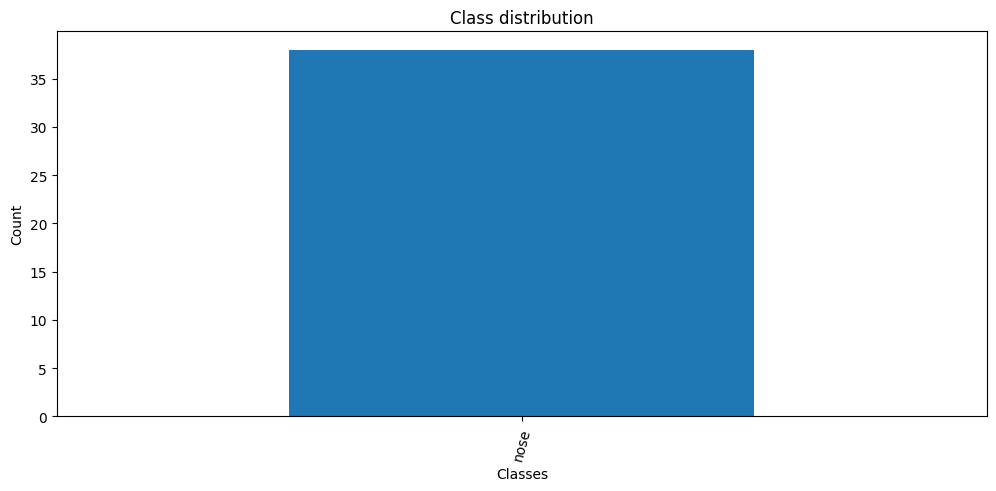
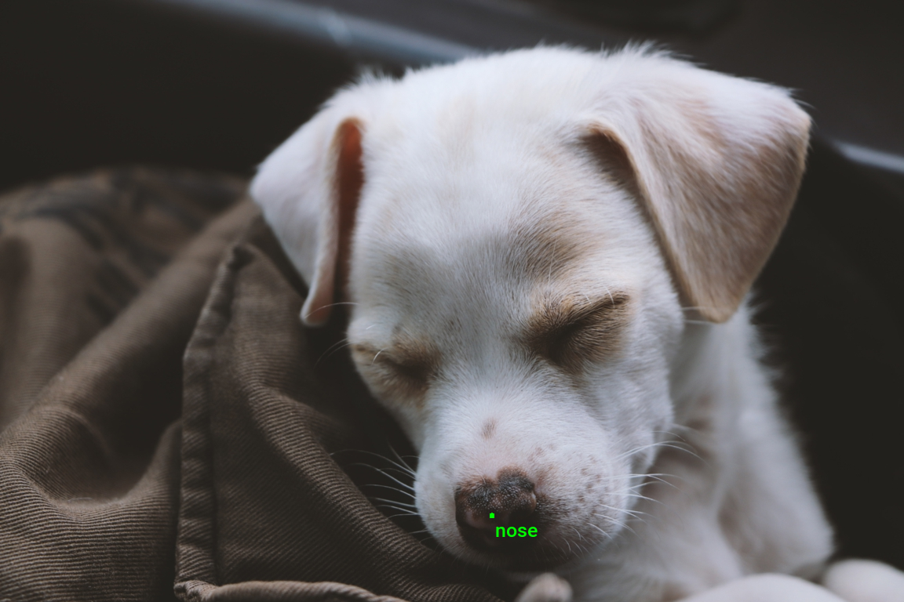
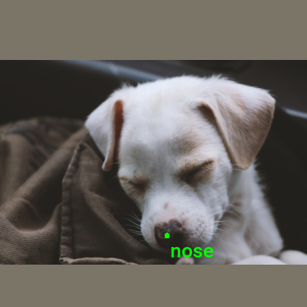
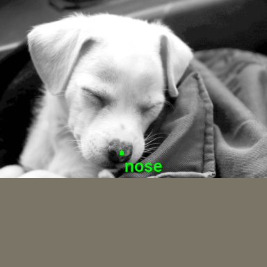

::: {.callout-tip}
## This post is part of the following series:
* [**Torchvision Annotation Tutorials**](/series/tutorials/torchvision-annotation-tutorials-series.html)
:::


* [Introduction](#introduction)
* [Getting Started with the Code](#getting-started-with-the-code)
* [Setting Up Your Python Environment](#setting-up-your-python-environment)
* [Importing the Required Dependencies](#importing-the-required-dependencies)
* [Loading and Exploring the Dataset](#loading-and-exploring-the-dataset)
* [Preparing the Data](#preparing-the-data)
* [Conclusion](#conclusion)


## Introduction

Welcome to this hands-on guide for working with keypoint annotations created with the [CVAT annotation tool](https://github.com/opencv/cvat) in [torchvision](https://pytorch.org/vision/stable/index.html). Keypoint annotations mark specific points of interest on an object in an image for training models to recognize and interpret poses, gestures, or significant parts of objects.

{fig-align="center"}

The tutorial walks through setting up a Python environment, loading the raw annotations into a [Pandas DataFrame](https://pandas.pydata.org/docs/reference/api/pandas.DataFrame.html), annotating and augmenting images using torchvision's [Transforms V2 API](https://pytorch.org/vision/stable/auto_examples/transforms/plot_transforms_getting_started.html#sphx-glr-auto-examples-transforms-plot-transforms-getting-started-py), and creating a custom [Dataset](https://pytorch.org/tutorials/beginner/basics/data_tutorial.html) class to feed samples to a model.

This guide is suitable for beginners and experienced practitioners, providing the code, explanations, and resources needed to understand and implement each step. By the end, you will have a solid foundation for working with keypoint annotations made with CVAT for keypoint estimation tasks.


## Getting Started with the Code

The tutorial code is available as a [Jupyter Notebook](https://jupyter.org/), which you can run locally or in a cloud-based environment like [Google Colab](https://colab.research.google.com/). I have dedicated tutorials for those new to these platforms or who need guidance setting up:

::: {.callout-tip title="Setup Guides" collapse="true"}

* [**Getting Started with Google Colab**](/posts/google-colab-getting-started-tutorial/)

* [**Setting Up a Local Python Environment with Mamba for Machine Learning Projects on Windows**](/posts/mamba-getting-started-tutorial-windows/)

:::

::: {.callout-tip title="Tutorial Code" collapse="true"}

| Jupyter Notebook: | [GitHub Repository](https://github.com/cj-mills/torchvision-annotation-tutorials/blob/main/notebooks/cvat/torchvision-cvat-keypoint-annotations.ipynb) | [Open In Colab](https://colab.research.google.com/github/cj-mills/torchvision-annotation-tutorials/blob/main/notebooks/cvat/torchvision-cvat-keypoint-annotations.ipynb) |
| ----------------- | ------------------------------------------------------------ | ------------------------------------------------------------ |
|                   |                                                              |                                                              |


:::


## Setting Up Your Python Environment

Before diving into the code, we'll cover the steps to create a local Python environment and install the necessary dependencies.


### Creating a Python Environment

First, we'll create a Python environment using [Conda](https://docs.conda.io/en/latest/)/[Mamba](https://mamba.readthedocs.io/en/latest/). Open a terminal with Conda/Mamba installed and run the following commands:


::: {.panel-tabset}
## Conda

``` {.bash}
# Create a new Python 3.10 environment
conda create --name pytorch-env python=3.10 -y
# Activate the environment
conda activate pytorch-env
```

## Mamba

``` {.bash}
# Create a new Python 3.10 environment
mamba create --name pytorch-env python=3.10 -y
# Activate the environment
mamba activate pytorch-env
```

:::


### Installing PyTorch

Next, we'll install [PyTorch](https://pytorch.org/). Run the appropriate command for your hardware and operating system.

::: {.panel-tabset}
## Linux/Windows (CUDA)

``` {.bash}
# Install PyTorch with CUDA
pip install torch torchvision torchaudio --index-url https://download.pytorch.org/whl/cu121
```

## Mac

``` {.bash}
# MPS (Metal Performance Shaders) acceleration is available on MacOS 12.3+
pip install torch torchvision torchaudio
```

## Linux (CPU)

``` {.bash}
# Install PyTorch for CPU only
pip install torch torchvision torchaudio --index-url https://download.pytorch.org/whl/cpu
```

## Windows (CPU)

``` {.bash}
# Install PyTorch for CPU only
pip install torch torchvision torchaudio
```

:::


### Installing Additional Libraries

We also need to install some additional libraries for our project.

::: {.callout-note title="Package Descriptions" collapse="true"}

| Package       | Description                                                  |
| ------------- | ------------------------------------------------------------ |
| `jupyter`     | An  open-source web application that allows you to create and share  documents that contain live code, equations, visualizations, and  narrative text. ([link](https://jupyter.org/)) |
| `matplotlib`  | This package provides a comprehensive collection of visualization tools to  create high-quality plots, charts, and graphs for data exploration and  presentation. ([link](https://matplotlib.org/)) |
| `pandas`      | This package provides fast, powerful, and flexible data analysis and manipulation tools. ([link](https://pandas.pydata.org/)) |
| `pillow`      | The Python Imaging Library adds image processing capabilities. ([link](https://pillow.readthedocs.io/en/stable/)) |
| `tqdm`        | A Python library that provides fast, extensible progress bars for loops and other iterable objects in Python. ([link](https://tqdm.github.io/)) |
| `distinctipy` | A lightweight python package providing functions to generate colours that are visually distinct from one another. ([link](https://distinctipy.readthedocs.io/en/latest/)) |


:::

Run the following commands to install these additional libraries:

```bash
# Install additional dependencies
pip install distinctipy jupyter matplotlib pandas pillow tqdm
```


### Installing Utility Packages

We will also install some utility packages I made, which provide shortcuts for routine tasks.

::: {.callout-note title="Package Descriptions" collapse="true"}

| Package                | Description                                                  |
| ---------------------- | ------------------------------------------------------------ |
| `cjm_pil_utils`        | Some PIL utility functions I frequently use. ([link](https://cj-mills.github.io/cjm-pil-utils/)) |
| `cjm_psl_utils`        | Some utility functions using the Python Standard Library. ([link](https://cj-mills.github.io/cjm-psl-utils/)) |
| `cjm_pytorch_utils`    | Some utility functions for working with PyTorch. ([link](https://cj-mills.github.io/cjm-pytorch-utils/)) |
| `cjm_torchvision_tfms` | Some custom Torchvision tranforms. ([link](https://cj-mills.github.io/cjm-torchvision-tfms/)) |


:::

Run the following commands to install the utility packages:

```python
# Install additional utility packages
pip install cjm_pil_utils cjm_psl_utils cjm_pytorch_utils cjm_torchvision_tfms
```

With our environment set up, we can open our Jupyter Notebook and dive into the code. 


## Importing the Required Dependencies

First, we will import the necessary Python packages into our Jupyter Notebook.


```python
# Import Python Standard Library dependencies
from functools import partial
from pathlib import Path
import xml.etree.ElementTree as ET

# Import utility functions
from cjm_pil_utils.core import get_img_files
from cjm_psl_utils.core import download_file, file_extract
from cjm_pytorch_utils.core import tensor_to_pil
from cjm_torchvision_tfms.core import ResizeMax, PadSquare, CustomRandomIoUCrop

# Import the distinctipy module
from distinctipy import distinctipy

# Import matplotlib for creating plots
import matplotlib.pyplot as plt

# Import numpy
import numpy as np

# Import the pandas package
import pandas as pd

# Do not truncate the contents of cells and display all rows and columns
pd.set_option('max_colwidth', None, 'display.max_rows', None, 'display.max_columns', None)

# Import PIL for image manipulation
from PIL import Image, ImageDraw

# Import PyTorch dependencies
import torch
from torch.utils.data import Dataset, DataLoader

# Import torchvision dependencies
import torchvision
torchvision.disable_beta_transforms_warning()
from torchvision.tv_tensors import BoundingBoxes
from torchvision.utils import draw_bounding_boxes
import torchvision.transforms.v2  as transforms

# Import tqdm for progress bar
from tqdm.auto import tqdm
```

Torchvision provides dedicated [`torch.Tensor`](https://pytorch.org/docs/stable/tensors.html) subclasses for different annotation types called [`TVTensors`](https://pytorch.org/vision/stable/tv_tensors.html). Torchvision's V2 transforms use these subclasses to update the annotations based on the applied image augmentations. While there is currently no dedicated TVTensor class for keypoint annotations, we can use the one for bounding boxes instead. Torchvision does include a [`draw_keypoints`](https://pytorch.org/vision/stable/generated/torchvision.utils.draw_keypoints.html) function, but we might as well stick with the [`draw_bounding_boxes`](https://pytorch.org/vision/stable/generated/torchvision.utils.draw_bounding_boxes.html) function to annotate images.


## Loading and Exploring the Dataset

After importing the dependencies, we can start working with our data. I annotated a toy dataset with keypoints for this tutorial using images from the free stock photo site [Pexels](https://www.pexels.com/). The dataset is available on [HuggingFace Hub](https://huggingface.co/) at the link below:

- **Dataset Repository:** [cvat-keypoint-toy-dataset](https://huggingface.co/datasets/cj-mills/cvat-keypoint-toy-dataset/tree/main)

### Setting the Directory Paths

We first need to specify a place to store our dataset and a location to download the zip file containing it. The following code creates the folders in the current directory (`./`). Update the path if that is not suitable for you.


```python
# Define path to store datasets
dataset_dir = Path("./Datasets/")
# Create the dataset directory if it does not exist
dataset_dir.mkdir(parents=True, exist_ok=True)

# Define path to store archive files
archive_dir = dataset_dir/'../Archive'
# Create the archive directory if it does not exist
archive_dir.mkdir(parents=True, exist_ok=True)

# Creating a Series with the paths and converting it to a DataFrame for display
pd.Series({
    "Dataset Directory:": dataset_dir, 
    "Archive Directory:": archive_dir
}).to_frame().style.hide(axis='columns')
```

<div style="overflow-x:auto; max-height:500px">
<table id="T_2f713">
  <thead>
  </thead>
  <tbody>
    <tr>
      <th id="T_2f713_level0_row0" class="row_heading level0 row0" >Dataset Directory:</th>
      <td id="T_2f713_row0_col0" class="data row0 col0" >Datasets</td>
    </tr>
    <tr>
      <th id="T_2f713_level0_row1" class="row_heading level0 row1" >Archive Directory:</th>
      <td id="T_2f713_row1_col0" class="data row1 col0" >Datasets/../Archive</td>
    </tr>
  </tbody>
</table>
</div>


### Setting the Dataset Path

Next, we construct the name for the Hugging Face Hub dataset and set where to download and extract the dataset.


```python
# Set the name of the dataset
dataset_name = 'cvat-keypoint-toy-dataset'

# Construct the HuggingFace Hub dataset name by combining the username and dataset name
hf_dataset = f'cj-mills/{dataset_name}'

# Create the path to the zip file that contains the dataset
archive_path = Path(f'{archive_dir}/{dataset_name}.zip')

# Create the path to the directory where the dataset will be extracted
dataset_path = Path(f'{dataset_dir}/{dataset_name}')

# Creating a Series with the dataset name and paths and converting it to a DataFrame for display
pd.Series({
    "HuggingFace Dataset:": hf_dataset, 
    "Archive Path:": archive_path, 
    "Dataset Path:": dataset_path
}).to_frame().style.hide(axis='columns')
```

<div style="overflow-x:auto; max-height:500px">
<table id="T_01a4c">
  <thead>
  </thead>
  <tbody>
    <tr>
      <th id="T_01a4c_level0_row0" class="row_heading level0 row0" >HuggingFace Dataset:</th>
      <td id="T_01a4c_row0_col0" class="data row0 col0" >cj-mills/cvat-keypoint-toy-dataset</td>
    </tr>
    <tr>
      <th id="T_01a4c_level0_row1" class="row_heading level0 row1" >Archive Path:</th>
      <td id="T_01a4c_row1_col0" class="data row1 col0" >Datasets/../Archive/cvat-keypoint-toy-dataset.zip</td>
    </tr>
    <tr>
      <th id="T_01a4c_level0_row2" class="row_heading level0 row2" >Dataset Path:</th>
      <td id="T_01a4c_row2_col0" class="data row2 col0" >Datasets/cvat-keypoint-toy-dataset</td>
    </tr>
  </tbody>
</table>
</div>


### Downloading the Dataset

We can now download the archive file and extract the dataset using the [`download_file`](https://cj-mills.github.io/cjm-psl-utils/core.html#download_file) and [`file_extract`](https://cj-mills.github.io/cjm-psl-utils/core.html#file_extract) functions from the `cjm_psl_utils` package. We can delete the archive afterward to save space.


```python
# Construct the HuggingFace Hub dataset URL
dataset_url = f"https://huggingface.co/datasets/{hf_dataset}/resolve/main/{dataset_name}.zip"
print(f"HuggingFace Dataset URL: {dataset_url}")

# Set whether to delete the archive file after extracting the dataset
delete_archive = True

# Download the dataset if not present
if dataset_path.is_dir():
    print("Dataset folder already exists")
else:
    print("Downloading dataset...")
    download_file(dataset_url, archive_dir)    
    
    print("Extracting dataset...")
    file_extract(fname=archive_path, dest=dataset_dir)
    
    # Delete the archive if specified
    if delete_archive: archive_path.unlink()
```


### Getting the Images and Annotations

The dataset has a folder containing the sample images and an XML file containing the annotations.


```python
 # Assuming the images are stored in a subfolder named 'images'
img_dir = dataset_path/'images/'

# Assuming annotation file is in XML format and located in any subdirectory of the dataset
annotation_file_path = dataset_path/'annotations.xml'

# Creating a Series with the paths and converting it to a DataFrame for display
pd.Series({
    "Image Folder": img_dir, 
    "Annotation File": annotation_file_path}).to_frame().style.hide(axis='columns')
```

<div style="overflow-x:auto; max-height:500px">
<table id="T_5d6a1">
  <thead>
  </thead>
  <tbody>
    <tr>
      <th id="T_5d6a1_level0_row0" class="row_heading level0 row0" >Image Folder</th>
      <td id="T_5d6a1_row0_col0" class="data row0 col0" >Datasets/cvat-keypoint-toy-dataset/images</td>
    </tr>
    <tr>
      <th id="T_5d6a1_level0_row1" class="row_heading level0 row1" >Annotation File</th>
      <td id="T_5d6a1_row1_col0" class="data row1 col0" >Datasets/cvat-keypoint-toy-dataset/annotations.xml</td>
    </tr>
  </tbody>
</table>
</div>


### Get Image File Paths

Each image file has a unique name that we can use to locate the corresponding annotation data. We can make a dictionary that maps image names to file paths. The dictionary will allow us to retrieve the file path for a given image more efficiently.


```python
# Get all image files in the 'img_dir' directory
img_dict = {
    file.stem : file # Create a dictionary that maps file names to file paths
    for file in get_img_files(img_dir) # Get a list of image files in the image directory
}

# Print the number of image files
print(f"Number of Images: {len(img_dict)}")

# Display the first five entries from the dictionary using a Pandas DataFrame
pd.DataFrame.from_dict(img_dict, orient='index').head()
```

```text
Number of Images: 38
```

<div style="overflow-x:auto; max-height:500px">
<table border="1" class="dataframe">
  <thead>
    <tr style="text-align: right;">
      <th></th>
      <th>0</th>
    </tr>
  </thead>
  <tbody>
    <tr>
      <th>adorable-animal-blur-988551</th>
      <td>Datasets/cvat-keypoint-toy-dataset/images/adorable-animal-blur-988551.jpg</td>
    </tr>
    <tr>
      <th>133196</th>
      <td>Datasets/cvat-keypoint-toy-dataset/images/133196.jpg</td>
    </tr>
    <tr>
      <th>245035</th>
      <td>Datasets/cvat-keypoint-toy-dataset/images/245035.jpg</td>
    </tr>
    <tr>
      <th>245036</th>
      <td>Datasets/cvat-keypoint-toy-dataset/images/245036.jpg</td>
    </tr>
    <tr>
      <th>247937</th>
      <td>Datasets/cvat-keypoint-toy-dataset/images/247937.jpg</td>
    </tr>
  </tbody>
</table>
</div>


### Get Image Annotations

Next, we read the content of the XML annotation file into a Pandas DataFrame so we can easily query the annotations.

#### Define a function to parse the CVAT XML annotations

The following helper function parses the raw XML content into a Pandas DataFrame.


```python
def parse_cvat_keypoint_xml(xml_content):
    """
    Parses a CVAT XML content for keypoints and converts it into a Pandas DataFrame.

    This function processes an XML file used in Computer Vision Annotation Tool (CVAT) format. 
    It extracts key information such as image ID, image name, dimensions, and keypoints.
    
    Args:
    xml_content (str): A string representation of the CVAT XML content.
    
    Returns:
    pandas.DataFrame: A DataFrame where each row represents an image and its associated data 
                      including image ID, image name, dimensions, and keypoints.
    """
    
    # Parse the XML content
    root = ET.fromstring(xml_content)
    data = {}

    # Iterating through each image element in the XML
    for image in root.findall('image'):
        # Extracting basic image information
        image_id = image.get('id')
        image_name = image.get('name')
        width = image.get('width')
        height = image.get('height')

        # Structuring image data
        image_data = {
            'Image ID': int(image_id),
            'Image Name': image_name,
            'Width': int(width),
            'Height': int(height),
            'Keypoints': []
        }

        # Iterating through keypoints within each image
        for points in image.findall('points'):
            label = points.get('label')
            keypoints = points.get('points').split(',')
            x = float(keypoints[0])
            y = float(keypoints[1])

            # Structuring keypoints data
            keypoints_data = {
                'Label': label,
                'x': x,
                'y': y
            }
            # Adding keypoints data to the image data
            image_data['Keypoints'].append(keypoints_data)

        # Adding image data to the overall data dictionary
        data[image_id] = image_data

    # Converting the data dictionary to a Pandas DataFrame
    return pd.DataFrame.from_dict(data, orient='index')
```

#### Load CVAT XML annotations into a DataFrame

After parsing the XML content, we will change the index for the `annotation_df` DataFrame to match the keys in the `img_dict` dictionary, allowing us to retrieve both the image paths and annotation data using the same index key.


```python
# Read the XML file
with open(annotation_file_path, 'r', encoding='utf-8') as file:
    xml_content = file.read()

# Parse the XML content
annotation_df = parse_cvat_keypoint_xml(xml_content)

# Add a new column 'Image ID' by extracting it from 'Image Name'
# This assumes that the 'Image ID' is the part of the 'Image Name' before the first period
annotation_df['Image ID'] = annotation_df['Image Name'].apply(lambda x: x.split('.')[0])

# Set the new 'Image ID' column as the index of the DataFrame
annotation_df = annotation_df.set_index('Image ID')

# Display the first few rows of the DataFrame
annotation_df.head()
```


<div style="overflow-x:auto; max-height:500px">
<table border="1" class="dataframe">
  <thead>
    <tr style="text-align: right;">
      <th></th>
      <th>Image Name</th>
      <th>Width</th>
      <th>Height</th>
      <th>Keypoints</th>
    </tr>
    <tr>
      <th>Image ID</th>
      <th></th>
      <th></th>
      <th></th>
      <th></th>
    </tr>
  </thead>
  <tbody>
    <tr>
      <th>133196</th>
      <td>133196.jpg</td>
      <td>960</td>
      <td>768</td>
      <td>[{'Label': 'nose', 'x': 386.71, 'y': 297.11}]</td>
    </tr>
    <tr>
      <th>245035</th>
      <td>245035.jpg</td>
      <td>768</td>
      <td>1152</td>
      <td>[{'Label': 'nose', 'x': 334.46, 'y': 319.58}]</td>
    </tr>
    <tr>
      <th>245036</th>
      <td>245036.jpg</td>
      <td>768</td>
      <td>1120</td>
      <td>[{'Label': 'nose', 'x': 226.86, 'y': 240.8}]</td>
    </tr>
    <tr>
      <th>247937</th>
      <td>247937.jpg</td>
      <td>1152</td>
      <td>768</td>
      <td>[{'Label': 'nose', 'x': 454.66, 'y': 230.04}]</td>
    </tr>
    <tr>
      <th>3172614</th>
      <td>3172614.jpg</td>
      <td>1152</td>
      <td>768</td>
      <td>[{'Label': 'nose', 'x': 539.41, 'y': 608.09}]</td>
    </tr>
  </tbody>
</table>
</div>
---

The source XML content corresponding to the first row in the DataFrame is available below:

```xml
<?xml version="1.0" encoding="utf-8"?>
<annotations>
  <version>1.1</version>
  <meta>
  </meta>
  <image id="0" name="133196.jpg" width="960" height="768">
    <points label="nose" source="file" occluded="0" points="386.71,297.11" z_order="0">
    </points>
  </image>
</annotations>

```


With the annotations loaded, we can start inspecting our dataset.


### Inspecting the Class Distribution

First, we get the names of all the classes in our dataset and inspect the distribution of samples among these classes. This step won't yield any insights for the toy dataset but is worth doing for real-world projects. A balanced dataset (where each class has approximately the same number of instances) is ideal for training a machine-learning model.


#### Get image classes


```python
# Explode the 'boxes_df' column in the annotation_df dataframe
# Convert the resulting series to a dataframe and rename the 'boxes_df' column to 'boxes_df'
# Apply the pandas Series function to the 'boxes_df' column of the dataframe
keypoints_df = annotation_df['Keypoints'].explode().to_frame().Keypoints.apply(pd.Series)

# Get a list of unique labels in the 'annotation_df' DataFrame
class_names = keypoints_df['Label'].unique().tolist()

# Display labels using a Pandas DataFrame
pd.DataFrame(class_names)
```
<div style="overflow-x:auto; max-height:500px">
<table border="1" class="dataframe">
  <thead>
    <tr style="text-align: right;">
      <th></th>
      <th>0</th>
    </tr>
  </thead>
  <tbody>
    <tr>
      <th>0</th>
      <td>nose</td>
    </tr>
  </tbody>
</table>
</div>

#### Visualize the class distribution


```python
# Get the number of samples for each object class
class_counts = keypoints_df['Label'].value_counts()

# Plot the distribution
class_counts.plot(kind='bar', figsize=(12, 5))
plt.title('Class distribution')
plt.ylabel('Count')
plt.xlabel('Classes')
plt.xticks(range(len(class_counts.index)), class_counts.index, rotation=75)  # Set the x-axis tick labels
plt.show()
```
{fig-align="center"}


### Visualizing Image Annotations

In this section, we will annotate a single image with its keypoints using torchvision's `BoundingBoxes` class and `draw_bounding_boxes` function.

#### Generate a color map

While not required, assigning a unique color to keypoints for each object class enhances visual distinction, allowing for easier  identification of different objects in the scene. We can use the [`distinctipy`](https://distinctipy.readthedocs.io/en/latest/) package to generate a visually distinct colormap.


```python
# Generate a list of colors with a length equal to the number of labels
colors = distinctipy.get_colors(len(class_names))

# Make a copy of the color map in integer format
int_colors = [tuple(int(c*255) for c in color) for color in colors]

# Generate a color swatch to visualize the color map
distinctipy.color_swatch(colors)
```

{fig-align="center"}


#### Download a font file

The [`draw_bounding_boxes`](https://pytorch.org/vision/stable/generated/torchvision.utils.draw_bounding_boxes.html) function included with torchvision uses a pretty small font size. We  can increase the font size if we use a custom font. Font files are  available on sites like [Google Fonts](https://fonts.google.com/), or we can use one included with the operating system.


```python
# Set the name of the font file
font_file = 'KFOlCnqEu92Fr1MmEU9vAw.ttf'

# Download the font file
download_file(f"https://fonts.gstatic.com/s/roboto/v30/{font_file}", "./")
```

#### Define the bounding box annotation function

We can make a partial function using `draw_bounding_boxes` since we’ll use the same box thickness and font each time we visualize bounding boxes.


```python
draw_bboxes = partial(draw_bounding_boxes, fill=True, width=4, font=font_file, font_size=25)
```

### Selecting a Sample Image

We can use the unique ID for an image in the image dictionary to get the image file path and the associated annotations from the annotation DataFrame.

#### Load the sample image


```python
# Get the file ID of the first image file
file_id = list(img_dict.keys())[0]

# Open the associated image file as a RGB image
sample_img = Image.open(img_dict[file_id]).convert('RGB')

# Print the dimensions of the image
print(f"Image Dims: {sample_img.size}")

# Show the image
sample_img
```

```text
Image Dims: (1152, 768)
```


{fig-align="center"}
    


#### Inspect the corresponding annotation data


```python
# Get the row from the 'annotation_df' DataFrame corresponding to the 'file_id'
annotation_df.loc[file_id].to_frame()
```
<div style="overflow-x:auto; max-height:500px">
<table border="1" class="dataframe">
  <thead>
    <tr style="text-align: right;">
      <th></th>
      <th>adorable-animal-blur-988551</th>
    </tr>
  </thead>
  <tbody>
    <tr>
      <th>Image Name</th>
      <td>adorable-animal-blur-988551.jpg</td>
    </tr>
    <tr>
      <th>Width</th>
      <td>1152</td>
    </tr>
    <tr>
      <th>Height</th>
      <td>768</td>
    </tr>
    <tr>
      <th>Keypoints</th>
      <td>[{'Label': 'nose', 'x': 349.17, 'y': 520.89}]</td>
    </tr>
  </tbody>
</table>
</div>


#### Annotate sample image

We can convert our keypoint annotations to bounding boxes by adding values for box width and height, making it `[center-x, center-y, width, height]` format

The `draw_bounding_boxes` function expects bounding box annotations in `[top-left X, top-left Y, bottom-right X, bottom-right Y]` format, so we’ll use the [`box_convert`](https://pytorch.org/vision/stable/generated/torchvision.ops.box_convert.html#torchvision.ops.box_convert) function included with torchvision to convert the bounding box annotations from `[cx,cy,w,h]` to `[x,y,x,y]` format.

We can reverse this process during training to extract the target keypoints for calculating the loss.


```python
# Extract the labels and keypoint annotations for the sample image
labels = [keypoint['Label'] for keypoint in annotation_df.loc[file_id]['Keypoints']]
keypoints = np.array([[keypoint['x'], keypoint['y']] for keypoint in annotation_df.loc[file_id]['Keypoints']])
keypoints_bboxes = torch.cat((torch.tensor(keypoints), torch.ones(len(keypoints), 2)*4), dim=1)

# Annotate the sample image with labels and bounding boxes
annotated_tensor = draw_bboxes(
    image=transforms.PILToTensor()(sample_img), 
    boxes=torchvision.ops.box_convert(torch.Tensor(keypoints_bboxes), 'cxcywh', 'xyxy'), 
    labels=labels, 
    colors=[int_colors[i] for i in [class_names.index(label) for label in labels]]
)

tensor_to_pil(annotated_tensor)
```

{fig-align="center"}

We have loaded the dataset, inspected its class distribution, and visualized the annotations for a sample image. In the final section, we will cover how to augment images using torchvision's Transforms V2 API and create a custom Dataset class for training.


## Preparing the Data

In this section, we will first walk through a single example of how to apply augmentations to a single annotated image using torchvision's Transforms V2 API before putting everything together in a custom Dataset class.

### Data Augmentation

Here, we will define some data augmentations to apply to images during training. I created a few custom image transforms to help streamline the code.

The [first](https://cj-mills.github.io/cjm-torchvision-tfms/core.html#customrandomioucrop) extends the [`RandomIoUCrop`](https://pytorch.org/vision/stable/generated/torchvision.transforms.v2.RandomIoUCrop.html#torchvision.transforms.v2.RandomIoUCrop) transform included with torchvision to give the user more control over how much it crops into bounding box areas. The [second](https://cj-mills.github.io/cjm-torchvision-tfms/core.html#resizemax) resizes images based on their largest dimension rather than their smallest. The [third](https://cj-mills.github.io/cjm-torchvision-tfms/core.html#padsquare) applies square padding and allows the padding to be applied equally on both sides or randomly split between the two sides.

All three are available through the [`cjm-torchvision-tfms`](https://cj-mills.github.io/cjm-torchvision-tfms/) package.

#### Set training image size

Next, we will specify the image size to use during training.


```python
# Set training image size
train_sz = 384
```

#### Initialize custom transforms

Now, we can initialize the transform objects.


```python
# Create a RandomIoUCrop object
iou_crop = CustomRandomIoUCrop(min_scale=0.3, 
                               max_scale=1.0, 
                               min_aspect_ratio=0.5, 
                               max_aspect_ratio=2.0, 
                               sampler_options=[0.0, 0.1, 0.3, 0.5, 0.7, 0.9, 1.0],
                               trials=400, 
                               jitter_factor=0.25)

# Create a `ResizeMax` object
resize_max = ResizeMax(max_sz=train_sz)

# Create a `PadSquare` object
pad_square = PadSquare(shift=True)
```

#### Test the transforms

Torchvision's V2 image transforms take an image and a `targets` dictionary. The `targets` dictionary contains the annotations and labels for the image.

We will pass input through the `CustomRandomIoUCrop` transform first and then through `ResizeMax` and `PadSquare`. We can pass the result through a final resize operation to ensure both sides match the `train_sz` value.


```python
# Prepare bounding box targets
targets = {
    'boxes': BoundingBoxes(torchvision.ops.box_convert(keypoints_bboxes, 'cxcywh', 'xyxy'), 
                           format='xyxy', 
                           canvas_size=sample_img.size[::-1]), 
    'labels': torch.Tensor([class_names.index(label) for label in labels])
}

# Crop the image
cropped_img, targets = iou_crop(sample_img, targets)

# Resize the image
resized_img, targets = resize_max(cropped_img, targets)

# Pad the image
padded_img, targets = pad_square(resized_img, targets)

# Ensure the padded image is the target size
resize = transforms.Resize([train_sz] * 2, antialias=True)
resized_padded_img, targets = resize(padded_img, targets)
sanitized_img, targets = transforms.SanitizeBoundingBoxes()(resized_padded_img, targets)

# Annotate the augmented image with updated labels and bounding boxes
annotated_tensor = draw_bboxes(
    image=transforms.PILToTensor()(sanitized_img), 
    boxes=targets['boxes'], 
    labels=[class_names[int(label.item())] for label in targets['labels']], 
    colors=[int_colors[i] for i in [class_names.index(label) for label in labels]]
)

# Display the annotated image
display(tensor_to_pil(annotated_tensor))

pd.Series({
    "Source Image:": sample_img.size,
    "Cropped Image:": cropped_img.size,
    "Resized Image:": resized_img.size,
    "Padded Image:": padded_img.size,
    "Resized Padded Image:": resized_padded_img.size,
}).to_frame().style.hide(axis='columns')
```

{fig-align="center"}

<div style="overflow-x:auto; max-height:500px">
<table id="T_5e985">
  <thead>
  </thead>
  <tbody>
    <tr>
      <th id="T_5e985_level0_row0" class="row_heading level0 row0" >Source Image:</th>
      <td id="T_5e985_row0_col0" class="data row0 col0" >(1152, 768)</td>
    </tr>
    <tr>
      <th id="T_5e985_level0_row1" class="row_heading level0 row1" >Cropped Image:</th>
      <td id="T_5e985_row1_col0" class="data row1 col0" >(1152, 768)</td>
    </tr>
    <tr>
      <th id="T_5e985_level0_row2" class="row_heading level0 row2" >Resized Image:</th>
      <td id="T_5e985_row2_col0" class="data row2 col0" >(384, 256)</td>
    </tr>
    <tr>
      <th id="T_5e985_level0_row3" class="row_heading level0 row3" >Padded Image:</th>
      <td id="T_5e985_row3_col0" class="data row3 col0" >(384, 384)</td>
    </tr>
    <tr>
      <th id="T_5e985_level0_row4" class="row_heading level0 row4" >Resized Padded Image:</th>
      <td id="T_5e985_row4_col0" class="data row4 col0" >(384, 384)</td>
    </tr>
  </tbody>
</table>
</div>
---

Now that we know how to apply data augmentations, we can put all the steps we've covered into a custom Dataset class.


### Training Dataset Class

The following custom Dataset class is responsible for loading a single image, preparing the associated annotations, applying any image transforms, and returning the final `image` tensor and its `target` dictionary during training.


```python
class CVATKeypointDataset(Dataset):
    """
    A dataset class for handling CVAT annotated images and keypoints.

    Attributes:
        _img_keys (list): List of image keys.
        _annotation_df (DataFrame): DataFrame containing annotations.
        _img_dict (dict): Dictionary mapping image keys to image file paths.
        _class_to_idx (dict): Dictionary mapping class names to class indices.
        _transforms (function): Transformation functions to be applied to images and targets.

    Args:
        img_keys (list): List of image keys.
        annotation_df (DataFrame): DataFrame containing annotations.
        img_dict (dict): Dictionary mapping image keys to image file paths.
        class_to_idx (dict): Dictionary mapping class names to class indices.
        transforms (function, optional): Transformation functions for images and targets.
    """
    def __init__(self, img_keys, annotation_df, img_dict, class_to_idx, transforms=None):
        super().__init__()
        self._img_keys = img_keys
        self._annotation_df = annotation_df
        self._img_dict = img_dict
        self._class_to_idx = class_to_idx
        self._transforms = transforms

        self.BBOX_DIM = 4
        
    def __len__(self):
        """
        Returns the number of items in the dataset.
        
        Returns:
            int: Number of items in the dataset.
        """
        return len(self._img_keys)
        
    def __getitem__(self, index):
        """
        Retrieves an item from the dataset at the specified index.

        Args:
            index (int): Index of the item to retrieve.
        
        Returns:
            tuple: A tuple containing the image and its corresponding target dictionary.
        """
        img_key = self._img_keys[index]
        annotation = self._annotation_df.loc[img_key]
        image, target = self._load_image_and_target(annotation)
        
        if self._transforms:
            image, target = self._transforms(image, target)

        # Fill any missing keypoints with dummy values
        target = self._fill_and_order_target(target)
        return image, target

    def _load_image_and_target(self, annotation):
        """
        Loads an image and its corresponding target based on the annotation.

        Args:
            annotation (DataFrame row): Annotation data for the image.
        
        Returns:
            tuple: A tuple containing the image and its target dictionary.
        """
        filepath = self._img_dict[annotation.name]
        image = Image.open(filepath).convert('RGB')
        
        # Extract keypoints from the annotation and create bounding boxes for torchvision augmentations
        keypoints = annotation['Keypoints']
        keypoints = {keypoint['Label']: [keypoint['x'], keypoint['y']] for keypoint in keypoints}
        keypoints = np.array([keypoints[name] for name in class_names], dtype=np.float32)
        keypoints_bboxes = torch.cat((torch.tensor(keypoints), torch.ones(len(keypoints), 2)), dim=1)
        keypoints_bboxes = torch.cat((torch.tensor(keypoints), torch.ones(len(keypoints), 2) * self.BBOX_DIM), dim=1)
    
        # Convert from center x, center y, width, height format to xmin, ymin, xmax, ymax format
        bbox_tensor = torchvision.ops.box_convert(keypoints_bboxes, 'cxcywh', 'xyxy')
        # Create BoundingBoxes object with the converted bounding boxes
        boxes = BoundingBoxes(bbox_tensor, format='xyxy', canvas_size=image.size[::-1])
    
        # Extract labels for keypoints and convert them to tensor
        annotation_labels = [keypoint['Label'] for keypoint in annotation['Keypoints']]
        labels = torch.tensor([self._class_to_idx[label] for label in annotation_labels])
    
        return image, {'boxes': boxes, 'labels': labels}

    def _fill_and_order_target(self, target):
        """
        Fills and orders the target bounding boxes and labels based on the class index.
    
        This method ensures that each target has a bounding box and label for each class,
        even if some classes are not present in the original target. Missing classes
        are filled with dummy values.
    
        Args:
            target (dict): A dictionary containing 'boxes' and 'labels' keys, where
                           'boxes' is a tensor of bounding boxes and 'labels' is a tensor
                           of labels corresponding to these boxes.
    
        Returns:
            dict: The updated target dictionary with boxes and labels ordered and filled
                  according to the class index.
        """
    
        # Initialize new boxes with dummy values (-1.0) for each class
        new_boxes = torch.full((len(self._class_to_idx), 4), -1.0)
        # Prepare labels tensor based on the class indices
        new_labels = torch.tensor(list(self._class_to_idx.values()), dtype=torch.float32)
    
        # Iterate over each class label
        for i, label in enumerate(new_labels):
            # Check if the current label exists in the target's labels
            if label in target['labels']:
                # Find the index of the current label in the target's labels
                idx = (target['labels'] == label).nonzero(as_tuple=True)[0]
                # Assign the corresponding box to the new boxes tensor
                new_boxes[i] = target['boxes'][idx]
    
        # Update the target dictionary with the new boxes and labels
        target['boxes'] = new_boxes
        target['labels'] = new_labels
    
        return target
```

### Image Transforms

Here, we will specify and organize all the image transforms to apply during training.


```python
# Compose transforms for data augmentation
data_aug_tfms = transforms.Compose(
    transforms=[
        iou_crop,
        transforms.ColorJitter(
                brightness = (0.875, 1.125),
                contrast = (0.5, 1.5),
                saturation = (0.5, 1.5),
                hue = (-0.05, 0.05),
        ),
        transforms.RandomGrayscale(),
        transforms.RandomEqualize(),
        transforms.RandomPosterize(bits=3, p=0.5),
        transforms.RandomHorizontalFlip(p=0.5),
    ],
)

# Compose transforms to resize and pad input images
resize_pad_tfm = transforms.Compose([
    resize_max, 
    pad_square,
    transforms.Resize([train_sz] * 2, antialias=True)
])

# Compose transforms to sanitize bounding boxes and normalize input data
final_tfms = transforms.Compose([
    transforms.ToImage(), 
    transforms.ToDtype(torch.float32, scale=True),
    transforms.SanitizeBoundingBoxes(),
])

# Define the transformations for training and validation datasets
train_tfms = transforms.Compose([
    data_aug_tfms, 
    resize_pad_tfm, 
    final_tfms
])
```

::: {.callout-important}

Always use the [`SanitizeBoundingBoxes`](https://pytorch.org/vision/stable/generated/torchvision.transforms.v2.SanitizeBoundingBoxes.html#torchvision.transforms.v2.SanitizeBoundingBoxes) transform to clean up annotations after using data augmentations that alter bounding boxes (e.g., cropping, warping, etc.).
:::


### Initialize Dataset

Now, we can create the dataset object using the image dictionary, the annotation DataFrame, and the image transforms.


```python
# Create a mapping from class names to class indices
class_to_idx = {c: i for i, c in enumerate(class_names)}

# Instantiate the dataset using the defined transformations
train_dataset = CVATKeypointDataset(list(img_dict.keys()), annotation_df, img_dict, class_to_idx, train_tfms)

# Print the number of samples in the training dataset
pd.Series({
    'Training dataset size:': len(train_dataset),
}).to_frame().style.hide(axis='columns')
```

<div style="overflow-x:auto; max-height:500px">
<table id="T_a73b1">
  <thead>
  </thead>
  <tbody>
    <tr>
      <th id="T_a73b1_level0_row0" class="row_heading level0 row0" >Training dataset size:</th>
      <td id="T_a73b1_row0_col0" class="data row0 col0" >38</td>
    </tr>
  </tbody>
</table>
</div>


### Inspect Samples

To close out, we should verify the dataset object works as intended by inspecting the first sample.

#### Inspect training set sample


```python
# Get a sample image and its target annotations
dataset_sample = train_dataset[0]

# Sanitize bounding boxes to remove dummy values
targets = dataset_sample[1]
targets['boxes'] = BoundingBoxes(targets['boxes'], format='xyxy', canvas_size=dataset_sample[0].shape[1:])
sanitized_image, sanitized_targets = transforms.SanitizeBoundingBoxes()(dataset_sample[0], targets)

# Annotate the sample image with the sanitized annotations
annotated_tensor = draw_bboxes(
    image=(sanitized_image*255).to(dtype=torch.uint8), 
    boxes=sanitized_targets['boxes'], 
    labels=[class_names[int(i.item())] for i in sanitized_targets['labels']], 
    colors=[int_colors[int(i.item())] for i in sanitized_targets['labels']]
)

tensor_to_pil(annotated_tensor)
```

{fig-align="center"}


## Conclusion

In this tutorial, we covered how to load custom keypoint annotations made with the CVAT annotation tool and work with them using torchvision's Transforms V2 API. The skills and knowledge you acquired here provide a solid foundation for future keypoint estimation projects.

As a next step, perhaps try annotating a custom keypoint estimation dataset with CVAT and loading it with this tutorial's code. 


## Recommended Tutorials

* [**Working with CVAT Bounding Box Annotations in Torchvision**](/posts/torchvision-cvat-annotation-tutorials/bounding-boxes/)**:** Learn how to work with CVAT bounding box annotations in torchvision for object detection tasks.
* [**Working with CVAT Segmentation Annotations in Torchvision**](/posts/torchvision-cvat-annotation-tutorials/segmentation-polygons/)**:** Learn how to work with CVAT segmentation annotations in torchvision for instance segmentation tasks.



