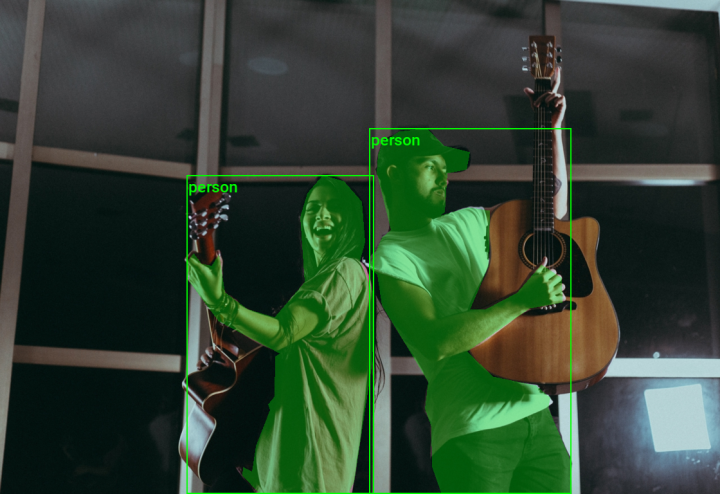
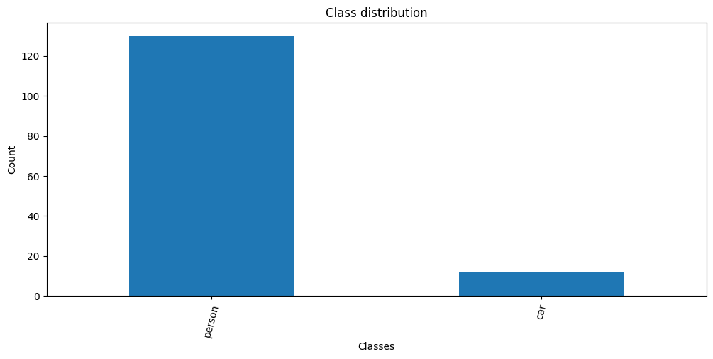
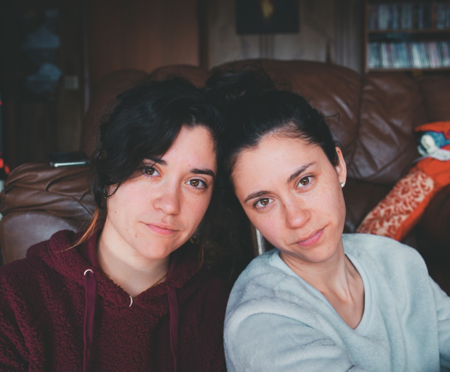
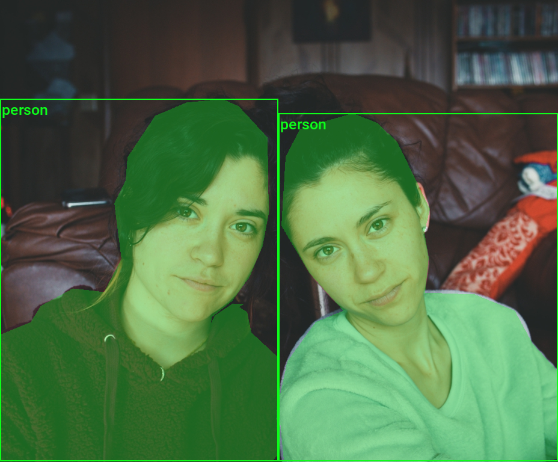
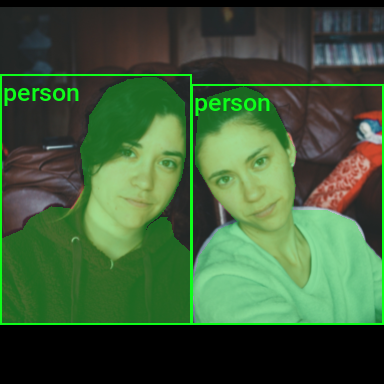
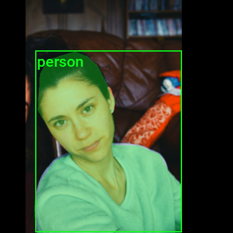

::: {.callout-tip}
## This post is part of the following series:
* [**Torchvision Annotation Tutorials**](/series/tutorials/torchvision-annotation-tutorials-series.html)
:::


* [Introduction](#introduction)
* [Getting Started with the Code](#getting-started-with-the-code)
* [Setting Up Your Python Environment](#setting-up-your-python-environment)
* [Importing the Required Dependencies](#importing-the-required-dependencies)
* [Loading and Exploring the Dataset](#loading-and-exploring-the-dataset)
* [Preparing the Data](#preparing-the-data)
* [Conclusion](#conclusion)


## Introduction

Welcome to this hands-on guide for working with segmentation annotations created with the [CVAT annotation tool](https://github.com/opencv/cvat) in [torchvision](https://pytorch.org/vision/stable/index.html). Segmentation annotations indicate the pixels occupied by specific objects or areas of interest in images for training models to recognize and delineate these objects at a pixel level.

{fig-align="center"}

The tutorial walks through setting up a Python environment, loading the raw annotations into a [Pandas DataFrame](https://pandas.pydata.org/docs/reference/api/pandas.DataFrame.html), annotating and augmenting images using torchvision's [Transforms V2 API](https://pytorch.org/vision/stable/auto_examples/transforms/plot_transforms_getting_started.html#sphx-glr-auto-examples-transforms-plot-transforms-getting-started-py), and creating a custom [Dataset](https://pytorch.org/tutorials/beginner/basics/data_tutorial.html) class to feed samples to a model.

This guide is suitable for beginners and experienced practitioners, providing the code, explanations, and resources needed to understand and implement each step. By the end, you will have a solid foundation for working with segmentation annotations made with CVAT for instance segmentation tasks.


## Getting Started with the Code

The tutorial code is available as a [Jupyter Notebook](https://jupyter.org/), which you can run locally or in a cloud-based environment like [Google Colab](https://colab.research.google.com/). I have dedicated tutorials for those new to these platforms or who need guidance setting up:

::: {.callout-tip title="Setup Guides" collapse="true"}

* [**Getting Started with Google Colab**](/posts/google-colab-getting-started-tutorial/)

* [**Setting Up a Local Python Environment with Mamba for Machine Learning Projects on Windows**](/posts/mamba-getting-started-tutorial-windows/)

:::

::: {.callout-tip title="Tutorial Code" collapse="false"}

| Jupyter Notebook: | [GitHub Repository](https://github.com/cj-mills/torchvision-annotation-tutorials/blob/main/notebooks/cvat/torchvision-cvat-segmentation-annotations.ipynb) | [Open In Colab](https://colab.research.google.com/github/cj-mills/torchvision-annotation-tutorials/blob/main/notebooks/cvat/torchvision-cvat-segmentation-annotations.ipynb) |
| ----------------- | ------------------------------------------------------------ | ------------------------------------------------------------ |
|                   |                                                              |                                                              |


:::


## Setting Up Your Python Environment

Before diving into the code, we'll cover the steps to create a local Python environment and install the necessary dependencies.


### Creating a Python Environment

First, we'll create a Python environment using [Conda](https://docs.conda.io/en/latest/)/[Mamba](https://mamba.readthedocs.io/en/latest/). Open a terminal with Conda/Mamba installed and run the following commands:


::: {.panel-tabset}
## Conda

``` {.bash}
# Create a new Python 3.10 environment
conda create --name pytorch-env python=3.10 -y
# Activate the environment
conda activate pytorch-env
```

## Mamba

``` {.bash}
# Create a new Python 3.10 environment
mamba create --name pytorch-env python=3.10 -y
# Activate the environment
mamba activate pytorch-env
```

:::


### Installing PyTorch

Next, we'll install [PyTorch](https://pytorch.org/). Run the appropriate command for your hardware and operating system.

::: {.panel-tabset}
## Linux/Windows (CUDA)

``` {.bash}
# Install PyTorch with CUDA
pip install torch torchvision torchaudio --index-url https://download.pytorch.org/whl/cu121
```

## Mac

``` {.bash}
# MPS (Metal Performance Shaders) acceleration is available on MacOS 12.3+
pip install torch torchvision torchaudio
```

## Linux (CPU)

``` {.bash}
# Install PyTorch for CPU only
pip install torch torchvision torchaudio --index-url https://download.pytorch.org/whl/cpu
```

## Windows (CPU)

``` {.bash}
# Install PyTorch for CPU only
pip install torch torchvision torchaudio
```

:::


### Installing Additional Libraries

We also need to install some additional libraries for our project.

::: {.callout-note title="Package Descriptions" collapse="true"}

| Package       | Description                                                  |
| ------------- | ------------------------------------------------------------ |
| `jupyter`     | An  open-source web application that allows you to create and share  documents that contain live code, equations, visualizations, and  narrative text. ([link](https://jupyter.org/)) |
| `matplotlib`  | This package provides a comprehensive collection of visualization tools to  create high-quality plots, charts, and graphs for data exploration and  presentation. ([link](https://matplotlib.org/)) |
| `pandas`      | This package provides fast, powerful, and flexible data analysis and manipulation tools. ([link](https://pandas.pydata.org/)) |
| `pillow`      | The Python Imaging Library adds image processing capabilities. ([link](https://pillow.readthedocs.io/en/stable/)) |
| `tqdm`        | A Python library that provides fast, extensible progress bars for loops and other iterable objects in Python. ([link](https://tqdm.github.io/)) |
| `distinctipy` | A lightweight python package providing functions to generate colours that are visually distinct from one another. ([link](https://distinctipy.readthedocs.io/en/latest/)) |


:::

Run the following commands to install these additional libraries:

```bash
# Install additional dependencies
pip install distinctipy jupyter matplotlib pandas pillow tqdm
```


### Installing Utility Packages

We will also install some utility packages I made, which provide shortcuts for routine tasks.

::: {.callout-note title="Package Descriptions" collapse="true"}

| Package                | Description                                                  |
| ---------------------- | ------------------------------------------------------------ |
| `cjm_pil_utils`        | Some PIL utility functions I frequently use. ([link](https://cj-mills.github.io/cjm-pil-utils/)) |
| `cjm_psl_utils`        | Some utility functions using the Python Standard Library. ([link](https://cj-mills.github.io/cjm-psl-utils/)) |
| `cjm_pytorch_utils`    | Some utility functions for working with PyTorch. ([link](https://cj-mills.github.io/cjm-pytorch-utils/)) |
| `cjm_torchvision_tfms` | Some custom Torchvision tranforms. ([link](https://cj-mills.github.io/cjm-torchvision-tfms/)) |


:::

Run the following commands to install the utility packages:

```python
# Install additional utility packages
pip install cjm_pil_utils cjm_psl_utils cjm_pytorch_utils cjm_torchvision_tfms
```

With our environment set up, we can open our Jupyter Notebook and dive into the code. 


## Importing the Required Dependencies

First, we will import the necessary Python packages into our Jupyter Notebook.


```python
# Import Python Standard Library dependencies
from functools import partial
from pathlib import Path
import xml.etree.ElementTree as ET

# Import utility functions
from cjm_pil_utils.core import get_img_files
from cjm_psl_utils.core import download_file, file_extract
from cjm_pytorch_utils.core import tensor_to_pil
from cjm_torchvision_tfms.core import ResizeMax, PadSquare, CustomRandomIoUCrop

# Import the distinctipy module
from distinctipy import distinctipy

# Import matplotlib for creating plots
import matplotlib.pyplot as plt

# Import numpy
import numpy as np

# Import the pandas package
import pandas as pd

# Do not truncate the contents of cells and display all rows and columns
pd.set_option('max_colwidth', None, 'display.max_rows', None, 'display.max_columns', None)

# Import PIL for image manipulation
from PIL import Image, ImageDraw

# Import PyTorch dependencies
import torch
from torch.utils.data import Dataset, DataLoader

# Import torchvision dependencies
import torchvision
torchvision.disable_beta_transforms_warning()
from torchvision.tv_tensors import BoundingBoxes, Mask
from torchvision.utils import draw_bounding_boxes, draw_segmentation_masks
import torchvision.transforms.v2  as transforms

# Import tqdm for progress bar
from tqdm.auto import tqdm
```

Torchvision provides dedicated [`torch.Tensor`](https://pytorch.org/docs/stable/tensors.html) subclasses for different annotation types called [`TVTensors`](https://pytorch.org/vision/stable/tv_tensors.html). Torchvision's V2 transforms use these subclasses to update the annotations based on the applied image augmentations. The TVTensor class for segmentation annotations is called [Mask](https://pytorch.org/vision/stable/generated/torchvision.tv_tensors.Mask.html). Torchvision also includes a [draw_segmentation_masks](https://pytorch.org/vision/stable/generated/torchvision.utils.draw_segmentation_masks.html) function to annotate images.


## Loading and Exploring the Dataset

After importing the dependencies, we can start working with our data. I annotated a toy dataset with segmentation masks for this tutorial using images from the free stock photo site [Pexels](https://www.pexels.com/). The dataset is available on [HuggingFace Hub](https://huggingface.co/) at the link below:

- **Dataset Repository:** [cvat-instance-segmentation-toy-dataset](https://huggingface.co/datasets/cj-mills/cvat-instance-segmentation-toy-dataset/tree/main)

### Setting the Directory Paths

We first need to specify a place to store our dataset and a location to download the zip file containing it. The following code creates the folders in the current directory (`./`). Update the path if that is not suitable for you.


```python
# Define path to store datasets
dataset_dir = Path("./Datasets/")
# Create the dataset directory if it does not exist
dataset_dir.mkdir(parents=True, exist_ok=True)

# Define path to store archive files
archive_dir = dataset_dir/'../Archive'
# Create the archive directory if it does not exist
archive_dir.mkdir(parents=True, exist_ok=True)

# Creating a Series with the paths and converting it to a DataFrame for display
pd.Series({
    "Dataset Directory:": dataset_dir, 
    "Archive Directory:": archive_dir
}).to_frame().style.hide(axis='columns')
```

<div style="overflow-x:auto; max-height:500px">
<table id="T_f4094">
  <thead>
  </thead>
  <tbody>
    <tr>
      <th id="T_f4094_level0_row0" class="row_heading level0 row0" >Dataset Directory:</th>
      <td id="T_f4094_row0_col0" class="data row0 col0" >Datasets</td>
    </tr>
    <tr>
      <th id="T_f4094_level0_row1" class="row_heading level0 row1" >Archive Directory:</th>
      <td id="T_f4094_row1_col0" class="data row1 col0" >Datasets/../Archive</td>
    </tr>
  </tbody>
</table>
</div>


### Setting the Dataset Path

Next, we construct the name for the Hugging Face Hub dataset and set where to download and extract the dataset.


```python
# Set the name of the dataset
dataset_name = 'cvat-instance-segmentation-toy-dataset'

# Construct the HuggingFace Hub dataset name by combining the username and dataset name
hf_dataset = f'cj-mills/{dataset_name}'

# Create the path to the zip file that contains the dataset
archive_path = Path(f'{archive_dir}/{dataset_name}.zip')

# Create the path to the directory where the dataset will be extracted
dataset_path = Path(f'{dataset_dir}/{dataset_name}')

# Creating a Series with the dataset name and paths and converting it to a DataFrame for display
pd.Series({
    "HuggingFace Dataset:": hf_dataset, 
    "Archive Path:": archive_path, 
    "Dataset Path:": dataset_path
}).to_frame().style.hide(axis='columns')
```

<div style="overflow-x:auto; max-height:500px">
<table id="T_38429">
  <thead>
  </thead>
  <tbody>
    <tr>
      <th id="T_38429_level0_row0" class="row_heading level0 row0" >HuggingFace Dataset:</th>
      <td id="T_38429_row0_col0" class="data row0 col0" >cj-mills/cvat-instance-segmentation-toy-dataset</td>
    </tr>
    <tr>
      <th id="T_38429_level0_row1" class="row_heading level0 row1" >Archive Path:</th>
      <td id="T_38429_row1_col0" class="data row1 col0" >Datasets/../Archive/cvat-instance-segmentation-toy-dataset.zip</td>
    </tr>
    <tr>
      <th id="T_38429_level0_row2" class="row_heading level0 row2" >Dataset Path:</th>
      <td id="T_38429_row2_col0" class="data row2 col0" >Datasets/cvat-instance-segmentation-toy-dataset</td>
    </tr>
  </tbody>
</table>
</div>


### Downloading the Dataset

We can now download the archive file and extract the dataset using the [`download_file`](https://cj-mills.github.io/cjm-psl-utils/core.html#download_file) and [`file_extract`](https://cj-mills.github.io/cjm-psl-utils/core.html#file_extract) functions from the `cjm_psl_utils` package. We can delete the archive afterward to save space.


```python
# Construct the HuggingFace Hub dataset URL
dataset_url = f"https://huggingface.co/datasets/{hf_dataset}/resolve/main/{dataset_name}.zip"
print(f"HuggingFace Dataset URL: {dataset_url}")

# Set whether to delete the archive file after extracting the dataset
delete_archive = True

# Download the dataset if not present
if dataset_path.is_dir():
    print("Dataset folder already exists")
else:
    print("Downloading dataset...")
    download_file(dataset_url, archive_dir)    
    
    print("Extracting dataset...")
    file_extract(fname=archive_path, dest=dataset_dir)
    
    # Delete the archive if specified
    if delete_archive: archive_path.unlink()
```


### Getting the Images and Annotations

The dataset has a folder containing the sample images and an XML file containing the annotations.


```python
 # Assuming the images are stored in a subfolder named 'default'
img_dir = dataset_path/'images/default'

# Assuming annotation file is in XML format and located in any subdirectory of the dataset
annotation_file_path = dataset_path/'annotations.xml'

# Creating a Series with the paths and converting it to a DataFrame for display
pd.Series({
    "Image Folder": img_dir, 
    "Annotation File": annotation_file_path}).to_frame().style.hide(axis='columns')
```

<div style="overflow-x:auto; max-height:500px">
<table id="T_c53a2">
  <thead>
  </thead>
  <tbody>
    <tr>
      <th id="T_c53a2_level0_row0" class="row_heading level0 row0" >Image Folder</th>
      <td id="T_c53a2_row0_col0" class="data row0 col0" >Datasets/cvat-instance-segmentation-toy-dataset/images/default</td>
    </tr>
    <tr>
      <th id="T_c53a2_level0_row1" class="row_heading level0 row1" >Annotation File</th>
      <td id="T_c53a2_row1_col0" class="data row1 col0" >Datasets/cvat-instance-segmentation-toy-dataset/annotations.xml</td>
    </tr>
  </tbody>
</table>
</div>


### Get Image File Paths

Each image file has a unique name that we can use to locate the corresponding annotation data. We can make a dictionary that maps image names to file paths. The dictionary will allow us to retrieve the file path for a given image more efficiently.


```python
# Get all image files in the 'img_dir' directory
img_dict = {
    file.stem.split('.')[0] : file # Create a dictionary that maps file names to file paths
    for file in get_img_files(img_dir) # Get a list of image files in each image folder
}

# Print the number of image files
print(f"Number of Images: {len(img_dict)}")

# Display the first five entries from the dictionary using a Pandas DataFrame
pd.DataFrame.from_dict(img_dict, orient='index').head()
```

```text
Number of Images: 31
```

<div style="overflow-x:auto; max-height:500px">
<table border="1" class="dataframe">
  <thead>
    <tr style="text-align: right;">
      <th></th>
      <th>0</th>
    </tr>
  </thead>
  <tbody>
    <tr>
      <th>adults-affection-attractive-2760688</th>
      <td>Datasets/cvat-instance-segmentation-toy-dataset/images/default/adults-affection-attractive-2760688.jpg</td>
    </tr>
    <tr>
      <th>258421</th>
      <td>Datasets/cvat-instance-segmentation-toy-dataset/images/default/258421.jpg</td>
    </tr>
    <tr>
      <th>3075367</th>
      <td>Datasets/cvat-instance-segmentation-toy-dataset/images/default/3075367.jpg</td>
    </tr>
    <tr>
      <th>3076319</th>
      <td>Datasets/cvat-instance-segmentation-toy-dataset/images/default/3076319.jpg</td>
    </tr>
    <tr>
      <th>3145551</th>
      <td>Datasets/cvat-instance-segmentation-toy-dataset/images/default/3145551.jpg</td>
    </tr>
  </tbody>
</table>
</div>


### Get Image Annotations

Next, we read the content of the XML annotation file into a Pandas DataFrame so we can easily query the annotations.

#### Define a function to parse the CVAT XML annotations

The following helper function parses the raw XML content into a Pandas DataFrame.


```python
def parse_cvat_segmentation_xml(xml_content):
    """
    Parses an XML string representing image segmentation data from CVAT and converts it into a pandas DataFrame.

    The function expects an XML string with a structure containing 'image' elements, each with 'id', 'name', 'width', 
    and 'height' attributes, and nested 'polygon' elements with 'label' and 'points' attributes. It processes this 
    XML content to extract relevant data and organizes it into a structured DataFrame.

    Parameters:
    xml_content (str): A string containing the XML data to be parsed.

    Returns:
    pandas.DataFrame: A DataFrame where each row represents an image and contains the following columns:
                      'Image ID', 'Image Name', 'Width', 'Height', and 'Polygons'.
                      'Polygons' is a list of dictionaries, each representing a polygon with 'Label' and 'Points'.
    """

    # Parse the XML content from the provided string.
    root = ET.fromstring(xml_content)
    data = {}

    for image in root.findall('image'):
        # Extract attributes for each image.
        image_id = image.get('id')
        image_name = image.get('name')
        width = image.get('width')
        height = image.get('height')

        # Initialize a dictionary to store image data.
        image_data = {
            'Image ID': int(image_id),
            'Image Name': image_name,
            'Width': int(width),
            'Height': int(height),
            'Polygons': []
        }

        # Iterate over each polygon element within the current image.
        for polygon in image.findall('polygon'):
            # Extract the label and points of the polygon.
            label = polygon.get('label')
            
            points = ','.join(polygon.get('points').split(';'))
            points = [float(point) for point in points.split(',')]
            
            # Create a dictionary to store the polygon data.
            points_data = {
                'Label': label,
                'Points': points
            }
            image_data['Polygons'].append(points_data)

        # Add the processed image data to the main data dictionary.
        data[image_id] = image_data

    # Convert the data dictionary into a pandas DataFrame and return it.
    return pd.DataFrame.from_dict(data, orient='index')
```

#### Load CVAT XML annotations into a DataFrame

After parsing the XML content, we will change the index for the `annotation_df` DataFrame to match the keys in the `img_dict` dictionary, allowing us to retrieve both the image paths and annotation data using the same index key.


```python
# Read the XML file
with open(annotation_file_path, 'r', encoding='utf-8') as file:
    xml_content = file.read()

# Parse the XML content
annotation_df = parse_cvat_segmentation_xml(xml_content)

# Add a new column 'Image ID' by extracting it from 'Image Name'
# This assumes that the 'Image ID' is the part of the 'Image Name' before the first period
annotation_df['Image ID'] = annotation_df['Image Name'].apply(lambda x: x.split('.')[0])

# Set the new 'Image ID' column as the index of the DataFrame
annotation_df = annotation_df.set_index('Image ID')

# Display the first few rows of the DataFrame
annotation_df.head()
```


<div style="overflow-x:auto; max-height:500px">
<table border="1" class="dataframe">
  <thead>
    <tr style="text-align: right;">
      <th></th>
      <th>Image Name</th>
      <th>Width</th>
      <th>Height</th>
      <th>Polygons</th>
    </tr>
    <tr>
      <th>Image ID</th>
      <th></th>
      <th></th>
      <th></th>
      <th></th>
    </tr>
  </thead>
  <tbody>
    <tr>
      <th>258421</th>
      <td>258421.jpg</td>
      <td>768</td>
      <td>1152</td>
      <td>[{'Label': 'person', 'Points': [377.0, 775.5, 368.0, 774.5, 346.5, 764.0, 349.5, 751.0, 348.5, 707.0, 358.5, 668.0, 343.5, 651.0, 359.5, 605.0, 379.5, 583.0, 366.01, 583.39, 362.55, 575.78, 361.85, 565.4, 353.2, 557.09, 357.7, 547.4, 350.78, 532.53, 356.32, 520.76, 359.78, 481.31, 376.39, 467.47, 387.46, 469.55, 401.3, 484.08, 405.8, 501.04, 394.03, 505.88, 394.73, 519.03, 399.92, 531.14, 374.66, 554.33, 369.81, 571.28, 374.31, 574.05, 388.15, 574.39, 397.49, 569.9, 402.5, 578.0, 410.5, 594.0, 412.5, 668.0, 387.0, 667.5, 375.5, 692.0, 376.5, 738.0, 380.5, 753.0, 388.5, 764.0, 386.5, 772.0]}, {'Label': 'person', 'Points': [404.0, 775.5, 396.5, 766.0, 411.5, 753.0, 411.5, 738.0, 416.5, 731.0, 412.5, 598.0, 419.5, 559.0, 416.0, 554.5, 404.0, 566.5, 387.0, 572.5, 375.5, 566.0, 377.5, 554.0, 405.5, 529.0, 413.5, 504.0, 414.5, 493.0, 386.5, 463.0, 388.5, 453.0, 399.0, 443.5, 413.0, 444.5, 423.5, 453.0, 457.5, 506.0, 452.5, 575.0, 458.5, 607.0, 447.5, 635.0, 444.5, 676.0, 452.5, 764.0, 443.0, 770.5]}]</td>
    </tr>
    <tr>
      <th>3075367</th>
      <td>3075367.jpg</td>
      <td>1344</td>
      <td>768</td>
      <td>[{'Label': 'person', 'Points': [829.0, 466.5, 825.5, 464.0, 824.5, 455.0, 825.5, 425.0, 828.0, 419.5, 833.5, 418.0, 827.5, 417.0, 822.5, 396.0, 825.5, 327.0, 843.5, 313.0, 842.5, 296.0, 833.5, 291.0, 832.5, 270.0, 837.0, 265.5, 856.0, 264.5, 868.5, 277.0, 870.5, 306.0, 881.5, 318.0, 883.5, 329.0, 893.0, 332.5, 899.5, 340.0, 901.5, 367.0, 883.5, 382.0, 849.5, 443.0, 842.5, 448.0, 838.5, 460.0]}, {'Label': 'person', 'Points': [714.0, 766.5, 664.0, 765.5, 654.0, 716.5, 640.0, 765.5, 578.5, 764.0, 578.5, 599.0, 570.5, 587.0, 592.5, 403.0, 583.5, 339.0, 525.5, 278.0, 463.5, 187.0, 423.5, 98.0, 422.5, 72.0, 444.0, 52.5, 460.5, 62.0, 458.5, 104.0, 485.5, 166.0, 581.0, 270.5, 623.0, 295.5, 644.5, 293.0, 630.5, 261.0, 642.5, 193.0, 667.0, 182.5, 707.0, 191.5, 719.5, 249.0, 709.0, 307.5, 774.0, 271.5, 848.5, 176.0, 875.5, 108.0, 867.5, 55.0, 902.0, 63.5, 908.5, 76.0, 902.5, 134.0, 858.5, 233.0, 759.5, 350.0, 736.5, 495.0, 752.5, 614.0]}, {'Label': 'person', 'Points': [359.0, 509.5, 355.0, 509.5, 350.5, 502.0, 353.5, 486.0, 349.5, 475.0, 349.5, 449.0, 345.5, 430.0, 339.5, 419.0, 337.5, 394.0, 327.5, 378.0, 331.5, 371.0, 332.5, 357.0, 342.5, 345.0, 345.5, 327.0, 354.0, 313.5, 365.5, 317.0, 366.5, 339.0, 385.0, 350.5, 399.5, 371.0, 398.5, 383.0, 390.0, 391.5, 390.5, 378.0, 383.0, 369.5, 379.5, 370.0, 380.5, 441.0, 376.5, 471.0, 370.0, 464.5, 364.5, 472.0, 362.5, 482.0, 364.5, 504.0]}, {'Label': 'car', 'Points': [1343.0, 764.5, 964.0, 745.5, 930.0, 764.5, 914.5, 759.0, 904.0, 722.5, 865.0, 706.5, 848.0, 735.5, 801.0, 735.5, 788.5, 699.0, 792.5, 577.0, 821.5, 476.0, 849.5, 454.0, 890.5, 382.0, 930.0, 355.5, 1021.0, 347.5, 1195.0, 358.5, 1287.0, 378.5, 1343.0, 436.0]}]</td>
    </tr>
    <tr>
      <th>3076319</th>
      <td>3076319.jpg</td>
      <td>768</td>
      <td>1120</td>
      <td>[{'Label': 'person', 'Points': [590.0, 1119.0, 508.5, 1119.0, 393.5, 881.0, 363.5, 778.0, 359.5, 738.0, 377.5, 685.0, 420.5, 660.0, 388.5, 650.0, 410.5, 606.0, 412.5, 477.0, 349.5, 383.0, 364.5, 338.0, 341.5, 303.0, 369.5, 313.0, 396.5, 191.0, 449.0, 157.5, 496.0, 169.5, 524.5, 203.0, 534.5, 320.0, 577.5, 380.0, 588.5, 493.0, 635.5, 554.0, 631.5, 567.0, 687.5, 625.0, 704.5, 673.0, 698.5, 743.0, 632.5, 833.0, 618.5, 955.0, 573.5, 1096.0]}, {'Label': 'person', 'Points': [262.0, 1119.0, 128.5, 1119.0, 131.5, 1089.0, 35.5, 901.0, 11.5, 772.0, 33.5, 686.0, 70.5, 663.0, 34.5, 612.0, 25.5, 569.0, 52.5, 375.0, 97.0, 332.5, 195.5, 306.0, 205.5, 255.0, 192.5, 220.0, 240.0, 154.5, 290.0, 133.5, 323.5, 153.0, 341.5, 209.0, 332.5, 279.0, 294.5, 326.0, 347.5, 357.0, 352.5, 399.0, 400.5, 459.0, 404.5, 517.0, 391.5, 631.0, 344.5, 679.0, 359.5, 719.0, 323.5, 907.0, 224.5, 1082.0]}]</td>
    </tr>
    <tr>
      <th>3145551</th>
      <td>3145551.jpg</td>
      <td>1184</td>
      <td>768</td>
      <td>[{'Label': 'person', 'Points': [683.0, 398.5, 675.0, 398.5, 671.5, 396.0, 673.5, 378.0, 669.5, 366.0, 669.5, 359.0, 664.5, 346.0, 663.5, 326.0, 661.5, 320.0, 661.5, 312.0, 666.5, 304.0, 662.5, 295.0, 666.0, 283.5, 673.0, 283.5, 674.5, 285.0, 676.5, 289.0, 676.5, 297.0, 681.5, 302.0, 685.5, 313.0, 686.5, 336.0, 683.5, 344.0, 685.5, 395.0]}, {'Label': 'person', 'Points': [649.0, 398.5, 644.0, 398.5, 641.5, 396.0, 640.5, 387.0, 644.5, 379.0, 650.5, 358.0, 650.5, 351.0, 644.5, 335.0, 644.5, 323.0, 646.5, 316.0, 644.5, 300.0, 648.5, 291.0, 654.0, 288.5, 661.5, 295.0, 662.5, 298.0, 658.5, 309.0, 662.5, 316.0, 664.5, 324.0, 665.5, 349.0, 669.5, 364.0, 665.5, 383.0, 666.5, 396.0, 663.0, 397.5, 659.5, 392.0, 662.5, 375.0, 662.5, 364.0, 660.0, 361.5, 649.5, 383.0]}]</td>
    </tr>
    <tr>
      <th>3176048</th>
      <td>3176048.jpg</td>
      <td>1152</td>
      <td>768</td>
      <td>[{'Label': 'person', 'Points': [562.0, 464.5, 552.0, 464.5, 550.5, 462.0, 553.5, 454.0, 550.5, 433.0, 558.5, 402.0, 558.5, 389.0, 561.5, 380.0, 557.0, 372.5, 549.0, 374.5, 537.0, 372.5, 533.0, 377.5, 532.5, 371.0, 529.5, 368.0, 542.0, 365.5, 551.0, 366.5, 562.0, 361.5, 567.0, 361.5, 568.5, 360.0, 567.5, 346.0, 572.0, 342.5, 577.0, 342.5, 582.5, 348.0, 581.5, 360.0, 591.5, 372.0, 593.5, 386.0, 592.0, 388.5, 587.0, 388.5, 585.5, 391.0, 578.5, 419.0, 572.5, 434.0, 571.5, 445.0, 566.5, 454.0, 565.5, 462.0]}, {'Label': 'person', 'Points': [661.0, 436.5, 659.5, 436.0, 660.5, 432.0, 660.5, 396.0, 659.5, 392.0, 663.5, 376.0, 661.0, 373.5, 658.0, 373.5, 650.0, 377.5, 641.0, 377.5, 640.5, 376.0, 647.0, 372.5, 651.0, 372.5, 656.0, 370.5, 666.0, 365.5, 667.5, 364.0, 667.5, 359.0, 670.0, 356.5, 674.0, 356.5, 677.5, 360.0, 676.5, 367.0, 682.5, 374.0, 683.5, 389.0, 681.0, 390.5, 678.5, 388.0, 678.5, 385.0, 677.5, 385.0, 677.5, 390.0, 673.5, 395.0, 673.5, 408.0, 671.5, 411.0, 670.5, 420.0, 668.5, 425.0, 668.5, 433.0, 669.5, 434.0]}]</td>
    </tr>
  </tbody>
</table>
</div>
---

The source XML content corresponding to the first row in the DataFrame is available below:

```xml
<?xml version="1.0" encoding="utf-8"?>
<annotations>
  <version>1.1</version>
  <meta>
  </meta>
  <image id="0" name="258421.jpg" subset="default" task_id="9" width="768" height="1152">
    <polygon label="person" source="file" occluded="0" points="377.00,775.50;368.00,774.50;346.50,764.00;349.50,751.00;348.50,707.00;358.50,668.00;343.50,651.00;359.50,605.00;379.50,583.00;366.01,583.39;362.55,575.78;361.85,565.40;353.20,557.09;357.70,547.40;350.78,532.53;356.32,520.76;359.78,481.31;376.39,467.47;387.46,469.55;401.30,484.08;405.80,501.04;394.03,505.88;394.73,519.03;399.92,531.14;374.66,554.33;369.81,571.28;374.31,574.05;388.15,574.39;397.49,569.90;402.50,578.00;410.50,594.00;412.50,668.00;387.00,667.50;375.50,692.00;376.50,738.00;380.50,753.00;388.50,764.00;386.50,772.00" z_order="0">
    </polygon>
    <polygon label="person" source="file" occluded="0" points="404.00,775.50;396.50,766.00;411.50,753.00;411.50,738.00;416.50,731.00;412.50,598.00;419.50,559.00;416.00,554.50;404.00,566.50;387.00,572.50;375.50,566.00;377.50,554.00;405.50,529.00;413.50,504.00;414.50,493.00;386.50,463.00;388.50,453.00;399.00,443.50;413.00,444.50;423.50,453.00;457.50,506.00;452.50,575.00;458.50,607.00;447.50,635.00;444.50,676.00;452.50,764.00;443.00,770.50" z_order="0">
    </polygon>
  </image>
</annotations>
```

The segmentation polygon annotations in `[x1,y1, x2,y2, ..., xn,yn]` format.


With the annotations loaded, we can start inspecting our dataset.


### Inspecting the Class Distribution

First, we get the names of all the classes in our dataset and inspect the distribution of samples among these classes. This step is not strictly necessary for the toy dataset but is worth doing for real-world projects. A balanced dataset (where each class has approximately the same number of instances) is ideal for training a machine-learning model.


#### Get image classes


```python
# Explode the 'boxes_df' column in the annotation_df dataframe
# Convert the resulting series to a dataframe and rename the 'boxes_df' column to 'boxes_df'
# Apply the pandas Series function to the 'boxes_df' column of the dataframe
polygon_df = annotation_df['Polygons'].explode().to_frame().Polygons.apply(pd.Series)

# Get a list of unique labels in the 'annotation_df' DataFrame
class_names = polygon_df['Label'].unique().tolist()

# Display labels using a Pandas DataFrame
pd.DataFrame(class_names)
```

<div style="overflow-x:auto; max-height:500px">
<table border="1" class="dataframe">
  <thead>
    <tr style="text-align: right;">
      <th></th>
      <th>0</th>
    </tr>
  </thead>
  <tbody>
    <tr>
      <th>0</th>
      <td>person</td>
    </tr>
    <tr>
      <th>1</th>
      <td>car</td>
    </tr>
  </tbody>
</table>
</div>

#### Visualize the class distribution


```python
# Get the number of samples for each object class
class_counts = polygon_df['Label'].value_counts()

# Plot the distribution
class_counts.plot(kind='bar', figsize=(12, 5))
plt.title('Class distribution')
plt.ylabel('Count')
plt.xlabel('Classes')
plt.xticks(range(len(class_counts.index)), class_counts.index, rotation=75)  # Set the x-axis tick labels
plt.show()
```
{fig-align="center"}

Note the class distribution is quite imbalanced between the `person` and `car` classes. For a real dataset, you would want these to be much closer.


### Visualizing Image Annotations

In this section, we will annotate a single image with its segmentation masks and bounding boxes using torchvision's `BoundingBoxes` and `Mask` classes and `draw_bounding_boxes` and `draw_segmentation_masks` function.

#### Generate a color map

While not required, assigning a unique color to bounding boxes for each  object class enhances visual distinction, allowing for easier  identification of different objects in the scene. We can use the [`distinctipy`](https://distinctipy.readthedocs.io/en/latest/) package to generate a visually distinct colormap.


```python
# Generate a list of colors with a length equal to the number of labels
colors = distinctipy.get_colors(len(class_names))

# Make a copy of the color map in integer format
int_colors = [tuple(int(c*255) for c in color) for color in colors]

# Generate a color swatch to visualize the color map
distinctipy.color_swatch(colors)
```

{fig-align="center"}


#### Download a font file

The [`draw_bounding_boxes`](https://pytorch.org/vision/stable/generated/torchvision.utils.draw_bounding_boxes.html) function included with torchvision uses a pretty small font size. We  can increase the font size if we use a custom font. Font files are  available on sites like [Google Fonts](https://fonts.google.com/), or we can use one included with the operating system.


```python
# Set the name of the font file
font_file = 'KFOlCnqEu92Fr1MmEU9vAw.ttf'

# Download the font file
download_file(f"https://fonts.gstatic.com/s/roboto/v30/{font_file}", "./")
```

#### Define the bounding box annotation function

We can make a partial function using `draw_bounding_boxes` since we’ll use the same box thickness and font each time we visualize bounding boxes.

```python
draw_bboxes = partial(draw_bounding_boxes, fill=False, width=2, font=font_file, font_size=25)
```


### Selecting a Sample Image

We can use the unique ID for an image in the image dictionary to get the image file path and the associated annotations from the annotation DataFrame.

#### Load the sample image


```python
# Get the file ID of the first image file
file_id = list(img_dict.keys())[0]

# Open the associated image file as a RGB image
sample_img = Image.open(img_dict[file_id]).convert('RGB')

# Print the dimensions of the image
print(f"Image Dims: {sample_img.size}")

# Show the image
sample_img
```

```text
Image Dims: (768, 1152)
```


{fig-align="center"}
    


#### Inspect the corresponding annotation data


```python
# Get the row from the 'annotation_df' DataFrame corresponding to the 'file_id'
annotation_df.loc[file_id].to_frame()
```

<div style="overflow-x:auto; max-height:500px">
<table border="1" class="dataframe">
  <thead>
    <tr style="text-align: right;">
      <th></th>
      <th>adults-affection-attractive-2760688</th>
    </tr>
  </thead>
  <tbody>
    <tr>
      <th>Image Name</th>
      <td>adults-affection-attractive-2760688.jpg</td>
    </tr>
    <tr>
      <th>Width</th>
      <td>768</td>
    </tr>
    <tr>
      <th>Height</th>
      <td>1152</td>
    </tr>
    <tr>
      <th>Polygons</th>
      <td>[{'Label': 'person', 'Points': [389.0, 1151.0, 34.5, 1151.0, 82.5, 992.0, 103.0, 965.5, 147.5, 953.0, 135.5, 848.0, 104.5, 763.0, 97.5, 672.0, 129.5, 581.0, 186.5, 519.0, 127.5, 466.0, 106.5, 422.0, 118.5, 369.0, 181.0, 306.5, 258.0, 325.5, 301.5, 412.0, 285.5, 566.0, 291.5, 594.0, 323.5, 610.0, 335.5, 714.0, 366.5, 777.0, 341.5, 848.0, 337.5, 944.0]}, {'Label': 'person', 'Points': [532.0, 1151.0, 397.5, 1151.0, 345.5, 958.0, 345.5, 855.0, 369.5, 776.0, 340.5, 720.0, 344.5, 678.0, 325.5, 647.0, 326.5, 608.0, 296.5, 592.0, 294.5, 540.0, 298.0, 519.5, 341.5, 493.0, 273.5, 329.0, 284.5, 283.0, 332.0, 249.5, 385.0, 260.5, 411.5, 287.0, 431.5, 338.0, 434.0, 411.5, 449.0, 407.5, 486.0, 440.5, 601.0, 461.5, 671.5, 580.0, 698.5, 786.0, 681.5, 1090.0, 663.0, 1137.5, 549.0, 1127.5]}]</td>
    </tr>
  </tbody>
</table>
</div>
The lists of point coordinates in the segmentation annotations are the vertices of a polygon for the individual segmentation masks. We can use these to generate images for each segmentation mask.


#### Define a function to convert segmentation polygons to images


```python
def create_polygon_mask(image_size, vertices):
    """
    Create a grayscale image with a white polygonal area on a black background.

    Parameters:
    - image_size (tuple): A tuple representing the dimensions (width, height) of the image.
    - vertices (list): A list of tuples, each containing the x, y coordinates of a vertex
                        of the polygon. Vertices should be in clockwise or counter-clockwise order.

    Returns:
    - PIL.Image.Image: A PIL Image object containing the polygonal mask.
    """

    # Create a new black image with the given dimensions
    mask_img = Image.new('L', image_size, 0)
    
    # Draw the polygon on the image. The area inside the polygon will be white (255).
    ImageDraw.Draw(mask_img, 'L').polygon(vertices, fill=(255))

    # Return the image with the drawn polygon
    return mask_img
```

#### Annotate sample image

We can now generate the segmentation mask images and feed those to the `draw_segmentation_mask` function.

We can use the [`masks_to_boxes`](https://pytorch.org/vision/stable/generated/torchvision.ops.masks_to_boxes.html#torchvision.ops.masks_to_boxes) function included with torchvision to generate bounding box annotations in the `[top-left X, top-left Y, bottom-right X, bottom-right Y]` format from the segmentation masks. That is the same format the `draw_bounding_boxes` function expects so we can use the output directly.


```python
# Extract the polygon points for segmentation mask
polygon_points = annotation_df.loc[file_id]['Polygons']

# Generate mask images from polygons
mask_imgs = [create_polygon_mask(sample_img.size, polygon['Points']) for polygon in polygon_points]

# Convert mask images to tensors
masks = torch.concat([Mask(transforms.PILToTensor()(mask_img), dtype=torch.bool) for mask_img in mask_imgs])

# Extract the labels and bounding box annotations for the sample image
labels = [polygon['Label'] for polygon in annotation_df.loc[file_id]['Polygons']]
bboxes = torchvision.ops.masks_to_boxes(masks)

# Annotate the sample image with segmentation masks
annotated_tensor = draw_segmentation_masks(
    image=transforms.PILToTensor()(sample_img), 
    masks=masks, 
    alpha=0.3, 
    colors=[int_colors[i] for i in [class_names.index(label) for label in labels]]
)

# Annotate the sample image with labels and bounding boxes
annotated_tensor = draw_bboxes(
    image=annotated_tensor, 
    boxes=bboxes,
    labels=labels, 
    colors=[int_colors[i] for i in [class_names.index(label) for label in labels]]
)

tensor_to_pil(annotated_tensor)
```

{fig-align="center"}


We have loaded the dataset, inspected its class distribution, and visualized the annotations for a sample image. In the final section, we will cover how to augment images using torchvision's Transforms V2 API and create a custom Dataset class for training.


## Preparing the Data

In this section, we will first walk through a single example of how to apply augmentations to a single annotated image using torchvision's Transforms V2 API before putting everything together in a custom Dataset class.

### Data Augmentation

Here, we will define some data augmentations to apply to images during training. I created a few custom image transforms to help streamline the code.

The [first](https://cj-mills.github.io/cjm-torchvision-tfms/core.html#customrandomioucrop) extends the [`RandomIoUCrop`](https://pytorch.org/vision/stable/generated/torchvision.transforms.v2.RandomIoUCrop.html#torchvision.transforms.v2.RandomIoUCrop) transform included with torchvision to give the user more control over how much it crops into bounding box areas. The [second](https://cj-mills.github.io/cjm-torchvision-tfms/core.html#resizemax) resizes images based on their largest dimension rather than their smallest. The [third](https://cj-mills.github.io/cjm-torchvision-tfms/core.html#padsquare) applies square padding and allows the padding to be applied equally on both sides or randomly split between the two sides.

All three are available through the [`cjm-torchvision-tfms`](https://cj-mills.github.io/cjm-torchvision-tfms/) package.

#### Set training image size

Next, we will specify the image size to use during training.


```python
# Set training image size
train_sz = 384
```

#### Initialize custom transforms

Now, we can initialize the transform objects.


```python
# Create a RandomIoUCrop object
iou_crop = CustomRandomIoUCrop(min_scale=0.3, 
                               max_scale=1.0, 
                               min_aspect_ratio=0.5, 
                               max_aspect_ratio=2.0, 
                               sampler_options=[0.0, 0.1, 0.3, 0.5, 0.7, 0.9, 1.0],
                               trials=400, 
                               jitter_factor=0.25)

# Create a `ResizeMax` object
resize_max = ResizeMax(max_sz=train_sz)

# Create a `PadSquare` object
pad_square = PadSquare(shift=True, fill=0)
```

#### Test the transforms

Torchvision's V2 image transforms take an image and a `targets` dictionary. The `targets` dictionary contains the annotations and labels for the image.

We will pass input through the `CustomRandomIoUCrop` transform first and then through `ResizeMax` and `PadSquare`. We can pass the result through a final resize operation to ensure both sides match the `train_sz` value.


```python
# Get colors for dataset sample
sample_colors = [int_colors[i] for i in [class_names.index(label) for label in labels]]

# Prepare mask and bounding box targets
targets = {
    'masks': Mask(masks), 
    'boxes': BoundingBoxes(data=bboxes, format='xyxy', canvas_size=sample_img.size[::-1]), 
    'labels': torch.Tensor([class_names.index(label) for label in labels])
}

# Crop the image
cropped_img, targets = iou_crop(sample_img, targets)

# Resize the image
resized_img, targets = resize_max(cropped_img, targets)

# Pad the image
padded_img, targets = pad_square(resized_img, targets)

# Ensure the padded image is the target size
resize = transforms.Resize([train_sz] * 2, antialias=True)
resized_padded_img, targets = resize(padded_img, targets)
sanitized_img, targets = transforms.SanitizeBoundingBoxes()(resized_padded_img, targets)

annotated_tensor = draw_segmentation_masks(
    image=transforms.PILToTensor()(sanitized_img), 
    masks=targets['masks'], 
    alpha=0.3, 
    colors=sample_colors
)

# Annotate the augmented image with updated labels and bounding boxes
annotated_tensor = draw_bboxes(
    image=annotated_tensor, 
    boxes=targets['boxes'], 
    labels=[class_names[int(label.item())] for label in targets['labels']], 
    colors=[int_colors[i] for i in [class_names.index(label) for label in labels]]
)

# Display the annotated image
display(tensor_to_pil(annotated_tensor))

pd.Series({
    "Source Image:": sample_img.size,
    "Cropped Image:": cropped_img.size,
    "Resized Image:": resized_img.size,
    "Padded Image:": padded_img.size,
    "Resized Padded Image:": resized_padded_img.size,
}).to_frame().style.hide(axis='columns')
```

{fig-align="center"}

<div style="overflow-x:auto; max-height:500px">
<table id="T_45284">
  <thead>
  </thead>
  <tbody>
    <tr>
      <th id="T_45284_level0_row0" class="row_heading level0 row0" >Source Image:</th>
      <td id="T_45284_row0_col0" class="data row0 col0" >(768, 1152)</td>
    </tr>
    <tr>
      <th id="T_45284_level0_row1" class="row_heading level0 row1" >Cropped Image:</th>
      <td id="T_45284_row1_col0" class="data row1 col0" >(434, 751)</td>
    </tr>
    <tr>
      <th id="T_45284_level0_row2" class="row_heading level0 row2" >Resized Image:</th>
      <td id="T_45284_row2_col0" class="data row2 col0" >(221, 382)</td>
    </tr>
    <tr>
      <th id="T_45284_level0_row3" class="row_heading level0 row3" >Padded Image:</th>
      <td id="T_45284_row3_col0" class="data row3 col0" >(382, 382)</td>
    </tr>
    <tr>
      <th id="T_45284_level0_row4" class="row_heading level0 row4" >Resized Padded Image:</th>
      <td id="T_45284_row4_col0" class="data row4 col0" >(384, 384)</td>
    </tr>
  </tbody>
</table>
</div>
---

Now that we know how to apply data augmentations, we can put all the steps we've covered into a custom Dataset class.


### Training Dataset Class

The following custom Dataset class is responsible for loading a single image, preparing the associated annotations, applying any image transforms, and returning the final `image` tensor and its `target` dictionary during training.


```python
class CVATInstSegDataset(Dataset):
    """
    This class represents a PyTorch Dataset for a collection of images and their annotations.
    The class is designed to load images along with their corresponding bounding box annotations and labels.
    """
    def __init__(self, img_keys, annotation_df, img_dict, class_to_idx, transforms=None):
        """
        Constructor for the CVATInstSegDataset class.

        Parameters:
        img_keys (list): List of unique identifiers for images.
        annotation_df (DataFrame): DataFrame containing the image annotations.
        img_dict (dict): Dictionary mapping image identifiers to image file paths.
        class_to_idx (dict): Dictionary mapping class labels to indices.
        transforms (callable, optional): Optional transform to be applied on a sample.
        """
        super(Dataset, self).__init__()
        
        self._img_keys = img_keys  # List of image keys
        self._annotation_df = annotation_df  # DataFrame containing annotations
        self._img_dict = img_dict  # Dictionary mapping image keys to image paths
        self._class_to_idx = class_to_idx  # Dictionary mapping class names to class indices
        self._transforms = transforms  # Image transforms to be applied
        
    def __len__(self):
        """
        Returns the length of the dataset.

        Returns:
        int: The number of items in the dataset.
        """
        return len(self._img_keys)
        
    def __getitem__(self, index):
        """
        Fetch an item from the dataset at the specified index.

        Parameters:
        index (int): Index of the item to fetch from the dataset.

        Returns:
        tuple: A tuple containing the image and its associated target (annotations).
        """
        # Retrieve the key for the image at the specified index
        img_key = self._img_keys[index]
        # Get the annotations for this image
        annotation = self._annotation_df.loc[img_key]
        # Load the image and its target (bounding boxes and labels)
        image, target = self._load_image_and_target(annotation)
        
        # Apply the transformations, if any
        if self._transforms:
            image, target = self._transforms(image, target)
        
        return image, target

    def _load_image_and_target(self, annotation):
        """
        Load an image and its target (bounding boxes and labels).

        Parameters:
        annotation (pandas.Series): The annotations for an image.

        Returns:
        tuple: A tuple containing the image and a dictionary with 'boxes' and 'labels' keys.
        """
        # Retrieve the file path of the image
        filepath = self._img_dict[annotation.name]
        # Open the image file and convert it to RGB
        image = Image.open(filepath).convert('RGB')

        # Extract the polygon points for segmentation mask
        polygon_points = annotation['Polygons']
        # Generate mask images from polygons
        mask_imgs = [create_polygon_mask(image.size, polygon['Points']) for polygon in polygon_points]
        # Convert mask images to tensors
        masks = Mask(torch.concat([Mask(transforms.PILToTensor()(mask_img), dtype=torch.bool) for mask_img in mask_imgs]))
        
        # Generate bounding box annotations from segmentation masks
        bbox_tensor = torchvision.ops.masks_to_boxes(masks)
        # Create a BoundingBoxes object with the bounding boxes
        boxes = BoundingBoxes(bbox_tensor, format='xyxy', canvas_size=image.size[::-1])
        
        # Convert the class labels to indices
        annotation_labels = [box['Label'] for box in annotation['Polygons']]
        labels = torch.Tensor([self._class_to_idx[label] for label in annotation_labels])
        
        return image, {'masks': masks,'boxes': boxes, 'labels': labels}
```


### Image Transforms

Here, we will specify and organize all the image transforms to apply during training.


```python
# Compose transforms for data augmentation
data_aug_tfms = transforms.Compose(
    transforms=[
        iou_crop,
        transforms.ColorJitter(
                brightness = (0.875, 1.125),
                contrast = (0.5, 1.5),
                saturation = (0.5, 1.5),
                hue = (-0.05, 0.05),
        ),
        transforms.RandomGrayscale(),
        transforms.RandomEqualize(),
        transforms.RandomPosterize(bits=3, p=0.5),
        transforms.RandomHorizontalFlip(p=0.5),
    ],
)

# Compose transforms to resize and pad input images
resize_pad_tfm = transforms.Compose([
    resize_max, 
    pad_square,
    transforms.Resize([train_sz] * 2, antialias=True)
])

# Compose transforms to sanitize bounding boxes and normalize input data
final_tfms = transforms.Compose([
    transforms.ToImage(), 
    transforms.ToDtype(torch.float32, scale=True),
    transforms.SanitizeBoundingBoxes(),
])

# Define the transformations for training and validation datasets
train_tfms = transforms.Compose([
    data_aug_tfms, 
    resize_pad_tfm, 
    final_tfms
])
```

::: {.callout-important}

Always use the [`SanitizeBoundingBoxes`](https://pytorch.org/vision/stable/generated/torchvision.transforms.v2.SanitizeBoundingBoxes.html#torchvision.transforms.v2.SanitizeBoundingBoxes) transform to clean up annotations after using data augmentations that alter bounding boxes (e.g., cropping, warping, etc.).
:::


### Initialize Dataset

Now, we can create the dataset object using the image dictionary, the annotation DataFrame, and the image transforms.


```python
# Create a mapping from class names to class indices
class_to_idx = {c: i for i, c in enumerate(class_names)}

# Instantiate the dataset using the defined transformations
train_dataset = CVATInstSegDataset(list(img_dict.keys()), annotation_df, img_dict, class_to_idx, train_tfms)

# Print the number of samples in the training dataset
pd.Series({
    'Training dataset size:': len(train_dataset),
}).to_frame().style.hide(axis='columns')
```


<div style="overflow-x:auto; max-height:500px">
<table id="T_5167f">
  <thead>
  </thead>
  <tbody>
    <tr>
      <th id="T_5167f_level0_row0" class="row_heading level0 row0" >Training dataset size:</th>
      <td id="T_5167f_row0_col0" class="data row0 col0" >31</td>
    </tr>
  </tbody>
</table>
</div>


### Inspect Samples

To close out, we should verify the dataset object works as intended by inspecting the first sample.

#### Inspect training set sample


```python
dataset_sample = train_dataset[0]

# Get colors for dataset sample
sample_colors = [int_colors[int(i.item())] for i in dataset_sample[1]['labels']]

# Annotate the sample image with segmentation masks
annotated_tensor = draw_segmentation_masks( 
    image=(dataset_sample[0]*255).to(dtype=torch.uint8), 
    masks=dataset_sample[1]['masks'], 
    alpha=0.3, 
    colors=sample_colors
)

# Annotate the sample image with bounding boxes
annotated_tensor = draw_bboxes(
    image=annotated_tensor, 
    boxes=dataset_sample[1]['boxes'], 
    labels=[class_names[int(i.item())] for i in dataset_sample[1]['labels']], 
    colors=sample_colors
)

tensor_to_pil(annotated_tensor)
```

{fig-align="center"}


## Conclusion

In this tutorial, we covered how to load custom segmentation annotations made with the CVAT annotation tool and work with them using torchvision's Transforms V2 API. The skills and knowledge you acquired here provide a solid foundation for future instance segmentation projects.

As a next step, perhaps try annotating a custom instance segmentation dataset with CVAT and loading it with this tutorial's code. Once you're comfortable with that, try adapting the code in the following tutorial to train an instance segmentation model on your custom dataset.

- [Training Mask R-CNN Models with PyTorch](/posts/pytorch-train-mask-rcnn-tutorial/)


## Recommended Tutorials

* [**Working with CVAT Bounding Box Annotations in Torchvision**](/posts/torchvision-cvat-annotation-tutorials/bounding-boxes/)**:** Learn how to work with CVAT bounding box annotations in torchvision for object detection tasks.
* [**Working with CVAT Keypoint Annotations in Torchvision**](/posts/torchvision-cvat-annotation-tutorials/keypoints/)**:** Learn how to work with CVAT keypoint annotations in torchvision for keypoint estimation tasks.
* [**Training Mask R-CNN Models with PyTorch**](http://localhost:3847/posts/pytorch-train-mask-rcnn-tutorial/)**:** Learn how to train Mask R-CNN models on custom datasets with PyTorch.



