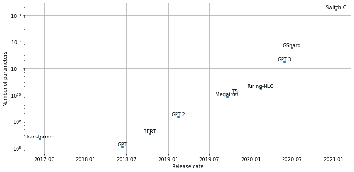
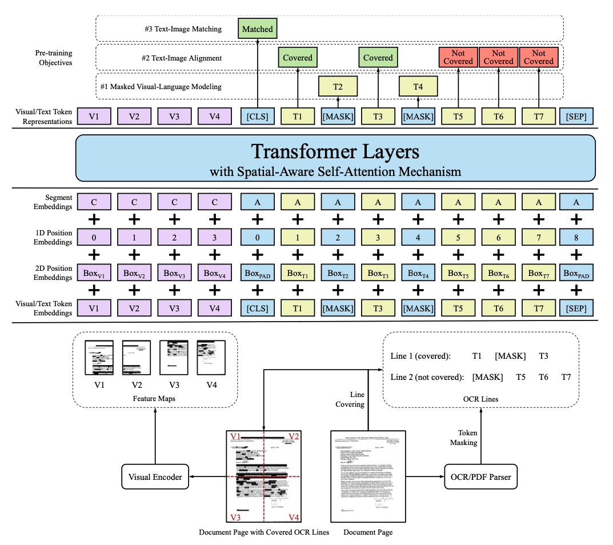
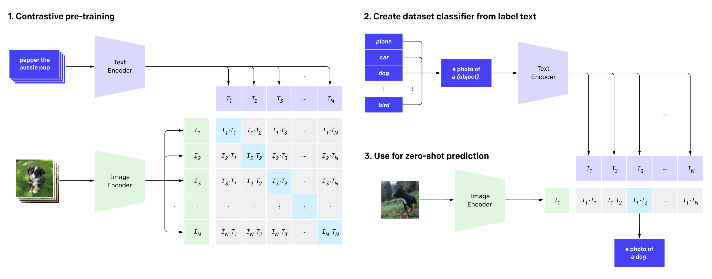

* [Scaling Transformers](#scaling-transformers)
* [Going Beyond Text](#going-beyond-text)
* [Multimodal Transformers](#multimodal-transformers)
* [References](#references)


------


```python
import transformers
import datasets
import accelerate

# Only print error messages
transformers.logging.set_verbosity_error()
datasets.logging.set_verbosity_error()

transformers.__version__, datasets.__version__, accelerate.__version__
```
```text
    ('4.18.0', '2.1.0', '0.5.1')
```

------

```python
import ast
# https://astor.readthedocs.io/en/latest/
import astor
import inspect
import textwrap
def print_source(obj, exclude_doc=True):
    
    # Get source code
    source = inspect.getsource(obj)
    # Remove any common leading whitespace from every line
    cleaned_source = textwrap.dedent(source)
    # Parse the source into an AST node.
    parsed = ast.parse(cleaned_source)

    for node in ast.walk(parsed):
        # Skip any nodes that are not class or function definitions
        if not isinstance(node, (ast.FunctionDef, ast.ClassDef, ast.AsyncFunctionDef)):
            continue
        
        if exclude_doc and len(node.body) > 1: node.body = node.body[1:]
        
    print(astor.to_source(parsed))
```

------


## Scaling Transformers

* **[The Bitter Lesson](http://incompleteideas.net/IncIdeas/BitterLesson.html)**
    * [Richard Sutton](http://www.incompleteideas.net/) argued that general methods that leverage computation are far more effective in AI than methods that leverage domain knowledge.
    * The human knowledge approach tends to complicate things, making them less suited to taking advantage of general methods leveraging computation.
    * Search methods and learning methods seem to scale arbitrarily with computation power.
* Large language models perform better on downstream tasks.
* Interesting capabilities like zero-shot and few-shot learning emerge in the 10 to 100-billion parameter range.
* Computing power and training data must also scale with parameter count.
* Large language models like GPT-3 are estimated to cost [$4.6 million](https://lambdalabs.com/blog/demystifying-gpt-3/) to train.
* The high cost of training large models means we need a way to estimate the model's performance in advance.
* [Scaling Laws for Neural Language Models](https://arxiv.org/abs/2001.08361)
    * The performance of language models appears to obey a power-law relationship with model size and other factors.

------


```python
import pandas as pd
import matplotlib.pyplot as plt
```

------

**Plot parameter counts over time for prominent Transformer architectures**


```python
model_data = [
    {'date': '12-06-2017', 'name': 'Transformer', 'size': 213*1e6},
    {'date': '11-06-2018', 'name': 'GPT', 'size': 110*1e6},
    {'date': '11-10-2018', 'name': 'BERT', 'size': 340*1e6},
    {'date': '14-02-2019', 'name': 'GPT-2', 'size': 1.5*1e9},
    {'date': '23-10-2019', 'name': 'T5', 'size': 11*1e9},
    {'date': '17-09-2019', 'name': 'Megatron', 'size': 8.3*1e9},
    {'date': '13-02-2020', 'name': 'Turing-NLG', 'size': 17*1e9},
    {'date': '30-06-2020', 'name': 'GShard', 'size': 600*1e9},
    {'date': '28-05-2020', 'name': 'GPT-3', 'size': 175*1e9},
    {'date': '11-01-2021', 'name': 'Switch-C', 'size': 1.571*10e12},
]

def label_point(x, y, val, ax):
    a = pd.concat({"x": x, "y": y, "val": val}, axis=1)
    for i, point in a.iterrows():
        ax.text(
            point["x"],
            point["y"],
            str(point["val"]),
            horizontalalignment="center",
            verticalalignment="bottom",
        )

df_lm = pd.DataFrame.from_records(model_data)
df_lm["date"] = pd.to_datetime(df_lm["date"], dayfirst=True)

fig, ax = plt.subplots(1, 1, figsize=(12, 4))
df_lm.plot(x="date", y="size", kind="scatter", s=15, ax=ax)
ax.set_yscale("log")
label_point(df_lm["date"], df_lm["size"], df_lm["name"], ax)
ax.set_xlabel("Release date")
ax.set_ylabel("Number of parameters")
ax.grid(True)
plt.subplots_adjust(top=1.2)
plt.show()
```


------

### Scaling Laws

* Scaling laws allow us to empirically quantify the "bigger is better" paradigm for language models by studying their behavior with varying compute budgets $C$, dataset sizes $D$, and model sizes $N$.
* We measure dataset size in the number of tokens.
* The model size excludes parameters from the embedding layers.
* We chart the dependence of the cross-entropy loss on these three factors to determine if a relationship emerges.
* Scaling laws imply that increasing compute budget, dataset size, and model size in tandem is more productive than architectural tweaks or hyperparameter optimization to improve performance.
* The test loss has a power-law relationship with computation budget, dataset size, and model size across several orders of magnitude.
* We can express $L\left( X \right) \sim 1/X^{\alpha}$ for $X = N, C, D$ where $\alpha$ is a scaling exponent determined by a fit to the loss curve.
    * Typical values for $\alpha$ lie in the range $\left[0.05,0.095 \right]$.
    * [Scaling Laws for Autoregressive Generative Modeling](https://arxiv.org/abs/2010.14701)
* These power laws mean we can extrapolate the early part of a loss curve to predict the approximate loss from training longer.
* Larger models can achieve the same performance as smaller models with fewer training steps.
* Scaling laws are also present for other modalities like images, videos, and mathematical problem-solving.

### Challenges with Scaling
* Provisioning and managing hundreds or thousands of GPU nodes typically requires specialized engineers familiar with running large-scale, distributed experiments.
* Most companies cannot afford the teams and resources to train models at the largest scales.  
* A recently proposed distributed deep learning framework enables smaller groups to pool their computational resources and pre-train models.
    * [Distributed Deep Learning in Open Collaborations](https://arxiv.org/abs/2106.10207)
* Large models require large, high-quality datasets.
    * It is hard to curate only high-quality training examples when the dataset contains terabytes of text.
    * We need a way to control common biases in the dataset to prevent the model from inheriting them.
    * There are potential licensing issues when using large-scale web-text corpora.
    * Large-scale text datasets might contain personal information.
* Evaluating trained models on downstream tasks requires additional time and resources.
    * We need to probe the model for biased and toxic output, even when using a cleaned dataset.
* Optimization approaches like distillation, pruning, and quantization might not be enough when starting with a model that is hundreds of gigabytes in size.
* [OpenAI API](https://openai.com/api/)
* [Hugging Face Accelerated Inference API](https://huggingface.co/docs/api-inference/index)
* [BigScience](https://bigscience.huggingface.co/) is a one-year-long research workshop meant to foster discussions and reflections on the research questions surrounding large language models, the challenges of creating and sharing them, and datasets used for research.
    * The collaborative tasks involve creating, sharing, and evaluating a massive multilingual dataset and language model.
* [EleutherAI](https://www.eleuther.ai/) is a decentralized collective of volunteers focused on AI alignment, scaling, and open-source AI research.
    * EleutherAI wants to train and open-source a GPT-3-sized model.
    * [GPT-Neo 2.7B](https://huggingface.co/EleutherAI/gpt-neo-2.7B)
    * [GPT-J 6B](https://huggingface.co/EleutherAI/gpt-j-6B)

### Attention Please!
* Self-attention involves performing pairwise comparisons of all the tokens in a sequence, which becomes a computational bottleneck.
* The self-attention layer of the Transformer architecture naively scales like $O(n^{2})$, where n is the length of the sequence.
* A recent paper from Google shows we can reduce the memory complexity to $O \left( \log{n} \right)$ via a simple reordering of the operations.
    * [Self-attention Does Not Need $O(n^{2})$ Memory](https://arxiv.org/abs/2112.05682)
* Much of the recent research on transformers focuses on making self-attention more efficient.
    * [Efficient Transformers: A Survey](https://arxiv.org/abs/2009.06732)
* Common approaches to making attention more efficient involve introducing sparsity into the attention mechanism or applying kernels to the attention matrix.

### Sparse Attention
* We can reduce the number of computations performed in the self-attention layer by limiting the number of query-key pairs it generates according to a predefined pattern.
* There are a handful of popular "atomic" sparsity patterns.
    * [A Survey of Transformers](https://arxiv.org/abs/2106.04554)
* **Global attention** defines a few tokens in the sequence that are allowed to attend to all others.
* **Band attention** computes attention over a diagonal band.
* **Dilated attention** skips some query-key pairs using a dilated window with gaps.
* **Random attention** samples a few keys for each query to compute attention scores.
* **Block local attention** divides the sequence into blocks and restricts attention to within these blocks.
* Most transformer models with sparse attention use a mix of atomic sparsity patterns to generate the final attention matrix.
* Models like [Longformer](https://huggingface.co/allenai/longformer-base-4096) use a mix of global and band attention, while [Bigbird](https://huggingface.co/google/bigbird-roberta-base) adds random attention.
* Introducing sparsity into the attention matrix enables models to process much longer sequences.
* It is also possible to learn the sparsity pattern by clustering the tokens into chunks.
    * [Reformer](https://huggingface.co/google/reformer-crime-and-punishment) uses a hash function to cluster similar tokens.

### Linearized Attention
* Linearized attention involves changing the order of operations for computing attention scores.
* We compute the self-attention score of the queries and keys using a similarity function like the dot product.
* For a general similarity function $sim \left( q_{i},k_{j} \right)$, we can express the attention outputs as the following equation:
### $$y_{i} = \sum_{j}{\frac{sim \left( Q_{i}, K_{j} \right)}{\sum_{k}{sim\left( Q_{i}, K_{k} \right)}}V_{j}}$$
* The trick behind linearized attention mechanisms is to express the similarity function as a kernel function that decomposes the operation into two pieces:
### $$sim \left( Q_{j}, K_{j} \right) = \phi \left(Q_{i} \right)^{T} \phi \left( K_{j} \right)$$
* where $\phi$ is typically a high-dimensional feature map.
* $\phi \left( Q_{i} \right)$ is independent of $j$ and $k$, so we can pull it under the sums to write the attention output as follows:
### $$y_{i} = \frac{\phi \left(Q_{i} \right)^{T} \sum_{j}{\phi \left( K_{j} \right)} V_{j}^{T}}{\phi \left(Q_{i} \right)^{T} \sum_{k}{\phi \left( K_{k} \right)}}$$
* By first computing $\sum_{j}{\phi \left( K_{j} \right)} V_{j}^{T}$ and $\sum_{k}{\phi \left( K_{k} \right)}$, we can effectively linearize the space and time complexity of self-attention.
* Popular methods that implement linearized self-attention include Linear Transformer and Performer.
    * [Transformers are RNNs: Fast Autoregressive Transformers with Linear Attention](https://arxiv.org/abs/2006.16236)
    * [Rethinking Attention with Performers](https://arxiv.org/abs/2009.14794)

## Going Beyond Text
* Developing effective strategies for common textual tasks like classification and question answering allows us to address many types of real-world problems.


### Limitations to using text

#### Human reporting bias
* The frequencies of events in the training text my not represent their actual frequencies.
    * [Reporting Bias and Knowledge Acquisition](https://openreview.net/pdf?id=AzxEzvpdE3Wcy)
* A model trained exclusively on text from the internet might have a distorted image of the world.

#### Common Sense
* Most do not document their reasoning based on common sense.
* Language models trained on text might know many facts about the world but lack basic common-sense reasoning.

#### Facts
* A probabilistic language model cannot reliably store facts and can produce factually incorrect text.
* Such models can detect named entities but have no direct way to access information about them.

#### Modality
* Language models can't connect to other modalities, such as audio, visual signals, or tabular data, that might address some of these limitations.

### Vision
* Transformers are now achieving efficiency similar to or better than Convolutional Neural Networks (CNNs).

#### iGPT
* iGPT (short for image GPT) uses the GPT architecture and autoregressive pretraining objective to predict future pixel values by viewing images as sequences of pixels.
* [Generative Pretraining From Pixels](https://proceedings.mlr.press/v119/chen20s.html)
* Pretraining on large image datasets enables iGPT to "autocomplete" partial images.
* iGPT achieves performant results on classification tasks when using a classification head.

#### ViT
* Vision Transformer (Vit) is a BERT-style take on transformers for vision.
* We split the image into smaller patches and then embed each of these patches with a linear projection.
* We combine the patch embeddings with position embeddings and feed them through an ordinary transformer encoder.
* We mask or distort some of the patches during training, and the objective is to predict the average color of the masked patch.
* This approach did not produce better results when pretrained on the standard ImageNet dataset, but it scaled significantly better than Convolutional Neural Networks on larger datasets.
* [An Image is Worth 16x16 Words: Transformers for Image Recognition at Scale](https://arxiv.org/abs/2010.11929)
* The Hugging Face Transformers library includes Vision Transformer.

------


```python
from PIL import Image
import matplotlib.pyplot as plt
```

------

**Load an image of a dog**


```python
image = Image.open("dog.jpg")
plt.imshow(image)
plt.axis("off")
plt.show()
```


------

```python
import pandas as pd
pd.set_option('max_colwidth', None)
pd.set_option('display.max_rows', None)
pd.set_option('display.max_columns', None)
from transformers import pipeline
```

------

#### `ImageClassificationPipeline`

* [Documentation](https://huggingface.co/docs/transformers/main/en/main_classes/pipelines#transformers.ImageClassificationPipeline)
* Create an image classification pipeline

**Create an image classification pipeline**


```python
image_classifier = pipeline("image-classification")
```

------

**Get the model architecture**


```python
image_classifier.model.config.architectures
```
```text
    ['ViTForImageClassification']
```

------

#### `ViTForImageClassification`

* [Documentation](https://huggingface.co/docs/transformers/main/en/model_doc/vit#transformers.ViTForImageClassification)
* Create a ViT Model transformer with an image classification head for ImageNet.

**Get the link to the Hugging Face model card**


```python
print(f"https://huggingface.co/{image_classifier.model.config._name_or_path}")
```

```text
https://huggingface.co/google/vit-base-patch16-224
```

------

**View potential Image classes**


```python
pd.DataFrame(list(image_classifier.model.config.id2label.values())).T
```


------

**Perform image classification**


```python
preds = image_classifier(image)
preds_df = pd.DataFrame(preds)
preds_df
```
<div style="overflow-x:auto;">
<table border="1" class="dataframe">
  <thead>
    <tr style="text-align: right;">
      <th></th>
      <th>score</th>
      <th>label</th>
    </tr>
  </thead>
  <tbody>
    <tr>
      <th>0</th>
      <td>0.989680</td>
      <td>golden retriever</td>
    </tr>
    <tr>
      <th>1</th>
      <td>0.002968</td>
      <td>Labrador retriever</td>
    </tr>
    <tr>
      <th>2</th>
      <td>0.000502</td>
      <td>kuvasz</td>
    </tr>
    <tr>
      <th>3</th>
      <td>0.000402</td>
      <td>Irish setter, red setter</td>
    </tr>
    <tr>
      <th>4</th>
      <td>0.000345</td>
      <td>tennis ball</td>
    </tr>
  </tbody>
</table>
</div>
**Note:** 

* The model correctly classifies the dog as a Golden Retriever.
* Video models are a natural extension of image models and add a temporal dimension on top of the spatial dimension.
* Video tasks are more challenging as the volume of data gets much larger, and we need to deal with an extra dimension.
* Models such as TimeSformer introduce a spatial and temporal attention mechanism.
    * [Is Space-Time Attention All You Need for Video Understanding?](https://arxiv.org/abs/2102.05095)
    * Such models can help build tools for many tasks such as video classification or annotation.

------

### Tables

* Lots of data is in structured databases instead of raw text.
* Table Parser (TAPAS) applies the Transformer architecture to tables by combining the tabular information with the query.
* [TAPAS: Weakly Supervised Table Parsing via Pre-training](https://arxiv.org/abs/2004.02349)


**Create some sample table data**


```python
book_data = [
    {"chapter": 0, "name": "Introduction", "start_page": 1, "end_page": 11},
    {"chapter": 1, "name": "Text classification", "start_page": 12, 
     "end_page": 48},
    {"chapter": 2, "name": "Named Entity Recognition", "start_page": 49,
     "end_page": 73},
    {"chapter": 3, "name": "Question Answering", "start_page": 74, 
     "end_page": 120},
    {"chapter": 4, "name": "Summarization", "start_page": 121, 
     "end_page": 140},
    {"chapter": 5, "name": "Conclusion", "start_page": 141, 
     "end_page": 144}
]

table = pd.DataFrame(book_data)
table['number_of_pages'] = table['end_page']-table['start_page']
```

**Note:** We need to make all columns of type `str` to play nicely with TAPAS.

------


```python
table = table.astype(str)
table
```
<div style="overflow-x:auto;">
<table border="1" class="dataframe">
  <thead>
    <tr style="text-align: right;">
      <th></th>
      <th>chapter</th>
      <th>name</th>
      <th>start_page</th>
      <th>end_page</th>
      <th>number_of_pages</th>
    </tr>
  </thead>
  <tbody>
    <tr>
      <th>0</th>
      <td>0</td>
      <td>Introduction</td>
      <td>1</td>
      <td>11</td>
      <td>10</td>
    </tr>
    <tr>
      <th>1</th>
      <td>1</td>
      <td>Text classification</td>
      <td>12</td>
      <td>48</td>
      <td>36</td>
    </tr>
    <tr>
      <th>2</th>
      <td>2</td>
      <td>Named Entity Recognition</td>
      <td>49</td>
      <td>73</td>
      <td>24</td>
    </tr>
    <tr>
      <th>3</th>
      <td>3</td>
      <td>Question Answering</td>
      <td>74</td>
      <td>120</td>
      <td>46</td>
    </tr>
    <tr>
      <th>4</th>
      <td>4</td>
      <td>Summarization</td>
      <td>121</td>
      <td>140</td>
      <td>19</td>
    </tr>
    <tr>
      <th>5</th>
      <td>5</td>
      <td>Conclusion</td>
      <td>141</td>
      <td>144</td>
      <td>3</td>
    </tr>
  </tbody>
</table>
</div>
------


**Create a table question answering pipeline**


```python
table_qa = pipeline("table-question-answering")
table_qa.model.config
```
```text
    TapasConfig {
      "_name_or_path": "google/tapas-base-finetuned-wtq",
      "aggregation_labels": {
        "0": "NONE",
        "1": "SUM",
        "2": "AVERAGE",
        "3": "COUNT"
      },
      "aggregation_loss_weight": 1.0,
      "aggregation_temperature": 1.0,
      "allow_empty_column_selection": false,
      "answer_loss_cutoff": 0.664694,
      "answer_loss_importance": 1.0,
      "architectures": [
        "TapasForQuestionAnswering"
      ],
      "attention_probs_dropout_prob": 0.1,
      "average_approximation_function": "ratio",
      "average_logits_per_cell": false,
      "cell_selection_preference": 0.207951,
      "disable_per_token_loss": false,
      "gradient_checkpointing": false,
      "hidden_act": "gelu",
      "hidden_dropout_prob": 0.1,
      "hidden_size": 768,
      "huber_loss_delta": 0.121194,
      "init_cell_selection_weights_to_zero": true,
      "initializer_range": 0.02,
      "intermediate_size": 3072,
      "layer_norm_eps": 1e-12,
      "max_num_columns": 32,
      "max_num_rows": 64,
      "max_position_embeddings": 1024,
      "model_type": "tapas",
      "no_aggregation_label_index": 0,
      "num_aggregation_labels": 4,
      "num_attention_heads": 12,
      "num_hidden_layers": 12,
      "pad_token_id": 0,
      "positive_label_weight": 10.0,
      "reset_position_index_per_cell": true,
      "select_one_column": true,
      "softmax_temperature": 1.0,
      "temperature": 0.0352513,
      "transformers_version": "4.18.0",
      "type_vocab_size": [
        3,
        256,
        256,
        2,
        256,
        256,
        10
      ],
      "type_vocab_sizes": [
        3,
        256,
        256,
        2,
        256,
        256,
        10
      ],
      "use_answer_as_supervision": true,
      "use_gumbel_for_aggregation": false,
      "use_gumbel_for_cells": false,
      "use_normalized_answer_loss": false,
      "vocab_size": 30522
    }
```

------

**Get the link to the Hugging Face model card**


```python
print(f"https://huggingface.co/{table_qa.model.config._name_or_path}")
```
```text
    https://huggingface.co/google/tapas-base-finetuned-wtq
```

------


```python
pd.DataFrame(table_qa.tokenizer.vocab.keys()).head(1500).T
```
------


#### `TapasForQuestionAnswering`
* [Documentation](https://huggingface.co/docs/transformers/main/en/model_doc/tapas#transformers.TapasForQuestionAnswering)
* Create a Tapas Model with a cell selection head and optional aggregation head for question answering tasks.

**Pass some queries to the model**


```python
queries = ["What's the topic in chapter 4?",
           "What is the total number of pages?",
           "On which page does the chapter about question-answering start?",
           "How many chapters have more than 20 pages?"]
preds = table_qa(table, queries)
```


```python
for query, pred in zip(queries, preds):
    print(query)
    if pred["aggregator"] == "NONE": 
        print("Predicted answer: " + pred["answer"])
    else: 
        print("Predicted answer: " + pred["answer"])
    print('='*50)
```
```text
    What's the topic in chapter 4?
    Predicted answer: Summarization
    ==================================================
    What is the total number of pages?
    Predicted answer: SUM > 10, 36, 24, 46, 19, 3
    ==================================================
    On which page does the chapter about question-answering start?
    Predicted answer: AVERAGE > 74
    ==================================================
    How many chapters have more than 20 pages?
    Predicted answer: COUNT > 1, 2, 3
    ==================================================
```

**Note:**
* The model predicted exactly one cell with no aggregation for the first query, and the answer is correct.
* For the second query, the model correctly predicted that we need to sum the individual page counts for each chapter to determine the total number of pages.
* The model correctly answered question three but included an unnecessary average aggregation.
* The model correctly determined that chapters 1, 2, and 3 have more than 20 pages.
* The ability to ask questions in natural language instead of Python code allows a much wider audience to query the data to answer specific questions.

------

## Multimodal Transformers

### Speech-to-Text
* Speaking is more convenient than reading and writing for a significant portion of the population.
* Automatic speech recognition (ASR) involves converting spoken words to text and enables voice technologies like Siri to answer questions like "What is the weather like today?".
* The [wave2vec 2.0](https://huggingface.co/models?search=wav2vec2+facebook) family of models is one of the most recent developments in ASR and uses a transformer layer in combination with a CNN.
    * [wav2vec 2.0: A Framework for Self-Supervised Learning of Speech Representations](https://arxiv.org/abs/2006.11477)
* These models leverage unlabeled data to achieve competitive results with only a few minutes of labeled data.
* The Hugging Face Transformers library includes wave2vec 2.0 models.

**Create an automatic speech recognition pipeline**


```python
asr = pipeline("automatic-speech-recognition")
asr.model.config
```
```text
    Wav2Vec2Config {
      "_name_or_path": "facebook/wav2vec2-base-960h",
      "activation_dropout": 0.1,
      "adapter_kernel_size": 3,
      "adapter_stride": 2,
      "add_adapter": false,
      "apply_spec_augment": true,
      "architectures": [
        "Wav2Vec2ForCTC"
      ],
      "attention_dropout": 0.1,
      "bos_token_id": 1,
      "classifier_proj_size": 256,
      "codevector_dim": 256,
      "contrastive_logits_temperature": 0.1,
      "conv_bias": false,
      "conv_dim": [
        512,
        512,
        512,
        512,
        512,
        512,
        512
      ],
      "conv_kernel": [
        10,
        3,
        3,
        3,
        3,
        2,
        2
      ],
      "conv_stride": [
        5,
        2,
        2,
        2,
        2,
        2,
        2
      ],
      "ctc_loss_reduction": "sum",
      "ctc_zero_infinity": false,
      "diversity_loss_weight": 0.1,
      "do_stable_layer_norm": false,
      "eos_token_id": 2,
      "feat_extract_activation": "gelu",
      "feat_extract_dropout": 0.0,
      "feat_extract_norm": "group",
      "feat_proj_dropout": 0.1,
      "feat_quantizer_dropout": 0.0,
      "final_dropout": 0.1,
      "gradient_checkpointing": false,
      "hidden_act": "gelu",
      "hidden_dropout": 0.1,
      "hidden_dropout_prob": 0.1,
      "hidden_size": 768,
      "initializer_range": 0.02,
      "intermediate_size": 3072,
      "layer_norm_eps": 1e-05,
      "layerdrop": 0.1,
      "mask_feature_length": 10,
      "mask_feature_min_masks": 0,
      "mask_feature_prob": 0.0,
      "mask_time_length": 10,
      "mask_time_min_masks": 2,
      "mask_time_prob": 0.05,
      "model_type": "wav2vec2",
      "num_adapter_layers": 3,
      "num_attention_heads": 12,
      "num_codevector_groups": 2,
      "num_codevectors_per_group": 320,
      "num_conv_pos_embedding_groups": 16,
      "num_conv_pos_embeddings": 128,
      "num_feat_extract_layers": 7,
      "num_hidden_layers": 12,
      "num_negatives": 100,
      "output_hidden_size": 768,
      "pad_token_id": 0,
      "proj_codevector_dim": 256,
      "tdnn_dilation": [
        1,
        2,
        3,
        1,
        1
      ],
      "tdnn_dim": [
        512,
        512,
        512,
        512,
        1500
      ],
      "tdnn_kernel": [
        5,
        3,
        3,
        1,
        1
      ],
      "transformers_version": "4.18.0",
      "use_weighted_layer_sum": false,
      "vocab_size": 32,
      "xvector_output_dim": 512
    }
```

------

**Get the link to the Hugging Face model card**


```python
print(f"https://huggingface.co/{asr.model.config._name_or_path}")
```
```text
    https://huggingface.co/facebook/wav2vec2-base-960h
```

**Note:** The model trained on 960 hours of speech audio.

------

#### `Wav2Vec2ForCTC`
* [Documentation](https://huggingface.co/docs/transformers/main/en/model_doc/wav2vec2#transformers.Wav2Vec2ForCTC)
* Create a Wav2Vec2 model with a language modeling head for Connectionist Temporal Classification (CTC).

------


```python
from datasets import load_dataset
```

------

#### The SUPERB Dataset

* [Hugging Face Dataset Card](https://huggingface.co/datasets/superb)
* SUPERB is a leaderboard to benchmark the performance of a shared model across a wide range of speech processing tasks with minimal architecture changes and labeled data.

**Load the ASR subset of the SUPERB dataset**


```python
ds = load_dataset("superb", "asr", split="validation[:1]")
pd.DataFrame(ds[0])
```
<div style="overflow-x:auto;">
<table border="1" class="dataframe">
  <thead>
    <tr style="text-align: right;">
      <th></th>
      <th>file</th>
      <th>audio</th>
      <th>text</th>
      <th>speaker_id</th>
      <th>chapter_id</th>
      <th>id</th>
    </tr>
  </thead>
  <tbody>
    <tr>
      <th>array</th>
      <td>/home/innom-dt/.cache/huggingface/datasets/downloads/extracted/aa91addd71e85ab524e5b5b56fa3d0de777838850cb76ec55ad066e969fd5144/LibriSpeech/dev-clean/1272/128104/1272-128104-0000.flac</td>
      <td>[0.002380371, 0.0020751953, 0.0019836426, 0.002105713, 0.0016174316, 0.00030517578, 9.1552734e-05, 0.00033569336, 0.0009765625, 0.0018310547, 0.0020141602, 0.002105713, 0.001739502, 0.00045776367, -0.00039672852, 0.00045776367, 0.0010070801, 9.1552734e-05, 0.00048828125, 0.001159668, 0.0007324219, 0.0009460449, 0.0018005371, 0.0018310547, 0.00088500977, 0.0004272461, 0.00048828125, 0.0007324219, 0.0010986328, 0.002105713, 0.0025634766, 0.002532959, 0.0025634766, 0.0022888184, 0.0018005371, 0.0010681152, 0.00064086914, 0.00012207031, 0.0002746582, 0.001159668, 0.0015258789, 0.0015563965, 0.0019226074, 0.0012207031, -3.0517578e-05, -0.00036621094, -0.00039672852, -0.00039672852, -0.00015258789, 0.0006713867, 0.0012817383, 0.0018615723, 0.0015869141, 0.0012817383, 0.0007324219, 9.1552734e-05, -0.000579834, -0.00045776367, 9.1552734e-05, 0.00033569336, 0.00024414062, 0.0011291504, 0.001373291, 0.0012817383, 0.00088500977, 0.00030517578, -0.00088500977, -0.0014648438, -0.0008239746, 0.00012207031, 0.0011901855, 0.0019226074, 0.0016479492, 0.00088500977, 0.00076293945, 0.0004272461, -0.0005187988, -0.0005493164, -0.00036621094, -0.0004272461, -0.00018310547, 0.000579834, 0.0009460449, 0.0007324219, 0.0010070801, 0.0007019043, 0.00024414062, -0.00018310547, -0.00064086914, -0.00088500977, -0.00048828125, 0.0002746582, 0.0007324219, 0.0018310547, 0.0018005371, 0.0012512207, 0.00061035156, -0.00036621094, -0.0012817383, -0.00091552734, ...]</td>
      <td>MISTER QUILTER IS THE APOSTLE OF THE MIDDLE CLASSES AND WE ARE GLAD TO WELCOME HIS GOSPEL</td>
      <td>1272</td>
      <td>128104</td>
      <td>1272-128104-0000</td>
    </tr>
    <tr>
      <th>path</th>
      <td>/home/innom-dt/.cache/huggingface/datasets/downloads/extracted/aa91addd71e85ab524e5b5b56fa3d0de777838850cb76ec55ad066e969fd5144/LibriSpeech/dev-clean/1272/128104/1272-128104-0000.flac</td>
      <td>/home/innom-dt/.cache/huggingface/datasets/downloads/extracted/aa91addd71e85ab524e5b5b56fa3d0de777838850cb76ec55ad066e969fd5144/LibriSpeech/dev-clean/1272/128104/1272-128104-0000.flac</td>
      <td>MISTER QUILTER IS THE APOSTLE OF THE MIDDLE CLASSES AND WE ARE GLAD TO WELCOME HIS GOSPEL</td>
      <td>1272</td>
      <td>128104</td>
      <td>1272-128104-0000</td>
    </tr>
    <tr>
      <th>sampling_rate</th>
      <td>/home/innom-dt/.cache/huggingface/datasets/downloads/extracted/aa91addd71e85ab524e5b5b56fa3d0de777838850cb76ec55ad066e969fd5144/LibriSpeech/dev-clean/1272/128104/1272-128104-0000.flac</td>
      <td>16000</td>
      <td>MISTER QUILTER IS THE APOSTLE OF THE MIDDLE CLASSES AND WE ARE GLAD TO WELCOME HIS GOSPEL</td>
      <td>1272</td>
      <td>128104</td>
      <td>1272-128104-0000</td>
    </tr>
  </tbody>
</table>
</div>
**Note:**

* The file column contains the path to the audio sample, and the text column contains the expected transcription.
* We can use the [SoundFile library](https://pysoundfile.readthedocs.io/en/latest/) to read each audio file and convert the audio to an array of floats.

------


```python
import soundfile as sf
```

------

**Add a new column storing each audio sample as an array of floats**


```python
def map_to_array(batch):
    speech, _ = sf.read(batch["file"])
    batch["speech"] = speech
    return batch

ds = ds.map(map_to_array)
```

------

**Play a sample from the dataset**


```python
from IPython.display import Audio

display(Audio(ds[0]['speech'], rate=16000))
```

------


```python
ds.set_format("numpy")
```

------

**Pass the audio sample the pipeline**


```python
pred = asr(ds[0]["speech"])
print(pred)
```
```text
    {'text': 'MISTER QUILTER IS THE APOSTLE OF THE MIDDLE CLASSES AND WE ARE GLAD TO WELCOME HIS GOSPEL'}
```

**Note:** 
* The words in the transcription are correct, but the punctuation is missing.
* It is hard to infer punctuation from audio alone, and we could add it in a post-processing step.
* Building a model for a new language still requires a minimum amount of labeled data, which can be challenging to obtain.
* A new method named wav2vec-U combines clever clustering and GAN training to build a speech-to-text model using only independent unlabeled speech and unlabeled text data.
    * This method requires not aligned speech and text data, enabling the training of highly performant speech-to-text models for a much larger spectrum of languages.
    * [Unsupervised Speech Recognition](https://arxiv.org/abs/2105.11084)

------


### Vision and Text
* There have been several developments in combining visual and textual information.

#### VQA
* [Making the V in VQA Matter: Elevating the Role of Image Understanding in Visual Question Answering](https://arxiv.org/abs/1612.00837)
* Models such as LXMERT and VisualBERT use vision models like ResNets to extract features from images and then use transformer encoders to combine them with the natural questions and predict and answer.
    * [LXMERT: Learning Cross-Modality Encoder Representations from Transformers](https://arxiv.org/abs/1908.07490)
    * [VisualBERT: A Simple and Performant Baseline for Vision and Language](https://arxiv.org/abs/1908.03557)

#### LayoutLM
* The [LayoutLM](https://huggingface.co/models?search=microsoft+layoutlm) family of models uses an enhanced Transformer architecture that receives a text sequence, an image, and a layout as input.
* There are embedding layers associated with each modality, a spatially-aware self-attention mechanism, and a mix of image and text/image pretraining objectives to align the different modalities.
* LayoutLM models pre-train on millions of scanned documents and can transfer to various downstream tasks, similar to BERT for NLP.
* LayoutLM models are the current state of the art for analyzing scanned business documents like receipts, invoices, or reports.

 

#### DALL·E
* DALLE uses the GPT architecture and autoregressive modeling to generate images from text.
* It regards the words and pixels as one sequence of tokens and can, therefore, continue generating an image from a text prompt.
* [Zero-Shot Text-to-Image Generation](https://arxiv.org/abs/2102.12092)

#### CLIP
* [Learning Transferable Visual Models From Natural Language Supervision](https://arxiv.org/abs/2103.00020)
* We can use the pretrained model for classification by embedding the possible classes with the text encoder and comparing the class embeddings to the image embedding that we want to classify.
* We select the class with the highest similarity. 
* CLIP has remarkable zero-shot image classification performance and is competitive with fully supervised-trained vision models while being more flexible.
* We need to instantiate a processor that contains a feature extractor and a tokenizer for image-to-text tasks.
* The feature extractor converts the image into a form suitable for the model, while the tokenizer decodes the model predictions into text.



------


```python
from transformers import CLIPProcessor, CLIPModel
```

------

#### `CLIPProcessor`

* [Documentation](https://huggingface.co/docs/transformers/main/en/model_doc/clip#transformers.CLIPProcessor)
* Create a CLIP processor which wraps a CLIP feaure extractor and a CLIP tokenizer into a single processor.

#### `CLIPModel`
* [Documentation](https://huggingface.co/docs/transformers/main/en/model_doc/clip#transformers.CLIPModel)

**Instantiate a CLIPModel and processor**


```python
clip_ckpt = "openai/clip-vit-base-patch32"
model = CLIPModel.from_pretrained(clip_ckpt)
processor = CLIPProcessor.from_pretrained(clip_ckpt)
```

------

```python
print(f"https://huggingface.co/{clip_ckpt}")
```
```text
    https://huggingface.co/openai/clip-vit-base-patch32
```

------


```python
processor
```
```text
    CLIPProcessor:
    - feature_extractor: CLIPFeatureExtractor {
      "crop_size": 224,
      "do_center_crop": true,
      "do_normalize": true,
      "do_resize": true,
      "feature_extractor_type": "CLIPFeatureExtractor",
      "image_mean": [
        0.48145466,
        0.4578275,
        0.40821073
      ],
      "image_std": [
        0.26862954,
        0.26130258,
        0.27577711
      ],
      "resample": 3,
      "size": 224
    }
    
    - tokenizer: PreTrainedTokenizerFast(name_or_path='openai/clip-vit-base-patch32', vocab_size=49408, model_max_len=77, is_fast=True, padding_side='right', truncation_side='right', special_tokens={'bos_token': AddedToken("<|startoftext|>", rstrip=False, lstrip=False, single_word=False, normalized=True), 'eos_token': AddedToken("<|endoftext|>", rstrip=False, lstrip=False, single_word=False, normalized=True), 'unk_token': AddedToken("<|endoftext|>", rstrip=False, lstrip=False, single_word=False, normalized=True), 'pad_token': '<|endoftext|>'})
```

------

**Load a test image**


```python
image = Image.open("dog.jpg")
plt.imshow(image)
plt.axis("off")
plt.show()
```


------

```python
import torch
```

------

**Create some sample image captions**


```python
texts = ["a photo of a golden retriever", "a photo of a dog", "a photo of agi"]
```

------

**Compare the image to the captions**


```python
inputs = processor(text=texts, images=image, return_tensors="pt", padding=True)
with torch.no_grad():
    outputs = model(**inputs)
logits_per_image = outputs.logits_per_image
probs = logits_per_image.softmax(dim=1)
pd.DataFrame(zip(texts, probs[0].numpy()), columns=['Text', "Probability"])
```


<div style="overflow-x:auto;">
<table border="1" class="dataframe">
  <thead>
    <tr style="text-align: right;">
      <th></th>
      <th>Text</th>
      <th>Probability</th>
    </tr>
  </thead>
  <tbody>
    <tr>
      <th>0</th>
      <td>a photo of a golden retriever</td>
      <td>0.868025</td>
    </tr>
    <tr>
      <th>1</th>
      <td>a photo of a dog</td>
      <td>0.131801</td>
    </tr>
    <tr>
      <th>2</th>
      <td>a photo of agi</td>
      <td>0.000174</td>
    </tr>
  </tbody>
</table>
</div>
------


## References

* [Natural Language Processing with Transformers Book](https://transformersbook.com/)
* [The Transformers book GitHub Repository](https://github.com/nlp-with-transformers/notebooks)
