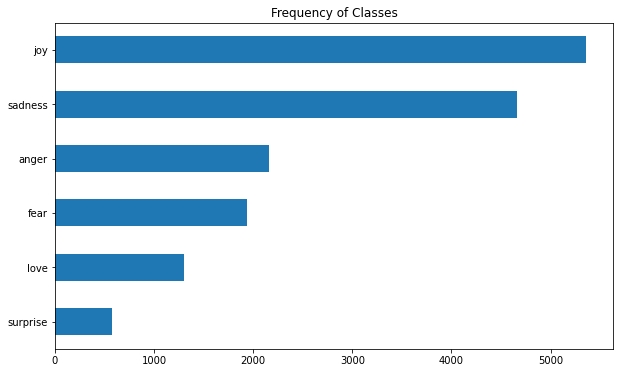
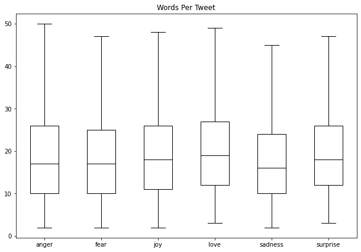
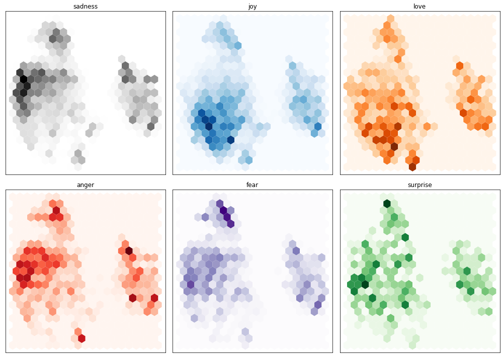
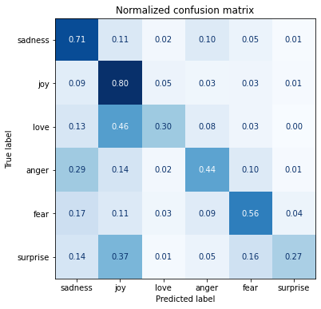
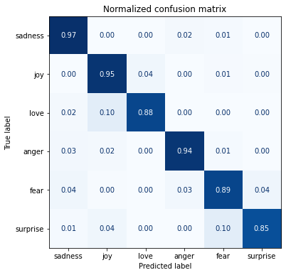
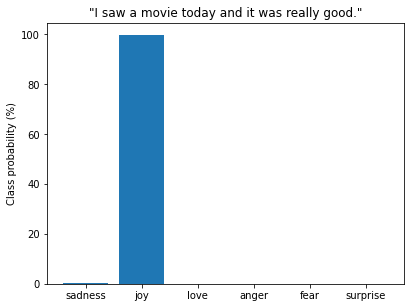
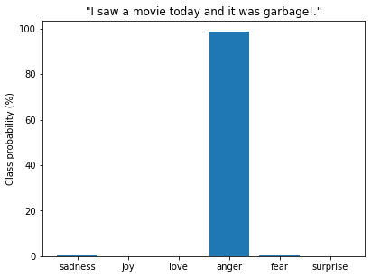
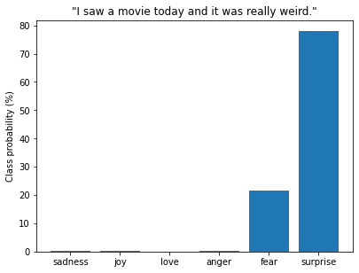

---
categories:
- ai
- huggingface
- nlp
- notes
date: 2022-4-1
description: Chapter 2 covers training a model to classify emotions expressed in Twitter
  messages.
hide: false
layout: post
search_exclude: false
title: Notes on Transformers Book Ch. 2
toc: false

---

* [Project: Analyze Product Sentiment on Twitter](#project-analyze-product-sentiment-on-twitter)
* [The Dataset](#the-dataset)
* [From Text to Tokens](#from-text-to-tokens)
* [Training a Text Classifier](#training-a-text-classifier)
* [Conclusion](#conclusion)
* [References](#references)

------

```python
import transformers
import datasets
import pandas as pd

# Only print error messages
transformers.logging.set_verbosity_error()
datasets.logging.set_verbosity_error()
```


```python
transformers.__version__
```
```text
    '4.11.3'
```

------

```python
pd.set_option('max_colwidth',None)
pd.set_option('display.max_rows', None)
pd.set_option('display.max_columns', None)
```

------


```python
import ast
# https://astor.readthedocs.io/en/latest/
import astor
import inspect
import textwrap
def print_source(obj, exclude_doc=True):
    
    # Get source code
    source = inspect.getsource(obj)
    # Remove any common leading whitespace from every line
    cleaned_source = textwrap.dedent(source)
    # Parse the source into an AST node.
    parsed = ast.parse(cleaned_source)

    for node in ast.walk(parsed):
        # Skip any nodes that are not class or function definitions
        if not isinstance(node, (ast.FunctionDef, ast.ClassDef, ast.AsyncFunctionDef)):
            continue
        
        if exclude_doc and len(node.body) > 1: node.body = node.body[1:]
        
    print(astor.to_source(parsed))
```


## Project: Analyze Product Sentiment on Twitter

- Sentiment analysis involves classifying the feelings or opinions expressed in a given text.
- The goal is to build a system that automatically classifies emotions expressed in Twitter messages about a product.
- A model will take a single tweet as input and assign one of the possible labels.
- Possible labels include anger, fear, joy, love, sadness, and surprise.
- The project will use a variant of BERT called DistilBERT.
- [DistilBERT, a distilled version of BERT: smaller, faster, cheaper and lighter](https://arxiv.org/abs/1910.01108)
    - DistilBERT achieves comparable accuracy to BERT while being significantly more efficient in size and speed.
    - DistilBERT was created in 2019 by researchers at Hugging Face.

### Hugging Face Project Pipeline:

1. Load and process datasets using the [Datasets](https://huggingface.co/docs/datasets/index) library.
2. Tokenize input texts using the [Tokenizers](https://huggingface.co/docs/tokenizers/python/latest/) library.
3. Load, train, and run models using the [Transformers](https://huggingface.co/docs/transformers/index) library.
4. Load metrics and evaluate models using the [Datasets](https://huggingface.co/docs/datasets/index) library.


## The Dataset

- [CARER: Contextualized Affect Representations for Emotion Recognition](https://aclanthology.org/D18-1404/)
    - The authors of the paper created an emotion dataset of English twitter messages.
    - The emotion dataset contains messages that express anger, fear, joy, love, sadness, or surprise.
    - Emoticons present in the tweets determine the initial labels.
    - A graph-based algorithm then uses these initial labels to construct contextualized, pattern-based emotion features.
    - Word embeddings help further enrich these features.
- [GitHub Repository](https://github.com/dair-ai/emotion_dataset)
- [Hugging Face Dataset Card](https://huggingface.co/datasets/emotion)

### A First Look at Hugging Face Datasets
* [GitHub Repository](https://github.com/huggingface/datasets)
* [Documentation](https://huggingface.co/docs/datasets/index)
* Hugging Face Datasets is based on [Apache Arrow](https://arrow.apache.org/).
    * Apache Arrow defines a typed columnar format that is more memory efficient than native Python.


```python
from datasets import list_datasets
```

------


```python
print_source(list_datasets, exclude_doc=True)
```
```text
    def list_datasets(with_community_datasets=True, with_details=False):
        datasets = huggingface_hub.list_datasets(full=with_details)
        if not with_community_datasets:
            datasets = [dataset for dataset in datasets if '/' not in dataset.id]
        if not with_details:
            datasets = [dataset.id for dataset in datasets]
        return datasets
```

------

```python
# Get a list of all the datasets scripts available on the Hugging Face Hub
all_datasets = list_datasets()
print(f"There are {len(all_datasets)} datasets currently available on the Hub")
print(f"The first 10 are: {all_datasets[:10]}")
```
```text
    There are 3896 datasets currently available on the Hub
    The first 10 are: ['acronym_identification', 'ade_corpus_v2', 'adversarial_qa', 'aeslc', 'afrikaans_ner_corpus', 'ag_news', 'ai2_arc', 'air_dialogue', 'ajgt_twitter_ar', 'allegro_reviews']
```

------


```python
from datasets import load_dataset
```

#### `load_dataset` 
* [Documentation](https://huggingface.co/docs/datasets/v2.0.0/en/package_reference/loading_methods#datasets.load_dataset)
* This method downloads and imports the loading script for the specified dataset.
* The script defines the citation, info, and format of the dataset, the URL to the original data files, and the code to load examples from the original files.
* The script downloads the dataset files and caches them in typed [Apache Arrow](https://arrow.apache.org/) tables.
* Several loading scripts are available to handle local and remote datasets.

#### Methods to Load Common Data Formats

| Data format | Loading script | Example                                            |
| :---------: | :------------: | -------------------------------------------------- |
|     CSV     |     `csv`      | `load_dataset("csv", data_files="my_file.csv")`    |
|    Text     |     `text`     | `load_dataset("text", data_files="my_file.txt")`   |
|    JSON     |     `json`     | `load_dataset("json", data_files="my_file.jsonl")` |

------


```python
print_source(load_dataset)
```
```text
    def load_dataset(path: str, name: Optional[str]=None, data_dir: Optional[
        str]=None, data_files: Optional[Union[str, Sequence[str], Mapping[str,
        Union[str, Sequence[str]]]]]=None, split: Optional[Union[str, Split]]=
        None, cache_dir: Optional[str]=None, features: Optional[Features]=None,
        download_config: Optional[DownloadConfig]=None, download_mode: Optional
        [GenerateMode]=None, ignore_verifications: bool=False, keep_in_memory:
        Optional[bool]=None, save_infos: bool=False, revision: Optional[Union[
        str, Version]]=None, use_auth_token: Optional[Union[bool, str]]=None,
        task: Optional[Union[str, TaskTemplate]]=None, streaming: bool=False,
        script_version='deprecated', **config_kwargs) ->Union[DatasetDict,
        Dataset, IterableDatasetDict, IterableDataset]:
        if script_version != 'deprecated':
            warnings.warn(
                "'script_version' was renamed to 'revision' in version 1.13 and will be removed in 1.15."
                , FutureWarning)
            revision = script_version
        ignore_verifications = ignore_verifications or save_infos
        builder_instance = load_dataset_builder(path=path, name=name, data_dir=
            data_dir, data_files=data_files, cache_dir=cache_dir, features=
            features, download_config=download_config, download_mode=
            download_mode, revision=revision, use_auth_token=use_auth_token, **
            config_kwargs)
        if streaming:
            extend_module_for_streaming(builder_instance.__module__,
                use_auth_token=use_auth_token)
            if not builder_instance.__module__.startswith('datasets.'):
                for imports in get_imports(inspect.getfile(builder_instance.
                    __class__)):
                    if imports[0] == 'internal':
                        internal_import_name = imports[1]
                        internal_module_name = '.'.join(builder_instance.
                            __module__.split('.')[:-1] + [internal_import_name])
                        extend_module_for_streaming(internal_module_name,
                            use_auth_token=use_auth_token)
            return builder_instance.as_streaming_dataset(split=split,
                use_auth_token=use_auth_token)
        try_from_hf_gcs = path not in _PACKAGED_DATASETS_MODULES
        builder_instance.download_and_prepare(download_config=download_config,
            download_mode=download_mode, ignore_verifications=
            ignore_verifications, try_from_hf_gcs=try_from_hf_gcs,
            use_auth_token=use_auth_token)
        keep_in_memory = (keep_in_memory if keep_in_memory is not None else
            is_small_dataset(builder_instance.info.dataset_size))
        ds = builder_instance.as_dataset(split=split, ignore_verifications=
            ignore_verifications, in_memory=keep_in_memory)
        if task is not None:
            ds = ds.prepare_for_task(task)
        if save_infos:
            builder_instance._save_infos()
        return ds
```


#### Automated Process


```python
# Download dataset from Hub
emotions = load_dataset("emotion")
```
------


```python
pd.DataFrame(list(emotions.cache_files.items()))
```
<div style="overflow-x:auto;">
<table border="1" class="dataframe">
  <thead>
    <tr style="text-align: right;">
      <th></th>
      <th>0</th>
      <th>1</th>
    </tr>
  </thead>
  <tbody>
    <tr>
      <th>0</th>
      <td>train</td>
      <td>[{'filename': '/home/innom-dt/.cache/huggingface/datasets/emotion/default/0.0.0/348f63ca8e27b3713b6c04d723efe6d824a56fb3d1449794716c0f0296072705/emotion-train.arrow'}]</td>
    </tr>
    <tr>
      <th>1</th>
      <td>validation</td>
      <td>[{'filename': '/home/innom-dt/.cache/huggingface/datasets/emotion/default/0.0.0/348f63ca8e27b3713b6c04d723efe6d824a56fb3d1449794716c0f0296072705/emotion-validation.arrow'}]</td>
    </tr>
    <tr>
      <th>2</th>
      <td>test</td>
      <td>[{'filename': '/home/innom-dt/.cache/huggingface/datasets/emotion/default/0.0.0/348f63ca8e27b3713b6c04d723efe6d824a56fb3d1449794716c0f0296072705/emotion-test.arrow'}]</td>
    </tr>
  </tbody>
</table>
</div>


#### Manual Process - Local


```python
# Get the download URLs
urls = list(emotions['train'].info.download_checksums.keys())
urls
```
```text
    ['https://www.dropbox.com/s/1pzkadrvffbqw6o/train.txt?dl=1',
     'https://www.dropbox.com/s/2mzialpsgf9k5l3/val.txt?dl=1',
     'https://www.dropbox.com/s/ikkqxfdbdec3fuj/test.txt?dl=1']
```

------

```python
# Download each dataset to current directory
for url in urls:
    # remove url parameters
    url = url.split('?')[0]
    # run the wget shell command in the jupyter notebook
    !wget $url
```
```text
    --2022-04-01 11:59:26--  https://www.dropbox.com/s/1pzkadrvffbqw6o/train.txt
    Resolving www.dropbox.com (www.dropbox.com)... 162.125.7.18, 2620:100:6017:18::a27d:212
    Connecting to www.dropbox.com (www.dropbox.com)|162.125.7.18|:443... connected.
    HTTP request sent, awaiting response... 301 Moved Permanently
    Location: /s/raw/1pzkadrvffbqw6o/train.txt [following]
    --2022-04-01 11:59:26--  https://www.dropbox.com/s/raw/1pzkadrvffbqw6o/train.txt
    Reusing existing connection to www.dropbox.com:443.
    HTTP request sent, awaiting response... 302 Found
    Location: https://ucd8bd8ccbe834141eed1bd4fe3f.dl.dropboxusercontent.com/cd/0/inline/BimHlqS8EcLnVO8-ErygeREvWupg-stxp_BKxrhhRBD8zXEOdQ5P-ssnFHFhv63Jx0wos3YwmuzmYs4Ex3iGW6lF430Y2yc4Y-ro00V20otuMPHh1I7x6YnZWmMe_xQOeM_-RNv_CbVeXC2wxDFZxE-TWzFuwjHo-RUy7RcwlYWMng/file# [following]
    --2022-04-01 11:59:26--  https://ucd8bd8ccbe834141eed1bd4fe3f.dl.dropboxusercontent.com/cd/0/inline/BimHlqS8EcLnVO8-ErygeREvWupg-stxp_BKxrhhRBD8zXEOdQ5P-ssnFHFhv63Jx0wos3YwmuzmYs4Ex3iGW6lF430Y2yc4Y-ro00V20otuMPHh1I7x6YnZWmMe_xQOeM_-RNv_CbVeXC2wxDFZxE-TWzFuwjHo-RUy7RcwlYWMng/file
    Resolving ucd8bd8ccbe834141eed1bd4fe3f.dl.dropboxusercontent.com (ucd8bd8ccbe834141eed1bd4fe3f.dl.dropboxusercontent.com)... 162.125.7.15, 2620:100:6017:15::a27d:20f
    Connecting to ucd8bd8ccbe834141eed1bd4fe3f.dl.dropboxusercontent.com (ucd8bd8ccbe834141eed1bd4fe3f.dl.dropboxusercontent.com)|162.125.7.15|:443... connected.
    HTTP request sent, awaiting response... 200 OK
    Length: 1658616 (1.6M) [text/plain]
    Saving to: ‘train.txt.8’
    
    train.txt.8         100%[===================>]   1.58M  --.-KB/s    in 0.1s    
    
    2022-04-01 11:59:27 (12.6 MB/s) - ‘train.txt.8’ saved [1658616/1658616]
    
    --2022-04-01 11:59:27--  https://www.dropbox.com/s/2mzialpsgf9k5l3/val.txt
    Resolving www.dropbox.com (www.dropbox.com)... 162.125.7.18, 2620:100:6017:18::a27d:212
    Connecting to www.dropbox.com (www.dropbox.com)|162.125.7.18|:443... connected.
    HTTP request sent, awaiting response... 301 Moved Permanently
    Location: /s/raw/2mzialpsgf9k5l3/val.txt [following]
    --2022-04-01 11:59:27--  https://www.dropbox.com/s/raw/2mzialpsgf9k5l3/val.txt
    Reusing existing connection to www.dropbox.com:443.
    HTTP request sent, awaiting response... 302 Found
    Location: https://ucd7c254cf6c0298b8fdea83c996.dl.dropboxusercontent.com/cd/0/inline/BinpUxjuQUPZKSAw9nVygw-6QF-JqzCuvRo2N8QqZPM8-Aqp5PxM0tHDJ3zclYqIKMhc_9_ORaLBDtdxeknAqfm_e3E0QJIYPA4tUpTQ7h31LAD_sc__6kyvioIZzjK61S5MlbTyM3YUMq3gPYMRH9_XE5gYrjnC1pddo3lRgrcUrg/file# [following]
    --2022-04-01 11:59:27--  https://ucd7c254cf6c0298b8fdea83c996.dl.dropboxusercontent.com/cd/0/inline/BinpUxjuQUPZKSAw9nVygw-6QF-JqzCuvRo2N8QqZPM8-Aqp5PxM0tHDJ3zclYqIKMhc_9_ORaLBDtdxeknAqfm_e3E0QJIYPA4tUpTQ7h31LAD_sc__6kyvioIZzjK61S5MlbTyM3YUMq3gPYMRH9_XE5gYrjnC1pddo3lRgrcUrg/file
    Resolving ucd7c254cf6c0298b8fdea83c996.dl.dropboxusercontent.com (ucd7c254cf6c0298b8fdea83c996.dl.dropboxusercontent.com)... 162.125.7.15, 2620:100:6017:15::a27d:20f
    Connecting to ucd7c254cf6c0298b8fdea83c996.dl.dropboxusercontent.com (ucd7c254cf6c0298b8fdea83c996.dl.dropboxusercontent.com)|162.125.7.15|:443... connected.
    HTTP request sent, awaiting response... 200 OK
    Length: 204240 (199K) [text/plain]
    Saving to: ‘val.txt.8’
    
    val.txt.8           100%[===================>] 199.45K  --.-KB/s    in 0.09s   
    
    2022-04-01 11:59:28 (2.23 MB/s) - ‘val.txt.8’ saved [204240/204240]
    
    --2022-04-01 11:59:28--  https://www.dropbox.com/s/ikkqxfdbdec3fuj/test.txt
    Resolving www.dropbox.com (www.dropbox.com)... 162.125.7.18, 2620:100:6017:18::a27d:212
    Connecting to www.dropbox.com (www.dropbox.com)|162.125.7.18|:443... connected.
    HTTP request sent, awaiting response... 301 Moved Permanently
    Location: /s/raw/ikkqxfdbdec3fuj/test.txt [following]
    --2022-04-01 11:59:28--  https://www.dropbox.com/s/raw/ikkqxfdbdec3fuj/test.txt
    Reusing existing connection to www.dropbox.com:443.
    HTTP request sent, awaiting response... 302 Found
    Location: https://uc6a6ed094f33148a8d600d0bd94.dl.dropboxusercontent.com/cd/0/inline/BileG7vM49CD4NPqfWBG0td8OcodftXS6fihHcq6NCZrPE8Xn9puhgIP1mCk-KXlQnwxW_3WTCdvFmmavZXbvU5qj_mu4PoCB4quNit8j4vVynpa3QWMxcPTiHfQB8UgZaKz319rr67HSjySTKFR1xvmTxTwZIsB0Ixss_Bem8ixQg/file# [following]
    --2022-04-01 11:59:28--  https://uc6a6ed094f33148a8d600d0bd94.dl.dropboxusercontent.com/cd/0/inline/BileG7vM49CD4NPqfWBG0td8OcodftXS6fihHcq6NCZrPE8Xn9puhgIP1mCk-KXlQnwxW_3WTCdvFmmavZXbvU5qj_mu4PoCB4quNit8j4vVynpa3QWMxcPTiHfQB8UgZaKz319rr67HSjySTKFR1xvmTxTwZIsB0Ixss_Bem8ixQg/file
    Resolving uc6a6ed094f33148a8d600d0bd94.dl.dropboxusercontent.com (uc6a6ed094f33148a8d600d0bd94.dl.dropboxusercontent.com)... 162.125.7.15, 2620:100:6017:15::a27d:20f
    Connecting to uc6a6ed094f33148a8d600d0bd94.dl.dropboxusercontent.com (uc6a6ed094f33148a8d600d0bd94.dl.dropboxusercontent.com)|162.125.7.15|:443... connected.
    HTTP request sent, awaiting response... 200 OK
    Length: 206760 (202K) [text/plain]
    Saving to: ‘test.txt.8’
    
    test.txt.8          100%[===================>] 201.91K  --.-KB/s    in 0.07s   
    
    2022-04-01 11:59:29 (2.95 MB/s) - ‘test.txt.8’ saved [206760/206760]
```

------

```python
!head -5 train.txt
```
```text
    i didnt feel humiliated;sadness
    i can go from feeling so hopeless to so damned hopeful just from being around someone who cares and is awake;sadness
    im grabbing a minute to post i feel greedy wrong;anger
    i am ever feeling nostalgic about the fireplace i will know that it is still on the property;love
    i am feeling grouchy;anger
```

------


```python
dataset_names = ['train', 'validation', 'test']
file_names = [url.split('?')[0].split('/')[-1] for url in urls]
data_files={name:file for name,file in zip(dataset_names, file_names)}
data_files
```
```text
    {'train': 'train.txt', 'validation': 'val.txt', 'test': 'test.txt'}
```

------

```python
emotions_local = load_dataset("csv", data_files=data_files, sep=";", names=["text", "label"])
```
------


```python
emotions_local
```
```text
    DatasetDict({
        train: Dataset({
            features: ['text', 'label'],
            num_rows: 16000
        })
        validation: Dataset({
            features: ['text', 'label'],
            num_rows: 2000
        })
        test: Dataset({
            features: ['text', 'label'],
            num_rows: 2000
        })
    })
```

------

```python
pd.DataFrame(list(emotions_local.cache_files.items()))
```
<div style="overflow-x:auto;">
<table border="1" class="dataframe">
  <thead>
    <tr style="text-align: right;">
      <th></th>
      <th>0</th>
      <th>1</th>
    </tr>
  </thead>
  <tbody>
    <tr>
      <th>0</th>
      <td>train</td>
      <td>[{'filename': '/home/innom-dt/.cache/huggingface/datasets/csv/default-88fded83f2f02d15/0.0.0/bf68a4c4aefa545d0712b2fcbb1b327f905bbe2f6425fbc5e8c25234acb9e14a/csv-train.arrow'}]</td>
    </tr>
    <tr>
      <th>1</th>
      <td>validation</td>
      <td>[{'filename': '/home/innom-dt/.cache/huggingface/datasets/csv/default-88fded83f2f02d15/0.0.0/bf68a4c4aefa545d0712b2fcbb1b327f905bbe2f6425fbc5e8c25234acb9e14a/csv-validation.arrow'}]</td>
    </tr>
    <tr>
      <th>2</th>
      <td>test</td>
      <td>[{'filename': '/home/innom-dt/.cache/huggingface/datasets/csv/default-88fded83f2f02d15/0.0.0/bf68a4c4aefa545d0712b2fcbb1b327f905bbe2f6425fbc5e8c25234acb9e14a/csv-test.arrow'}]</td>
    </tr>
  </tbody>
</table>
</div>


#### Manual Process - Remote


```python
data_files = {name:url for name,url in zip(dataset_names,urls)}
data_files
```
```text
    {'train': 'https://www.dropbox.com/s/1pzkadrvffbqw6o/train.txt?dl=1',
     'validation': 'https://www.dropbox.com/s/2mzialpsgf9k5l3/val.txt?dl=1',
     'test': 'https://www.dropbox.com/s/ikkqxfdbdec3fuj/test.txt?dl=1'}
```

------

```python
emotions_remote = load_dataset("csv", data_files=data_files, sep=";", names=["text", "label"])
```
------


```python
emotions_remote
```
```text
    DatasetDict({
        train: Dataset({
            features: ['text', 'label'],
            num_rows: 16000
        })
        validation: Dataset({
            features: ['text', 'label'],
            num_rows: 2000
        })
        test: Dataset({
            features: ['text', 'label'],
            num_rows: 2000
        })
    })
```

------

```python
pd.DataFrame(list(emotions_remote.cache_files.items()))
```
<div style="overflow-x:auto;">
<table border="1" class="dataframe">
  <thead>
    <tr style="text-align: right;">
      <th></th>
      <th>0</th>
      <th>1</th>
    </tr>
  </thead>
  <tbody>
    <tr>
      <th>0</th>
      <td>train</td>
      <td>[{'filename': '/home/innom-dt/.cache/huggingface/datasets/csv/default-6e495c0980795f6b/0.0.0/bf68a4c4aefa545d0712b2fcbb1b327f905bbe2f6425fbc5e8c25234acb9e14a/csv-train.arrow'}]</td>
    </tr>
    <tr>
      <th>1</th>
      <td>validation</td>
      <td>[{'filename': '/home/innom-dt/.cache/huggingface/datasets/csv/default-6e495c0980795f6b/0.0.0/bf68a4c4aefa545d0712b2fcbb1b327f905bbe2f6425fbc5e8c25234acb9e14a/csv-validation.arrow'}]</td>
    </tr>
    <tr>
      <th>2</th>
      <td>test</td>
      <td>[{'filename': '/home/innom-dt/.cache/huggingface/datasets/csv/default-6e495c0980795f6b/0.0.0/bf68a4c4aefa545d0712b2fcbb1b327f905bbe2f6425fbc5e8c25234acb9e14a/csv-test.arrow'}]</td>
    </tr>
  </tbody>
</table>
</div>


#### `DatasetDict`
* [Documentation](https://huggingface.co/docs/datasets/v2.0.0/en/package_reference/main_classes#datasets.DatasetDict)
* A dictionary (dict of str: datasets.Dataset) with dataset transforms methods (map, filter, etc.)

------


```python
emotions
```
```text
    DatasetDict({
        train: Dataset({
            features: ['text', 'label'],
            num_rows: 16000
        })
        validation: Dataset({
            features: ['text', 'label'],
            num_rows: 2000
        })
        test: Dataset({
            features: ['text', 'label'],
            num_rows: 2000
        })
    })
```


**Note:** The data is already split into training, validation, and test sets.

#### `Dataset`
* [Documentation](https://huggingface.co/docs/datasets/v2.0.0/en/package_reference/main_classes#datasets.Dataset)
* The base class datasets.Dataset implements a Dataset backed by an Apache Arrow table.
* Behaves like an ordinary Python array or list.

------


```python
train_ds = emotions["train"]
train_ds
```
```text
    Dataset({
        features: ['text', 'label'],
        num_rows: 16000
    })
```

------

```python
len(train_ds)
```
```text
    16000
```

------

```python
train_ds[0]
```
```text
    {'text': 'i didnt feel humiliated', 'label': 0}
```

------

```python
train_ds.column_names
```
```text
    ['text', 'label']
```

------

```python
# Check the data types used for text and labels.
print(train_ds.features)
```
```text
    {'text': Value(dtype='string', id=None), 'label': ClassLabel(num_classes=6, names=['sadness', 'joy', 'love', 'anger', 'fear', 'surprise'], names_file=None, id=None)}
```

------

#### `ClassLabel`

* [Documentation](https://huggingface.co/docs/datasets/v2.0.0/en/package_reference/main_classes#datasets.ClassLabel)
* Feature type for integer class labels.
* This class provides methods to convert integer labels to strings and strings to integer labels. 

------


```python
datasets.ClassLabel
```
```text
    datasets.features.features.ClassLabel
```

------

#### `Value`

* [Documentation](https://huggingface.co/docs/datasets/v2.0.0/en/package_reference/main_classes#datasets.Value)

------


```python
datasets.Value
```
```text
    datasets.features.features.Value
```

------

```python
print_source(datasets.Value, False)
```
```text
    @dataclass
    class Value:
        """
        The Value dtypes are as follows:
    
        null
        bool
        int8
        int16
        int32
        int64
        uint8
        uint16
        uint32
        uint64
        float16
        float32 (alias float)
        float64 (alias double)
        timestamp[(s|ms|us|ns)]
        timestamp[(s|ms|us|ns), tz=(tzstring)]
        binary
        large_binary
        string
        large_string
        """
        dtype: str
        id: Optional[str] = None
        pa_type: ClassVar[Any] = None
        _type: str = field(default='Value', init=False, repr=False)
    
        def __post_init__(self):
            if self.dtype == 'double':
                self.dtype = 'float64'
            if self.dtype == 'float':
                self.dtype = 'float32'
            self.pa_type = string_to_arrow(self.dtype)
    
        def __call__(self):
            return self.pa_type
    
        def encode_example(self, value):
            if pa.types.is_boolean(self.pa_type):
                return bool(value)
            elif pa.types.is_integer(self.pa_type):
                return int(value)
            elif pa.types.is_floating(self.pa_type):
                return float(value)
            elif pa.types.is_string(self.pa_type):
                return str(value)
            else:
                return value
```


### From Datasets to DataFrames
* Hugging Face Datasets provides a `set_format` method to convert Datasets objects to Pandas DataFrames.
* The underlying data format is still an Arrow table.

#### `DatasetDict.set_format`
* [Documentation](https://huggingface.co/docs/datasets/v2.0.0/en/package_reference/main_classes#datasets.DatasetDict.set_format)
* Set the format for every Dataset object in the dictionary.

------


```python
print_source(datasets.DatasetDict.set_format, exclude_doc=True)
```
```text
    def set_format(self, type: Optional[str]=None, columns: Optional[List]=None,
        output_all_columns: bool=False, **format_kwargs):
        self._check_values_type()
        for dataset in self.values():
            dataset.set_format(type=type, columns=columns, output_all_columns=
                output_all_columns, **format_kwargs)
```


#### `Dataset.set_format`
* [Documentation](https://huggingface.co/docs/datasets/v2.0.0/en/package_reference/main_classes#datasets.Dataset.set_format)
* Set the [`__getitem__`](https://docs.python.org/3/reference/datamodel.html#object.__getitem__) return format.
    * `None` (Python object), `numpy`, `torch`, `tensorflow`, `pandas`, `arrow`

------


```python
print_source(datasets.Dataset.set_format, exclude_doc=True)
```
```text
    @fingerprint_transform(inplace=True)
    def set_format(self, type: Optional[str]=None, columns: Optional[List]=None,
        output_all_columns: bool=False, **format_kwargs):
        format_kwargs.update(format_kwargs.pop('format_kwargs', {}))
        type = get_format_type_from_alias(type)
        _ = get_formatter(type, features=self.features, **format_kwargs)
        if isinstance(columns, str):
            columns = [columns]
        if isinstance(columns, tuple):
            columns = list(columns)
        if columns is not None and any(col not in self._data.column_names for
            col in columns):
            raise ValueError(
                f'Columns {list(filter(lambda col: col not in self._data.column_names, columns))} not in the dataset. Current columns in the dataset: {self._data.column_names}'
                )
        if columns is not None:
            columns = columns.copy()
        self._format_type = type
        self._format_kwargs = format_kwargs
        self._format_columns = columns
        self._output_all_columns = output_all_columns
        logger.debug(
            'Set __getitem__(key) output type to %s for %s columns  (when key is int or slice) and %s output other (un-formatted) columns.'
            , 'python objects' if type is None else type, 'no' if columns is
            None else str(columns), 'do' if output_all_columns else "don't")
```

------

```python
emotions.set_format(type="pandas")
df = emotions["train"][:]
df.head()
```
<div style="overflow-x:auto;">
<table border="1" class="dataframe">
  <thead>
    <tr style="text-align: right;">
      <th></th>
      <th>text</th>
      <th>label</th>
    </tr>
  </thead>
  <tbody>
    <tr>
      <th>0</th>
      <td>i didnt feel humiliated</td>
      <td>0</td>
    </tr>
    <tr>
      <th>1</th>
      <td>i can go from feeling so hopeless to so damned hopeful just from being around someone who cares and is awake</td>
      <td>0</td>
    </tr>
    <tr>
      <th>2</th>
      <td>im grabbing a minute to post i feel greedy wrong</td>
      <td>3</td>
    </tr>
    <tr>
      <th>3</th>
      <td>i am ever feeling nostalgic about the fireplace i will know that it is still on the property</td>
      <td>2</td>
    </tr>
    <tr>
      <th>4</th>
      <td>i am feeling grouchy</td>
      <td>3</td>
    </tr>
  </tbody>
</table>
</div>


#### `ClassLabel.int2str`
* [Documentation](https://huggingface.co/docs/datasets/v2.0.0/en/package_reference/main_classes#datasets.ClassLabel.int2str)
* Convert an integer label to the corresponding class name string.

------


```python
print_source(datasets.ClassLabel.int2str)
```
```text
    def int2str(self, values: Union[int, Iterable]):
        assert isinstance(values, int) or isinstance(values, Iterable
            ), f'Values {values} should be an integer or an Iterable (list, numpy array, pytorch, tensorflow tensors)'
        return_list = True
        if isinstance(values, int):
            values = [values]
            return_list = False
        for v in values:
            if not 0 <= v < self.num_classes:
                raise ValueError(f'Invalid integer class label {v:d}')
        if self._int2str:
            output = [self._int2str[int(v)] for v in values]
        else:
            output = [str(v) for v in values]
        return output if return_list else output[0]
```

------

```python
# Get the corresponding emotion name
def label_int2str(row):
    return emotions["train"].features["label"].int2str(row)
# Add a new column with the corresponding emotion name
df["emotion"] = df["label"].apply(label_int2str)
df.head()
```
<div style="overflow-x:auto;">
<table border="1" class="dataframe">
  <thead>
    <tr style="text-align: right;">
      <th></th>
      <th>text</th>
      <th>label</th>
      <th>emotion</th>
    </tr>
  </thead>
  <tbody>
    <tr>
      <th>0</th>
      <td>i didnt feel humiliated</td>
      <td>0</td>
      <td>sadness</td>
    </tr>
    <tr>
      <th>1</th>
      <td>i can go from feeling so hopeless to so damned hopeful just from being around someone who cares and is awake</td>
      <td>0</td>
      <td>sadness</td>
    </tr>
    <tr>
      <th>2</th>
      <td>im grabbing a minute to post i feel greedy wrong</td>
      <td>3</td>
      <td>anger</td>
    </tr>
    <tr>
      <th>3</th>
      <td>i am ever feeling nostalgic about the fireplace i will know that it is still on the property</td>
      <td>2</td>
      <td>love</td>
    </tr>
    <tr>
      <th>4</th>
      <td>i am feeling grouchy</td>
      <td>3</td>
      <td>anger</td>
    </tr>
  </tbody>
</table>
</div>


### Looking at the Class Distribution
* [A Recipe for Training Neural Networks](https://karpathy.github.io/2019/04/25/recipe/)
    * The first step to training a neural network involves thoroughly inspecting the data.
    * Understand the distribution of the training examples and look for patterns.
* Datasets with skewed class distribution might require a different treatment regarding the training loss and evaluation metrics.

------


```python
import matplotlib.pyplot as plt
```


```python
# Increase the figure size
plt.rcParams["figure.figsize"] = (10,6)
# Create a horizontal bar chart
df["emotion"].value_counts(ascending=True).plot.barh()
plt.title("Frequency of Classes")
plt.show()
# Reset the figure size
plt.rcParams["figure.figsize"] = plt.rcParamsDefault["figure.figsize"]
```



**Note:** Messages expressing joy and sadness are about 5-10 times more common than messages expressing love and surprise.

#### Methods to Deal with Imbalanced Data
* Randomly oversample the minority class.
* Randomly undersample the majority class.
* Gather more labeled data from the underrepresented classes.

#### imbalanced-learn
* [Documentation](https://imbalanced-learn.org/stable/)
* This library extends scikit-learn and provides tools for dealing with imbalanced classes.

### How Long Are Our Tweets?
* Transformer models have a maximum input sequence length called the maximum context size.
* The maximum context size for DistilBERT is 512 tokens, which is roughly equivalent to a few paragraphs of text.
* We need to [truncate](https://huggingface.co/docs/transformers/preprocessing#truncation) pieces of text that do not fit in a model's context size, which might remove crucial information.
* We can approximate the number of tokens per twee for each emotion by looking at the distribution of words per tweet.

------


```python
# Increase the figure size
plt.rcParams["figure.figsize"] = (10,7)
# Create a new column containing the number of words for each tweet
df["Words Per Tweet"] = df["text"].str.split().apply(len)
# Create a box plot
df.boxplot("Words Per Tweet", by="emotion", grid=False, showfliers=False, color="black")
plt.suptitle("")
plt.xlabel("")
plt.show()
# Reset the figure size
plt.rcParams["figure.figsize"] = plt.rcParamsDefault["figure.figsize"]
```



**Note:** Most tweets are between 15 and 20 words long, with a max length of around 50 words.

#### `DatasetDict.reset_format()`
* [Documentation](https://huggingface.co/docs/datasets/v2.0.0/en/package_reference/main_classes#datasets.DatasetDict.reset_format)
* return format to python objects for all datasets in the dictionary
* calls `set_format` with the default arguments

------


```python
datasets.DatasetDict.reset_format
```
```text
    <function datasets.dataset_dict.DatasetDict.reset_format(self)>
```

------

```python
print_source(datasets.DatasetDict.reset_format)
```
```text
    def reset_format(self):
        self._check_values_type()
        for dataset in self.values():
            dataset.set_format()
```

------

```python
print_source(datasets.Dataset.reset_format)
```
```text
    def reset_format(self):
        self.set_format()
```

------

```python
emotions.reset_format()
```


## From Text to Tokens

* Transformer models cannot receive raw strings as input.
* Text first needs to be tokenized and encoded as numerical vectors.
* The three main tokenization strategies are character tokenization, word tokenization, and subword tokenization.

**IMPORTANT:** Use the same tokenizer when training, fine-tuning, and performing inference with a given model.

### Character Tokenization
* Character-based tokenizers split the text into single characters.
* Character tokenization results in a smaller vocabulary and much fewer out-of-vocabulary tokens.
* It also results in a much higher number of tokens for a given input sequence.
* A character-based representation is less meaningful compared to using words.
* The model needs to learn linguistic structures like words from the data, making training more expensive. 
* Most projects do not use character tokenization.

------


```python
text = "Tokenizing text is a core task of NLP."
tokenized_text = list(text)
print(tokenized_text)
```
```text
    ['T', 'o', 'k', 'e', 'n', 'i', 'z', 'i', 'n', 'g', ' ', 't', 'e', 'x', 't', ' ', 'i', 's', ' ', 'a', ' ', 'c', 'o', 'r', 'e', ' ', 't', 'a', 's', 'k', ' ', 'o', 'f', ' ', 'N', 'L', 'P', '.']
```

### Numericalization
* Models can only process numbers, so we need to encode tokens as numerical data.
* A simple encoding method is to convert each unique token to a unique integer.

------


```python
# Map each unique token to a unique integer
token2idx = {ch: idx for idx, ch in enumerate(sorted(set(tokenized_text)))}
print(token2idx)
```
```text
    {' ': 0, '.': 1, 'L': 2, 'N': 3, 'P': 4, 'T': 5, 'a': 6, 'c': 7, 'e': 8, 'f': 9, 'g': 10, 'i': 11, 'k': 12, 'n': 13, 'o': 14, 'r': 15, 's': 16, 't': 17, 'x': 18, 'z': 19}
```

------


```python
# Encode the tokenized text
input_ids = [token2idx[token] for token in tokenized_text]
print(input_ids)
```
```text
    [5, 14, 12, 8, 13, 11, 19, 11, 13, 10, 0, 17, 8, 18, 17, 0, 11, 16, 0, 6, 0, 7, 14, 15, 8, 0, 17, 6, 16, 12, 0, 14, 9, 0, 3, 2, 4, 1]
```

### One-hot Encoding
* It is common to encode categorical variables as one-hot vectors, where a single entry has the value 1, and every other entry has the value 0.
* One-hot encoding can help prevent the model from learning undesired relationships like fictitious ordering between names.

------


```python
# Sample categorical data
categorical_df = pd.DataFrame(
    {"Name": ["Bumblebee", "Optimus Prime", "Megatron"], "Label ID": [0,1,2]})
categorical_df
```
<div style="overflow-x:auto;">
<table border="1" class="dataframe">
  <thead>
    <tr style="text-align: right;">
      <th></th>
      <th>Name</th>
      <th>Label ID</th>
    </tr>
  </thead>
  <tbody>
    <tr>
      <th>0</th>
      <td>Bumblebee</td>
      <td>0</td>
    </tr>
    <tr>
      <th>1</th>
      <td>Optimus Prime</td>
      <td>1</td>
    </tr>
    <tr>
      <th>2</th>
      <td>Megatron</td>
      <td>2</td>
    </tr>
  </tbody>
</table>
</div>


**Note:** A model might interpret the order of values in the `Label ID` column as significant.


```python
# Create one-hot vectors for each unique value in the Name column
pd.get_dummies(categorical_df["Name"])
```
<div style="overflow-x:auto;">
<table border="1" class="dataframe">
  <thead>
    <tr style="text-align: right;">
      <th></th>
      <th>Bumblebee</th>
      <th>Megatron</th>
      <th>Optimus Prime</th>
    </tr>
  </thead>
  <tbody>
    <tr>
      <th>0</th>
      <td>1</td>
      <td>0</td>
      <td>0</td>
    </tr>
    <tr>
      <th>1</th>
      <td>0</td>
      <td>0</td>
      <td>1</td>
    </tr>
    <tr>
      <th>2</th>
      <td>0</td>
      <td>1</td>
      <td>0</td>
    </tr>
  </tbody>
</table>
</div>


**Note:** We can use this approach to prevent the model from learning similar undesired relationships in the `input_ids` list.


```python
import torch
import torch.nn.functional as F
```

#### PyTorch `one_hot`:
* [Documentation](https://pytorch.org/docs/stable/generated/torch.nn.functional.one_hot.html)
* Generate one-hot encodings for a tensor with a specified number of classes

------


```python
len(input_ids), len(token2idx)
```
```text
    (38, 20)
```

------

```python
# Convert input_ids list to a tensor
input_ids = torch.tensor(input_ids)
# Generate one-hot encodings
one_hot_encodings = F.one_hot(input_ids, num_classes=len(token2idx))
one_hot_encodings.shape
```
```text
    torch.Size([38, 20])
```


**Note:** Make sure to set `num_classes` to the vocabulary size.


```python
print(f"Token: {tokenized_text[0]}")
print(f"Tensor index: {input_ids[0]}")
print(f"One-hot: {one_hot_encodings[0]}")
```
```text
    Token: T
    Tensor index: 5
    One-hot: tensor([0, 0, 0, 0, 0, 1, 0, 0, 0, 0, 0, 0, 0, 0, 0, 0, 0, 0, 0, 0])
```

### Word Tokenization
* Word-based tokenizers split the text into words and map each word to an integer.
* Word tokenization creates less work for the model as it does not need to learn such linguistic structures from the data.
* There is a loss of meaning across very similar words.
* User-defined rules tell the tokenizer how to split the raw text into words.
* A simple tokenization method is to split text using whitespace.
* More sophisticated word tokenizers have additional rules to handle punctuation.
* Other methods involve [stemming or lemmatization](https://www.youtube.com/watch?v=tG3pUwmGjsc&t=621s) to normalize words to their stem.
    * Example: "great", "greater", and "greatest" all become "great"
    * These methods come at the expense of losing some information in the text.
* Word tokenization results in a bigger vocabulary size, which requires more model parameters.
    * The first layer for a model that compressed the input vectors for a vocabulary with one million unique words to one thousand dimensional vectors would contain one billion weights.
* A popular method to limit the vocabulary size involves only adding the 100,000 most common words in the corpus.
    * Words that are not part of the vocabulary are classified as unknown and mapped to a shared token.
    * This approach risks losing potentially important information related to rare words.

------


```python
tokenized_text = text.split()
print(tokenized_text)
```
```text
    ['Tokenizing', 'text', 'is', 'a', 'core', 'task', 'of', 'NLP.']
```

### Subword Tokenization
* Subword tokenization algorithms decompose rare words into meaningful subwords while keeping the most frequently used words as unique entities.
* Subword tokenization algorithms can identify start-of-word tokens.
* Most state-of-the-art English models use subword-tokenization.
* Subword tokenization helps keep vocabulary size and input length manageable by sharing information across different words.
* There are several tokenization methods used in NLP.
    * The tokenizers for both the BERT and DistilBERT models use [WordPiece](https://paperswithcode.com/method/wordpiece).
    * GPT-2 uses [Byte Pair Encoding](https://paperswithcode.com/method/bpe).
    * Several multilingual models use [SentencePiece](https://paperswithcode.com/method/sentencepiece) or [Unigram Segmentation](https://paperswithcode.com/method/unigram-segmentation).

------


```python
from transformers import AutoTokenizer
```

#### `AutoTokenizer`
* [Documentation](https://huggingface.co/docs/transformers/main/en/model_doc/auto#transformers.AutoTokenizer)
* Quickly load the tokenizer associated with a pretrained model.
* AutoTokenizer belongs to a set of [auto classes](https://huggingface.co/docs/transformers/model_doc/auto) that automatically retrieve the model's configuration, pretrained weights, or vocabulary from the name of a checkpoint.

------


```python
AutoTokenizer
```
```text
    transformers.models.auto.tokenization_auto.AutoTokenizer
```

------

```python
model_ckpt = "distilbert-base-uncased"
tokenizer = AutoTokenizer.from_pretrained(model_ckpt)
```

**Note:** Hugging Face automatically caches the parameters of the pretrained tokenizer after the first download.

------

```python
type(tokenizer)
```
```text
transformers.models.distilbert.tokenization_distilbert_fast.DistilBertTokenizerFast
```


#### `DistilBertTokenizerFast`
* [Documentation](https://huggingface.co/docs/transformers/main/en/model_doc/distilbert#transformers.DistilBertTokenizerFast)
* Construct a "fast" DistilBERT tokenizer that runs end-to-end tokenization, including punctuation and WordPiece.

------


```python
tokenizer
```
```text
    PreTrainedTokenizerFast(name_or_path='distilbert-base-uncased', vocab_size=30522, model_max_len=512, is_fast=True, padding_side='right', special_tokens={'unk_token': '[UNK]', 'sep_token': '[SEP]', 'pad_token': '[PAD]', 'cls_token': '[CLS]', 'mask_token': '[MASK]'})
```

------

```python
tokenizer.init_kwargs
```
```text
    {'do_lower_case': True,
     'unk_token': '[UNK]',
     'sep_token': '[SEP]',
     'pad_token': '[PAD]',
     'cls_token': '[CLS]',
     'mask_token': '[MASK]',
     'tokenize_chinese_chars': True,
     'strip_accents': None,
     'model_max_length': 512,
     'special_tokens_map_file': None,
     'name_or_path': 'distilbert-base-uncased'}
```

------

```python
print(text)
```
```text
    Tokenizing text is a core task of NLP.
```

------


```python
# Map the raw text content to unique integers
encoded_text = tokenizer(text)
print(encoded_text)
```
```text
    {'input_ids': [101, 19204, 6026, 3793, 2003, 1037, 4563, 4708, 1997, 17953, 2361, 1012, 102], 'attention_mask': [1, 1, 1, 1, 1, 1, 1, 1, 1, 1, 1, 1, 1]}
```

#### `convert_ids_to_tokens`
* [Documentation](https://huggingface.co/docs/transformers/main/en/main_classes/tokenizer#transformers.PreTrainedTokenizerFast.convert_ids_to_tokens)
* Convert a single index or a sequence of indices in a token or a sequence of tokens, using the vocabulary and added tokens.

------


```python
print_source(tokenizer.convert_ids_to_tokens)
```
```text
    def convert_ids_to_tokens(self, ids: Union[int, List[int]],
        skip_special_tokens: bool=False) ->Union[str, List[str]]:
        if isinstance(ids, int):
            return self._tokenizer.id_to_token(ids)
        tokens = []
        for index in ids:
            index = int(index)
            if skip_special_tokens and index in self.all_special_ids:
                continue
            tokens.append(self._tokenizer.id_to_token(index))
        return tokens
```

------

```python
# Convert integer ids to tokens
tokens = tokenizer.convert_ids_to_tokens(encoded_text.input_ids)
print(tokens)
```
```text
    ['[CLS]', 'token', '##izing', 'text', 'is', 'a', 'core', 'task', 'of', 'nl', '##p', '.', '[SEP]']
```

**Note:**
1. The `[CLS]` and `[SEP]` tokens indicate the start and end of a sequence respectively.
2. All the tokens are lower case.
3. The words "tokenizing" and "NLP" have been decomposed into subwords since they are rare.
4. The `##` prefix indicates the preceding string was not whitespace.

------


```python
# Convert tokens to plain text
print(tokenizer.convert_tokens_to_string(tokens))
```
```text
    [CLS] tokenizing text is a core task of nlp. [SEP]
```

------


```python
print_source(tokenizer.convert_tokens_to_string)
```
```text
    def convert_tokens_to_string(self, tokens: List[str]) ->str:
        return self.backend_tokenizer.decoder.decode(tokens)
```

------

```python
tokenizer.vocab_size
```
```text
    30522
```

------

```python
tokenizer.model_max_length
```
```text
    512
```

------

```python
tokenizer.model_input_names
```
```text
    ['input_ids', 'attention_mask']
```


### Tokenizing the Whole Dataset
* We need to define a processing function to tokenize training examples.

------


```python
def tokenize(batch):
    # Apply the tokenizer to a batch of examples
    return tokenizer(batch["text"],
                     # Pad examples with zeros to the longest one in the batch
                     padding=True, 
                     # Truncate the examples to the model's maximum context size
                     truncation=True)
```


```python
print(tokenize(emotions["train"][:2]))
```
```text
    {'input_ids': [[101, 1045, 2134, 2102, 2514, 26608, 102, 0, 0, 0, 0, 0, 0, 0, 0, 0, 0, 0, 0, 0, 0, 0, 0], [101, 1045, 2064, 2175, 2013, 3110, 2061, 20625, 2000, 2061, 9636, 17772, 2074, 2013, 2108, 2105, 2619, 2040, 14977, 1998, 2003, 8300, 102]], 'attention_mask': [[1, 1, 1, 1, 1, 1, 1, 0, 0, 0, 0, 0, 0, 0, 0, 0, 0, 0, 0, 0, 0, 0, 0], [1, 1, 1, 1, 1, 1, 1, 1, 1, 1, 1, 1, 1, 1, 1, 1, 1, 1, 1, 1, 1, 1, 1]]}
```

**Note:** 
1. The zeros have a corresponding `[PAD]` token in the vocabulary.
2. The attention mask allows the model to ignore padded parts of the input.

------


```python
tokens2ids = list(zip(tokenizer.all_special_tokens, tokenizer.all_special_ids))
data = sorted(tokens2ids, key=lambda x : x[-1])
df = pd.DataFrame(data, columns=["Special Token", "Special Token ID"])
df.T
```
<div style="overflow-x:auto;">
<table border="1" class="dataframe">
  <thead>
    <tr style="text-align: right;">
      <th></th>
      <th>0</th>
      <th>1</th>
      <th>2</th>
      <th>3</th>
      <th>4</th>
    </tr>
  </thead>
  <tbody>
    <tr>
      <th>Special Token</th>
      <td>[PAD]</td>
      <td>[UNK]</td>
      <td>[CLS]</td>
      <td>[SEP]</td>
      <td>[MASK]</td>
    </tr>
    <tr>
      <th>Special Token ID</th>
      <td>0</td>
      <td>100</td>
      <td>101</td>
      <td>102</td>
      <td>103</td>
    </tr>
  </tbody>
</table>
</div>


#### `DatasetDict.map`
* [Documentation](https://huggingface.co/docs/datasets/v2.0.0/en/package_reference/main_classes#datasets.DatasetDict.map)
* Apply a function to all the elements in the tables for all datasets in the dictionary.

------


```python
print_source(datasets.DatasetDict.map)
```
```text
    def map(self, function, with_indices: bool=False, input_columns: Optional[
        Union[str, List[str]]]=None, batched: bool=False, batch_size: Optional[
        int]=1000, remove_columns: Optional[Union[str, List[str]]]=None,
        keep_in_memory: bool=False, load_from_cache_file: bool=True,
        cache_file_names: Optional[Dict[str, Optional[str]]]=None,
        writer_batch_size: Optional[int]=1000, features: Optional[Features]=
        None, disable_nullable: bool=False, fn_kwargs: Optional[dict]=None,
        num_proc: Optional[int]=None, desc: Optional[str]=None) ->'DatasetDict':
        self._check_values_type()
        if cache_file_names is None:
            cache_file_names = {k: None for k in self}
        return DatasetDict({k: dataset.map(function=function, with_indices=
            with_indices, input_columns=input_columns, batched=batched,
            batch_size=batch_size, remove_columns=remove_columns,
            keep_in_memory=keep_in_memory, load_from_cache_file=
            load_from_cache_file, cache_file_name=cache_file_names[k],
            writer_batch_size=writer_batch_size, features=features,
            disable_nullable=disable_nullable, fn_kwargs=fn_kwargs, num_proc=
            num_proc, desc=desc) for k, dataset in self.items()})
```


#### `Dataset.map`
* [Documentation](https://huggingface.co/docs/datasets/v2.0.0/en/package_reference/main_classes#datasets.Dataset.map)
* Apply a function to all the examples in the table and update the table.

------


```python
# Apply the processing function across all splits in the corpus in batches
emotions_encoded = emotions.map(tokenize, batched=True, batch_size=None)
```

**Note:** 
* The map function applies the processing function to the entire dataset as a single batch when the batch size is None.
    * This approach ensures the input tensors and attention masks have the same shape globally.


```python
print(emotions_encoded["train"].column_names)
```
```text
    ['attention_mask', 'input_ids', 'label', 'text']
```


## Training a Text Classifier

* Models like DistilBERT are pretrained to predict masked words in a sequence, and we need to modify them for text classification.
* We can combine the body of the pretrained model with a custom classification head.

### Architecture of an Encoder-Based Classifier
1. Tokenize the text and represent it as one-hot vectors called token encodings.
    * The size of the tokenized vocabulary determines the dimensions of the token encodings and usually consists of 20 thousand to 200 thousand unique tokens.
2. Convert the token encodings to token embeddings, which are vectors living in the lowe-dimensional space.
3. Pass the token embeddings through the encoder block layers, which yield a hidden state for each input token.
4. Replace the pretrained language modeling layer with a classification layer.

**Note:** PyTorch skips the step of creating one-hot vectors because multiplying a matrix with a one-hot vector is the same as selecting a column with the token ID from the matrix.

### Methods to Train a Text Classifier
#### Feature Extraction
* Use the hidden states as features and train the classifier on them without modifying the pretrained model.

#### Fine-tuning
* Train the whole model end-to-end, which also updates the parameters of the pretrained model.

### Transformers as Feature Extractors
* This method is well-suited for quickly training a small or shallow model.
* The model could be a neural classification layer or a method that does not rely on gradients like random forests.
* Using the transformer as a feature extractor is especially useful when GPUs are unavailable since the hidden states only need to be precomputed once.

#### Using pretrained models

------


```python
from transformers import AutoModel
```

#### `AutoModel.from_pretrained`
* [Documentation](https://huggingface.co/docs/transformers/main/en/model_doc/auto#transformers.AutoModel.from_pretrained)
* Instantiate one of the base model classes of the library from a pretrained model.

------


```python
print_source(AutoModel.from_pretrained)
```
```text
    @classmethod
    def from_pretrained(cls, pretrained_model_name_or_path, *model_args, **kwargs):
        trust_remote_code = kwargs.pop('trust_remote_code', False)
        kwargs['_from_auto'] = True
        if not isinstance(config, PretrainedConfig):
            config, kwargs = AutoConfig.from_pretrained(
                pretrained_model_name_or_path, return_unused_kwargs=True, **kwargs)
        if hasattr(config, 'auto_map') and cls.__name__ in config.auto_map:
            if not trust_remote_code:
                raise ValueError(
                    f'Loading {pretrained_model_name_or_path} requires you to execute the modeling file in that repo on your local machine. Make sure you have read the code there to avoid malicious use, then set the option `trust_remote_code=True` to remove this error.'
                    )
            if kwargs.get('revision', None) is None:
                logger.warn(
                    'Explicitly passing a `revision` is encouraged when loading a model with custom code to ensure no malicious code has been contributed in a newer revision.'
                    )
            class_ref = config.auto_map[cls.__name__]
            module_file, class_name = class_ref.split('.')
            model_class = get_class_from_dynamic_module(
                pretrained_model_name_or_path, module_file + '.py', class_name,
                **kwargs)
            return model_class.from_pretrained(pretrained_model_name_or_path, *
                model_args, config=config, **kwargs)
        elif type(config) in cls._model_mapping.keys():
            model_class = _get_model_class(config, cls._model_mapping)
            return model_class.from_pretrained(pretrained_model_name_or_path, *
                model_args, config=config, **kwargs)
        raise ValueError(
            f"""Unrecognized configuration class {config.__class__} for this kind of AutoModel: {cls.__name__}.
    Model type should be one of {', '.join(c.__name__ for c in cls._model_mapping.keys())}."""
            )
```

------

```python
model_ckpt = "distilbert-base-uncased"
# Use a CUDA GPU if available
device = torch.device("cuda" if torch.cuda.is_available() else "cpu")
# Instantiate a pretrained DistilBertModel
model = AutoModel.from_pretrained(model_ckpt).to(device)
```

------


```python
model
```
```text
    DistilBertModel(
      (embeddings): Embeddings(
        (word_embeddings): Embedding(30522, 768, padding_idx=0)
        (position_embeddings): Embedding(512, 768)
        (LayerNorm): LayerNorm((768,), eps=1e-12, elementwise_affine=True)
        (dropout): Dropout(p=0.1, inplace=False)
      )
      (transformer): Transformer(
        (layer): ModuleList(
          (0): TransformerBlock(
            (attention): MultiHeadSelfAttention(
              (dropout): Dropout(p=0.1, inplace=False)
              (q_lin): Linear(in_features=768, out_features=768, bias=True)
              (k_lin): Linear(in_features=768, out_features=768, bias=True)
              (v_lin): Linear(in_features=768, out_features=768, bias=True)
              (out_lin): Linear(in_features=768, out_features=768, bias=True)
            )
            (sa_layer_norm): LayerNorm((768,), eps=1e-12, elementwise_affine=True)
            (ffn): FFN(
              (dropout): Dropout(p=0.1, inplace=False)
              (lin1): Linear(in_features=768, out_features=3072, bias=True)
              (lin2): Linear(in_features=3072, out_features=768, bias=True)
            )
            (output_layer_norm): LayerNorm((768,), eps=1e-12, elementwise_affine=True)
          )
          (1): TransformerBlock(
            (attention): MultiHeadSelfAttention(
              (dropout): Dropout(p=0.1, inplace=False)
              (q_lin): Linear(in_features=768, out_features=768, bias=True)
              (k_lin): Linear(in_features=768, out_features=768, bias=True)
              (v_lin): Linear(in_features=768, out_features=768, bias=True)
              (out_lin): Linear(in_features=768, out_features=768, bias=True)
            )
            (sa_layer_norm): LayerNorm((768,), eps=1e-12, elementwise_affine=True)
            (ffn): FFN(
              (dropout): Dropout(p=0.1, inplace=False)
              (lin1): Linear(in_features=768, out_features=3072, bias=True)
              (lin2): Linear(in_features=3072, out_features=768, bias=True)
            )
            (output_layer_norm): LayerNorm((768,), eps=1e-12, elementwise_affine=True)
          )
          (2): TransformerBlock(
            (attention): MultiHeadSelfAttention(
              (dropout): Dropout(p=0.1, inplace=False)
              (q_lin): Linear(in_features=768, out_features=768, bias=True)
              (k_lin): Linear(in_features=768, out_features=768, bias=True)
              (v_lin): Linear(in_features=768, out_features=768, bias=True)
              (out_lin): Linear(in_features=768, out_features=768, bias=True)
            )
            (sa_layer_norm): LayerNorm((768,), eps=1e-12, elementwise_affine=True)
            (ffn): FFN(
              (dropout): Dropout(p=0.1, inplace=False)
              (lin1): Linear(in_features=768, out_features=3072, bias=True)
              (lin2): Linear(in_features=3072, out_features=768, bias=True)
            )
            (output_layer_norm): LayerNorm((768,), eps=1e-12, elementwise_affine=True)
          )
          (3): TransformerBlock(
            (attention): MultiHeadSelfAttention(
              (dropout): Dropout(p=0.1, inplace=False)
              (q_lin): Linear(in_features=768, out_features=768, bias=True)
              (k_lin): Linear(in_features=768, out_features=768, bias=True)
              (v_lin): Linear(in_features=768, out_features=768, bias=True)
              (out_lin): Linear(in_features=768, out_features=768, bias=True)
            )
            (sa_layer_norm): LayerNorm((768,), eps=1e-12, elementwise_affine=True)
            (ffn): FFN(
              (dropout): Dropout(p=0.1, inplace=False)
              (lin1): Linear(in_features=768, out_features=3072, bias=True)
              (lin2): Linear(in_features=3072, out_features=768, bias=True)
            )
            (output_layer_norm): LayerNorm((768,), eps=1e-12, elementwise_affine=True)
          )
          (4): TransformerBlock(
            (attention): MultiHeadSelfAttention(
              (dropout): Dropout(p=0.1, inplace=False)
              (q_lin): Linear(in_features=768, out_features=768, bias=True)
              (k_lin): Linear(in_features=768, out_features=768, bias=True)
              (v_lin): Linear(in_features=768, out_features=768, bias=True)
              (out_lin): Linear(in_features=768, out_features=768, bias=True)
            )
            (sa_layer_norm): LayerNorm((768,), eps=1e-12, elementwise_affine=True)
            (ffn): FFN(
              (dropout): Dropout(p=0.1, inplace=False)
              (lin1): Linear(in_features=768, out_features=3072, bias=True)
              (lin2): Linear(in_features=3072, out_features=768, bias=True)
            )
            (output_layer_norm): LayerNorm((768,), eps=1e-12, elementwise_affine=True)
          )
          (5): TransformerBlock(
            (attention): MultiHeadSelfAttention(
              (dropout): Dropout(p=0.1, inplace=False)
              (q_lin): Linear(in_features=768, out_features=768, bias=True)
              (k_lin): Linear(in_features=768, out_features=768, bias=True)
              (v_lin): Linear(in_features=768, out_features=768, bias=True)
              (out_lin): Linear(in_features=768, out_features=768, bias=True)
            )
            (sa_layer_norm): LayerNorm((768,), eps=1e-12, elementwise_affine=True)
            (ffn): FFN(
              (dropout): Dropout(p=0.1, inplace=False)
              (lin1): Linear(in_features=768, out_features=3072, bias=True)
              (lin2): Linear(in_features=3072, out_features=768, bias=True)
            )
            (output_layer_norm): LayerNorm((768,), eps=1e-12, elementwise_affine=True)
          )
        )
      )
    )
```

#### Extracting the last hidden states

------


```python
# Encode some sample text
text = "this is a test"
inputs = tokenizer(text, return_tensors="pt")
print(f"Input tensor shape: {inputs['input_ids'].size()}")
```
```text
    Input tensor shape: torch.Size([1, 6])
```

------


```python
# Move the input tensors to the same device as the model
inputs = {k:v.to(device) for k,v in inputs.items()}
# Get the last hidden states for the sample text
with torch.no_grad():
    outputs = model(**inputs)
print(outputs)
```
```text
    BaseModelOutput(last_hidden_state=tensor([[[-0.1565, -0.1862,  0.0528,  ..., -0.1188,  0.0662,  0.5470],
             [-0.3575, -0.6484, -0.0618,  ..., -0.3040,  0.3508,  0.5221],
             [-0.2772, -0.4459,  0.1818,  ..., -0.0948, -0.0076,  0.9958],
             [-0.2841, -0.3917,  0.3753,  ..., -0.2151, -0.1173,  1.0526],
             [ 0.2661, -0.5094, -0.3180,  ..., -0.4203,  0.0144, -0.2149],
             [ 0.9441,  0.0112, -0.4714,  ...,  0.1439, -0.7288, -0.1619]]],
           device='cuda:0'), hidden_states=None, attentions=None)
```

**Note:** The hidden state tensor has the shape `[batch_size, n_tokens, hidden_dim]`.

------


```python
outputs.last_hidden_state.size()
```
```text
    torch.Size([1, 6, 768])
```

------

```python
outputs.last_hidden_state[:,0].size()
```
```text
    torch.Size([1, 768])
```


**Note:** 
* For classification tasks, it is common to use the hidden state associated with the `[CLS]` token as the input feature.
* Since the `[CLS]` token appears at the start of each sequence, we can extract it by accessing the associated index of the hidden state tensor.

------


```python
def extract_hidden_states(batch):
    # Place model inputs on the GPU
    inputs = {k:v.to(device) for k,v in batch.items() 
              if k in tokenizer.model_input_names}
    # Disable automatic calculation of the gradient
    with torch.no_grad():
        # Extract last hidden states
        last_hidden_state = model(**inputs).last_hidden_state
    # Return vector for [CLS] token
    return {"hidden_state": last_hidden_state[:,0].cpu().numpy()}
```

**Note:** The `map()` method requires the processing function to return Python or NumPy objects.

------


```python
emotions_encoded.set_format("torch", columns=["input_ids", "attention_mask", "label"])
```


```python
# Extract the hidden states for every token in the dataset
emotions_hidden = emotions_encoded.map(extract_hidden_states, batched=True)
```
------


```python
emotions_hidden["train"].column_names
```
```text
    ['attention_mask', 'hidden_state', 'input_ids', 'label', 'text']
```


#### Creating a feature matrix
* We can use the hidden states as input features and the labels as targets.

------


```python
import numpy as np
```


```python
# Get the input and target data for the training and validation sets
X_train = np.array(emotions_hidden["train"]["hidden_state"])
X_valid = np.array(emotions_hidden["validation"]["hidden_state"])
y_train = np.array(emotions_hidden["train"]["label"])
y_valid = np.array(emotions_hidden["validation"]["label"])
X_train.shape, X_valid.shape
```
```text
    ((16000, 768), (2000, 768))
```


```python
X_train[0].size, y_train[0].size
```
```text
    (768, 1)
```

#### Visualizing the training set

------


```python
from umap import UMAP
from sklearn.preprocessing import MinMaxScaler
```

#### [UMAP: Uniform Manifold Approximation and Projection for Dimension Reduction](https://arxiv.org/abs/1802.03426)
* [Documentation](https://umap-learn.readthedocs.io/en/latest/)
* UMAP is a dimension reduction technique that can be useful for visualization as a drop-in replacement for [t-SNE](https://scikit-learn.org/stable/modules/generated/sklearn.manifold.TSNE.html).
* We can use the UMAP algorithm to scale the 768-dimensional vectors down to a 2-dimensional representation.
* UMAP works best with feature values scaled to `[0,1]`.

#### Scit-Kit Learn MinMaxScaler
* [Documentation](https://scikit-learn.org/stable/modules/generated/sklearn.preprocessing.MinMaxScaler.html)
* Transform features by scaling each to a  given range.

------


```python
# Scale features to [0,1] range
X_scaled = MinMaxScaler().fit_transform(X_train)
# Initialize and fit UMAP
mapper = UMAP(n_components=2, metric="cosine").fit(X_scaled)
# Create a DataFrame of 2D embeddings
df_emb = pd.DataFrame(mapper.embedding_, columns=["X", "Y"])
df_emb["label"] = y_train
df_emb.head()
```
<div style="overflow-x:auto;">
<table border="1" class="dataframe">
  <thead>
    <tr style="text-align: right;">
      <th></th>
      <th>X</th>
      <th>Y</th>
      <th>label</th>
    </tr>
  </thead>
  <tbody>
    <tr>
      <th>0</th>
      <td>4.345317</td>
      <td>6.545871</td>
      <td>0</td>
    </tr>
    <tr>
      <th>1</th>
      <td>-2.770711</td>
      <td>5.816418</td>
      <td>0</td>
    </tr>
    <tr>
      <th>2</th>
      <td>5.433491</td>
      <td>3.048345</td>
      <td>3</td>
    </tr>
    <tr>
      <th>3</th>
      <td>-2.210309</td>
      <td>3.550199</td>
      <td>2</td>
    </tr>
    <tr>
      <th>4</th>
      <td>-3.055895</td>
      <td>3.723285</td>
      <td>3</td>
    </tr>
  </tbody>
</table>
</div>


**Note:** The UMAP algorithm has compressed the hidden state vectors from 768 dimensions to 2 dimensions.

#### `matplotlib.pyplot.hexbin`
* [Documentation](https://matplotlib.org/3.5.1/api/_as_gen/matplotlib.pyplot.hexbin.html)
* Make a 2D hexagonal binning plot of points x, y.

------


```python
fig, axes = plt.subplots(2, 3, figsize=(14,10))
# Collapse the array into one dimension
axes = axes.flatten()
cmaps = ["Greys", "Blues", "Oranges", "Reds", "Purples", "Greens"]
labels = emotions["train"].features["label"].names

for i, (label, cmap) in enumerate(zip(labels, cmaps)):
    df_emb_sub = df_emb.query(f"label == {i}")
    axes[i].hexbin(df_emb_sub["X"], df_emb_sub["Y"], cmap=cmap, gridsize=20, linewidths=(0,))
    axes[i].set_title(label)
    axes[i].set_xticks([]), axes[i].set_yticks([])

# Adjust the padding between and around subplots.
plt.tight_layout()
plt.show()
```



**Note:**
* The negative feelings such as sadness, anger, and fear occupy similar regions in the hidden state with slightly varying distributions.
* The positive emotions, joy, and love, are well separated from the negative emotions and share a similar space.
* Surprise is scattered all over the place.
* The model did not train to know the difference between these emotions. It learned them implicitly by guessing masked words in the training corpus.
* Just because some categories overlap when projected onto a lower-dimensional space does not mean they are not separable in the original space.

#### Training a simple classifier
* We can use the hidden states to train a simple logistic regression model.
* This type of model is trains quickly and does not require a GPU.

------


```python
from sklearn.linear_model import LogisticRegression
```

#### `sklearn.linear_model.LogisticRegression`
* [Documentation](https://scikit-learn.org/stable/modules/generated/sklearn.linear_model.LogisticRegression.html)
* Logistic Regression classifier

------


```python
# Increase `max_iter` to guarantee convergence 
lr_clf = LogisticRegression(max_iter=3000)
lr_clf.fit(X_train, y_train)
```
```text
    LogisticRegression(max_iter=3000)
```

------

```python
lr_clf.score(X_valid, y_valid)
```
```text
    0.6335
```


**Note:** The model performs well, considering the training data is unbalanced.


```python
from sklearn.dummy import DummyClassifier
```

#### `sklearn.dummy.DummyClassifier`
* [Documentation](https://scikit-learn.org/stable/modules/generated/sklearn.dummy.DummyClassifier.html)
* A DummyClassifier makes predictions using a predefined strategy and ignores the input features.
* The classifier serves as a simple baseline to compare against other more complex classifiers.

------


```python
# Set the DummyClassifier to always select the most frequent class
dummy_clf = DummyClassifier(strategy="most_frequent")
dummy_clf.fit(X_train, y_train)
dummy_clf.score(X_valid, y_valid)
```
```text
    0.352
```

**Note:** The simple logistic regression classifier performs significantly better than a model that always selects the most frequent class.

------


```python
from sklearn.metrics import ConfusionMatrixDisplay, confusion_matrix
```

#### `sklearn.metrics.ConfusionMatrixDisplay`
* [Documentation](https://scikit-learn.org/stable/modules/generated/sklearn.metrics.ConfusionMatrixDisplay.html)
* Create a [confusion matrix](https://en.wikipedia.org/wiki/Confusion_matrix) visualization

#### `sklearn.metrics.confusion_matrix`
* [Documentation](https://scikit-learn.org/stable/modules/generated/sklearn.metrics.confusion_matrix.html)
* Compute confusion matrix to evaluate the accuracy of a classification.

------


```python
def plot_confusion_matrix(y_preds, y_true, labels):
    cm = confusion_matrix(y_true, y_preds, normalize="true")
    fig, ax = plt.subplots(figsize=(6, 6))
    disp = ConfusionMatrixDisplay(confusion_matrix=cm, display_labels=labels)
    disp.plot(cmap="Blues", values_format=".2f", ax=ax, colorbar=False)
    plt.title("Normalized confusion matrix")
    plt.show()
    
y_preds = lr_clf.predict(X_valid)
plot_confusion_matrix(y_preds, y_valid, labels)
```



**Note:**
* Anger and fear are most often confused with sadness.
* Love and surprise are frequently mistaken for joy.

### Fine-Tuning Transformers
* Fine-tuning results in superior performance than feature extraction but requires more computational resources such as GPUs.
* Fine-tuning involves training the hidden states, so the classification head needs to be differentiable.
* Training the hidden states that serve as input to the classifier helps avoid the problem of working with data that may not be well suited for the classification task.

#### Loading a pretrained model

------


```python
from transformers import AutoModelForSequenceClassification
```

#### `AutoModelForSequenceClassification.from_pretrained`
* [Documentation](https://huggingface.co/docs/transformers/main/en/model_doc/auto#transformers.AutoModelForSequenceClassification.from_pretrained)
* Instantiate one of the model classes of the library (with a sequence classification head) from a pretrained model.

------


```python
# Specify the number of labels (i.e. the number of emotions)
num_labels = 6
model = (AutoModelForSequenceClassification
         .from_pretrained(model_ckpt, num_labels=num_labels)
         .to(device))
```

**Note:** The classifier head is randomly initialized.

------


```python
type(model)
```
```text
transformers.models.distilbert.modeling_distilbert.DistilBertForSequenceClassification
```


#### ` DistilBertForSequenceClassification`
* [Documentation](https://huggingface.co/docs/transformers/main/en/model_doc/distilbert#transformers.DistilBertForSequenceClassification)
* DistilBert Model transformer with a sequence classification head on top

------


```python
for child in model.named_children(): print(child[0])
```
```text
    distilbert
    pre_classifier
    classifier
    dropout
```

------


```python
list(model.named_children())[-3:]
```
```text
    [('pre_classifier', Linear(in_features=768, out_features=768, bias=True)),
     ('classifier', Linear(in_features=768, out_features=6, bias=True)),
     ('dropout', Dropout(p=0.2, inplace=False))]
```


#### Defining the performance metrics
* We need to define a function to compute metrics for the trainer so we can monitor performance during training.
* The function receives an EvalPrediction object containing predictions and label_ids attributes and returns a dictionary that maps each metric's name to its value.

------


```python
from sklearn.metrics import accuracy_score, f1_score
```

#### `sklearn.metrics.f1_score`
* [Documentation](https://scikit-learn.org/stable/modules/generated/sklearn.metrics.f1_score.html)
* Compute the [$F_{1}$-score](https://www.educative.io/edpresso/what-is-the-f1-score)

#### `sklearn.metrics.accuracy_score`
* [Documentation](https://scikit-learn.org/stable/modules/generated/sklearn.metrics.accuracy_score.html)
* Compute the classification accuracy score.

------


```python
def compute_metrics(pred):
    labels = pred.label_ids
    preds = pred.predictions.argmax(-1)
    f1 = f1_score(labels, preds, average="weighted")
    acc = accuracy_score(labels, preds)
    return {"accuracy": acc, "f1": f1}
```

#### Training the model
* We can use the [Hugging Face Hub API](https://huggingface.co/docs/huggingface_hub/index) to push our fine-tuned model to our account on the Hub and share it with the community.

------


```python
from huggingface_hub import notebook_login
```

------


```python
inspect.getdoc(notebook_login)
```
```text
    'Displays a widget to login to the HF website and store the token.'
```

------

```python
print_source(notebook_login)
```
```text
    def notebook_login():
        try:
            import ipywidgets.widgets as widgets
            from IPython.display import clear_output, display
        except ImportError:
            raise ImportError(
                'The `notebook_login` function can only be used in a notebook (Jupyter or Colab) and you need the `ipywdidgets` module: `pip install ipywidgets`.'
                )
        box_layout = widgets.Layout(display='flex', flex_flow='column',
            align_items='center', width='50%')
        token_widget = widgets.Password(description='Token:')
        token_finish_button = widgets.Button(description='Login')
        switch_button = widgets.Button(description='Use password')
        login_token_widget = widgets.VBox([widgets.HTML(
            NOTEBOOK_LOGIN_TOKEN_HTML_START), token_widget, token_finish_button,
            widgets.HTML(NOTEBOOK_LOGIN_TOKEN_HTML_END), switch_button], layout
            =box_layout)
        display(login_token_widget)
        input_widget = widgets.Text(description='Username:')
        password_widget = widgets.Password(description='Password:')
        password_finish_button = widgets.Button(description='Login')
        login_password_widget = widgets.VBox([widgets.HTML(value=
            NOTEBOOK_LOGIN_PASSWORD_HTML), widgets.HBox([input_widget,
            password_widget]), password_finish_button], layout=box_layout)
    
        def login_token_event(t):
            token_widget.value = ''
            clear_output()
            _login(HfApi(), token=token)
        token_finish_button.on_click(login_token_event)
    
        def login_password_event(t):
            password = password_widget.value
            password_widget.value = ''
            clear_output()
            _login(HfApi(), username=username, password=password)
        password_finish_button.on_click(login_password_event)
    
        def switch_event(t):
            display(login_password_widget)
        switch_button.on_click(switch_event)
```

------

```python
notebook_login()
```

```python
!git config --global credential.helper store
```

**Note:** The equivalent terminal command is `huggingface-cli login`.

------


```python
from transformers import TrainingArguments
```

#### `TrainingArguments`
* [Documentation](https://huggingface.co/docs/transformers/main/en/main_classes/trainer#transformers.TrainingArguments)
* The TrainingArguments class provides fine-grained control over the arguments related to the training loop.

------


```python
pd.DataFrame(inspect.signature(TrainingArguments).parameters).T
```
<div style="overflow-x:auto;">
<table border="1" class="dataframe">
  <thead>
    <tr style="text-align: right;">
      <th></th>
      <th>0</th>
      <th>1</th>
      <th>2</th>
      <th>3</th>
      <th>4</th>
      <th>5</th>
      <th>6</th>
      <th>7</th>
      <th>8</th>
      <th>9</th>
      <th>10</th>
      <th>11</th>
      <th>12</th>
      <th>13</th>
      <th>14</th>
      <th>15</th>
      <th>16</th>
      <th>17</th>
      <th>18</th>
      <th>19</th>
      <th>20</th>
      <th>21</th>
      <th>22</th>
      <th>23</th>
      <th>24</th>
      <th>25</th>
      <th>26</th>
      <th>27</th>
      <th>28</th>
      <th>29</th>
      <th>30</th>
      <th>31</th>
      <th>32</th>
      <th>33</th>
      <th>34</th>
      <th>35</th>
      <th>36</th>
      <th>37</th>
      <th>38</th>
      <th>39</th>
      <th>40</th>
      <th>41</th>
      <th>42</th>
      <th>43</th>
      <th>44</th>
      <th>45</th>
      <th>46</th>
      <th>47</th>
      <th>48</th>
      <th>49</th>
      <th>50</th>
      <th>51</th>
      <th>52</th>
      <th>53</th>
      <th>54</th>
      <th>55</th>
      <th>56</th>
      <th>57</th>
      <th>58</th>
      <th>59</th>
      <th>60</th>
      <th>61</th>
      <th>62</th>
      <th>63</th>
      <th>64</th>
      <th>65</th>
      <th>66</th>
      <th>67</th>
      <th>68</th>
      <th>69</th>
      <th>70</th>
      <th>71</th>
      <th>72</th>
      <th>73</th>
      <th>74</th>
      <th>75</th>
      <th>76</th>
      <th>77</th>
      <th>78</th>
      <th>79</th>
    </tr>
  </thead>
  <tbody>
    <tr>
      <th>0</th>
      <td>output_dir</td>
      <td>overwrite_output_dir</td>
      <td>do_train</td>
      <td>do_eval</td>
      <td>do_predict</td>
      <td>evaluation_strategy</td>
      <td>prediction_loss_only</td>
      <td>per_device_train_batch_size</td>
      <td>per_device_eval_batch_size</td>
      <td>per_gpu_train_batch_size</td>
      <td>per_gpu_eval_batch_size</td>
      <td>gradient_accumulation_steps</td>
      <td>eval_accumulation_steps</td>
      <td>learning_rate</td>
      <td>weight_decay</td>
      <td>adam_beta1</td>
      <td>adam_beta2</td>
      <td>adam_epsilon</td>
      <td>max_grad_norm</td>
      <td>num_train_epochs</td>
      <td>max_steps</td>
      <td>lr_scheduler_type</td>
      <td>warmup_ratio</td>
      <td>warmup_steps</td>
      <td>log_level</td>
      <td>log_level_replica</td>
      <td>log_on_each_node</td>
      <td>logging_dir</td>
      <td>logging_strategy</td>
      <td>logging_first_step</td>
      <td>logging_steps</td>
      <td>logging_nan_inf_filter</td>
      <td>save_strategy</td>
      <td>save_steps</td>
      <td>save_total_limit</td>
      <td>save_on_each_node</td>
      <td>no_cuda</td>
      <td>seed</td>
      <td>fp16</td>
      <td>fp16_opt_level</td>
      <td>fp16_backend</td>
      <td>fp16_full_eval</td>
      <td>local_rank</td>
      <td>xpu_backend</td>
      <td>tpu_num_cores</td>
      <td>tpu_metrics_debug</td>
      <td>debug</td>
      <td>dataloader_drop_last</td>
      <td>eval_steps</td>
      <td>dataloader_num_workers</td>
      <td>past_index</td>
      <td>run_name</td>
      <td>disable_tqdm</td>
      <td>remove_unused_columns</td>
      <td>label_names</td>
      <td>load_best_model_at_end</td>
      <td>metric_for_best_model</td>
      <td>greater_is_better</td>
      <td>ignore_data_skip</td>
      <td>sharded_ddp</td>
      <td>deepspeed</td>
      <td>label_smoothing_factor</td>
      <td>adafactor</td>
      <td>group_by_length</td>
      <td>length_column_name</td>
      <td>report_to</td>
      <td>ddp_find_unused_parameters</td>
      <td>dataloader_pin_memory</td>
      <td>skip_memory_metrics</td>
      <td>use_legacy_prediction_loop</td>
      <td>push_to_hub</td>
      <td>resume_from_checkpoint</td>
      <td>hub_model_id</td>
      <td>hub_strategy</td>
      <td>hub_token</td>
      <td>gradient_checkpointing</td>
      <td>push_to_hub_model_id</td>
      <td>push_to_hub_organization</td>
      <td>push_to_hub_token</td>
      <td>mp_parameters</td>
    </tr>
  </tbody>
</table>
</div>
------

```python
batch_size = 64
logging_steps = len(emotions_encoded["train"]) // batch_size
model_name = f"{model_ckpt}-finetuned-emotion"
training_args = TrainingArguments(output_dir=model_name,
                                  num_train_epochs=2,
                                  learning_rate=2e-5,
                                  per_device_train_batch_size=batch_size,
                                  per_device_eval_batch_size=batch_size,
                                  weight_decay=0.01,
                                  evaluation_strategy="epoch",
                                  disable_tqdm=False,
                                  logging_steps=logging_steps,
                                  push_to_hub=True, 
                                  log_level="error")
```


```python
training_args.output_dir
```
```text
    'distilbert-base-uncased-finetuned-emotion'
```

------

```python
from transformers import Trainer
```

#### `Trainer`
* [Documentation](https://huggingface.co/docs/transformers/main/en/main_classes/trainer#transformers.Trainer)
* The Trainer class provides a simple, feature-complete training and eval loop for PyTorch, optimized for Hugging Face Transformers.

**Note:** Install [Git-LFS](https://git-lfs.github.com/) before running the following code cell.

------


```python
trainer = Trainer(model=model, args=training_args, 
                  compute_metrics=compute_metrics,
                  train_dataset=emotions_encoded["train"],
                  eval_dataset=emotions_encoded["validation"],
                  tokenizer=tokenizer)
```

**Note:** Had to add the following [workaround](https://github.com/nlp-with-transformers/notebooks/issues/31#issuecomment-1073017664)

------


```python
old_collator = trainer.data_collator
trainer.data_collator = lambda data: dict(old_collator(data))
```

------


```python
trainer.train();
```
<div style="overflow-x:auto;">
    <table border="1" class="dataframe">
        <thead>
            <tr style="text-align: left;">
                <th>Epoch</th>
                <th>Training Loss</th>
                <th>Validation Loss</th>
                <th>Accuracy</th>
                <th>F1</th>
            </tr>
        </thead>
        <tbody>
            <tr>
                <td>1</td>
                <td>0.044200</td>
                <td>0.239172</td>
                <td>0.926000</td>
                <td>0.926452</td>
            </tr>
            <tr>
                <td>2</td>
                <td>0.046300</td>
                <td>0.220463</td>
                <td>0.936000</td>
                <td>0.936133</td>
            </tr>
        </tbody>
    </table>
</div>
------


```python
preds_output = trainer.predict(emotions_encoded["validation"])
```


**Note:** The predict method returns a PredictionOutput object, which contains arrays of predictions and label_ids, along with the user-defined metrics.

------


```python
type(preds_output)
```
    transformers.trainer_utils.PredictionOutput

------


```python
preds_output.metrics
```
    {'test_loss': 0.22046349942684174,
     'test_accuracy': 0.936,
     'test_f1': 0.9361334972007946,
     'test_runtime': 1.522,
     'test_samples_per_second': 1314.038,
     'test_steps_per_second': 21.025}


**Note:** The fine-tuned model performs significantly better than the feature-based logistic regression classifier.

------


```python
# Get the predicted labels
y_preds = np.argmax(preds_output.predictions, axis=1)
```


```python
plot_confusion_matrix(y_preds, y_valid, labels)
```



**Note:** 
* This one is much closer to the ideal diagonal confusion matrix than the confusion matrix for the logistic regression model.
* The love category is still often confused with joy.
* Surprise is frequently confused for joy or fear.

#### Error analysis
* A simple error-analysis technique involves sorting the validation samples by the model loss.
    * This approach allows us to find and correct mislabeled data.
* Inspecting the model's weakest predictions can help identify quirks of the dataset.
    * Cleaning the data or injecting similar examples can make the model more robust.
* We can significantly improve model performance by refining the dataset without obtaining more data or using a larger model.

------


```python
from torch.nn.functional import cross_entropy
```


```python
def forward_pass_with_label(batch):
    # Place all input tensors on the same device as the model
    inputs = {k:v.to(device) for k,v in batch.items() 
              if k in tokenizer.model_input_names}

    with torch.no_grad():
        output = model(**inputs)
        pred_label = torch.argmax(output.logits, axis=-1)
        # Compute the cross entropy loss between the prediction and the target
        loss = cross_entropy(output.logits, batch["label"].to(device), 
                             reduction="none")

    # Place outputs on CPU for compatibility with other dataset columns   
    return {"loss": loss.cpu().numpy(), 
            "predicted_label": pred_label.cpu().numpy()}
```

------


```python
# Convert our dataset back to PyTorch tensors
emotions_encoded.set_format("torch", columns=["input_ids", "attention_mask", "label"])
# Compute loss values
emotions_encoded["validation"] = emotions_encoded["validation"].map(
    forward_pass_with_label, batched=True, batch_size=16)
```
------

```python
# Create a DataFrame with the texts, losses, and predicted/true labels
emotions_encoded.set_format("pandas")
cols = ["text", "label", "predicted_label", "loss"]
df_test = emotions_encoded["validation"][:][cols]
df_test["label"] = df_test["label"].apply(label_int2str)
df_test["predicted_label"] = (df_test["predicted_label"]
                              .apply(label_int2str))
```

------


```python
# Sort the validation samples by the model loss
df_test.sort_values("loss", ascending=False).head(10)
```
<div style="overflow-x:auto;">
<table border="1" class="dataframe">
  <thead>
    <tr style="text-align: right;">
      <th></th>
      <th>text</th>
      <th>label</th>
      <th>predicted_label</th>
      <th>loss</th>
    </tr>
  </thead>
  <tbody>
    <tr>
      <th>318</th>
      <td>i felt ashamed of these feelings and was scared because i knew that something wrong with me and thought i might be gay</td>
      <td>fear</td>
      <td>sadness</td>
      <td>8.869118</td>
    </tr>
    <tr>
      <th>1509</th>
      <td>i guess this is a memoir so it feels like that should be fine too except i dont know something about such a deep amount of self absorption made me feel uncomfortable</td>
      <td>joy</td>
      <td>fear</td>
      <td>8.770837</td>
    </tr>
    <tr>
      <th>1950</th>
      <td>i as representative of everything thats wrong with corporate america and feel that sending him to washington is a ludicrous idea</td>
      <td>surprise</td>
      <td>sadness</td>
      <td>8.217673</td>
    </tr>
    <tr>
      <th>882</th>
      <td>i feel badly about reneging on my commitment to bring donuts to the faithful at holy family catholic church in columbus ohio</td>
      <td>love</td>
      <td>sadness</td>
      <td>8.134083</td>
    </tr>
    <tr>
      <th>1757</th>
      <td>i feel like there s a reason to buy another tom petty record</td>
      <td>anger</td>
      <td>joy</td>
      <td>7.790391</td>
    </tr>
    <tr>
      <th>1111</th>
      <td>im lazy my characters fall into categories of smug and or blas people and their foils people who feel inconvenienced by smug and or blas people</td>
      <td>joy</td>
      <td>fear</td>
      <td>7.778357</td>
    </tr>
    <tr>
      <th>1500</th>
      <td>i guess we would naturally feel a sense of loneliness even the people who said unkind things to you might be missed</td>
      <td>anger</td>
      <td>sadness</td>
      <td>7.741042</td>
    </tr>
    <tr>
      <th>1919</th>
      <td>i should admit when consuming alcohol myself in small amounts i feel much less inhibited ideas come to me more easily and i can write with greater ease</td>
      <td>fear</td>
      <td>sadness</td>
      <td>7.342785</td>
    </tr>
    <tr>
      <th>415</th>
      <td>im kind of embarrassed about feeling that way though because my moms training was such a wonderfully defining part of my own life and i loved and still love</td>
      <td>love</td>
      <td>sadness</td>
      <td>7.320217</td>
    </tr>
    <tr>
      <th>1801</th>
      <td>i feel that he was being overshadowed by the supporting characters</td>
      <td>love</td>
      <td>sadness</td>
      <td>6.833299</td>
    </tr>
  </tbody>
</table>
</div>


**Note:**

* The model made some incorrect predictions.
* Some examples seem mislabeled or do not fit into one of the six emotion classes.
* Joy, in particular, seems to be mislabeled several times.

------


```python
df_test.sort_values("loss", ascending=True).head(10)
```
<div style="overflow-x:auto;">
<table border="1" class="dataframe">
  <thead>
    <tr style="text-align: right;">
      <th></th>
      <th>text</th>
      <th>label</th>
      <th>predicted_label</th>
      <th>loss</th>
    </tr>
  </thead>
  <tbody>
    <tr>
      <th>702</th>
      <td>i only find out that they are looking and feeling complacent just before a match started and i have no other way to find out except through the assistant manager</td>
      <td>joy</td>
      <td>joy</td>
      <td>0.000212</td>
    </tr>
    <tr>
      <th>1205</th>
      <td>i log on feeling vaguely sociable and after a short amount of time im all socialised out</td>
      <td>joy</td>
      <td>joy</td>
      <td>0.000214</td>
    </tr>
    <tr>
      <th>1607</th>
      <td>i feel incredibly mellow and spacey</td>
      <td>joy</td>
      <td>joy</td>
      <td>0.000214</td>
    </tr>
    <tr>
      <th>452</th>
      <td>i manage to complete the lap not too far behind the front runners and am feeling pretty jubilant until i realise that this is just the warm up</td>
      <td>joy</td>
      <td>joy</td>
      <td>0.000215</td>
    </tr>
    <tr>
      <th>400</th>
      <td>i are just relaxing together and i feel ecstatic and blissfully happy because i know he loves me and i love him</td>
      <td>joy</td>
      <td>joy</td>
      <td>0.000217</td>
    </tr>
    <tr>
      <th>911</th>
      <td>i feel in love with a cute little maltese</td>
      <td>joy</td>
      <td>joy</td>
      <td>0.000218</td>
    </tr>
    <tr>
      <th>1567</th>
      <td>i feel wonderful shayla admitted</td>
      <td>joy</td>
      <td>joy</td>
      <td>0.000220</td>
    </tr>
    <tr>
      <th>1198</th>
      <td>i feel like i should also mention that there was some content that i wasnt thrilled with either</td>
      <td>joy</td>
      <td>joy</td>
      <td>0.000220</td>
    </tr>
    <tr>
      <th>1951</th>
      <td>i can finish even if i have to eat and feel satisfied bellmont cabinets before it leaves bellmont cabinets a wipe out on the spot it is not necessary to wipe out for when you o</td>
      <td>joy</td>
      <td>joy</td>
      <td>0.000221</td>
    </tr>
    <tr>
      <th>293</th>
      <td>i am sure she makes all waiting couples feel this way but we left feeling like she is pulling for us and she will be so thrilled when it all works out</td>
      <td>joy</td>
      <td>joy</td>
      <td>0.000222</td>
    </tr>
  </tbody>
</table>
</div>


#### Saving and sharing the model
* Everyone can share and download pretrained and fine-tuned models via the Hugging Face Hub.

#### `Trainer.push_to_hub`
* [Documentation](https://huggingface.co/docs/transformers/main/en/main_classes/trainer#transformers.Trainer.push_to_hub)
* Upload the trainer model and tokenizer to the Hugging Face Model Hub.

------


```python
trainer.push_to_hub(commit_message="Training completed!")
```
```text
    'https://huggingface.co/cj-mills/distilbert-base-uncased-finetuned-emotion/commit/5ca5827ba0121e07c8056a8592398e73beca3f17'
```


#### Inference
* We can now perform inference using the fine-tuned model from our Hub repository.

------


```python
from transformers import pipeline
```


```python
# Change `transformersbook` to your Hub username
model_id = "cj-mills/distilbert-base-uncased-finetuned-emotion"
classifier = pipeline("text-classification", model=model_id)
```

------

```python
custom_tweet = "I saw a movie today and it was really good."
preds = classifier(custom_tweet, return_all_scores=True)
```


```python
preds_df = pd.DataFrame(preds[0])
plt.bar(labels, 100 * preds_df["score"], color='C0')
plt.title(f'"{custom_tweet}"')
plt.ylabel("Class probability (%)")
plt.show()
```



```python
custom_tweet = "I saw a movie today and it was garbage!."
preds = classifier(custom_tweet, return_all_scores=True)
```


```python
preds_df = pd.DataFrame(preds[0])
plt.bar(labels, 100 * preds_df["score"], color='C0')
plt.title(f'"{custom_tweet}"')
plt.ylabel("Class probability (%)")
plt.show()
```



```python
custom_tweet = "I saw a movie today and it was really weird."
preds = classifier(custom_tweet, return_all_scores=True)
```


```python
preds_df = pd.DataFrame(preds[0])
plt.bar(labels, 100 * preds_df["score"], color='C0')
plt.title(f'"{custom_tweet}"')
plt.ylabel("Class probability (%)")
plt.show()
```



## Conclusion

### NLP Challenges

#### Moving a model to production
* Hugging Face creates an inference endpoint automatically when you push a model to the Hub.
* [Hugging Face Accelerated Inference API](https://api-inference.huggingface.co/docs/python/html/index.html)

#### Increasing Inference Speed
* The process used to create the more efficient DistilBERT model is called knowledge distillation.

#### Applying a Model to other tasks
* Transformers are exceedingly versatile.

#### Using Non-English Text
* Multilingual transformers are available.

#### Working with little labeled data
* Fine-tuning might not be an option when little labeled training data is available.


## References

* [Natural Language Processing with Transformers Book](https://transformersbook.com/)
* [The Transformers book GitHub Repository](https://github.com/nlp-with-transformers/notebooks)
