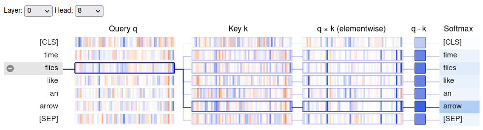
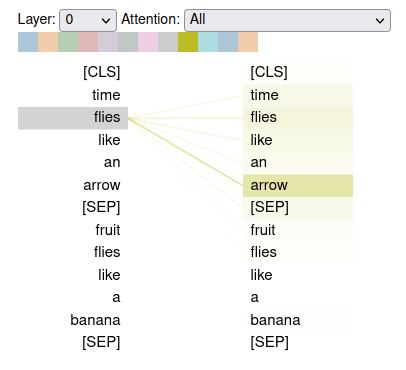

* [The Transformer Architecture](#the-transformer-architecture)
* [The Encoder](#the-encoder)
* [The Decoder](#the-decoder)
* [Meet the Transformers](#meet-the-transformers)
* [References](#references)


------

```python
import transformers
import datasets
import accelerate

# Only print error messages
transformers.logging.set_verbosity_error()
datasets.logging.set_verbosity_error()

transformers.__version__, datasets.__version__, accelerate.__version__
```
```text
    ('4.11.3', '1.16.1', '0.5.1')
```

------

```python
import ast
# https://astor.readthedocs.io/en/latest/
import astor
import inspect
import textwrap
def print_source(obj, exclude_doc=True):
    
    # Get source code
    source = inspect.getsource(obj)
    # Remove any common leading whitespace from every line
    cleaned_source = textwrap.dedent(source)
    # Parse the source into an AST node.
    parsed = ast.parse(cleaned_source)

    for node in ast.walk(parsed):
        # Skip any nodes that are not class or function definitions
        if not isinstance(node, (ast.FunctionDef, ast.ClassDef, ast.AsyncFunctionDef)):
            continue
        
        if exclude_doc and len(node.body) > 1: node.body = node.body[1:]
        
    print(astor.to_source(parsed))
```


## The Transformer Architecture

* Standard Transformers use an encoder-decoder architecture.
  * An encoder converts an input sequence of tokens into embedding vectors called the hidden state or context.
  * A decoder uses the encoder's hidden state to iteratively generate an output of tokens, one token at a time.
* The encoder-decoder architecture is well-suited to sequence-to-sequence tasks like machine translation.

### Steps:

1. Tokenize the input and convert it to token embeddings.
2. Combine the token embeddings with positional embeddings, which contain the positional information for each token.
3. Feed the updated embeddings to the encoder.
   1. The encoder is composed of a sequence of embedding layers, similar to stacking convolutional layers in computer vision.

4. Feed the encoder's output to each decoder layer.
5. The decoder predicts the most probable next token in the sequence.
6. The decoder output serves as input for the decoder to generate the next token.
7. The process repeats until the decoder predicts the End- of-Sequence (EOS) token or we reach the maximum length.

### Types of Transformer Models

#### Encoder-Only

* Convert an input sequence into a rich numerical representation.
* The numerical representation is dependent on both the contexts to the left and right of the token (i.e., bidirectional attention).
* These models are well-suited for tasks like text classification or named entity recognition.

#### Decoder-Only

* Take in a text prompt and autocomplete the sequence by iteratively predicting the most probable next word.
* The representation for a given token depends only on the left context (i.e., causal or autoregressive attention).

#### Encoder-Decoder

* Model complex mappings from one sequence to another.
* These models are well-suited for machine translation or summarization tasks.

**Note**:
* The line between applications for decoder-only versus encoder-only architectures is blurry.
  * We can prime decoder-only models for tasks like machine translation.
  * We can apply encoder-only models to summarization tasks.
      * [Text Summarization with Pretrained Encoders](https://arxiv.org/abs/1908.08345)


## The Encoder

* The encoder consists of many encoder layers stacked next to each other.
* The encoder stack updates the input embeddings to produce representations that encode some contextual information in the sequence.
* Each encoder layer receives a sequence of embeddings and feeds them through a multi-head self-attention sublayer.
* The output of the multi-head attention layer serves as input for a fully connected feed-forward sublayer. 
* We apply the fully connected feed-forward layer to each input embedding.
* Each sublayer uses skip connections and [layer normalization](https://pytorch.org/docs/stable/generated/torch.nn.LayerNorm.html?highlight=layer%20normalization).
* The output embeddings of each encoder layer have the same size as the inputs.

### Self-Attention
* Attention is a mechanism that allows neural networks to assign a different amount of weight to each element in a sequence. 
* For text sequences, the elements are token embeddings where each token maps to a vector of some fixed dimension.
  * A BERT model represents each token as a 768-dimensional vector.
* The attention mechanism associated with recurrent models involves computing the relevance of each hidden state of the encoder to the decoder's hidden state at a given decoding timestep.
* Self-attention involves computing weights for all hidden states in the same set. 
  * We use the whole sequence to compute a weighted average of each embedding.

* Given a sequence of token embeddings $x_{1},\ldots,x_{n}$, self-attention produces a sequence of new embeddings $$x^{\prime}_{1},\ldots,x^{\prime}_{n}$$ where each $$x^{\prime}_{i}$$ is a linear combination of all the $x_{j}$:
### $$x^{\prime}_{i} = \sum^{n}_{j=1}{w_{ij}x_{j}}$$
* The coefficients $w_{ij}$ are called attention weights, and we normalize them to add up to one.
* Averaging the token embeddings allows us to incorporate context from the entire sequence.

#### Scaled dot-product attention

* Scaled dot-product attention is the most common way to implement a self-attention layer.

##### Implementation Steps

1. Project each token into three vectors called "query," "key," and "value," respectively.
    * The names query, key, and value originate from information retrieval systems.
2. Determine how much the query and key vectors relate to each other by computing the dot product of the two vectors.
   * Queries and keys similar to each other will have a large dot product, while those that are not will have little to no overlap.
   * The dot products of the queries and keys are called the attention scores.
   * For a sequence with $n$ input tokens, there is a corresponding $n \times n$ matrix of attention scores.
3. Multiply the attention scores by a scaling factor to normalize their variance and then apply the softmax function to ensure all column values sum to one.
    * The resulting $n \times n$ matrix contains all the attention weights.
4. Matrix multiply the attention weights by the value vector $v_{1},\ldots,v_{n}$ to obtain an updated representation for embedding $$x^{\prime}_{i} = \sum{w_{ji}v_{j}}$$.

#### BertViz
* [GitHub Repository](https://github.com/jessevig/bertviz)
* BertViz is an interactive tool to visualize attention in Transformer language models.

**Note:** Need to add the [D3.js](https://d3js.org/) and [jQuery](https://jquery.com/) libraries to use [`bertviz`](https://github.com/jessevig/bertviz) in JupyterLab.

------


```javascript
%%javascript
require.config({
  paths: {
      d3: '//cdnjs.cloudflare.com/ajax/libs/d3/3.4.8/d3.min',
      jquery: '//ajax.googleapis.com/ajax/libs/jquery/2.0.0/jquery.min',
  }
});
```

------

```python
from transformers import AutoTokenizer
from bertviz.transformers_neuron_view import BertModel
from bertviz.neuron_view import show
```

#### neuron_view
* [Documentation](https://github.com/jessevig/bertviz#neuron-view-1)
* Trace the computation of the weights to show how the query and key vectors combine to produce the final weight.

------

```python
# Select a BERT model checkpoint
model_ckpt = "bert-base-uncased"
# Instantiate a BERT tokenizer
tokenizer = AutoTokenizer.from_pretrained(model_ckpt)
# Instantiate a pretrained pytorch model from a pre-trained model configuration
model = BertModel.from_pretrained(model_ckpt)
```

------

```python
text = "time flies like an arrow"
show(model, "bert", tokenizer, text, display_mode="light", layer=0, head=8)
```
{fig-align="center"}


**Note:** The `query` vector for "flies" has the most overlap with the `key` vector for "arrow."

#### neuron_view.show
* [Source Code](https://github.com/jessevig/bertviz/blob/24ed45268a0c616d9d7e342bf3c460e4aaac0035/bertviz/neuron_view.py#L37)

------

```python
print_source(show, False)
```
```text
    def show(model, model_type, tokenizer, sentence_a, sentence_b=None,
        display_mode='dark', layer=None, head=None):
        if sentence_b:
            vis_html = """
            <div id="bertviz" style='padding:8px'>
              <span style="user-select:none">
                <span class="dropdown-label">Layer: </span><select id="layer"></select>
                <span class="dropdown-label">Head: </span><select id="att_head"></select>
                <span class="dropdown-label">Attention: </span><select id="filter">
                  <option value="all">All</option>
                  <option value="aa">Sentence A -> Sentence A</option>
                  <option value="ab">Sentence A -> Sentence B</option>
                  <option value="ba">Sentence B -> Sentence A</option>
                  <option value="bb">Sentence B -> Sentence B</option>
                </select>
              </span>
              <div id='vis'></div>
            </div>
            """
        else:
            vis_html = """
                <div id="bertviz" style='padding:8px'>
                  <span style="user-select:none">
                    <span class="dropdown-label">Layer: </span><select id="layer"></select>
                    <span class="dropdown-label">Head: </span> <select id="att_head"></select>
                  </span>
                  <div id='vis'></div>
                </div>
             """
        display(HTML(
            '<script src="https://cdnjs.cloudflare.com/ajax/libs/require.js/2.3.6/require.min.js"></script>'
            ))
        display(HTML(vis_html))
        __location__ = os.path.realpath(os.path.join(os.getcwd(), os.path.
            dirname(__file__)))
        attn_data = get_attention(model, model_type, tokenizer, sentence_a,
            sentence_b, include_queries_and_keys=True)
        if model_type == 'gpt2':
            bidirectional = False
        else:
            bidirectional = True
        params = {'attention': attn_data, 'default_filter': 'all',
            'bidirectional': bidirectional, 'display_mode': display_mode,
            'layer': layer, 'head': head}
        vis_js = open(os.path.join(__location__, 'neuron_view.js')).read()
        display(Javascript('window.bertviz_params = %s' % json.dumps(params)))
        display(Javascript(vis_js))
```


#### neuron_view.get_attention
* [Source Code](https://github.com/jessevig/bertviz/blob/24ed45268a0c616d9d7e342bf3c460e4aaac0035/bertviz/neuron_view.py#L101)
* Compute representation of attention to pass to the d3 visualization

------

```python
from transformers import AutoTokenizer
```

```python
model_ckpt = "bert-base-uncased"
text = "time flies like an arrow"
tokenizer = AutoTokenizer.from_pretrained(model_ckpt)
```

------

```python
# Get encoded inputs as PyTorch tensors and exclude special tokens
inputs = tokenizer(text, return_tensors="pt", add_special_tokens=False)
inputs.input_ids
```
```text
    tensor([[ 2051, 10029,  2066,  2019,  8612]])
```

------

```python
from transformers import AutoConfig
```

**Note:** 
* Every checkpoint in Hugging Face Transformers is assigned a configuration file, which specifies various hyperparameters.
* The AutoConfig class also stores metadata such as label names.

#### BertConfig
* [Documentation](https://huggingface.co/docs/transformers/main/en/model_doc/bert#transformers.BertConfig)
* This is the configuration class to store the configuration of a BERT model.

------

```python
config = AutoConfig.from_pretrained(model_ckpt)
config
```
```text
    BertConfig {
      "architectures": [
        "BertForMaskedLM"
      ],
      "attention_probs_dropout_prob": 0.1,
      "classifier_dropout": null,
      "gradient_checkpointing": false,
      "hidden_act": "gelu",
      "hidden_dropout_prob": 0.1,
      "hidden_size": 768,
      "initializer_range": 0.02,
      "intermediate_size": 3072,
      "layer_norm_eps": 1e-12,
      "max_position_embeddings": 512,
      "model_type": "bert",
      "num_attention_heads": 12,
      "num_hidden_layers": 12,
      "pad_token_id": 0,
      "position_embedding_type": "absolute",
      "transformers_version": "4.11.3",
      "type_vocab_size": 2,
      "use_cache": true,
      "vocab_size": 30522
    }

```

------

```python
from torch import nn
```

#### nn.Embedding
* [Documentation](https://pytorch.org/docs/stable/generated/torch.nn.Embedding.html)
* Create a simple lookup table that stores embeddings of a fixed dictionary size.

------

```python
# Initialize dense embeddings where each entry contains a nonzero value
token_emb = nn.Embedding(config.vocab_size, config.hidden_size)
token_emb
```
```text
    Embedding(30522, 768)

```

**Note:**
* The embeddings at this point are independent of their context.
    * Words that are spelled the same but have different meanings have indistinguishable representations.
* The subsequent attention layers provide the missing context.

------


```python
# Generate embeddings for the input sequence
inputs_embeds = token_emb(inputs.input_ids)
inputs_embeds.size()
```
```text
    torch.Size([1, 5, 768])
```

------

```python
import torch
from math import sqrt 
```

#### torch.bmm
* [Documentation](https://pytorch.org/docs/stable/generated/torch.bmm.html?highlight=torch%20bmm#torch.bmm)
* Perform a batched matrix multiplication.

------

```python
# Step 1: Initialize the query, key, and value vectors using the input embeddings
query = key = value = inputs_embeds
dim_k = key.size(-1)
# Step 2: Calculate the dot product of the query and key vectors
# Step 3.1: and scale the result using the size of the embedding vectors
scores = torch.bmm(query, key.transpose(1,2)) / sqrt(dim_k)
scores.size()
```
```text
    torch.Size([1, 5, 5])
```


**Note:** 
* We now have a $5x5$ matrix of attention scores per sample in the batch.
* We ordinarily generate the query, key, and value vectors by applying independent weight matrices $W_{Q,K,V}$ to the embeddings.

------

```python
import torch.nn.functional as F
```


#### functional.softmax

* [Documentation](https://pytorch.org/docs/stable/generated/torch.nn.functional.softmax.html#torch.nn.functional.softmax)
* Apply the softmax function to a tensor.

------

```python
# Step 3.2: Apply the softmax function to the scaled dot product
weights = F.softmax(scores, dim=-1)
weights.sum(dim=-1)
```
```text
    tensor([[1., 1., 1., 1., 1.]], grad_fn=<SumBackward1>)
```

------

```python
weights[0][0]
```
```text
    tensor([1.0000e+00, 5.1735e-12, 3.7513e-13, 2.1163e-12, 9.7180e-13],
           grad_fn=<SelectBackward0>)
```

------

```python
# Step 4: Matrix multiply the attention weights by the value vector
attn_outputs = torch.bmm(weights, value)
attn_outputs.shape
```
```text
    torch.Size([1, 5, 768])
```

------

```python
def scaled_dot_product_attention(query, key, value):
    """
    Refactor all four steps to compute self-attention into a single function
    
    1. Compute the dot product of the query and key vectors.
    2. Scale the dot product using the square root of the embedding size
    3. Apply the softmax function.
    4. Matrix multiply the attention weights by the value vector.
    """
    dim_k = query.size(-1)
    scores = torch.bmm(query, key.transpose(1, 2)) / sqrt(dim_k)
    weights = F.softmax(scores, dim=-1)
    return torch.bmm(weights, value)
```

**Note:**
* The attention mechanism will assign a high score to identical words when the "query" and "key" vectors are equal.
* In practice, complementary words in the context better inform the meaning of a word than identical words.
* The self-attention layer typically applies three independent linear transformations to each embedding to generate the query, key, and value vectors rather than using the same vector for each.

#### Multi-headed attention
* The softmax of one attention head tends to focus on one aspect of similarity.
* Having several heads allows the model to focus on several aspects at once.
* The model learns what aspects of similarity to focus on from the data, similar to the convolutional filters in computer vision models.

------


```python
class AttentionHead(nn.Module):
    """
    A single self-attention head that produces tensors of shape [batch_size, seq_len, head_dim]
    
    Args:
        embed_dim: the number of embedding dimensions of the tokens
        head_dim: the number of dimensions we are projecting into
    """
    def __init__(self, embed_dim, head_dim):
        super().__init__()
        self.q = nn.Linear(embed_dim, head_dim)
        self.k = nn.Linear(embed_dim, head_dim)
        self.v = nn.Linear(embed_dim, head_dim)

    def forward(self, hidden_state):
        attn_outputs = scaled_dot_product_attention(
            self.q(hidden_state), self.k(hidden_state), self.v(hidden_state))
        return attn_outputs
```

**Note:** It is common practice to use a multiple of `embed_dim` for `head_dim` so that the computation across each head is constant.

#### torch.nn.ModuleList
* [Documentation](https://pytorch.org/docs/stable/generated/torch.nn.ModuleList.html?highlight=modulelist#torch.nn.ModuleList)
* Store properly registered Modules in an indexable list.

------

```python
class MultiHeadAttention(nn.Module):
    """
    A multi-head attention layer that concatenates the output of each attention head
    """
    def __init__(self, config):
        super().__init__()
        embed_dim = config.hidden_size
        num_heads = config.num_attention_heads
        head_dim = embed_dim // num_heads
        self.heads = nn.ModuleList(
            [AttentionHead(embed_dim, head_dim) for _ in range(num_heads)]
        )
        self.output_linear = nn.Linear(embed_dim, embed_dim)

    def forward(self, hidden_state):
        # Concatenate the output of each attention head
        x = torch.cat([h(hidden_state) for h in self.heads], dim=-1)
        # Pass the concatenated output through a linear layer to
        # produce a tensor of shape [batch_size, seq_len, hidden_dim]
        x = self.output_linear(x)
        return x
```

------

```python
# Initialize a multi-head attention layer using the BertConfig
multihead_attn = MultiHeadAttention(config)
# Pass the input embeddings through the attention layer
attn_output = multihead_attn(inputs_embeds)    
attn_output.size() 
```
```text
    torch.Size([1, 5, 768])
```

------

```python
from bertviz import head_view
from transformers import AutoModel
```

#### head_view
* [Documentation](https://github.com/jessevig/bertviz#head-and-model-views)

------

```python
# Initialize a BERT model using the pretrained model checkpoint
model = AutoModel.from_pretrained(model_ckpt, output_attentions=True)
```

------

```python
sentence_a = "time flies like an arrow"
sentence_b = "fruit flies like a banana"
# Tokenize the input sentences
viz_inputs = tokenizer(sentence_a, sentence_b, return_tensors='pt')
```

------

```python
for k,v in viz_inputs.items(): print(f"{k}: {v}")
```
```text
    input_ids: tensor([[  101,  2051, 10029,  2066,  2019,  8612,   102,  5909, 10029,  2066,
              1037, 15212,   102]])
    token_type_ids: tensor([[0, 0, 0, 0, 0, 0, 0, 1, 1, 1, 1, 1, 1]])
    attention_mask: tensor([[1, 1, 1, 1, 1, 1, 1, 1, 1, 1, 1, 1, 1]])
```

------

```python
viz_inputs.input_ids.shape
```
```text
    torch.Size([1, 13])
```

------

```python
attention = model(**viz_inputs).attentions
len(attention), attention[0].shape
```
```text
    (12, torch.Size([1, 12, 13, 13]))
```

**Note:** BERT has 12 attention heads.


```python
sentence_b_start = (viz_inputs.token_type_ids == 0).sum(dim=1)
sentence_b_start
```
```text
    tensor([7])
```

------

```python
tokens = tokenizer.convert_ids_to_tokens(viz_inputs.input_ids[0])
tokens
```
```text
    ['[CLS]',
     'time',
     'flies',
     'like',
     'an',
     'arrow',
     '[SEP]',
     'fruit',
     'flies',
     'like',
     'a',
     'banana',
     '[SEP]']
```

------

```python
head_view(attention, tokens, sentence_b_start, heads=[8])
```
{fig-align="center"}


**Note:** 

* The attention weights are highest between words in the same sentence.
* The attention weights allow the model to distinguish the use of "flies" as a verb or a noun.

### The Feed-Forward Layer
* The feed-forward sublayer contains two linear layers and processes each embedding independently.
* A rule of thumb is to have the hidden size of the first layer be four times the size of the embeddings.
* The feed-forward layer typically uses the [Gaussian Error Linear Units (GELU)](https://pytorch.org/docs/stable/generated/torch.nn.GELU.html?highlight=gelu) activation function.
    * The GELU function weights inputs by their value, whereas the ReLU function gates inputs by their sign.
* The predominant theory is most of the capacity and memorization happens in the feed-forward layer.
    * Most choose to scale the feed-forward layer when scaling a model.

------

```python
config.hidden_size, config.intermediate_size
```
```text
    (768, 3072)
```

------

```python
config.hidden_size*4
```
```text
    3072
```

------

```python
class FeedForward(nn.Module):
    """
    A simple two-layer fully-connected network that processes each embedding independently
    """
    def __init__(self, config):
        super().__init__()
        self.linear_1 = nn.Linear(config.hidden_size, config.intermediate_size)
        self.linear_2 = nn.Linear(config.intermediate_size, config.hidden_size)
        self.gelu = nn.GELU()
        self.dropout = nn.Dropout(config.hidden_dropout_prob)
        
    def forward(self, x):
        x = self.linear_1(x)
        x = self.gelu(x)
        x = self.linear_2(x)
        x = self.dropout(x)
        return x
```

------

```python
feed_forward = FeedForward(config)
ff_outputs = feed_forward(attn_outputs)
ff_outputs.size()
```
```text
    torch.Size([1, 5, 768])
```


### Adding Layer Normalization
* [Layer Normalization Paper](https://arxiv.org/abs/1607.06450)
* Layer normalization normalizes each input in the batch to have zero mean and a variance of one.
* Skip connections pass a tensor to the next layer of the model without processing and add it to the processed tensor.
* The original Transformer paper uses post-layer normalization, which performs normalization between skip connections.
    * Post-layer normalization typically requires gradually increasing the learning rate during training to prevent the gradients from diverging.
* The most common approach is to use pre-layer normalization, which performs normalization within the span of skip connections.
    * Training is typically more stable with pre-layer normalization.

#### nn.LayerNorm
* [Documentation](https://pytorch.org/docs/stable/generated/torch.nn.LayerNorm.html?highlight=layer%20normalization)
* Apply Layer Normalization over a mini-batch of inputs

------

```python
inputs_embeds[0][0][0], inputs_embeds.shape
```
```text
    (tensor(0.0497, grad_fn=<SelectBackward0>), torch.Size([1, 5, 768]))
```

------

```python
layer_norm = nn.LayerNorm(config.hidden_size)
# Activate module
layer_norm_embeds = layer_norm(inputs_embeds)
layer_norm_embeds[0][0][0], layer_norm_embeds.shape
```
```text
    (tensor(0.0352, grad_fn=<SelectBackward0>), torch.Size([1, 5, 768]))
```

------

```python
class TransformerEncoderLayer(nn.Module):
    """
    A complete encoder layer that performs pre-layer normalization
    """
    def __init__(self, config):
        super().__init__()
        self.layer_norm_1 = nn.LayerNorm(config.hidden_size)
        self.layer_norm_2 = nn.LayerNorm(config.hidden_size)
        self.attention = MultiHeadAttention(config)
        self.feed_forward = FeedForward(config)

    def forward(self, x):
        # Apply layer normalization and then copy input into query, key, value
        hidden_state = self.layer_norm_1(x)
        # Apply attention with a skip connection
        x = x + self.attention(hidden_state)
        # Apply feed-forward layer with a skip connection
        x = x + self.feed_forward(self.layer_norm_2(x))
        return x
```

------

```python
encoder_layer = TransformerEncoderLayer(config)
inputs_embeds.shape, encoder_layer(inputs_embeds).size()
```
```text
    (torch.Size([1, 5, 768]), torch.Size([1, 5, 768]))
```


### Positional Embeddings
* Augment the token embeddings with a positional-dependent pattern of values arranged in a vector.
* The attention heads and feed-forward layers in each stack learn to incorporate positional information when the pattern is characteristic for each position.

#### Learnable Position Embeddings
* A popular approach involves learning a pattern during pretraining.
* This approach works the same as the token embeddings but uses the position index as input.
* Learnable position embeddings work best when there is a large amount of pretraining data.

#### Absolute Position Representations
* Use static patterns consisting of modulated sine and cosine signals to encode the positions of tokens.
* This approach works well when we don't have access to a large dataset.

#### Relative Positional Encoding
* Encode the relative positions between tokens.
* Relative Positional Encoding requires modifying the attention mechanism with additional terms that account for the relative position between tokens.

#### Rotary Position Embeddings
* Combine the idea of absolute and relative positional representations.
* Rotary position embeddings achieve excellent results on many tasks.

------

```python
class Embeddings(nn.Module):
    """
    A custom embedding layer that combines a token embedding layer that projects the `input_ids` 
    to a dense hidden state with the positional embedding that does the same for `position_ids`
    """
    def __init__(self, config):
        super().__init__()
        self.token_embeddings = nn.Embedding(config.vocab_size, 
                                             config.hidden_size)
        self.position_embeddings = nn.Embedding(config.max_position_embeddings,
                                                config.hidden_size)
        self.layer_norm = nn.LayerNorm(config.hidden_size, eps=1e-12)
        self.dropout = nn.Dropout()

    def forward(self, input_ids):
        # Create position IDs for input sequence
        seq_length = input_ids.size(1)
        position_ids = torch.arange(seq_length, dtype=torch.long).unsqueeze(0)
        # Create token and position embeddings
        token_embeddings = self.token_embeddings(input_ids)
        position_embeddings = self.position_embeddings(position_ids)
        # Combine token and position embeddings
        embeddings = token_embeddings + position_embeddings
        embeddings = self.layer_norm(embeddings)
        embeddings = self.dropout(embeddings)
        return embeddings
```

**Note:** The embedding layer creates a single dense embedding for each token.


```python
config.max_position_embeddings
```
```text
    512
```


```python
inputs.input_ids.size()
```
```text
    torch.Size([1, 5])
```


```python
torch.arange(5, dtype=torch.long).unsqueeze(0)
```
```text
    tensor([[0, 1, 2, 3, 4]])
```

------

```python
embedding_layer = Embeddings(config)
embedding_layer(inputs.input_ids).size()
```
```text
    torch.Size([1, 5, 768])
```

------

```python
class TransformerEncoder(nn.Module):
    """
    A full encoder
    """
    def __init__(self, config):
        super().__init__()
        self.embeddings = Embeddings(config)
        self.layers = nn.ModuleList([TransformerEncoderLayer(config) 
                                     for _ in range(config.num_hidden_layers)])

    def forward(self, x):
        # Incorporate positional information
        x = self.embeddings(x)
        for layer in self.layers: x = layer(x)
        return x
```

------

```python
encoder = TransformerEncoder(config)
encoder(inputs.input_ids).size()
```
```text
    torch.Size([1, 5, 768])
```


### Adding a Classification Head
* Transformer models typically consist of a task-independent body and a task-dependent head.
* We can attach a dropout and linear layer to the pretrained body to make a classification prediction.

------

```python
class TransformerForSequenceClassification(nn.Module):
    """
    A classification head that extends and existing encoder for sequence classification
    """
    def __init__(self, config):
        super().__init__()
        self.encoder = TransformerEncoder(config)
        self.dropout = nn.Dropout(config.hidden_dropout_prob)
        self.classifier = nn.Linear(config.hidden_size, config.num_labels)
        
    def forward(self, x):
        x = self.encoder(x)[:, 0, :] # select hidden state of [CLS] token
        x = self.dropout(x)
        x = self.classifier(x)
        return x
```

------

```python
config.num_labels = 3
encoder_classifier = TransformerForSequenceClassification(config)
encoder_classifier(inputs.input_ids).size()
```
```text
    torch.Size([1, 3])
```

------

```python
encoder_classifier(inputs.input_ids)
```
```text
    tensor([[ 0.8427, -0.7799, -0.4482]], grad_fn=<AddmmBackward0>)
```

**Note:** For each example in the batch, we get the unnormalized logits for each class in the output.


## The Decoder

* The main difference between the encoder and decoder is that the decoder has two attention sublayers.

### minGPT
* [GitHub Repository](https://github.com/karpathy/minGPT)
* A minimal PyTorch re-implementation of the OpenAI GPT (Generative Pretrained Transformer) training 

### Masked Multi-Head Self-Attention Layer
* The Masked Multi-Head Attention Layer ensures the tokens generated at each timestep depend only on the past outputs and the current token by masking the inputs.
* The goal is to prevent the decoder from cheating during training by copying the target translation.
* Use a mask matrix with ones on the lower diagonal and zeros above.

### Encoder-Decoder Attention Layer
* The Encoder-Decoder Attention Layer performs multi-head attention using the encoder stack's output "key" and "value" vectors.
* The intermediate representations from the decoder serve as the "query" vectors.
* The encoder-decoder attention layer learns to relate tokens from two different sequences.
* The decoder has access to the encoder keys and values in each block.

#### torch.tril
* [Documentation](https://pytorch.org/docs/stable/generated/torch.tril.html?highlight=torch%20tril#torch.tril)
* Get the lower triangular part of the matrix or batch of matrices


```python
seq_len = inputs.input_ids.size(-1)
mask = torch.tril(torch.ones(seq_len, seq_len)).unsqueeze(0)
mask[0]
```
```text
    tensor([[1., 0., 0., 0., 0.],
            [1., 1., 0., 0., 0.],
            [1., 1., 1., 0., 0.],
            [1., 1., 1., 1., 0.],
            [1., 1., 1., 1., 1.]])
```

------

```python
# Replace the values above the diagonal with negative infinity
scores.masked_fill(mask == 0, -float("inf"))
```
```text
    tensor([[[27.0041,    -inf,    -inf,    -inf,    -inf],
             [ 1.0166, 25.6633,    -inf,    -inf,    -inf],
             [-1.6074, -0.4446, 28.2530,    -inf,    -inf],
             [ 0.1228, -1.1218, -1.4012, 26.3671,    -inf],
             [-0.6555, -1.0425,  0.4620, -1.5529, 27.0796]]],
           grad_fn=<MaskedFillBackward0>)
```

**Note:** Setting the upper values to negative infinity guarantees the attention weights are all zero after applying softmax.

------

```python
def scaled_dot_product_attention(query, key, value, mask=None):
    """
    Compute self-attention and apply a mask to the atttention scores
    """
    dim_k = query.size(-1)
    scores = torch.bmm(query, key.transpose(1, 2)) / sqrt(dim_k)
    if mask is not None:
        scores = scores.masked_fill(mask == 0, float("-inf"))
    weights = F.softmax(scores, dim=-1)
    return weights.bmm(value)
```


## Meet the Transformers

### The Encoder Branch
* Encoder-only models still dominate research and industry on NLU tasks such as text classification, named entity recognition, and question answering.

#### [BERT](https://arxiv.org/abs/1810.04805)
* BERT was the first encoder-only Transformer model and outperformed all state-of-the-art models on the [GLUE benchmark](https://arxiv.org/abs/1804.07461).
    * The GLUE Benchmark measures natural language understanding (NLU) across several tasks of varying difficulty.
* BERT is pretrained to predict masked tokens in a piece of text (Masked Language Modeling) and determine if one text passage likely follows another (Next Sentence Prediction).

#### [DistilBERT](https://arxiv.org/abs/1910.01108)
* DistilBERT uses knowledge distillation during pretraining to achieve 97% of BERT's performance while using 40% less memory and is 60% faster. 

#### [RoBERTa](https://arxiv.org/abs/1907.11692)
* RoBERTa trains for longer on larger batches with more training data than BERT and drops the Next Sentence Prediction task.
* RoBERTa achieves significantly higher performance compared to BERT.

#### [XLM: Cross-lingual Language Model](https://arxiv.org/abs/1901.07291)
* The XLM paper explores the effectiveness of cross-lingual model pretraining.
* The authors introduced Translation Language Modeling (TLM), which extends Masked Language Modeling to multiple languages.
* The authors achieved state-of-the-art results on several multilingual NLU benchmarks and translation tasks.

#### [XLM-RoBERTa](https://arxiv.org/abs/1911.02116)
* XLM-Roberta massively upscales the amount of training data used for multilingual pretraining.
* The developers created a dataset with 2.5 terabytes of text and pretrained an encoder with Masked Language Modeling.

#### [ALBERT](https://arxiv.org/abs/1909.11942)
* Alberta decouples the token embedding and hidden dimensions to decrease parameter count.
* All layers share the same parameters, decreasing the "effective" number of parameters even further.
* A Sentence Ordering Prediction (SOP) objective replaces the Next Sentence Prediction objective.
* With Sentence Ordering Prediction, the model predicts whether two consecutive sentences are out of order.
* These changes make it possible to train larger models with fewer parameters and achieve superior performance on NLU tasks.

#### [ELECTRA](https://arxiv.org/abs/2003.10555)
* Standard MLM pretraining only updates the representations of the masked tokens.
* ELECTRA uses a two-model approach to address this limitation.
    * The first model predicts masked tokens.
    * The second model, called the discriminator, distinguishes between original tokens and predicted tokens in the first model's output.
        * The discriminator makes a binary classification for every token, making training 30 times more efficient.
        * We fine-tune the discriminator for downstream tasks.

#### [DeBERTa](https://arxiv.org/abs/2006.03654)
* DeBERTa represents each token using a vector for the content and a vector for relative position.
    * Disentangling the tokens' content from their relative positions helps the self-attention layers better model the dependency of nearby token pairs.
* DeBERTa adds an absolute position embedding just before the softmax layer of the token decoding head.
* DeBERTa was the first model (as an ensemble) to beat the human baseline on the [SuperGLUE](https://arxiv.org/abs/1905.00537) benchmark.

### The Decoder Branch
* Decoder models are exceptionally good at predicting the next word in a sequence.
* Most of the progress for decoder models comes from training with larger datasets and scaling the language models to larger sizes.

#### [GPT: Generative Pretrained Transformer](https://openai.com/blog/language-unsupervised/)
* GPT combined the transformer decoder architecture and transfer learning.
* The training process involves predicting the next word based on the previous ones.
* The model also achieved impressive results on downstream tasks such as classification. 

#### [GPT-2](https://openai.com/blog/better-language-models/)
* GPT-2 upscales the original GPT model and training set.
* The model can produce longer sequences of coherent text.

#### [CTRL: Conditional Transformer Language](https://arxiv.org/abs/1909.05858)
* CTRL adds "control tokens" at the beginning of a sequence to control the style of the generated text.

#### [GPT-3](https://arxiv.org/abs/2005.14165)
* [Scaling Laws for Neural Language Models](https://arxiv.org/abs/2001.08361)
    * There are simple power laws that govern the relationship between compute, dataset size, model size, and the performance of a language model.
* GPT-3 upscales GPT-2 to 175 billion parameters.
* The model can generate impressively realistic text passages and exhibits few-shot learning capabilities.

#### [GPT-Neo](https://zenodo.org/record/5297715)/[GPT-J-6B](https://github.com/kingoflolz/mesh-transformer-jax)
* These are GPT-like models trained by [EleutherAI](https://www.eleuther.ai/), a collective of researchers who aim to recreate and release GPT-3 scale models.
* The current models come in 1.3, 2.7, and 6 billion variants and are competitive with the smaller GPT-3 models offered by OpenAI.

### The Encoder-Decoder Branch

#### [T5](https://arxiv.org/abs/1910.10683)
* The T5 model frames all Natural Language Understanding and Generation tasks as sequence-to-sequence tasks.
* The model handles text classification problems by feeding the text to the encoder and generating a label as plain text instead of a class id.
* The T5 architecture uses the original Transformer architecture.
* The model trains on the C4 dataset using masked language modeling and the SuperGLUE tasks. 

#### [BART](https://arxiv.org/abs/1910.13461)
* BART combines the pretraining procedures of BERT and GPT within the encoder-decoder architecture.
* The input sequences undergo one of several possible transformations, including simple masking, sentence permutation, token deletion, and document rotation.
* The modified inputs pass through the encoder, and the decoder reconstructs the original texts.

#### [M2M-100](https://arxiv.org/abs/2010.11125)
* M2M-100 is the first model able to translate between 100 languages. 
    * This capability enables high-quality translation between rare and underrepresented languages.
* The model uses prefix tokens to indicate the source and target language.


#### [BigBird](https://arxiv.org/abs/2007.14062)
* BigBird uses a sparse form of attention that scales linearly to avoid the quadratic memory requirements of standard attention mechanisms.
* BigBird has a maximum context size of 4092 compared to the context size of 512 in most BERT models.


## References

* [Natural Language Processing with Transformers Book](https://transformersbook.com/)
* [The Transformers book GitHub Repository](https://github.com/nlp-with-transformers/notebooks)


**Previous:** [Notes on Transformers Book Ch. 2](../chapter-2/)

**Next:** [Notes on Transformers Book Ch. 4](../chapter-4/)


<!-- Cloudflare Web Analytics --><script defer src='https://static.cloudflareinsights.com/beacon.min.js' data-cf-beacon='{"token": "56b8d2f624604c4891327b3c0d9f6703"}'></script><!-- End Cloudflare Web Analytics -->